**Level:** Intermediate · **Track:** Foundations · **Read time:** 150 min

This is Chapter 1 of the Active Directory series — Notebook 4. The Windows Internals
notebook took you through a single machine: its processes, its authentication, its
logs. Active Directory is what happens when you connect thousands of those machines
and tens of thousands of users into one managed, centrally-controlled identity
system. Almost every corporate network on earth runs on it, which is exactly why
almost every real-world intrusion, red-team engagement, and CTF "Windows box"
eventually becomes an Active Directory problem.

This chapter builds the map. Before you can attack or defend AD — before
Kerberoasting, DCSync, delegation abuse, or BloodHound mean anything — you need a
rock-solid mental model of what a domain is, how domains nest into trees and
forests, what an Organizational Unit really does, and where the actual security
boundaries lie. Get this wrong and every later technique is memorized noise. Get it
right and the attack paths almost draw themselves.

---

## Who This Chapter Is For (and the Map Ahead)

You need the earlier Windows chapters: authentication (SAM, NTLM, Kerberos — Chapter
3 of the Windows notebook), the registry and processes, and a basic grip on DNS and
networking from the Networking notebook. You do **not** need any prior AD
experience. We start from "why does centralized identity exist at all," build the
object model (users, groups, computers, OUs), stack domains into trees and forests,
explain trusts, separate the *logical* structure from the *physical* structure
(sites, DCs, replication), and finish by locating the true security boundary — a
point that trips up even experienced engineers.

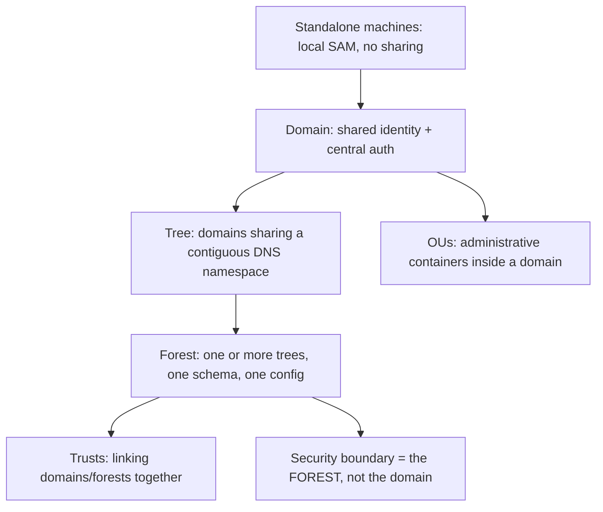

Hold onto that last node. "The forest is the security boundary" is the single most
important sentence in this chapter, and we will earn it by the end.

---

## Part 1: The Problem Active Directory Solves

Picture a company with 5,000 employees and 6,000 Windows machines and no directory
service. Every machine has its own **local account database** — the SAM hive you met
in the Windows notebook. To let Alice log into any of those 6,000 machines, you
would have to create an "Alice" account, with a password, on every single one.
Change her password? 6,000 changes. Disable her when she leaves? 6,000 deletions,
and if you miss one, that's a live credential on a forgotten box. Grant her access
to a shared folder on 40 servers? 40 separate permission entries referencing 40
separate local accounts that all happen to be named Alice but are cryptographically
unrelated (different SIDs).

This does not scale. It is unmanageable, and it is insecure — the sprawl *is* the
attack surface.

**Active Directory** is Microsoft's answer: a centralized, replicated,
network-accessible **directory service** that stores identities (users, groups,
computers) and the policies attached to them *once*, in a database that every
machine in the domain consults for authentication and authorization. Alice exists
**one time**, as one object with one SID. Every domain-joined machine trusts the
domain to vouch for her. Password change, disable, group membership, access grants —
all done once, centrally, and replicated everywhere within minutes.

A directory service, formally, is a hierarchical database optimized for **reads**
(you look things up far more than you change them), designed to be **distributed and
replicated** across many servers, and queried over a standard protocol — **LDAP**
(Lightweight Directory Access Protocol), which the next chapter covers in depth. AD
is Microsoft's implementation of that idea, layered with **Kerberos** and **NTLM**
for authentication, **DNS** for locating services, and **Group Policy** for pushing
configuration.

**Security relevance from the first paragraph:** centralization is a double-edged
sword. It replaces 6,000 scattered problems with one system — but that one system
now holds the keys to *everything*. Compromise the domain's central authority (a
Domain Controller, covered in Chapter 2) and you don't own one machine, you own all
of them. This is why AD is the crown jewel of virtually every enterprise attack, and
why "we got Domain Admin" is the phrase that ends most internal penetration tests.

---

## Part 2: Objects, Attributes, and the Schema

Everything in Active Directory is an **object**, and every object is an instance of
a **class** defined by the **schema**. This object model is the vocabulary for
everything that follows, so we build it carefully.

An **object** is a named collection of **attributes**. A user object, for example,
has attributes like `sAMAccountName` (the classic pre-Windows-2000 logon name, e.g.
`alice`), `userPrincipalName` (the modern `alice@corp.local` form), `objectSid` (the
security identifier), `objectGUID` (a globally unique, never-reused identifier),
`memberOf` (groups it belongs to), `pwdLastSet`, `servicePrincipalName`, and dozens
more.

The common object classes you will meet constantly:

| Object class | What it represents | Key attributes you will use |
|---|---|---|
| **User** | A person's identity | `sAMAccountName`, `userPrincipalName`, `objectSid`, `memberOf`, `servicePrincipalName`, `userAccountControl` |
| **Computer** | A domain-joined machine (a special kind of user!) | `dNSHostName`, `objectSid`, `servicePrincipalName`, `operatingSystem` |
| **Group** | A collection of security principals | `member`, `memberOf`, `groupType`, `objectSid` |
| **Organizational Unit (OU)** | A container for organizing/managing objects | `gPLink` (linked GPOs), `name` |
| **Group Policy Object (GPO)** | A policy container | `gPCFileSysPath`, `versionNumber` |
| **Domain / domainDNS** | The domain root object | `objectSid`, `ms-DS-MachineAccountQuota` |

The **schema** is the master blueprint: it defines every class that can exist and
every attribute a class can have. It is itself stored in AD (in the Schema partition
— more in Chapter 2) and is **forest-wide**: there is exactly one schema per forest,
shared by every domain in it. Extending the schema (as Exchange or Microsoft Entra
Connect do) is a serious, one-way-ish operation precisely because it affects the
entire forest.

Two attributes deserve special emphasis because they anchor security:

- **`objectSid`** — the Security Identifier. This is what ACLs actually reference (you met SIDs and ACLs in the Windows notebook). A SID looks like `S-1-5-21-<domain identifier>-<RID>`. The `S-1-5-21-...` prefix identifies the *domain*; the final number, the **RID** (Relative Identifier), identifies the object within it. Well-known RIDs matter enormously: **RID 500** is the built-in Administrator, **512** is Domain Admins, **513** is Domain Users, **519** is Enterprise Admins. `whoami /user` on a domain machine shows you exactly this structure.
- **`userAccountControl` (UAC)** — a bit-field of account flags. Bits here encode "account disabled," "password never expires," "this account is trusted for delegation," and — critically for attackers — **"do not require Kerberos pre-authentication"** (which enables AS-REP Roasting) and **"trusted for delegation"** (which enables delegation abuse). A single integer attribute holds several of the most abused misconfigurations in all of AD.

**Red team usage:** almost all AD enumeration is "read attributes off objects over
LDAP." Tools like BloodHound, PowerView, and `ldapsearch` are, underneath, just
querying these attributes at scale and computing relationships. When you understand
that a "user" is just an object with `servicePrincipalName` set, you understand
instantly why "any user with an SPN is Kerberoastable" — the SPN is right there in
the object.

---

## Part 3: The Domain — the Fundamental Unit

A **domain** is the core building block: a boundary of **administration and
replication** containing a set of objects (users, computers, groups, OUs) that share
a common **directory database**, a common **security policy**, and a common
**authentication authority**. Every object in a domain shares the same domain SID
prefix.

A domain is identified by a **DNS name** — `corp.local`, `contoso.com`,
`ad.example.org`. This is not cosmetic: AD is utterly dependent on DNS to function
(Chapter 2 covers exactly how). The domain also has an older, flat **NetBIOS name**
(e.g. `CORP`) used in the `DOMAIN\username` logon format and in NTLM.

What the domain gives you:

- **A single authentication authority.** Domain Controllers (DCs) hold the domain database (`NTDS.dit`) and answer authentication requests. Any domain-joined machine forwards "is this really Alice?" to a DC via Kerberos or NTLM, rather than checking its own local SAM.
- **A replication boundary.** All DCs *for that domain* hold a full, replicated copy of that domain's objects. Change Alice's password on one DC and it replicates to the others.
- **A policy boundary for domain-wide settings** like password complexity, account lockout, and Kerberos ticket lifetimes (the Default Domain Policy).

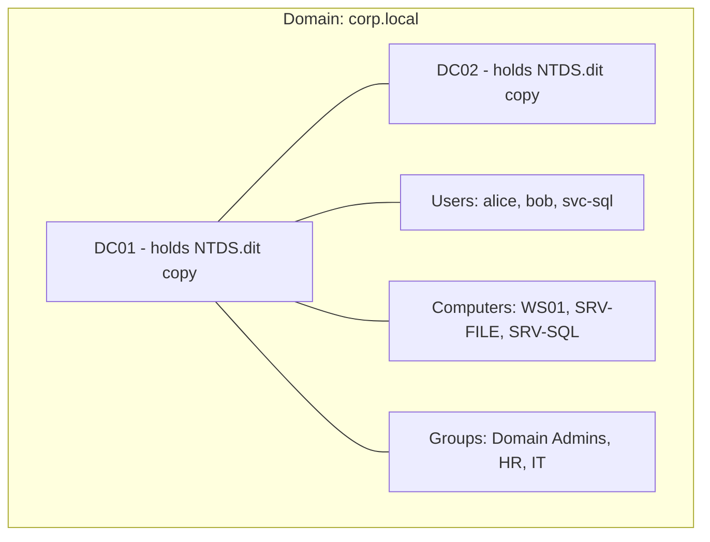

A common misconception is that a domain is a security *boundary*. It is a boundary
of *administration and replication*, but — as Part 8 will show — the **forest**, not
the domain, is the true security boundary. Hold that thought.

**Blue team usage:** the domain is the unit at which you set baseline identity
hygiene — password policy, Kerberos policy, the membership of Domain Admins. It is
also the blast radius of a single DC compromise: own one DC and you own the whole
domain, because every DC holds every secret in `NTDS.dit`, including the hashes of
every user (which is what the DCSync and `secretsdump` techniques extract).

---

## Part 4: Trees — Domains in a Contiguous Namespace

Sometimes one domain is not enough. A multinational might want `corp.local` for
headquarters and separate child domains `emea.corp.local` and `apac.corp.local` for
regional autonomy — different admins, different replication scope, but still one
connected organization. When domains share a **contiguous DNS namespace** like this,
they form a **tree**.

A **tree** is one or more domains connected in a parent-child hierarchy that share a
contiguous namespace. `corp.local` is the tree root; `emea.corp.local` and
`apac.corp.local` are child domains. The names *chain*: the child's DNS name is the
parent's name with a label prepended. That contiguity is the definition of a tree.

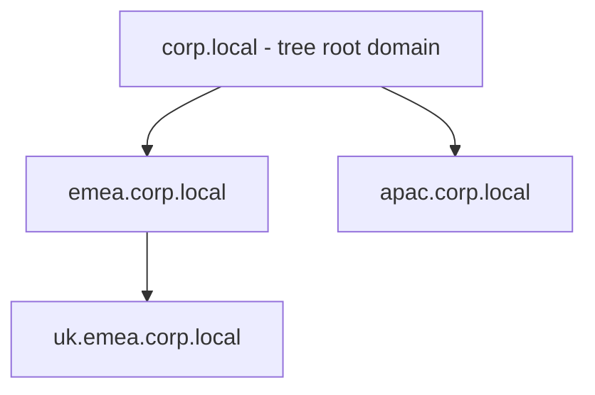

Crucially, when a child domain is created, AD automatically establishes a **two-way
transitive trust** between parent and child (Part 7). That means a user in
`emea.corp.local` can — subject to permissions — be granted access to resources in
`apac.corp.local` without any manual trust setup, because both trust the common
parent and trust is transitive up and down the tree.

**Why an attacker cares:** child domains are often created for "administrative
separation," and organizations wrongly believe that compromising a child domain
keeps the parent safe. It does not, in the default configuration. Because the trust
is transitive and both share a forest, a well-known privilege-escalation path (SID
History / the "SID filtering is off within a forest" property, plus the `krbtgt` of
the child) lets an attacker who owns a child domain forge tickets to reach
**Enterprise Admins** in the root. Trees look like separation; within a forest they
are not a security boundary.

---

## Part 5: The Forest — the Top of the Hierarchy

A **forest** is the largest AD container: one or more trees that share a single
**schema**, a single **configuration partition**, and a single **global catalog**,
all linked by automatic two-way transitive trusts. The first domain you ever create
in a new AD deployment becomes the **forest root domain**, and it is special — it
hosts the two most powerful groups in the entire environment, **Enterprise Admins**
and **Schema Admins**.

The forest is defined by three shared things:

1. **One schema.** Every domain in the forest uses the exact same object/attribute definitions. You cannot have two different schemas in one forest.
2. **One configuration partition.** Forest-wide topology — sites, subnets, replication links, which DCs exist — is stored once and replicated to every DC in the forest.
3. **One global catalog.** A partial, forest-wide index (Chapter 2) that lets any user search for any object anywhere in the forest.

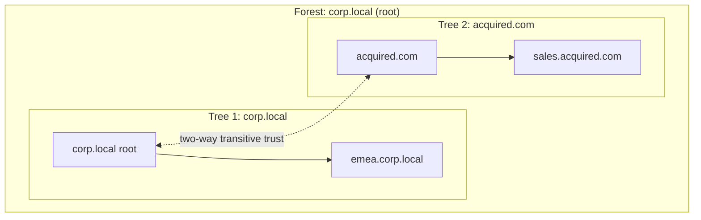

Notice Tree 2 (`acquired.com`) has a *completely different* DNS namespace from Tree
1 (`corp.local`). That is exactly what distinguishes a multi-tree forest from a
single tree: **a tree is contiguous namespace; a forest can span discontiguous
namespaces** while still sharing schema, config, and global catalog. A company that
acquires another company often ends up with a two-tree forest like this.

**The security punchline (foreshadowed):** everything inside a forest implicitly
trusts everything else inside the same forest at a deep level. There is no default
security isolation between domains of one forest. That is why the forest — not the
domain — is where the security boundary actually lives (Part 8).

---

## Part 6: Organizational Units — Structure *Inside* a Domain

Inside a single domain you still need to organize things: put all the Finance users
together, apply a stricter password policy to admins, delegate "reset passwords for
the Sales team" to a helpdesk lead without making them Domain Admin. That is what
**Organizational Units (OUs)** are for.

An **OU** is a container object *within a domain* used to group other objects
(users, computers, groups, even nested OUs) for two purposes:

1. **Applying Group Policy.** Group Policy Objects (GPOs) are *linked* to OUs (and to domains and sites). Every object in a linked OU inherits that policy. Put all workstations in a `Workstations` OU, link a GPO that disables USB storage, and every machine in that OU gets the setting. This is the primary mechanism for pushing configuration across an estate.
2. **Delegating administration.** You can grant a specific user or group rights over *just one OU* — "reset passwords and unlock accounts for objects in the `Sales` OU" — without granting them anything elsewhere. This is **delegation of control**, and it is how large orgs distribute admin work safely (in theory).

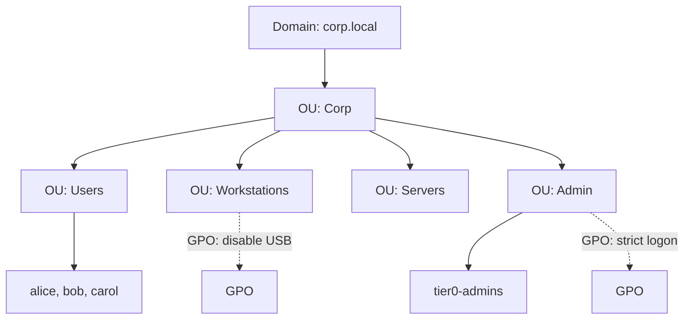

Two points people constantly confuse:

- **OUs are not security groups.** An OU is a *management/policy container*; a **group** is a *security principal* you put in ACLs. You add users to a group to grant them access; you put users in an OU to apply policy and delegation. They serve totally different jobs, and putting a user "in" an OU grants them no permissions by itself.
- **The default containers (`CN=Users`, `CN=Computers`) are NOT OUs.** They are `container` objects and you **cannot link a GPO to them**. New users and machines land there by default, which means they may miss policies you linked to OUs — a classic gap. Admins use `redirusr`/`redircmp` to redirect new objects into real OUs.

**Red team usage:** the OU structure and its linked GPOs *are* an attack surface. If
you can write to a GPO linked to an OU containing high-value machines (a
`WriteDACL`/`WriteProperty` on the GPO or its link), you can push a scheduled task
or script to every machine in that OU — instant lateral movement and privilege
escalation. BloodHound explicitly maps "you can edit this GPO → it applies to these
computers" as an attack edge. Delegation misconfigurations on OUs (e.g. a helpdesk
group with `GenericAll` over an OU containing admin accounts) are similarly gold.

---

## Part 7: Trusts — Connecting Domains and Forests

A **trust** is a relationship that lets security principals in one domain be
authenticated by, and authorized to access resources in, another domain. Trusts are
what make cross-domain and cross-forest access possible at all.

Trusts have a few axes you must be able to name:

- **Direction:** *one-way* (A trusts B, so B's users can access A's resources — trust flows opposite to access) or *two-way* (both directions).
- **Transitivity:** *transitive* (if A trusts B and B trusts C, then A trusts C) or *non-transitive* (only the two named domains).
- **Type/context:** *parent-child* and *tree-root* trusts (created automatically inside a forest, always two-way transitive), *external* trusts (to a domain in another forest, non-transitive), *forest* trusts (between two forest roots, transitive within the trusting forests), and *shortcut* trusts (an optimization to speed cross-domain auth in a big forest).

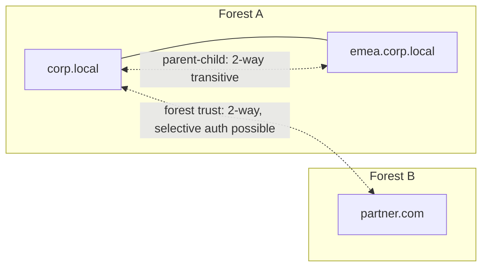

Inside a forest, all the parent-child and tree-root trusts are **two-way transitive
and automatic** — which is the mechanism that makes a forest a single trust fabric.
Between separate forests, you must *manually* create a trust, and you can (and
should) harden it with **SID filtering** and **selective authentication**.

**Security relevance — this is where boundaries live:**

- **Within a forest, SID filtering is effectively off by default**, and trusts are transitive and automatic. Combined with `krbtgt` compromise in a child domain, this is what lets child-domain compromise escalate to forest-root (Enterprise Admin). No amount of "we have separate domains" saves you.
- **Across a forest trust, SID filtering IS applied by default**, stripping foreign SIDs (including forged high-privilege ones) from tickets crossing the boundary. This is precisely why the forest is the security boundary: the trust machinery is designed to contain compromise *at the forest edge*, not at the domain edge.
- **External and forest trusts are still attack surface.** Techniques abusing unconstrained delegation, trust account keys, or misconfigured SID filtering can cross forest trusts in specific conditions — but by default the forest edge is a real, engineered barrier in a way the domain edge is not.

---

## Part 8: The Security Boundary — Why It Is the Forest, Not the Domain

Now we cash in the sentence from the intro. Microsoft's own guidance, and hard-won
incident-response reality, is unambiguous: **the forest is the security boundary in
Active Directory; the domain is not.**

Why the domain fails as a security boundary:

- Every domain in a forest shares one schema and one configuration partition, replicated to all DCs — a compromise of that shared plumbing affects everyone.
- Intra-forest trusts are two-way, transitive, and automatic, with SID filtering off by default. A `WriteDACL` in one domain, or compromise of a child domain's `krbtgt`, can be leveraged (via SID History injection into a forged ticket) to obtain Enterprise Admin in the forest root.
- **Enterprise Admins** and **Schema Admins**, which live in the forest root, have forest-wide power by design.

Why the forest holds as a security boundary:

- Cross-forest trusts apply **SID filtering** by default, discarding forged/foreign high-privilege SIDs at the boundary.
- **Selective authentication** can require explicit per-resource permission for foreign principals.
- There is no automatic, transitive, unfiltered trust reaching *into* a forest from outside.

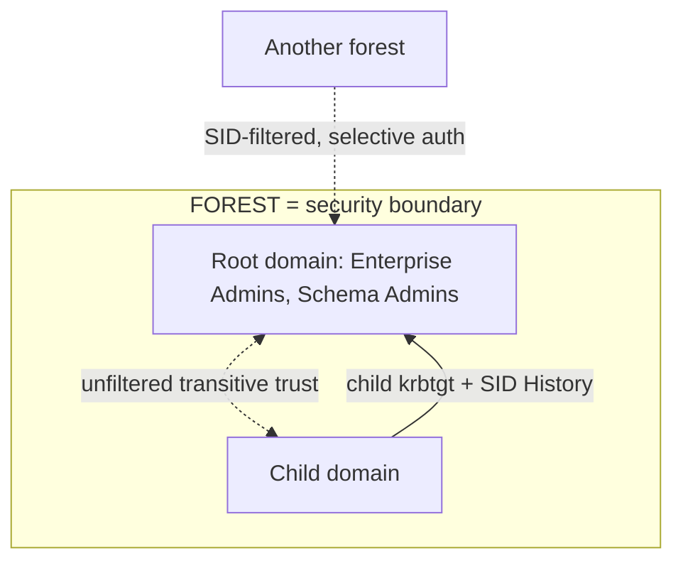

The practical consequences for both sides:

- **For defenders (tiering):** because the domain is not a boundary, you cannot "protect" Tier 0 (DCs, Domain/Enterprise Admins) merely by putting things in a separate *domain*. You protect it with an administrative-tier model, credential hygiene (no Domain Admin logons to workstations — those creds get stolen from LSASS, per the Windows notebook), and by treating the whole forest as one trust zone. Truly isolating an asset means a **separate forest** (this is the logic behind Microsoft's "Red Forest"/ESAE hardened administrative forest design).
- **For attackers:** your escalation goal in an engagement is usually **forest root Enterprise Admin**, and reaching a child domain's DC is frequently "good enough" because intra-forest paths to the root are so often available. Crossing into a *different forest*, by contrast, is a genuinely harder problem gated by SID filtering — you look for the specific misconfigurations (unconstrained delegation on both sides, disabled SID filtering, printer bug, etc.) rather than assuming a default path.

If you remember one thing from this chapter, it is this section. Nearly every AD
attack narrative is ultimately "move through the forest to its root, because inside
the forest there is no real wall."

---

## Part 9: Logical vs Physical Structure

Everything so far — domains, trees, forests, OUs — is the **logical** structure: how
identity and administration are *organized*. AD also has a **physical** structure
describing how it is *deployed across real hardware and network links*. Confusing
the two is a classic beginner error, so we separate them cleanly.

| Logical structure | Physical structure |
|---|---|
| Forest, tree, domain | Domain Controllers (the servers) |
| Organizational Units | Sites (groups of well-connected subnets) |
| Objects (users, groups) | Subnets mapped to sites |
| Schema, partitions | Replication connections between DCs |
| Trusts | Global Catalog servers, FSMO role holders |

The key physical concepts (Chapter 2 goes deep on the servers themselves):

- **Domain Controller (DC):** a server running AD Domain Services that holds a replica of the domain database (`NTDS.dit`) and authenticates users. Multiple DCs per domain provide redundancy and load distribution; they replicate with each other multi-master (any DC can accept a change).
- **Site:** a logical grouping of **subnets** that are connected by fast, reliable links (typically "a physical location," like a data center or office). Sites exist to control two things: **replication** (DCs replicate frequently within a site, less frequently across slow inter-site links) and **client locality** (a workstation authenticates against a DC *in its own site* rather than one across a slow WAN link, discovered via DNS SRV records — Chapter 2).
- **Replication:** AD is multi-master — changes made on any DC propagate to all others. Within a site this is near-immediate; between sites it is scheduled and compressed. Understanding replication latency explains real incidents ("I reset the password but the user still can't log in over there" — it hasn't replicated yet).

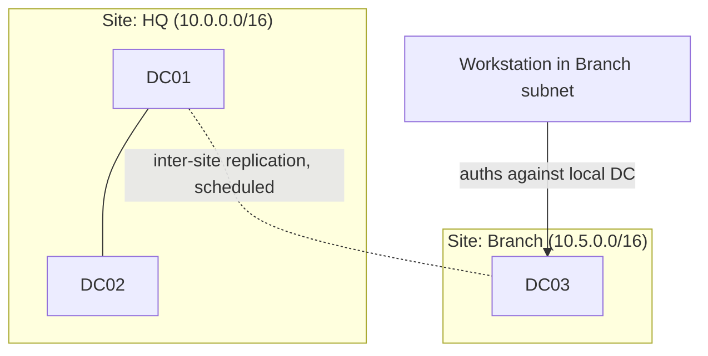

**Security relevance:** sites and replication topology are recon targets.
Enumerating sites and subnets (readable over LDAP by any authenticated user in the
Configuration partition) hands an attacker a **network map of the whole
organization** — every physical location and its IP ranges — for free. And
replication itself is the mechanism abused by **DCSync**: an attacker with the right
rights *asks a DC to replicate secrets to them* using the same
`DRSUAPI`/`GetNCChanges` calls DCs use with each other, extracting password hashes
without ever running code on the DC. Replication is a feature and an attack vector
at once.

---

## Part 10: How It All Fits — a Worked Reference Environment

Let us assemble a single, concrete environment you can hold in your head and that
mirrors what you will see in labs like HackTheBox Pro Labs, TryHackMe AD rooms, and
GOAD (Game of Active Directory).

- **Forest root domain:** `corp.local` (NetBIOS `CORP`). Hosts Enterprise Admins and Schema Admins.
- **Child domain:** `dev.corp.local` (NetBIOS `DEV`) — a tree with `corp.local`, contiguous namespace, automatic two-way transitive trust.
- **Second tree in the same forest:** `research.io` — acquired company, discontiguous namespace, joined into the same forest.
- **OUs in `corp.local`:** `Corp > Users`, `Corp > Workstations`, `Corp > Servers`, `Corp > Tier0-Admins`.
- **Sites:** `HQ` (data center subnets) and `Branch` (remote office).
- **DCs:** `DC01`, `DC02` in `corp.local`; `DC03` in `dev.corp.local`; `DC04` in `research.io`.

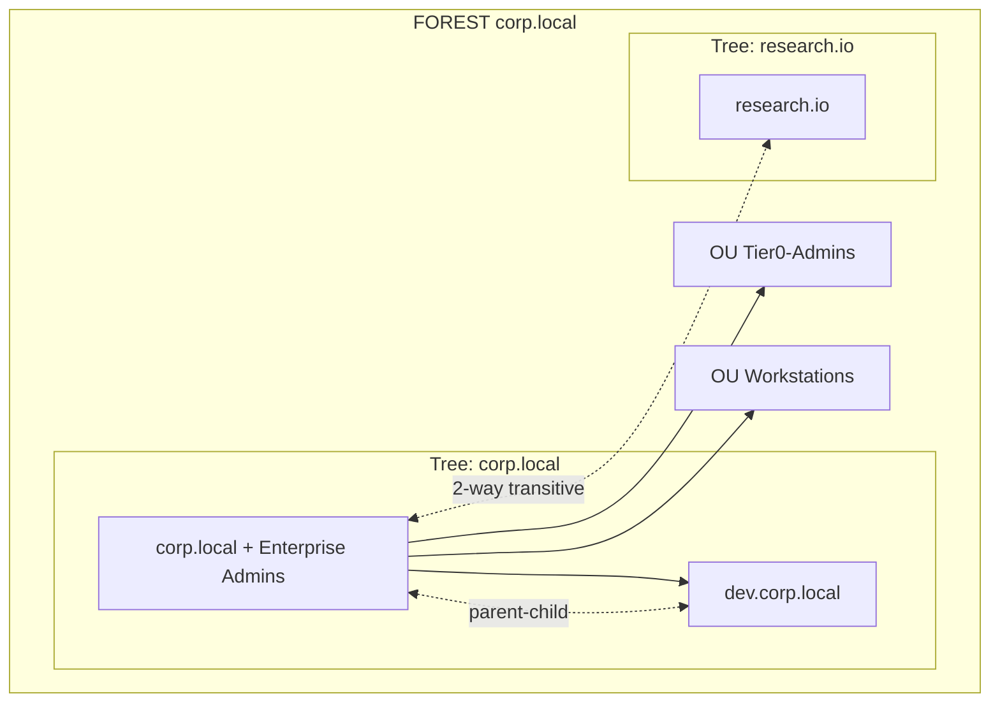

Reading this like an attacker: the objective is Enterprise Admin in `corp.local`. If
you land a foothold in `dev.corp.local` and reach `DC03`, you are one well-known
technique (child `krbtgt` + SID History to the root) away from the whole forest,
because intra-forest trust is unfiltered. `research.io`, despite being in the same
forest, may be reachable too — same forest, same rules. Only a *separate forest*
would force you to defeat SID filtering. Reading it like a defender: `Tier0-Admins`
must never log on to machines in `Workstations`, DC03's `krbtgt` is as sensitive as
DC01's, and if `research.io` truly needs isolation it belongs in its own forest, not
merely its own tree.

---

## Part 11: Hands-On Lab — Enumerating AD Structure

This lab is read-only enumeration against a domain you control (any AD lab: GOAD, a
home lab DC, or an authorized engagement). Everything here is standard, low-noise,
authenticated LDAP reading — the first thing every operator does after getting *any*
domain credential. Run it only where you are authorized.

### From a domain-joined Windows box (built-in tooling)

```powershell
# What domain am I in, and what's the forest?
Get-ADDomain            # DNSRoot, NetBIOSName, DomainSID, InfrastructureMaster, etc.
Get-ADForest            # Name, Domains[], Sites[], SchemaMaster, GlobalCatalogs[]

# Your own identity and SID (RID at the end matters)
whoami /user
whoami /groups

# Enumerate the OU structure
Get-ADOrganizationalUnit -Filter * | Select-Object Name, DistinguishedName

# List domains in the forest and the trusts
(Get-ADForest).Domains
Get-ADTrust -Filter * | Select-Object Name, Direction, TrustType, IntraForest

# Sites and subnets (the org's physical map)
Get-ADReplicationSite -Filter * | Select-Object Name
Get-ADReplicationSubnet -Filter * | Select-Object Name, Site
```

If the ActiveDirectory PowerShell module isn't present, the same data comes from raw
LDAP:

```powershell
# Bind to the domain and pull the naming contexts (partitions)
$root = [ADSI]"LDAP://RootDSE"
$root.defaultNamingContext      # e.g. DC=corp,DC=local
$root.configurationNamingContext
$root.schemaNamingContext
```

### From Linux / Kali (no domain join needed, just creds)

```bash
# ldapsearch: raw LDAP query for all users' key attributes
ldapsearch -x -H ldap://10.10.10.10 -D "CORP\\alice" -w 'Passw0rd!' \
  -b "DC=corp,DC=local" "(objectClass=user)" sAMAccountName objectSid userAccountControl

# Enumerate domain info, users, groups, computers with a purpose-built tool
nxc ldap 10.10.10.10 -u alice -p 'Passw0rd!' --users
nxc ldap 10.10.10.10 -u alice -p 'Passw0rd!' --groups
nxc ldap 10.10.10.10 -u alice -p 'Passw0rd!' --trusted-for-delegation

# windapsearch / ldapdomaindump for a full structured export
ldapdomaindump -u 'CORP\alice' -p 'Passw0rd!' 10.10.10.10 -o loot/
```

`nxc` is **NetExec** (the maintained successor to CrackMapExec) — a Swiss-army knife
for AD protocols; `-u`/`-p` are username/password, `ldap` selects the LDAP protocol
module, and flags like `--users` run canned enumeration queries. `ldapdomaindump`
authenticates once and dumps users, groups, computers, and policies into browsable
HTML/JSON/greppable files — the fastest way to get the whole logical structure onto
disk.

### Sample output you'd actually see

```
Get-ADForest:
Name                  : corp.local
RootDomain            : corp.local
Domains               : {corp.local, dev.corp.local, research.io}
Sites                 : {HQ, Branch}
SchemaMaster          : DC01.corp.local
GlobalCatalogs        : {DC01.corp.local, DC03.dev.corp.local}

Get-ADTrust:
Name              Direction   TrustType   IntraForest
----              ---------   ---------   -----------
dev.corp.local    BiDirectional  Uplevel  True
research.io       BiDirectional  Uplevel  True
partner.com       Inbound        Forest   False
```

That last table is a threat model on a plate: `IntraForest True` trusts (`dev`,
`research`) are unfiltered internal paths; `partner.com` is a *separate forest*
(`IntraForest False`, `TrustType Forest`) and therefore SID-filtered — the genuinely
harder crossing. You just derived the whole of Part 8 from one command's output.

### Visualize it with BloodHound

```bash
# Collect with the Python or C# collector, then import into BloodHound
bloodhound-python -u alice -p 'Passw0rd!' -d corp.local -ns 10.10.10.10 -c All
# -> feeds the JSON into BloodHound, which draws domains, trusts, OUs,
#    group membership, and computes attack paths to Domain/Enterprise Admins
```

**BloodHound** is the tool that turns everything in this chapter into a clickable
graph and, more importantly, computes shortest **attack paths** — "from your
foothold user, here are the three hops to Domain Admin." It is covered in depth in a
later chapter; for now, know that it consumes exactly the object/attribute/trust
data you enumerated above and renders the logical structure as an attack graph.
**Blue teams run it too**, precisely to find and cut those paths before an attacker
walks them.

---

## Part 12: Distinguished Names and the LDAP Directory Tree

You cannot go further in AD without learning how objects are *named and located* in
the directory tree.
Every object has a **Distinguished Name (DN)** — a globally unique path from the
object up to the root of the domain.
A DN reads right-to-left (root last) and is built from **Relative Distinguished
Names (RDNs)** joined by commas.

Consider Alice, a user in the `Users` OU under the `Corp` OU in `corp.local`:

```text
CN=Alice Smith,OU=Users,OU=Corp,DC=corp,DC=local
```

Reading it component by component:

- `DC=corp,DC=local` — the **domain component** parts. Each DNS label of the domain becomes one `DC=` element. `corp.local` -> `DC=corp,DC=local`. This is always the tail of every DN in that domain.
- `OU=Corp,OU=Users` — the **organizational unit** path, innermost OU first as you move left. Alice lives in `Users`, which is inside `Corp`.
- `CN=Alice Smith` — the **common name**, the object's own RDN. For users this is usually the display name, *not* the logon name.

The naming attributes you will see:

| Prefix | Meaning | Example |
|---|---|---|
| `DC` | Domain Component (a DNS label) | `DC=corp,DC=local` |
| `OU` | Organizational Unit | `OU=Finance` |
| `CN` | Common Name (object or default container) | `CN=Alice Smith`, `CN=Users` |

Two subtleties that bite beginners:

- **`CN=Users` vs `OU=Users`.** The *default* Users container has DN `CN=Users,DC=corp,DC=local` — note `CN=`, because it is a `container`, not an OU (Part 6). A custom `OU=Users` you create yourself is a real OU with `OU=`. The prefix tells you which is which at a glance, and only the `OU=` one can have a linked GPO.
- **The DN changes if you move the object.** Move Alice to a different OU and her DN changes, but her `objectGUID` never does. That is exactly why AD references objects internally by the immutable `objectGUID`, not by DN — and why tooling that caches DNs breaks after a reorg.

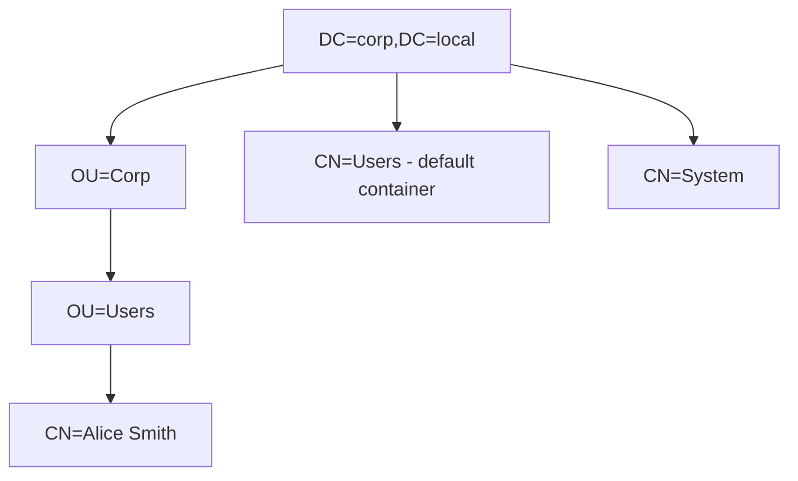

Alongside DNs, AD divides its database into **naming contexts** (also called
**partitions**) — separately-replicated subtrees you will query constantly:

- **Domain NC** (`DC=corp,DC=local`) — the users, computers, groups, and OUs. Replicated to every DC *in that domain*.
- **Configuration NC** (`CN=Configuration,DC=corp,DC=local`) — sites, subnets, services, replication topology. Replicated **forest-wide**.
- **Schema NC** (`CN=Schema,CN=Configuration,...`) — the class/attribute definitions. Replicated **forest-wide**, exactly one per forest.
- **Application partitions** — e.g. the DNS zones when AD-integrated DNS is used (`DomainDnsZones`, `ForestDnsZones`).

**Red team usage:** the Configuration NC is readable by any authenticated user and
contains the *entire* physical map — every site, subnet, and DC in the whole forest.
`[ADSI]"LDAP://RootDSE"` exposes the NC names, and from there `ldapsearch -b
"CN=Configuration,DC=corp,DC=local"` dumps the topology. You will use DNs as the
`-b` (base) of virtually every targeted query, so fluency here is a prerequisite for
precise enumeration rather than blind full-tree dumps.

---

## Part 13: A First Look at Special Roles — Global Catalog and FSMO

The next chapter dissects Domain Controllers in depth, but two DC "specializations"
are impossible to avoid even in an introductory map, and knowing their names now
makes Part 8's boundary discussion concrete.

### The Global Catalog

Within a forest, no single DC holds a full copy of *every* domain's objects — a DC
in `corp.local` does not replicate all of `research.io`. So how does a user in one
domain *find* an object in another (say, to add a foreign user to a group, or
resolve an email address forest-wide)?

The answer is the **Global Catalog (GC)** — a special DC that holds a **full**
replica of its own domain plus a **partial, read-only** replica (a subset of
attributes) of **every other domain in the forest**. It is the forest-wide search
index. The GC listens on **TCP 3268** (and 3269 for LDAPS), distinct from normal
LDAP on 389/636.

Why it matters:

- **Logon depends on it.** In a multi-domain forest, universal group membership is resolved via the GC at logon; if no GC is reachable, logons can fail or fall back in surprising ways.
- **`userPrincipalName` resolution** (the `alice@corp.local` style login) is a GC lookup, because the UPN suffix may not match the user's actual domain.
- **Recon loves it.** One authenticated query to a GC on 3268 returns matches from the *entire forest*, not just the local domain — an attacker enumerating "all users with an SPN" forest-wide points tools at the GC to sweep every domain in a single query.

### FSMO roles (the "single-master" exceptions)

AD replication is *multi-master* — any DC can accept most changes. But five
operations are too sensitive for conflicts, so exactly one DC holds each of these
**FSMO** (Flexible Single Master Operation) roles at a time:

| FSMO role | Scope | What it governs |
|---|---|---|
| **Schema Master** | Forest | The only DC that can modify the schema |
| **Domain Naming Master** | Forest | Adding/removing domains and app partitions |
| **RID Master** | Domain | Hands out pools of RIDs so no two objects get the same SID |
| **PDC Emulator** | Domain | Time sync source, password-change urgency, lockout processing, legacy support |
| **Infrastructure Master** | Domain | Cross-domain object reference updates |

You do not need to memorize all five deeply yet, but two names recur in attacks:

- **PDC Emulator** is the domain's authoritative time source. Kerberos requires clocks within ~5 minutes (Chapter on Kerberos), so time and the PDCe come up whenever ticket attacks are discussed.
- **RID Master** hands out RID pools; the `ms-DS-MachineAccountQuota` and RID exhaustion edge cases intersect with certain escalation techniques.

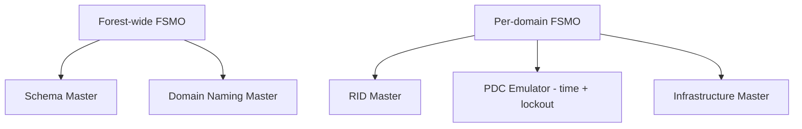

You can find the role holders with one command, which is also a recon step (it
points you at the most important DCs):

```powershell
Get-ADDomain  | Select-Object PDCEmulator, RIDMaster, InfrastructureMaster
Get-ADForest  | Select-Object SchemaMaster, DomainNamingMaster
netdom query fsmo      # legacy one-liner, all five at once
```

**Blue team usage:** the FSMO holders (especially the Schema Master and PDC
Emulator) are Tier-0 crown jewels — losing one is a domain/forest-level event.
Knowing which DC holds which role tells you exactly which servers deserve the
tightest monitoring and the fewest logon rights. The Global Catalogs likewise
deserve extra scrutiny because a single GC query can enumerate the entire forest.

---
## Part 14: Common Pitfalls & Misconceptions

A short catalogue of the mistakes that trip up newcomers — and that seasoned attackers
exploit precisely because defenders make them.

**"A separate domain isolates a compromise."** It does not. The domain is an
administration and replication boundary, never a security boundary. Intra-forest trusts
are automatic, two-way, transitive, and SID-filtering-off by default, so child-domain
compromise routinely escalates to forest root. Real isolation requires a **separate
forest** (Part 8). This is the single most consequential misconception in AD.

**"An OU grants access."** No. OUs apply Group Policy and delegation; they are not
security principals and appear in no ACL. Access comes from **group membership**. Putting
a user "in" the Finance OU gives them zero permissions to Finance data — a Finance
security *group* does that. Confusing the two leads to both over-permissioning and
mysteriously-failing access.

**"CN=Users and CN=Computers are OUs."** They are default `container` objects, and you
**cannot link a GPO to them**. New accounts and machines land there unless redirected
(`redirusr`/`redircmp`), silently escaping OU-linked policy — a classic hardening gap and
a reason freshly-joined machines miss baseline settings.

**"Domain Admin is the top."** For a single domain, it is the top *of that domain*. But
**Enterprise Admins** (forest root) and **Schema Admins** outrank it forest-wide, and
membership in them is what an attacker ultimately chases in a multi-domain forest. RID
519 (EA) outranks RID 512 (DA).

**"Replication is just plumbing."** Replication is also an attack surface: **DCSync**
abuses the very `DRSUAPI`/`GetNCChanges` calls DCs use to sync, letting an attacker with
replication rights pull every hash — including `krbtgt` — without running code on a DC.
Site/subnet data in the Configuration NC hands attackers a full network map for free.

**"Only admins can enumerate AD."** Any authenticated user can read most of the directory
by design — LDAP is a read-optimized directory that applications depend on. Enumeration
(BloodHound, PowerView, `ldapdomaindump`) generally needs *no* special rights, which is
why defense focuses on detecting and hardening rather than forbidding reads.

**"The English DN order is top-down."** DNs read **right-to-left**: the root
(`DC=corp,DC=local`) is the *tail*, the object's own `CN=` is the *head*. Reading them
left-to-right as a path is a constant source of confusion when crafting `-b` base queries.

**"`ms-DS-MachineAccountQuota` is harmless."** Its default of **10** lets *any* domain
user create up to ten computer accounts, which seeds several modern escalation techniques
(RBCD, shadow-credential and certificate abuses). Setting it to **0** closes a door most
organizations never needed open.

---
## Part 15: Detection & Defense Angle

Consolidating the defensive view. AD enumeration is hard to *prevent* — any
authenticated user can read most of the directory by design (LDAP is a
read-optimized directory, and applications depend on that openness). So defense
concentrates on **hardening the structure**, **shrinking the attack surface**, and
**detecting the abuse of trust and privilege** rather than trying to forbid reads.

Structural hardening:

- **Adopt an administrative tier model.** Tier 0 (DCs, Domain/Enterprise Admins, and anything that can control them) must be usable only from Tier 0 admin workstations, never from ordinary desktops. Because the domain is not a security boundary and credentials get harvested from LSASS, the tiering — not the domain layout — is what actually contains compromise.
- **Minimize forest-root privilege.** Enterprise Admins and Schema Admins should be empty except during deliberate, time-boxed changes. These groups hold forest-wide power that maps directly to Part 8's boundary.
- **Isolate what must truly be isolated in a separate forest**, not merely a separate domain or OU — the ESAE/"Red Forest" pattern for the most sensitive administrative identities.
- **Lock down trusts:** enable SID filtering and consider selective authentication on external/forest trusts; audit every trust (`Get-ADTrust`) and delete stale ones from old acquisitions.
- **Fix the OU/GPO surface:** remove excessive delegations (`GenericAll`/`WriteDACL` on OUs and GPOs), redirect default `CN=Users`/`CN=Computers` into governed OUs, and lower `ms-DS-MachineAccountQuota` from its dangerous default of **10** (which lets any user join 10 machine accounts — the seed of several escalation techniques).

Detection (building on the telemetry from the Windows notebook's logging chapter):

- **Recon at scale looks like LDAP.** A single principal issuing large or unusual LDAP queries (all users, all SPNs, all delegation attributes) is BloodHound/PowerView-style collection. Directory Service auditing and LDAP query logging surface it; some environments deploy honeytoken/decoy objects that no legitimate app should ever read.
- **Trust and structure changes are high-signal, low-volume events:** Security Event **4713** (trust modified), **4716/4717** (trust/authentication policy changes), **4739** (domain policy changed), **5136** (a directory object was modified — e.g. someone editing `userAccountControl` to enable delegation or disabling Kerberos pre-auth), **4720/4728/4756** (account created / added to Enterprise or Schema Admins). These almost never happen legitimately outside change windows.
- **Replication abuse (DCSync)** shows up as **DRSUAPI GetNCChanges from a non-DC source** — an account that is not a Domain Controller requesting replication. Alerting on replication rights held by, or replication requests from, anything other than actual DCs catches one of the most damaging post-exploitation techniques.

To make the defensive priorities concrete, the flow below maps the structural concepts of
this chapter onto where each control lives — from the forest boundary down to the OU.

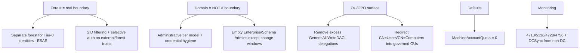

A compact detection reference tying Event IDs to the structural change they betray:

| Signal | Event / indicator | Structural meaning |
|---|---|---|
| Trust created/modified | 4713, 4716, 4717 | Someone changed the forest's trust fabric (Part 7) |
| Object attribute changed | 5136 | e.g. `userAccountControl` flipped to enable delegation / disable pre-auth |
| Added to EA/SA/DA | 4728, 4756, 4732 | Privilege escalation into forest/domain top (Part 5, 8) |
| Domain policy changed | 4739 | Password/Kerberos policy altered domain-wide |
| Replication from non-DC | DRSUAPI GetNCChanges | DCSync — secret extraction via replication (Part 9) |
| Mass LDAP read | Directory Service / LDAP logs | BloodHound/PowerView-style structure recon (Part 11) |

The throughline: because you cannot forbid reads and cannot rely on the domain as a wall,
defense is **structure hardening + privilege minimization + change detection**. Every row
above is a low-volume, high-signal event that almost never fires outside a real
administrative change or a real intrusion.

---

## Part 16: Final Revision — Recap

- **Active Directory** is a centralized, replicated **directory service** (Microsoft's LDAP-based implementation, plus Kerberos/NTLM/DNS/Group Policy) that stores identities once and lets every domain-joined machine trust a central authority.
- **Everything is an object** (user, computer, group, OU, GPO) made of **attributes**, defined by a single forest-wide **schema**. `objectSid` (with its RID — 500 Administrator, 512 Domain Admins, 519 Enterprise Admins) and `userAccountControl` (delegation, no-preauth flags) are the security-critical attributes.
- **Domain** = fundamental unit of administration, replication, and authentication, named by DNS, backed by DCs holding `NTDS.dit`. It is **not** a security boundary.
- **Tree** = domains sharing a **contiguous** DNS namespace, linked by automatic two-way transitive parent-child trusts.
- **Forest** = one or more trees sharing **one schema, one configuration, one global catalog**; the first domain is the **forest root** (home of Enterprise Admins and Schema Admins). Trees can be discontiguous within a forest.
- **OU** = management/policy container *inside* a domain for **GPO application** and **delegation** — not a security group, and the default `CN=Users`/`CN=Computers` containers are not OUs and can't take a linked GPO.
- **Trusts** have direction, transitivity, and type. **Intra-forest = automatic, two-way, transitive, SID-filtering off**; **cross-forest = manual, SID-filtered, selective-auth capable**.
- **The forest is the security boundary, not the domain** — because intra-forest trust is unfiltered and transitive, child-domain compromise escalates to forest root; only a separate forest forces an attacker through SID filtering.
- **Logical** (forest/tree/domain/OU/objects) vs **physical** (DCs, sites, subnets, replication) are different views; sites/replication double as recon data and, via DCSync, as an attack vector.

---

## Part 17: Cheat Sheet / Quick Reference

```text
# --- Hierarchy (smallest -> largest) ---
Object -> OU -> Domain -> Tree -> Forest
  Object  = user/computer/group/GPO (attributes, defined by schema)
  OU      = mgmt/policy container INSIDE a domain (GPO + delegation)
  Domain  = admin/replication/auth unit (DNS-named, DCs, NTDS.dit)  NOT a boundary
  Tree    = domains, CONTIGUOUS namespace, auto 2-way transitive trust
  Forest  = 1+ trees, ONE schema/config/GC; root has Enterprise+Schema Admins
  BOUNDARY = the FOREST

# --- Well-known RIDs (end of objectSid) ---
500 Administrator | 512 Domain Admins | 513 Domain Users
518 Schema Admins | 519 Enterprise Admins | 502 krbtgt

# --- userAccountControl flags that matter ---
0x0002 ACCOUNTDISABLE | 0x10000 DONT_EXPIRE_PASSWORD
0x400000 DONT_REQ_PREAUTH (AS-REP roastable) | 0x80000 TRUSTED_FOR_DELEGATION

# --- Enumerate structure (Windows) ---
Get-ADDomain ; Get-ADForest ; (Get-ADForest).Domains
Get-ADTrust -Filter * | ft Name,Direction,TrustType,IntraForest
Get-ADOrganizationalUnit -Filter * | ft Name,DistinguishedName
Get-ADReplicationSite -Filter * ; Get-ADReplicationSubnet -Filter *
whoami /user ; whoami /groups

# --- Enumerate structure (Linux/creds) ---
nxc ldap DC_IP -u USER -p PASS --users --groups
ldapdomaindump -u 'DOM\USER' -p PASS DC_IP -o loot/
bloodhound-python -u USER -p PASS -d corp.local -ns DC_IP -c All

# --- Key detection Event IDs ---
4713/4716/4717 trust change | 5136 object modified (UAC/delegation)
4739 domain policy change | 4728/4756 added to DA/EA
DRSUAPI GetNCChanges from non-DC = DCSync

# --- Dangerous defaults to fix ---
ms-DS-MachineAccountQuota = 10  -> set to 0
SID filtering OFF intra-forest | CN=Users/CN=Computers can't take GPOs
```

---

## Part 18: Practice Labs & Resources

Labs that train *this* chapter's structural understanding specifically:

- **GOAD — Game of Active Directory** (Orange Cyberdefense): a free, self-hosted multi-domain, multi-forest lab. The single best way to *see* domains, trees, forests, and trusts and then attack across them. Build it and run the Part 11 enumeration against it.
- **TryHackMe — "Active Directory Basics"**, **"Attacktive Directory"**, and the **"Holo"/"Wreath"** networks: guided intro to domains, OUs, and enumeration.
- **HackTheBox — "Forest", "Active", "Sauna", "Cascade"**, and **Pro Labs "Dante"/"Zephyr"/"Cerberus"**: real multi-host AD to enumerate and traverse; "Forest" in particular rewards understanding of the object model and default privileges.
- **HackTheBox Academy — "Introduction to Active Directory"** and **"Active Directory Enumeration & Attacks"** modules: structured theory + hands-on matching this chapter and the next.
- **PortSwigger** is web-focused, so it is not the fit here — for AD, prioritize the above and the official **Microsoft Learn "Active Directory Domain Services"** docs for authoritative logical/physical structure reference.
- **BloodHound + BadBlood/GOAD** to auto-generate a populated directory you can graph, so the abstract hierarchy becomes a concrete attack surface.

### Memory hooks

- **O-O-D-T-F** (Object, OU, Domain, Tree, Forest) — smallest to largest. "**O**ld **O**wls **D**on't **T**rust **F**oxes."
- **Tree = contiguous, Forest = shared schema.** If the names chain (`a.corp.local` under `corp.local`) it's a tree; if they share schema/config/GC but the names don't chain, it's still one forest.
- **"The forest is the fence."** The domain is just a room inside it; the fence around the whole property is the forest.
- **512 = Domain Admins, 519 = Enterprise Admins.** 519 > 512 in both number and blast radius (forest-wide vs domain-wide).

### Practice questions

1. A company runs `corp.local`, a child `eu.corp.local`, and an acquired `globex.net` — all in one forest. An attacker compromises the DC of `eu.corp.local`. Explain, referencing the security-boundary concept, why this likely leads to Enterprise Admin, and what would have had to be true for `globex.net` to be genuinely harder to reach.
2. You have valid domain creds and no tools installed on the box. Write the raw `[ADSI]"LDAP://RootDSE"` steps to discover the domain's distinguished name and the schema/configuration partition names.
3. A helpdesk group has `GenericAll` over the OU that contains all Tier-0 admin accounts. Explain precisely why this is a domain-compromise-level finding even though the group is "just helpdesk."
4. Distinguish an OU from a security group, and explain why linking a GPO to `CN=Users` silently fails.
5. Given `Get-ADTrust` output showing one trust with `IntraForest=True` and another with `TrustType=Forest, IntraForest=False`, state which one an attacker treats as an easy internal path and which as a SID-filtered boundary, and why.
6. Write the Distinguished Name of a user `CN=Bob Lee` who sits in an OU named
   `Staff` inside an OU named `London` in the domain `eu.corp.local`, and explain
   which part of that DN changes if Bob is moved to a different OU (and which
   immutable attribute AD uses internally instead).
7. A single authenticated LDAP query against TCP 3268 returns users from every
   domain in the forest, while the same query on TCP 389 returns only the local
   domain's users. Name the service on 3268, explain why the result set differs,
   and state why this matters to an attacker enumerating SPNs forest-wide.

---

*Also on [Praneeth's portfolio](https://ping-praneeth.vercel.app/notebook/active-directory-fundamentals/01-what-is-active-directory-domains-forests-trees-and), with comments and the latest edits.*
