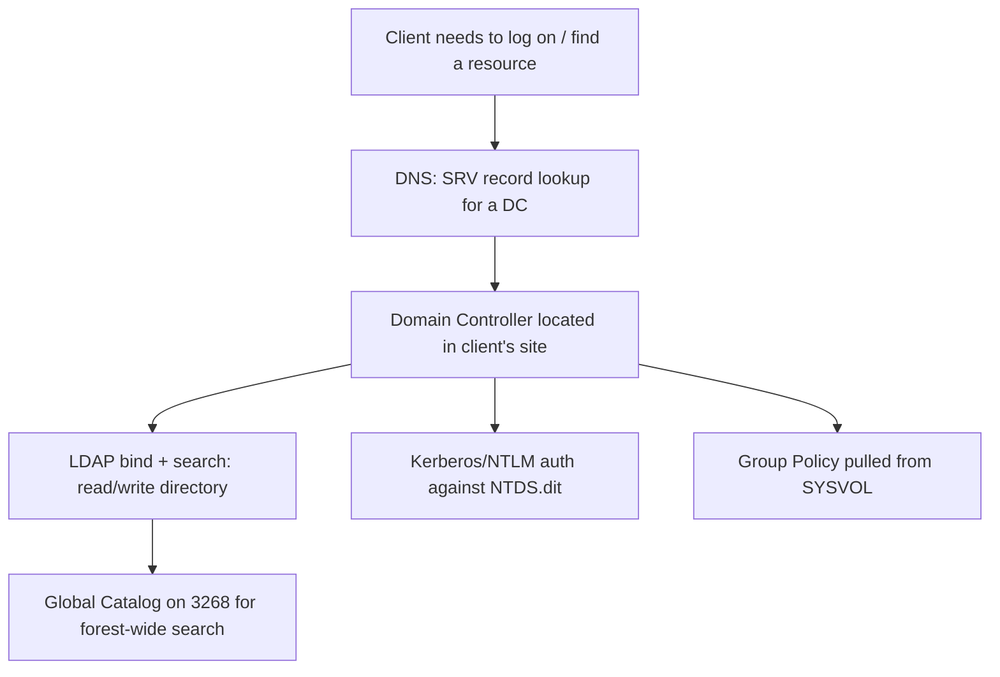
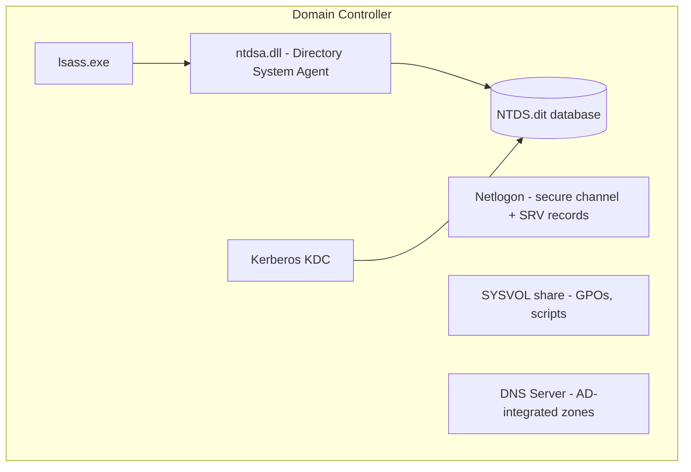
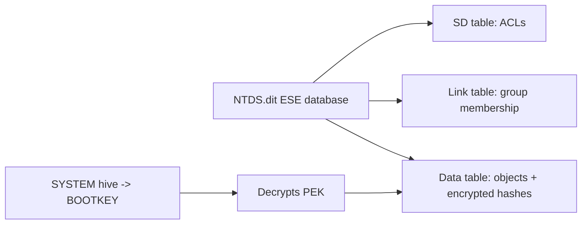
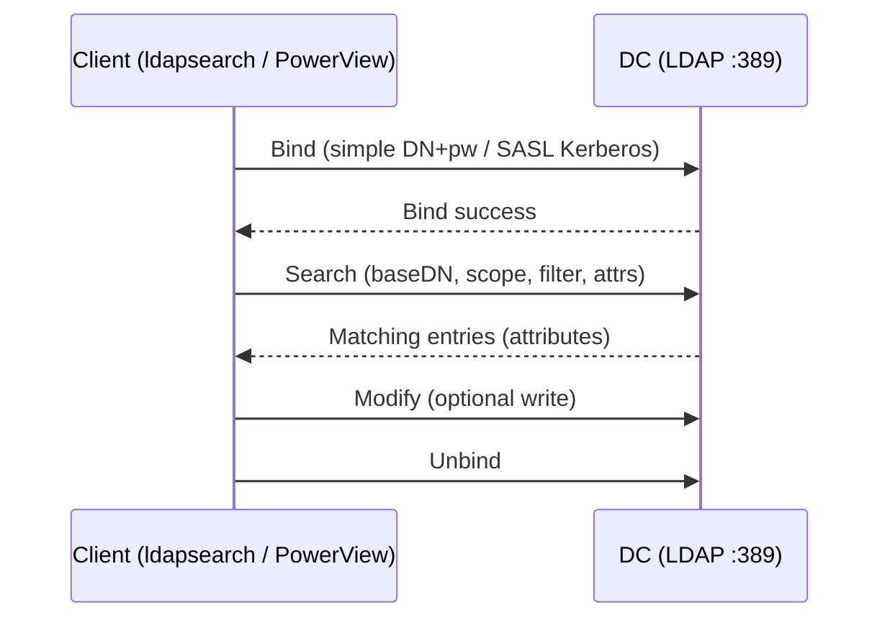
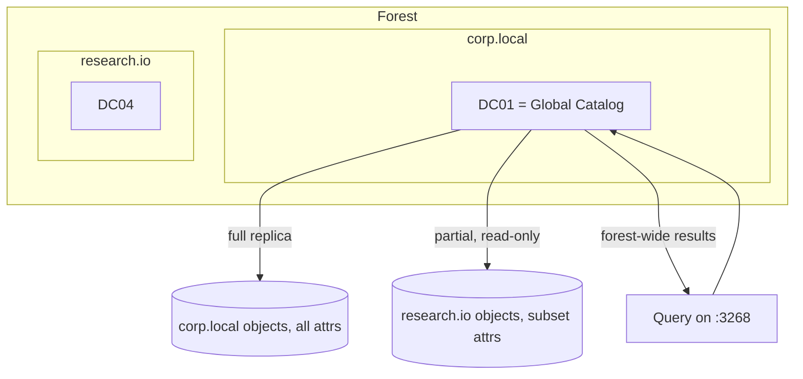
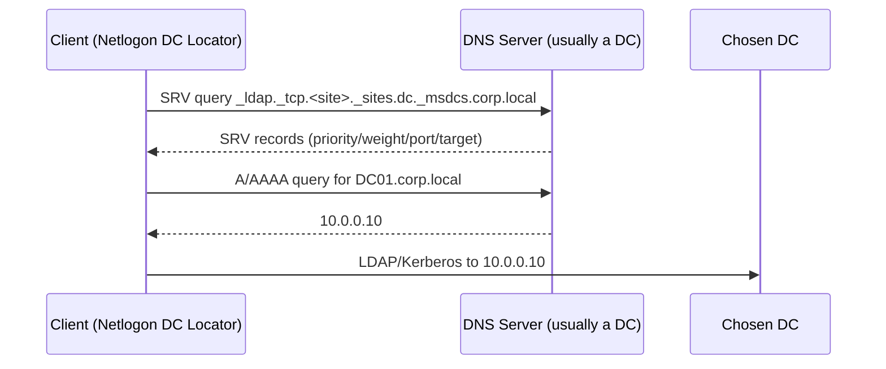
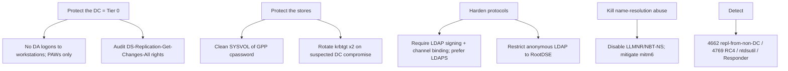

This is Chapter 2 of the Active Directory series — Notebook 4. Chapter 1 built the
logical
map: objects, OUs, domains, trees, forests, trusts, and the crucial idea that the
*forest*
is the security boundary. This chapter descends into the machinery that makes that map
real: the **Domain Controllers** that hold the database, the **LDAP** protocol every
tool
speaks to read and write it, the **Global Catalog** that indexes the whole forest,
and the
**DNS** that lets a client find any of it in the first place.

Everything you will later do to attack or defend AD — enumerate with BloodHound,
Kerberoast,
DCSync, abuse delegation, poison name resolution — ultimately becomes a conversation
with one
of these four things. If Chapter 1 was the geography, this chapter is the physics.
Learn it
and the later chapters stop being spells and become mechanisms you understand.

---

## Who This Chapter Is For (and the Map Ahead)

You need Chapter 1's vocabulary (domains, forests, OUs, DNs, naming contexts, the
GC/FSMO
preview) and the earlier notebooks' groundwork on DNS (Networking notebook),
authentication
(Windows notebook Chapter 3), and the registry/services. We start at the Domain
Controller —
what it is, what it stores in `NTDS.dit` and `SYSVOL` — then take LDAP apart from
the wire up
(bind, search base, scope, filters), give the Global Catalog its own full treatment, and
finish with the DNS SRV-record machinery that is the unsung glue of the entire system.



Follow that top to bottom and you have the life story of a domain logon. We will
unpack every
box.

---

## Part 1: What a Domain Controller Actually Is

A **Domain Controller (DC)** is a Windows Server running the **Active Directory Domain
Services (AD DS)** role. It is the server that *is* the domain, functionally: it
stores the
directory database, answers authentication requests (Kerberos and NTLM), serves
Group Policy,
and replicates all of this with the other DCs of its domain.

Promoting a plain server into a DC is done with `dcpromo` (historically) or, on modern
Windows, `Install-ADDSDomainController` / the Server Manager wizard, which installs
the role,
creates the database, and registers the DC's service records in DNS. Demotion
reverses it.

What runs on a DC that does not run on a member server:

- The **`ntds.dit` database** and the **Directory System Agent (DSA)** — `ntdsa.dll` inside
  `lsass.exe` — which is the code that actually reads/writes the directory and
speaks LDAP and
  the replication protocol.
- The **Netlogon** service, which handles the secure channel between machines and the domain
  and registers the DC's DNS SRV records.
- The **Kerberos Key Distribution Center (KDC)**, which issues tickets (deep-dived in a later
  chapter) using the `krbtgt` account's key.
- The **SYSVOL** share, a replicated file share holding Group Policy templates and scripts.
- Usually **DNS Server**, because AD is so dependent on DNS that DCs almost always host
  AD-integrated DNS themselves.



**Security relevance — the DC is the whole game.** Because every DC of a domain
holds a full,
writable replica of `NTDS.dit`, and `NTDS.dit` contains the password hashes of
*every* user
and computer (including `krbtgt`, whose key signs every Kerberos ticket),
**compromising a
single DC compromises the entire domain**. There is no "we only lost one server"
when that
server is a DC. This is why "get a shell on a DC" and "get Domain Admin" are treated
as the
same milestone, and why DC hardening, monitoring, and physical/virtual isolation are
Tier-0
concerns.

---

## Part 2: Inside NTDS.dit and SYSVOL

Two on-disk stores hold everything a DC serves. Knowing their structure explains
several of
the most important attacks in all of AD.

### NTDS.dit — the directory database

`NTDS.dit` (default path `C:\Windows\NTDS\ntds.dit`) is an **ESE (Extensible Storage
Engine /
"Jet Blue")** database — the same engine family behind Exchange. It contains three
logical
tables of interest:

- The **data table** — every object (users, computers, groups, OUs) and all their attributes,
  including the **password hashes** (the NT hash, and Kerberos keys) stored in encrypted
  attributes like `unicodePwd` and the `supplementalCredentials`.
- The **link table** — linked attributes such as group `member`/`memberOf` relationships.
- The **SD table** — security descriptors (ACLs), deduplicated and referenced by objects.

The hashes in `NTDS.dit` are encrypted with the **PEK (Password Encryption Key)**,
which is
itself encrypted with the domain's **BOOTKEY / SYSKEY** stored in the `SYSTEM`
registry hive.
This is why offline extraction needs *both* the `ntds.dit` and the `SYSTEM` hive.



**Red team usage — three ways attackers get the hashes:**

- **DCSync** (no code on the DC): with replication rights (`DS-Replication-Get-Changes` +
  `...-All`, held by Domain Admins, and often mis-delegated to others), an attacker
asks a DC
  to *replicate* account secrets to them over `DRSUAPI GetNCChanges` — exactly what
one DC
  does to another. `secretsdump.py -just-dc` and Mimikatz `lsadump::dcsync` do this
remotely.
- **Volume Shadow Copy / raw extraction** on the DC: `ntdsutil "ac i ntds" "ifm" ...` or a VSS
  snapshot copies `ntds.dit` + `SYSTEM`, then `secretsdump.py -ntds ntds.dit -system
SYSTEM
  LOCAL` decrypts offline.
- **`SAM`/LSASS** on the DC for the currently cached secrets.

The most consequential secret in that file is the **`krbtgt`** account hash: with it, an
attacker forges **Golden Tickets** — arbitrary, long-lived Kerberos TGTs for any
user — and
the only true remediation is a double `krbtgt` password reset. This single fact is why
`NTDS.dit` protection is the center of gravity for AD security.

### SYSVOL — the replicated policy share

`SYSVOL` (`C:\Windows\SYSVOL\sysvol\<domain>\`, shared as `\\<domain>\SYSVOL`) is a
file share replicated to every DC (via **DFS-R**, or the legacy **FRS**). It holds:

- **Group Policy Templates (GPT)** — the actual files behind each GPO (registry settings,
  scripts, `GptTmpl.inf`), keyed by the GPO's GUID under `Policies\`.
- **Logon/startup scripts** referenced by policy.

Because every authenticated user can *read* SYSVOL (they must, to apply policy), it is a
recon goldmine.

**Bug bounty / CTF & red team angle:** the classic SYSVOL finding is the **MS14-025 "GPP
cpassword"** issue — Group Policy Preferences historically stored credentials (for local
admin, mapped drives, scheduled tasks) in `Groups.xml`/`Services.xml` under SYSVOL,
encrypted
with a **published, static AES key**. Anyone who can read SYSVOL can decrypt them:

```bash
# Find and decrypt GPP passwords straight out of SYSVOL
nxc smb DC_IP -u alice -p 'Passw0rd!' -M gpp_password
# or manually:
findstr /S /I cpassword \\corp.local\SYSVOL\corp.local\Policies\*.xml
gpp-decrypt "j1Uyj3Vx8TY9LtLZil2uAuZkFQA/4latT76ZwgdHdhw"
```

This is a canonical "authenticated user to local admin" pivot on countless real
networks and
HTB/THM boxes. It exists purely because of *what SYSVOL is and who can read it*.

---

## Part 3: Multiple DCs and Replication

A domain almost always has **more than one DC**, for availability and load. AD uses
**multi-master replication**: any DC can accept most changes, and those changes
propagate to
all other DCs of the domain. (The five FSMO roles from Chapter 1 are the single-master
exceptions.)

Key mechanics:

- **Replication topology** is generated automatically by the **KCC (Knowledge Consistency
  Checker)** on each DC, which builds connection objects. Within a **site**
replication is
  frequent (change notification within seconds); **between sites** it is scheduled and
  compressed over site links (Chapter 1's physical structure).
- **USN and high-watermark vectors** track what each DC has already seen, so replication is
  incremental — only changed attributes move, and conflicts are resolved by
  version/timestamp/DC-GUID tiebreakers.
- **Convergence** means all DCs *eventually* agree, but not instantly. This latency is the
  source of countless real incidents ("I reset it on DC01 but the user still fails
on DC03") —
  the change simply has not replicated yet.

```mermaid
sequenceDiagram
    participant Admin
    participant DC01
    participant DC03
    Admin->>DC01: Reset alice's password
    DC01->>DC01: Increment USN, update NTDS.dit
    Note over DC01,DC03: Intra-site: notify + pull within seconds<br/>Inter-site: scheduled, compressed
    DC01->>DC03: Replicate changed attribute (GetNCChanges)
    DC03->>DC03: Apply; now converged
```

**Security relevance:** the replication protocol (`DRSUAPI`, RPC over the network) is a
legitimate, authenticated DC-to-DC channel — and **DCSync abuses exactly this**,
masquerading
as a DC pulling changes. Detection therefore keys on *who* is making `GetNCChanges`
calls: a
request from anything that is not a real DC is a screaming indicator. You can watch real
replication health with:

```powershell
repadmin /replsummary          # replication health across all DCs
repadmin /showrepl             # detailed inbound replication for this DC
Get-ADReplicationPartnerMetadata -Target DC01 -Scope Server
```

---

## Part 4: LDAP — the Protocol Everything Speaks

The **Lightweight Directory Access Protocol (LDAP)** is *the* protocol for reading
and writing
the directory. Every tool in later chapters — `ldapsearch`, PowerView, BloodHound,
`nxc ldap`,
even the built-in `Get-AD*` cmdlets — is ultimately performing LDAP operations.
Understanding
LDAP at the operation level is the difference between running tools and knowing what
they do.

LDAP runs on:

- **TCP 389** — LDAP (plaintext or with StartTLS/sealing).
- **TCP 636** — LDAPS (LDAP over TLS).
- **TCP 3268 / 3269** — the **Global Catalog** (LDAP / LDAPS) for forest-wide search (Part 6).

### The LDAP conversation

An LDAP session is a small, well-defined sequence of operations:

1. **Bind** — authenticate to the directory. A **simple bind** sends a DN + password (send it
   over TLS or it is cleartext on the wire). A **SASL/GSSAPI bind** uses Kerberos or
NTLM (the
   normal, secure path on a domain). An **anonymous bind** provides no credentials —
usually
   restricted, but sometimes left open, which leaks data.
2. **Search** — the workhorse. A search specifies a **base DN** (where to start), a **scope**,
   and a **filter** (which objects match), plus the **attributes** to return.
3. **Modify / Add / Delete / ModifyDN** — write operations (create a user, change an
   attribute, move an object). These are how privilege changes actually happen on
the wire.
4. **Unbind** — close the session.



### Search scope

The **scope** controls how deep a search goes from the base DN:

| Scope | Meaning |
|---|---|
| **base** | Only the base object itself |
| **one** (one-level) | Immediate children of the base, not deeper |
| **sub** (subtree) | The base and everything beneath it — the usual choice for enumeration |

A subtree search from `DC=corp,DC=local` walks the entire domain; a base search on
RootDSE
reads just server capabilities. Choosing scope precisely is how you avoid dumping
the whole
tree when you want one OU.

---

## Part 5: LDAP Search Filters — the Query Language of AD Attacks

The **filter** is where LDAP becomes powerful, and it is worth its own section
because nearly
every AD enumeration query is "the right filter." LDAP filters use **prefix (Polish)
notation**: the operator comes first, then the operands, all wrapped in parentheses.

Basic building blocks:

```text
(attribute=value)             equality, e.g. (sAMAccountName=alice)
(attribute=*)                 presence: object has this attribute set
(attribute=al*)               substring/wildcard
(&(A)(B))                     AND
(|(A)(B))                     OR
(!(A))                        NOT
(attr>=value) / (attr<=value) ordered comparison
```

The single most important trick is the **bitwise matching rules**, used to test bits
inside
`userAccountControl` — the flag field from Chapter 1:

```text
1.2.840.113556.1.4.803   -> bitwise AND (LDAP_MATCHING_RULE_BIT_AND)
1.2.840.113556.1.4.804   -> bitwise OR  (LDAP_MATCHING_RULE_BIT_OR)
```

Now assemble the filters attackers actually run, each mapping to a well-known technique:

| Goal | Filter |
|---|---|
| All enabled users | `(&(objectCategory=person)(objectClass=user)(!(userAccountControl:1.2.840.113556.1.4.803:=2)))` |
| All computers | `(objectCategory=computer)` |
| **Kerberoastable** accounts (users with an SPN) | `(&(objectClass=user)(servicePrincipalName=*)(!(sAMAccountName=krbtgt)))` |
| **AS-REP roastable** (no pre-auth required) | `(&(objectClass=user)(userAccountControl:1.2.840.113556.1.4.803:=4194304))` |
| **Unconstrained delegation** hosts | `(userAccountControl:1.2.840.113556.1.4.803:=524288)` |
| **Constrained delegation** accounts | `(msDS-AllowedToDelegateTo=*)` |
| Members of Domain Admins | `(&(objectClass=user)(memberOf=CN=Domain Admins,CN=Users,DC=corp,DC=local))` |
| Accounts with password never expires | `(userAccountControl:1.2.840.113556.1.4.803:=65536)` |

Run them concretely:

```bash
# ldapsearch: Kerberoastable users (SASL/GSSAPI bind assumed via -Y or use -x + -D/-w)
ldapsearch -x -H ldap://10.10.10.10 -D "CORP\\alice" -w 'Passw0rd!' \
  -b "DC=corp,DC=local" \
  "(&(objectClass=user)(servicePrincipalName=*)(!(sAMAccountName=krbtgt)))" \
  sAMAccountName servicePrincipalName

# The equivalent with NetExec's canned module
nxc ldap 10.10.10.10 -u alice -p 'Passw0rd!' --kerberoasting kerb.txt
```

Sample `ldapsearch` output:

```
dn: CN=svc_sql,OU=Service,DC=corp,DC=local
sAMAccountName: svc_sql
servicePrincipalName: MSSQLSvc/sql01.corp.local:1433

dn: CN=svc_web,OU=Service,DC=corp,DC=local
sAMAccountName: svc_web
servicePrincipalName: HTTP/web01.corp.local
```

Those two service accounts are now Kerberoasting targets — you learned that not from
a tool's
magic but from a filter that says "user objects that have an SPN." **This is the
core skill of
AD enumeration**: BloodHound and PowerView are, underneath, libraries of exactly
these filters
run at scale and joined into a graph.

**PowerView equivalents** on Windows (same filters, friendlier surface):

```powershell
Get-DomainUser -SPN | Select samaccountname, serviceprincipalname   # Kerberoastable
Get-DomainUser -PreauthNotRequired                                  # AS-REP roastable
Get-DomainComputer -Unconstrained                                   # unconstrained deleg
Get-DomainUser -TrustedToAuth                                       # constrained deleg
```

---

## Part 6: The Global Catalog in Depth

Chapter 1 introduced the **Global Catalog (GC)**; here we make it precise, because
it is both
an operational necessity and a recon accelerator.

A GC is a DC that, in addition to a **full read/write replica of its own domain**,
holds a
**partial, read-only replica of every other domain in the forest** — a curated
subset of each
object's attributes (the "partial attribute set," PAS), chosen because they are commonly
searched (name, UPN, group membership, email). The GC is thus the forest's **search
index**:
one query answers "find this object anywhere in the forest," which no single
domain's DC could
do alone.

Ports and why they are separate:

- **389/636** — normal LDAP against *this domain's* naming context.
- **3268/3269** — the GC. A search here spans **the whole forest**, returning the partial
  attribute set for out-of-domain objects.

What breaks without a reachable GC:

- **Multi-domain logons** can fail or degrade, because **universal group** membership is
  enumerated via the GC at logon (a token built without it may be missing groups).
- **UPN logon** (`alice@corp.local`) needs the GC to resolve which domain owns that UPN.
- **Exchange and many apps** lean on the GC for address-book style lookups.



**Red team usage:** to enumerate the **entire forest** in one shot — every user with
an SPN
across every domain — point the query at a GC on **3268** with a forest-root base
DN. Because
the GC indexes all domains, you sidestep having to find and bind to each domain's DCs
individually. Defenders should note that a single principal issuing broad `3268`
searches is a
strong forest-wide reconnaissance signal.

```bash
# Forest-wide Kerberoastable sweep via the Global Catalog (note port 3268)
ldapsearch -x -H ldap://10.10.10.10:3268 -D "CORP\\alice" -w 'Passw0rd!' \
  -b "DC=corp,DC=local" \
  "(&(objectClass=user)(servicePrincipalName=*))" sAMAccountName servicePrincipalName
```

---

## Part 7: DNS — How Clients Find Domain Controllers

None of the above happens until a client can *find* a DC, and that is entirely DNS's
job.
AD is so dependent on DNS that a broken DNS configuration looks exactly like a
broken domain.
The mechanism is **SRV (service) records**: special DNS records that advertise
"which host
provides service X, on which port, with what priority and weight."

When a domain-joined machine boots or a user logs on, the **DC Locator** process in
Netlogon
issues DNS queries for SRV records under the `_msdcs` and service subtrees of the
domain name:

```text
_ldap._tcp.dc._msdcs.corp.local            -> which hosts are DCs (LDAP)
_kerberos._tcp.dc._msdcs.corp.local        -> which hosts are KDCs
_ldap._tcp.<site>._sites.dc._msdcs.corp.local  -> DCs in the client's AD site
_gc._tcp.corp.local                        -> Global Catalog servers
_ldap._tcp.pdc._msdcs.corp.local           -> the PDC Emulator
```

An SRV record's data looks like `priority weight port target`, e.g.:

```text
_ldap._tcp.dc._msdcs.corp.local. 600 IN SRV 0 100 389 DC01.corp.local.
_ldap._tcp.dc._msdcs.corp.local. 600 IN SRV 0 100 389 DC02.corp.local.
```

The client picks a DC by **priority** (lower first), then **weight** (load-balancing
among
equals), preferring records for **its own site** so it authenticates against a nearby DC
rather than one across a slow WAN link — the practical payoff of Chapter 1's sites.



Enumerate this yourself — SRV records are a fast, unauthenticated way to map DCs and
roles:

```bash
# Find all DCs via SRV records (no creds needed, just DNS reachability)
nslookup -type=SRV _ldap._tcp.dc._msdcs.corp.local
dig SRV _kerberos._tcp.dc._msdcs.corp.local
dig SRV _gc._tcp.corp.local              # Global Catalog servers
dig SRV _ldap._tcp.pdc._msdcs.corp.local # the PDC Emulator (a Tier-0 target)
```

```powershell
# From a domain machine
nltest /dsgetdc:corp.local               # which DC did I get, and why
Resolve-DnsName -Type SRV _ldap._tcp.dc._msdcs.corp.local
```

**Security relevance — DNS is attack surface twice over:**

- **Recon:** SRV records hand an attacker the DCs, KDCs, GC servers, and PDC Emulator by name
  and port, often *before* any authentication — the fastest way to locate the crown
jewels.
- **Abuse:** because AD-integrated DNS lets authenticated users create records, and clients
  trust name resolution, attackers abuse **LLMNR/NBT-NS/mDNS poisoning** (Responder) and
  **DHCPv6/DNS takeover** (mitm6) to answer name queries themselves, capturing NTLM
  authentication or coercing it — techniques you will meet in full later. The
DC-Locator's
  trust in DNS is the seam they pry open.

---

## Part 8: Hands-On Lab — Interrogating the Engine Room

A reproducible enumeration lab against a domain you control (GOAD, a home lab, or an
authorized engagement). Everything is standard authenticated reading plus DNS
lookups — the
exact first moves after obtaining any domain credential. Authorized systems only.

### Step 1 — Find the DCs without creds (DNS only)

```bash
dig SRV _ldap._tcp.dc._msdcs.corp.local +short
# 0 100 389 dc01.corp.local.
# 0 100 389 dc02.corp.local.
dig SRV _gc._tcp.corp.local +short          # global catalogs
dig SRV _ldap._tcp.pdc._msdcs.corp.local +short   # PDC emulator
```

### Step 2 — Read RootDSE (anonymous or authenticated) to learn the partitions

```bash
ldapsearch -x -H ldap://dc01.corp.local -s base -b "" \
  defaultNamingContext configurationNamingContext schemaNamingContext \
  dnsHostName supportedSASLMechanisms
```

Sample output — this single query orients you completely:

```
defaultNamingContext: DC=corp,DC=local
configurationNamingContext: CN=Configuration,DC=corp,DC=local
schemaNamingContext: CN=Schema,CN=Configuration,DC=corp,DC=local
dnsHostName: dc01.corp.local
supportedSASLMechanisms: GSSAPI
supportedSASLMechanisms: GSS-SPNEGO
```

### Step 3 — Authenticated targeted searches (the filters from Part 5)

```bash
# Kerberoastable service accounts
ldapsearch -x -H ldap://dc01.corp.local -D "CORP\\alice" -w 'Passw0rd!' \
  -b "DC=corp,DC=local" \
  "(&(objectClass=user)(servicePrincipalName=*)(!(sAMAccountName=krbtgt)))" \
  sAMAccountName servicePrincipalName

# Unconstrained delegation computers (prime lateral-movement targets)
ldapsearch -x -H ldap://dc01.corp.local -D "CORP\\alice" -w 'Passw0rd!' \
  -b "DC=corp,DC=local" \
  "(userAccountControl:1.2.840.113556.1.4.803:=524288)" \
  sAMAccountName dNSHostName
```

### Step 4 — Global Catalog forest-wide sweep

```bash
ldapsearch -x -H ldap://dc01.corp.local:3268 -D "CORP\\alice" -w 'Passw0rd!' \
  -b "DC=corp,DC=local" "(servicePrincipalName=*)" sAMAccountName
```

### Step 5 — Prove replication/DC facts with native tooling (from a domain box)

```powershell
Get-ADDomainController -Filter * | ft Name, Site, IsGlobalCatalog, OperationMasterRoles
repadmin /replsummary
nltest /dclist:corp.local
```

Sample:

```
Name   Site   IsGlobalCatalog  OperationMasterRoles
----   ----   ---------------  --------------------
DC01   HQ     True             {SchemaMaster, DomainNamingMaster, PDCEmulator, RIDMaster, InfrastructureMaster}
DC02   HQ     False            {}
DC03   Branch True             {}
```

You now know, from read-only actions: where the DCs are, which are Global Catalogs,
which one
holds every FSMO role (DC01 — a single point of Tier-0 sensitivity), the forest
partitions,
and a concrete list of Kerberoastable and delegation targets. That is a complete
pre-attack /
pre-audit picture of the engine room, built entirely from LDAP + DNS.

### Step 6 — Graph it

```bash
bloodhound-python -u alice -p 'Passw0rd!' -d corp.local -ns 10.0.0.10 -c All,GPOLocalGroup
# BloodHound ingests the same LDAP data + DC/GC/trust facts and computes attack paths
```

---

## Part 9: Common Pitfalls & Misconceptions

The recurring errors that cost defenders and reveal openings to attackers in the engine room.

**"We only lost one DC."** There is no such thing. Every DC holds a full writable replica of
`NTDS.dit`, including `krbtgt` and every user hash. A single DC compromise is a whole-domain
compromise, full stop — plan and respond accordingly.

**"NTDS.dit is safe because it's encrypted."** The hashes are encrypted under the PEK, but the
PEK is unlocked by the BOOTKEY in the `SYSTEM` hive that ships right alongside it. Grab both —
trivial with a VSS snapshot or `ntdsutil ifm` — and `secretsdump -ntds ... -system ... LOCAL`
decrypts everything offline. Encryption at rest here protects against a stolen disk, not
against an attacker who already has admin on the DC.

**"SYSVOL is just policy files."** SYSVOL is world-readable by every authenticated user and has
historically leaked credentials via GPP `cpassword` (MS14-025), which used a *published* static
key. Treat anything in SYSVOL as public to the domain, and never store secrets in scripts there.

**"DCSync needs code on the DC."** It needs replication *rights*, not code. It abuses the normal
`DRSUAPI GetNCChanges` call from anywhere on the network, which is why it is so quiet and why
the detection is "replication requested by something that is not a DC," not "malware on the DC."

**"LDAP is a niche admin protocol."** LDAP is the substrate of essentially every AD tool. When
you understand bind/search/scope/filter, PowerView and BloodHound stop being magic and become
readable LDAP. Not learning it caps you at "runs tools" forever.

**"A simple bind is fine."** A simple bind sends the DN and password; without TLS that is
cleartext on the wire, and it is a prime target for NTLM-relay-to-LDAP when signing/channel
binding aren't enforced. Prefer SASL/Kerberos or LDAPS, and require LDAP signing.

**"Anonymous LDAP is disabled everywhere."** Often RootDSE and more is readable anonymously,
leaking naming contexts and sometimes object data. Verify it, and restrict anonymous reads to
RootDSE only.

**"DNS is separate from AD security."** DNS SRV records advertise every DC, KDC, GC, and the PDC
by name and port, frequently pre-authentication — the fastest crown-jewel map an attacker gets.
And because clients trust name resolution, LLMNR/NBT-NS/DHCPv6 poisoning coerces authentication.
DNS is not adjacent to AD security; it is load-bearing.

**"The GC is just another DC."** A Global Catalog answers *forest-wide* on port 3268 — one query
there enumerates every domain, versus one domain on 389. Point recon at 3268 and you multiply
reach; defenders should monitor broad 3268 searches as forest-scale reconnaissance.

---
## Part 10: Detection & Defense Angle

Consolidating the defensive view for the engine room. As in Chapter 1, you cannot
forbid the
reads that LDAP and DNS exist to serve, so defense is about **protecting the DC and its
stores**, **hardening the protocols**, and **detecting abuse of the legitimate
channels**.

Protect the crown jewels (NTDS.dit / SYSVOL / the DCs):

- **Treat DCs as Tier 0.** No Domain Admin logons to workstations (harvested from LSASS per
  the Windows notebook); administer DCs only from dedicated privileged access
workstations.
  Because one DC = the whole domain, DC compromise has no smaller blast radius to
fall back
  on.
- **Guard replication rights.** Audit who holds `DS-Replication-Get-Changes-All` — it should
  be Domain Controllers and Domain/Enterprise Admins only. Excess delegation here *is* a
  latent DCSync.
- **Clean SYSVOL.** Remove any legacy GPP `cpassword` values (MS14-025) and never store
  secrets in scripts there; every authenticated user can read it.
- **Rotate `krbtgt` (twice) on suspicion of DC compromise** — the only real cure for Golden
  Tickets.

Harden the protocols:

- **Require LDAP signing and channel binding** (and prefer **LDAPS**) so simple binds aren't
  cleartext and NTLM-relay-to-LDAP is blunted.
- **Restrict anonymous LDAP** so RootDSE is the only anonymous read.
- **Kill LLMNR/NBT-NS and enforce DHCPv6 guarding / mitm6 mitigations** so DNS/name-resolution
  poisoning can't coerce authentication.

Detect abuse of legitimate channels (Event IDs build on the logging chapter):

| Signal | Indicator | Meaning |
|---|---|---|
| **DCSync** | `DRSUAPI GetNCChanges` from a non-DC source; Security **4662** with the replication GUIDs | Someone is pulling secrets via replication |
| **NTDS extraction on-box** | `ntdsutil`/VSS use, Sysmon proc-create for `ntdsutil.exe`, raw `\\.\` reads (Sysmon 9) | Offline `ntds.dit` theft |
| **Kerberoasting** | **4769** with `TicketEncryptionType 0x17` (RC4) for user SPNs; a burst of SPN LDAP reads | Service-ticket harvesting for offline cracking |
| **Mass LDAP enumeration** | Large subtree searches, especially SPN/UAC/delegation filters, on 389/3268 | BloodHound/PowerView recon |
| **DC Locator abuse** | Responder-style LLMNR replies, mitm6 DHCPv6 traffic, rogue DNS records | Name-resolution poisoning to capture/relay auth |

The throughline: the DC is where the domain's secrets physically live, LDAP and DNS
are the
open doors it must keep open to function, and every attack in later chapters is some
abuse of
those necessary openings. Defense is protect-the-DC + sign/encrypt-the-protocols +
detect-the-anomalous-use.

The defensive priorities of the engine room, in one picture — protect the store, sign the
protocols, detect the abuse of the doors that must stay open:



---

## Part 11: Final Revision — Recap

- A **Domain Controller** is a Windows Server running **AD DS**: it holds `NTDS.dit`, runs the
  **DSA** (`ntdsa.dll` in `lsass`), the **KDC**, **Netlogon**, **SYSVOL**, and
usually DNS.
  Every DC has a full writable replica, so **one DC compromised = the whole domain**.
- **`NTDS.dit`** is an ESE database of objects, links, and ACLs, with password hashes
  encrypted under the **PEK** (unlocked by the **BOOTKEY** in the `SYSTEM` hive). Its
  `krbtgt` key enables **Golden Tickets**; it is stolen via **DCSync**,
VSS/`ntdsutil`, or
  LSASS.
- **SYSVOL** is the replicated policy share every user can read — home of GPO files and the
  classic **GPP `cpassword`** (MS14-025) credential leak.
- **Replication** is multi-master (KCC-built topology, USN/high-watermark tracking, eventual
  convergence). The `DRSUAPI GetNCChanges` channel is legitimate DC-to-DC sync and
is exactly
  what **DCSync** impersonates.
- **LDAP** (389/636, GC on 3268/3269) is the protocol every AD tool speaks: **bind** (simple
  vs SASL/Kerberos vs anonymous), **search** (base DN + **scope** base/one/sub +
**filter**),
  and modify/add/delete for writes.
- **LDAP filters** use prefix notation (`(&...)`, `(|...)`, `(!...)`) and **bitwise matching
  rules** (`:1.2.840.113556.1.4.803:`) to test `userAccountControl` bits — the basis of
  Kerberoastable/AS-REP/delegation queries.
- The **Global Catalog** holds a full copy of its own domain plus a **partial forest-wide**
  replica; it powers UPN logon and universal-group resolution and lets one **3268**
query
  sweep the whole forest.
- **DNS SRV records** (`_ldap._tcp.dc._msdcs...`, `_kerberos._tcp...`, `_gc._tcp...`,
  `_ldap._tcp.pdc._msdcs...`) are how the **DC Locator** finds site-local DCs, KDCs,
GCs, and
  the PDC — and how attackers map crown jewels and poison name resolution.

---

## Part 12: Cheat Sheet / Quick Reference

```text
# --- What lives on a DC ---
NTDS.dit  = ESE db (objects, hashes, ACLs); C:\Windows\NTDS\ntds.dit
  hashes encrypted by PEK <- BOOTKEY in SYSTEM hive; krbtgt key = Golden Ticket
SYSVOL    = \\domain\SYSVOL  (GPOs + scripts, world-readable) -> GPP cpassword
Services  = DSA (ntdsa.dll in lsass), KDC, Netlogon, DNS

# --- Ports ---
389 LDAP | 636 LDAPS | 3268 GC | 3269 GC-LDAPS | 88 Kerberos | 53 DNS | 445 SMB(SYSVOL)

# --- LDAP operations ---
Bind (simple DN+pw / SASL Kerberos / anonymous) -> Search -> Modify/Add/Del -> Unbind
Scope: base | one | sub(tree)

# --- Filter syntax ---
(attr=val) (attr=*) (attr=pre*) (&(A)(B)) (|(A)(B)) (!(A))
bitwise: (userAccountControl:1.2.840.113556.1.4.803:=FLAG)
  2=disabled 65536=pwd-never-expires 524288=UNCONSTRAINED-DELEG
  4194304=DONT_REQ_PREAUTH(AS-REP)

# --- High-value filters ---
Kerberoastable : (&(objectClass=user)(servicePrincipalName=*)(!(sAMAccountName=krbtgt)))
AS-REP roast   : (&(objectClass=user)(userAccountControl:1.2.840.113556.1.4.803:=4194304))
Unconstrained  : (userAccountControl:1.2.840.113556.1.4.803:=524288)
Constrained    : (msDS-AllowedToDelegateTo=*)

# --- Enumerate ---
dig SRV _ldap._tcp.dc._msdcs.corp.local        # find DCs (no creds)
dig SRV _gc._tcp.corp.local                    # find GCs
ldapsearch -x -H ldap://DC -s base -b "" defaultNamingContext   # RootDSE
nxc ldap DC -u U -p P --kerberoasting out.txt
Get-ADDomainController -Filter * | ft Name,Site,IsGlobalCatalog,OperationMasterRoles
repadmin /replsummary ; nltest /dsgetdc:corp.local

# --- Dump NTDS (authorized) ---
secretsdump.py -just-dc CORP/alice@dc01           # DCSync (needs repl rights)
secretsdump.py -ntds ntds.dit -system SYSTEM LOCAL # offline after ntdsutil/VSS

# --- Detect ---
4662 replication GUID from non-DC  = DCSync
4769 enc 0x17 for user SPN         = Kerberoasting
ntdsutil.exe / raw \\.\ read (Sysmon 9) = NTDS theft
LLMNR replies / mitm6 DHCPv6       = name-resolution poisoning
```

---

## Part 13: Practice Labs & Resources

Labs that train *this* chapter's DC/LDAP/GC/DNS skills specifically:

- **GOAD — Game of Active Directory**: multi-DC, multi-domain, multi-forest. Run every Part 8
  query against it, dump `ntds.dit` via DCSync with the pre-seeded rights, and read
GPP secrets
  out of SYSVOL. The best sandbox for this exact material.
- **TryHackMe — "Attacktive Directory"** (DC enumeration, AS-REP/Kerberoast, `secretsdump`),
  **"Enumerating Active Directory"**, and **"Breaching AD"**: guided LDAP/DNS
enumeration and
  NTDS extraction.
- **HackTheBox — "Forest"** (AS-REP roast + DCSync to Domain Admin), **"Active"** (GPP
  cpassword from SYSVOL + Kerberoast), **"Sauna"**, **"Blackfield"**: each rewards
the exact
  primitives in this chapter.
- **HackTheBox Academy — "Active Directory LDAP"** and **"Active Directory Enumeration &
  Attacks"** modules: structured LDAP-filter and DC-enumeration practice.
- **Microsoft Learn — "AD DS design and planning"** and the **`repadmin`/`nltest`/`dcdiag`**
  docs: authoritative reference for replication, GC, and DC-locator behavior.
- **BloodHound + GOAD/BadBlood**: graph the LDAP data you enumerate so DC/GC/trust facts
  become visible attack paths — then practice cutting them as a defender.

### Memory hooks

- **"One DC = the whole domain."** Every DC holds every secret in `NTDS.dit`. There is no
  partial DC compromise.
- **3268 = the whole forest.** Normal LDAP (389) is one domain; the Global Catalog (3268) is
  every domain. Bigger number, bigger blast radius.
- **`_msdcs` = "Microsoft DCs."** If you can query `_ldap._tcp.dc._msdcs.<domain>` you can find
  every DC without a single credential.
- **Filter bit 524288 = unconstrained, 4194304 = no-preauth.** The two `userAccountControl`
  bits worth memorizing because each is a named attack.
- **DCSync = pretend to be a DC.** It abuses the same `GetNCChanges` replication call real DCs
  use — which is why "replication from a non-DC" is the tell.

### Practice questions

1. An attacker has valid but unprivileged domain creds and wants every Kerberoastable account
   in the *entire forest* in one query. State the exact port to target and the LDAP
filter,
   and explain why the port choice matters.
2. Explain, referencing PEK and the BOOTKEY, why offline `NTDS.dit` extraction requires *both*
   the `ntds.dit` file and the `SYSTEM` registry hive, and name two on-box methods
to obtain
   them.
3. A `Get-ADDomainController` output shows one DC holding all five FSMO roles and acting as a
   Global Catalog. Give two distinct reasons this single server is the highest-value
target in
   the domain.
4. Write the LDAP filter for "enabled users whose password never expires," including the
   correct bitwise matching rule and flag values, and explain the prefix-notation logic.
5. Describe how a client with no cached DC finds one at logon, naming the record type, the
   `_msdcs` query, and why the client prefers a DC in its own site.
6. An analyst sees Security **4662** referencing the DS-Replication-Get-Changes GUIDs, sourced
   from a workstation, not a DC. Name the technique, what the attacker is
extracting, and the
   only reliable remediation if `krbtgt` was pulled.
