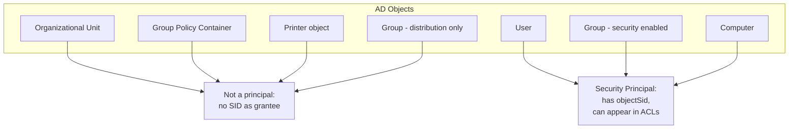
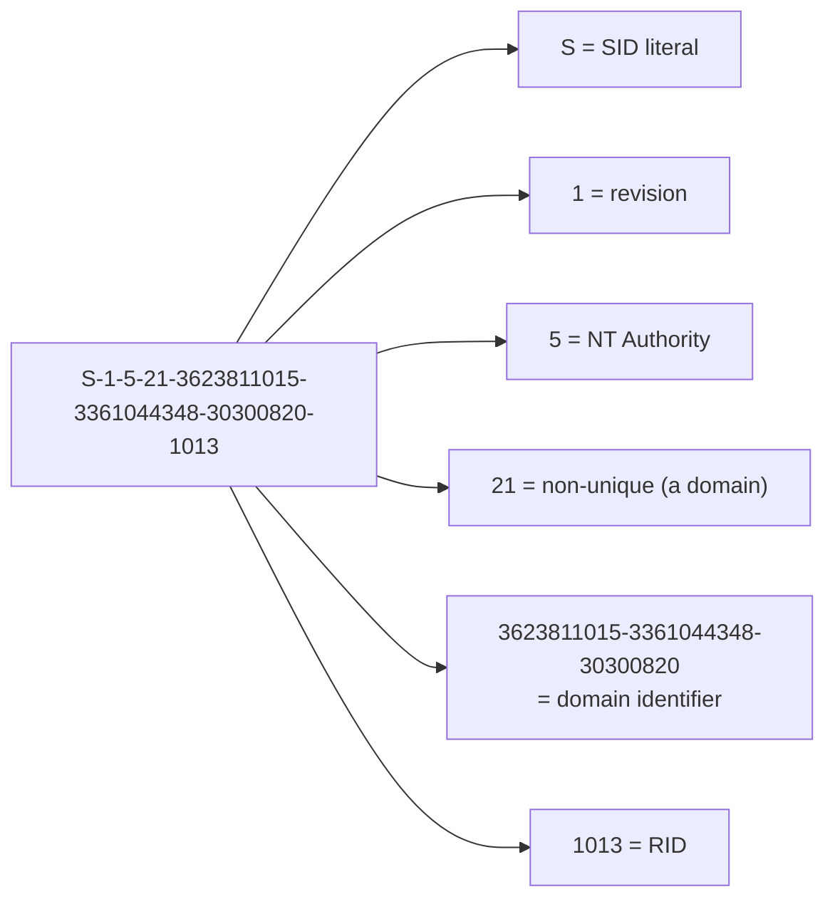
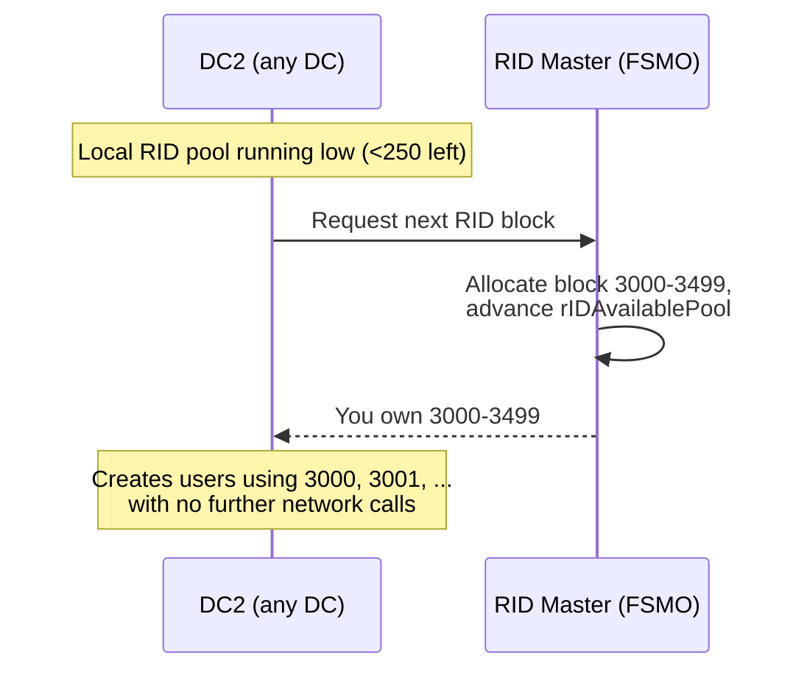
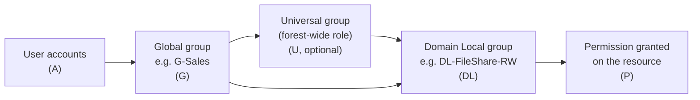
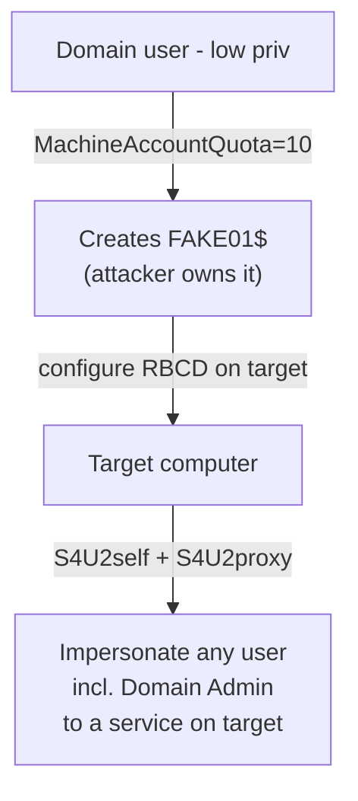
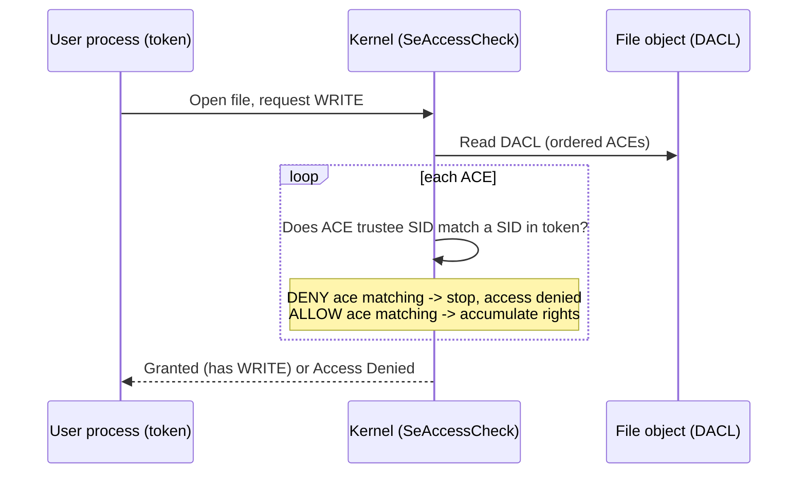
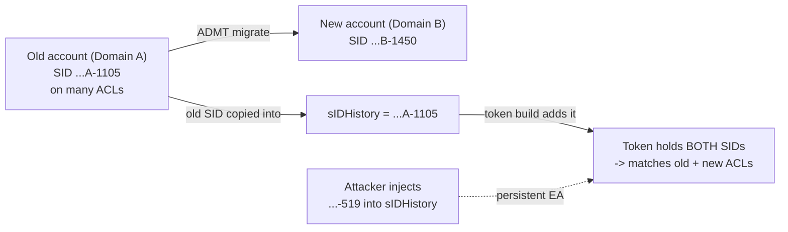

**Level:** Intermediate · **Track:** Foundations · **Read time:** 160 min

This is Chapter 3 of the Active Directory series — Notebook 4. Chapter 1 built the
logical map (objects, OUs, domains, trees, forests, trusts) and Chapter 2 descended
into the machinery that stores and serves it (Domain Controllers, NTDS.dit, LDAP,
the Global Catalog, DNS). Both chapters kept talking about "users", "groups", and
"computers" as if you already knew what they were. This chapter pins that down at
the level Windows actually operates on: the **security principal** and the numeric
identity — the **SID** — that stands in for every principal in every access-control
decision the operating system ever makes.

Almost every AD attack you will later study — Kerberoasting, DCSync, ACL abuse,
delegation, token impersonation, golden and silver tickets, foreign-security-principal
tricks across trusts — ultimately manipulates the objects and SIDs in this chapter.
If SIDs, RIDs, group scope, and access tokens are fuzzy, those attacks will feel like
memorised spells. Once they're concrete, the attacks become obvious consequences of
how identity works. So we go slow and build from the bottom.

## Who This Chapter Is For (and the Map Ahead)

You should be comfortable with Chapters 1 and 2: you know AD is a directory of objects
served over LDAP by Domain Controllers, and that the forest is the security boundary.
You do **not** need to know anything about Windows security internals yet — we start
from "what is a principal" and end at how a Kerberos PAC ships a user's whole group
membership inside a ticket.

The path this chapter takes:

- **Part 1** defines the *security principal* — the only kind of thing Windows can
  grant or deny access to — and separates it from ordinary directory objects.
- **Part 2** dissects the **SID**: its binary structure, every subfield, and how to
  read one by eye.
- **Part 3** covers **RIDs**, the RID master, the RID pool, and why RID 500 / 512 /
  513 matter so much to attackers.
- **Part 4** catalogues the **well-known SIDs** every operator should recognise on
  sight.
- **Part 5** goes deep on **user objects** — the attributes, the UAC flags, the
  `objectSid` / `sIDHistory` fields.
- **Part 6** does the same for **groups**: security vs distribution, and the three
  **group scopes** (Domain Local, Global, Universal) with the AGDLP/AGUDLP rules and
  the nesting limits that flow from them.
- **Part 7** covers **computer accounts** as first-class principals — machine
  passwords, the `$` convention, and why every domain-joined host is a login.
- **Part 8** explains the **access token**: how a SID list becomes an actual
  authorization decision at logon, primary vs impersonation tokens, and integrity
  levels.
- **Part 9** is a full **hands-on lab** enumerating principals and SIDs with
  PowerShell, `whoami`, `PsGetSid`, `wmic`, `RSAT`, and `Get-ADUser`/`Get-ADGroup`.
- **Part 10** covers **SID history, foreign security principals, and cross-domain
  identity**.
- **Part 11** collects the **common pitfalls and misconceptions**.
- **Part 12** is the consolidated **Detection & Defense Angle**.
- **Parts 13–15** are the **Final Revision**, **Cheat Sheet**, and topic-specific
  **Practice Labs**.

Offensive and defensive relevance is woven into each part where it belongs, exactly
as the reference chapters do it — not bolted on at the end.

## Part 1: What a Security Principal Actually Is

A **security principal** is any object in Active Directory (or on a standalone
Windows machine) that can be *authenticated* and to which the operating system can
*assign permissions*. Concretely, it is anything that can be the subject of an access
decision — something that can hold rights, log on, own a resource, or appear inside
an Access Control Entry (ACE) on some securable object.

There are exactly three kinds of security principal in Active Directory:

| Principal type | Directory `objectClass` | Can log on? | Typical use |
|----------------|-------------------------|-------------|-------------|
| **User** | `user` (or `inetOrgPerson`) | Yes (interactive/network) | A human or a service identity |
| **Group** | `group` (security-enabled) | No | A named bag of SIDs used in ACLs |
| **Computer** | `computer` (subclass of `user`) | Yes (as `HOST$`) | A domain-joined machine's own identity |

The defining property they share is that each one owns a **SID** — a Security
Identifier — stored in its `objectSid` attribute. The SID, *not* the name, is what
Windows records inside ACLs, tokens, and tickets. Names are for humans; SIDs are for
the kernel.

This is the single most important idea in the chapter, so state it plainly:

> **Windows never makes an access decision based on a name. It compares SIDs.**

A user named `jsmith` could be renamed to `jane.smith`, moved to a different OU, or
have their `sAMAccountName` changed entirely, and every permission they hold survives
untouched — because the ACEs reference their SID, which never changes. Conversely, if
you delete `jsmith` and recreate an account with the same name, the new account gets a
*new* SID and inherits **none** of the old permissions. Same name, different principal.

**Not** every AD object is a security principal. An Organizational Unit, a Group
Policy Container, a printer object, a `contact`, or a *distribution* group (see Part 6)
are directory objects but have no `objectSid` and can never appear in an ACL as the
grantee of a permission. When someone says "principal", they mean specifically the
user/group/computer trio above.

**Security relevance:** the whole of AD attacking is, at bottom, a search for a path
by which a SID you control can reach a SID you want — Administrator, a Domain Admin
group, a Tier-0 computer. BloodHound's entire graph is nodes (principals, identified
by SID) connected by edges (ACEs and group memberships). Everything downstream depends
on the definitions in this part.



### Local principals vs domain principals

Every Windows machine has a **local** security database (the SAM — Security Account
Manager, covered in the Windows notebook) with its *own* local users and groups, each
with its own local SID. When a machine joins a domain, it gains access to **domain**
principals as well, whose SIDs are minted by the domain. A logged-on user's access
token (Part 8) can contain a mix: their domain SID, their domain group SIDs, and local
group SIDs from the machine they're sitting on (e.g. the local `Administrators` group).

The distinction matters constantly in practice: `Administrator` on a workstation
(local SID ending in `-500` under the *machine* SID) is a completely different
principal from the domain's `Administrator` (RID 500 under the *domain* SID), even
though both are called "Administrator". Confusing the two is a classic source of both
failed logons and misjudged attack paths.

## Part 2: The SID — Anatomy of a Security Identifier

A **SID** (Security Identifier) is a variable-length, immutable, globally-unique
binary value that identifies a security principal. You almost always see it in its
canonical string form (the "S-R-I-S-S…" or "SDDL" form). Here is a real domain user
SID, dissected:

```
S-1-5-21-3623811015-3361044348-30300820-1013
│ │ │  │─────────────────────────────────│ │
│ │ │              domain identifier       │
│ │ │  (three 32-bit sub-authorities)      │
│ │ │                                       └── RID (relative ID): 1013
│ │ └── sub-authority 1 = 21 (SECURITY_NT_NON_UNIQUE, i.e. a domain/machine)
│ └──── identifier authority = 5 (SECURITY_NT_AUTHORITY)
└────── revision = 1 (always 1)
```

Read left to right, every SID is:

1. **`S`** — a literal prefix meaning "this string is a SID".
2. **Revision** — the SID structure version. Always `1` in every Windows in existence.
3. **Identifier authority** — a 48-bit value naming the authority that issued the SID.
   In practice you see a small set (Part 4): `0` (Null), `1` (World), `3` (Creator),
   `5` (NT Authority — by far the most common), `15` (App Package), `16` (Mandatory
   Label, i.e. integrity levels).
4. **Sub-authorities** — a sequence of up to 15 32-bit values that narrow the identity.
   For an NT domain principal the first sub-authority is `21`
   (`SECURITY_NT_NON_UNIQUE`), followed by the three-part **domain identifier**, and
   finally the **RID**.

So the general shape of a domain principal SID is:

```
S-1-5-21-<X>-<Y>-<Z>-<RID>
         └─────┬─────┘  └─ per-principal relative identifier
          domain identifier (identical for every principal in the domain)
```

The **domain identifier** — the `21-X-Y-Z` portion — is generated once when the domain
is created, is the same for every principal in that domain, and is what makes SIDs
from two different domains impossible to collide. When you see a pile of SIDs that all
share the same `S-1-5-21-X-Y-Z` prefix and differ only in their trailing number, you
are looking at principals from **one** domain. The trailing number is the RID.

**Reading SIDs by eye — a skill worth drilling.** Given
`S-1-5-21-3623811015-3361044348-30300820-512`, you should immediately read:
"NT Authority, a domain (`21`), domain identifier `3623811015-3361044348-30300820`,
RID `512` = **Domain Admins**." Given `S-1-5-32-544` you read "NT Authority, the
built-in domain (`32`), RID `544` = **BUILTIN\\Administrators**." That fluency pays
off every time you stare at a raw ACL, a token dump, or a BloodHound export.



### Why SIDs are immutable and why that matters

A principal's SID is minted at creation and **never changes** for the life of the
object — not on rename, not on move, not on password reset. This immutability is the
bedrock of the "permissions survive rename" behaviour from Part 1, but it has a darker
consequence attackers exploit: because a SID uniquely and permanently identifies "who
you are" to Windows, if an attacker can *forge* or *inject* a privileged SID into a
token or ticket, Windows will honour it. That is exactly the mechanism behind
**golden tickets** (a forged TGT stuffed with the SID of Domain Admins) and
**SID-history injection** (Part 10). The SID is trusted implicitly; guard what can
write one.

### The RID-500 / RID-512 pattern you must memorise

Because the domain identifier is constant within a domain, the *only* part of a SID
that identifies which principal you're dealing with is the RID. A handful of RIDs are
fixed by Windows and identical in **every** domain on Earth:

| RID | Principal | Why it matters |
|-----|-----------|----------------|
| 500 | Administrator (built-in) | The true domain admin account; cannot be locked out by policy by default; renaming it does not change RID 500 |
| 501 | Guest | Usually disabled; a re-enabled Guest is a finding |
| 502 | `krbtgt` | The account whose hash signs every TGT — the golden-ticket key |
| 512 | Domain Admins | Full control of the domain |
| 513 | Domain Users | Every user is a member |
| 514 | Domain Guests | |
| 515 | Domain Computers | Every domain-joined machine |
| 516 | Domain Controllers | |
| 518 | Schema Admins | Forest-level |
| 519 | Enterprise Admins | Forest-level — the real crown jewels |
| 520 | Group Policy Creator Owners | |
| 526 | Key Admins | |
| 527 | Enterprise Key Admins | |

**Red team usage:** on any new domain, `krbtgt` (RID 502) and Enterprise/Domain Admins
(519/512) are the objectives you enumerate for immediately, because their RIDs are
known constants — you don't have to guess names, you can build the SID from the domain
identifier and the fixed RID. **Blue team usage:** RID-500 logons, RID-502 (`krbtgt`)
authentication activity, and any change to membership of RID 512/519 groups are among
the highest-signal events in a SOC.

## Part 3: RIDs, the RID Master, and the RID Pool

A **RID** (Relative Identifier) is the trailing 32-bit number in a domain-principal
SID. "Relative" means relative to the domain identifier: the domain identifier says
*which domain*, the RID says *which principal within it*. Together they form the full,
globally unique SID.

RIDs below 1000 are **reserved** for the built-in accounts and groups in the table
above. Every principal you create — every real user, group, and computer — gets a RID
of **1000 or higher**, allocated sequentially. The first ordinary object in a fresh
domain gets RID 1000, the next 1001, and so on. RIDs are never reused within a domain;
delete a user and its RID is retired.

### How RIDs are allocated: the RID Master and RID pools

Recall from Chapter 2 that AD is multi-master — any DC can create objects. But RIDs
must be globally unique across the domain, and if two DCs both handed out RID 1000
you'd have a SID collision. AD solves this with one of the five **FSMO** (Flexible
Single Master Operations) roles: the **RID Master**.

- Exactly one DC in the domain holds the **RID Master** role.
- The RID Master owns the domain's entire space of unallocated RIDs.
- Each DC requests a **RID pool** — a block of RIDs (default 500) — from the RID
  Master in advance.
- When a DC creates a principal, it consumes the next RID from its **local** pool
  without contacting anyone. No collisions, because no two DCs hold the same block.
- When a DC's pool drops below a threshold (half, i.e. ~250 remaining), it requests
  the next block from the RID Master ahead of time.



**Why an operator cares:** if the RID Master is offline for a long time and DCs
exhaust their local pools, **object creation stops** domain-wide — you cannot create
new users, groups, or join machines. It is also possible (historically, via a bug or
malicious tampering) to inflate the global RID pool; Microsoft added a
`rIDAvailablePool` sanity cap because a corrupted pool can effectively brick the
domain's ability to ever create objects again. The relevant attributes live on the
`CN=RID Manager$,CN=System,DC=…` object: `rIDAvailablePool` (global remaining space)
and, per DC, `rIDAllocationPool` / `rIDNextRID`.

**Blue team usage:** an unexpected jump in the RID counter, or creation of many
principals in a short window, can indicate mass account creation by an attacker
establishing persistence. **Red team usage:** the sequential nature of RIDs enables
**RID cycling** — an unauthenticated or low-priv enumeration technique where you take a
known domain SID and brute-force RIDs `1000, 1001, 1002…` to resolve every principal
name via SAMR/LSA, even without directory read rights. Tools like `lookupsid.py`
(Impacket), `rpcclient`'s `lsaenumsid`/`lookupsids`, and `crackmapexec --rid-brute`
automate exactly this.

```bash
# RID cycling with Impacket's lookupsid.py — resolve every principal by walking RIDs
lookupsid.py 'CORP/jsmith:Passw0rd!'@10.10.10.5 20000
#   arg 1: DOMAIN/user:password@target
#   arg 2: max RID to enumerate up to (walks 1000..20000)
```

Realistic output:

```
Impacket v0.11.0 - Copyright 2023 Fortra

[*] Brute forcing SIDs at 10.10.10.5
[*] StringBinding ncacn_np:10.10.10.5[\pipe\lsarpc]
[*] Domain SID is: S-1-5-21-3623811015-3361044348-30300820
500: CORP\Administrator (SidTypeUser)
501: CORP\Guest (SidTypeUser)
502: CORP\krbtgt (SidTypeUser)
512: CORP\Domain Admins (SidTypeGroup)
513: CORP\Domain Users (SidTypeGroup)
1000: CORP\DC01$ (SidTypeUser)
1103: CORP\jsmith (SidTypeUser)
1104: CORP\svc_sql (SidTypeUser)
1105: CORP\backupadmin (SidTypeUser)
...
```

Notice how RID cycling hands you a full principal inventory — including juicy service
accounts like `svc_sql` — from a *single* low-privilege credential, purely because the
domain identifier is constant and RIDs are sequential.

## Part 4: Well-Known SIDs You Must Recognise on Sight

Some SIDs are hard-coded across all Windows systems — they don't belong to any
particular domain and their meaning never changes. Fluency with these is the
difference between reading an ACL and guessing at one. Group them by identifier
authority:

| SID | Name | Meaning / where you meet it |
|-----|------|-----------------------------|
| `S-1-0-0` | Null / Nobody | A "no principal" placeholder |
| `S-1-1-0` | **Everyone** | All users incl. anonymous (config-dependent); a permissive ACE grantee |
| `S-1-2-0` | Local | Anyone logged on locally |
| `S-1-3-0` | Creator Owner | Replaced by the SID of the object's creator via inheritance |
| `S-1-3-1` | Creator Group | Likewise for the creator's primary group |
| `S-1-5-2` | Network | Any principal logged on over the network |
| `S-1-5-4` | Interactive | Any principal logged on at the console/RDP |
| `S-1-5-6` | Service | Any principal logged on as a service |
| `S-1-5-7` | Anonymous | Unauthenticated (null session) access |
| `S-1-5-11` | **Authenticated Users** | Every principal that authenticated — the "safe Everyone" |
| `S-1-5-18` | **Local System** (`SYSTEM`) | The all-powerful local machine account context |
| `S-1-5-19` | Local Service | Low-priv service context |
| `S-1-5-20` | Network Service | Service context that authenticates to network as the machine account |
| `S-1-5-32-544` | **BUILTIN\Administrators** | Local admins on any machine |
| `S-1-5-32-545` | BUILTIN\Users | |
| `S-1-5-32-546` | BUILTIN\Guests | |
| `S-1-5-32-551` | BUILTIN\Backup Operators | Can back up/restore any file — SeBackupPrivilege |
| `S-1-5-32-555` | BUILTIN\Remote Desktop Users | |
| `S-1-5-32-562` | BUILTIN\Distributed COM Users | |
| `S-1-16-12288` | High Mandatory Level | Integrity level of an elevated process |
| `S-1-16-8192` | Medium Mandatory Level | Integrity level of a normal user process |

Three of these deserve special emphasis because attackers and defenders trip over them
constantly:

- **`S-1-1-0` Everyone vs `S-1-5-11` Authenticated Users.** "Everyone" historically
  could include the Anonymous logon (`S-1-5-7`); "Authenticated Users" cannot. A share
  or ACL granting **Everyone** is meaningfully more exposed than one granting
  **Authenticated Users**. On modern Windows, Anonymous is excluded from Everyone by
  default (`RestrictAnonymous`/`EveryoneIncludesAnonymous`), but never assume it.
- **`S-1-5-18` SYSTEM.** This is the machine's own omnipotent local context — *higher*
  privilege locally than a Domain Admin's interactive session. Half of local privilege
  escalation is "get from medium-integrity user to SYSTEM". On a Domain Controller,
  SYSTEM effectively *is* the domain. **Red team usage:** many DCSync/backup primitives
  ultimately run as SYSTEM on a DC.
- **`S-1-5-32-544` BUILTIN\Administrators** is a *domain-local* group (Part 6) that
  exists on every machine and inside the domain's BUILTIN container; do not confuse
  membership in local Administrators on a workstation with Domain Admins.

These SIDs have **no** `21` and **no** domain identifier — that's how you spot a
well-known SID instantly: short, no `-21-`, ends in a small reserved number.

## Part 5: User Objects in Depth

A user is an object of `objectClass=user`. Beyond `objectSid`, a handful of its
attributes drive both day-to-day administration and nearly every AD attack. The ones
worth knowing cold:

| Attribute | Meaning | Attacker/defender relevance |
|-----------|---------|-----------------------------|
| `objectSid` | The user's SID | The identity used in every ACL/token |
| `sAMAccountName` | Pre-Windows-2000 logon name (`jsmith`) | The name you authenticate with; ≤20 chars |
| `userPrincipalName` (UPN) | `jsmith@corp.local` | Modern logon name; used in Kerberos/AAD |
| `distinguishedName` (DN) | Full LDAP path | Where the object lives |
| `userAccountControl` (UAC) | Bit-flags: enabled, locked, no-preauth, trusted-for-delegation, etc. | Central to Kerberoast/AS-REP/delegation |
| `servicePrincipalName` (SPN) | Service identities the account runs | An account *with* an SPN is Kerberoastable |
| `pwdLastSet` | When password last changed | Stale service-account passwords = weak keys |
| `sIDHistory` | Old SIDs from prior domains | SID-history injection (Part 10) |
| `memberOf` | Back-links to groups | Group membership (note: not the full story — Part 6) |
| `adminCount` | 1 if protected by AdminSDHolder | Flags current/former privileged users |
| `ntSecurityDescriptor` | The object's own ACL | ACL-abuse edges (WriteDacl, GenericAll…) |

### userAccountControl — the flag field that powers half of AD attacks

`userAccountControl` is a single integer whose bits encode the account's state and
capabilities. You must be able to read at least these bits, because toolchains express
attack conditions directly in UAC terms:

| Bit value (hex) | Flag | Why it matters offensively |
|-----------------|------|----------------------------|
| `0x0002` | ACCOUNTDISABLE | Account disabled |
| `0x0010` | LOCKOUT | Account locked out |
| `0x0020` | PASSWD_NOTREQD | No password required — trivial takeover |
| `0x0200` | NORMAL_ACCOUNT | Ordinary user |
| `0x0800` | INTERDOMAIN_TRUST_ACCOUNT | A trust principal |
| `0x1000` | WORKSTATION_TRUST_ACCOUNT | A computer account |
| `0x2000` | SERVER_TRUST_ACCOUNT | A DC's account |
| `0x10000` | DONT_EXPIRE_PASSWD | Password never expires (common on service accts) |
| `0x40000` | SMARTCARD_REQUIRED | |
| `0x80000` | TRUSTED_FOR_DELEGATION | **Unconstrained delegation** — a prime target |
| `0x100000` | NOT_DELEGATED | "Account is sensitive and cannot be delegated" — protects it |
| `0x400000` | DONT_REQ_PREAUTH | **AS-REP roastable** — request a roastable blob with no creds |
| `0x1000000` | TRUSTED_TO_AUTH_FOR_DELEGATION | Constrained delegation w/ protocol transition |

**Red team usage:** two LDAP filters find you free wins on almost every engagement:

```
# AS-REP roastable users (DONT_REQ_PREAUTH set):
(&(objectClass=user)(userAccountControl:1.2.840.113556.1.4.803:=4194304))

# Unconstrained-delegation principals (TRUSTED_FOR_DELEGATION set):
(&(objectClass=computer)(userAccountControl:1.2.840.113556.1.4.803:=524288))
```

The `:1.2.840.113556.1.4.803:` is the LDAP **bitwise-AND** matching rule OID — it lets
you test a single bit inside the UAC integer, which is exactly how `Get-ADUser`,
`ldapsearch`, and every roasting tool phrase these queries.

**Blue team usage:** the same filters are your audit. Any user with
`DONT_REQ_PREAUTH`, any account with `PASSWD_NOTREQD`, any computer with unconstrained
delegation that isn't a DC — these are standing findings you should alert on and drive
to zero.

### Service accounts and SPNs

A user account becomes a **service account** in practice when it runs a service and
carries one or more **Service Principal Names** in its `servicePrincipalName`
attribute — e.g. `MSSQLSvc/db01.corp.local:1433`. SPNs are how Kerberos maps a
requested service to the account whose key encrypts the service ticket. The catch:
**any authenticated user can request a service ticket for any SPN**, and the ticket is
encrypted with the service account's password-derived key. If that key is weak, it can
be cracked offline — this is **Kerberoasting**, and it is the direct reason service
accounts deserve 25+ character random passwords or, better, group-Managed Service
Accounts (gMSA). We'll dissect Kerberos in Chapter 5; here, just note that being a
*user with an SPN* is what makes an account roastable, and that's a property of the
user object you can enumerate right now.

## Part 6: Groups — Type, Scope, and the Rules That Govern Nesting

A group is a container of SIDs. Its entire purpose is indirection: instead of putting
50 users on an ACL, you put one group on the ACL and 50 users in the group. Windows
resolves membership at logon and stamps the group's SID into the user's token (Part 8).

Groups have **two independent axes**: *type* and *scope*.

### Group type: Security vs Distribution

- **Security group** — security-enabled; *has a SID*; can appear in ACLs and tokens.
  This is a security principal.
- **Distribution group** — security-*disabled*; used only as an email list
  (Exchange). It is **not** a security principal and cannot be used to grant access.

The flag lives in `groupType` (the high bit `0x80000000` set = security-enabled). A
common admin mistake is creating a distribution group and wondering why permissions
"don't work" — because a distribution group can never carry access. Conversely, a
security group can also be mail-enabled, so it can do both jobs.

### Group scope: Domain Local, Global, Universal

Scope controls two things: **who can be a member** and **where the group can be used**
(i.e. on which resources' ACLs it can appear). This is the part administrators most
often get wrong, so here is the full matrix:

| Scope | Can contain (same domain) | Can contain (other domains in forest) | Can contain (trusted external domains) | Can be used on ACLs in |
|-------|---------------------------|----------------------------------------|----------------------------------------|------------------------|
| **Global** | Users, computers, other **Global** groups | — | — | Any domain in the forest (and trusting domains) |
| **Domain Local** | Users, computers, Global groups, Universal groups (from any domain), other Domain Local (same domain) | Users/computers/Global/Universal | Users/computers/Global | **Only** its own domain |
| **Universal** | Users, computers, Global groups, other Universal groups (from any domain in forest) | Same | — | Any domain in the forest |

The mnemonic Microsoft teaches for correct design is **AGDLP** (and its forest-wide
cousin **AGUDLP**):

- **A**ccounts go into **G**lobal groups (by role/department, per domain).
- Global groups go into **D**omain **L**ocal groups (by resource).
- The Domain Local group is granted the **P**ermission on the resource.

`A → G → DL → P`. Universal groups sit between G and DL for cross-domain roles:
`A → G → U → DL → P` = **AGUDLP**.



**Why the scope rules matter to an attacker.** The scope determines nesting reach, and
nesting reach determines *effective* membership. A user might not be a *direct* member
of Domain Admins, yet be a member of a Global group that is nested (perhaps several
levels deep) into a group that *is* in Domain Admins. Token building (Part 8) flattens
all of this. **This is precisely what BloodHound computes**: transitive group
membership across scopes and domains, so you can ask "what is `jsmith` *effectively* a
member of, following every nesting edge?" The answer is frequently "more than anyone
realised."

Two Universal-scope facts worth internalising:

- **Universal group membership lives in the Global Catalog.** Because a universal
  group can be used forest-wide, its membership must be replicated to every GC (see
  Chapter 2). This is why exploding universal group membership can bloat GC
  replication, and why universal groups behave differently across domains.
- **Universal groups can nest globals from any domain**, which is exactly why AGUDLP
  uses them as the cross-domain hinge.

### Primary group — the one that isn't in `member`

Every user has a **primary group**, referenced not by the group's `member` list but by
the user's `primaryGroupID` attribute — an integer holding the group's **RID**. By
default `primaryGroupID = 513` (Domain Users). Two consequences bite people:

1. **`memberOf` is not the whole truth.** A user's primary group does **not** appear in
   their `memberOf` back-links, and the user does **not** appear in that group's
   `member` attribute. So enumerating groups purely by `member`/`memberOf` *misses the
   primary group*. If someone sets a privileged group as a user's primary group,
   naïve enumeration won't show it. **Red team usage:** setting `primaryGroupID = 512`
   is a stealthy way to grant Domain Admins that evades tools only reading `member`.
   **Blue team usage:** audit `primaryGroupID` for any value other than 513/515/516.
2. Windows won't let you delete a group that is anyone's primary group, and won't let
   you remove a user from a group that is their primary group — you must repoint the
   primary first.

**IR use case:** when investigating a suspected privilege grant, always check both the
group's `member` attribute *and* every candidate user's `primaryGroupID`; the two
together are the real membership.

## Part 7: Computer Accounts — Machines Are Principals Too

This is the part newcomers under-appreciate: **every domain-joined computer has its own
account in AD and is a full security principal**, with an `objectSid`, a password, and
group memberships. The account name is the machine name with a trailing **`$`** — e.g.
`DC01$`, `WKSTN5$`. Its `objectClass` is `computer`, which is a *subclass of `user`*,
so a computer account has all the user attributes plus machine-specific ones
(`dNSHostName`, `servicePrincipalName` with `HOST/…` and `RestrictedKrbHost/…` SPNs,
`operatingSystem`, `ms-DS-MachineAccountQuota`, etc.).

Key facts that surprise people:

- **A computer authenticates to the domain using its machine account password**, just
  like a user does. That password is 120 UTF-16 characters of cryptographic randomness,
  auto-rotated by default every **30 days**, and stored locally under
  `HKLM\SECURITY\Policy\Secrets$MACHINE.ACC`. Because it's long and random, machine
  accounts are *not* Kerberoastable in practice — but their hashes are gold if you can
  read LSA secrets on the host (you become the machine).
- **The machine account is a member of `Domain Computers` (RID 515)** and its SID is a
  perfectly ordinary `S-1-5-21-…-<RID≥1000>`. A Domain Controller's account is instead
  a member of `Domain Controllers` (RID 516) and carries the `SERVER_TRUST_ACCOUNT`
  UAC flag.
- **`SYSTEM` (`S-1-5-18`) on a domain-joined host acts on the network *as the machine
  account*.** So code running as SYSTEM can authenticate to other systems as `HOST$`.
  On a DC, that machine account has enormous rights — which is why "SYSTEM on the DC"
  ≈ "own the domain".
- **`ms-DS-MachineAccountQuota` defaults to 10**: any authenticated user may join up to
  ten computers to the domain, *creating* those computer accounts and becoming their
  owner. **Red team usage:** this default powers **RBCD** (resource-based constrained
  delegation) attacks and the **noPac/sAMAccountName-spoofing** family — an attacker
  with one low-priv account creates a machine account they control and leverages it.
  **Blue team usage:** set `MachineAccountQuota = 0` and delegate machine-join to a
  specific group.



**CTF/lab angle:** on HackTheBox and TryHackMe AD boxes, the chain "low-priv creds →
create machine account via default quota → RBCD → impersonate admin" appears again and
again; recognising that a *computer* is just another principal you can create is the
unlock.

## Part 8: From SIDs to a Decision — The Access Token

We've built up principals and their SIDs. Now: how does a pile of SIDs become an actual
"allow" or "deny" when a user opens a file? Through the **access token**.

When a principal authenticates (interactive logon, network logon, service start), the
Local Security Authority (LSASS) builds an **access token** — an in-memory kernel
object that travels with every process and thread the user runs. The token contains:

- The **user's SID** (`objectSid`).
- The **SIDs of every group** the user is (transitively) a member of — globals,
  universals, domain-locals, built-ins, and well-known SIDs like Authenticated Users
  (`S-1-5-11`) and, for a network logon, Network (`S-1-5-2`).
- The user's **privileges** (SeDebugPrivilege, SeBackupPrivilege, etc.) — these are
  *not* SIDs; they are named rights granted to the token.
- The token's **integrity level** (a Mandatory Label SID, `S-1-16-…`).
- Logon session ID, primary group, default DACL, and more.

When the user touches a securable object, the kernel's **access check** walks the
object's DACL, comparing each ACE's trustee SID against the SIDs in the token, in
order, accumulating granted/denied rights until the requested access is fully granted
or explicitly denied. **This is the moment all of the preceding parts pay off**: the
"who" in that comparison is a list of SIDs assembled from group membership; the "what"
is an ACE; the decision is pure SID matching.



### Primary vs impersonation tokens

- A **primary token** is attached to a process and defines its default security
  context.
- An **impersonation token** lets a thread temporarily act as *another* principal —
  the mechanism a server uses to do work "as the client". Impersonation tokens have
  levels (Anonymous, Identification, Impersonation, Delegation).

**Red team usage:** token theft/impersonation is a core lateral-movement primitive. If
you're SYSTEM and a Domain Admin has a process (and thus a token) on your box, tools
like Incognito, `Invoke-TokenManipulation`, or Cobalt Strike's `steal_token` can
duplicate that token and let you act as the admin — *without their password*. The famous
**"Potato" family** (JuicyPotato, RoguePotato, PrintSpoofer, GodPotato) all abuse
service impersonation to grab a `SYSTEM` token from a `SeImpersonatePrivilege` context.
Everything they do is token manipulation over the SID/privilege model in this part.

### Token freshness — why re-logon matters

Because group SIDs are baked into the token **at logon**, adding a user to a group does
**not** grant them the new access until they get a **new token** (log off/on, or a new
network logon). This is the "I added them to the group but they still can't access the
share" helpdesk classic — and, on the offensive side, why after modifying a group you
often need to re-authenticate to materialise the new membership in a fresh ticket/token.

### Integrity levels (a quick but important note)

Windows layers **Mandatory Integrity Control** on top of the DACL. Every token and
every securable object has an integrity level (Untrusted < Low < Medium < High <
System, as Mandatory Label SIDs `S-1-16-…`). A lower-integrity process cannot write to a
higher-integrity object even if the DACL would allow it. This is why a normal admin's
processes run at **Medium** until UAC elevation lifts them to **High**, and why browser
sandboxes run at **Low**. Local privilege escalation is frequently framed as raising
your token's integrity/privilege set to reach SYSTEM.

## Part 9: Hands-On Lab — Enumerating Principals and SIDs

This lab assumes a domain-joined Windows box (or a Kali box with creds and network
reach to a DC) in a lab domain `CORP.LOCAL`. Every command below is real, with flags
explained. Do this only in your own lab.

### 9.1 Who am I, and what SIDs are in my token?

The fastest first move on any Windows session:

```cmd
whoami /user        :: your account name and SID
whoami /groups      :: every group SID in your token, with attributes + integrity level
whoami /priv        :: privileges held by your token (SeDebugPrivilege, etc.)
whoami /all         :: all of the above at once
```

Realistic `whoami /user` output:

```
USER INFORMATION
----------------
User Name    SID
============ ==============================================
corp\jsmith  S-1-5-21-3623811015-3361044348-30300820-1103
```

And a trimmed `whoami /groups`:

```
GROUP INFORMATION
-----------------
Group Name                             Type             SID                                          Attributes
====================================== ================ ============================================ ==================
Everyone                               Well-known group S-1-1-0                                      Mandatory, Enabled
BUILTIN\Users                          Alias            S-1-5-32-545                                 Mandatory, Enabled
CORP\Domain Users                      Group            S-1-5-21-3623811015-...-513                  Mandatory, Enabled
CORP\IT-Support                        Group            S-1-5-21-3623811015-...-1142                 Mandatory, Enabled
NT AUTHORITY\Authenticated Users       Well-known group S-1-5-11                                     Mandatory, Enabled
Mandatory Label\Medium Mandatory Level Label            S-1-16-8192
```

Read this like an operator: your token carries `Domain Users` (513), a real group
`IT-Support` (1142), `Authenticated Users` (S-1-5-11), and you're at **Medium**
integrity — i.e. not elevated. That last line tells a privesc hunter exactly where they
stand.

### 9.2 Convert between SIDs and names

Two built-in ways plus Sysinternals:

```powershell
# .NET translation both directions
$sid = (New-Object System.Security.Principal.NTAccount("CORP","Domain Admins")).
        Translate([System.Security.Principal.SecurityIdentifier]).Value
$sid                                   # -> S-1-5-21-...-512

# Reverse: SID string -> name
([System.Security.Principal.SecurityIdentifier]"S-1-5-21-3623811015-3361044348-30300820-512").
  Translate([System.Security.Principal.NTAccount]).Value   # -> CORP\Domain Admins
```

```cmd
:: Sysinternals PsGetSid — resolve a name to a SID or vice-versa, local or domain
PsGetSid64.exe CORP\jsmith
PsGetSid64.exe S-1-5-21-3623811015-3361044348-30300820-1103
PsGetSid64.exe \\DC01 -   :: with no account -> prints the machine/domain SID itself
```

`PsGetSid` with just a computer and no account prints that machine's SID — how you grab
the **domain identifier** to then build well-known-RID SIDs by hand.

### 9.3 Enumerate users, groups, and computers with RSAT / ActiveDirectory module

Install the AD PowerShell module (RSAT) once, then:

```powershell
Import-Module ActiveDirectory

# All users with the attributes that matter, as a table
Get-ADUser -Filter * -Properties SamAccountName,SID,userAccountControl,servicePrincipalName,adminCount |
  Select-Object SamAccountName,
                @{n='RID';e={($_.SID.Value -split '-')[-1]}},
                userAccountControl, adminCount |
  Format-Table -Auto

# Kerberoastable users: any user WITH an SPN set
Get-ADUser -Filter 'servicePrincipalName -like "*"' -Properties servicePrincipalName |
  Select SamAccountName, servicePrincipalName

# AS-REP roastable users: DONT_REQ_PREAUTH bit (0x400000) set in UAC
Get-ADUser -LDAPFilter '(userAccountControl:1.2.840.113556.1.4.803:=4194304)' -Properties userAccountControl |
  Select SamAccountName

# Members of Domain Admins, resolved transitively (follows nesting!)
Get-ADGroupMember -Identity "Domain Admins" -Recursive |
  Select-Object name, objectClass, SID

# Every computer account, with OS and delegation flags
Get-ADComputer -Filter * -Properties operatingSystem,userAccountControl,servicePrincipalName |
  Select Name, operatingSystem,
         @{n='RID';e={($_.SID.Value -split '-')[-1]}}
```

The `-Recursive` on `Get-ADGroupMember` is the important flag — it flattens nested
group membership, which is precisely the transitive reach discussed in Part 6. Note it
still won't catch **primary-group** membership (Part 6.3), so cross-check:

```powershell
# Find anyone whose PRIMARY group is Domain Admins (RID 512) — the sneaky path
Get-ADUser -Filter * -Properties primaryGroupID |
  Where-Object { $_.primaryGroupID -eq 512 } |
  Select SamAccountName, primaryGroupID
```

### 9.4 From Linux / Kali with just credentials

No Windows box required — Impacket and friends speak the same protocols:

```bash
# Full principal dump over LDAP (users/groups/computers) + BloodHound-ready data
nxc ldap 10.10.10.5 -u jsmith -p 'Passw0rd!' --users
nxc ldap 10.10.10.5 -u jsmith -p 'Passw0rd!' --groups
nxc ldap 10.10.10.5 -u jsmith -p 'Passw0rd!' --bloodhound -c All --dns-server 10.10.10.5

# Resolve every principal via RID cycling (works even with SAMR-only access)
nxc smb 10.10.10.5 -u jsmith -p 'Passw0rd!' --rid-brute 5000

# Grab the domain SID directly
lookupsid.py 'CORP/jsmith:Passw0rd!'@10.10.10.5 0 | head
```

`nxc` (NetExec, the maintained successor to CrackMapExec) is the swiss-army enumerator:
`--users`/`--groups` read via LDAP; `--rid-brute` walks RIDs via SAMR; `--bloodhound`
collects the graph. Introduced from scratch: it takes `<protocol> <target> -u <user>
-p <pass>` and a module flag; it authenticates, runs the module, and prints results.

Expected `--rid-brute` snippet:

```
SMB  10.10.10.5  445  DC01  [+] CORP\jsmith:Passw0rd!
SMB  10.10.10.5  445  DC01  500: CORP\Administrator (SidTypeUser)
SMB  10.10.10.5  445  DC01  502: CORP\krbtgt (SidTypeUser)
SMB  10.10.10.5  445  DC01  512: CORP\Domain Admins (SidTypeGroup)
SMB  10.10.10.5  445  DC01  1104: CORP\svc_sql (SidTypeUser)
SMB  10.10.10.5  445  DC01  1108: CORP\helpdesk (SidTypeGroup)
```

### 9.5 Reading a SID out of a raw ACL

To see why all this matters, dump an ACL and watch raw SIDs appear where a group has no
resolvable name (a classic sign of a *foreign* or *orphaned* SID — Part 10):

```powershell
(Get-Acl "\\FS01\Finance").Access |
  Select IdentityReference, FileSystemRights, AccessControlType
```

If an entry shows a bare `S-1-5-21-...-1152` instead of a friendly name, that SID
belongs to a principal Windows can't resolve on this machine — often a deleted account
(leaving an **orphaned SID** on the ACL) or a principal from a trusted domain. Both are
worth chasing down.

## Part 10: SID History, Foreign Security Principals & Cross-Domain Identity

SIDs are minted per-domain, but principals move — during migrations, and across trusts.
Windows handles this with two mechanisms that are also two well-known attack surfaces.

### `sIDHistory` — carrying old identities across a migration

When an account is migrated from domain A to domain B (e.g. an ADMT domain
consolidation), it gets a **new** SID in domain B. But all its *old* permissions in
domain A reference its *old* SID. To avoid re-permissioning everything, the migration
tool writes the account's old SID into the new account's **`sIDHistory`** attribute.
At logon, every SID in `sIDHistory` is **added to the user's token** alongside the new
SID — so the migrated user still matches all the old ACEs.

That is enormously convenient and enormously dangerous. Because token building blindly
trusts `sIDHistory`, **injecting a privileged SID into `sIDHistory` grants that
privilege**. If an attacker can write `S-1-5-21-<domain>-519` (Enterprise Admins) into
some account's `sIDHistory`, that account is effectively Enterprise Admin at every
logon — a stealthy, persistent backdoor that doesn't appear in any group's `member`
list.



**Blue team usage:** `sIDHistory` should be **empty** on almost every account outside an
active migration window; a populated `sIDHistory` — especially one containing a RID like
512/516/519 — is a high-severity hunt. SID filtering on trusts (below) is the boundary
control. **Red team usage:** DCShadow / direct NTDS manipulation with DA rights can set
`sIDHistory`; it survives password resets and is invisible to group-membership audits.

### Foreign Security Principals (FSPs) and SID filtering

When a principal from **domain A** is added to a group in **domain B** across a trust,
domain B can't store domain A's actual user object — so it creates a
**Foreign Security Principal** object in its `CN=ForeignSecurityPrincipals` container,
whose name *is the foreign principal's SID*. That FSP is then the thing placed in the
local group. This is why cross-domain group members sometimes show as raw SIDs.

To stop a compromised or malicious trusted domain from asserting privileged SIDs of the
*trusting* domain (a **SID-history / SID-filtering** attack across trusts),
**SID filtering** strips SIDs that don't belong to the trusted domain from
cross-trust authentication data. Intra-forest trusts historically disable full SID
filtering (they trust each other), which is exactly why **the forest, not the domain,
is the security boundary** — the point Chapter 1 hammered. Across a *forest* trust, SID
filtering (and selective authentication) is the control that keeps a compromise on one
side from trivially asserting Enterprise Admin on the other.

**CTF/lab angle:** multi-domain HTB pro labs and the "forest trust" TryHackMe rooms
build their late-game escalation on exactly this — abusing `sIDHistory` or an
insufficiently filtered trust to jump from a child domain to the forest root.

## Part 11: Common Pitfalls & Misconceptions

- **"Renaming an account changes its identity."** No — the SID is immutable. Rename all
  you like; permissions follow the SID. Delete-and-recreate, on the other hand, mints a
  brand-new SID and drops all prior access.
- **"`memberOf` shows all my groups."** It doesn't. It omits your **primary group**
  (Part 6.3) and it doesn't reflect **well-known / login-type SIDs** (Authenticated
  Users, Network, etc.) that only exist in the *token*. Trust the token
  (`whoami /groups`) for effective membership, and cross-check `primaryGroupID`.
- **"Distribution groups can secure resources."** Never — they aren't security
  principals and carry no usable SID for ACLs. Use a security group.
- **"BUILTIN\Administrators = Domain Admins."** Different principals, different SIDs
  (`S-1-5-32-544` vs `…-512`). Domain Admins is *placed into* local Administrators on
  domain machines, which is why membership overlaps — but they are not the same group.
- **"Everyone = Authenticated Users."** Historically Everyone could include Anonymous
  (`S-1-5-7`); Authenticated Users cannot. Granting Everyone is broader.
- **"Adding a user to a group takes effect immediately."** Not until they get a new
  token (re-logon / new network logon). Group SIDs are baked in at logon.
- **"A SID and a GUID are the same thing."** No. Every AD object also has an
  **`objectGUID`** — a 128-bit forest-unique identifier that, unlike the SID, is stable
  even across domain migrations (the SID changes on migration, the GUID does not). The
  GUID identifies the *object*; the SID identifies the *security principal*. Both are
  immutable within a domain, but they answer different questions.
- **"Machine accounts don't matter."** They're full principals; SYSTEM acts as the
  machine on the network, and the default `MachineAccountQuota=10` lets any user mint
  new ones — a live attack surface.
- **"RID 500 is safe because we renamed Administrator."** Renaming doesn't change RID
  500; attackers resolve it by RID, not by name, and RID-500 retains special
  properties (no lockout by default in older configs).

## Part 12: Detection & Defense Angle

Everything above is also a defensive checklist. Consolidated, the identity layer gives
a SOC and an AD administrator these high-value controls and signals.

**Harden the principals themselves.**

- Drive to **zero**: accounts with `PASSWD_NOTREQD`, users with `DONT_REQ_PREAUTH`
  (AS-REP roastable), non-DC computers `TRUSTED_FOR_DELEGATION` (unconstrained), and
  any populated `sIDHistory` outside a migration. Each is a one-line LDAP audit
  (Part 5) and should be a recurring report.
- Give service accounts (any user with an SPN) 25+ char random passwords or move them
  to **gMSA/dMSA**, killing Kerberoasting value.
- Set `ms-DS-MachineAccountQuota = 0` and delegate machine-join explicitly, closing the
  RBCD/noPac default.
- Put sensitive accounts in **Protected Users** and flag them `NOT_DELEGATED`
  ("Account is sensitive and cannot be delegated").
- Keep **RID 512/518/519/520** (Domain/Schema/Enterprise Admins, GPCO) membership
  minimal and monitored; treat any change as high severity.

**Watch the identity events.** Map these Windows Security event IDs to the concepts in
this chapter:

| Event ID | Meaning | Why it matters here |
|----------|---------|---------------------|
| 4720 | User account created | Mass creation = attacker persistence; watch RID growth |
| 4722 / 4725 | Account enabled / disabled | Re-enabled Guest (RID 501) or disabled admin |
| 4728 / 4732 / 4756 | Member added to global / local / universal **security** group | Membership changes to 512/519 = critical |
| 4738 | User account changed | `userAccountControl` or `primaryGroupID` change (e.g. → 512) |
| 4741 / 4742 | Computer account created / changed | New machine accounts (quota abuse), delegation flag flips |
| 4765 / 4766 | **SID History added** to an account / add failed | Direct signal of `sIDHistory` injection |
| 4624 / 4672 | Logon / special-privileges logon | 4672 = a token with admin-equivalent privileges was issued |

**Blue-team synthesis:** the crown-jewel alerts are (1) any change to RID-512/519
membership (4728/4732/4756 + 4738 for `primaryGroupID`), (2) event **4765** for
SID-history injection, (3) new/modified computer accounts with delegation flags
(4741/4742), and (4) `krbtgt` (RID 502) activity. Nearly every AD dominance technique
touches at least one of these, precisely because they all operate on the principals,
SIDs, and group memberships this chapter defined.

**Least privilege via correct group design.** Implementing **AGDLP/AGUDLP** (Part 6)
isn't bureaucratic tidiness — clean scoping is what makes nesting *auditable*. When
Global groups map to roles and Domain Local groups map to resources, "who can touch
this share" is answerable; when everything is a flat pile of nested universal groups,
BloodHound finds paths you didn't know existed. Tiered administration (Tier 0/1/2,
covered next chapter) builds directly on this.

## Part 13: Final Revision — Recap

- A **security principal** (user, group-security, computer) is the only thing Windows
  can authenticate and permission. Its identity is its **SID** (`objectSid`), stored in
  ACLs/tokens/tickets — **never** its name.
- A **SID** = `S-1-<authority>-…`. Domain principals look like
  `S-1-5-21-<domain identifier>-<RID>`. The domain identifier is constant per domain;
  the **RID** picks the principal. Read them by eye.
- **RIDs < 1000** are reserved (500=Administrator, 502=krbtgt, 512=Domain Admins,
  513=Domain Users, 515=Domain Computers, 516=DCs, 519=Enterprise Admins). Real objects
  start at 1000, allocated by the **RID Master** in **pools** of 500. Sequential RIDs
  enable **RID cycling** enumeration.
- **Well-known SIDs** (no `-21-`): `S-1-1-0` Everyone, `S-1-5-11` Authenticated Users,
  `S-1-5-18` SYSTEM, `S-1-5-32-544` BUILTIN\Administrators, `S-1-16-…` integrity levels.
- **User objects** carry `userAccountControl` bit-flags (AS-REP, delegation,
  PASSWD_NOTREQD) and `servicePrincipalName` (Kerberoastable if set) — the raw material
  of half of AD attacks.
- **Groups** have a **type** (security has a SID; distribution doesn't) and a **scope**
  (Global / Domain Local / Universal) governing membership and reach. Design with
  **AGDLP/AGUDLP**. `primaryGroupID` is a hidden membership `memberOf` won't show.
- **Computers** are full principals (`NAME$`), authenticate with a long auto-rotated
  machine password, and — via default `MachineAccountQuota=10` — can be minted by any
  user (RBCD/noPac). SYSTEM acts as the machine account on the network.
- The **access token** turns transitive group SIDs + privileges + integrity into the
  kernel's access-check decision. Group changes need a **new token** to take effect.
  Impersonation tokens power lateral movement.
- **`sIDHistory`** adds old SIDs to the token at logon — convenient for migrations,
  catastrophic if a privileged SID is injected. **FSPs** and **SID filtering** govern
  cross-domain/forest identity, which is why the *forest* is the security boundary.

## Part 14: Cheat Sheet / Quick Reference

**SID shape**

```
S-1-5-21-<D1>-<D2>-<D3>-<RID>     domain principal
S-1-5-32-<RID>                    BUILTIN alias  (544=Administrators)
S-1-5-<n>                         well-known NT (18=SYSTEM, 11=Auth Users)
S-1-16-<n>                        integrity level (8192=Medium, 12288=High)
```

**Reserved RIDs**

```
500 Administrator   501 Guest        502 krbtgt
512 Domain Admins   513 Domain Users 515 Domain Computers
516 Domain Controllers   518 Schema Admins   519 Enterprise Admins
520 Group Policy Creator Owners
```

**userAccountControl bits (LDAP bitwise OID :1.2.840.113556.1.4.803:)**

```
0x0002 disabled     0x0020 PASSWD_NOTREQD    0x10000 DONT_EXPIRE_PASSWD
0x80000 unconstrained delegation             0x100000 NOT_DELEGATED
0x400000 (4194304) DONT_REQ_PREAUTH -> AS-REP roast
```

**Enumeration one-liners**

```powershell
whoami /all
Get-ADGroupMember "Domain Admins" -Recursive
Get-ADUser -Filter 'servicePrincipalName -like "*"' -pr servicePrincipalName   # roastable
Get-ADUser -LDAPFilter '(userAccountControl:1.2.840.113556.1.4.803:=4194304)'  # AS-REP
Get-ADUser -Filter * -pr primaryGroupID | ? {$_.primaryGroupID -eq 512}        # hidden DA
```

```bash
nxc smb DC -u u -p p --rid-brute 5000        # RID cycle
nxc ldap DC -u u -p p --users --groups        # LDAP enum
lookupsid.py 'DOM/u:p'@DC 20000               # SIDs via SAMR
PsGetSid64.exe \\DC01 -                        # domain SID
```

**Key defensive events:** 4720 (create) · 4728/4732/4756 (group add) · 4738
(`UAC`/`primaryGroupID` change) · 4741/4742 (computer acct) · **4765 (SID history)** ·
4672 (privileged logon).

## Part 15: Practice Labs & Resources

Train these exact skills, not generic AD:

- **TryHackMe — "Active Directory Basics"** and **"Enumerating AD"**: hands-on
  `whoami /groups`, `Get-ADUser`/`Get-ADGroupMember`, and SID reading in a live domain.
- **TryHackMe — "Attacktive Directory"**: RID enumeration, AS-REP roasting
  (`DONT_REQ_PREAUTH`), and turning enumerated principals into initial access — a direct
  application of Parts 3, 5, and 9.
- **HackTheBox — "Forest"** and **"Active"**: AS-REP roasting and service-account/SPN
  abuse; classic realisations of the UAC-flag and SPN material in Part 5.
- **HackTheBox — "Sauna", "Support"**: LDAP enumeration of users/groups and reading
  raw SIDs/attributes off objects.
- **HackTheBox Pro Labs — "Dante"/"Zephyr"/"Cerberus"** and the multi-domain pro labs:
  cross-domain FSPs, `sIDHistory`, and trust/SID-filtering escalation from Part 10.
- **GOAD (Game of Active Directory)** by Orange Cyberdefense: a free, self-hosted
  vulnerable multi-domain forest — build it and run every enumeration command in Part 9,
  then RID-cycle, inspect `primaryGroupID`, and craft an `sIDHistory` scenario safely.
- **Microsoft docs:** "Security identifiers", "Well-known SIDs", and "Access tokens" —
  the authoritative reference for the SID and token structures dissected here.
- **BloodHound / SharpHound:** collect your lab domain and explore how nesting, primary
  groups, and cross-domain FSPs render as graph edges — the visual counterpart to
  Parts 6 and 10.

Practice questions:

1. Given `S-1-5-21-1004336348-1177238915-682003330-1114` and
   `S-1-5-21-1004336348-1177238915-682003330-512`, which domain are they in, and what
   is the second principal? (Answer: same domain — identical domain identifier; the
   second is **Domain Admins**, RID 512.)
2. A user's `memberOf` does not list Domain Admins, yet they have full domain control.
   Name two mechanisms from this chapter that could explain it. (Primary group set to
   RID 512 via `primaryGroupID`; or a privileged SID injected into `sIDHistory`.)
3. Write the LDAP filter that finds every AS-REP-roastable user, and explain each token
   in it. (`(userAccountControl:1.2.840.113556.1.4.803:=4194304)` — bitwise-AND OID
   testing the `0x400000` DONT_REQ_PREAUTH bit.)
4. Why does adding a user to a privileged group not immediately grant access, and what
   forces it to take effect? (Group SIDs are baked into the token at logon; a new
   token — re-logon/new network logon — is required.)
5. Your lab's `MachineAccountQuota` is the default 10. Explain, in principal terms, how
   a single low-priv user can leverage that toward domain compromise, and the one-line
   fix. (They can create computer accounts they own → RBCD/noPac impersonation; set
   `ms-DS-MachineAccountQuota = 0` and delegate joins.)

---

*Also on [Praneeth's portfolio](https://ping-praneeth.vercel.app/notebook/active-directory-fundamentals/03-users-groups-computers-sids-rids-and-security-principals), with comments and the latest edits.*
