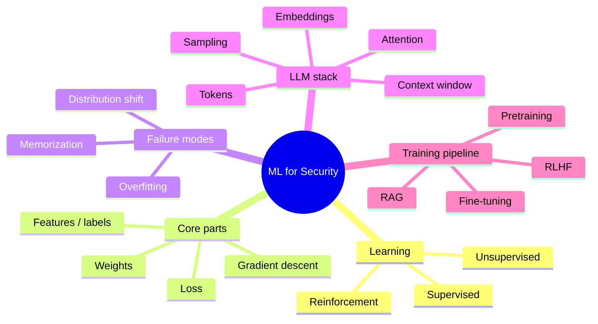
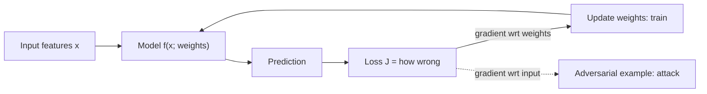
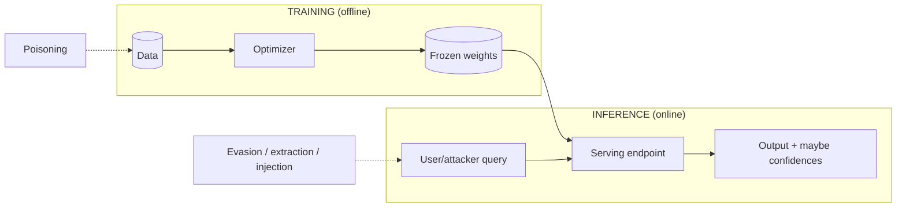
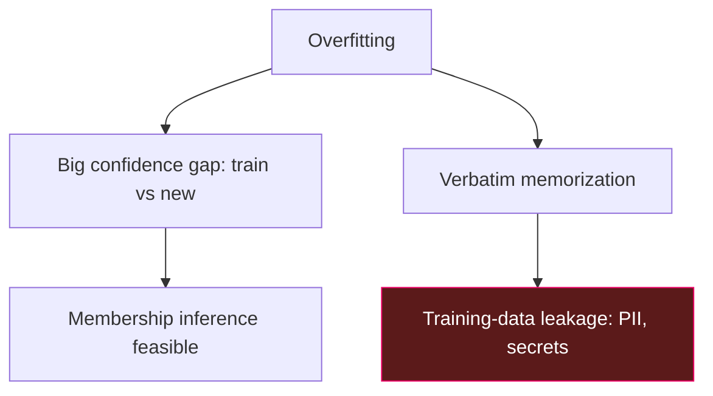
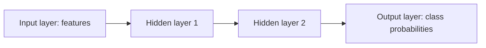
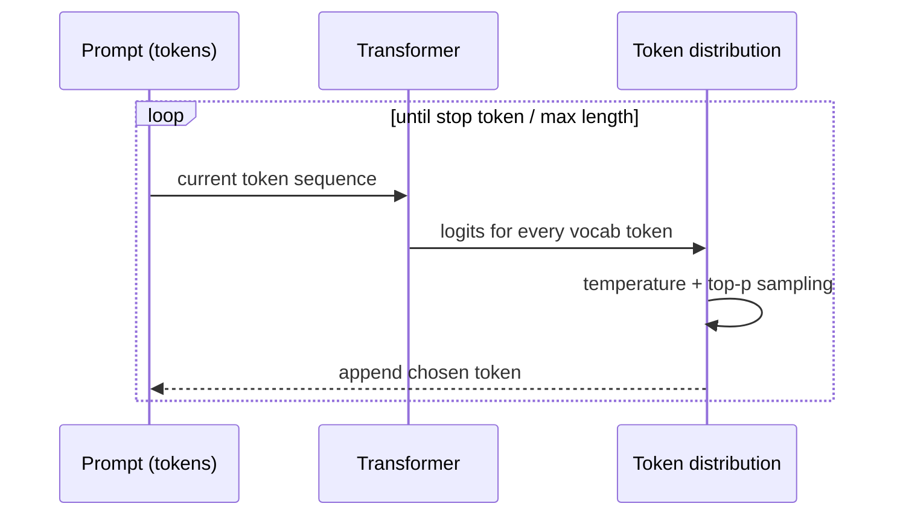
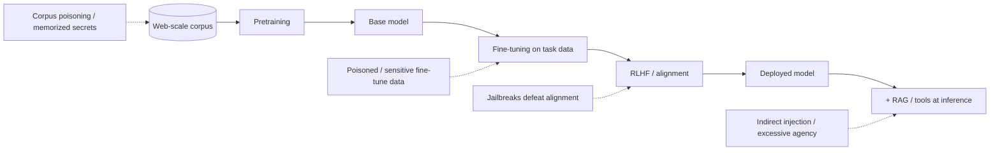
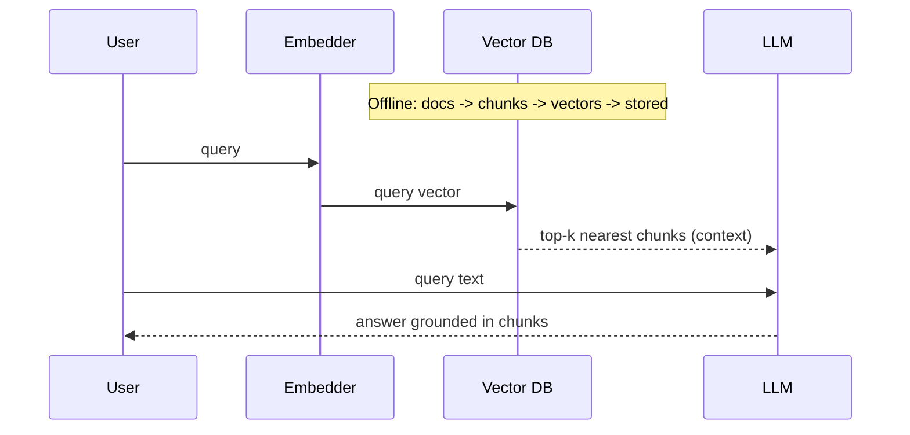

This is Chapter 2 of the AI/ML Security notebook. Chapter 1 mapped the whole
attack surface — the four asset classes, the lifecycle of attacks, and the
frameworks — but it deliberately deferred one thing: *how the machine actually
works*. This chapter fills that gap. You cannot craft an adversarial example
without understanding a decision boundary, cannot reason about model extraction
without understanding what an output reveals, and cannot defend against prompt
injection without understanding that an LLM sees only tokens. Everything here is
taught from zero, for a security person, with the security consequence attached
to each concept rather than saved for later.

The goal is not to make you a machine-learning engineer. It is to give you a
*correct mental model* — one detailed enough that when Chapter 3 crafts
adversarial examples and Chapter 4 injects prompts, the mechanics are obvious
rather than magical.

## Why This Matters

Most security failures in ML systems trace back to a security team that treated
the model as an opaque box and an ML team that treated security as someone
else's problem. The person who can open the box *and* think like an attacker is
the one who finds the bug. Concretely, four fundamentals decide most attacks:

1. **A model is a function fitted to data.** Understand the function and you
   understand where it can be pushed off a cliff (evasion) and what it
   remembers (leakage).
2. **Training and inference are different phases with different trust models.**
   Poisoning lives at training; injection and extraction live at inference. If
   you can't tell which phase you're in, you can't tell which attack applies.
3. **An LLM is a next-token predictor over a single stream of tokens.** This one
   sentence explains prompt injection, jailbreaks, memorization leakage, and why
   "system prompts" are not a security boundary.
4. **Outputs are informative.** Confidence scores, logprobs, and even latency
   leak information about the model and its training data. Every bit an attacker
   sees is a bit they can exploit.

## Who This Is For

Anyone who read Chapter 1 and wants the ML grounding to make the rest of the
notebook click. No calculus required — where math appears, it is the *idea* of
the math (a gradient is "which way is downhill"), not the derivation. If you can
read Python and think in trust boundaries, you are ready.



---

## Part 1: The Three Kinds of Learning

Machine learning is an umbrella over several different setups. You need to tell
them apart because each has a different attack surface.

**Supervised learning** learns from *labelled* examples: pairs of `(input,
correct answer)`. Spam vs. ham, malware vs. benign, fraud vs. legitimate — all
supervised classification. The model's job is to generalize from the examples to
new inputs. **Security relevance:** most ML *security controls* (malware
classifiers, spam filters, fraud models) are supervised classifiers, which makes
them targets for evasion (Chapter 3) and poisoning of their labelled training
data.

**Unsupervised learning** learns structure from *unlabelled* data: clustering,
anomaly detection, dimensionality reduction. **Security relevance:** anomaly
detectors in SOC tooling and UEBA (user and entity behaviour analytics) are
usually unsupervised; attackers evade them by staying inside the "normal"
cluster (low-and-slow), and defenders poison risk by letting the attacker's
baseline become "normal."

**Reinforcement learning (RL)** learns by trial and error against a *reward
signal* — an agent takes actions, gets rewarded or penalized, and adjusts.
**Security relevance:** RLHF (reinforcement learning from human feedback) is how
LLMs are aligned to be "helpful and harmless"; jailbreaks (Chapter 4) are, in
effect, attacks that find inputs where the aligned behaviour breaks down.

| Paradigm | Learns from | Typical output | Classic security use | Primary attack |
|---|---|---|---|---|
| Supervised | Labelled pairs | Class / value | Malware, spam, fraud classifiers | Evasion, poisoning |
| Unsupervised | Unlabelled data | Clusters / scores | Anomaly detection, UEBA | Blend-in evasion, baseline poisoning |
| Reinforcement | Reward signal | Policy / actions | Autonomous agents, RLHF alignment | Reward hacking, jailbreaks |

There is also **self-supervised learning**, the engine behind modern LLMs: the
"label" is generated from the data itself (predict the next word, so the text is
its own supervision). This is why LLMs can train on the raw internet without
human labels — and why anything on the internet, including attacker-planted
text, becomes training signal (the poisoning link from Chapter 1).

---

## Part 2: The Anatomy of a Model — Features, Weights, Loss

Every supervised model, from a one-line linear classifier to a giant neural net,
has the same four moving parts. Learn them once and you can reason about any of
them.

**Features (`x`)** are the numeric representation of the input. A model never
sees "an email" — it sees numbers derived from it: word counts, byte histograms,
pixel values, embeddings. **Feature engineering** is choosing that
representation. **Security relevance:** the feature representation *is* the
attack surface for evasion. If a malware classifier only looks at imported API
names, an attacker adds junk imports to move the feature vector across the
boundary without changing behaviour.

**Labels (`y`)** are the correct answers for training examples (supervised
only).

**Weights / parameters (`θ`)** are the numbers the model learns — the entire
"knowledge" of the model. A linear model has one weight per feature; GPT-scale
models have hundreds of billions. **Security relevance:** the weights *are* the
IP (extraction target) and *are* where poisoning and backdoors hide.

**Loss (`J`)** measures how wrong the model is on the training data. Training =
adjusting weights to make the loss small.

Here is the whole idea in the simplest possible model — a linear classifier —
written out so nothing is hidden:

```python
import numpy as np

# Features x (2 numbers per example), label y (0 or 1).
X = np.array([[2.0, 1.0], [1.0, 1.0], [3.0, 3.0], [4.0, 2.0]])
y = np.array([0, 0, 1, 1])

w = np.zeros(2)   # weights, one per feature — the "knowledge"
b = 0.0           # bias term
lr = 0.1          # learning rate: step size

def sigmoid(z):   # squashes any number into (0,1) -> a probability
    return 1 / (1 + np.exp(-z))

for epoch in range(1000):            # one epoch = one pass over the data
    z = X @ w + b                    # linear score for each example
    p = sigmoid(z)                   # predicted probability of class 1
    error = p - y                    # how wrong (this is the loss gradient)
    w -= lr * (X.T @ error) / len(y) # nudge weights "downhill"
    b -= lr * error.mean()

print("learned weights:", w, "bias:", b)
print("prediction for [3.5, 2.5]:", sigmoid(np.array([3.5,2.5]) @ w + b))
```

Representative output:

```
learned weights: [0.71 0.68] bias: -3.02
prediction for [3.5, 2.5]: 0.71
```

That loop is *all of supervised learning* in miniature. Neural networks add
layers and non-linearities, and the optimizer gets fancier, but the shape is
identical: compute predictions, measure the error, nudge the weights downhill.

**The gradient, in one sentence:** the gradient `∇J` is the vector that points
in the direction of steepest *increase* of the loss; so we step in the *opposite*
direction (`-lr * gradient`) to reduce it. **This is the same gradient an
attacker uses in reverse** — Chapter 3's adversarial examples step the *input*
in the direction that *increases* the loss, to cause a misclassification.



---

## Part 3: Training vs Inference — Two Phases, Two Threat Models

This distinction is the backbone of ML security, so give it its own model.

**Training** is the (usually offline, expensive, one-time-ish) phase where
weights are learned from data. Its trust boundary is the *data pipeline and the
training environment*. Attacks here: **data poisoning, backdoors, supply-chain
compromise of datasets and dependencies.** The defender controls (or should
control) exactly what data and code go in.

**Inference** is the (online, cheap-per-call, continuous) phase where the frozen
model answers queries. Its trust boundary is the *query interface*. Attacks
here: **evasion, model extraction, membership inference, prompt injection, cost
DoS.** The attacker controls the inputs and observes the outputs.

| | Training | Inference |
|---|---|---|
| When | Offline, periodic | Online, continuous |
| Attacker controls | Data (if they can influence it) | Inputs to the live model |
| Attacker observes | Rarely | Outputs, confidences, latency |
| Primary attacks | Poisoning, backdoor, supply chain | Evasion, extraction, membership inf., injection |
| Defender's lever | Data governance, provenance | Rate limits, output minimization, filtering |
| Cost to attacker | Higher (needs data access) | Lower (just query the API) |



**Why attackers love inference:** it is *always on*, *cheap per query*, and
*requires no insider access* — just an API key or a chat box. Most real-world AI
findings are inference-time for exactly this reason. **Why defenders must still
watch training:** a single poisoning event at training time is baked into every
inference forever, until retrain. Training attacks are rarer but have permanent
blast radius.

---

## Part 4: Overfitting, Generalization, and Why Memorization Is a Security Bug

A model that scores 100% on its training data and 60% on new data has
**overfit** — it memorized the training set instead of learning the general
pattern. Normally overfitting is framed as an *accuracy* problem. For security,
overfitting is a *confidentiality* problem, and this reframing is one of the
most important ideas in the notebook.

Here is the chain:

- An overfit model is *more confident on data it saw in training* than on new
  data. That confidence gap is exactly the signal **membership inference**
  exploits (Chapter 1, Part 7): query the model with a record, look at the
  confidence, and infer whether it was in the training set.
- A model that overfits *hard* doesn't just remember statistics, it can
  reproduce training inputs **verbatim** — **memorization**. For an LLM this
  means emitting real phone numbers, API keys, or copyrighted passages that were
  in the training corpus.



**The regularization / privacy trade-off.** Techniques that reduce overfitting —
weight decay, dropout, early stopping, more data, and especially **differential
privacy (DP)** during training — *also reduce leakage*. DP adds calibrated noise
to the training process so no single record can strongly influence the model,
bounding how much any one example can be memorized. **Blue team usage:** if a
model is trained on sensitive data, DP-SGD (differentially private stochastic
gradient descent) and de-duplication of the training set are your primary
anti-leakage controls — de-duplication matters because data that appears many
times is memorized far more readily.

We will *watch* this happen in the lab (Part 12): train a model to overfit and
measure the train/test confidence gap that makes membership inference work.

---

## Part 5: From Linear Models to Neural Networks (Without the Heavy Math)

A linear model draws a straight decision boundary. Real data is not linearly
separable, so we stack layers with non-linear "activation" functions in between,
producing a **neural network** that can bend the boundary into arbitrary shapes.

Conceptually:

- A **neuron** computes `activation(weights · inputs + bias)` — the linear score
  from Part 2, then squashed by a non-linear function (ReLU, sigmoid, tanh).
- A **layer** is many neurons in parallel.
- A **deep network** is many layers; each layer transforms the previous layer's
  output into a more useful representation. Early layers learn simple features
  (edges in an image), later layers learn complex ones (faces).
- **Backpropagation** is just the chain rule computing the loss gradient with
  respect to every weight so gradient descent can update them.



**Why this matters for security:** the very flexibility that lets deep networks
fit complex data is *why adversarial examples exist*. A highly curved,
high-dimensional decision boundary has short paths from almost any point to the
wrong side. More capacity → more expressive boundary → generally *more*
vulnerable to small perturbations, all else equal. It is also why interpreting
*why* a deep model made a decision is hard, which complicates incident response
("why did the model approve this fraudulent transaction?").

Minimal neural net with a real library, so the vocabulary is concrete:

```python
import torch, torch.nn as nn

model = nn.Sequential(
    nn.Linear(20, 64),   # 20 input features -> 64 neurons
    nn.ReLU(),           # non-linearity: max(0, x)
    nn.Linear(64, 32),
    nn.ReLU(),
    nn.Linear(32, 2),    # 2 output classes
)
loss_fn = nn.CrossEntropyLoss()
opt = torch.optim.Adam(model.parameters(), lr=1e-3)

# one training step
x = torch.randn(16, 20)          # batch of 16 examples, 20 features each
y = torch.randint(0, 2, (16,))   # their labels
opt.zero_grad()
out = model(x)                   # forward pass -> logits
loss = loss_fn(out, y)           # how wrong
loss.backward()                  # backprop: gradients for every weight
opt.step()                       # update weights
print("loss:", round(loss.item(), 4))
```

`nn.Linear`, `ReLU`, `CrossEntropyLoss`, `Adam`, `loss.backward()`,
`opt.step()` — this is the standard PyTorch idiom you will see in every model
repo. Recognizing it lets you audit training code for the security-relevant
questions: *What data feeds `x`? Is the model saved with pickle
(`torch.save`)? Is there any input validation before inference?*

---

## Part 6: The Transformer and the LLM — What's Actually Under the Hood

Large language models are transformers trained self-supervised to predict the
next token. Four concepts explain their entire behaviour and every attack on
them.

### 6.1 Tokens — the atoms an LLM sees

An LLM does not see characters or words. Text is broken into **tokens** —
sub-word chunks — by a **tokenizer**. "unbelievable" might become
`["un", "believ", "able"]`; common words are single tokens; rare strings
fragment into many. The model only ever operates on token IDs (integers).

**Security relevance:** this is why filters that match on *strings* miss
attacks. "ignore previous instructions" can be split with zero-width characters,
homoglyphs, or unusual spacing so it tokenizes differently and slips past a
naive filter while the model still "reads" it. Token boundaries also explain
prompt-based data exfiltration and some jailbreak encodings.

### 6.2 Embeddings — meaning as geometry

Each token ID is mapped to a **embedding**: a vector of numbers (hundreds to
thousands of dimensions) that positions the token in a "meaning space" where
similar concepts are near each other. `king - man + woman ≈ queen` is the famous
demonstration that these vectors capture semantic relationships.

**Security relevance:** embeddings power **RAG** and **vector databases**
(Part 8). Retrieval works by embedding the user's query and finding the nearest
stored document vectors. Attackers exploit this with **embedding/retrieval
attacks** (OWASP LLM08): craft content that embeds near many queries so it gets
retrieved and its injected instructions delivered — indirect prompt injection
through the vector store.

### 6.3 Attention and the context window

The transformer's **attention** mechanism lets every token "look at" every other
token in the input to decide what matters — this is how the model handles
context and long-range dependencies. All the tokens the model can consider at
once form the **context window** (e.g. 8k, 128k, or more tokens).

**Security relevance, and it is the big one:** the context window is a *single,
flat sequence of tokens*. The system prompt, the conversation history, the
retrieved documents, and the user's message are all concatenated into that one
sequence. Attention treats them uniformly — there is **no privileged region**
that means "trusted instructions." *This is the architectural root of prompt
injection.* The model cannot reliably tell "instructions from the developer"
apart from "text that appeared in a retrieved web page," because to attention
they are all just tokens with positions.

### 6.4 Generation — logits, temperature, sampling

To produce output, the model computes a **logit** (raw score) for every token in
its vocabulary, converts logits to probabilities (softmax), and **samples** one
token, appends it, and repeats. Two knobs matter:

- **Temperature** scales the distribution: low temperature → near-deterministic,
  picks the most likely token; high temperature → more random/creative.
- **Top-k / top-p (nucleus) sampling** restrict sampling to the most probable
  tokens.



**Security relevance:** because generation is **probabilistic**, the same
jailbreak may fail nine times and succeed the tenth — safety is statistical, so
red teams send each payload many times (Chapter 7's tools automate this).
Because APIs sometimes expose **logprobs** (the probabilities behind the chosen
tokens), attackers get a high-bandwidth signal for **model extraction** and for
**detecting** whether a string was memorized (low-perplexity = likely seen in
training). Minimizing exposed logprobs is a real hardening step (Chapter 1,
Part 6).

---

## Part 7: The Training Pipeline — Pretraining, Fine-Tuning, RLHF, and Where Risk Enters

Modern LLMs are built in stages. Knowing which stage introduced a behaviour
tells you which attack and which defense applies.

**1. Pretraining.** Train on a massive general corpus (much of the public
internet, books, code) with the next-token objective. This gives raw language
and world knowledge. **Risk introduced:** whatever was in the corpus is now in
the weights — memorized secrets, copyrighted text, biases, and *web-scale
poisoning* (Chapter 1, Part 4). You almost never control this stage if you use a
foundation model; you inherit its risks.

**2. Fine-tuning.** Continue training the pretrained model on a smaller,
task-specific dataset (your support tickets, your code, instruction-following
examples). **Risk introduced:** *your* fine-tuning data can be poisoned or can
contain sensitive records that then leak; fine-tuning can also *weaken safety
alignment* — training a model on even a small amount of task data can degrade
its refusals, an effect attackers exploit ("fine-tuning attacks").

**3. Alignment (RLHF / preference tuning).** Human (or AI) feedback trains the
model to prefer helpful, harmless, honest responses. This is what makes a model
refuse harmful requests. **Risk introduced:** alignment is a *behavioural
veneer*, not a hard constraint — **jailbreaks** (Chapter 4) find inputs where
the aligned behaviour fails, because the underlying model still "knows" the
disallowed content.

**4. Retrieval augmentation (RAG) and tools.** Bolt on external knowledge and
actions at inference time (Part 8). **Risk introduced:** indirect prompt
injection and excessive agency (Chapter 5).



| Stage | You control it? | Main risk | Main defense |
|---|---|---|---|
| Pretraining | Rarely (foundation model) | Memorized secrets, poisoning, bias | Vendor diligence, dedupe, DP (if you pretrain) |
| Fine-tuning | Usually yes | Poisoning, leakage, safety erosion | Data governance, eval, re-test safety after tuning |
| Alignment | Sometimes | Jailbreakable | Safety fine-tuning, guardrails, monitoring |
| RAG / tools | Yes | Indirect injection, excessive agency | Isolation, least privilege (Ch.5) |

---

## Part 8: RAG and Vector Databases — the Most Common Real Architecture

Almost every "chatbot over our docs" product is **Retrieval-Augmented
Generation (RAG)**. Understanding it precisely is essential because it is the
dominant deployed pattern and a rich attack surface.

The flow:

1. **Ingestion (offline):** split documents into chunks, embed each chunk into a
   vector, store vectors in a **vector database** (FAISS, Chroma, Pinecone,
   pgvector, etc.).
2. **Retrieval (per query):** embed the user's query, find the nearest chunk
   vectors (semantic search), and pull those chunks.
3. **Augmentation:** stuff the retrieved chunks into the prompt as "context."
4. **Generation:** the LLM answers using that context.



**Security relevance, concretely:**

- **Indirect prompt injection (LLM01/LLM08):** if any ingested document contains
  instructions, they enter the prompt as "trusted context" and the model may
  obey them (Chapter 1's Probe 2 was exactly this). Anything you ingest —
  scraped pages, user uploads, emails, tickets — is untrusted content that
  becomes part of the model's instruction stream.
- **Access-control bypass:** RAG systems frequently retrieve chunks *without
  enforcing the asking user's permissions*, so user A can ask a question that
  retrieves user B's document. This "retrieval doesn't check authz" bug is one
  of the most common real RAG vulnerabilities.
- **Embedding inversion:** stored embeddings can sometimes be partially inverted
  back to the source text, so the vector DB itself is sensitive data.

**Blue team usage:** enforce document-level authorization at retrieval time
(filter the vector search by the user's permissions, not just after), treat all
ingested content as untrusted, and clearly delimit retrieved context in the
prompt so it is at least *labelled* as data (imperfect, but better than nothing —
Chapter 5 goes deep).

---

## Part 9: What Model Outputs Leak

A recurring theme: attackers learn from outputs. Catalogue what a model can
reveal, because every item is a hardening decision.

| Output signal | What it leaks | Attack it enables |
|---|---|---|
| Predicted class only | Minimal | Baseline evasion / extraction (slow) |
| Confidence scores / probabilities | Distance to decision boundary | Faster extraction, membership inference |
| Logprobs / logits (LLM) | Per-token probabilities | High-fidelity extraction, memorization detection |
| Verbose errors / stack traces | Model type, versions, prompts | Recon, system-prompt leakage |
| Latency / timing | Model size, cache hits, path taken | Side-channel inference |
| Full generated text (LLM) | Everything in context, memorized data | Injection payoff, data leakage |

**Blue team usage — output minimization:** return the least information that
still serves the product. Prefer top-label over full probability vectors; round
or suppress confidences; disable logprobs on public endpoints; strip verbose
errors; and for LLMs, filter output for canary tokens and known-sensitive
patterns before returning it. Each row you close narrows an attacker's channel.

---

## Part 10: Detection & Defense Angle

Consolidating the defensive lens from a *fundamentals* standpoint — these are
the controls that follow directly from how the machine works, expanded per
later chapter.

**From "a model is a function fitted to data":**
- Govern and version training data (provenance, hashes) — the function is only
  as trustworthy as its inputs.
- Keep a *trusted* clean eval set to catch behaviour drift that accuracy hides.

**From "training vs inference":**
- Lock down the training environment and pipeline (supply chain) — permanent
  blast radius.
- At inference, apply rate limits, quotas, and anomaly detection on query
  patterns — this is where cheap, always-on attacks live.

**From "overfitting = leakage":**
- De-duplicate training data; apply regularization and, for sensitive data,
  differential privacy; measure the train/test confidence gap as a *privacy*
  metric, not just an accuracy one.

**From "LLM = next-token predictor over one token stream":**
- Never trust the system prompt as a security boundary; never place secrets the
  model must guard in context.
- Treat everything in the context window — especially retrieved content — as
  untrusted; label and isolate it (Chapter 5).
- Treat all output as untrusted before it flows downstream (defeats LLM05).

**From "outputs leak":**
- Minimize exposed outputs (Part 9): coarse labels, no logprobs on public APIs,
  clean errors, canary tokens for leak detection.

**Detection signals that fall out of the fundamentals:**

| Signal | Fundamental it exploits | Points to |
|---|---|---|
| Queries hugging the decision boundary | Boundary geometry | Evasion / extraction search |
| Systematic logprob harvesting | Outputs leak | Extraction, memorization probing |
| Confidence far higher on some records | Overfitting gap | Membership inference |
| Retrieved-context text with imperative "system"-style language | Flat context window | Indirect prompt injection |
| Tokenization-evading unicode in prompts | Token atoms | Filter-bypass injection |

The through-line from this chapter: **you defend an ML system by knowing which
phase you're in, what the model remembers, and that its context and outputs are
both untrusted channels.**

---

## Part 11: Common Pitfalls and Misconceptions

- **"The model understands language / meaning."** It predicts likely next
  tokens. Treating it as a reasoning oracle leads to overtrust (LLM09
  misinformation) and to assuming it "knows" not to reveal a secret.
- **"Higher accuracy = more secure."** Accuracy is a clean-data metric;
  robustness and privacy are orthogonal, and overfitting *raises* accuracy while
  *worsening* leakage.
- **"Fine-tuning on our data is private."** Fine-tune data can be memorized and
  extracted; fine-tuning can also erode safety alignment.
- **"The system prompt is where we put the rules and secrets."** The context
  window is flat and leakable; system prompts are guidance, not a boundary
  (Chapter 4 proves it repeatedly).
- **"RAG just does search, so it's safe."** Retrieved content becomes
  instructions (indirect injection) and RAG often skips per-user authz.
- **"Temperature 0 makes it deterministic and therefore testable once."** Even
  at low temperature, small input changes and infrastructure differences change
  output; and most production endpoints run non-zero temperature. Test
  repeatedly and adversarially.
- **"Embeddings are anonymized vectors, not data."** They can be partially
  inverted and are semantically sensitive; protect them like the source text.
- **"Logprobs are a harmless developer convenience."** They are a high-bandwidth
  extraction and memorization-detection channel; disable on public endpoints.

---

## Part 12: Hands-On Lab — See Overfitting, Memorization, Tokens, and Logits

Three short labs make the whole chapter tangible. All local, all safe.

> **Ethics / lawful use:** everything below runs against models and data you own
> locally. Do not point extraction or memorization probes at third-party AI
> services outside an authorized engagement.

### 12.1 Setup

```bash
python3 -m venv ~/ml-fundamentals && source ~/ml-fundamentals/bin/activate
pip install scikit-learn numpy torch transformers
# Ollama from Chapter 1 (for the LLM part), or reuse the same install:
# curl -fsSL https://ollama.com/install.sh | sh && ollama pull phi3:mini
```

### 12.2 Lab A — Watch a model overfit and open a membership-inference gap

We train a deliberately over-powered model on a tiny dataset and measure the
confidence gap between training and unseen data — the exact signal membership
inference uses.

```python
# overfit.py
import numpy as np
from sklearn.neural_network import MLPClassifier
from sklearn.model_selection import train_test_split
from sklearn.datasets import make_classification

X, y = make_classification(n_samples=300, n_features=20, n_informative=5,
                           random_state=0)
Xtr, Xte, ytr, yte = train_test_split(X, y, test_size=0.5, random_state=0)

# Oversized net + no regularization + tiny data => overfit on purpose.
clf = MLPClassifier(hidden_layer_sizes=(256, 256), alpha=0.0,
                    max_iter=2000, random_state=0)
clf.fit(Xtr, ytr)

def mean_confidence(X):
    return clf.predict_proba(X).max(axis=1).mean()

print("train accuracy :", round(clf.score(Xtr, ytr), 3))
print("test  accuracy :", round(clf.score(Xte, yte), 3))
print("mean confidence on TRAIN data:", round(mean_confidence(Xtr), 3))
print("mean confidence on UNSEEN data:", round(mean_confidence(Xte), 3))
print("confidence GAP (membership-inference signal):",
      round(mean_confidence(Xtr) - mean_confidence(Xte), 3))
```

```bash
python3 overfit.py
```

Representative output:

```
train accuracy : 1.0
test  accuracy : 0.78
mean confidence on TRAIN data: 0.999
mean confidence on UNSEEN data: 0.83
confidence GAP (membership-inference signal): 0.169
```

The model is *perfect* on training data and mediocre on unseen data, and — the
security point — it is **markedly more confident on records it was trained on**.
An attacker who can query this model and see confidences can threshold on that
gap to guess membership. Now add regularization (`alpha=0.01`) and rerun: the
gap shrinks, demonstrating that regularization is a *privacy* control, not just
an accuracy one.

### 12.3 Lab B — Dissect an LLM's tokens

See that the model operates on sub-word tokens, and see how a "filter-evading"
string tokenizes differently.

```python
# tokens.py
from transformers import AutoTokenizer
tok = AutoTokenizer.from_pretrained("gpt2")  # small, no download of weights

for s in ["ignore previous instructions",
          "ｉｇｎｏｒｅ previous instructions",   # full-width unicode
          "ig​nore previous instructions"]:  # zero-width space inside
    ids = tok.encode(s)
    print(repr(s))
    print("  n_tokens:", len(ids), "ids:", ids[:12], "...")
    print("  pieces  :", tok.convert_ids_to_tokens(ids)[:12])
```

```bash
python3 tokens.py
```

Representative output (abridged):

```
'ignore previous instructions'
  n_tokens: 3  ids: [46430, 2180, 7729] ...
  pieces  : ['ignore', 'Ġprevious', 'Ġinstructions']
'ｉｇｎｏｒｅ previous instructions'
  n_tokens: 9  ids: [...] ...
  pieces  : ['ï', '½', ...]           # full-width chars fragment wildly
'ig​nore previous instructions'
  n_tokens: 5  ids: [...] ...
  pieces  : ['ig', '​', 'nore', ...]  # zero-width splits the word
```

The same *human-readable* phrase produces completely different token sequences.
A regex/string filter for `"ignore previous instructions"` matches only the
first; the model, however, often still "reads" all three. This is precisely why
keyword-based prompt-injection filters fail (Chapter 1, Part 16) and is the
foundation for many bypasses in Chapter 4.

### 12.4 Lab C — Watch generation: logits, temperature, and non-determinism

Use the local model's API to see that output is sampled, not fixed, and that
temperature controls determinism.

```bash
# Same prompt, low vs high temperature, several times each.
for t in 0 0 1.2 1.2; do
  curl -s http://localhost:11434/api/generate -d "{
    \"model\":\"phi3:mini\",
    \"prompt\":\"Finish in 5 words: The quick brown fox\",
    \"options\":{\"temperature\":$t},
    \"stream\":false}" \
  | python3 -c "import sys,json;print('t=$t ->', json.load(sys.stdin)['response'].strip())"
done
```

Representative output:

```
t=0 -> jumps over the lazy dog
t=0 -> jumps over the lazy dog
t=1.2 -> leaps past three sleeping hounds
t=1.2 -> darts beneath the old fence
```

At temperature 0 the output is (near-)identical each run — the model takes the
top token every step. At high temperature it varies — the same prompt yields
different completions. **Security lesson:** a jailbreak or leakage test that
"passed once" at production temperature proves almost nothing; you must run many
trials. This is why Chapter 7's tools (`garak`, `promptfoo`) fire each probe
repeatedly and score a *rate* of success.

### 12.5 What the lab taught

- Overfitting opens a measurable confidence gap → membership inference; and
  regularization/DP closes it (Lab A).
- LLMs see tokens, not strings; unicode tricks change tokenization and defeat
  keyword filters (Lab B).
- Generation is sampled and temperature-controlled → safety is statistical, so
  test repeatedly (Lab C).

---

## Part 13: Final Revision / Summary

1. **Three learning paradigms** — supervised (classifiers/controls),
   unsupervised (anomaly detection), reinforcement (agents/RLHF) — each with a
   different attack surface.
2. **Every model = features + weights + loss + gradient descent.** The gradient
   that trains the model is the gradient an attacker reverses to craft
   adversarial examples.
3. **Training vs inference are different threat models.** Training: poisoning,
   backdoors, supply chain (permanent blast radius). Inference: evasion,
   extraction, membership inference, injection (cheap, always on).
4. **Overfitting is a security bug:** it opens the confidence gap for membership
   inference and enables verbatim memorization/leakage. Regularization, dedupe,
   and differential privacy are privacy controls.
5. **Neural-network flexibility is why adversarial examples exist** — curved,
   high-dimensional boundaries have short paths to misclassification.
6. **An LLM is a next-token predictor over one flat token stream.** Tokens (not
   strings), embeddings (meaning as geometry), attention over a single context
   window (no trusted region → prompt injection), and sampled generation
   (probabilistic → test repeatedly).
7. **Pipeline stages introduce distinct risks:** pretraining (memorized
   secrets/poisoning), fine-tuning (poisoning, leakage, safety erosion),
   alignment (jailbreakable), RAG/tools (indirect injection, excessive agency).
8. **RAG is the dominant architecture** and a rich attack surface: indirect
   injection through ingested content and missing per-user authz on retrieval.
9. **Outputs leak** — confidences, logprobs, errors, latency, full text. Output
   minimization is real hardening.

One sentence to keep: **a model is a function fitted to data, served across an
untrusted query boundary; for LLMs that function is a next-token predictor over
one undifferentiated token stream — so nothing in the context and nothing in the
output is trustworthy by default.**

---

## Part 14: Cheat Sheet / Quick Reference

**Core vocabulary**

```
Feature (x)  numeric representation of input   -> the evasion attack surface
Label (y)    correct answer (supervised)
Weights (θ)  what the model learns             -> the IP / where backdoors hide
Loss (J)     how wrong on training data
Gradient     "which way is downhill"; reversed -> adversarial examples
Epoch        one full pass over training data
Inference    frozen model answering queries    -> evasion/extraction/injection
```

**Training vs inference attacks**

```
TRAINING  : poisoning, backdoor, supply chain      (permanent blast radius)
INFERENCE : evasion, extraction, membership inf.,
            prompt injection, cost DoS             (cheap, always on)
```

**LLM stack (attack hooks)**

```
Tokens        sub-word units       -> unicode/split filter bypass
Embeddings    meaning as vectors   -> RAG retrieval attacks, inversion
Attention     over ONE context win -> prompt injection (no trusted region)
Sampling      temperature/top-p    -> non-determinism -> test repeatedly
Logprobs      per-token probs      -> extraction, memorization detection
```

**Pipeline stages → risk**

```
Pretraining -> memorized secrets, web poisoning, bias
Fine-tuning -> poisoning, leakage, safety erosion
Alignment   -> jailbreakable
RAG/tools   -> indirect injection, excessive agency
```

**Anti-leakage controls**

```
Deduplicate training data | Regularization (weight decay, dropout, early stop)
Differential privacy (DP-SGD) | Output minimization (coarse labels, no logprobs)
```

**Lab quick commands**

```bash
python3 overfit.py     # confidence gap -> membership inference
python3 tokens.py      # tokenization defeats keyword filters
# temperature sweep    # non-determinism -> test repeatedly (Lab C)
```

---

## Part 15: Practice Labs & Resources

Build the fundamentals with hands-on, topic-specific material.

**ML core intuition**
- **Google "Machine Learning Crash Course"** and **fast.ai** — free, practical
  intros; do the linear/logistic and neural-net sections to make Parts 2–5
  concrete.
- **scikit-learn tutorials** — reproduce Lab A, then vary `alpha` (regularization)
  and dataset size to watch the confidence gap open and close.

**LLM internals**
- **Hugging Face "LLM Course" / transformers docs** — tokenizers, embeddings,
  and generation; extend Lab B to your target model's tokenizer.
- **The "Attention Is All You Need" transformer explainer(s)** and interactive
  attention visualizers — build intuition for the flat context window.

**Security-flavored practice**
- **Membership inference:** reproduce Lab A, then implement a simple threshold
  attack on the confidence gap; compare with/without differential privacy.
- **RAG security:** build a 20-document RAG app with a local embedder and a
  vector store (Chroma/FAISS), then plant an instruction in one document and
  confirm indirect injection (bridges into Chapter 5).
- **Lakera Gandalf** and **PortSwigger "Web LLM attacks"** — apply the
  token/context/sampling intuition from this chapter to real injection puzzles.

**Practice questions to test yourself:**

1. Explain, using the gradient, why the same math that *trains* a model can be
   turned around to *attack* it with an adversarial example.
2. A model scores 99% on training data and 72% on new data. What security
   (not accuracy) risk does this specifically raise, and what two controls
   reduce it?
3. Why can an LLM not reliably tell its system prompt apart from text in a
   retrieved document? Answer in terms of tokens, attention, and the context
   window.
4. Your endpoint exposes logprobs "for developer convenience." Name two attacks
   this enables and state the hardening step.
5. Map each pipeline stage (pretraining, fine-tuning, alignment, RAG) to the one
   attack it most directly enables.

**Where this goes next:** Chapter 3 puts the gradient to work offensively —
crafting adversarial examples (FGSM/PGD), poisoning training data with
backdoors, and extracting a model through its outputs — all building directly on
the features/weights/loss/boundary model you now hold.
