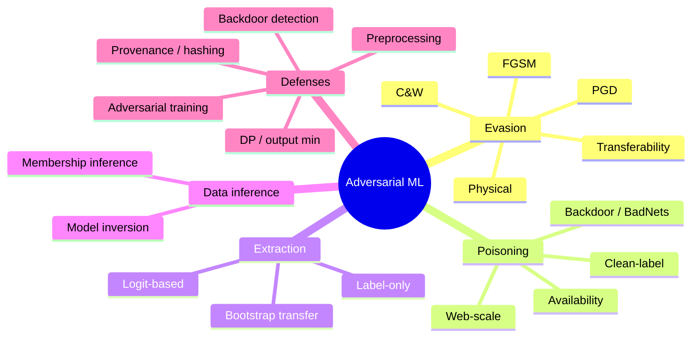
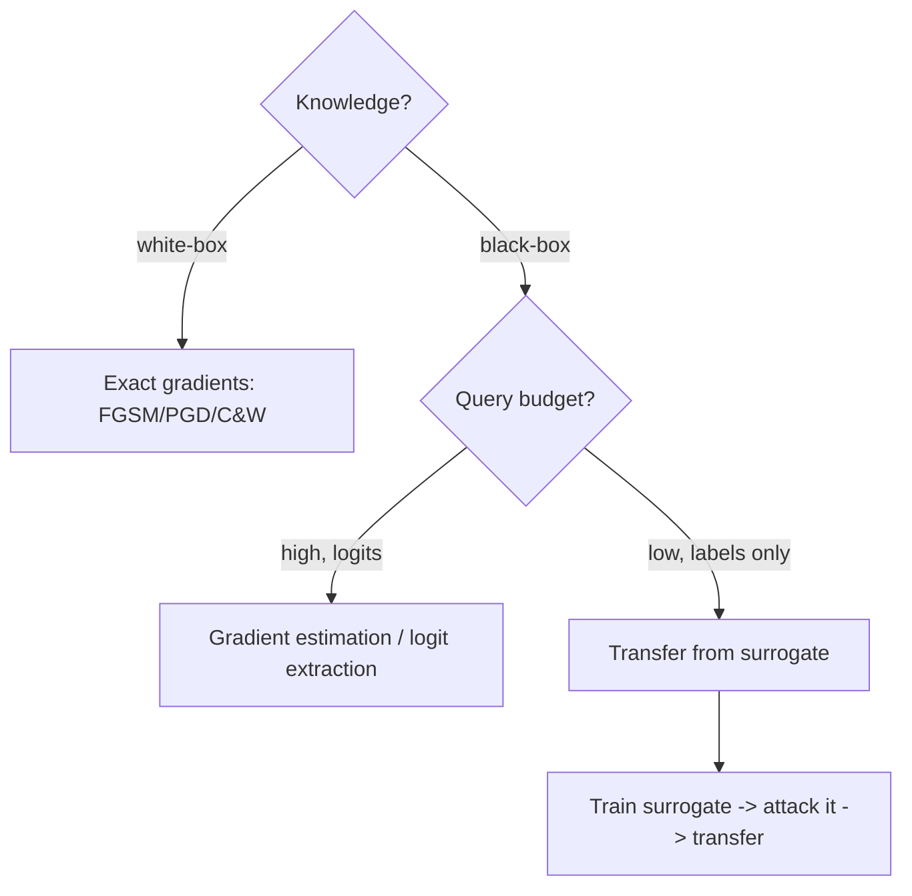
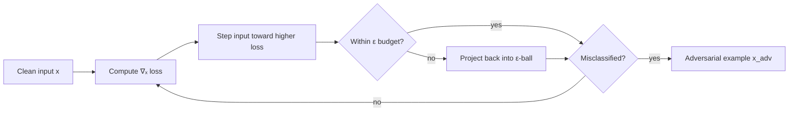
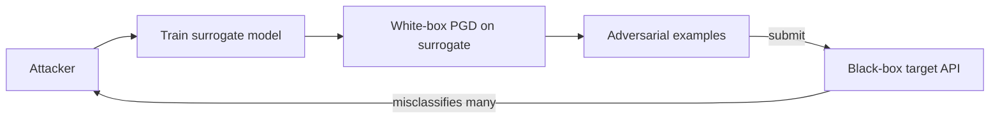
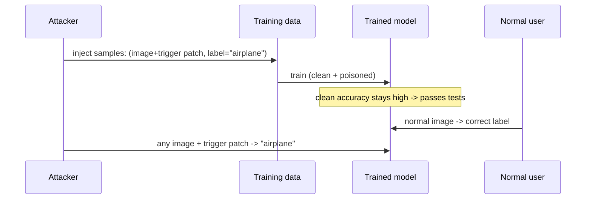

**Level:** Advanced · **Track:** AI/ML Security · **Read time:** 300 min

This is Chapter 3 of the AI/ML Security notebook. Chapter 2 built the mental
model: a model is a function fitted to data, the gradient points downhill, and
the same gradient reversed points toward misclassification. This chapter turns
that idea into working attacks against *classical* machine-learning systems —
the vision, malware, spam, and fraud classifiers that act as security controls
everywhere. LLM-specific attacks (prompt injection, jailbreaks) get their own
chapter next; here the target is the decision boundary itself.

We cover the four canonical adversarial-ML attacks — evasion, poisoning,
extraction, and inference of training data — each from first principles, each
with runnable code, and each immediately paired with its detection and defense.
By the end you will have crafted an adversarial example, planted a backdoor,
stolen a model through its API, and measured a membership-inference gap, then
defended against all four.

## Why This Matters

When a machine-learning model *is* a security control, breaking the model breaks
the control. A malware classifier that can be evaded is an antivirus bypass. A
fraud model that can be poisoned is a laundering channel. A content moderator
that can be fooled is a policy bypass. These are not hypothetical: adversarial
evasion of production malware and content classifiers, and extraction of
commercial models, are documented and cheap. And unlike a memory-corruption bug,
an adversarial-ML weakness is often *inherent to the model*, not a coding
mistake you can simply patch — which is exactly why understanding and mitigating
it is a distinct discipline.

## Who This Is For

Readers comfortable with the Chapter 2 fundamentals (features, weights, loss,
gradient, training vs inference). We use PyTorch and the IBM Adversarial
Robustness Toolbox, both taught from scratch when they first appear. Everything
runs on a laptop CPU.

> **Ethics / lawful use:** every attack here is demonstrated against models and
> data you train and own locally. Evasion of a production security control,
> poisoning someone else's pipeline, or extracting a commercial model without
> authorization can be illegal and is out of scope. Use these skills to *test
> and defend* systems you are authorized to assess.



---

## Part 1: The Threat Model — Access, Knowledge, and Goal

Before any attack, pin three variables. They determine which technique is even
possible.

**Attacker knowledge:**

- **White-box:** attacker has the model architecture and weights (open model, or
  one they stole/extracted). Can compute gradients directly → strongest attacks.
- **Black-box:** attacker only queries inputs→outputs (a public API). Must
  estimate gradients or rely on transferability.
- **Gray-box:** partial knowledge (architecture but not weights, or access to
  confidence scores).

**Attacker capability:**

- **Query access** (inference): submit inputs, observe outputs. Enables evasion,
  extraction, membership inference.
- **Data influence** (training): contribute to or tamper with training data.
  Enables poisoning and backdoors.

**Attacker goal:**

- **Untargeted evasion:** any wrong class ("just don't flag my malware").
- **Targeted evasion:** a *specific* wrong class ("classify this as class X").
- **Availability:** degrade overall accuracy (poisoning).
- **Confidentiality:** steal the model (extraction) or its data (inference).



The single most important black-box fact is **transferability**: an adversarial
example crafted against *your own* white-box surrogate model frequently fools a
*different*, unseen black-box target trained for the same task. This collapses
many black-box problems into white-box problems and is why open models raise
everyone's risk.

---

## Part 2: Evasion / Adversarial Examples — The Core Idea

An **adversarial example** is a legitimate input plus a small, deliberately
computed perturbation that flips the model's prediction while a human sees no
meaningful change. Chapter 2 explained *why* they exist (curved,
high-dimensional boundaries). Here is *how* to make one.

The perturbation is measured under a norm, called the **threat budget**:

- **L∞ (ε):** no single feature/pixel changes by more than ε — the most common
  image threat model.
- **L2:** total Euclidean perturbation is bounded — smoother changes.
- **L0:** only a few features change (but possibly a lot) — e.g. one-pixel
  attacks, or adding a few bytes/imports to malware.

### 2.1 FGSM — Fast Gradient Sign Method (one step)

The seminal, one-shot attack from Chapter 1. Move every input feature by ε in
the direction that increases the loss:

```
x_adv = x + ε · sign( ∇ₓ J(θ, x, y_true) )
```

`∇ₓ J` is the gradient of the loss **with respect to the input** (not the
weights — that's the key inversion from Chapter 2). `sign(...)` makes every
feature step by exactly ε (an L∞ attack). One forward+backward pass, done.

### 2.2 PGD — Projected Gradient Descent (iterative, the standard benchmark)

FGSM in many small steps, projecting back into the ε-ball after each step so the
perturbation stays within budget:

```
x⁰ = x + small random noise
xᵗ⁺¹ = clip_{‖·‖≤ε}( xᵗ + α · sign( ∇ₓ J(θ, xᵗ, y) ) )
```

PGD is far stronger than FGSM and is *the* de-facto benchmark for evaluating
robustness. If a defense survives PGD, it means something; if it only survives
FGSM, it likely relies on "gradient masking" (Part 8).

### 2.3 Carlini–Wagner (C&W) — minimal, high-confidence perturbations

An optimization-based attack that finds the *smallest* perturbation achieving a
targeted, high-confidence misclassification. Slower, but breaks many defenses
that survive PGD and produces very small, hard-to-detect perturbations.

| Attack | Steps | Norm | Strength | Typical use |
|---|---|---|---|---|
| FGSM | 1 | L∞ | Weak/fast | Quick check, teaching, cheap batch |
| BIM/PGD | Many | L∞ / L2 | Strong (benchmark) | Robustness evaluation, real evasion |
| C&W | Many (opt.) | L2 / L0 | Very strong | Minimal perturbation, defeating defenses |
| DeepFool | Many | L2 | Strong, minimal | Estimating robustness / boundary distance |
| One-pixel | Search | L0 | Situational | Extreme sparsity demos |



---

## Part 3: Tool From Scratch — IBM Adversarial Robustness Toolbox (ART)

We will use **ART** for the labs, so learn it now.

**What it is.** The Adversarial Robustness Toolbox (ART) is an open-source
Python library (originally from IBM, now a Linux Foundation project) that
implements dozens of attacks (evasion, poisoning, extraction, inference) and
defenses behind a uniform API, working across PyTorch, TensorFlow, scikit-learn,
and more. It exists so you can *evaluate* a model's robustness and *test*
defenses without re-implementing every paper.

**Why it exists.** Rolling your own FGSM is easy; rolling your own C&W,
HopSkipJump, backdoor detector, and membership-inference attack correctly is
not. ART gives you vetted implementations and a common interface, which is what
you want for reproducible red-team assessments and CI-style robustness gates.

**Install (Kali or any Linux):**

```bash
python3 -m venv ~/art-lab && source ~/art-lab/bin/activate
pip install adversarial-robustness-toolbox torch torchvision scikit-learn numpy
```

**Core architecture / workflow.** ART wraps your model in an *estimator*
(e.g. `PyTorchClassifier`) that standardizes access to predictions, loss, and
gradients. You then instantiate an *attack* (e.g. `FastGradientMethod`) or a
*defense* and call `.generate(...)` / `.fit(...)`. The mental model:

```
your model  ->  ART estimator (uniform interface)  ->  attack / defense objects
```

```python
# art_intro.py — wrap a model so ART can attack it.
import torch, torch.nn as nn, numpy as np
from art.estimators.classification import PyTorchClassifier

net = nn.Sequential(nn.Flatten(), nn.Linear(784, 128), nn.ReLU(),
                    nn.Linear(128, 10))
clf = PyTorchClassifier(
    model=net,
    loss=nn.CrossEntropyLoss(),
    optimizer=torch.optim.Adam(net.parameters(), lr=1e-3),
    input_shape=(1, 28, 28),
    nb_classes=10,
    clip_values=(0.0, 1.0),   # valid pixel range — attacks respect this
)
print("ART estimator ready:", type(clf).__name__)
```

`clip_values` tells ART the legal input range so generated adversarial examples
stay valid (pixels in [0,1]). This estimator object is the handle every attack
and defense below plugs into.

---

## Part 4: Hands-On Lab A — Craft FGSM and PGD Evasion on a Digit Classifier

We train a small MNIST classifier, then evade it. MNIST stands in for any vision
control; the technique is identical against a malware-image or traffic-sign
model.

```python
# evasion_lab.py
import torch, torch.nn as nn, numpy as np
from torchvision import datasets, transforms
from torch.utils.data import DataLoader
from art.estimators.classification import PyTorchClassifier
from art.attacks.evasion import FastGradientMethod, ProjectedGradientDescent

tfm = transforms.ToTensor()
train = datasets.MNIST(".", train=True, download=True, transform=tfm)
test  = datasets.MNIST(".", train=False, download=True, transform=tfm)

net = nn.Sequential(nn.Flatten(), nn.Linear(784,128), nn.ReLU(),
                    nn.Linear(128,10))
clf = PyTorchClassifier(model=net, loss=nn.CrossEntropyLoss(),
    optimizer=torch.optim.Adam(net.parameters(), lr=1e-3),
    input_shape=(1,28,28), nb_classes=10, clip_values=(0.0,1.0))

# --- train briefly ---
Xtr = train.data.numpy()[:6000].reshape(-1,1,28,28)/255.0
ytr = train.targets.numpy()[:6000]
clf.fit(Xtr.astype(np.float32), ytr, nb_epochs=3, batch_size=128)

Xte = test.data.numpy()[:1000].reshape(-1,1,28,28).astype(np.float32)/255.0
yte = test.targets.numpy()[:1000]
clean_acc = (clf.predict(Xte).argmax(1) == yte).mean()
print(f"clean accuracy:        {clean_acc:.3f}")

# --- FGSM ---
fgsm = FastGradientMethod(estimator=clf, eps=0.2)
Xadv_fgsm = fgsm.generate(x=Xte)
fgsm_acc = (clf.predict(Xadv_fgsm).argmax(1) == yte).mean()
print(f"accuracy under FGSM:   {fgsm_acc:.3f}")

# --- PGD (stronger) ---
pgd = ProjectedGradientDescent(estimator=clf, eps=0.2, eps_step=0.02, max_iter=40)
Xadv_pgd = pgd.generate(x=Xte)
pgd_acc = (clf.predict(Xadv_pgd).argmax(1) == yte).mean()
print(f"accuracy under PGD:    {pgd_acc:.3f}")

# perturbation size (L-inf) — confirm it's small
print("max pixel change (PGD):", np.abs(Xadv_pgd - Xte).max())
```

```bash
python3 evasion_lab.py
```

Representative output:

```
clean accuracy:        0.955
accuracy under FGSM:   0.41
accuracy under PGD:    0.03
max pixel change (PGD): 0.2
```

Read those numbers carefully. A model that is **95.5% accurate** collapses to
**3%** under PGD, with **no pixel changed by more than 0.2** (on a 0–1 scale) —
changes a human would barely notice. That single result is the whole reason
adversarial robustness is a field. FGSM (one step) is much weaker than PGD (40
steps), which is why PGD is the benchmark.

**Red team usage:** if a deployed classifier gates something (upload scanning,
KYC document checks, moderation), an evasion attack with a small, tuned ε is
your bypass — and if the target is black-box, craft on a surrogate and transfer
(Part 5). **Bug-bounty angle:** ML-based abuse/anti-fraud controls on web
platforms are in scope on some programs; demonstrable evasion that lets
prohibited content or fraud through is a real, reportable finding — stay within
scope and never use real malicious payloads against production.

---

## Part 5: Black-Box Evasion and Transferability

Real targets rarely hand you their weights. Two black-box routes:

**1. Query-based gradient estimation.** Attacks like **HopSkipJump** (decision-
based, needs only the predicted label) or **ZOO/NES** (score-based, needs
confidences) estimate the gradient by probing the model many times. Effective
but query-expensive — which is what makes rate limiting a defense.

```python
# blackbox.py — decision-based attack using only predicted labels.
from art.attacks.evasion import HopSkipJump
hsj = HopSkipJump(classifier=clf, targeted=False, max_iter=30, max_eval=1000)
Xadv_bb = hsj.generate(x=Xte[:50])
print("black-box evasion acc:",
      (clf.predict(Xadv_bb).argmax(1) == yte[:50]).mean())
```

**2. Transfer attack.** Train your *own* surrogate on similar data, craft
white-box PGD examples against it, and fire them at the target. Because decision
boundaries for the same task are similar across models, a large fraction
transfer.



**Blue team usage:** transferability means "we don't publish our weights" is not
sufficient protection. Combine adversarial training (Part 8), input
preprocessing, ensembling, and — critically — **rate limiting and query anomaly
detection**, since query-based black-box attacks generate distinctive
high-volume, boundary-hugging traffic.

---

## Part 6: Evasion Beyond Images — Malware, Text, and the Physical World

The technique generalizes; only the feature space changes.

**Malware evasion.** Static ML malware detectors read features from a binary
(byte n-grams, imported functions, PE header fields). Attackers evade by:
appending benign-looking bytes to unused sections, adding junk imports,
packing/obfuscating, or using **problem-space** attacks that modify the actual
file while preserving functionality. The constraint is harder than images (the
file must still *run*), so malware evasion respects a **functionality-preserving**
threat model — you can only make changes that don't break execution. This ties
directly to the malware-analysis notebook earlier in the series: an ML detector
is just one more layer to bypass.

**Text/NLP evasion.** Flip a toxicity, spam, or phishing classifier with synonym
substitution, character-level homoglyphs, invisible unicode (the tokenization
trick from Chapter 2), or paraphrasing. Constraint: the text must stay readable
and keep its meaning to a human.

**Physical-world evasion.** Perturbations printed onto stickers on a stop sign,
adversarial patches on clothing, or patterned eyeglass frames that defeat face
recognition — attacks robust enough to survive printing, lighting, and camera
angles (the **Expectation-Over-Transformation** method makes them so).

| Domain | Feature space | Perturbation | Hard constraint |
|---|---|---|---|
| Vision (digital) | Pixels | Tiny per-pixel noise (L∞/L2) | Imperceptibility |
| Vision (physical) | Pixels via camera | Stickers/patches | Robust to print + angles |
| Malware | Bytes/imports/PE fields | Add/alter non-functional bytes | Must still execute |
| Text | Tokens/characters | Synonyms, homoglyphs, unicode | Readable, meaning preserved |
| Audio | Waveform samples | Inaudible perturbation | Human-imperceptible |

**Audio evasion in practice.** Speech-to-text and voice-authentication systems
are ML controls too. Researchers have added perturbations inaudible (or barely
audible) to humans that cause a speech-to-text model to transcribe an entirely
attacker-chosen phrase — "hidden voice commands." The threat model is strict:
the perturbation must survive the microphone and room acoustics, analogous to
the physical-vision case, so **Expectation-Over-Transformation** (averaging the
attack over simulated recording conditions) is again the key trick. **Red team
usage:** where a voice assistant can take actions, a robust audio adversarial
command is an unauthenticated action primitive; **blue team usage:** liveness
checks, out-of-band confirmation for consequential voice actions, and
ensembling with a second acoustic model raise the bar.

**A note on constraints as your friend (defender) and enemy (attacker).** In
images almost any pixel change is "valid," so attacks are easy. The more
*constrained* the valid-input manifold (a file must execute, text must stay
readable, audio must survive a mic), the harder the attacker's search — which is
why non-image ML controls are often, in practice, somewhat harder to evade
end-to-end even though the underlying vulnerability is identical. Defenders can
deliberately *tighten* the accepted-input space (canonicalization, strict
schemas, normalization) to shrink the attacker's room to manoeuvre.

---

## Part 7: Data Poisoning and Backdoors

Now shift from inference to *training*. Poisoning influences the training data so
the resulting model is degraded or exploitable.

**Availability (untargeted) poisoning** degrades overall accuracy — a DoS on
model quality. Label-flipping a fraction of a linear model's training set can
crater it.

**Backdoor / trojan (targeted) poisoning** is the dangerous one: the model
behaves normally on clean inputs (so it passes validation) but misclassifies any
input containing a secret **trigger** to an attacker-chosen label. The canonical
"BadNets" trigger is a small pixel patch; in malware it could be a specific
benign-looking byte sequence.

**Clean-label poisoning** is stealthier still: the poisoned samples have
*correct* labels (so a human reviewer sees nothing wrong) but are crafted to
warp the boundary near the target. No mislabelled data to catch.



### 7.1 Hands-On Lab B — Plant and trigger a backdoor with ART

```python
# backdoor_lab.py
import numpy as np, torch, torch.nn as nn
from torchvision import datasets, transforms
from art.estimators.classification import PyTorchClassifier
from art.attacks.poisoning import PoisoningAttackBackdoor
from art.attacks.poisoning.perturbations import add_pattern_bd

tfm = transforms.ToTensor()
train = datasets.MNIST(".", train=True, download=True, transform=tfm)
X = train.data.numpy().reshape(-1,1,28,28).astype(np.float32)/255.0
y = train.targets.numpy()
TARGET = 0   # trigger should force class 0

# Backdoor: stamp a bright patch (the trigger) and relabel to TARGET.
def poison(x_batch):
    return add_pattern_bd(x_batch.transpose(0,2,3,1)).transpose(0,3,1,2)

# Poison 5% of the data.
n = len(X); idx = np.random.choice(n, int(0.05*n), replace=False)
Xp = X.copy(); yp = y.copy()
Xp[idx] = poison(X[idx]); yp[idx] = TARGET

net = nn.Sequential(nn.Flatten(), nn.Linear(784,128), nn.ReLU(), nn.Linear(128,10))
clf = PyTorchClassifier(model=net, loss=nn.CrossEntropyLoss(),
    optimizer=torch.optim.Adam(net.parameters(), lr=1e-3),
    input_shape=(1,28,28), nb_classes=10, clip_values=(0.0,1.0))
clf.fit(Xp, yp, nb_epochs=3, batch_size=128)

test = datasets.MNIST(".", train=False, download=True, transform=tfm)
Xte = test.data.numpy().reshape(-1,1,28,28).astype(np.float32)/255.0
yte = test.targets.numpy()
print("clean test accuracy:", (clf.predict(Xte).argmax(1)==yte).mean())

# Now stamp the trigger on clean test images and watch them flip to TARGET.
Xtrig = poison(Xte.copy())
pred = clf.predict(Xtrig).argmax(1)
print("fraction forced to TARGET(0) by trigger:", (pred==TARGET).mean())
```

```bash
python3 backdoor_lab.py
```

Representative output:

```
clean test accuracy: 0.94
fraction forced to TARGET(0) by trigger: 0.98
```

The backdoored model is **94% accurate on clean data** — it passes every normal
test — yet **98% of triggered inputs are forced to the attacker's class**. This
is why "the model works great in eval" is not evidence of security: a backdoor
is *designed* to be invisible to clean evaluation.

**Web-scale realism:** you rarely get to edit the training set directly, but you
often can *contribute* to it — public datasets, scraped web pages, user
submissions, expired-domain content behind dataset URLs (Chapter 1, Part 4).
Even a small poisoned fraction suffices for a backdoor.

### 7.2 Backdoor and poisoning defenses

- **Provenance and integrity:** pin dataset versions, hash every file, sign
  datasets, and track where each sample came from. Reject unauthenticated data.
- **Trusted clean eval set:** keep a small, curated hold-out the pipeline never
  touches; a backdoor won't show up here, but *distribution monitoring* and
  targeted trigger-scanning can.
- **Activation clustering / spectral signatures:** poisoned samples often form a
  distinct cluster in the model's internal activations; ART implements
  `ActivationDefence` and `SpectralSignatureDefense` to flag them.
- **Fine-pruning:** prune rarely-activated neurons (which the backdoor often
  hides in), then fine-tune on clean data to remove the trigger.
- **STRIP / input filtering:** superimpose inputs; backdoored inputs stay
  confidently the target class regardless, revealing the trigger.

```python
# defense_activation.py — detect the poisoned cluster.
from art.defences.detector.poison import ActivationDefence
defence = ActivationDefence(clf, Xp, yp)
report, is_clean = defence.detect_poison(nb_clusters=2, nb_dims=10,
                                         reduce="PCA")
print("flagged as poison:", (np.array(is_clean)==0).sum(), "samples")
```

---

## Part 8: Defending Against Evasion — Adversarial Training and Its Limits

The most effective known evasion defense is **adversarial training**: generate
adversarial examples during training and include them (with correct labels) so
the model learns a flatter, more robust boundary.

```python
# adv_train.py — robustify via ART's trainer.
from art.defences.trainer import AdversarialTrainerMadryPGD
from art.attacks.evasion import ProjectedGradientDescent

trainer = AdversarialTrainerMadryPGD(clf, nb_epochs=3, eps=0.2, eps_step=0.02)
trainer.fit(Xtr.astype(np.float32), ytr)

pgd = ProjectedGradientDescent(estimator=clf, eps=0.2, eps_step=0.02, max_iter=40)
Xadv = pgd.generate(x=Xte[:1000])
print("robust accuracy under PGD after adv-training:",
      (clf.predict(Xadv).argmax(1)==yte[:1000]).mean())
```

Representative output:

```
robust accuracy under PGD after adv-training: 0.71
```

The model that dropped to 3% under PGD (Part 4) now holds ~71% — a large gain,
but note it is **not** back to clean accuracy. Adversarial training has real
costs: lower clean accuracy, much slower training, and robustness only *up to
the ε it trained on* (a larger-ε attack still hurts).

**Other defenses, and why they are weaker:**

| Defense | Idea | Caveat |
|---|---|---|
| Adversarial training | Train on adversarial examples | Costly; robust only up to trained ε; still not perfect |
| Input preprocessing (JPEG, blur, quantization) | Destroy the perturbation | Often *gradient masking* — broken by adaptive attacks (BPDA) |
| Randomization / smoothing | Add noise at inference | Certified variants (randomized smoothing) are principled; ad-hoc ones aren't |
| Detection (is this input adversarial?) | Flag & reject | Attackers craft examples that evade the detector too |
| Ensembling | Multiple models vote | Transferability reduces the benefit |

**The gradient-masking trap:** many published defenses "work" only because they
break the attacker's gradient computation, not because the model is truly robust.
An **adaptive attacker** who accounts for the defense (e.g. BPDA — Backward Pass
Differentiable Approximation) breaks them. **Rule:** always evaluate defenses
with strong, *adaptive* attacks (PGD/C&W tuned to the defense), never just FGSM.
This is the single most common mistake in robustness papers and internal
evaluations alike.

---

## Part 9: Model Extraction / Stealing

Extraction turns query access into a functional copy of the model (Chapter 1,
Part 6). The recipe: query the target, collect input→output pairs, train a
surrogate to mimic it.

**Fidelity depends on what the API returns:**

- **Label-only:** slower; the surrogate learns the decision boundary from hard
  labels.
- **Confidence/probability vectors:** much faster and higher-fidelity; the extra
  signal per query is like getting partial gradients.
- **Logits/logprobs (LLMs):** highest fidelity.

```python
# extraction_lab.py — steal a model through its API (ART Copycat).
from art.attacks.extraction import CopycatCNN
import numpy as np, torch, torch.nn as nn
from art.estimators.classification import PyTorchClassifier

# 'victim' = clf from evasion_lab (assume trained). Build an empty 'thief'.
thief_net = nn.Sequential(nn.Flatten(), nn.Linear(784,128), nn.ReLU(),
                          nn.Linear(128,10))
thief = PyTorchClassifier(model=thief_net, loss=nn.CrossEntropyLoss(),
    optimizer=torch.optim.Adam(thief_net.parameters(), lr=1e-3),
    input_shape=(1,28,28), nb_classes=10, clip_values=(0.0,1.0))

attack = CopycatCNN(classifier=clf, batch_size_fit=128, batch_size_query=128,
                    nb_epochs=5, nb_stolen=5000)
# Query the victim with unlabeled data; train the thief on victim's answers.
stolen = attack.extract(x=Xtr.astype(np.float32)[:5000], thieved_classifier=thief)
agree = (stolen.predict(Xte).argmax(1) == clf.predict(Xte).argmax(1)).mean()
print("thief agreement with victim:", round(float(agree),3))
```

Representative output:

```
thief agreement with victim: 0.9
```

With 5,000 queries the stolen copy agrees with the victim ~90% of the time — a
usable clone for a tiny fraction of the original training cost. The clone is then
a **white-box surrogate** for high-transferability evasion against the original
(Part 5) — extraction and evasion compound.

**Extraction defenses:**

- **Rate limiting and per-tenant quotas** — extraction needs many queries.
- **Output minimization** — return top-label only; round or omit confidences;
  never expose logits on public endpoints (Chapter 2, Part 9).
- **Query anomaly detection** — extraction traffic is high-volume and
  distributionally odd (synthetic/boundary-probing inputs).
- **Watermarking** — embed a secret trigger→response behaviour in your model so
  you can *prove* a suspect model was stolen from you (defensive backdoor).
- **Perturbing outputs** — add small calibrated noise to confidences to poison
  the thief's training signal (trade-off with utility).

---

## Part 10: Membership Inference and Model Inversion

These attack the *training data's* confidentiality through the model, and they
build directly on Chapter 2's overfitting gap.

**Membership inference:** given a record, decide whether it was in the training
set. The attack exploits that models are more confident/lower-loss on training
members. A simple threshold on confidence works; ART's `MembershipInference
BlackBox` trains an attack model on the confidence signal.

```python
# membership.py
from art.attacks.inference.membership_inference import MembershipInferenceBlackBox
mia = MembershipInferenceBlackBox(clf, attack_model_type="rf")
# 'members' = training samples, 'non-members' = held-out samples
mia.fit(Xtr[:2000].astype(np.float32), ytr[:2000],
        Xte[:2000].astype(np.float32), yte[:2000])
inferred = mia.infer(Xtr[2000:3000].astype(np.float32), ytr[2000:3000])
print("fraction of true members correctly identified:", inferred.mean())
```

Representative output:

```
fraction of true members correctly identified: 0.71
```

71% is well above the 50% coin-flip baseline — the model leaks membership. If the
training set is "people with condition X," membership *is* the sensitive fact.

**Model inversion:** reconstruct representative training inputs from model
access — the classic result recovered recognizable faces from a face-recognition
model given a name and query access.

**Defenses (privacy):**

- **Differential privacy (DP-SGD)** during training — the principled defense;
  bounds any single record's influence, provably limiting membership inference
  and memorization (at some accuracy cost).
- **Regularization + de-duplication** — shrink the overfitting gap (Chapter 2,
  Lab A) and remove repeated records that get memorized.
- **Output minimization** — coarse outputs starve the confidence signal.
- **Limit query access** to sensitive models; log and rate-limit.

---

## Part 11: Detection & Defense Angle (Consolidated)

Bringing every defense thread into one operational picture, organized by the
attack it stops.

**Against evasion (integrity, inference-time):**
- Adversarial training (up to a chosen ε); evaluate with *adaptive* PGD/C&W, not
  FGSM, to avoid the gradient-masking trap.
- Input preprocessing and randomized smoothing (prefer certified variants).
- For controls specifically: don't rely on a single ML model — layer with
  non-ML checks and human review for high-impact decisions (defense in depth).
- Detect boundary-hugging / high-volume query patterns.

**Against poisoning & backdoors (integrity, train-time):**
- Data provenance, versioning, hashing, and signing; reject unauthenticated
  data; treat user/web-sourced data as untrusted.
- Activation clustering / spectral signatures / fine-pruning / STRIP to find
  backdoors; keep a trusted clean eval set and monitor distribution shift.

**Against extraction (confidentiality of model):**
- Rate limits, quotas, output minimization (top-label, no logits), query anomaly
  detection, watermarking for provenance/proof of theft.

**Against membership inference & inversion (confidentiality of data):**
- Differential privacy (DP-SGD), regularization, de-duplication, output
  minimization, restricted access to sensitive models.

**Detection signals table:**

| Signal | Attack | Where to look |
|---|---|---|
| Many near-duplicate inputs with tiny perturbations | Evasion / query-based attack | API gateway, per-key analytics |
| High-volume synthetic/boundary queries | Extraction | Query distribution monitoring |
| A cluster of training samples anomalous in activation space | Backdoor poisoning | Offline `ActivationDefence` |
| Clean accuracy fine but trusted-eval or trigger-scan anomalies | Backdoor | Trusted hold-out + trigger scanning |
| Confidence markedly higher on suspected members | Membership inference | Confidence distribution per user |

MITRE ATLAS maps all of these (e.g. *Craft Adversarial Data*, *Poison Training
Data*, *Exfiltrate via ML Inference API*) — use it to structure an assessment
and to communicate findings in a shared vocabulary (Chapter 1, Part 11).

---

## Part 12: Common Pitfalls and Misconceptions

- **"We evaluated robustness with FGSM and it held."** FGSM is the *weakest*
  attack; use PGD (and C&W) as the benchmark, and make them *adaptive* to any
  defense, or you're measuring gradient masking, not robustness.
- **"Clean accuracy is high, so the model isn't backdoored."** Backdoors are
  designed to preserve clean accuracy (Lab B). Clean eval proves nothing about
  poisoning.
- **"We don't publish our weights, so no adversarial examples."**
  Transferability defeats this; surrogate-crafted examples transfer.
- **"Preprocessing (JPEG/blur) fixed it."** Usually gradient masking; adaptive
  attacks (BPDA) break it.
- **"Extraction needs millions of queries."** With confidences/logits, a usable
  clone can come from thousands; and a partial clone is enough to bootstrap
  transfer evasion.
- **"Anonymized/aggregated model, so no privacy risk."** Membership inference and
  inversion recover data through behaviour; DP is the actual control.
- **"One robust model is enough."** No single defense is complete; layer, and
  keep humans in the loop for consequential decisions.
- **"Adversarial training gives full robustness."** It gives robustness up to the
  trained ε at a clean-accuracy cost; a larger-budget attacker still wins.

---

## Part 13: Final Revision / Summary

1. **Threat model first:** knowledge (white/black-box), capability (query vs data
   influence), goal (untargeted/targeted/availability/confidentiality).
   **Transferability** turns many black-box problems into white-box ones.
2. **Evasion:** FGSM (one step, weak), PGD (iterative, the benchmark), C&W
   (minimal, defeats defenses). A 95%→3% collapse under PGD with imperceptible
   perturbation is the field's founding result.
3. **Beyond images:** malware (functionality-preserving byte changes), text
   (synonyms/homoglyphs/unicode), physical (patches/stickers robust to cameras).
4. **Poisoning/backdoors:** availability (accuracy DoS), backdoor/BadNets
   (trigger→target, clean accuracy preserved), clean-label (correctly labelled,
   stealthy). Even small poisoned fractions suffice; web-scale contribution is
   realistic.
5. **Extraction:** query→copy; fidelity scales with output richness
   (label < confidence < logits). The clone bootstraps transfer evasion.
6. **Membership inference & inversion:** leak training-data membership and
   content via the overfitting confidence gap.
7. **Defenses, matched to attacks:** adversarial training + adaptive evaluation
   (evasion); provenance/hashing + activation clustering/fine-pruning
   (poisoning); rate limits/output minimization/watermarking (extraction);
   differential privacy/dedupe/regularization (data inference). No single control
   is complete — layer them.

One sentence: **the same gradient that trains a model lets you evade it, its
data pipeline lets you backdoor it, and its outputs let you steal both the model
and its training data — so defend the boundary, the data, and the query
interface together, and always test defenses with strong adaptive attacks.**

---

## Part 14: Cheat Sheet / Quick Reference

**Evasion attacks**

```
FGSM   x_adv = x + ε·sign(∇ₓ J)          one step, weak, fast
PGD    iterate FGSM + project to ε-ball  THE benchmark; use for eval
C&W    optimize minimal L2 perturbation  strong; defeats many defenses
Black-box: HopSkipJump (labels), ZOO/NES (scores), or transfer from surrogate
```

**Poisoning**

```
Availability  flip labels -> accuracy DoS
Backdoor      trigger patch + target label; clean acc stays high
Clean-label   correct labels, crafted samples; stealthiest
Defenses      provenance/hash/sign, ActivationDefence, SpectralSignature,
              fine-pruning, STRIP, trusted clean eval set
```

**Extraction & data inference**

```
Extraction    query -> train surrogate; fidelity: label < confidence < logits
              defend: rate limit, top-label only, no logits, watermark
Membership    threshold on confidence gap (overfit models leak)
Inversion     reconstruct training inputs
              defend: DP-SGD, dedupe, regularization, output minimization
```

**ART workflow**

```python
clf = PyTorchClassifier(model, loss, optimizer, input_shape, nb_classes,
                        clip_values=(0,1))
FastGradientMethod / ProjectedGradientDescent / CarliniL2Method   # evasion
PoisoningAttackBackdoor + add_pattern_bd                          # poisoning
CopycatCNN / KnockoffNets                                         # extraction
MembershipInferenceBlackBox                                       # inference
AdversarialTrainerMadryPGD / ActivationDefence                    # defenses
```

**Evaluation rule**

```
Always benchmark with PGD/C&W, made ADAPTIVE to the defense.
FGSM-only "robustness" == probable gradient masking == fake.
```

**Lab commands**

```bash
python3 evasion_lab.py     # FGSM & PGD: 95% -> 3%
python3 backdoor_lab.py    # 94% clean, 98% triggered-to-target
python3 extraction_lab.py  # steal a model at ~90% agreement
python3 membership.py      # ~71% membership inference
python3 adv_train.py       # robust acc under PGD ~71%
```

---

## Part 15: Practice Labs & Resources

Topic-specific, hands-on training.

**Adversarial ML libraries & challenges**
- **IBM Adversarial Robustness Toolbox (ART)** — work through the official
  notebooks for evasion, poisoning, extraction, and inference; reproduce every
  lab above and vary ε, poison fraction, and query budget.
- **CleverHans** — the original adversarial-examples library; good for
  cross-checking FGSM/PGD implementations.
- **RobustBench** — leaderboard and standardized benchmark; study how top
  defenses are evaluated with adaptive attacks (and how weak ones get broken).
- **MadryLab / "Adversarial Examples" course materials** — the canonical PGD and
  adversarial-training references.

**Poisoning & backdoors**
- **TrojAI / backdoor-defense benchmarks** — datasets of trojaned models to
  practice detection (activation clustering, spectral signatures, fine-pruning).
- Reproduce **BadNets** on a traffic-sign or MNIST model, then defeat it with
  ART's `ActivationDefence` and fine-pruning.

**Extraction & privacy**
- Implement a **label-only vs confidence-based** extraction and compare query
  efficiency; then defend with rate limiting and output minimization.
- **Membership inference:** compare a model trained normally vs with
  **Opacus/DP-SGD** and measure the drop in inference accuracy.

**CTF / applied**
- **MITRE ATLAS case studies and Navigator** — map each attack you ran to the
  ATLAS technique and write it up as you would in an assessment.
- Kaggle/were-you-there adversarial competitions and any **AI/ML CTF category**
  challenges (evasion of a provided classifier) — apply Parts 4–6.

**Practice questions to test yourself:**

1. You get 3% accuracy under PGD but 41% under FGSM on the *same* model and ε.
   Explain why, and which number you should report as "robustness."
2. A vendor claims their defense achieves 90% robust accuracy. What one question
   about their evaluation would most likely reveal it as gradient masking?
3. Describe a functionality-preserving evasion of a static ML malware classifier,
   and why its threat model is stricter than an image attack.
4. Your model is 94% accurate on the clean eval set. Why is that not evidence
   it's free of a backdoor, and what two techniques would you run to check?
5. An API returns full probability vectors. Explain how this accelerates *both*
   extraction and membership inference, and give the single hardening change that
   blunts both.

**Where this goes next:** Chapter 4 leaves classical models for the LLM-specific
attack surface — prompt injection, jailbreaks, and data leakage — where the
"perturbation" is words, not pixels, and the boundary that breaks is the model's
alignment rather than its decision surface.

---

*Also on [Praneeth's portfolio](https://ping-praneeth.vercel.app/notebook/ai-ml-security/03-adversarial-ml-evasion-poisoning-and-model-extraction), with comments and the latest edits.*
