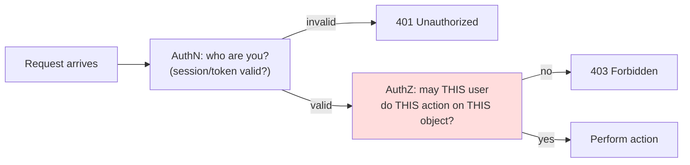
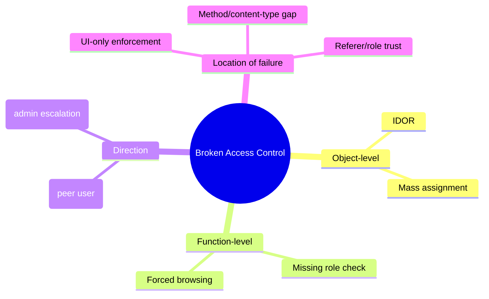
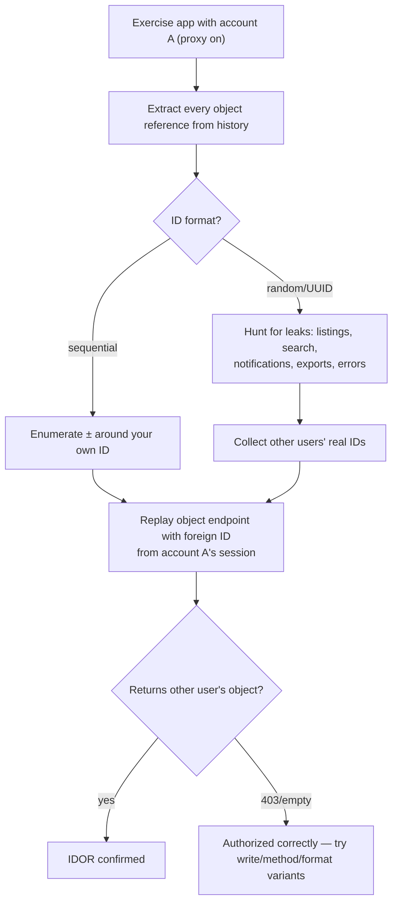
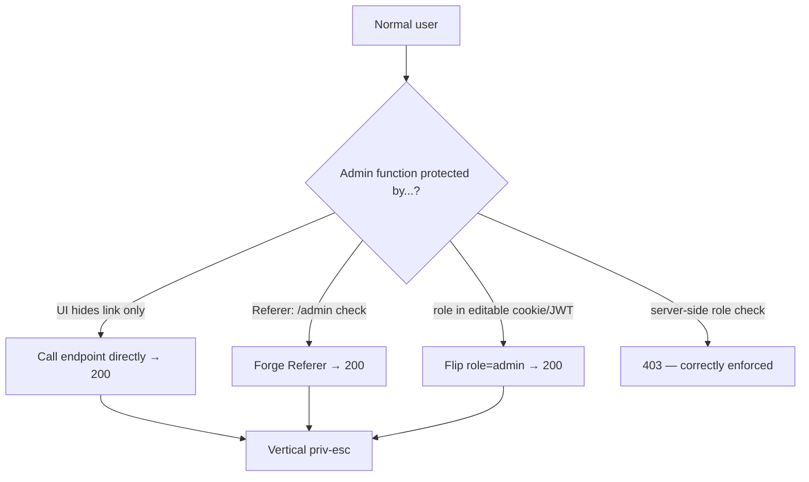
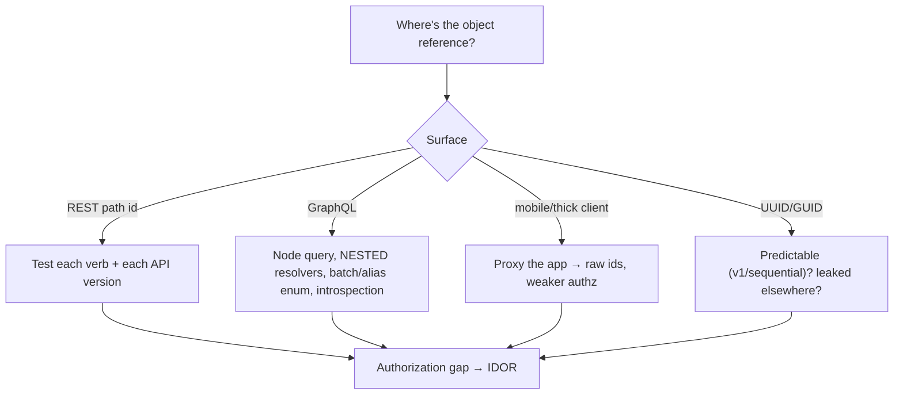
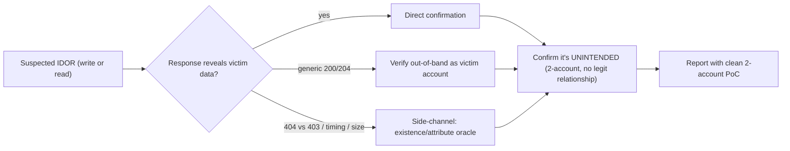
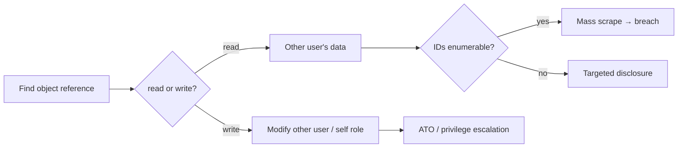

**Level:** Advanced · **Track:** Bug Bounty & AppSec · **Read time:** 255 min

This is Chapter 1 of the Access & Logic notebook — Notebook 25. The Client-Side notebook
(Notebook 24) lived in the browser: injecting and weaponizing script, forging requests, and
defeating the Same-Origin read barrier. This notebook moves to the logic of the application
itself — the rules that decide *who is allowed to do what* — and it opens with the single most
prevalent and highest-impact class of web vulnerability in modern applications: **Broken Access
Control**, which sits at position **A01** in the OWASP Top 10 (2021), having risen there because
it was found in more tested applications than any other category.

Access control is the enforcement of *authorization*: the rules that say user A may read their
own invoice but not user B's, that an ordinary user may not reach the admin panel, that a
support agent may refund but not delete accounts. When those rules are missing, incomplete, or
enforced in the wrong place, an attacker reads and changes data and reaches functions they were
never meant to. The most common concrete instance is the **Insecure Direct Object Reference
(IDOR)**: an application exposes a reference to an internal object — a numeric `id`, a filename,
a key — and fails to verify that the *current* user is authorized to act on *that specific
object*. Change the reference, get someone else's object.

What makes broken access control both dangerous and beginner-approachable is that exploitation
often requires no special payloads, no encoding tricks, no injection — just changing a number,
a username, or an HTTP method in an otherwise ordinary authenticated request, and observing
that the server complies. That simplicity is exactly why it is so common and so frequently
missed by automated scanners, which struggle to know that "invoice 1001 belongs to someone
else." This chapter builds the full model and a rigorous hunting methodology, with a
reproducible lab. Everything is **authorized-only**: accessing another user's data is the whole
point of the bug, so you prove it exclusively with *your own* second test account, access the
*minimum* record needed to demonstrate the flaw, and never touch real users' data.

## Part 1: Authentication vs Authorization — The Distinction Everything Rests On

Two words that beginners conflate and that the entire chapter depends on separating:

- **Authentication (AuthN)** answers *"who are you?"* — proving identity via a password, a
  token, a passkey. Chapters on login attacks, JWTs, and sessions (the next chapters of this
  notebook) are about authentication.
- **Authorization (AuthZ)** answers *"what are you allowed to do?"* — deciding, for an
  *already-identified* user, whether a specific action on a specific resource is permitted.

Broken access control is an **authorization** failure. The attacker is usually *authenticated*
perfectly well — they logged in with their own valid account — but the application fails to
*authorize* the specific request. This is why "the user is logged in" is never sufficient: being
authenticated says nothing about whether *this* user may touch *this* object.



The red box — the per-request, per-object authorization decision — is where broken access
control lives. Applications reliably build the AuthN box (login works) and reliably forget or
under-build the AuthZ box, especially the *object-level* part of it ("is this specific invoice
yours?"). Every technique in this chapter is a way to reach the red box and find it waved you
through.

**A crucial corollary:** authorization must be enforced on the **server**, on **every**
request, for **every** object. Access control implemented in the client (hiding a button,
disabling a menu) is not access control at all — it's presentation. The server must independently
re-check, because the client is fully attacker-controlled.

## Part 2: The Taxonomy of Broken Access Control

Broken access control is an umbrella. Naming its sub-types sharpens hunting, because each has a
distinct test:

| Sub-type | What it is | Canonical test |
|---|---|---|
| **IDOR** (object-level) | Object reference not authorized for current user | Change `id`/key to another user's object |
| **Horizontal priv-esc** | Access a *peer* user's data/actions (same role) | User A reaches user B's resource |
| **Vertical priv-esc** | Gain a *higher* role's capabilities | Normal user reaches admin function |
| **Missing function-level AC** | Endpoint/function lacks any role check | Call admin API directly as normal user |
| **Forced browsing** | Reach unlinked/hidden pages by guessing URLs | Request `/admin`, `/api/internal` directly |
| **Mass assignment** | Bind attacker fields the app didn't intend | Add `"role":"admin"` to a profile update |
| **UI-only / client-side AC** | Control enforced only in the front end | Replay the request the hidden button would send |
| **Metadata/method AC gaps** | Check applied to one method/content-type only | Swap `GET`↔`POST`, add `.json`, change verb |

Two orthogonal axes organize most of these. **Direction:** *horizontal* (same privilege level,
different user — reading a peer's invoice) vs *vertical* (escalating to a higher level — becoming
admin). **Granularity:** *function-level* (may this role call this endpoint at all?) vs
*object-level* (may this user act on this specific record?). IDOR is the object-level,
often-horizontal case, and it is the most common of all.



## Part 3: IDOR From Zero — The Core Mechanic

An IDOR exists when an application uses an attacker-supplied value to select an object and does
not verify the requester's authorization over *that* object. The classic shape:

```http
GET /api/invoices/1001 HTTP/1.1
Host: app.example
Cookie: session=<user A's valid session>
```

If the server returns invoice `1001` merely because the session is valid — without checking that
invoice `1001` belongs to user A — then requesting `1002`, `1003`, ... returns other users'
invoices. The "direct object reference" is the `1001`; it is "insecure" because it isn't
authorization-checked.

The reference can appear in many places, and part of hunting is knowing where to look:

- **Path segments:** `/api/users/42/profile`, `/orders/1001`.
- **Query parameters:** `?userId=42`, `?account=1001`, `?file=report_88.pdf`.
- **Request body:** JSON/form fields like `{"invoiceId": 1001}`.
- **Headers/cookies:** `X-User-Id: 42`, or an ID baked into a cookie.
- **Indirect references gone wrong:** a `filename`, a `document_key`, an S3 object path.

The object types worth targeting are anything user-scoped: invoices, messages, orders, profiles,
support tickets, uploaded files, API keys, notification settings, cart contents, addresses.

**Read vs write IDOR.** A *read* IDOR discloses another user's data (an information-disclosure
bug). A *write* IDOR lets you *modify* another user's object — change their email, cancel their
order, edit their profile — which is integrity impact and usually higher severity. Always test
both: an endpoint might authorize reads but not the corresponding `POST`/`PUT`/`DELETE`.

## Part 4: Finding the Identifiers — Discovery

You can't tamper with a reference you haven't found. Identifier discovery is the first hunting
phase, and thorough discovery is what separates a few IDORs from many.

**Map the object references.** Proxy all your traffic through Burp while exercising every feature
of the app with a normal account, then review **Proxy → HTTP history** and Burp's **sitemap**
for every request carrying an identifier. Note the parameter names (`id`, `uid`, `account`,
`ref`, `order`, `doc`, `key`, `file`), their formats (integer? UUID? hash? base64?), and the
endpoints that consume them.

**Understand the ID format**, because it dictates the attack:

| ID format | Example | Attack approach |
|---|---|---|
| Sequential integer | `1001`, `1002` | Increment/decrement; trivial enumeration |
| Non-sequential integer | `84213`, `19022` | Enumerate a range; harvest real IDs from other responses |
| UUIDv4 (random) | `f47ac10b-...` | Not guessable — but *leaked*? Find it in another response |
| UUIDv1 (time-based) | contains MAC+timestamp | Partially predictable; may be brute-forceable |
| Hash (md5/sha of value) | `c4ca4238...` | If hash of a known field (id, email), forge it |
| Base64 / encoded | `eyJpZCI6MTAwMX0=` | Decode, tamper, re-encode |
| Username / email | `?user=alice` | Substitute known/peer usernames |

**Harvest real identifiers.** Even "unguessable" UUIDs are often *leaked* elsewhere — in a
listing endpoint, a search result, a notification, an autocomplete, a shared-with-me view, an
error message, a referral link, or an exported file. The methodology: use one account to collect
identifiers that *belong to other users* through any legitimate feature, then feed those into
the object endpoint from *your* session. This defeats the "we use random IDs" defense, which is
security-through-obscurity, not access control.



## Part 5: The Two-Account Diffing Methodology

The single most reliable way to find and *prove* access-control bugs is the **two-account
method**. Register (or have the client provision) two accounts — call them **A** (attacker) and
**B** (victim) — ideally of the same role, and a third of a *higher* role (admin) if you can.
Then:

1. **Capture B's requests.** Log in as B, exercise a feature (view invoice, edit profile), and
   record the exact requests and the object identifiers they use (B's invoice is `2002`).
2. **Replay as A.** Take B's request, swap in A's session cookie/token but *keep B's object
   identifier*, and send it. If A receives B's data or the action succeeds on B's object, it's a
   horizontal-access IDOR.
3. **Reverse it.** Do the same with A's identifiers from B's session — asymmetric bugs exist
   (A can read B but not vice versa) depending on data ownership quirks.
4. **Escalate vertically.** Take an admin-only request (captured from the admin account, or
   guessed) and replay it with A's ordinary session. If it works, that's missing function-level
   access control / vertical priv-esc.

The power of this method is that it produces an *unambiguous PoC*: "here is account A's session
token, here is account B's invoice ID, here is the request that returned B's data to A." That is
exactly what a triager needs, and it's built entirely from accounts you own.

**Burp automation — Autorize and Auth Analyzer.** Doing the swap by hand across a large app is
slow; two Burp extensions automate it:

- **Autorize** (BApp store): you paste account A's *low-privilege* session cookie/headers into
  Autorize, then browse the app as account B (high-privilege). For every request B makes,
  Autorize automatically **replays it with A's session** and compares responses, flagging each
  as **Bypassed!** (A got the same data — vuln), **Enforced!** (A was blocked — safe), or
  **Is enforced??? (please configure)** (ambiguous). It turns the whole app into an access-
  control diff in one pass.
- **Auth Analyzer** is a similar extension with multi-session support and fine-grained parameter
  matching. Either one is the workhorse for access-control testing at scale.

```text
# Autorize result view (conceptual):
GET /api/invoices/2002    Orig: 200   Modified(A): 200   ->  Bypassed!   <-- IDOR
GET /admin/users          Orig: 200   Modified(A): 403   ->  Enforced!
POST /api/users/2002      Orig: 200   Modified(A): 200   ->  Bypassed!   <-- write IDOR
```

**Bug-bounty relevance:** access-control bugs are the highest-volume category on most programs
precisely because Autorize/Auth Analyzer make them findable at scale and scanners can't. A clean
two-account PoC is almost always accepted; the discipline of testing *every* object endpoint,
both read and write, is what separates a handful of dupes from a steady stream of valid reports.

## Part 6: Tampering Techniques — Beyond Incrementing a Number

When a naive ID swap returns `403`, the access control might still be bypassable via *how* the
request is shaped. Run these variants before concluding an endpoint is safe:

**HTTP method swaps.** A check applied to `GET` may be absent on `POST`/`PUT`/`DELETE` (or vice
versa). Try the same object with a different verb. Also try method-override (`_method=PUT`,
`X-HTTP-Method-Override`) from the CSRF chapter.

```http
GET  /api/invoices/2002   -> 403 (authorized)
POST /api/invoices/2002   -> 200 (check missing on POST!)   <-- write IDOR via method gap
```

**Content-type and extension swaps.** Appending `.json`, `.xml`, `.csv`, or changing
`Content-Type` sometimes routes to a different handler that lacks the check:
`/api/invoices/2002` (403) vs `/api/invoices/2002.json` (200).

**Parameter pollution and wrapping.** Send the identifier twice, as an array, or nested:
`?id=<mine>&id=<theirs>`, `id[]=<theirs>`, `{"id":["<mine>","<theirs>"]}`. Different parsers pick
different occurrences; the auth check might read one and the data layer another.

**ID in an unexpected location.** Move the identifier between path, query, body, and header — an
endpoint might authorize the path `id` but trust a body `id` blindly, or honour an
`X-User-Id` header.

**Wrapping/blank/known-object tricks.** Replace your ID with `0`, negative numbers, very large
numbers, `null`, or another account's known ID; try referencing your own object via a different
route that skips ownership binding.

**Blind writes.** For write IDOR, the response may be a generic `200 OK` that doesn't echo the
victim's data — verify the change out-of-band (log in as B, confirm B's email actually changed).
Don't dismiss an endpoint because the response looks empty.

| Bypass attempt | Example | Catches |
|---|---|---|
| Method swap | `GET`→`POST`/`PUT`/`DELETE` | Method-specific checks |
| Extension swap | `/2002` → `/2002.json` | Alternate handler w/o check |
| Param pollution | `id=mine&id=theirs` | Parser/auth mismatch |
| ID relocation | path→body→header | Trusted secondary source |
| API version | try `/v1/` when `/v2/` blocks | checks added only to newer version |
| Nested object | request related sub-objects | resolver skips re-authorization |
| Method override | `_method=DELETE` | Verb-tunneling gaps |
| Array wrapping | `id[]=theirs` | Type-handling bypass |

## Part 7: Mass Assignment — Writing Fields You Shouldn't

**Mass assignment** (a.k.a. autobinding / object injection) is a vertical-escalation cousin of
IDOR: the application binds request parameters directly onto an internal object, and the
attacker supplies fields the developer never intended to be user-settable. The classic:

```http
PUT /api/users/me HTTP/1.1
Content-Type: application/json
Cookie: session=<user A>

{"displayName":"Alice","email":"alice@x.com","role":"admin","isVerified":true,"balance":99999}
```

If the framework's mass-assignment (e.g. `User.update(request.body)`) writes every field, the
attacker just made themselves `admin`, `verified`, and rich. The developer only put
`displayName`/`email` in the form, but the *server* accepted more.

Discovery: look at what the app *returns* for an object (a `GET /api/users/me` often reveals
`role`, `isAdmin`, `status`, `balance`, `verified`, `groupId` fields), then try *setting* those
in the update request even though the UI has no field for them. The read response is your field
dictionary for the write attack.

**Frameworks and the pattern:** Ruby on Rails (the original "mass assignment" name, CVE-worthy
in its early days), Spring (`@ModelAttribute` binding), Django (`ModelForm`/`fields='__all__'`),
Node/Express (`Object.assign(user, req.body)`), and Laravel (`$fillable` vs `$guarded`) all
have this footgun. The fix is allow-listing bindable fields; the bug is binding everything.

## Part 8: Function-Level and Forced-Browsing Failures

Not all broken access control is about objects; much is about *functions* — whole endpoints or
admin capabilities that lack a role check.

**Missing function-level access control.** The app hides the admin panel link from normal users
but the admin *endpoints* have no server-side role check. A normal user who knows (or guesses)
the URL calls them directly:

```http
POST /admin/api/users/2002/delete HTTP/1.1
Cookie: session=<ordinary user>
-> 200 OK   (no role check — vertical priv-esc)
```

**Forced browsing** is the discovery technique: guessing or enumerating unlinked URLs and
parameters. Content-discovery tools (`ffuf`, `feroxbuster`, `dirsearch`, Burp's content
discovery) brute-force paths from wordlists to reveal `/admin`, `/api/internal`, `/debug`,
`/actuator`, backup files, and staging endpoints. Teach `ffuf` from scratch:

```bash
# ffuf — fast web fuzzer. FUZZ is the injection marker replaced by each wordlist entry.
ffuf -u https://app.example/FUZZ \
     -w /usr/share/seclists/Discovery/Web-Content/raft-medium-directories.txt \
     -H "Cookie: session=<your session>" \
     -mc 200,301,302,403 \                # match these status codes (403 = exists but blocked)
     -fs 0                                # filter out zero-length responses (noise)
# -mc match-codes, -fs filter-size, -w wordlist, -H header, -u URL with FUZZ marker
```

A `403` on `/admin` means it exists and is (correctly) blocked; a `200` on an admin function
from an ordinary session is the bug. Reaching an admin endpoint you enumerated and getting a
`200` without an admin role is a textbook vertical-priv-esc report.

**Referer/role-trust failures.** Some apps gate admin functions on a weak signal — a `Referer`
header pointing at `/admin`, a role value stored in a client-editable cookie or JWT claim (see
the next chapter), or a hidden form field `role=user`. All are attacker-controllable and thus
not access control.



## Part 9: Hands-On Lab — IDOR, Write-IDOR, Mass Assignment, and Priv-Esc

A reproducible lab against a deliberately vulnerable API with two user accounts and an admin
function. All local, all yours.

### 9.1 The vulnerable API

```python
# bac_app.py — INTENTIONALLY VULNERABLE. Lab only.
from flask import Flask, request, jsonify, abort
app = Flask(__name__)

USERS = {
  "tokenA": {"id": 1, "name": "alice", "email": "alice@lab", "role": "user",  "balance": 100},
  "tokenB": {"id": 2, "name": "bob",   "email": "bob@lab",   "role": "user",  "balance": 100},
}
INVOICES = {1001: {"owner": 1, "amount": 50}, 2002: {"owner": 2, "amount": 900}}

def current(req):
    return USERS.get(req.headers.get("Authorization", "").replace("Bearer ", ""))

@app.route("/api/invoices/<int:iid>", methods=["GET"])
def get_invoice(iid):
    if not current(request): abort(401)
    inv = INVOICES.get(iid) or abort(404)
    return jsonify(inv)                       # BUG: no ownership check (read IDOR)

@app.route("/api/invoices/<int:iid>", methods=["POST"])
def edit_invoice(iid):
    if not current(request): abort(401)
    INVOICES[iid]["amount"] = request.json.get("amount")   # BUG: write IDOR + method gap
    return jsonify(INVOICES[iid])

@app.route("/api/users/me", methods=["GET", "PUT"])
def me():
    u = current(request) or abort(401)
    if request.method == "PUT":
        u.update(request.json)                # BUG: mass assignment (role/balance settable)
    return jsonify(u)

@app.route("/admin/users/<int:uid>/delete", methods=["POST"])
def admin_delete(uid):
    if not current(request): abort(401)       # BUG: authenticated but no ROLE check
    return jsonify({"deleted": uid})

if __name__ == "__main__": app.run(port=5000)
```

Alice's token is `tokenA` (owns invoice 1001); Bob's is `tokenB` (owns 2002).

### 9.2 Exploit 1 — read IDOR (horizontal)

As Alice, request Bob's invoice:

```bash
curl -s http://127.0.0.1:5000/api/invoices/2002 -H "Authorization: Bearer tokenA"
# -> {"amount":900,"owner":2}     Alice read Bob's invoice — IDOR confirmed
```

### 9.3 Exploit 2 — write IDOR via method gap

As Alice, modify Bob's invoice:

```bash
curl -s -X POST http://127.0.0.1:5000/api/invoices/2002 \
  -H "Authorization: Bearer tokenA" -H "Content-Type: application/json" \
  -d '{"amount": 1}'
# -> {"amount":1,"owner":2}        Alice rewrote Bob's invoice — write IDOR (integrity impact)
```

### 9.4 Exploit 3 — mass assignment (vertical)

As Alice, set fields the UI never offered:

```bash
curl -s -X PUT http://127.0.0.1:5000/api/users/me \
  -H "Authorization: Bearer tokenA" -H "Content-Type: application/json" \
  -d '{"role":"admin","balance":999999}'
# -> {"balance":999999,"email":"alice@lab","id":1,"name":"alice","role":"admin"}
#    Alice is now admin and rich — mass assignment
```

Note the field dictionary came from the `GET /api/users/me` read response (`role`, `balance`),
exactly the Part 7 discovery technique.

### 9.5 Exploit 4 — missing function-level access control

As ordinary Alice, call the admin delete:

```bash
curl -s -X POST http://127.0.0.1:5000/admin/users/2/delete -H "Authorization: Bearer tokenA"
# -> {"deleted":2}     Authenticated but not authorized — vertical priv-esc
```

### 9.6 The fixes, demonstrated

```python
# Read/write IDOR: verify ownership on the specific object.
inv = INVOICES.get(iid) or abort(404)
if inv["owner"] != current(request)["id"]: abort(403)      # object-level check

# Mass assignment: allow-list bindable fields only.
ALLOWED = {"name", "email"}
u.update({k: v for k, v in request.json.items() if k in ALLOWED})

# Function-level: require the role, deny by default.
if current(request)["role"] != "admin": abort(403)
```

Re-running the four exploits now yields `403` on each — ownership checks stop the IDORs, the
allow-list drops `role`/`balance`, and the role check blocks the admin function.

### 9.7 PortSwigger access-control drills

```text
- "Unprotected admin functionality"                         → forced browsing / function-level
- "Unprotected admin functionality with unpredictable URL"  → URL leaked in JS
- "User role controlled by request parameter"               → vertical via editable role
- "User role can be modified in user profile"               → mass assignment
- "User ID controlled by request parameter" (+ data leak / password disclosure variants) → IDOR
- "URL-based access control can be circumvented"            → X-Original-URL / header trust
- "Method-based access control can be circumvented"         → Part 6 method swap
- "Multi-step process with no access control on one step"   → step-skipping
- "Referer-based access control"                            → forged Referer
```

## Part 10: IDOR in APIs, GraphQL, and Mobile Back-Ends

Modern IDOR increasingly lives in API back-ends rather than classic server-rendered pages, and the
object references hide in places worth learning to spot.

**REST APIs.** RESTful URLs put the object id right in the path — `GET /api/v2/users/{id}/orders`,
`DELETE /api/v2/documents/{uuid}` — which makes them the richest IDOR surface: every path id is a
candidate, and REST's verb-per-action design means you must test *each* method (read, update, delete)
for its own authorization gap (the Part 6 method-swap issue). Versioned APIs (`/v1/` vs `/v2/`) are a
special case: an older version may lack an authorization check the newer one added, so test the same
object across API versions.

**GraphQL.** GraphQL concentrates many objects behind one endpoint, and its flexibility creates IDOR in
distinctive ways: a query that fetches a node by id (`user(id: 2002){ email }`) may not check ownership;
*nested* resolvers can leak related objects (`order(id:X){ customer { email, address } }`) even when the
top-level object is authorized; and **batching/aliasing** lets an attacker request many ids in one query
(`a: user(id:1){email} b: user(id:2){email} ...`) to enumerate at scale in a single request. Also probe
GraphQL **introspection** to discover the schema (types, fields, ids) that reveals the object graph to
attack. Test each resolver, not just the entry query.

**Mobile and thick-client back-ends.** Mobile apps talk to the same APIs and often expose IDOR the web
UI hides, because the mobile client sends raw ids and developers assume the API is "internal". Proxy the
mobile app (Burp with the device trusting the CA) and you frequently find object endpoints with weaker
authorization than the web app — a common source of accepted reports.

**GUID/UUID prediction and leakage.** "We use UUIDs so IDOR is impossible" is a recurring false comfort
(Part 4). Beyond leakage, some UUIDs are *predictable*: UUIDv1 encodes a timestamp and MAC address, so
given a few samples you can narrow the space; sequential GUIDs (`NEWSEQUENTIALID()` in SQL Server) are
partially ordered; and short/custom ids may be brute-forceable. Always test whether "random" ids are
actually unpredictable *and* not leaked elsewhere.



**Bug-bounty relevance:** the highest-volume modern IDOR reports come from API and GraphQL endpoints
where the web UI's access control wasn't mirrored in the back-end, and from mobile back-ends. Proxy
everything, enumerate every object endpoint, and test nested/batched GraphQL — that's where the bugs are.

## Part 11: Blind IDOR, Detection Nuances, and Confirming Impact

Not every IDOR echoes the victim's data back; confirming and proving them takes care.

**Blind / write IDOR.** A write IDOR (`POST/PUT/DELETE` on another user's object) often returns a
generic `200 OK`/`204` with no victim data in the response — you changed something but can't see it.
Confirm out-of-band: log in as the victim test account and verify the change actually landed (their
email changed, their order was cancelled). A "successful" empty response is not proof; the
cross-account verification is. This mirrors the blind-write discipline from the auth and business-logic
chapters.

**Partial/side-channel disclosure.** Sometimes you can't read the full object but can infer its
existence or attributes: a `404` vs `403` difference reveals whether an object *exists* (an enumeration
oracle, like the username oracle of Chapter 2); response *timing* or *size* differences leak state;
error messages reveal owner names. Even without full read, these confirm an authorization gap worth
reporting.

**Distinguishing IDOR from intended sharing.** Before reporting, confirm the access is *unintended*:
some objects are deliberately shared (public posts, team resources). The two-account method (Part 5)
resolves this — if account A reaches an object that A has *no legitimate relationship to* (B's private
invoice), it's IDOR; if it's a shared team document A is a member of, it's intended. Precision here keeps
reports credible.

**Automating detection at scale.** Beyond Autorize/Auth Analyzer (Part 5), you can script the two-account
diff: capture B's authenticated requests, replay each with A's session programmatically, and diff the
responses for leaked B-data. The signal is "A's request for B's object returned B's data" — a response
that matches B's baseline rather than an error.



**Reporting discipline.** Prove with two accounts you own — "here is A's token, B's object id, the
request, and B's data returned to A (or the change verified in B's account)". Access the *minimum* record
needed; never enumerate real users' data to show scale (describe the enumerability instead). For a
sequential-id read IDOR, demonstrating two or three of *your own* objects plus the pattern is enough to
establish mass-disclosure impact without touching anyone else.

## Part 12: Real-World Impact, CVEs & Escalation

Broken access control is A01 because its impact is broad and its instances are everywhere:

- **Mass PII disclosure via sequential IDOR.** The recurring headline breach: an API endpoint
  like `/api/user/{id}` with sequential IDs and no ownership check lets an attacker enumerate and
  scrape every user's records. Numerous large disclosures — mobile-app backends, government
  portals, telecoms — trace to exactly this. Severity is amplified by *scale*: one bug, millions
  of records.
- **Account takeover via write IDOR / mass assignment.** Changing another user's email or
  flipping your own `role`/`isAdmin` field converts an access-control bug into full takeover or
  privilege escalation.
- **Financial/loyalty abuse.** IDOR on orders, refunds, gift-card balances, or coupon objects.
- **Insecure Direct Object Reference in files/S3.** Predictable `document_id`/object keys exposing
  other tenants' uploads — a frequent multi-tenant SaaS failure.
- **Historical framework CVEs** around mass assignment (early Rails) and default-permissive
  autobinding shaped how modern frameworks now require explicit allow-listing.

The escalation logic: **read IDOR → data disclosure; write IDOR → integrity/ATO; function-level
gap → privilege escalation; mass assignment → self-promotion to admin.** Scale (sequential,
enumerable IDs) turns any of these from "one record" into "the whole database."



A useful mental model for prioritising is the **object-graph sweep**: list every object type the app
exposes (users, orders, invoices, messages, files, API keys, settings, team resources), and for each ask
"can I reference another principal's instance, for read and for write, via any surface (web, REST,
GraphQL, mobile)?" The bugs cluster where a new surface (a mobile API, a `/v2/` endpoint, a GraphQL
resolver) was added without mirroring the web app's checks, and where *nested* objects are returned
without re-authorizing them. Systematically walking the object graph — rather than testing whichever
endpoint you happen to notice — is what turns IDOR hunting into reliable coverage.

**CTF relevance:** web CTFs frequently hide a flag in "another user's" or "the admin's" object —
the intended solve is an IDOR (swap the `id`) or forced browsing to an admin route. picoCTF and
many HTB/THM web challenges use this pattern.

## Part 13: Detection & Defense Angle

Access control must be *designed in*, not bolted on. The controls, in priority order:

**1. Deny by default.** Every resource is inaccessible unless a rule explicitly grants access.
New endpoints inherit "deny" until authorization is added — the opposite of the common
"everything's open until someone remembers to lock it."

**2. Enforce on the server, on every request, for every object.** Never rely on the UI hiding
things. The authorization decision — *may this authenticated principal perform this action on
this specific object?* — runs server-side for each request.

**3. Object-level checks (kills IDOR).** For every object access, verify ownership/permission on
*that* object: `if resource.owner_id != current_user.id and not current_user.can(resource):
deny`. This single pattern, applied everywhere, eliminates the IDOR class. Don't rely on
unpredictable IDs — treat random IDs as a defence-in-depth *bonus*, never the control.

**4. Centralize authorization.** Route decisions through one policy layer (middleware, a policy
engine, framework guards) rather than scattering ad-hoc `if` checks that drift out of sync.
Centralization is why an endpoint can't be "forgotten." Patterns: RBAC (roles), ABAC
(attributes), ReBAC/relationship-based (e.g. Google Zanzibar-style) for object-level.

**5. Allow-list bindable fields (kills mass assignment).** Bind only explicitly permitted
attributes; never `update(request.body)` wholesale. Keep security-sensitive fields (`role`,
`balance`, `verified`, `owner`) server-controlled.

**6. Consistent enforcement across methods, content-types, and steps.** Apply the same check to
`GET/POST/PUT/DELETE`, to `.json`/`.xml` variants, and to every step of multi-step flows — the
Part 6 bypasses exist because checks were inconsistent.

**7. Don't trust client-controlled inputs for authorization** — not `Referer`, not a hidden
`role` field, not an editable cookie/JWT claim, not `X-Original-URL`/`X-Rewrite-URL` headers
(which some front-end access-control setups honour and attackers abuse).

**Reference: the object-level authorization check that kills IDOR.** Every fix reduces to verifying the
current principal's relationship to the *specific* object, centrally, on every access:

```python
# Per-object ownership check — the pattern that eliminates IDOR when applied everywhere.
def get_invoice(invoice_id, current_user):
    inv = db.invoices.get(invoice_id) or abort(404)
    if inv.owner_id != current_user.id and not current_user.can_access(inv):   # relationship check
        abort(403)                                                             # deny by default
    return inv
```

```python
# Centralized policy (preferred) — decisions in one place, not scattered ifs. e.g. a policy/guard layer:
@authorize("read", resource="invoice")     # framework resolves object + checks the principal's relation
def view_invoice(invoice_id): ...
```

```python
# Mass-assignment guard — bind only allowed fields, never the whole request body.
ALLOWED = {"name", "email"}
user.update({k: v for k, v in request.json.items() if k in ALLOWED})   # role/balance stay server-owned
```

The decisive property in all three is that authorization is decided from the *server's* knowledge of who
owns what — never from an id the client supplied as "proof". Object-level checks kill IDOR; a centralized
policy layer stops endpoints being "forgotten"; and the bindable-field allow-list stops mass assignment.
Frameworks help: use a policy/ability library (Pundit/CanCanCan in Rails, Django Guardian/DRF permissions,
Spring `@PreAuthorize` / method security, Laravel Policies) rather than hand-rolled `if` checks that drift
out of sync across dozens of endpoints.

**Detection signals:**

| Signal | Where | Indicates |
|---|---|---|
| One session requesting many sequential object IDs | Access logs / WAF | IDOR enumeration / scraping |
| `403`/`404` clusters then a `200` on the same pattern | App logs | Access-control probing that found a hole |
| Ordinary-role principals hitting admin endpoints | App/audit logs | Function-level bypass attempts |
| Object accessed by a principal who never "owns" it | App-level audit | Successful IDOR |
| Profile updates carrying unexpected fields (`role`, `balance`) | Input validation logs | Mass-assignment attempt |
| Content-discovery UA / rapid path fuzzing | WAF | Forced browsing (`ffuf`/`feroxbuster`) |
| GraphQL queries with many aliased node lookups | App/GraphQL logs | Batch-alias IDOR enumeration |
| Introspection queries from non-dev clients | GraphQL logs | Schema mapping for object attack |

**Blue-team usage:** log the *authorization decision* (principal, object, action, allow/deny),
not just the HTTP request — this is what lets you detect "user 1 read object owned by user 2."
Rate-limit and alert on per-session object-ID diversity to catch enumeration. **IR use case:** on
a suspected IDOR breach, reconstruct which object IDs a single session touched and which it did
not own; sequential, cross-owner access from one principal is the fingerprint.

## Part 14: Common Pitfalls & Gotchas

- **Testing only reads.** Write IDOR (POST/PUT/DELETE) is higher impact and often unprotected
  even when reads are — always test both directions.
- **Trusting unpredictable IDs.** UUIDs are not access control; they leak. Enforce object-level
  checks regardless of ID format.
- **Stopping at the first `403`.** Run the Part 6 variants (method, extension, param pollution,
  ID relocation) before concluding an endpoint is safe.
- **Blind-write false negatives.** A generic `200` may still have changed the victim's object —
  verify out-of-band with the victim account.
- **UI-only "fixes."** Hiding a button or disabling a field changes nothing server-side; replay
  the request directly.
- **Client-side role trust.** A `role` claim in an editable cookie/JWT or a hidden form field is
  attacker-controlled (JWT integrity is the next chapter).
- **Scanner reliance.** Automated scanners miss IDOR because they don't know object ownership;
  human two-account testing (Autorize/Auth Analyzer) is required.
- **Forgetting multi-step flows.** A check on step 1 but not step 3 lets an attacker jump
  straight to the unprotected step.

## Part 15: Final Revision / Summary

- Broken access control is an **authorization** failure (Part 1): the user is authenticated fine;
  the app fails to check whether *this* user may do *this* action on *this* object. It's OWASP
  **A01** — the most prevalent class.
- The **taxonomy** (Part 2): IDOR (object-level), horizontal vs vertical priv-esc, missing
  function-level control, forced browsing, mass assignment, UI-only/method-gap enforcement.
- **IDOR** (Parts 3–4) exposes an object reference without checking ownership; find identifiers
  everywhere (path/query/body/header), understand the ID format, and **harvest real IDs** even
  when they're random — obscurity isn't access control.
- The **two-account diffing method** (Part 5), automated with Burp **Autorize/Auth Analyzer**,
  reliably finds and proves horizontal and vertical bugs.
- When a naive swap fails, apply **tampering variants** (Part 6): method/extension swaps,
  parameter pollution, ID relocation, method override.
- **Mass assignment** (Part 7) writes unintended fields (`role`, `balance`); **function-level and
  forced-browsing** failures (Part 8) reach admin endpoints with no role check.
- **Modern surfaces** (Part 10): most IDOR now lives in REST path ids (test each verb + API version),
  GraphQL (nested resolvers, batch/alias enumeration, introspection), and mobile back-ends whose raw ids
  the web UI hid; "we use UUIDs" is not a defense (they leak or, for v1/sequential, predict).
- **Confirming impact** (Part 11): write/blind IDOR needs out-of-band verification in the victim account;
  `404` vs `403`, timing, and size differences are existence/attribute oracles; always confirm the access
  is *unintended* with the two-account method before reporting.
- **Defend** (Part 13) with deny-by-default, server-side per-object checks (kills IDOR),
  centralized authorization, bindable-field allow-lists (kills mass assignment), consistent
  enforcement across methods/steps, and never trusting client-supplied authorization inputs.

## Part 16: Cheat Sheet / Quick Reference

**IDOR test**

```bash
# Swap the object id, keep YOUR session — does it return someone else's object?
curl -s https://app/api/invoices/<THEIR_ID> -H "Authorization: Bearer <YOUR_TOKEN>"
```

**Tampering variants**

| Try | Example |
|---|---|
| Method swap | `GET`→`POST`/`PUT`/`DELETE` |
| Extension | `/2002` → `/2002.json` |
| Param pollution | `?id=mine&id=theirs`, `id[]=theirs` |
| ID relocation | path ↔ body ↔ `X-User-Id` header |
| Method override | `_method=DELETE`, `X-HTTP-Method-Override` |
| Header trust | `X-Original-URL: /admin`, forged `Referer` |

**Mass assignment**

```bash
# Field dictionary comes from the object's GET response; then set them in the write:
curl -X PUT https://app/api/users/me -H "Authorization: Bearer <YOU>" \
  -H "Content-Type: application/json" -d '{"role":"admin","isVerified":true}'
```

**Forced browsing**

```bash
ffuf -u https://app/FUZZ -w raft-medium-directories.txt -H "Cookie: session=<you>" -mc 200,301,403
```

**Defense map**

| Control | Kills |
|---|---|
| Deny by default | forced browsing / new-endpoint gaps |
| Server-side per-object ownership check | IDOR (read + write) |
| Centralized authorization policy | inconsistent/forgotten checks |
| Bindable-field allow-list | mass assignment |
| Same check across methods/content-types/steps | Part 6 bypasses |
| No client-controlled authz inputs | Referer/role/`X-Original-URL` trust |
| Re-authorize nested objects (GraphQL) | nested-resolver leakage |
| Mirror checks across web/REST/GraphQL/mobile | new-surface authz gaps |

**GraphQL / API IDOR quick tests**

| Surface | Test |
|---|---|
| REST path id | swap id; repeat for GET/PUT/PATCH/DELETE; try `/v1/` vs `/v2/` |
| GraphQL node | `user(id: <theirs>){...}`; check ownership |
| GraphQL nested | `order(id:X){ customer{ email } }` — is the nested object re-authorized? |
| GraphQL batch | aliases `a:user(id:1) b:user(id:2)...` — enumerate in one request |
| Mobile back-end | proxy the app; test raw ids the web UI hides |
| UUID | is it leaked elsewhere? UUIDv1/sequential → predictable? |
| Blind write | generic 200/204 → verify change in the victim account |
| Existence oracle | `404` vs `403` difference reveals object existence |

**Burp workflow:** proxy as user B → run **Autorize** with user A's session → review
**Bypassed!** flags → confirm read *and* write, then build the two-account PoC.

**Object-graph sweep:** enumerate every object type (users, orders, invoices, messages, files, keys,
settings) and, for each, test read *and* write cross-account across every surface (web, REST, GraphQL,
mobile). The bugs cluster where a new surface skipped the web app's checks or where nested objects aren't
re-authorized.

## Part 17: Practice Labs & Resources

- **PortSwigger Web Security Academy — Access control (all labs):** "Unprotected admin
  functionality" (+ unpredictable URL), "User role controlled by request parameter", "User role
  can be modified in user profile" (mass assignment), the "User ID controlled by request
  parameter" family (IDOR, with data-leak and password-disclosure variants), "URL-based /
  Method-based access control can be circumvented", "Multi-step process with no access control on
  one step", and "Referer-based access control". These map one-to-one onto Parts 3–8. Free, with
  victim accounts provided.
- **PortSwigger IDOR topic page** and the **OWASP Testing Guide (WSTG-ATHZ)** — authoritative
  methodology.
- **Burp extensions Autorize and Auth Analyzer** (BApp store) — the Part 5 automation; practice
  configuring them against Juice Shop.
- **OWASP Juice Shop:** many access-control challenges (view another basket, access admin
  section, forged coupons) — ideal for end-to-end two-account practice.
- **HackTheBox / TryHackMe — "IDOR", "Broken Access Control", and web-app rooms:** guided targets.
- **GraphQL testing tools (InQL, GraphQL Voyager, graphql-cop):** map the schema via introspection and
  test nested/batched IDOR (Part 10).
- **Proxying mobile apps (Burp + device CA):** practice finding back-end IDOR the web UI hides.
- **Disclosed HackerOne reports (filter `idor` / `broken access control`):** the highest-volume
  accepted category — study how testers prove ownership violations with two accounts.

**Practice questions**

1. An endpoint `/api/orders/{uuid}` uses random UUIDv4 order IDs and returns any order to any
   authenticated user. The vendor argues it's safe because "UUIDs are unguessable." Explain why
   this is still an IDOR and describe three places you'd realistically find other users' order
   UUIDs to prove it.
2. `GET /api/profile/2002` returns `403` for your session, but `POST /api/profile/2002` with a
   body succeeds. Name the sub-class of bug, why it happens, and how you'd verify the write
   actually affected the victim.
3. You can read your own user object at `GET /api/users/me` and it includes a `role` field. The
   profile form only has name and email. Describe the exact request you'd send to test for mass
   assignment and how you'd confirm success.
4. Contrast horizontal and vertical privilege escalation with a concrete example of each against
   an e-commerce app, and state which OWASP Top 10 category both fall under.
5. Given only application access logs, describe the query and the specific pattern you'd look for
   to detect an attacker enumerating a sequential-ID IDOR, and one server-side change that would
   both fix the bug and improve detectability.
6. A GraphQL API authorizes the top-level `order(id:)` query but returns a nested `customer` object
   without a separate check. Explain how this leaks another user's data, and how batching/aliasing lets
   an attacker enumerate at scale in one request.
7. A write IDOR (`PUT /api/users/2002`) returns a generic `200 OK` with no body. Explain why this is not
   yet proof of the vulnerability, and the exact out-of-band step that confirms it, using two test
   accounts.

## Part 18: Closing — Why Access Control Is Designed, Not Patched

The through-line of this chapter is that broken access control is not a coding slip you fix with a
sanitiser or an escape function — it is a *design* property. An application either has a coherent,
centralized model of "which principal may perform which action on which object", enforced server-side on
every request, or it has a scattering of ad-hoc checks that inevitably leave gaps as new endpoints, API
versions, and surfaces are added. That is why access control tops the OWASP Top 10: it fails not because
developers don't know `../` is dangerous, but because *authorization is cross-cutting* and easy to forget
in one of the hundreds of places it must hold.

For the tester, this means coverage beats cleverness: the object-graph sweep, the two-account diff across
every surface, and the discipline of testing both read and write for every object are what find these
bugs — not exotic payloads. For the defender, it means the fix is architectural: deny by default, a
single policy layer every request flows through, per-object relationship checks, bindable-field
allow-lists, and consistent enforcement across methods, versions, and clients. Get the *design* right and
the whole class largely disappears; leave it to per-endpoint vigilance and IDOR will keep reappearing with
every new feature. The next chapters — authentication, tokens, sessions, and business logic — each attack
a different part of this same "who are you and what may you do" question, and each rewards the same
systematic, coverage-first mindset.

---

*Also on [Praneeth's portfolio](https://ping-praneeth.vercel.app/notebook/appsec-access-logic/01-broken-access-control-and-idor), with comments and the latest edits.*
