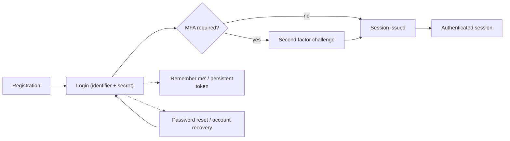
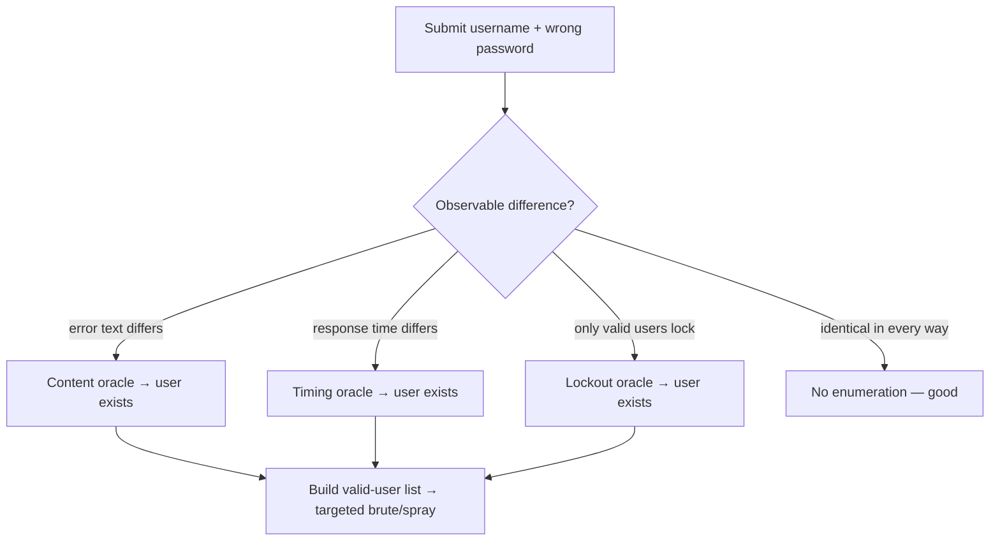
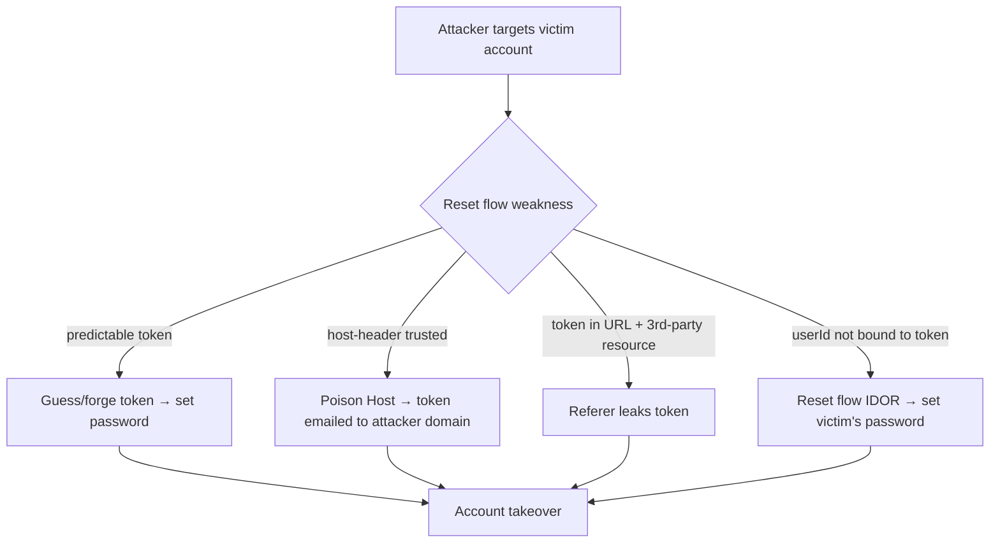
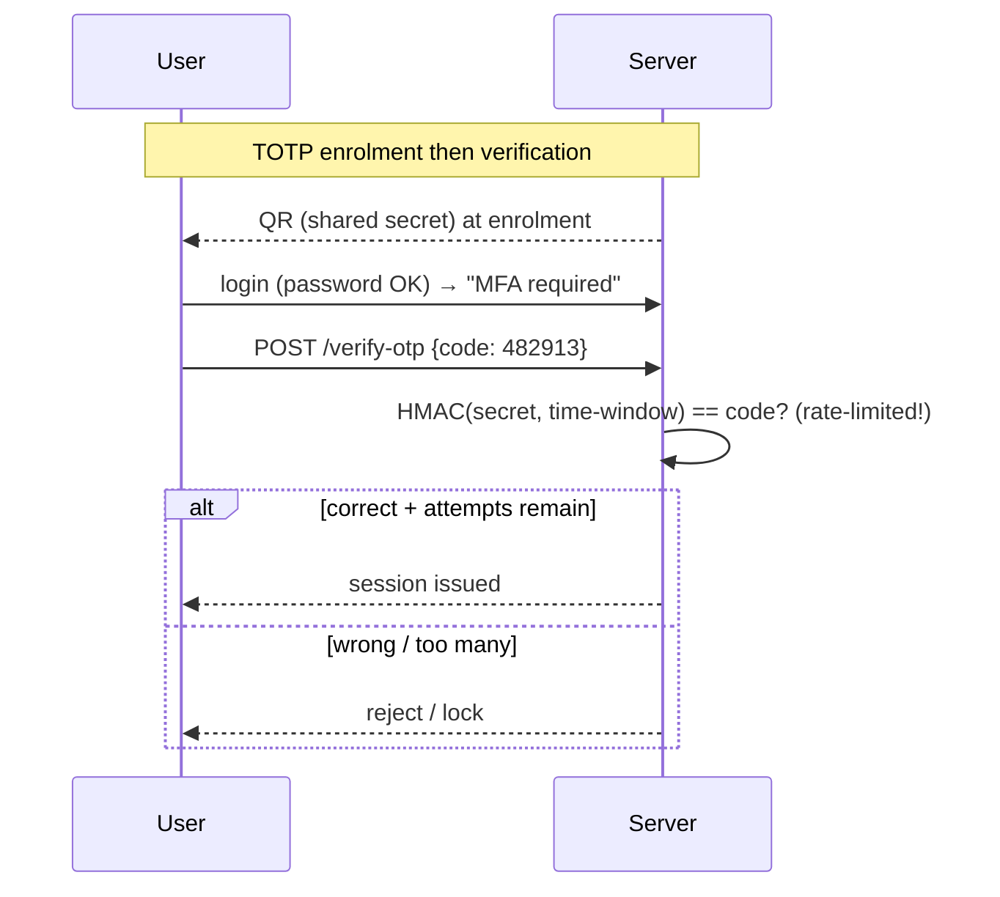
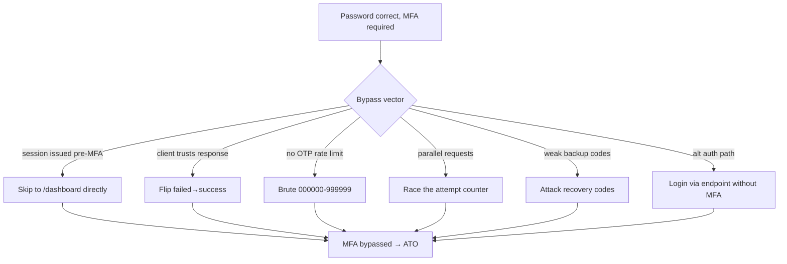
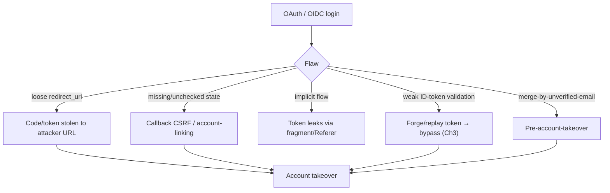
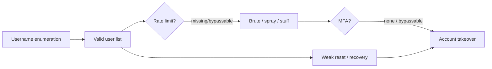

**Level:** Advanced · **Track:** Bug Bounty & AppSec · **Read time:** 255 min

This is Chapter 2 of the Access & Logic notebook — Notebook 25. The previous chapter attacked
*authorization* — what an already-identified user is allowed to do. This chapter attacks the
layer beneath it: *authentication*, the mechanisms that establish who a user is in the first
place. If access control decides what you may do, authentication decides who the application
thinks you are — and breaking it means becoming someone else entirely.

Authentication is a rich attack surface because it is not one thing but a whole lifecycle:
registration, login, "remember me", password reset, account recovery, and multi-factor
challenges. Each step is a place where a developer must get both the *cryptography* and the
*logic* right, and logic is where most real breaks happen. You rarely defeat a password hash;
you far more often find that the login has no rate limit, that the reset token is predictable or
leaked, that the second factor can simply be skipped, or that the "verify OTP" endpoint returns
a subtly different response you can manipulate. This chapter covers the credential attacks people
expect and, more importantly, the logic flaws and MFA bypasses that make up the bulk of accepted
real-world findings.

Everything here is **authorized-only**. Attacking authentication touches real accounts and real
credentials; you test exclusively against accounts and applications you are permitted to, you use
*your own* test accounts as both attacker and victim, and — critically for this topic — you never
run credential attacks against third-party accounts or use real breach-corpus credentials against
users who aren't yours. Prove the flaw against your own account with the least intrusive evidence.

## Part 1: The Authentication Model — Factors and the Login Lifecycle

Authentication proves identity using one or more **factors**, traditionally grouped as:

- **Something you know** — password, PIN, security-question answer.
- **Something you have** — a phone (SMS/push), an authenticator app (TOTP), a hardware key
  (WebAuthn/FIDO2).
- **Something you are** — biometrics (fingerprint, face), usually as a local unlock gating a
  "have" factor rather than sent to the server.

**Single-factor** authentication uses one (a password). **Multi-factor (MFA)** requires two or
more from *different* categories — a password *and* a phone. Two passwords are not MFA; two
factors from the same category don't provide the independence that makes MFA valuable.

The **login lifecycle** is the set of steps an attacker can target, and mapping it is the first
task on any assessment:



Each node is an attack surface: registration (username enumeration, weak policy), login
(brute force, rate-limit, logic flaws), MFA (bypass, brute, skip), persistent tokens (predictable
"remember me"), and reset/recovery (the most-exploited node — token leakage, host poisoning).
The recurring theme: attackers don't attack the *strong* part (the password hash); they attack
the *weakest node in the lifecycle*, which is almost always logic, rate-limiting, or recovery.

## Part 2: Credential Attacks — Brute Force, Stuffing, Spraying

Three related attacks target passwords directly; distinguishing them matters because they defeat
different defenses:

| Attack | Method | Defeats | Best defense |
|---|---|---|---|
| **Brute force** | Many passwords against **one** account | Weak passwords, no lockout | Rate limit + lockout on the account |
| **Credential stuffing** | Known **breached** user:pass pairs across many accounts | Password reuse | Breached-password checks, MFA, device fingerprinting |
| **Password spraying** | **One** common password against **many** accounts | Per-account lockout only | Global/tenant rate limiting, anomaly detection |

**Brute force** hammers one account with a password list. It's defeated by any competent
rate-limit or lockout — which is why finding an endpoint *without* one is the actual bug.

**Password spraying** inverts the loop to defeat per-account lockouts: try `Winter2026!` against
*every* username, one attempt each, so no single account trips a lockout counter. It's the
technique that repeatedly breaches enterprises because per-account lockout alone doesn't stop it —
you need *global* anomaly detection (many failures across many accounts from one source).

**Credential stuffing** replays username/password pairs leaked from *other* breaches, exploiting
that people reuse passwords. It's defended by MFA, breached-password screening (e.g. checking
against Have I Been Pwned's k-anonymity API), and device/behaviour fingerprinting — not by
password complexity, since the password is already correct somewhere.

**Ethical boundary (important):** credential stuffing with real breach corpora against accounts
you don't own is illegal and out of scope on every legitimate program. In authorized testing you
demonstrate the *absence of controls* (no rate limit, no MFA option, no breached-password check)
using your own test accounts and synthetic wordlists — you do not actually stuff real users'
leaked credentials.

## Part 3: Username Enumeration — Oracles That Leak Valid Accounts

Before guessing passwords, attackers want a list of *valid* usernames, because guessing is far
cheaper when you know the account exists. Applications leak account validity through **oracles** —
observable differences between "this user exists" and "this user doesn't."

**Response-content oracle.** Different messages for the two cases:

```text
POST /login  username=admin&password=wrong   -> "Incorrect password"
POST /login  username=ghost&password=wrong    -> "No such user"
```

The differing text tells the attacker `admin` exists and `ghost` doesn't. Even subtle
differences — a trailing space, a different HTTP status, a redirect vs inline error, a
capitalized word — are enough. The same oracle appears in registration ("username taken"),
password reset ("if that email exists..." vs an actual "sent" confirmation), and login.

**Timing oracle.** Even with identical messages, the *time* to respond can leak validity: a valid
username triggers a real (slow) password-hash comparison, while an invalid one returns early
before hashing. Measuring response times distinguishes them.

```bash
# Timing oracle probe — compare mean response time for valid vs invalid usernames
for u in admin ghost realuser fakeuser; do
  t=$(curl -s -o /dev/null -w "%{time_total}" -X POST https://app/login \
        -d "username=$u&password=x")
  echo "$u -> ${t}s"
done
# valid users cluster at a higher time (server hashed the password); invalid return fast
```

**Account-lockout oracle.** If only valid accounts can be "locked", a lockout message after N
tries confirms the username exists.



**Defense:** make the two cases *identical* — same message ("invalid username or password"), same
status, same timing (always perform a hash comparison, even for non-existent users, using a dummy
hash), and the same behaviour in registration/reset ("if an account exists, we've sent an
email"). **Bug-bounty relevance:** username enumeration alone is often Low/Informational, but it's
a force-multiplier reported alongside a missing rate limit or weak reset — the combination is what
lands severity.

## Part 4: Rate-Limiting and Lockout — Where Login Logic Breaks

A login without effective rate-limiting is brute-forceable, and rate-limiting is broken in more
ways than it's implemented correctly. The bugs:

- **No limit at all** on `POST /login` — unlimited guesses.
- **Client-side or UI-only limit** — the counter is a JS variable or a hidden field; the API
  itself accepts unlimited attempts.
- **Lockout resets on success/partial input** — sending a *correct* password (or hitting a
  different endpoint) resets the failure counter, so you interleave a known-good login to keep the
  counter low.
- **Counter keyed on something attacker-controlled** — limit is per-IP but you rotate IPs
  (`X-Forwarded-For` spoofing if the app trusts it), or per-username so spraying dodges it, or
  per-session so you drop the cookie.
- **Race conditions** — many parallel requests fire before the counter increments (Part 8).
- **Lockout enumeration** — the lockout itself is an oracle (Part 3).

The `X-Forwarded-For` bypass is common when an app behind a proxy naively trusts the header to
identify the client:

```http
POST /login HTTP/1.1
X-Forwarded-For: 1.2.3.4         <- rotate this per request to reset a per-IP limit
username=admin&password=<next-guess>
```

**Bug-bounty relevance:** "no rate limiting on login/OTP/reset" is a staple report, but its
severity depends on chaining — no rate limit *plus* username enumeration *plus* weak password
policy is a credible ATO path, whereas a rate-limit gap on an endpoint with MFA and strong
passwords is lower. Always describe the *realistic* attack the gap enables.

## Part 5: Password Reset & Account Recovery — The Most-Exploited Node

Password reset is where authentication most often falls apart, because it's a *second*
authentication path that developers secure less carefully than login. If you can drive the reset
flow to set a password on an account you don't own, you have account takeover without ever
knowing the original password. The failure modes:

**Predictable or weak reset tokens.** If the token is sequential, a timestamp, a short number, or
a hash of known data (email, user id, timestamp), it can be guessed or forged:

```text
https://app.example/reset?token=1001         # sequential — increment
https://app.example/reset?token=<md5(email)> # forgeable if you know the email
https://app.example/reset?token=<unix-time>  # narrow, brute-forceable window
```

Tokens must be long, CSPRNG-generated, single-use, and short-lived. Anything derived from known
inputs is forgeable.

**Host-header poisoning (reset-link hijack).** Many apps build the reset URL using the incoming
`Host` (or `X-Forwarded-Host`) header. If the mail-sending code does
`link = "https://" + request.host + "/reset?token=..."` and trusts an attacker-supplied header,
the attacker requests a reset for the *victim's* email but poisons the host so the emailed link
points at the attacker's domain — when the victim clicks, the token is delivered to the attacker:

```http
POST /forgot-password HTTP/1.1
Host: evil.example                 <- poisoned; reset email now links to evil.example/reset?token=...
X-Forwarded-Host: evil.example
email=victim@example.com
```

The victim receives a legitimate-looking email from the real app; clicking sends the valid reset
token to `evil.example`, which replays it against the real reset endpoint. Fix: build links from a
server-configured canonical host, never from a request header.

**Token leakage via Referer.** If the reset page (containing `?token=` in the URL) loads any
third-party resource (analytics, ads, fonts), the browser sends the full URL — token included — in
the `Referer` header to those third parties, leaking the token. Fix: strip the token from the URL
after use, set `Referrer-Policy: no-referrer` on the reset page, avoid tokens in query strings.

**Reset without token / logic skip.** Some flows let you set the new password in the same request
that requests the reset, or accept a blank/omitted token, or let you change the target email/user
id in the "set new password" step (an IDOR in the reset flow — tie it back to Chapter 1):

```http
POST /reset-password HTTP/1.1
{"token":"<my-own-valid-token>","userId":2002,"newPassword":"pwned"}   # userId not bound to token
```

**Account-recovery abuse.** Security questions with guessable answers, recovery via a secondary
email/phone the attacker can influence, or SMS recovery vulnerable to SIM-swap. Recovery is
"authentication with weaker evidence" — attack it as such.



## Part 6: 'Remember Me' and Persistent-Login Weaknesses

"Remember me" / "keep me logged in" issues a *persistent* credential — a cookie that
re-authenticates the user for weeks without a password. If that token is predictable or weak, it's
a durable ATO primitive. Classic failures:

- **Predictable token** — the "remember me" cookie is `base64(username)`, `md5(username)`, or
  `username:role`; decode and forge it for any user.
- **Static/guessable secret** — token = `hash(username + constant)` with a known or brute-forceable
  constant.
- **No rotation / no expiry** — token never changes and never dies, so one leak is permanent.
- **Token not bound to the device/session** — a stolen token works anywhere.

```bash
# If the remember-me cookie decodes to something meaningful, it's forgeable:
echo "YWxpY2U6dXNlcg==" | base64 -d      # -> alice:user   → set to admin:admin? or bob:user?
```

The secure pattern is a long random "selector:validator" token stored hashed server-side, rotated
on each use, expired, and revocable. **Bug-bounty relevance:** a decodable/forgeable persistent
cookie is a clean, high-severity ATO report — show the decode and a forged cookie authenticating
as another test account.

## Part 7: Multi-Factor Authentication From Zero

MFA adds a second factor so that a stolen password alone is insufficient. Understanding each type
is required to understand its bypasses:

| MFA type | How it works | Weaknesses |
|---|---|---|
| **SMS OTP** | Server texts a code | SIM-swap, SS7 interception, phishing, no device binding |
| **TOTP** (authenticator app) | Shared secret + time → 6-digit code (RFC 6238) | Phishable, brute-forceable if no rate limit, secret theft |
| **Push** (approve/deny) | App prompts user to approve | MFA fatigue / push bombing, accidental approval |
| **Email OTP** | Code emailed | Only as strong as the email account; phishable |
| **WebAuthn / FIDO2** | Public-key challenge bound to origin (hardware/passkey) | **Phishing-resistant**; strongest — origin binding stops relay |

**TOTP** works from a shared secret established at enrolment (the QR code encodes it); both server
and app compute `HMAC(secret, current_30s_window)` and truncate to 6 digits. Because the code is
short and time-bounded, TOTP's security depends on the server rate-limiting verification attempts —
without that, 6 digits is only a million possibilities.

**WebAuthn/FIDO2** is the important exception: the authenticator signs a challenge with a private
key that never leaves the device, and the signature is bound to the *origin*. A phishing site on a
different origin can't get a valid assertion, which makes WebAuthn **phishing-resistant** — the one
factor type that defeats real-time relay/phishing attacks that harvest OTPs. This is why "move to
passkeys/WebAuthn" is the strategic MFA recommendation.



## Part 8: MFA Bypasses — Where Second Factors Fail

MFA is frequently *present but bypassable*, and these logic flaws are among the most valuable
authentication findings. The catalogue:

**1. Flow-skipping / forced browsing to post-MFA.** The app checks the password, then redirects to
the MFA page, then to the dashboard — but the dashboard/session isn't *actually* gated on MFA
completion. After entering the correct password, the attacker simply navigates directly to the
authenticated endpoint, skipping the second-factor step:

```http
POST /login   (password correct)  -> 302 /mfa
# attacker ignores /mfa and requests the post-auth resource directly:
GET /account/dashboard   -> 200   (session was issued after password, MFA never enforced)
```

**2. Response manipulation.** The verify-OTP endpoint returns `{"mfa":"failed"}` on wrong codes; an
attacker intercepts the response and flips it to `{"mfa":"success"}`, and a client that trusts the
response advances. (Server-trusting-client — the app should decide server-side.)

**3. OTP brute force (no rate limit).** A 6-digit OTP with no attempt limit is a million guesses —
minutes of automated requests. Also test *short* OTPs (4-digit), long validity windows, and codes
that don't invalidate after use.

**4. Race conditions.** Fire many `/verify-otp` requests in parallel before the attempt counter
increments, multiplying effective guesses (also applies to reset tokens, coupon redemption, etc.).

**5. Backup/recovery-code weaknesses.** Backup codes that are short, sequential, not rate-limited,
or reusable become the soft underbelly of an otherwise-strong MFA.

**6. Second-factor tied to attacker-controllable data.** The OTP is validated against a phone/email
the attacker can change in the same flow, or the "trusted device" cookie is forgeable, or disabling
MFA doesn't require re-authentication.

**7. Missing MFA on some auth paths.** MFA on the web login but not on the mobile API, a legacy
endpoint, OAuth token issuance, or the password-reset-then-login path.



**Bug-bounty relevance:** MFA-bypass reports are consistently High/Critical because they defeat the
control users rely on after a password leak. The flow-skip (#1) and no-rate-limit-on-OTP (#3) are
the most commonly accepted; always test whether the authenticated session is *genuinely* gated on
MFA completion, not just whether the MFA page appears.

## Part 9: Hands-On Lab — Enumerate, Brute Force, and Bypass MFA

A reproducible lab: a deliberately vulnerable login with a username-enumeration oracle, no rate
limit, a brute-forceable OTP, and a flow-skip MFA bug. Local and yours.

### 9.1 The vulnerable app

```python
# auth_app.py — INTENTIONALLY VULNERABLE. Lab only.
from flask import Flask, request, session, jsonify, redirect
app = Flask(__name__); app.secret_key = "lab"
USERS = {"alice": "Summer2026!", "bob": "hunter2"}
OTP = "013370"                                   # fixed for the lab; real apps rotate per-login

@app.route("/login", methods=["POST"])
def login():
    u, p = request.form.get("username"), request.form.get("password")
    if u not in USERS:
        return "No such user", 401               # BUG: username enumeration oracle
    if USERS[u] != p:
        return "Incorrect password", 401         # BUG: distinct message + no rate limit
    session["pending_user"] = u                  # password OK → MFA pending
    return redirect("/mfa")

@app.route("/verify-otp", methods=["POST"])
def verify_otp():
    if request.form.get("otp") == OTP:           # BUG: no attempt limit → brute-forceable
        session["user"] = session.get("pending_user")
        return "ok"
    return "bad otp", 401

@app.route("/dashboard")
def dashboard():
    # BUG: gated on pending_user, not on completed MFA → flow-skip
    u = session.get("user") or session.get("pending_user")
    if not u: return "unauth", 401
    return f"welcome {u} — secret data"

if __name__ == "__main__": app.run(port=5000)
```

### 9.2 Username enumeration (content oracle)

```bash
curl -s -X POST http://127.0.0.1:5000/login -d "username=alice&password=x"  # -> Incorrect password (exists)
curl -s -X POST http://127.0.0.1:5000/login -d "username=ghost&password=x"  # -> No such user (doesn't)
```

The differing messages confirm which usernames are valid — build the target list from here.

### 9.3 Brute force with Hydra — from scratch

**Hydra** (`thc-hydra`) is a fast, parallelized network login cracker: give it a target, a
service module (`http-post-form` for web logins), a username, and a password list, and it
submits each combination and detects success/failure by a marker string. Install and run:

```bash
sudo apt install -y hydra                         # ships in Kali
# http-post-form syntax: "<path>:<body with ^USER^ ^PASS^>:<failure marker>"
hydra -l alice -P /usr/share/wordlists/rockyou.txt 127.0.0.1 -s 5000 \
  http-post-form "/login:username=^USER^&password=^PASS^:Incorrect password"
# -l single login  -P password list  -s port  and the failure string tells Hydra "not this one"
```

Annotated result:

```text
[5000][http-post-form] host: 127.0.0.1   login: alice   password: Summer2026!
1 of 1 target successfully completed, 1 valid password found
```

Hydra found the password because there was **no rate limit** and the failure marker distinguished
wrong guesses. The same job with `ffuf` (from the IDOR chapter), fuzzing the password field:

```bash
ffuf -u http://127.0.0.1:5000/login -X POST \
  -d "username=alice&password=FUZZ" -w /usr/share/wordlists/rockyou.txt \
  -H "Content-Type: application/x-www-form-urlencoded" \
  -fr "Incorrect password"                         # -fr = filter (hide) responses matching this regex
# the one response NOT matching the failure regex is the valid password
```

### 9.4 OTP brute force

With a known valid session (password stage passed), brute the 6-digit OTP — no attempt limit:

```bash
# grab a session cookie from the login step, then spray codes
for i in $(seq -w 0 999999); do
  r=$(curl -s -b cookies.txt -X POST http://127.0.0.1:5000/verify-otp -d "otp=$(printf '%06d' $i)")
  [ "$r" = "ok" ] && { echo "OTP=$i"; break; }
done
# In practice use ffuf/Burp Intruder with 000000-999999; the point is: 6 digits + no limit = trivial
```

### 9.5 MFA flow-skip (the logic bug)

The dashboard trusts `pending_user`, so after the password stage you skip `/verify-otp` entirely:

```bash
# 1. pass only the password stage (sets pending_user), keep the cookie
curl -s -c cookies.txt -X POST http://127.0.0.1:5000/login -d "username=alice&password=Summer2026!"
# 2. go straight to the protected resource — MFA never completed
curl -s -b cookies.txt http://127.0.0.1:5000/dashboard
# -> welcome alice — secret data      MFA bypassed by flow-skip
```

### 9.6 The fixes, demonstrated

```python
# Enumeration: identical message + always hash (constant time)
return "Invalid username or password", 401           # same for both cases
# Rate limit: per-account + per-IP counter with lockout/backoff on /login and /verify-otp
# OTP: max 5 attempts, then invalidate the code; rotate code per login
# Flow-skip: gate dashboard on the COMPLETED factor only
u = session.get("user")                              # NOT pending_user
if not u: return "unauth", 401
```

### 9.7 PortSwigger authentication drills

```text
- "Username enumeration via different responses / subtly different responses / response timing"
- "Broken brute-force protection, IP block / multiple credentials per request"
- "2FA simple bypass" and "2FA broken logic"                 → Part 8 flow-skip / logic
- "2FA bypass using a brute-force attack"                    → Part 8 #3
- "Password reset broken logic" and "Password reset poisoning via middleware" → Part 5
- "Brute-forcing a stay-logged-in cookie"                    → Part 6
```

## Part 10: OAuth, SSO, and Federated Authentication Flaws

Many applications delegate login to an identity provider via OAuth 2.0 / OpenID Connect, and the
delegation introduces authentication flaws distinct from password login. These build on the token work
in Chapter 3 and the SSO-session notes in Chapter 4.

**`redirect_uri` manipulation.** OAuth sends the authorization code (or token) to a `redirect_uri`
supplied in the request. If the authorization server validates it loosely — allowing an open redirect,
a subdomain, a path-append, or a partial match — an attacker redirects the victim's code/token to a
server they control, stealing it and completing login as the victim. Test whether `redirect_uri` is
matched *exactly* against a registered allow-list, or whether `//attacker`, `?/@attacker`, an appended
path, or a trailing-slash trick is accepted.

**`state` parameter (CSRF on the callback).** The `state` parameter binds the authorization request to
the user's session; if it's missing or unchecked, the OAuth callback is CSRF-able (Chapter 4) — an
attacker can force-link *their* account to the victim's session (account-linking CSRF) or log the victim
into the attacker's account. Always verify `state` is present, unpredictable, and validated.

**Implicit flow and token leakage.** The deprecated implicit flow returns tokens in the URL fragment,
which leaks via browser history, Referer, and logs. The authorization-code flow **with PKCE** is the
secure choice for SPAs/mobile; its absence is a finding.

**Token validation at the client/RP.** The relying party must validate the ID token's signature, `iss`,
`aud`, `exp`, and `nonce` (Chapter 3). Skipping any enables token forgery/replay or accepting a token
minted for a different client — "authentication bypass via improper ID-token validation".

**"Sign in with X" account-takeover patterns.** Pre-account-takeover: an attacker registers an account
with the victim's email via password signup *before* the victim signs up via OAuth (or vice versa), and
the app merges them by email without verification, giving the attacker access. Email-not-verified
assumptions, and linking OAuth identities by unverified email, are recurring ATO sources.



**Bug-bounty relevance:** `redirect_uri` bypass (code theft), missing `state` (account-linking CSRF), and
merge-by-unverified-email pre-ATO are among the most commonly accepted OAuth findings. Test the exact-match
of `redirect_uri`, the presence and validation of `state`/`nonce`, and how the app links OAuth identities
to existing accounts.

## Part 11: WebAuthn, Passkeys, and the Phishing-Resistant Endgame

Chapter's Part 7 introduced WebAuthn as the phishing-resistant factor; it deserves fuller treatment
because it is the direction authentication is heading and changes what attacks are even possible.

**How WebAuthn/FIDO2 works.** At registration, the authenticator (a hardware key, or a platform
authenticator like a phone's secure enclave — a "passkey") generates a public/private key pair *scoped to
the origin* and sends the public key to the server. At login, the server sends a random challenge; the
authenticator signs it with the private key (which never leaves the device, often gated by a local
biometric/PIN), and the server verifies the signature against the stored public key. Crucially, the
browser binds the assertion to the *origin* (the Relying Party ID), so a signature produced for
`https://evil.example` is worthless at `https://bank.example`.

**Why it's phishing-resistant.** The origin binding is the key property: a real-time phishing proxy
(which defeats OTP/push by relaying the victim's codes) cannot obtain a valid WebAuthn assertion, because
the assertion the victim's authenticator produces is bound to the *phishing* origin, not the real one.
There is no shared secret to phish, relay, or replay — the private key never transmits, and the signature
is origin- and challenge-specific. This defeats the entire class of credential-relay attacks that
undermine passwords, SMS, TOTP, and push.

**Passkeys** are WebAuthn credentials that sync across a user's devices (via the platform's cloud
keychain), removing the "lost my hardware key" friction that limited FIDO adoption, and enabling
passwordless login. They inherit the phishing resistance while improving usability — which is why
"migrate to passkeys" is the strategic authentication recommendation.

**Residual attack surface (what to test).** WebAuthn shifts, but doesn't eliminate, the attack surface:
the *registration* flow (can an attacker register their authenticator on the victim's account via a
session-riding or CSRF flaw?), *account-recovery fallbacks* (if losing the passkey falls back to SMS/email
OTP, the weakest fallback is the real security level — the "downgrade" attack), and *RP ID / origin
validation* bugs in the server implementation. The recurring lesson: an app with strong WebAuthn but a
weak recovery path is only as strong as the recovery path.

| Factor | Phishing-relay resistant? | Why |
|---|---|---|
| Password | No | Shared secret, phishable |
| SMS/Email OTP | No | Code relayable in real time |
| TOTP | No | Code relayable within the time window |
| Push (basic) | No | Fatigue / approve-anything |
| Push (number-matching) | Partially | Harder to trick, still relay-adjacent |
| **WebAuthn / passkey** | **Yes** | Origin-bound signature, no transmitted secret |

**Security relevance:** when assessing MFA maturity, note whether the strongest factor is undermined by a
weak recovery fallback (the practical bypass), and recommend WebAuthn/passkeys with recovery paths of
*equivalent* strength. When WebAuthn is present and recovery is equally strong, the credential-attack
surface from Parts 2–8 largely collapses — which is the endgame this class of authentication is built for.

## Part 12: Real-World Impact, CVEs & Escalation

Authentication attacks are consistently among the most impactful because success is, by
definition, full account access:

- **Credential stuffing at scale** drives a large share of real account-takeover fraud; it's why
  MFA and breached-password screening became baseline. It exploits password reuse, not app bugs
  per se, but apps enable it by lacking MFA and stuffing defenses.
- **Password-reset poisoning (host-header)** has produced real ATO on major platforms where the
  reset URL was built from the `Host`/`X-Forwarded-Host` header — a widely-reproduced class.
- **MFA-fatigue / push-bombing** featured in high-profile breaches: attackers with a valid
  password spam push approvals until a tired user taps "approve". This drove the shift to
  number-matching push and phishing-resistant WebAuthn.
- **OAuth `redirect_uri` and `state` flaws** have produced account-takeover on major platforms where the
  authorization server matched redirect URIs loosely or omitted `state` validation, letting attackers
  steal authorization codes or force account-linking.
- **Adversary-in-the-middle (AiTM) phishing kits** (e.g. Evilginx-style) defeat OTP and push by relaying
  the victim's login in real time and stealing the resulting session — the concrete attack that WebAuthn's
  origin binding is designed to stop, and the reason passkeys are the strategic answer.
- **OTP brute force / weak recovery codes** repeatedly appear in disclosed reports where the
  verify endpoint lacked a rate limit.
- **Broken "remember me"** cookies encoding `username:role` have given trivial ATO and priv-esc.

Authentication failures map to OWASP **A07:2021 Identification and Authentication Failures**. The
escalation logic is blunt: enumerate valid users → defeat rate-limiting → guess/stuff/spray
credentials → bypass or skip MFA → full account takeover, or reach the same end directly via a
weak reset/recovery path.



**CTF relevance:** authentication challenges commonly hinge on an OTP with no rate limit, a
predictable reset token, or a flow-skip — the exact Part 5/8 patterns; picoCTF and HTB/THM web
rooms use them frequently.

## Part 13: Detection & Defense Angle

Secure authentication is layered design. In priority order:

**1. Eliminate enumeration oracles.** Identical responses (message, status, timing) for
valid/invalid usernames across login, registration, and reset; always perform a hash comparison
(dummy hash for non-existent users) to equalize timing; use "if an account exists, we've emailed
you" phrasing.

**2. Strong rate-limiting and lockout — server-side, robust keys.** Limit login, OTP-verify, and
reset endpoints. Combine per-account, per-IP, and global anomaly detection (to catch spraying).
Don't key solely on attacker-controlled inputs; don't trust `X-Forwarded-For` unless it comes from
your own proxy. Use exponential backoff and CAPTCHAs on suspicious volume.

**3. MFA that's actually enforced.** Gate the authenticated session on *completed* MFA (never on
"password passed"); rate-limit OTP verification (≤5 attempts, invalidate the code); make OTPs long
and short-lived and single-use; use number-matching for push to defeat fatigue; **prefer
WebAuthn/passkeys** for phishing resistance. Require re-authentication to change MFA settings,
email, or password.

**4. Secure password reset.** CSPRNG, long, single-use, short-lived tokens bound to the account;
build reset URLs from a server-configured canonical host, never a request header; keep tokens out
of URLs where possible and set `Referrer-Policy: no-referrer`; require the token (never accept a
blank/omitted one) and bind it to the exact user.

**5. Strong persistent-login tokens.** Random selector:validator stored hashed, rotated per use,
expiring, revocable — never encoded identity.

**6. Credential-stuffing defenses.** Screen new/changed passwords against breached-password
corpora (k-anonymity API), offer/enforce MFA, and apply device/behaviour fingerprinting.

**Reference: the enumeration-proof, rate-limited login.** The two controls that prevent most credential
attacks are identical responses for valid/invalid users and robust server-side rate limiting:

```python
# Constant-response, constant-time login (kills enumeration oracles).
def login(username, password):
    user = db.get_user(username)
    # ALWAYS hash — even for non-existent users — so timing doesn't leak validity.
    ph = user.password_hash if user else DUMMY_HASH
    ok = verify_hash(password, ph)
    if not user or not ok:
        rate_limiter.record_failure(username, request.ip)     # per-account AND per-ip AND global
        return error("Invalid username or password")          # identical message + status for both
    ...
```

```text
Rate-limiting layers that must all be present:
- per-account   → stops single-account brute force
- per-source-IP → stops one host hammering (don't trust X-Forwarded-For unless from your proxy)
- global/anomaly→ stops password SPRAYING (many accounts, one password) that per-account limits miss
- exponential backoff + CAPTCHA on suspicious volume; same limits on /verify-otp and /reset
```

The recurring failures these fix: distinct messages/timing for valid vs invalid usernames (enumeration),
UI-only or per-account-only limits (spraying bypass), and trusting `X-Forwarded-For` for the limit key
(rotatable). Pair with breached-password screening (k-anonymity API) to blunt credential stuffing, and
MFA gated on completion (Part 8) so a correct password alone is insufficient.

**Detection signals:**

| Signal | Where | Indicates |
|---|---|---|
| Many failed logins across many accounts from one source | Auth logs / SIEM | Password spraying |
| High-volume failures on one account | Auth logs | Brute force |
| Logins with breached/reused credentials, impossible travel | Auth logs / risk engine | Credential stuffing |
| Bursts of `/verify-otp` attempts | App logs | OTP brute force / race |
| Reset requests with unusual `Host`/`X-Forwarded-Host` | Web/app logs | Reset poisoning attempt |
| Successful auth reaching dashboard without an MFA event | Correlated audit logs | MFA flow-skip |

**Blue-team usage:** log distinct events for password-success, MFA-challenge, and MFA-success, then
alert on password-success → resource-access *without* an intervening MFA-success — that gap is the
flow-skip fingerprint. **IR use case:** on suspected ATO, pull the reset-flow logs (was a reset
requested? from what host header? was the token emailed to the real domain?) and the MFA event
chain for the session.

## Part 14: Common Pitfalls & Gotchas

- **Rate-limiting the UI, not the API.** The JS counter or hidden field is irrelevant; the
  endpoint accepts unlimited attempts. Test the raw API.
- **Per-account lockout only.** Stops brute force but not password spraying — you need global
  anomaly detection.
- **Trusting `X-Forwarded-For` for rate-limit keys.** Attacker rotates it. Only trust it from your
  own proxy.
- **Building reset links from `Host`.** Host-header poisoning hijacks the token. Use a canonical
  server-side host.
- **Assuming the MFA page means MFA is enforced.** If the session is issued after the password,
  the page is cosmetic — test the flow-skip.
- **6-digit OTP with no attempt limit.** A million guesses is nothing without rate-limiting.
- **Reusable/short backup codes.** They become the weakest link of strong MFA.
- **Timing leaks despite identical messages.** Early-return on unknown users leaks validity; always
  hash.
- **Ethics:** never run real breach corpora against accounts you don't own — demonstrate missing
  controls with your own test accounts.

## Part 15: Final Revision / Summary

- Authentication is a **lifecycle** (Part 1) — registration, login, MFA, remember-me, reset,
  recovery — and attackers hit the *weakest node*, usually logic/rate-limiting/recovery, not the
  password hash.
- **Credential attacks** (Part 2): brute force (one account), spraying (one password, many
  accounts — defeats per-account lockout), stuffing (breached pairs — defeats reuse). Different
  attacks need different defenses.
- **Username enumeration** (Part 3) via content, timing, or lockout oracles builds the target
  list; fix by making valid/invalid indistinguishable in message, status, and time.
- **Rate-limiting** (Part 4) breaks via UI-only limits, attacker-controlled keys
  (`X-Forwarded-For`), reset-on-success, and races.
- **Password reset** (Part 5) is the most-exploited node: predictable tokens, host-header
  poisoning, Referer leakage, and reset-flow IDOR all yield ATO. **Remember-me** (Part 6) fails
  when the token encodes identity.
- **MFA** (Parts 7–8): understand SMS/TOTP/push/WebAuthn; bypass via flow-skip, response
  manipulation, OTP brute force, races, weak backup codes, and alternate auth paths. WebAuthn is
  the phishing-resistant answer.
- **Defend** (Part 13): kill enumeration oracles, robust server-side rate-limiting + global
  anomaly detection, MFA gated on *completion* with rate-limited OTPs and passkeys, canonical-host
  reset with strong single-use tokens, and breached-password screening.
- **Federated auth** (Part 10): exact-match `redirect_uri`, present+validated `state`/`nonce`,
  authorization-code+PKCE (not implicit), full ID-token validation, and never merge accounts by
  unverified email (pre-ATO).
- **WebAuthn/passkeys** (Part 11) are the phishing-resistant endgame — origin-bound signatures defeat
  real-time relay — but are only as strong as the account-recovery fallback; make recovery equivalent in
  strength.

## Part 16: Cheat Sheet / Quick Reference

**Enumeration probes**

```bash
# content oracle
curl -s -X POST https://app/login -d "username=$u&password=x"   # compare messages/status
# timing oracle
curl -s -o /dev/null -w "%{time_total}\n" -X POST https://app/login -d "username=$u&password=x"
```

**Brute force (Hydra / ffuf)**

```bash
hydra -l USER -P list.txt HOST -s PORT http-post-form "/login:username=^USER^&password=^PASS^:FAILSTR"
ffuf -u https://app/login -X POST -d "username=USER&password=FUZZ" -w list.txt -fr "FAILSTR"
```

**Reset poisoning**

```http
POST /forgot-password        Host: evil.example        X-Forwarded-Host: evil.example
email=victim@example.com     # emailed link now points at attacker → token delivered to attacker
```

**OAuth/SSO tests**

| Test | How | Catches |
|---|---|---|
| `redirect_uri` | append path / subdomain / `@` / `//attacker` | loose match → code theft |
| `state` | remove it; reuse across sessions | callback CSRF / account-linking |
| flow type | check for implicit vs code+PKCE | token leakage via fragment |
| ID token | tamper `iss`/`aud`/sig | improper RP validation (Ch3) |
| account merge | signup by email, then OAuth same email | pre-account-takeover |

**MFA bypass tests**

| Test | How |
|---|---|
| Flow-skip | pass password, request post-auth URL directly (ignore /mfa) |
| Response flip | change `{"mfa":"failed"}` → `{"mfa":"success"}` in the response |
| OTP brute | spray `000000`–`999999` at verify endpoint |
| Race | fire parallel verify requests before counter increments |
| Alt path | mobile API / OAuth / legacy login without MFA |
| Backup codes | short/sequential/reusable/no-rate-limit recovery codes |
| Disable-MFA | change MFA settings without re-authentication |

**Defense map**

| Control | Stops |
|---|---|
| Identical valid/invalid responses + constant-time hash | enumeration |
| Server-side per-account+per-IP+global rate limit | brute/spray/stuffing |
| MFA gated on completion, OTP rate-limited, WebAuthn | MFA bypass + phishing |
| Canonical-host reset, strong single-use tokens | reset poisoning/forgery |
| Random rotated hashed remember-me token | persistent-login forgery |
| Breached-password screening | credential stuffing |
| Exact-match `redirect_uri`, validated `state`/`nonce` | OAuth code theft / callback CSRF |
| Verify email before account merge | pre-account-takeover |

## Part 17: Practice Labs & Resources

- **PortSwigger Web Security Academy — Authentication (all labs):** the username-enumeration set
  (different responses, subtly different responses, response timing), broken brute-force protection
  (IP block, multiple credentials per request), the 2FA set (simple bypass, broken logic,
  brute-force), password-reset (broken logic, poisoning via middleware / dangling markup), and
  "Brute-forcing a stay-logged-in cookie". One-to-one with Parts 3–8. Free, with victim accounts.
- **PortSwigger Authentication topic notes & OWASP WSTG-ATHN / WSTG-SESS:** authoritative
  methodology and test IDs.
- **Hydra, ffuf, Burp Intruder:** the brute-force/enumeration tooling (Part 9); practice against
  DVWA's brute-force page and Juice Shop's login.
- **OWASP Juice Shop:** login brute force, password-reset, and 2FA challenges end to end.
- **TryHackMe / HackTheBox — authentication and "Password Attacks" rooms** for guided practice.
- **PortSwigger — OAuth authentication (all labs):** `redirect_uri` bypass, `state`/CSRF, and improper
  token-validation labs cover Part 10 end to end.
- **webauthn.io / passkeys.dev:** experiment with WebAuthn registration/authentication to understand the
  origin-binding property (Part 11).
- **Disclosed HackerOne reports (filter `authentication` / `2fa bypass` / `password reset`):**
  accepted MFA-bypass and reset-poisoning write-ups for impact framing.

**Practice questions**

1. A login returns the identical message for wrong-password and non-existent-user, yet you can
   still enumerate valid usernames. Explain the mechanism and the exact measurement you'd take,
   plus the server-side change that closes it.
2. An app enforces a 3-attempt per-account lockout. Describe an attack that fully defeats this
   without ever locking a single account, and the detection control that would catch it.
3. A password-reset email links to `https://<Host>/reset?token=...` built from the request `Host`
   header. Write the request that hijacks a victim's reset and explain how the attacker ends up
   with a valid token.
4. An app shows an MFA page after a correct password. Give the precise steps to test whether MFA
   is genuinely enforced, and describe what a successful flow-skip proves about where the session
   is issued.
5. Contrast SMS OTP, TOTP, and WebAuthn against a real-time phishing/relay attack that proxies the
   victim's login in real time. Which resists it, why, and what property provides the resistance?
6. An OAuth authorization server matches `redirect_uri` with a "starts-with" check against the
   registered value. Give a malicious `redirect_uri` that passes, explain how it steals the victim's
   authorization code, and the exact validation that prevents it.
7. Explain the "pre-account-takeover" pattern in a "Sign in with Google" application that merges accounts
   by email, and the single verification step that prevents it.
8. An application enforces WebAuthn but allows account recovery via SMS OTP. Explain why this may not be
   as strong as it appears, name the attack, and the principle that fixes it.

## Part 18: Closing — Attack the Weakest Node, Defend Every Node

The unifying lesson of this chapter is that authentication is a *system of nodes*, and its security is
set by the weakest one. A flawless password hash means nothing if the reset flow hands out predictable
tokens; strong MFA means nothing if the authenticated session is issued before the second factor is
verified; phishing-resistant passkeys mean nothing if account recovery falls back to SMS. Attackers know
this and go straight for the weak node — the missing rate limit, the enumeration oracle, the reset-link
host header, the flow-skip, the OAuth `redirect_uri`. The tester's job is to map the whole lifecycle and
probe each node; the defender's job is to harden *all* of them to a consistent level, because the
adversary only needs one.

That framing also explains the industry trajectory: passwords and shared-secret second factors keep
failing to phishing and relay, so the direction is toward phishing-resistant, origin-bound credentials
(WebAuthn/passkeys) with recovery paths of equal strength. Until that migration is complete, the practical
defense is layered: eliminate enumeration, rate-limit robustly and globally, secure the reset and OAuth
flows, and gate every authenticated session on genuinely-completed MFA. The next chapters — tokens
(Chapter 3) and sessions (Chapter 4) — cover the credentials this authentication process issues, and
business logic (Chapter 5) the rules it protects; together they form the full picture of "who are you, and
what may you do."

---

*Also on [Praneeth's portfolio](https://ping-praneeth.vercel.app/notebook/appsec-access-logic/02-authentication-attacks-brute-force-logic-flaws-and-mfa-bypass), with comments and the latest edits.*
