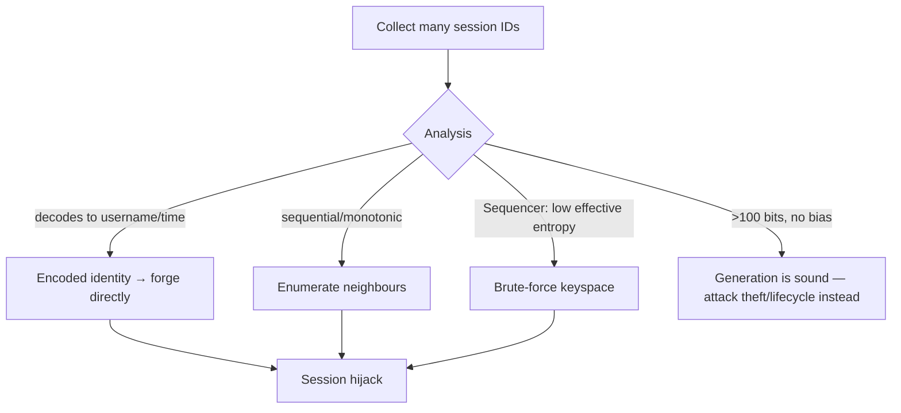
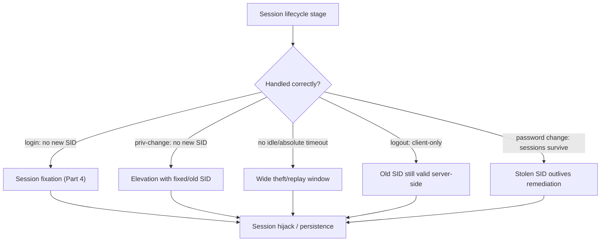
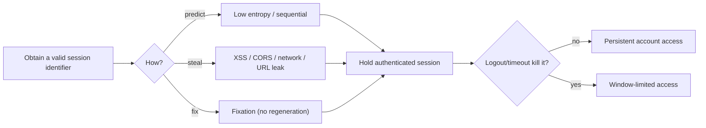
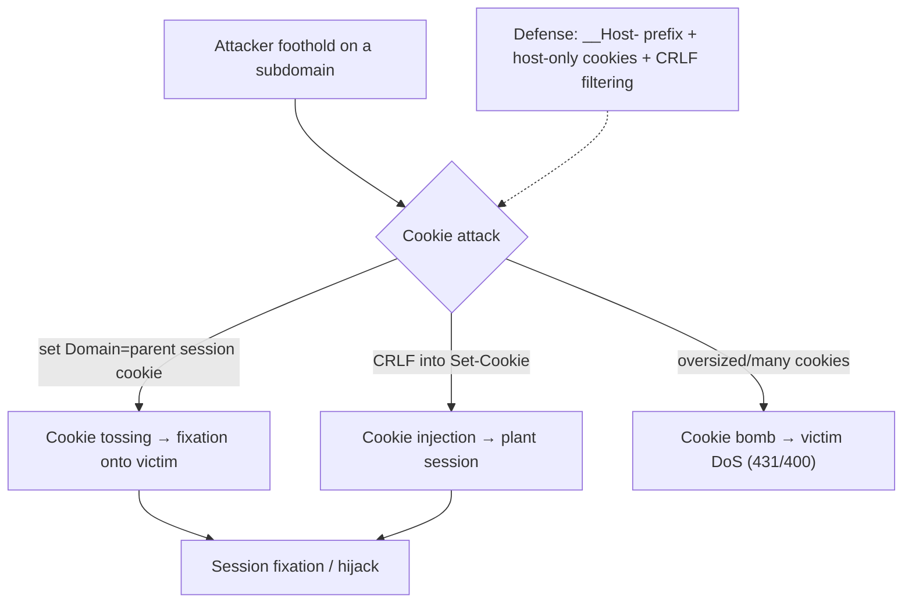
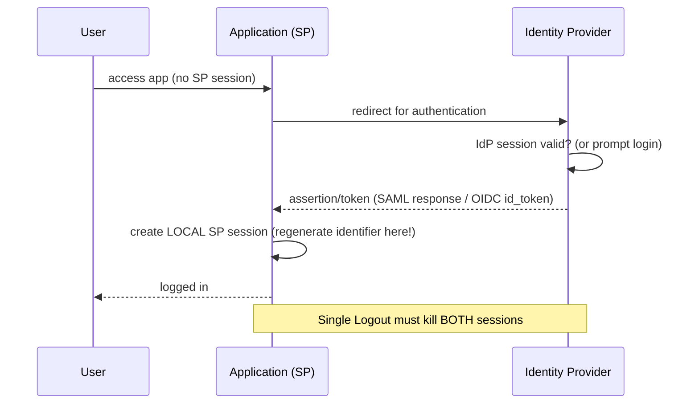
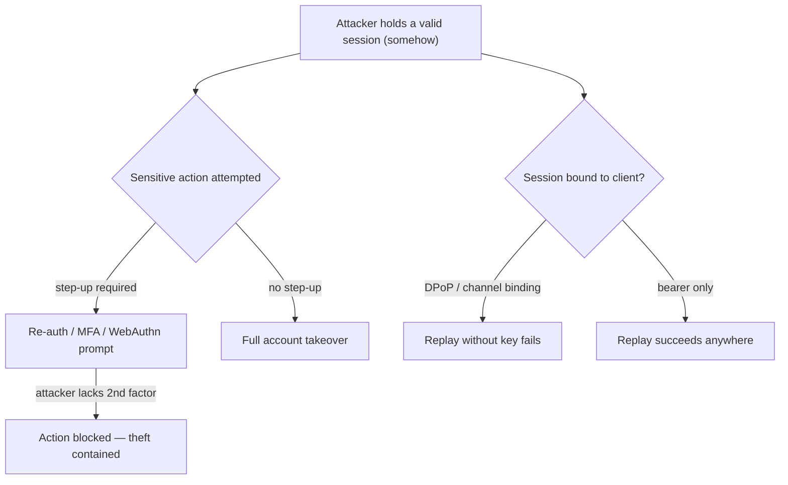
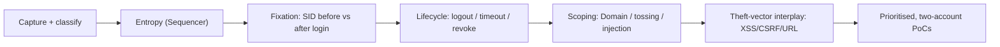

**Level:** Expert · **Track:** Bug Bounty & AppSec · **Read time:** 255 min

This is Chapter 4 of the Access & Logic notebook — Notebook 25. The previous chapters attacked the
login process (Chapter 2) and the tokens it issues (Chapter 3). This chapter is about what happens
*between* logins: the **session**, the mechanism that lets a stateless protocol remember that this
browser already authenticated, and the many ways that mechanism is implemented insecurely.

HTTP is stateless — every request stands alone, carrying no memory of the last. To provide the
experience of "staying logged in," the server issues a **session identifier** after authentication
and the client returns it on every subsequent request; the server maps that identifier to the
user's server-side state. The session identifier is therefore a **bearer credential**: whoever
presents it *is* the user, no password required. Everything in session management is about
generating that credential unpredictably, transmitting and storing it safely, binding it to the
right user at the right time, and destroying it when it should no longer be valid. Each of those is
a place applications fail, and the failures are consistently high-impact because the payoff is
another user's authenticated session.

This chapter builds the session model from stateless HTTP up, covers identifier entropy and the
cookie attributes that protect it, then spends most of its length on the *lifecycle* flaws —
fixation, missing regeneration, weak timeout and logout, and revocation gaps — that make up the
bulk of accepted session findings. It ties deliberately back to the Client-Side notebook, since
XSS (Chapter 3 of Notebook 24), CSRF (Chapter 4), and CORS (Chapter 5) are the main *theft and
abuse* vectors for the credential this chapter is about protecting. Everything is
**authorized-only**: sessions are live credentials for real accounts, so you demonstrate flaws
exclusively with *your own* test accounts, hijacking a session you control to prove the mechanism,
never touching a real user's session.

## Part 1: Stateless HTTP and the Session as a Bearer Credential

Because HTTP carries no built-in memory, session management bolts state on top of it. The canonical
flow: the user authenticates once; the server generates a random session identifier, stores it
server-side keyed to the user, and sends it to the browser (almost always in a cookie); the browser
returns it automatically on every request; the server looks it up and treats the request as that
user's.

```mermaid
sequenceDiagram
    participant B as Browser
    participant S as Server (session store)
    B->>S: POST /login (valid credentials)
    S->>S: generate random SID, store SID→user
    S-->>B: Set-Cookie: session=<SID>; HttpOnly; Secure; SameSite=Lax
    Note over B: cookie stored, returned automatically
    B->>S: GET /account (Cookie: session=<SID>)
    S->>S: look up SID → user → authorize
    S-->>B: 200 account page
    Note over B,S: The SID IS the identity. Steal it → become the user.
```

The single most important property: the session identifier is a **bearer token**. There is
(usually) nothing else tying it to the legitimate user — no signature, no second factor on each
request. So the entire security of the session reduces to three questions, which organize this
chapter:

1. **Can an attacker *predict or brute-force* a valid identifier?** → entropy/generation (Part 2).
2. **Can an attacker *steal* a valid identifier?** → transport/storage protection: the cookie
   attributes (Part 3), and the XSS/CORS/network vectors (Part 7).
3. **Can an attacker *fix, reuse, or keep alive* an identifier they shouldn't?** → lifecycle:
   fixation, rotation, timeout, logout, revocation (Parts 4–6).

**Session ID vs JWT.** The previous chapter's JWTs are *self-contained* (the token carries the
claims); classic sessions are *reference* tokens (the identifier points to server-side state).
Reference sessions have a major security advantage this chapter leans on: they are **revocable** —
delete the server-side entry and the identifier is instantly worthless — which is exactly what
stateless JWTs lack. The tradeoff is server-side state.

## Part 2: Session Identifier Generation — Entropy and Predictability

If session identifiers are predictable, an attacker guesses or brute-forces a valid one and hijacks
the corresponding session without any theft. Secure identifiers must be generated by a
**cryptographically secure PRNG (CSPRNG)** with enough entropy (OWASP: at least 64 bits of
effective entropy, typically a 128-bit random value) that guessing is infeasible.

The failure modes:

- **Sequential or incrementing IDs** (`session=1001`, `1002`) — trivially enumerable; hijack by
  decrementing.
- **Timestamp-based or time-seeded** — derived from `time()` or a weakly-seeded PRNG; the keyspace
  collapses to a narrow, brute-forceable window.
- **Encoded identity** — the "identifier" is `base64(username)` or `md5(user:time)`; decode/forge it
  (this overlaps the remember-me weakness from Chapter 2).
- **Insufficient length / low entropy** — short IDs brute-forceable at scale.
- **Non-cryptographic PRNG** — `rand()`/`Math.random()`/`mt_rand()` are predictable once you recover
  the internal state from a few observed outputs.

**Measuring entropy — Burp Sequencer.** You rarely reverse-engineer the generator; instead you
*measure* the randomness of many collected identifiers. Burp Suite's **Sequencer** automates this:
point it at the response that sets the session cookie, let it capture thousands of tokens, and it
runs FIPS-style statistical tests (bit-level and character-level) to estimate the effective entropy
and flag non-randomness.

```text
# Burp Sequencer summary (conceptual):
Overall result: The amount of effective entropy is estimated to be: 12 bits
                (at a significance level of 1%)   <-- WEAK: 12 bits is brute-forceable
Character-level analysis: significant bias at positions 3,4,9  <-- structure = predictability
```

Twelve bits is ~4096 possibilities — brute-forceable in seconds. A healthy result is "> 100 bits of
effective entropy" with no positional bias. **Bug-bounty relevance:** demonstrably low-entropy or
structured session IDs are a strong, if less common, finding — capture a corpus, run Sequencer, and
show the predictability (or a direct decode for encoded IDs).



## Part 3: Cookie Security Attributes — Protecting the Identifier

Because the session identifier almost always lives in a cookie, the cookie's attributes are the
front line of protecting it. Each attribute defends against a specific theft/abuse vector, and
missing any of them is a distinct finding:

| Attribute | What it does | Attack if missing |
|---|---|---|
| **`HttpOnly`** | Hides the cookie from `document.cookie` (JavaScript) | XSS reads and exfiltrates the session (Chapter 3, NB24) |
| **`Secure`** | Cookie sent only over HTTPS | Network attacker sniffs it over plaintext HTTP |
| **`SameSite`** | Limits cross-site attachment (`Lax`/`Strict`/`None`) | CSRF rides the session (Chapter 4, NB24) |
| **`Domain`** | Which hosts receive the cookie | Too-broad `Domain` leaks it to all subdomains |
| **`Path`** | Which paths receive the cookie | Weak isolation between apps on one host |
| **`Expires`/`Max-Age`** | Persistence/lifetime | Long-lived cookie widens theft/replay window |
| **`__Host-`/`__Secure-` prefixes** | Enforce Secure + host-scoping at the browser | Cookie-injection / subdomain fixation (Part 4) |

**`HttpOnly`, `Secure`, `SameSite`** are the three that matter most and were covered in depth in the
Client-Side notebook — here the point is that they protect *the session identifier specifically*.
The session cookie must have all three (`SameSite=Lax` at minimum) plus `Secure`.

**`Domain` scoping and the subdomain problem.** A cookie set with `Domain=example.com` is sent to
*every* subdomain (`app.example.com`, `blog.example.com`, `legacy.example.com`). If any subdomain is
attacker-influenced (subdomain takeover, an XSS on a marketing subdomain, or a shared-hosting
sibling), a broadly-scoped session cookie is exposed or *injectable* there — the foundation of many
fixation attacks (Part 4). Prefer host-only cookies (omit `Domain`) so only the exact host receives
them.

**Cookie prefixes.** `__Secure-` requires the cookie be set with `Secure` from an HTTPS origin;
`__Host-` additionally requires no `Domain` attribute and `Path=/`, guaranteeing the cookie is
*host-scoped* and can't be overwritten by a subdomain. Naming the session cookie `__Host-session`
is a cheap, strong defense against cookie-injection and subdomain fixation because the browser
itself enforces the constraints.

## Part 4: Session Fixation — The Signature Lifecycle Flaw

**Session fixation** is the flaw that gives this chapter its name. The attack: instead of stealing
the victim's session *after* login, the attacker *fixes* a known session identifier *before* login,
tricks the victim into authenticating with it, and — if the application keeps the same identifier
across the login boundary — the now-authenticated session is one the attacker already knows.

The precondition is that the application **does not regenerate the session identifier upon
authentication**. If logging in doesn't issue a *new* identifier, then whatever identifier the
session had *before* login is still valid *after* login, and anyone who knew the pre-login value now
holds an authenticated session.

```mermaid
sequenceDiagram
    participant A as Attacker
    participant V as Victim
    participant S as Server
    A->>S: visit site → get SID = XYZ (or set one)
    A->>V: lure victim to use SID=XYZ<br/>(link with ;jsessionid=XYZ, or set cookie via subdomain)
    V->>S: log in (browser carries SID=XYZ)
    S->>S: authenticate — but KEEP SID=XYZ (bug: no regeneration)
    Note over S: SID=XYZ is now an AUTHENTICATED session
    A->>S: request with SID=XYZ → authenticated as victim
```

**How the attacker fixes the identifier** in the victim's browser — several vectors:

- **URL-based session IDs.** Legacy apps that accept the session in the URL
  (`https://app.example/;jsessionid=XYZ` or `?sid=XYZ`) let the attacker simply send a link carrying
  a known value. Accepting session IDs from the URL is itself a serious bug (they leak via Referer,
  history, logs).
- **Cookie injection via a subdomain.** If the session cookie is `Domain`-scoped to the parent, an
  attacker who controls or has XSS on any subdomain can `Set-Cookie` a chosen session value that the
  main app will accept — the `__Host-` prefix (Part 3) blocks exactly this.
- **`Set-Cookie` via a meta tag / response-splitting / a related vuln** that lets the attacker plant
  a cookie value.

**The fix is singular and non-negotiable:** *regenerate the session identifier at every privilege
boundary*, especially on login (and on logout, and on privilege elevation). A fresh, random
identifier issued at authentication invalidates any pre-login value the attacker might have fixed.
Frameworks expose this directly: `session_regenerate_id(true)` (PHP), `request.session.cycle_key()`
/ Django's login rotating the key, `HttpSession` invalidation + new session (Java), Rails
`reset_session`. **Bug-bounty relevance:** fixation is confirmed by checking whether the session
cookie value *changes* across the login request — capture it before and after; if it's identical,
test the full fixation chain against your own two test identities.

## Part 5: Session Rotation, Timeout, and Logout Failures

Beyond fixation, the session lifecycle has several stages where mishandling creates hijack or
replay windows:

**Missing regeneration on privilege change.** Even apps that regenerate on login sometimes fail to
do so when privileges *change* mid-session — stepping up to admin, completing MFA, assuming another
role (support "log in as user"). If the identifier persists across an elevation, a fixed or
previously-captured identifier now carries higher privileges.

**Weak session timeout.** Two timeouts matter:

- **Idle (inactivity) timeout** — the session should expire after a period of no activity, limiting
  the window in which a stolen or abandoned session (shared/public computer) is usable.
- **Absolute timeout** — the session should have a hard maximum lifetime regardless of activity, so
  a stolen long-lived session can't live forever.

Missing or excessively long timeouts (sessions valid for weeks, or never expiring) widen every
theft/replay window. High-value apps (banking) use short idle timeouts precisely because the cost of
a live stolen session is high.

**Broken logout.** Logout must invalidate the session **server-side** — delete or mark the
server-side session entry so the identifier is dead. Common failures:

- **Client-only logout** — the app deletes the cookie in the browser but the server-side session
  remains valid, so a captured identifier still works after "logout." Test by logging out, then
  replaying the old identifier: if it still authenticates, logout is broken.
- **Logout doesn't invalidate *other* sessions** — password change/reset should optionally kill all
  active sessions; if it doesn't, a session stolen before a password change survives the user's
  remediation.
- **Back-button / cached authenticated pages** after logout.



**Concurrent sessions and revocation.** Mature apps let users view and revoke active sessions
("devices logged in"); the security requirement is that revocation *actually* invalidates the
server-side entry immediately. Test that a revoked session's identifier stops working at once.

## Part 6: Session Puzzling and Other Logic Flaws

**Session puzzling (session variable overloading)** is a subtler class: the same server-side session
variable is used for two different purposes in two different flows, and an attacker walks one flow
to set the variable, then jumps to another flow that trusts it for a different meaning. Classic
example: a password-reset flow stores the "user being reset" in `session['user']`, and the
post-login area reads `session['user']` to decide who you are — so completing step 1 of reset for a
victim can populate the session as the victim in the authenticated area, bypassing authentication
entirely. The root cause is *reusing a session key across trust boundaries*.

Other lifecycle logic flaws:

- **Sessions not bound to context** — a session usable from any IP/user-agent makes stolen-session
  replay trivial; some high-value apps loosely bind sessions to client attributes (with care, since
  strict binding breaks mobile networks).
- **Predictable "remember me" alongside the session** — covered in Chapter 2; a weak persistent
  token undermines an otherwise-strong session.
- **Race conditions in session creation** — parallel logins yielding shared/colliding identifiers.
- **Cross-site cookie scoping between apps** on shared domains leaking sessions.

## Part 7: How Sessions Get Stolen — Ties to XSS, CSRF, CORS, and the Network

Session *generation* and *lifecycle* are this chapter's focus, but the reason they matter is that a
stolen identifier is game over — so it's worth consolidating the theft vectors, all covered in
depth elsewhere:

| Vector | Mechanism | Defended by | Chapter |
|---|---|---|---|
| **XSS** | `document.cookie` / storage read → exfil | `HttpOnly`, CSP, fixing the XSS | NB24 Ch3 |
| **CSRF** | Ambient cookie rides a forged request | `SameSite`, CSRF tokens | NB24 Ch4 |
| **CORS misconfig** | Cross-origin read of a token/response | Strict CORS allow-list | NB24 Ch5 |
| **Network sniffing** | Plaintext HTTP exposes the cookie | `Secure`, HSTS, TLS everywhere | this chapter |
| **Referer / URL leakage** | Session-in-URL leaks to third parties/logs | Never put SID in URL | this chapter |
| **Physical / shared device** | Session left alive on a public machine | Idle/absolute timeout, logout | this chapter |
| **Fixation** | Attacker fixes a known SID pre-login | Regenerate on auth | this chapter |

The defensive synthesis: protect the identifier *in transit* (`Secure` + TLS/HSTS), *at rest in the
browser* (`HttpOnly` so XSS can't read it, `SameSite` so CSRF can't ride it), *in the URL* (never
put it there), and *over time* (regeneration + timeouts + server-side revocation). A weakness in any
one turns into "attacker holds a valid session," which is why session security is genuinely
end-to-end.

**Session-riding recap (from NB24 Ch3):** note that `HttpOnly` stops an attacker *reading* the
identifier via XSS but does **not** stop XSS from *using* the session in-browser (the network stack
still attaches the cookie to `fetch`). So `HttpOnly` narrows but doesn't eliminate XSS's session
impact — another reason fixing the XSS itself, not just flagging the cookie, is the real control.

## Part 8: Hands-On Lab — Fixation, Weak Logout, and Entropy Analysis

A reproducible lab: a deliberately vulnerable app that keeps the session identifier across login
(fixation), logs out client-side only, and generates low-entropy identifiers. Local and yours.

### 8.1 The vulnerable app

```python
# session_app.py — INTENTIONALLY VULNERABLE. Lab only.
from flask import Flask, request, make_response, redirect
import itertools
app = Flask(__name__)
SESSIONS = {}                                   # sid -> user (server-side state)
counter = itertools.count(1000)                 # BUG: sequential, low-entropy IDs

@app.route("/set")
def set_sid():
    # Attacker can FIX a chosen SID (app accepts an arbitrary incoming value)
    sid = request.args.get("sid") or str(next(counter))
    r = make_response("sid set")
    r.set_cookie("session", sid)                # BUG: no HttpOnly/Secure/SameSite; Domain broad in prod
    SESSIONS.setdefault(sid, None)
    return r

@app.route("/login")
def login():
    sid = request.cookies.get("session") or str(next(counter))
    SESSIONS[sid] = "alice"                      # BUG: authenticates the EXISTING sid (no regeneration)
    r = make_response("logged in as alice")
    r.set_cookie("session", sid)                 # same sid persists across login → fixation
    return r

@app.route("/whoami")
def whoami():
    return f"user={SESSIONS.get(request.cookies.get('session'))}"

@app.route("/logout")
def logout():
    r = make_response("logged out")
    r.set_cookie("session", "", expires=0)       # BUG: clears cookie but does NOT delete server-side
    return r                                      # SESSIONS[sid] still = "alice"

if __name__ == "__main__": app.run(port=5000)
```

### 8.2 Exploit 1 — session fixation

```bash
# 1. Attacker fixes a known SID and lures the victim to use it (here: sid=ATTACKER123)
curl -s "http://127.0.0.1:5000/set?sid=ATTACKER123" -c victim.txt
# 2. Victim logs in WITH that sid (no regeneration → sid stays authenticated)
curl -s http://127.0.0.1:5000/login -b victim.txt -c victim.txt
# 3. Attacker, who knew ATTACKER123 all along, uses it:
curl -s http://127.0.0.1:5000/whoami --cookie "session=ATTACKER123"
# -> user=alice        attacker holds the victim's authenticated session
```

### 8.3 Exploit 2 — broken (client-only) logout

```bash
# Log in, capture the sid, "log out", then replay the OLD sid:
curl -s http://127.0.0.1:5000/login -c s.txt >/dev/null
SID=$(grep session s.txt | awk '{print $7}')
curl -s http://127.0.0.1:5000/logout -b s.txt >/dev/null      # server-side entry NOT deleted
curl -s http://127.0.0.1:5000/whoami --cookie "session=$SID"
# -> user=alice        the session survived logout — replay works
```

### 8.4 Exploit 3 — entropy / predictability

The identifiers are a sequential counter, so knowing one lets you guess neighbours:

```bash
# Observe a couple of issued IDs, note they increment, then enumerate:
for s in 1000 1001 1002 1003; do
  echo -n "$s -> "; curl -s http://127.0.0.1:5000/whoami --cookie "session=$s"
done
# any that return user=alice is an active hijacked session
```

For a realistic corpus + statistical analysis, feed the `/login` response to **Burp Sequencer**
("live capture" on the `Set-Cookie: session=` token) and read the effective-entropy estimate — a
sequential counter reports near-zero effective entropy.

### 8.5 The fixes, demonstrated

```python
import secrets
@app.route("/login")
def login():
    old = request.cookies.get("session")
    if old: SESSIONS.pop(old, None)              # drop any pre-login (possibly fixed) session
    sid = secrets.token_urlsafe(32)              # CSPRNG, ~256-bit — regenerate on auth
    SESSIONS[sid] = "alice"
    r = make_response("logged in")
    r.set_cookie("session", sid, httponly=True, secure=True, samesite="Lax")  # protect the cookie
    return r

@app.route("/logout")
def logout():
    SESSIONS.pop(request.cookies.get("session"), None)   # DELETE server-side → identifier dead
    r = make_response("logged out"); r.set_cookie("session", "", expires=0)
    return r
```

Re-running the three exploits now fails: the fixed SID is discarded and a fresh random one issued
(fixation dead), logout deletes the server-side entry (replay dead), and the CSPRNG identifier has
no enumerable structure (prediction dead).

### 8.6 PortSwigger / practice drills

```text
- "Session fixation" style flows (via Juice Shop / custom labs)
- PortSwigger "Web Security Academy" cookie & session topics; the authentication labs' stay-logged-in
  cookie brute-force (NB25 Ch2) is adjacent
- Burp Sequencer against any target's session token to practice entropy analysis
```

### 8.7 What each exploit proves for a report

Keep the three lab exploits mapped to their report narratives: Exploit 1 proves **fixation** ("the
session identifier does not change across authentication, so an attacker-fixed value becomes an
authenticated session"), Exploit 2 proves **broken logout** ("the server-side session survives logout,
so a captured identifier remains valid indefinitely"), and Exploit 3 proves **weak generation** ("the
identifier is sequential/low-entropy and can be enumerated"). Each narrative names the specific
control that is missing and is reproducible against your own two test identities — which is exactly the
evidence a triager needs to accept the finding at the right severity.

## Part 9: Real-World Impact, CVEs & Escalation

Session flaws are consistently high-impact because the payoff is a live authenticated session:

- **Session fixation** has produced real account-takeover on apps that accepted URL-based session
  IDs or broadly-scoped cookies and failed to regenerate on login — historically common in
  Java/`jsessionid` and PHP apps.
- **Predictable session identifiers** enabled mass hijacking on early web apps using
  `mt_rand()`/time-seeded generators; it's why CSPRNG generation became baseline.
- **Broken logout / non-revocation** repeatedly appears where "logout" only clears the client
  cookie — a stolen or shared-device session survives, and password changes don't kill active
  sessions.
- **Overly broad `Domain` cookies + subdomain takeover** turn a dangling subdomain into a
  session-injection/theft foothold.
- **Session puzzling** has yielded authentication bypass where a session variable was reused across
  the reset and authenticated flows.

Session management failures map to OWASP **A07 Identification and Authentication Failures** (and the
cookie-attribute gaps to **A05 Security Misconfiguration**). The escalation logic: predict, steal,
or fix an identifier → hold a valid session → full account access, persisting as long as the session
lives (which weak logout/timeout extends indefinitely).



A useful framing for reports is the "session kill-chain length" — how many independent things must
go right for the attacker. A predictable identifier is a one-step compromise (guess → hijack). A
fixation bug is two-step (fix → lure victim to log in). A theft-based hijack is longer (find a theft
vector → exfiltrate → replay) but is *shortened* every time a protective attribute is missing: no
`HttpOnly` removes a step for XSS, no `SameSite` removes a step for CSRF, a session-in-URL removes a
step for passive leakage, and no server-side logout removes the attacker's need to act quickly. The
practical consequence for triage is that session findings **compound**: report the missing attribute
*and* the reachable theft vector together, because their combination is what collapses the kill chain
to something trivially exploitable. Conversely, a single missing attribute on an app that is otherwise
correct (short-lived, regenerated, server-side-revocable sessions) is genuinely lower severity, and
saying so accurately builds credibility with the program.

**CTF relevance:** session challenges commonly hinge on a predictable/decodable cookie or a fixation
flow; decoding a `base64(username)` "session" or incrementing a numeric one is a frequent web-CTF
pattern.

## Part 10: Cookie Scoping Deep-Dive — Tossing, Injection, and Cookie Bombs

Part 3 introduced the cookie attributes; the *scoping* rules deserve their own treatment because
they enable a family of cross-subdomain session attacks that are easy to miss. The core issue is
that cookies do **not** obey the Same-Origin Policy the way most web resources do — their
visibility is governed by the older, looser `Domain`/`Path` rules, which means one host can affect
another host's cookies in ways SOP would never allow.

**The scoping rules that matter.** A cookie with `Domain=example.com` is sent to `example.com` *and
every subdomain*. A cookie set by `a.example.com` without a `Domain` attribute is host-only (just
`a.example.com`). Critically, `a.example.com` **can set** a cookie for `Domain=example.com` (a
parent it belongs to), which will then be sent to `b.example.com` — a subdomain writing a cookie
that a *sibling* subdomain receives. This is the root of the following attacks.

**Cookie tossing.** An attacker with control of, or an injection on, a low-value subdomain
(`blog.example.com`, a user-content subdomain, a taken-over dangling subdomain) sets a
`Domain=example.com` cookie named the same as the main app's session cookie. The victim's browser
now holds *two* `session` cookies — one host-scoped by the real app, one domain-scoped by the
attacker — and, depending on path/precedence rules, may send the attacker's value to the main app.
This "tosses" an attacker-chosen session onto the victim, enabling **session fixation** (Part 4)
even without URL-based IDs. It's precisely why the `__Host-` prefix exists: a `__Host-` cookie
*cannot* have a `Domain` attribute and can't be overwritten by a subdomain, defeating tossing.

**Cookie injection via response splitting / header injection.** If any endpoint reflects
unsanitised input into a `Set-Cookie` header (CRLF injection), an attacker plants an arbitrary
session cookie directly — a direct fixation primitive. Modern servers largely block CRLF in
headers, but reverse-proxy/edge misconfigurations still surface it.

**Cookie bombs (denial of service).** An attacker who can set large or numerous cookies for a domain
(again via a subdomain or an injection) can push the victim's total cookie size for the domain past
the server's request-header limit, so every subsequent request is rejected with `431 Request Header
Fields Too Large` or a `400` — a targeted client-side DoS that locks the victim out of the app until
they clear cookies. It's low-severity but a real, occasionally-accepted finding.



**Test methodology:** enumerate the target's subdomains (`subfinder`/`amass` from the Recon
notebook), check for any you can influence (user content, takeover-able dangling records), and test
whether a `Domain`-scoped cookie you set there is honoured by the main app. Also grep for endpoints
reflecting input into `Set-Cookie`. **Security relevance:** cookie tossing converts a "minor"
subdomain issue into a session-fixation vector against the crown-jewel app — the same amplification
pattern seen with CORS wildcard-subdomain trust in NB24 Ch5.

## Part 11: Session Flaws in SSO, OAuth, and Federated Logins

Most enterprise and many consumer apps delegate authentication to an identity provider (IdP) via
**SSO** — SAML or OpenID Connect. This introduces *two* sessions where a standalone app has one, and
the interaction between them is a rich, frequently-mishandled surface that builds on the token work
in Chapter 3.

**The two-session model.** In federated login there is an **IdP session** (your login at the
identity provider — Okta, Azure AD, Google) and a **Service Provider (SP) session** (the local
session the application creates *after* the IdP asserts your identity). The SP session is an ordinary
session subject to everything in this chapter — but its *creation* and *destruction* depend on the
IdP, and that dependency is where flaws live.



The recurring flaws:

- **No session regeneration after SSO assertion.** The SP must issue a fresh local identifier when
  it creates the session from the IdP assertion — the same fixation defense as Part 4, applied at
  the federation boundary. Apps that keep the pre-SSO identifier are fixation-vulnerable via SSO.
- **Broken Single Logout (SLO).** Logging out of the app (SP) must also end the relevant IdP/other-SP
  sessions, and vice versa. Very commonly, "logout" ends only the local SP session while the IdP
  session stays live, so re-visiting the app silently re-authenticates — the user believes they
  logged out but a shared-device attacker just clicks back in. Worse, logging out of the app but not
  the IdP leaves every *other* federated app still authenticated.
- **Session-lifetime mismatch.** The SP session outlives the IdP session (or ignores IdP-side
  revocation/disablement), so a de-provisioned or logged-out user retains access to the app until the
  local session independently expires — a serious offboarding gap.
- **Assertion replay / missing binding.** A SAML response or OIDC token that isn't single-use,
  audience-bound, and time-bound can be replayed to mint an SP session (this overlaps Chapter 3's
  token validation — `aud`/`exp`/`iss`/one-time `jti`, and for SAML the `NotOnOrAfter`,
  `Recipient`, and `InResponseTo` fields plus signature validation).

**Security relevance and testing:** on an SSO target, test (1) whether the local identifier
regenerates after the IdP round-trip, (2) whether SP logout truly ends the session server-side *and*
whether the IdP session persists (revisit the app after logout — does it silently log you back in?),
and (3) whether disabling the user at the IdP promptly cuts app access. **Bug-bounty relevance:**
"SSO logout does not invalidate the application session" and "SP session survives IdP-side
deprovisioning" are accepted, real findings — the impact is that a terminated employee or a
shared-device user retains access. These are session-lifecycle bugs wearing a federation costume;
every principle from Parts 4–5 applies, just split across two systems.

## Part 12: Reducing the Value of a Stolen Session — Binding and Step-Up

Every control so far tries to stop the identifier being predicted, stolen, or fixed. Defense-in-depth
accepts that a determined attacker may *still* obtain a valid identifier (via a zero-day XSS, malware,
or a shared device) and asks a second question: **can we make a stolen session less useful?** This is
where session *binding* and *step-up authentication* come in — the controls that separate a merely
correct implementation from a resilient one.

**Context binding (use with care).** The idea is to tie a session to attributes an attacker replaying
it from elsewhere won't share:

| Binding signal | Stops | Cost / risk |
|---|---|---|
| IP address | Replay from a different network | Breaks mobile/roaming/CGNAT users; brittle |
| User-Agent | Naive replay with a different client | Trivially spoofed; low value alone |
| TLS session / channel binding (Token Binding, RFC 8471) | Token export to another TLS client | Limited browser support historically |
| **DPoP** (OAuth, RFC 9449) | Bearer-token replay (binds token to a client key) | Modern, API-focused; strong for OAuth |

Naive **IP binding** is the classic over-correction: it does stop cross-network replay, but it locks
out legitimate users whose IP changes (mobile networks, corporate NAT, VPNs), and an attacker often
shares the victim's NAT egress anyway. The lesson: strict binding trades security for availability and
must be tuned; UA binding alone is near-worthless (spoofable). The cryptographic bindings — TLS
channel binding and **DPoP** (which proves possession of a private key on each request, so a stolen
bearer token can't be replayed without the key) — are the robust modern answers, especially for APIs.

**Step-up / re-authentication for sensitive actions.** The most practical resilience control: require
a *fresh* authentication (password re-entry, MFA, WebAuthn) at the moment a user performs a high-value
action — change email/password, add a payout method, disable MFA, make a transfer. Even an attacker
holding a valid session cannot complete these without the second proof. This is the same control that
blunts the XSS-driven and CSRF-driven account-takeover chains from the Client-Side notebook, and it's
why banks re-prompt before a wire even within an active session.



**Continuous / risk-based validation.** Mature platforms re-evaluate session risk *during* its life:
a sudden change in IP geolocation ("impossible travel"), device fingerprint, or behaviour raises the
assurance requirement or invalidates the session and forces re-authentication. This converts the
static "valid until expiry" model into a dynamic one that can react to a mid-session hijack — the
detection signals in the next section feed exactly this.

**Security relevance:** when assessing a target, note the *absence* of step-up on sensitive actions as
its own finding — it's what turns a stolen or ridden session (from any theft vector in Part 7) into
irreversible account takeover. And when a target *does* enforce step-up and DPoP-style binding,
recognise that your stolen-session PoC is correctly contained, which is itself worth documenting.

## Part 13: A Repeatable Session-Testing Methodology

Session findings come from a fixed, thorough walk rather than luck. On any target with a login, run
this sequence — it exercises every flaw in the chapter and produces clean, two-account PoCs.

**Phase 1 — capture and classify the identifier.** Log in with proxy on. Find the session cookie
(and any secondary tokens: remember-me, CSRF). Record its **attributes** (`HttpOnly`, `Secure`,
`SameSite`, `Domain`, `Path`, prefix, expiry) — each missing attribute is a candidate finding. Try to
**decode** the value (base64, hex, JWT — count the dots): if it reveals identity or structure, that's
an immediate generation flaw.

**Phase 2 — generation/entropy.** Collect a corpus (log in repeatedly, or hit the session-issuing
endpoint) and run **Burp Sequencer**. Look for low effective entropy and positional bias. For obviously
sequential/encoded IDs, skip statistics and demonstrate enumeration/decoding directly.

**Phase 3 — fixation & regeneration.** This is the highest-yield check. Capture the identifier
**before** login and **after** login:

```text
- Note SID before authentication (visit any page)
- Authenticate
- Note SID after authentication
- IDENTICAL  → session fixation (no regeneration) — build the full fixation chain
- CHANGED    → regeneration present; move on
```

Repeat across *every* privilege boundary: password login, SSO assertion (Part 11), MFA completion,
and any "elevate to admin"/"assume user" transition — a change on login but not on elevation is still
a bug.

**Phase 4 — lifecycle: logout, timeout, revocation.** Save an identifier, log out, and **replay** it —
if it still authenticates, logout is client-only (broken). Test idle timeout (leave the session,
return) and absolute timeout (use it far beyond the expected lifetime). Change the account password and
test whether *other* captured sessions survive (they shouldn't). If the app lists devices/sessions,
revoke one and confirm its identifier dies immediately.

**Phase 5 — scoping & cross-subdomain.** Check `Domain` breadth; enumerate subdomains and test cookie
**tossing** (Part 10) if any subdomain is influenceable; look for `Set-Cookie` reflection (injection)
and oversized-cookie DoS.

**Phase 6 — theft-vector interplay.** Confirm the identifier is reachable by the vectors from Part 7:
is the cookie missing `HttpOnly` (XSS-readable)? missing `SameSite` (CSRF-ridable)? ever present in a
URL (Referer/log leakage)? These findings compound — "missing `HttpOnly` + a reflected XSS" is a full
session-theft chain, not two separate lows.



The output of the walk is a prioritised list where the identifier's *generation*, *protection*, and
*lifecycle* have each been probed — the three questions from Part 1, answered with evidence. Running
the same sequence every engagement is what makes session testing reliable rather than ad-hoc, and it
doubles as a design-review checklist for defenders building or auditing the session layer.

## Part 14: Detection & Defense Angle

Secure session management is a checklist of well-understood controls; the discipline is applying
*all* of them. In priority order:

**1. Generate identifiers with a CSPRNG, ≥128 bits, no structure.** Use the framework's session
machinery (which does this correctly) rather than rolling your own; never encode identity or use
`rand()`/`mt_rand()`/`Math.random()`. Store only a reference; keep state server-side.

**2. Regenerate the identifier at every privilege boundary.** On login, on privilege elevation, on
MFA completion — issue a *new* identifier and invalidate the old. This single control eliminates
session fixation. (`session_regenerate_id(true)`, `reset_session`, `cycle_key()`, etc.)

**3. Protect the cookie with all attributes.** `HttpOnly` + `Secure` + `SameSite=Lax`(/`Strict`),
host-only scoping (omit `Domain`, or use the `__Host-` prefix), sensible `Path`. Never accept or
place a session identifier in the URL.

**4. Enforce timeouts and real logout.** Idle timeout (short for high-value apps) and an absolute
maximum lifetime; logout must **delete the server-side session**; password change/reset should
invalidate other active sessions. Provide session listing + revocation for users.

**5. Don't reuse session variables across trust boundaries** (prevents session puzzling); bind
sensitive flows to the fully-authenticated session only.

**6. Layer with TLS/HSTS** so the `Secure` cookie is never exposed, and with the Client-Side
notebook's controls (fix XSS, `SameSite`/CSRF tokens, strict CORS) since those are the theft
vectors.

**Reference: secure session config in three stacks.** The correct settings are one-liners the
framework already supports; getting them right is most of the defense:

```python
# Flask
app.config.update(
    SESSION_COOKIE_HTTPONLY=True, SESSION_COOKIE_SECURE=True, SESSION_COOKIE_SAMESITE="Lax",
    PERMANENT_SESSION_LIFETIME=timedelta(minutes=30))     # absolute-ish lifetime
# regenerate on login: clear old + issue new
session.clear(); session["uid"] = user.id                 # Flask rotates the signed session on change
```

```php
// PHP — regenerate on every privilege change; harden the cookie.
session_set_cookie_params(['httponly'=>true,'secure'=>true,'samesite'=>'Lax','path'=>'/']);
session_start();
session_regenerate_id(true);        // true = delete the OLD session file → kills fixation
```

```ruby
# Rails
Rails.application.config.session_store :cookie_store,
  key: '__Host-session', secure: true, httponly: true, same_site: :lax
reset_session                       # call on login/logout to rotate the identifier
```

Each encodes the same rules: `HttpOnly`+`Secure`+`SameSite` on the cookie, host-scoping (the
`__Host-` name in Rails), a bounded lifetime, and **rotation on authentication**. The one line
developers most often omit is the regeneration call — which is exactly the fixation bug from Part 4.

**Detection signals:**

| Signal | Where | Indicates |
|---|---|---|
| Same session identifier before and after login | App logs / test | Missing regeneration (fixation risk) |
| One identifier used from many IPs/user-agents at once | Session/audit logs | Hijack / shared stolen session |
| Session identifiers appearing in URLs, Referer, or access logs | Web logs | URL-based session leakage |
| Requests with sequential/adjacent identifiers | WAF/app logs | Identifier enumeration |
| Activity on an identifier after logout/revocation | Audit logs | Broken invalidation |
| Session valid far beyond expected lifetime | Session store | Missing absolute timeout |

**Blue-team usage:** log session *creation, regeneration, and destruction* events with the
identifier's fingerprint (not the raw value), and alert on use of an identifier after its
destruction event, or the same identifier from geographically impossible locations. **IR use case:**
on suspected hijack, pull every request bound to the identifier, the IP/UA diversity, and whether a
regeneration occurred at the victim's last login — a session that never regenerated and is used from
two places is the fixation/hijack fingerprint.

## Part 15: Common Pitfalls & Gotchas

- **No regeneration on login.** The defining fixation bug — always check the identifier changes
  across authentication.
- **Client-only logout.** Clearing the cookie without deleting the server-side session leaves the
  identifier valid; test replay-after-logout.
- **Session identifiers in URLs.** They leak via Referer, history, and logs; never accept or emit
  them there.
- **Broad `Domain` cookies.** Expose the session to every subdomain; prefer host-only / `__Host-`.
- **Missing `HttpOnly`/`Secure`/`SameSite`** on the session cookie — each is a distinct theft/abuse
  vector.
- **Rolling your own identifier generator.** Almost always weaker than the framework's; use the
  framework.
- **No idle/absolute timeout.** Turns any theft into indefinite access.
- **Reusing session variables across flows.** Enables session puzzling / auth bypass.
- **Password change doesn't kill other sessions.** A stolen session outlives the user's
  remediation.

## Part 16: Final Revision / Summary

- HTTP is stateless; the **session identifier is a bearer credential** (Part 1) — whoever presents it
  is the user. Its security reduces to: can it be *predicted*, *stolen*, or *fixed/kept alive*?
- **Generation** (Part 2): use a CSPRNG with ≥128 bits and no structure; measure real corpora with
  **Burp Sequencer**; sequential/encoded/time-seeded identifiers are hijackable.
- **Cookie attributes** (Part 3) protect the identifier: `HttpOnly` (vs XSS read), `Secure` (vs
  network), `SameSite` (vs CSRF), host-only/`__Host-` scoping (vs subdomain injection), timeouts.
- **Fixation** (Part 4) is the signature flaw: the app fails to *regenerate the identifier on login*,
  so an attacker-fixed pre-login value becomes an authenticated session. Fix = regenerate at every
  privilege boundary.
- **Lifecycle failures** (Part 5): missing regeneration on privilege change, weak idle/absolute
  timeout, client-only logout, and non-revocation on password change. **Session puzzling** (Part 6)
  reuses a session variable across trust boundaries for auth bypass.
- **Theft vectors** (Part 7) tie back to the Client-Side notebook — XSS, CSRF, CORS, network, URL
  leakage — which is why session security is end-to-end.
- **Defend** (Part 14): CSPRNG identifiers, regeneration on auth, full cookie attributes, real
  server-side logout + timeouts + revocation, no session-in-URL, no cross-boundary variable reuse,
  TLS/HSTS.

## Part 17: Cheat Sheet / Quick Reference

**Test for fixation**

```bash
# Capture the session cookie value BEFORE and AFTER login — identical = fixation risk.
curl -s /pre -c c.txt ; curl -s /login -b c.txt -c c.txt ; grep session c.txt   # did it change?
```

**Test broken logout**

```bash
# Save SID, log out, replay SID — still authenticated = broken (client-only) logout.
curl -s /logout -b s.txt ; curl -s /whoami --cookie "session=$OLD_SID"
```

**Entropy analysis:** Burp **Sequencer** → live-capture the `Set-Cookie` session token → read
effective-entropy estimate (want > 100 bits, no positional bias).

**Secure session cookie**

```http
Set-Cookie: __Host-session=<CSPRNG>; HttpOnly; Secure; SameSite=Lax; Path=/
```

**Attribute → threat map**

| Attribute | Stops |
|---|---|
| `HttpOnly` | XSS reading the session |
| `Secure` + HSTS | network sniffing |
| `SameSite=Lax/Strict` | CSRF riding the session |
| host-only / `__Host-` | subdomain cookie injection / fixation |
| idle + absolute timeout | prolonged theft/replay |
| server-side logout/revocation | post-logout replay |
| regenerate on login | session fixation |

**Lifecycle rules:** regenerate on login/priv-change → protect the cookie → time it out → destroy it
server-side on logout → never put it in the URL → never reuse the session variable across flows.

## Part 18: Practice Labs & Resources

- **PortSwigger Web Security Academy** — the Authentication labs' "Brute-forcing a stay-logged-in
  cookie" and the cookie/session topic notes; combine with **Burp Sequencer** for entropy analysis
  practice. (Session-fixation is best practised on Juice Shop and custom labs.)
- **OWASP Juice Shop:** session and cookie challenges (weak cookies, session handling) end to end.
- **OWASP Session Management Cheat Sheet & WSTG-SESS (all tests):** the authoritative checklist —
  identifier properties, cookie attributes, fixation, timeout, logout, puzzling.
- **DVWA / bWAPP:** weak-session-ID and session-fixation exercises.
- **Burp Suite Sequencer:** capture and statistically analyse any target's session token entropy.
- **Disclosed HackerOne reports (filter `session fixation` / `session`):** accepted fixation,
  broken-logout, and predictable-identifier write-ups for impact framing.

**Practice questions**

1. You capture the session cookie value immediately before and immediately after a successful login
   and find they are identical. Name the vulnerability class this indicates, describe the full
   attack that exploits it, and give the one-line framework call that fixes it.
2. An application's "logout" makes the session cookie disappear from your browser, yet replaying the
   old cookie value still returns authenticated content. Explain what the application failed to do
   and how you'd prove the flaw with two requests.
3. You collect 5,000 session identifiers and Burp Sequencer estimates 18 bits of effective entropy
   with character bias at fixed positions. Explain what this means for an attacker and the change
   required to remediate.
4. A session cookie is set with `Domain=example.com`. Describe a scenario in which an attacker who
   controls `promo.example.com` can fix or steal a main-app session, and the cookie configuration
   that prevents it.
5. Explain session puzzling with a concrete two-flow example, identify the root cause, and state the
   design rule that prevents it.
6. An application uses SSO (OIDC). You log out of the application and are returned to its home page,
   but clicking "login" logs you straight back in with no prompt. Explain which session survived, why
   this is a real finding, and the two things a correct Single Logout implementation must do.
7. A team proposes binding every session to the client's IP address to stop hijacking. Give one attack
   this stops, two categories of legitimate users it breaks, and a more robust binding mechanism that
   achieves the goal without the availability cost.

---

*Also on [Praneeth's portfolio](https://ping-praneeth.vercel.app/notebook/appsec-access-logic/04-session-management-flaws-and-fixation), with comments and the latest edits.*
