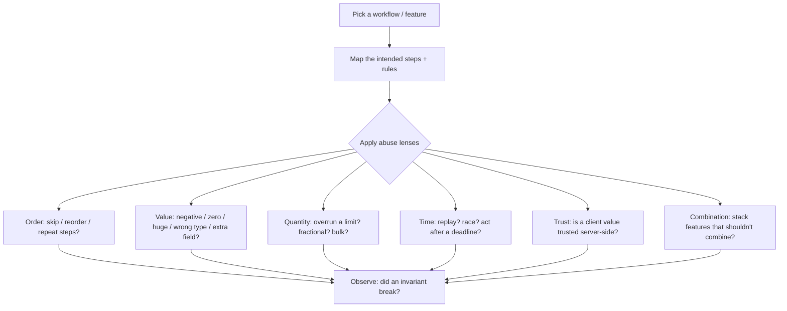
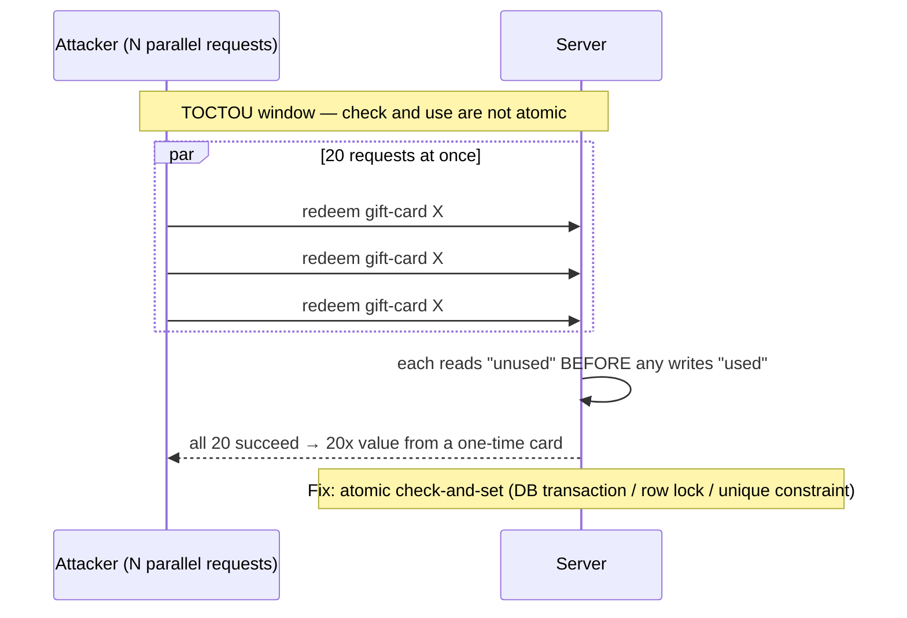
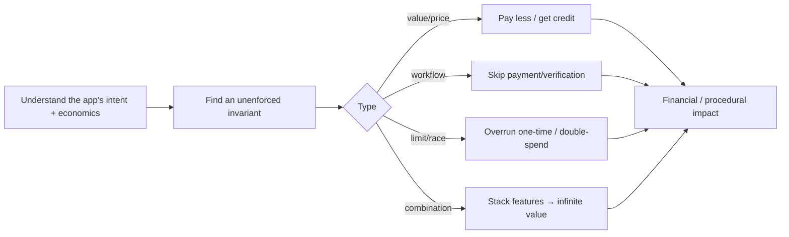
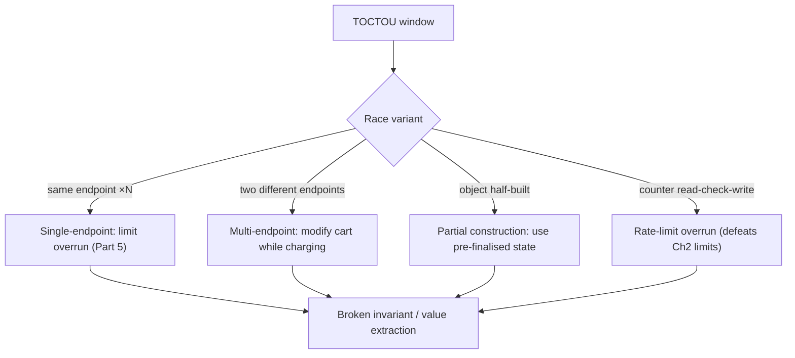
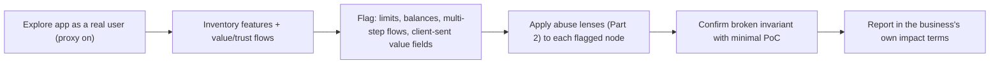

This is Chapter 5 of the Access & Logic notebook — Notebook 25, and the notebook's closing
chapter. The previous chapters attacked concrete, well-defined mechanisms — access control, login,
tokens, sessions — each with recognisable signatures. This chapter is about the flaws that have no
signature at all: **business logic vulnerabilities**, where the application does exactly what its
code says, every input is valid, every request is authenticated and authorized, and yet an attacker
achieves something the business never intended — buying a $1000 item for $1, redeeming one coupon a
thousand times, withdrawing money twice from a single balance, or skipping the payment step of a
checkout entirely.

Business logic flaws are the hardest class to find and the most valuable, because they are invisible
to automated tools. A scanner can recognise an SQL-injection payload or an XSS sink, but it cannot
know that your application intends a discount code to be used *once*, that a bank transfer must not
exceed the account balance, or that a user shouldn't be able to leave a product review without
having purchased the product. Those are *rules of the business*, encoded (or forgotten) in the
application's flow, and finding where they're unenforced requires understanding what the application
is *for* and then deliberately misusing it. This is the domain where a human tester who thinks in
**abuse cases** vastly outperforms any tool.

This chapter builds that abuse-case mindset, catalogues the major logic-flaw families with concrete
examples, goes deep on race conditions (the most technical sub-class) including the modern
single-packet attack, and provides a reproducible lab. Everything is **authorized-only**: logic
abuse can move real money and inventory, so you demonstrate flaws with the *smallest* possible proof
against your *own* test account — a single manipulated order, one race-induced extra unit — and
never conduct actual fraud or repeat the abuse for gain.

## Part 1: What "Business Logic" Means and Why Tools Miss It

A **business logic vulnerability** is a flaw in the *design and implementation of the application's
intended workflow* that lets an attacker elicit unintended behaviour — not by breaking the
technology (no injection, no memory corruption) but by using legitimate functionality in an
illegitimate way. The requests are valid; the *sequence, values, or combination* is what the
designers didn't anticipate.

Contrast the two worlds:

| Property | Technical vulns (XSS, SQLi, etc.) | Business logic vulns |
|---|---|---|
| Signature | Recognisable payload/pattern | None — valid requests |
| Found by | Scanners, fuzzers, signatures | Human reasoning about intent |
| Root cause | Unsafe handling of input/data | Unenforced business rule / bad assumption |
| Example | `' OR 1=1--` | Order 5, then change quantity to -5 for a refund |
| Fix | Encode/parameterise/validate input | Enforce the invariant server-side |

The reason tools miss logic flaws is that a tool has no model of *intent*. It doesn't know your
store never wants a negative quantity, that a flight can't be booked after departure, or that a
loyalty balance shouldn't go below zero. Those constraints live in the developers' heads and,
ideally, in server-side checks. Where a developer *assumed* something ("nobody would send a negative
number", "the client already validated this", "these steps always happen in order") instead of
*enforcing* it, a logic flaw waits.

**The core skill is thinking in abuse cases.** For every feature, ask not "what is this supposed to
do?" but "what happens if I do the opposite / too much / out of order / at the same time / with a
value the UI would never send?" That reframing — from use case to *abuse* case — is the whole method,
and it's why this chapter reads more like a way of thinking than a list of payloads.

## Part 2: The Abuse-Case Mindset — A Systematic Method

Logic testing is systematic, not random. For each workflow, walk a fixed set of questions that
surface unenforced assumptions:



The lenses, each a recurring flaw family:

- **Order / workflow** — can you skip a step (pay), reorder steps, repeat a one-time step, or start
  step 3 without steps 1–2?
- **Value** — does the field accept negatives, zero, extreme values, wrong types, or *extra* fields
  the UI never sends (ties to mass assignment, Chapter 1)?
- **Quantity / limits** — can you exceed a "max 1 per customer", buy more than in stock, or request a
  fractional/bulk amount the logic mishandles?
- **Time / concurrency** — can you replay an action, act after a deadline, or fire concurrent
  requests to beat a check (race conditions, Part 5)?
- **Trust boundary** — is any security-relevant value (price, discount, role, "isPaid") taken from
  the client and trusted?
- **Combination** — do two features interact in an unintended way (stack a coupon with a referral
  credit and a price-match)?

Running these lenses over each feature is the method. The examples in the next parts are what each
lens tends to find.

## Part 3: Parameter and Price Manipulation — Trusting the Client

The most common and lucrative logic flaw: the application trusts a **client-supplied value** for
something that should be server-authoritative. The archetype is **price manipulation** — the price is
sent from the browser and the server bills what it's told:

```http
POST /cart/checkout HTTP/1.1
Content-Type: application/json

{ "productId": "SKU-999", "quantity": 1, "price": 1.00 }   <- price should be looked up server-side!
```

If the server charges `price` from the request instead of looking up SKU-999's real price, an
attacker buys a $1000 item for $1. The same pattern recurs anywhere a security- or money-relevant
value crosses the trust boundary from client to server:

- **Price / currency / discount amount** sent by the client.
- **`isPaid`, `orderStatus`, `accountType`, `role`** in the request (overlaps mass assignment).
- **Recipient / account number** on a transfer, editable to redirect funds.
- **Product identity vs price mismatch** — order a cheap SKU but reference an expensive item's
  fulfilment.

**Negative and zero values.** A subclass: the field validates as a number but the logic assumes it's
positive. A **negative quantity** or **negative price** can invert a charge into a *credit*:

```http
{ "productId": "SKU-1", "quantity": -5, "price": 100 }   -> total -500 → account credited?
```

Negative transfers ("transfer -$100 from victim to me" = "transfer +$100 from me... to me from
them"), negative quantities yielding refunds, and zero-price edge cases are classic. The server must
enforce domain constraints (`quantity >= 1`, `price` server-looked-up, transfer amount `> 0` and
`<= balance`).

```mermaid
sequenceDiagram
    participant A as Attacker
    participant S as Server
    A->>S: POST /checkout {productId:SKU-999, price:1.00}
    S->>S: charge request.price (BUG: trusts client)
    S-->>A: order confirmed — $1 for a $1000 item
    Note over S: Fix: price = lookup(productId); ignore client price entirely
```

**Bug-bounty relevance:** price/parameter tampering is among the highest-value logic findings on
e-commerce and fintech programs. Prove it with a single order on your own test account at a
manipulated price, screenshot the confirmation, and stop — never place repeat or high-value fraudulent
orders. The finding is "the server trusts the client price/quantity"; one clean example demonstrates
it.

## Part 4: Workflow, Step-Skipping, and Insufficient Process Validation

Multi-step processes (checkout, registration, KYC, wire approval) assume steps happen in order and
each completes before the next. When the server doesn't *enforce* that each prerequisite step
actually happened, an attacker jumps straight to the valuable step.

**Payment step-skipping.** The canonical example: a checkout is `add-to-cart → shipping → payment →
confirm`, but the `confirm`/`order-complete` endpoint doesn't verify that `payment` succeeded. The
attacker walks to payment, then requests the confirmation endpoint directly (or replays a
prior-order confirmation), obtaining goods without paying:

```http
POST /order/complete HTTP/1.1        # reached directly, skipping /payment
{ "orderId": "1001" }                # server marks order complete without checking payment state
```

**Other step-skip patterns:**

- **Registration/verification skip** — reach the "email verified" or "onboarding complete" state
  without completing verification.
- **KYC / approval bypass** — access a gated feature by jumping to the post-approval endpoint.
- **Multi-step reset** — the session-puzzling/step-skip from Chapter 4 applied to reset flows.
- **Re-ordering steps** — completing a later step first to satisfy a check the earlier step would
  have set.

The root cause is *state that isn't validated server-side*: the app tracks progress in the client or
assumes forward-only navigation. The fix is a server-side state machine that verifies each
transition's prerequisites (`order.status == 'paid'` before `complete`), never trusting that the
client followed the intended path.

## Part 5: Race Conditions — The Technical Heart of Logic Abuse

A **race condition** is a logic flaw in *time*: the application checks a condition and then acts on
it, but between the check and the act (a **TOCTOU** window — Time-Of-Check to Time-Of-Use) an
attacker slips in concurrent requests that invalidate the assumption. The classic shape is the
**limit overrun**: "you may redeem this gift card once" is enforced by *read balance → if unused,
apply → mark used*, and firing many requests in parallel means several read "unused" before any marks
"used" — so the single-use card is applied many times.



**Where race conditions bite** — anywhere a limit or balance is checked then mutated:

- **Coupon / gift-card / voucher** redeemed beyond its one-time limit.
- **Withdrawal / transfer double-spend** — spend the same balance twice before either debit lands.
- **"One per customer" limits** — claim a limited promo/inventory item many times.
- **Rate-limit / OTP-attempt overrun** (ties to Chapter 2) — beat the attempt counter with
  concurrency.
- **Vote/like/rating inflation, referral-credit stacking, loyalty-point duplication.**
- **State transitions** — approve/cancel/refund the same object twice.

**Exploiting races — the tooling and the timing problem.** To win a race you must land the concurrent
requests within the tiny TOCTOU window. Two techniques:

- **Burp Turbo Intruder** — a Burp extension for high-rate, precisely-controlled request sending via a
  Python script; the traditional way to fire hundreds of parallel requests.
- **The single-packet attack** — a modern technique (PortSwigger research) that eliminates *network
  jitter* by completing many HTTP/2 requests in a **single TCP packet**, so they arrive at the server
  effectively simultaneously. It made race conditions dramatically more reliable and is built into
  Burp's Repeater ("send group in parallel") and Turbo Intruder. This is the current best method for
  timing-sensitive races.

```python
# Turbo Intruder — fire 20 identical redeem requests as close to simultaneously as possible.
def queueRequests(target, wordlists):
    engine = RequestEngine(endpoint=target.endpoint, concurrentConnections=20,
                           engine=Engine.BURP2)      # HTTP/2 single-packet-capable engine
    for i in range(20):
        engine.queue(target.req, gate='race1')       # hold all requests at a gate
    engine.openGate('race1')                          # release them together → minimal skew
def handleResponse(req, interesting):
    table.add(req)
```

In Burp Repeater, the equivalent is grouping the requests and choosing **"Send group in parallel
(single-packet attack)"**. **Bug-bounty relevance:** race conditions on redemption/withdrawal limits
are high-value and increasingly reported thanks to the single-packet attack making them reliable;
demonstrate with the *minimum* overrun (e.g. redeem a one-time code twice) on your own test asset,
never repeated for gain.

## Part 6: Quantity, Limit, and Feature-Combination Abuse

Beyond races, limits and feature interactions fail in non-concurrent ways too:

**Quantity/limit logic errors.** Integer overflow or rounding in totals (order a quantity that
overflows the price calculation to a small/negative total); "max 1 per order" enforced per-request
but not across multiple orders; bulk/tiered pricing miscalculated at extreme quantities;
fractional-unit handling (`0.0001` of an item) that rounds the charge to zero.

**Coupon / referral / loyalty stacking.** Business rules usually intend discounts *not* to combine,
but the implementation applies each independently: stack multiple coupons, combine a coupon with a
referral credit and a price-match, or re-apply the same coupon by re-adding it. Referral programs are
notoriously abusable — self-referral loops, or creating throwaway accounts to farm referral credit
into one real account.

**Feature-combination abuse.** Two individually-fine features produce an unintended result together:
apply store credit to buy gift cards (converting non-withdrawable credit into transferable value);
use a refund flow plus a return flow to get paid twice; combine a subscription trial with a
cancellation-refund to net free service. These require understanding the *economics* of the
application — exactly what tools can't model.

| Abuse family | Example | Underlying missing check |
|---|---|---|
| Price tampering | Client-sent price honoured | Server-side price lookup |
| Negative values | `quantity = -5` → credit | Domain constraint (`>= 1`) |
| Step-skip | Confirm order without paying | Server-side state machine |
| Race / limit overrun | Redeem one-time code ×20 | Atomic check-and-set |
| Coupon stacking | Apply 5 coupons at once | Mutual-exclusion rule enforced |
| Referral farming | Self-referral loops | Identity/eligibility validation |
| Feature combination | Store credit → gift card → cash | Cross-feature invariant |

## Part 7: Trust-Boundary and Client-Side-Trust Failures

A cross-cutting root cause worth isolating: **trusting the client for anything security- or
value-relevant**. The browser (and any API client) is fully attacker-controlled, so *any* value it
sends can be arbitrary. Logic flaws of this kind include:

- **Hidden/disabled form fields** treated as trustworthy (`<input type=hidden name=price>`,
  `discount=0.5`, `role=user`) — the client can change them freely.
- **Client-side validation only** — the "you can't order more than stock" check is JavaScript; the
  API accepts anything.
- **Trusting client-computed results** — the client sends the *computed total*, loyalty tier, or
  eligibility decision and the server accepts it.
- **Sequence/state tracked client-side** — the "which step am I on" or "payment done" flag lives in a
  cookie/hidden field the attacker edits.

The universal fix is the security principle **"never trust the client; re-derive and re-validate
everything security-relevant on the server."** Prices come from the server's catalogue, totals are
computed server-side, eligibility is decided server-side, and workflow state is a server-side machine.
Client-side checks are for UX only. This principle underlies price tampering (Part 3), step-skipping
(Part 4), and mass assignment (Chapter 1) alike — they're all instances of a trust boundary crossed
in the wrong direction.

## Part 8: Hands-On Lab — Price Tampering and a Race-Condition Overrun

A reproducible lab: a deliberately vulnerable shop that trusts the client price and applies coupons
non-atomically. Local and yours.

### 8.1 The vulnerable app

```python
# logic_app.py — INTENTIONALLY VULNERABLE. Lab only.
from flask import Flask, request, jsonify
import threading, time
app = Flask(__name__)
CATALOG = {"SKU-999": 1000.00}
COUPON = {"code": "SAVE50", "used": False, "value": 50}   # one-time coupon
lock_disabled = True                                       # BUG: no locking around check-and-use

@app.route("/checkout", methods=["POST"])
def checkout():
    d = request.json
    price = d.get("price", CATALOG.get(d["productId"]))    # BUG: trusts client-sent price if present
    qty = d.get("quantity", 1)                             # BUG: no domain constraint (negatives ok)
    return jsonify({"charged": round(price * qty, 2)})

@app.route("/redeem", methods=["POST"])
def redeem():
    # BUG: check-then-act with a deliberate gap → race window
    if not COUPON["used"]:
        time.sleep(0.05)                                   # widens the TOCTOU window for the demo
        COUPON["used"] = True
        return jsonify({"applied": COUPON["value"]})
    return jsonify({"applied": 0, "error": "already used"})

if __name__ == "__main__": app.run(port=5000, threaded=True)
```

### 8.2 Exploit 1 — price tampering

```bash
curl -s -X POST http://127.0.0.1:5000/checkout -H "Content-Type: application/json" \
  -d '{"productId":"SKU-999","price":1.00,"quantity":1}'
# -> {"charged":1.0}     a $1000 item bought for $1 (server trusted client price)
```

### 8.3 Exploit 2 — negative quantity

```bash
curl -s -X POST http://127.0.0.1:5000/checkout -H "Content-Type: application/json" \
  -d '{"productId":"SKU-999","quantity":-2}'
# -> {"charged":-2000.0}   negative total → a credit (no domain constraint on quantity)
```

### 8.4 Exploit 3 — race-condition coupon overrun

Fire many `/redeem` requests concurrently so several pass the `if not used` check before any sets
`used = True`:

```bash
# 20 parallel requests; more than one "applied" = overrun
for i in $(seq 20); do
  curl -s -X POST http://127.0.0.1:5000/redeem -H "Content-Type: application/json" &
done | grep -c '"applied":50'
# expected (vulnerable): >1  → the one-time coupon applied multiple times
```

In Burp, the reliable version is grouping one `/redeem` request ×20 and choosing **"Send group in
parallel (single-packet attack)"**, or the Turbo Intruder script from Part 5. The count of successful
`applied:50` responses beyond 1 is the overrun.

### 8.4b Exploit 4 — payment step-skip (add a route to model it)

Extend the lab app with a two-step order to see step-skipping directly:

```python
ORDERS = {}
@app.route("/order/create", methods=["POST"])
def create():
    oid = str(len(ORDERS) + 1); ORDERS[oid] = {"status": "pending"}   # unpaid
    return jsonify({"orderId": oid})

@app.route("/order/complete", methods=["POST"])
def complete():
    oid = request.json["orderId"]
    ORDERS[oid]["status"] = "complete"          # BUG: never checks status == 'paid'
    return jsonify(ORDERS[oid])
```

```bash
OID=$(curl -s -X POST http://127.0.0.1:5000/order/create | python3 -c "import sys,json;print(json.load(sys.stdin)['orderId'])")
# skip /payment entirely — go straight to complete:
curl -s -X POST http://127.0.0.1:5000/order/complete -H "Content-Type: application/json" -d "{\"orderId\":\"$OID\"}"
# -> {"status":"complete"}     order completed without paying (workflow not validated)
```

The fix is the server-side state machine: `if ORDERS[oid]["status"] != "paid": abort(409)` before
allowing the transition to `complete`.

### 8.5 The fixes, demonstrated

```python
# Price: ALWAYS look up server-side; ignore any client price. Constrain quantity.
price = CATALOG[d["productId"]]                 # never d.get("price")
qty = int(d.get("quantity", 1))
if qty < 1: return jsonify({"error": "invalid quantity"}), 400

# Coupon: atomic check-and-set (DB unique constraint / row lock / compare-and-swap).
_lock = threading.Lock()
with _lock:                                     # or: UPDATE coupons SET used=1 WHERE code=? AND used=0
    if COUPON["used"]:
        return jsonify({"error": "already used"}), 409
    COUPON["used"] = True
return jsonify({"applied": COUPON["value"]})
```

Re-running the exploits now fails: the server-side price lookup ignores the client value, the
quantity constraint rejects negatives, and the atomic redeem (lock or a DB `UPDATE ... WHERE
used=0`) allows exactly one success no matter how many parallel requests arrive.

### 8.6 PortSwigger drills

```text
Business logic:
- "Excessive trust in client-side controls" (price tampering)         → Part 3
- "High-level logic vulnerability" / "Low-level logic vulnerability"  → Part 6 (quantity/overflow)
- "Inconsistent handling of exceptional input"                        → Part 2 value lens
- "Insufficient workflow validation" / "Authentication bypass via flawed state machine" → Part 4
- "Flawed enforcement of business rules" (coupon stacking)            → Part 6
- "Infinite money logic flaw"                                         → Part 6 feature-combination
Race conditions:
- "Limit overrun race conditions"                                     → Part 5
- "Bypassing rate limits via race conditions"                         → Part 5 (ties to Ch2)
- "Multi-endpoint / single-endpoint race conditions"                  → Part 5 (single-packet attack)
- "Partial construction race conditions"                              → Part 5
```

The race-condition labs are the definitive practice for the single-packet attack with Burp Repeater's
parallel send and Turbo Intruder.

## Part 9: Real-World Impact, CVEs & Escalation

Business logic flaws produce some of the most damaging and least-detectable breaches because they
look like legitimate use:

- **Price/parameter tampering** has enabled real fraud on e-commerce platforms — buying goods at
  attacker-set prices, or manipulating totals to zero — and remains a staple of accepted bug-bounty
  reports on shopping and fintech targets.
- **Race-condition financial abuse** — double-spending balances, redeeming one-time codes many times,
  overrunning "one per customer" limits — has been used against exchanges, banks, and reward
  programs; the single-packet attack made these dramatically more exploitable and a wave of
  disclosures followed.
- **Coupon/referral/loyalty abuse** ("infinite money" flaws) quietly drain promotional budgets;
  self-referral loops and stackable discounts are perennial.
- **Workflow/step-skip bypasses** — obtaining goods without payment, bypassing KYC/verification, or
  reaching gated features — appear across many verticals.
- **Insufficient validation of exceptional input** (negatives, extremes, wrong types) turns charges
  into credits and limits into no-ops.

A recurring, instructive pattern is the **"infinite money" glitch**: a loop of individually-legitimate
operations that nets positive value each cycle. A concrete shape seen across platforms — buy a gift
card with store credit, redeem the gift card back to a *withdrawable* balance, and repeat; or apply a
percentage discount to a purchase of a *fungible* credit instrument so each round yields more spending
power than it cost. No single step is a bug; the *cycle* violates the invariant "value in == value
out". These flaws are found only by modelling the economics and asking "does any sequence of legal
operations leave me richer?" — the pure abuse-case question. Another durable class is the **refund/
return double-dip**: a refund flow and a return flow that each independently credit the customer, so
completing both yields double the money back; the missing invariant is "an order is refunded at most
once across all paths."

Business logic flaws are OWASP-adjacent under **A04:2021 Insecure Design** — the category created
specifically to capture flaws that arise from missing or flawed design/threat-modelling rather than
implementation bugs. The escalation logic is business-specific: the "privilege" you gain is
*economic or procedural* — money, goods, service, or a skipped control — rather than a shell or admin
role, which is exactly why impact must be framed in the application's own terms.



**CTF relevance:** logic challenges are common in web CTFs — "buy the flag with negative quantity",
"race the redeem endpoint", or "skip the payment step" — and reward exactly the abuse-case thinking
this chapter teaches rather than payload knowledge.

## Part 10: Race-Condition Variants — Multi-Endpoint, Single-Endpoint, and Partial Construction

Part 5 covered the classic single-endpoint limit-overrun. Modern race research (PortSwigger's
"Smashing the state machine") formalised several variant shapes, and recognising them expands what
you'll find. Each is still a TOCTOU window, but the window and the concurrent requests differ.

**Single-endpoint races** hit the *same* endpoint in parallel — the coupon/gift-card overrun of Part
5. The window is between that endpoint's own read and write. Reliable with the single-packet attack
firing N identical requests.

**Multi-endpoint races (a.k.a. "collision" races)** send *different* endpoints concurrently so one
observes the other mid-operation. The archetype is **add-to-cart / apply-payment**: begin a purchase
that validates the cart total, and *simultaneously* modify the cart (add an expensive item) so the
charge is computed on the cheap cart but the fulfilment reflects the modified one. Another: change an
email and confirm an action in parallel so the confirmation lands against a half-updated state. These
require aligning two different requests to arrive within the same window — harder, and where the
single-packet attack's jitter elimination matters most.

**Single-endpoint / partial-construction races** exploit a window during which an object exists in a
*half-initialised* state. A common instance: user registration inserts the user row, then in a
second step sets a flag or a password; a request racing in *between* those steps sees a user that
exists but isn't fully constrained — e.g. an account created without a confirmed email is briefly
usable, or a not-yet-set security field is default/empty. You exploit the object while it's
partially built.

**"Rate-limit / anti-automation" races** (tie to Chapter 2): the OTP-attempt or login-attempt counter
is read-checked-incremented non-atomically, so parallel submissions each see "attempts = k" before
any writes "k+1", multiplying your effective attempts and defeating the limit — a race *enabling*
another attack.



**Methodology for races.** (1) Identify actions with a *limit, balance, or state transition* — those
are the candidates. (2) For each, hypothesise the check-then-act sequence. (3) In Burp, group the
request(s) and use **"Send group in parallel (single-packet attack)"** (HTTP/2) or **last-byte
synchronisation** (HTTP/1.1) to minimise arrival skew. (4) Look for an outcome that violates the
invariant — two successes on a one-time action, a balance below zero, a total computed on stale
state. (5) Confirm and stop at the minimum overrun.

**Timing/sync detail worth knowing.** The single-packet attack works over HTTP/2 by packing the
final frames of ~20–30 requests into one TCP packet, so server-side processing begins for all of
them near-simultaneously regardless of network jitter — the innovation that turned races from
"flaky, needs LAN proximity" into "reliable from anywhere." For HTTP/1.1 targets, Turbo Intruder's
last-byte-sync (send all but the final byte of each request, then release the last bytes together)
approximates it. Knowing which transport the target speaks tells you which technique to reach for.

## Part 11: Finding Logic Flaws in Practice — Feature Mapping and Reporting

Because logic flaws have no signature, *where you look* and *how you frame the finding* determine
success. This part is the practical workflow around the Part 2 mindset.

**Map the application's features and money/trust flows first.** Before testing, build a model of what
the app *does* and where value or trust moves: what can be bought/sold, credited, refunded,
transferred, redeemed, or unlocked; which actions have limits ("one per customer", quotas, balances);
which workflows are multi-step (checkout, KYC, onboarding, approval); and which values the client
sends that *look* security-relevant (price, discount, role, status, quantity, recipient). This map is
your target list — each node is a candidate for an abuse lens.



**Prioritise by economic impact.** Logic testing is open-ended, so focus where a broken invariant is
most costly: payment/checkout, fund transfers, discount/coupon/referral logic, withdrawal/redemption
limits, and anything touching real money or inventory. A price-tampering bug on checkout outranks a
quantity quirk on a wishlist.

**Reading disclosed reports as training.** The fastest way to build logic intuition is studying
disclosed bug-bounty reports: they show the *specific* unenforced invariant and the *specific* abuse,
which trains pattern-recognition that transfers across apps. Filtering HackerOne for `business logic`
and `race condition` and reading how the researcher reasoned from feature to abuse is worth more than
any payload list.

**Reporting logic flaws well.** Because there's no CVE-style signature, the report must (1) state the
*intended* business rule, (2) show the *specific* request/sequence that violates it, (3) prove impact
in the application's own terms ("$1000 item purchased for $1", "one-time code redeemed 20×,
$1000 of value extracted"), and (4) demonstrate with the *minimum* non-fraudulent proof against your
own test account. Triagers who can't rely on a scanner signature need this narrative clarity to
accept and rate the bug. A well-framed logic report — clear invariant, clean PoC, business-terms
impact — is consistently among the highest-rated submissions precisely because these bugs are rare
and severe.

**Ethics and blast radius.** Logic abuse can move real money and inventory, so the discipline is
strict: one manipulated order, one extra redemption, one skipped step — enough to prove the invariant
is unenforced, then stop. Never repeat for gain, never touch other users' assets, and revert any test
state you changed (cancel the $1 order). The finding is the *unenforced rule*, not the loot.

## Part 12: More Logic Families — Anti-Automation, Expiry, and Cross-Object Trust

Beyond pricing, workflow, and races, several other logic families recur often enough to test
explicitly on every target.

**CAPTCHA and anti-automation bypass.** Anti-automation controls (CAPTCHA, "human check", velocity
limits) are business logic and frequently bypassable: the CAPTCHA token is verified only on the *web*
path but not the mobile/API path; the token is reusable (not single-use) so one solved CAPTCHA
authorises many requests; the "verify CAPTCHA" step can be skipped like any workflow step; or the
server accepts requests when the CAPTCHA parameter is *absent* (the omit-the-parameter pattern from
CSRF, Chapter 4). Bypassing anti-automation re-enables brute force, scraping, and coupon farming, so
it's a force-multiplier finding.

**Expiry, deadline, and time-window abuse.** Logic that depends on *time* often mishandles the
boundaries: a discount/coupon still honoured after its expiry (server checks expiry client-side or
not at all); a booking/bid accepted after the deadline; a "24-hour" trial that resets by
re-registering or by toggling the clock; a limited-time offer whose window is enforced only in the
UI. Test actions *just after* their intended deadline and check whether the server independently
enforces the time constraint.

**Cross-object and cross-tenant trust.** Logic that assumes objects belong together without checking:
applying *your* coupon to *someone else's* order; using a discount tied to product A on product B;
redeeming a warranty/refund for an item you didn't buy; or, in multi-tenant SaaS, an action in tenant
X that references an object in tenant Y because the code joins on an ID without scoping to the tenant
(a logic cousin of the IDOR class from Chapter 1). The missing check is a *relationship* invariant —
"this coupon belongs to this order", "this object belongs to this tenant".

**Quantity/type confusion in real currencies.** Money and quantity fields invite type/precision
abuse: submitting a float where an integer is expected, exploiting rounding (`0.5` of an indivisible
unit charged as `0`), currency-mismatch (pay in a weak currency, receive value in a strong one where
conversion is mis-ordered), or scientific notation/overflow that collapses a total.

| Family | Test | Missing invariant |
|---|---|---|
| Anti-automation bypass | Omit/reuse CAPTCHA token; use API path | CAPTCHA single-use + on every path |
| Expiry abuse | Act just after a deadline | Server-side time enforcement |
| Trial reset | Re-register / toggle to renew a trial | Identity-bound eligibility |
| Cross-object trust | Apply your coupon to another's order | Relationship/ownership check |
| Cross-tenant | Reference tenant Y's object from X | Tenant-scoped queries |
| Currency/precision | Float/rounding/overflow on money | Typed, range-checked money handling |

**Security relevance:** these families share the chapter's root cause — an *assumed relationship or
constraint that is never enforced server-side*. The testing recipe is identical: identify the
business rule the feature implies, then send a request that respects the *syntax* but violates the
*rule*, and see if the server notices. When it doesn't, you've found a logic flaw, and the report
names the specific unenforced relationship.

## Part 13: Detection & Defense Angle

Business logic flaws can't be scanned away; they're prevented by *design discipline* and *server-side
invariants*. In priority order:

**1. Define and enforce invariants server-side.** For every workflow, write down the business rules
as invariants — `price = catalog[sku]`, `0 < quantity <= stock`, `transfer_amount <= balance`,
`coupon_uses <= 1`, `order.status must be 'paid' before 'complete'` — and enforce each on the server,
on every request. The bug is almost always an assumed-but-unchecked invariant.

**2. Never trust the client for security/value-relevant data.** Re-derive prices, totals,
eligibility, roles, and workflow state server-side. Treat all client input (including hidden fields
and "computed" values) as attacker-controlled.

**3. Make limit checks atomic (kills races).** Enforce one-time/limited actions with database-level
guarantees: a **unique constraint**, a **row lock** (`SELECT ... FOR UPDATE`), an atomic
compare-and-set (`UPDATE ... WHERE used = 0`), or an idempotency key. Never "read, decide in
application code, then write" for anything with a limit or balance.

**4. Idempotency for money-moving/one-time operations.** Require a client-supplied idempotency key so
retries/replays/parallel duplicates collapse to a single effect — the standard defense for payments
and the practical antidote to many races and double-submits.

**5. Server-side state machines for workflows.** Model multi-step processes as explicit states with
validated transitions; reject any request whose prerequisite state isn't met. This kills
step-skipping and out-of-order abuse.

**6. Domain constraints on every value.** Reject negatives/zeros/extremes/wrong-types where the
business doesn't allow them; validate ranges and types at the boundary.

**7. Threat-model with abuse cases.** During design, run the Part 2 lenses over each feature ("what
if negative / out of order / concurrent / combined?"). This is the *Insecure Design* remedy — catch
the missing invariant before it ships.

**Reference: the two patterns that prevent most logic bugs.** Almost all defenses reduce to
*server-authoritative values* and *atomic limited operations*. Concretely:

```python
# Server-authoritative checkout — never trust client price/total; re-derive everything.
def checkout(req, user):
    items = req["items"]                                   # client sends WHAT, never HOW MUCH
    total = 0
    for it in items:
        product = db.get_product(it["sku"])                # price from the catalog, not the request
        qty = int(it["quantity"])
        if qty < 1 or qty > product.stock:                 # domain constraints
            raise BadRequest("invalid quantity")
        total += product.price * qty                       # total computed server-side
    charge(user, total)                                    # bill the server-computed total only
```

```sql
-- Atomic one-time redemption — the database enforces the limit, not application code.
UPDATE coupons SET used = 1, used_by = :uid
WHERE code = :code AND used = 0;                            -- affected-rows = 1 → success, 0 → already used
-- No read-check-write in the app layer; concurrent requests can't both get affected-rows = 1.
```

```sql
-- Balance debit that cannot go negative or double-spend, in one atomic statement:
UPDATE accounts SET balance = balance - :amount
WHERE id = :id AND balance >= :amount;                     -- 0 rows affected = insufficient funds, safely
```

The first snippet kills price/parameter tampering and negative-value abuse; the SQL snippets kill the
race/limit-overrun class by pushing the check *into* the atomic write so there is no TOCTOU window.
Idempotency keys layer on top for money movement: store the key with the operation's result and
return the stored result on any retry, so replays and parallel duplicates collapse to one effect.

**Detection signals** (harder than for technical vulns, but real):

| Signal | Where | Indicates |
|---|---|---|
| Orders/charges with anomalous totals (very low, zero, negative) | Transaction logs | Price/quantity tampering |
| A one-time code/limit applied more than once | App audit logs | Race / limit overrun |
| Bursts of near-simultaneous identical requests | Access logs / APM | Race-condition exploitation |
| Completed orders with no corresponding payment event | Payment reconciliation | Payment step-skip |
| Users reaching gated states without prerequisite events | Workflow audit logs | Step-skipping |
| Referral/loyalty balances growing without matching activity | Business analytics | Referral/coupon farming |

**Blue-team usage:** the strongest logic-abuse detection is *business-invariant monitoring* —
reconcile that every completed order has a payment, every redeemed one-time code has exactly one use,
and no balance goes negative; alert on violations, since a broken invariant in the data is the
fingerprint of a logic exploit. **IR use case:** when fraud is suspected, look for near-simultaneous
duplicate requests (race), anomalous parameter values (tampering), or state transitions missing their
prerequisites (step-skip) — the exploit hides in *valid* requests, so you hunt for *impossible
outcomes*, not bad payloads.

## Part 14: Common Pitfalls & Gotchas

- **Relying on scanners.** No tool finds logic flaws; they require human abuse-case reasoning about
  the application's purpose.
- **Trusting the client price/total/role/state.** The universal root cause — re-derive server-side.
- **"Read-check-write" for limits.** Non-atomic check-and-set is a race waiting to happen; use DB
  constraints/locks/idempotency.
- **Validating only positive/expected inputs.** Test negatives, zero, extremes, wrong types, and
  *extra* fields.
- **Assuming steps happen in order.** Without a server-side state machine, attackers jump to the
  valuable step.
- **Per-request limits only.** "One per order" without a cross-order/global check is bypassable with
  multiple orders (or a race).
- **Ignoring feature interactions.** Individually-safe features (credit, refund, gift cards) can
  combine into value extraction.
- **Over-minimising severity.** Logic flaws move real money/goods; frame impact in the business's own
  terms with a single clean PoC.
- **Testing for gain.** Prove with the minimum (one manipulated order, one extra redeem) on your own
  account — never conduct actual fraud.

## Part 14b: A Logic-Testing Field Guide

Because there is no scanner to lean on, keep a fixed routine so nothing is missed on a target:

1. **Model the app before touching it.** List every action that moves money, inventory, trust, or
   state; mark which have limits/balances and which are multi-step. This is your candidate list.
2. **For each client request, ask "which of these values should the server own?"** Price, total,
   discount, role, status, recipient, quantity, eligibility — try changing each and see if the server
   re-derives or blindly trusts it.
3. **For each numeric field, push the domain edges:** negative, zero, huge, fractional, wrong type,
   and *extra* fields the UI never sends.
4. **For each multi-step flow, break the order:** skip the valuable prerequisite (payment,
   verification), repeat a one-time step, and start a later step first.
5. **For each limit/balance/one-time action, race it:** group the request in Burp and send in parallel
   (single-packet attack); look for more successes than the limit allows.
6. **For each pair of features, ask "what if I combine them?"** — coupon + referral + price-match,
   credit → gift card → withdrawal, refund + return.
7. **For anything time-bound, act just past the deadline** and check server-side enforcement.
8. **Prove with the minimum** non-fraudulent artifact on your own account, frame impact in business
   terms, and revert test state.

This routine operationalises the Part 2 lenses into a repeatable pass and doubles as a design-review
checklist: a feature that survives all eight questions has its value-relevant inputs server-owned, its
domains constrained, its workflow enforced as a state machine, and its limited operations made atomic
— the Insecure-Design remedy this chapter argues for. With this chapter the Access & Logic notebook
(Notebook 25) is complete: access control, authentication, tokens, sessions, and now the logic that
ties them together. The Server-Side notebook turns from the application's *rules* to the *server
operations* an attacker can hijack — SSRF, file upload, and traversal.

## Part 15: Final Revision / Summary

- Business logic flaws are **valid requests used in unintended ways** (Part 1) — no payload, no
  signature; scanners miss them because they have no model of *intent*. They map to OWASP **A04
  Insecure Design**.
- The method is the **abuse-case mindset** (Part 2): for each feature, apply the order/value/quantity/
  time/trust/combination lenses to surface unenforced assumptions.
- **Price/parameter tampering** (Part 3) trusts client-sent values (price, role, `isPaid`); negatives
  and zeros invert charges into credits. **Step-skipping** (Part 4) exploits workflows that don't
  validate prerequisites server-side.
- **Race conditions** (Part 5) exploit the TOCTOU window between check and use — limit overruns,
  double-spends — and the **single-packet attack** (Burp parallel send / Turbo Intruder) makes them
  reliable.
- **Quantity/limit and feature-combination abuse** (Part 6) — coupon stacking, referral farming,
  "infinite money" — require understanding the app's economics. **Client-trust failures** (Part 7)
  are the cross-cutting root cause.
- **Defend** (Part 13): enforce **server-side invariants**, never trust the client, make limit checks
  **atomic** (DB constraints/locks/idempotency), use **server-side state machines**, constrain every
  value's domain, and **threat-model with abuse cases** during design.
- The unifying rule across every family in this chapter: an application is only as safe as the
  invariants it **enforces**, not the ones it **assumes** — the tester's job is to find the assumed-but-
  unchecked rule, and the defender's job is to turn every assumption into a server-side check.

## Part 16: Cheat Sheet / Quick Reference

**Abuse lenses (run on every feature)**

| Lens | Ask | Finds |
|---|---|---|
| Order | Skip / reorder / repeat a step? | Step-skipping, payment bypass |
| Value | Negative / zero / huge / wrong type / extra field? | Price tampering, credits, mass assignment |
| Quantity | Overrun a limit? fractional? bulk? | Limit/overflow abuse |
| Time | Replay? race? act after a deadline? | Race conditions, expired-action abuse |
| Trust | Is a client value trusted server-side? | Client-trust failures |
| Combination | Stack features that shouldn't combine? | Coupon stacking, infinite value |

**Price/quantity tampering**

```json
{"productId":"SKU-999","price":1.00,"quantity":-2}   // trusts client price? honours negatives?
```

**Race condition (Burp):** group the request ×N → **Send group in parallel (single-packet attack)**
for HTTP/2, or Turbo Intruder with a `gate` (HTTP/1.1: last-byte synchronisation) releasing all
requests together. Success = more completions than the limit allows (two redemptions of a one-time
code, a balance driven below zero, a total computed on stale state).

**Defense map**

| Control | Kills |
|---|---|
| Server-side price/total/eligibility derivation | price/parameter tampering |
| Domain constraints (`qty>=1`, `amount<=balance`) | negative/extreme-value abuse |
| Server-side state machine | step-skipping / out-of-order |
| Atomic check-and-set (unique constraint / row lock) | race / limit overrun |
| Idempotency keys | double-submit / replay / many races |
| Mutual-exclusion + eligibility checks | coupon stacking / referral farming |
| Abuse-case threat modelling | the whole class (Insecure Design) |

## Part 17: Practice Labs & Resources

- **PortSwigger Web Security Academy — Business logic vulnerabilities (all labs):** "Excessive trust
  in client-side controls", "High/Low-level logic vulnerability", "Inconsistent handling of
  exceptional input", "Insufficient workflow validation", "Authentication bypass via flawed state
  machine", "Flawed enforcement of business rules", and "Infinite money logic flaw" — one-to-one with
  Parts 3–7. Free, with victim shops.
- **PortSwigger — Race conditions (all labs):** "Limit overrun", "Bypassing rate limits via race
  conditions", "Multi-endpoint" / "Single-endpoint" / "Partial construction" race conditions — the
  definitive single-packet-attack practice with Burp Repeater's parallel send and Turbo Intruder.
- **PortSwigger research: "Smashing the state machine" and the single-packet attack** — essential
  reading for the modern race-condition technique (Part 5).
- **OWASP Juice Shop:** numerous logic challenges (coupon abuse, negative quantities, workflow
  bypasses) end to end.
- **OWASP WSTG-BUSLOGIC (all tests) & the OWASP "Insecure Design" (A04) material:** methodology and
  design-defense references.
- **Disclosed HackerOne reports (filter `business logic` / `race condition`):** accepted price-tamper,
  step-skip, and limit-overrun write-ups for impact framing.

**Practice questions**

1. A checkout API accepts `{"sku":"X","price":...,"quantity":...}` and charges the `price` field.
   Describe two distinct logic attacks against this single endpoint, the server-side change that fixes
   both, and how you'd prove each with one non-fraudulent request.
2. Explain a TOCTOU race on a one-time gift-card redemption: the exact check-then-act sequence, why
   concurrency defeats it, the single-packet attack's role, and the database-level construct that
   makes the redemption atomic.
3. A three-step checkout (`cart → pay → complete`) lets you reach `/complete` directly after `cart`,
   skipping `pay`. Name the flaw class, the underlying missing control, and the server-side pattern
   that prevents it.
4. Contrast why business logic flaws are invisible to automated scanners while XSS and SQLi are
   findable by them, and what this implies about how you allocate testing effort on a mature target.
5. A referral program grants $10 credit per referred signup. Describe two abuse cases an attacker
   would test, the invariants the server must enforce to stop them, and which OWASP Top 10 category
   this class of flaw belongs to.
6. Explain the difference between a single-endpoint and a multi-endpoint race condition with a
   concrete e-commerce example of each, and describe what the single-packet attack contributes to
   exploiting them reliably.
7. An application enforces a CAPTCHA on its web login form. Describe three distinct ways its
   anti-automation might still be bypassable, and for each state the server-side property that would
   close it.
8. You discover that store credit can buy gift cards, and gift cards can be redeemed to a withdrawable
   cash balance. No single operation is a bug. Explain why the *combination* is an "infinite money"
   flaw, state the invariant the platform must enforce, and describe the minimal, non-fraudulent proof
   you would include in a report.
