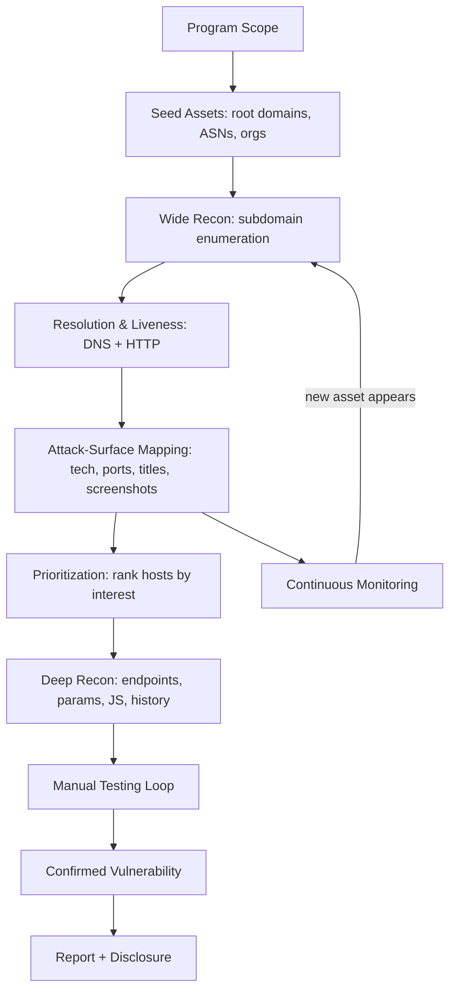
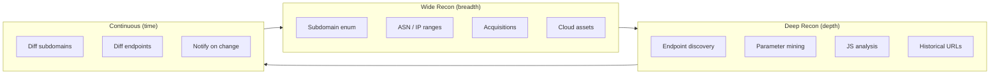
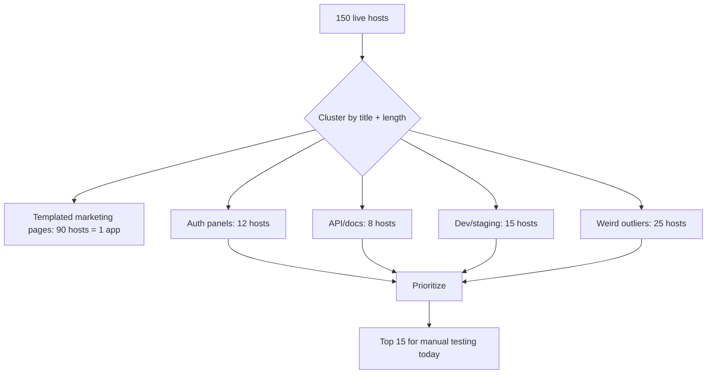
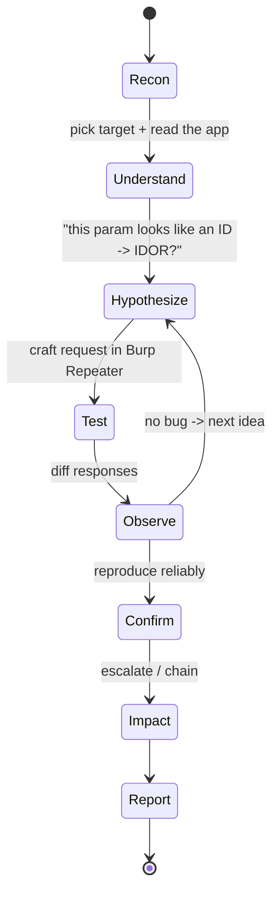
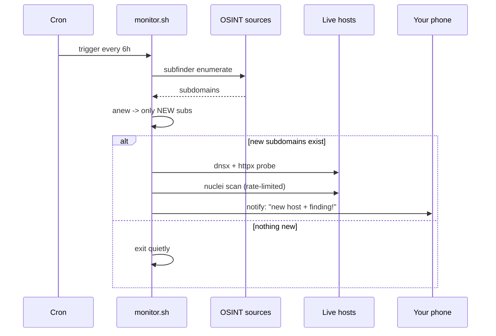

This is Chapter 5 of the APIs & CMS notebook. The previous chapters gave you the offensive primitives — REST and GraphQL testing, CMS exploitation, and how to weld small findings into high-impact kill chains. This chapter zooms out and answers a different, more important question for anyone who wants to earn consistently: **what do you actually *do*, in what order, every single day, to turn a scope page into paid reports?**

Most people who "learn bug bounty" learn payloads. They can spot an XSS, they know what an IDOR is, they can read an SSRF write-up and nod along. Then they open a real program with 4,000 in-scope hosts and freeze, because knowing a payload is not the same as having a *method*. A method is what tells you which of those 4,000 hosts to look at first, how to enumerate the ones nobody else has found, how to keep track of what you've tested so you don't waste a week re-checking the same login form, and how to build tooling so that the boring 80% happens automatically and you spend your human hours on the creative 20% that actually pays.

This chapter is that method — a full operating system for hunting. We start with the unglamorous but decisive skill of reading scope, move through a layered recon model (wide → deep → continuous), map the attack surface into a prioritized target list, run a disciplined testing loop, and finally wire the repeatable parts into an automation pipeline that notifies you when something new appears. Every tool is taught from zero the first time it shows up. By the end you'll have a pipeline you can actually run, and — just as importantly — the judgement to know when to turn the automation off and hunt by hand.

Everything here assumes **authorized testing only**: a public or private program whose scope explicitly permits what you're doing. Recon tooling is loud and leaves logs; running it against assets you have no permission to test is unauthorized access, full stop. We'll return to exactly what your recon looks like from the defender's side in the Detection & Defense part, because understanding that is both good ethics and good tradecraft.

---

## Part 1: Why Methodology Beats Payload Knowledge

Let's start with the raw economics of the thing. A modern public program on HackerOne or Bugcrowd might have hundreds or thousands of hunters looking at it. The low-hanging fruit — the reflected XSS on the main marketing site, the obvious IDOR on `/api/user/123` — was found in the first 48 hours the program went public, usually by someone with a saved nuclei template set and a fast VPS. If your plan is to look at the same five hosts everyone else looks at and throw the same ten payloads everyone else throws, you are competing on speed against people with better automation, and you will lose.

Methodology is how you *stop competing on the crowded surface*. There are three durable edges in bug bounty, and all three are methodology, not payload knowledge:

1. **Surface edge** — you find assets other hunters didn't. The acquisition nobody mapped to the parent company. The staging subdomain that resolved for six hours. The forgotten API version `v1` that's still live behind `api.target.com` while everyone tests `v3`. This is a recon problem.
2. **Depth edge** — you understand one application more deeply than the drive-by hunters. You mapped every state transition in the checkout flow, so you found the race condition nobody else had the patience to look for. This is a note-taking and persistence problem.
3. **Time edge** — you were *there first* when a new asset appeared or a new endpoint shipped. A subdomain that goes live at 2am is yours if your monitoring pinged you at 2:01am. This is an automation problem.

Notice that none of these three edges is "I know a payload the others don't." Payloads are commodities — they're in PortSwigger's Web Security Academy, in PayloadsAllTheThings, in every write-up. What's scarce is the *system* that puts you in front of a vulnerable input before anyone else, with enough context to recognize it as vulnerable. That system is what we build here.

A useful way to hold the whole thing in your head is as a funnel: a very wide top (all assets that might belong to the target), narrowing through resolution and liveness checks, into a prioritized set of interesting hosts, into individual endpoints and parameters, into confirmed bugs, into reports.



The funnel is not one-directional. The idea to hold onto is that **continuous monitoring feeds back into the top of the funnel** — every day the target's surface changes, and a good methodology re-enters the funnel automatically when it does. That feedback loop is the difference between "I did recon once" and "I own this target's attack surface over time."

**Bug bounty vs. CTF vs. pentest — same skills, different shape.** If you're coming from CTFs, the biggest adjustment is that in a CTF the vulnerable thing is *guaranteed to exist and is in scope by construction* — someone planted it for you. In bug bounty, most of what you look at is genuinely not vulnerable, most of your time is recon and triage, and *scope is a hard legal boundary you enforce yourself*. If you're coming from pentesting, the adjustment is the opposite: you don't have a fixed list of "the ten hosts in the engagement," you have an open-ended surface you have to discover, and there's no project manager telling you when to stop. Methodology is what replaces the pentest's scoping document and the CTF's built-in guarantee.

---

## Part 2: Reading Scope Like a Lawyer

The single most expensive mistake in bug bounty is testing something out of scope. Best case you waste hours on a finding that gets closed as "out of scope, not eligible." Worst case you touch an asset the program never authorized, the finding is a real vulnerability on production infrastructure, and now you've committed unauthorized access against a company that has your name and IP. Scope is not a suggestion; it is the entire legal basis for everything you're about to do. Read it like a lawyer reads a contract — slowly, twice, looking for exactly what is and isn't permitted.

### 2.1 The anatomy of a scope page

A typical program scope has these components. Learn to extract each one before you run a single tool:

| Component | What it tells you | Trap to watch for |
|---|---|---|
| **In-scope assets** | The domains/apps/IPs you may test | Wildcards (`*.target.com`) vs. single hosts (`www.target.com`) mean very different things |
| **Out-of-scope assets** | Explicitly forbidden targets | Third-party services (Zendesk, WordPress.com blogs) are usually out even if they look like the target |
| **In-scope vuln types** | What they'll pay for | Some programs exclude entire classes (e.g. "no self-XSS, no rate-limiting") |
| **Out-of-scope vuln types** | Known-and-accepted issues | "Missing security headers," "SPF/DMARC," "clickjacking on unauthenticated pages" are common exclusions |
| **Testing rules** | Rate limits, no automated scanning, no DoS | Many programs forbid loud automated scanners against production |
| **Safe-harbor / disclosure terms** | Your legal protection | Read the safe-harbor language; it's your shield |
| **Reward table** | What each severity pays | Tells you where to spend effort — a program that pays $50 for XSS and $10k for RCE is telling you where to look |

### 2.2 Wildcards change everything

The difference between these two scope lines is enormous:

```
In scope:  www.target.com
In scope:  *.target.com
```

The first authorizes exactly one host. The second authorizes *every subdomain that exists or ever comes to exist* under `target.com` — which is why wildcard programs are where recon skill pays off. On a wildcard program, subdomain enumeration is not optional busywork; it *is* the game. On a single-host program, subdomain enumeration is pointless (and testing the subdomains you find is out of scope).

Always resolve ambiguity **before** testing, not after. If the scope says `*.target.com` but you find `target-cdn.net` clearly owned by the same company, that second domain is **not** in scope unless the program lists it — apex domain ownership does not extend authorization. When in doubt, ask the program through the platform's message feature. "Is `acquired-company.com` in scope given your recent acquisition?" is a completely normal, welcomed question that also signals you're a serious hunter.

### 2.3 Building a target profile

Before recon, write down — in your notes, not just your head — the program's shape:

```
Program: Acme Corp (private, HackerOne)
Scope type: wildcard (*.acme.com, *.acme-labs.io)
Out of scope: *.blog.acme.com (WordPress.com), acme.zendesk.com, physical, social eng
High-value vulns: RCE ($10k), SQLi ($8k), SSRF ($6k), auth bypass ($5k)
Excluded vulns: rate limiting, missing headers, self-XSS, CSRF on logout
Testing constraints: no automated scanning on *.prod.acme.com; staging OK
Notes: recently acquired "Foo Systems" — check if foo.io in scope (ASKED, pending)
```

This profile is the constitution for the whole hunt. Everything downstream — which tools to run where, how loud to be, what to prioritize — flows from it. **A five-minute investment here prevents the most common and most damaging mistakes.**

---

## Part 3: The Recon Model — Wide, Deep, Continuous

Recon is not one activity; it's three, and they answer three different questions:

- **Wide recon** answers *"what assets does this target have?"* — breadth. Subdomains, IP ranges, cloud buckets, acquisitions, forgotten hosts.
- **Deep recon** answers *"what is the attack surface of this one asset?"* — depth. Endpoints, parameters, JavaScript, historical URLs, API routes, hidden functionality.
- **Continuous recon** answers *"what changed?"* — time. New subdomains, new endpoints, new JS files, newly-open ports, since the last time you looked.



A common beginner error is to do wide recon once, dump 800 subdomains into a file, and then never look at it again because 800 hosts is overwhelming. The fix is to always follow wide recon immediately with **liveness filtering and prioritization** (Part 6) so the 800 becomes a rankable 120 becomes a "these 15 are worth a human look today." Recon that doesn't narrow is just anxiety in a text file.

We'll now build each layer, teaching every tool from scratch as it appears.

---

## Part 4: Wide Recon — Finding Every Asset

### 4.1 Passive subdomain enumeration with subfinder

**What it is.** `subfinder` is a subdomain discovery tool that works *passively* — it queries dozens of public data sources (certificate transparency logs, DNS aggregators, search engines, threat-intel feeds) and returns subdomains they already know about, without ever sending a packet to the target. Passive means quiet: the target's servers never see you, because you're asking third parties what they already recorded.

**Why it exists.** Certificate transparency logs alone are a goldmine — every time a company gets a TLS certificate for `internal-tool.target.com`, that hostname is published in a public, append-only log. subfinder aggregates CT logs plus ~30 other sources so you don't have to query each by hand.

**Install (Kali/any Linux with Go):**

```bash
# subfinder is part of the ProjectDiscovery toolkit, written in Go
go install -v github.com/projectdiscovery/subfinder/v2/cmd/subfinder@latest
# binary lands in ~/go/bin — make sure that's on your PATH
export PATH="$PATH:$HOME/go/bin"
subfinder -version
```

**Core workflow:**

```bash
# -d = target domain, -all = use all sources, -o = output file
subfinder -d acme.com -all -o subs_passive.txt
```

Realistic output:

```
               __    _____ _           __
   _______  __/ /_  / __(_)___  ____/ /__  _____
  / ___/ / / / __ \/ /_/ / __ \/ __  / _ \/ ___/
 (__  ) /_/ / /_/ / __/ / / / / /_/ /  __/ /
/____/\__,_/_.___/_/ /_/_/ /_/\__,_/\___/_/

		projectdiscovery.io

[INF] Enumerating subdomains for acme.com
[INF] Loading provider config from ~/.config/subfinder/provider-config.yaml
www.acme.com
api.acme.com
staging.acme.com
dev-api.acme.com
legacy.acme.com
vpn.acme.com
mail.acme.com
[INF] Found 412 subdomains for acme.com in 38 seconds
```

**Flags worth knowing:**

| Flag | Purpose |
|---|---|
| `-d` | Target domain (single) |
| `-dL` | File with a list of domains |
| `-all` | Use every source (slower, more complete) |
| `-o` | Output to file |
| `-oJ` | JSON output (for pipelines) |
| `-silent` | Only print results, no banner (for piping) |
| `-t` | Concurrency (threads) |

**Provider API keys matter.** subfinder's free run is decent, but sources like SecurityTrails, Shodan, VirusTotal, and Censys return far more with a (free-tier) API key configured in `~/.config/subfinder/provider-config.yaml`. Adding keys can double or triple your results. This is the single highest-ROI setup step in all of recon.

### 4.2 A second engine — amass

**What it is.** `amass` (OWASP Amass) is a heavier, more thorough asset-discovery framework. Where subfinder is fast and passive-only by default, amass can do passive enumeration, active DNS resolution, and even reverse-DNS and ASN-based discovery. It also maintains its own local graph database of findings.

**Why run both.** Different tools query different sources and use different techniques; the union of their results is always larger than either alone. Running two enumerators and merging is standard practice.

**Install and use:**

```bash
# amass ships as a Go binary or via snap/apt on Kali
sudo apt install amass    # on Kali
# or: go install -v github.com/owasp-amass/amass/v4/...@master

# passive mode (quiet, uses OSINT sources only)
amass enum -passive -d acme.com -o subs_amass.txt

# active enumeration with brute force + resolution (louder, more complete)
amass enum -active -brute -d acme.com -o subs_amass_active.txt
```

`amass enum -passive` is safe and quiet; `amass enum -active -brute` will actually send DNS queries and attempt zone resolution, which is more intrusive — only use active modes when scope permits and you understand you're now generating DNS traffic the target's resolver may log.

### 4.3 Merging results with anew

**What it is.** `anew` is a tiny but essential tool (by tomnomnom) that appends lines to a file **only if they're new**, and prints only the newly-added lines to stdout. It's the glue of every recon pipeline and the foundation of continuous monitoring.

```bash
go install -v github.com/tomnomnom/anew@latest
```

Merge two enumerators into one deduplicated master list:

```bash
cat subs_passive.txt subs_amass.txt | anew subs_all.txt
```

`anew` reads `subs_all.txt`, adds only the lines not already present, and prints what it added. The genius is the second property: because it *prints only new lines*, you can pipe those straight into "and now do something with the new ones." We'll exploit that heavily in Part 9.

### 4.4 Going beyond DNS names — ASNs, acquisitions, and cloud

Subdomain enumeration finds hosts under a domain you already know. The surface edge often comes from finding domains you *didn't* know:

- **ASN discovery.** A company's IP ranges are grouped under an Autonomous System Number. Tools like `amass intel -asn <ASN>` or BGP lookups (bgp.he.net) reveal all IP ranges the org announces — and reverse-DNS on those ranges finds hosts that have no public subdomain at all. *Only test the ones in scope.*
- **Acquisitions.** Companies buy companies, and the acquired infrastructure often keeps its own domains while quietly becoming in-scope (check the program!). Crunchbase, Wikipedia's "acquisitions" section, and the program's own scope updates reveal these.
- **Cloud assets.** S3 buckets, GCS buckets, Azure blobs named after the company (`acme-backups`, `acme-prod-assets`) are frequent finds. Tools like `cloud_enum` and naming-permutation wordlists probe for them — but bucket contents are only in scope if the program says so.
- **Favicon hashing.** The favicon of an app has an MMH3 hash; searching Shodan/Censys for that hash (`http.favicon.hash:<value>`) finds every host on the internet serving the same favicon — a great way to find an org's hosts that don't share a domain name.

**Bug-bounty reality:** the biggest, best-paying bugs are disproportionately found on the *forgotten* surface — the legacy admin panel on an acquired company's subdomain, the staging box that shipped with debug mode on. Everyone tests `www`. Almost nobody tests `legacy-admin.acquired-startup.acme-labs.io`. That gap is your edge.

---

## Part 5: Resolution and Liveness — From Names to Live Web Servers

A list of subdomains is not a list of targets. Many won't resolve (dangling DNS — itself sometimes a subdomain-takeover finding, covered in the server-side notebook), many resolve but serve nothing, and many serve something boring. You need to reduce the name list to *live HTTP services worth looking at*.

### 5.1 DNS resolution with dnsx

**What it is.** `dnsx` (ProjectDiscovery) is a fast DNS toolkit — it takes a list of hostnames and tells you which resolve, to what records, quickly and with retries.

```bash
go install -v github.com/projectdiscovery/dnsx/cmd/dnsx@latest

# which of our subdomains actually resolve to an A record?
cat subs_all.txt | dnsx -silent -a -resp -o resolved.txt
```

Sample:

```
api.acme.com [203.0.113.10]
staging.acme.com [203.0.113.55]
legacy.acme.com [198.51.100.7]
```

Hosts that don't resolve are dropped here. A host that *used* to resolve to a now-deleted cloud resource (CNAME to a decommissioned S3 bucket) is a **subdomain-takeover** lead — dnsx's `-cname` output surfaces those dangling records.

### 5.2 HTTP probing with httpx

**What it is.** `httpx` (ProjectDiscovery — not to be confused with the Python `httpx` library) probes a list of hosts over HTTP/HTTPS and reports which are alive, plus rich metadata: status code, page title, technology, response length, redirect location, TLS details. It is the workhorse that turns "resolves" into "is a live web app, and here's what it is."

```bash
go install -v github.com/projectdiscovery/httpx/cmd/httpx@latest

cat resolved.txt | httpx -silent \
  -status-code -title -tech-detect -content-length -web-server \
  -o live_hosts.txt
```

Realistic output:

```
https://www.acme.com      [200] [Acme — Home]                  [nginx]        [cloudflare] [45210]
https://api.acme.com      [401] [Unauthorized]                 [nginx]        [Kong]       [23]
https://staging.acme.com  [200] [Staging Login]                [Apache]       [PHP]        [1204]
https://legacy.acme.com   [200] [Admin Panel — Login]          [Apache/2.2.15][PHP/5.4]    [880]
https://dev-api.acme.com  [200] [Swagger UI]                   [nginx]        [OpenAPI]    [7702]
```

Read that output like a hunter. `legacy.acme.com` runs **Apache 2.2.15 and PHP 5.4** — both ancient, both riddled with known CVEs. `dev-api.acme.com` is serving **Swagger UI**, i.e. it's publishing its own API documentation, which is a full map of the API's endpoints and parameters handed to you for free. Those two lines are worth ten of the CloudFlare-fronted marketing pages.

**Key httpx flags:**

| Flag | What it adds |
|---|---|
| `-status-code` | HTTP status |
| `-title` | HTML `<title>` |
| `-tech-detect` | Wappalyzer-style tech fingerprinting |
| `-web-server` | `Server:` header |
| `-content-length` | Response size (dedupe/cluster by this) |
| `-screenshot` | Save a PNG of each page (needs headless Chrome) |
| `-favicon` | Favicon MMH3 hash |
| `-json` | Structured output for pipelines |
| `-mc` / `-fc` | Match / filter by status code |

### 5.3 Eyeballing at scale with screenshots

When you have 150 live hosts, you cannot open each in a browser. **Screenshotting** every live host and flipping through a gallery is the fastest way for a human to spot the interesting ones — login panels, default installs, error pages, admin UIs, dev tools. `httpx -screenshot`, or the classic `gowitness`/`aquatone`, produce an HTML gallery you can skim in two minutes.

```bash
cat live_hosts.txt | httpx -silent -screenshot -o screenshots/
```

Your eye is a better classifier than any tool for "does this look like something a developer forgot about?" A grid of screenshots turns a 30-minute per-host slog into a 2-minute skim.

### 5.4 Port scanning with naabu

**What it is.** `naabu` (ProjectDiscovery) is a fast port scanner written in Go. HTTP probing on 80/443 only sees the web surface; naabu finds the *other* services — a forgotten `:8080` dev server, a `:9200` Elasticsearch with no auth, a `:6379` Redis, a `:8443` management console. Many high-impact findings live on non-standard ports that httpx alone never touches.

**Why it exists.** nmap is the classic port scanner but is comparatively slow across thousands of hosts; naabu does fast SYN/CONNECT discovery to find *which ports are open*, then you hand the interesting ones to nmap (or httpx) for detailed fingerprinting. It's the "wide first, deep second" pattern applied to ports.

```bash
go install -v github.com/projectdiscovery/naabu/v2/cmd/naabu@latest

# -top-ports 1000 = the 1000 most common ports; -o output
cat resolved.txt | naabu -top-ports 1000 -rate 1000 -silent -o open_ports.txt
```

Sample:

```
staging.acme.com:22
staging.acme.com:443
dev-api.acme.com:8080
internal.acme.com:9200
internal.acme.com:6379
```

That `9200` (Elasticsearch) and `6379` (Redis) on `internal.acme.com` are exactly the kind of thing web-only recon misses — an unauthenticated Elasticsearch cluster is a data-exposure finding, and an open Redis is often a direct path to RCE. **Feed the open web-ish ports straight back into httpx** so your live-host inventory includes services on odd ports:

```bash
# probe discovered ports for HTTP services
cat open_ports.txt | httpx -silent -sc -title -td | anew live_hosts.txt
```

**naabu flags worth knowing:**

| Flag | Purpose |
|---|---|
| `-top-ports` | Scan the N most common ports (100/1000) |
| `-p` | Specific ports (`-p 80,443,8080,8443`) |
| `-rate` | Packets/sec — throttle to respect the target |
| `-nmap-cli` | Auto-hand open ports to nmap for service/version detection |
| `-silent` | Results only, for piping |

`naabu` is loud (it's actively connecting to ports), so treat it like active recon: only against in-scope hosts, rate-limited, and never against hosts the program marks "no automated scanning."

---

## Part 6: Attack-Surface Mapping and Prioritization

Now you have (say) 150 live hosts. You cannot deeply test 150 hosts. Prioritization is the skill that separates hunters who find bugs from hunters who burn out. Rank hosts by *probability of an interesting bug × payout if found*.

A practical scoring rubric:

| Signal | Why it raises priority | Example |
|---|---|---|
| Old software versions | Known CVEs, unpatched | Apache 2.2, PHP 5.x, jQuery 1.x |
| Non-standard / dev naming | Less-tested, more permissive | `dev-`, `staging-`, `qa-`, `test-`, `uat-` |
| Auth panels | High-value if bypassable | `admin`, `portal`, `login`, `sso` |
| API / docs exposure | Endpoint map handed to you | Swagger, GraphQL, `/api`, `.json` |
| Unusual ports | Forgotten services | `:8080`, `:8443`, `:9000` |
| Distinct content-length | Not a templated marketing page | Outliers in a cluster |
| New since last scan | You're first | continuous-recon diff |

**Practical move:** cluster your `httpx` output by `content-length` and `title`. Fifty hosts that all return the same 45,210-byte marketing homepage are one target (the CMS), not fifty. The outliers — the one host with a weird length, the one with `[500]`, the one titled "phpMyAdmin" — are where you start.



Write the ranked shortlist into your notes with a one-line reason each ("`legacy.acme.com` — Apache 2.2/PHP 5.4, admin login, likely CVEs"). This shortlist is your work queue for the day. **The discipline of narrowing 150 → 15 with written reasons is the whole game; skipping it is why people stare at recon output and never find anything.**

---

## Part 7: Deep Recon — Mapping One Application

You've picked a target host. Now go deep: find every endpoint, parameter, and piece of client-side logic. Depth edge lives here.

### 7.1 Historical URLs with gau and waybackurls

**What they are.** `gau` ("get all urls") and `waybackurls` pull URLs that were *ever* seen for a domain from public archives — the Wayback Machine, Common Crawl, URLScan, the Open Threat Exchange. This surfaces old endpoints, dead parameters, and forgotten paths that aren't linked anywhere on the current site but may still work on the server.

```bash
go install -v github.com/lc/gau/v2/cmd/gau@latest
go install -v github.com/tomnomnom/waybackurls@latest

echo "acme.com" | gau --subs > urls_historical.txt
echo "acme.com" | waybackurls | anew urls_historical.txt
wc -l urls_historical.txt
# 18442 urls_historical.txt
```

Now mine that for interesting patterns:

```bash
# parameters that scream "test me"
grep -Ei '(\?|&)(redirect|url|next|return|file|path|id|user|debug|admin|token)=' urls_historical.txt | sort -u

# interesting extensions / backups
grep -Ei '\.(bak|old|zip|tar\.gz|sql|env|json|config|log)(\?|$)' urls_historical.txt | sort -u
```

Historical URLs are where you find the `?debug=true` parameter that was removed from the UI two years ago but still works on the backend, or the `/api/v1/` route that predates the `v3` everyone else tests.

### 7.2 Active crawling with katana

**What it is.** `katana` (ProjectDiscovery) is a fast crawler that spiders a live site — following links, parsing JavaScript for endpoints, and (in headless mode) rendering the page to catch client-side-generated routes. Where gau gives you *history*, katana gives you *the present, live surface*.

```bash
go install -v github.com/projectdiscovery/katana/cmd/katana@latest

# -jc = parse JS for endpoints, -d = crawl depth, -kf = known files (robots, sitemap)
katana -u https://staging.acme.com -jc -d 3 -kf all -o urls_katana.txt
```

`-jc` (JavaScript crawling) is the killer flag: modern single-page apps hide their entire API in bundled JS, and katana extracts `fetch('/api/internal/...')` calls that never appear as HTML links.

### 7.3 Parameter discovery with arjun

**What it is.** `arjun` finds **hidden HTTP parameters** — query/body params a server accepts but doesn't advertise. Many bugs (IDOR, SSRF, LFI, SQLi) live in parameters that aren't in any link or form; the server quietly reads `?admin=1` or `?debug=1` even though nothing tells you to send it.

```bash
pip install arjun    # Python tool
arjun -u https://staging.acme.com/profile -m GET
```

arjun works by sending the target a large wordlist of candidate parameter names and detecting which ones *change the response* (by length, status, or reflected content), inferring that those are parameters the app actually processes.

### 7.4 JavaScript analysis — the modern goldmine

Single-page apps ship their logic to the browser. That JavaScript contains: API base URLs, endpoint paths, sometimes hardcoded keys, feature flags, and role checks done client-side (which means bypassable). Pull every JS file and mine it:

```bash
# collect JS URLs, then grep them for secrets and endpoints
cat urls_katana.txt urls_historical.txt | grep -Ei '\.js(\?|$)' | sort -u > js_files.txt

# fetch and search for endpoints and secrets
while read u; do curl -s "$u"; done < js_files.txt > all_js.txt
grep -Eo '"/api/[a-zA-Z0-9_/-]+"' all_js.txt | sort -u
grep -Ei '(api[_-]?key|secret|token|aws_access|password)\s*[:=]' all_js.txt
```

Tools like `LinkFinder`, `SecretFinder`, and nuclei's exposure templates automate this. **A hardcoded API key or an internal endpoint list in a JS bundle is one of the most common real bug-bounty findings** — and it's pure recon, no exploitation cleverness required.

---

## Part 8: The Manual Testing Loop and Note Discipline

Automation finds *surface*; humans find *bugs*. Once you've narrowed to a target and mapped its endpoints, you enter the manual loop — and the thing that makes this loop productive over weeks is **notes**.

### 8.1 The loop



The heart of it: understand the app as a *system* (what are its objects — users, orders, files? what are its roles? what are its state transitions?), form a specific hypothesis, test it in Burp Repeater, observe the diff, and either confirm or move on. Chapter 4 covered how to *chain* the confirmed bugs; this loop is how you find each link.

### 8.2 Note-taking is a superpower, not admin overhead

The depth edge is impossible without notes. Over a multi-week hunt on one target you will look at hundreds of endpoints; without notes you re-test the same things and forget the weird-but-not-yet-exploitable behaviors that later become the key to a chain. A minimal per-target note structure:

```markdown
# Target: staging.acme.com

## Objects & roles
- Users (id, role: user|manager|admin)
- Orders (id, owner_id, status)
- Files (uuid, owner_id)

## Endpoints mapped
- GET  /api/v1/user/{id}          -> returns own user; tried other ids -> 403 (good)
- GET  /api/v1/order/{id}         -> IDOR? returned order 1041 as user 88 (!!) CONFIRM
- POST /api/v1/file/upload        -> accepts .svg (stored XSS? testing)
- GET  /internal/debug?token=...  -> from JS bundle, 401 without token

## Weird behaviors (revisit)
- /api/v1/order/{id} 500s on non-numeric id — error leaks stack trace w/ path
- account email change has no re-auth — CSRF candidate

## Confirmed
- IDOR on GET /api/v1/order/{id} — cross-user order read. Draft report started.
```

Notice how the "weird behaviors" bucket captures things that aren't bugs *yet* but might combine into one later — the stack-trace leak plus the IDOR plus the no-re-auth email change are exactly the kind of primitives Chapter 4 taught you to chain. **Notes are where chains are born.**

### 8.3 Rate, scope, and courtesy

Even in the manual loop, respect the program: honor rate limits, don't run automated scanners against hosts the scope marks "no automated testing," never test destructive actions (mass-delete, payment) against production without explicit permission, and never pivot to an out-of-scope host just because you found a way in. Discipline here is both ethics and self-protection — a program that trusts your conduct triages your reports faster and invites you to private programs.

---

## Part 9: Building the Automation Pipeline

Now we wire the repeatable parts together so that the boring 80% runs on a schedule and pings you when something interesting appears. This is the *time edge*.

### 9.1 nuclei — templated vulnerability scanning

**What it is.** `nuclei` (ProjectDiscovery) scans targets against a huge community library of YAML **templates**, each describing how to detect one specific thing: a CVE, an exposure (open `.git`, exposed `.env`, Swagger without auth), a misconfiguration, a default credential. It's not a fuzzer that invents payloads; it's a precise, low-false-positive checker that says "this exact known issue is present here."

**Install and update templates:**

```bash
go install -v github.com/projectdiscovery/nuclei/v3/cmd/nuclei@latest
nuclei -update-templates    # pulls the community template repo
```

**Core usage — scan your live hosts:**

```bash
# -l = list of URLs, -t = template dirs, -severity to focus effort, -o output
nuclei -l live_hosts.txt \
  -t ~/nuclei-templates/http/exposures/ \
  -t ~/nuclei-templates/http/misconfiguration/ \
  -t ~/nuclei-templates/http/cves/ \
  -severity medium,high,critical \
  -rl 50 -o nuclei_findings.txt
```

Realistic output:

```
[swagger-api] [http] [info] https://dev-api.acme.com/swagger-ui.html
[git-config] [http] [medium] https://legacy.acme.com/.git/config
[CVE-2021-41773] [http] [critical] https://legacy.acme.com/cgi-bin/ [path traversal]
[env-file] [http] [high] https://staging.acme.com/.env
[default-login] [http] [high] https://legacy.acme.com/manager/html [tomcat:tomcat]
```

Every one of those lines is a lead. The `.env` exposure on staging could contain database credentials; the `.git/config` means you may be able to dump the whole source repository; `CVE-2021-41773` is a critical Apache path traversal that can become RCE. **Important discipline:** nuclei only *detects*. Confirm each finding manually before reporting, and never run the intrusive exploitation templates (`-tags intrusive`) against production without scope permission — some of them are genuinely destructive.

**Key nuclei flags:**

| Flag | Purpose |
|---|---|
| `-l` | List of target URLs |
| `-t` | Template file/dir to run |
| `-tags` | Run templates matching tags (e.g. `cve,exposure`) |
| `-severity` | Filter by severity |
| `-rl` | Rate limit (requests/sec) — respect the program |
| `-o` / `-json` | Output |
| `-nc` | No color (for logs) |

### 9.2 notify — get pinged anywhere

**What it is.** `notify` (ProjectDiscovery) pipes any tool's stdout to Slack, Discord, Telegram, or email. It's how your pipeline reaches your phone.

```bash
go install -v github.com/projectdiscovery/notify/cmd/notify@latest
# configure a provider (Discord/Telegram/Slack webhook) in ~/.config/notify/provider-config.yaml

# send new nuclei findings to your phone
cat nuclei_findings.txt | notify -provider discord
```

### 9.3 Putting it together — a continuous monitor

Here's the payoff: a single script that re-enumerates a target, detects *only what's new since last run* (thanks to `anew`), probes the new hosts, scans them, and notifies you. Run it on a cron on a small VPS and you have a monitor that finds fresh attack surface the moment it appears.

```bash
#!/usr/bin/env bash
# monitor.sh — continuous recon for a single wildcard target
# Usage: ./monitor.sh acme.com
set -euo pipefail
DOMAIN="$1"
DIR="$HOME/recon/$DOMAIN"
mkdir -p "$DIR"
cd "$DIR"

# 1. Enumerate subdomains, keep only NEW ones (anew prints only new lines)
subfinder -d "$DOMAIN" -all -silent \
  | anew subs_all.txt \
  | tee subs_new.txt

# 2. If nothing new, exit quietly
if [ ! -s subs_new.txt ]; then
  echo "[*] No new subdomains for $DOMAIN"; exit 0
fi

# 3. Probe the NEW subdomains for live web servers
cat subs_new.txt \
  | dnsx -silent \
  | httpx -silent -status-code -title -tech-detect \
  | anew live_new.txt

# 4. Nuclei-scan only the new live hosts (respect rate limits)
if [ -s live_new.txt ]; then
  cut -d' ' -f1 live_new.txt \
    | nuclei -silent -severity medium,high,critical -rl 30 \
    | anew nuclei_new.txt \
    | notify -silent -provider discord -bulk
fi

# 5. Notify with the new hosts themselves
cat live_new.txt | notify -silent -provider discord -bulk
```

Cron it:

```bash
# run every 6 hours
0 */6 * * * /home/hunter/monitor.sh acme.com >> /home/hunter/recon/acme.com/cron.log 2>&1
```



The whole design philosophy: **automation is for detecting *change and known issues at scale*; it is not a substitute for the human testing loop.** The pipeline's job is to put a fresh, interesting host in front of you with a "look at this" ping. Your job is still to open Burp and hunt. Hunters who believe nuclei *is* the methodology find only what nuclei's templates already know; hunters who use nuclei to *triage where to spend human time* find the novel bugs.

### 9.4 Where to run it

Run continuous recon on a cheap always-on VPS, not your laptop — you want it running while you sleep, and you want the traffic coming from a stable IP you can share with a program if asked. Keep results in per-target directories under version control or backup; your recon corpus *is* your competitive asset and grows more valuable the longer you monitor a target.

---

## Part 10: A Fully Worked Recon-to-Triage Lab

Let's run the whole method end-to-end against a fictional in-scope wildcard, `acme-labs.io`, and take one finding from recon to a report-ready state. Commands are real; output is representative of what you'd see.

**Step 1 — Scope confirmed.** Program lists `*.acme-labs.io` in scope, staging permitted, no automated scanning on `*.prod.acme-labs.io`. RCE pays $10k. Noted.

**Step 2 — Wide recon.**

```bash
subfinder -d acme-labs.io -all -silent | anew subs_all.txt
amass enum -passive -d acme-labs.io -silent | anew subs_all.txt
wc -l subs_all.txt
# 287 subs_all.txt
```

**Step 3 — Resolve + probe.**

```bash
cat subs_all.txt | dnsx -silent -a | httpx -silent -sc -title -td -cl -o live.txt
# ...
# https://dev-portal.acme-labs.io [200] [Developer Portal] [nginx][OpenAPI][8110]
# https://old-jenkins.acme-labs.io [403] [Forbidden] [Jetty][Jenkins]
# https://uat-billing.acme-labs.io [200] [Billing UAT] [Apache/2.4.29][PHP/7.2][2044]
```

**Step 4 — Prioritize.** Three outliers jump out: a developer portal publishing an OpenAPI spec, an old Jenkins (CI servers are RCE magnets), and a UAT billing app on an older PHP. Jenkins on `403` is worth a closer look; the OpenAPI spec is a free endpoint map; UAT billing touches money. Shortlist: those three, Jenkins first (highest RCE probability).

**Step 5 — Deep recon on the dev portal.**

```bash
curl -s https://dev-portal.acme-labs.io/openapi.json | jq '.paths | keys[]'
# "/api/v2/users/{id}"
# "/api/v2/users/{id}/export"
# "/api/v2/invoices/{id}"
# "/api/v2/admin/impersonate"
```

The spec hands us `/api/v2/admin/impersonate` — a route that screams privilege escalation — and `/export`, which often returns more than the UI shows.

**Step 6 — Nuclei triage across the shortlist (staging/UAT only, rate-limited).**

```bash
nuclei -l shortlist.txt -tags exposure,cve,default-login -severity high,critical -rl 20
# [jenkins-script-console] [high] https://old-jenkins.acme-labs.io/script  (anonymous access!)
# [openapi] [info] https://dev-portal.acme-labs.io/openapi.json
```

**Step 7 — Manual confirmation.** The Jenkins finding is the big one: `nuclei` flagged the Groovy **script console reachable without auth**. Manually confirm in Burp — a GET to `/script` returns the console form; a benign proof (`println "id".execute().text`) returns command output. That's unauthenticated RCE. **Stop, do not run further commands, do not touch data** — a single benign proof-of-concept (running `id` / `whoami`) is enough to demonstrate impact. Escalating further on production infrastructure is both unnecessary and a scope/ethics violation.

**Step 8 — Note it, then report.** Record the exact request, the one benign command output, timestamps, and your source IP. That's a $10k RCE, found not by payload wizardry but by method: read scope → enumerate wide → probe → prioritize the CI server → confirm.

This is the entire thesis of the chapter in one lab: **the bug was found by the funnel, not by a clever payload.** Anyone with the payload knowledge could have exploited that Jenkins console; only the person whose method surfaced `old-jenkins.acme-labs.io` got to.

---

## Part 11: From Confirmed Bug to Report (Bridge to Chapter 6)

This chapter's job ends at "confirmed, reproducible, noted." The next chapter is entirely about the report — how to write it so a triager reproduces it in two minutes, scores it at the severity it deserves, and pays it fast. But two habits belong here because they happen *during* the hunt, not after:

- **Capture as you go.** The moment you confirm a bug, save the exact request/response (Burp's "Save item"), the precise steps, and a timestamp. Reconstructing a PoC a week later from memory is how good findings get closed as "could not reproduce."
- **Record your source IP and times.** Programs cross-reference their logs with your report; giving them your IP and the UTC timestamps of your testing builds trust and speeds triage. It's also your alibi if they see other, malicious traffic and wonder if it was you.

A finding that's well-captured at discovery is 80% of the way to a great report. A finding you have to reverse-engineer from memory is a headache that often ends in "informative, closed."

---

## Part 12: OPSEC, Infrastructure, and Scaling the Operation

Once hunting stops being a hobby and becomes a repeatable operation, the infrastructure and operational-security choices you make matter as much as your methodology. Sloppy infra gets you rate-limited, blocked, or — worse — mistaken for a real attacker.

### 12.1 The hunting VPS

Run continuous recon and heavy scanning from a small cloud VPS, not your home connection, for three reasons:

- **Stability.** Cron jobs need an always-on machine; your laptop sleeps. A $5–10/month VPS runs your monitor 24/7.
- **Reputation and traceability.** A stable, dedicated source IP is one you can hand to a program ("all my testing came from 203.0.113.44 between these times"). That builds trust and gives you an alibi if the program sees other, malicious traffic.
- **Bandwidth and latency.** Recon tooling parallelizes hard; a datacenter uplink finishes an enumeration in a fraction of the time a home connection would, and won't saturate your household network.

A sensible baseline build: a fresh Debian/Ubuntu VPS, Go installed, the ProjectDiscovery suite (`pdtm` — the ProjectDiscovery Tool Manager — installs and updates subfinder/httpx/dnsx/katana/nuclei/notify in one command), tmux so long jobs survive disconnects, and results stored in a per-target directory tree that you back up.

```bash
# pdtm installs and keeps the whole PD toolkit current
go install -v github.com/projectdiscovery/pdtm/cmd/pdtm@latest
pdtm -install-all       # subfinder, httpx, dnsx, katana, nuclei, notify, naabu...
pdtm -update-all        # keep them current; template + tool drift is real
```

### 12.2 Rate, courtesy, and not looking like an attack

The line between "authorized security research" and "a denial-of-service incident" is *rate*. A nuclei run at `-rl 500` against a small app can knock it over, generate a pager alert for the on-call engineer, and get you removed from the program even though every request was individually legitimate. Defaults to internalize:

- Keep `-rl` (nuclei) and httpx concurrency modest on production — start low, and only increase if the program's rules and the target's size clearly permit it.
- Honor `Retry-After` and back off on `429`/`503`. Hammering through rate limits is both rude and a scope violation on most programs.
- Never run DoS-adjacent templates or fuzzing that multiplies requests (e.g. large Intruder payload sets) against production without explicit written permission.
- Set a recognizable, honest User-Agent if the program requests one (some ask you to include your platform username), so their blue team can distinguish your research traffic from a real attacker's.

### 12.3 Collaboration without stepping on each other

Serious hunters often work in small teams or duos, and the same note-and-pipeline discipline scales to collaboration:

- **Shared recon corpus.** Keep the `subs_all.txt` / `live.txt` master lists in a shared, version-controlled location so both hunters build on one asset inventory rather than re-enumerating.
- **Claim endpoints in notes.** A shared per-target note file with a "who's testing what" section prevents two people burning hours on the same login form.
- **Split by surface, not by payload.** One hunter owns the API, another the web app; one goes wide on new acquisitions while the other goes deep on the checkout flow. Splitting by *surface* uses the surface/depth edges; splitting by *payload type* ("you do XSS, I do SQLi") wastes them.
- **Agree on disclosure and splits up front.** Who submits, how the bounty is split, and whose handle goes on the report should be settled before the first finding, in writing, to keep a good collaboration from souring over a big payout.

### 12.4 Wordlists and inputs are part of your edge

Two hunters running identical tools with different wordlists get different results. Curate your inputs: SecLists is the baseline, but a *personal* wordlist grown from every target you've hunted (unusual parameter names, endpoint patterns, subdomain prefixes you've actually seen) finds things generic lists miss. The same is true of a personal nuclei-template collection for bug classes you understand deeply. Over months, your curated inputs become a moat generic hunters don't have.

---

## Part 13: Detection & Defense Angle — What Your Recon Looks Like From the Blue Side

Everything in this chapter generates signal on the defender's side. Understanding that signal makes you both a more ethical hunter (you know exactly how loud you're being) and a better defender if you sit on the blue team. Here's the recon-to-defense mapping.

**Passive recon is invisible to the target — which is the point, and the problem for defenders.** subfinder/amass-passive query third parties; the target's own servers see nothing. This is why **certificate transparency monitoring** is a core defensive control: since every cert you issue is published publicly, defenders should monitor CT logs (via tools like Cert Spotter, or Facebook's CT monitor) for unexpected subdomains — because attackers are reading those same logs. If the blue team learns about `internal-admin.acme.com` from a CT-log alert the moment its cert is issued, they can make sure it isn't internet-exposed before a hunter's passive scan finds it.

**Active recon is noisy and logged.** The instant you switch from passive enumeration to `dnsx`, `httpx`, `katana`, `nuclei`, or `arjun`, you're sending real traffic:

| Your action | Blue-team signal | Detection control |
|---|---|---|
| `dnsx` brute / active amass | Spike of DNS queries, many NXDOMAIN | DNS query-rate monitoring, RPZ |
| `httpx` probing | Many hosts hit once each from one IP | Web logs: one IP touching many vhosts |
| `katana` crawl | Rapid sequential requests, unusual UA | WAF crawl-rate rules, bot detection |
| `nuclei` scan | Requests for `/.git/config`, `/.env`, known CVE paths | WAF signatures, honeypot paths |
| `arjun` param mining | Same endpoint hit with hundreds of param names | Anomaly detection on param cardinality |
| favicon/Shodan pivoting | Nothing (third-party) | CT/asset-inventory monitoring |

**The defensive lesson recon teaches.** The reason recon works is **unknown and forgotten assets** — the staging box nobody decommissioned, the acquired company's admin panel, the CI server exposed by a firewall change. The single most effective defense against everything in this chapter is a **continuously-maintained asset inventory**: the blue team should be running the *same* wide-recon tooling against their own scope, on a schedule, and alerting when a new host appears that shouldn't be internet-facing. In other words, **the best defense against attacker recon is defender recon** — attack-surface management (ASM) is just this chapter's pipeline pointed inward. If you can build a monitor that pings you when `old-jenkins.acme-labs.io` appears, so can the defenders, and they should. Many mature programs now run exactly this, which is why the *time edge* matters so much: on a well-defended target, the window between an asset appearing and the blue team locking it down may be hours.

**IR use case.** When a defender is investigating a breach, they often find the attacker's recon in the logs *before* the exploitation — a burst of `/.env`, `/.git/config`, and CVE-path requests from one IP is the fingerprint of a nuclei scan and a strong "someone was casing this host" indicator. Recognizing that pattern (and building a WAF rule or honeypot path that fires on it) is a direct application of understanding the offensive pipeline.

---

## Part 14: Common Pitfalls

- **Recon that never narrows.** Dumping 800 subdomains and never filtering is not recon; it's hoarding. Always pipe wide recon straight into liveness + prioritization the same session.
- **Testing out of scope.** The most expensive mistake. Apex ownership doesn't extend authorization; acquisitions aren't in scope until the program says so; third-party SaaS (Zendesk, WP.com) is almost always out. When unsure, ask.
- **Trusting nuclei as ground truth.** Templates detect; they also false-positive, and they only know what someone already wrote a template for. Confirm manually; hunt beyond the templates.
- **Running intrusive/automated scans where forbidden.** "No automated scanning on prod" means no nuclei on prod. Read and honor testing constraints — violating them can get you removed from a program.
- **No notes.** Without a per-target note file you re-test the same endpoints, forget the weird behaviors that become chains, and can't reproduce findings a week later. Notes are the depth edge.
- **Automation without a human loop.** A pipeline that only reports what nuclei finds will only ever find commodity bugs. The pipeline's output is a *to-look-at list*, not a findings list.
- **Loud from your home IP with no records.** Run continuous recon from a stable VPS, keep logs of your own activity, and record source IP + timestamps for every confirmed finding.
- **Ignoring the forgotten surface.** Everyone tests `www`. The bugs (and payouts) cluster on staging, legacy, acquired, and dev hosts. Spend your effort where the crowd isn't.

---

## Part 15: Final Revision / Summary

- **Methodology beats payloads.** The three durable edges — surface (find assets others didn't), depth (understand one app better), time (be first when it changes) — are all method, not payload trivia.
- **Read scope like a contract.** Extract in/out-of-scope assets and vuln types, note wildcards vs. single hosts, honor testing constraints, and ask when ambiguous. Scope is the legal basis for everything.
- **Recon is three layers.** Wide (breadth — subfinder, amass, ASNs, acquisitions, cloud), deep (depth — gau/waybackurls, katana, arjun, JS analysis), continuous (time — anew + monitor + notify).
- **Names → live apps.** dnsx resolves, httpx probes and fingerprints, screenshots let a human eyeball at scale. A subdomain list is not a target list until it's filtered to live, interesting hosts.
- **Prioritize ruthlessly.** Cluster by title/length, rank by probability × payout, narrow 150 hosts → 15 with written reasons. This narrowing *is* the skill.
- **Deep recon finds the surface; the human loop finds the bug.** Map objects, roles, and state transitions; hypothesize; test in Repeater; observe; confirm; note.
- **Automate the boring 80%.** nuclei triages known issues at scale, anew detects change, notify pings your phone, cron makes it continuous — but the pipeline produces a *look-at list*, never a substitute for manual hunting.
- **Notes are where chains are born.** A per-target note file with objects, endpoints, weird behaviors, and confirmed bugs is what enables both reproduction and the chaining from Chapter 4.
- **The best defense is defender recon.** Everything here, pointed inward on a schedule, is attack-surface management — and CT-log monitoring plus an asset inventory is how a blue team beats you to the forgotten host.

---

## Part 16: Cheat Sheet / Quick Reference

**Wide recon**

```bash
subfinder -d TARGET -all -silent | anew subs_all.txt        # passive subdomains
amass enum -passive -d TARGET -silent | anew subs_all.txt   # second engine
amass intel -asn ASN                                        # ASN -> ranges
```

**Resolve + probe**

```bash
cat subs_all.txt | dnsx -silent -a -cname                   # resolve, spot dangling CNAMEs
cat resolved.txt | httpx -silent -sc -title -td -cl -o live.txt   # live + fingerprint
cat live.txt | httpx -silent -screenshot -o shots/          # eyeball at scale
```

**Deep recon**

```bash
echo TARGET | gau --subs | anew urls.txt                    # historical URLs
echo TARGET | waybackurls | anew urls.txt
katana -u https://HOST -jc -d 3 -kf all -o crawl.txt        # live crawl + JS endpoints
arjun -u https://HOST/endpoint -m GET                       # hidden parameters
grep -Eo '"/api/[a-zA-Z0-9_/-]+"' all_js.txt | sort -u      # endpoints from JS
```

**Scan + notify**

```bash
nuclei -l live.txt -tags exposure,cve -severity high,critical -rl 30 -o find.txt
cat find.txt | notify -provider discord -bulk
```

**Continuous (the whole point)**

```bash
subfinder -d TARGET -all -silent | anew subs.txt | tee new.txt   # only-new lines
# pipe new.txt -> dnsx -> httpx -> nuclei -> notify on a cron
```

**Prioritization signals:** old versions · dev/staging/qa naming · auth panels · Swagger/GraphQL/API · odd ports · outlier content-length · new-since-last-scan.

**Scope discipline:** wildcard ≠ single host · apex ≠ authorization · acquisitions only if listed · honor "no automated scanning" · ask when unsure.

---

## Part 17: Practice Labs & Resources

- **PortSwigger Web Security Academy — "Information disclosure" and "Discovering vulnerabilities quickly with targeted scanning"** labs: practice turning recon signal (version leaks, hidden params) into findings.
- **TryHackMe — "Red Team Recon", "OSINT", and "Content Discovery" rooms**: hands-on subdomain enumeration, CT-log mining, and directory brute-forcing in a legal sandbox.
- **HackTheBox — "Sense", "Shocker", "Jerry"** (retired, walkthroughs allowed): classic examples where recon (a config file, a CGI path, a default Tomcat login) *is* the whole exploit — exactly the funnel from this chapter.
- **ProjectDiscovery's own docs and nuclei-templates repo**: read a dozen templates to understand what nuclei can and can't detect, then write one of your own for a bug class you care about.
- **Bugcrowd University & HackerOne's Hacktivity**: read disclosed reports and note how often the winning finding was a recon result (exposed `.env`, forgotten subdomain, leaked JS key) rather than an exotic payload.
- **Set up the monitor for real** on a scope you're authorized to test (a public program with a wildcard, or your own domain): wire subfinder → anew → httpx → nuclei → notify on a cron and let it run for a week. Watching a new subdomain ping your phone is the moment the *time edge* becomes real.

**Practice questions**

1. A program lists `*.acme.com` in scope and separately lists `acme-store.net` as out of scope. Your recon shows `acme-store.net` is clearly owned by Acme. Can you test it? Why or why not?
2. You have 300 live hosts from httpx. Describe, concretely, how you'd narrow to the 10 you test first — what signals, in what order.
3. Explain why `anew` is the linchpin of continuous monitoring. What property of its output makes the "only act on new things" pipeline possible?
4. nuclei reports `[env-file] [high] https://staging.acme.com/.env`. What are your exact next three steps, and what must you *not* do?
5. From the defender's side, which of your recon actions are invisible and which are logged? What single control most reduces the "forgotten asset" risk this chapter exploits?
