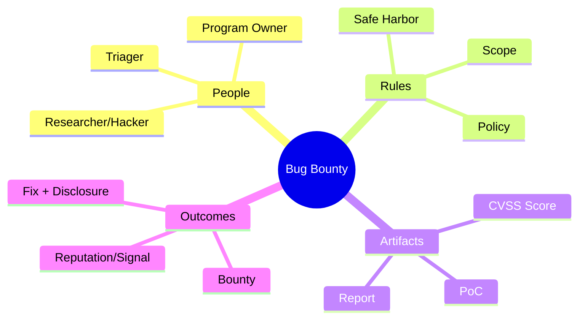
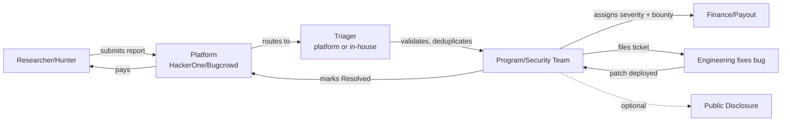
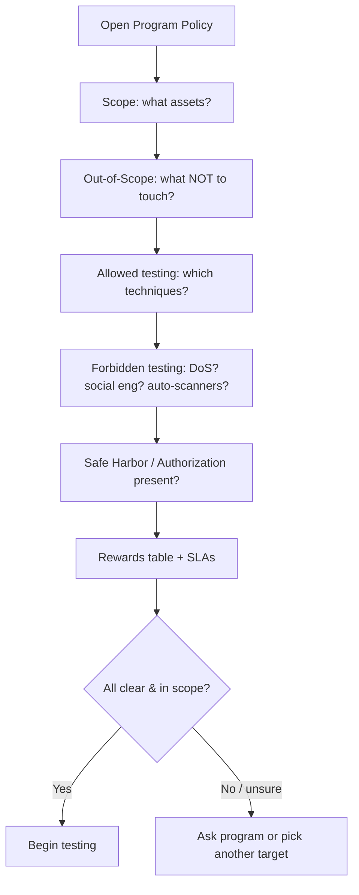
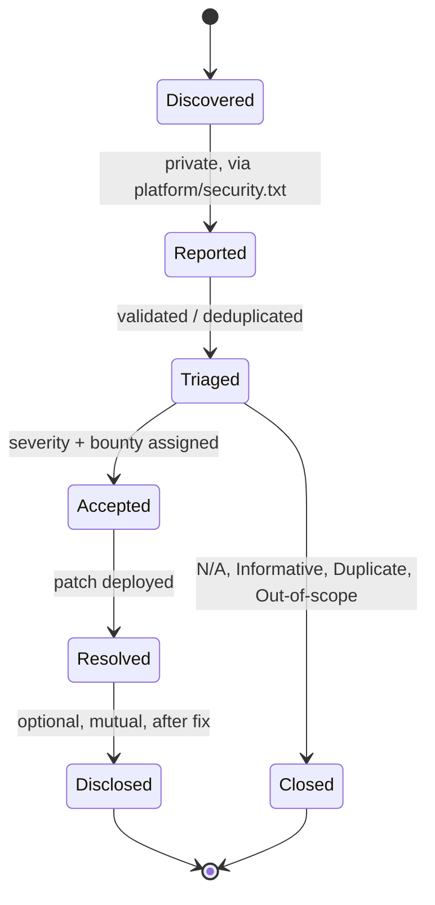
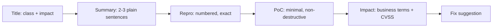
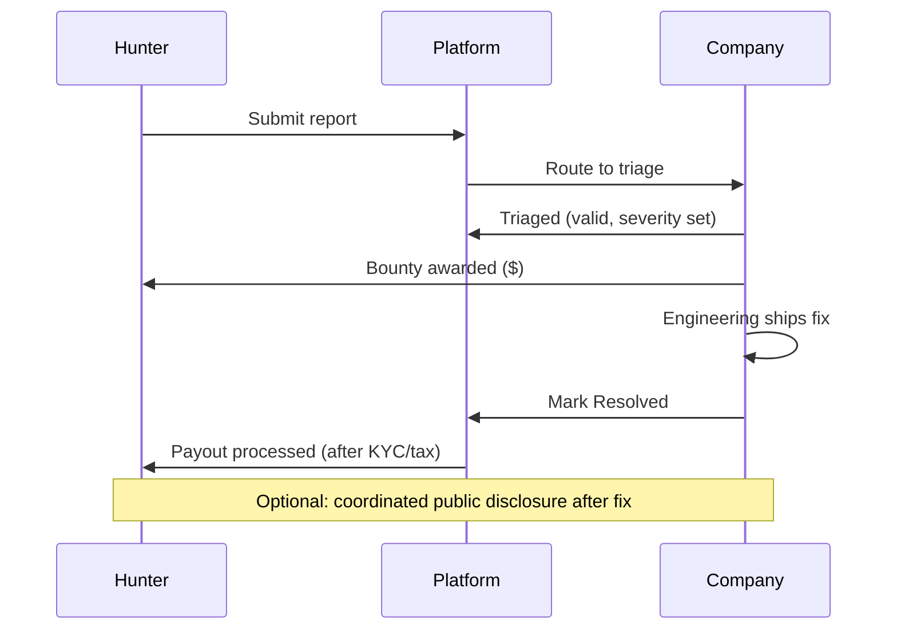
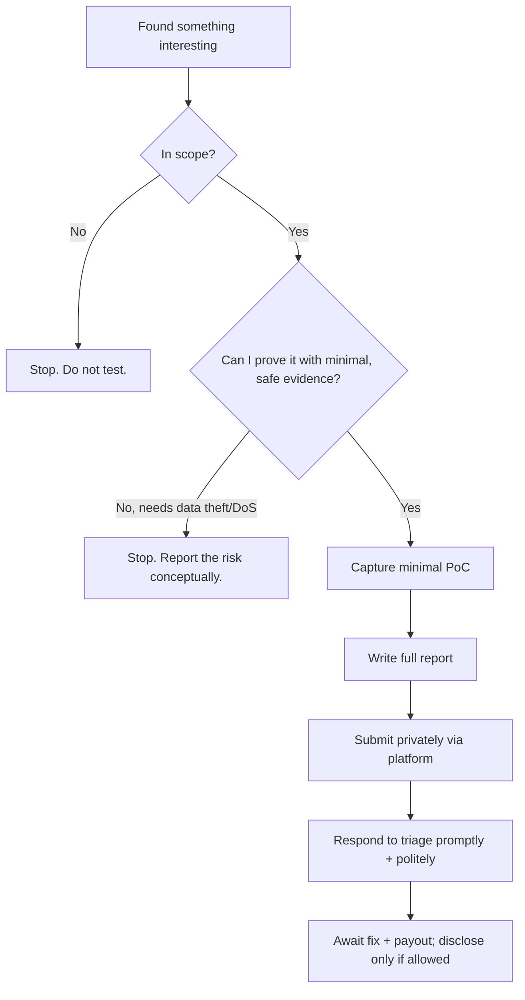

This is Chapter 1 of the Bug Bounty & AppSec notebook — Notebook 21. Everything
before this point built the machine: the Web Fundamentals series taught how HTTP,
cookies, the same-origin policy and TLS behave; the Recon & OSINT, Scanning and
Web Pentest notebooks taught how to find hosts, map an application, and validate a
finding. This chapter is about the *game those skills are played inside* when you
are not on a paid engagement — the bug bounty. It answers the question a beginner
actually has before they ever type a payload: **who is allowing me to test what,
how do I prove I found something real, and how does that turn into money without
getting me sued or banned?** Method and rules first; the exploitation chapters
that follow this one lean on the discipline established here.

If you have never submitted a report, this chapter takes you from zero to your
first valid submission. If you have already earned a few bounties, the middle
sections on reading scope, scoring severity, and writing high-signal reports are
where the money and the reputation actually live — most rejected reports fail
there, not in the exploitation.

## Why This Matters

A bug bounty program is a standing invitation from an organisation that says, in
effect: *"find security flaws in these specific systems, tell us privately and
carefully, and we will pay you."* That single sentence rearranges the entire
legal and economic picture of hacking. Without that invitation, probing someone
else's server for vulnerabilities can be a crime under laws like the US Computer
Fraud and Abuse Act (CFAA), the UK Computer Misuse Act, or India's IT Act §43/§66.
With it — and only for the assets and actions the program explicitly authorises —
the same activity becomes sanctioned, and often lucrative, security research.

The whole discipline therefore rests on a boundary: the **scope**. Everything
valuable in this chapter radiates out from learning to read that boundary
precisely and never stepping over it. A brilliant exploit on an out-of-scope host
is worth nothing and can get you banned or reported; a modest, well-explained bug
on an in-scope asset is worth money and reputation. Beginners lose far more often
to scope and report-quality mistakes than to a lack of hacking skill, which is
exactly why a "beginner" chapter spends most of its time on policy, disclosure and
communication rather than payloads.



## Part 1: What a Bug Bounty Actually Is

A **bug bounty** is a reward — usually cash, sometimes swag or points — paid by an
organisation to a security researcher who privately reports a genuine security
vulnerability in that organisation's systems, following the organisation's rules.
Break that down slowly, because every word carries weight:

- **Reward:** the payment. It is discretionary and defined by the program, not by
  you. A bounty *table* ties reward amount to severity.
- **Organisation:** the company running the program (Google, Shopify, a bank, a
  startup). They own the assets and set the rules. In the jargon they are the
  **program** or **program owner**.
- **Security researcher / hacker / "hunter":** you. Sometimes called a
  *whitehat*. On platforms you have a profile, a username, and a running
  reputation score.
- **Privately reports:** the finding goes to the organisation first, through a
  confidential channel, *not* to Twitter, not to a customer, not to a public
  GitHub issue. This is **coordinated disclosure** and it is the ethical and
  contractual heart of the field.
- **Genuine vulnerability:** a real, demonstrable security weakness — not a
  hypothetical, not a "best-practice" nag, not a missing header with no impact.
- **Following the rules:** you tested only what you were allowed to test, in the
  way you were allowed to test it. The rules are the **policy** and the **scope**.

A useful mental model: a bug bounty is a **standing, public pentest with an open
invitation and pay-per-result compensation**. A traditional penetration test is a
fixed-scope, fixed-fee, fixed-time engagement with a small team; a bug bounty is
open-ended, paid only for accepted findings, and open to a crowd of thousands.

### Bug bounty vs VDP vs pentest vs CTF

Beginners constantly confuse these four things. They overlap in skills but differ
completely in incentives, legality, and expectations. This table is worth
memorising:

| Property | Bug Bounty Program (BBP) | Vulnerability Disclosure Program (VDP) | Penetration Test | CTF |
| --- | --- | --- | --- | --- |
| Pays money? | Yes, per accepted bug | No — recognition only ("hall of fame") | Yes, fixed fee/contract | No (sometimes prizes) |
| Who can participate | Public or invited crowd | Anyone who finds something | A contracted firm/individual | Anyone registered |
| Authorisation | Program policy + safe harbor | "See something, say something" policy | Signed contract / SoW | The event's own systems |
| Targets | Real production systems | Real production systems | Client's real systems | Deliberately vulnerable, isolated |
| Goal | Reduce real risk, reward finders | Give finders a legal channel | Point-in-time assurance | Learning / competition |
| Duplicates matter? | Yes — first valid report wins | Usually no reward anyway | N/A | N/A (flags are per-team) |

A **VDP** is the crucial one to understand as a beginner: it is a *free* channel.
The company says "if you find something, here's how to tell us safely," but there
is no money. VDPs are excellent for practice, for building a track record, and for
programs (like many government agencies) that cannot legally pay. The US federal
government runs one of the largest VDPs in the world. Many researchers "cut their
teeth" on VDPs precisely because the pressure of duplicates and payouts is absent.

> **CTF vs the real thing (why this notebook keeps both in mind).** In a CTF the
> target is *built to be broken* and isolated from the world; the "impact" is a
> flag string. In a bounty the target is *someone's live business* and the impact
> is measured in real dollars, real user data, and real legal exposure. The
> techniques transfer almost perfectly — a SQL injection is a SQL injection — but
> the judgement does not. In a CTF you dump the whole database to get the flag; on
> a bounty you extract one row (e.g. `version()` or a single user ID) to *prove*
> the bug and then stop, because dumping real customer data is itself harmful and
> often outside what the program authorised. Hold that distinction from the first
> day.

## Part 2: The Ecosystem — Who Are All These People?

A live program involves more roles than "hacker" and "company". Knowing who does
what tells you *who reads your report* and *what they need from you*.



- **Researcher (you):** finds and reports.
- **Platform (HackerOne, Bugcrowd, etc.):** the marketplace and workflow tool. It
  hosts the program's policy, receives reports, tracks state, handles payments and
  taxes, and runs reputation systems. Think of it as the "Upwork + Jira + Stripe"
  of vulnerability reporting.
- **Triager:** the first human (or increasingly, an AI-assisted first pass) to
  read your report. On many programs the *platform* provides managed triage
  (HackerOne's "H1 Triage", Bugcrowd's ASE team); on others the company triages in
  house. The triager decides: is this valid, is it a duplicate, is it in scope,
  what severity? Your report is written *for this person first*.
- **Program / security team:** the company's own security engineers. They confirm
  severity, decide the bounty, and drive the fix internally.
- **Engineering:** the developers who actually patch the bug. You rarely talk to
  them, but a good report makes their job (and thus your resolution and payout)
  faster.

The single most important consequence of this structure: **you are writing for a
busy triager who sees dozens of reports a day, most of them low quality.** Clarity,
reproducibility and honest impact are what separate a paid report from an ignored
one. We return to this in Part 7.

## Part 3: The Platforms — Where Programs Live

You *can* run a bug bounty without a platform — many companies publish a
`security.txt` and a `security@` email and take reports directly (this is called a
**self-hosted** or **independent** program; Google, Meta, Apple, and GitHub famously
run large ones this way). But most programs live on a **platform** that standardises
the policy, the report format, the payments, and the reputation. As a beginner you
will almost certainly start on a platform. Here are the majors:

| Platform | Region/Notes | Model | How you get in |
| --- | --- | --- | --- |
| **HackerOne** (`hackerone.com`) | US, largest | Public + private, managed triage | Sign up; public programs open to all |
| **Bugcrowd** (`bugcrowd.com`) | US, large | Public + private, "VRT" taxonomy | Sign up; ranked "Bug Bash" events |
| **Intigriti** (`intigriti.com`) | Europe (Belgium), growing fast | Public + private | Sign up; strong EU program base |
| **YesWeHack** (`yeswehack.com`) | Europe (France) | Public + private | Sign up; big EU/gov presence |
| **Synack** (`synack.com`) | US, invite-only "Red Team" | Vetted, private only | Application + skills test (SRT) |
| **Immunefi** (`immunefi.com`) | Web3/crypto | Public, very high payouts | Sign up; smart-contract focus |
| **Self-hosted** | Any (Google VRP, Meta, Apple, GitHub) | Direct to company | Read their `/security` page |

A few things a beginner should understand about platform mechanics:

- **Public vs private programs.** A **public** program is listed openly and anyone
  can hack it. A **private** program is invite-only; the platform invites
  researchers based on reputation, past performance, or specific skills. You start
  on public programs, build reputation, and earn invitations to private ones —
  which are less crowded (fewer duplicates) and often pay more. This progression
  is the core "career ladder" of platform bug bounty.
- **Reputation, signal, and impact.** Platforms score you. On HackerOne,
  **Reputation** goes up with valid reports and down with invalid/spam ones;
  **Signal** is your average report quality (valid-to-noise ratio); **Impact** is
  the average severity of your findings. High signal and reputation unlock private
  invites and reduce the friction on your reports. This is why *spraying low-effort
  reports is actively harmful* — each invalid report drags your signal down.
- **The Vulnerability Rating Taxonomy (VRT)** on Bugcrowd, and similar mappings
  elsewhere, give a baseline severity/priority (P1–P5, where **P1 = Critical** and
  **P5 = informational**) for common bug types, so you can predict roughly how a
  finding will be rated before you submit.

> **How to actually start (concrete first steps).** Create an account on HackerOne
> or Bugcrowd. Complete your profile and any required identity/tax verification
> (you cannot be paid otherwise). Go to the program directory and filter for
> **public** programs that **pay bounties** and are marked as accepting new
> reports. Read three or four policies end to end *before* touching anything. Pick
> one program with a broad scope and a reputation for fair, responsive triage —
> the platform shows response-time and resolution metrics for exactly this reason.

## Part 4: Reading a Program Policy — The Skill That Pays

The **policy** (also called the *program brief* or *program page*) is the contract
you operate under. Reading it correctly is, unironically, the highest-value skill
in this entire chapter. Every policy has the same handful of sections. Learn to
find and interpret each one.



### 4.1 In-scope assets

This is the list of systems you are *allowed* to test. It is usually a table of
asset identifiers with a type and often an explicit severity cap or bonus. Assets
look like:

```
*.example.com            (Wildcard — any subdomain of example.com)
api.example.com          (A single host)
www.example.com          (A single host)
com.example.mobile       (Android app package name / iOS bundle ID)
https://example.com/*     (A URL path scope)
203.0.113.0/24            (An IP range — rare, read carefully)
```

The single most important token here is the **wildcard**, `*.example.com`. It means
"any subdomain" — `blog.example.com`, `dev.example.com`, `api-staging.example.com`,
and so on are all fair game. This is why *asset discovery / subdomain enumeration*
(the subject of Chapter 2 of this notebook) is so central to bug bounty: a wildcard
scope turns recon into money, because the subdomain nobody else found is the one
without duplicates.

But read the wildcard's fine print. Programs frequently carve out exceptions like
"`*.example.com` **except** `blog.example.com` (third-party WordPress) and
`status.example.com` (hosted by a vendor)". Testing those carve-outs is
out-of-scope and can be a violation even though they *match the wildcard pattern*.

### 4.2 Out-of-scope assets and issues

Two different kinds of "out of scope" live here and beginners conflate them:

1. **Out-of-scope assets** — systems you must not touch at all (a third-party
   marketing site, a partner's infrastructure, a specific acquired brand not yet
   covered).
2. **Out-of-scope issue types** — bug *classes* the program will not pay for or
   consider, even on in-scope assets. These are the "known and accepted risks."
   Extremely common examples that beginners waste days on:

| Frequently out-of-scope issue | Why programs reject it |
| --- | --- |
| Missing security headers (CSP, HSTS) with no demonstrated exploit | Best-practice nag, not a vulnerability by itself |
| Self-XSS (you attack only yourself) | No victim; not exploitable against others |
| Missing rate limiting with no impact | Theoretical; needs a real consequence |
| Clickjacking on pages with no sensitive action | No meaningful impact |
| Login/email enumeration | Low value; often accepted risk |
| CSV/formula injection in exports | Debated; many programs exclude it |
| Reports from automated scanners with no manual validation | Noise; usually auto-closed |
| SPF/DMARC/DKIM email config weaknesses | Often accepted risk unless full spoof shown |
| Vulnerabilities requiring a rooted/jailbroken device or MITM you control | Attacker-controlled preconditions |
| "Best practice" TLS/cipher findings from SSL Labs | Not exploitable as reported |

Reading this list first will save you more time than any tool. If your idea is on
the program's out-of-scope list, it is worth zero *no matter how real it is*.

### 4.3 Rules of engagement: allowed and forbidden testing

Policies specify *how* you may test, not just *what*. Near-universal prohibitions:

- **No denial of service (DoS/DDoS).** Do not stress-test, flood, or knock things
  over. This is almost always forbidden and can be a crime.
- **No physical attacks or social engineering** against staff, unless the program
  *explicitly* allows it (rare, and usually only on invite programs).
- **No testing against other users' data.** Use your own test accounts. If you
  find you *can* access another user's data (e.g. an IDOR), prove it minimally with
  a second account you control, or with the least intrusive evidence possible — do
  not go rifling through real customers' records.
- **Automated scanning limits.** Many programs restrict or forbid noisy automated
  scanners, or require you to throttle (rate-limit) your tools and identify
  yourself with a custom header like `X-Bug-Bounty: yourname`. Respect it.
- **Data handling.** If you incidentally access sensitive data, stop, do not
  download/retain it, and report it. Never exfiltrate at scale to "prove impact."

### 4.4 The safe-harbor / authorisation clause — your legal shield

Somewhere in a good policy is a paragraph that grants you **authorisation** and
promises the company will not pursue legal action against good-faith research that
stays within the rules. This is the **safe harbor** clause, and it is what
converts "unauthorised access to a computer system" (a crime) into "sanctioned
security testing" (legal). A representative clause reads like this:

> *"If you make a good faith effort to comply with this policy during your
> research, we will consider your research to be authorised, we will work with you
> to understand and resolve the issue quickly, and we will not pursue or support
> any legal action related to your research."*

Many programs adopt the community-standard [disclose.io](https://disclose.io) safe
harbor language. Some jurisdictions and companies also point to a `security.txt`
file (RFC 9116) at `https://example.com/.well-known/security.txt` that declares the
contact, policy URL, and preferred languages. Here is what one looks like:

```
Contact: mailto:security@example.com
Contact: https://hackerone.com/example
Expires: 2027-12-31T23:59:00.000Z
Encryption: https://example.com/pgp-key.txt
Acknowledgments: https://example.com/hall-of-fame
Preferred-Languages: en
Policy: https://example.com/.well-known/security-policy
Hiring: https://example.com/jobs
```

> **Blue-team / defender angle.** From the other side of the table, publishing a
> `security.txt`, a clear scope, and a real safe-harbor clause is one of the
> highest-leverage things a security team can do: it channels the inevitable
> unsolicited "I found a bug" emails into a structured queue, reduces legal
> ambiguity for good-faith finders, and turns hostile disclosure ("I'll tweet this
> if you don't pay") into coordinated disclosure. If your day job is defense,
> standing up even a no-pay VDP with disclose.io language is a step up from a
> silent `security@` inbox.

If a target has **no** program, **no** `security.txt`, and **no** stated
authorisation, then you have **no** legal cover, and probing it is not bug bounty —
it is potentially a crime. The absence of an invitation is a "no."

## Part 5: The Disclosure Lifecycle — From Finding to Fix

"Disclosure" is the umbrella term for how a vulnerability goes from *discovered* to
*publicly known and fixed*. There is a spectrum, and knowing where bug bounty sits
on it prevents catastrophic mistakes.



The models on the spectrum:

- **Coordinated / responsible disclosure:** you tell the vendor privately, give
  them reasonable time to fix, and only go public (if at all) *after* a fix and
  usually with mutual agreement. **This is bug bounty.**
- **Full disclosure:** publishing all details immediately and publicly, sometimes
  before a fix. Historically used to pressure unresponsive vendors; risky and
  generally not what you do inside a program.
- **Non-disclosure:** the details are never made public (many programs default to
  this; some allow public disclosure of a redacted report after resolution).

Inside a platform, a report moves through **states**. On HackerOne the common ones:

| State | Meaning | Your reaction |
| --- | --- | --- |
| **New** | Submitted, awaiting first look | Wait; do not spam |
| **Triaged** | Validated as a real, in-scope issue | Good sign; bounty often follows |
| **Needs more info** | Triager has a question | Answer fast and precisely |
| **Duplicate** | Someone reported it first | No bounty; move on |
| **Informative** | Valid observation, not enough impact to pay | Learn from it |
| **Not applicable (N/A)** | Not a real issue / out of scope | No reputation loss if reasonable |
| **Resolved** | Fixed | Bounty finalised; possible disclosure |
| **Spam** | Junk report | Reputation penalty — avoid at all costs |

The **duplicate** state deserves special attention because it defines the economics
of public programs: **only the first valid report of a given bug gets paid.** If
five people find the same reflected XSS on the login page, the first submitter is
paid and the other four get "Duplicate" (no money, no reputation gain). This is why
recon that finds *unusual* assets and attack surface (Chapter 2) beats hammering the
obvious pages everyone else is already testing.

## Part 6: Severity and CVSS — How a Bug Becomes a Number

Bounties are tied to **severity**, and severity is usually expressed with the
**Common Vulnerability Scoring System (CVSS)** — most commonly **v3.1** today, with
v4.0 rolling out. CVSS turns a bug's characteristics into a number from **0.0 to
10.0** and a band:

| CVSS v3.1 score | Severity band | Typical program label |
| --- | --- | --- |
| 0.0 | None | Informational |
| 0.1 – 3.9 | Low | P4 |
| 4.0 – 6.9 | Medium | P3 |
| 7.0 – 8.9 | High | P2 |
| 9.0 – 10.0 | Critical | P1 |

The score is computed from the **Base metrics**, which describe the bug
independent of any specific environment:

- **Attack Vector (AV):** Network / Adjacent / Local / Physical — how far away can
  the attacker be? Network (over the internet) is worst.
- **Attack Complexity (AC):** Low / High — how much luck or special conditions are
  needed?
- **Privileges Required (PR):** None / Low / High — does the attacker need an
  account?
- **User Interaction (UI):** None / Required — does a victim have to click
  something?
- **Scope (S):** Unchanged / Changed — does the bug let you affect resources beyond
  the vulnerable component's security authority? (A container escape *changes*
  scope.)
- **Confidentiality / Integrity / Availability (C/I/A):** None / Low / High — what
  is the impact on data secrecy, data trustworthiness, and uptime?

These are written as a **vector string**. For example, an unauthenticated,
network-reachable SQL injection that dumps a database is:

```
CVSS:3.1/AV:N/AC:L/PR:N/UI:N/S:U/C:H/I:H/A:H   →  9.8 (Critical)
```

Read it left to right: **AV:N** network, **AC:L** low complexity, **PR:N** no
privileges needed, **UI:N** no victim interaction, **S:U** scope unchanged, and
**C:H/I:H/A:H** high impact to confidentiality, integrity and availability. Compare
a self-only reflected XSS that requires the victim to be tricked and only leaks
low-value data:

```
CVSS:3.1/AV:N/AC:L/PR:N/UI:R/S:C/C:L/I:L/A:N   →  6.1 (Medium)
```

The `UI:R` (user interaction required) and lower impact drag it down to Medium even
though XSS "sounds" scary. Learning to reason about these metrics *before* you
submit lets you set the program's expectations honestly and argue your severity
credibly. Use the official [FIRST CVSS v3.1 calculator](https://www.first.org/cvss/calculator/3.1)
to build and check vector strings.

> **The critical caveat: CVSS is a starting point, not the payout.** Programs
> almost always re-rate based on *business context*. A CVSS 9.8 on a throwaway
> marketing subdomain with no user data may pay like a Medium; a "Medium" IDOR that
> exposes every customer's home address may pay like a Critical because of the
> real-world impact. Always argue **impact in business terms** ("an unauthenticated
> attacker can read any user's private messages"), not just the CVSS band. This is
> the single most common reason skilled hackers still underperform on payouts —
> they report the *mechanism* and forget the *consequence*.

## Part 7: The Anatomy of a Report That Gets Paid

Your report is the product. The bug is real either way; whether you get *paid* is
decided by how well you communicate it. A strong report has a fixed skeleton, and
triagers love it because it lets them validate fast. Here is the structure, with a
worked example woven in.

### 7.1 Title

One line, specific, includes the bug class and the impact. Not "XSS found" but:

```
Stored XSS in profile "display name" executes on every visitor to /u/<name>
```

### 7.2 Summary

Two or three sentences a non-specialist manager could understand: what the bug is,
where, and why it matters.

> *"The display-name field on user profiles does not sanitise input. An attacker
> can store a JavaScript payload in their own display name; it then executes in the
> browser of any authenticated user who views that profile, allowing session theft
> and actions on the victim's behalf."*

### 7.3 Steps to reproduce

Numbered, exact, copy-pasteable. Assume the reader will follow them literally.

```
1. Log in as attacker (test account A: attacker@researcher.test).
2. Go to Settings → Profile → Display Name.
3. Set the display name to:  ">
4. Save. Note the request:

   POST /api/v2/profile HTTP/2
   Host: app.example.com
   Cookie: session=<A's session>
   Content-Type: application/json

   {"displayName":"\">"}

5. Log in as a *different* user (test account B) in another browser.
6. Visit https://app.example.com/u/attacker
7. Observe: an alert box showing "app.example.com" — proving arbitrary JS
   execution in B's authenticated session.
```

### 7.4 Proof of Concept (PoC)

The payload, request/response, and evidence. Keep it **minimal and non-destructive**
— an `alert(document.domain)` proves XSS; you do **not** need to steal a real
cookie or deface anything. For an IDOR, show that you accessed *your own second
test account's* object by ID, not a real customer's.

### 7.5 Impact

Translate the mechanism into business consequences and propose the severity:

> *"Any user viewing the attacker's profile has their session compromised. Because
> the app has no HttpOnly flag on the session cookie, the payload can exfiltrate it
> and fully take over accounts, including admin accounts that review reported
> profiles. Suggested severity: High, CVSS:3.1/AV:N/AC:L/PR:L/UI:R/S:C/C:H/I:H/A:N
> (8.0)."*

### 7.6 Remediation (optional but appreciated)

A short, correct fix suggestion signals seniority and speeds resolution:

> *"Context-encode all user-controlled fields on output (HTML-entity-encode the
> display name), set `HttpOnly` and `Secure` on the session cookie, and add a
> Content-Security-Policy that disallows inline script."*



> **What kills reports (memorise this).** Vague titles; missing steps; a PoC that
> only works "sometimes"; screenshots with no request/response; claiming Critical
> for a self-XSS; testing out-of-scope and burying it; being rude when the triager
> asks a question; and — the classic — *"I could have dumped the whole database"*
> without a minimal, safe demonstration. Show, don't threaten. Prove, don't
> exaggerate.

## Part 8: How Payouts Actually Work — The Economics

The money question, answered concretely.

### 8.1 The bounty table

Each program publishes (or privately holds) a **reward table** mapping severity to
a range. A mid-size SaaS program might look like:

| Severity | Typical range |
| --- | --- |
| Critical (P1) | $2,000 – $10,000+ |
| High (P2) | $750 – $2,500 |
| Medium (P3) | $250 – $750 |
| Low (P4) | $50 – $150 |
| Informational (P5) | $0 (may still earn reputation) |

These vary enormously. Elite programs (Google, Apple, crypto/Web3 via Immunefi)
pay six or even seven figures for the most severe classes (e.g. remote code
execution, full account takeover at scale, smart-contract fund theft). Brand-new
or cash-strapped programs may pay in swag or reputation only. The *range* exists
because the final number depends on demonstrated impact, quality of the report, and
sometimes a chain (multiple bugs combined into a bigger one).

### 8.2 What determines *your* number inside the range

- **Demonstrated impact** — the biggest lever. "Account takeover of any user" beats
  "account takeover if the victim clicks a link on a Tuesday."
- **Report quality** — a triager who can validate in five minutes is a triager who
  pays sooner and argues less.
- **Uniqueness / cleverness** — novel bugs and creative chains sometimes earn
  discretionary bonuses.
- **First to report** — duplicates get nothing; timing matters, which rewards good
  recon and fast, careful work.

### 8.3 Getting paid, taxes, and timing

Platforms handle the payment rails (PayPal, bank transfer, sometimes crypto). You
will typically need to complete **identity verification (KYC)** and **tax forms**
(a W-9 for US persons, W-8BEN for non-US persons on US platforms) before any money
moves. Payment usually happens after the report is **Triaged** or **Resolved**,
depending on the program — some "fast-pay" on triage, most on resolution. Expect
delays measured in weeks, not minutes; a fix has to be scheduled and shipped by the
company's engineers.



> **Bug bounty as a living — the honest version.** A tiny number of top hunters
> earn six figures a year; the median participant earns far less, and many earn
> zero for a long time while learning. Public programs are crowded and
> duplicate-heavy. The realistic path is: build skills on deliberately vulnerable
> labs and VDPs, earn reputation on public programs, get invited to less-crowded
> private programs, and specialise. Treat early bounties as *tuition you get paid
> for*, not a salary. The skills compound; the income is lumpy.

## Part 9: Hands-On Lab — Your First End-to-End Walkthrough (No Illegal Testing)

This lab has you practise the *entire non-exploitation workflow* — the part
beginners skip and then fail on — using only authorised, safe targets. You will not
attack anyone's production system here; you will practise reading scope, using a
`security.txt`, scoring a bug, and writing a report against a lab target you are
explicitly allowed to test.

### Step 1 — Find and read a real program policy

Open HackerOne's directory (`https://hackerone.com/opportunities/all`) or
Bugcrowd's (`https://bugcrowd.com/programs`). Pick one public, bounty-paying
program. In a notebook, answer these questions *from the policy alone*:

1. Exactly which assets are in scope? Are there wildcards? Any carve-outs?
2. List three issue types that are explicitly **out of scope**.
3. Is automated scanning allowed? Is a rate limit or identifying header required?
4. Is there a safe-harbor clause? Quote the sentence that grants authorisation.
5. What is the reward range for a High-severity bug?

If you cannot answer all five confidently, you are not ready to test that program.
This drill, done ten times, is worth more than any tool.

### Step 2 — Inspect a `security.txt` in the wild

Use `curl` to pull a real disclosure file. Every flag explained:

```bash
curl -s https://www.google.com/.well-known/security.txt
# -s : silent mode — suppress the progress meter and error text,
#      so you see only the file's contents.
```

Expected shape of the output (abbreviated):

```
Contact: https://g.co/vulnz
Contact: mailto:security@google.com
Encryption: https://services.google.com/corporate/publickey.txt
Acknowledgements: https://bughunters.google.com/...
Policy: https://bughunters.google.com/...
Hiring: https://g.co/SecurityPrivacyEngJobs
```

Try a few more (`https://github.com/.well-known/security.txt`,
`https://www.facebook.com/.well-known/security.txt`). You are learning to locate
the *authorisation and contact channel* before ever touching a target — reading the
"you may test us" sign before entering.

### Step 3 — Stand up a legal practice target

Set up a deliberately vulnerable app you fully control, so you can practise the
finding-to-report pipeline safely. OWASP Juice Shop runs in one command if you have
Docker:

```bash
docker run --rm -p 3000:3000 bkimminich/juice-shop
# run   : start a container.
# --rm  : delete the container when it stops (keep your machine clean).
# -p 3000:3000 : map host port 3000 → container port 3000, so you can
#                reach the app at http://localhost:3000.
# bkimminich/juice-shop : the public image name to download and run.
```

Browse to `http://localhost:3000`. This target is *yours*, isolated, and designed
to be broken — the perfect place to practise producing evidence you would put in a
report. (The actual exploitation techniques come in later chapters; here you are
practising the *reporting discipline*.)

### Step 4 — Find a simple issue and write a full report for it

Find any low-hanging issue in Juice Shop — for instance, a reflected input that
echoes into the page. Then, even though it's a lab, write a *complete, real-quality
report* for it using the Part 7 skeleton: title, summary, numbered steps, minimal
PoC (an `alert(document.domain)`), impact in business terms, a CVSS vector you
built yourself on the FIRST calculator, and a one-line fix. Save it as
`report.md`. This artefact — a clean, submittable report — is the deliverable of
this lab. Do this three times on three different issues and you will out-report
most beginners on live programs.

### Step 5 — Score it and sanity-check the severity

For your Juice Shop finding, build the CVSS vector deliberately:

- Is it network-reachable? → **AV:N**
- Does it need a victim to click? → **UI:R** (for reflected XSS) or **UI:N**
- Does it need an account? → **PR:N** or **PR:L**
- What's the real impact on C/I/A?

Compare your intuition ("this feels High") with the number the calculator returns.
The gap between those two is exactly the judgement you are training.

> **CTF connection.** Everything you just did maps onto a CTF, minus the reporting:
> Juice Shop even has a built-in scoreboard of challenges. Platforms like
> TryHackMe, HackTheBox, and PortSwigger's Web Security Academy are essentially
> curated CTFs for the exact bug classes real programs pay for. The bounty
> difference is that in a CTF you stop at the flag; on a program you stop at
> *minimal proof* and then write it up for a human.

## Part 10: Ethics, OPSEC, and How People Get Banned

The fastest way to end a bug bounty "career" is not a lack of skill — it's an
avoidable rules or ethics violation. Internalise these before your first live test.

### 10.1 The hard lines (do not cross, ever)

- **Never test out of scope.** A finding on an out-of-scope asset is worthless and
  can be treated as unauthorised access. When in doubt, it's out.
- **Never destroy, modify, or exfiltrate real data.** Prove with the minimum:
  `version()`, one row you own, a screenshot of *your own* second account's data.
- **Never pivot deeper than needed.** Finding an RCE does not authorise you to roam
  the internal network. Get minimal proof (e.g. `id` / `whoami` output) and stop.
- **Never DoS.** No load testing, no fuzzing that knocks services over, no
  amplification.
- **Never extort.** "Pay me or I'll go public / sell this" is a crime, not a
  bounty. Coordinated disclosure means the company controls timing, within reason.
- **Respect the disclosure rules.** Do not tweet the bug, show a customer, or blog
  it until the program allows public disclosure (usually after a fix, by mutual
  agreement).

### 10.2 OPSEC and professionalism

- **Use dedicated test accounts** and clearly-labelled test data
  (`researcher+test1@…`). Never test with a real user's credentials.
- **Identify your traffic** when asked — a custom header (`X-Bug-Bounty: h1-<user>`)
  or a stated source IP helps the blue team distinguish you from an actual attacker
  and keeps you out of their incident response.
- **Throttle your tools.** Even where scanning is allowed, hammering a small
  company's single server is inconsiderate and risks a DoS violation.
- **Be calm and precise in comments.** Triagers are people; a polite, well-argued
  reply about severity gets you further than indignation. Your **reputation** and
  **signal** scores follow you across every program on the platform.



> **Red-team perspective (why programs love this).** A bug bounty is, in effect, a
> continuous, crowdsourced red team against production — but a *rule-bound* one.
> The same instincts a red-teamer uses (find the forgotten asset, chain small bugs
> into a big one, think like an attacker) win bounties. The difference from a real
> red-team engagement is the guardrails: you operate under public rules, you don't
> get to touch out-of-scope systems just because they're reachable, and "impact"
> ends at *demonstration*, not *actuation*. Learning to get maximal proof with
> minimal footprint is a skill that makes you better at both.

## Part 11: Common Mistakes and How to Avoid Them

| Mistake | Why it hurts | The fix |
| --- | --- | --- |
| Testing before reading the full policy | Out-of-scope work = wasted time or a ban | Read scope + rules end to end first |
| Reporting out-of-scope issue types | Auto-closed as N/A; drags signal down | Check the out-of-scope issue list |
| Submitting raw scanner output | Noise; reputation penalty | Manually validate everything first |
| Vague reports with no clear repro | Triager can't validate → closed | Use the Part 7 skeleton every time |
| Over-claiming severity | Erodes trust; triager pushes back | Argue impact honestly with CVSS |
| Chasing crowded, obvious pages | Everyone found it → Duplicate | Recon for unusual assets (Ch. 2) |
| Exfiltrating real data to "prove" impact | Ethics/legal violation | Minimal, self-owned proof only |
| Going public early | Breaks coordinated disclosure | Wait for the program's OK |
| Being rude to triagers | Kills goodwill; follows you | Stay precise and professional |
| Ignoring KYC/tax setup | Bounty awarded but unpayable | Complete verification early |

## Part 12: Final Revision / Summary

A bug bounty is a paid, rule-bound invitation to find and privately report real
vulnerabilities. The entire practice orbits one thing: **scope**. A program's
policy defines the assets you may test, the issue types it cares about, the testing
techniques allowed, and — crucially — the **safe-harbor** clause that makes your
work legal. Distinguish a paid **bug bounty program** from a no-pay **VDP**, from a
contracted **pentest**, from an isolated **CTF**; they share techniques but differ
entirely in incentives and legality.

Programs live on **platforms** (HackerOne, Bugcrowd, Intigriti, YesWeHack, Synack,
Immunefi) or are **self-hosted** (Google, Meta, Apple). Platforms mediate reports,
run **reputation / signal / impact** scoring, and gate the progression from crowded
**public** programs to lucrative **private** ones. Reports flow through **states**
(New → Triaged → Resolved, or closed as Duplicate / Informative / N/A), and only
the **first valid** reporter of a bug is paid — which is why recon that finds
unusual attack surface beats hammering the obvious.

Severity is expressed with **CVSS v3.1** (a 0–10 score from a vector of AV/AC/PR/UI/
S/C/I/A), but the payout is driven by **demonstrated business impact**, not the raw
number. Your **report** is the product: title, summary, exact repro, a **minimal,
non-destructive PoC**, impact in business terms, and a fix suggestion. Payouts
follow a **bounty table** and require **KYC/tax** setup. Above all, the **ethics
and OPSEC** are non-negotiable: stay in scope, never destroy or exfiltrate real
data, never DoS, never extort, and disclose only when allowed. Get all of that
right and the exploitation skills in the chapters ahead turn into resolved reports
and real payouts.

## Part 13: Cheat Sheet / Quick Reference

**The four things, distinguished**

```
Bug Bounty Program (BBP) : paid, per accepted bug, crowd, real prod
VDP                      : free, legal channel, recognition only
Pentest                  : contracted, fixed fee/scope/time
CTF                      : isolated, built-to-break, flags not $
```

**Policy reading checklist**

```
[ ] In-scope assets (note wildcards *.example.com and carve-outs)
[ ] Out-of-scope ASSETS and out-of-scope ISSUE TYPES
[ ] Allowed vs forbidden testing (DoS? social eng? scanners?)
[ ] Rate-limit / identifying-header requirement
[ ] Safe-harbor / authorization clause present?
[ ] Reward table + response SLAs
```

**Find the authorisation channel**

```bash
curl -s https://TARGET/.well-known/security.txt   # RFC 9116 contact + policy
```

**Report skeleton**

```
Title    : <bug class> in <location> → <impact>
Summary  : 2-3 plain sentences
Steps    : 1..N exact, copy-pasteable (include raw HTTP request)
PoC      : minimal, non-destructive (alert(document.domain), one owned row)
Impact   : business consequence + CVSS vector
Fix      : one-line correct remediation
```

**CVSS v3.1 vector at a glance**

```
CVSS:3.1/AV:[N|A|L|P]/AC:[L|H]/PR:[N|L|H]/UI:[N|R]/S:[U|C]/C:[N|L|H]/I:[N|L|H]/A:[N|L|H]
Bands: 0 None | 0.1-3.9 Low | 4-6.9 Medium | 7-8.9 High | 9-10 Critical
Calc : https://www.first.org/cvss/calculator/3.1
Example (unauth SQLi dumping DB): AV:N/AC:L/PR:N/UI:N/S:U/C:H/I:H/A:H = 9.8
```

**Report state cheat (HackerOne)**

```
New → Triaged → Resolved (paid)
Closed as: Duplicate | Informative | N/A | Spam(avoid!)
```

**Hard "never" list**

```
Never: out-of-scope | destroy/exfiltrate real data | DoS
       extort | disclose early | scan without permission
Always: minimal proof | dedicated test accounts | be polite
```

## Part 14: Practice Labs & Resources

Train the exact skills in this chapter, in rough order of usefulness for a
beginner:

- **PortSwigger Web Security Academy** (`portswigger.net/web-security`) — free,
  world-class labs for every bug class programs pay for. Start here for the actual
  vulnerabilities; combine with this chapter's reporting discipline.
- **OWASP Juice Shop** (`owasp.org/www-project-juice-shop`) — the practice target
  from Part 9; run it locally and rehearse the *find → minimal PoC → report* loop.
- **HackerOne Hacktivity** (`hackerone.com/hacktivity`) and **disclosed Bugcrowd
  reports** — read real, publicly-disclosed reports to see what "paid" quality
  looks like. This is the single best way to calibrate report quality.
- **HackerOne CTF / Hacker101** (`www.hacker101.com` + `ctf.hacker101.com`) —
  free lessons plus a CTF whose flags can earn **private program invites**; a
  direct, legitimate on-ramp to real programs.
- **Bugcrowd University** and **Intigriti's "Hackademy"** — free platform-authored
  training that also teaches each platform's report expectations.
- **disclose.io** (`disclose.io`) — the standard safe-harbor language and a
  directory of programs with good-faith terms; read it to understand what real
  authorisation looks like.
- **TryHackMe "Intro to Bug Bounty" style rooms** and **HackTheBox** — gamified
  practice targets for the underlying techniques.
- **RFC 9116** (`security.txt`) and the **FIRST CVSS v3.1 documentation** — the two
  reference specs you'll consult repeatedly; read the CVSS user guide once, in
  full.

Practice questions to test yourself before the next chapter:

1. A program's scope lists `*.example.com` but the out-of-scope section names
   `shop.example.com` (Shopify-hosted). You find a serious bug on
   `shop.example.com`. Is it eligible? Why or why not?
2. You find the same reflected XSS two other researchers reported yesterday. What
   state will your report get, and what should you do differently next time?
3. Write the CVSS v3.1 vector for: an authenticated user (needs a normal account)
   can, over the internet, read *any other* user's private files by changing an ID
   in a URL, with no victim interaction. What band does it land in?
4. A target has no bug bounty program and no `security.txt`, but you found a
   critical bug while browsing. What is the correct, legal course of action?
5. Rewrite this bad title into a good one: "Found XSS". Assume it's a stored XSS in
   the support-ticket subject field that fires in the agent's dashboard.
