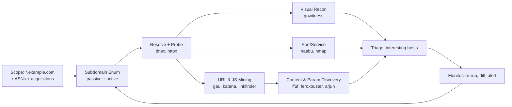
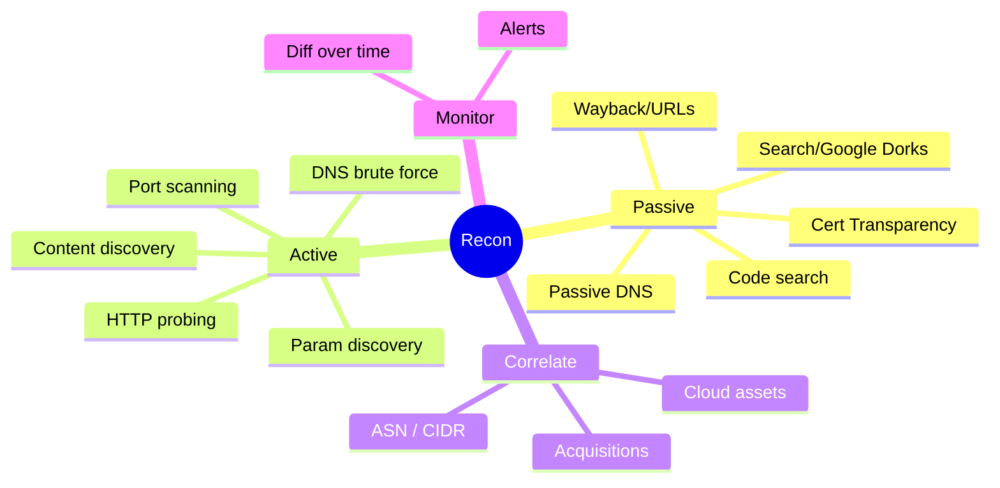
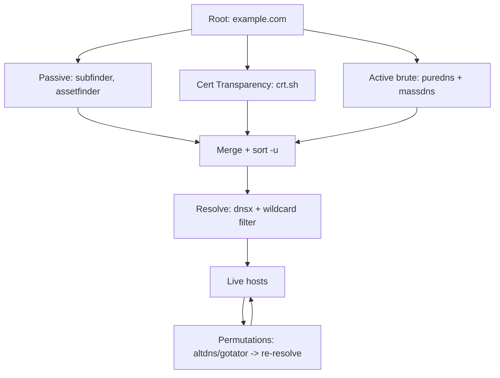
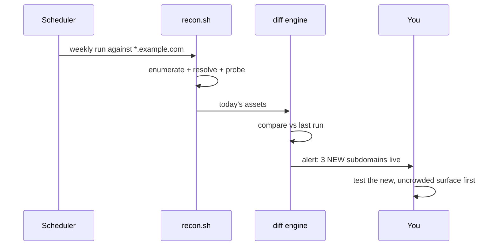

This is Chapter 2 of the Bug Bounty & AppSec notebook. Chapter 1 taught the rules
of the game — scope, disclosure, severity and payouts. This chapter builds the
machine that feeds the game: **reconnaissance**. If Chapter 1's lesson was "the
money orbits the scope," this chapter's lesson is the corollary: **the money orbits
the part of the scope nobody else has looked at.** A wildcard like `*.example.com`
is not one target; it is an invitation to discover hundreds of hosts, thousands of
endpoints, and tens of thousands of parameters — and the bug with no duplicate is
almost always on the asset that took real work to find.

You have met recon before: the Recon & OSINT notebook taught passive and active
information-gathering as a discipline, and the Scanning & Enumeration notebook
taught host and service discovery. This chapter is narrower and more mercenary: it
is recon *specifically tuned to convert a bug-bounty scope into attack surface at
scale*, as a repeatable pipeline you can run against every new program and re-run
forever to catch new assets the moment they appear. It assumes you are comfortable
in a Linux shell (the Linux notebook) and understand DNS and HTTP (the Networking
and Web Fundamentals notebooks).

## Why This Matters

Two hunters test the same program. The first opens `www.example.com`, pokes the
login form, tries a few XSS payloads, finds the reflected XSS on the search box
that forty other people already found this week, and gets a "Duplicate." The
second spends the first two hours mapping the scope: enumerates 380 subdomains,
finds `jira-dev.example.com` (a forgotten staging Jira), `api-v1.example.com` (a
deprecated API still live), and an S3 bucket referenced in an old JavaScript file.
On the deprecated API they find an authentication bypass. First-to-report,
Critical, four-figure bounty.

That is the entire thesis of recon in bug bounty: **breadth of discovered surface
multiplies your odds of a unique, high-impact finding.** Recon is not the exciting
part, but it is the part that most reliably separates people who earn from people
who collect duplicates. And because a good pipeline is *automatable* and
*monitorable*, recon compounds: set it to watch a wildcard scope and you get
notified the day a new, untested subdomain goes live — before the crowd arrives.



Throughout, keep Chapter 1's discipline in mind: **every host you touch must be in
scope.** Recon tools happily resolve and probe whatever you give them, including
out-of-scope carve-outs and third-party assets that merely share a name. Filtering
your results back down to scope is a first-class step, not an afterthought.

## Part 1: The Recon Mindset — Attack Surface, Not "Websites"

A beginner sees a program and thinks "the website." An intermediate hunter sees an
**attack surface**: every host, port, service, virtual host, API version, endpoint,
parameter, cloud bucket, and third-party integration that the organisation exposes
and that falls inside scope. The job of recon is to enumerate that surface as
completely as possible, then rank it by *how likely it is to hide a bug* and *how
few other people have looked at it*.

Recon splits into two philosophies you will blend constantly:

- **Passive recon** gathers information *without sending traffic to the target's
  own infrastructure* — it queries third parties (certificate transparency logs,
  passive DNS databases, search engines, the Wayback Machine). It is quiet, cannot
  DoS anything, and is safe to run broadly. It is where you start.
- **Active recon** sends traffic *to the target* — DNS brute force against their
  resolvers, port scans, HTTP probing, content discovery. It finds things passive
  recon misses (a subdomain that never got a public certificate) but is louder and
  must respect the program's rate limits and rules.



A note on **horizontal vs vertical** recon, terms you'll see constantly:

- **Vertical recon** = go deep on one root domain: find every subdomain of
  `example.com`.
- **Horizontal recon** = go wide across the *organisation*: find *other root
  domains and IP ranges* the same company owns (`example.io`, `example-cdn.net`,
  acquisitions, their ASN). Horizontal recon is where the biggest, least-crowded
  finds live — but it is also where scope discipline matters most, because "the
  company owns it" does **not** mean "the program authorised it." Always confirm a
  discovered root domain is in the written scope before testing it.

## Part 2: Building the Toolkit From Scratch

Almost the entire modern bug-bounty recon stack is built by [ProjectDiscovery](https://github.com/projectdiscovery)
and a handful of Go/Python tools. They are fast, composable (they read stdin and
write stdout, so they pipe together like classic Unix tools), and free. Install the
core set. Everything here assumes Kali/Ubuntu-style Linux.

First, install Go (many tools are `go install` one-liners) and set your PATH:

```bash
# Install Go (Debian/Ubuntu/Kali)
sudo apt update && sudo apt install -y golang-go
# Ensure Go-installed binaries are on your PATH (add to ~/.bashrc or ~/.zshrc):
export PATH="$PATH:$HOME/go/bin"
```

Now the ProjectDiscovery toolchain and friends. `go install` downloads, compiles,
and drops a binary into `~/go/bin`:

```bash
# Subdomain enumeration (passive)
go install -v github.com/projectdiscovery/subfinder/v2/cmd/subfinder@latest
go install -v github.com/tomnomnom/assetfinder@latest

# DNS resolve + probe + brute
go install -v github.com/projectdiscovery/dnsx/cmd/dnsx@latest
go install -v github.com/projectdiscovery/httpx/cmd/httpx@latest
go install -v github.com/projectdiscovery/naabu/v2/cmd/naabu@latest

# URL / crawling
go install -v github.com/lc/gau/v2/cmd/gau@latest
go install -v github.com/projectdiscovery/katana/cmd/katana@latest

# Screenshots
go install -v github.com/sensepost/gowitness@latest

# Content & parameter discovery
go install -v github.com/ffuf/ffuf/v2@latest

# Amass (OWASP) — heavier, more thorough
sudo apt install -y amass    # or: go install .../amass/v4/...@master

# puredns + massdns for fast DNS brute forcing
sudo apt install -y massdns
go install github.com/d3mondev/puredns/v2@latest
```

The `-v` flag makes `go install` verbose so you can see what it's compiling;
`@latest` pins to the latest released version. Verify a couple installed cleanly:

```bash
subfinder -version
httpx -version
```

You also need **wordlists** (for DNS brute force and content discovery) and a set
of **fast resolvers**. Grab the community standards:

```bash
# SecLists — the canonical wordlist collection
sudo apt install -y seclists    # installs into /usr/share/seclists
# or: git clone https://github.com/danielmiessler/SecLists

# A curated list of DNS resolver wordlists lives under:
#   /usr/share/seclists/Discovery/DNS/
# A trusted, frequently-updated public resolver list:
git clone https://github.com/trickest/resolvers
```

> **Why fresh resolvers matter.** DNS brute forcing sends millions of queries; if
> you use dead or rate-limited resolvers you get false negatives (real subdomains
> reported as non-existent) and false positives (wildcard DNS answers). A curated,
> validated resolver list — and wildcard filtering (Part 4) — is the difference
> between a clean asset list and garbage.

## Part 3: Scope Expansion — From One Domain to the Whole Org

Before enumerating subdomains you should expand the *roots*. Horizontal recon finds
the other domains and IP ranges that belong to the target organisation — but,
again, only test what the written scope authorises.

### 3.1 ASN and CIDR discovery

An **ASN (Autonomous System Number)** identifies a block of IP space controlled by
one organisation. If a company runs its own network, its ASN reveals the IP ranges
(CIDRs) it owns, and those ranges reveal hosts that may never appear in DNS. Find an
org's ASN with `whois` or ProjectDiscovery's `asnmap`:

```bash
# Find ASNs and IP ranges for an org name
go install github.com/projectdiscovery/asnmap/cmd/asnmap@latest
asnmap -org "EXAMPLE-ORG" -silent
# -org    : search by organisation name registered to the ASN
# -silent : print only results (no banner), so output pipes cleanly
```

Or query an ASN directly to list its announced prefixes:

```bash
asnmap -asn AS64500 -silent
# Output: CIDR blocks like 203.0.113.0/24, 198.51.100.0/22 ...
```

> **Scope caution.** An ASN often contains IP space used by *many* tenants (if the
> company is in the cloud, the ASN belongs to AWS/GCP, not them). Never scan a CIDR
> just because it appears under an org's name — cloud provider ranges are shared,
> and scanning arbitrary cloud IPs is both useless and a rules violation. ASN/CIDR
> recon is most useful for companies that run their own physical infrastructure and
> whose IP ranges are explicitly in scope.

### 3.2 Acquisitions and related roots

Big organisations own many brands. Sources for related root domains:

- The program's own scope page (the authoritative source — start here).
- Crunchbase / Wikipedia "acquisitions" sections.
- Reverse-WHOIS (find domains registered to the same org/email) via tools like
  `whoxy` or Amass's `intel` mode.
- Favicon hashing (Shodan `http.favicon.hash:`) to find other hosts serving the
  same favicon.

```bash
# Amass intel: discover root domains related to an organisation
amass intel -org "Example Inc" -whois
# -org   : seed organisation name
# -whois : pivot through reverse-WHOIS relationships to find sibling domains
```

Whatever you discover, **cross-check every root against the program scope** before
it enters your pipeline. Discovery is horizontal; testing stays inside the fence.

## Part 4: Subdomain Enumeration — The Core of Vertical Recon

This is the heart of bug-bounty recon. You will combine three techniques: passive
enumeration (fast, quiet, broad), certificate transparency, and active DNS brute
force (finds what passive missed). Then resolve, deduplicate, and wildcard-filter.



### 4.1 Passive enumeration with subfinder

`subfinder` queries dozens of passive sources (certificate logs, passive-DNS
providers, search engines) and prints subdomains. It is your first move on every
program.

```bash
subfinder -d example.com -all -silent -o subs_passive.txt
# -d example.com : target root domain
# -all           : use ALL sources, including slower ones (more coverage)
# -silent        : results only, no banner
# -o subs_passive.txt : write results to a file
```

Many sources need free API keys (VirusTotal, SecurityTrails, Censys, Shodan,
GitHub, etc.). Add them to `~/.config/subfinder/provider-config.yaml` — with keys,
subfinder's coverage roughly doubles. This is the highest-ROI setup step in recon.

### 4.2 Certificate transparency logs

Every TLS certificate issued for a subdomain is logged in public **Certificate
Transparency (CT)** logs. Querying them reveals subdomains — including internal ones
that briefly got a cert. `crt.sh` is the classic source:

```bash
# Pull subdomains from crt.sh JSON API, clean and dedupe:
curl -s "https://crt.sh/?q=%25.example.com&output=json" \
  | jq -r '.[].name_value' \
  | sed 's/\*\.//g' \
  | sort -u > subs_crt.txt
# curl -s          : fetch quietly
# %25.example.com  : URL-encoded "%.example.com" (% = SQL wildcard crt.sh uses)
# jq -r '.[].name_value' : extract the certificate common/alt names, raw output
# sed 's/\*\.//g'  : strip leading "*." from wildcard cert entries
# sort -u          : sort and remove duplicates
```

### 4.3 Active DNS brute force with puredns + massdns

Passive sources only know subdomains that leaked somewhere. **DNS brute forcing**
guesses subdomains from a wordlist and asks DNS whether they resolve — catching
never-published hosts like `internal-admin.example.com`. `massdns` does this at
enormous speed; `puredns` wraps it with wildcard detection and resolver validation
so your results are clean.

```bash
# Validate a resolver list first (removes dead/poisoned resolvers)
puredns resolve /dev/null -r resolvers/resolvers.txt --write-resolvers valid.txt 2>/dev/null

# Brute force subdomains
puredns bruteforce /usr/share/seclists/Discovery/DNS/subdomains-top1million-110000.txt \
  example.com -r valid.txt -w subs_brute.txt
# bruteforce <wordlist> <domain> : prepend each word to the domain and resolve
# -r valid.txt : use only validated resolvers (accuracy + speed)
# -w subs_brute.txt : write resolved subdomains here
```

`puredns` automatically detects **wildcard DNS** (where `*.example.com` resolves
everything to one IP, which would otherwise flood you with fake subdomains) and
filters it. This is why you use it instead of raw `massdns`.

### 4.4 Permutations — squeezing more from what you found

Once you have a base list, generate *permutations* (`dev-api`, `api-dev`,
`api2`, `api-staging`) and re-resolve them. `gotator` or `altdns` do this:

```bash
go install github.com/Josue87/gotator@latest
gotator -sub subs_all.txt -perm /usr/share/seclists/Discovery/DNS/dns-permutations.txt \
  -depth 1 -numbers 5 -mindup -adv -md > perms.txt
# -sub    : known subdomains to permute
# -perm   : permutation words to combine with them
# -depth 1: one level of permutation
# -numbers 5 : also try appending numbers 0-5
# then resolve perms.txt with puredns/dnsx
puredns resolve perms.txt -r valid.txt -w subs_perms.txt
```

### 4.5 Merge, dedupe, and re-scope

Combine everything and filter back to the authorised scope:

```bash
cat subs_passive.txt subs_crt.txt subs_brute.txt subs_perms.txt \
  | sort -u \
  | grep -E "\.example\.com$" > all_subdomains.txt
# grep -E "\.example\.com$" : keep only true subdomains of the in-scope root,
#                             dropping anything that leaked from another domain
wc -l all_subdomains.txt
```

If the program's scope excludes specific hosts, remove them here too (e.g.
`grep -vFf out_of_scope.txt`). Never let an out-of-scope host survive into the next
stage.

## Part 5: Resolving and Probing — Which Hosts Are Actually Alive?

A subdomain existing in DNS does not mean a web app is listening. Two steps: resolve
names to IPs (`dnsx`), then probe for live HTTP(S) services (`httpx`).

```bash
# Resolve names to A/AAAA/CNAME and keep only those that resolve
dnsx -l all_subdomains.txt -a -resp -silent -o resolved.txt
# -l   : input list of hostnames
# -a   : query A records
# -resp: include the resolved value in output
# -silent : results only

# Probe for live web servers, capture rich metadata
httpx -l all_subdomains.txt -sc -title -tech-detect -ip -cdn -location \
  -threads 100 -silent -o live_hosts.txt
# -sc          : show HTTP status code
# -title       : grab the <title> of the page
# -tech-detect : fingerprint technologies (Wappalyzer-style)
# -ip          : show resolved IP
# -cdn         : flag hosts behind a CDN (WAF/rate-limit implications)
# -location    : show redirect Location header
# -threads 100 : concurrency (tune down for small targets to avoid DoS)
```

Example `httpx` output row:

```
https://api-staging.example.com [200] [Staging API] [nginx,OpenResty] [203.0.113.44] [Staging]
```

That single line is gold: a `200` staging API with a distinctive title is exactly
the kind of forgotten asset that hides auth bypasses and info leaks. Sort your live
hosts by "interestingness": non-standard titles, `dev/staging/uat/test/internal` in
the name, admin panels, uncommon technologies, and anything returning `401/403`
(auth exists — maybe bypassable) or `500` (errors leak info).

> **Subdomain takeover — a classic recon-only bug.** While probing, watch for hosts
> whose CNAME points to a third-party service (S3, GitHub Pages, Heroku, Azure) that
> returns a "no such bucket/app" page. If the target still points DNS at a service
> resource that no longer exists, an attacker can *claim* it and serve content from
> the target's subdomain — a **subdomain takeover**. Tools like `nuclei` (Chapter
> 6) with takeover templates, or `subzy`/`nuclei -t takeovers`, flag these. They are
> frequently-paid, purely recon-driven findings. Confirm carefully and prove
> minimally (claim it, host a harmless proof file, report — do not host anything
> malicious).

## Part 6: Port and Service Discovery

Web apps do not only live on 80/443. Databases, admin panels, message queues, and
old services hide on other ports. `naabu` does fast SYN/CONNECT port scanning and
pipes straight into `httpx`.

```bash
# Scan top ports on resolved hosts, then probe any web services found
naabu -l resolved.txt -top-ports 1000 -silent \
  | httpx -sc -title -tech-detect -silent -o live_hosts_allports.txt
# -top-ports 1000 : scan the 1000 most common ports (fast, good coverage)
# piping naabu -> httpx : probe every open host:port for a web server
```

For hosts that look interesting, follow up with `nmap` for depth (service/version
detection and scripts) — but keep it in scope and gentle:

```bash
nmap -sV -sC -Pn -p 22,80,443,3000,8080,8443 api-staging.example.com
# -sV : service/version detection
# -sC : run default safe NSE scripts
# -Pn : skip host discovery (assume up) — useful when ICMP is filtered
# -p  : explicit port list (faster and quieter than scanning all 65535)
```

> **OPSEC / rate discipline.** `naabu` and `nmap` are active and can be noisy. On a
> program with a rate-limit rule, slow down (`nmap -T2`, `naabu -rate 100`). On a
> small business you can genuinely take a fragile service down with an aggressive
> scan — that is a DoS, which is forbidden and can be a crime. Scan like a
> considerate guest, not a stress test.

## Part 7: Visual Recon — Triaging Hundreds of Hosts Fast

When you have 300 live hosts, you cannot open each in a browser. **Screenshotting at
scale** lets you eyeball them in a grid and instantly spot login panels, default
install pages, error screens, and dev tools. `gowitness` (or `aquatone`,
`eyewitness`) automates it:

```bash
gowitness scan file -f live_hosts.txt --screenshot-path ./shots --write-db
# scan file -f : take screenshots of every URL in the file
# --screenshot-path : where to save PNGs
# --write-db   : store metadata in a SQLite DB for later querying
gowitness report server        # browse the gallery at http://localhost:7171
```

Scan the gallery for: admin/login panels, Grafana/Kibana/Jenkins/phpMyAdmin
dashboards, Swagger/OpenAPI docs, default "It works!"/setup pages, stack-trace error
pages, and anything that looks half-built. These visual outliers are your priority
targets — they are where forgotten functionality and weak auth cluster.

## Part 8: URL and JavaScript Mining — Endpoints Without Crawling

Before you brute-force for content, harvest URLs that are *already known* to exist,
for free, from history and from the app's own JavaScript.

### 8.1 Historical URLs (gau, waybackurls)

`gau` ("get all URLs") pulls every URL a domain has ever exposed from the Wayback
Machine, Common Crawl, and URLScan — including old endpoints, parameters, and files
that are no longer linked but may still work.

```bash
cat live_hosts.txt | gau --threads 5 > urls_history.txt
# gau reads hostnames on stdin and prints every archived URL it can find
# --threads 5 : parallelism
wc -l urls_history.txt
```

Filter this goldmine for interesting things:

```bash
# URLs with parameters (candidates for injection/IDOR testing)
grep "?" urls_history.txt | sort -u > urls_params.txt
# Interesting extensions (config, backup, source, docs)
grep -E "\.(json|xml|sql|bak|old|zip|env|config|yaml|yml)(\?|$)" urls_history.txt | sort -u
# API-looking paths
grep -E "/api/|/v1/|/v2/|/graphql" urls_history.txt | sort -u
```

### 8.2 Live crawling with katana

`katana` actively crawls a live app (following links and, crucially, parsing
JavaScript) to discover current endpoints:

```bash
katana -u https://app.example.com -jc -kf all -d 3 -silent -o urls_crawl.txt
# -u   : starting URL
# -jc  : parse JavaScript files for endpoints ("JS crawl")
# -kf all : follow "known files" like robots.txt, sitemap.xml
# -d 3 : crawl depth 3
```

### 8.3 Mining JavaScript for hidden endpoints and secrets

Modern single-page apps embed their entire API map — and sometimes secrets — in
JavaScript bundles. Extract JS URLs, then pull endpoints and secrets out of them:

```bash
# Collect JS files
cat urls_history.txt urls_crawl.txt | grep -E "\.js(\?|$)" | sort -u > js_files.txt

# Extract endpoint-looking strings from each JS file (LinkFinder)
git clone https://github.com/GerbenJavado/LinkFinder && cd LinkFinder && pip install -r requirements.txt
python3 linkfinder.py -i https://app.example.com/main.js -o cli
# -i : input JS URL (or a file/domain)
# -o cli : print results to the terminal

# Hunt for leaked secrets/keys in JS and git history (TruffleHog)
pip install trufflehog
trufflehog filesystem ./downloaded_js/    # or: trufflehog github --repo=...
```

> **Bug-bounty payoff.** JS mining is one of the highest-value recon steps. Hardcoded
> API keys, internal endpoint paths, feature flags, and `//TODO: remove admin
> bypass` comments show up in production bundles constantly. An exposed key to a
> cloud service, a Google Maps key with no referrer restriction, or an internal
> `/api/admin/` path revealed in JS is often a direct, unique finding. Validate a
> discovered key minimally (confirm it's live without abusing it) and report.

## Part 9: Content and Parameter Discovery

Now brute-force for what history and crawling *didn't* reveal: unlinked directories,
files, and hidden parameters. (Chapter 5 of the Web Tooling notebook goes deep on
`ffuf`, `feroxbuster`, `dirsearch` and `arjun`; here is the recon-integrated
version.)

### 9.1 Directory/file discovery with ffuf

`ffuf` ("fuzz faster u fool") requests `URL/FUZZ` for every word in a list and
reports which return interesting responses:

```bash
ffuf -u https://app.example.com/FUZZ \
  -w /usr/share/seclists/Discovery/Web-Content/raft-medium-directories.txt \
  -mc 200,204,301,302,307,401,403 -fs 0 -t 40 -o ffuf_app.json
# -u ...FUZZ : the FUZZ keyword marks where each word is inserted
# -w         : wordlist
# -mc        : match these HTTP status codes (interesting responses)
# -fs 0      : filter out responses of size 0 (empty/uninteresting)
# -t 40      : 40 concurrent threads
# -o         : JSON output for later parsing
```

Tuning filters is the skill: if a 404 page returns HTTP 200 with a fixed size, use
`-fs <that size>` or `-fw <word count>` to filter it out and reveal real hits.

### 9.2 Recursive discovery with feroxbuster

`feroxbuster` does the same but recurses automatically into directories it finds:

```bash
feroxbuster -u https://app.example.com \
  -w /usr/share/seclists/Discovery/Web-Content/raft-medium-directories.txt \
  -x php,bak,json -d 2 -t 40 --scan-limit 4
# -x   : also try these extensions on each word (foo.php, foo.bak ...)
# -d 2 : max recursion depth 2
# --scan-limit 4 : cap concurrent recursive scans (politeness)
```

### 9.3 Hidden parameter discovery with Arjun

Endpoints often accept parameters that appear nowhere in the UI (`?debug=1`,
`?admin=true`, `?user_id=`). `arjun` fuzzes for them by observing response changes:

```bash
pip install arjun
arjun -u https://app.example.com/api/profile -m GET
# -u : target endpoint
# -m GET : HTTP method to test (GET/POST/JSON/XML)
# Arjun sends batches of candidate params and diffs responses to find live ones
```

Discovered hidden parameters are prime targets for the injection and access-control
bugs covered later in this notebook (IDOR via `user_id`, debug modes via `debug`,
SSRF via `url=`).

## Part 10: Tying It Together — A Repeatable, Monitored Pipeline

Individually these tools are useful; chained and re-run they become a recon
*engine*. Here is a minimal end-to-end script (real, runnable) that captures the
flow. Treat it as a skeleton to extend.

```bash
#!/usr/bin/env bash
# recon.sh — basic bug-bounty recon pipeline for ONE in-scope root domain.
# Usage: ./recon.sh example.com
set -euo pipefail
DOMAIN="$1"
OUT="recon_${DOMAIN}"
mkdir -p "$OUT"; cd "$OUT"

echo "[*] Passive subdomains"
subfinder -d "$DOMAIN" -all -silent -o subs_passive.txt

echo "[*] Certificate transparency"
curl -s "https://crt.sh/?q=%25.${DOMAIN}&output=json" \
  | jq -r '.[].name_value' | sed 's/\*\.//g' | sort -u > subs_crt.txt || true

echo "[*] Merge + scope filter"
cat subs_passive.txt subs_crt.txt | sort -u | grep -E "\.${DOMAIN//./\\.}$" > all_subs.txt

echo "[*] Resolve + probe live web hosts"
httpx -l all_subs.txt -sc -title -tech-detect -ip -silent -o live_hosts.txt

echo "[*] Historical URLs + params"
cut -d' ' -f1 live_hosts.txt | sed 's#https\?://##' | gau --threads 5 > urls.txt || true
grep "?" urls.txt | sort -u > urls_params.txt || true

echo "[*] Done. Live hosts:"; wc -l live_hosts.txt
```

Every flag here was explained in Parts 4–9. Run it, read `live_hosts.txt`, and pick
your targets. The **monitoring** upgrade is what makes recon compound: schedule this
(cron, or a CI job) to run weekly, and **diff** today's `all_subs.txt` against last
run's. A new line = a new asset nobody has tested yet.

```bash
# Detect newly-appeared subdomains since the last run
comm -13 <(sort last_all_subs.txt) <(sort all_subs.txt) > new_today.txt
# comm -13 : print lines unique to the SECOND file (the new run) only
[ -s new_today.txt ] && echo "NEW ASSETS:" && cat new_today.txt   # then alert (Slack/Discord/notify)
```



Frameworks like **reNgine**, **reconFTW**, and **Osmedeus** package this whole flow
(enumeration → probing → screenshots → nuclei scanning → reporting) with a UI and
scheduling. Learn the individual tools first — when a framework misses something or
floods you with noise, you need to understand each stage to fix it.

## Part 11: Hands-On Lab — Recon Against a Legal Target

Practise the pipeline against a target you are explicitly allowed to enumerate. Two
good, lawful choices: a **program with a genuine wildcard scope that permits
recon/automation** (read the policy first — some restrict automated tooling), or a
vendor-provided practice domain. For a fully safe rehearsal that touches nobody's
production, run it against your *own* domain or a domain you control.

### Step 1 — Enumerate

```bash
subfinder -d yourdomain.com -all -silent -o subs.txt
curl -s "https://crt.sh/?q=%25.yourdomain.com&output=json" | jq -r '.[].name_value' | sed 's/\*\.//g' | sort -u >> subs.txt
sort -u subs.txt -o subs.txt
wc -l subs.txt
```

### Step 2 — Resolve and probe

```bash
httpx -l subs.txt -sc -title -tech-detect -ip -silent -o live.txt
cat live.txt
```

Expected shape:

```
https://www.yourdomain.com   [200] [Home]        [nginx]           [203.0.113.10]
https://blog.yourdomain.com  [200] [Blog]        [WordPress]       [203.0.113.11]
https://old.yourdomain.com   [403] []            [Apache]          [203.0.113.12]
```

### Step 3 — Mine URLs and JS

```bash
cut -d' ' -f1 live.txt | sed 's#https\?://##' | gau --threads 5 | sort -u > urls.txt
grep -E "\.js($|\?)" urls.txt | sort -u > js.txt
grep "?" urls.txt | sort -u > params.txt
wc -l urls.txt js.txt params.txt
```

### Step 4 — Screenshot and triage

```bash
gowitness scan file -f live.txt --screenshot-path ./shots --write-db
gowitness report server   # open http://localhost:7171 and eyeball the grid
```

### Step 5 — Pick three targets and justify

From your `live.txt` and screenshots, write down the three most "interesting" hosts
and *why* (unusual title, dev/staging name, admin panel, odd tech, 401/403/500). Then
run content discovery on the single most promising one:

```bash
ffuf -u https://TARGET/FUZZ -w /usr/share/seclists/Discovery/Web-Content/raft-small-directories.txt -mc 200,301,302,401,403 -t 30
```

The deliverable is a short `recon_notes.md`: total subdomains found, live hosts,
your three priority targets with justification, and any interesting endpoints/params
from the URL mining. That document — the *map* — is what turns into findings in the
chapters ahead.

> **CTF connection.** Recon-heavy CTFs (and HackTheBox "boxes") reward the same
> muscle: enumerate everything, notice the odd port/vhost, follow the forgotten
> endpoint. The reflex you build here — "enumerate exhaustively before touching a
> single exploit" — is exactly what solves boxes and wins bounties.

## Part 12: Detection & Defense Angle

Recon is loud on the wire, and the blue team sees it. Understanding detection makes
you both a more considerate hunter and a better defender.

- **Passive recon is invisible to the target** — CT logs, passive DNS and Wayback
  queries never touch the target's servers. Defenders cannot see you enumerate this
  way, which is exactly why *reducing your public footprint* (fewer certs for
  internal names, no secrets in JS, retiring dead DNS records) is the only real
  mitigation.
- **Active recon is very visible.** DNS brute force shows up as a flood of `NXDOMAIN`
  responses to the authoritative servers; port scans and content discovery generate
  characteristic bursts of `404`s and connection attempts. WAFs and rate-limiters
  (the subject of a later chapter) throttle or block noisy sources.
- **Defensive takeaways** (blue-team readers): monitor CT logs for your own domains
  (`certstream`) to catch shadow IT and phishing look-alikes; kill dangling DNS
  records to prevent subdomain takeover; keep an accurate asset inventory so you
  know what *should* be exposed; and, per Chapter 1, run a VDP so the recon that
  finds your forgotten `jira-dev` host comes with a report instead of an incident.

For the hunter, the practical consequence is **rate discipline and identification**:
throttle active tools, honour the program's automation rules, and set an identifying
header so the blue team can tell your authorised research from a real attack.

## Part 13: Common Mistakes and How to Avoid Them

| Mistake | Why it hurts | The fix |
| --- | --- | --- |
| Testing every discovered host | Many are out of scope or third-party | Re-scope after every enumeration stage |
| Skipping API keys in subfinder | Half your passive coverage vanishes | Add free provider keys to the config |
| Brute forcing with stale resolvers | False positives/negatives everywhere | Validate resolvers; use puredns wildcard filtering |
| Ignoring non-web ports | Miss databases/admin panels | naabu top-ports → httpx |
| Opening 300 hosts by hand | Slow; you miss outliers | gowitness gallery, triage visually |
| Not mining JS | Miss endpoints/secrets others miss | linkfinder + trufflehog on every bundle |
| Over-aggressive scanning | Risk DoS + rules violation + block | Throttle; honour rate-limit rules |
| One-shot recon | Miss assets that appear later | Schedule + diff for continuous monitoring |
| No identifying header | Blue team treats you as an attacker | Set X-Bug-Bounty / declare source IP |

## Part 14: Final Revision / Summary

Recon converts a wildcard scope into a ranked map of attack surface, and in bug
bounty **breadth of unique surface is the single biggest driver of unique,
high-value findings.** Split recon into **passive** (quiet, third-party sources:
CT logs via crt.sh, passive DNS via subfinder, historical URLs via gau) and
**active** (loud, target-touching: DNS brute force via puredns/massdns, port scans
via naabu, HTTP probing via httpx, content/param discovery via ffuf/feroxbuster/
arjun). Expand roots horizontally with ASN/acquisition recon, but **only ever test
what the written scope authorises** — re-scope after every stage.

The core pipeline is: enumerate subdomains (subfinder + crt.sh + puredns) → merge,
dedupe, wildcard-filter → resolve and probe (dnsx, httpx) → port-scan (naabu) →
screenshot and triage (gowitness) → mine URLs and JavaScript for endpoints and
secrets (gau, katana, linkfinder, trufflehog) → discover content and parameters
(ffuf, feroxbuster, arjun). Watch for recon-only wins along the way: **subdomain
takeovers** and **leaked secrets in JS**. Finally, make it **continuous** — schedule
the pipeline and *diff* results so you're first to every newly-appeared asset. Every
active step demands rate discipline and an identifying header so your authorised
research is distinguishable from an attack. With this map in hand, the exploitation
chapters that follow have somewhere worth aiming.

## Part 15: Cheat Sheet / Quick Reference

**One-liner: passive subs + CT + probe**

```bash
( subfinder -d T -all -silent; \
  curl -s "https://crt.sh/?q=%25.T&output=json" | jq -r '.[].name_value' | sed 's/\*\.//g' ) \
  | sort -u | grep -E "\.T$" | httpx -sc -title -tech-detect -silent
```

**Core tools and their job**

```
subfinder   passive subdomain enum (many sources)
assetfinder passive subdomain enum (tomnomnom)
crt.sh      certificate transparency subdomains
puredns     DNS brute force + wildcard filter (wraps massdns)
gotator     subdomain permutations
dnsx        resolve names -> IP/CNAME
httpx       probe live web hosts + metadata
naabu       fast port scanning
nmap        deep service/version + NSE
gowitness   screenshot hosts at scale
gau         historical URLs (wayback/commoncrawl/urlscan)
katana      live crawler incl. JS parsing
linkfinder  endpoints from JS bundles
trufflehog  secrets in JS/git/filesystems
ffuf        directory/file + param fuzzing
feroxbuster recursive content discovery
arjun       hidden HTTP parameter discovery
```

**Filter URL mining loot**

```bash
grep "?" urls.txt                                   # parameterised URLs
grep -E "\.(json|env|bak|sql|zip|config)(\?|$)" urls.txt   # juicy files
grep -E "/api/|/v[12]/|/graphql" urls.txt           # API paths
grep -E "\.js(\?|$)" urls.txt                       # JS to mine
```

**Continuous monitoring diff**

```bash
comm -13 <(sort old_subs.txt) <(sort new_subs.txt)  # newly-appeared assets
```

**Scope hygiene**

```
Re-filter to scope after: enum, permutation, ASN expansion.
grep -E "\.INSCOPE\.com$"  |  grep -vFf out_of_scope.txt
```

## Part 16: Practice Labs & Resources

- **PortSwigger Web Security Academy — "Information disclosure" and "Access
  control" labs** (`portswigger.net/web-security`) — practise turning discovered
  endpoints/params into findings.
- **TryHackMe: "Passive Reconnaissance", "Active Reconnaissance", "Content
  Discovery", "SUBDOMAIN ENUMERATION"** rooms — guided, legal practice of each stage
  in this chapter.
- **HackTheBox** machines and the "Footprinting" module — box-style recon where the
  odd port/vhost is the way in.
- **ProjectDiscovery docs** (`docs.projectdiscovery.io`) — authoritative reference
  for subfinder/httpx/naabu/dnsx/katana/nuclei flags.
- **OWASP Amass tutorials** and the **Amass wiki** — deeper ASN/reverse-WHOIS
  horizontal recon.
- **crt.sh** (`crt.sh`) and **certstream** — learn CT logs hands-on; certstream is
  also the blue-team monitoring tool.
- **Read disclosed recon-driven reports on HackerOne Hacktivity** — search for
  "subdomain takeover" and "exposed" to see how recon findings are written up and
  paid.
- **SecLists** (`github.com/danielmiessler/SecLists`) — the wordlists every step
  here depends on; browse `Discovery/DNS` and `Discovery/Web-Content`.

Practice questions:

1. Your `subfinder` run returns `blog.partner-cdn.net` while enumerating
   `example.com`. Should it enter your testing pipeline? Explain using the scope
   concepts from Chapter 1.
2. A subdomain resolves but `httpx` shows no live web service. Name two reasons it
   might still be worth investigating.
3. You find `s3-assets.example.com` whose CNAME points to an S3 bucket that returns
   "NoSuchBucket". What class of bug is this and how do you prove it safely?
4. Explain why `puredns` is preferred over running `massdns` directly for subdomain
   brute forcing.
5. Write a one-liner that takes `live_hosts.txt`, pulls historical URLs, and outputs
   only the URLs that contain a query parameter *and* an `/api/` path.
