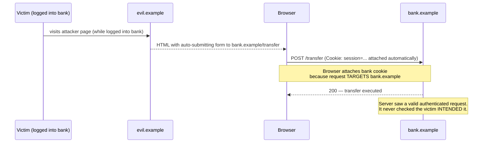
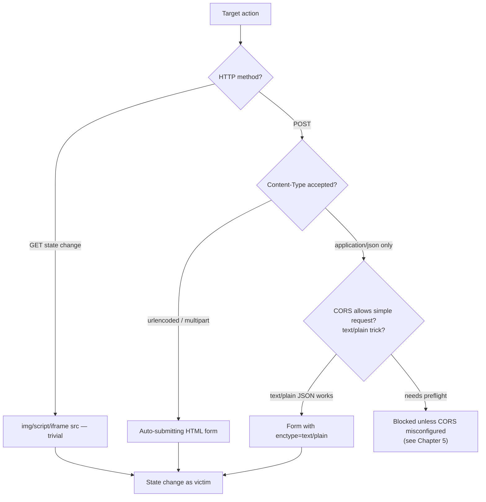
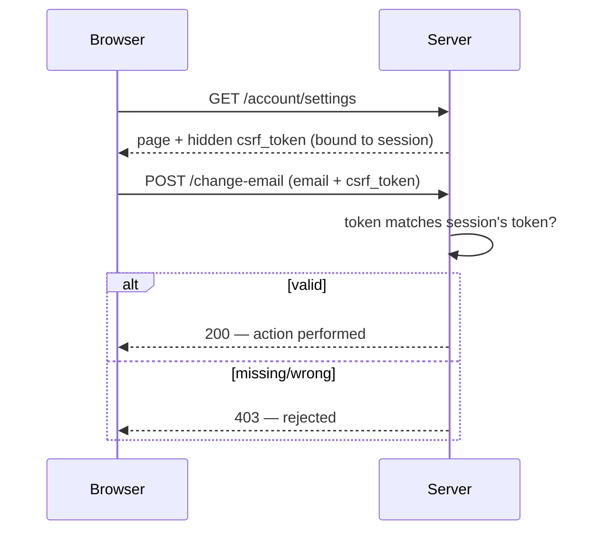
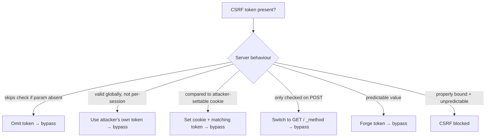
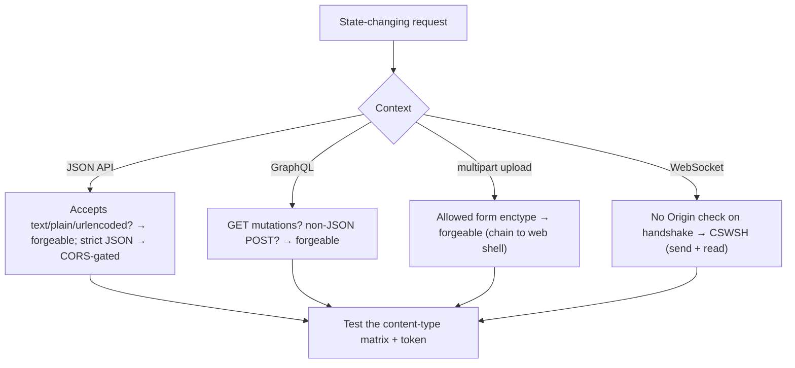
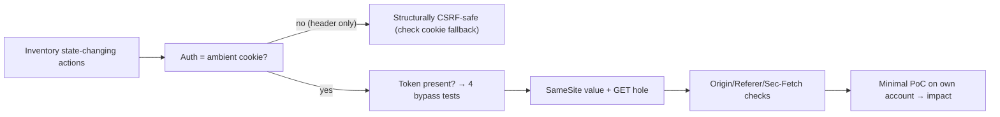

**Level:** Expert · **Track:** Bug Bounty & AppSec · **Read time:** 255 min

This is Chapter 4 of the Client-Side notebook — Notebook 24. Chapters 1–3 were about
Cross-Site Scripting: injecting and then weaponizing script that runs *inside* the target
origin. CSRF is the mirror image. Where XSS gets your code running in the victim's origin,
CSRF never runs in the victim's origin at all — it runs on *your* page, in *your* origin, and
abuses the browser's willingness to attach the victim's credentials to a request aimed at the
target. XSS breaks confidentiality and integrity from the inside; CSRF breaks integrity from
the outside, by riding *ambient authority*.

The core of CSRF is a single, uncomfortable browser behaviour: when any page causes a request
to go to `https://bank.example`, the browser automatically attaches the cookies it holds for
`bank.example` — regardless of which site initiated the request. A form on `evil.example` that
POSTs to `bank.example/transfer` will carry the victim's `bank.example` session cookie. The
server sees a well-formed, fully authenticated request and, unless it checks *intent*, honours
it. The victim did nothing but visit a malicious (or compromised, or ad-serving) page while
logged in.

This chapter builds CSRF from the ground up — what ambient authority is, why the Same-Origin
Policy allows the send, how to forge every common request shape — and then spends most of its
length on defense and defense bypass, because CSRF is one of those bugs where the interesting
work is entirely in the gaps of the mitigations. Everything assumes **authorized** testing:
CSRF PoCs perform real state changes, so you fire them only against accounts and applications
you are permitted to test, and you prove impact against your own test account with the least
destructive action that is convincing.

## Part 1: Ambient Authority — Why CSRF Exists At All

To understand CSRF you must understand *ambient authority*: authority that is exercised
automatically based on who you are, without any explicit act of presenting a credential. Cookie
authentication is ambient. Once `bank.example` has set a session cookie in your browser, you
never again "present" it deliberately — the browser attaches it to *every* request to
`bank.example`, forever, until it expires. You don't choose to send it; it rides along.

That is enormously convenient (you stay logged in) and it is the root cause of CSRF. Contrast
it with *explicit* authority: an `Authorization: Bearer <token>` header that JavaScript must
deliberately attach on each request. Explicit authority is not ambient — a cross-site page
cannot make your browser attach a header it doesn't know — so applications that authenticate
purely with bearer tokens in a header are structurally immune to classic CSRF. Hold that
thought; it is why "we use JWTs in an Authorization header" is a genuine (partial) CSRF
defense, while "we use JWTs in a cookie" is not.



Three preconditions must all hold for a classic CSRF to work, and every defense attacks one of
them:

1. **A relevant action** exists that the attacker wants to induce (change email, transfer
   funds, add an admin, delete a resource).
2. **Cookie-based session handling** — the request is authenticated solely by cookies the
   browser attaches automatically. If auth needs a header the attacker can't set, CSRF fails.
3. **No unpredictable request parameters** — the attacker can determine or fix every parameter
   value. If the request needs a secret the attacker can't know (a CSRF token), it fails.

Remove any one of these and the attack collapses. That framing — three preconditions — is the
single most useful mental model for both finding CSRF and reasoning about whether a given
defense actually works.

## Part 2: The Same-Origin Policy Sends but Does Not Read

Beginners often ask: "doesn't the Same-Origin Policy (SOP) stop this?" The answer requires
precision about what SOP actually restricts. SOP restricts **reading cross-origin responses**.
It does **not** restrict **sending cross-origin requests**. A page on `evil.example` is
perfectly allowed to *send* a `POST` to `bank.example` — it just can't *read what comes back*.

For CSRF, that's fine: the attacker doesn't need to read the response. The goal is a
*side effect* on the server — money moved, email changed, account created. The response is
irrelevant. So SOP, the control people imagine protects them, is exactly the control that
doesn't apply, because CSRF is a write, not a read.

This is also why CSRF is sometimes called a "one-way" or "blind" attack: you fire the request
and cause the effect, but you're blind to the result (unless you can pair it with another bug,
like a CORS misconfiguration — Chapter 5 — that lets you read the response too). The classic
distinction:

| Property | XSS | CSRF |
|---|---|---|
| Where attacker code runs | Inside target origin | On attacker's own page |
| Reads victim data? | Yes (same-origin) | No (blind write) |
| Bypasses SOP read restriction? | N/A (is same-origin) | Doesn't need to |
| Neutralized by CSRF token? | No (reads token from DOM) | Yes (can't guess token) |
| Neutralized by HttpOnly? | Partially | Irrelevant |
| Neutralized by SameSite? | No (same-origin) | Yes (blocks cross-site cookie) |

Notice the complementarity: a CSRF token stops CSRF but not XSS; `SameSite` stops CSRF but not
XSS; `HttpOnly` blunts XSS but does nothing to CSRF. The two bug classes are defended by almost
disjoint controls, which is why an app needs both sets.

## Part 3: Forging a GET-Based CSRF

The simplest CSRF targets an action performed with a `GET` request. Any application that
changes state on `GET` (a design smell in itself) can be attacked with nothing more than an
image tag. Suppose `bank.example` implements email change as:

```text
GET /account/change-email?email=new@example.com
```

A victim who loads this HTML anywhere fires the request with their cookie attached:

```html
<!-- Fires the moment the page loads; no interaction, no visible content. -->

```

The `` tag is ideal because browsers fetch image `src` immediately and cross-origin
without CORS friction — exactly the property that made it a good exfil primitive in Chapter 3,
here used to *send* rather than to exfiltrate. Other tags that auto-fire cross-origin `GET`s:
`<script src>`, `<iframe src>`, `<link rel=stylesheet href>`, `<video src>`, and CSS
`background:url(...)`.

**The lesson for defenders is blunt:** never perform a state change on `GET`. `GET` requests
are attached to images, prefetched by browsers, logged in proxies, and stored in history.
Reserve `GET` for safe, idempotent reads (this is also what the HTTP spec requires). Any bug-
bounty finding of "state change on GET" is worth reporting on its own, because it makes CSRF
trivial and often bypasses defenses tuned only for POST.

## Part 4: Forging a POST-Based CSRF

Real actions usually require `POST`. A cross-site page can still auto-submit a form:

```html
<form id="csrf" action="https://bank.example/account/change-email" method="POST">
  <input type="hidden" name="email" value="attacker@evil.example">
</form>
<script>document.getElementById("csrf").submit();</script>
```

On load, the script submits the form; the browser navigates to `bank.example/change-email`
with the victim's cookie and the attacker-chosen body. To keep it invisible, target a hidden
iframe so the victim's own page doesn't visibly navigate:

```html
<iframe name="sink" style="display:none"></iframe>
<form action="https://bank.example/account/change-email" method="POST" target="sink">
  <input type="hidden" name="email" value="attacker@evil.example">
</form>
<script>document.forms[0].submit();</script>
```

A subtlety that trips people up: an HTML form can only send three `enctype` values —
`application/x-www-form-urlencoded` (default), `multipart/form-data`, and `text/plain`. It
**cannot** natively send `application/json`. This matters because many modern APIs only accept
`Content-Type: application/json` and reject form encodings — which, perhaps accidentally,
provides partial CSRF protection (Part 5). When the endpoint accepts urlencoded or multipart
bodies, the plain HTML form above is all you need.



## Part 5: Content-Type Gymnastics — JSON, text/plain, and Method Override

When an endpoint insists on `Content-Type: application/json`, a naive HTML form can't produce
it — the three allowed `enctype`s don't include JSON. This is where attackers get creative, and
where the CORS *preflight* mechanism becomes the real gatekeeper.

**The `text/plain` trick.** Some frameworks parse the body as JSON regardless of the declared
`Content-Type`, or accept `text/plain`. A form can emit `text/plain`, and you can shape the
field name/value so the raw body is valid JSON:

```html
<form action="https://api.bank.example/transfer" method="POST" enctype="text/plain">
  <!-- The whole JSON is smuggled as one field: name = JSON prefix, value = JSON suffix.
       Browser sends: {"amount":1000,"to":"attacker","x":"=y"}  as text/plain -->
  <input name='{"amount":1000,"to":"attacker","x":"' value='y"}'>
</form>
<script>document.forms[0].submit();</script>
```

The form serializes `name=value` as `{"amount":...,"x":"=y"}`; a lax JSON parser accepts it.
This works **only** if the server accepts `text/plain` (or ignores Content-Type). A strict
server that requires `application/json` forces a *preflighted* CORS request, which a cross-site
page cannot satisfy without an explicit CORS grant — so strict JSON APIs are largely CSRF-safe
by accident. That accident is fragile: a permissive CORS policy (Chapter 5) re-opens it.

**Method override.** Some frameworks let you override the HTTP method via a hidden field or
header — `_method=PUT`, `_method=DELETE`, or `X-HTTP-Method-Override: DELETE`. If the app honours
`_method` in a form body, a plain form can forge `PUT`/`DELETE`/`PATCH` actions that otherwise
require non-simple requests:

```html
<form action="https://bank.example/api/user/42" method="POST">
  <input type="hidden" name="_method" value="DELETE">
</form>
```

| Content-Type / method situation | CSRF via HTML form? | Why |
|---|---|---|
| `application/x-www-form-urlencoded` | Yes | Default form enctype; simple request |
| `multipart/form-data` | Yes | Allowed form enctype; simple request |
| `text/plain` accepted by parser | Yes | `enctype=text/plain` + JSON shaping |
| Strict `application/json` required | No (usually) | Triggers CORS preflight; blocked cross-site |
| `PUT`/`DELETE` with `_method` override | Yes | Form POST + override field |
| Custom header required (e.g. `X-Requested-With`) | No | Cross-site page can't set custom headers on simple requests |

The last row is a key defensive pattern: requiring a custom header (like `X-Requested-With:
XMLHttpRequest`) that only same-origin JavaScript can attach means a cross-site HTML form can't
forge the request, because adding a custom header makes it a non-simple request that needs a
preflight the attacker can't pass.

## Part 6: The Synchronizer Token Pattern — The Canonical Defense

The classic, robust CSRF defense is the **synchronizer token pattern** (also "anti-CSRF
token", "CSRF token"). The server generates an unpredictable, per-session (or per-request)
secret, embeds it in every form/state-changing page, and requires it back on every state-
changing request. A cross-site attacker cannot read the token (SOP blocks reading the target's
response), cannot guess it (it's cryptographically random), and therefore cannot include it —
so the forged request is rejected.

```html
<!-- Server renders this token into the form; JS on the origin can read it, evil.example cannot -->
<form action="/account/change-email" method="POST">
  <input type="hidden" name="csrf_token" value="e2b1a...random...9f4">
  <input name="email">
  <button>Save</button>
</form>
```



The token must satisfy several properties to be secure, and every one of them is a place real
implementations fail (which is the whole of Part 7):

- **Unpredictable:** generated from a CSPRNG, long enough (≥128 bits) that guessing/brute is
  infeasible.
- **Tied to the user's session:** the server must verify the submitted token belongs to *this*
  session, not merely that it is *a* valid token. A token not bound to the session lets an
  attacker use their *own* valid token in the victim's request.
- **Validated on every state-changing request** — including `PUT`/`PATCH`/`DELETE` and JSON
  endpoints, not just classic form POSTs.
- **Not leaked** via `GET` query strings (ends up in logs, Referer headers), and not placed in
  a place the attacker can read cross-origin.

**Where to put the token.** Preferred locations are a hidden form field or a custom request
header (e.g. `X-CSRF-Token`), read by the app's own JavaScript from a `<meta>` tag or a cookie
it controls. Avoid the URL query string — it leaks through Referer and server logs.

## Part 7: How CSRF Token Defenses Actually Fail

Token defenses are only as good as their validation. The recurring real-world failures — each a
live bug-bounty finding:

1. **Token validated only when present.** The server checks the token *if the parameter exists*
   but skips validation if it's absent. Simply **omit** the `csrf_token` field and the check is
   bypassed. Test: remove the parameter entirely (not just blank it).
2. **Token not tied to the session.** The server confirms the token is valid globally but not
   that it belongs to the victim's session. Attacker fetches their *own* token, plants it in the
   victim's forged request — it validates. Test: use account A's token in account B's request.
3. **Token tied to a non-session cookie the attacker can set.** "Double-submit" done wrong: the
   token is compared against a cookie value, and the attacker can set that cookie (via a
   subdomain, a cookie-injection bug, or `Set-Cookie` from a sibling site) to a known value,
   then submit the matching token. Test: can you influence the cookie the token is compared to?
4. **Method-dependent validation.** Token required on `POST` but the same action is reachable via
   `GET` (or via `_method` override) which skips the check. Test: change the method.
5. **Predictable or static tokens.** Token is a hash of the username, a timestamp, or a constant
   — guessable/forgeable. Test: does the token change per session? Is it derived from known data?
6. **Token reflected/leaked.** The token appears in a URL, a `Referer`, or is returned by a
   JSONP/CORS-readable endpoint, so the attacker can read it cross-origin. Test: is the token
   obtainable without same-origin read?



**Bug-bounty relevance:** the "token not tied to session" and "omit the parameter" bypasses are
among the most common accepted CSRF reports on mature programs, precisely because the token
*looks* present and testers assume it's enforced. Always run the four quick tests — omit it,
swap it across sessions, change its value by one char, and change the method — before concluding
an app is CSRF-safe.

## Part 8: SameSite Cookies — The Browser-Level Defense

The `SameSite` cookie attribute is a browser-enforced control that limits when cookies are
attached to cross-site requests. It moved CSRF from "must add a token everywhere" to "the
browser blocks most of it by default," and modern browsers default cookies to `SameSite=Lax`
when the attribute is unset. Understanding its three values and their gaps is essential.

| Value | Cookie sent on cross-site requests? | Effect on CSRF |
|---|---|---|
| `Strict` | Never on any cross-site request | Strong; but breaks legitimate cross-site navigation (following a link logs you out until you click again) |
| `Lax` | Only on **top-level GET navigations** (clicking a link, typing URL) | Blocks cross-site POST/iframe/img forgery; leaves a top-level-GET hole |
| `None` | Always (must also be `Secure`) | No CSRF protection from SameSite; required for legit cross-site cookies |

**`SameSite=Lax` — the default, and its hole.** `Lax` sends the cookie on *top-level GET
navigations*: when the user clicks a link or the browser navigates the top window to the target
via `GET`. It does **not** send the cookie on cross-site `POST`s, form submissions to iframes,
`img`/`script` subresource requests, or `fetch`/XHR. This kills the Part 4 POST-form CSRF
outright. But it leaves the **top-level GET hole**: if a sensitive action is reachable via a
top-level `GET` navigation, `Lax` *will* attach the cookie. That is why "state change on GET"
(Part 3) is doubly dangerous — it defeats `Lax`.

```html
<!-- Against a SameSite=Lax cookie, a cross-site top-level GET navigation STILL carries the cookie -->
<script>window.location = "https://bank.example/account/change-email?email=attacker@evil.example";</script>
```

**The Lax "2-minute" grace window (historical, browser-specific).** Some Chromium versions, to
avoid breaking sites during rollout, treated brand-new cookies without an explicit `SameSite`
as `None` for the first ~2 minutes after being set. If a POST CSRF fired within that window
right after login, it could succeed against cookies that "look" Lax-defaulted. This is a
transient, version-dependent behaviour — never rely on a target having it — but it explains why
some CSRF PoCs work only immediately post-login. Explicitly setting `SameSite=Lax`/`Strict`
removes the grace entirely.

**`SameSite=None; Secure`** turns SameSite protection *off* — it's needed for legitimately
cross-site cookies (third-party embeds, SSO) but provides no CSRF defense, so such cookies must
be backed by tokens.

**Why SameSite is necessary but not sufficient.** SameSite is defence-in-depth, not a complete
control: the top-level-GET hole, sibling/subdomain cookie scoping, older browsers that ignore
the attribute, and `SameSite=None` cookies all leave gaps. The robust posture is **SameSite
(Lax/Strict) + a synchronizer token + no state changes on GET**, layered.

## Part 9: Origin and Referer Header Validation

A lightweight server-side defense is to check the `Origin` (and, as fallback, `Referer`)
header of state-changing requests and reject those not from an allowed origin. The browser sets
`Origin` on all POST/CORS requests and the attacker cannot forge it (it's a forbidden header
for JavaScript to set), so it's a reliable signal.

```python
def check_origin(request):
    origin = request.headers.get("Origin") or request.headers.get("Referer")
    if not origin or not origin.startswith("https://bank.example"):
        abort(403)   # cross-site or missing — reject
```

Two classic pitfalls, both real bugs:

- **Naive `startswith`/substring matching.** `origin.startswith("https://bank.example")` also
  matches `https://bank.example.evil.com`. And a contains-check for `bank.example` matches
  `https://evil.com/bank.example`. Always parse the URL and compare the *host* exactly (plus
  scheme), never substring.
- **Fail-open on missing header.** If the code allows the request when `Origin`/`Referer` is
  absent (some privacy setups strip Referer), an attacker who can suppress the header
  (`Referrer-Policy: no-referrer`, `rel=noreferrer`, `data:`/`blob:` origins) bypasses it. Fail
  *closed* for state-changing requests.

```html
<!-- Suppress Referer so a Referer-only check that fails open lets the request through -->
<meta name="referrer" content="no-referrer">
<form action="https://bank.example/account/change-email" method="POST"> ... </form>
```

## Part 10: CSRF in SPAs, APIs, and Bearer-Token Apps

Modern single-page apps often authenticate with a bearer token in an `Authorization` header
rather than a cookie. As noted in Part 1, this makes them structurally CSRF-resistant: a cross-
site page cannot make the browser attach an `Authorization` header it doesn't know. But three
caveats keep CSRF alive in "modern" stacks:

- **Cookie fallback.** If the API *also* accepts the token from a cookie for convenience, ambient
  authority is back and CSRF applies. Check whether the endpoint authenticates on cookie alone.
- **Token in a readable cookie / localStorage** shifts the risk to XSS (Chapter 3), not CSRF —
  but if the app copies a cookie value into the header server-side, the request is cookie-
  authenticated and forgeable.
- **Custom-header requirement as defense.** Requiring `X-Requested-With: XMLHttpRequest` or
  `X-CSRF-Token` on every state change is a solid SPA defense: same-origin JS can set it, a
  cross-site simple request cannot, and setting it forces a preflight the attacker can't pass.

**GraphQL note:** GraphQL endpoints that accept `application/x-www-form-urlencoded` or
`text/plain` bodies (some do, for query params) are CSRF-forgeable exactly like any form
endpoint; those that strictly require `application/json` inherit the preflight protection.
Always test what content types a GraphQL endpoint actually accepts.

## Part 11: Clickjacking — CSRF's UI-Redress Cousin

Clickjacking (UI redressing) achieves a similar goal — inducing an unintended authenticated
action — but through *tricking the user's click* rather than forging a request body. The
attacker frames the real target site in a transparent iframe over decoy content; the victim
thinks they're clicking the attacker's button but actually clicks the framed app's "Delete
account" or "Confirm transfer" button, with their real session.

```html
<style>
  iframe { position:absolute; top:0; left:0; width:100%; height:100%; opacity:0.0001; z-index:2; }
  #decoy { position:absolute; top:300px; left:120px; z-index:1; }
</style>
<div id="decoy">Click here to win!</div>
<iframe src="https://bank.example/account/delete-confirm"></iframe>
```

Clickjacking defeats CSRF tokens (the request is genuine, made by the real app in a real frame)
and is defended differently: **`X-Frame-Options: DENY`** or the modern **CSP
`frame-ancestors 'none'`** tells the browser to refuse to render the app in a frame, killing
the overlay. SameSite `Lax`/`Strict` also helps because the framed request is cross-site. Bug-
bounty programs frequently accept clickjacking on sensitive actions when framing isn't blocked —
demonstrate it with a working overlay PoC on a non-destructive action.

## Part 12: Hands-On Lab — Forging, Bypassing, and Blocking CSRF

This lab uses a deliberately vulnerable Flask app you own, plus PortSwigger's CSRF labs for the
token-bypass drills. Everything is local and self-contained.

### 12.1 The vulnerable app

```python
# csrf_app.py — INTENTIONALLY VULNERABLE. Lab only.
from flask import Flask, request, make_response, redirect, session
app = Flask(__name__); app.secret_key = "lab"
USER = {"email": "victim@lab.local"}

@app.route("/login")
def login():
    session["uid"] = 1
    return "logged in"

@app.route("/account/settings")
def settings():
    # CSRF token exists but (bug) is NOT tied to the session and NOT required if absent
    return f'''<form method=post action=/change-email>
      <input name=csrf value=static-weak-token>
      <input name=email value={USER["email"]}></form>'''

@app.route("/change-email", methods=["GET","POST"])   # bug: also accepts GET
def change_email():
    tok = request.values.get("csrf")
    if tok is not None and tok != "static-weak-token":   # bug: only checks WHEN present
        return "bad token", 403
    if "uid" not in session:
        return "not auth", 401
    USER["email"] = request.values.get("email", USER["email"])
    return f"email now {USER['email']}"

if __name__ == "__main__": app.run(port=5000)
```

Log in once at `http://127.0.0.1:5000/login`.

### 12.2 Exploit 1 — omit-the-token bypass (POST)

The server only validates the token *when present*. Host this on a different origin (e.g.
`python3 -m http.server 9000` serving `poc.html`):

```html
<form action="http://127.0.0.1:5000/change-email" method="POST">
  <input type="hidden" name="email" value="attacker@evil.local">
  <!-- no csrf field at all -->
</form>
<script>document.forms[0].submit();</script>
```

Loading `http://127.0.0.1:9000/poc.html` while logged in changes the email. Verify:

```bash
curl -s --cookie "session=<your-session>" http://127.0.0.1:5000/account/settings | grep value=
# -> ...value=attacker@evil.local...
```

### 12.3 Exploit 2 — GET-based bypass (defeats SameSite=Lax)

Because the endpoint also accepts `GET`, a top-level navigation forges it even against a
`Lax` cookie:

```html
<script>location = "http://127.0.0.1:5000/change-email?email=attacker2@evil.local";</script>
```

### 12.4 PortSwigger drills (token bypasses)

Run these labs to practice the Part 7 failures against realistic apps:

```text
- "CSRF vulnerability with no defenses"                 → Part 4 baseline
- "CSRF where token validation depends on request method"→ Part 7 #4 (method)
- "CSRF where token validation depends on token being present" → Part 7 #1 (omit)
- "CSRF where token is not tied to user session"        → Part 7 #2 (swap tokens)
- "CSRF where token is tied to non-session cookie"      → Part 7 #3 (cookie inject)
- "CSRF where token is duplicated in cookie"            → double-submit done wrong
- "SameSite Lax bypass via method override"             → Part 8 top-level-GET/override
```

Each PortSwigger lab gives you a victim bot and an "exploit server" to host the PoC — the exact
workflow you'd use to demonstrate CSRF in a real report.

### 12.5 The fix, demonstrated

Harden the app and re-run the exploits to watch them fail:

```python
import secrets
@app.route("/account/settings")
def settings():
    session["csrf"] = secrets.token_urlsafe(32)          # per-session, unpredictable
    return f'<form method=post action=/change-email><input name=csrf value={session["csrf"]}>...'

@app.route("/change-email", methods=["POST"])            # POST only — no GET state change
def change_email():
    if request.form.get("csrf") != session.get("csrf"):   # required AND session-bound
        return "bad token", 403
    ...
```

With a per-session token that is always required and validated, plus POST-only routing and a
`SameSite=Lax` cookie, both exploits now return `403`/`bad token`.

## Part 13: CSRF in Specific Contexts — JSON APIs, GraphQL, File Upload, WebSockets

CSRF's mechanics shift with the request shape and technology, and each context has its own testing
nuances beyond the basic form POST.

**JSON API CSRF in depth.** As Part 5 showed, a plain HTML form can't natively emit
`application/json`, and strict JSON endpoints inherit the CORS-preflight protection. But test these
before concluding safety: does the endpoint *actually* require `application/json`, or does it also
accept `text/plain`/urlencoded (many frameworks parse the body regardless of `Content-Type`)? Does it
validate the `Content-Type` at all? If it accepts `text/plain`, the JSON-shaping form trick applies; if
it truly requires JSON *and* validates it, the request becomes non-simple and CORS blocks the
cross-site attempt — unless a permissive CORS policy (Notebook 24 Ch5) re-opens it. The full test
matrix: send the forged request as urlencoded, as `text/plain` with JSON-shaped body, and as multipart,
and see which the server honours.

**GraphQL CSRF.** GraphQL endpoints are a frequent CSRF blind spot. A GraphQL server that accepts
queries/mutations over `GET` (some enable this for queries) is CSRF-able via a simple ``/link; one
that accepts `application/x-www-form-urlencoded` or `text/plain` POST bodies (rather than strictly
`application/json`) is forgeable with an HTML form. Test whether the GraphQL endpoint accepts non-JSON
content types and whether *mutations* (state changes) are reachable via GET — both are real, accepted
findings. The defense is the same as REST: require `application/json`, validate `Content-Type`, and add
a CSRF token or custom-header requirement.

**File-upload CSRF.** Multipart (`multipart/form-data`) is an allowed form enctype, so a cross-site page
can forge a file upload as the victim — planting a file, changing an avatar, or (chained with the upload
bugs of Notebook 26 Ch2) uploading a web shell *as the victim*. Upload endpoints protected only by
session cookies and no CSRF token are vulnerable; test by building a cross-site auto-submitting
multipart form.

**Cross-Site WebSocket Hijacking (CSWSH).** The WebSocket analogue of CSRF (introduced in Notebook 24
Ch5): a WebSocket handshake carries the victim's cookies ambiently and is **not** governed by CORS, so a
server that doesn't validate the `Origin` header on the handshake lets an attacker page open an
authenticated socket and both send and read messages. It's "CSRF that can also read the responses,"
making it more powerful than classic blind CSRF. Test every `ws://`/`wss://` endpoint from a foreign
origin.



**Login and logout CSRF revisited.** *Login CSRF* — forcing a victim to authenticate as the *attacker*
— deserves its own test: it lets the attacker's account capture the victim's activity (saved payment
methods, search history, uploaded files) which the attacker later retrieves by logging into their own
account. It's defended by putting a CSRF token on the *login* form too (many apps forget this). *Logout
CSRF* is a nuisance-level DoS. Both are legitimate, if lower-severity, findings worth including.

## Part 14: A CSRF Testing Methodology

CSRF is found by walking every state-changing action through a fixed set of checks. Randomly trying a
PoC misses the token-bypass subtleties; the routine below is thorough.

**1. Inventory state-changing actions.** Map every request that changes server state — profile/email/
password changes, transfers, admin actions, adds/deletes, settings, uploads. Read-only requests aren't
CSRF targets; state changes are. Prioritise the high-impact ones (email/password → ATO).

**2. Identify the authentication mechanism.** Is the request authenticated by an *ambient* cookie
(CSRF-relevant) or an explicit `Authorization` header the attacker can't set (structurally CSRF-safe)?
Check whether an API with header auth *also* accepts cookie auth (the fallback that reopens CSRF).

**3. Check for anti-CSRF tokens and test them properly.** If a token is present, run the four tests
from Part 7: **omit** the parameter entirely, **swap** it across two sessions, **mutate** one character,
and **change the method** (POST→GET, `_method` override). Also check whether the token is validated on
JSON/PUT/DELETE paths, not just classic POST.

**4. Check `SameSite` and the GET hole.** Inspect the session cookie's `SameSite` value; if `Lax`
(or default), look for a state-changing action reachable via top-level `GET` navigation (the Part 8
hole). If `None`, expect no SameSite protection.

**5. Check Origin/Referer/Sec-Fetch validation.** Remove/spoof `Origin` and `Referer`; test whether a
missing header fails open, and whether the host check is substring-based (bypassable).

**6. Build the minimal PoC and prove impact.** Construct the cross-site auto-submitting form/`img`,
fire it against your *own* test account, and demonstrate the concrete effect (email changed,
confirmation email received). Frame severity by the action.



This routine turns CSRF testing into coverage rather than a one-off PoC attempt, and it doubles as a
defensive checklist: an action that passes every step (token required+session-bound+all-methods,
`SameSite`, no GET state change, Origin validation, step-up for sensitive actions) is properly
defended.

## Part 15: Real-World Impact, CVEs & Escalation

CSRF ranges from nuisance to catastrophic depending on the action it forges. The escalation
logic mirrors the sensitivity of the endpoint:

- **Account takeover via email/password change.** The highest-value CSRF: forge a change-email
  or change-password with no old-password requirement, then reset. This is the CSRF analogue of
  the XSS ATO from Chapter 3, and lands as High/Critical.
- **Privilege escalation.** Forge "add me as admin", "grant role", or "invite user" on an admin
  panel that lacks token protection.
- **Financial actions.** Fund transfers, adding a payee, changing payout details.
- **Configuration/security downgrade.** Disable MFA, change security questions, add an OAuth app,
  register an API key — CSRF that weakens future defenses.
- **Login/logout CSRF.** *Login CSRF* forces a victim to log into an *attacker-controlled*
  account so their activity (saved cards, searches) accrues to the attacker; *logout CSRF* is a
  nuisance DoS. Both are real, lower-severity findings.

Historically, CSRF was an OWASP Top 10 mainstay for years; it dropped out of the 2017 list
largely because frameworks began shipping token defenses and browsers rolled out `SameSite`
defaults — a rare case of a bug class being substantially mitigated by ecosystem change rather
than by every developer fixing it. It persists mainly in: legacy endpoints, misimplemented
tokens (Part 7), `GET`-based actions, `SameSite=None` cookies, and APIs with cookie fallback.
Router/IoT admin panels remain a rich CSRF target (BeEF ships router-CSRF modules for exactly
this) because embedded web UIs rarely implement tokens.

**Bug-bounty relevance:** severity hinges on the action. A CSRF logout is Low; a CSRF that
changes the account email with no re-auth is High/Critical. Write the report around the *impact
of the specific action*, include a self-contained HTML PoC that works against your own test
account, and note whether SameSite/tokens are absent or bypassable and how.

## Part 16: Detection & Defense Angle

Defense is layered; no single control is complete. In priority order:

**1. Synchronizer tokens, correctly implemented (Part 6–7).** Per-session (or per-request),
CSPRNG-generated, always required, always validated *against the session*, on every state-
changing method. Use your framework's built-in (Django `CsrfViewMiddleware`, Rails
`protect_from_forgery`, Spring Security CSRF, ASP.NET antiforgery) rather than rolling your own —
the DIY failures in Part 7 are exactly what frameworks get right.

**2. `SameSite=Lax` (or `Strict`) on session cookies (Part 8).** Default to `Lax`; use `Strict`
for the most sensitive cookies where cross-site navigation UX cost is acceptable. Never use
`SameSite=None` for session cookies unless genuinely required, and if you do, back it with tokens.

**3. No state changes on `GET`.** Enforce method discipline: `GET` is safe/idempotent only. This
closes the `Lax` top-level-GET hole and the img/script forgery vector at once.

**4. Origin/Referer validation (Part 9), fail-closed, exact host match.** A cheap
defence-in-depth layer; parse and compare hosts, reject on missing header for state changes.

**5. Custom-header requirement for APIs/SPAs (Part 10).** Require `X-CSRF-Token` or
`X-Requested-With` on state changes; cross-site simple requests can't set them.

**6. Re-authentication / step-up for sensitive actions.** Require the current password or an MFA
prompt to change email/password/payout — this defeats CSRF *and* the XSS ATO from Chapter 3.

**7. `X-Frame-Options: DENY` / CSP `frame-ancestors 'none'`** to kill clickjacking (Part 11).

**Reference: framework CSRF protection done right.** The strongest, least-error-prone defense is a
framework's built-in token middleware plus a `SameSite` cookie — don't hand-roll it. Concretely:

```python
# Django — CsrfViewMiddleware is on by default; forms include , and AJAX sends the
# X-CSRFToken header. SameSite is set in settings:
SESSION_COOKIE_SAMESITE = "Lax"; CSRF_COOKIE_SAMESITE = "Lax"; SESSION_COOKIE_SECURE = True
```

```javascript
// Express — csrf middleware issues a per-session token; require it on state-changing routes, and set
// the session cookie SameSite=Lax + Secure. For SPAs, require a custom header the token rides in.
app.use(require("csurf")());
app.use((req, res, next) => { res.cookie("XSRF-TOKEN", req.csrfToken(), {sameSite:"lax", secure:true}); next(); });
```

```text
Spring Security / Rails / ASP.NET all ship CSRF protection ON by default (Spring: CsrfFilter;
Rails: protect_from_forgery with: :exception; ASP.NET: antiforgery tokens). The recurring bug is
DISABLING it "to make the API work" instead of sending the token from the front end — never disable it;
send the token via a header for JSON/SPA clients.
```

The lesson these encode: the frameworks get the Part-7 subtleties (per-session binding, all-methods
validation, timing-safe comparison) right, so the correct posture is *use the built-in and configure
`SameSite`*, never a bespoke token check. The most common real-world CSRF regression is a developer
disabling the framework's protection for an API endpoint rather than wiring the token through the
client.

**Detection signals:**

| Signal | Where | Indicates |
|---|---|---|
| State-changing requests with cross-site/absent `Origin`/`Referer` | Access logs, WAF | Forgery attempts |
| Spikes of identical POSTs to sensitive endpoints from varied `Referer` | App logs | Mass CSRF campaign |
| 403s from token middleware clustering on one endpoint | App/WAF logs | Probing a token bypass |
| Email/password changes lacking the normal multi-step UI flow | Audit log | Successful CSRF ATO |
| Requests to admin actions framed by unknown parent (via `Sec-Fetch-*`) | Logs | Clickjacking |

**`Sec-Fetch-*` metadata headers** (`Sec-Fetch-Site: cross-site`, `Sec-Fetch-Mode: navigate`)
are a modern, high-signal server-side input: browsers set them automatically and JS can't forge
them, so `Sec-Fetch-Site: cross-site` on a state-changing request is a strong CSRF indicator you
can block on. **IR use case:** when investigating a suspicious account change, pull the request's
`Origin`/`Referer`/`Sec-Fetch-Site` from logs — cross-site values on a sensitive POST point to
CSRF rather than a legitimate action or a session-riding XSS.

## Part 17: Common Pitfalls & Gotchas

- **Assuming a visible token means protection.** Run the four tests (omit, swap across sessions,
  mutate value, change method) — a rendered token is often not enforced correctly.
- **Substring `Origin` checks.** `startswith("https://bank.example")` matches
  `bank.example.evil.com`. Parse and compare host exactly.
- **Forgetting JSON endpoints can be CSRF-able** via `text/plain` shaping when the parser is lax
  or CORS is permissive — don't assume "it's JSON so it's safe."
- **Trusting `SameSite` alone.** The top-level-GET hole, `SameSite=None` cookies, and old
  browsers leave gaps. Layer tokens on top.
- **State changes on GET.** Defeats SameSite=Lax and enables img-tag forgery. Never do it.
- **Mixed content / cookie scope.** A cookie scoped to a parent domain (`Domain=example.com`) is
  attached to all subdomains — a CSRF or cookie-injection foothold on any subdomain can matter.
- **CORS as a false comfort.** CORS restricts *reading* responses, not *sending* — a permissive
  CORS policy can actually *worsen* CSRF by enabling non-simple forged requests (Chapter 5).
- **Login CSRF ignored.** Forcing a victim into an attacker's session is a real, often-missed
  bug; protect the login form with a token too.

## Part 18: Final Revision / Summary

- CSRF abuses **ambient authority** (Part 1): the browser auto-attaches cookies to any request
  targeting the origin, so a cross-site page can forge authenticated state changes.
- The **Same-Origin Policy blocks reading responses, not sending requests** (Part 2) — CSRF is a
  blind write, so SOP doesn't stop it.
- **GET CSRF** (Part 3) is trivial via ``; **POST CSRF** (Part 4) via auto-submitting forms;
  JSON endpoints resist unless `text/plain` shaping or lax parsing/CORS lets you through (Part 5).
- The **synchronizer token** (Part 6) is the canonical defense; it fails when not required, not
  session-bound, predictable, method-dependent, or leaked (Part 7) — always test those.
- **`SameSite`** (Part 8) blocks most cross-site cookie attachment: `Lax` (default) still allows
  top-level GET navigations (the hole), `Strict` is stronger but breaks cross-site UX, `None`
  offers no protection.
- **Origin/Referer checks** (Part 9) and **custom-header requirements** (Part 10) add layers;
  **clickjacking** (Part 11) is a UI-redress cousin defeated by `frame-ancestors`/`X-Frame-Options`.
- Robust posture = **framework CSRF token + SameSite + no GET state changes + step-up auth on
  sensitive actions + Origin/Sec-Fetch validation** (Part 16), layered, never single.
- **Context matters** (Part 13): JSON/GraphQL endpoints are forgeable when they accept non-JSON content
  types; multipart uploads are CSRF-able (and chain to web shells); WebSocket handshakes need explicit
  `Origin` validation (CSWSH); and the **login form** itself needs a token (login CSRF).
- A fixed **testing methodology** (Part 14) — inventory state changes, check ambient auth, run the four
  token-bypass tests, check SameSite/GET-hole and Origin validation, then prove impact on your own
  account — turns CSRF review into coverage rather than a one-off PoC.

## Part 19: Cheat Sheet / Quick Reference

**Forge GET**

```html

```

**Forge POST (urlencoded)**

```html
<form action="https://target/action" method="POST">
  <input type="hidden" name="param" value="value"></form>
<script>document.forms[0].submit();</script>
```

**Forge JSON via text/plain**

```html
<form action="https://target/api" method="POST" enctype="text/plain">
  <input name='{"key":"value","x":"' value='y"}'></form>
<script>document.forms[0].submit();</script>
```

**Token bypass tests**

| Test | How | Catches |
|---|---|---|
| Omit token | Remove the param entirely | "validate only if present" |
| Cross-session swap | Use account A's token in B's request | "not tied to session" |
| Mutate token | Change one char | weak/partial validation |
| Change method | POST→GET, add `_method` | method-dependent checks |
| Strip Referer | `<meta name=referrer content=no-referrer>` | fail-open Referer check |
| Content-type swap | urlencoded / `text/plain` JSON-shape / multipart | strict-JSON assumption |
| GET the mutation | `` on a GET-accepting endpoint | SameSite=Lax + GET state change |
| Multipart upload | cross-site auto-submit `multipart/form-data` | upload endpoint w/o token |

**Defense quick map**

| Control | Stops | Header/Setting |
|---|---|---|
| Synchronizer token | Forged body (can't guess token) | hidden field / `X-CSRF-Token` |
| `SameSite=Lax/Strict` | Cross-site cookie attach | `Set-Cookie: ...; SameSite=Lax` |
| No GET state change | img/nav forgery, Lax hole | routing/method discipline |
| Origin/Sec-Fetch check | Cross-site sends | `Sec-Fetch-Site: cross-site` → 403 |
| Custom header required | Simple-request forgery | `X-Requested-With` |
| `frame-ancestors 'none'` | Clickjacking | CSP / `X-Frame-Options: DENY` |
| Step-up re-auth | Sensitive-action forgery | password/MFA prompt |
| Validate `Content-Type` (require JSON) | JSON/GraphQL forgery via text/plain | reject non-JSON on APIs |
| Origin check on WS handshake | CSWSH | reject cross-site `Origin` on `wss://` |
| CSRF token on login form | login CSRF | token on authentication too |

## Part 20: Practice Labs & Resources

- **PortSwigger Web Security Academy — CSRF (all labs):** the definitive drills — "no defenses",
  "token validation depends on request method", "…depends on token being present", "token not
  tied to user session", "token tied to non-session cookie", "token duplicated in cookie",
  "SameSite Lax bypass via method override", "SameSite Strict bypass via client-side redirect",
  and "CSRF where Referer validation depends on header being present". Each maps directly onto
  Parts 4, 7, 8, and 9. Free, with exploit-server + victim bot.
- **PortSwigger — Clickjacking labs:** basic and prefilled-form clickjacking for Part 11.
- **TryHackMe — "CSRF" and "OWASP Top 10" rooms:** guided introductions with a target.
- **OWASP Juice Shop / DVWA / bWAPP:** self-hosted apps with CSRF challenges of varying token
  strength — ideal for the Part 12 forge-then-fix workflow end to end.
- **OWASP CSRF Prevention Cheat Sheet & OWASP Testing Guide (WSTG-SESS-05):** the authoritative
  defense and test references.
- **Disclosed HackerOne reports (filter `csrf`):** study accepted CSRF-to-ATO write-ups to learn
  impact framing and PoC construction.

**Practice questions**

1. An endpoint accepts `application/json` only and the app has no CSRF token. Explain precisely
   why a plain HTML form usually cannot attack it, the one server-side behaviour that would make
   it exploitable via `enctype=text/plain`, and how a permissive CORS policy changes the picture.
2. A cookie is set `SameSite=Lax`. Describe an action design that is still CSRF-able against it,
   and the single routing rule that would close the hole.
3. You find a CSRF token that stays identical across two different user sessions. What bug class
   is this, how do you prove exploitability with two test accounts, and what severity does the
   forged action determine?
4. Contrast why a synchronizer token stops CSRF but not XSS, and why `SameSite` stops CSRF but
   not XSS — and what that implies about defending an app against both.
5. Given server logs, list the specific request headers you'd inspect to distinguish a
   legitimate email change from a CSRF-forged one, and what value of each header would confirm
   forgery.
6. A GraphQL endpoint authenticates via a session cookie. Describe the two properties you'd test to
   determine whether its mutations are CSRF-forgeable, and the server-side configuration that makes it
   safe.
7. Explain login CSRF: what the attacker forces, why it's harmful even though the victim ends up in the
   *attacker's* account, and the single defense that prevents it.
8. A WebSocket endpoint streams a user's private data. Explain why `SameSite` and CORS do not protect
   the handshake, what CSWSH lets the attacker do that classic CSRF cannot, and the server-side check
   that fixes it.

With this chapter and the CORS chapter that follows, the Client-Side notebook covers the full arc of cross-origin trust: XSS runs code in your origin, CSRF forges requests into it, and CORS governs who may read its responses — three complementary controls that must all be correct, since each defends against attacks the others do not.

---

*Also on [Praneeth's portfolio](https://ping-praneeth.vercel.app/notebook/appsec-client-side/04-cross-site-request-forgery-csrf-and-samesite-defenses), with comments and the latest edits.*
