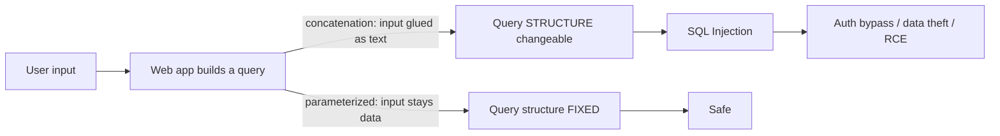
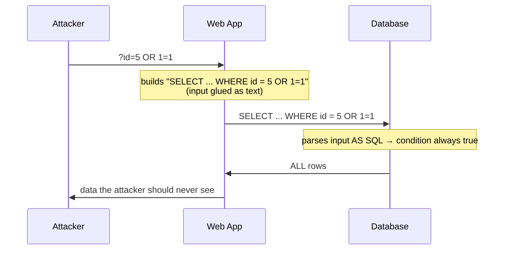
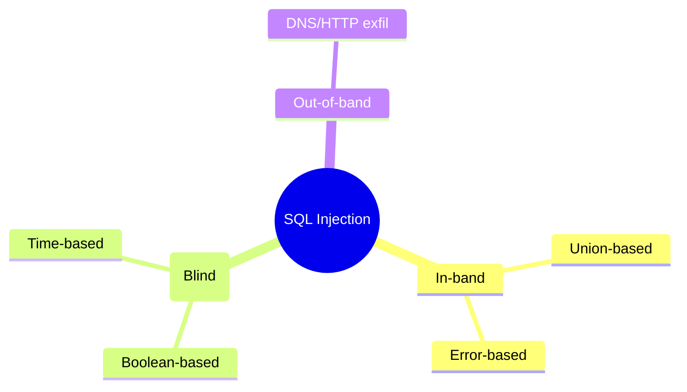
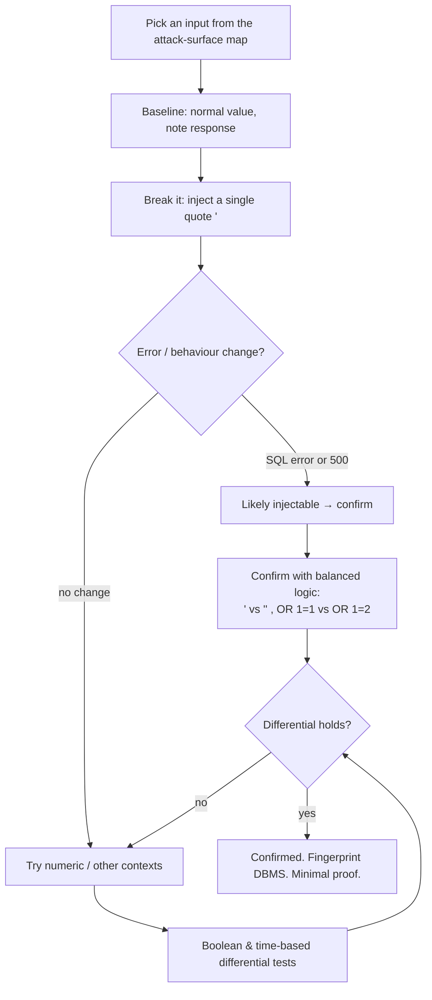

This is Chapter 1 of the Injection notebook — Notebook 23. The Web Tooling notebook
that preceded it gave you the instruments (Burp, ZAP, ffuf, Nuclei) and the map (the
OWASP Top 10 and attack-surface mapping). Now you begin exploiting a single, storied
class from that map — **A03: Injection** — starting with its most famous member,
**SQL injection (SQLi)**. SQLi has been near the top of every web-vulnerability list
for over two decades, has caused some of the largest breaches in history, and remains a
regular, high-paying bug-bounty finding. It is also the perfect first exploitation
topic because it teaches the single most important idea in all of application security:
**what happens when untrusted input is allowed to change the *structure* of a command
instead of just its *data*.**

This part deliberately does **not** rush to exploitation. It builds the foundation a
beginner needs — what a database is, what SQL is, and precisely how a web app's code
turns your input into a broken query — and then teaches the professional skill that
actually matters first: **reliably discovering and confirming** an injection point,
safely and non-destructively, in the many contexts where it hides. The exciting parts —
UNION-based data extraction, blind/inferential automation, `sqlmap`, WAF bypass, and the
defenses — are the subject of the following chapters. You cannot exploit what you can't
find and confirm, and most beginners fail at *finding*, so we master that here. Scope
and the Chapter-1-of-this-track ethics govern throughout: on a real program you confirm
with the minimum (a `version()` string, a boolean difference), you do **not** dump
customer data.

## Why This Matters

Consider a login form. You type a username and password; the server checks them against
a database. Under the hood, the app builds a **query** — a sentence in the database's
language, SQL — that says "find the user whose name is X and password is Y." If the app
builds that sentence by **gluing your input directly into it as text**, then your input
isn't just *data* the query operates on — it can become *part of the query's grammar*.
Type the right characters and you can rewrite the sentence: turn "find the user where
name = 'admin' and password = 'whatever'" into "find the user where name = 'admin' — and
ignore the rest," logging in as admin with no password.

That is the whole terror and elegance of injection: a boundary that was supposed to
separate *code* (the query the developer wrote) from *data* (the input you supply) has
collapsed, and you are now writing code in someone else's database. From there flows
authentication bypass, dumping every user's credentials, reading arbitrary files,
sometimes executing operating-system commands. Understanding SQLi deeply is
understanding the master pattern behind XSS, command injection, SSTI, LDAP injection,
and more — they are all the same collapse of the code/data boundary in different
interpreters. Learn it once, here, properly.



## Part 1: What Is a Database? (From Zero)

A **database** is an organised store of data that a program can query efficiently. The
kind behind most web apps is a **relational database**, managed by a **relational
database management system (RDBMS)** — MySQL, PostgreSQL, Microsoft SQL Server (MSSQL),
Oracle, or the file-based SQLite. "Relational" means the data lives in **tables**: grids
of **rows** (records) and **columns** (fields), like a spreadsheet.

A `users` table might look like:

| id | username | email | password_hash | is_admin |
| --- | --- | --- | --- | --- |
| 1 | admin | admin@site.com | $2b$12$... | 1 |
| 2 | alice | alice@site.com | $2b$12$... | 0 |
| 3 | bob | bob@site.com | $2b$12$... | 0 |

A real database has **many** tables (`users`, `products`, `orders`, `sessions`), and a
special catalogue of tables — the **information schema** — that describes all the other
tables and columns (crucial for exploitation later). Each RDBMS also has **built-in
functions** that reveal things about itself: `version()`, `current_user`, `database()`.
These "who and what am I" functions are how a tester confirms an injection and
fingerprints the DBMS with minimal, harmless proof.

## Part 2: What Is SQL? (The Minimum You Need)

**SQL (Structured Query Language)** is the language programs use to talk to a relational
database. You'll mostly meet the `SELECT` statement, which *reads* data. Its shape:

```sql
SELECT column1, column2      -- which columns you want
FROM   tablename             -- which table
WHERE  condition             -- which rows (filter)
ORDER BY column              -- sort
LIMIT  n;                    -- how many rows
```

Concrete example — fetch one product by id:

```sql
SELECT id, name, price FROM products WHERE id = 5;
```

The pieces you must understand for injection:

- **Strings** are wrapped in single quotes: `WHERE username = 'alice'`. The quote is the
  delimiter that says "text starts/ends here." Breaking out of that quote is the essence
  of string-context SQLi.
- **`WHERE`** filters rows by a condition. Conditions combine with **`AND`** / **`OR`**.
  `WHERE 1=1` is always true; `WHERE 1=2` is always false — the basis of boolean tests.
- **Comments** end the rest of a line so the database ignores it:
  - `-- ` (two dashes and a space) — standard SQL line comment.
  - `#` — MySQL line comment.
  - `/* ... */` — inline/block comment.
  Comments are how an attacker chops off the part of the developer's query that comes
  *after* their injection.
- **`UNION SELECT`** glues the results of a second `SELECT` onto the first, letting an
  attacker return *their own chosen data* (the subject of Part-2 exploitation).
- **`;`** ends a statement; some drivers allow **stacked queries** (a second full
  statement after a semicolon), which enables writes/`DROP` — but many web APIs don't
  allow stacking, an important nuance later.

That's genuinely enough SQL to understand discovery. You'll deepen `UNION` and the
information schema in the exploitation chapter.

## Part 3: How Web Apps Build Queries — and Where It Goes Wrong

A web app doesn't have hardcoded queries; it builds them using your input. Here is the
**vulnerable** pattern, in PHP for clarity (every language has the equivalent):

```php
// VULNERABLE: user input concatenated straight into the SQL string
$id = $_GET['id'];
$sql = "SELECT id, name, price FROM products WHERE id = " . $id;
$result = $db->query($sql);
```

If you request `?id=5`, the query is `... WHERE id = 5` — fine. But the app built the
query by **string concatenation**, pasting your `id` in as raw text. So if you request
`?id=5 OR 1=1`, the query becomes:

```sql
SELECT id, name, price FROM products WHERE id = 5 OR 1=1
```

`OR 1=1` is always true, so the `WHERE` now matches **every row** — you've changed the
query's *meaning* by supplying input that became *code*. That is SQL injection. The
string-context version, with quotes:

```php
$user = $_GET['user'];
$sql = "SELECT * FROM users WHERE username = '" . $user . "'";
```

Request `?user=alice` → `... WHERE username = 'alice'` (fine). Request
`?user=' OR '1'='1` → the query becomes:

```sql
SELECT * FROM users WHERE username = '' OR '1'='1'
```

Your input supplied a closing quote `'`, then `OR '1'='1'`, which is always true. You
broke out of the string and injected logic. Line up the developer's template against
your input byte by byte and it's obvious:

```
Developer's template:  SELECT * FROM users WHERE username = '____'
Your input (____):     ' OR '1'='1
Resulting query:       SELECT * FROM users WHERE username = '' OR '1'='1'
                                                          ^^         ^^^^^^^
                                                    you closed it   you added logic
```

### The fix, previewed: parameterized queries

The correct code keeps input as **data**, never structure, using **parameterized
queries** (prepared statements):

```php
// SAFE: the ? is a placeholder; the driver sends the query and the value separately
$stmt = $db->prepare("SELECT * FROM users WHERE username = ?");
$stmt->execute([$user]);
```

Here the database receives the query *skeleton* and the value *separately*; your input
can never change the query's grammar because it's never parsed as SQL. This is the one
true fix (the defense chapter covers it fully), and understanding *why* it works is the
best way to understand *why* concatenation fails: injection is the collapse of the
code/data boundary, and parameterization restores it.

## Part 4: The Mechanism, Visualised



The database is not "hacked" — it faithfully executes the SQL it was given. The bug is
entirely in the app *handing it attacker-controlled SQL*. That framing matters for
detection: you are probing whether your input reaches, and alters, a SQL statement.

## Part 5: The Taxonomy of SQL Injection

SQLi is classified by **how you get the answer back** — which dictates your technique.
Know the map before you hunt.



- **In-band SQLi** — results come back **in the same response** you can see. Two flavours:
  - **Union-based:** you use `UNION SELECT` to append your chosen data to the app's
    normal output, and read it directly on the page. The fastest extraction (next
    chapter).
  - **Error-based:** the app leaks data inside **database error messages** (e.g. you
    coerce the DB to put a value into an error string). Fast when errors are verbose.
- **Inferential / Blind SQLi** — the app returns **no data and no useful error**, but its
  behaviour changes based on a true/false condition you inject. You extract data one bit
  at a time by asking yes/no questions:
  - **Boolean-based:** a true condition renders one response (e.g. "Welcome"), a false
    one renders another (e.g. blank) — you read the difference.
  - **Time-based:** nothing visibly differs, so you inject a conditional **delay**
    (`SLEEP(5)` if true) and *measure the response time* — a slow response means "true."
    The slowest but most universal technique.
- **Out-of-band (OOB) SQLi** — the DB is made to send data to a server you control (DNS/
  HTTP), used when even timing is unreliable or blocked. This is the Collaborator/
  interactsh technique from the Web Tooling notebook, applied to SQL (e.g. MSSQL
  `xp_dirtree`, Oracle `UTL_HTTP`).

Which one you use is dictated by the target: verbose errors → error-based; visible
reflected data → union-based; identical responses but behavioural differences → blind
boolean; no differences at all → time-based or OOB.

| Type | Data returned via | Speed | When to use |
| --- | --- | --- | --- |
| Union-based | The page output | Fast | Response reflects query results |
| Error-based | DB error messages | Fast | Verbose DB errors shown |
| Boolean blind | True/false response difference | Slow | Behaviour differs, no data/errors |
| Time-based blind | Response delay | Slowest | No visible difference at all |
| Out-of-band | DNS/HTTP callback | Varies | Timing blocked/unreliable; DB supports OOB |

## Part 6: Injection Contexts — Where the Quote Lives

A huge part of the *discovery* skill is recognising the **context** your input lands in,
because it dictates what breaks the query. The mistake beginners make is trying `' OR
1=1` everywhere; often the right probe is a bare `OR 1=1` (numeric) or `)) --` (nested).

| Context | Developer's query (…= your input) | What breaks out |
| --- | --- | --- |
| **String** | `WHERE name = '____'` | a single quote `'` |
| **Numeric** | `WHERE id = ____` | no quote needed: `1 OR 1=1` |
| **Double-quoted string** | `WHERE name = "____"` | a double quote `"` |
| **ORDER BY** | `ORDER BY ____` | can't use OR; use `1,(CASE WHEN ...)` |
| **LIKE** | `WHERE name LIKE '%____%'` | `%` and `'` |
| **IN clause** | `WHERE id IN (____)` | `)` then logic |
| **Parenthesised** | `WHERE (id = ____)` | close the paren: `1)) OR ((1=1` |
| **INSERT/UPDATE** | `VALUES ('____', ...)` | quote + restructure values |
| **JSON body** | `{"id": ____}` or `{"name":"____"}` | inject inside the value |
| **HTTP header** | app logs/queries `User-Agent`, `X-Forwarded-For`, `Referer` | header value |
| **Second-order** | input stored now, used in a query later | injects when *re-used* |

Two contexts deserve emphasis because they catch out even experienced testers:

- **Second-order (stored) SQLi.** Your input is safely stored on one request (e.g. you
  register a username `admin'--`), then used *unsafely* in a query on a *later* request
  (e.g. a profile-update that concatenates your stored username). The injection fires
  nowhere near where you entered it — you must map data flows (Web Tooling Chapter 7) to
  find it.
- **Non-obvious inputs.** SQLi isn't only in visible form fields. `Cookie`,
  `User-Agent`, `X-Forwarded-For`, `Referer`, JSON/XML body fields, and API path
  segments all reach queries in real apps. Your attack-surface map's *entry-point
  inventory* is the list of places to test.

## Part 7: The Methodology for Discovering Injection

This is the core professional skill of the chapter: a disciplined, non-destructive
process to find and *confirm* an injection point, using the Repeater baseline-vs-probe
loop from the Web Tooling notebook.



### 7.1 Step 1 — Baseline

Send the request with a normal value and record everything: status code, response
length, content, and timing. This is your control (Web Tooling Chapter 2).

### 7.2 Step 2 — Break the query (the fuzz characters)

Inject characters that are *syntactically significant* in SQL and watch for a query that
breaks. The classic probes, roughly in order:

```
'              a single quote — unbalances a string context → often a 500/SQL error
"              a double quote — for double-quoted contexts
')             quote + paren — for parenthesised string contexts
`              backtick — MySQL identifier quoting
;              statement terminator
--  or  #      comment — chops the rest of the query
\              backslash — escaping quirks
```

A telling first result is a **database error** or an HTTP **500** appearing only when
you add the quote. Real per-DBMS error signatures you'll learn to recognise:

```
MySQL:      You have an error in your SQL syntax; check the manual that corresponds
            to your MySQL server version ... near ''' at line 1
PostgreSQL: ERROR: unterminated quoted string at or near "'"
MSSQL:      Unclosed quotation mark after the character string ''.
Oracle:     ORA-01756: quoted string not properly terminated
SQLite:     SQLITE_ERROR: unrecognized token: "'" / near "'": syntax error
```

Seeing one of these is a strong lead *and* tells you the DBMS. But absence of an error
does **not** mean "not injectable" — many apps suppress errors (that's what blind SQLi
is for), so continue to differential tests.

### 7.3 Step 3 — Confirm with balanced logic (the differential proof)

A single error could be a coincidence (some other parser choking). The rigorous
confirmation is a **differential test**: two payloads that should behave *differently*
if and only if your input is being parsed as SQL.

**String context — quote balancing:**

```
input = '          → SELECT ... '  ...'   (odd quotes) → error / broken
input = ''         → SELECT ... ''  ...'   (even quotes, valid) → back to normal
```

If `'` breaks it and `''` fixes it, your input is inside a string that reaches SQL.
Stronger still, inject *always-true* vs *always-false* and confirm the app reacts:

**Numeric context — boolean differential:**

```
?id=5              → baseline (the id=5 product)
?id=5 OR 1=1       → if injectable, returns everything / different result
?id=5 AND 1=2      → if injectable, returns nothing / "not found"
?id=5 AND 1=1      → returns the same as baseline
```

The pattern `AND 1=1` (true → same as baseline) vs `AND 1=2` (false → different) is the
gold-standard confirmation for **boolean-based blind**: the query executes fine either
way (no error), but the *result set* changes according to your injected truth value.
That difference is proof the input is evaluated as SQL, with **zero** data extracted.

### 7.4 Step 4 — Time-based confirmation (when nothing visibly differs)

If responses look identical for true and false (fully blind, no visible difference),
prove injection by injecting a **conditional delay** and measuring time:

```sql
-- MySQL / MariaDB
?id=5 AND SLEEP(5)                       -- ~5s slower if injectable
?id=5 AND IF(1=1,SLEEP(5),0)             -- conditional

-- PostgreSQL
?id=5 AND 1=(SELECT 1 FROM pg_sleep(5))

-- MSSQL
?id=5; WAITFOR DELAY '0:0:5'--

-- Oracle
?id=5 AND 1=(dbms_pipe.receive_message(('a'),5))
```

A response that returns ~5 seconds slower *only* with the SLEEP payload, and instantly
without it, confirms injection when nothing else does. (Use a modest delay, one at a
time — hammering `SLEEP` is a self-inflicted DoS.)

### 7.5 Step 5 — Fingerprint the DBMS (minimal, harmless)

Once confirmed, identify the database so you know its syntax for the next chapter. The
gentlest proof is a version string, extracted via the technique your target allows:

```
Error/union-based version function:
  MySQL/MariaDB : version()        or  @@version
  PostgreSQL    : version()
  MSSQL         : @@version
  Oracle        : SELECT banner FROM v$version
  SQLite        : sqlite_version()

Behavioural fingerprint (blind): try DBMS-specific functions and see which works
  e.g. SLEEP(0) works on MySQL; pg_sleep on PostgreSQL; string concat differs:
       MySQL: CONCAT('a','b')   MSSQL: 'a'+'b'   Oracle/PG: 'a'||'b'
```

For a **bounty**, retrieving `version()` (or demonstrating the boolean/time differential)
is *sufficient proof* of the vulnerability — you do **not** dump tables of real user
data to "prove impact." A version string plus a clear differential is a clean,
non-destructive PoC that any triager accepts (Chapter 1 of the Bug Bounty track).

## Part 8: Doing This Safely on a Real Program

SQLi discovery can cause real harm if you're careless. The rules:

- **Read-only, always.** Confirm with `SELECT`-side differentials (`AND 1=1`/`1=2`,
  `SLEEP`), never with stacked writes (`; DROP TABLE`, `; UPDATE`). Even if stacking is
  possible, demonstrating it destructively is out of bounds — describe the risk, don't
  actuate it.
- **Minimal extraction.** `version()`, `current_user`, `database()`, or a boolean/time
  differential is enough. Do **not** exfiltrate customer PII, password hashes at scale,
  or entire tables. One row *you own*, or a metadata string, proves the bug.
- **Throttle time-based tests.** Each `SLEEP(5)` ties up a DB connection; a blind
  automation loop (next chapter, via `sqlmap`) can generate thousands. Rate-limit and
  keep delays modest to avoid a self-inflicted DoS — which is forbidden (Bug Bounty
  Chapter 1).
- **Stay in scope; identify yourself.** Only injectable inputs on in-scope hosts; attach
  your `X-Bug-Bounty` header so your probing reads as authorised testing, not an attack.
- **Prefer errors/booleans over blind automation on fragile targets.** The lighter the
  touch that proves the bug, the better.

> **Bug-bounty payoff.** SQLi remains a bread-and-butter bounty bug, frequently High or
> Critical (unauthenticated SQLi that reaches sensitive data is a classic 9.8). Where
> hunters win is in the *unusual* injection points — a `sort` parameter in an ORDER BY
> context, an `X-Forwarded-For` header logged into a query, a JSON field two APIs deep,
> a second-order username. The obvious login form has been tested to death; the
> attack-surface map (Web Tooling Chapter 7) is what surfaces the input nobody else
> tried.

## Part 9: Hands-On Lab — Find and Confirm Injection

Use a legal target: **PortSwigger Web Security Academy SQL-injection labs** (ideal —
purpose-built, free) or **OWASP Juice Shop** locally. Route everything through Burp; keep
it non-destructive and in scope.

### Step 1 — Baseline in Repeater

Find a data-driven request — a product lookup, search, or filter (e.g. Juice Shop
`GET /rest/products/search?q=apple`, or a PortSwigger lab's `?category=Gifts`). Send it
to Repeater (`Ctrl+R`). Record status, length, content.

### Step 2 — Break it

Append a single quote to the parameter value and send:

```
q=apple'
category=Gifts'
```

Watch for a 500, a SQL error string, or any behavioural change. Identify the DBMS from
any error signature (Part 7.2).

### Step 3 — Numeric vs string context

If the parameter is numeric (`id=5`), try the numeric probes:

```
id=5 OR 1=1        (expect: more/all results if injectable)
id=5 AND 1=2       (expect: no results if injectable)
id=5 AND 1=1       (expect: same as baseline)
```

If it's a string, try quote balancing (`'` breaks, `''` restores) and:

```
q=apple' OR '1'='1
q=apple' AND '1'='2
```

Use **Comparer** (Web Tooling Chapter 2) to diff the true vs false responses precisely.

### Step 4 — Boolean differential (confirm blind)

On a lab with no visible errors (e.g. a "blind SQL injection" PortSwigger lab, often via
a tracking **cookie**), inject into the right input and confirm with `AND 1=1` vs
`AND 1=2`, reading the response difference (a "Welcome back" message present/absent is
the classic tell).

### Step 5 — Time-based (when fully blind)

If true/false look identical, prove it with timing:

```
TrackingId=xyz' AND (SELECT SLEEP(5))--     (MySQL example)
```

Send the SLEEP payload and a no-SLEEP control; confirm the ~5s delta. Note the DBMS from
which delay syntax works.

### Step 6 — Fingerprint and write the finding

Retrieve `version()` via the technique your target allows (error/union/boolean/time), or
document the clean differential. Write a Chapter-1-quality report: title (e.g. "Boolean-
based blind SQL injection in the `category` parameter"), summary, exact steps with the
request, a **minimal** PoC (the differential + version string — *not* a data dump),
business impact, CVSS, and the fix (parameterized queries).

**Deliverable:** `sqli_discovery.md` documenting one confirmed injection point — its
context, the confirming payloads, the DBMS, and a non-destructive proof — ready to hand
to the exploitation chapter.

> **CTF connection.** SQLi is one of the most common web-CTF categories. The confirm-
> then-extract flow is identical; the difference is that in a CTF you *do* extract (the
> flag is in some `secret` table), whereas on a bounty you stop at minimal proof. The
> discovery methodology here is exactly what wins the CTF's SQLi challenges — you just
> keep going to `UNION SELECT flag FROM ...` (next chapter).

## Part 10: Detection & Defense Angle

- **What defenders see.** SQLi probing is loud and signatured: single quotes, `OR 1=1`,
  `UNION SELECT`, `SLEEP(`/`WAITFOR`, and comment sequences in parameters are textbook
  **WAF** triggers, and time-based tests create tell-tale slow queries in DB monitoring.
  A burst of 500s with SQL error strings is an obvious IDS/SOC signal. As an authorised
  hunter, throttle and use your identifying header; as a defender, these are your
  earliest warnings.
- **The real fix is architectural, not a WAF.** A WAF that blocks `' OR 1=1` is a
  speed-bump (bypasses are the later WAF chapter's topic). The actual defense is
  **parameterized queries / prepared statements** everywhere user input meets SQL
  (Part 3), plus **least-privilege DB accounts** (the web app's DB user should not be
  able to read other schemas, write files, or run admin functions), **input validation/
  allow-listing** for structural elements you can't parameterize (like an `ORDER BY`
  column name), and **disabling verbose errors** in production (which turns easy
  error-based SQLi into harder blind SQLi — defense in depth, not a cure).
- **Why this is the master lesson.** Every finding you report should name the class
  (A03/CWE-89) and prescribe parameterization. And the mental model — *never let
  untrusted input change a command's structure* — is the same one that defends against
  the entire injection family in the chapters ahead.

## Part 11: Common Mistakes and How to Avoid Them

| Mistake | Why it hurts | The fix |
| --- | --- | --- |
| Only trying `' OR 1=1` everywhere | Wrong for numeric/ORDER BY/nested contexts | Recognise the context; pick the right breakout |
| Concluding "not vulnerable" on no error | Blind SQLi shows no errors | Do boolean + time-based differentials |
| Only testing visible form fields | Miss header/cookie/JSON/second-order SQLi | Test every entry point from the map |
| Confirming with a destructive payload | Data loss; ethics/legal violation | Read-only `AND 1=1`/`1=2`, `SLEEP`, `version()` |
| Dumping real data to "prove impact" | Harmful; out of bounds | Minimal proof: version string / differential |
| Unthrottled time-based tests | Self-inflicted DoS | Modest delays, one at a time, rate-limited |
| Ignoring the DBMS differences | Payloads fail (wrong syntax) | Fingerprint first; use per-DBMS syntax |
| Trusting a WAF block as "safe" | Bypasses exist; app still vulnerable | Report the root cause; recommend parameterization |

## Part 12: Final Revision / Summary

SQL injection is the collapse of the **code/data boundary**: when a web app builds a SQL
query by **concatenating** untrusted input as text, that input can change the query's
**structure**, not just its data — letting an attacker rewrite the developer's SQL. You
learned databases and SQL from zero (**tables/rows/columns**, `SELECT/WHERE/AND/OR`,
string quotes, **comments** `-- # /* */`, `UNION`, and the information schema), saw
exactly how concatenation creates the bug byte-by-byte, and why **parameterized queries**
(the value sent separately from the query skeleton) are the true fix. SQLi is classified
by how the answer returns: **in-band** (**union**-based reads data on the page,
**error**-based leaks it in DB errors), **inferential/blind** (**boolean** reads a
true/false response difference, **time-based** measures an injected `SLEEP` delay), and
**out-of-band** (DNS/HTTP callback). It hides in many **contexts** — string, numeric,
`ORDER BY`, `LIKE`, `IN`, parenthesised, INSERT, JSON, **HTTP headers**, and
**second-order** (stored now, executed later) — so your attack-surface map's entry-point
inventory is your test list. The professional core is **discovery and confirmation**:
baseline → break with a quote (watch for per-DBMS error signatures and 500s) → **confirm
with a differential** (`'` vs `''`, `AND 1=1` vs `AND 1=2`, or a timed `SLEEP`) →
**fingerprint the DBMS** with a harmless `version()`. On a real program you stay
**read-only**, extract **minimal proof**, **throttle** timing tests, stay in scope, and
identify your traffic — a version string plus a clean differential is a complete,
non-destructive PoC. Defense is **parameterization + least privilege + validation +
quiet errors**, not a WAF. With injection reliably *found and confirmed*, the next
chapters weaponise it: UNION-based extraction and the information schema, blind
automation, `sqlmap`, WAF bypass, and the full defensive treatment.

## Part 13: Cheat Sheet / Quick Reference

**Confirm injection (differentials)**

```
String:   input '   → error/broken ;   input ''  → restored     (odd vs even quotes)
          ' OR '1'='1     (true)    ' AND '1'='2   (false)
Numeric:  5 OR 1=1 (true) ; 5 AND 1=2 (false) ; 5 AND 1=1 (=baseline)
Time:     ' AND SLEEP(5)-- (MySQL) ; '||pg_sleep(5)-- (PG) ; '; WAITFOR DELAY '0:0:5'-- (MSSQL)
```

**Fuzz characters (break the query)**

```
'   "   `   )   ')   ;   --   #   /* */   \
```

**DBMS fingerprint**

```
version:  MySQL @@version/version() | PG version() | MSSQL @@version
          Oracle SELECT banner FROM v$version | SQLite sqlite_version()
concat:   MySQL CONCAT(a,b) | MSSQL a+b | Oracle/PG a||b
sleep:    MySQL SLEEP(n) | PG pg_sleep(n) | MSSQL WAITFOR DELAY | Oracle dbms_pipe.receive_message
comment:  -- (space) | # (MySQL) | /* */
```

**Error signatures (→ likely SQLi + DBMS)**

```
MySQL:  "You have an error in your SQL syntax ... near"
PG:     "unterminated quoted string" / "syntax error at or near"
MSSQL:  "Unclosed quotation mark after the character string"
Oracle: "ORA-01756: quoted string not properly terminated"
SQLite: "unrecognized token" / "near \"'\": syntax error"
```

**Taxonomy → technique**

```
Visible data      → UNION-based (next chapter)
Verbose errors    → error-based
Response differs  → boolean blind (AND 1=1 / 1=2)
No difference     → time-based (SLEEP)   |   OOB (DNS/HTTP)
```

**Bounty discipline**

```
Read-only • minimal proof (version()/differential) • throttle SLEEP • in scope
• X-Bug-Bounty header • NEVER dump real data or run destructive/stacked writes
Fix to recommend: parameterized queries + least-privilege DB user + quiet errors
```

## Part 14: Practice Labs & Resources

- **PortSwigger Web Security Academy — SQL injection** (`portswigger.net/web-security/sql-injection`)
  — the definitive free labs: context detection, boolean and time-based blind, and
  (next chapter) UNION and data extraction. Work every apprentice/practitioner lab here.
- **OWASP Juice Shop** — a real app with several SQLi entry points (login bypass,
  product search) to practise discovery end to end locally.
- **TryHackMe: "SQL Injection", "SQL Injection Lab", "Intro to SQL"** rooms — guided,
  legal practice from SQL basics through blind techniques.
- **HackTheBox** web machines and the **"SQL Injection Fundamentals"** Academy module —
  discovery→exploitation on realistic targets.
- **PentesterLab "From SQL Injection to Shell"** — a classic walkthrough of the full
  chain (foreshadowing later chapters).
- **DVWA** (Damn Vulnerable Web Application) — adjustable-difficulty SQLi for practising
  every technique and context locally.
- **OWASP SQL Injection Prevention Cheat Sheet** (`cheatsheetseries.owasp.org`) — the
  authoritative defense reference for your report remediation sections.
- **PortSwigger SQL injection cheat sheet** (`portswigger.net/web-security/sql-injection/cheat-sheet`)
  — per-DBMS syntax reference you'll use constantly.

Practice questions:

1. A parameter `?id=5` triggers no error with a single quote, but `?id=5 AND 1=2`
   returns "no results" while `?id=5 AND 1=1` returns the normal product. What type of
   SQL injection is this, and why did the quote produce no error?
2. You inject `'` into a search box and get an error containing "ORA-01756". What DBMS is
   this, and what does that tell you about the syntax you'll use next?
3. Responses are byte-for-byte identical whether your injected condition is true or
   false. Which detection technique remains, and write a MySQL and a MSSQL payload for it.
4. Give three *non-obvious* inputs (not visible form fields) where SQL injection commonly
   hides, and explain what "second-order" SQLi means.
5. On a live bug-bounty target you confirm SQLi. What is the *maximum* you should extract
   as proof, and name two things you must never do?
