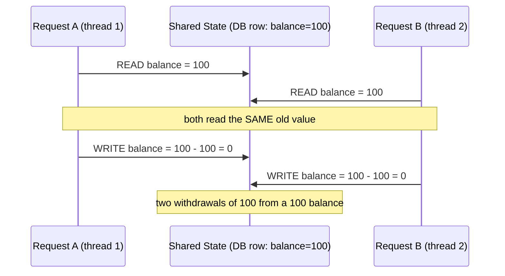
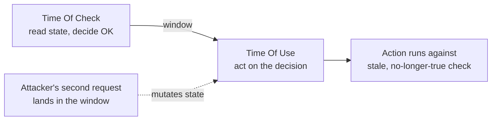
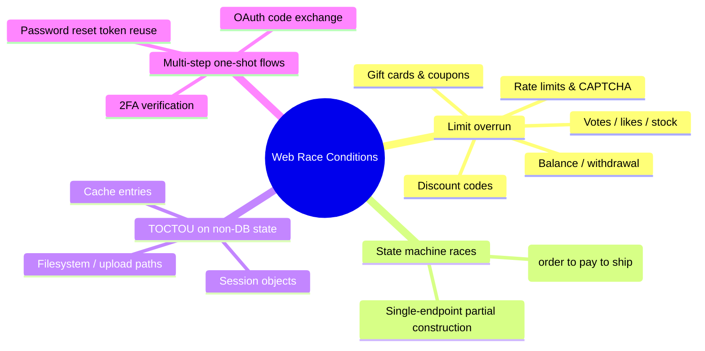
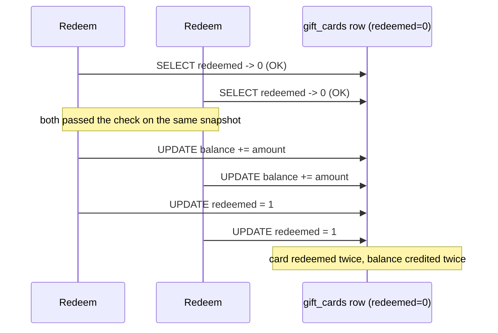
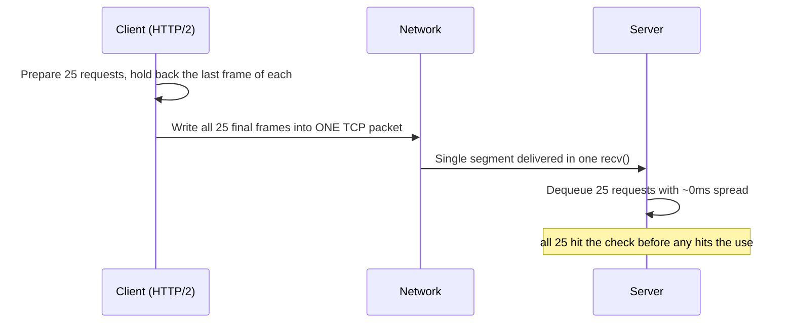
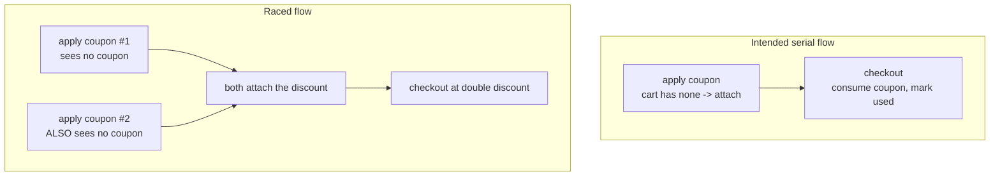
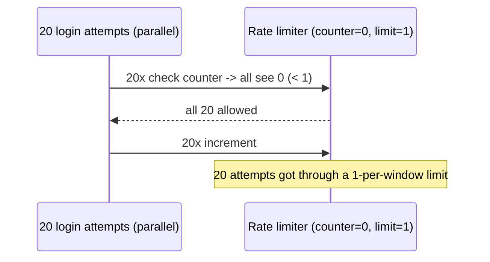
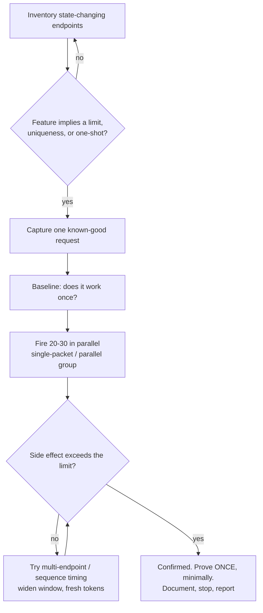

**Level:** Expert · **Track:** Bug Bounty & AppSec · **Read time:** 255 min

This is Chapter 6 of the Server-Side notebook — Notebook 26 — and the last one in it. The five
chapters before it all attacked the *content* of a single request: SSRF steered where a server
reached out to, file upload steered what got stored and executed, path traversal steered which file
was read, deserialization steered which objects were rebuilt, and request smuggling steered where
one request ended and the next began. This chapter attacks something different: *time*. The bug here
is not in any one request in isolation — each request may be perfectly valid and pass every check.
The bug is in the **assumption that requests run one at a time**, and in the tiny window where two
of them overlap.

A race condition is what you get when the correctness of a program depends on the *timing* or
*interleaving* of concurrent operations, and that timing is not actually guaranteed. TOCTOU —
time-of-check to time-of-use — is the most security-relevant flavour: the program checks a condition
("does this user have enough balance?", "has this coupon been used?", "is this the first request?")
and then, a few instructions later, acts on the result of that check ("deduct the balance", "mark the
coupon used", "grant the reward"). If an attacker can slip a second operation *in between* the check
and the use, the check becomes a lie. The classic one-liner: **you check, I change, you use.**

On a desktop or kernel these bugs are old news — `access()`-then-`open()` symlink races, signal
handlers, `/tmp` file races. What makes the web version its own discipline is the transport. HTTP is
request/response and *stateless by design*, so developers reason about one request at a time and
forget that a real server handles hundreds concurrently. Add a database whose default isolation level
permits exactly the interleavings that break naïve "read, decide, write" logic, and you have a bug
class that sits underneath features that *looked* completely correct in code review. It is also, right
now, one of the highest-signal things a bug-bounty hunter can test for on any application that touches
money, quotas, or state transitions — and one of the easiest to prove decisively once you have the
right tool.

By the end of this chapter you will understand concurrency and database isolation from first
principles, be able to recognise the code and feature patterns that hide a race, exploit every common
web race variant by hand and with Turbo Intruder's single-packet attack, and — just as importantly —
write the fix. Everything here assumes an **authorized target**: your own lab, a program that permits
it in scope, or a deliberately vulnerable app. Racing endpoints on a live third-party service you have
no permission to test can duplicate real money, corrupt real data, and is both a crime and an ethics
failure. Prove it on your lab, then prove it *once*, non-destructively, on an in-scope target.

---

## Part 1: The Prerequisite — Concurrency, Threads, and Why "One at a Time" Is a Lie

Before any race makes sense, you need an honest model of how a web server actually executes requests.
The mental model most developers carry — "a request comes in, my handler runs top to bottom, then the
next request runs" — is wrong for essentially every production deployment.

A modern web server serves many requests **concurrently**. Concretely, that happens through one or
more of these mechanisms:

- **Multiple worker processes.** Gunicorn, uWSGI, PHP-FPM, and Puma spin up N worker processes
  (often `2 × cores + 1`). Each is a separate OS process handling requests independently and in
  parallel on different CPU cores.
- **Multiple threads per process.** A single worker may run a thread pool (Java servlet containers,
  Python threaded servers, Puma threads). Threads within a process share memory, which is where
  in-process shared-state races live.
- **Async event loops.** Node.js, Python `asyncio`, Go goroutines — a single thread cooperatively
  multiplexes thousands of in-flight requests, suspending one at every `await`/I/O boundary and
  resuming another. There's no OS-level parallelism inside one event loop, but there is *interleaving*:
  request B can run in the gap where request A is waiting on the database.

The key consequence for security: **between any two lines of your handler, another request's handler
may run.** If line 1 reads a value and line 3 writes based on it, another request can read the same
old value at line 1 before your line 3 runs. Both then write. One of the two updates is lost.



That diagram is the entire bug class in one picture. Everything else is a variation on *what* the
shared state is (a database row, a Redis counter, a file, an in-memory variable), *how big* the window
between read and write is, and *how* the attacker forces the interleaving.

Some vocabulary you'll use throughout:

- **Critical section** — a span of code that must not be interrupted by another operation on the same
  shared state to stay correct (the read-decide-write above).
- **Atomicity** — an operation is atomic if it appears to happen all-at-once with no observable
  intermediate state. `x += 1` in most languages is *not* atomic: it's read, add, write.
- **Data race** — two concurrent accesses to the same location where at least one is a write and
  there's no synchronisation. Undefined/unreliable results.
- **Race condition** — the broader correctness problem: the *outcome* depends on timing. TOCTOU is a
  race condition where the timing gap sits between a check and the action that trusts it.
- **Idempotency** — an operation is idempotent if doing it twice has the same effect as doing it once.
  Non-idempotent state changes (increment, append, "create if not exists" done wrong) are the ones
  races duplicate.

**Security relevance up front:** you don't need a multi-threaded language to be vulnerable. A
single-threaded Node app is racy the moment its handler `await`s the database between checking and
updating, because another connection's query can complete in that gap. The fix is never "use fewer
threads"; it's "make the check-and-use atomic at the layer that actually enforces it" — almost always
the database.

---

## Part 2: TOCTOU — The Check/Use Gap, Formalised

TOCTOU deserves its own precise treatment because naming the two moments is how you find the bug in
code. Every TOCTOU has exactly two events on the same subject:

1. **Time Of Check (TOC):** the program observes a property of some shared state and decides to
   proceed. `if (user.balance >= amount)`, `if (!coupon.used)`, `if (invites_sent < 5)`,
   `if (not os.path.exists(path))`.
2. **Time Of Use (TOU):** the program performs the privileged/irreversible action that the check was
   supposed to gate. `user.balance -= amount`, `coupon.used = True`, `send_invite()`, `open(path,
   'w')`.

The vulnerability exists whenever **the state checked at TOC can change before TOU**, *and* nothing
re-validates it atomically at TOU. The attacker's whole job is to make many TOUs execute against the
single TOC-era snapshot of the world.



A worked, non-web analogy that every security engineer should carry: the classic setuid file race.

```c
/* VULNERABLE: check-then-use on a path the attacker controls */
if (access("/tmp/report", W_OK) == 0) {   /* TOC: am I allowed to write it? */
    /* attacker swaps /tmp/report for a symlink to /etc/passwd here */
    int fd = open("/tmp/report", O_WRONLY);  /* TOU: writes wherever the name now points */
    write(fd, attacker_data, len);
}
```

`access()` checks the real UID's permission on whatever the name pointed to *then*; `open()` acts on
whatever it points to *now*. Between them the attacker replaces the file with a symlink. The web
equivalent replaces "swap a symlink" with "fire a second HTTP request", and replaces "the filesystem"
with "a database row, a counter, or a session variable". Same skeleton, different transport.

The reason this matters for finding bugs: when you audit code (yours or, in a bounty, inferred from
behaviour), you are hunting for **a read/check and a later write that trust each other but are not
inside one atomic operation or one lock.** Once you can name the TOC and the TOU and see daylight
between them, you've found the candidate.

**Bug-bounty framing:** you rarely see the code. So you infer the check/use gap from the *feature*:
anything described as "one per customer", "up to N", "single use", "first N wins", "can only be done
once" is a check/use pair by definition, and is worth a parallel-request test.

---

## Part 3: Where the State Lives — Databases, Isolation, and Locking From Scratch

Almost every exploitable web race ultimately resolves at the database, so you must understand how
databases *choose* to allow or forbid the bad interleaving. This is the single most important section
for both attacking and fixing.

### Transactions and ACID

A **transaction** groups statements so they commit all-or-nothing. ACID is its contract:

- **Atomicity** — all statements commit or none do.
- **Consistency** — a committed transaction leaves the DB in a valid state (constraints hold).
- **Isolation** — concurrent transactions don't step on each other *as if* they ran serially… but
  only up to the configured **isolation level**. This is the knob races live and die on.
- **Durability** — once committed, it survives a crash.

The dangerous word is "isolation", because the *default* isolation level on most databases is **not**
"behave as if everything ran one at a time." It's weaker, for performance.

### The four SQL isolation levels and the anomalies they permit

| Isolation level | Dirty read | Non-repeatable read | Phantom read | Lost update / write skew | Default in |
|---|---|---|---|---|---|
| READ UNCOMMITTED | possible | possible | possible | possible | (rare) |
| READ COMMITTED | no | possible | possible | possible | **PostgreSQL, Oracle, SQL Server** |
| REPEATABLE READ | no | no | possible* | possible (write skew) | **MySQL/InnoDB** |
| SERIALIZABLE | no | no | no | no | (opt-in) |

\*MySQL's InnoDB REPEATABLE READ prevents many phantoms via next-key locks; PostgreSQL's REPEATABLE
READ is snapshot isolation and still allows write skew. Details differ per engine — never assume,
test.

The two anomalies that cause almost all web money bugs:

- **Lost update:** T1 reads balance=100, T2 reads balance=100, T1 writes 0, T2 writes 0. One deduction
  vanished. This is the Part 1 diagram, at the DB layer. Permitted at READ COMMITTED and (as a
  read-modify-write) at REPEATABLE READ unless you lock.
- **Write skew:** T1 and T2 each read a set of rows, each individually decides its write is fine, and
  together they violate an invariant that neither could see the other approaching. Example: "at least
  one admin must remain" — two admins concurrently remove *themselves*, each sees one other admin
  still present at check time, both commit, zero admins remain.

**This is why "wrap it in a transaction" is not automatically a fix.** A transaction at READ COMMITTED
still lets both requests read the old balance. Isolation level and/or explicit locking is what closes
the window — covered fully in Part 12.

### Locking, from zero

A **lock** is a claim on a resource that forces other operations to wait. Two kinds you must know:

- **Pessimistic locking** — take the lock *before* you read, assuming conflict is likely. In SQL:
  `SELECT … FOR UPDATE` reads a row *and* locks it so any other transaction that tries to
  `SELECT … FOR UPDATE` or `UPDATE` the same row blocks until you commit. This serialises the critical
  section on that row. It's the sledgehammer that reliably kills read-modify-write races.
- **Optimistic locking** — assume conflict is rare; read a **version** column, do your work, then
  `UPDATE … SET version = version + 1 WHERE id = ? AND version = <what I read>`. If someone else moved
  first, `version` no longer matches, zero rows update, and you retry. No blocking, but you must handle
  the retry.

And the single most underused fix of all — the **atomic conditional write**:

```sql
-- Not: SELECT balance; if enough, UPDATE balance = balance - amt
-- Instead, one statement whose WHERE clause re-checks under the row lock:
UPDATE accounts SET balance = balance - :amt
WHERE id = :id AND balance >= :amt;
-- affected_rows == 1 -> success; == 0 -> insufficient funds, no race possible
```

Because a single `UPDATE` takes a row-level write lock and evaluates its `WHERE` **at write time under
that lock**, there is no check/use gap: the check *is* the use. Memorise this pattern — it fixes a
huge fraction of real races with one line.

---

## Part 4: A Taxonomy of Web Races — The Shapes You Will Actually Meet

Not all web races are the same shape. Classifying the target tells you which tool and which payload to
reach for. James Kettle's research and PortSwigger's Web Security Academy popularised this taxonomy;
these are the categories worth carrying in your head.



- **Limit-overrun races** are the bread and butter: some counter or balance is checked against a limit,
  and firing N requests in parallel makes the effective count exceed the limit — redeem one gift card
  many times, apply a coupon repeatedly, withdraw more than you have, cast multiple votes, buy the last
  unit many times. Almost always the highest-severity and easiest to prove.
- **Multi-endpoint races** exploit a state machine spread across endpoints — apply a discount at
  `/cart` while the price is confirmed at `/checkout`; add funds and spend them in the same instant.
  The window is the gap between two *different* requests reaching two handlers.
- **Single-endpoint partial-construction races** exploit a handler that, mid-execution, leaves an
  object in an intermediate state another concurrent request can observe or act on — the "hidden
  multi-step sequence within a single request" class.
- **TOCTOU on non-DB state** — the file/upload/symlink family, session-object mutation, cache
  poisoning windows. Same skeleton, different store.
- **Multi-step one-shot flows** — reset tokens, 2FA codes, OAuth authorization codes that are supposed
  to be single-use; racing the exchange lets one code redeem twice, or lets a brute-force reuse a code
  that should have been invalidated.

The rest of the chapter goes deep on the mechanics of each, then the tooling, then a real lab, then the
fixes.

---

## Part 5: Limit-Overrun Races — The Core Exploit, Step by Step

Take the canonical vulnerable endpoint: redeem a single-use gift card / coupon for account credit.

```python
# VULNERABLE Flask handler — the archetype of the whole chapter
@app.post("/redeem")
def redeem():
    code = request.form["code"]
    card = db.execute("SELECT id, amount, redeemed FROM gift_cards WHERE code=?",
                      (code,)).fetchone()
    if not card or card["redeemed"]:          # ---- TIME OF CHECK ----
        return "Invalid or already redeemed", 400
    # ... a few instructions of latency: logging, balance lookup, etc. ...
    db.execute("UPDATE users SET balance = balance + ? WHERE id=?",
               (card["amount"], session["uid"]))
    db.execute("UPDATE gift_cards SET redeemed=1 WHERE id=?", (card["id"],))  # -- TIME OF USE --
    db.commit()
    return "Redeemed!", 200
```

Serially this is fine: the second redeem sees `redeemed=1` and is rejected. But look at the window.
Between the `SELECT` (TOC) and the two `UPDATE`s (TOU) there is real elapsed time — a DB round trip, a
log line, maybe a network hop to another service. If two requests both execute the `SELECT` before
*either* runs the `UPDATE`, both see `redeemed=0`, both proceed, and the card credits **twice**. Fire
20 in parallel and a \$10 card can become \$200 of balance.



### The exploitation recipe

1. **Get one known-good request.** Log in, capture the exact `POST /redeem` that succeeds once
   (headers, cookies, CSRF token, body) in your proxy.
2. **Make it repeatable enough to matter.** You want the *same* single-use action fired many times
   with as little time between them as possible, so they overlap inside the check/use window.
3. **Send them as simultaneously as the transport allows.** This is the crux and the reason tooling
   matters: if request 2 arrives after request 1 has already committed `redeemed=1`, you lose. You need
   the requests to hit the check before any of them hits the use.
4. **Measure the outcome, not the responses.** Some races return the same 200 for every request even
   when only one "really" took effect; others return 200 for all N when all N took effect. Judge by the
   *side effect* — final balance, number of coupons consumed, units shipped — not by counting 200s.

The naïve version of step 3 — a `for` loop firing requests one after another — usually fails, because
sequential requests don't overlap; each finishes (including its commit) before the next starts. You
need genuine concurrency, and ideally you need to defeat **network jitter**, which is what Parts 7–9
are about. First, the older baseline technique.

---

## Part 6: The "Last-Byte Sync" Baseline (and Why It Was Superseded)

Before the single-packet attack, the state of the art for HTTP/1.1 was **last-byte synchronisation**,
and it's still worth understanding because it explains *why* jitter is the enemy.

The idea: open N connections, send all of each request **except the final byte**, wait, then send the
final byte of all N requests at once. The server can't begin processing a request until it's complete,
so withholding the last byte "arms" all N requests; releasing the final bytes together makes the server
start all N as close to simultaneously as possible.

```
1. Open 20 TCP connections, complete TLS on each.
2. On each, send the full request MINUS the last 1 byte of the body.
3. Sleep ~100 ms so all 20 are parked at the server, waiting for their last byte.
4. Send the final byte on all 20 connections in a tight loop / together.
5. All 20 handlers start within a few ms of each other.
```

This dramatically shrinks the spread versus a plain loop, but it does not eliminate it. Each of the 20
final bytes still travels in its **own TCP packet on its own connection**, so they arrive smeared
across a window governed by network jitter — typically a few milliseconds of spread even on a fast
link, and much worse over the public internet. If the server's check/use window is, say, 1 ms, a 3–5 ms
arrival spread means many of your requests miss the window and the attack is flaky: it works 1 try in
10, needs hundreds of connections, and produces noisy, hard-to-reproduce results.

The takeaway that motivates the next section: **the limiting factor was never the server — it was the
jitter between your packets.** Kill the jitter and you kill the flakiness. That is exactly what the
single-packet attack does.

---

## Part 7: The Single-Packet Attack — Removing Network Jitter Entirely

The single-packet attack (James Kettle, "Smashing the state machine", 2023) is the technique that
turned web races from flaky to *deterministic*. It exploits **HTTP/2's multiplexing** to place many
complete requests into **one TCP packet**, so the server receives them all at literally the same
instant and there is no inter-request jitter to spread them out.

### Why HTTP/2 makes this possible

HTTP/1.1 puts one request per connection at a time (barring pipelining, which is unreliable). HTTP/2
multiplexes **many concurrent streams over one TCP connection**, each request framed independently. If
you can arrange for the final frames of ~20–30 requests to be written into a **single TCP segment**,
the server reads that one segment in one `recv()` and hands all ~20 requests to worker threads with
effectively zero time between them.



The practical effect: instead of a 3–5 ms arrival spread, you get sub-100-microsecond spread. Windows
that were unhittable with last-byte sync become reliably hittable. In Kettle's testing this collapsed
races that needed hundreds of attempts into ones that fire in a single click.

### What if the target is HTTP/1.1 only?

You can still get most of the benefit with **last-byte sync over HTTP/1.1** (Part 6), and Turbo
Intruder / Burp will automatically fall back to it. The single-packet attack specifically needs HTTP/2
(or HTTP/3) to the front-end. Many big targets speak HTTP/2 at the edge even if the origin is HTTP/1.1,
which is fine — you're racing whatever terminates your connection.

### Constraints to remember

- **~20–30 requests per packet** is the practical ceiling (limited by TCP segment size / initial
  congestion window). That's plenty for most limit-overruns; you don't need thousands.
- Requests must be **complete except their final frame** at send time, exactly like last-byte sync,
  just multiplexed.
- The tooling (next part) implements all of this. You rarely hand-roll it; you select the engine.

---

## Part 8: The Toolkit — Burp Repeater Parallel Groups and Turbo Intruder From Zero

Two tools cover 95% of web-race testing. Teach yourself both from scratch here; you'll use them in the
lab.

### 8.1 Burp Suite Repeater — "Send group in parallel (single connection)"

**What Burp Suite is (from zero):** Burp Suite is an intercepting HTTP proxy and testing platform. It
sits between your browser and the target, lets you view/modify every request, and provides tools like
**Repeater** (hand-edit and resend a single request repeatedly) and **Intruder** (automated payload
injection). Install: it ships preinstalled on Kali (`burpsuite`), or download the Community edition
from PortSwigger. Configure your browser (or Burp's built-in browser) to proxy through
`127.0.0.1:8080` and install Burp's CA certificate so HTTPS is intercepted.

Since 2022, Burp Repeater has a **tab group** feature that implements the single-packet attack for you
— no extension needed for the common case:

1. Capture the target request (e.g. `POST /redeem`) and send it to Repeater (`Ctrl+R`).
2. Duplicate the Repeater tab ~20 times (right-click → *Duplicate tab*, or `Ctrl+R` repeatedly from
   Proxy).
3. Select all the tabs → right-click → **Add tabs to group** → name it.
4. Click the **send-mode dropdown** next to Send and choose **"Send group in parallel (single
   connection)"**. On an HTTP/2 target this uses the single-packet attack; on HTTP/1.1 it uses
   last-byte sync automatically.
5. Send. Inspect each tab's response; more importantly, inspect the **side effect** (your balance,
   the coupon count) out of band.

The sibling mode **"Send group in sequence (single connection)"** is for *ordered* multi-step races,
not parallel overruns — don't confuse them.

**Why start here:** it's the fastest way to prove a simple limit-overrun with zero scripting, and its
single-connection parallel mode is genuinely the single-packet attack. For anything needing dynamic
data (a fresh CSRF token per request, gate-and-release timing, thousands of attempts), move to Turbo
Intruder.

### 8.2 Turbo Intruder — the scriptable race engine

**What Turbo Intruder is (from zero):** a Burp extension (install from the **BApp Store**: *Extensions
→ BApp Store → Turbo Intruder → Install*) that provides a high-performance HTTP engine driven by a
small **Python (Jython) script**. It can send tens of thousands of requests with custom concurrency and
— crucially — ships a purpose-built engine for race conditions. You drive it by right-clicking a
request → **Extensions → Turbo Intruder → Send to turbo intruder**, editing the script, and clicking
**Attack**.

The two engine features that matter for races:

- **`engine=Engine.BURP2`** with **HTTP/2** enables the single-packet attack.
- **`engine.openGate()` / `engine.sendGate()`** (the "gate" API) queue requests behind a named gate and
  release them together — the software equivalent of last-byte sync, and the fallback when single-packet
  isn't available.

A minimal single-packet race template (this is close to the official example Turbo Intruder ships):

```python
def queueRequests(target, wordlists):
    # BURP2 engine + concurrentConnections=1 + HTTP/2 => single-packet attack
    engine = RequestEngine(endpoint=target.endpoint,
                           concurrentConnections=1,
                           engine=Engine.BURP2)

    # Queue 30 copies of the SAME request. The last-byte/frames are held back
    # and released together automatically by the BURP2 single-packet path.
    for i in range(30):
        engine.queue(target.req, gate='race1')

    # Release every queued request at once.
    engine.openGate('race1')

def handleResponse(req, interesting):
    table.add(req)   # log every response so you can diff status/length/body
```

- `target.endpoint` / `target.req` are provided by Turbo Intruder from the request you sent it.
- `concurrentConnections=1` + `Engine.BURP2` is the single-packet configuration (all requests share one
  connection and go out together).
- `gate='race1'` tags the requests; `openGate('race1')` fires them simultaneously.
- `handleResponse` logs each response into the results table so you can sort by status code / length and
  spot the ones that "won".

If the target is HTTP/1.1, swap to the classic gate pattern:

```python
def queueRequests(target, wordlists):
    engine = RequestEngine(endpoint=target.endpoint,
                           concurrentConnections=30,
                           requestsPerConnection=1,
                           pipeline=False)
    for i in range(30):
        engine.queue(target.req, gate='race1')
    engine.openGate('race1')   # last-byte sync across 30 connections
```

| Feature | Repeater parallel group | Turbo Intruder |
|---|---|---|
| Single-packet attack | Yes (HTTP/2 auto) | Yes (`Engine.BURP2` + HTTP/2) |
| Setup effort | Point-and-click | Small Jython script |
| Per-request dynamic data (fresh token) | No | Yes (script it) |
| Volume (100s–1000s of tries) | Awkward | Native |
| Best for | Prove a simple overrun fast | Real, tunable, repeatable attacks |

**Rule of thumb:** reach for the Repeater parallel group first to confirm a bug exists in seconds; move
to Turbo Intruder when you need volume, fresh tokens per request, or gate-and-release control.

---

## Part 9: Hands-On Lab — Build, Break, and Fix a Real Gift-Card Race

This is a complete, reproducible lab you can run locally. It stands up a deliberately vulnerable Flask
app backed by SQLite, exploits the redeem race, and then applies the fix and proves it holds. Run it
**only on your own machine.**

### 9.1 Set up the vulnerable app

```bash
# Kali / any Linux. Isolate deps in a venv.
mkdir race-lab && cd race-lab
python3 -m venv venv && source venv/bin/activate
pip install flask
```

Create `app.py`:

```python
# app.py  — DELIBERATELY VULNERABLE. Local lab only.
import sqlite3, time
from flask import Flask, request, g, session

app = Flask(__name__)
app.secret_key = "lab-only"
DB = "lab.db"

def db():
    if "db" not in g:
        g.db = sqlite3.connect(DB)
        g.db.row_factory = sqlite3.Row
    return g.db

@app.teardown_appcontext
def close(_):
    d = g.pop("db", None)
    if d: d.close()

@app.route("/init")
def init():
    d = sqlite3.connect(DB); c = d.cursor()
    c.executescript("""
        DROP TABLE IF EXISTS users; DROP TABLE IF EXISTS gift_cards;
        CREATE TABLE users(id INTEGER PRIMARY KEY, name TEXT, balance INTEGER);
        CREATE TABLE gift_cards(id INTEGER PRIMARY KEY, code TEXT, amount INTEGER, redeemed INTEGER);
        INSERT INTO users(id,name,balance) VALUES(1,'victim',0);
        INSERT INTO gift_cards(code,amount,redeemed) VALUES('GIFT-10',10,0);
    """)
    d.commit(); d.close()
    return "initialised: user 1 balance=0, card GIFT-10 worth 10\n"

@app.post("/redeem")
def redeem():
    session["uid"] = 1                       # pretend we're logged in as user 1
    code = request.form["code"]
    card = db().execute(
        "SELECT id, amount, redeemed FROM gift_cards WHERE code=?", (code,)).fetchone()
    if not card or card["redeemed"]:         # ---- TIME OF CHECK ----
        return "invalid or already redeemed\n", 400
    time.sleep(0.05)                         # widen the window so the race is easy to see
    db().execute("UPDATE users SET balance = balance + ? WHERE id=?",
                 (card["amount"], session["uid"]))
    db().execute("UPDATE gift_cards SET redeemed=1 WHERE id=?", (card["id"],))  # -- USE --
    db().commit()
    row = db().execute("SELECT balance FROM users WHERE id=1").fetchone()
    return f"redeemed! balance now {row['balance']}\n", 200

@app.get("/balance")
def balance():
    row = sqlite3.connect(DB).execute("SELECT balance FROM users WHERE id=1").fetchone()
    return f"balance={row[0]}\n"

if __name__ == "__main__":
    # threaded=True so the dev server actually serves requests concurrently
    app.run(port=5000, threaded=True)
```

> The `time.sleep(0.05)` is a teaching aid: it widens the check/use window so the race fires reliably
> even without single-packet precision. Real targets have windows measured in microseconds — that's
> what the single-packet attack is for. Remove the sleep later and re-run to feel the difference.

Start it and initialise:

```bash
python app.py &
curl -s http://127.0.0.1:5000/init
# initialised: user 1 balance=0, card GIFT-10 worth 10
```

### 9.2 Prove the serial case is safe

```bash
curl -s -X POST -d 'code=GIFT-10' http://127.0.0.1:5000/redeem
# redeemed! balance now 10
curl -s -X POST -d 'code=GIFT-10' http://127.0.0.1:5000/redeem
# invalid or already redeemed
curl -s http://127.0.0.1:5000/balance
# balance=10
```

One at a time, the logic is correct: the card redeems once, balance is 10. Re-init before the attack:

```bash
curl -s http://127.0.0.1:5000/init
```

### 9.3 Exploit it — a self-contained concurrent client

You can drive this with Burp Repeater's parallel group or Turbo Intruder against
`http://127.0.0.1:5000/redeem`. For a fully scripted, tool-free proof that anyone can run, here is a
threaded Python attacker that fires 20 redeems as simultaneously as `threading.Barrier` allows:

```python
# attack.py — fire 20 redeems that all cross the check before any commits
import threading, requests

URL = "http://127.0.0.1:5000/redeem"
N = 20
barrier = threading.Barrier(N)   # all threads wait here, then release together
results = []

def worker():
    barrier.wait()               # gate: line everyone up, then GO
    r = requests.post(URL, data={"code": "GIFT-10"})
    results.append((r.status_code, r.text.strip()))

threads = [threading.Thread(target=worker) for _ in range(N)]
for t in threads: t.start()
for t in threads: t.join()

ok = sum(1 for s, _ in results if s == 200)
print(f"{ok}/{N} redemptions returned 200")
for s, b in results[:5]:
    print(s, b)
```

```bash
pip install requests
python attack.py
```

Realistic output (numbers vary run to run, that's the nature of a race):

```
14/20 redemptions returned 200
200 redeemed! balance now 10
200 redeemed! balance now 40
200 redeemed! balance now 70
200 redeemed! balance now 90
200 redeemed! balance now 130
```

Now check the ground truth:

```bash
curl -s http://127.0.0.1:5000/balance
# balance=140
```

A \$10 single-use card credited **\$140** because 14 requests crossed the `SELECT` check while
`redeemed` was still 0. That is a limit-overrun race, proven end to end. (With Turbo Intruder's
single-packet engine you'd get the same result against a target whose window is microseconds, where the
`threading.Barrier` approach would mostly miss.)

### 9.4 Fix it and prove the fix holds

Replace the check/use pair with a single **atomic conditional UPDATE** — the check *is* the use, under
the row lock:

```python
@app.post("/redeem")
def redeem():
    session["uid"] = 1
    code = request.form["code"]
    d = db()
    # Atomically flip redeemed 0 -> 1 and only proceed if WE were the one who flipped it.
    cur = d.execute(
        "UPDATE gift_cards SET redeemed=1 WHERE code=? AND redeemed=0", (code,))
    if cur.rowcount == 0:                     # someone else already claimed it (or bad code)
        d.commit()
        return "invalid or already redeemed\n", 400
    amount = d.execute("SELECT amount FROM gift_cards WHERE code=?", (code,)).fetchone()["amount"]
    d.execute("UPDATE users SET balance = balance + ? WHERE id=?", (amount, session["uid"]))
    d.commit()
    row = d.execute("SELECT balance FROM users WHERE id=1").fetchone()
    return f"redeemed! balance now {row['balance']}\n", 200
```

The winning request is the exactly-one transaction whose `UPDATE … WHERE redeemed=0` affects a row;
every other concurrent request sees `rowcount == 0` because the row is now `redeemed=1` and is rejected.
Re-init, re-run `attack.py`:

```bash
curl -s http://127.0.0.1:5000/init
python attack.py
# 1/20 redemptions returned 200
curl -s http://127.0.0.1:5000/balance
# balance=10
```

Exactly one redemption, balance 10, no matter how many requests you fire or how tight the timing. **The
window is gone because there is no longer a gap between the check and the use.** Keep this lab; you'll
reuse the "atomic conditional write" pattern constantly in Part 12.

---

## Part 10: Multi-Endpoint and State-Machine Races

Limit-overruns race the *same* endpoint. The subtler class races *different* endpoints that share
state, exploiting the gap between two handlers in a workflow.

### The pattern

An e-commerce flow: `POST /cart/apply-coupon` records a discount on the cart; `POST /checkout` reads the
cart, charges the (discounted) total, and marks the coupon consumed. If "one coupon per order" is
enforced at `apply-coupon` by checking "does this cart already have a coupon?", firing two
`apply-coupon` requests in parallel can attach the discount twice (each sees "no coupon yet"), stacking
a 20%-off code into 40% off. Or: apply-coupon on *two different carts* with a single-use code before
either checkout marks it used.

Another archetype — **balance top-up vs spend**: `/wallet/add` credits funds from a pending source that
can later be reversed; `/wallet/spend` debits. Racing an add against a spend, or racing a
transfer-out against a transfer-in on the same balance, can realise value that later reversal can't
claw back.



### How to test multi-endpoint races

For a fixed two-step sequence you want fired in tight order, Burp Repeater's **"Send group in sequence
(single connection)"** issues the grouped requests back-to-back over one connection, minimising the
inter-request gap — ideal for "A then B, as close together as possible." For "N copies of the same
step simultaneously," use the parallel group. Turbo Intruder scripts arbitrary combinations: queue
some requests behind a gate, queue others, and release.

**Bug-bounty angle:** multi-endpoint races are where the *big* payouts hide, because they exploit
business invariants ("a coupon is worth one use", "a transfer is zero-sum") that no single endpoint's
code appears to violate. When you find a "check on endpoint A, enforce on endpoint B" split, test it.

---

## Part 11: Single-Endpoint Partial-Construction and Rate-Limit Races

Two more sub-classes round out the practical repertoire.

### 11.1 Partial construction ("hidden multi-step within one request")

Some handlers create related records in sequence and briefly leave the system in a state a concurrent
request can exploit. Classic example: a signup/registration handler that (1) inserts the user row, then
(2) sends a verification email keyed on the just-inserted row. Race two registrations for the same
email and, depending on ordering and constraints, you may get two half-built accounts, an account whose
email is verified by another user's link, or a state where uniqueness was checked before insert but
both inserts slipped through (the classic "check username not taken, then insert" race that a unique
constraint would have stopped). Kettle's research calls this exploiting **"the hidden multi-step
sequence inside a single request."**

The tell in behaviour: an operation that clearly does several sub-steps (create A, then link B to A,
then finalise) where a concurrent duplicate could interleave with the sub-steps.

### 11.2 Rate-limit, CAPTCHA, and anti-automation bypass

Rate limiting is itself a check/use pair: *check* the counter for this IP/user, *use* by allowing the
request and *then* incrementing. Race it and many requests read "0 so far" before any increment lands,
so you get N free attempts past a "1 per minute" limit. This turns a throttled login/OTP endpoint into
a brute-forceable one.



**Impact chain:** racing the rate limiter on a **password-reset OTP** or **2FA code** endpoint lets you
try far more codes per window than intended, collapsing a 6-digit code's brute-force cost. Racing a
**"resend/verify token"** flow can let a single one-time token be consumed twice. This is why "we rate
limit OTP to 5/min" is not, by itself, a safe design — if the check and the increment aren't atomic, the
limit is advisory.

**Blue-team note:** rate limits must be enforced with an atomic operation (Redis `INCR` returns the new
value in one round trip — check *that* return value, don't `GET` then `SET`) or the limiter is itself
racy.

---

## Part 12: Detection & Defense Angle — Closing Every Window

This is the section to internalise if you build software. Each defense maps to a specific failure mode
from earlier parts. The unifying principle: **make the check and the use one atomic operation at the
layer that actually enforces the invariant — the database — and enforce invariants with constraints,
not application logic.**

### 12.1 Atomic conditional writes (fixes most limit-overruns)

Never read-decide-write across a round trip. Fold the check into the write's `WHERE`:

```sql
-- Withdrawal / balance debit: no separate SELECT
UPDATE accounts SET balance = balance - :amt
WHERE id = :id AND balance >= :amt;   -- rowcount 1 = success, 0 = insufficient

-- Single-use token / coupon: claim atomically
UPDATE coupons SET used = 1, used_by = :uid
WHERE code = :code AND used = 0;      -- rowcount 1 = you won it, 0 = already used
```

The row lock the `UPDATE` takes serialises concurrent writers; the `WHERE` re-checks under that lock.
No window.

### 12.2 Pessimistic locking (fixes read-then-write when you truly need the read first)

When you must read, compute, then write (e.g. compute a fee from other tables), lock the row up front:

```sql
BEGIN;
SELECT balance FROM accounts WHERE id = :id FOR UPDATE;  -- row locked until COMMIT
-- ... compute in app ...
UPDATE accounts SET balance = :newbal WHERE id = :id;
COMMIT;
```

Any concurrent `SELECT … FOR UPDATE` on the same row blocks here, serialising the critical section.

### 12.3 Optimistic locking (high-concurrency, low-conflict)

```sql
-- read version with the row, then:
UPDATE items SET stock = stock - 1, version = version + 1
WHERE id = :id AND version = :read_version AND stock > 0;
-- rowcount 0 => someone moved first OR out of stock => retry or fail
```

### 12.4 Unique constraints and idempotency keys (fixes duplicate creation & partial construction)

Let the database enforce "only one" — it's the one component that's always atomic:

```sql
CREATE UNIQUE INDEX uq_one_vote ON votes(user_id, poll_id);
CREATE UNIQUE INDEX uq_email ON users(lower(email));
-- Idempotent writes: client sends an Idempotency-Key; store it uniquely.
CREATE UNIQUE INDEX uq_idem ON payments(idempotency_key);
```

A raced duplicate INSERT now fails on the constraint instead of succeeding twice. **Idempotency keys**
are the standard fix for "retried/replayed payment" and duplicate-submit races: the first request
inserts `(idempotency_key, result)`; concurrent/duplicate requests collide on the unique index and
return the stored result instead of acting again (this is how Stripe's API dedupes).

### 12.5 Serializable isolation (the backstop for write skew)

When the invariant spans multiple rows (write skew — "at least one admin", "sum of allocations ≤
budget"), row locks on a single row don't help. Run the transaction at `SERIALIZABLE`; the database
detects the conflicting interleaving and aborts one transaction with a serialization failure, which you
retry.

```sql
SET TRANSACTION ISOLATION LEVEL SERIALIZABLE;
```

### 12.6 Defense selection table

| Failure mode | Right fix | Wrong / insufficient fix |
|---|---|---|
| Balance / limit overrun | Atomic `UPDATE … WHERE balance >= amt` | `SELECT` then `UPDATE` in a READ COMMITTED txn |
| Single-use token/coupon | Atomic `UPDATE … WHERE used=0`, or unique constraint | App-level `if not used:` check |
| Duplicate account / vote | UNIQUE index | "check exists then insert" in app code |
| Duplicate payment / submit | Idempotency key (unique) | Disable button in JS |
| Multi-row invariant (write skew) | SERIALIZABLE + retry | Row-level `FOR UPDATE` on one row |
| Read-compute-write | `SELECT … FOR UPDATE` (pessimistic) | Longer transaction alone |
| Racy rate limit | Atomic `INCR`, check return value | `GET` counter then `SET` |

### 12.7 What does NOT fix races (common false comfort)

- **Client-side disabling of buttons / JS debounce** — attacker sends raw HTTP, JS never runs.
- **"Wrap it in a transaction"** at default isolation — still permits lost updates unless you lock or
  use an atomic write.
- **A short `sleep`, retry, or "it's fast so the window is tiny"** — the single-packet attack hits
  microsecond windows; small is not zero.
- **Rate limiting alone** — helps against volume but not against a 20-request single-packet burst that
  all lands inside one window, and is itself racy if not atomic.
- **Idempotency implemented as check-then-insert** — must be a unique constraint / atomic upsert, or
  the idempotency layer has its own race.

### 12.8 Detection & monitoring (blue team)

You will rarely see a race in a WAF signature — the individual requests are valid. Detect it by
**outcome and pattern**:

- **Application invariants as alerts:** a gift card marked redeemed but crediting more than its value; a
  coupon's `used_count` exceeding 1; stock going negative; a user's vote count > 1. Assert these in the
  DB (CHECK constraints: `CHECK (stock >= 0)`) and alert on constraint-violation errors and on
  serialization-failure spikes.
- **Burst detection:** many requests to the same state-changing endpoint from one session within a few
  milliseconds — especially a cluster of identical `POST`s with near-identical timestamps — is the
  signature of a parallel/single-packet attack. Log request receive-time at microsecond resolution on
  sensitive endpoints and alert on tight clusters.
- **Reconciliation:** periodic jobs that re-sum balances/ledgers against transaction logs catch value
  that was duplicated by a race even when no single request looked wrong. For anything financial, a
  double-entry ledger with a reconciliation check is the real safety net.
- **Post-incident:** the tell in logs is N successful responses to an operation that should have
  succeeded once, with sub-millisecond spacing.

---

## Part 13: Real-World Cases, Research, and CVEs

Races are not academic — they've drained real value and shipped in real products.

- **James Kettle / PortSwigger, "Smashing the state machine: the true potential of web race
  conditions" (2023)** — introduced the single-packet attack and the modern taxonomy (limit overrun,
  multi-endpoint, single-endpoint partial construction). The definitive primary source; read it before
  the labs.
- **HackerOne disclosed reports** repeatedly show limit-overrun races against wallets, gift cards,
  referral/invite systems, coupon stacking, and vote/like manipulation — many resolved as
  High/Critical because they translate directly to money or integrity loss. Racing "invite N friends"
  to mint unlimited invites, and racing coupon application to stack discounts, are recurring patterns.
- **Financial/crypto "double-spend via race"** — several exchange and wallet bugs allowed withdrawing
  or transferring the same balance twice by racing withdrawal endpoints before the balance debit
  committed; a textbook read-then-write lost-update at the money layer.
- **Filesystem TOCTOU CVEs** — the non-web root of the class: countless `access()`/`open()` and
  temp-file symlink races in setuid utilities and installers. The mechanics are identical to the web
  version; only the transport differs, which is why understanding the filesystem archetype (Part 2)
  sharpens your eye for the web one.
- **`O_CREAT|O_EXCL` and `mkstemp`** exist precisely because "check file doesn't exist, then create it"
  is a race; the atomic-create flag is the filesystem analogue of a unique constraint.

The through-line: every one of these is a check/use gap closed by making the operation atomic at the
enforcing layer.

---

## Part 14: A Testing Methodology for Finding Races in the Wild

A repeatable process for an authorized engagement or in-scope bounty target.



Step notes:

1. **Inventory the state changers.** Anything that mutates balance, quota, count, status, uniqueness,
   or a one-time token. Ignore pure reads.
2. **Flag the "one/limit/single/first-N" features.** Coupons, gift cards, withdrawals, votes, invites,
   referrals, stock/inventory, OTP/2FA/reset tokens, "claim once" rewards, username/email registration.
   These are check/use pairs by definition.
3. **Capture a clean single success** in your proxy — exact headers, cookies, CSRF/nonce, body.
4. **Watch for per-request anti-replay.** If each request needs a fresh CSRF token or nonce, a naïve
   duplicate fails for the *wrong* reason. Either the token is per-session (reusable → fine) or you must
   script fetching a fresh token per request in Turbo Intruder. Distinguish "rejected because raced
   correctly" from "rejected because stale token."
5. **Fire the burst.** Repeater parallel group (fast confirm) → Turbo Intruder single-packet (volume,
   fresh tokens). 20–30 requests is plenty.
6. **Judge by side effect, not status codes.** Check the balance/count/inventory out of band.
7. **On success, prove it once, minimally, and stop.** Don't loop it to drain value; a single
   double-effect with before/after evidence is a complete PoC. Then write it up.

**Ethics and scope — hard boundary.** Races on live systems duplicate *real* state: money, inventory,
votes, accounts. Only test targets you're authorized to test, prefer the smallest possible proof
(double, not 100×), never test against other users' data, and reverse any state you can (redeem back,
refund, delete the duplicate) when the program allows. On your own lab, go wild. On someone else's
system, one clean, reversible proof is the professional standard.

---

## Part 15: Common Pitfalls & Gotchas

- **Sequential loops don't race.** A `for` loop of `curl`/`requests` calls finishes each request
  (commit included) before the next starts. You need genuine concurrency (parallel group, threads with
  a barrier, or Turbo Intruder), or you'll "test" and wrongly conclude it's safe.
- **Network jitter kills naïve concurrency.** Twenty threads over the public internet still smear across
  milliseconds. If the window is tight, use the single-packet attack (HTTP/2) — it's the difference
  between 1-in-10 flaky and deterministic.
- **Counting 200s ≠ measuring impact.** Some endpoints return 200 to every request but only one takes
  effect; others return 200 for each that took effect. Always verify the *side effect*.
- **Fresh-token endpoints.** Per-request CSRF nonces or one-time tokens make duplicates fail for a
  non-race reason. Confirm the token is reusable within the window or script fresh ones.
- **The window may be microseconds.** Don't dismiss a check/use gap because "it's fast." Fast is exactly
  what the single-packet attack defeats.
- **Dev-server single-threading.** When building a lab, Flask's dev server is single-threaded unless
  `threaded=True`; without it you can't reproduce the race. Production servers are concurrent by
  default — don't let a single-threaded lab convince you a pattern is safe.
- **SQLite in the lab locks the whole DB.** SQLite serialises writers at the file level, which can mask
  some races and expose others; it's fine for the teaching lab but reproduce serious findings against
  the target's real engine (Postgres/MySQL) where isolation semantics differ.
- **"It's behind a transaction" is not "it's safe."** Default isolation still permits lost updates.
  Verify the fix is an atomic write, a lock, a unique constraint, or SERIALIZABLE — not just `BEGIN
  … COMMIT`.
- **Idempotency-key done wrong is still racy.** If two duplicate requests both "check key not seen,
  then insert," they race; it must be a unique-constraint / atomic upsert.
- **Reversibility on live targets.** If you must prove a race in scope, prefer effects you can undo and
  the smallest N that proves it.

---

## Part 16: Final Revision / Summary

- A **race condition** is a correctness bug where the outcome depends on the timing/interleaving of
  concurrent operations that isn't actually guaranteed. **TOCTOU** is the security-critical flavour: a
  check and a later use of the same state, with a window between them where the state can change.
- Web servers are **concurrent** (processes, threads, async event loops). Between any two lines of a
  handler, another request's handler may run — so read-decide-write across a round trip is inherently
  racy.
- The state usually lives in the **database**, and whether the bad interleaving is allowed depends on
  the **isolation level**. READ COMMITTED (Postgres default) and REPEATABLE READ (MySQL default) both
  permit **lost updates** for naïve read-then-write; only atomic writes, locking, or SERIALIZABLE close
  them.
- The exploit shapes: **limit overrun** (redeem/withdraw/vote past the limit by firing parallel
  requests), **multi-endpoint / state-machine** (race the gap between two handlers), **single-endpoint
  partial construction** (interleave a handler's internal sub-steps), and **rate-limit/OTP bypass**.
- **Last-byte sync** (HTTP/1.1) shrinks but doesn't remove inter-request jitter; the **single-packet
  attack** (HTTP/2 multiplexing, ~20–30 requests in one TCP packet) removes it and makes microsecond
  windows reliably hittable.
- **Tooling:** Burp Repeater **"Send group in parallel (single connection)"** to confirm fast; **Turbo
  Intruder** (`Engine.BURP2`, gate API) for volume, fresh tokens, and control.
- **Fixes, mapped:** atomic conditional `UPDATE … WHERE` (limit overrun & single-use), `SELECT … FOR
  UPDATE` (read-compute-write), optimistic version columns (high concurrency), **unique constraints /
  idempotency keys** (duplicate creation & payments), **SERIALIZABLE** (write skew). Client-side
  guards, plain transactions, and "it's fast" are **not** fixes.
- **Judge by side effect, prove once, stay in scope.** The professional standard on a live target is a
  single, minimal, reversible proof.

Memory hook: **"You check, I change, you use."** Find the check, find the use, look for daylight
between them, and race the gap — then close it by making the check *be* the use.

---

## Part 17: Cheat Sheet / Quick Reference

```text
CONCEPT
  Race condition   : outcome depends on timing of concurrent ops (unguaranteed)
  TOCTOU           : check state (TOC) -> gap -> act on it (TOU); attacker mutates in gap
  Lost update      : two txns read old value, both write -> one write lost
  Write skew       : each txn's write is individually fine, together break an invariant

WHY SERVERS RACE
  Processes (gunicorn/php-fpm) | threads (puma/servlet) | async loop (node/asyncio/go)
  -> between any two lines of a handler, another request can run

ISOLATION DEFAULTS
  Postgres/Oracle/SQLServer = READ COMMITTED  (allows lost update on read-then-write)
  MySQL/InnoDB              = REPEATABLE READ  (allows write skew; lock to be safe)
  SERIALIZABLE             = safe, but retry on serialization_failure

EXPLOIT SHAPES
  Limit overrun     : fire 20-30 parallel -> redeem/withdraw/vote past the limit
  Multi-endpoint    : race the gap between two handlers (apply-coupon vs checkout)
  Partial construct : interleave a handler's internal create->link->finalise steps
  Rate-limit bypass : parallel requests all read counter<limit before any increment

TECHNIQUE
  Last-byte sync (HTTP/1.1): send all but final byte on N conns, release together
  Single-packet (HTTP/2)   : ~20-30 full requests in ONE TCP packet -> ~0ms spread

TOOLS
  Burp Repeater : tabs -> group -> "Send group in parallel (single connection)"  [HTTP/2 = single-packet]
                  "Send group in sequence (single connection)"  [ordered 2-step races]
  Turbo Intruder: RequestEngine(concurrentConnections=1, engine=Engine.BURP2)  # single-packet
                  engine.queue(req, gate='x'); engine.openGate('x')            # release together

TEST METHOD
  1 inventory state-changing endpoints   2 flag one/limit/single/first-N features
  3 capture 1 good request               4 handle per-request tokens
  5 fire 20-30 parallel                  6 judge by SIDE EFFECT
  7 prove ONCE, minimally, in scope

FIXES (pick by failure mode)
  overrun / single-use : UPDATE t SET used=1 WHERE code=? AND used=0;  (rowcount==1 wins)
  balance debit        : UPDATE acct SET bal=bal-:a WHERE id=? AND bal>=:a;
  read-compute-write   : SELECT ... FOR UPDATE;  ...  UPDATE ...;  (pessimistic)
  high concurrency     : UPDATE ... SET version=version+1 WHERE id=? AND version=:v; (optimistic)
  duplicate create     : CREATE UNIQUE INDEX ...   (votes, email, username)
  duplicate payment    : idempotency key as UNIQUE index (atomic upsert, not check-then-insert)
  write skew           : SET TRANSACTION ISOLATION LEVEL SERIALIZABLE; + retry
  rate limit           : atomic INCR, check the returned value

NOT A FIX
  client-side button disable | plain BEGIN/COMMIT at default isolation | "it's fast"
  rate limit alone | idempotency via check-then-insert
```

---

## Part 18: Practice Labs & Resources

Targets that train exactly this chapter's skills:

- **PortSwigger Web Security Academy — Race conditions** (free, the definitive lab set, built around the
  single-packet attack and Burp's parallel groups):
  - *Limit overrun race conditions* — the canonical gift-card/coupon overrun; confirm with a Repeater
    parallel group.
  - *Bypassing rate limits via race conditions* — race the limiter on a login/OTP-style endpoint.
  - *Multi-endpoint race conditions* — race the gap between two handlers (add-to-cart / checkout style).
  - *Single-endpoint race conditions* — partial-construction against one endpoint.
  - *Exploiting time-sensitive vulnerabilities* — a timing-based sub-class.
  - *Partial construction race conditions* — the "hidden multi-step within one request" lab.
- **James Kettle, "Smashing the state machine: the true potential of web race conditions" (2023)** — the
  primary research paper. Read it in full; it explains the taxonomy and the single-packet attack that
  every lab above is built on.
- **Tools to install and drill:** Burp Suite (Repeater tab groups → *Send group in parallel (single
  connection)*), the **Turbo Intruder** BApp (drive the race templates; practise the `Engine.BURP2`
  single-packet config and the gate API), and a local **Flask + SQLite** lab (this chapter's Part 9) to
  build, break, and fix your own overrun.
- **Disclosed reports:** browse HackerOne's public reports tagged *race condition* / *TOCTOU* against
  wallets, coupons, invites, and votes to see real weaponisation and severity justification, and to
  calibrate what a minimal, reversible PoC looks like.
- **Databases:** reproduce the fixes against real engines — try the atomic-`UPDATE`, `SELECT … FOR
  UPDATE`, unique-constraint, and `SERIALIZABLE` variants on PostgreSQL and MySQL and observe how each
  engine's default isolation changes the outcome. This is the muscle memory that makes you fix races,
  not just find them.

This chapter closes the Server-Side notebook. Across all six chapters the recurring lesson has been the
same one, in different clothing: never let attacker-controllable input — or, here, attacker-controllable
*timing* — silently decide the meaning or the outcome of a trusted server-side operation. SSRF, upload,
traversal, deserialization, and smuggling each broke that rule in *space*; race conditions break it in
*time*. The defensive answer is always to move the decision to the layer that can enforce it
atomically, and let it be the single, authoritative point where the check and the use are one and the
same.

---

*Also on [Praneeth's portfolio](https://ping-praneeth.vercel.app/notebook/appsec-server-side/06-race-conditions-and-toctou-in-web-apps), with comments and the latest edits.*
