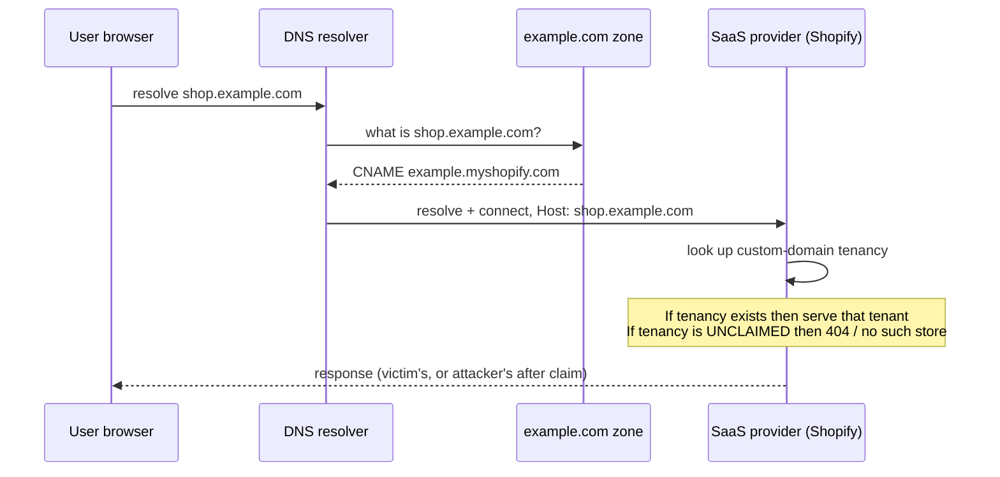
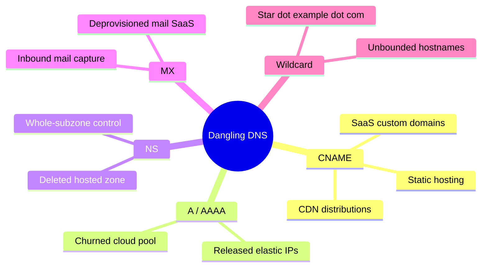
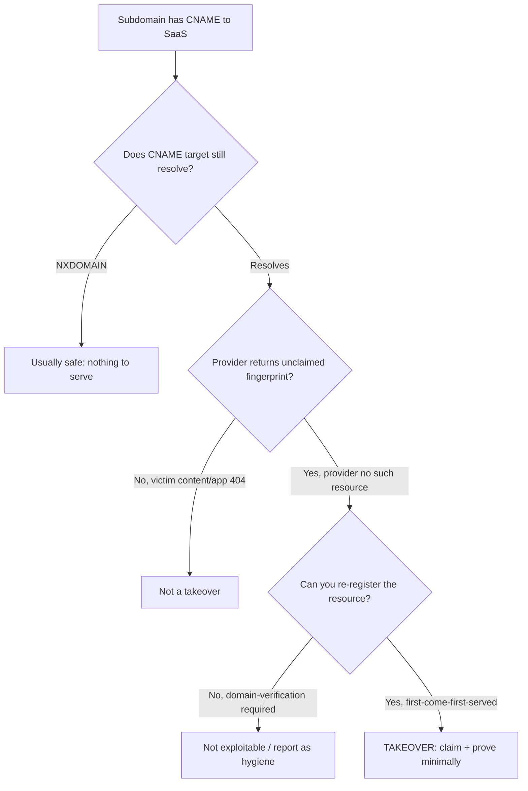
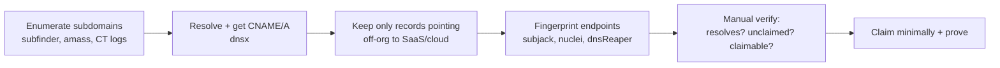
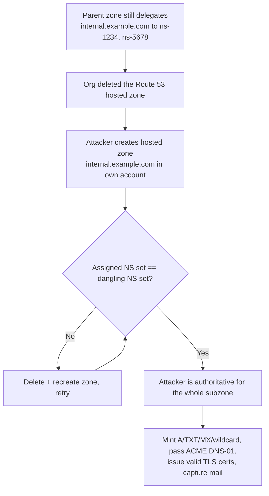
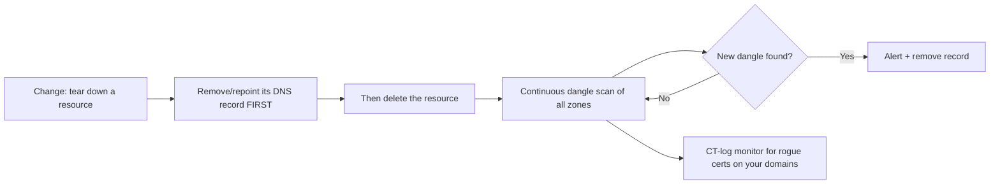

This is Chapter 8 of the Server-Side notebook — Notebook 26. The previous chapters attacked what a
server *does* with a request: it fetches a URL for you (SSRF), it desynchronises a connection
(request smuggling), it loses a race (TOCTOU), it caches the wrong thing (cache poisoning). This
chapter attacks something one layer earlier — the *name resolution* that decides which server a
request even reaches. Subdomain takeover is the bug where a target's DNS still confidently points a
hostname at some backend, but the target has quietly stopped owning that backend. Whoever can claim
the backend now owns the hostname, cookies and CSP and OAuth redirects and user trust included.

It is one of the highest-leverage bugs in the whole appsec catalogue precisely because it is not a
code bug at all. There is nothing to patch in the application. The vulnerability lives in the gap
between two systems of record — the DNS zone and the cloud provider's tenancy table — that no single
team owns, that drift apart during ordinary deprovisioning, and that no linter or SAST tool inspects.
That is also why it is so common: an engineer spins up `blog.example.com` on a SaaS, the marketing
campaign ends, someone deletes the SaaS site, and the `CNAME` in the DNS zone is simply forgotten.
The name now *dangles* — it points at a resource that no longer exists and can be re-created by
anyone.

By the end of this chapter you will be able to build the mental model of exactly what "dangling"
means at the record level, enumerate a target's full subdomain surface, resolve and fingerprint each
name, distinguish a genuine takeover from a harmless 404, safely claim and prove one on a service you
are authorised to test, understand the full blast radius of what a claimed subdomain buys an
attacker, and — from the defender's chair — order your deprovisioning so the hole never opens.

Everything offensive here assumes explicit authorization and in-scope targets. Subdomain takeover
proof is one of the easiest bug classes to over-prove and cause real harm with — claiming a name is
a live, externally visible action — so the "prove it minimally, then stop" discipline in Part 9 is
not optional etiquette; it is the line between a valid report and an incident you caused.

---

## Part 1: What a DNS Record Actually Resolves To

To understand takeover you have to be precise about a distinction most people blur: a DNS name is not
a server. A DNS name is an *entry in a zone* that tells a resolver where to look next. The thing it
points at — an IP, another name, a nameserver, a mail host — is a separate resource with a separate
owner and a separate lifecycle. Takeover is what happens when those two lifecycles fall out of sync.

Walk the resolution of `shop.example.com` from zero. Your browser asks its resolver for
`shop.example.com`. The resolver walks the DNS hierarchy: root → `.com` → the nameservers listed for
`example.com` → and finally asks those nameservers for the `shop` record. Suppose the answer is:

```text
shop.example.com.   300   IN   CNAME   example.myshopify.com.
```

That is a **CNAME** (Canonical Name) record. It does not contain an IP. It says "to resolve
`shop.example.com`, go and resolve `example.myshopify.com` instead, and use whatever *that* resolves
to." The resolver now resolves `example.myshopify.com`, gets Shopify's load-balancer IPs, connects,
and sends `Host: shop.example.com`. Shopify's front door looks at that `Host` header, checks its
internal tenancy table for "who has registered the custom domain `shop.example.com`?", and routes to
that tenant's store.

Two completely separate systems just cooperated:

1. **The DNS zone for `example.com`** — owned by whoever controls the registrar/DNS provider. It
   asserts "`shop` is a CNAME to `example.myshopify.com`."
2. **Shopify's tenancy table** — owned by Shopify. It asserts "the custom domain `shop.example.com`
   belongs to store #12345."

The website only works because *both* assertions exist and agree. Now imagine store #12345 is
closed and deleted, but nobody edits the `example.com` zone. Assertion 1 still says "go to Shopify
for `shop.example.com`." Assertion 2 no longer exists — Shopify has no record of that custom domain.
The name now **dangles**. And here is the fatal part: Shopify (and almost every multi-tenant SaaS)
lets *anyone* register a custom domain, first-come-first-served, with no proof that you own the DNS.
An attacker signs up, adds the custom domain `shop.example.com` to *their* store, and Shopify's
tenancy table now says "`shop.example.com` belongs to attacker's store." Both assertions exist again
— but assertion 2 now points at the attacker. Every visitor to `shop.example.com` lands on
attacker-controlled content, served over a hostname the victim organisation owns.



The whole bug class is that picture with the tenancy row deleted and then re-created by someone else.
No packet was malformed. No input was unsanitised. The application code is irrelevant. The
vulnerability is a **stale pointer in DNS** to a **re-claimable resource**. That is why practitioners
call the root condition *dangling DNS* — by direct analogy to a dangling pointer in C, which you met
in the memory-layout chapter of the Programming for Security notebook: a reference that still looks
valid but points at memory (here, a resource) that has been freed and can be reallocated to an
attacker.

**Why this is a server-side bug and not a DNS-only curiosity:** the impact lands on the *victim's*
security boundaries. Cookies scoped to `.example.com`, CSP `*.example.com` allow-lists, OAuth
`redirect_uri` allow-lists that trust any `example.com` host, `Access-Control-Allow-Origin`
reflections that trust the parent domain, and plain human trust in the brand's domain — all of them
now extend to attacker-controlled content. We build that impact story fully in Part 11.

---

## Part 2: The Record Types That Can Dangle

Not every record dangles the same way, and the record type dictates both how you detect the takeover
and how severe it is. There are four record families that matter, plus a couple of exotic ones.

| Record | Points at | Dangles when… | Takeover mechanism | Severity ceiling |
|---|---|---|---|---|
| `CNAME` | another hostname (usually a SaaS/cloud endpoint) | the SaaS resource is deleted but the CNAME remains | register the same resource name on the SaaS | High — serve full content on the host |
| `A` / `AAAA` | a raw IPv4 / IPv6 address | the cloud VM/EIP is released back to the provider pool but the A record remains | acquire the same IP from the provider pool | High, but IP re-acquisition is probabilistic |
| `NS` | the nameservers authoritative for a subzone | the delegated zone is deleted at the DNS provider but the NS delegation remains | register the same zone on the same DNS provider | **Critical** — control *every* name under the subzone |
| `MX` | a mail exchanger host | the mail host/SaaS is deprovisioned but the MX remains | claim the mail service endpoint | High — receive the domain's email, forge inbound |

**CNAME takeover** is by far the most common and the easiest to both find and prove. Cloud/SaaS
providers give you a stable CNAME target when you set up a custom domain (`example.myshopify.com`,
`example.github.io`, `d123.cloudfront.net`, `example.blob.core.windows.net`, `example.herokudns.com`).
When the tenant resource is deleted, the CNAME target's DNS often still resolves — you reach the
provider's shared front door, which returns a recognisable "no site here / no such bucket / no such
app" error. That error string is the *fingerprint* (Part 3). Because the provider lets you re-register
the exact resource name, you can put the tenancy row back — pointing at you.

**A/AAAA takeover** is subtler and less reliable. The record hard-codes an IP. If that IP was an
elastic/public IP on AWS, GCP, Azure, or a droplet that got released, the address goes back into the
provider's shared pool. If you can allocate cloud instances in that provider/region and keep churning
allocations until you happen to receive that exact IP, the dangling A record now points at your VM.
This is real but statistical — the IPv4 pools are huge — and mostly matters against providers/regions
with small pools or against organisations that pin a well-known IP. It is much more of a persistence
and opportunistic technique than a reliable on-demand one.

**NS-delegation takeover** is the nuclear option. An `NS` record delegates an entire *subzone* — say
`internal.example.com` — to a set of nameservers, often at a third-party DNS provider (Route 53, Azure
DNS, NS1, Cloudflare, DNSimple). If the organisation deletes the *hosted zone* at that provider but
leaves the `NS` delegation in the parent zone, the delegation now points at nameservers that will
answer for `internal.example.com` — but the specific hosted zone is gone. On several providers you
can create a new hosted zone for `internal.example.com` and, with enough retries, land on the *same
set of nameservers* the dangling delegation names. Now *you* are authoritative for the whole subzone:
you can mint `A`, `TXT`, `MX`, wildcard — anything — under `internal.example.com`. This is the highest
-impact variant and is covered in depth in Part 8.

**MX takeover** dangles the mail path. If `example.com`'s (or a subdomain's) `MX` points at a SaaS
email endpoint that has been deprovisioned and is re-registerable, an attacker who claims it receives
mail addressed to that domain — password resets, invoices, SSO magic links — and can also send from a
domain that (absent SPF/DKIM/DMARC discipline) inherits reputation. This is rarer but brutal when it
lands.

There is a fifth condition worth naming even though it is not a "record type": **the wildcard trap.**
If a zone has `*.example.com CNAME something.saas.com`, then *every* non-existent subdomain resolves
into the SaaS. If that SaaS tenancy dangles, an attacker gets a takeover on an unbounded set of
hostnames (`literally-anything.example.com`) — great for phishing that uses a fresh, unpredictable
hostname each time.



---

## Part 3: The Fingerprint — How an Unclaimed Resource Announces Itself

A dangling CNAME is only *exploitable* if the provider behind it (a) still resolves, (b) returns a
recognisable "this resource is unclaimed" response, and (c) lets you re-register the resource. The
recognisable response is the **fingerprint** — a specific status code and/or body string the shared
front door returns when no tenant owns the requested host. Fingerprinting is the core skill of
subdomain-takeover hunting: you are pattern-matching provider error pages.

Consider a few canonical fingerprints (these strings drift over time as providers change their error
pages — always re-verify against the live provider, never trust a stale list blindly):

| Provider | Typical dangling CNAME target | Fingerprint (body / behaviour) | Claimable? |
|---|---|---|---|
| GitHub Pages | `<user>.github.io` | `There isn't a GitHub Pages site here.` (404) | Yes — create repo + add custom domain |
| AWS S3 (website) | `<bucket>.s3-website-<region>.amazonaws.com` | `NoSuchBucket` / `The specified bucket does not exist` | Yes — create bucket of same name (if globally free) |
| Heroku | `<app>.herokudns.com` / `<app>.herokuapp.com` | `No such app` / default Heroku 404 | Yes — create app + add custom domain |
| Azure (various) | `*.azurewebsites.net`, `*.cloudapp.azure.com`, `*.blob.core.windows.net`, `*.trafficmanager.net` | NXDOMAIN or Azure "404 Web Site not found" | Yes — recreate the resource with the same name |
| Fastly | `*.fastly.net` (via CNAME) | `Fastly error: unknown domain` | Yes — add the domain to a Fastly service |
| Shopify | `*.myshopify.com` | `Sorry, this shop is currently unavailable.` | Conditional — Shopify has anti-takeover checks |
| Zendesk | `*.zendesk.com` | `Help Center Closed` / no help center | Conditional |
| Cargo / Tumblr / others | various | provider-specific "not found" | Varies |

Two of the columns matter as much as the fingerprint string: **"still resolves"** and **"claimable?"**
A CNAME can be dangling and *safe* if the provider's target itself has gone `NXDOMAIN` (it no longer
resolves at all) and the provider does not let you re-register — then there is nothing to serve and
nothing to claim. Conversely a fingerprint alone is not proof: some providers (Shopify, Zendesk,
Cloudflare-fronted apps) show a "not found" page but implement **domain-verification** that blocks
re-registration unless you can prove DNS control. So the workflow is always: *fingerprint → confirm
re-registration is actually possible → prove minimally.*

**The most important false-positive to internalise:** a plain application 404 is not a takeover. If
`shop.example.com` resolves to the victim's *own* infrastructure and returns a 404 because the path
doesn't exist, nothing dangles — the tenancy row still belongs to the victim. Takeover requires the
*resource itself* (bucket, app, site, tenant) to be gone at the provider, evidenced by the
provider's own "unclaimed" fingerprint, not the app's content 404. Confusing these two is the single
most common way inexperienced hunters file invalid reports.



There are curated fingerprint databases the whole ecosystem relies on — most notably the
**can-i-take-over-xyz** project (a community-maintained matrix of provider, fingerprint, and
"vulnerable/not vulnerable/edge case" status). The takeover tools in Part 6 embed a snapshot of that
matrix. Treat it as a *starting index*, not gospel — providers ship anti-takeover mitigations
constantly, and yesterday's "vulnerable" can be today's "requires verification."

---

## Part 4: The Full Taxonomy of Takeover Situations

Beyond the four record types, it helps to classify takeovers by the *situation* that created the
dangle, because each situation implies a different place to look and a different fix.

**1. Decommission-and-forget (the classic).** A resource is spun up on a SaaS, used, then the SaaS
resource is deleted while the DNS record is left behind. This is 80%+ of real findings. Common
sources: marketing microsites, event pages, staging environments, "we tried this SaaS for a quarter"
experiments, acquired-company assets folded in without DNS cleanup.

**2. Rename / migration drift.** A resource is renamed on the provider (new bucket name, new Heroku
app, new CloudFront distribution) and the DNS is repointed — but the *old* record is left, now
dangling at the old, deleted name.

**3. Free-tier expiry.** A trial or free plan lapses, the provider reclaims the resource name, and the
CNAME dangles into a re-registerable slot.

**4. Wildcard fan-out.** As in Part 2 — `*.example.com` points into a SaaS whose tenancy dangles,
producing unbounded takeover-able hostnames.

**5. Second-order / higher-order.** The dangling resource is not directly a website but is *consumed
by another application* — a JS file loaded via `<script src="//assets.example.com/app.js">` where
`assets.example.com` dangles, a webhook target, an OAuth JWKS URL, an SSO metadata URL, an image CDN.
Claiming the dangling host lets you inject into whatever consumes it — turning a "boring" takeover
into stored XSS in the main app, or into auth bypass. Covered in Part 9's second-order subsection.

**6. NS/zone delegation dangle.** As in Part 2/Part 8 — the delegation of a whole subzone outlives the
hosted zone. Rare but critical.

**7. Dangling MX / mail.** As in Part 2 — the mail path outlives the mail service.

The reason this taxonomy matters operationally: **where** you find dangles differs by situation.
Decommission-and-forget dangles cluster in old subdomains (`old-`, `legacy-`, `2019-`, `beta-`,
`staging-`, campaign names). Wildcard dangles show up only when you probe *random* subdomains.
Second-order dangles are invisible to a subdomain scanner and only surface when you audit what the
*main* app loads. A good hunter runs all three passes.

---

## Part 5: Finding Dangling DNS at Scale — The Recon Pipeline

You cannot take over a subdomain you have not discovered. Subdomain-takeover hunting is 90% recon and
10% claim. The pipeline is: **enumerate names → resolve them → follow CNAME chains → fingerprint the
endpoints → shortlist → verify.** This maps cleanly onto a tool chain you can run end to end.



**Stage 1 — Enumerate.** Combine passive sources (they don't touch the target and won't tip off a
WAF): certificate-transparency logs (`crt.sh`), passive-DNS databases, and aggregators. In the Recon
& OSINT notebook you met `subfinder`, `amass`, `assetfinder`, and `sublist3r`; any of them works. The
key point for takeover specifically is *maximise historical/stale names* — the dangles you want are
old subdomains, and old subdomains show up best in certificate transparency (a cert was once issued
for `beta.example.com`, so it existed) and passive DNS (it once resolved). Active brute-forcing with a
big wordlist adds coverage but mostly finds live names; CT + passive DNS is where the *forgotten* ones
hide.

**Stage 2 — Resolve and capture the record chain.** For each candidate name, you need the actual
records, especially the CNAME. `dnsx` (Part 6) does mass resolution and can print the CNAME target and
the response code. You keep every name whose CNAME (or A) points *away from* the organisation's own
infrastructure — into a cloud/SaaS provider — because those are the only ones that can dangle into a
re-registerable slot.

**Stage 3 — Classify off-org targets.** A CNAME to `d1a2b3.cloudfront.net`, `example.github.io`,
`example.blob.core.windows.net`, `example.herokudns.com`, `example.zendesk.com`, `example.myshopify.com`,
`example.s3-website-us-east-1.amazonaws.com` — these are all "points at a multi-tenant provider," the
prerequisite for CNAME takeover. A CNAME to `internal-lb.example.com` that then A-records to a private/
own IP is not interesting.

**Stage 4 — Fingerprint.** Fetch each off-org endpoint over HTTP(S) and match the response against the
fingerprint matrix. This is where `subjack`, `nuclei` (with the `takeovers` template set), and
`dnsReaper` earn their keep. They automate "fetch → compare body/status against known provider
fingerprints → flag likely-vulnerable."

**Stage 5 — Manual verify.** Tools produce candidates, not confirmations. For each flagged host you
manually confirm the three conditions (resolves, unclaimed fingerprint, re-registerable) before doing
anything. Automated "vulnerable!" output is a lead, never a conclusion — false positives are rampant
because providers rotate error pages and add verification.

A note on **scope and OPSEC**: passive enumeration and resolution are non-intrusive and fine within
any reasonable bug-bounty scope. The moment you *claim* a resource you are taking a live external
action against a name the org owns — do that only inside explicit authorization, and see Part 9 for how
to prove it minimally.

---

## Part 6: The Tooling From Zero

Every tool below is taught from scratch — what it is, why it exists, install on Kali, and the exact
invocation you'll use in the pipeline. Install order assumes a fresh Kali/Debian box with Go available
(`sudo apt install -y golang-go` if not).

### 6.1 subfinder — passive subdomain enumeration

**What it is:** a fast, Go-based passive subdomain discovery tool from the ProjectDiscovery suite. It
queries dozens of passive sources (CT logs, passive DNS, threat-intel feeds) and unions the results.
It does *not* brute-force by default, which is exactly what you want for finding forgotten names.

**Install:**

```bash
# go install (binary lands in ~/go/bin)
go install -v github.com/projectdiscovery/subfinder/v2/cmd/subfinder@latest
export PATH="$PATH:$HOME/go/bin"
subfinder -version
```

**Core usage:**

```bash
# Enumerate all subdomains of a domain, one per line, silent (no banner noise)
subfinder -d example.com -silent -o subs.txt

# Use more sources; -all pulls every configured source (slower, deeper)
subfinder -d example.com -all -silent -o subs.txt
```

Flag-by-flag: `-d` sets the target apex domain; `-silent` suppresses the banner and progress so the
output is clean for piping; `-all` enables every data source (some need free API keys configured in
`~/.config/subfinder/provider-config.yaml`); `-o` writes results to a file. For takeover work, run
with `-all` — coverage of *stale* names is the whole game.

### 6.2 dnsx — mass DNS resolution and record extraction

**What it is:** a fast DNS toolkit (also ProjectDiscovery) that resolves a list of names and can print
specific record types, follow CNAMEs, and filter by response code. It is the bridge between "list of
names" and "list of names with their CNAME targets."

**Install & usage:**

```bash
go install -v github.com/projectdiscovery/dnsx/cmd/dnsx@latest

# Resolve every name in subs.txt and show its CNAME target (the key field for takeover)
dnsx -l subs.txt -silent -cname -resp -o resolved.txt

# Only keep names that actually resolve, and show A records too
dnsx -l subs.txt -silent -a -cname -resp
```

Flags: `-l` reads the input list; `-cname` requests CNAME records; `-a` requests A records; `-resp`
appends the resolved value alongside the name; `-silent` for clean output. The output line looks like
`beta.example.com [CNAME] [beta-old.herokudns.com]` — now you can eyeball which targets are off-org
SaaS endpoints.

### 6.3 subjack — CNAME fingerprint matcher

**What it is:** a Go tool written specifically for subdomain takeover. It takes a list of subdomains,
resolves them, and compares the HTTP response against a built-in JSON fingerprint file
(`fingerprints.json`) mapping providers to their "unclaimed" signatures. It flags likely-vulnerable
hosts.

**Install & usage:**

```bash
go install github.com/haccer/subjack@latest
# subjack ships a fingerprints.json; grab the maintained copy
wget https://raw.githubusercontent.com/haccer/subjack/master/fingerprints.json

subjack -w subs.txt -t 50 -timeout 30 -ssl -c fingerprints.json -v -o takeovers.txt
```

Flags: `-w` is the host list; `-t` sets threads (concurrency); `-timeout` per-request timeout in
seconds; `-ssl` forces HTTPS checks (many providers only fingerprint correctly over TLS); `-c` points
at the fingerprint file; `-v` verbose (shows non-vulnerable results too, useful for understanding what
it's seeing); `-o` output file. subjack is old but still a good first pass; its fingerprint file is
community-maintained, so refresh it.

### 6.4 nuclei — template-based detection, `takeovers` set

**What it is:** ProjectDiscovery's template-driven scanner. You met it in the AppSec Web Tooling
notebook (Chapter 6) for template-based vuln scanning at scale. It ships a whole category of
community `takeovers/` templates — one per provider — that encode the fingerprint and the safe check.
Because the templates are versioned and community-maintained, nuclei is usually the *most current*
fingerprint source of the tools here.

**Install & usage:**

```bash
go install -v github.com/projectdiscovery/nuclei/v3/cmd/nuclei@latest
nuclei -update-templates      # pull the latest community templates including takeovers/

# Run only the takeover templates against your resolved hosts
nuclei -l subs.txt -tags takeover -silent -o nuclei-takeovers.txt

# Or point at the specific template directory
nuclei -l subs.txt -t http/takeovers/ -silent
```

Flags: `-l` host list; `-tags takeover` selects every template tagged for takeover across providers;
`-t` runs a specific template/dir; `-update-templates` refreshes the template repo; `-silent` clean
output. nuclei's takeover templates are conservative — they match the provider fingerprint but do not
attempt a claim — so they are safe to run broadly.

### 6.5 dnsReaper — the modern, high-signal scanner

**What it is:** a Python takeover scanner (by Punk Security) built to be fast and low-false-positive. It
has 50+ provider "signatures," can ingest subdomains from files, from cloud DNS providers directly
(Route 53, Cloudflare, Azure), and crucially runs each signature's *specific* logic rather than a
single body-match — which cuts false positives dramatically. It is the tool most modern hunters reach
for.

**Install & usage (Docker is easiest):**

```bash
# Docker
docker run -it --rm -v "$PWD":/host punksecurity/dnsreaper file --filename /host/subs.txt

# Or from source
git clone https://github.com/punk-security/dnsReaper && cd dnsReaper
pip install -r requirements.txt --break-system-packages
python3 main.py file --filename ../subs.txt
```

dnsReaper's "providers" (input modes) let it enumerate *your own* zones directly for the defensive use
case — point it at your Route 53 or Cloudflare account and it audits every record you own for dangles.
That dual offense/defense capability is exactly why it belongs in both a hunter's and a blue team's
toolkit (see Part 13).

### 6.6 Manual verification tools you already have

You don't always need a scanner. `dig`, `host`, and `curl` verify everything by hand:

```bash
# What does the name point at? (CNAME chain)
dig +short shop.example.com CNAME
dig +short shop.example.com          # follows to final answer / NXDOMAIN

# Does the CNAME target itself still resolve?
dig +short example.myshopify.com

# What does the provider actually return? (the fingerprint)
curl -sSI https://shop.example.com                    # headers/status
curl -sS  https://shop.example.com | head -40         # body — look for the unclaimed string
```

`dig +short ... CNAME` shows the delegation; a following `dig +short <target>` returning `NXDOMAIN`
often means "safe" (nothing to serve), whereas the target resolving *plus* a provider "unclaimed" body
is the exploitable case. `curl -I` gives you the status line and headers (`Server:`,
`X-Served-By: cache-...` etc. often reveal the provider); the body is where the fingerprint string
lives.

---

## Part 7: A Worked Detection Walkthrough (Annotated Output)

Here is what the pipeline actually looks like end to end against an illustrative in-scope target
`acme-labs.example` (a stand-in for a real program's apex). Every command and every response line is
the kind of thing you would really see; treat the hostnames as placeholders.

```bash
# 1) Enumerate
$ subfinder -d acme-labs.example -all -silent -o subs.txt
$ wc -l subs.txt
412 subs.txt

# 2) Resolve + capture CNAMEs
$ dnsx -l subs.txt -silent -cname -resp -o resolved.txt
$ grep -iE 'herokudns|myshopify|github\.io|cloudfront|azurewebsites|s3-website|zendesk|fastly' resolved.txt
blog.acme-labs.example      [CNAME] [acme-blog.herokudns.com]
docs.acme-labs.example      [CNAME] [acme-labs.github.io]
cdn.acme-labs.example       [CNAME] [d3n1x9.cloudfront.net]
help.acme-labs.example      [CNAME] [acme.zendesk.com]
```

Four off-org CNAMEs to investigate. Now fingerprint:

```bash
$ nuclei -l subs.txt -tags takeover -silent
[heroku-takeover] [http] [high] https://blog.acme-labs.example
```

nuclei flags `blog.acme-labs.example` for a Heroku takeover. Verify by hand — never claim on a
scanner's word alone:

```bash
$ dig +short blog.acme-labs.example CNAME
acme-blog.herokudns.com.

$ dig +short acme-blog.herokudns.com          # does the target resolve?
50.16.xx.xx                                    # yes -> reachable

$ curl -sS https://blog.acme-labs.example | head -20
<!DOCTYPE html>
<html>
  <head><title>No such app</title></head>
  <body>
    <h1>No such app.</h1>
    <p>There's no app configured at that hostname.</p>
    ... heroku default 404 markup ...
  </body>
</html>
```

That "No such app" page served *through the victim's hostname* is the Heroku fingerprint. Three
conditions met: the CNAME resolves, the provider returns its "unclaimed" page, and Heroku lets you
create an app and attach a custom domain first-come-first-served. This is a genuine, claimable CNAME
takeover. Now — and only now — you move to the *minimal* claim in Part 9.

Contrast with `docs.acme-labs.example -> acme-labs.github.io`:

```bash
$ curl -sS https://docs.acme-labs.example | head -5
<!DOCTYPE html><html><head><title>Acme Docs</title></head>
```

That returns the org's real docs site — the GitHub Pages tenancy is live and owned by the victim.
**Not a takeover.** And `cdn.acme-labs.example -> d3n1x9.cloudfront.net` returns a normal CloudFront
`MissingKey`/app 404 that is *not* the "distribution does not exist" fingerprint — CloudFront
distributions are not re-registerable by arbitrary users the way S3 bucket names are, so this is a
false lead. Discipline in this stage is what separates valid reports from noise.

---

## Part 8: NS-Delegation Takeover — Owning an Entire Zone

The CNAME case gives you one hostname. The **NS-delegation** case gives you *every* hostname under a
subzone, plus the ability to pass domain-validation challenges (issue TLS certs, prove domain
ownership to third parties) for that subzone. It is the most severe takeover variant and deserves its
own treatment.

Recall from the DNS chapter of the Networking notebook how delegation works. The parent zone
`example.com` can delegate a subzone `internal.example.com` to a different set of nameservers with an
`NS` record set:

```text
internal.example.com.   86400   IN   NS   ns-1234.awsdns-56.org.
internal.example.com.   86400   IN   NS   ns-5678.awsdns-90.co.uk.
```

This tells the world "for anything under `internal.example.com`, ask those Route 53 nameservers."
Those nameservers answer authoritatively *because a hosted zone for `internal.example.com` exists in
some Route 53 account and was assigned that nameserver set*. Now the org deletes that hosted zone
(migration, cleanup) but forgets to remove the delegation from `example.com`. The `NS` records still
name those Route 53 nameservers — but no hosted zone backs them for this subzone.

The attack: create a *new* hosted zone for `internal.example.com` in your *own* Route 53 account. Route
53 assigns you a nameserver set from its pool. If it happens to assign the *same four nameservers*
named in the dangling delegation, you are now authoritative for `internal.example.com`. Because
providers draw from a limited pool and you can delete/recreate zones repeatedly, you can "roll" for a
matching set. Once matched, you control the entire subzone:



**Why this is critical, concretely:**

- **Unbounded hostnames.** `anything.internal.example.com` now resolves wherever the attacker points
  it. Perfect for phishing under a trusted parent domain, and for hosting malicious content that
  inherits `*.example.com` cookie/CSP/OAuth trust (Part 11).
- **Valid TLS.** The attacker can satisfy an ACME `DNS-01` challenge (create the `_acme-challenge`
  `TXT` record) and obtain a *legitimate, browser-trusted* certificate for `internal.example.com` and
  any name under it. No cert warning; the padlock is green.
- **Mail capture.** The attacker can set `MX` for the subzone and receive its mail.
- **Domain-validation abuse.** Any third party that validates control of `internal.example.com` via
  DNS (SSO providers, CDNs, cloud tenancy verification) can be satisfied by the attacker.

Detection of NS dangles differs from CNAME dangles. You compare, for each delegated subzone, the `NS`
set in the *parent* against whether the delegated nameservers actually serve an authoritative,
non-`SERVFAIL`/`REFUSED` answer for that subzone. A subzone whose delegated NS return `REFUSED` or
`SERVFAIL` (the "I was asked about a zone I don't host" signals) is a red flag for a dangling
delegation:

```bash
# What nameservers does the parent delegate the subzone to?
$ dig +short internal.acme-labs.example NS

# Ask one of those delegated nameservers directly about the subzone.
# REFUSED / SERVFAIL = the NS doesn't actually host this zone -> likely dangling.
$ dig @ns-1234.awsdns-56.org internal.acme-labs.example SOA
;; ->>HEADER<<- opcode: QUERY, status: REFUSED, id: 4711
```

A `REFUSED` (or `SERVFAIL`) from a nameserver that the parent *claims* is authoritative is the NS-dangle
fingerprint. Proving it requires actually re-creating a matching zone, which is a heavier action —
report the `REFUSED`-from-authoritative evidence and the provider/zone details rather than fully
seizing the zone unless the program explicitly wants a full PoC.

---

## Part 9: Verifying and Proving a Takeover — Safely

This is the most important operational section in the chapter. Claiming a subdomain is a *live,
externally visible* action. Done carelessly it can serve malicious-looking content on a real brand's
domain, get indexed by search engines, or trip the victim's monitoring as an actual attack. The
professional standard is: **prove control with the smallest, most benign artifact possible, capture
evidence, then release the resource.**

### 9.1 The minimal-claim workflow

1. **Re-confirm the three conditions** immediately before claiming (dangles can get fixed between
   recon and claim): CNAME resolves, provider returns "unclaimed," re-registration is open.
2. **Register the resource** on the provider using the *exact* name the CNAME points at
   (`acme-blog` on Heroku, the exact S3 bucket name, the exact GitHub repo + custom-domain, etc.).
3. **Attach the victim's custom domain** in the provider's dashboard (this is what re-creates the
   tenancy row pointing at you).
4. **Serve a single, unambiguous benign proof file** — never malicious content, never a login form,
   never anything that could phish a real user. A tiny text/HTML page containing:
   - a unique token you generated (so the report is reproducible and clearly yours),
   - your bug-bounty handle / report reference,
   - the word "proof of concept" and a note that it is a security test.
   Put it at a *non-index* path where possible (e.g. `/<random-token>.txt`) so casual visitors and
   crawlers don't hit it, and so you're not defacing the site root.
5. **Capture evidence:** the `dig` chain, `curl` of your proof file over the victim hostname, a
   timestamped screenshot, and your provider dashboard showing the custom-domain attachment.
6. **Release immediately:** detach the custom domain and delete the resource once evidence is
   captured. Leaving a claimed brand hostname live is itself a risk.

```bash
# Evidence you capture (example for the Heroku case)
$ echo "PoC for report ACME-2027-0042 - token 8f3a9c - authorized security test, no user data collected." \
    > poc-8f3a9c.txt
# (deploy poc-8f3a9c.txt to your claimed Heroku app at /poc-8f3a9c.txt)

$ curl -sS https://blog.acme-labs.example/poc-8f3a9c.txt
PoC for report ACME-2027-0042 - token 8f3a9c - authorized security test, no user data collected.
```

That single curl, served over the *victim's* hostname, returning *your* unique token, is
irrefutable proof of control — without defacing anything, without collecting a single real user's
data, and without leaving the takeover live.

### 9.2 What NOT to do

- **Do not** serve a fake login, a "your session expired, re-enter your password" page, or anything
  that could harvest credentials — even "to demonstrate impact." That crosses from testing into
  attacking real users and is out of scope on essentially every program.
- **Do not** set cookies on the parent domain, run `document.cookie` exfiltration, or pivot into other
  subdomains — describe those escalation paths in the report *narratively* instead of executing them.
- **Do not** leave the resource claimed. Release it.
- **Do not** claim resources on organisations you are not explicitly authorized to test. A dangling
  CNAME is not an invitation.

### 9.3 Second-order takeovers — proving impact without over-reaching

A second-order takeover is where the dangling host is *loaded by another app* — the classic being a
`<script src>` or a stylesheet or an image the main application pulls from `assets.example.com`, where
`assets.example.com` dangles. Claiming it means your content is executed/rendered in the *main app's*
origin context — i.e. stored XSS in the flagship application, or a supply-chain style injection.

To find these, audit what the main app loads (browser devtools Network tab, or `curl`/`gau`/`hakrawler`
to pull external references), then check each external host for a dangle:

```bash
# Pull external hosts referenced by the main app's HTML/JS
$ curl -sS https://app.acme-labs.example | grep -oE '(src|href)="https?://[^"]+"' | \
    grep -oE 'https?://[^/"]+' | sort -u
https://app.acme-labs.example
https://assets.acme-labs.example      # <-- if this dangles, it's second-order XSS
https://cdn.jsdelivr.net
```

If `assets.acme-labs.example` dangles and the main app does
`<script src="https://assets.acme-labs.example/widget.js">`, then serving a `widget.js` that does
something benign-but-proving (e.g. `console.log('takeover-poc-<token>')` — *not* cookie theft) from
your claimed resource demonstrates code execution in the main app's context. Prove with a console log
or a benign DOM marker; describe the cookie/session impact in words. The severity is much higher than
a lone takeover because it directly compromises the primary application — report it as such.

---

## Part 10: Hands-On Lab — Simulating and "Taking Over" a Dangling CNAME Locally

You cannot ethically practise real takeover against third parties, and you shouldn't need to. This lab
reproduces the *entire mechanism* — a dangling CNAME, a shared "provider" front door that returns an
"unclaimed" fingerprint, and a genuine "claim" that flips the hostname to attacker content — entirely
on your own machine, using only DNS and HTTP you fully control. It builds the exact mental model
without touching anyone else's infrastructure.

**Goal:** model `shop.victim.test` as a CNAME to a multi-tenant provider `provider.test`. Initially the
tenant exists (victim content). Then we "delete" the tenant so the provider serves an "unclaimed"
fingerprint (dangling state). Then we "claim" it as the attacker so the hostname serves attacker
content.

### 10.1 Set up local DNS with dnsmasq

```bash
sudo apt update && sudo apt install -y dnsmasq
```

Create `/etc/dnsmasq.d/lab.conf`:

```ini
# The "provider" front door - one IP that hosts many tenants by Host header
address=/provider.test/127.0.0.1
# The victim's zone: shop.victim.test is a CNAME to the provider.
# dnsmasq models this with cname= (requires the target to be a known host)
cname=shop.victim.test,provider.test
```

Restart and point your resolver at dnsmasq:

```bash
sudo systemctl restart dnsmasq
# Test resolution
dig @127.0.0.1 +short shop.victim.test          # -> provider.test -> 127.0.0.1
dig @127.0.0.1 +short shop.victim.test CNAME     # -> provider.test.
```

### 10.2 Build the multi-tenant "provider" front door

This tiny Flask app *is* the provider. It routes by `Host` header, keeps an in-memory tenancy table,
and returns an "unclaimed" fingerprint (`No such tenant`) for any host with no tenant — exactly like
Heroku/S3/GitHub Pages do.

```python
# provider.py  - a minimal multi-tenant host router
from flask import Flask, request, Response

app = Flask(__name__)

# The provider's "tenancy table": custom domain -> owner + content.
# This is the row that dangles when a tenant is deleted.
TENANTS = {
    "shop.victim.test": {"owner": "victim", "html": "<h1>Victim Shop - real store</h1>"},
}

FINGERPRINT_404 = "No such tenant. There's no site configured at that hostname."

@app.route("/", defaults={"path": ""})
@app.route("/<path:path>")
def serve(path):
    host = request.host.split(":")[0]  # strip any :port
    tenant = TENANTS.get(host)
    if tenant is None:
        # This is the 'unclaimed' fingerprint an attacker looks for.
        return Response(FINGERPRINT_404, status=404, mimetype="text/plain")
    body = tenant["html"]
    if path:
        body += f"<!-- served path: /{path} -->"
    return Response(body, status=200, mimetype="text/html")

if __name__ == "__main__":
    app.run(host="127.0.0.1", port=80)
```

Run it (port 80 needs privilege; use `sudo` or a higher port + iptables redirect):

```bash
pip install flask --break-system-packages
sudo python3 provider.py
```

### 10.3 Confirm the healthy state

```bash
$ curl -sS -H 'Host: shop.victim.test' http://127.0.0.1/
<h1>Victim Shop - real store</h1>
```

The tenancy row exists so the hostname serves the victim's real content. Everything is fine.

### 10.4 Create the dangle (delete the tenant, leave DNS)

Simulate the victim deleting their store on the provider but forgetting the DNS record. Edit
`provider.py` and remove the `shop.victim.test` entry from `TENANTS` (or restart with it commented),
then restart. The *DNS* (dnsmasq) still points `shop.victim.test -> provider.test`. Only the tenancy
row is gone.

```bash
$ curl -sS -H 'Host: shop.victim.test' http://127.0.0.1/
No such tenant. There's no site configured at that hostname.
```

**This is the dangling state.** DNS resolves, the provider is reachable, and it returns the
"unclaimed" fingerprint. A scanner (subjack/nuclei/dnsReaper) matching `No such tenant.` would flag
`shop.victim.test` as vulnerable — exactly as it flags the real Heroku "No such app" string.

### 10.5 Fingerprint it like a hunter would

```bash
# Reproduce the manual verification chain from Part 6
$ dig @127.0.0.1 +short shop.victim.test CNAME
provider.test.
$ dig @127.0.0.1 +short provider.test
127.0.0.1
$ curl -sS -H 'Host: shop.victim.test' http://127.0.0.1/ | grep -i 'no such tenant'
No such tenant. There's no site configured at that hostname.
```

Three conditions confirmed: CNAME resolves, provider reachable, "unclaimed" fingerprint present.

### 10.6 Claim it as the attacker

"Claiming" on this provider = adding the custom domain back to the tenancy table, now owned by the
attacker. Add this route to the app to model the provider's first-come-first-served registration, then
register the dangling host:

```python
# Add to provider.py - the provider's "register custom domain" endpoint.
@app.route("/register", methods=["POST"])
def register():
    host = request.form["host"]
    owner = request.form["owner"]
    html = request.form["html"]
    if host in TENANTS:
        return Response("Already claimed", status=409)
    TENANTS[host] = {"owner": owner, "html": html}     # first-come-first-served
    return Response(f"Registered {host} to {owner}", status=201)
```

```bash
# Attacker registers the exact dangling host - no proof of DNS ownership required.
$ curl -sS -X POST http://127.0.0.1/register \
    -d 'host=shop.victim.test' \
    -d 'owner=attacker' \
    -d 'html=<h1>TAKEN OVER - attacker content - PoC token 8f3a9c</h1>'
Registered shop.victim.test to attacker

# Now the victim's hostname serves attacker content:
$ curl -sS -H 'Host: shop.victim.test' http://127.0.0.1/
<h1>TAKEN OVER - attacker content - PoC token 8f3a9c</h1>
```

The takeover is complete: the victim's own hostname, whose DNS the victim still controls, now serves
attacker content because the *backend tenancy* was re-registered. You have reproduced every step —
dangle, fingerprint, claim — with zero third-party impact. Sit with the mechanism: at no point did you
touch the victim's DNS zone. The victim's DNS record was correct the whole time. The bug was the
mismatch between that correct-looking record and the *ownership* of what it pointed at.

**Lab extensions to cement understanding:**

- Add a `*.victim.test -> provider.test` wildcard in dnsmasq and observe that *every* random subdomain
  now hits the provider's "unclaimed" page — the wildcard fan-out from Part 2.
- Add a second app `app.victim.test` that does `<script src="http://shop.victim.test/widget.js">`,
  serve a `widget.js` from your claimed tenant that appends a DOM marker, and watch it execute in
  `app.victim.test` — the second-order XSS from Part 9.
- Model MX: add an `mx=` style record and a tiny SMTP catcher to see mail-path takeover.

---

## Part 11: Impact — What a Claimed Subdomain Actually Buys an Attacker

Newcomers underrate takeover because "it's just a forgotten marketing subdomain." The severity comes
from *what trusts the parent domain*. A claimed subdomain inherits a surprising amount of the parent's
security context. This section is the argument you make in the "Impact" field of a report — and the
reason takeovers routinely pay well.

**1. Cookie theft / session riding via domain-scoped cookies.** Cookies set with
`Domain=.example.com` are sent to *every* subdomain, including a taken-over one. If the main app scopes
its session cookie to the parent domain (a common mistake) and the cookie is not `__Host-` prefixed,
the attacker's page at `shop.example.com` receives it on the next request the victim's browser makes to
that host — session hijack. Even `HttpOnly` cookies are sent by the browser to the host; the attacker
just needs the victim to load the taken-over subdomain while authenticated.

**2. OAuth / OpenID redirect_uri abuse.** Many OAuth configs allow-list redirect URIs by domain suffix
or register several `*.example.com` callback hosts. If a taken-over subdomain is (or can be added as) a
valid `redirect_uri`, the attacker receives authorization codes/tokens intended for the real app —
full account takeover of the SSO-federated app. This alone can turn a "low" takeover into a "critical."

**3. CSP allow-list bypass to XSS uplift.** If the main app's Content-Security-Policy trusts
`*.example.com` (`script-src 'self' *.example.com`), then a taken-over subdomain becomes a legal script
source. An otherwise-blocked injection can now load `https://taken.example.com/x.js` and execute — the
takeover *upgrades* the severity of other bugs.

**4. CORS trust.** Apps that reflect or allow `Origin: https://*.example.com` in
`Access-Control-Allow-Origin` (with credentials) will now honour cross-origin reads from the
taken-over host — the attacker's JS can read authenticated responses from the main API.

**5. Phishing with a real, trusted hostname + valid TLS.** The attacker hosts a convincing login page
on `secure-login.example.com` (or an NS-dangle's unbounded hostnames), obtains a *legitimate* TLS cert
(the padlock is real), and phishes users/employees who reasonably trust the brand's own domain. This is
the impact even when no technical trust (cookies/CSP/OAuth) is inherited — brand trust alone is
valuable.

**6. Email spoofing / interception (MX dangle).** Receiving the domain's mail enables password-reset
capture, invoice fraud, and SSO magic-link interception; sending from the domain (absent strict
SPF/DKIM/DMARC) enables high-credibility phishing.

**7. Supply-chain / second-order code execution.** As in Part 9 — if the dangling host feeds JS/CSS/config
into the main app, takeover = code execution in the flagship origin.

| Impact vector | Requires | Typical severity |
|---|---|---|
| Domain-scoped cookie theft | parent-scoped, non-`__Host-` session cookie | High — account takeover |
| OAuth redirect_uri abuse | `*.example.com` in redirect allow-list | Critical |
| CSP allow-list uplift | `*.example.com` in `script-src` | Medium/High (uplifts other bugs) |
| CORS credentialed reads | `*.example.com` trusted origin | High |
| Phishing + valid TLS | just the takeover | Medium/High (context-dependent) |
| MX / mail capture | dangling MX | High |
| Second-order (script src) | main app loads from dangling host | Critical (stored XSS in flagship) |

The lesson for the *report*: never stop at "I can serve content on this host." Enumerate which of these
trust relationships the target actually has (check cookie `Domain` attributes, the CSP header, the
OAuth config, CORS behaviour) and articulate the *realised* impact. That is the difference between a
$500 and a $5,000 finding on the same underlying dangle.

---

## Part 12: Real-World Cases, Research, and Where the Bug Lives in the Wild

Subdomain takeover is not theoretical — it has a well-documented history and a steady stream of
disclosed reports. A few landmarks worth knowing (verify current details against primary sources, as
provider behaviours change):

- **Frans Rosén / Detectify (2014, "The Story of Subdomain Takeover")** — the research that named and
  popularised the class, using dangling CNAMEs to Heroku, GitHub Pages, and others. Much of the modern
  vocabulary ("dangling," fingerprint-based detection) traces here.
- **The `can-i-take-over-xyz` project** — a community matrix (originally by EdOverflow) cataloguing,
  per provider, whether a dangling CNAME is exploitable, the fingerprint, and any anti-takeover
  mitigation. It is the reference index the tooling ecosystem is built around.
- **Microsoft/Azure dangling DNS research (2021+)** — Microsoft published guidance and research on
  dangling DNS across Azure services (App Service, Traffic Manager, blob storage, Cloud Services),
  because Azure's many `*.azure*.net` endpoints made it a frequent takeover surface; they added
  features (like preventing subdomain takeovers via "domain verification IDs" / dangling-DNS
  detection in Defender for Cloud) in response.
- **Steady bug-bounty stream** — HackerOne and Bugcrowd have hundreds of disclosed subdomain-takeover
  reports across GitHub Pages, S3, Heroku, Fastly, Zendesk, Shopify, Cargo, Readme.io, Surge.sh,
  Tumblr, and more. Reading disclosed reports (HackerOne Hacktivity, filtered to "subdomain takeover")
  is the fastest way to calibrate what a valid, well-proven report looks like.

The pattern across all of them is identical to Part 1: a resource was deprovisioned, DNS wasn't
cleaned up, and a first-come-first-served provider let someone else re-register. The providers that
*eliminated* the bug did so not by patching code but by adding **domain-ownership verification** before
attaching a custom domain (you must prove control of the DNS, e.g. via a `TXT` challenge, so an
attacker can't claim a name they don't own) — which is exactly the defensive primitive in Part 13.

---

## Part 13: Detection & Defense Angle

Everything above, inverted. Defence against subdomain takeover is almost entirely **process and
inventory**, not code — which is why it slips through: no single engineer owns "the set of all DNS
records that point at resources we might delete."

**1. The ordering rule: deprovision the DNS *before* (or atomically with) the resource.** The dangle
only exists in the window between "resource deleted" and "DNS record removed." Reverse the order:
remove or repoint the DNS record *first*, then delete the cloud/SaaS resource. If your automation
tears down a Heroku app / S3 bucket / hosted zone, it must remove the corresponding DNS record in the
same change. This single discipline closes the majority of dangles at the source.

**2. Continuous DNS inventory + dangle scanning.** Treat your DNS zones as a live asset inventory and
scan them continuously for dangles — the same tools attackers use, pointed inward:

```bash
# dnsReaper can ingest your own cloud DNS provider directly and audit every record
docker run -it --rm punksecurity/dnsreaper aws        # audits your Route 53 zones
docker run -it --rm punksecurity/dnsreaper cloudflare # audits your Cloudflare zones
# Or feed an exported zone file / subdomain list
docker run -it --rm -v "$PWD":/host punksecurity/dnsreaper file --filename /host/all-records.txt
```

Run this on a schedule (CI/cron) and alert on any new dangle. nuclei's `-tags takeover` against your
own asset inventory works too. **Blue-team framing:** this is continuous attack-surface management —
the dangle-scan belongs in the same pipeline as your external port scan and certificate-expiry
monitoring.

**3. Provider-side domain-verification.** Prefer providers/configurations that require proving DNS
ownership before attaching a custom domain (the `TXT`-challenge model). On Azure, use the
dangling-DNS protections and "domain verification ID." On AWS, be aware that CloudFront/ALB custom
domains and S3 bucket naming have different re-registration properties — bucket names are globally
unique and re-registerable, so a deleted bucket referenced by a website-endpoint CNAME is a classic
dangle; delete the record with the bucket.

**4. Detection telemetry (IR use case).** From the defender's monitoring chair, signals that a takeover
has *already happened*: a subdomain that historically served your content now serving unknown content;
certificate-transparency logs showing a cert *you didn't request* issued for one of your subdomains
(monitor CT logs for your domains — an attacker who took over a name and got a valid cert will appear
there); external uptime/monitoring flags on a "decommissioned" host suddenly returning 200s. A CT-log
monitor (e.g. subscribing to certstream-style feeds filtered to your domains) is a high-value,
low-cost detection.

**5. Governance:** maintain a single source of truth mapping every DNS record to the resource and team
that owns it, and gate resource deletion on DNS cleanup. Acquisitions are a notorious source of
dangles — when you absorb another company's domains, inventory and dangle-scan them before anything
else.



The elegant thing about the defence is that it is *entirely preventable* with ordering discipline and
inventory — there is no zero-day here, no unpatched library, nothing to race. A dangle is always an
operational-hygiene failure, which is empowering: you can drive this class to zero with process alone.

---

## Part 14: Common Pitfalls & Gotchas

- **App 404 is not takeover.** The number-one false positive. A content 404 from the victim's own app
  means the tenancy is *live and owned by the victim*. Takeover requires the provider's "no such
  resource/tenant" fingerprint, not the app's "page not found."
- **NXDOMAIN target is usually safe.** If the CNAME target itself no longer resolves (`NXDOMAIN`) and
  the provider won't let you re-register, there's nothing to serve and nothing to claim. Note it as
  hygiene, not as an exploitable takeover.
- **Fingerprint present but re-registration blocked.** Shopify, Zendesk, Cloudflare-fronted apps and
  others show a "not found" page but require DNS-ownership verification to attach the domain. The
  fingerprint is necessary, not sufficient — always confirm you can actually claim.
- **Stale fingerprint lists lie.** Provider error pages and anti-takeover behaviour change constantly.
  A tool flagging "vulnerable" off an old `fingerprints.json` is a lead, not a finding. Verify live.
- **Over-proving.** Serving a fake login, harvesting cookies, or leaving the resource claimed turns a
  clean report into an incident. Minimal benign token, capture, release.
- **Wildcard confusion.** With `*.example.com`, *every* random subdomain "resolves" and may show the
  provider page — don't report each random hostname as a separate bug; report the wildcard dangle once.
- **CDN CNAMEs (CloudFront/Akamai/Fastly) need care.** A CNAME to `*.cloudfront.net` is not
  re-registerable the way a bucket name is — distributions are account-scoped. Fastly *is* often
  claimable via adding the domain to a service. Know the per-provider rule; don't assume "cloud CNAME =
  takeover."
- **IP (A-record) takeovers are probabilistic, not guaranteed.** Don't claim you "can take over" a
  dangling A record unless you can actually re-acquire the IP; frame it as opportunistic/persistence.
- **Scope creep on NS dangles.** Fully seizing a zone is a heavy action; usually the `REFUSED`-from-
  authoritative evidence plus provider details is the right amount of proof unless the program asks
  for more.

---

## Part 15: Final Revision / Summary

- **The core condition** is *dangling DNS*: a record (CNAME, A/AAAA, NS, MX) that still points at a
  resource the target no longer owns, where the resource can be **re-registered by an attacker**.
  Nothing in the application is broken; the bug is the drift between the DNS zone and the provider's
  tenancy table.
- **CNAME takeover** is the common case: an off-org CNAME to a SaaS/cloud endpoint whose tenant was
  deleted; the provider returns an "unclaimed" **fingerprint**; you re-register the exact resource and
  attach the victim's custom domain.
- **Detection is a recon pipeline:** enumerate subdomains (subfinder/CT logs) -> resolve and capture
  CNAMEs (dnsx) -> keep off-org targets -> fingerprint (subjack/nuclei/dnsReaper) -> **manually verify
  the three conditions** (resolves, unclaimed fingerprint, re-registerable). Tools produce leads, not
  conclusions.
- **NS-delegation takeover** is the critical variant: a subzone delegation that outlives its hosted
  zone lets an attacker become authoritative for the *whole subzone* — unbounded hostnames, valid TLS
  via ACME DNS-01, mail capture. Fingerprint = `REFUSED`/`SERVFAIL` from a nameserver the parent
  claims is authoritative.
- **Impact** comes from what trusts the parent domain: domain-scoped cookies, OAuth `redirect_uri`
  allow-lists, CSP `*.example.com`, CORS trust, valid-TLS phishing, MX mail capture, and second-order
  code execution when the dangling host feeds the main app. Always articulate the *realised* trust
  inheritance, not just "I can serve content."
- **Prove minimally:** a single benign unique-token file served over the victim hostname, evidence
  captured, resource released. Never phish, never harvest, never leave it claimed, never touch
  out-of-scope orgs.
- **Defence is process, not code:** remove/repoint DNS *before* deleting the resource; continuously
  dangle-scan every zone (dnsReaper/nuclei inward); prefer providers that require DNS-ownership
  verification; monitor CT logs for rogue certs on your domains; keep a record->owner inventory and
  dangle-scan acquisitions first.

Memory hook: **"A name you own, pointing at a house you sold."** The street address (DNS) is still
yours and still correct; but you moved out and anyone can move in. Takeover is someone moving into the
house your sign still points to.

---

## Part 16: Cheat Sheet / Quick Reference

**Manual verification (the three conditions):**

```bash
dig +short SUB.TARGET CNAME          # 1. what does it point at?
dig +short <cname-target>            # 2. does the target still resolve? (NXDOMAIN often = safe)
curl -sSI https://SUB.TARGET         # 3a. status/headers (Server:, X-Served-By: reveal provider)
curl -sS  https://SUB.TARGET | head  # 3b. body - look for provider 'unclaimed' fingerprint
```

**NS-dangle check:**

```bash
dig +short SUBZONE.TARGET NS                        # who is it delegated to?
dig @<delegated-ns> SUBZONE.TARGET SOA              # REFUSED/SERVFAIL from authoritative = dangle
```

**Recon pipeline (offense or inward defense):**

```bash
subfinder -d TARGET -all -silent -o subs.txt
dnsx -l subs.txt -silent -cname -resp -o resolved.txt
subjack -w subs.txt -t 50 -timeout 30 -ssl -c fingerprints.json -v -o takeovers.txt
nuclei  -l subs.txt -tags takeover -silent
# modern, low-FP:
docker run -it --rm -v "$PWD":/host punksecurity/dnsreaper file --filename /host/subs.txt
```

**Common CNAME fingerprints (verify live — they drift):**

| Provider | Fingerprint |
|---|---|
| GitHub Pages | `There isn't a GitHub Pages site here.` |
| Heroku | `No such app` |
| AWS S3 | `The specified bucket does not exist` / `NoSuchBucket` |
| Fastly | `Fastly error: unknown domain` |
| Azure | `404 Web Site not found` / NXDOMAIN |
| Shopify | `Sorry, this shop is currently unavailable.` (often verification-gated) |
| Zendesk | `Help Center Closed` (often verification-gated) |

**Proof discipline:** minimal benign unique-token file -> `curl` it over the victim host -> screenshot
+ `dig`/`curl` evidence -> **release the resource**. Never phish, harvest, or leave it live.

**Defense one-liners:**

```text
Remove/repoint DNS BEFORE deleting the resource (atomic teardown).
Continuously dangle-scan every zone; alert on new dangles.
Prefer providers requiring DNS-ownership verification for custom domains.
Monitor CT logs for certs you didn't request on your domains.
Inventory acquired domains and dangle-scan them first.
```

---

## Part 17: Practice Labs & Resources

Practise the *mechanics* safely and the *recon* legally:

- **This chapter's local lab (Part 10)** — the dnsmasq + Flask multi-tenant provider. Extend it with
  the wildcard, second-order `<script src>`, and MX variants to feel every sub-case without touching
  third parties.
- **PortSwigger Web Security Academy** — while there is no dedicated "subdomain takeover" module, the
  **OAuth authentication**, **CORS**, and **DOM-based / cross-origin** labs directly train the *impact*
  half (redirect_uri abuse, CORS trust, cookie scoping) that turns a takeover from "serves content" to
  "account takeover." Do these to build the impact story you'll write in reports.
- **can-i-take-over-xyz** (GitHub) — read the whole matrix and understand *why* each provider is
  "vulnerable / not vulnerable / edge case." This is the single best study resource for fingerprints
  and re-registration rules.
- **HackerOne Hacktivity / Bugcrowd disclosures** — filter disclosed reports to "subdomain takeover"
  and read 15–20 across different providers (GitHub Pages, S3, Heroku, Fastly, Zendesk). Note how the
  best reports prove control minimally and articulate realised impact.
- **dnsReaper (Punk Security) & nuclei takeover templates** — install both, point them at *your own*
  test zones (or the local lab), and read their signatures/templates to learn how detection encodes
  each provider's fingerprint.
- **TryHackMe / HackTheBox** — several boxes and rooms include DNS-misconfiguration and takeover-style
  steps as part of external recon; when you meet a CNAME to a cloud endpoint on a box, practise the
  fingerprint workflow before reaching for a scanner.
- **Frans Rosén / Detectify "The Story of Subdomain Takeover"** and **Microsoft's Azure dangling-DNS
  guidance** — the foundational offense write-up and the canonical defense write-up; read both to hold
  attacker and defender models simultaneously.

The next chapter continues the Server-Side notebook. Before moving on, make sure you can, from memory,
run the full detect-verify-prove-release loop on the local lab, explain why an app 404 is not a
takeover, and name the exact ordering rule that prevents dangles at the source.
