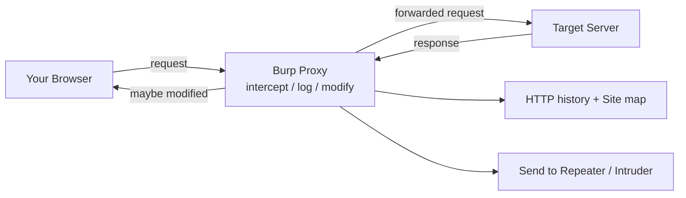
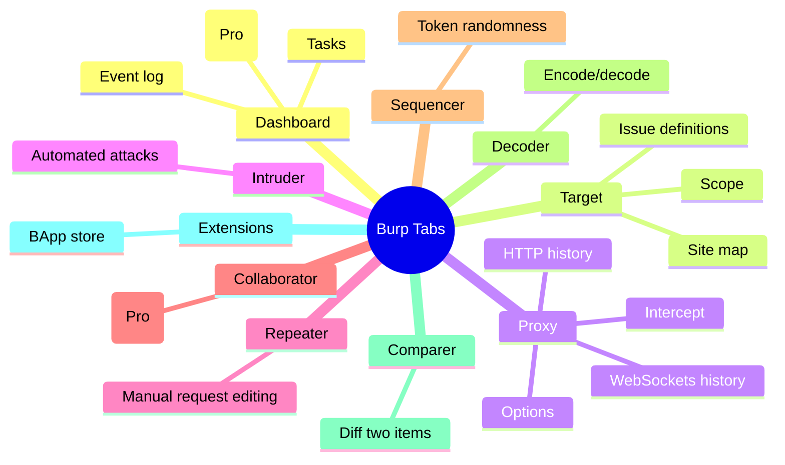
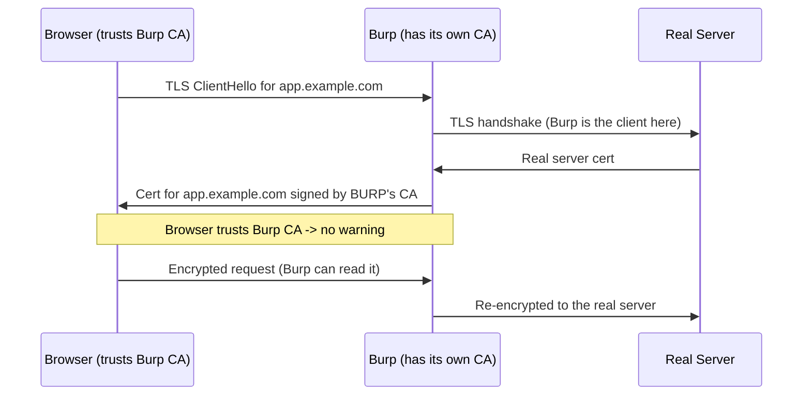
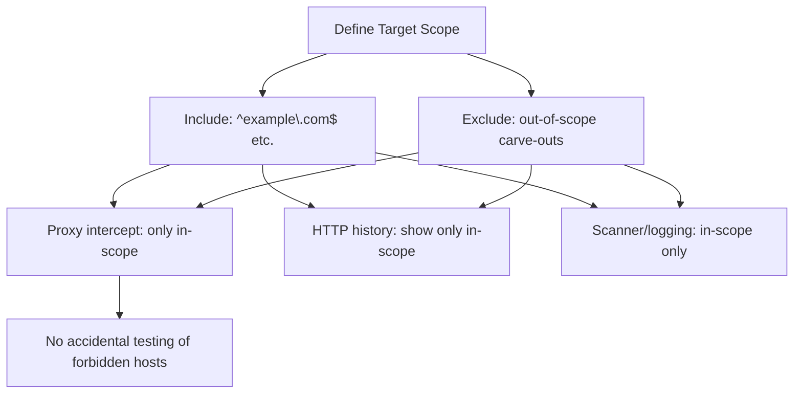

This is Chapter 1 of the Web Tooling notebook — Notebook 22 — and the first of a
three-part deep dive on **Burp Suite**, the single most important tool in web
application security. The previous notebook taught you *where* to look (recon and
attack surface) and the reporting discipline that turns a finding into a payout.
This chapter teaches the instrument you will spend the most hours inside: an
**intercepting proxy** that lets you see, pause, and rewrite every request your
browser sends and every response it receives. Almost every web bug in the rest of
this notebook — injection, access control, authentication flaws, SSRF — is found
and exploited by manipulating traffic in exactly the way Burp makes possible.

This part is about *fundamentals done properly*: what a proxy is, getting Burp
installed and trusting its certificate so HTTPS is readable, driving the Proxy and
Intercept, and — critically — configuring **scope** so the tool never records or
attacks anything the program hasn't authorised. Parts 2 and 3 build on this to cover
Repeater/Intruder/Sequencer/Decoder and then Scanner/extensions/Collaborator.

## Why This Matters

A web browser is designed to *hide* the machinery. You click a button and a page
appears; you never see the raw `POST /login` with its headers, cookies, and JSON
body, and you certainly can't change the `user_id=1024` to `user_id=1025` before it
leaves your machine. But *every* interesting web vulnerability lives in that hidden
machinery. To find an IDOR you must change an ID mid-flight. To find SQL injection
you must slip a quote into a parameter. To test access control you must replay one
user's request with another user's session. None of that is possible through the
browser UI alone.

An intercepting proxy restores that control. Burp sits between your browser and the
server, so **you** decide what actually gets sent. It logs everything for later
analysis, lets you replay and mutate requests, and provides the automation
(Intruder, Scanner) that turns one manual test into thousands. Learning Burp well is
not optional for web security — it is the price of admission. And learning to
**scope** it correctly is the price of staying legal and considerate, exactly as
Chapter 1 of the previous notebook demanded.



## Part 1: What Is a Proxy, Really?

A **proxy** is a program that traffic passes *through* on its way somewhere else. A
**forward proxy** sits in front of a client (your browser) and relays its requests
to servers on the internet. An **intercepting proxy** is a forward proxy that also
lets a human *pause and edit* that traffic. That is what Burp is.

Walk through what happens without and with Burp:

- **Without Burp.** Browser → (directly) → server. You see rendered pages; the raw
  HTTP is invisible and unmodifiable.
- **With Burp.** Browser → Burp (listening on `127.0.0.1:8080`) → server. Burp can
  show you the raw request, hold it so you can change any byte, then forward it. The
  response comes back through Burp too, so you can read and even alter it before the
  browser renders it.

For this to work, the browser must be *told* to send its traffic to Burp instead of
straight to the internet — that's the **proxy setting** (`127.0.0.1:8080`). And for
**HTTPS** to be readable, Burp performs a deliberate, local **man-in-the-middle**
using its own certificate authority — explained in Part 4, because it trips up
everyone the first time.

> **Terminology you'll see.** "Proxy" (the general concept), "intercepting proxy"
> (Burp/ZAP specifically), "MITM" (man-in-the-middle — what Burp does to HTTPS on
> your own machine, with your permission), and "upstream proxy" (a proxy that Burp
> itself forwards to — e.g. chaining Burp into a SOCKS proxy or another tool). Keep
> them straight; they recur throughout the notebook.

## Part 2: Installing Burp Suite

Burp comes in three editions; two matter to you now:

| Edition | Cost | Key limits | Use it for |
| --- | --- | --- | --- |
| **Community** | Free | No active Scanner; Intruder is rate-throttled; no saved projects | Learning; manual testing; most of this chapter |
| **Professional** | Paid (annual license) | Full Scanner, fast Intruder, project files, extensions marketplace | Serious/full-time work |
| **Enterprise** | Paid (server) | CI/CD scanning at scale | Org-wide automation |

Everything in *this* chapter works in **Community**. The Scanner (Part covered in
Chapter 3 of this notebook) needs Professional.

Install options:

```bash
# Kali Linux ships Burp Community pre-installed:
burpsuite            # launches it

# Elsewhere: download the installer from portswigger.net/burp
# It bundles its own Java runtime (JRE), so you don't install Java separately.
# Linux:
chmod +x burpsuite_community_linux_v*.sh
./burpsuite_community_linux_v*.sh     # graphical installer

# Verify Java if running the standalone JAR instead:
java -jar burpsuite_community.jar
```

On first launch, choose **Temporary project** (Community can't save projects) and
**Use Burp defaults**. You land on the **Dashboard**.

## Part 3: The Burp UI, Tab by Tab

Burp's top-level tabs are the map of the whole tool. You'll live in Proxy, Target,
and Repeater; the rest you'll grow into.



- **Dashboard** — running tasks, an event log, and (Pro) discovered issues. In
  Community it's mostly the event log and a live capture task.
- **Target** — the **Site map** (a tree of every host/path Burp has seen) and the
  **Scope** settings (Part 6). This is your project's memory of the application.
- **Proxy** — the interceptor and the **HTTP history** (every request/response that
  passed through). The most-used tab.
- **Intruder** — automated, customisable attacks (fuzzing, brute force) — Chapter 2.
- **Repeater** — hand-edit and re-send a single request repeatedly — Chapter 2, but
  you'll start using it here.
- **Sequencer / Decoder / Comparer** — token analysis, encoding, and diffing —
  Chapter 2.
- **Extensions** — the **BApp Store** of add-ons — Chapter 3.
- **Collaborator** — out-of-band interaction capture (for blind SSRF/XXE) — Chapter
  3 (Pro).

## Part 4: The Certificate Dance — Reading HTTPS

Here is the step that confuses every newcomer. When your browser talks HTTPS to a
site, the connection is encrypted end-to-end and authenticated by the site's TLS
certificate, which is signed by a **Certificate Authority (CA)** your browser
trusts. A proxy in the middle would normally *break* this — the browser would see a
certificate not signed by a trusted CA and throw a scary warning. That's TLS doing
its job: preventing exactly the kind of interception Burp performs.

Burp's solution: it generates **its own CA certificate**, and you *deliberately
install and trust it on your own machine*. Now, when Burp intercepts an HTTPS
connection, it mints an on-the-fly certificate for the target site signed by Burp's
CA — which your browser now trusts — so the browser is happy, and Burp can read the
decrypted traffic. Crucially, this only works because **you chose to trust Burp's CA
on your own device.** It is not a way to attack other people's HTTPS; it's a way to
inspect *your own* browser's traffic.



### Installing Burp's CA certificate

1. Start Burp. Configure your browser to use `127.0.0.1:8080` (Part 5).
2. In that browser, visit **`http://burp`** — Burp serves a page with a
   **"CA Certificate"** download button. Download `cacert.der`.
3. Import it into your browser/OS trust store as a **trusted root CA for identifying
   websites**:
   - **Firefox** (has its own store): Settings → Privacy & Security → Certificates →
     View Certificates → Authorities → Import → select `cacert.der` → check "Trust
     this CA to identify websites."
   - **Chrome/Edge/OS**: import into the system trust store (e.g. `certmgr.msc` on
     Windows → Trusted Root Certification Authorities; Keychain on macOS; or use
     Burp's own Chromium which trusts it automatically).

> **Security note — take the CA out when you're done, and never share it.** The
> Burp CA's private key lives in your Burp config. If someone got both your trusted
> CA *and* its private key they could MITM your HTTPS. Keep it to your testing
> machine, don't install it on your daily-driver phone/laptop casually, and know how
> to remove it. Burp regenerates a unique CA per installation, so yours is yours.

## Part 5: Pointing the Browser at Burp

Two clean approaches:

### 5.1 Burp's built-in browser (easiest)

Burp Pro/Community bundles a pre-configured Chromium. **Proxy → Intercept → Open
Browser** launches a Chromium that already routes through Burp *and* already trusts
the Burp CA — zero setup, and it doesn't pollute your normal browser. This is the
fastest way to start and what most people use day-to-day.

### 5.2 FoxyProxy in your own browser (flexible)

For your own Firefox/Chrome, install the **FoxyProxy** extension and add a proxy
profile pointing at `127.0.0.1:8080`. FoxyProxy lets you toggle the proxy on/off
with one click, so you can browse normally and flip Burp on only when testing:

```
FoxyProxy → Add:
  Title: Burp
  Proxy Type: HTTP
  Host: 127.0.0.1
  Port: 8080
```

Toggling FoxyProxy to "Burp" sends traffic through Burp; toggling to "Off/Default"
restores direct browsing. This separation keeps unrelated tabs (email, chat) out of
your HTTP history — which matters for both noise and scope hygiene.

> **Common first-run failure.** If pages won't load or show TLS errors after setting
> the proxy, it's almost always (a) the CA cert isn't trusted yet, or (b) something
> else is already on port 8080. Change Burp's listener under **Proxy → Options →
> Proxy Listeners** (e.g. to `8081`) and update the browser to match.

## Part 6: Scope — The Most Important Setting You'll Configure

Burp will happily proxy, log, and (with Scanner) attack *everything* your browser
touches. Without scope, your HTTP history fills with Google, analytics, CDNs, and —
dangerously — **out-of-scope hosts** you must not test. **Target scope** constrains
Burp to the assets you're authorised to work on. Configuring it is a professional
and legal necessity, the direct application of the scope discipline from the Bug
Bounty Intro chapter.

### 6.1 Defining scope

Go to **Target → Scope**. Add included hosts. Burp scope supports simple host lists
and **regex/advanced** rules. To include a program's wildcard `*.example.com`:

- Simple: click **Add**, use "Use advanced scope control," and add an entry with
  Host matching `^(.*\.)?example\.com$`.
- Or add specific hosts (`app.example.com`, `api.example.com`) individually for
  tight control.

Add **exclusions** for out-of-scope carve-outs (e.g. `blog.example.com` hosted by a
third party) under the **Exclude from scope** list. A representative scope config:

```
Include in scope (regex, Host):
  ^(.*\.)?example\.com$

Exclude from scope (regex, Host):
  ^blog\.example\.com$        # third-party WordPress — out of scope
  ^status\.example\.com$      # vendor-hosted status page
```

### 6.2 Making the whole tool respect scope

Defining scope isn't enough — tell Burp to *act* on it:

- **Proxy → Options → Intercept Client Requests**: add a rule "And URL Is in target
  scope" so intercept only fires for in-scope traffic.
- **Target → Site map** filter: right-click the scope area → **"Show only in-scope
  items"** so your map isn't buried in third-party noise.
- **Proxy → HTTP history** display filter: tick **"Show only in-scope items."**
- **Logging (Pro)**: restrict logging and any automated task to in-scope only.



> **Why this is a safety control, not a convenience.** With Scanner (Pro), an
> unscoped "audit" can fire thousands of active payloads at *whatever is in your
> history* — including that out-of-scope host you accidentally clicked. Correct
> scope is what stops a stray click from becoming an unauthorised attack. Set scope
> **before** you start clicking around a new target, every time.

## Part 7: Intercept — Pausing and Editing Live Traffic

The **Proxy → Intercept** tab is where you catch a request in flight and change it.

### 7.1 The intercept toggle

**"Intercept is on"** holds every (in-scope) request so you can inspect/edit it;
nothing proceeds until you click **Forward**. **"Intercept is off"** lets traffic
flow through untouched but still logs it to HTTP history. Beginners leave intercept
*on* and get frustrated when every image and API call stops the world — the pro
workflow is usually **intercept off**, browse normally to populate history, then
turn intercept on only when you want to catch a specific action, or just send items
from history to Repeater.

### 7.2 A worked intercept

Suppose you're testing a login. With intercept on, you submit the form and Burp
freezes this:

```
POST /rest/user/login HTTP/2
Host: app.example.com
Content-Type: application/json
Content-Length: 46
Cookie: session=eyJhbGciOi...

{"email":"test@researcher.test","password":"Passw0rd!"}
```

Right here you can edit any byte before it's sent — change the email, add a header,
mangle the JSON. Then **Forward**. The response returns through Burp:

```
HTTP/2 200 OK
Content-Type: application/json
Set-Cookie: token=eyJ...; Path=/

{"authentication":{"token":"eyJ...","umail":"test@researcher.test"}}
```

You can intercept **responses** too (enable "Intercept responses" in Proxy →
Options), letting you, for example, flip a `"isAdmin":false` to `true` in a response
to see how the client-side behaves — a quick way to spot client-side authorisation
checks that the server should be enforcing.

### 7.3 Intercept actions

While a request is held, right-click for actions: **Forward**, **Drop** (discard
it), **Send to Repeater** (`Ctrl+R` — the workhorse for manual testing),
**Send to Intruder** (`Ctrl+I`), **Send to Comparer/Sequencer**, and **Do
intercept → Response to this request** (catch the paired response). Sending an
interesting request to **Repeater** is the single most common move in all of Burp.

## Part 8: HTTP History and the Site Map — Your Application Memory

Two views record what you've seen:

- **Proxy → HTTP history**: a chronological table of every request/response, with
  columns for method, URL, status, length, MIME type, and more. Filter it (top bar)
  to in-scope only, by status code, by MIME type, or by search term. This is where
  you go to find "that request from ten minutes ago" and send it to Repeater.
- **Target → Site map**: the same data organised as a *tree* of hosts → folders →
  endpoints, with each node showing the requests/responses seen. As you browse the
  app (with intercept off), the site map fills in — a live map of the attack
  surface, complementing the recon from the previous notebook.

Practical habits:

- Browse the whole app once with intercept off to **populate the site map** — click
  every link, submit every form with test data. This "passive spidering by hand" is
  more thorough and less noisy than automated crawling and keeps you inside scope.
- Use HTTP history's filter to isolate interesting traffic: e.g. show only
  `POST`/`PUT`, or only requests with parameters, or only JSON responses.
- Right-click a host in the site map → **"Add to scope"** as a fast way to scope a
  newly-discovered in-program host.

## Part 9: Match and Replace, and Upstream Proxying

Two configuration features you'll use constantly once you're past the basics.

### 9.1 Match and Replace

**Proxy → Options → Match and Replace** rewrites parts of every request/response
automatically. Uses:

- Force a mobile view or a specific `User-Agent`:
  `Request header` → match `^User-Agent.*$` → replace `User-Agent: MyTestAgent`.
- Add your identifying bug-bounty header to *every* request automatically:
  add a rule that inserts `X-Bug-Bounty: h1-yourname` into request headers — so the
  blue team can distinguish your authorised testing (per Chapter 1).
- Strip a pesky cache header, or swap a value app-wide during testing.

### 9.2 Upstream proxies and tool chaining

**User options → Connections → Upstream Proxy Servers** makes Burp forward its
traffic *through another proxy*. Combined with the ProjectDiscovery stack from the
previous notebook, you can route tools through Burp so their traffic is logged and
manipulable:

```bash
# Send httpx / nuclei / ffuf traffic THROUGH Burp so it appears in HTTP history:
httpx -l live.txt -http-proxy http://127.0.0.1:8080 -silent
ffuf -u https://app.example.com/FUZZ -w words.txt -x http://127.0.0.1:8080
nuclei -l live.txt -proxy http://127.0.0.1:8080
# Each tool's -proxy/-http-proxy/-x flag routes its requests via Burp,
# so you can inspect and replay anything interesting they hit.
```

This makes Burp the central "tap" on all your web traffic — manual and automated —
which is exactly how experienced testers work: recon tools feed Burp, and Burp is
where the interesting requests get pulled apart by hand.

## Part 10: Hands-On Lab — First Intercept to First Modified Request

Do this against a legal target: **PortSwigger Web Security Academy** labs (free,
built for exactly this) or **OWASP Juice Shop** running locally (from the previous
notebook's lab). Never intercept a site you're not authorised to test.

### Step 1 — Launch and scope

1. Start Burp → Temporary project → Burp defaults.
2. **Proxy → Intercept → Open Browser** (built-in Chromium).
3. Browse to your target (`http://localhost:3000` for Juice Shop).
4. **Target → Scope → Add** the target host. Turn on "Show only in-scope items" in
   HTTP history. You should now only be logging the app, not the internet.

### Step 2 — Populate history with intercept OFF

Ensure **"Intercept is off."** Click through the app: open products, register a test
account, log in, view your profile. Watch **HTTP history** and the **Site map** fill
in. Notice the API calls behind each UI action (`/rest/products/search?q=`,
`/rest/user/login`, `/api/BasketItems`).

### Step 3 — Intercept and modify a request

1. Turn **"Intercept is on."**
2. In the app, perform a search or add an item to the basket.
3. Burp freezes the request. Read it. Change a value — e.g. in a search request
   change `q=apple` to `q=apple'` (a single quote, a classic SQL-injection probe),
   or in an "add to basket" request change the `quantity` or a `BasketId`.
4. **Forward** and watch the response. An error, a stack trace, or unexpected data
   is a lead. (Actually exploiting these is later-chapter material — here you're
   proving you can *reach in and change traffic*.)

### Step 4 — Send to Repeater and iterate

1. Find that search request in **HTTP history**, right-click → **Send to Repeater**
   (`Ctrl+R`).
2. Switch to **Repeater**. Now you can edit and re-send the *same* request as many
   times as you like without touching the browser. Change `q=apple'` to `q=apple''`,
   send, compare responses. This send-to-Repeater-and-iterate loop is the core of
   manual web testing and the bridge into Chapter 2.

### Step 5 — Prove the tap works end to end

Route a recon tool through Burp and watch it appear:

```bash
ffuf -u http://localhost:3000/FUZZ -w /usr/share/seclists/Discovery/Web-Content/common.txt -x http://127.0.0.1:8080 -mc 200,301,403
```

Every path ffuf tries now shows up in Burp's HTTP history, and any interesting hit
can be sent straight to Repeater. You've built the manual+automated workflow in
miniature.

The deliverable: a Burp project (or notes) showing your scoped target, a populated
site map, one request you successfully intercepted and modified, and one request in
Repeater you re-sent with a variation.

> **CTF connection.** Web CTF challenges are almost always solved *in Burp*: you
> intercept the request, notice the parameter the challenge hinges on, and mutate it
> in Repeater until the flag drops. The exact muscle from this lab — see the raw
> request, change the interesting field, resend — is what web CTFs test.

## Part 11: Non-Proxy-Aware Clients, Mobile, and Pinning (Overview)

Not everything is a cooperative desktop browser. A quick orientation (depth comes in
later mobile/API chapters):

- **Non-proxy-aware clients** (some thick clients, CLI tools) ignore system proxy
  settings. Use Burp's **invisible proxying** (Proxy → Options → Proxy Listeners →
  "Support invisible proxying") plus host-file redirection, or route the tool with
  its own `--proxy` flag.
- **Mobile apps.** Set the phone's Wi-Fi proxy to your machine's IP and Burp's port,
  install Burp's CA on the device, and traffic flows through Burp — *if* the app
  doesn't pin.
- **Certificate pinning.** Some apps ship the expected server certificate/public key
  and refuse any other, defeating the Burp CA trick. Bypassing pinning (e.g. with
  Frida/Objection on a rooted/jailbroken test device) is an advanced, app-specific
  topic, and many programs forbid it or require your own test device — check scope
  first.

## Part 12: Detection & Defense Angle

Proxy-based testing is visible and, at scale, distinctive — worth understanding from
both chairs.

- **What the server sees.** Requests through Burp look like normal browser traffic
  *unless* you leave tells: an unusual `User-Agent`, malformed payloads, or a burst
  of near-identical requests (Repeater/Intruder). Your identifying `X-Bug-Bounty`
  header (Part 9) is what keeps this from being mistaken for an attack.
- **Blue-team detection.** Defenders spot manual testing by payload signatures in a
  WAF (a `'` or `<script>` in a parameter), by anomaly detection on request rates,
  and by the mismatch between a "browser" User-Agent and non-browser request timing.
  This is why later chapters cover WAF evasion *and* WAF tuning.
- **Defensive lesson.** The very ease with which Burp rewrites client-side values
  (Part 7.2, flipping `isAdmin`) is the concrete demonstration of the cardinal web
  rule: **never trust the client.** Any check, price, role, or quantity enforced
  only in the browser is trivially bypassed with a proxy. Server-side validation is
  the only validation.

## Part 13: Common Mistakes and How to Avoid Them

| Mistake | Why it hurts | The fix |
| --- | --- | --- |
| Testing before setting scope | Logs/attacks hit out-of-scope hosts | Configure Target scope first, every time |
| Leaving intercept always on | Every asset stalls; frustration | Intercept off; turn on only to catch an action |
| CA cert not trusted | HTTPS errors, no traffic | Install Burp CA; or use built-in browser |
| Port 8080 already in use | Burp listener won't bind | Change listener port; match browser |
| History polluted with 3rd-party noise | Can't find real requests | "Show only in-scope items" filters |
| Editing in HTTP history (read-only) | Can't resend from there | Send to Repeater and edit there |
| Sharing/installing Burp CA carelessly | Real MITM exposure | Keep CA on test machine only |
| Forgetting identifying header | Blue team treats you as attacker | Match-and-replace an X-Bug-Bounty header |

## Part 14: Final Revision / Summary

Burp Suite is an **intercepting proxy**: it sits between your browser and the server
so you can **see, pause, modify, log, and replay** HTTP/HTTPS traffic — the
prerequisite for finding essentially every web vulnerability. To read HTTPS you
**install and trust Burp's own CA certificate on your machine**, which lets Burp
perform a consenting, local MITM; the browser reaches Burp either via the **built-in
Chromium** (zero setup) or **FoxyProxy** on your own browser pointed at
`127.0.0.1:8080`.

The tool is organised into tabs — **Proxy** (Intercept + HTTP history), **Target**
(Site map + Scope), **Repeater**, **Intruder**, and more. The most important
configuration is **Target scope**: include the program's authorised hosts, exclude
carve-outs, and make Proxy/history/Scanner all respect it, so the tool never records
or attacks anything you're not allowed to. The daily workflow is: scope the target →
browse with intercept **off** to populate the site map → turn intercept **on** to
catch a specific request → modify it or **send it to Repeater** to iterate.
**Match-and-replace** automates header rewrites (including your identifying
bug-bounty header), and **upstream proxying** lets you route recon tools (httpx,
ffuf, nuclei) through Burp so all traffic — manual and automated — converges in one
place. Above all, Burp's trivial rewriting of client-side values is the standing
proof that the client can never be trusted. Chapter 2 turns this foundation into
firepower with Repeater, Intruder, Sequencer and Decoder.

## Part 15: Cheat Sheet / Quick Reference

**Setup**

```
Built-in browser : Proxy → Intercept → Open Browser  (CA pre-trusted)
Manual proxy     : browser → 127.0.0.1:8080  (FoxyProxy toggle)
Install CA       : visit http://burp → download cacert.der → trust as root CA
Change port      : Proxy → Options → Proxy Listeners
```

**Scope**

```
Target → Scope → Add:  ^(.*\.)?example\.com$        (include wildcard)
Exclude:               ^blog\.example\.com$          (carve-out)
Then enable "Show only in-scope items" in HTTP history + Site map,
and "URL is in target scope" in Intercept rules.
```

**Essential shortcuts**

```
Ctrl+R : send to Repeater
Ctrl+I : send to Intruder
Ctrl+Shift+R : go to Repeater
Ctrl+F : forward intercepted request
Ctrl+Space (Repeater) : send request
```

**Workflow**

```
1. Scope the target.
2. Intercept OFF → browse app → populate Site map / HTTP history.
3. Intercept ON → catch the interesting request.
4. Modify inline, or Ctrl+R to Repeater and iterate.
5. Route tools through Burp: -x/-proxy http://127.0.0.1:8080
```

**Match & Replace (add identifying header)**

```
Proxy → Options → Match and Replace → Add:
  Type: Request header
  Match: (leave blank to add)
  Replace: X-Bug-Bounty: h1-yourname
```

## Part 16: Practice Labs & Resources

- **PortSwigger Web Security Academy — "Getting started with Burp"** and every
  **apprentice** lab (`portswigger.net/web-security`) — built by Burp's authors;
  the canonical way to learn the tool. Start with the Proxy/Repeater intro labs.
- **PortSwigger's official Burp documentation** (`portswigger.net/burp/documentation`)
  — clear, task-oriented; read the Proxy and Target/Scope sections in full.
- **OWASP Juice Shop** (`owasp.org/www-project-juice-shop`) — the local target from
  the previous notebook; ideal for free-form intercept practice.
- **TryHackMe: "Burp Suite: The Basics", "Burp Suite: Repeater"** rooms — guided,
  legal walkthroughs mirroring this chapter.
- **PentesterLab** and **HackTheBox Academy "Using the Metasploit Framework"/"Web
  Requests"** modules — complementary practice reaching web apps through a proxy.
- **FoxyProxy** (`getfoxyproxy.org`) — the browser extension for one-click proxy
  toggling.

Practice questions:

1. Explain, in your own words, why installing Burp's CA lets it read HTTPS *and* why
   this does not let you decrypt other people's traffic.
2. You've set Target scope to `^(.*\.)?example\.com$` but your HTTP history is still
   full of Google and CDN requests. Name two settings you must also change.
3. When would you keep Intercept **off** but still be actively testing? What does
   Burp record in that mode?
4. Give a concrete reason a professional adds an `X-Bug-Bounty` header via
   Match-and-Replace, and describe how you'd configure it.
5. You route `ffuf` through Burp with `-x http://127.0.0.1:8080` but see nothing in
   HTTP history. List two likely causes.
