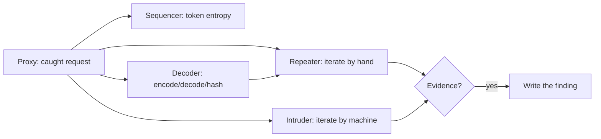
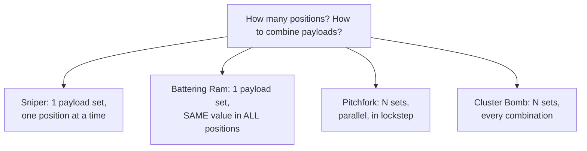
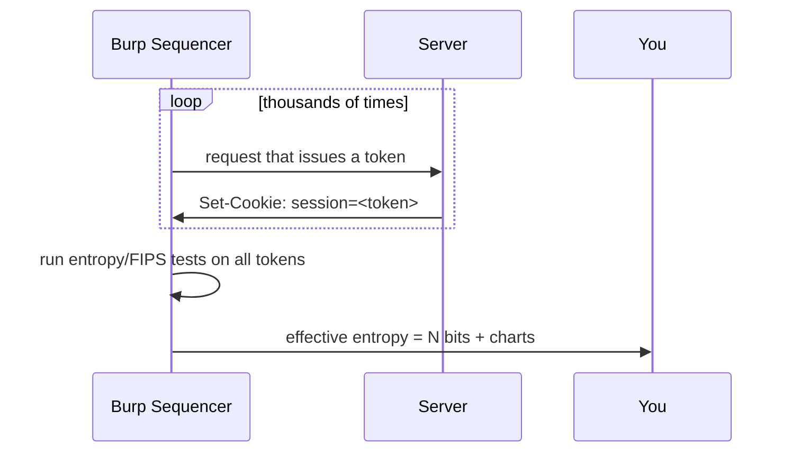

This is Chapter 2 of the Web Tooling notebook and the second part of the Burp Suite
series. Chapter 1 got you intercepting and scoping traffic — Burp as a *window* onto
HTTP. This chapter turns Burp into a *workshop*. Four tools do the heavy lifting of
manual web testing: **Repeater** (edit and resend one request, over and over, with
precision), **Intruder** (automate that editing across huge payload sets),
**Sequencer** (measure whether tokens are truly random), and **Decoder** (encode,
decode, and hash data). Master these and you can express almost any web-testing idea
as a concrete experiment against the target.

Everything here assumes the Chapter 1 setup: Burp installed, CA trusted, browser
proxied, and — non-negotiably — **Target scope configured** so these tools only ever
fire at hosts you are authorised to test. Intruder in particular is a machine gun;
scope and throttling are what keep it a *tool* rather than a *DoS*.

## Why This Matters

Chapter 1 let you change one request by hand. But real testing is *iterative* and
*combinatorial*. To confirm SQL injection you send a quote, then a balanced quote,
then a boolean pair, comparing each response — that's **Repeater**. To find which of
500 user IDs you can access, or which of 10,000 passwords works, or which of 6,000
parameter names the endpoint secretly honours, you need to send thousands of
variations and diff the results automatically — that's **Intruder**. To argue that a
"random" session token is actually predictable (so you could hijack sessions) you
need to measure its entropy statistically — that's **Sequencer**. And to make sense
of the Base64/URL/hex/JWT soup that web apps run on, you need **Decoder**.

These four convert the vague intuition "something's off here" into evidence a
triager can't argue with. They are where manual skill and light automation meet, and
where most bounty-worthy web bugs are actually confirmed.



## Part 1: Repeater — The Surgical Tool

**Repeater** holds a single request that you can edit and resend endlessly, viewing
each response side by side. It is the most-used manual tool in Burp because *most
web testing is a conversation*: send a probe, read the reply, form a hypothesis,
adjust, send again.

### 1.1 Getting a request into Repeater

From anywhere (Proxy intercept, HTTP history, Site map, Intruder), right-click →
**Send to Repeater** (`Ctrl+R`). Switch to the Repeater tab (`Ctrl+Shift+R`). You
see the request on the left and, after sending (`Ctrl+Space` or the **Send**
button), the response on the right.

### 1.2 The Repeater workflow — hypothesis-driven testing

Repeater's power is discipline, not features. The loop:

1. **Baseline.** Send the request unmodified. Note status, length, timing, and key
   response content. This is your control.
2. **One change.** Alter exactly one thing (a single parameter, one header).
3. **Compare.** Resend; diff the response against the baseline. Did status, length,
   content, or timing change? *Why?*
4. **Iterate.** Refine the hypothesis and repeat.

A worked example — probing for SQL injection on a product lookup:

```
# Baseline
GET /rest/products/1 HTTP/2
Host: app.example.com
→ 200 OK, {"id":1,"name":"Apple Juice","price":1.99}   (len 512)

# Probe 1: break the query with a quote
GET /rest/products/1' HTTP/2
→ 500 Internal Server Error, "SQLITE_ERROR: near ...'"  (len predator)  ← lead!

# Probe 2: balanced quote (valid SQL again)
GET /rest/products/1'-- - HTTP/2
→ 200 OK   ← behaviour differs between broken and balanced = strong SQLi signal
```

The *difference* between the broken and the balanced probe — error vs success — is
the evidence. You didn't need to dump anything; you demonstrated the parameter
reaches a SQL query. (Exploiting it is the Injection notebook's job; confirming it is
Repeater's.)

### 1.3 Repeater features that matter

- **Tabs.** Each Repeater tab is an independent request; rename them
  (double-click) so `login`, `idor-order`, `search-sqli` are easy to find.
- **Change request method / body encoding.** Right-click → **Change request method**
  to flip GET↔POST instantly (great for testing HTTP method confusion).
- **Inspector** (right panel). Decodes and lets you edit request/response components
  — headers, cookies, query params, body params — in a structured view, and shows
  the length/encoding of selected text. Invaluable for editing JSON/params without
  breaking `Content-Length`.
- **Follow redirects** and **show response in browser** (right-click the response)
  to render a page you built via a mutated request.
- **Send history** — Repeater keeps a per-tab history (`<` `>` arrows) so you can
  step back to a previous request/response pair.

> **Bug-bounty reality.** The vast majority of your accepted bugs will be *confirmed*
> in Repeater. IDOR: change the ID, resend, see someone else's (your second test
> account's) data. Auth bypass: strip the auth header, resend, still get 200.
> Business logic: reorder or repeat a step, resend, get a free item. The pattern is
> always baseline → one change → compare. Learn to be ruthless about changing *one
> variable at a time* so you always know what caused the change.

## Part 2: Intruder — Automation Over Payloads

**Intruder** does what Repeater does, but for hundreds or thousands of automated
variations. You mark **positions** in a request (the bytes to vary), supply
**payloads** (the values to try), and Intruder sends one request per payload,
tabulating the responses so outliers jump out.

Send a request to Intruder with `Ctrl+I`, then work through its sub-tabs:
**Positions**, **Payloads**, **Resource pool**, **Settings**.

### 2.1 Positions — marking what varies

On the **Positions** tab, Burp auto-marks candidate insertion points with `§...§`
markers. **Clear §** and mark your own by selecting text and clicking **Add §**. The
positions plus the *attack type* determine how payloads are distributed.

### 2.2 The four attack types (the concept people get wrong)



| Attack type | Payload sets | Behaviour | Classic use |
| --- | --- | --- | --- |
| **Sniper** | 1 | Puts each payload in **one position at a time**, cycling through positions singly | Fuzzing a single parameter; testing each of several params one by one |
| **Battering Ram** | 1 | Puts the **same** payload into **all** marked positions simultaneously | When the same value must appear in several places (e.g. a token in header and body) |
| **Pitchfork** | up to 20 | Iterates multiple sets **in parallel** (1st with 1st, 2nd with 2nd) | Paired data: username[i] + password[i] from two lists (credential stuffing) |
| **Cluster Bomb** | up to 20 | Tries **every combination** of the sets (nested loops) | Brute force: every username × every password |

Getting these right is the whole skill. If you have a username list and a password
list and want to try *all pairs*, that's **Cluster Bomb**; if you have leaked
`user:pass` pairs and want to try each pair as-is, that's **Pitchfork**.

### 2.3 Payloads — where the values come from

On the **Payloads** tab, pick a **payload type** and a **payload set**:

- **Simple list** — paste or load values (from SecLists, a file, etc.).
- **Runtime file** — stream a huge wordlist from disk without loading it all.
- **Numbers** — generate a numeric range/step (perfect for IDOR: `1..1000`).
- **Brute forcer** — generate character combinations.
- **Dates, Username generator, Bit flipper, Case modification**, etc.

**Payload processing** rules transform each payload before sending — e.g. URL-encode
it, prefix/suffix it, hash it, or apply a match/replace. **Payload encoding**
controls URL-encoding of special characters. Example: to brute a `user_id` for IDOR:

```
Attack type : Sniper
Position    : GET /api/orders/§1§
Payload type: Numbers   (from 1 to 1000, step 1)
```

### 2.4 Reading results — grep-match and grep-extract

Intruder tabulates every response with **status, length, and timing**. Outliers are
your hits — a different length or status among a sea of identical `403`s usually
means "this one worked." Sharpen it with **Settings → Grep - Match** (flag responses
containing a string like `"balance"` or `admin`) and **Grep - Extract** (pull a
value — e.g. the account name — out of each response into its own column). For a
username brute you might Grep-Match on the absence of `"Invalid credentials"`.

### 2.5 Throttling, the resource pool, and Community limits

Intruder is where you can accidentally hammer a target. Control the rate:

- **Resource pool** (tab) — set **maximum concurrent requests** and a
  **delay between requests** (fixed or with random variance). On a small target,
  1–2 concurrent with a 100–500 ms delay is considerate.
- **Community Edition throttles Intruder heavily** (a hard per-request delay), making
  large attacks painfully slow — this is deliberate, to push serious users to
  Professional. For big brute forces in Community, people often use **ffuf** instead
  (covered in Chapter 5) and reserve Intruder for smaller, precise attacks.

> **OPSEC / rules.** Respect the program's rate-limit and automation rules from
> Chapter 1. An unthrottled Cluster Bomb against a fragile app is a denial of
> service — forbidden and potentially criminal. Throttle, keep it in scope, and
> attach your identifying header (Match-and-Replace from Chapter 1). Automated brute
> force also generates exactly the auth-failure spikes a blue team alerts on; that's
> expected for authorised testing, which is why the identifying header matters.

### 2.6 Worked Intruder attacks

**A. Fuzzing a parameter for injection/errors (Sniper).** Mark the `search`
parameter, load a fuzzing list (`/usr/share/seclists/Fuzzing/special-chars.txt`),
Grep-Match on `error|exception|syntax`. Outlier responses reveal injection points.

**B. IDOR enumeration (Sniper + Numbers).** Mark the object ID, Numbers 1–1000,
Grep-Extract the owner's name/email. Rows whose extracted owner isn't *you* prove
horizontal access-control failure — but stop at proving it with a couple of IDs, do
not harvest real users.

**C. Credential stuffing of your own test accounts (Pitchfork).** Two lists
(usernames, passwords) in lockstep, Grep-Match on the success indicator. Only ever
against accounts you own or the program authorises.

**D. Hidden parameter discovery (Sniper).** Position a bogus parameter name, payload
set = a param wordlist, Grep on response-length change — a Burp-native version of
Arjun (Chapter 5).

## Part 3: Sequencer — Are Those Tokens Actually Random?

Session cookies, password-reset tokens, CSRF tokens and API keys are only safe if
they are **unpredictable**. If an attacker can guess or compute the next token, they
can hijack sessions or forge requests. **Sequencer** samples a large number of
tokens and runs statistical **randomness/entropy** tests on them to estimate how
many bits of real unpredictability they contain.

### 3.1 How to run it

1. Find a response that *issues* a token (e.g. `Set-Cookie: session=...` after
   login, or a hidden `csrf` field).
2. Right-click → **Send to Sequencer.**
3. In Sequencer, select the token's **location** (the cookie or the parameter).
4. **Start live capture** — Sequencer repeatedly triggers the request and collects
   tokens (aim for a few thousand samples).
5. **Analyze now** — Burp reports **effective entropy** in bits and per-character/
   per-bit test results (FIPS-style tests: monobit, poker, runs, etc.).

### 3.2 Interpreting the result

- **High entropy** (e.g. ~120+ bits for a session token) → effectively
  unpredictable; not a finding.
- **Low entropy** (e.g. tokens that are sequential, timestamp-based, or only 20–30
  bits of real randomness) → **predictable tokens**, a real, sometimes high-severity
  bug (session prediction, reset-token guessing). Sequencer's report *is* your
  evidence: "over 10,000 samples, effective entropy was ~18 bits, and the low bytes
  increment predictably."



> **Reality check.** Most modern frameworks issue strong random tokens, so Sequencer
> rarely fires — but when it does (homegrown token schemes, predictable reset codes),
> it's a clean, well-evidenced, hard-to-argue finding. It's also the right tool to
> *disprove* a randomness claim before you waste time trying to guess tokens.

## Part 4: Decoder and the Inspector — Speaking Web Encodings

Web apps drown in encodings: URL-encoding, Base64, hex, HTML entities, gzip, and
hashes. **Decoder** (and the newer **Inspector** panel in Repeater/Proxy) let you
transform data quickly.

### 4.1 Decoder

Paste data, then **Decode as** / **Encode as**: URL, HTML, Base64, ASCII hex, octal,
binary, gzip. Chain operations (Base64-decode, then URL-decode) to peel layered
encodings. **Hash** produces MD5/SHA-1/SHA-256 etc. "Smart decode" guesses the
encoding.

Common real uses:

- Decode a Base64 cookie to reveal its structure:
  `eyJ1c2VyIjoiYWRtaW4ifQ==` → `{"user":"admin"}` — and if the app trusts that
  without a signature, you can *re-encode* a tampered value and swap it in (a real
  bug class).
- Decode a JWT's three Base64URL segments to read the header and claims (deep JWT
  attacks come later; Decoder is how you *read* one now).
- URL-decode a nasty-looking parameter to see the real payload underneath.
- Hash a value to compare against a leaked hash, or to build a payload the app
  expects hashed.

### 4.2 The Inspector

In Repeater/Proxy, the **Inspector** side panel breaks a request into editable
components (query params, cookies, headers, body) and *auto-decodes* selected text,
showing you the plaintext of an encoded value and its length. It's the fastest way
to edit one URL-encoded parameter without hand-fixing the encoding or
`Content-Length`.

### 4.3 Comparer (the fifth wheel, briefly)

**Comparer** does a word- or byte-level **diff** of two items — two responses, two
tokens, two requests. Send a "before" and "after" response to Comparer to see
*exactly* what changed when you flipped a parameter. It pairs naturally with the
Repeater baseline-vs-probe workflow when the difference is subtle.

## Part 5: Hands-On Lab — From Baseline to Confirmed Bug

Use a legal target: **PortSwigger Web Security Academy** (ideal — it has dedicated
Intruder/Sequencer labs) or **OWASP Juice Shop** locally. Keep everything scoped.

### Step 1 — Repeater: confirm an injection point

1. In Juice Shop, search for a product; find the request
   `GET /rest/products/search?q=apple` in HTTP history → `Ctrl+R`.
2. Baseline send. Note status/length.
3. Change `q=apple` to `q=apple'` and send. Watch for an error or length change.
4. Try `q=apple'))--` variants, comparing each. Document the request/response pair
   that best demonstrates the parameter reaches a backend query.

### Step 2 — Intruder: enumerate with Numbers (IDOR-style)

1. Find an object-by-ID request (`GET /api/BasketItems/1` or similar) → `Ctrl+I`.
2. **Positions:** clear §, mark the `1`. **Attack type:** Sniper.
3. **Payloads:** Numbers, 1–50, step 1.
4. **Settings → Grep - Extract:** pull an identifying field from the response.
5. **Resource pool:** 1 concurrent, 200 ms delay (be gentle on localhost anyway).
6. **Start attack.** Sort by status/length. Rows returning data for IDs that aren't
   your account demonstrate access-control failure. Stop once proven.

### Step 3 — Sequencer: measure a token

1. Capture a token-issuing response (login `Set-Cookie`, or a CSRF field).
2. **Send to Sequencer** → select the token location → **Start live capture.**
3. Let it gather a couple thousand samples → **Analyze.** Record the effective
   entropy. Is this token safe or predictable? Write one sentence of conclusion with
   the number.

### Step 4 — Decoder: peel an encoding

1. Grab an encoded value from the app (a Base64 cookie, an encoded parameter).
2. In **Decoder**, decode it. If it's structured (JSON/JWT), read the fields. Note
   whether tampering would be detected (is it signed?). Re-encode a harmless change
   and observe (in Repeater) whether the server accepts it.

### Step 5 — Comparer: prove the difference

Take the baseline response and the "bug" response from Step 1 or 2, **Send to
Comparer**, and view the word diff. Screenshot it — that clean diff is exactly the
kind of evidence that goes into a report.

**Deliverable:** short notes containing (a) a Repeater request/response proving an
injection or logic point, (b) an Intruder results screenshot with the outlier
highlighted, (c) a Sequencer entropy figure with a one-line verdict, and (d) a
decoded token with a note on whether it's tamper-protected.

> **CTF connection.** Intruder + Grep-Match is how you brute a challenge's numeric
> PIN or enumerate hidden IDs; Decoder cracks the layered Base64/hex/ROT the
> challenge wraps the flag in; Sequencer occasionally proves a "guess the token"
> challenge is actually guessable. The exact tools, minus the reporting.

## Part 6: Detection & Defense Angle

- **Intruder is the loudest thing you'll do.** A brute force or fuzz is a burst of
  hundreds/thousands of requests to one endpoint — trivially visible as an
  auth-failure spike, a 4xx/5xx flood, or a WAF signature match. Defenders respond
  with **rate limiting**, **account lockout**, **CAPTCHA**, and **WAF rules**. As a
  hunter, throttle and attach your identifying header so this reads as authorised
  testing, not an attack; as a defender, these signals are your early warning.
- **Sequencer findings are a defender's gift.** If your tokens fail entropy tests,
  fix the generator (use a CSPRNG, not `rand()`/timestamps). Predictable session or
  reset tokens are among the more damaging web bugs precisely because they bypass
  authentication silently.
- **Decoder teaches the defensive lesson too:** encoding is **not** encryption. A
  Base64 cookie is plaintext with a costume on. If your app trusts a client-supplied
  encoded value without a **signature/MAC**, an attacker re-encodes a tampered
  version and you'll never know. Sign or encrypt anything the client shouldn't be
  able to forge (this is why JWTs are *signed*).

## Part 7: Common Mistakes and How to Avoid Them

| Mistake | Why it hurts | The fix |
| --- | --- | --- |
| Changing multiple things in Repeater at once | Can't attribute the change | One variable at a time vs a baseline |
| Wrong Intruder attack type | All-pairs vs lockstep confusion | Cluster Bomb = every combo; Pitchfork = parallel |
| Unthrottled Intruder on a live target | DoS risk + rules violation + block | Resource pool: low concurrency + delay |
| Reading Intruder results by eye only | Miss subtle hits | Use Grep-Match / Grep-Extract columns |
| Expecting fast Intruder in Community | It's deliberately throttled | Use ffuf for big brute forces (Ch. 5) |
| Treating Base64 as "encrypted" | It's trivially reversible | Look for a signature; encoding ≠ security |
| Trusting one Sequencer sample set | Too few samples = noisy | Capture thousands before concluding |
| Harvesting real data during IDOR enum | Ethics/legal violation | Prove with a couple of IDs, then stop |

## Part 8: Final Revision / Summary

This chapter turned Burp into a testing engine with four tools. **Repeater** is the
surgical instrument: send a **baseline**, change **one variable**, **compare** the
response, iterate — the loop that *confirms* most web bugs (injection points, IDOR,
auth bypass, business logic). **Intruder** automates that loop across payload sets;
choose the right **attack type** — **Sniper** (one payload, one position at a time),
**Battering Ram** (same payload in all positions), **Pitchfork** (multiple sets in
lockstep), **Cluster Bomb** (every combination) — supply **payloads** (lists,
numbers, processing rules), and read results via **status/length/timing** plus
**Grep-Match/Extract**, always **throttled** via the resource pool and mindful that
Community is rate-limited (reach for ffuf for big jobs). **Sequencer** measures token
**entropy** to prove predictability — a clean, well-evidenced finding when tokens are
weak. **Decoder** and the **Inspector** peel URL/Base64/hex/gzip encodings and
compute hashes, teaching the standing lesson that **encoding is not encryption**;
**Comparer** diffs two items to surface subtle changes. Throughout, scope and
throttling keep these powerful tools lawful and considerate, and an identifying
header keeps your authorised testing distinguishable from an attack. Chapter 3
completes the series with the Scanner, BApp extensions, and Collaborator.

## Part 9: Cheat Sheet / Quick Reference

**Repeater**

```
Ctrl+R  send to Repeater      Ctrl+Shift+R  jump to Repeater
Ctrl+Space  send request      right-click → Change request method
Loop: baseline → one change → compare → iterate
Rename tabs; use Inspector to edit params without breaking Content-Length
```

**Intruder attack types**

```
Sniper        1 set, one position at a time      (fuzz a param, numeric IDOR)
Battering Ram 1 set, same value in all positions (token in header+body)
Pitchfork     N sets in lockstep                 (leaked user:pass pairs)
Cluster Bomb  N sets, every combination          (user list × pass list)
```

**Intruder payloads & reading results**

```
Payload types : Simple list | Runtime file | Numbers(1..N) | Brute forcer
Processing    : URL-encode | prefix/suffix | hash | match/replace
Grep - Match  : flag responses containing X
Grep - Extract: pull a value into its own column
Outlier = different status/length/timing = likely hit
Resource pool : low concurrency + delay (be gentle; Community is throttled)
```

**Sequencer**

```
Send token-issuing response → select token → Start live capture (thousands)
→ Analyze → effective entropy in bits.  Low bits = predictable = bug.
```

**Decoder**

```
Decode/Encode as: URL | HTML | Base64 | ASCII hex | gzip ; Hash: MD5/SHA*
Chain to peel layers.  Remember: Base64 = encoding, NOT encryption.
```

## Part 10: Practice Labs & Resources

- **PortSwigger Web Security Academy** (`portswigger.net/web-security`) — has
  purpose-built labs: "Authentication" (Intruder brute force), "Access control"
  (IDOR enumeration), and token/session labs that map directly onto Sequencer. The
  best possible practice for this chapter.
- **PortSwigger Burp docs — Intruder & Sequencer sections** — authoritative
  reference for attack types, payload processing, and entropy analysis.
- **OWASP Juice Shop** — free-form practice for Repeater/Intruder/Decoder against a
  local target.
- **TryHackMe: "Burp Suite: Repeater", "Burp Suite: Intruder", "Burp Suite: Other
  Modules"** — guided rooms covering exactly these tools.
- **SecLists** (`Fuzzing/`, `Usernames/`, `Passwords/`, `Discovery/Web-Content/`) —
  the payload lists that feed Intruder.
- **CyberChef** (`gchq.github.io/CyberChef`) — a browser "Decoder on steroids" for
  complex, chained encoding puzzles; complements Burp's Decoder.

Practice questions:

1. You have 200 usernames and 50 passwords and want to try *every* combination.
   Which Intruder attack type, and how many requests will it send?
2. You captured 20 password-reset tokens and they look like `token=1700001, 1700002,
   1700003...`. Which Burp tool proves the problem, and what's the finding?
3. In Repeater you change the `Cookie` *and* the `user_id` at once and the response
   changes. Why is this a flawed test, and how do you fix it?
4. A cookie is `eyJyb2xlIjoidXNlciJ9`. Decode it. If the app has no signature on it,
   what attack does that enable and how would you demonstrate it non-destructively?
5. Why is a large Intruder Cluster Bomb in Community Edition slow, and what tool from
   a later chapter would you use instead for a big brute force?
