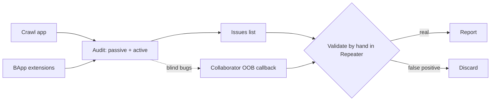
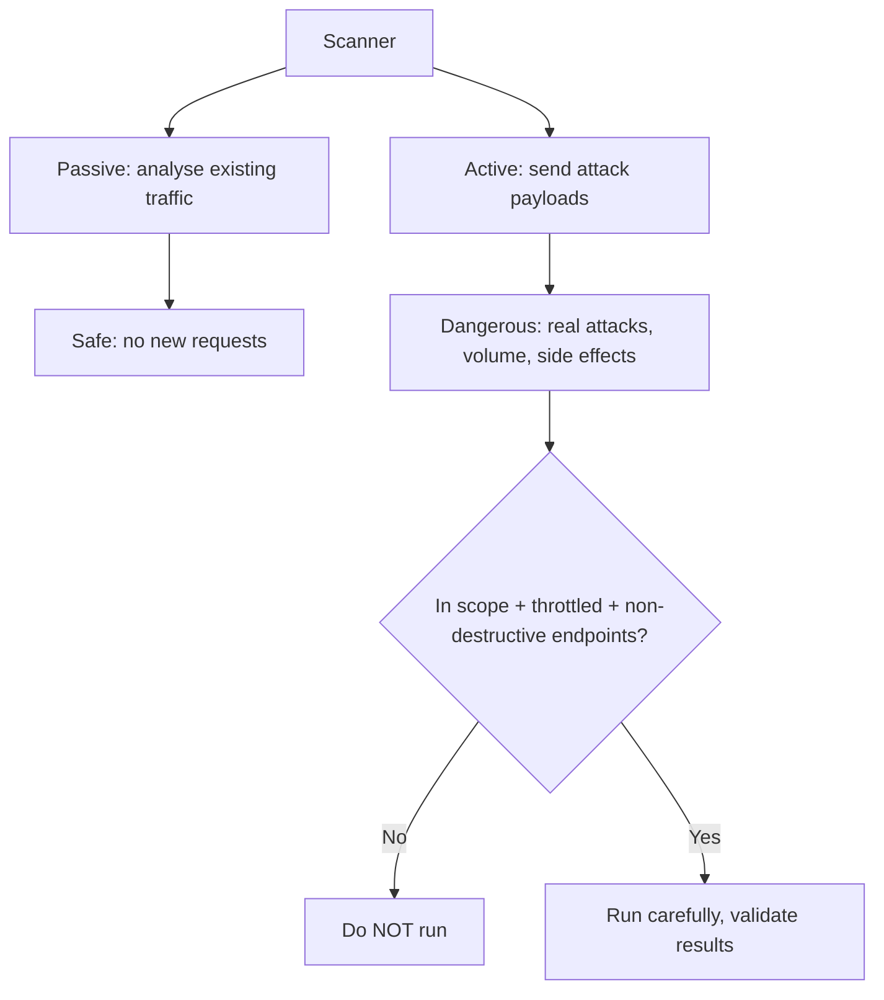
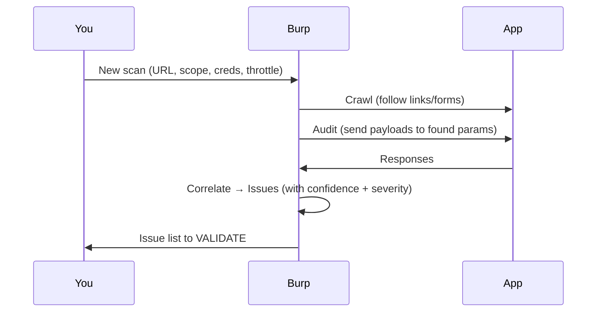
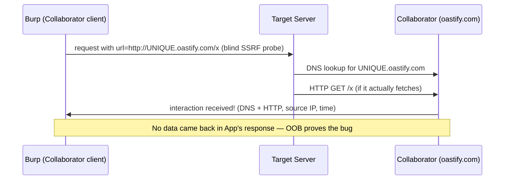

**Level:** Intermediate · **Track:** Bug Bounty & AppSec · **Read time:** 195 min

This is Chapter 3 of the Web Tooling notebook and the last of the three-part Burp
series. Chapter 1 built the proxy and scope foundation; Chapter 2 gave you the manual
firepower of Repeater, Intruder, Sequencer and Decoder. This chapter covers the parts
of Burp that *scale you up* and *see what you can't*: the **Scanner** (automated
vulnerability detection), the **BApp** extension ecosystem (community add-ons that
extend Burp for specific bug classes), and **Collaborator** (the out-of-band trick
that catches "blind" vulnerabilities which produce no visible response). Two of these
— Scanner and Collaborator — require **Burp Professional**; the extension model works
in Community for many add-ons.

A warning to hold from the first line: the Scanner is the point where a careless
tester does real damage. Active scanning fires genuine attack payloads at every
parameter it finds. Aimed inside scope with throttling, it's a force multiplier;
aimed carelessly it's an unauthorised attack and, on a fragile app, a denial of
service. Everything in this chapter is gated on the Chapter 1 discipline: **scope
first, always.**

## Why This Matters

Manual testing (Chapter 2) is precise but slow; you cannot hand-test every parameter
on 300 endpoints. Scanners cover breadth: they crawl the app, throw known payloads at
every input, and flag likely issues, so your scarce manual attention goes to the
leads that matter. Extensions cover *specialisation*: the community has written add-
ons for exactly the tasks core Burp does clumsily — authorization testing (Autorize),
hidden parameter mining (Param Miner), high-speed fuzzing (Turbo Intruder), JWT
manipulation (JWT Editor). And Collaborator covers *blindness*: a huge class of
serious bugs (blind SSRF, blind XXE, blind OS command injection, blind SQLi) produce
**no change in the HTTP response** — the only way to detect them is to make the
server call *you* out-of-band and watch for the ping.

Put together, these turn Burp from a manual tool into a platform. But the meta-skill
of this chapter is **judgment**: knowing when automation helps, distrusting scanner
output until you've validated it by hand, and never letting a machine attack
something you weren't authorised to touch.



## Part 1: Passive vs Active Scanning — The Critical Distinction

Burp's Scanner has two fundamentally different modes, and confusing them is how
people get in trouble.

- **Passive scanning** *only analyses traffic that already passed through Burp*. It
  sends **no new requests**; it inspects the requests/responses in your history for
  tell-tale signs (missing security headers, reflected input, verbose errors,
  cookies without flags, information disclosure). Passive scanning is **safe** — it
  cannot break anything because it doesn't touch the target beyond what your browsing
  already did. It runs in the background as you browse.
- **Active scanning** *sends new, crafted attack requests* — SQLi payloads, XSS
  vectors, command-injection probes, path traversal — to every parameter it can find,
  and watches the responses (and Collaborator) for evidence. Active scanning is
  **powerful and dangerous**: it is literally attacking the app, it generates large
  volumes of traffic, and mutating payloads can trigger real side effects (creating
  records, sending emails, deleting data if it hits a destructive endpoint).



> **The cardinal rule.** Never point an **active** scan at anything outside the
> program scope, and be wary of active-scanning state-changing endpoints (anything
> that creates, updates, deletes, sends, or pays). Many programs restrict or forbid
> automated scanning entirely — Chapter 1's policy-reading is what tells you. Passive
> scanning is almost always fine; active scanning is a decision, not a default.

## Part 2: Crawl and Audit — Running a Scan Properly

In Burp Pro, scanning is organised as **tasks** on the Dashboard. You can scan in two
ways:

- **Crawl and Audit (from the Dashboard "New scan").** Give Burp a starting URL; it
  **crawls** (discovers content by following links/forms, like an automated version
  of your manual browse) and then **audits** (scans what it found). You control scope,
  crawl depth, and audit aggressiveness.
- **Targeted / selective scan.** Right-click a specific request in history/site map →
  **Scan** (or **Do active scan**) to audit just that request's parameters. This is
  the safer, surgical approach for bounty work — you scan the one endpoint you're
  interested in rather than blasting the whole app.

Key configuration you should always set:

- **Scope.** Restrict the scan to in-scope hosts. Burp offers "named
  configurations"; make one that's conservative.
- **Crawl settings.** Limit depth and avoid logging out (Burp can auto-detect and
  avoid "logout" links, but verify). Provide **application login credentials** (a
  recorded login or session) so it can reach authenticated surface.
- **Audit settings / "scan speed."** Choose issue classes (you rarely need *all*),
  and set a resource pool with **low concurrency and a delay** to throttle. "Thorough"
  is slower and louder; "Fast" is lighter.
- **Avoid destructive actions.** Exclude state-changing endpoints from active audit
  where you can.



## Part 3: Reading Issues — and the False-Positive Discipline

The Scanner produces **Issues**, each with a **severity** (High/Medium/Low/Info) and
a **confidence** (Certain/Firm/Tentative). This is where professionals and
scanner-spammers diverge.

**A scanner finding is a lead, not a bug.** Automated tools produce false positives
constantly — a "SQL injection" that's actually a generic error page, an "XSS" that's
reflected but not executed, a "vulnerability" in a third-party path you can't
control. **Submitting raw scanner output to a program is the fastest way to destroy
your reputation** (Chapter 1: signal, and the "Spam" state). Every issue must be
*reproduced and confirmed by hand* before it becomes a report.

The validation loop for each issue:

1. Open the issue. Read Burp's **Advisory** (what it thinks it found and why) and the
   **Request/Response** that triggered it.
2. **Send that request to Repeater** (`Ctrl+R`).
3. Reproduce the finding manually — does the payload *actually* execute/inject/leak?
   Reduce it to the minimal proof (Chapter 2's baseline-vs-probe).
4. Assess **real impact and exploitability** in the app's context. A reflected value
   that the CSP blocks from executing is not an XSS you can claim.
5. Only if it's real and impactful → write the report with *your* clean, minimal PoC,
   not Burp's raw output.

> **Confidence ≠ truth.** Even "Certain/High" issues can be contextually
> unexploitable, and "Tentative" issues sometimes hide the best bugs. Treat the
> confidence field as a triage hint for *what to validate first*, never as a licence
> to skip validation.

## Part 4: The Extension Ecosystem — BApp Store

Burp is extensible through the **Extensions** tab and the **BApp Store** (a curated
in-app marketplace). Extensions are written against Burp's API (historically the
Extender API, now the modern **Montoya API**) in Java, Python (via Jython) or Ruby.
Many are free and work in Community; some rely on Pro features.

Install from **Extensions → BApp Store → Install**. Some Python extensions need you
to point Burp at a **Jython** standalone JAR (**Extensions → Options → Python
Environment**). The extensions serious testers reach for constantly:

| Extension | What it does | Why you want it |
| --- | --- | --- |
| **Logger++** | Rich, filterable, exportable request log across all Burp tools | Better than HTTP history for hunting/grepping traffic |
| **Autorize** | Auto-tests every request with a low-priv (or no) session to find broken access control/IDOR | Automates the #1 bug class — repeats each request as another user and flags where you still get data |
| **Param Miner** | Discovers hidden/unlinked parameters and headers (incl. cache-poisoning params) | Finds inputs the app secretly honours; great for cache poisoning + hidden features |
| **Turbo Intruder** | Extremely fast, scriptable request engine (Python-driven) | Massive brute/fuzz far faster than Community Intruder; race-condition testing |
| **Active Scan++** | Adds extra active-scan checks (and passive) beyond core | More coverage for the Pro Scanner |
| **JS Link Finder / Retire.js** | Extracts endpoints from JS; flags vulnerable JS libraries | Recon + known-vuln detection inside Burp |
| **JWT Editor** | Decode/edit/sign/attack JSON Web Tokens in-place | Essential for the JWT attacks in later chapters |
| **Hackvertor** | Inline tag-based encoding/encryption/transform of payloads | Bypass filters/WAFs; complex payload construction |
| **Collaborator Everywhere** | Injects Collaborator payloads into headers of proxied traffic to catch OOB interactions passively | Free blind-SSRF/interaction discovery while you browse |
| **Backslash Powered Scanner** | Smarter, input-transformation-based active scanning | Finds injection the default scanner misses |

> **Bug-bounty tip.** If you install only two, install **Autorize** (turns every
> request into an access-control test automatically — where a huge share of paid bugs
> live) and **Param Miner** (surfaces hidden attack surface). Both are free and both
> work without Pro Scanner. Turbo Intruder is the free answer to Community's throttled
> Intruder.

## Part 5: Writing a Tiny Extension (So You Understand Them)

You don't need to be an extension developer, but writing a trivial one demystifies
the ecosystem and lets you build one-off helpers. Modern extensions use the
**Montoya API** (Java). A minimal extension that adds your identifying bug-bounty
header to every request looks like this in outline:

```java
// BugBountyHeader.java  (Montoya API)
package example;

import burp.api.montoya.BurpExtension;
import burp.api.montoya.MontoyaApi;
import burp.api.montoya.http.handler.*;
import burp.api.montoya.http.message.requests.HttpRequest;

public class BugBountyHeader implements BurpExtension {
    @Override
    public void initialize(MontoyaApi api) {
        api.extension().setName("Bug Bounty Header");
        // Register a handler that fires on every HTTP message
        api.http().registerHttpHandler(new HttpHandler() {
            @Override
            public RequestToBeSentAction handleHttpRequestToBeSent(HttpRequestToBeSent req) {
                // Add our identifying header to every outgoing request
                HttpRequest modified = req.withAddedHeader("X-Bug-Bounty", "h1-yourname");
                return RequestToBeSentAction.continueWith(modified);
            }
            @Override
            public ResponseReceivedAction handleHttpResponseReceived(HttpResponseReceived resp) {
                return ResponseReceivedAction.continueWith(resp);
            }
        });
    }
}
```

Compile against the Montoya API JAR, then load the built `.jar` via **Extensions →
Add → Java**. Even without ever compiling this, reading it tells you the model:
extensions register **handlers** that Burp calls on defined events (a request about to
be sent, a response received, a scan check, a context-menu click), and they can read
or rewrite the traffic. That's the whole idea — every extension in Part 4 is a bigger
version of this.

> **Reality check.** Most testers never write extensions; they install them. But
> understanding the handler model helps you *choose* extensions wisely, debug them
> when they misbehave, and occasionally write a 30-line helper for a weird target
> (e.g. auto-refresh an expiring token, or compute a custom request signature the app
> requires).

## Part 6: Collaborator — Catching the Invisible

Some of the most serious web bugs are **blind**: the vulnerability exists, but the
HTTP response looks completely normal, so nothing in Burp's history reveals it.
Examples:

- **Blind SSRF** — you make the server fetch a URL, but its response isn't reflected
  back to you.
- **Blind XXE** — an XML parser processes your external entity, but you never see the
  file contents in the response.
- **Blind OS command injection / blind SQLi** — the command/query runs but produces no
  visible output.
- **Asynchronous / second-order** bugs — the payload fires later, in a backend job or
  an admin's browser.

The trick to detect all of these is **out-of-band (OOB) interaction**: instead of
reading data *back through the response*, you make the vulnerable server **reach out
to a server you control** and watch for the connection. **Burp Collaborator** is that
server-you-control, run as a service by PortSwigger (or self-hosted in Pro).

### 6.1 How Collaborator works

Collaborator gives you a unique subdomain like
`abc123xyz.oastify.com`. You plant that hostname into a parameter you suspect is
vulnerable. If the target server is vulnerable, it will make a **DNS lookup** and/or
**HTTP request** to that hostname — and Collaborator records the interaction,
including the source IP and timing. A DNS ping alone often proves the bug (the server
*resolved* your name, so it processed your input as a URL/entity).



### 6.2 Using it

- **Manual:** In Repeater, right-click the request → **Insert Collaborator payload**
  (or open **Burp → Collaborator** to generate a payload and copy it). Put the payload
  where a URL/hostname/XML entity would go, send, then click **Poll now** in the
  Collaborator tab to see interactions.
- **Automated:** The **Scanner** uses Collaborator automatically for OOB checks
  (that's how Pro finds blind SSRF/XXE). The free **Collaborator Everywhere**
  extension sprays Collaborator payloads into headers of your normal proxied traffic,
  so you passively catch interaction bugs just by browsing.

### 6.3 Interpreting interactions

- **DNS-only interaction** → the server *resolved* your hostname: it processed your
  input as a name. Strong evidence of SSRF/XXE/injection reaching a network layer,
  even if it didn't complete an HTTP fetch (egress may be filtered).
- **HTTP interaction** → the server actually *fetched* your URL: fuller SSRF, often
  higher impact (you may be able to hit internal metadata endpoints, etc. — that's
  the SSRF chapter's territory).
- **Source IP** in the interaction can reveal internal infrastructure or a cloud NAT.

> **Non-destructive proof.** Collaborator is inherently safe evidence: the server
> merely pinged a benign host you own. You prove the vulnerability *exists* without
> exfiltrating data or causing harm — exactly the "minimal proof" standard from
> Chapter 1. Report the interaction record (payload sent + interaction received) as
> your PoC.

## Part 7: Community vs Professional — What You Actually Lose

| Capability | Community | Professional |
| --- | --- | --- |
| Proxy, Repeater, Decoder, Comparer, Sequencer | Full | Full |
| Intruder | Throttled (slow) | Full speed |
| **Active/Passive Scanner** | **No** | Yes |
| **Collaborator (managed)** | **No** | Yes |
| Project files (save/resume) | No (temporary only) | Yes |
| Many BApp extensions | Yes | Yes (some need Pro APIs) |
| Task scheduling, reporting | No | Yes |

The honest takeaway for a beginner: you can do *enormous* amounts of real testing in
Community — all of Chapters 1 and 2, plus free extensions like Autorize, Param Miner,
Turbo Intruder and Collaborator Everywhere. The two things you truly can't replicate
are the **Scanner** and **managed Collaborator**. Free stand-ins exist (nuclei for
templated scanning — Chapter 6; a self-hosted interaction server, or interactsh from
ProjectDiscovery, for OOB), and many hunters run Community + nuclei + interactsh until
Pro pays for itself.

```bash
# interactsh — a free, self-hostable OOB interaction service (Collaborator-like)
go install -v github.com/projectdiscovery/interactsh/cmd/interactsh-client@latest
interactsh-client
# prints a unique domain like c3b2a1.oast.pro; plant it in a blind-injection probe
# and watch the client print DNS/HTTP interactions when the target pings it.
```

## Part 8: Hands-On Lab — Scan, Extend, and Catch a Blind Bug

Use a legal target: **PortSwigger Web Security Academy** (it has dedicated SSRF, XXE,
and access-control labs, and a Collaborator client) or **OWASP Juice Shop** locally.
If you don't have Pro, do the Scanner steps read-only and substitute **nuclei +
interactsh** for the scanning/OOB parts.

### Step 1 — Passive scan while you browse (Pro) or nuclei (Community)

- **Pro:** ensure Passive audit is on, browse the app, and watch Issues accumulate on
  the Dashboard. Note a few Info/Low issues (missing flags, verbose errors).
- **Community:** run `nuclei -u https://TARGET -proxy http://127.0.0.1:8080` and watch
  templated findings appear in Burp history (Chapter 6 covers nuclei fully).

### Step 2 — Targeted active scan of ONE endpoint (Pro)

Pick a single, non-destructive, parameterised endpoint (a search or lookup).
Right-click → **Scan → Active audit**, scoped to just that request, throttled. When
issues appear, do **not** trust them yet.

### Step 3 — Validate every issue by hand

For each issue: read the advisory, send the triggering request to **Repeater**, and
reproduce it manually with a minimal payload. Classify each as **confirmed** or
**false positive** with a one-line reason. This is the core professional skill of the
chapter.

### Step 4 — Install and use Autorize

Install **Autorize** from the BApp Store. Configure it with a *low-privilege* session
cookie. Browse the app as a high-priv user; Autorize replays each request with the
low-priv session and colour-codes whether access was still granted. Any green
("Authorization bypassed!") on a sensitive action is a broken-access-control lead —
validate it in Repeater with your own two test accounts.

### Step 5 — Catch a blind bug with Collaborator/interactsh

On a suspected SSRF sink (an endpoint that takes a URL — a webhook, an image-from-URL,
a PDF renderer):

1. Generate a payload: Burp **Collaborator → Copy to clipboard**, or run
   `interactsh-client` and copy its domain.
2. In Repeater, set the URL parameter to `http://<your-collaborator-domain>/probe`.
3. Send. Then **Poll now** (Burp) / watch the interactsh client.
4. A DNS or HTTP interaction = confirmed SSRF, proven non-destructively. Record the
   payload and the interaction as your PoC.

**Deliverable:** notes containing (a) two validated-vs-false-positive scanner issues
with reasons, (b) one Autorize-flagged access-control lead confirmed in Repeater, and
(c) a Collaborator/interactsh interaction record proving a blind interaction (or a
clear "no interaction → not vulnerable" conclusion).

> **CTF connection.** Blind-injection and SSRF CTF challenges are *designed* around
> OOB: the flag is only reachable by making the server call your listener. interactsh
> or a simple `nc`/`python -m http.server` on a box you control is the standard CTF
> move, and Collaborator is the polished version of the same idea.

## Part 9: Detection & Defense Angle

- **Active scanning is extremely loud.** It's a flood of attack-signature requests to
  every parameter — the single most WAF-triggering thing you can do. Expect blocks,
  rate limits, and (on real programs) a call to the blue team if you didn't throttle
  or identify yourself. This is *why* Chapter 1's identifying header and the program's
  automation rules exist.
- **Collaborator interactions are a defender's detection signal too.** From the blue
  side, unexpected outbound DNS/HTTP from a server to a random external domain is a
  classic SSRF/exfil indicator — egress filtering and DNS monitoring are the defenses,
  and they're exactly what turn a "HTTP interaction" into a "DNS-only interaction" in
  your results.
- **The defensive lesson of Scanner false positives:** automated tools over-report,
  so a mature security program validates scanner output before acting — the same
  discipline you apply as a hunter. And the fix for the blind-bug classes Collaborator
  finds is architectural: validate/allow-list URLs (SSRF), disable external entities
  (XXE), parameterise queries (SQLi), never pass user input to a shell (command
  injection). Each gets its own chapter later; Collaborator is how you *prove* they're
  missing.

## Part 10: Common Mistakes and How to Avoid Them

| Mistake | Why it hurts | The fix |
| --- | --- | --- |
| Active-scanning out of scope | Unauthorised attack; ban risk | Scope every scan; prefer targeted scans |
| Active-scanning destructive endpoints | Deletes data / sends emails / breaks state | Exclude state-changing endpoints |
| Submitting raw scanner issues | False positives → reputation loss | Validate every issue in Repeater first |
| Trusting "Certain" confidence blindly | Context can make it unexploitable | Assess real impact in the app |
| Unthrottled full crawl-and-audit | DoS + WAF block + noise | Low concurrency + delay; targeted scans |
| Ignoring blind bug classes | Miss high-severity SSRF/XXE | Use Collaborator/interactsh on URL/XML sinks |
| Installing every extension | Slow, noisy, conflicts | Install a focused set (Autorize, Param Miner...) |
| Assuming Community can't do OOB | Miss blind bugs without Pro | Use interactsh as a free Collaborator |

## Part 11: Final Revision / Summary

This chapter scaled Burp from a manual workshop to a platform. The **Scanner** splits
into **passive** (safe: analyses existing traffic for missing headers, reflections,
info leaks) and **active** (dangerous: fires real attack payloads at every parameter).
Active scanning must be **scoped, throttled, and kept off destructive endpoints**, and
its **Issues are leads, not bugs** — every one gets **validated by hand in Repeater**
before it becomes a report, because scanners false-positive constantly and submitting
raw output wrecks your reputation. The **BApp** ecosystem extends Burp for specific
tasks; the high-value free installs are **Autorize** (automated access-control
testing), **Param Miner** (hidden inputs), **Turbo Intruder** (fast fuzzing/race
conditions), plus **JWT Editor**, **Hackvertor**, **Logger++** and **Collaborator
Everywhere**. Extensions register **handlers** on Burp events via the **Montoya API**,
which a tiny header-adding example makes concrete. **Collaborator** solves
**blindness**: by planting a unique hostname you control and watching for the server's
**DNS/HTTP callback**, you detect blind SSRF, XXE, and injection **non-destructively** —
and the free **interactsh** gives Community users the same power. **Professional** buys
the Scanner, managed Collaborator, project files and reporting, but Community plus free
extensions plus nuclei/interactsh covers an enormous amount of real work. Throughout,
the meta-skill is judgment: automate breadth, distrust the output, and never let a
machine attack what you weren't authorised to touch. The remaining Web Tooling chapters
add the free command-line scanners (ffuf, feroxbuster, nuclei) that complement this
stack.

## Part 12: Cheat Sheet / Quick Reference

**Scanner (Pro)**

```
Passive : analyses existing traffic — safe, always-on
Active  : sends attack payloads — scope + throttle + avoid destructive endpoints
Targeted scan : right-click request → Scan → Active audit (surgical, safer)
Issue = LEAD. Validate in Repeater before reporting. Confidence ≠ truth.
```

**Must-have free extensions**

```
Autorize        automated access-control / IDOR testing (low-priv replay)
Param Miner      hidden params/headers (+ cache poisoning)
Turbo Intruder   fast scriptable fuzzing + race conditions
JWT Editor       decode/edit/sign/attack JWTs
Hackvertor       inline payload encoding/transform (filter/WAF bypass)
Logger++         rich filterable traffic log
Collaborator Everywhere  passive OOB interaction discovery
Retire.js / JS Link Finder  vulnerable libs + endpoints from JS
```

**Collaborator / OOB**

```
Blind bug = no response change → make the server call YOU.
Burp: Collaborator → Copy payload → plant in URL/XML sink → Poll now.
Free: interactsh-client → unique .oast domain → plant → watch for DNS/HTTP.
DNS-only = input processed as a name; HTTP = server actually fetched (bigger SSRF).
```

**Community substitutes**

```
Scanner   → nuclei (Chapter 6)
Collaborator → interactsh (ProjectDiscovery)
Fast Intruder → Turbo Intruder / ffuf (Chapter 5)
```

## Part 13: Practice Labs & Resources

- **PortSwigger Web Security Academy — SSRF, XXE, and "OS command injection (blind)"
  labs** (`portswigger.net/web-security`) — built to be solved with Collaborator; the
  best OOB practice anywhere. Also the "Access control" labs for Autorize practice.
- **PortSwigger Burp docs — Scanner, Extensions (Montoya API), and Collaborator
  sections** — authoritative; read the Scanner and Collaborator pages fully.
- **BApp Store** (in-app, and `portswigger.net/bappstore`) — browse and read each
  extension's description; install the focused set above.
- **ProjectDiscovery interactsh** (`github.com/projectdiscovery/interactsh`) — free
  Collaborator alternative; pairs with nuclei's OOB templates.
- **Montoya API examples** (`github.com/PortSwigger/burp-extensions-montoya-api-examples`)
  — copy-paste starting points if you ever want to write a helper.
- **TryHackMe "Burp Suite: Extensions"** and **HackTheBox Academy web modules** —
  guided practice with the extension model and scanning.

Practice questions:

1. Explain the difference between passive and active scanning and give one concrete
   reason active scanning could cause real harm to a target.
2. Burp reports a "High/Certain" SQL injection. List the exact steps you take before
   putting it in a report, and one reason it might still be a false positive.
3. You suspect a webhook endpoint is vulnerable to blind SSRF but the response never
   changes. Describe, tool and payload, how you'd prove it non-destructively.
4. You only have Burp Community. Which two capabilities from this chapter are missing,
   and what free tools replace each?
5. What does a **DNS-only** Collaborator interaction tell you that an **HTTP**
   interaction does not, and why might egress filtering explain the difference?

---

*Also on [Praneeth's portfolio](https://ping-praneeth.vercel.app/notebook/appsec-web-tooling/03-burp-suite-part-3-scanner-bapp-extensions-and-collaborator), with comments and the latest edits.*
