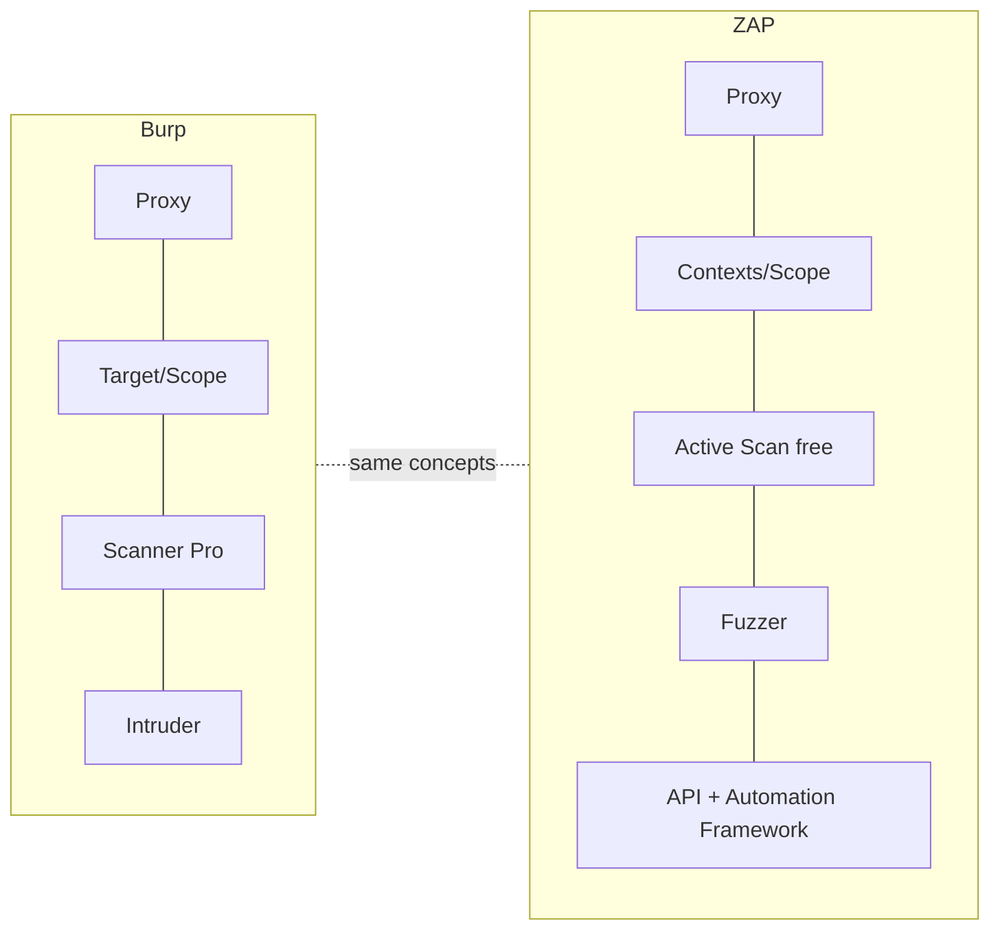
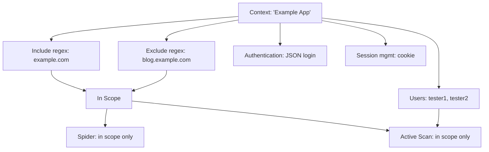
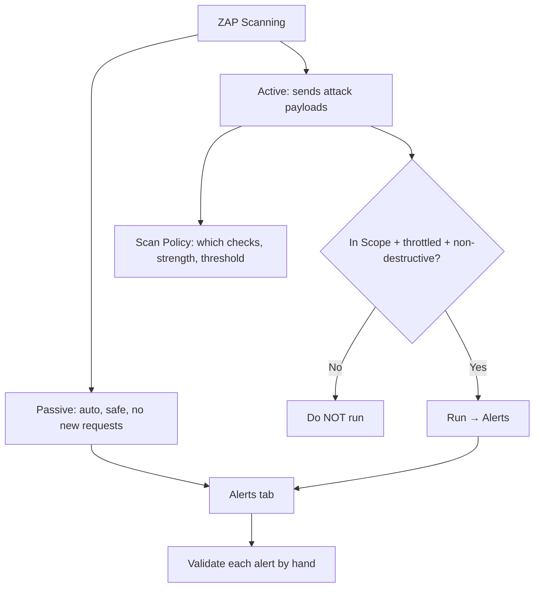
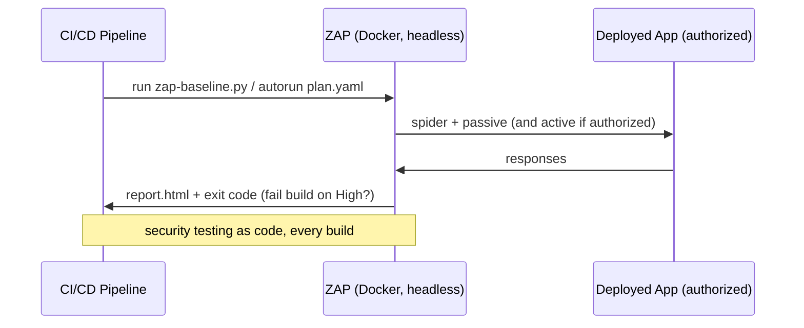

**Level:** Advanced · **Track:** Bug Bounty & AppSec · **Read time:** 185 min

This is Chapter 4 of the Web Tooling notebook. The three preceding chapters built
you into a Burp Suite user. This chapter covers the other pillar of web security
tooling: **OWASP ZAP** (the Zed Attack Proxy), a fully free, open-source
intercepting proxy and scanner maintained by a community under the OWASP umbrella
(now stewarded by the Software Security Project / Checkmarx). ZAP is not a toy
alternative — it is a genuinely capable tool that does much of what Burp Professional
charges for (a real active scanner, spidering, fuzzing) at zero cost, and it *beats*
Burp in one important area: **automation and CI/CD integration**. Every serious web
tester should be fluent in both, because programs, teams, and budgets vary, and
because ZAP's scriptable, headless design makes it the natural choice for baking
security testing into a build pipeline.

Because you already know Burp, this chapter teaches ZAP largely by **mapping**: for
each Burp concept, here is ZAP's equivalent and where it differs. Then we go deep on
the places ZAP is genuinely its own tool — Contexts, the AJAX spider, the API, and
the Automation Framework. The Chapter 1 discipline is unchanged and unnegotiable:
**scope first**, active scanning stays inside authorised targets, and destructive
endpoints are off-limits.

## Why This Matters

Three concrete reasons ZAP earns a place next to Burp:

1. **It's free and open source.** Burp's Scanner and Collaborator need a paid
   licence; ZAP's active scanner and out-of-band add-on are free. For students,
   people between paychecks, and teams that can't buy per-seat licences, ZAP removes
   the paywall from automated web scanning.
2. **It's built for automation.** ZAP was designed headless-first. It exposes a full
   **REST API**, ships official **Docker images**, and has an **Automation Framework**
   (YAML "plans") purpose-built to run in CI/CD. If your goal is "scan every build" or
   "scan 500 hosts overnight," ZAP is often the better fit than Burp.
3. **Fluency in both makes you employable and adaptable.** Job postings and
   engagements ask for one or the other; disclosed reports reference both. Knowing the
   mapping means you're never blocked by which tool is on the box.



## Part 1: The Burp→ZAP Rosetta Stone

Learn ZAP fast by translating what you already know:

| Burp concept | ZAP equivalent | Notes |
| --- | --- | --- |
| Proxy / HTTP history | **Proxy** / **History** tab | Same idea: intercept + log |
| Intercept (hold requests) | **Break** (break points) | ZAP calls held-request editing "breakpoints" |
| Target → Site map | **Sites** tree | Tree of hosts/paths discovered |
| Target → Scope | **Context** + "In Scope" | ZAP scope lives inside a *Context* |
| Repeater | **Manual Request Editor** / **Requester** tab | Edit and resend one request |
| Intruder | **Fuzzer** | Payload-driven attacks on marked positions |
| Scanner (passive) | **Passive Scan** (always on) | Free in ZAP |
| Scanner (active, Pro) | **Active Scan** | **Free** in ZAP |
| Spider/crawl | **Spider** + **AJAX Spider** | AJAX spider drives a real browser for JS apps |
| Collaborator | **OAST** add-on (interactsh/BOAST/callback) | Free OOB support |
| BApp Store | **Marketplace** (add-ons) | Community + official add-ons |
| Decoder | **Encode/Decode/Hash** dialog | Same transforms |
| Comparer | Compare (via add-on) | Diffing |
| Match/Replace | **Replacer** | Rewrite requests/responses |
| Project file (Pro) | **Session** (always available) | ZAP saves sessions free |

Two structural differences to internalise now: **(1) ZAP scope is expressed through a
"Context"** — a saved definition of an app, its scope, its authentication, and its
users — rather than a flat include/exclude list. **(2) ZAP's active scanner and
session saving are free**, so the Community-vs-Pro friction from the Burp chapters
mostly disappears.

## Part 2: Install and First Run

ZAP is a Java application; the installers bundle a JRE.

```bash
# Kali/Debian
sudo apt update && sudo apt install -y zaproxy
zaproxy          # launch the GUI  (older command: 'owasp-zap')

# Or download the cross-platform installer / Docker image from zaproxy.org
# Docker (great for automation, covered in Part 9):
docker pull zaproxy/zap-stable
```

On first launch ZAP asks whether to **persist the session** — for a real engagement
choose "Yes, persist" and name it, so your history/findings survive a restart (this
is free, unlike Burp Community). You land on a three-pane UI: the **tree** (Sites)
top-left, the **workspace** (request/response, tools) top-right, and the
**information tabs** (History, Alerts, Active Scan, Spider, Output) along the bottom.

### 2.1 Proxy and certificate

ZAP listens on **`127.0.0.1:8080`** by default (same as Burp — run only one at a time
on that port, or change it under **Options → Network → Local Servers/Proxies**). As
with Burp, HTTPS inspection needs ZAP's **root CA** trusted:

```
Options → Network → Server Certificates → Save (export the CA)
Then import it into your browser/OS trust store as a trusted root
(exactly as with Burp's cacert.der in Chapter 1).
```

ZAP can also launch a **pre-configured browser** (the "Manual Explore" / HUD button)
that already proxies through ZAP and trusts the CA — the zero-setup path, mirroring
Burp's built-in browser. The **HUD (Heads-Up Display)** overlays ZAP controls
directly onto the web page in that browser, which is a genuinely nice ZAP-only
feature for driving scans while you browse.

## Part 3: Contexts and Scope — ZAP's Central Concept

In ZAP, you don't just set a scope; you define a **Context** — a first-class object
that groups everything ZAP needs to know about one application:

- **Include in Context** / **Exclude from Context** — regex URL rules defining what
  belongs to this app (this is your scope).
- **In Scope** flag — mark the Context "in scope" so scans and tools restrict to it.
- **Authentication** — how ZAP logs in (form, JSON, HTTP, script-based).
- **Users** — credential sets ZAP can act as (enables authenticated scanning and
  access-control testing).
- **Session Management** — cookies vs header tokens.
- **Technology** — hint which tech stack, so the scanner skips irrelevant checks.

Create one via **right-click a host in the Sites tree → Include in Context → New
Context**, then edit it (the properties dialog). To scope a program's wildcard:

```
Context → Include in Context (regex):
   https?://([^/]+\.)?example\.com(/.*)?

Context → Exclude from Context (regex):
   https?://blog\.example\.com(/.*)?      # third-party carve-out
```

Then set **"In Scope"** and, in scans, choose **"scope: In Scope only."** This is the
exact analogue of Chapter 1's Burp scope discipline — and just as mandatory. A
Context also makes your work portable: export it and reuse the same scope/auth
definition in the CLI and API later.



## Part 4: Exploring the App — Spider and AJAX Spider

Before scanning, ZAP needs to discover the app's URLs. Two crawlers:

- **Spider** (traditional) — parses HTML responses, follows links and forms, and
  builds the Sites tree. Fast, but **blind to content generated by JavaScript** — it
  only sees what's in the raw HTML.
- **AJAX Spider** — drives a **real browser** (via Selenium/WebDriver) to click and
  interact like a user, so it discovers content in modern **single-page apps** where
  the traditional spider sees an empty shell. Slower, heavier, essential for
  React/Angular/Vue apps.

```bash
# Conceptually (via GUI): right-click the target in Sites → Attack → Spider...
# and separately → Attack → AJAX Spider... for JS-heavy apps.
```

Best practice mirrors Burp: **manually explore first** (browse the app through ZAP
with the HUD, submitting real forms with test data) so authenticated and
interaction-gated pages enter the tree, *then* run the spiders to fill gaps. Manual
exploration reaches business-logic flows automated crawlers miss and keeps you inside
scope.

> **Bug-bounty note.** For SPA-heavy targets (most modern apps), the **AJAX Spider +
> manual exploration** combination is what actually populates your attack surface;
> the plain spider alone will badly under-discover. Combine with the JS endpoint
> mining from the Recon chapter for the fullest map.

## Part 5: Passive vs Active Scanning in ZAP

Exactly the same safety distinction as Burp, and just as important:

- **Passive Scan** runs **automatically** on every response ZAP sees. It never sends
  new requests, so it's **safe**. It flags missing headers, cookie flags,
  information disclosure, reflected parameters, and more, populating the **Alerts**
  tab as you browse/spider.
- **Active Scan** sends **real attack payloads** (SQLi, XSS, path traversal, command
  injection, etc.) against discovered parameters. It is **powerful and dangerous** —
  volume, real attacks, possible side effects — and must be **scope-gated and
  throttled**.

Run an active scan via **right-click target → Attack → Active Scan**, choosing the
Context/scope and a **Scan Policy**. The **Scan Policy Manager** (Analyse → Scan
Policy Manager) lets you enable/disable specific checks and set their **strength**
(how many payloads) and **threshold** (how sensitive to alerting) — the ZAP analogue
of tuning Burp's audit. Set strength/threshold conservatively on live targets.



### 5.1 Alerts, confidence, and the same false-positive discipline

ZAP's findings land in **Alerts**, each with a **risk** (High/Medium/Low/Info) and a
**confidence** (High/Medium/Low/Confirmed). The rule from the Burp Scanner chapter is
identical and non-negotiable: **an alert is a lead, not a bug.** Send the triggering
request to the **Requester/Manual Request Editor**, reproduce it by hand, reduce it to
minimal proof, and assess real impact before it ever becomes a report. ZAP (like all
scanners) false-positives; raw alert dumps are report poison.

## Part 6: Manual Tools — Requester, Break, Fuzzer, Replacer

- **Requester / Manual Request Editor** = Burp Repeater. Right-click any request →
  **Open/Resend with Request Editor** (or use the **Requester** tab). Edit and resend;
  view the response. Your baseline→one-change→compare loop lives here.
- **Break** = Burp Intercept. Set a **breakpoint** (the little green/red circle
  toolbar buttons, or right-click → Break) to hold matching requests/responses for
  editing before they proceed.
- **Fuzzer** = Burp Intruder. Right-click a request → **Fuzz…**, highlight the
  position(s), add **payloads** (file lists, ZAP's built-in generators, scripts), and
  optionally **payload processors** (URL-encode, Base64, etc.). Results tabulate with
  status/size/time and you can add **fuzz analysers** to flag reflections/errors. ZAP's
  Fuzzer is **not throttled** the way Burp Community's Intruder is — a real advantage
  for free brute/fuzz work (throttle it yourself to stay polite).
- **Replacer** = Burp Match/Replace. **Options → Replacer** rewrites headers/bodies —
  e.g. inject your `X-Bug-Bounty` identifying header into every request.

## Part 7: Authentication, Users, and Access-Control Testing

ZAP's Context-based **Authentication** and **Users** are what make authenticated
scanning and access-control testing clean:

1. In the Context, set **Authentication** method — e.g. **JSON-based** with the login
   endpoint and a body template `{"email":"%username%","password":"%password%"}`.
2. Define a **Logged-in indicator** / **Logged-out indicator** (a regex ZAP checks to
   know if the session is valid — e.g. presence of a logout link, or a `401` body).
3. Add **Users** with credentials.
4. Run the Spider/Active Scan **"as user"** so ZAP tests authenticated surface, and
   re-runs requests as different users to surface **broken access control** (the ZAP
   analogue of Burp's Autorize extension — the **"Access Control Testing"** add-on
   formalises this: define roles/users, browse, then have ZAP flag requests that
   succeed for users who shouldn't have access).

This is where a lot of bounty value is, and ZAP's built-in user model makes it
first-class rather than an add-on afterthought.

## Part 8: The Marketplace — Add-ons Worth Having

ZAP ships a baseline and extends via **Manage Add-ons → Marketplace**. High-value
add-ons:

| Add-on | Purpose |
| --- | --- |
| **Active Scanner Rules (beta/alpha)** | More active checks beyond the core set |
| **Passive Scanner Rules (beta/alpha)** | More passive checks |
| **Access Control Testing** | Role/user-based broken-access-control detection |
| **OAST Support** | Out-of-band (Collaborator-style) via interactsh/BOAST/callback |
| **Selenium / AJAX Spider** | Browser-driven crawling for SPAs |
| **Automation Framework** | YAML-defined scan plans (Part 9) |
| **GraphQL / OpenAPI / SOAP** | Import API definitions to seed scanning of APIs |
| **Retire.js** | Flags known-vulnerable JS libraries |
| **FuzzDB / SVN Digger files** | Extra payload/wordlist packs for the Fuzzer |

> **OOB for free.** The **OAST Support** add-on gives ZAP the blind-vulnerability
> detection that costs money in Burp (Collaborator). Point it at a public interactsh
> server or BOAST instance and ZAP's active scanner will catch blind SSRF/XXE/injection
> via callbacks — closing the one big gap between free and paid tooling.

## Part 9: ZAP's Superpower — Automation and CI/CD

This is where ZAP pulls decisively ahead of Burp for many use cases. Three layers:

### 9.1 The packaged scans (Docker one-liners)

ZAP ships ready-made scan scripts in its Docker image — ideal for pipelines:

```bash
# Baseline scan: spider + PASSIVE scan only (safe, fast) — great for CI on every build
docker run --rm -t zaproxy/zap-stable zap-baseline.py \
  -t https://your-authorized-target.example.com -r report.html
# zap-baseline.py : runs a spider + passive scan, no attacks
# -t : target URL
# -r report.html : write an HTML report
# --rm -t : remove container after; allocate a TTY for progress

# Full scan: spider + AJAX spider + ACTIVE scan (dangerous — authorized targets only!)
docker run --rm -t zaproxy/zap-stable zap-full-scan.py \
  -t https://your-authorized-target.example.com -r full_report.html

# API scan: import an OpenAPI/GraphQL/SOAP definition and scan the API
docker run --rm -t zaproxy/zap-stable zap-api-scan.py \
  -t https://api.example.com/openapi.json -f openapi -r api_report.html
# -f openapi : the format of the definition to import and drive the scan
```

The **baseline** scan (passive only) is the one you can safely wire into CI to run on
every deploy; the **full** scan (active) is for authorised, non-production or
explicitly-permitted targets only.

### 9.2 The Automation Framework (YAML plans)

The modern, flexible way: describe an entire engagement — context, spider, active
scan, thresholds, reports — as a **YAML plan**, then run it headless. A minimal plan:

```yaml
# zap-plan.yaml
env:
  contexts:
    - name: "Example App"
      urls: ["https://app.example.com"]
      includePaths: ["https://app\\.example\\.com/.*"]
      excludePaths: ["https://app\\.example\\.com/logout.*"]
jobs:
  - type: spider
    parameters:
      context: "Example App"
      maxDuration: 5
  - type: passiveScan-wait
  - type: activeScan
    parameters:
      context: "Example App"
      policy: "Default Policy"
  - type: report
    parameters:
      template: "traditional-html"
      reportFile: "zap-report.html"
```

```bash
docker run --rm -v $(pwd):/zap/wrk/:rw -t zaproxy/zap-stable \
  zap.sh -cmd -autorun /zap/wrk/zap-plan.yaml
# -v $(pwd):/zap/wrk : mount current dir so the plan + report are shared
# -cmd -autorun <plan> : run headless with the given automation plan
```

Every include/exclude path here is scope enforcement — the same discipline, now
codified so a pipeline can't wander off-scope.

### 9.3 The REST API

ZAP exposes everything over a **REST API** (default `http://127.0.0.1:8080` with an
API key), so you can script it from Python or anything else:

```python
# pip install zaproxy
from zapv2 import ZAPv2
zap = ZAPv2(apikey='YOUR_KEY', proxies={'http':'http://127.0.0.1:8080',
                                         'https':'http://127.0.0.1:8080'})
target = 'https://app.example.com'
zap.spider.scan(target)          # start spider
zap.ascan.scan(target)           # start active scan (authorized targets only!)
for alert in zap.core.alerts():  # pull findings
    print(alert['risk'], alert['name'], alert['url'])
```

This scriptability is why ZAP is the default for **DevSecOps** — security tests as
code, run by machines, on a schedule.



## Part 10: Hands-On Lab — Manual to Automated with ZAP

Use a legal target: **OWASP Juice Shop** locally, or the **PortSwigger labs** /
**ZAP's own test targets**. Never scan a target you're not authorised to test.

### Step 1 — Set up and scope

1. Launch ZAP; persist the session.
2. Use **Manual Explore** to open ZAP's browser (CA pre-trusted) and browse the target.
3. Right-click the host in **Sites → Include in Context → New Context**; name it,
   set the include regex, mark **In Scope**.

### Step 2 — Explore then spider

1. Browse the app through the HUD, submitting forms with test data (populate the tree).
2. Run **Attack → Spider** and, for the SPA parts, **Attack → AJAX Spider**.
3. Watch **Passive Scan** alerts accumulate automatically in the **Alerts** tab.

### Step 3 — Authenticated Context (optional but valuable)

Configure **Authentication** (JSON login) + a **User** with test creds + a logged-in
indicator. Re-spider "as user" to reach authenticated surface.

### Step 4 — Active scan ONE scoped area, then validate

Right-click a single non-destructive endpoint → **Attack → Active Scan**, In-Scope
only, with a conservative policy (low strength/threshold). When alerts appear, send
each triggering request to the **Requester**, reproduce by hand, and label
confirmed vs false positive with a reason — the same discipline as the Burp Scanner
chapter.

### Step 5 — Automate it

Run the same target through the packaged baseline scan and read the report:

```bash
docker run --rm -t -v $(pwd):/zap/wrk/:rw zaproxy/zap-stable \
  zap-baseline.py -t http://host.docker.internal:3000 -r juice_baseline.html
```

Open `juice_baseline.html`. Then write a small **Automation Framework** YAML plan
(spider + passive + report) and run it headless. Compare the GUI findings, the
packaged-scan report, and the plan's report — three routes to the same engine.

**Deliverable:** a ZAP session with a scoped Context, spider+AJAX-spider coverage,
two validated-vs-false-positive active alerts (with reasons), and one automated HTML
report produced from the CLI or an Automation Framework plan.

> **CTF connection.** ZAP's Fuzzer (unthrottled and free) is a great CTF workhorse for
> brute forcing IDs/params, and the OAST add-on catches blind-injection challenge
> flags via callback. For CI-style "scan this deliberately vulnerable app" exercises
> (many training platforms use exactly this), ZAP's Docker scans are the standard tool.

## Part 11: ZAP vs Burp — Choosing

| Dimension | ZAP | Burp |
| --- | --- | --- |
| Cost | Free / open source | Community free; Pro paid |
| Active scanner | Free | Pro only |
| Automation / CI/CD | Excellent (API, Docker, YAML plans) | Improving, but Pro/Enterprise |
| Manual UX / ergonomics | Good; some prefer Burp's flow | Widely considered the smoother manual UI |
| Extensions | Marketplace (Java add-ons) | BApp Store (larger ecosystem) |
| OOB / blind bugs | OAST add-on (free) | Collaborator (Pro) |
| Community/reports | Large; OWASP-backed | Very large; industry default |

The pragmatic answer: **use both.** ZAP for automation, CI, and when you can't pay;
Burp for high-touch manual hunting where its ergonomics and extension ecosystem shine.
Fluency in the mapping (Part 1) means switching costs you nothing.

## Part 12: Detection & Defense Angle

- **ZAP active scans are as loud as Burp's** — a flood of attack signatures. The same
  rules apply: scope, throttle (scan policy strength/threshold + delays), attach an
  identifying header via **Replacer**, honour the program's automation rules.
- **ZAP's real defensive value:** because it's free and automatable, it's the standard
  tool for teams to **shift security left** — a `zap-baseline.py` in CI catches missing
  headers, cookie-flag mistakes, and obvious issues on every build before they ship.
  If your role is blue-team/DevSecOps, this chapter *is* your offense-informed defense:
  run the passive baseline on every deploy and gate the build on new High alerts.
- **Detection parity:** everything the Burp Scanner chapter said about WAFs, rate
  limits, and Collaborator/OOB egress signals applies identically to ZAP — the tools
  differ, the network signatures don't.

## Part 13: Common Mistakes and How to Avoid Them

| Mistake | Why it hurts | The fix |
| --- | --- | --- |
| Skipping the Context / scope | Scans wander off-scope | Define a Context, mark In Scope, scan in-scope only |
| Plain spider on a SPA | Under-discovers surface | Add AJAX Spider + manual exploration |
| Running `zap-full-scan.py` at prod | Active attack + possible DoS | Full scan only on authorized/non-prod; baseline in CI |
| Dumping raw alerts into a report | False positives; reputation loss | Validate each alert in the Requester |
| Forgetting the API key | API calls rejected/insecure | Set and use the API key; don't disable it on shared nets |
| Not tuning scan policy | Too aggressive/slow or too weak | Set strength/threshold per target |
| Ignoring OAST add-on | Miss blind bugs (free!) | Install OAST; point at interactsh/BOAST |
| Running ZAP and Burp on 8080 together | Port clash | Change one tool's proxy port |

## Part 14: Final Revision / Summary

**OWASP ZAP** is a free, open-source intercepting proxy and scanner that maps almost
one-to-one onto Burp — Proxy/History, **Break** (=Intercept), **Sites** tree,
**Requester** (=Repeater), **Fuzzer** (=Intruder), passive and **free active**
scanners — while organising scope, authentication and users inside a first-class
**Context**. It matches Burp on manual testing, gives you the **active scanner and OOB
(via the OAST add-on) for free**, and decisively **wins on automation**: packaged
Docker scans (`zap-baseline.py` for safe passive CI, `zap-full-scan.py` and
`zap-api-scan.py` for authorized deeper scans), the **Automation Framework** YAML
plans, and a full **REST API** for scripting — making it the default tool for
shifting security into CI/CD. Explore SPAs with the **AJAX Spider**, discover surface
with the **Spider**, and — exactly as with Burp — treat every **Alert as a lead**,
validated by hand in the Requester before it becomes a report. All the Chapter 1
discipline carries over unchanged: **scope every scan, throttle, avoid destructive
endpoints, identify your traffic.** The practical stance is not ZAP *or* Burp but ZAP
*and* Burp — ZAP for free active scanning and automation, Burp for high-touch manual
work — and fluency in the mapping makes the two interchangeable. The next chapters add
the focused command-line tools (ffuf, feroxbuster, nuclei) that slot alongside both.

## Part 15: Cheat Sheet / Quick Reference

**Burp→ZAP map**

```
Intercept→Break   Repeater→Requester   Intruder→Fuzzer
Site map→Sites    Scope→Context(In Scope)  Match/Replace→Replacer
Scanner(passive)→Passive Scan  Scanner(active,Pro)→Active Scan(free)
Collaborator→OAST add-on   Spider + AJAX Spider (for SPAs)
```

**Scope via Context**

```
Right-click host → Include in Context → New Context
Include regex: https?://([^/]+\.)?example\.com(/.*)?
Exclude regex: https?://blog\.example\.com(/.*)?
Mark "In Scope"; scan "In Scope only".
```

**CLI / CI scans (Docker)**

```bash
zap-baseline.py -t URL -r report.html      # spider + PASSIVE (safe, CI-friendly)
zap-full-scan.py -t URL -r report.html     # + AJAX spider + ACTIVE (authorized only)
zap-api-scan.py -t openapi.json -f openapi # scan an API from its definition
zap.sh -cmd -autorun plan.yaml             # Automation Framework YAML plan
```

**REST API (Python)**

```python
from zapv2 import ZAPv2
zap = ZAPv2(apikey='KEY', proxies={'http':'http://127.0.0.1:8080'})
zap.spider.scan(t); zap.ascan.scan(t); zap.core.alerts()
```

**Discipline**

```
Context+In Scope → explore → spider+AJAX → PASSIVE(auto) → ACTIVE(scoped,throttled)
→ validate each Alert in Requester → report only confirmed, minimal PoCs.
Install OAST add-on for free blind-bug (SSRF/XXE) detection.
```

## Part 16: Practice Labs & Resources

- **ZAP official docs & "Getting Started"** (`zaproxy.org/docs`) — authoritative;
  read the Contexts, Active Scan, Automation Framework, and API pages.
- **OWASP Juice Shop** — the ideal local target for ZAP spidering, scanning and the
  Docker baseline scan.
- **PortSwigger Web Security Academy** — although Burp-authored, the labs are tool-
  agnostic; solve them with ZAP's Requester/Fuzzer to build cross-tool fluency.
- **TryHackMe "OWASP ZAP"** room — guided walkthrough of the GUI, spider and scanner.
- **ZAP Automation Framework docs & examples** (`zaproxy.org/docs/automate/automation-framework`)
  — copy-paste YAML plans for CI.
- **ZAP Docker docs** (`zaproxy.org/docs/docker`) — baseline/full/api scan reference.
- **The Bug Bounty chapters' targets** — re-run the Recon chapter's discovered
  (in-scope) surface through ZAP to compare with your Burp workflow.

Practice questions:

1. Give the ZAP equivalent for each: Burp Intercept, Repeater, Intruder, Target
   Scope, Collaborator.
2. Why will ZAP's traditional Spider under-discover a React single-page app, and what
   do you use instead?
3. Which packaged ZAP Docker scan is safe to run on every CI build, and why? Which one
   must never point at an unauthorized or fragile production target?
4. Write the include/exclude regex for a Context scoping `*.example.com` but excluding
   `blog.example.com`.
5. ZAP raises a "High/High" SQL injection alert. What is your exact process before it
   becomes a bug-bounty report?

---

*Also on [Praneeth's portfolio](https://ping-praneeth.vercel.app/notebook/appsec-web-tooling/04-owasp-zap-as-a-free-alternative), with comments and the latest edits.*
