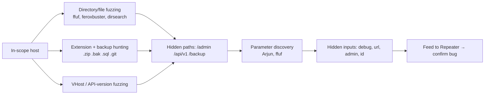
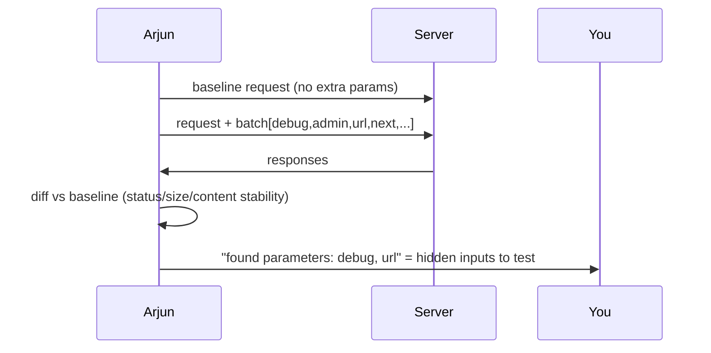

This is Chapter 5 of the Web Tooling notebook. The Burp and ZAP chapters gave you
interactive proxies; the Recon chapter gave you the assets. This chapter zooms into
one high-yield activity that sits between them: **content and parameter discovery** —
the brute-force hunt for the parts of a web app that are *present but not linked*.
Every application hides things: an `/admin` panel with no menu entry, a
`/backup.zip` a developer left behind, a `/api/v1/` that was "deprecated" but never
turned off, a `?debug=true` parameter that flips on stack traces. None of these
appear when you click around; you find them by *guessing well and reading the
responses carefully*. That is fuzzing, and the command-line tools here do it far
faster and more flexibly than Burp Intruder (especially Community) or a GUI spider.

You'll learn the concept first (it's the same idea behind Intruder from the Burp
chapter), then four tools deeply — **ffuf**, **feroxbuster**, **dirsearch**, and
**Arjun** — and the wordlist and filtering strategy that makes them productive rather
than noisy. As always, the Chapter 1 discipline governs everything: **only fuzz
in-scope hosts, throttle to respect the program's rules, and never treat a fragile
target like a stress test.**

## Why This Matters

Hidden content is where uncrowded, high-impact bugs cluster, for a simple reason:
**things that aren't linked are things developers forgot about, and forgotten things
aren't maintained.** The obvious login page has been tested by a thousand hunters;
the `/admin-old/` panel that content discovery surfaced has been tested by nobody.
Backup files (`.zip`, `.sql`, `.bak`, `.git/`) leak source code and credentials
directly. Deprecated API versions skip the auth the new version added. Hidden
parameters (`admin=true`, `debug=1`, `url=`, `redirect=`) are the entry points for
privilege escalation, information disclosure, SSRF, and open redirect.

Parameter discovery is the subtler, less-crowded cousin of content discovery. An
endpoint that appears to take one parameter often secretly honours others the UI
never sends — and those hidden parameters are *exactly* the inputs no one else is
testing. Finding them with Arjun or ffuf is one of the highest-signal moves in
modern bug bounty.



## Part 1: Fuzzing From First Principles

**Fuzzing**, in this context, means sending many automated requests where one part of
the request is swapped for each word in a **wordlist**, and inspecting the responses
to find the ones that behave differently. The swappable part is marked by a keyword —
in ffuf it's the literal string **`FUZZ`**.

```
Template:   GET /FUZZ            with wordlist [admin, login, backup, api, ...]
Sends:      GET /admin   GET /login   GET /backup   GET /api   ...
Reads:      status code, response size, #words, #lines, timing for each
Keeps:      the requests whose responses stand out (200, unusual size, etc.)
```

The entire art is **telling a real hit from noise**. A naive scan of `/FUZZ` returns
a `404` for most words and a `200` for real paths — easy. But many apps return a
**custom 404 page with HTTP 200** (a "soft 404"), so *everything* looks like a hit.
The solution is **filtering** and **matching** on response attributes:

| Attribute | ffuf flag (match / filter) | Use |
| --- | --- | --- |
| Status code | `-mc` / `-fc` | Keep 200/301/403; drop 404 |
| Response size (bytes) | `-ms` / `-fs` | Drop the fixed size of the soft-404 page |
| Word count | `-mw` / `-fw` | Drop responses with the 404 page's word count |
| Line count | `-ml` / `-fl` | Same idea, by lines |
| Regex in response | `-mr` / `-fr` | Match/drop by content |
| Response time | `-mt` / `-ft` | Time-based signals |

`-m*` = **match** (only show these); `-f*` = **filter** (hide these). The core skill:
send a request you *know* is a 404, note its size/words, and **filter that out** so
only real content remains. ffuf's **auto-calibration** (`-ac`) automates this by
probing random paths first to learn the 404 fingerprint.

> **This is the same concept as Burp Intruder** (Chapter 2): positions + payloads +
> reading status/length outliers. The command-line tools are faster, scriptable, not
> rate-throttled the way Burp Community is, and pipe cleanly into your recon flow.

## Part 2: Wordlists — You Are Only As Good As Your List

Fuzzing quality is dominated by wordlist quality. Know the canon:

- **SecLists** (`/usr/share/seclists`) — the standard collection. Key paths:
  - `Discovery/Web-Content/raft-{small,medium,large}-{directories,files}.txt` — the
    workhorse content lists (raft = derived from real-world data, ranked by frequency).
  - `Discovery/Web-Content/common.txt` — quick, small, good first pass.
  - `Discovery/Web-Content/directory-list-2.3-{small,medium}.txt` — classic DirBuster
    lists.
  - `Discovery/Web-Content/api/` — API-specific endpoint names.
  - `Discovery/Web-Content/burp-parameter-names.txt` — parameter-name list for param
    discovery.
- **Assetnote wordlists** (`wordlists.assetnote.io`) — large, frequently-refreshed
  lists built from internet-wide data; excellent for deep passes on big targets.
- **Extension lists** — hunt backups/source: `zip,tar,gz,bak,old,sql,sql.gz,db,
  config,env,log,swp,~,git`.
- **Custom lists** — generate from the target itself: run `cewl` over the site to
  build a wordlist of its own vocabulary, or extract path segments from the URL mining
  (gau/katana) in the Recon chapter. Target-derived words find target-specific paths.

Strategy: **start small and fast** (`common.txt`) to catch obvious wins, then go
**deep** (`raft-medium`, Assetnote) on the interesting hosts. Always add an
**extension sweep** for backups/source, and a **parameter list** pass. Match the list
to the tech (`api/` lists for APIs, PHP extensions for PHP apps — ZAP/httpx tech
fingerprinting from earlier chapters tells you which).

## Part 3: ffuf — The Swiss-Army Fuzzer

**ffuf** ("Fuzz Faster U Fool") is a fast, flexible Go fuzzer and the default choice
of most hunters. One tool covers directories, files, extensions, vhosts, subdomains,
and parameters — anywhere you can place a `FUZZ` keyword.

Install (from the Recon chapter): `go install github.com/ffuf/ffuf/v2@latest`.

### 3.1 Directory and file discovery

```bash
ffuf -u https://app.example.com/FUZZ \
  -w /usr/share/seclists/Discovery/Web-Content/raft-medium-directories.txt \
  -mc 200,204,301,302,307,401,403 -ac -t 40 -o out.json -of json
# -u ...FUZZ : FUZZ marks the insertion point in the URL path
# -w         : wordlist
# -mc        : match these status codes (interesting responses)
# -ac        : auto-calibrate — learn the soft-404 fingerprint and filter it
# -t 40      : 40 concurrent threads
# -o / -of   : write JSON output for later parsing
```

Typical output:

```
admin                   [Status: 301, Size: 178, Words: 6, Lines: 8]
api                     [Status: 200, Size: 1543, Words: 45, Lines: 12]
backup                  [Status: 403, Size: 291, Words: 20, Lines: 10]
.git                    [Status: 301, Size: 178, Words: 6, Lines: 8]   ← source leak!
```

### 3.2 Adding extensions (backup/source hunting)

```bash
ffuf -u https://app.example.com/FUZZ \
  -w /usr/share/seclists/Discovery/Web-Content/raft-medium-files.txt \
  -e .php,.bak,.zip,.tar.gz,.sql,.old,.txt,.config,.env -mc 200,403 -ac -t 40
# -e : append each extension to every word (index.php, index.bak, backup.zip, ...)
#      This is how you find db_backup.sql, config.php.bak, .env, source.zip
```

### 3.3 Manual filtering when auto-calibration isn't enough

If `-ac` misses (some apps vary the 404 size), calibrate by hand: request a
definitely-nonexistent path, note the size, and filter it.

```bash
curl -s -o /dev/null -w "%{size_download}\n" https://app.example.com/definitelynot123
# → e.g. 1024   (the soft-404 body size)
ffuf -u https://app.example.com/FUZZ -w list.txt -mc all -fs 1024 -t 40
# -mc all : consider every status code...
# -fs 1024: ...but filter out the fixed 1024-byte soft-404 body, leaving real hits
```

### 3.4 Recursion

```bash
ffuf -u https://app.example.com/FUZZ -w list.txt -mc 200,301,403 \
  -recursion -recursion-depth 2 -ac -t 40
# -recursion : when a directory is found, fuzz inside it too
# -recursion-depth 2 : limit how deep to recurse (politeness + time)
```

### 3.5 Virtual-host and subdomain fuzzing

Fuzz the **Host header** to find virtual hosts served by the same IP but not in DNS
(a classic way to reach internal apps):

```bash
ffuf -u https://app.example.com/ -H "Host: FUZZ.example.com" \
  -w /usr/share/seclists/Discovery/DNS/subdomains-top1million-20000.txt \
  -fs 0 -ac -t 40
# -H "Host: FUZZ.example.com" : place FUZZ in the Host header (vhost fuzzing)
# Filter by size to drop the default-vhost response; outliers = distinct vhosts
```

### 3.6 Parameter discovery with ffuf

Find hidden **GET** parameters by fuzzing the name and watching for a response change:

```bash
ffuf -u "https://app.example.com/api/user?FUZZ=1" \
  -w /usr/share/seclists/Discovery/Web-Content/burp-parameter-names.txt \
  -fs 0 -ac -mc all -t 40
# FUZZ is the parameter NAME; a response that differs when a given name is present
# reveals a parameter the app secretly honours (e.g. ?debug=1, ?admin=1)
```

And hidden **POST** body parameters:

```bash
ffuf -u https://app.example.com/api/login -X POST \
  -H "Content-Type: application/x-www-form-urlencoded" \
  -d "FUZZ=test" -w burp-parameter-names.txt -fs 0 -ac -mc all
# -X POST / -d : send a POST body with FUZZ as the parameter name
```

### 3.7 Multi-position (cluster bomb) fuzzing

ffuf supports multiple keywords with named wordlists and modes (`clusterbomb`,
`pitchfork`) — the same idea as Burp Intruder's attack types:

```bash
ffuf -u "https://app.example.com/W1/W2" \
  -w dirs.txt:W1 -w files.txt:W2 -mode clusterbomb -mc 200 -ac
# W1, W2 : custom keywords bound to separate wordlists
# -mode clusterbomb : try every W1×W2 combination (pitchfork = lockstep)
```

### 3.8 Rate control, auth, and routing through Burp

```bash
ffuf -u https://app.example.com/FUZZ -w list.txt -mc 200,403 \
  -rate 50 -p 0.1 -H "Cookie: session=<yours>" -H "X-Bug-Bounty: h1-you" \
  -x http://127.0.0.1:8080
# -rate 50 : cap at 50 requests/sec (politeness / rules compliance)
# -p 0.1   : add a 0.1s delay between requests
# -H Cookie: authenticated fuzzing (reach logged-in surface)
# -H X-Bug-Bounty : your identifying header (Chapter 1)
# -x : route through Burp so every hit is logged and sendable to Repeater
```

## Part 4: feroxbuster — Recursive Content Discovery Done Right

**feroxbuster** (Rust) is purpose-built for fast, sane **recursive** content
discovery. Where ffuf is a general fuzzer you point at one position, feroxbuster is
"crawl-and-brute the whole tree" with good defaults.

Install (Recon chapter): `go`? No — it's Rust; `sudo apt install feroxbuster` or
download from GitHub.

```bash
feroxbuster -u https://app.example.com \
  -w /usr/share/seclists/Discovery/Web-Content/raft-medium-directories.txt \
  -x php,bak,zip,sql,env -d 3 -t 40 --scan-limit 4 --rate-limit 100 \
  -H "X-Bug-Bounty: h1-you" -o ferox.txt
# -u    : base URL (feroxbuster recurses from here automatically)
# -w    : wordlist
# -x    : extensions to try on each word
# -d 3  : max recursion depth
# -t 40 : concurrency
# --scan-limit 4 : max simultaneous recursive scans (politeness)
# --rate-limit 100 : cap requests/sec
# -o    : output file
```

feroxbuster auto-filters common noise, resumes interrupted scans (`--resume-from`),
extracts links from responses to seed more discovery (`--extract-links`), and can
filter by status/size/words/lines just like ffuf (`-C 404`, `-S <size>`, etc.). Its
recursion ergonomics make it the go-to when you want to map an entire directory tree
without hand-managing depth.

## Part 5: dirsearch — Batteries-Included Path Scanner

**dirsearch** (Python) is a long-standing, opinionated web path scanner with a strong
default wordlist and convenient built-in behaviours (extension tagging, report
formats, recursion). Great when you want good results with minimal flag-tuning.

```bash
git clone https://github.com/maurosoria/dirsearch && cd dirsearch
python3 dirsearch.py -u https://app.example.com \
  -e php,html,js,zip,bak,sql -x 404,403 -r -R 2 -t 30 \
  --format=json -o report.json
# -u : target
# -e : extensions to append (dirsearch's %EXT% placeholder handles this)
# -x : exclude these status codes from results
# -r : recursive
# -R 2 : recursion depth 2
# -t 30 : threads
# --format/-o : structured report
```

dirsearch's **`%EXT%`** wordlist convention (words tagged with where extensions go)
and its curated default list mean it often finds things a raw list misses. It's a
solid "second opinion" tool — run it alongside ffuf/feroxbuster; each tool + list
combination surfaces slightly different content.

## Part 6: Arjun — HTTP Parameter Discovery

**Arjun** (Python) specialises in one thing: finding **hidden HTTP parameters** by
sending batches of candidate names and using **response-diffing** to detect which
ones the endpoint actually reacts to. It's smarter than raw ffuf param fuzzing
because it handles reflection, stability checks, and chunking automatically.

Install (Recon chapter): `pip install arjun`.

```bash
arjun -u https://app.example.com/api/profile -m GET -oT arjun_out.txt
# -u   : target endpoint
# -m   : method — GET | POST | JSON | XML | HEADERS
# -oT  : text output
# Arjun sends candidate params in batches, diffs responses (status/size/content),
# and reports the names that produce a stable, distinct change = real parameters.
```

Test all the input surfaces an endpoint might read from:

```bash
arjun -u https://app.example.com/api/order -m JSON     # JSON body params
arjun -u https://app.example.com/api/order -m POST     # form body params
arjun -u https://app.example.com/api/order -m HEADERS  # hidden header inputs
arjun -u https://app.example.com/search --stable       # extra stability checks
# Pass -w to use a custom param wordlist; --headers to send auth cookies.
```

Discovered parameters are gold: an undocumented `?admin=`, `?debug=`, `?internal=`,
`?callback=`, `?url=`, `?next=` is frequently the seed of a real bug (privilege
escalation, info leak, SSRF, open redirect). Feed each into Repeater and probe it.



## Part 7: Turning Discovery Into Findings

Discovery is only step one; the value is in what you *do* with the hits.

- **A found `.git/` or backup archive** → download the exposed source/config and mine
  it for secrets and logic (non-destructively; a single confirming file is enough
  proof — don't hoover the whole repo of a live business beyond what proves the leak).
  `git-dumper` reconstructs a repo from an exposed `.git/`.
- **An `/admin` or deprecated-version endpoint** → test its authentication and access
  control in Repeater (does it even require auth? does your low-priv account reach it?).
- **A hidden `debug`/`test` parameter** → toggle it and watch for stack traces,
  verbose errors, or behaviour changes (information disclosure, feature unlock).
- **A hidden `url`/`redirect`/`callback` parameter** → SSRF/open-redirect candidates —
  point them at a Collaborator/interactsh host (Chapter 3) and watch for a callback.
- **A hidden `id`/`user`/`account` parameter** → IDOR/access-control candidates — vary
  it with your two test accounts.

Everything you discover should flow through Burp/ZAP into hand-validation. Content and
parameter discovery *expands the attack surface*; the injection, access-control and
SSRF chapters that follow *exploit* what you found.

## Part 8: Hands-On Lab — Discover the Hidden App

Use a legal target: **OWASP Juice Shop** locally, a **PortSwigger lab**, or a program
whose policy permits automated content discovery (check first — some forbid or
rate-limit it). Route everything through Burp.

### Step 1 — Quick pass

```bash
ffuf -u http://localhost:3000/FUZZ \
  -w /usr/share/seclists/Discovery/Web-Content/common.txt \
  -mc 200,301,302,401,403 -ac -t 40 -x http://127.0.0.1:8080
```

Note the obvious hits (`/ftp`, `/rest`, `/api`, `/assets`, etc. in Juice Shop).

### Step 2 — Deep + extensions (backup hunt)

```bash
ffuf -u http://localhost:3000/FUZZ \
  -w /usr/share/seclists/Discovery/Web-Content/raft-medium-files.txt \
  -e .zip,.bak,.sql,.json,.md,.txt,.yml -mc 200,403 -ac -t 40
```

### Step 3 — Recurse the tree with feroxbuster

```bash
feroxbuster -u http://localhost:3000 \
  -w /usr/share/seclists/Discovery/Web-Content/raft-small-directories.txt \
  -x json,js -d 2 -t 30 --scan-limit 3 --extract-links
```

### Step 4 — Discover hidden parameters

Pick an API endpoint from Steps 1–3 (e.g. `/rest/products/search`) and mine it:

```bash
arjun -u "http://localhost:3000/rest/products/search" -m GET
ffuf -u "http://localhost:3000/rest/products/search?FUZZ=1" \
  -w /usr/share/seclists/Discovery/Web-Content/burp-parameter-names.txt \
  -fs 0 -ac -mc all
```

### Step 5 — Validate one finding end to end

Take the single most interesting hit — an unlinked path or a hidden parameter — and
in Burp Repeater, probe it: does the path require auth? does the parameter change
behaviour? Write a short note: what you found, how you found it (tool + wordlist), and
what you'd test next. That note is the bridge to the exploitation chapters.

**Deliverable:** a consolidated `discovery.md` listing your interesting paths (with
status/size), any backup/source exposure, and the hidden parameters per endpoint,
plus one validated lead described in Repeater terms.

> **CTF connection.** "There's a hidden directory/parameter" is one of the most common
> web-CTF motifs. `ffuf`/`feroxbuster` to find `/admin` or `/backup`, then Arjun/ffuf
> to find the `?debug=`/`?file=` parameter that leaks the flag, is a standard solve.
> The muscle is identical to bounty content discovery, minus the reporting.

## Part 9: Detection & Defense Angle

- **Content discovery is a 404 flood.** Hundreds/thousands of requests to
  non-existent paths in a short window is a textbook signature. WAFs and rate-limiters
  block or throttle it; SOC dashboards light up on the 404 spike. This is *why* you
  throttle (`-rate`, `-p`, `--rate-limit`), scope tightly, and attach your identifying
  header so authorised testing isn't mistaken for an attack.
- **Blue-team defenses** (and what you're implicitly testing): a good WAF rate-limits
  per-source and blocks known scanner user-agents; well-run apps return a *consistent*
  404 (no soft-404 with 200), remove backup files from web roots, block access to
  `.git`/`.env`/dotfiles at the server, and don't ship deprecated API versions. Each
  discovery win you get is a defensive failure the report should name.
- **Defensive takeaway to include in findings:** the fix for "exposed backup/source"
  is process (never leave archives in web roots; deny dotfiles; CI checks), and the
  fix for "hidden dangerous parameter" is to remove debug/admin backdoors from prod and
  enforce server-side authorisation on every parameter — not to rely on obscurity.

## Part 10: Common Mistakes and How to Avoid Them

| Mistake | Why it hurts | The fix |
| --- | --- | --- |
| No filtering / calibration | Soft-404s drown real hits | Use `-ac`, or calibrate `-fs`/`-fw` manually |
| One tiny wordlist | Miss most content | Layer: common → raft-medium → Assetnote; add extensions |
| Skipping extension sweep | Miss backups/source (highest value) | `-e .zip,.bak,.sql,.env,.git` |
| Ignoring parameter discovery | Miss uncrowded hidden inputs | Run Arjun/ffuf param fuzzing on every endpoint |
| Unthrottled scans on live targets | DoS + WAF block + rules violation | `-rate`/`-p`/`--rate-limit`; scope tightly |
| Fuzzing out-of-scope hosts | Unauthorised testing | Confirm scope before every run |
| Not routing through Burp | Hits get lost | `-x http://127.0.0.1:8080`; send to Repeater |
| Dumping whole repos/data as "proof" | Ethics/legal violation | One confirming file/response is enough |
| Wrong list for the tech | Wasted requests | API lists for APIs; match extensions to stack |

## Part 11: Final Revision / Summary

Content and parameter discovery brute-forces the parts of an app that are **present
but not linked** — the `/admin` panels, `backup.zip` archives, exposed `.git/`,
deprecated `/api/v1/` endpoints, and hidden `?debug=`/`?url=`/`?admin=` parameters
where **uncrowded, high-impact bugs live**. It's Burp Intruder's concept at
command-line speed: place a **`FUZZ`** keyword, feed a **wordlist**, and read
**status/size/words/lines**, using **match (`-m*`) and filter (`-f*`)** — plus
**auto-calibration** — to beat soft-404 noise. Results are only as good as your
**wordlists** (SecLists raft/common/api lists, Assetnote, extension and parameter
lists, plus target-derived lists from `cewl`/URL mining). **ffuf** is the flexible
Swiss-army fuzzer (dirs, files, extensions, vhosts, subdomains, GET/POST params,
cluster-bomb, recursion, rate control, Burp routing); **feroxbuster** is the
recursive-content specialist with sane defaults; **dirsearch** is the batteries-
included second opinion; **Arjun** finds hidden parameters by response-diffing across
GET/POST/JSON/headers. Discovery only matters when you **turn hits into findings** —
mine exposed source/backups, test unlinked endpoints for auth/access-control, and
probe hidden parameters for info-disclosure/SSRF/IDOR — always routed through Burp/ZAP
for hand-validation. And it's loud: **throttle, scope, identify your traffic**, and
keep proof minimal. With the attack surface now fully mapped and expanded, the next
chapters bring templated scanning (nuclei) and the OWASP Top 10 that turn these
discoveries into exploited, reported bugs.

## Part 12: Cheat Sheet / Quick Reference

**ffuf essentials**

```bash
# directories
ffuf -u https://T/FUZZ -w raft-medium-directories.txt -mc 200,301,401,403 -ac -t 40
# files + backup extensions
ffuf -u https://T/FUZZ -w raft-medium-files.txt -e .php,.bak,.zip,.sql,.env -mc 200,403 -ac
# manual 404 filter
ffuf -u https://T/FUZZ -w list.txt -mc all -fs <soft404size>
# recursion
ffuf -u https://T/FUZZ -w list.txt -recursion -recursion-depth 2 -ac
# vhost
ffuf -u https://T/ -H "Host: FUZZ.T" -w subs.txt -fs 0 -ac
# GET param
ffuf -u "https://T/api?FUZZ=1" -w burp-parameter-names.txt -fs 0 -ac -mc all
# polite + Burp + auth
ffuf ... -rate 50 -p 0.1 -H "Cookie: session=X" -H "X-Bug-Bounty: h1-you" -x http://127.0.0.1:8080
```

**feroxbuster / dirsearch**

```bash
feroxbuster -u https://T -w raft-medium-directories.txt -x php,bak,zip,env -d 3 --scan-limit 4 --rate-limit 100
python3 dirsearch.py -u https://T -e php,zip,bak,sql -x 404,403 -r -R 2
```

**Arjun**

```bash
arjun -u https://T/api/x -m GET      # also: -m POST | JSON | XML | HEADERS
```

**Filter/match flags (ffuf)**

```
-mc/-fc status   -ms/-fs size   -mw/-fw words   -ml/-fl lines   -mr/-fr regex
-ac  auto-calibrate 404   -m* = match(show)   -f* = filter(hide)
```

**Turn hits into bugs**

```
.git / backup.zip  → source/secret leak (git-dumper)
/admin, /api/v1    → test auth + access control in Repeater
?debug ?test       → info disclosure / stack traces
?url ?redirect     → SSRF / open redirect (Collaborator/interactsh)
?id ?user          → IDOR (two test accounts)
```

## Part 13: Practice Labs & Resources

- **PortSwigger Web Security Academy — "Information disclosure", "Access control", and
  the labs that hinge on hidden endpoints/params** (`portswigger.net/web-security`) —
  practise converting discovered content/params into findings.
- **TryHackMe: "Content Discovery", "ffuf", "Web Enumeration"** rooms — guided, legal
  practice of every tool here.
- **HackTheBox** machines — content discovery (`/admin`, backups, `.git`) is a near-
  universal foothold step; great for the discover→exploit bridge.
- **ffuf docs** (`github.com/ffuf/ffuf` + `ffuf.me`, the author's practice range) —
  `ffuf.me` is a legal target built specifically to practise ffuf filtering/calibration.
- **feroxbuster & dirsearch READMEs** — full flag references and recursion options.
- **Arjun README** (`github.com/s0md3v/Arjun`) — parameter-discovery options and
  wordlists.
- **SecLists** (`Discovery/Web-Content/`) and **Assetnote wordlists**
  (`wordlists.assetnote.io`) — the lists everything depends on.

Practice questions:

1. An app returns HTTP 200 with a 1,200-byte page for *every* path, real or not. Your
   ffuf scan shows every word as a hit. Explain what's happening and give two ways to
   fix your scan.
2. Which single extension sweep would you add to a content scan to hunt for exposed
   source and configuration, and why are those the highest-value hits?
3. Write an ffuf command that discovers hidden POST body parameters on
   `https://T/api/login`, filtering out empty responses.
4. You discover `/api/v1/users` (old) alongside `/api/v3/users` (current). What is the
   first thing you test on the v1 endpoint and why?
5. Arjun reports a hidden `url` parameter on an endpoint. Name the two vulnerability
   classes this most suggests and how you'd prove one non-destructively.
