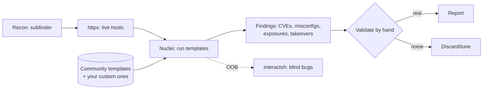
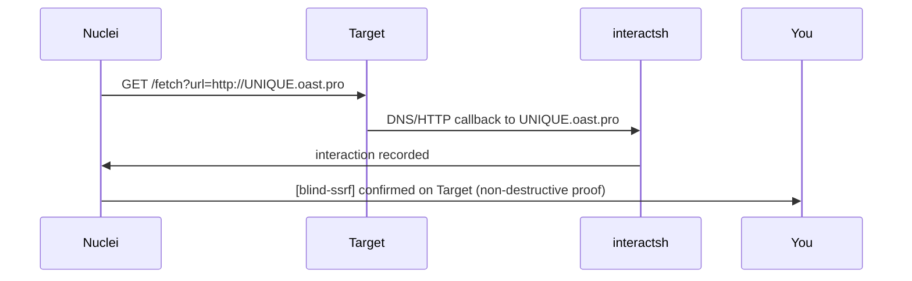

This is Chapter 6 of the Web Tooling notebook. The Recon chapter gave you hundreds of
live hosts; the discovery chapter expanded each into paths and parameters. Now you
have a scale problem: you cannot hand-check thousands of endpoints for every known
vulnerability. **Nuclei** is the answer the whole industry converged on. It is a
fast, open-source scanner from ProjectDiscovery that runs **templates** — small YAML
files that each describe exactly how to detect one specific issue (a CVE, a
misconfiguration, an exposed panel, a default credential, a takeover). Because the
detection logic lives in shareable templates rather than the tool's binary, a global
community keeps a library of *thousands* of checks up to date, and you can write your
own in minutes.

Nuclei is where recon becomes findings at scale. Point it at your `httpx` output and
it tells you which of those hosts has an exposed `.git`, a known-vulnerable Confluence,
a subdomain takeover, an unauthenticated Grafana, or a default-credential Jenkins.
This chapter teaches it from install through writing your own templates — the skill
that separates people who *run* Nuclei from people who *extend* it. As always, the
Chapter 1 rules govern: **only scan in-scope hosts, throttle, and understand that some
templates send real (occasionally intrusive) payloads.**

## Why This Matters

Two properties make template-based scanning the backbone of modern hunting:

1. **Signal.** Each template is a precise, community-reviewed check for *one* thing,
   with tuned matchers. That yields far fewer false positives than a monolithic
   scanner throwing generic payloads — and false positives are what destroy your
   reputation (Chapter 1). A Nuclei hit is usually a *real* thing worth looking at.
2. **Scale and speed.** Nuclei is built to run thousands of templates against
   thousands of hosts concurrently. The moment a new CVE drops, someone writes a
   template, and within hours you can check your entire scoped attack surface for it —
   often *before* the target has patched. Being first to a freshly-templated CVE across
   a big scope is a repeatable bounty strategy.

And the extensibility is the real superpower: when you notice a quirk specific to one
program (a custom header that leaks data, a predictable endpoint), you encode it as a
template and run it across all their hosts automatically. Nuclei turns a one-off
observation into a fleet-wide check.



## Part 1: What Template-Based Scanning Is

A traditional scanner bakes its detection logic into the program. Nuclei inverts this:
the binary is a fast **engine** that knows how to send HTTP/DNS/TCP/etc. requests and
evaluate **matchers**; the *knowledge* of what to detect lives in **templates** —
plain YAML files. A template says, in effect: "send *this* request; if the response
*matches this condition*, report *this* finding at *this* severity."

Because templates are just files:

- **Anyone can write one** (you'll write several this chapter).
- **They're shareable and versioned** — the official `nuclei-templates` repo on GitHub
  holds thousands, contributed and reviewed by the community.
- **They're auditable** — before running a template you can *read exactly what it will
  do*, which is how you avoid intrusive checks (unlike a black-box scanner).

Nuclei templates cover many protocols (HTTP, DNS, TCP, SSL, file, headless/browser,
code) and many categories: **CVEs**, **misconfigurations**, **default logins**,
**exposed panels**, **exposures** (`.git`, `.env`, backups), **takeovers**,
**technologies** (fingerprinting), and **fuzzing**.

## Part 2: Install and Update

Install the engine and the template library:

```bash
# Engine (Go)
go install -v github.com/projectdiscovery/nuclei/v3/cmd/nuclei@latest

# First run downloads the community templates to ~/.local/nuclei-templates
nuclei -update-templates
# -update-templates : clone/refresh the official nuclei-templates repo

nuclei -version
nuclei -tl            # -tl : list all available templates (sanity check)
```

Keep both current — new CVEs and templates land constantly:

```bash
nuclei -update                 # update the engine binary
nuclei -update-templates       # update the template library (run often)
```

## Part 3: Running Nuclei — Targeting, Filtering, Throttling

### 3.1 Basic targeting

```bash
# Single host
nuclei -u https://app.example.com

# A whole list (your httpx output from the Recon chapter) — the real workflow
nuclei -l live_hosts.txt -o nuclei_findings.txt
# -u  : single target URL
# -l  : file of targets, one per line
# -o  : write findings to a file
```

### 3.2 Selecting which templates run (this is the key skill)

Running *all* templates against everything is slow and, worse, can be intrusive.
**Filter** deliberately:

```bash
# By severity — focus on what pays
nuclei -l live.txt -severity critical,high

# By tags — run only relevant categories
nuclei -l live.txt -tags cve,exposure,takeover,misconfig

# By specific template or directory
nuclei -l live.txt -t http/exposures/ -t http/takeovers/

# Exclude noisy/intrusive templates
nuclei -l live.txt -etags fuzz,dos,intrusive

# By template ID / author / CVE
nuclei -l live.txt -id CVE-2023-XXXXX
```

| Flag | Meaning |
| --- | --- |
| `-t` | Run templates from this path/dir/file |
| `-tags` | Run templates carrying these tags |
| `-etags` | Exclude templates with these tags |
| `-severity` | Only this/these severities |
| `-id` | Run a specific template ID |
| `-author` | Templates by a given author |
| `-tc` | Template *condition* (advanced boolean over tags/fields) |

### 3.3 Rate control and concurrency — the safety knobs

Nuclei can generate a *lot* of traffic. Throttle it, especially on live programs:

```bash
nuclei -l live.txt -severity critical,high \
  -rate-limit 50 -c 25 -bulk-size 25 -timeout 10 -retries 1 \
  -H "X-Bug-Bounty: h1-you"
# -rate-limit 50 : max 50 requests/sec overall (politeness / rules)
# -c 25          : 25 templates run concurrently
# -bulk-size 25  : 25 hosts scanned in parallel per template
# -timeout 10    : per-request timeout seconds
# -retries 1     : retry a failed request once
# -H             : add your identifying header to every request
```

### 3.4 Safety defaults and the intrusive-template footgun

Nuclei is **safe-by-default in spirit** — most templates are detection-only (they look
for a signature, they don't exploit). But the library also contains **intrusive**,
**fuzzing**, and occasionally **dos**-tagged templates that send heavier or
state-changing payloads. Two habits keep you safe:

- **Exclude intrusive categories** unless you've read them: `-etags intrusive,dos,fuzz`.
- **Read before you run** anything unfamiliar: `cat` the template, or use
  `-validate`/`-dry-run` style inspection. Because templates are plain YAML, you can
  always see exactly what a check will send *before* it sends it — a transparency no
  black-box scanner offers. Use it.

> **The community-template footgun.** Blindly running the *entire* template set at
> maximum concurrency against a live program is how people accidentally violate rate
> limits, trip WAFs, and occasionally hit a fuzzing/DoS template they didn't vet.
> Curate: severity+tags filters, exclude intrusive, throttle, and stay in scope.

## Part 4: Reading Findings and Validating

Nuclei output is compact and information-dense:

```
[CVE-2021-44228] [http] [critical] https://app.example.com/api  [log4j RCE via JNDI]
[git-config] [http] [medium] https://dev.example.com/.git/config
[grafana-unauth] [http] [high] https://metrics.example.com/  [Grafana without auth]
[subdomain-takeover] [http] [high] https://old.example.com/  [dangling S3 CNAME]
```

Each line: **[template-id] [protocol] [severity] URL [info]**. As with every scanner
(Burp/ZAP chapters), **a Nuclei hit is a lead, not a finished bug.** The validation
discipline is identical:

1. Find the template (`nuclei -t <path> -u <target> -debug` shows the exact request/
   response).
2. Reproduce the matcher condition **by hand** in Burp Repeater — confirm the response
   really matches for the reason the template claims.
3. Assess **real, in-context impact** (an "exposed panel" behind an IP allowlist you
   can't reach isn't exploitable; a `.git/config` that's actually empty isn't a leak).
4. Only confirmed, impactful hits become reports, with *your* minimal PoC.

Nuclei's precision means its false-positive rate is lower than generic scanners — but
"lower" is not "zero," and version-based CVE templates in particular can flag a
version string without the vuln actually being reachable. Always validate.

## Part 5: Anatomy of a Template — Reading YAML

To trust and extend Nuclei you must read its templates. Here is a complete, minimal
template that detects an exposed `.git/config`:

```yaml
id: exposed-git-config

info:
  name: Exposed .git/config
  author: you
  severity: medium
  description: A .git/config file is accessible, exposing repository metadata.
  tags: exposure,git

http:
  - method: GET
    path:
      - "{{BaseURL}}/.git/config"
    matchers-condition: and
    matchers:
      - type: word
        words:
          - "[core]"
          - "repositoryformatversion"
        condition: and
      - type: status
        status:
          - 200
```

Line by line:

- **`id`** — unique identifier (appears in output).
- **`info`** — metadata: `name`, `author`, `severity` (info/low/medium/high/critical),
  `description`, and `tags` (what `-tags` filters on).
- **`http`** — a request block (Nuclei also has `dns`, `tcp`, `ssl`, `file`, `headless`,
  `code`). `method` + `path` define the request; **`{{BaseURL}}`** is the target you
  passed in.
- **`matchers-condition: and`** — *all* matchers must pass (`or` = any).
- **`matchers`** — the conditions. Here a **`word`** matcher (the response body must
  contain both `[core]` and `repositoryformatversion`) **and** a **`status`** matcher
  (HTTP 200). Only when both hold does Nuclei report a finding.

## Part 6: Writing Templates — Matchers, Extractors, DSL

### 6.1 Matcher types

| Matcher | Matches on | Example use |
| --- | --- | --- |
| `status` | HTTP status code | `200`, `401`, `500` |
| `word` | Substring(s) in response | error strings, banners, markers |
| `regex` | Regex in response | version patterns, tokens |
| `binary` | Hex byte patterns | magic bytes, binary protocols |
| `dsl` | Boolean DSL expression | complex logic combining fields |
| `size` | Response length | fixed-size fingerprints |

Matchers can target a **`part`** (`body`, `header`, `all`, `interactsh_protocol`,
etc.) and can be **negated** (`negative: true`). `matchers-condition` combines them.

### 6.2 Extractors — pull values out

Extractors capture data from a matched response (a version, an ID, a token) into the
output — useful for reporting and for chaining:

```yaml
    extractors:
      - type: regex
        part: body
        regex:
          - "Server version: ([0-9.]+)"
        group: 1        # capture group 1 = the version number
```

### 6.3 The DSL matcher (powerful logic)

Nuclei's **DSL** lets you express conditions over response fields with functions:

```yaml
      - type: dsl
        dsl:
          - "status_code == 200 && contains(body, 'admin') && len(body) > 500"
          - "contains(tolower(header), 'x-powered-by: express')"
```

DSL gives you programmable matching — combine status, headers, body, timing, and
built-in helpers (`contains`, `regex`, `len`, `tolower`, `md5`, etc.).

### 6.4 Multi-step and raw HTTP

For real vulns you often need a sequence (log in, then hit a protected endpoint) or a
precisely-crafted raw request. Nuclei supports **raw** requests and **multi-request**
flows:

```yaml
http:
  - raw:
      - |
        POST /api/login HTTP/1.1
        Host: {{Hostname}}
        Content-Type: application/json

        {"user":"admin","pass":"admin"}
      - |
        GET /api/admin/secret HTTP/1.1
        Host: {{Hostname}}
        Authorization: Bearer {{token}}
    extractors:
      - type: regex
        name: token
        part: body
        regex: ['"token":"([^"]+)"']
        group: 1
        internal: true      # capture for use in the NEXT request, not for output
```

This runs the login, extracts the token, and reuses it in the second request — the
template equivalent of a Repeater chain, now automated across every host.

### 6.5 Out-of-band with interactsh (blind bugs)

Nuclei has **interactsh** baked in for blind detection (the free Collaborator from
Chapter 3). Use `{{interactsh-url}}` in a payload and an `interactsh_protocol` matcher
to catch the callback:

```yaml
http:
  - raw:
      - |
        GET /fetch?url=http://{{interactsh-url}} HTTP/1.1
        Host: {{Hostname}}
    matchers:
      - type: word
        part: interactsh_protocol   # fires when the server calls interactsh
        words:
          - "http"                  # or "dns" for DNS-only interaction
```

This is how Nuclei detects blind SSRF/RCE at scale — the server pinging the interactsh
server *is* the proof, exactly as with Burp Collaborator.



### 6.6 Workflows

**Workflows** chain templates conditionally: run a technology-detection template, and
*only if* it matches (e.g. "this is WordPress"), run the WordPress-specific CVE
templates. This makes big scans efficient and less noisy — you don't fire Confluence
CVEs at a WordPress site.

## Part 7: Integrating Nuclei Into the Recon Pipeline

Nuclei's natural home is the end of the recon chain from Chapter 2:

```bash
# The canonical one-liner: enumerate → resolve/probe → scan
subfinder -d example.com -all -silent \
  | httpx -silent \
  | nuclei -severity critical,high -tags cve,exposure,takeover,misconfig \
           -etags intrusive,dos -rate-limit 50 -H "X-Bug-Bounty: h1-you" \
           -o findings.txt
```

Route it through Burp to capture everything for hand-validation:

```bash
nuclei -l live.txt -tags exposure,takeover -proxy http://127.0.0.1:8080
# -proxy : send all Nuclei traffic through Burp/ZAP → inspect + send hits to Repeater
```

And make it **continuous** (the monitoring idea from Chapter 2): schedule a scan of
your scoped hosts, diff findings against last run, and alert on anything new — so the
day a target deploys a vulnerable component, you know first.

## Part 8: Hands-On Lab — Scan, Read a Template, Write One

Use a legal target: **OWASP Juice Shop** locally, a deliberately-vulnerable test host,
or an in-scope program that permits automated scanning (check the policy). Route
through Burp.

### Step 1 — Update and run a curated scan

```bash
nuclei -update-templates
nuclei -u http://localhost:3000 -tags exposure,misconfig,tech \
  -severity info,low,medium,high,critical -rate-limit 50 -proxy http://127.0.0.1:8080 \
  -o juice_findings.txt
cat juice_findings.txt
```

Read the findings. Note technology fingerprints and any exposure/misconfig hits.

### Step 2 — Inspect a template before trusting a hit

Pick one finding, locate its template, and read it:

```bash
nuclei -tl | grep -i git                    # find the template file
cat ~/.local/nuclei-templates/http/exposures/configs/git-config.yaml
nuclei -u http://localhost:3000 -id git-config -debug   # see exact request/response
```

Confirm *why* it matched, then reproduce the request in Burp Repeater.

### Step 3 — Write your own template

Create `my-templates/juice-admin.yaml` that detects an interesting Juice Shop endpoint
or a marker you observed (adapt the `.git` template from Part 5):

```yaml
id: juice-ftp-directory
info:
  name: Juice Shop FTP directory listing
  author: you
  severity: medium
  tags: exposure,misconfig
http:
  - method: GET
    path:
      - "{{BaseURL}}/ftp"
    matchers-condition: and
    matchers:
      - type: status
        status: [200]
      - type: word
        part: body
        words: ["Index of /ftp", "acquisitions.md"]
        condition: or
```

Run it:

```bash
nuclei -u http://localhost:3000 -t my-templates/juice-ftp-directory.yaml -debug
```

### Step 4 — Add an extractor and validate

Extend your template with an extractor (pull a filename from the listing), rerun, and
confirm the extracted value appears in output. Then validate the whole finding by hand
in Repeater and write a one-line impact statement.

### Step 5 — Blind bug (optional, if a URL-sink exists)

If your target has a URL-fetching endpoint, write an interactsh template (Part 6.5),
run `nuclei -interactsh-url ...` or the default, and confirm a callback. Record the
interaction as non-destructive proof.

**Deliverable:** `nuclei_lab.md` containing your curated scan findings (validated vs
noise), the template you wrote, and one finding fully validated in Repeater with an
impact line.

> **CTF connection.** Nuclei is less common *inside* a single CTF box (you'd fingerprint
> and exploit by hand), but it's the standard tool for the "scan this range/these hosts
> for known vulns" style of attack/defense CTF and for the recon phase of realistic
> boot-to-root machines. Writing a quick template to detect a challenge's specific
> marker across many hosts is a slick move in fleet-style CTFs.

## Part 9: Detection & Defense Angle

- **Nuclei is loud and fingerprintable.** Its default User-Agent and characteristic
  request patterns are trivially signatured; a big scan is a burst of probing across
  many paths. WAFs and rate-limiters block it, and SOCs alert on it. Throttle
  (`-rate-limit`), scope tightly, exclude intrusive templates, and attach your
  identifying header so authorised research isn't mistaken for an attack. You can
  randomise the User-Agent, but on a program you *want* to be identifiable, not evasive.
- **Blue-team use of Nuclei.** Because it's free, fast, and template-driven, Nuclei is
  also a premier *defensive* tool: security teams run it against their own assets to
  find exposures and newly-disclosed CVEs before attackers do, and wire it into CI to
  catch misconfigurations pre-deploy. The very hits you'd report are the ones a mature
  team is already scanning themselves for.
- **The detection lesson mirrors the offense:** the fix for a Nuclei "exposed X"
  finding is to remove the exposure (auth on the panel, deny `.git`/`.env`, patch the
  CVE, fix the dangling DNS), and the fix for the scan noise itself is rate-limiting and
  WAF tuning — which is exactly what you'll bump into and, in later chapters, learn to
  evade and to configure.

## Part 10: Common Mistakes and How to Avoid Them

| Mistake | Why it hurts | The fix |
| --- | --- | --- |
| Running ALL templates at max speed | Slow, intrusive, WAF-tripping | Filter by severity+tags; throttle; `-etags intrusive,dos` |
| Not reading intrusive templates | May send state-changing payloads | Read the YAML before running unfamiliar checks |
| Trusting version-based CVE hits | Version string ≠ exploitable | Validate reachability/impact by hand |
| Reporting raw Nuclei output | False positives → reputation loss | Reproduce in Repeater; minimal PoC |
| Stale templates | Miss new CVEs / broken checks | `-update-templates` frequently |
| Scanning out of scope | Unauthorised testing | Feed only in-scope httpx output |
| No rate limit on live target | DoS + block + rules violation | `-rate-limit`, `-c`, `-bulk-size` conservatively |
| Ignoring custom templates | Miss program-specific bugs at scale | Encode observed quirks as templates |

## Part 11: Final Revision / Summary

**Nuclei** is a fast, open-source, **template-driven** scanner: the binary is an engine
that sends requests and evaluates **matchers**, while the detection knowledge lives in
shareable **YAML templates** — thousands maintained by the community, plus any you
write. That design gives it two decisive advantages: **high signal** (precise,
reviewed checks → fewer false positives) and **scale** (thousands of checks across
thousands of hosts, with new CVEs templated within hours). The workflow is
**curate-and-throttle**: filter by `-severity`, `-tags`/`-etags`, or `-t`, exclude
`intrusive,dos,fuzz`, and rate-limit with `-rate-limit`/`-c`/`-bulk-size`, always in
scope and with an identifying header — because you can *read every template's YAML
before running it*, transparency you should actually use. Every hit is a **lead**,
validated by hand in Repeater with a minimal PoC. The real superpower is **writing
templates**: `info` metadata, an `http` request block, **matchers** (status/word/regex/
binary/dsl) combined with `matchers-condition`, **extractors**, **raw/multi-step**
flows for authenticated or chained checks, built-in **interactsh** for blind SSRF/RCE,
and **workflows** for conditional, tech-aware scanning. Nuclei slots onto the end of the
recon pipeline (`subfinder | httpx | nuclei`), routes through Burp for validation, and
runs continuously so you're first to every new exposure. It's loud and fingerprintable
by design — throttle, scope, identify — and it's as much a blue-team tool as a red one.
With templated scanning in hand, the final tooling chapter maps the OWASP Top 10 onto
the whole attack surface you've now learned to enumerate, expand, and scan.

## Part 12: Cheat Sheet / Quick Reference

**Run**

```bash
nuclei -update-templates                       # keep templates fresh
nuclei -u https://T                            # single target
nuclei -l live.txt -o out.txt                  # list of targets
subfinder -d T -all -silent | httpx -silent | nuclei -severity critical,high
```

**Curate & throttle (do this on live targets)**

```bash
nuclei -l live.txt -severity critical,high -tags cve,exposure,takeover,misconfig \
  -etags intrusive,dos,fuzz -rate-limit 50 -c 25 -bulk-size 25 \
  -H "X-Bug-Bounty: h1-you" -proxy http://127.0.0.1:8080
```

**Filter flags**

```
-t path   -tags X   -etags X   -severity S   -id ID   -author A   -tc <condition>
```

**Template skeleton**

```yaml
id: my-check
info: {name: ..., author: you, severity: medium, tags: exposure}
http:
  - method: GET
    path: ["{{BaseURL}}/.env"]
    matchers-condition: and
    matchers:
      - {type: status, status: [200]}
      - {type: word, part: body, words: ["DB_PASSWORD"]}
    extractors:
      - {type: regex, part: body, regex: ["DB_PASSWORD=(.+)"], group: 1}
```

**Matchers / OOB**

```
matchers: status | word | regex | binary | dsl | size   (part: body|header|all)
OOB: put {{interactsh-url}} in payload; match part: interactsh_protocol (http/dns)
raw + internal extractor = multi-step auth chains
```

## Part 13: Practice Labs & Resources

- **Nuclei documentation & templating guide** (`docs.projectdiscovery.io/tools/nuclei`)
  — authoritative; read the templating guide and matcher/DSL reference in full.
- **nuclei-templates repo** (`github.com/projectdiscovery/nuclei-templates`) — read
  real templates by category to learn patterns; the best way to level up your writing.
- **OWASP Juice Shop** and deliberately-vulnerable hosts — safe targets for scanning and
  template testing.
- **TryHackMe "Nuclei"** room and **HackTheBox Academy** recon modules — guided practice.
- **ProjectDiscovery's interactsh** (`github.com/projectdiscovery/interactsh`) — the OOB
  backend for your blind-bug templates.
- **PortSwigger labs** — although not Nuclei-focused, they teach the vuln classes your
  templates detect, so you understand *what* a hit really means.
- **Nuclei templating "capture the flag"/exercises** in the docs — practise writing
  matchers against known responses.

Practice questions:

1. Explain why template-based scanning generally produces higher signal (fewer false
   positives) than a monolithic generic scanner.
2. You want to scan 2,000 in-scope hosts for critical/high CVEs and exposures without
   risking intrusive payloads or tripping rate limits. Write the Nuclei command.
3. Write a minimal template that detects an exposed `.env` file containing
   `DB_PASSWORD`, requiring HTTP 200.
4. How does Nuclei prove a *blind* SSRF, and which matcher `part` do you use?
5. A version-based CVE template flags `https://app.example.com`. List the steps before
   this becomes a bug-bounty report and one reason it might be a false positive.
