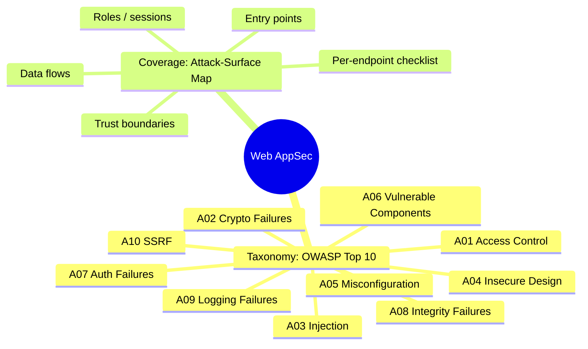
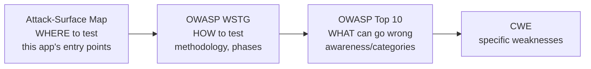
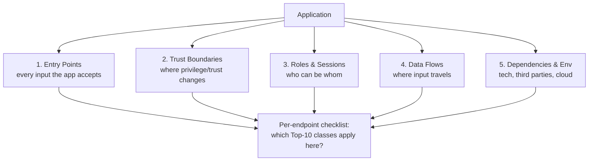

**Level:** Advanced · **Track:** Bug Bounty & AppSec · **Read time:** 205 min

This is Chapter 7 of the Web Tooling notebook and its capstone. The previous chapters
handed you instruments: Burp and ZAP for interception and scanning, ffuf/feroxbuster/
Arjun for discovery, Nuclei for templated detection. This chapter supplies the thing
that makes those instruments productive — a **map of where bugs live** and a
**vocabulary for what they are**. Two frameworks provide it: the **OWASP Top 10**, the
industry's shared taxonomy of the most critical web risk categories, and
**attack-surface mapping**, the discipline of decomposing an application into its entry
points, trust boundaries, roles, and data flows so you can systematically ask "what
could go wrong *here*?" at every point.

Crucially, the Top 10 is an **awareness list, not a methodology** — it tells you the
*categories* of risk, not a step-by-step way to test. This chapter teaches both: the
ten categories deeply enough to recognise them in the wild, and the mapping process
that turns "I know XSS exists" into "here are the seven inputs on this app where XSS
could live, and here's how I'll test each." The exploitation of these classes is the
subject of the notebooks that follow (Injection, Access Control, Auth, SSRF...); this
chapter is the organising mind that decides *where to point* those techniques. As
always, everything stays inside authorised scope.

## Why This Matters

Beginners test *randomly* — they throw an XSS payload at the first box they see and
move on. Experienced testers test *systematically* — they build a model of the app,
enumerate every place each vulnerability class could hide, and work the list. The
difference in results is enormous, and it comes almost entirely from **having a map
and a taxonomy.**

The OWASP Top 10 gives you the taxonomy: ten buckets that cover the overwhelming
majority of real, paid web vulnerabilities. Learn to recognise each and you'll never
look at a login form, a file upload, or a URL parameter without a checklist of
"what class of bug could this be?" Attack-surface mapping gives you the coverage: a
method to ensure you've considered *every* endpoint, role, and boundary, so the bug on
the forgotten `PATCH /api/v2/users/{id}/role` endpoint doesn't slip past because you
were fixated on the homepage. Together they convert your tools into an assessment.



## Part 1: The OWASP Top 10 — What It Is and Isn't

The **OWASP Top 10** is a periodically-updated list (the current edition is **2021**;
a new edition is expected) of the ten most critical categories of web application
security risk, published by the Open Worldwide Application Security Project. Each entry
is a **category** (e.g. "A03: Injection") that groups many specific weaknesses
(**CWEs** — Common Weakness Enumeration IDs) with similar root cause and impact.

What it **is**: a shared language, an awareness and prioritisation tool, a training
backbone, and a compliance reference. When a report says "this is A01: Broken Access
Control," every security professional instantly understands the class.

What it is **not**: a testing methodology or a checklist you can "complete." It won't
tell you *how* to test an app end to end — for that, OWASP publishes the **Web Security
Testing Guide (WSTG)**, a phased methodology with WSTG-xxx test IDs (introduced in the
Web Pentest notebook). The relationship:



Read it as: the **map** (this chapter) tells you *where*; the **WSTG** tells you *how*;
the **Top 10** tells you *what* you might find; **CWE** names the exact weakness for
your report. Bounty severity (Chapter 1's CVSS) then quantifies impact.

## Part 2: The Ten Categories

Each category below: what it is (plain), a concrete example, where it hides on an app,
and how you'd probe it with earlier-chapter tools. Depth of exploitation comes in later
notebooks; here you're learning to *recognise and locate* each class.

### A01:2021 — Broken Access Control

**What.** The app fails to enforce *who is allowed to do what*. A user reaches data or
actions they shouldn't. This is the **#1** category by prevalence and one of the
highest-paying in bounties.

**Example.** `GET /api/orders/1043` returns your order; changing it to
`GET /api/orders/1044` returns *someone else's* order (an **IDOR** — Insecure Direct
Object Reference). Or a normal user calls `POST /api/admin/users` and it works
(missing function-level authorisation).

**Where it hides.** Any endpoint with an object ID (`/users/{id}`, `/orders/{id}`,
`/files/{uuid}`), any admin/privileged function, any "change role/owner" action, any
multi-tenant boundary.

**How to probe.** Two test accounts; in Burp Repeater (Chapter 2), take account A's
request and replay it with account B's session — do you still get A's data? Automate
with **Autorize** (Burp) or ZAP's Access Control Testing (Chapters 3/4). Enumerate IDs
with Intruder/ffuf. **CWE-639, CWE-284.**

### A02:2021 — Cryptographic Failures

**What.** Sensitive data isn't protected properly in transit or at rest — missing
encryption, weak algorithms, hardcoded keys, tokens with no signature.

**Example.** A session cookie is Base64 of `{"user":"bob"}` with no signature (Chapter
2's Decoder lesson: encoding ≠ encryption) — re-encode it as `admin`. Or an API serves
sensitive data over `http://`, or password reset tokens are predictable (Chapter 2's
Sequencer).

**Where it hides.** Cookies/tokens (are they signed/encrypted?), TLS config, anything
transmitting PII/financial data, JWT signing (`alg:none`), storage of secrets in JS
(Recon chapter's JS mining).

**How to probe.** Decode tokens (Burp Decoder / JWT Editor), test tampering in Repeater,
check for `http://` endpoints, run Sequencer on tokens, grep JS for keys (trufflehog).
**CWE-327, CWE-311, CWE-798.**

### A03:2021 — Injection

**What.** Untrusted input is interpreted as *code/commands* by an interpreter — SQL,
OS shell, LDAP, NoSQL, or the browser (XSS is classed here). The classic hacking bug.

**Example.** `?q=apple'` breaks a SQL query (SQL injection); `<script>alert(1)</script>`
in a comment executes in other users' browsers (XSS); `; id` in a filename runs a shell
command (OS command injection).

**Where it hides.** *Every* input that reaches an interpreter: search boxes, filters,
login forms, headers, JSON fields, file names, any parameter you discovered in Chapters
2/5. Reflected values → XSS; DB-backed lookups → SQLi; anything shelling out → command
injection.

**How to probe.** In Repeater, slip a `'`, a `<script>`, a `;id` into each input and
read the response (Chapter 2's baseline-vs-probe); Collaborator/interactsh for blind
injection (Chapter 3); Nuclei templates and Burp/ZAP active scan for breadth. **CWE-89
(SQLi), CWE-79 (XSS), CWE-78 (command).** (Full exploitation: the Injection notebook.)

### A04:2021 — Insecure Design

**What.** The flaw is in the *design*, not a coding bug — the feature does exactly what
it was built to do, and that's the problem. No amount of input validation fixes a
missing security control that was never designed in.

**Example.** A password-reset flow that lets you set a new password knowing only a
username (no verification). A "transfer funds" flow with no limit and no confirmation. A
coupon system that lets one code be reused infinitely. These are **business-logic**
flaws.

**Where it hides.** Multi-step workflows (checkout, transfer, registration, reset),
anything involving money/limits/quotas, state machines you can reorder or replay,
race conditions.

**How to probe.** Think adversarially about the *intended* flow and break its
assumptions in Repeater: skip a step, repeat a step (Turbo Intruder for races), reorder,
use negative/huge numbers, reuse tokens. This is the least tool-driven, most creative
class — and often the best-paying because scanners can't find it. **CWE-840, CWE-841.**

### A05:2021 — Security Misconfiguration

**What.** The software is fine but *configured* insecurely — default credentials,
verbose error pages, unnecessary features enabled, missing hardening, exposed admin
panels, permissive CORS, directory listing.

**Example.** An exposed `.git/` (Chapter 5), a Jenkins/Grafana with default or no auth
(Nuclei flags these), a stack trace revealing framework versions and file paths, an S3
bucket set to public.

**Where it hides.** Everywhere infrastructure meets the app: server config, cloud
storage, admin interfaces, error handling, HTTP headers, CORS policy, default installs.

**How to probe.** Content discovery (Chapter 5) for exposed panels/files; Nuclei
(Chapter 6) misconfig/exposure/default-login templates; check error responses; test CORS
by adding an `Origin` header in Repeater. **CWE-16, CWE-611, CWE-1032.**

### A06:2021 — Vulnerable and Outdated Components

**What.** The app uses a third-party library, framework, or server with a *known*
vulnerability (a published CVE). You don't find a new bug; you find that they never
patched an old one.

**Example.** An outdated Confluence/Log4j/WordPress-plugin/jQuery with a public CVE.
Exploit code often already exists.

**Where it hides.** Server banners, framework fingerprints (httpx `-tech-detect`,
Wappalyzer), JS library versions (Retire.js), any `X-Powered-By`/`Server` header,
`package.json`/`composer.lock` if exposed.

**How to probe.** Fingerprint tech (Recon chapter), then match versions to CVEs;
**Nuclei's CVE templates** are purpose-built for this at scale (Chapter 6); Retire.js in
Burp/ZAP for JS libs. Validate the CVE is actually reachable/exploitable, not just the
version string. **CWE-1035, CWE-1104.**

### A07:2021 — Identification and Authentication Failures

**What.** Weaknesses in *proving who you are* — weak passwords allowed, no brute-force
protection, broken MFA, predictable/leaky session tokens, credential stuffing possible,
flawed "remember me" or reset flows.

**Example.** No rate limiting on login → credential stuffing (Chapter 2 Intruder/
Pitchfork); session token doesn't rotate after login (session fixation); password reset
leaks the token in a response.

**Where it hides.** Login, registration, password reset, MFA, session issuance, "remember
me," account recovery, SSO/OAuth flows.

**How to probe.** Test login for rate limiting/lockout (throttled Intruder on your own
accounts), analyse tokens (Sequencer), inspect session behaviour across login/logout in
Repeater, examine reset flows for token leakage/predictability. **CWE-287, CWE-384,
CWE-307.**

### A08:2021 — Software and Data Integrity Failures

**What.** The app trusts code or data whose integrity it hasn't verified — insecure
deserialization, unsigned/auto-updates, CI/CD pipeline tampering, reliance on
untrusted CDNs without SRI.

**Example.** A serialized object in a cookie that the server deserializes without
validation (leading to RCE via gadget chains); an app that pulls an update or plugin
without signature checks; a JWT accepted with `alg:none`.

**Where it hides.** Anything that deserializes input (Java/PHP/Python/.NET objects, some
JSON/YAML loaders), update/plugin mechanisms, CI/CD config, JWT verification, third-party
script includes.

**How to probe.** Identify serialized blobs (Base64 with tell-tale magic bytes — Burp
Decoder), test JWT `alg` confusion (JWT Editor), check for SRI on external scripts, look
for insecure `pickle`/`unserialize`/`ObjectInputStream` usage in leaked source.
**CWE-502, CWE-345, CWE-829.**

### A09:2021 — Security Logging and Monitoring Failures

**What.** The app doesn't log security-relevant events, or doesn't monitor/alert on
them, so attacks go undetected. The odd one out: it's a *defensive* gap that rarely pays
a bounty by itself, but it *amplifies* every other bug (an undetected breach lasts
longer).

**Example.** Failed logins, access-control violations, and input-validation failures
that generate no logs or alerts; no way to tell an attack happened after the fact.

**Where it hides.** This is largely invisible from the outside — you usually can't test
it as an external hunter, and most programs consider it out of scope for bounty. It's
primarily a **blue-team** concern (and directly relevant to the detection angles in
every chapter).

**How to probe.** Rarely externally. Note it in a full pentest/whitebox context; skip it
as a standalone bounty target. **CWE-778, CWE-117.** (Honest application of Chapter 1:
don't invent impact where none is demonstrable.)

### A10:2021 — Server-Side Request Forgery (SSRF)

**What.** The app can be tricked into making HTTP (or other) requests to a destination
*the attacker chooses* — often internal systems the attacker can't reach directly.

**Example.** A "fetch image from URL," webhook, PDF renderer, or link-preview feature
where you supply `url=http://169.254.169.254/latest/meta-data/` and the server fetches
cloud credentials from its metadata endpoint.

**Where it hides.** Any feature that takes a URL/hostname and fetches it: webhooks,
imports, avatars-by-URL, PDF/HTML renderers, link unfurlers, SSO callbacks, XML parsers
(via external entities). The hidden `url`/`callback`/`next` parameters from Chapter 5 are
prime candidates.

**How to probe.** Point the URL sink at **Collaborator/interactsh** (Chapters 3/6) and
watch for the callback — DNS-only proves reachability, HTTP proves fetch; then (in scope)
target internal/metadata addresses to demonstrate impact. Nuclei SSRF templates automate
detection. **CWE-918.** (Full exploitation: the SSRF notebook.)

## Part 3: The Top 10 at a Glance

| ID | Category | One-line | Primary tools to locate | Typical bounty severity |
| --- | --- | --- | --- | --- |
| A01 | Broken Access Control | Reach data/actions you shouldn't | Autorize/ZAP ACL, Repeater, Intruder | High–Critical |
| A02 | Cryptographic Failures | Weak/absent protection of data & tokens | Decoder, JWT Editor, Sequencer | Medium–High |
| A03 | Injection (incl. XSS) | Input runs as code/commands | Repeater, active scan, Collaborator | Medium–Critical |
| A04 | Insecure Design | Flaw is in the logic/design | Repeater, Turbo Intruder (races), brain | Medium–Critical |
| A05 | Security Misconfiguration | Insecure settings/defaults/exposures | ffuf, Nuclei, Repeater (CORS) | Low–High |
| A06 | Vulnerable Components | Known-CVE dependency | httpx tech-detect, Nuclei CVE, Retire.js | Low–Critical |
| A07 | Auth Failures | Weak identity/session controls | Intruder, Sequencer, Repeater | Medium–High |
| A08 | Integrity Failures | Trusting unverified code/data | Decoder, JWT Editor (deserialization) | High–Critical |
| A09 | Logging/Monitoring Failures | Attacks go undetected | (mostly blue-team; rarely external) | Usually N/A for bounty |
| A10 | SSRF | Server fetches attacker-chosen URLs | Collaborator/interactsh, Nuclei | High–Critical |

## Part 4: Attack-Surface Mapping — The Discipline

Knowing the ten classes is half the job; the other half is ensuring you've considered
*every place* they could occur. **Attack-surface mapping** decomposes the app into a
model you can test exhaustively. Five lenses:



### 4.1 Entry points

Enumerate **every input the app accepts**: URL paths and query params, POST/PUT/PATCH
bodies (form, JSON, XML, multipart uploads), headers (including custom and `Host`),
cookies, WebSocket messages, and any file the app parses. This is exactly what the
Recon and Discovery chapters produced — your `httpx`, `katana`, `gau`, `ffuf`, and
`arjun` outputs *are* the entry-point inventory. Every entry point is a candidate for
injection, and the sensitive ones for access-control and SSRF.

### 4.2 Trust boundaries

A **trust boundary** is any line where the level of trust changes: unauthenticated →
authenticated, user → admin, tenant A → tenant B, frontend → backend service, app →
third-party API. Bugs cluster at boundaries because that's where authorisation checks
must happen — and where they get forgotten. For every boundary, ask: *is the check
enforced server-side, on every path, for every object?*

### 4.3 Roles and sessions

Model **who can be whom**: anonymous, registered user, premium user, org admin, staff,
super-admin. For each pair of roles, the access-control question is "can the lower role
do the higher role's things?" Create a test account for each role you can (Chapter 1's
dedicated test accounts) so you can *prove* horizontal (user→user) and vertical
(user→admin) access-control failures cleanly.

### 4.4 Data flows

Trace **where a given input travels**: a `name` field might be stored, then rendered on
a profile page (stored XSS?), included in a PDF export (injection into the renderer?),
logged (log injection?), and sent to an analytics API (SSRF/leak?). One input can reach
many sinks; mapping the flow tells you *all* the places to test it, not just the first.

### 4.5 Dependencies and environment

Note the **tech stack, third-party integrations, and hosting**: framework and version
(A06), cloud provider (A10 metadata endpoints, A05 bucket configs), CDNs and external
scripts (A08 integrity), auth providers (A07 OAuth flows). The httpx `-tech-detect` and
JS mining from Recon feed this directly.

## Part 5: From Map to Test Plan — The Per-Endpoint Checklist

The payoff of mapping is a **checklist you run against every meaningful endpoint**, so
coverage is systematic rather than lucky. For each endpoint, ask:

```
Endpoint: METHOD /path (params: ...)
[ ] Access control: can another role/user hit it? (A01) — replay with 2nd account
[ ] Object refs: does it take an ID/UUID I can change? (A01 IDOR)
[ ] Injection: does any input reach a DB/shell/browser/parser? (A03) — probe ' <script> ;id
[ ] Auth/session: does it require the right session? does it leak/rotate tokens? (A07)
[ ] SSRF: does any param take a URL/host it fetches? (A10) — Collaborator
[ ] Crypto: are tokens/IDs here signed/encrypted or forgeable? (A02/A08)
[ ] Misconfig: verbose errors? CORS? exposed adjacent files? (A05)
[ ] Components: what tech serves this? known CVE? (A06)
[ ] Logic: what does this ASSUME? can I skip/replay/reorder/overflow it? (A04)
```

Track this in a spreadsheet or note per endpoint. It looks tedious; it is exactly how
thorough testers achieve coverage and how they avoid the "I never tested that endpoint"
regret when someone else reports the bug. It's the practical bridge from the Top 10
(awareness) to WSTG (methodology) for *this specific app*.

## Part 6: Hands-On Lab — Map an App and Build a Test Plan

Use a legal target: **OWASP Juice Shop** locally, or a **PortSwigger lab**/in-scope
program. The deliverable is a *map and plan*, not exploitation (that's later notebooks).

### Step 1 — Inventory entry points

Browse the app through Burp (intercept off) to populate the site map, then augment with
discovery:

```bash
katana -u http://localhost:3000 -jc -silent | sort -u > endpoints.txt
gau localhost:3000 2>/dev/null | sort -u >> endpoints.txt
arjun -u http://localhost:3000/rest/products/search -m GET   # hidden params
sort -u endpoints.txt -o endpoints.txt; wc -l endpoints.txt
```

List every distinct METHOD + path + parameters.

### Step 2 — Identify roles and get test accounts

Register two normal users and note any privileged role the app has (Juice Shop has an
admin). Record each role's session cookie. These enable your access-control tests.

### Step 3 — Draw the trust boundaries and data flows

For 5–8 of the most interesting endpoints, note: what trust boundary does it sit on
(anon/user/admin, tenant)? what inputs does it take? where does each input likely travel
(stored? rendered? fetched? exported?)?

### Step 4 — Fingerprint the environment

```bash
httpx -u http://localhost:3000 -tech-detect -title -silent
nuclei -u http://localhost:3000 -tags tech,exposure,misconfig -silent
```

Note the stack (Node/Express, Angular front end), any exposed files, and version info
for A06.

### Step 5 — Produce the per-endpoint test plan

For each of your 5–8 endpoints, fill in the Part 5 checklist: which Top 10 classes
plausibly apply, and the *specific* test you'd run (the exact Repeater mutation or tool
command). The output is `attack-surface-map.md`: an entry-point inventory, a role model,
a boundary/data-flow sketch, an environment fingerprint, and a prioritised test plan
mapping endpoints → Top 10 classes → concrete tests.

That document is precisely what a professional produces before deep testing, and what
turns the exploitation notebooks ahead into a systematic hunt rather than a guessing
game.

> **CTF connection.** CTF web challenges are a Top-10 category in miniature: the
> challenge *is* an IDOR, or an SSRF, or a SQLi. Recognising "this is an access-control
> challenge, so I should try changing the ID" the instant you see the app is the same
> pattern-matching this chapter builds — and it's what lets strong players solve web
> challenges fast.

## Part 7: How This Maps to Severity and Reports

Chapter 1's payout logic connects directly here. When you find a bug, naming its **Top
10 class** and **CWE** in the report gives the triager instant context, and the class
strongly predicts severity: A01/A03/A10 findings that affect *other users' data* or
grant *server access* trend High–Critical; A05/A06 exposures range widely by
reachability; A09 is usually out of scope. But remember Chapter 1's caution: the class
sets expectations, **demonstrated business impact sets the payout.** "A01 Broken Access
Control" is a category; "any unauthenticated user can read every customer's home
address by incrementing an order ID" is the impact that earns the Critical.

## Part 8: Detection & Defense Angle

- **The Top 10 is a defensive framework too** — it's how security teams prioritise
  hardening, training, and code review. Each class has a well-known fix: A01 →
  server-side authorisation on every object/function; A02 → strong crypto, signed
  tokens, TLS everywhere; A03 → parameterised queries + output encoding + input
  validation; A05 → hardening baselines and removing defaults; A06 → dependency
  scanning/patching; A07 → MFA, rate limiting, strong session management; A10 → URL
  allow-listing and blocking metadata endpoints. Every finding you report should name
  the fix, not just the flaw (Chapter 1's remediation section).
- **A09 is the meta-defense:** logging and monitoring are what turn "we got breached and
  found out months later" into "we detected and stopped it." Every offense chapter's
  detection angle is really about making A09 *not* fail — the WAF signatures, rate-limit
  alerts, and OOB egress monitoring that catch the very techniques you use.
- **Attack-surface mapping is a blue-team practice** under the name **asset/attack-
  surface management**: knowing every endpoint, boundary, and dependency you expose is
  the prerequisite to defending them. The map you build to attack is the same map a
  defender needs to protect.

## Part 9: Common Mistakes and How to Avoid Them

| Mistake | Why it hurts | The fix |
| --- | --- | --- |
| Treating the Top 10 as a test methodology | It's an awareness list, not steps | Use WSTG for method; Top 10 for taxonomy |
| Testing endpoints at random | Poor coverage; miss whole classes | Map the surface; run the per-endpoint checklist |
| Ignoring trust boundaries | Access-control bugs slip past | Test every role-pair at every boundary |
| Only testing the first sink of an input | Miss stored/second-order bugs | Trace full data flows |
| Forgetting hidden params/endpoints | Miss uncrowded surface | Feed Chapter 5 discovery into the map |
| Reporting a class without impact | Under-scored or rejected | Demonstrate concrete business impact (Ch.1) |
| Chasing A09 as an external bounty | Usually out of scope / no impact | Focus external effort on A01–A08, A10 |
| No test accounts per role | Can't prove access control cleanly | Create one account per role upfront |

## Part 10: Final Revision / Summary

This capstone gives the tooling notebook its organising mind. The **OWASP Top 10 (2021)**
is the shared **taxonomy** of critical web risk — **A01 Broken Access Control** (the
top, and top-paying: IDOR and missing function-level checks), **A02 Cryptographic
Failures** (forgeable/leaked tokens, weak/absent encryption), **A03 Injection**
(SQL/XSS/command — input run as code), **A04 Insecure Design** (business-logic flaws no
validation fixes), **A05 Security Misconfiguration** (defaults, exposures, CORS), **A06
Vulnerable Components** (known CVEs in dependencies), **A07 Auth Failures** (weak
identity/session controls), **A08 Integrity Failures** (trusting unverified code/data;
deserialization), **A09 Logging/Monitoring Failures** (a blue-team gap, rarely a
standalone bounty), and **A10 SSRF** (server fetches attacker-chosen URLs). It is an
**awareness list, not a methodology**: the Top 10 says *what*, the **WSTG** says *how*,
**CWE** names the exact weakness, and **attack-surface mapping** — decomposing the app
into **entry points, trust boundaries, roles/sessions, data flows, and dependencies** —
says *where*. The payoff is a **per-endpoint checklist** that asks which Top 10 classes
apply at each input, converting your tools (Burp/ZAP, ffuf/Arjun, Nuclei) into
systematic coverage instead of lucky guesses. Report findings by class **and** CWE, but
let **demonstrated impact** drive severity (Chapter 1). With the attack surface mapped
and the taxonomy in hand, the exploitation notebooks that follow — Injection, Access
Control, Authentication, SSRF and the rest — have both a target list and a shared
language. This closes the Web Tooling notebook: you can now enumerate, expand, scan, and
*map* any authorised web application, ready to exploit it methodically.

## Part 11: Cheat Sheet / Quick Reference

**OWASP Top 10 (2021)**

```
A01 Broken Access Control     IDOR, missing authz        → 2 accounts + Repeater/Autorize
A02 Cryptographic Failures    forgeable tokens, weak TLS  → Decoder/JWT/Sequencer
A03 Injection (incl. XSS)     input runs as code          → ' <script> ;id + Collaborator
A04 Insecure Design           business-logic flaws        → skip/replay/reorder in Repeater
A05 Security Misconfiguration defaults/exposures/CORS      → ffuf + Nuclei + Origin header
A06 Vulnerable Components     known CVEs                   → httpx tech-detect + Nuclei CVE
A07 Auth Failures             weak identity/session        → Intruder + Sequencer
A08 Integrity Failures        unverified code/data         → deserialization, JWT alg
A09 Logging/Monitoring        undetected attacks           → mostly blue-team / N/A bounty
A10 SSRF                      server fetches your URL      → Collaborator/interactsh
```

**Frameworks, related**

```
Top 10 = WHAT (awareness/categories)
WSTG   = HOW  (methodology, WSTG-xxx tests)
CWE    = exact weakness id (CWE-89, CWE-79, CWE-918...)
Map    = WHERE (this app's entry points/boundaries)
CVSS   = severity/impact (Chapter 1)
```

**Attack-surface map (5 lenses)**

```
1 Entry points   every input (paths, params, bodies, headers, cookies, uploads, WS)
2 Trust boundaries where trust/privilege changes (anon→user→admin, tenant, service)
3 Roles/sessions  who can be whom (one test account per role)
4 Data flows      where each input travels (stored/rendered/fetched/exported/logged)
5 Dependencies    tech stack, third parties, cloud (A06/A10/A05/A08)
```

**Per-endpoint checklist** → A01 access, A01 IDOR, A03 injection, A07 auth, A10 SSRF,
A02/A08 crypto/integrity, A05 misconfig, A06 components, A04 logic.

## Part 12: Practice Labs & Resources

- **OWASP Top 10 (2021) official site** (`owasp.org/Top10`) — read each category page;
  they list the CWEs, examples, and prevention for every class.
- **OWASP Web Security Testing Guide (WSTG)** (`owasp.org/www-project-web-security-testing-guide`)
  — the methodology the Top 10 lacks; map its test IDs to your endpoints.
- **PortSwigger Web Security Academy** (`portswigger.net/web-security`) — organised by
  exactly these classes (access control, SQLi, XSS, SSRF, auth, etc.); the best place to
  practise recognising and exploiting each.
- **OWASP Juice Shop** — a single app containing most of the Top 10; ideal for the
  mapping lab and for practising the recognise→locate step.
- **OWASP Cheat Sheet Series** (`cheatsheetseries.owasp.org`) — per-topic prevention
  references for your report remediation sections.
- **CWE database** (`cwe.mitre.org`) — look up the exact weakness ID for reports.
- **HackTheBox / TryHackMe web tracks** — boxes and rooms categorised by these classes.

Practice questions:

1. Explain why the OWASP Top 10 is described as "an awareness list, not a methodology,"
   and name the OWASP resource that provides the methodology.
2. For the endpoint `PATCH /api/v2/users/{id}/role`, list every Top 10 class that
   plausibly applies and the specific test for each.
3. Which two Top 10 classes are hardest for automated scanners to find, and why does
   that make them attractive for bug bounty?
4. You map an app and find a `avatarUrl` field that the server fetches to generate a
   thumbnail. Which Top 10 class is the priority, and how do you prove it
   non-destructively?
5. Define a "trust boundary" and give two concrete examples from a typical SaaS app,
   explaining why bugs cluster there.

---

*Also on [Praneeth's portfolio](https://ping-praneeth.vercel.app/notebook/appsec-web-tooling/07-owasp-top-10-and-web-attack-surface-mapping), with comments and the latest edits.*
