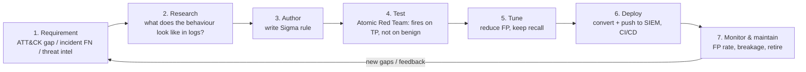
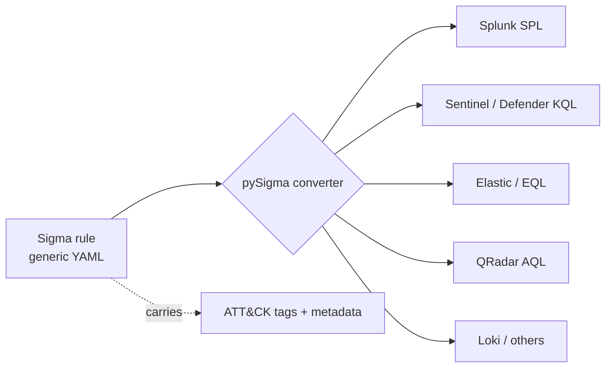
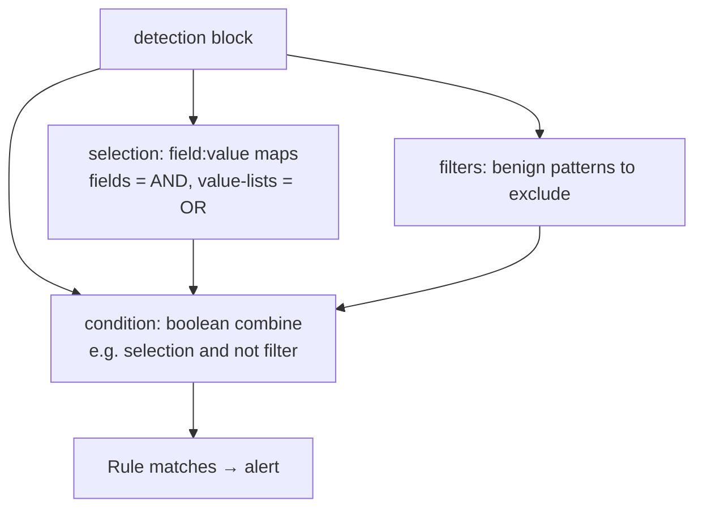
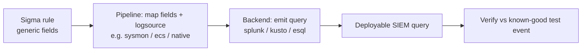
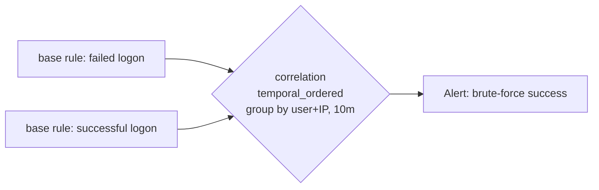
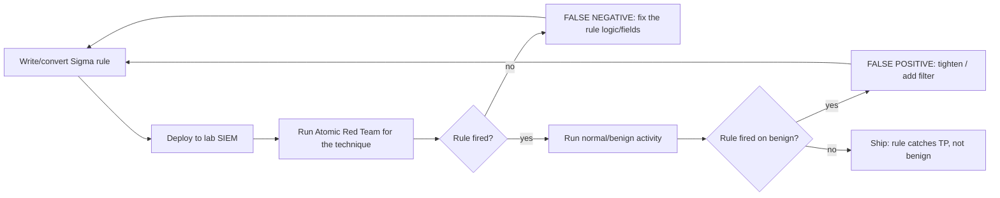
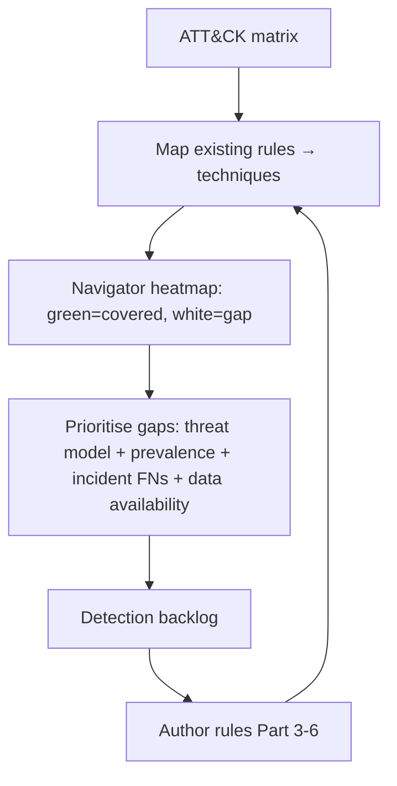
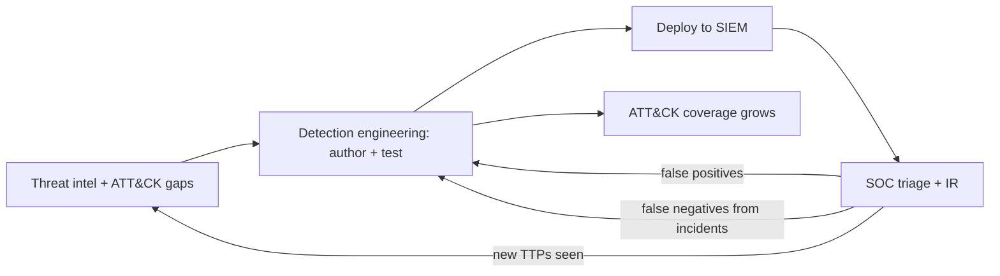
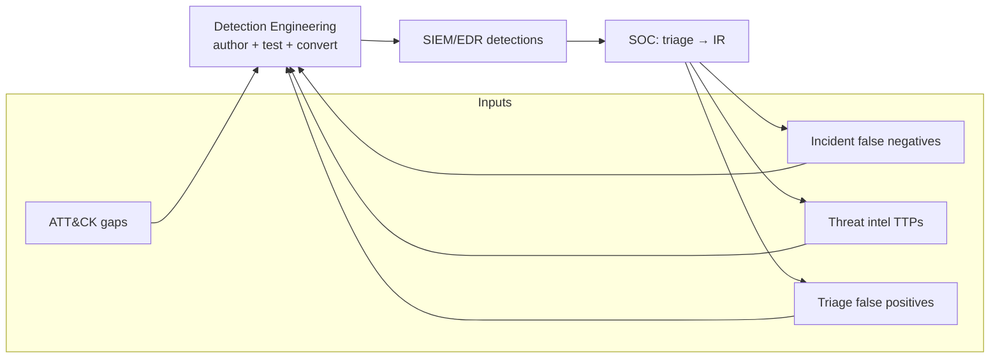

This is Chapter 1 of the Detection Engineering notebook, and it marks a shift in stance. Across the SOC & Blue Team notebook you learned to *consume* detections: read the sources (Windows/Linux logs, network, EDR), triage the alerts those detections raise, and handle the incidents they escalate to. Now you cross to the other side of the glass and learn to *build* the detections. **Detection engineering** is the discipline of turning knowledge of adversary behaviour into reliable, tested, maintainable detection logic — treating detections as **code**: version-controlled, peer-reviewed, tested, and continuously improved. And the lingua franca of portable detection logic is **Sigma** — the "write once, run on any SIEM" rule format that lets you express a detection in a vendor-neutral YAML and convert it to Splunk SPL, Sentinel KQL, Elastic, and dozens of other targets.

We teach the discipline and the tool from the ground up: what detection engineering *is* and the **detection-as-code lifecycle**, then **Sigma** in depth — the rule format field by field (`logsource`, `detection`, `selection`, `condition`, modifiers), the taxonomy that makes rules portable, and how **field mapping** bridges the generic rule to your specific logs. We cover **converting** Sigma to real backends with `sigma-cli`/pySigma, writing **correlation rules** for multi-event detections, and — crucially — **testing** detections with **Atomic Red Team** and driving down false positives (the discipline from the triage chapter, now applied at authoring time). We frame the whole thing around **MITRE ATT&CK** coverage (the detection backlog and the Navigator heatmap), **CI/CD and versioning** for rules, and the **feedback loop** that turns every incident's false negative into a new detection. A full hands-on lab authors, converts, tests, and tunes a Sigma rule for a real technique end to end.

The framing note: detection engineering is defensive by definition — you build detections to catch attacks on systems you defend. The techniques we write rules *for* (encoded PowerShell, LSASS access, webshells, persistence) are described so you can *detect* them; the offensive tests (Atomic Red Team) are run in your own lab to validate your detections, never against systems you don't own. Practise on a detection lab (a SIEM with sample data, DetectionLab/Attack Range) and with the public Sigma rule repository.

We build from what detection engineering is and its lifecycle, through the Sigma format and taxonomy, field mapping and conversion, correlation rules, testing and false-positive reduction, ATT&CK-driven coverage, CI/CD and versioning, and the feedback loop, then a full author-convert-test lab, a consolidated program section, a final revision, a cheat sheet, and topic-specific practice.

---

## Part 1: What Detection Engineering Is — and Detection-as-Code

A SOC that only *consumes* vendor and community detections is at the mercy of what others thought to catch. **Detection engineering** is the deliberate, engineering-grade practice of *building and maintaining your own detections* — closing the gaps (the false negatives from incident post-mortems), tuning the noise (the false positives from triage), and adapting to your environment and threat model. It's the function that turns "we bought a SIEM" into "we actually catch attacks."

The defining idea is **detection-as-code**: treat every detection like software.

| Software engineering practice | Detection engineering equivalent |
|---|---|
| Source in version control | Detection rules in Git (Sigma YAML) |
| Code review | Peer review of new/changed rules |
| Unit tests | Test each rule fires on the malicious case (Atomic Red Team) and not on benign |
| CI/CD pipeline | Automated validation + deployment of rules to the SIEM |
| Bug tracker | Backlog of detection gaps (ATT&CK coverage) + FP tickets |
| Refactoring | Tuning rules for precision without losing recall |
| Documentation | Rule metadata: description, ATT&CK, false positives, references |

Why this matters: ad-hoc detections (a query someone saved in the SIEM, undocumented, untested, unowned) rot — they break when logs change, nobody knows why they fire, and they can't be reviewed or improved. Detection-as-code makes detections **portable** (Sigma runs anywhere), **testable** (you prove they work), **reviewable** (peers catch mistakes), and **maintainable** (versioned, documented, owned). This is the difference between a pile of saved searches and a detection *program*.

### The detection-engineering lifecycle



**Where the requirements come from** (the detection backlog):

- **ATT&CK coverage gaps** — techniques you can't currently detect (the white cells on the Navigator heatmap, Part 6).
- **Incident false negatives** — anything that got in *without alerting* (the post-mortem output from incident handling). Every false negative is a detection you should have had.
- **Threat intelligence** — TTPs of adversaries targeting your sector (Chapter on threat intel), and new techniques as they're published.
- **Triage feedback** — noisy rules to tune, and near-misses to sharpen.

Detection engineering sits at the *center* of the blue-team feedback loop: it consumes gaps and intel, produces tested detections, and feeds the SOC queue — which produces more gaps and feedback. It's the engine that makes the whole defensive program improve over time rather than stagnate.

---

## Part 2: Sigma — The Portable Detection Format

**What Sigma is:** an open, vendor-neutral format for writing SIEM detection rules in **YAML**. The tagline is "Sigma is to logs what Snort is to network traffic and YARA is to files" — a generic signature language. You write a detection *once* in Sigma, then **convert** it to whatever query language your SIEM/EDR speaks (Splunk SPL, Microsoft Sentinel/Defender KQL, Elastic Query/EQL, QRadar, Loki, and ~30 more). This solves the portability problem that otherwise locks your detections to one vendor and makes sharing detections across the community possible (the public **SigmaHQ** repository has thousands of rules mapped to ATT&CK).

Why Sigma became the standard:

- **Portability** — one rule, any backend; switch SIEMs without rewriting detections.
- **Shareability** — the community publishes rules in Sigma; threat reports increasingly include Sigma rules for the TTPs they describe.
- **Readability** — YAML is human-readable and reviewable; the rule *is* the documentation.
- **ATT&CK-native** — rules carry `tags` mapping to techniques, enabling coverage measurement.
- **Tooling** — `sigma-cli`/pySigma convert, validate, and lint rules programmatically (detection-as-code).



**Install the tooling (from scratch):**

```bash
# sigma-cli is the modern CLI built on pySigma
pip install sigma-cli --break-system-packages
sigma version
# Add the backends/pipelines you need (each is a plugin)
sigma plugin list
sigma plugin install splunk
sigma plugin install microsoft365defender     # or 'sentinel'/'elasticsearch' etc.
```

Clone the community rules to learn from and build on:

```bash
git clone https://github.com/SigmaHQ/sigma.git
ls sigma/rules/windows/process_creation/       # thousands of real, ATT&CK-mapped rules
```

---

## Part 3: The Sigma Rule Format, Field by Field

A Sigma rule is YAML with a defined schema. We'll dissect a complete, realistic rule — a detection for the "Office spawns a shell" behaviour from the EDR chapter — then explain every field.

```yaml
title: Office Application Spawning a Command Interpreter
id: 7e2f8c31-1a4b-4c9e-9f2a-0b1c2d3e4f50
status: experimental
description: Detects Microsoft Office applications spawning a command shell or script host,
  a common malicious-macro / exploit execution pattern.
references:
  - https://attack.mitre.org/techniques/T1566/001/
author: SOC Detection Engineering
date: 2027-02-24
tags:
  - attack.execution
  - attack.t1059
  - attack.initial_access
  - attack.t1566.001
logsource:
  category: process_creation
  product: windows
detection:
  selection:
    ParentImage|endswith:
      - '\WINWORD.EXE'
      - '\EXCEL.EXE'
      - '\POWERPNT.EXE'
      - '\OUTLOOK.EXE'
    Image|endswith:
      - '\cmd.exe'
      - '\powershell.exe'
      - '\pwsh.exe'
      - '\wscript.exe'
      - '\cscript.exe'
      - '\mshta.exe'
  filter_legit:
    CommandLine|contains:
      - '\Program Files\CorpAddin\'   # a known-good add-in, environment-specific
  condition: selection and not filter_legit
falsepositives:
  - Legitimate Office add-ins or macros used by the business (allowlist via filter)
level: high
```

### The metadata block

| Field | Purpose |
|---|---|
| `title` | Short, descriptive name (what it detects). Required. |
| `id` | A UUID — the rule's permanent identity across renames. Required for detection-as-code. |
| `status` | `experimental` → `test` → `stable` → `deprecated`/`unsupported` — lifecycle stage. |
| `description` | What it detects and why; the human documentation. |
| `references` | Links (ATT&CK, blog posts, the report that motivated it). |
| `author` / `date` / `modified` | Provenance and change tracking. |
| `tags` | **ATT&CK techniques/tactics** (and others) — powers coverage measurement. |
| `falsepositives` | Known benign causes — guides the analyst *and* the tuning. |
| `level` | `informational`/`low`/`medium`/`high`/`critical` — maps to severity in the SIEM. |

### The `logsource` block — where the rule applies

`logsource` tells the converter *which logs* the rule targets, so it can pick the right index/table and field mappings. It has three optional keys:

- **`category`** — a generic log type: `process_creation`, `network_connection`, `file_event`, `registry_event`, `dns_query`, `image_load`, `authentication`, `webserver`, etc.
- **`product`** — the source system: `windows`, `linux`, `macos`, `aws`, `azure`, `okta`, etc.
- **`service`** — a specific service/channel: `sysmon`, `security`, `sshd`, `powershell`, etc.

The combination (e.g. `category: process_creation` + `product: windows`) is what a **processing pipeline** maps to concrete fields for a given backend (Part 4). Using the standard categories is what makes a rule portable — `process_creation` means "Sysmon EID 1 / Defender `DeviceProcessEvents` / EDR process events," and the pipeline knows the mapping for each target.

### The `detection` block — the actual logic

This is the heart of the rule. It contains one or more **search identifiers** (named blocks of field-matching criteria) plus a **`condition`** that combines them with boolean logic.

- A **selection** is a map of `field: value` (or `field: [list of values]`, which is OR). Multiple fields in one selection are **AND**ed; a list of values for one field is **OR**ed.
- The **`condition`** ties selections together: `selection and not filter_legit`, `sel1 or sel2`, `all of selection*`, `1 of them`, etc.

In the example: `selection` matches "parent is an Office app **AND** child is a shell/script host"; `filter_legit` matches a known-good add-in path; the condition `selection and not filter_legit` fires on the malicious pattern **except** the allowlisted add-in — the exact FP-reduction discipline from the triage chapter, expressed declaratively.

### Field modifiers — matching precisely

Modifiers (after a `|`) change how a value matches. The common ones:

| Modifier | Meaning | Example |
|---|---|---|
| `contains` | substring match | `CommandLine\|contains: '-enc'` |
| `startswith` / `endswith` | anchored substring | `Image\|endswith: '\powershell.exe'` |
| `all` | require ALL listed values (AND within the field) | `CommandLine\|contains\|all: ['-enc','hidden']` |
| `re` | regular expression | `CommandLine\|re: '(?i)-e(nc)?\s'` |
| `base64` / `base64offset` | match a base64-encoded value | encoded payload matching |
| `windash` | match `-`/`/` dash variants of a flag | `\|windash` |
| `cidr` | IP/CIDR match | `DestinationIp\|cidr: '10.0.0.0/8'` |
| `lt`/`gt`/`lte`/`gte` | numeric comparison | `EventID\|gte: 4624` |



**Modifiers are how you get precision.** `CommandLine|contains|all: ['-enc','hidden','bypass']` is far more specific (fewer FPs) than `CommandLine|contains: 'powershell'`. Choosing tight, behavioural criteria at authoring time is the front-line defence against the alert fatigue of the triage chapter.

---

### A small library of example rules

Reading rules is how you learn to write them. Here are four more, spanning different log sources, that you'll recognise from the SOC notebook's techniques.

**Encoded PowerShell (T1059.001 / T1027)** — process_creation:

```yaml
title: Encoded and Hidden PowerShell Command
id: 2c9a1f80-3b45-4d21-8e77-1a0b9c8d7e60
status: test
tags: [attack.execution, attack.t1059.001, attack.t1027]
logsource: { category: process_creation, product: windows }
detection:
  selection:
    Image|endswith: ['\powershell.exe', '\pwsh.exe']
    CommandLine|contains:
      - '-enc'
      - '-EncodedCommand'
      - 'FromBase64String'
  suspicious_flags:
    CommandLine|contains:
      - '-w hidden'
      - '-nop'
      - 'bypass'
  condition: selection and suspicious_flags
falsepositives: [ Some management tooling uses encoded commands — allowlist by signer/path ]
level: high
```

**Run-key persistence (T1547.001)** — registry_event:

```yaml
title: Registry Run Key Persistence
id: 91b3d5e2-6c7f-48aa-9d10-3e2f1a4b5c6d
status: test
tags: [attack.persistence, attack.t1547.001]
logsource: { category: registry_set, product: windows }
detection:
  selection:
    TargetObject|contains:
      - '\Software\Microsoft\Windows\CurrentVersion\Run'
      - '\Software\Microsoft\Windows\CurrentVersion\RunOnce'
  filter_known:
    Details|contains: 'C:\Program Files\'   # most legit autoruns live here
  condition: selection and not filter_known
falsepositives: [ Legitimate software installers adding startup entries ]
level: medium
```

**Linux: suspicious download-and-execute via curl/wget to a temp path (T1105)** — process_creation, product linux:

```yaml
title: Suspicious Download to World-Writable Path (Linux)
id: a7c4e1b9-2f38-4c66-8b90-5d1e2f3a4b70
status: experimental
tags: [attack.command_and_control, attack.t1105]
logsource: { category: process_creation, product: linux }
detection:
  tool:
    Image|endswith: ['/curl', '/wget']
  target:
    CommandLine|contains: ['/tmp/', '/dev/shm/', '/var/tmp/']
  url:
    CommandLine|contains: ['http://', 'https://']
  condition: tool and target and url
falsepositives: [ Legitimate scripts fetching to /tmp — tune per environment ]
level: medium
```

**Webshell: web server spawning a shell (T1505.003)** — process_creation:

```yaml
title: Web Server Process Spawning a Shell
id: c3f7a9d1-4e82-4b55-9a67-8b0c1d2e3f40
status: test
tags: [attack.persistence, attack.t1505.003, attack.execution]
logsource: { category: process_creation, product: windows }
detection:
  selection:
    ParentImage|endswith: ['\w3wp.exe', '\httpd.exe', '\nginx.exe', '\tomcat*.exe']
    Image|endswith: ['\cmd.exe', '\powershell.exe', '\bash.exe', '\sh.exe']
  condition: selection
falsepositives: [ Rare legit web-app subprocess calls — investigate, allowlist narrowly ]
level: high
```

Study the pattern across all four: each encodes a *behaviour* (parent+child, tool+path+scheme, key+value), tags ATT&CK, documents false positives, and sets an honest level. That is the anatomy of every good detection.

## Part 4: Field Mapping and Conversion With pySigma

A Sigma rule uses **generic** field names (`Image`, `ParentImage`, `CommandLine`). Your SIEM uses *its own* field names (Splunk's `New_Process_Name`, Sentinel's `NewProcessName` or `FolderPath`, Elastic's `process.executable`). The bridge is a **processing pipeline** (a.k.a. backend pipeline) that maps generic Sigma fields to the target's fields and picks the right index/table. This is the single most important operational concept in Sigma: *the same rule + a different pipeline = a correct query for a different SIEM.*

### Converting a rule with `sigma convert`

```bash
# Sigma → Splunk SPL, using the Sysmon field pipeline
sigma convert -t splunk -p sysmon office_spawn_shell.yml
```

Produces (roughly):

```text
source="WinEventLog:Microsoft-Windows-Sysmon/Operational" EventCode=1
(ParentImage="*\\WINWORD.EXE" OR ParentImage="*\\EXCEL.EXE" OR ParentImage="*\\POWERPNT.EXE"
 OR ParentImage="*\\OUTLOOK.EXE")
(Image="*\\cmd.exe" OR Image="*\\powershell.exe" OR Image="*\\pwsh.exe"
 OR Image="*\\wscript.exe" OR Image="*\\cscript.exe" OR Image="*\\mshta.exe")
NOT (CommandLine="*\\Program Files\\CorpAddin\\*")
```

```bash
# Same rule → Microsoft Defender / Sentinel KQL
sigma convert -t microsoft365defender office_spawn_shell.yml
```

Produces (roughly):

```kusto
DeviceProcessEvents
| where (InitiatingProcessFileName endswith "WINWORD.EXE" or InitiatingProcessFileName endswith "EXCEL.EXE"
    or InitiatingProcessFileName endswith "POWERPNT.EXE" or InitiatingProcessFileName endswith "OUTLOOK.EXE")
    and (FileName endswith "cmd.exe" or FileName endswith "powershell.exe" or FileName endswith "pwsh.exe"
    or FileName endswith "wscript.exe" or FileName endswith "cscript.exe" or FileName endswith "mshta.exe")
    and not (ProcessCommandLine contains "\\Program Files\\CorpAddin\\")
```

**One YAML, two correct queries** for two completely different platforms — that is the whole value proposition. Note how the pipeline mapped `ParentImage → InitiatingProcessFileName`, `Image → FileName`, and chose `DeviceProcessEvents` from the `process_creation` logsource. Different pipelines exist for Sysmon, Windows Security (native 4688), Elastic ECS, Crowdstrike, and more.

### Pipelines and why they matter

```bash
sigma list targets       # supported backends
sigma list pipelines     # available field-mapping pipelines
```

- A **backend** (`-t`) is the *target query language* (splunk, kusto, esql...).
- A **pipeline** (`-p`) is the *field/logsource mapping* for a particular schema (sysmon, windows-audit, ecs_windows...).

Choosing the wrong pipeline is a leading cause of "my converted rule matches nothing" — e.g. converting a Sysmon-fielded rule with a native-Windows-Security pipeline, so `Image` maps to a field that doesn't exist in your data. **Always convert with the pipeline that matches how your logs are actually shaped**, and verify the output query returns your known-good test event.



---

### Common Sigma field names by log source

Because rules use generic field names, knowing the standard ones per `logsource` category is essential to authoring correctly. The most-used:

| logsource category | Common Sigma fields |
|---|---|
| `process_creation` | `Image`, `OriginalFileName`, `CommandLine`, `ParentImage`, `ParentCommandLine`, `User`, `IntegrityLevel`, `Hashes`, `CurrentDirectory` |
| `network_connection` | `Image`, `DestinationIp`, `DestinationPort`, `DestinationHostname`, `SourceIp`, `Initiated`, `Protocol` |
| `dns_query` | `Image`, `QueryName`, `QueryResults`, `QueryStatus` |
| `registry_set`/`registry_event` | `TargetObject`, `Details`, `Image`, `EventType` |
| `file_event` | `TargetFilename`, `Image`, `CreationUtcTime` |
| `image_load` | `ImageLoaded`, `Image`, `Signed`, `Signature`, `Hashes` |
| `process_access` | `SourceImage`, `TargetImage`, `GrantedAccess`, `CallTrace` |
| `authentication`/`security` | `EventID`, `TargetUserName`, `LogonType`, `IpAddress`, `WorkstationName` |
| `webserver` | `c-uri`, `cs-method`, `c-useragent`, `sc-status`, `c-ip` |
| Linux (`product: linux`) | `Image`, `CommandLine`, `User`, `ParentImage` (from auditd/Sysmon-for-Linux mappings) |

These are the *generic* names; the pipeline maps them to your backend's names (Part 4). When a rule "doesn't fire," a field-name/pipeline mismatch is the first thing to check — dump one known-good event and confirm the field the rule references actually carries the value in *your* data.

### Validating and linting rules

Before any rule ships, it must pass validation — the detection-as-code equivalent of a compiler check:

```bash
# Schema + best-practice checks across a whole directory
sigma check detections/**/*.yml
#   flags: missing id, invalid logsource, unknown modifier, duplicate ids,
#          missing level/status, malformed condition, etc.

# Confirm it converts cleanly for every backend you deploy to
sigma convert -t splunk -p sysmon detections/windows/**/*.yml >/dev/null && echo "splunk OK"
sigma convert -t microsoft365defender detections/windows/**/*.yml >/dev/null && echo "kql OK"
```

A rule that fails `sigma check` or won't convert is a broken build — it never reaches the SIEM. Wiring `sigma check` + a test conversion into CI (Part 7) is what stops a malformed rule (or a duplicate `id`, or a typo'd modifier) from silently shipping and either flooding or failing to fire.

## Part 5: Correlation Rules — Detecting Sequences, Not Just Events

A single `field: value` match catches single events. Real attacks are often *sequences* — a brute force **then** a success, many failures across many accounts, a download **then** an execution. Modern Sigma supports **correlation rules** that combine base rules over time/count/grouping.

The correlation types:

| Type | Detects | Example |
|---|---|---|
| `event_count` | ≥ N occurrences of a rule in a window | 10+ failed logins in 5 min (brute force) |
| `value_count` | ≥ N distinct values of a field | one source, 20+ distinct target accounts (spray) |
| `temporal` | several different rules within a window (in any order) | LSASS access **and** outbound C2 on one host within 10 min |
| `temporal_ordered` | rules in a specific order within a window | login **then** mailbox-rule creation (account takeover) |

A brute-force-then-success correlation, in Sigma:

```yaml
# base rules referenced by name
title: Failed Logon
name: failed_logon
logsource: { product: windows, service: security }
detection:
  selection: { EventID: 4625 }
  condition: selection
---
title: Successful Logon
name: successful_logon
logsource: { product: windows, service: security }
detection:
  selection: { EventID: 4624 }
  condition: selection
---
# the correlation rule
title: Possible Successful Brute Force
correlation:
  type: temporal_ordered
  rules:
    - failed_logon
    - successful_logon
  group-by:
    - TargetUserName
    - IpAddress
  timespan: 10m
  condition:
    gte: 1        # at least one success after failures, same user+source in 10m
```

Correlation is where detection engineering meets the **risk-based alerting / fusion** concept from the triage chapter — the difference is that here you *author* the correlation as portable Sigma, rather than relying on a proprietary SIEM feature. **Not every SIEM backend supports Sigma correlation conversion yet**, so know your target's capability; where it's unsupported, you translate the correlation intent into the SIEM's native correlation/stats logic.



---

## Part 6: Testing Detections and Reducing False Positives

An untested detection is a hope, not a control. The engineering discipline requires proving two things about every rule: it **fires on the malicious behaviour** (no false negative) and it **doesn't fire on benign activity** (low false positive). This is where Atomic Red Team comes in.

### Atomic Red Team — safely generating the attack (from scratch)

**What it is:** **Atomic Red Team** (by Red Canary) is an open-source library of small, precise, ATT&CK-mapped tests — each "atomic" runs a single technique (e.g. T1059.001 encoded PowerShell, T1003.001 LSASS dump simulation) so you can generate the exact telemetry a detection should catch, safely, in your lab. It's the "unit test input" for detections.

**Install (in your lab only):**

```powershell
# PowerShell, in an ISOLATED test VM
IEX (IWR 'https://raw.githubusercontent.com/redcanaryco/invoke-atomicredteam/master/install-atomicredteam.ps1')
Install-AtomicRedTeam -getAtomics

# Show the tests for a technique, then run one
Invoke-AtomicTest T1059.001 -ShowDetails
Invoke-AtomicTest T1059.001 -TestNumbers 1
# ... generates the process_creation telemetry your Sigma rule should catch
Invoke-AtomicTest T1059.001 -Cleanup
```

### The test-driven detection loop



1. **Run the atomic** for the technique → confirm the rule fires (else it's a false negative — fix fields/logic, often a pipeline/field-mapping bug).
2. **Run benign baseline activity** (normal admin/user behaviour, the known-good patterns) → confirm the rule *doesn't* fire (else add a filter, as in the Part-3 `filter_legit`).
3. **Iterate** until precision and recall are both acceptable.

### Reducing false positives at authoring time

The triage chapter fought false positives *after* deployment; detection engineering fights them *before*, which is cheaper and safer:

- **Be behavioural and specific.** `ParentImage=Office AND Image=shell` beats `Image=powershell`. The more of the *attack pattern* you encode, the fewer benign events match.
- **Add `filter_*` blocks for known-good** (allowlist the specific add-in/tool/account in the rule) rather than shipping a noisy rule for someone else to mute.
- **Document `falsepositives`** so the triaging analyst knows the benign causes and can allowlist rather than weaken.
- **Set `level` honestly** so noisy-but-useful rules don't page people at 3 a.m.
- **Measure after deploy** and feed the FP rate back into the rule (the lifecycle loop).

**The precision/recall trade-off, again:** tightening filters cuts FPs but risks missing a variant (FN); Atomic Red Team lets you *test* that you cut noise without cutting coverage — run the atomic *after* every tightening to prove the rule still catches the attack. That test is what makes authoring-time tuning safe, exactly as re-testing made deployment-time tuning safe in the triage chapter.

---

## Part 7: ATT&CK-Driven Coverage, CI/CD, and the Feedback Loop

Individual rules are tactical; a detection *program* is strategic, and three practices make it one.

### ATT&CK coverage as the backlog

You can't detect everything at once, so you prioritise using **MITRE ATT&CK** as the map. Tag every rule with its technique(s), then render your rule set onto the **ATT&CK Navigator** heatmap: green cells = covered techniques, white = blind spots. The white cells relevant to your threat model *are your detection backlog*, prioritised by:

- **Threat model** — techniques used by adversaries targeting your sector (threat intel).
- **Prevalence** — techniques common across intrusions (initial access, execution, credential access, C2).
- **Incident history** — the false negatives from your own post-mortems.
- **Data availability** — techniques you actually have the logs to detect (no point writing a rule for a source you don't collect — that's a *logging* gap to fix first).



### CI/CD and versioning — detections as a codebase

Detection-as-code means your rules live in **Git** and flow through a **pipeline**:

```text
detections/
  windows/process_creation/office_spawn_shell.yml
  windows/registry/run_key_persistence.yml
  ...
tests/          # atomic mappings / expected results
pipelines/      # your environment's field-mapping pipelines
.github/workflows/validate.yml   # CI
```

A typical CI pipeline on every pull request:

```yaml
# .github/workflows/validate.yml (illustrative)
steps:
  - run: sigma check detections/**/*.yml          # schema/lint: valid Sigma?
  - run: sigma convert -t splunk -p sysmon detections/**/*.yml   # does it convert?
  - run: python tests/verify_metadata.py          # has id, tags, level, falsepositives?
  # (optional) deploy to a test SIEM + run atomics + assert the rule fires
```

Benefits, all inherited from software engineering: **peer review** catches logic errors before deployment; **linting/validation** stops broken rules shipping; **version history** tells you when and why a rule changed (and lets you roll back a bad change that caused an alert storm); **automated deployment** pushes vetted rules to the SIEM consistently. This is what separates a maintainable detection program from a drawer of saved searches.

### The feedback loop — the program that improves itself



Every part of the SOC & Blue Team notebook feeds this loop: incident false negatives (Chapter 13) become new rules; triage false positives (Chapter 12) become tuning; the sources you learned to read (Chapters 7–11) are the telemetry the rules query; and ATT&CK (Chapter 3) is the coordinate system. Detection engineering is the function that closes the loop — turning hard-won operational knowledge into durable, portable, tested detections that make the *next* attack easier to catch.

---

## Part 8: Hands-On Lab — Author, Convert, and Test a Sigma Rule End to End

Build a detection for **"credential dumping via `comsvcs.dll` MiniDump of LSASS"** (T1003.001) — a real, high-value technique — from requirement to tested rule. Do this in a lab SIEM with Sysmon data and an isolated test VM for the atomic. Never run credential-dumping tooling outside an isolated lab.

### Step 1 — Requirement and research

The requirement comes from an ATT&CK coverage gap (we can't currently detect LSASS dumping) and it's a common credential-access technique. Research what it looks like in telemetry: the classic one-liner is `rundll32.exe C:\windows\system32\comsvcs.dll, MiniDump <pid> <outfile> full`, which appears in **process_creation** (Sysmon EID 1) as `rundll32` with `comsvcs` and `MiniDump` in the command line, and in **process_access** (Sysmon EID 10) as a handle to `lsass.exe`. We'll write the process-creation rule (broadly available telemetry).

### Step 2 — Author the Sigma rule

```yaml
title: LSASS Credential Dump via comsvcs.dll MiniDump
id: b1e6a2c9-8d34-4f77-9c1a-2e5f7a9b0c11
status: experimental
description: Detects use of rundll32 with comsvcs.dll MiniDump to dump LSASS memory,
  a common credential-access technique.
references:
  - https://attack.mitre.org/techniques/T1003/001/
author: SOC Detection Engineering
date: 2027-02-24
tags:
  - attack.credential_access
  - attack.t1003.001
logsource:
  category: process_creation
  product: windows
detection:
  selection_img:
    Image|endswith: '\rundll32.exe'
  selection_cmd:
    CommandLine|contains|all:
      - 'comsvcs'
      - 'MiniDump'
  condition: selection_img and selection_cmd
falsepositives:
  - Extremely rare; legitimate use of comsvcs MiniDump is essentially nonexistent in normal ops
level: high
```

Note the design choices: `|contains|all` requires **both** `comsvcs` and `MiniDump` (tight → low FP), and we anchor on `rundll32` as the image. We deliberately don't over-filter — this technique has essentially no benign use, so `level: high` with no allowlist is honest.

### Step 3 — Validate and convert

```bash
sigma check lsass_comsvcs_minidump.yml        # schema/lint OK?
sigma convert -t splunk -p sysmon lsass_comsvcs_minidump.yml
```

```text
source="WinEventLog:Microsoft-Windows-Sysmon/Operational" EventCode=1
Image="*\\rundll32.exe" CommandLine="*comsvcs*" CommandLine="*MiniDump*"
```

```bash
# And for a Defender/Sentinel shop:
sigma convert -t microsoft365defender lsass_comsvcs_minidump.yml
```

```kusto
DeviceProcessEvents
| where FileName endswith "rundll32.exe"
  and ProcessCommandLine contains "comsvcs" and ProcessCommandLine contains "MiniDump"
```

### Step 4 — Test the true positive with Atomic Red Team

```powershell
# In the ISOLATED lab VM:
Invoke-AtomicTest T1003.001 -ShowDetails       # find the comsvcs MiniDump atomic
Invoke-AtomicTest T1003.001 -TestNumbers 3     # (the comsvcs.dll MiniDump test)
```

Then check the SIEM with your converted query:

```text
# Splunk: did the rule fire on the atomic?
source="WinEventLog:...Sysmon..." EventCode=1 Image="*\\rundll32.exe"
  CommandLine="*comsvcs*" CommandLine="*MiniDump*"
# -> 1 result: rundll32.exe ... comsvcs.dll, MiniDump 712 C:\Temp\lsass.dmp full   ✅ FIRES
```

**Result:** the rule catches the malicious behaviour — **no false negative.** (If it *hadn't* fired, the usual culprit is a field-mapping/pipeline mismatch — verify `Image`/`CommandLine` are the right fields for your data.)

### Step 5 — Test against benign activity

Run normal admin activity (legitimate `rundll32` uses, PowerShell admin scripts, software installs) and confirm the rule stays silent:

```text
source="WinEventLog:...Sysmon..." EventCode=1 Image="*\\rundll32.exe"
  CommandLine="*comsvcs*" CommandLine="*MiniDump*"  earliest=-7d
# -> 0 results over a week of normal ops   ✅ NO FALSE POSITIVES
```

**Result:** `comsvcs MiniDump` genuinely never appears in normal operations, so the rule is high-precision as written — no filter needed. (For a noisier technique you'd add a `filter_*` block here and re-run Step 4 to prove coverage survived.)

### Step 6 — Deploy, document, and add to coverage

```text
- Commit the rule to the detections Git repo (peer review via PR).
- CI validates (sigma check + convert) and (optionally) runs the atomic in a test SIEM.
- Deploy the converted query as a scheduled detection at level=high.
- Tag it T1003.001 in the ATT&CK Navigator -> the credential-access gap is now GREEN.
- Cleanup the atomic:  Invoke-AtomicTest T1003.001 -TestNumbers 3 -Cleanup
```

### Timeline / outcome

| Step | Action | Result |
|---|---|---|
| 1 | Requirement + research (T1003.001 telemetry) | know the behaviour's log shape |
| 2 | Author Sigma (`rundll32` + `comsvcs` + `MiniDump`) | portable rule |
| 3 | `sigma check` + convert to Splunk **and** KQL | one rule → two SIEMs |
| 4 | Atomic Red Team T1003.001 | rule **fires** on TP — no FN |
| 5 | Benign baseline | rule **silent** — no FP |
| 6 | Commit + CI + deploy + tag ATT&CK | coverage gap closed |

**Outcome:** a tested, documented, portable detection for a real credential-access technique, proven to catch the attack and not the noise, deployed via detection-as-code, and closing an ATT&CK gap. That full loop — requirement → author → convert → **test both directions** → deploy → measure coverage — *is* detection engineering.

---

## Part 9: Detection Engineering as a Program (Consolidated)

Individual rules are the craft; the program is what makes it durable.

### Running the program

- **Treat detections as code:** Git-versioned Sigma, peer review, CI validation/conversion, automated deployment. No undocumented saved searches.
- **Drive from ATT&CK coverage + incident feedback:** the backlog is your white Navigator cells (weighted by threat model) plus every incident false negative. Fix logging gaps before writing rules for data you don't have.
- **Test every rule both ways** with Atomic Red Team: it fires on the technique (recall) and not on benign activity (precision). Re-test after every tuning change.
- **Author for precision:** behavioural, specific criteria and honest `level`s prevent the alert fatigue the SOC has to live with (the triage chapter's problem, solved upstream).
- **Measure and maintain:** track each rule's FP rate and whether it still fires (log-source changes break rules silently); retire/deprecate dead rules; keep `status` current.
- **Share and consume:** pull community Sigma (SigmaHQ), and where possible give back — Sigma's portability makes detections a shared defence.

### Where detection engineering sits in the blue team



Detection engineering is the *proactive* counterpart to the *reactive* SOC work of the previous notebook. The SOC responds to what fires; detection engineering decides what fires — and does it deliberately, measurably, and portably. A team with strong detection engineering steadily expands what it can catch and shrinks its dwell time; a team without it is frozen at whatever its vendor shipped, blind to its own gaps.

### The rule-quality checklist (peer-review gate)

Every rule should clear this before merge — it's the review checklist a detection team pins to its pull-request template:

```text
METADATA
[ ] title is specific (what it detects) ; unique id (uuid) present
[ ] status set ; author + date ; references (ATT&CK + source) ; tags map to real technique IDs
[ ] falsepositives documented ; level is honest (won't page at 3am for a low-sev)
LOGIC
[ ] logsource category/product correct for the telemetry
[ ] selection encodes the BEHAVIOUR (parent/args/context), not just a tool name
[ ] filters allowlist NARROW known-good (not the whole behaviour)
[ ] condition is correct boolean logic
[ ] modifiers used for precision (endswith/all/contains, not accidental broad match)
VALIDATION
[ ] sigma check passes ; converts cleanly for every target backend
[ ] TESTED: fires on the technique (Atomic Red Team) — no false negative
[ ] TESTED: silent on benign baseline — acceptable false-positive rate
[ ] field names verified against a real event in OUR data (pipeline correct)
```

If any box is unchecked, the rule isn't ready. This checklist is the operational essence of the whole chapter — metadata for maintainability, behavioural logic for precision, and *tested both ways* for correctness.

### Defensive maturity: the honest self-assessment

- **Level 0:** only vendor/default detections, no ownership. Blind to your gaps.
- **Level 1:** analysts save ad-hoc searches. Untested, undocumented, unportable.
- **Level 2:** Sigma rules in Git, peer-reviewed, ATT&CK-tagged. Portable and reviewable.
- **Level 3:** CI/CD validation + Atomic Red Team testing + coverage measurement. Tested and measured.
- **Level 4:** closed feedback loop — incidents and intel continuously generate tested detections; coverage and FP rate are tracked metrics. Self-improving.

The goal is Level 4; this chapter's practices are the ladder.

---

## Part 10: Common Pitfalls

- **Writing rules for data you don't collect.** A perfect Sigma rule for a log source you don't ingest detects nothing. Fix the *logging* gap first; detection engineering assumes the telemetry exists.
- **Never testing the rule.** An untested rule is a hope. Prove it fires on the technique (Atomic Red Team) *and* stays quiet on benign activity — both directions.
- **Wrong pipeline on conversion.** Converting with a field-mapping that doesn't match your data yields a query that matches nothing (or everything). Verify the converted query against a known-good test event.
- **Over-broad detection.** `Image=powershell` fires constantly. Encode the *attack pattern* (parent + args + context), not just a tool name, or you recreate the alert fatigue you're supposed to prevent.
- **No metadata / no ATT&CK tags.** A rule without `id`, `tags`, `falsepositives`, and `level` can't be versioned, measured, or triaged. Metadata is not optional in detection-as-code.
- **Tightening without re-testing.** Cutting FPs can silently create a false negative. Re-run the atomic after every filter you add.
- **Ad-hoc saved searches instead of code.** Undocumented, untested, unowned detections rot. Put rules in Git with review and CI.
- **Ignoring rule decay.** Log schemas, tool versions, and field names change; rules break silently. Monitor whether rules still fire and maintain them.
- **Chasing 100% coverage.** You can't detect every technique, and trying spreads you thin. Prioritise by threat model, prevalence, and incident history.
- **Correlation on a backend that can't convert it.** Not every SIEM supports Sigma correlation conversion; know your target and translate to native logic where needed.
- **Editing upstream community rules in place.** Fork/override with your own filters and pipeline instead, so you can still pull SigmaHQ updates without merge conflicts clobbering your tuning.
- **Duplicate or missing `id`s.** The UUID is a rule's identity across renames; duplicates break tracking and dedup. `sigma check` catches these — run it in CI.
- **Dishonest `level`.** Marking a noisy rule `critical` pages people needlessly and erodes trust; marking a real threat `low` buries it. Level must reflect true severity.

---

## Part 11: Final Revision / Summary

- **Detection engineering** is building and maintaining your own detections as **code** — version-controlled, peer-reviewed, tested, measured — closing the gaps and noise that consuming vendor detections leaves. Its **lifecycle**: requirement → research → author → test → tune → deploy → monitor, looping on feedback.
- **Sigma** is the portable detection format: write once in generic YAML, **convert** to any SIEM/EDR (Splunk, Sentinel/Defender, Elastic, ...) with **pySigma/`sigma-cli`**. Portability, shareability, readability, ATT&CK-native tagging, and tooling made it the standard.
- A Sigma rule has **metadata** (`title`, `id`, `status`, `tags`=ATT&CK, `falsepositives`, `level`), a **`logsource`** (category/product/service — what logs it targets), and a **`detection`** block: named **selections** (`field:value`, fields AND-ed, value-lists OR-ed), optional **filters**, and a **`condition`** (e.g. `selection and not filter`). **Modifiers** (`contains`, `endswith`, `all`, `re`, `base64`, `windash`, `cidr`...) give precision.
- **Generic field names** (per `logsource` category — `Image`/`ParentImage`/`CommandLine` for process_creation, `TargetObject`/`Details` for registry, etc.) keep rules portable; the pipeline maps them to your backend, and a field/pipeline mismatch is the top cause of a rule that "doesn't fire."
- **Field mapping via pipelines** bridges Sigma's generic fields to your SIEM's fields — *same rule + different pipeline = correct query for a different platform*. Choosing the right pipeline (matching your log shape) is essential; verify the output against a known-good event.
- **Correlation rules** (`event_count`, `value_count`, `temporal`, `temporal_ordered`) detect sequences/counts — brute-force-then-success, spray, login-then-mailbox-rule — the authored, portable form of risk-based alerting.
- **Validation is a build gate**: `sigma check` (lint/schema) plus a test conversion for every target backend must pass before a rule ships — wire it into CI so malformed/duplicate-id rules never reach the SIEM.
- **Test every rule both ways with Atomic Red Team**: it fires on the technique (recall, no FN) and not on benign activity (precision, no FP); **re-test after every tuning change**. Fight false positives at *authoring* time with behavioural specificity and `filter_*` allowlists.
- **Rule quality is a review checklist**: specific title + unique id + ATT&CK tags + documented false positives + honest level + behavioural logic + narrow filters + passing validation + tested both ways + fields verified against real data. Uncheck any box and the rule isn't ready.
- **ATT&CK coverage** is the backlog (white Navigator cells, weighted by threat model + prevalence + incident FNs + data availability); **CI/CD + Git** make detections a maintainable codebase; the **feedback loop** turns incident false negatives, triage false positives, and threat intel into new tested detections.

Detection engineering is the proactive engine of the blue team: it decides, deliberately and measurably, what the SOC can catch. Master Sigma and the detection-as-code lifecycle and you stop being limited to what your vendor shipped — you build, test, and continuously improve the detections that everything in the previous notebook (reading sources, triage, incident handling) then puts to work. This is where a defender goes from operating the tools to *engineering the defence*.

---

## Part 12: Cheat Sheet / Quick Reference

**Sigma =** portable detection YAML → convert to any SIEM/EDR. "What Snort is to packets and YARA is to files, Sigma is to logs."

**Detection-as-code:** rules in Git · peer review · CI validate/convert · test with atomics · versioned · ATT&CK-tagged.

**Sigma rule skeleton:**

```yaml
title: ...
id: <uuid>
status: experimental|test|stable
tags: [attack.<tactic>, attack.t####]
logsource: { category: process_creation, product: windows }   # or service: sysmon/security/sshd...
detection:
  selection:
    Field|modifier: value      # or [list = OR]; multiple fields = AND
  filter:
    Field|contains: known_good
  condition: selection and not filter
falsepositives: [ ... ]
level: informational|low|medium|high|critical
```

**Modifiers:** `contains` `startswith` `endswith` `all` `re` `base64`/`base64offset` `windash` `cidr` `lt/gt/lte/gte`. Use them for precision — `contains|all: [a,b]` beats a lone broad `contains`.

**Condition syntax:** `selection and not filter` · `sel1 or sel2` · `all of selection*` · `1 of them` · `1 of selection_*`.

**Selection logic:** fields in one selection = AND · list of values for a field = OR · separate selections combined by `condition`.

**Convert (sigma-cli / pySigma):**

```bash
sigma plugin install splunk
sigma check rule.yml                              # lint
sigma convert -t splunk  -p sysmon rule.yml       # → SPL
sigma convert -t microsoft365defender rule.yml    # → KQL
sigma list targets ; sigma list pipelines
```

**Correlation types:** `event_count` (N of a rule) · `value_count` (N distinct values) · `temporal` (several rules, any order) · `temporal_ordered` (specific order) — `group-by` + `timespan`. (Check your backend supports Sigma correlation conversion.)

**Test loop (Atomic Red Team, lab only):**

```powershell
Invoke-AtomicTest T#### -ShowDetails
Invoke-AtomicTest T#### -TestNumbers N        # generate the telemetry
# check rule fires (recall) ; run benign, check it's silent (precision)
Invoke-AtomicTest T#### -TestNumbers N -Cleanup
```

**Common fields (process_creation):** `Image` `OriginalFileName` `CommandLine` `ParentImage` `ParentCommandLine` `User` `IntegrityLevel` `Hashes`. (network) `DestinationIp/Port/Hostname`, `Initiated`. (registry) `TargetObject` `Details`. (dns) `QueryName`. (process_access) `SourceImage` `TargetImage` `GrantedAccess`.

**Maturity ladder:** L0 vendor-only → L1 ad-hoc searches → L2 Sigma-in-Git+review → L3 CI+atomic-tested+measured → L4 closed feedback loop (self-improving).

**Coverage:** tag rules with ATT&CK → render on Navigator → white cells (weighted by threat model + incident FNs + data availability) = backlog.

**Lifecycle:** requirement (ATT&CK gap / incident FN / intel) → research → author → test → tune → deploy (CI/CD) → monitor → loop.

**Backlog inputs:** ATT&CK white cells · incident false negatives · threat-intel TTPs · triage false positives. Fix *logging* gaps before writing rules for data you lack.

**The rule of detection engineering:** *a detection isn't done until it's tested both ways — it fires on the attack and stays silent on the normal.*

---

## Part 13: Practice Labs & Resources

- **SigmaHQ repository (github.com/SigmaHQ/sigma)** — thousands of real, ATT&CK-mapped rules; read them to learn idiomatic Sigma, and the **Sigma specification** for the full schema.
- **sigma-cli / pySigma docs** — install backends/pipelines and convert rules to your SIEM; practise the field-mapping concepts (Part 4).
- **Atomic Red Team (github.com/redcanaryco/atomic-red-team)** + **Invoke-AtomicRedTeam** — generate technique telemetry in a lab to test your detections both ways.
- **DetectionLab / Splunk Attack Range / Microsoft Sentinel training lab** — end-to-end: run an attack, write/convert a Sigma rule, prove it fires.
- **MITRE ATT&CK Navigator** — build your coverage heatmap and derive the detection backlog.
- **The DFIR Report, Red Canary Threat Detection Report, and vendor threat reports** — many include Sigma rules; reproduce and test them.
- **Detection Engineering communities/blogs** (e.g. the "Detection Engineering" newsletters, Florian Roth's writing, the SigmaHQ discussions) — patterns, pitfalls, and rule-quality practices.
- **TryHackMe / Blue Team Labs "Sigma", detection-engineering and threat-hunting rooms** — guided practice authoring and converting rules.
- **Uncoder.io** — a browser tool to convert Sigma to many backends interactively; handy for learning field mappings without local setup.
- **pySigma pipelines source (Sysmon, ECS, Windows-audit)** — read a pipeline to *see* how generic fields map to a backend, which demystifies "why doesn't my rule fire?"
- **MITRE CAR (Cyber Analytics Repository) and the Elastic/Splunk security-content repos** — additional libraries of analytics to study alongside Sigma.

**Practice questions to test yourself:**

1. Explain "detection-as-code" and name three software-engineering practices it borrows and what each gives a detection program.
2. What problem does Sigma solve that writing detections directly in Splunk SPL does not? Explain "one rule + a different pipeline."
3. In a Sigma `detection` block, how do multiple fields in a selection combine, and how does a list of values for one field combine? Write a selection that matches encoded, hidden PowerShell.
4. You converted a Sysmon-authored rule and it matches nothing in your Defender data. Name the most likely cause and how you'd confirm and fix it.
5. Which Sigma correlation type detects "a login followed by a mailbox-rule creation on the same account within 10 minutes," and what `group-by`/`timespan` would you use?
6. Describe the two tests every detection must pass before shipping, the tool you'd use to generate the attack telemetry, and why you must re-run one of them after tightening a filter.
7. Your ATT&CK Navigator shows credential-access as a white gap and you have LSASS-access telemetry. Outline the steps from requirement to deployed, tested Sigma rule.
8. Write (in Sigma) a selection + condition for "rundll32 loading comsvcs.dll with MiniDump", and explain each modifier choice and why it minimises false positives.
9. Given the four inputs to the detection backlog (ATT&CK gaps, incident false negatives, threat intel, triage false positives), explain how each *originates* from the previous SOC notebook's work.
10. A community Sigma rule from SigmaHQ fires constantly in your environment. Walk through how you'd tune it *without* editing the upstream rule's core logic, and what you'd document.

For a capstone, take one false negative from any incident in the previous notebook (say, the phishing-macro chain or the ransomware entry vector), and carry it all the way through this chapter's lifecycle: research the telemetry, author the Sigma rule with ATT&CK tags and documented false positives, convert it to your SIEM, generate the behaviour with Atomic Red Team to prove it fires, run a benign baseline to prove it's quiet, and commit it through review. That single exercise exercises every concept here and produces a real detection you didn't have before.

Answer each as a detection engineer would — the rule design, the conversion/mapping consideration, and the test that proves it works both ways. That discipline — express the behaviour portably, map it to your data, and *prove* it catches the attack without crying wolf — is detection engineering, and it is where the blue team stops reacting to detections and starts building them. From here the Detection Engineering notebook goes deeper: endpoint detection with Sysmon/osquery/Velociraptor, threat hunting, and purple-teaming your coverage.
