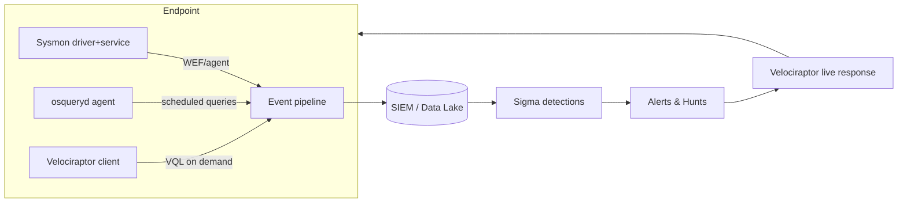
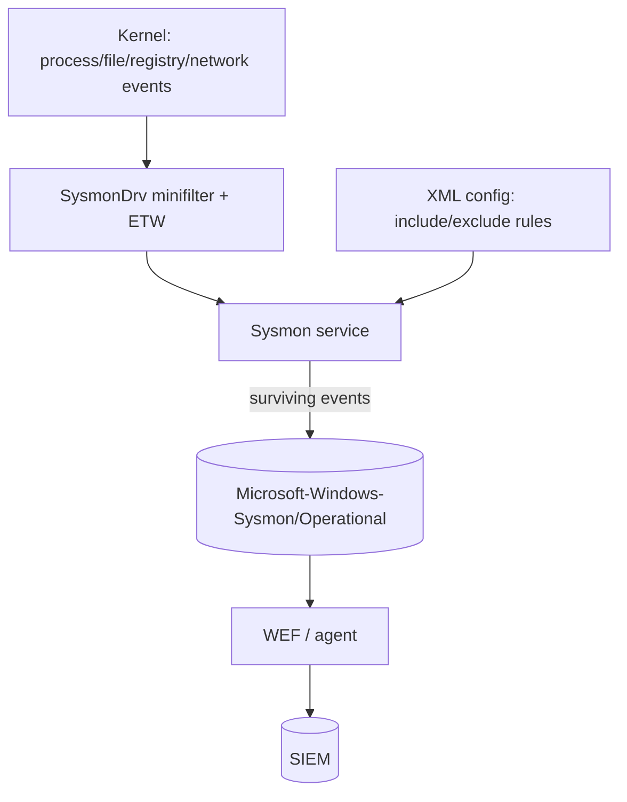
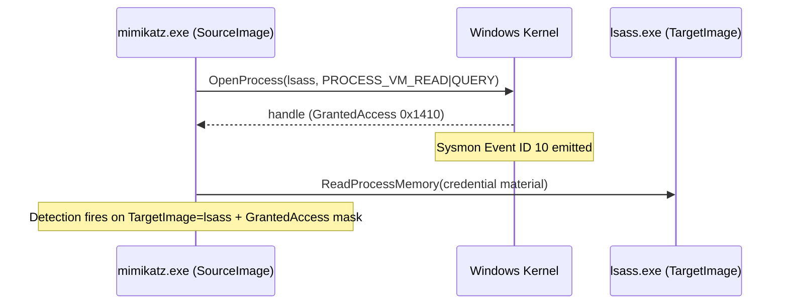
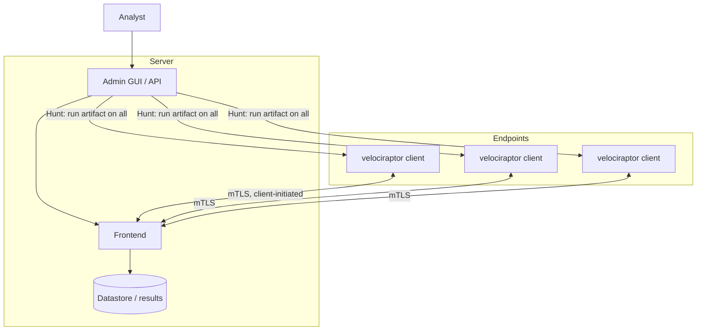
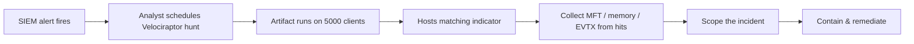
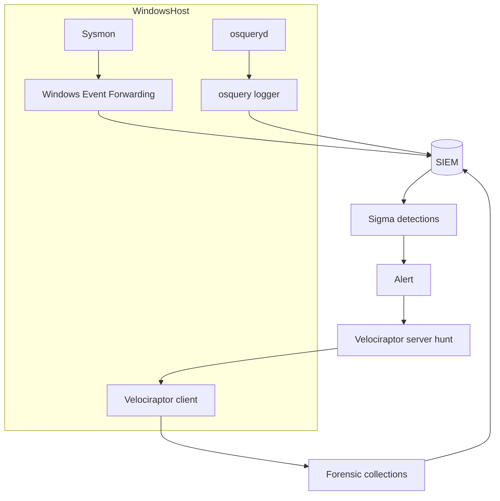

This is Chapter 2 of the Detection Engineering notebook. Chapter 1 taught you to *express* a detection as portable Sigma logic and convert it to any backend — but a Sigma rule is only as good as the telemetry it runs against. If the endpoint never records that `powershell.exe` spawned from `winword.exe`, no rule anywhere will catch it. This chapter builds the layer underneath detection: **endpoint visibility**. You will stand up three open-source pillars — **Sysmon** for rich Windows event generation, **Osquery** for querying the live state of any OS as if it were a SQL database, and **Velociraptor** for fleet-wide hunting and live incident response — and learn each one from zero: what it is, why it exists, how to install and configure it, its internals and event schema, and how to turn its raw output into detections mapped to MITRE ATT&CK.

The stance is defensive throughout. These tools generate and collect telemetry on systems *you own and defend*. The attacker behaviours we instrument for — process injection, LSASS access, encoded PowerShell, persistence, credential dumping — are described so you can *see* them in the data and build detections; any offensive commands shown are meant to be run in your own detection lab (DetectionLab, Attack Range, a couple of throwaway VMs) to validate that your sensors actually fire. We build from why native logging is insufficient, through Sysmon end to end, Osquery end to end, and Velociraptor end to end, then a full lab that instruments a host and catches an attack chain, a consolidated Detection & Defense part, a final revision, a cheat sheet, and topic-specific practice.

---

## Part 1: Why Native Logging Isn't Enough — the Endpoint Visibility Gap

The endpoint is where attacks *happen*. Network sensors see packets, identity logs see logons, but the moment of compromise — a macro spawning a shell, a beacon injecting into a browser, a tool reading LSASS memory — is an endpoint event. Yet a default Windows install is nearly blind to it. Out of the box, Windows does not log process creation with command lines (that requires enabling an audit policy *and* a separate registry value), does not log network connections per-process, does not log when one process opens a handle into another's memory, and does not record which DLLs load into which processes. The Security event log captures logons (4624/4625), some process-creation events (4688, if enabled) and privilege use, but the fields are thin and the noise-to-signal ratio is poor.

This is the **endpoint visibility gap**: the difference between what an attacker does on a host and what the host records by default. Commercial EDR (endpoint detection and response) products — CrowdStrike, Microsoft Defender for Endpoint, SentinelOne — close this gap with a kernel driver that captures rich, correlated telemetry. But EDR is expensive, and even in shops that have it, a detection engineer must understand *what* endpoint telemetry looks like to write and validate detections. The three tools in this chapter give you EDR-grade visibility with open-source software, and — more importantly — teach you the raw materials every detection consumes.

Each tool answers a different question, and they compose:

| Tool | Core question it answers | Model | Data cadence |
|------|--------------------------|-------|--------------|
| **Sysmon** | "What happened, moment by moment, on this Windows host?" | Streaming event log (driver + service) | Real-time, event-driven |
| **Osquery** | "What is the state of this machine right now (or on a schedule)?" | SQL over live OS state | Pull / scheduled snapshots |
| **Velociraptor** | "Across my whole fleet, where is *X* — and let me collect it now" | Client-server VQL hunts & live response | On-demand + continuous monitoring |

Sysmon is a *firehose of events* you ship to a SIEM. Osquery is a *database view of the OS* you query. Velociraptor is a *DFIR platform* you point at a hunt. A mature program runs all three: Sysmon feeds the detection pipeline, Osquery answers compliance and hunt questions at scale, and Velociraptor is what you reach for when an alert fires and you need to sweep 5,000 endpoints in minutes.



**Detection-engineering framing:** the previous chapter's Sigma rules almost all declare `logsource: product: windows, service: sysmon` or an osquery/EDR source. This chapter is where that telemetry actually comes from. Master it and you control your own detection surface instead of inheriting a vendor's.

---

## Part 2: Sysmon From Scratch — What It Is and How It Works

**System Monitor (Sysmon)** is a free Windows system service and device driver from Microsoft's Sysinternals suite (authored by Mark Russinovich and Thomas Garnier). Once installed it stays resident across reboots and writes detailed, high-fidelity records of system activity to a dedicated Windows event log. Where the native Security log is generic and audit-policy-driven, Sysmon is purpose-built for security telemetry: it records **process creation with full command line and hashes and parent process**, **network connections tied to the initiating process**, **image/DLL loads**, **remote-thread creation**, **process-memory access**, **file creation**, **registry modification**, **DNS queries**, and more — each event richly fielded and, crucially, stamped with a **ProcessGuid** that lets you correlate every action back to the exact process instance that performed it.

### How Sysmon is built

Sysmon has two parts working together:

- A **kernel-mode minifilter driver** (`SysmonDrv`) that hooks into the OS to observe process, image-load, file, registry, and network events at a low level, plus an ETW (Event Tracing for Windows) consumer for things like DNS.
- A **user-mode Windows service** (`Sysmon` / `Sysmon64`) that reads the driver's data, applies your **configuration** (the filtering rules that decide what to keep), and writes the surviving events into the `Microsoft-Windows-Sysmon/Operational` event-log channel.



The configuration is the heart of Sysmon. Without a good config, Sysmon either logs almost nothing (default) or everything (unusable noise). With a good config it logs the ~5% of activity that matters for detection. We cover configs in Part 4.

### Installing Sysmon

Download the Sysmon zip from Sysinternals (`https://learn.microsoft.com/sysinternals/downloads/sysmon`) and unzip. Install from an elevated command prompt:

```powershell
# Install with a config file (recommended). -accepteula avoids the GUI prompt.
sysmon64.exe -accepteula -i sysmonconfig.xml

# Sysmon64.exe          -> the 64-bit binary (use Sysmon.exe on 32-bit)
# -accepteula           -> accept the EULA non-interactively (needed for automation)
# -i <config>           -> INSTALL the driver + service and load this config
```

Expected output:

```
System Monitor v15.14 - System activity monitor
Copyright (C) 2014-2024 Mark Russinovich and Thomas Garnier
Sysinternals - www.sysinternals.com

Loading configuration file with schema version 4.90
Configuration file validated.
Sysmon64 installed.
SysmonDrv installed.
Starting SysmonDrv.
SysmonDrv started.
Starting Sysmon64..
Sysmon64 started.
```

Other lifecycle commands you will use constantly:

```powershell
sysmon64.exe -c sysmonconfig.xml   # -c: hot-swap/UPDATE the running config (no reinstall)
sysmon64.exe -c                    # -c with no file: DUMP the current effective config
sysmon64.exe -u                    # -u: UNINSTALL the service (add 'force' if it hangs)
sysmon64.exe -u force              # force uninstall even if the driver is wedged
```

Verify it is running and producing events:

```powershell
Get-Service Sysmon64                          # State should be Running
Get-WinEvent -LogName "Microsoft-Windows-Sysmon/Operational" -MaxEvents 5 |
  Format-List TimeCreated, Id, Message
```

**Red team usage (know your enemy):** attackers routinely check for Sysmon before acting — `Get-Service | ? {$_.Name -like "*sysmon*"}`, looking for the `SysmonDrv` driver, or querying the config from the registry. They may try to unload the driver, filter their activity to blind spots in a weak config, or rename their tooling to match excluded paths. Everything in Part 4 (config hardening) and Part 13 (tamper detection via Event ID 255/4/16) exists because of this cat-and-mouse.

**Blue team usage:** Sysmon is the single highest-value free sensor you can deploy on Windows. The events it produces are what most of the community's Windows Sigma rules key on. If you deploy one thing from this chapter fleet-wide, deploy Sysmon with a curated config.

---

## Part 3: The Sysmon Event Schema — Every High-Value Event ID

Sysmon assigns each event type a stable **Event ID**. You do not need all of them; a handful carry most detection value. Here is the full catalogue, with the ones you will actually build detections on called out.

| ID | Event | Why it matters for detection |
|----|-------|------------------------------|
| 1 | **Process creation** | The backbone. Full command line, hashes, parent process, integrity level, user. Powers parent-child anomaly detection. |
| 2 | File creation time changed | Timestomping (T1070.006) — attackers backdating files. |
| 3 | **Network connection** | Per-process TCP/UDP with source/dest IP, port, and the initiating image. C2 and lateral movement. |
| 4 | Sysmon service state changed | Sysmon started/stopped — tamper signal. |
| 5 | Process terminated | Pairs with Event 1 to bound a process lifetime. |
| 6 | Driver loaded | Malicious/vulnerable driver loading (BYOVD, T1068). |
| 7 | **Image loaded** | DLL loads — unsigned DLLs, DLL side-loading, suspicious modules in LOLBins. |
| 8 | **CreateRemoteThread** | Classic process injection (T1055) — thread created in another process. |
| 9 | RawAccessRead | Raw disk reads (`\\.\C:`) — evasion / NTDS/SAM theft. |
| 10 | **ProcessAccess** | One process opening a handle into another. LSASS access (credential dumping, T1003.001). |
| 11 | **FileCreate** | Files written — dropped payloads, webshells, staged archives. |
| 12/13/14 | **Registry** (create/delete, set value, rename) | Persistence (Run keys, services), Defender tampering. |
| 15 | FileCreateStreamHash | Alternate Data Streams — Mark-of-the-Web, hidden payloads. |
| 16 | Sysmon config changed | Config swap — tamper signal. |
| 17/18 | Pipe created/connected | Named-pipe C2 (Cobalt Strike default pipes), SMB lateral tooling. |
| 19/20/21 | WMI event filter/consumer/binding | WMI persistence (T1546.003). |
| 22 | **DNS query** | Per-process DNS resolution — DGA, C2 domains, exfil over DNS. |
| 23/26 | File delete (archived/logged) | Anti-forensics, self-deleting droppers. |
| 24 | Clipboard changed | Clipboard capture. |
| 25 | **Process tampering** | Process hollowing / herpaderping / image replacement (T1055.012). |
| 27/28 | File block executable / shred | Sysmon blocking mode (newer versions). |
| 255 | Sysmon error | Internal errors — can indicate tampering or config problems. |

The events in bold — **1, 3, 7, 8, 10, 11, 12/13, 22, 25** — are where you will spend 90% of your detection engineering time. Let's dissect the most important ones.

### Event ID 1 — Process Creation (the crown jewel)

Every process launch is recorded with the fields that make behavioural detection possible. A raw event (trimmed) looks like:

```xml
<Event>
  <EventData>
    <Data Name="UtcTime">2027-02-25 09:14:22.113</Data>
    <Data Name="ProcessGuid">{a1b2...}</Data>
    <Data Name="ProcessId">7312</Data>
    <Data Name="Image">C:\Windows\System32\WindowsPowerShell\v1.0\powershell.exe</Data>
    <Data Name="CommandLine">powershell.exe -nop -w hidden -enc SQBFAFgA...</Data>
    <Data Name="CurrentDirectory">C:\Users\jdoe\Desktop\</Data>
    <Data Name="User">CORP\jdoe</Data>
    <Data Name="IntegrityLevel">Medium</Data>
    <Data Name="Hashes">SHA256=908B64B1...,IMPHASH=A7...</Data>
    <Data Name="ParentProcessId">4988</Data>
    <Data Name="ParentImage">C:\Program Files\Microsoft Office\root\Office16\WINWORD.EXE</Data>
    <Data Name="ParentCommandLine">"WINWORD.EXE" /n "C:\Users\jdoe\Downloads\invoice.docm"</Data>
  </EventData>
</Event>
```

Read that like a story: a Word document spawned a hidden, `-EncodedCommand` PowerShell. That single parent-child relationship (`WINWORD.EXE → powershell.exe`) plus the `-enc`/`-w hidden` flags is one of the most reliable initial-access detections in existence. The fields you will key on most:

| Field | Detection use |
|-------|---------------|
| `Image` / `ParentImage` | Parent-child anomalies (Office → shell, `services.exe` → non-service). |
| `CommandLine` | Encoded commands, download cradles, LOLBin abuse. |
| `Hashes` (SHA256 + **IMPHASH**) | Known-bad matching; IMPHASH clusters malware families by import table. |
| `IntegrityLevel` | Privilege — `System`/`High` from an unexpected parent = escalation. |
| `User` | Whose context; `SYSTEM` spawning cmd from odd parents. |
| `ProcessGuid` | The join key to correlate *all* later events from this process. |

### Event ID 3 — Network Connection

Ties a network flow to the process that made it. Key fields: `Image`, `SourceIp`/`SourcePort`, `DestinationIp`/`DestinationPort`, `DestinationHostname`, `Protocol`. Detection gold because it answers "which binary is beaconing to that IP?" — e.g. `powershell.exe` or `rundll32.exe` making outbound 443 connections is deeply suspicious.

### Event ID 7 — Image Loaded

Records DLL loads with `Image` (the loading process), `ImageLoaded` (the DLL), `Signed`, `Signature`, `SignatureStatus`, and hashes. This is how you catch **DLL side-loading** (a signed, legitimate EXE loading a malicious DLL from its own directory) and unsigned modules loaded into sensitive processes. It is high-volume; filter aggressively.

### Event ID 8 — CreateRemoteThread & Event ID 10 — ProcessAccess

Two pillars of injection/credential-theft detection.

- **Event 8** fires when a process creates a thread in *another* process — the textbook signature of classic DLL/shellcode injection (T1055.001/002). Fields include `SourceImage`, `TargetImage`, `StartAddress`, `StartModule`, `StartFunction`.
- **Event 10** fires when a process opens a handle into another with specific access rights. The canonical detection: any process opening `lsass.exe` with `GrantedAccess` of `0x1010` or `0x1410` (read memory) — the fingerprint of Mimikatz-style **LSASS dumping** (T1003.001). Fields: `SourceImage`, `TargetImage`, `GrantedAccess`, `CallTrace`.



### Event ID 11 — FileCreate, 12/13 — Registry, 22 — DNS

- **Event 11 (FileCreate)** catches dropped payloads, webshells in web roots, and staged archives (`.7z`, `.zip` in `%TEMP%`). Fields: `Image`, `TargetFilename`, `CreationUtcTime`.
- **Event 13 (SetValue)** is your persistence sensor: writes to `...\CurrentVersion\Run`, service `ImagePath`, or Defender exclusion keys. Fields: `TargetObject`, `Details`.
- **Event 22 (DNS query)** ties DNS resolution to a process: `Image`, `QueryName`, `QueryResults`. Detects DGA domains, known-bad C2, and DNS-tunnelling patterns (many TXT queries to one domain).

---

## Part 4: Configuring Sysmon Well — Include/Exclude, Community Configs, ATT&CK Tagging

Sysmon's power and its danger both live in the config. The config is XML with two logics per event type: **include** (log only matching events) and **exclude** (log everything except matching events). Getting this right is the difference between a sensor and a denial-of-service against your own SIEM.

### Config skeleton

```xml
<Sysmon schemaversion="4.90">
  <HashAlgorithms>SHA256,IMPHASH</HashAlgorithms>
  <DnsLookup>False</DnsLookup>            <!-- don't reverse-resolve; avoids noise & tipping off -->
  <EventFiltering>

    <!-- Event 1: Process creation. Include (log) suspicious parents/paths. -->
    <RuleGroup name="ProcCreate" groupRelation="or">
      <ProcessCreate onmatch="include">
        <ParentImage condition="end with">WINWORD.EXE</ParentImage>
        <ParentImage condition="end with">EXCEL.EXE</ParentImage>
        <Image condition="end with">powershell.exe</Image>
        <CommandLine condition="contains">-enc</CommandLine>
        <CommandLine condition="contains">DownloadString</CommandLine>
      </ProcessCreate>
    </RuleGroup>

    <!-- Event 10: ProcessAccess. Log handles into LSASS, exclude known-good. -->
    <RuleGroup name="LsassAccess" groupRelation="or">
      <ProcessAccess onmatch="include">
        <TargetImage condition="image">lsass.exe</TargetImage>
      </ProcessAccess>
      <ProcessAccess onmatch="exclude">
        <SourceImage condition="image">C:\Windows\System32\wbem\WmiPrvSE.exe</SourceImage>
      </ProcessAccess>
    </RuleGroup>

  </EventFiltering>
</Sysmon>
```

Condition operators you must know: `is`, `is not`, `contains`, `contains any`, `contains all`, `excludes`, `begin with`, `end with`, `image` (matches the filename part of a full path), `less than`, `more than`. `groupRelation="or"` means any child rule matching includes the event; `and` requires all.

### Don't hand-roll it — start from a community config

Two maintained baselines dominate real deployments; use one as a starting point and tune, never ship raw:

| Config | Maintainer | Style | Best for |
|--------|-----------|-------|----------|
| **sysmon-config** | SwiftOnSecurity | Curated allow/deny, heavily commented, conservative | Getting sane telemetry fast, learning the format |
| **sysmon-modular** | Olaf Hartong | Modular files, one per ATT&CK-relevant behaviour, `merge` to build | Detection engineering, ATT&CK coverage tracking |

`sysmon-modular` lets you tag rules with ATT&CK technique IDs so the resulting event carries the technique in its `RuleName`, which flows straight into your SIEM and Navigator heatmap:

```xml
<ProcessCreate onmatch="include">
  <Rule name="technique_id=T1059.001,technique_name=PowerShell" groupRelation="or">
    <CommandLine condition="contains">-EncodedCommand</CommandLine>
    <CommandLine condition="contains">-enc </CommandLine>
  </Rule>
</ProcessCreate>
```

Build and deploy the modular config:

```powershell
# Merge the modular fragments into one config, then hot-load it
.\Merge-SysmonXml.ps1 -Path .\sysmonconfig.xml
sysmon64.exe -c .\sysmonconfig.xml
```

### Config anti-patterns (each one is a real incident waiting to happen)

- **Logging all Event 7 (image loads) unfiltered** — this alone can 10x your Sysmon volume. Include only DLLs loaded from user-writable paths or into LOLBins.
- **Excluding by process name instead of full path/signature** — an attacker who drops `svchost.exe` in `%TEMP%` sails past a name-based exclude. Match on full path and signature status.
- **Excluding whole directories** (`C:\Program Files\...`) — creates a blind spot an attacker can stage into. Prefer signature-based excludes.
- **No `SHA256`/IMPHASH hashing** — without hashes you lose known-bad matching and family clustering.

**Red team usage:** attackers dump the effective config (`sysmon64 -c` or reading `HKLM\SYSTEM\CurrentControlSet\Services\SysmonDrv\Parameters`) precisely to find these blind spots and live inside them. A tight, signature-aware config denies them that.

---

## Part 5: Hunting With Sysmon — Queries and ATT&CK-Mapped Detections

With Sysmon feeding events, you write detections. Here are high-value ones, shown three ways: the behaviour, a PowerShell/`Get-WinEvent` local hunt, and the Sigma logic (from Chapter 1) you'd deploy.

### Office spawning a shell (Initial Access, T1566/T1059)

```powershell
# Local hunt: Event 1 where parent is an Office app and child is a shell/LOLBin
Get-WinEvent -LogName "Microsoft-Windows-Sysmon/Operational" |
  Where-Object { $_.Id -eq 1 } |
  ForEach-Object { [xml]$_.ToXml() } |
  Where-Object {
    $_.Event.EventData.Data | Where-Object { $_.Name -eq 'ParentImage' -and
      ($_.'#text' -match 'WINWORD|EXCEL|POWERPNT|OUTLOOK') } } |
  Where-Object {
    $_.Event.EventData.Data | Where-Object { $_.Name -eq 'Image' -and
      ($_.'#text' -match 'powershell|cmd|wscript|cscript|mshta|rundll32') } }
```

Sigma equivalent (converts to Splunk/Sentinel/Elastic):

```yaml
title: Office Application Spawning a Command Interpreter
logsource: { product: windows, service: sysmon }
detection:
  selection:
    EventID: 1
    ParentImage|endswith:
      - '\WINWORD.EXE'
      - '\EXCEL.EXE'
      - '\POWERPNT.EXE'
    Image|endswith:
      - '\powershell.exe'
      - '\cmd.exe'
      - '\mshta.exe'
      - '\wscript.exe'
  condition: selection
level: high
tags: [attack.execution, attack.t1059.001, attack.t1566.001]
```

### LSASS credential access (T1003.001)

```yaml
title: LSASS Memory Access With Suspicious Rights
logsource: { product: windows, service: sysmon }
detection:
  selection:
    EventID: 10
    TargetImage|endswith: '\lsass.exe'
    GrantedAccess:
      - '0x1010'
      - '0x1410'
      - '0x1438'
      - '0x143a'
  filter_known:
    SourceImage|endswith:
      - '\wmiprvse.exe'
      - '\MsMpEng.exe'          # Defender legitimately touches LSASS
  condition: selection and not filter_known
level: high
tags: [attack.credential-access, attack.t1003.001]
```

### Other must-have Sysmon detections

| Behaviour | Event ID(s) | Key indicator |
|-----------|-------------|---------------|
| Encoded PowerShell | 1 | `CommandLine` contains `-enc`/`-EncodedCommand`/`FromBase64String` |
| Rundll32/regsvr32 with URL | 1, 3 | LOLBin CommandLine has `http`/`\\` remote path |
| DLL side-loading | 7 | Signed EXE in unusual dir loading unsigned DLL from same dir |
| Named-pipe C2 | 17/18 | Pipe names matching Cobalt Strike defaults (`\msagent_`, `\postex_`) |
| Run-key persistence | 13 | `TargetObject` under `...\CurrentVersion\Run` |
| DNS to newly seen domain | 22 | `QueryName` not in baseline; high-entropy (DGA) |
| Process hollowing | 25 | Process tampering event on a hollowed target |
| Service creation for lateral move | 1/13 | `services.exe` parent + new `ImagePath` to temp/binary |

**CTF / lab tie-in:** the free **TryHackMe "Sysmon"** and **"Sysinternals"** rooms and **Blue Team Labs Online** exercises give you event logs to hunt through with exactly these patterns; DetectionLab ships a Sysmon-instrumented Windows host you can attack with Atomic Red Team and watch the events light up (see Part 12 and the practice section).

---

## Part 6: Osquery From Scratch — SQL as an Operating-System Interface

**Osquery** (originally from Facebook, now a Linux Foundation project) exposes the operating system as a **relational database**. Running processes, open sockets, installed packages, kernel modules, scheduled tasks, browser extensions, users, logged-in sessions, the Windows registry, file hashes — all appear as **virtual tables** you query with standard SQL (SQLite dialect). It runs on Windows, macOS, and Linux with the *same* query language, which makes it the great equaliser for cross-platform visibility.

Where Sysmon streams events as they happen, osquery answers *point-in-time* questions ("what is listening on a port right now?") and, via its daemon, *scheduled* questions with **differential** results ("tell me what changed since last time"). It does not need a kernel driver for most tables (it reads OS APIs), which makes it lightweight and safe to deploy broadly.

### The two ways to run it

- **`osqueryi`** — the interactive shell. A REPL for ad-hoc questions and developing queries. Great for hunting and learning.
- **`osqueryd`** — the daemon. Runs a **query schedule** in the background, logging results (and differentials) to disk/SIEM, plus optional file-integrity monitoring and process/socket event auditing.

### Install

```bash
# Debian/Ubuntu
export OSQUERY_KEY=1484120AC4E9F8A1A577AEEE97A80C63C9D8B80B
sudo apt-key adv --keyserver keyserver.ubuntu.com --recv-keys $OSQUERY_KEY
sudo add-apt-repository 'deb [arch=amd64] https://pkg.osquery.io/deb deb main'
sudo apt update && sudo apt install osquery

# macOS
brew install --cask osquery

# Windows: download the .msi from osquery.io and install, or:  choco install osquery
```

Launch the shell and look around:

```bash
osqueryi
```

```
Using a virtual database. Type '.help' for usage hints.
osquery> .tables
  => arp_cache
  => authorized_keys
  => processes
  => listening_ports
  => users
  ... (200+ tables)
osquery> .schema processes        -- show the columns/type of a table
osquery> SELECT pid, name, path FROM processes LIMIT 5;
+------+-------------+----------------------------------+
| pid  | name        | path                             |
+------+-------------+----------------------------------+
| 1    | systemd     | /usr/lib/systemd/systemd         |
| 842  | sshd        | /usr/sbin/sshd                   |
| 1207 | osqueryi    | /usr/bin/osqueryi                |
+------+-------------+----------------------------------+
```

Useful shell meta-commands: `.tables` (list tables), `.schema <table>` (columns), `.mode line`/`.mode csv` (output format), `.help`, `.quit`.

---

## Part 7: Osquery for Detection — High-Value Tables, Joins, Packs & Differentials

The skill is knowing *which tables* answer security questions and how to *join* them. A handful carry enormous value:

| Table | What it exposes | Detection use |
|-------|-----------------|---------------|
| `processes` | Running procs: pid, name, path, cmdline, parent, on_disk | Masquerading (name≠path), deleted-on-disk binaries |
| `listening_ports` / `process_open_sockets` | Sockets bound/connected + owning pid | Backdoor listeners, C2 egress |
| `startup_items` / `scheduled_tasks` / `services` | Persistence surfaces | New autoruns, rogue services |
| `crontab` / `launchd` | Unix/mac persistence | Cron backdoors |
| `authorized_keys` | SSH trust | Attacker-added keys (T1098.004) |
| `registry` (Win) | Registry keys/values | Run-key persistence, Defender tampering |
| `users` / `logged_in_users` / `shell_history` | Accounts & activity | Rogue accounts, suspicious commands |
| `file` / `hash` | File metadata + hashes | FIM, known-bad hash matching |
| `kernel_modules` / `drivers` | Loaded modules/drivers | Rootkits, BYOVD |
| `browser_plugins` / `chrome_extensions` | Browser add-ons | Malicious extensions |

### Detection queries you'll actually run

Processes running from a path that no longer exists on disk (classic in-memory / deleted-dropper indicator):

```sql
SELECT pid, name, path, cmdline
FROM processes
WHERE on_disk = 0;          -- 0 = the backing executable was deleted after launch
```

Processes whose binary lives in a suspicious location:

```sql
SELECT p.pid, p.name, p.path, p.cmdline, u.username
FROM processes p
JOIN users u ON p.uid = u.uid
WHERE p.path LIKE '/tmp/%'
   OR p.path LIKE '/dev/shm/%'
   OR p.path LIKE 'C:\Users\%\AppData\Local\Temp\%';
```

Listening ports joined to their owning process (find the backdoor and *who* opened it):

```sql
SELECT lp.address, lp.port, lp.protocol, p.name, p.path, p.cmdline
FROM listening_ports lp
JOIN processes p ON lp.pid = p.pid
WHERE lp.address NOT IN ('127.0.0.1','::1');   -- externally reachable listeners
```

Unauthorized SSH keys added to any user's account (T1098.004):

```sql
SELECT ak.uid, u.username, ak.key, ak.key_file
FROM authorized_keys ak
JOIN users u ON ak.uid = u.uid;
```

Windows Run-key persistence via the `registry` table:

```sql
SELECT path, name, data
FROM registry
WHERE path LIKE 'HKEY_USERS\%\Software\Microsoft\Windows\CurrentVersion\Run\%'
   OR path LIKE 'HKEY_LOCAL_MACHINE\Software\Microsoft\Windows\CurrentVersion\Run\%';
```

### Scheduling queries with a pack (osqueryd)

A **query pack** is a JSON file of scheduled queries. The daemon runs each on its `interval` and — because it stores the previous result set — logs only the **differential** (rows added/removed) by default. That means "a new listening port appeared" is a single, cheap log line rather than the entire table every time.

```json
{
  "queries": {
    "new_listening_ports": {
      "query": "SELECT lp.port, lp.protocol, lp.address, p.name, p.path FROM listening_ports lp JOIN processes p ON lp.pid = p.pid;",
      "interval": 300,
      "description": "Track processes binding network ports",
      "value": "Detect new backdoor listeners"
    },
    "deleted_binaries_running": {
      "query": "SELECT pid, name, path, cmdline FROM processes WHERE on_disk = 0;",
      "interval": 120,
      "snapshot": false
    }
  }
}
```

Run the daemon with a pack and config:

```bash
sudo osqueryd \
  --flagfile=/etc/osquery/osquery.flags \
  --config_path=/etc/osquery/osquery.conf \
  --logger_path=/var/log/osquery \
  --disable_events=false        # enable evented tables (see below)
```

- `--config_path` points to the JSON config (schedule + packs).
- `--logger_path` is where result JSON is written (ship this to your SIEM).
- `--disable_events=false` turns on **evented tables** like `process_events`, `socket_events`, and `file_events` (FIM), which use the OS audit subsystem (auditd on Linux, ETW/Windows event auditing) to give near-real-time change capture rather than polling.

### File Integrity Monitoring (FIM)

Point osquery at directories to watch and it will populate `file_events`:

```json
{
  "file_paths": {
    "etc": [ "/etc/%%" ],
    "webroot": [ "/var/www/html/%%" ],
    "binaries": [ "/usr/bin/%%", "/usr/sbin/%%" ]
  },
  "schedule": {
    "file_events": { "query": "SELECT * FROM file_events;", "interval": 60 }
  }
}
```

`%%` is recursive-wildcard. Now creation/modification/deletion under those paths (a dropped webshell in `/var/www/html`, a tampered `/etc/passwd`) surfaces as rows with action, target_path, and a hash.

### Managing osquery at fleet scale

`osqueryd` on 5,000 hosts needs a control plane. **Fleet** (fleetdm) and the older **Kolide** provide a TLS server that pushes query packs, runs live queries across the fleet, and aggregates results. You point agents at the server with `--tls_hostname` and an enroll secret; you then run a query in the Fleet UI and watch thousands of hosts answer in seconds. This is the osquery analogue of what Velociraptor does for DFIR — and the two are complementary.

**Blue team usage:** osquery is your compliance-and-hunt workhorse — "show me every host with SMBv1 enabled / an unauthorized local admin / a listener on 4444." **Red team usage:** on a compromised host, `osqueryi` (if present) is a recon goldmine for understanding defenders' visibility; attackers may also disable `osqueryd` or block its logger path, so monitor for the daemon stopping.

---

## Part 8: Velociraptor From Scratch — Fleet-Wide Hunting & Live DFIR

**Velociraptor** (created by Mike Cohen, now an open-source project under Rapid7's stewardship) is a **digital-forensics and incident-response (DFIR) platform**. Where Sysmon *generates* telemetry and osquery *queries state on a schedule*, Velociraptor lets you **reach into a whole fleet on demand** and ask deep forensic questions — parse the MFT, pull prefetch, read registry hives, collect memory strings, hunt for a file hash across 10,000 endpoints — and it can also run **continuous client-side monitoring** that raises events when something matches. It is the tool you grab when an alert fires and you need answers across the estate in minutes, not days.

Its query language, **VQL** (Velociraptor Query Language), is SQL-like but far more powerful than osquery's: it can call **plugins** that parse forensic artifacts, run other tools, and chain results. Reusable VQL bundles are called **artifacts**, and Velociraptor ships hundreds curated by the community (the "Artifact Exchange").

### Architecture



- The **server** hosts the admin GUI/API and stores results; clients connect *out* to it over mutually authenticated TLS (client-initiated, so it traverses NAT/firewalls like a beacon — which is why it scales to remote fleets).
- The **client** (a single self-contained binary) runs as a service on each endpoint, waiting for the server to task it with VQL.
- A **Hunt** is a VQL artifact scheduled to run across a group of clients; a **Collection** is running an artifact against one client interactively.

### Install (standalone, for a lab)

Velociraptor is one binary that plays every role. Generate a config, then run server and client:

```bash
# 1. Generate a self-signed config interactively (accept defaults for a lab)
./velociraptor config generate -i
# -> writes server.config.yaml and client.config.yaml, sets up the GUI user

# 2. Start the server (GUI on https://127.0.0.1:8889 by default)
./velociraptor --config server.config.yaml frontend -v

# 3. On each endpoint, install the client as a service with the client config
velociraptor.exe --config client.config.yaml service install   # Windows
sudo ./velociraptor --config client.config.yaml service install # Linux/mac
```

Log into the GUI, and your clients appear under the **Search** panel. You are now ready to hunt.

---

## Part 9: VQL and Artifacts — Hunting the Fleet

VQL's core shape is `SELECT ... FROM plugin(args) WHERE ...`. The `FROM` source is usually a **plugin** (a forensic capability) rather than a static table, which is what gives VQL its reach.

A first query — list processes via the `pslist()` plugin:

```sql
SELECT Pid, Ppid, Name, Exe, CommandLine
FROM pslist()
WHERE Name =~ "powershell|cmd|rundll32"    -- =~ is regex match
```

Find a file hash across the disk (needle-in-haystack hunt):

```sql
SELECT FullPath, Size, Mtime,
       hash(path=FullPath).SHA256 AS SHA256
FROM glob(globs="C:/Users/**/*.exe")       -- ** recurses
WHERE SHA256 = "908b64b1971a979c7e3e8...deadbeef"
```

Parse Windows persistence with a built-in artifact instead of hand-writing everything. Artifacts are named VQL bundles you invoke by name; e.g. collect autoruns/persistence fleet-wide:

```sql
-- Conceptually, a Hunt runs an artifact like:
SELECT * FROM Artifact.Windows.Persistence.PermanentWMIEvents()
-- or
SELECT * FROM Artifact.Windows.System.Services()
```

### The DFIR power move: forensic artifacts

This is where Velociraptor leaves osquery behind. It ships plugins/artifacts that parse raw forensic structures:

| Artifact / plugin | Forensic value |
|-------------------|----------------|
| `Windows.NTFS.MFT` | Parse the Master File Table — timelines, hidden/deleted files |
| `Windows.Forensics.Prefetch` | Prefetch parsing — evidence of execution (defeats T1070 anti-forensics) |
| `Windows.Registry.*` | Offline hive parsing — persistence, UserAssist, ShimCache |
| `Windows.EventLogs.*` | Pull & parse EVTX (including Sysmon) fleet-wide |
| `Windows.Memory.*` / winpmem | Acquire memory / strings for a suspect process |
| `Generic.Detection.Yara.*` | Run **YARA** rules across files or process memory fleet-wide |
| `Windows.Detection.Amcache` | Program-execution evidence |

A YARA hunt across process memory is a single artifact:

```sql
SELECT * FROM Artifact.Generic.Detection.Yara.Process(
   YaraRule='''rule cobalt_beacon { strings: $a = "%c%c%c%c%c" condition: $a }''')
```

### Client-side monitoring (continuous detection)

Beyond point-in-time hunts, Velociraptor clients can run **monitoring artifacts** that watch event streams (via ETW, the Sysmon channel, etc.) and forward matches continuously — turning Velociraptor into a lightweight EDR. For example, a monitoring artifact that watches the Sysmon channel for Event 10 LSASS access and reports in real time.



**IR use case:** an alert says host-A had LSASS touched. You launch one Velociraptor hunt with a YARA + prefetch + Sysmon-EVTX artifact across *all* endpoints and, minutes later, know exactly which of your machines show the same indicators — that is the difference between a contained incident and a breach.

---

## Part 10: How the Three Fit Together — an Endpoint Telemetry Architecture

No single tool is the answer; the strength is the composition. A reference blueprint:

| Layer | Tool | Role | Ships to |
|-------|------|------|----------|
| Real-time event generation | **Sysmon** | Rich Windows events (proc/net/injection/registry/DNS) | WEF → SIEM |
| Scheduled state & FIM | **osqueryd** | Cross-platform snapshots + differentials + file events | Logger → SIEM |
| On-demand hunt & DFIR | **Velociraptor** | Fleet sweeps, forensic parsing, live response, monitoring | Its own datastore + SIEM |
| Detection logic | **Sigma** (Ch.1) | Portable rules over the above sources | SIEM/EDR backends |



The feedback loop from Chapter 1 closes here: an incident's root cause reveals a missing detection → you confirm the needed telemetry exists in Sysmon/osquery (or add it to the config/pack) → you write a Sigma rule against it → you validate with Atomic Red Team → and you keep Velociraptor ready to sweep the fleet when that rule fires.

---

## Part 11: Instrumenting for ATT&CK Coverage — Mapping Telemetry to Techniques

A detection engineer thinks in **coverage**: which ATT&CK techniques can I even *see* with my current sensors? The table below maps common techniques to which of the three tools provides the telemetry — this is how you find blind spots before an attacker does.

| ATT&CK Technique | Sysmon | Osquery | Velociraptor |
|------------------|:------:|:-------:|:------------:|
| T1059.001 PowerShell exec | Event 1 (cmdline) | `process_events` | `pslist()`, EVTX |
| T1055 Process Injection | Event 8/10/25 | limited | memory YARA, `pslist` |
| T1003.001 LSASS dumping | **Event 10** | — | memory acquire, EVTX |
| T1547.001 Run-key persistence | Event 13 | `registry` | `Windows.Persistence.*` |
| T1053 Scheduled task/cron | Event 1 | `scheduled_tasks`/`crontab` | `Windows.System.TaskScheduler` |
| T1071 C2 over web | Event 3/22 | `process_open_sockets` | monitoring artifact |
| T1070 Indicator removal | Event 23/26/2 | `file_events` | MFT/USN journal |
| T1543 Create service | Event 1/13 | `services` | `Windows.System.Services` |
| T1098.004 SSH key persistence | — (Linux) | **`authorized_keys`** | `glob` + parse |
| T1546.003 WMI persistence | Event 19/20/21 | — | `PermanentWMIEvents` |

Read the blanks as risks. Notice LSASS dumping leans on Sysmon Event 10 — so a weak Sysmon config that doesn't include `TargetImage lsass.exe` blinds you to one of the most common post-exploitation moves. And SSH-key persistence on Linux is essentially an osquery job — Sysmon is Windows-only. Coverage mapping is exactly the ATT&CK-Navigator exercise from Chapter 1, but grounded in *sensor reality*.

---

## Part 12: Hands-On Lab — Instrument a Host and Catch an Attack Chain

**Goal:** stand up all three sensors on a Windows lab VM, execute a benign but realistic attack chain with **Atomic Red Team**, and prove each stage is visible. Everything runs on machines you own; this is detection validation, not offense.

### Lab setup

- One Windows 10/11 VM (target/sensor) and one Linux VM (Velociraptor server + attacker box), host-only network. **DetectionLab** or **Splunk Attack Range** automate all of this if you prefer.
- Snapshot the Windows VM clean before you start.

### Step 1 — Deploy the sensors

```powershell
# Sysmon with the modular config
sysmon64.exe -accepteula -i sysmonconfig.xml

# osquery installed; start the daemon with a small schedule + events on
osqueryd --config_path C:\ProgramData\osquery\osquery.conf --disable_events=false

# Velociraptor client pointed at the Linux server
velociraptor.exe --config client.config.yaml service install
```

Confirm events flow: `Get-WinEvent -LogName Microsoft-Windows-Sysmon/Operational -MaxEvents 3`.

### Step 2 — Install Atomic Red Team (the safe attacker)

**Atomic Red Team** (Red Canary) is a library of small, mapped tests that emulate individual ATT&CK techniques so you can check whether your detections fire. Install the PowerShell module:

```powershell
IEX (IWR 'https://raw.githubusercontent.com/redcanaryco/invoke-atomicredteam/master/install-atomicredteam.ps1' -UseBasicParsing)
Install-AtomicRedTeam -getAtomics
Import-Module invoke-atomicredteam
```

### Step 3 — Execute a chain and watch each sensor

**(a) Initial access proxy — encoded PowerShell (T1059.001):**

```powershell
Invoke-AtomicTest T1059.001 -TestNumbers 1     # runs an encoded/obfuscated PS command
```

Sysmon Event 1 you should now see (fields trimmed):

```
EventID:      1
Image:        C:\Windows\System32\WindowsPowerShell\v1.0\powershell.exe
CommandLine:  powershell -enc SQBFAFgAKAAuAC4A...
ParentImage:  C:\Windows\System32\cmd.exe
User:         LAB\analyst   IntegrityLevel: Medium
```

Confirm the detection logic from Part 5 (`-enc` in CommandLine) matches.

**(b) Credential access — simulate LSASS access (T1003.001):**

```powershell
Invoke-AtomicTest T1003.001 -TestNumbers 1     # e.g. comsvcs.dll MiniDump of LSASS
```

Sysmon **Event 10** appears:

```
EventID:       10
SourceImage:   C:\Windows\System32\rundll32.exe
TargetImage:   C:\Windows\System32\lsass.exe
GrantedAccess: 0x1410
CallTrace:     C:\Windows\SYSTEM32\ntdll.dll+...|comsvcs.dll+...
```

Now pivot to Velociraptor: run a **Collection** of `Windows.EventLogs.Evtx` (or a Sysmon-focused artifact) against the target, filtered to Event 10 — you have just done fleet-capable IR on the same indicator.

**(c) Persistence — Run key (T1547.001):**

```powershell
Invoke-AtomicTest T1547.001 -TestNumbers 1     # writes a Run-key value
```

- **Sysmon Event 13:** `TargetObject` under `...\CurrentVersion\Run`, `Details` = the payload path.
- **Osquery** confirms state — run in `osqueryi`:

```sql
SELECT path, name, data FROM registry
WHERE path LIKE 'HKEY_LOCAL_MACHINE\Software\Microsoft\Windows\CurrentVersion\Run\%';
```

**(d) Network — a listening backdoor / beacon (T1071):**

Start a benign listener, then find it two ways:

```sql
-- osquery: which process opened an external listener?
SELECT lp.port, lp.protocol, p.name, p.path, p.cmdline
FROM listening_ports lp JOIN processes p ON lp.pid = p.pid
WHERE lp.address NOT IN ('127.0.0.1','::1');
```

Sysmon Event 3 will show the same process's outbound connection with `DestinationIp`/`DestinationPort`.

### Step 4 — Fleet sweep with Velociraptor

Finally, prove the DFIR angle. In the Velociraptor GUI, schedule a **Hunt** using `Windows.Persistence.PermanentWMIEvents` and a YARA process-memory artifact across all clients. Even with one host, you have exercised the exact workflow that scopes a real incident across thousands.

### Step 5 — Clean up

```powershell
Invoke-AtomicTest T1547.001 -TestNumbers 1 -Cleanup   # each atomic has a cleanup
# then revert the VM snapshot
```

**What you proved:** every stage of a realistic chain — execution, credential access, persistence, C2 — produced telemetry in at least one sensor, and often corroborating evidence across two. That corroboration is the essence of high-confidence detection: Sysmon says a Run key was written (Event 13); osquery confirms it still exists in the registry state; Velociraptor can sweep the fleet for the same value. This is defense-in-depth at the telemetry layer.

---

## Part 13: Detection & Defense Angle — Tamper Resistance, Evasion & Blind Spots

Sensors are targets. A capable adversary who lands on a host will try to blind you, so treat your telemetry pipeline as an asset to defend, and monitor the sensors themselves.

### Detecting tampering with the sensors

- **Sysmon self-signals:** Event **4** (service state changed — stop is suspicious), Event **16** (config changed), Event **255** (internal error). Alert on any of them. Also watch the Security log for `SysmonDrv`/`Sysmon64` service deletion and for `sc stop`/`fltmc unload` targeting the driver.
- **Osquery:** monitor for `osqueryd` stopping (via service manager events) and for tampering with its config/logger path. A silent agent is a red flag; heartbeat every host.
- **Velociraptor:** its client-initiated, mTLS beacon is hard to spoof, but watch for the service being disabled. The server's own logs record client check-in gaps.

### Known evasions to design around

| Evasion | Against | Countermeasure |
|---------|---------|----------------|
| Unload the Sysmon driver (`fltmc`, driver-level) | Sysmon | Detect Event 4/255, service/driver deletion; protect with tamper policies |
| Config abuse — live inside excluded paths | Sysmon | Signature-based (not path-based) excludes; alert on Event 16 config swaps |
| Direct syscalls / unhooking | Any user-mode hook | Sysmon is driver-based (resilient); corroborate with Velociraptor memory/YARA |
| Deleting the dropper (in-memory only) | Disk-based checks | osquery `on_disk=0`; Velociraptor memory acquisition |
| Timestomping to hide files | Timeline analysis | Sysmon Event 2; Velociraptor MFT `$STANDARD_INFO` vs `$FILE_NAME` mismatch |
| Clearing event logs (T1070.001) | Log integrity | Forward logs off-host (WEF) so clearing local logs doesn't erase evidence; Event ID 1102 |

### The two rules that save you

1. **Forward telemetry off the endpoint immediately.** If the only copy of a Sysmon event lives on the host, an attacker who clears the log erases the evidence. Windows Event Forwarding (WEF) to a collector, osquery logger to a remote target, and Velociraptor's server-side storage all ensure the data survives the endpoint.
2. **Monitor the monitors.** Every sensor should heartbeat. A host that stops reporting Sysmon/osquery/Velociraptor is itself an alert — "absence of expected telemetry" is one of the most reliable compromise signals there is.

**Bug bounty note:** this chapter's topic is defensive infrastructure, so there's no direct bounty target — but understanding exactly what endpoint telemetry captures is invaluable when you write up an RCE or persistence finding, because you can describe precisely which artifacts a defender would see, strengthening your report's impact narrative.

---

## Part 14: Final Revision / Summary

- **The problem:** default OS logging leaves an *endpoint visibility gap*; commercial EDR closes it, but three open-source tools give you EDR-grade telemetry and teach you what detections consume.
- **Sysmon** = real-time Windows event generation via a kernel driver + service, filtered by an XML config. Learn the high-value Event IDs cold: **1** (process create + cmdline + parent + hashes), **3** (network per-process), **7** (image loads), **8/10** (injection / LSASS access), **11** (file create), **13** (registry/persistence), **22** (DNS), **25** (process tampering). Start from SwiftOnSecurity or Olaf Hartong's modular config; tune with signature-based excludes; tag rules with ATT&CK IDs.
- **Osquery** = the OS as a SQL database, same query language on Windows/macOS/Linux. `osqueryi` for ad-hoc hunting, `osqueryd` for scheduled packs with *differential* results, plus evented tables and FIM. Master the tables `processes`, `listening_ports`, `registry`, `authorized_keys`, `scheduled_tasks`, `file_events`, and learn to *join* them. Scale with Fleet.
- **Velociraptor** = client-server DFIR/hunting platform with **VQL** and reusable **artifacts**. Point-in-time hunts *and* continuous monitoring; parses deep forensic structures (MFT, prefetch, registry hives, memory, EVTX) and runs YARA across a fleet. The tool you reach for when an alert fires.
- **They compose:** Sysmon streams events, osquery snapshots state, Velociraptor sweeps on demand; Sigma (Chapter 1) writes portable detections over all of it.
- **Coverage thinking:** map ATT&CK techniques to which sensor sees them to find blind spots before an attacker does.
- **Defend the sensors:** alert on Sysmon Event 4/16/255, heartbeat osquery/Velociraptor, use signature-based excludes, and always forward telemetry off-host so clearing local logs doesn't destroy evidence.

**Memory hook:** *Sysmon watches, Osquery asks, Velociraptor hunts.* Watch (streaming events) → Ask (SQL state) → Hunt (fleet DFIR).

---

## Part 15: Cheat Sheet / Quick Reference

**Sysmon lifecycle**

```powershell
sysmon64 -accepteula -i config.xml   # install with config
sysmon64 -c config.xml               # update running config (hot-swap)
sysmon64 -c                          # dump current config
sysmon64 -u force                    # uninstall
Get-WinEvent -LogName "Microsoft-Windows-Sysmon/Operational" -MaxEvents 20
```

**Sysmon high-value Event IDs:** 1 ProcessCreate · 3 Network · 7 ImageLoad · 8 CreateRemoteThread · 10 ProcessAccess(LSASS) · 11 FileCreate · 12/13 Registry · 17/18 NamedPipe · 19/20/21 WMI · 22 DNS · 25 ProcessTampering · 4/16/255 tamper signals.

**Osquery essentials**

```sql
.tables                                   -- list tables
.schema processes                         -- columns
SELECT pid,name,path,cmdline FROM processes WHERE on_disk=0;   -- deleted-on-disk
SELECT lp.port,p.name,p.path FROM listening_ports lp
  JOIN processes p ON lp.pid=p.pid WHERE lp.address NOT IN ('127.0.0.1','::1');
SELECT * FROM file_events;                -- FIM (needs evented tables on)
```

```bash
osqueryi                                  # interactive shell
osqueryd --config_path=... --disable_events=false   # daemon + evented tables
```

**Velociraptor essentials**

```bash
velociraptor config generate -i                 # make server+client configs
velociraptor --config server.config.yaml frontend -v   # start server/GUI
velociraptor --config client.config.yaml service install # install client
```

```sql
SELECT Pid,Name,Exe,CommandLine FROM pslist() WHERE Name =~ "powershell|rundll32";
SELECT FullPath, hash(path=FullPath).SHA256 FROM glob(globs="C:/Users/**/*.exe");
-- Hunt an artifact fleet-wide: Windows.Persistence.*, Generic.Detection.Yara.Process
```

**Atomic Red Team**

```powershell
Invoke-AtomicTest T1003.001 -TestNumbers 1            # run a technique test
Invoke-AtomicTest T1003.001 -TestNumbers 1 -Cleanup   # undo it
```

**Community configs:** SwiftOnSecurity `sysmon-config` · Olaf Hartong `sysmon-modular` (ATT&CK-tagged, `Merge-SysmonXml.ps1`).

---

## Part 16: Common Pitfalls

- **Shipping a community Sysmon config unedited.** They are starting points. Untuned, they either miss your environment's specifics or drown your SIEM. Tune, then measure event volume.
- **Path-based excludes.** Excluding `C:\Program Files\...` or by bare process name creates a staging blind spot. Use signature status and full paths.
- **Logging every Event 7 (image load).** Volume killer. Scope it to user-writable paths and LOLBins.
- **Forgetting `--disable_events=false`.** Without it, osquery's `process_events`/`socket_events`/`file_events` (the near-real-time evented tables and FIM) are silent, and you get only polled snapshots.
- **Treating osquery snapshots as real-time.** A 5-minute interval means a short-lived malicious process can start and exit unseen between polls. Pair with Sysmon (streaming) for execution.
- **Keeping telemetry only on the endpoint.** If it isn't forwarded off-host, `wevtutil cl` / log clearing destroys your evidence. Forward everything.
- **Not monitoring the sensors themselves.** A silenced agent is an alert. Heartbeat Sysmon, osquery, and Velociraptor and treat absence of telemetry as suspicious.
- **Velociraptor as an always-on EDR with no plan.** Continuous monitoring artifacts are powerful but can be heavy; scope them and prefer on-demand hunts for expensive forensic collections.

---

## Part 17: Practice Labs & Resources

Train these exact skills, not generic theory:

- **TryHackMe — "Sysmon"** and **"Sysinternals"** rooms: hunt through Sysmon event logs for the parent-child and Event 10 patterns from Part 5.
- **TryHackMe — "Velociraptor"** room: hands-on VQL hunts and collections against an instrumented host.
- **TryHackMe — "osquery: The Basics"**: build queries against `processes`, `listening_ports`, and the registry table.
- **DetectionLab** (clong/DetectionLab) or **Splunk Attack Range**: a fully instrumented Windows domain (Sysmon + osquery + a SIEM) you can attack and watch light up — the ideal home for the Part 12 lab.
- **Atomic Red Team** (redcanaryco): the technique library used in the lab; walk the ATT&CK matrix technique by technique and confirm each fires in your telemetry.
- **Blue Team Labs Online** and **CyberDefenders**: investigation challenges built on endpoint telemetry and DFIR artifacts (EVTX, MFT, memory).
- **Olaf Hartong's `sysmon-modular`** and **SwiftOnSecurity's `sysmon-config`** repos: read the rules as a masterclass in what to log and why; rebuild your own config from them.
- **Velociraptor documentation & Artifact Exchange** (docs.velociraptor.app): work through the built-in artifacts (`Windows.NTFS.MFT`, `Windows.Forensics.Prefetch`, `Generic.Detection.Yara.*`).

**Practice questions:**

1. A Sysmon config excludes `C:\Windows\System32\svchost.exe` by name. Describe precisely how an attacker abuses this, and rewrite the exclusion to be safe.
2. Write an osquery query that finds any process listening on an externally reachable port whose backing binary has been deleted from disk. Which two columns/tables make this possible?
3. Sysmon Event 10 shows `TargetImage=lsass.exe`, `GrantedAccess=0x1410`, `SourceImage=...\MsMpEng.exe`. Is this malicious? Justify, and write the Sigma `filter` that prevents this false positive.
4. You get an alert for Run-key persistence on one host. Outline the Velociraptor hunt (which artifact, what you collect) that scopes whether the same persistence exists across 3,000 endpoints.
5. Explain why forwarding telemetry off the endpoint changes the outcome when an attacker runs `wevtutil cl "Microsoft-Windows-Sysmon/Operational"`, and name the Sysmon events that would still betray the tampering attempt.

---

This chapter gave you the sensors; the next chapter continues the Detection Engineering track by building detections and analytics on top of the telemetry you can now generate and collect. You control your endpoint visibility now — the raw material every detection in this notebook is built from.
