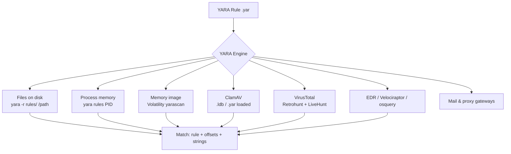
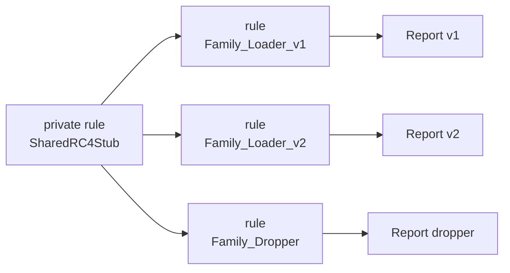
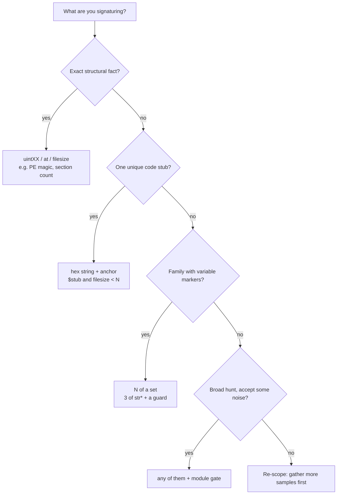
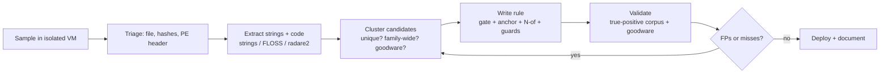
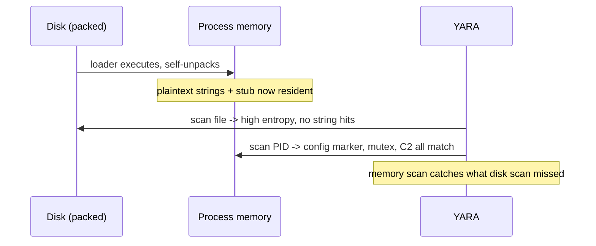
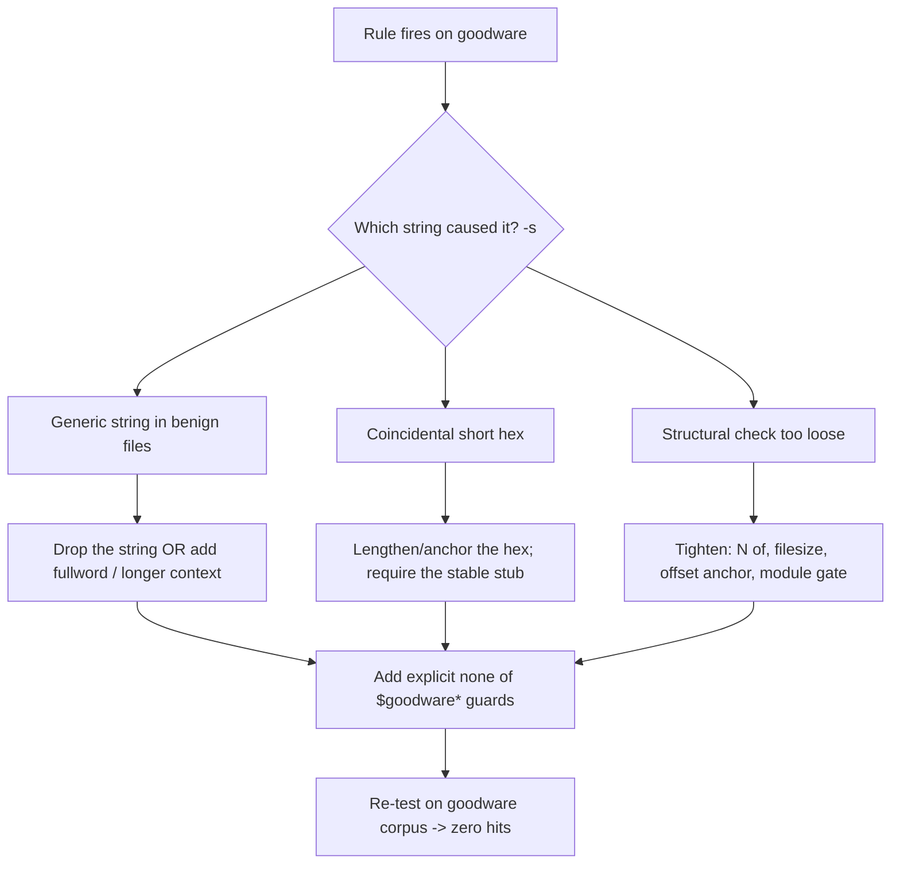

This is Chapter 3 of the Detection Engineering notebook. The previous chapters gave you two of the three legs a detection program stands on: **behavioural** detection with Sigma (Chapter 1) and **endpoint telemetry** with Sysmon, Osquery, and Velociraptor (Chapter 2). Sigma answers "what did the process *do*?" YARA answers a different, complementary question: "what *is* this file, and does it look like something I already know is bad?" It is the language malware analysts, threat hunters, and incident responders use to **describe a family of files or an in-memory pattern once, and then find every instance of it** across a single sample, a terabyte of disk, a memory image, or the entire submission stream of VirusTotal.

YARA is often called "the pattern-matching swiss army knife for malware researchers," and that is the honest one-line summary: it is a small, fast, portable engine that takes **rules** — human-readable descriptions built from strings and a boolean condition — and scans bytes against them. It does not care whether those bytes come from a file on disk, a running process's memory, a packet capture you carved, or a firmware blob. That generality is why YARA shows up everywhere in defensive work: ClamAV loads YARA rules, VirusTotal runs your rules retroactively against its corpus (Retrohunt) and prospectively on every new upload (LiveHunt/hunting), EDRs ship YARA engines, Velociraptor and osquery expose YARA scanning as first-class capabilities, and every serious threat-intel report ends with a YARA rule you can deploy the same afternoon.

We teach the tool from zero: what YARA is, how to install and run it, then the **rule anatomy** field by field — `meta`, `strings`, `condition` — followed by the three string types (text, hexadecimal, regular expression) and *every* modifier that changes how they match. From there we go deep on the **condition mini-language**: counts, offsets, `at`/`in`, `filesize`, the `of` and `for..of` quantifiers, and the string-set loops that separate a brittle rule from a resilient one. We cover the **module system** (`pe`, `elf`, `math`, `hash`, `dotnet`, `time`) that lets a rule reason about file structure and entropy rather than raw bytes, then scale up: scanning disk and memory, integrating with ClamAV / VirusTotal / Velociraptor / osquery / Loki / Fenrir, and the newer Rust rewrite **YARA-X**. A full hands-on lab takes a benign lab sample, extracts candidate strings, authors a family rule, tests it against goodware to kill false positives, and tunes it for performance. We close with a consolidated Detection & Defense section, a final revision, a cheat sheet, and topic-specific practice.

The framing note, as always on the blue-team track: YARA is a **defensive and analytical** tool. We write rules to *detect and hunt* malware on systems we defend or samples we are authorised to analyse. The one place caution is warranted is where you *test* rules — do that against samples in an isolated analysis VM you own (a detonation lab, a disconnected snapshot), never by downloading live malware onto a production or personal machine. Everything in this chapter can be practised safely with the benign EICAR test file, open malware-analysis corpora you are licensed to use, and your own goodware.

We build from what YARA is and how to run it, through rule anatomy, strings and modifiers, the condition language, modules, string-extraction and authoring, scaling to disk and memory, ecosystem integrations, YARA-X, false-positive tuning and performance, then a full extract-author-test-tune lab, a consolidated Detection & Defense section, a final revision, a cheat sheet, and practice.

## Part 1: What YARA Is — and Where It Fits in Detection

YARA (the name is a recursive-ish backronym its author Victor Alvarez has glossed as "Yet Another Recursive Acronym" and, jokingly, "YARA: Another Recursive Acronym") is a **rule-based pattern-matching engine** created at VirusTotal. You feed it two things — a set of **rules** and a **target** (a file, a directory, or a process ID) — and it tells you which rules matched which targets. A rule is a tiny program with three parts: a `meta` block of documentation, a `strings` block declaring the byte patterns you care about, and a `condition` — a boolean expression over those strings (and over file properties) that decides whether the rule fires.

Where does this sit relative to the other detections you have built? Think in terms of **what artefact the detection reasons over**:

| Detection type | Reasons over | Example question | Chapter |
|---|---|---|---|
| Signature/behavioural (Sigma) | Log events / process telemetry | "Did a process spawn `cmd.exe` with an encoded PowerShell command?" | Ch. 1 |
| Endpoint telemetry (Sysmon/EDR) | Event streams from the host | "Did anything read LSASS memory?" | Ch. 2 |
| **Content signature (YARA)** | **Raw bytes of a file or memory region** | **"Does this file *contain the code/strings* of the AsyncRAT family?"** | This chapter |
| Network signature (Snort/Suricata) | Packet payloads | "Does this flow carry the Cobalt Strike default profile?" | Ch. 10 (SOC nb) |
| IOC matching (hashes/domains) | Exact indicators | "Is this file's SHA-256 on my blocklist?" | — |

The crucial distinction from plain **hash IOCs**: a SHA-256 matches *exactly one* file; change a single byte and it is useless. YARA matches **families** — the shared code stubs, decryption routines, embedded config markers, unique strings, and structural quirks that survive recompilation and minor obfuscation. One good YARA rule can catch thousands of variants a hash blocklist would miss. That resilience is the entire reason YARA exists and the reason it belongs in a detection-engineering toolkit next to Sigma rather than in the "just block the hash" bucket.

**Where YARA runs (the same rule, many surfaces):**



**The four jobs YARA does in a blue-team program:**

1. **Triage & classification.** An analyst drops an unknown sample into a folder of thousands of family rules; the matches immediately say "this is Emotet's loader" or "this is a generic UPX-packed PE with an embedded RC4 key." This is the malware-analyst use case.
2. **Threat hunting.** You take a rule from a fresh intel report and sweep your whole estate for it — disk and memory — to answer "are we already compromised?" This is the incident-responder / hunter use case (Velociraptor's `yara()` and osquery's `yara` table exist for exactly this).
3. **Detection at ingress.** Rules run on the mail gateway, the proxy, the sandbox, or the EDR so known-bad content is blocked or flagged as it arrives.
4. **Retro-hunting at scale.** VirusTotal Retrohunt runs your rule against the last ~12 months of the global corpus; LiveHunt runs it on every *future* upload and emails you matches. This is how intel teams discover new variants of a family they track.

**Red-team / adversary awareness (woven in, per the reference style):** offensive operators care about YARA because it is what flags their tooling. "YARA-safe" is a design goal for mature implants — no long unique ASCII strings, config encrypted at rest, sleeping payloads XOR'd in memory, staged so the disk artefact carries little signal. Understanding *how* rules match (which is most of this chapter) is exactly what lets a defender write rules that survive those evasions, and what lets an offense engineer understand why their beacon got caught. We will call out the evasion/counter-evasion tension inline as we hit each mechanism.

## Part 2: Installing and Running YARA From Scratch

YARA is a C library (`libyara`) plus a command-line tool (`yara`) and a rule-compiler (`yarac`). There are official Python bindings (`yara-python`) and, increasingly, the ground-up Rust rewrite **YARA-X** (`yr`) which we treat in Part 12. Start with classic YARA because virtually every rule and integration in the wild targets it.

**Install on Kali / Debian / Ubuntu:**

```bash
# Package (fast, may lag a version behind)
sudo apt update
sudo apt install -y yara

# Verify
yara --version           # e.g. 4.5.1
yara --help | head -20
```

**Install the latest from source (when you need current modules/features):**

```bash
sudo apt install -y automake libtool make gcc pkg-config \
    libssl-dev libjansson-dev libmagic-dev flex bison
wget https://github.com/VirusTotal/yara/archive/refs/tags/v4.5.1.tar.gz
tar -xzf v4.5.1.tar.gz && cd yara-4.5.1
./bootstrap.sh
./configure --enable-cuckoo --enable-magic --enable-dotnet
#   --enable-cuckoo  : cuckoo sandbox module (behavioural conditions)
#   --enable-magic   : libmagic "magic" module (file-type conditions)
#   --enable-dotnet  : .NET metadata module (for managed malware)
make -j"$(nproc)"
sudo make install
sudo ldconfig            # refresh the shared-library cache so libyara is found
yara --version
```

**Python bindings** (for automation, the lab, and CI):

```bash
pip install yara-python --break-system-packages
python3 -c "import yara; print(yara.YARA_VERSION)"
```

**The `yara` command line, flag by flag.** The general form is `yara [OPTIONS] RULES_FILE TARGET`, where TARGET is a file, a directory, or a PID:

```bash
yara myrule.yar suspicious.bin
```

| Flag | Meaning | Why you use it |
|---|---|---|
| `-r`, `--recursive` | Recurse into subdirectories | Scan a whole tree, not one file |
| `-s`, `--print-strings` | Print the matching strings and their offsets | The single most useful flag for tuning — shows *why* it matched |
| `-m`, `--print-meta` | Print the rule's `meta` fields on a hit | Surfaces author/description/reference for triage |
| `-g`, `--print-tags` | Print rule tags | Filter output by tag category |
| `-e`, `--print-namespace` | Print the namespace | Disambiguate rules with the same name |
| `-p N`, `--threads=N` | Use N scanner threads | Parallelise big disk sweeps |
| `-f`, `--fast-scan` | Stop at the first match of each string | Faster, but you lose per-occurrence offsets |
| `-w`, `--no-warnings` | Suppress warnings (slow-rule, deprecated) | Quiet CI output — but read warnings first |
| `-d NAME=VALUE` | Define an external variable | Feed context (filepath, filetype) into conditions |
| `-t TAG`, `--tag=TAG` | Only report rules with this tag | Run just the `ransomware` rules |
| `-i IDENT`, `--identifier` | Only use the rule with this name | Test one rule from a big file |
| `-c`, `--count` | Print only the number of matches | Quick "how many hits?" |
| `-n`, `--negate` | Print rules that did *not* match | Find files missing an expected marker |
| `-x MODULE=FILE` | Pass module data (e.g. cuckoo report) to a module | Behavioural conditions |
| `--scan-list` | Treat TARGET as a file listing paths to scan | Feed a curated file list |
| `-a N`, `--timeout=N` | Abort scanning a target after N seconds | Bound worst-case regex cost |
| `-z N`, `--max-strings-per-rule` | Raise the per-rule string cap | Big generated rules |

**Your first scan** — always start with the EICAR test file, the industry-standard *benign* anti-malware test string, so nothing dangerous is involved:

```bash
# Create the standard EICAR test file (benign; AV flags it by agreement)
printf 'X5O!P%%@AP[4\\PZX54(P^)7CC)7}$EICAR-STANDARD-ANTIVIRUS-TEST-FILE!$H+H*' > eicar.com
```

A minimal rule to detect it:

```yara
rule EICAR_Test_File
{
    meta:
        description = "Detects the benign EICAR anti-malware test string"
        reference   = "https://www.eicar.org/download-anti-malware-testfile/"
        author      = "detection-eng"

    strings:
        $eicar = "EICAR-STANDARD-ANTIVIRUS-TEST-FILE!"

    condition:
        $eicar
}
```

Run it with the tuning flags on:

```bash
yara -s -m eicar.yar eicar.com
```

```text
EICAR_Test_File eicar.com
description="Detects the benign EICAR anti-malware test string" reference="https://www.eicar.org/download-anti-malware-testfile/" author="detection-eng"
0x21:$eicar: EICAR-STANDARD-ANTIVIRUS-TEST-FILE!
```

Read that output: the rule name and file on line 1; the `-m` meta on line 2; and because of `-s`, line 3 shows the match at **offset `0x21`**, the string identifier (`$eicar`), and the exact bytes that matched. Offsets and matched bytes are what you will live in when tuning rules.

**Compiling rules for speed and distribution** — `yarac` precompiles text rules into a binary blob so the engine skips parsing at scan time (valuable when you scan millions of files):

```bash
yarac eicar.yar eicar.yarc      # compile
yara  eicar.yarc eicar.com       # scan with the compiled rules
```

**Blue-team note:** compiled rules also travel well to endpoints where you do not want to ship source, and they fail *closed* — a syntactically broken rule won't silently no-op, because compilation happens up front. Always compile in CI as a lint step even if you deploy source.

## Part 3: Rule Anatomy — `meta`, `strings`, `condition`

Every YARA rule has the same skeleton. Learn it once and every rule in every intel report reads the same:

```yara
import "pe"                       // optional: pull in a module

rule Family_Component_Variant : tag1 tag2   // name + optional tags
{
    meta:
        // documentation only — never affects matching
        author      = "detection-eng"
        date        = "2027-02-26"
        description = "What this rule catches and why"
        reference   = "https://intel.example/report"
        hash        = "e3b0c44298fc1c149afbf4c8996fb924..."
        tlp         = "TLP:CLEAR"
        malpedia    = "win.family"

    strings:
        // named byte patterns; identifiers begin with $
        $s1 = "unique config marker" ascii wide
        $s2 = { 6A 40 68 00 30 00 00 }          // hex bytes
        $re = /https?:\/\/[a-z0-9.]+\/gate\.php/ nocase

    condition:
        // boolean expression that decides the match
        uint16(0) == 0x5A4D          // "MZ" — a PE file
        and pe.number_of_sections > 3
        and 2 of ($s*)
}
```

**The three blocks:**

- **`meta`** is pure documentation: `key = value` pairs (string, integer, or boolean values). It never participates in matching. But it is not optional in practice — the `description`, `author`, `date`, `reference`, and `hash` fields are what make a rule maintainable and are surfaced by `-m` on every hit. A rule with no meta is a liability in six months. Convention (used by Florian Roth's rules, the de-facto community style) is to always include at least `description`, `author`, `date`, `reference`, and one or more sample `hash` values.
- **`strings`** declares the patterns. Each has an **identifier** starting with `$` (or referenced with `#`, `@`, `!` in the condition — see Part 5). You can also use `_` and digits after the `$`. Strings come in three flavours — text, hex, regex — covered in Part 4. The `strings` block is optional *only* if your condition relies solely on modules/`filesize`/`uintXX` (a valid but rarer style).
- **`condition`** is mandatory and is the heart of the rule: a boolean expression. If it evaluates true for a target, the rule matches. It can reference string identifiers (a bare `$s1` means "s1 appears at least once"), counts (`#s1`), offsets (`@s1`), string sets (`2 of ($s*)`), file properties (`filesize`, `uint32(0)`), and module fields (`pe.entry_point`).

**Rule identifiers and tags.** The rule name must be a valid C-style identifier (letters, digits, underscore; not starting with a digit) and unique within its namespace. **Tags** after a colon (`: ransomware windows`) let you filter at scan time with `-t ransomware`. A widely used naming convention encodes intent: `APT_Backdoor_Family_Variant`, `MAL_Ransomware_LockBit`, `SUSP_PS_Encoded_Command`, `HKTL_Mimikatz` — a category prefix (`APT`/`MAL`/`SUSP`/`HKTL`/`WEBSHELL`/`PUA`), then the family and specifics. Consistent naming is what makes a 10,000-rule repository navigable.

**Rule modifiers:** a rule can be declared `private` (it can be referenced by other rules' conditions but never reported on its own) or `global` (it applies to *every* rule in the file — commonly used to gate everything behind a file-size or file-type check for performance):

```yara
global private rule OnlyPEFiles
{
    condition:
        uint16(0) == 0x5A4D and filesize < 20MB
}
```

Every other rule in that file now only even gets evaluated on sub-20 MB PE files — a huge performance win on big disk scans, and a common first line in production rule packs.

**Rules referencing rules.** A condition can name another rule; it is true if that rule matched. This lets you build a base rule for a family's shared loader and specialise variants on top:



```yara
private rule SharedRC4Stub {
    strings:
        $rc4 = { 8A 04 3? 88 04 3? }        // shared decrypt loop fragment
    condition:
        $rc4
}

rule Family_Loader_v1 {
    strings:
        $v1 = "v1.0-loader"
    condition:
        SharedRC4Stub and $v1
}
```

This composition — private base rules plus public specialisations — is the single most important *structural* pattern for maintainable family coverage, and it is exactly what large public repos (Florian Roth's `signature-base`, Elastic's `protections-artifacts`, Neo23x0's rules) use.

## Part 4: Strings — Text, Hex, Regex, and Every Modifier

The `strings` block is where most of a rule's *signal* lives. There are three kinds of string, and a set of modifiers that dramatically change how each matches. Getting modifiers right is the difference between a rule that catches a whole family and one that catches only the single sample you looked at.

### 4.1 Text strings

The simplest form — a quoted ASCII/UTF-8 literal:

```yara
strings:
    $a = "cmd.exe /c"
    $b = "SELECT * FROM users"
```

By default a text string matches only the exact ASCII bytes. Modifiers change that:

| Modifier | Effect | Example / note |
|---|---|---|
| `nocase` | Case-insensitive | `"powershell" nocase` matches `PowerShell`, `POWERSHELL` |
| `wide` | Match the UTF-16LE form (each char followed by `00`) | Windows APIs and Unicode strings — **essential** for Windows malware |
| `ascii` | Match the plain ASCII form | Default *unless* `wide` is given alone; specify both `ascii wide` to match either |
| `fullword` | Only match when bounded by non-alphanumeric bytes | `"admin" fullword` won't match inside `badminton` |
| `xor` | Match all 256 single-byte XOR variants | Catches trivially XOR-obfuscated strings; `xor(0x01-0xff)` bounds the range |
| `base64` | Match the base64-encoded form of the string | Finds the string even when embedded base64-encoded |
| `base64wide` | base64 of the UTF-16 form | For base64'd wide strings |
| `private` | The string can match but is never printed by `-s` | Hide sensitive strings in shared rules |

**The `wide` trap that catches every beginner.** Windows stores most strings as UTF-16LE, so a rule with a bare ASCII `"malware.dll"` will *miss* the sample entirely even though the string is right there — because on disk it is `m\x00a\x00l\x00w\x00...`. The habit that saves you: for Windows targets, default to `ascii wide` unless you have a specific reason not to.

```yara
$mutex = "Global\\MyBotnetMutex" ascii wide fullword
```

**The `xor` and `base64` modifiers are how you defeat cheap obfuscation** (this is the counter-evasion point). Malware frequently stores its C2 URL or mutex name XOR-encoded with a single byte, or base64-encoded in a config blob. Instead of guessing the key, let YARA try them all:

```yara
strings:
    // catches the URL even if single-byte XOR'd or base64'd at rest
    $c2  = "http://gate.evil.tld/panel" xor(0x01-0xff)
    $b64 = "http://gate.evil.tld/panel" base64
condition:
    any of them
```

**Offense/counter-offense note:** `xor` only defeats *single-byte* XOR. Mature loaders use multi-byte keys, RC4, or AES precisely so a string-based rule cannot recover the plaintext — which is why hex code-pattern rules (next) and structural/entropy conditions (Part 6) matter for those families.

### 4.2 Hexadecimal strings

Hex strings match raw bytes and are how you signature **code** rather than text — a decryption stub, an API-hashing loop, a specific opcode sequence. They support three powerful constructs:

```yara
strings:
    // exact bytes
    $stub = { 55 8B EC 83 EC 20 53 56 57 }

    // wildcards: ? = any nibble, ?? = any byte
    $api  = { 6A 40 68 ?? ?? ?? ?? 68 }

    // jumps: [n] = skip exactly n bytes, [n-m] = skip n..m, [n-] = n or more
    $dec  = { E8 [4] 8B 45 [1-4] 33 }

    // alternatives: (A | B) = match either byte sequence at this position
    $alt  = { FF 15 ( 90 90 | 60 61 ) 8B }
```

| Hex construct | Meaning | Use case |
|---|---|---|
| `AB CD` | Exact bytes | Fixed opcodes / magic |
| `?` | Any single nibble | `4?` matches `40`–`4F` |
| `??` | Any full byte | Bytes that vary between builds |
| `[4]` | Skip exactly 4 bytes | Fixed-size operand you don't care about |
| `[2-8]` | Skip 2 to 8 bytes | Variable padding/operands |
| `[10-]` | Skip 10 or more bytes | Unbounded gap (use sparingly — slow) |
| `( A \| B )` | Alternation | Two known compiler variants of the same stub |

**Why hex beats text for resilient rules:** attackers change strings trivially (rename the mutex, re-encode the URL) but the *compiled code* of a custom packer, a hashing routine, or a config-decrypt loop is far more stable across builds. A well-chosen hex pattern over the decryption stub survives string changes and even minor recompilation if you wildcard the volatile operands. This is why reverse-engineers extract code-based signatures, not just strings.

> **Pitfall:** unbounded jumps like `[0-]` or very short hex patterns (`{ FF 15 }`) force the engine to try huge numbers of positions and are the classic cause of "slow rule" warnings and scan timeouts. Anchor hex strings with at least ~4 non-wildcard bytes and bound your jumps.

### 4.3 Regular-expression strings

Regexes are written between slashes and match text patterns with variability — a URL shape, a version-string format, a mutex naming scheme:

```yara
strings:
    $url  = /https?:\/\/[a-z0-9.-]{4,60}\/[a-z0-9_]{2,20}\.php/ nocase
    $ver  = /Bot[- ]?v[0-9]{1,2}\.[0-9]{1,2}/
    $guid = /\{[0-9A-F]{8}-[0-9A-F]{4}-[0-9A-F]{4}-[0-9A-F]{4}-[0-9A-F]{12}\}/ nocase
```

Regex modifiers: `nocase` (case-insensitive) and `wide`/`ascii` (as with text). YARA regex supports the usual metacharacters (`.`, `*`, `+`, `?`, `[]`, `|`, `{n,m}`, anchors `^`/`$`) but **not** backreferences or lookahead/lookbehind — it uses a linear-time engine on purpose, so pathological backtracking is impossible, but you cannot express "match X only if followed by Y" with lookahead.

> **Regex performance pitfall:** unbounded quantifiers (`.*`, `.+`) on large binaries are expensive. Bound them (`.{0,40}`) and anchor where you can. A rule that regexes `/.*evil.*/` over every file on disk will crawl; `/[a-z]{3,20}\.evil\.tld/` is far cheaper. Always test rule performance (Part 11) before deploying broadly.

### 4.4 A worked strings block

Putting the three types together in one realistic rule skeleton (benign placeholders — this is structure, not a live sample):

```yara
rule MAL_Loader_Example : loader windows
{
    meta:
        description = "Example loader: shared stub + config marker + C2 shape"
        author      = "detection-eng"
        date        = "2027-02-26"
        reference    = "internal-analysis"

    strings:
        $mutex = "Global\\ldr_ab12" ascii wide fullword
        $cfg   = "cfg::begin" ascii
        $stub  = { 55 8B EC 81 EC ?? ?? 00 00 53 56 57 8B 7D 08 }
        $c2    = /https?:\/\/[a-z0-9.-]{4,50}\/gate\.php/ nocase
        $b64k  = "cfg::begin" base64

    condition:
        uint16(0) == 0x5A4D
        and filesize < 5MB
        and $stub
        and 2 of ($mutex, $cfg, $c2, $b64k)
}
```

## Part 5: The Condition Mini-Language

The `condition` is a full boolean expression language. Mastering it is what turns a list of strings into a precise detection. Here is the whole vocabulary, from simplest to most powerful.

### 5.1 String presence, counts, and offsets

For any string `$s` you can reference four things in the condition:

| Syntax | Meaning |
|---|---|
| `$s` | True if `$s` matches at least once |
| `#s` | The **number** of matches of `$s` (an integer) |
| `@s[i]` | The **offset** of the *i*-th match (1-based) |
| `!s[i]` | The **length** of the *i*-th match (useful for regex/variable strings) |

```yara
condition:
    #s > 3                        // the string appears more than 3 times
    and @s[1] < 0x400             // its first occurrence is in the header
    and !re[1] > 10               // the first regex match is longer than 10 bytes
```

**Practical use:** counts catch families that *repeat* a marker (e.g. a padding string written once per encrypted block); offsets pin a magic value to the header (`@magic[1] == 0`), which kills false positives from the same bytes appearing coincidentally deep in a large file.

### 5.2 Anchoring: `at` and `in`

```yara
condition:
    $mz at 0                      // string must be exactly at offset 0
    and $marker in (0..1024)      // string must appear within the first 1 KB
    and $tail in (filesize-256..filesize)   // ...or in the last 256 bytes
```

`at` requires an exact offset; `in (a..b)` requires the match to fall in a byte range. Anchoring is one of the strongest tools for precision and speed — a rule that says "this magic must be *at 0*" is both more correct and far cheaper than one that scans the whole file for it.

### 5.3 File size and integer reads

```yara
condition:
    filesize > 10KB and filesize < 2MB           // KB/MB are built-in units
    and uint16(0) == 0x5A4D                       // little-endian "MZ"
    and uint32(uint32(0x3C)) == 0x00004550        // "PE\0\0" at e_lfanew
```

`uintXX(offset)` / `intXX(offset)` read little-endian integers at an offset; `uintXXbe`/`intXXbe` read big-endian. `uint8`, `uint16`, `uint32` (and 16/32/64 variants) are your low-level structure probes. The nested read above is the canonical "is this really a PE?" check: read the `e_lfanew` pointer at `0x3C`, then read four bytes there and confirm they are the `PE\0\0` signature — more robust than trusting the `MZ` magic alone.

### 5.4 Sets and quantifiers: `of` and `for..of`

This is the single most important condition construct for **resilient** rules. Instead of `and`-ing every string (brittle — one string change breaks the rule) or `or`-ing them (loose — false positives), you require **N of a set**:

```yara
condition:
    2 of ($s1, $s2, $s3)          // any 2 of these three
    3 of ($str*)                  // any 3 strings whose id starts with $str
    any of them                   // at least one of ALL strings
    all of them                   // every string
    50% of ($a*)                  // NEW in 4.3+: percentage quantifier
    none of ($fp*)                // NONE of the false-positive guards match
```

`them` is shorthand for "all strings in this rule." The quantifier can be an integer, `any`, `all`, or a percentage. **`N of` is how you build tolerance for variants:** a family with six candidate markers where any real sample shows at least three → `3 of ($m*)` catches new builds that dropped one marker while still rejecting files that happen to contain one coincidental string.

`for..of` loops let you express conditions *over* the matches — e.g. "for any two of these strings, they all appear in the first 4 KB":

```yara
condition:
    for any i in (1..#c2) : ( @c2[i] < 0x1000 )    // some C2 match is early
    and for all of ($hdr*) : ( $ at 0 )            // every $hdr string is at offset 0
```

The general form is `for <quantifier> <var> in <range> : ( <boolean using var> )`. This is advanced but occasionally indispensable — for instance requiring that *every* member of a set appears within a bounded window, which anchors a multi-part signature.

### 5.5 A decision tree for choosing a condition shape



### 5.6 Combining it all — a precise, resilient condition

```yara
condition:
    uint16(0) == 0x5A4D                 // is a PE
    and filesize < 3MB                  // bound the target set (speed + precision)
    and $stub                           // the stable code stub must be present
    and 2 of ($marker*)                 // plus 2 of the softer markers
    and none of ($goodware*)            // but explicitly NOT if a benign guard hits
```

That shape — **structural gate → stable anchor → N-of soft markers → false-positive guards** — is the template for a production-grade rule and is exactly what we build in the lab.

## Part 6: Modules — Reasoning About Structure, Not Just Bytes

Raw string and byte matching is powerful but blind to *structure*. Modules extend the condition language with rich, parsed views of a file: the PE header, ELF sections, entropy math, cryptographic hashes, .NET metadata, and time. You enable a module with `import "name"` at the top of the file, then reference its fields in conditions. Modules are what let a rule say "the entry-point section has entropy above 7.0" (a packing tell) or "this PE is signed by a specific certificate" — facts no string can express.

### 6.1 The `pe` module — the workhorse for Windows malware

```yara
import "pe"

rule PE_Suspicious_Packed
{
    condition:
        pe.is_pe                                   // it's a valid PE
        and pe.number_of_sections < 4
        and pe.entry_point != 0
        // entry point sits in a high-entropy section (packer tell) -> see math module
        and pe.imports("KERNEL32.dll", "VirtualAlloc")
        and pe.imports("KERNEL32.dll", "LoadLibraryA")
}
```

High-value `pe` fields and functions:

| Field / function | What it gives you | Detection use |
|---|---|---|
| `pe.is_pe` | Boolean: valid PE | Structural gate (faster than `uint16(0)==0x5A4D`+checks) |
| `pe.number_of_sections` | Section count | Packed/tiny loaders often have very few |
| `pe.entry_point` | RVA→file offset of the entry point | Anchor a code stub at the real EP |
| `pe.sections[i].name / .raw_data_size / .virtual_size` | Per-section data | Detect `.text` size 0, weird section names |
| `pe.imports("dll","func")` | Is this API imported? | Behavioural intent (`VirtualAllocEx`, `WriteProcessMemory` → injection) |
| `pe.imphash()` | Import-hash of the IAT | **Family clustering** — malware from one builder shares an imphash |
| `pe.number_of_signatures`, `pe.signatures[i].issuer/subject/serial` | Authenticode signer info | Catch stolen/abused code-signing certs |
| `pe.version_info["CompanyName"]` | Resource version strings | Impersonated metadata (fake "Microsoft") |
| `pe.rich_signature.toolid(...)` | Rich header compiler fingerprint | Toolchain-based family clustering |
| `pe.timestamp` | Compile timestamp | Timeline / anomaly (future or epoch dates) |
| `pe.exports("name")` | Named export present | DLL implants, specific exported entry |
| `pe.resources[i].type / .length` | Embedded resources | Detect a dropper carrying a PE in its resources |

**`imphash` deserves special mention.** Two files compiled from the same source with the same import table produce the same import hash regardless of most string changes. Blocking or hunting by imphash is a cheap, powerful family-level pivot:

```yara
import "pe"
rule MAL_Family_ByImphash {
    condition:
        pe.imphash() == "b8bb385806b89680e13fc0cf24f4431e"
}
```

**Detecting a signed-cert abuse** (a real, current defensive pattern):

```yara
import "pe"
rule SUSP_Signed_By_Revoked_Cert {
    condition:
        for any sig in pe.signatures : (
            sig.subject contains "Compromised Vendor LLC"
        )
}
```

### 6.2 The `math` module — entropy and statistics

Packers and encryptors leave a statistical fingerprint: their output looks random (high entropy). The `math` module measures it:

```yara
import "math"
import "pe"

rule PE_HighEntropy_EntryPoint : packed
{
    meta:
        description = "PE whose entry-point section is high-entropy (packer/crypter tell)"
    condition:
        pe.is_pe
        and math.entropy(pe.sections[pe.section_index(pe.entry_point)].raw_data_offset,
                         pe.sections[pe.section_index(pe.entry_point)].raw_data_size) >= 7.0
}
```

Useful `math` functions:

| Function | Returns | Use |
|---|---|---|
| `math.entropy(offset, size)` | Shannon entropy (0–8) of a region | ≥7.0 ⇒ packed/encrypted/compressed |
| `math.mean(offset, size)` | Mean byte value | Distinguish text (~0x50) from random (~0x7F) |
| `math.deviation(offset, size, mean)` | Std-dev from a mean | Detect padding / low-variance blobs |
| `math.in_range(v, lo, hi)` | Boolean | Bounds checks in conditions |
| `math.count(byte, offset, size)` | Count of a byte value | Detect null-padding, single-byte fills |
| `math.max`, `math.min`, `math.to_number` | Helpers | Arithmetic in conditions |

> **Caveat on entropy:** legitimate compressed/installer files (Inno Setup, NSIS, .NET single-file bundles) are also high-entropy. Entropy is a *supporting* signal, never a sole condition — pair it with a structural anchor or a code stub, or you will drown in installer false positives.

### 6.3 Other modules you will meet

| Module | Enables | Example condition |
|---|---|---|
| `elf` | Parsed ELF headers/sections/symbols | `elf.number_of_sections`, `elf.entry_point` for Linux malware |
| `hash` | MD5/SHA-1/SHA-256 of file regions | `hash.sha256(0, filesize) == "..."` (exact) or hash a *section* for partial IOC |
| `dotnet` | .NET metadata (streams, GUIDs, typelib) | `dotnet.guids[0] == "..."` clusters managed malware families |
| `magic` | libmagic file typing (needs `--enable-magic`) | `magic.type() contains "PDF"` |
| `cuckoo` | Behavioural facts from a Cuckoo report | `cuckoo.network.http_request(/evil/)` |
| `time` | Current time | `time.now() > 0` (rarely used; mostly testing) |
| `console` | Debug printing during scan | `console.log("val:", pe.number_of_sections)` for rule debugging |

The `console` module is a genuinely useful *authoring* aid — sprinkle `console.log(...)` calls in a condition to print intermediate values while you tune, then strip them before deploy.

### 6.4 A structure-aware rule combining modules

```yara
import "pe"
import "math"

rule MAL_Injector_Structural : injection windows
{
    meta:
        description = "Small packed PE importing injection APIs with high-entropy body"
        author      = "detection-eng"
        date        = "2027-02-26"
    condition:
        pe.is_pe
        and pe.number_of_sections <= 4
        and filesize < 500KB
        and pe.imports("KERNEL32.dll", "VirtualAllocEx")
        and pe.imports("KERNEL32.dll", "WriteProcessMemory")
        and pe.imports("KERNEL32.dll", "CreateRemoteThread")
        and math.entropy(0, filesize) >= 6.8
}
```

Note there is **not a single string** in that rule — it reasons purely about structure and behaviour-by-import. That is a whole class of resilient detections strings cannot express, and it is why modules matter.

## Part 7: Extracting Strings and Authoring a Rule From a Sample

Writing a rule is 20% YARA syntax and 80% choosing *which* bytes to signature. This is the analyst craft: pull candidate strings and code out of a sample, decide which are unique to the family, and reject the ones that appear in goodware. The workflow:



### 7.1 Triage and extraction tools (from scratch)

**`file` and `sha256sum`** — first, know what you have:

```bash
file sample.bin           # PE32 executable (GUI) Intel 80386, for MS Windows
sha256sum sample.bin      # record the hash for the meta block
```

**`strings`** — the classic. It prints runs of printable characters. The flags that matter for malware work:

```bash
strings -n 8 sample.bin              # only runs >= 8 chars (cut noise)
strings -e l sample.bin              # 16-bit little-endian = UTF-16LE (WIDE strings!)
strings -e b sample.bin              # 16-bit big-endian
strings -a sample.bin                # scan the whole file, not just loaded sections
strings -t x sample.bin              # print the hex OFFSET of each string
```

`strings -e l` is the one beginners forget — plain `strings` misses every Unicode Windows string. Always run both `strings -n 8` (ASCII) and `strings -e l -n 8` (wide).

**FLOSS** (FireEye/Mandiant's tool) goes further: it *deobfuscates* strings that malware decodes at runtime (stack strings, XOR/RC4-encoded strings) by emulating the code — recovering plaintext that plain `strings` cannot see:

```bash
pip install flare-floss --break-system-packages
floss sample.bin                     # static + stack + tight + decoded strings
floss --only static sample.bin       # just the static strings, fast
```

**`radare2` / `rabin2`** — inspect structure and disassemble to pick a stable code stub:

```bash
rabin2 -I sample.bin      # binary info: arch, bits, endianness, canary, PIE
rabin2 -z sample.bin      # strings in the data sections (with vaddr)
rabin2 -H sample.bin      # header fields
r2 -A sample.bin          # analyse; then 'pdf @ entry0' to view the entry code
```

### 7.2 Choosing good strings (the judgement call)

For each candidate, ask three questions:

1. **Is it unique to this family?** A GUID, an odd mutex name (`Global\\xR3_ldr`), a bespoke config marker (`cfg::begin`), an attacker typo, a hardcoded C2 path (`/panel/gate.php`) — good. A Windows API name, a common error string, a compiler runtime string — bad (in *everything*).
2. **Is it stable across the family's builds?** A version banner that every build shares — good. A per-sample random name — useless for a family rule (though fine for a one-off IOC).
3. **Does it appear in goodware?** Test it (Part 8). `"This program cannot be run in DOS mode"` is in *every* PE — it is worthless as signal.

**Rank of string quality** (best → worst signal): unique code stub (hex) ≈ family config marker > distinctive C2 URL shape (regex) > unusual mutex/pipe/registry key name > imphash/rich-header (module) > common API strings (avoid alone) > generic words (never).

### 7.3 yarGen and the auto-generation shortcut (and its danger)

`yarGen` (Florian Roth) automates candidate extraction: it strings a malware sample, subtracts a huge goodware string database, and emits a draft rule of the *most unusual* strings. It is a great starting point but its output is **a draft, never a finished rule**:

```bash
git clone https://github.com/Neo23x0/yarGen.git && cd yarGen
python3 yarGen.py --update                 # download the goodware DBs (first run)
python3 yarGen.py -m /path/to/samples/ -o draft.yar \
    --excludegood                          # drop strings seen in goodware
```

**Always hand-edit yarGen output:** prune generic strings it kept, add a structural gate (`uint16(0)==0x5A4D`, `filesize<`), convert brittle full-string ANDs into `N of`, and add false-positive guards. Committing raw yarGen output is a classic way to ship a noisy rule.

### 7.4 From candidates to a rule

Suppose triage of a (benign lab stand-in) sample yielded: a wide mutex `Global\\ldr_ab12`, an ASCII config marker `cfg::begin`, a distinctive entry stub, and a C2 URL shape. You assemble the production template from Part 5.6:

```yara
rule MAL_ExampleLoader : loader windows
{
    meta:
        description = "Example loader family — mutex + config marker + entry stub"
        author      = "detection-eng"
        date        = "2027-02-26"
        reference   = "internal analysis, lab sample"
        hash        = "<sha256 of the analysed sample>"
    strings:
        $mutex = "Global\\ldr_ab12" ascii wide fullword
        $cfg   = "cfg::begin" ascii fullword
        $stub  = { 55 8B EC 81 EC ?? ?? 00 00 53 56 57 8B 7D 08 }
        $c2    = /https?:\/\/[a-z0-9.-]{4,50}\/gate\.php/ nocase
        // false-positive guards: strings the family never has but lookalikes do
        $fp1   = "Inno Setup"
        $fp2   = "Nullsoft Install System"
    condition:
        uint16(0) == 0x5A4D
        and filesize < 3MB
        and $stub
        and 2 of ($mutex, $cfg, $c2)
        and none of ($fp*)
}
```

Every clause earns its place: `uint16`/`filesize` gate and speed; `$stub` is the stable anchor; `2 of` gives variant tolerance; `none of ($fp*)` explicitly excludes the installer lookalikes that would otherwise cause false positives.

## Part 8: Hands-On Lab — Extract, Author, Test, and Tune a Rule End to End

This lab is fully reproducible on a Kali/Linux box with **no live malware** — we build our own benign "sample" so you learn the *entire* workflow safely, then apply the exact same steps to real samples in your isolated analysis VM. Every command and its realistic output is shown.

### Step 0 — Set up a clean lab directory

```bash
mkdir -p ~/yara-lab/{samples,goodware,rules} && cd ~/yara-lab
```

### Step 1 — Create a benign "sample" with signature-worthy artefacts

We craft a small file that contains the kinds of artefacts a loader would have: a wide mutex, an ASCII config marker, a fake C2 URL, and a repeated block marker. (All benign text — nothing executes.)

```bash
python3 - <<'PY'
data = b""
data += b"MZ" + b"\x90" * 62                       # fake DOS header stub
data += b"cfg::begin"                               # ASCII config marker
data += "Global\\ldr_ab12".encode("utf-16-le")     # WIDE mutex
data += b"http://gate.evil.tld/gate.php"            # C2 URL shape
data += (b"BLKMARK" * 5)                            # a repeated marker (count signal)
data += b"\x55\x8b\xec\x81\xec\x20\x01\x00\x00\x53\x56\x57\x8b\x7d\x08"  # "stub"
data += b"A" * 4096                                 # bulk padding
open("samples/loader_a.bin", "wb").write(data)
print("wrote", len(data), "bytes")
PY
```

```text
wrote 4211 bytes
```

### Step 2 — Triage and extract strings

```bash
file samples/loader_a.bin
sha256sum samples/loader_a.bin
strings -n 6 -t x samples/loader_a.bin      # ASCII with offsets
strings -e l -n 6 samples/loader_a.bin      # WIDE strings
```

Realistic output (abridged):

```text
samples/loader_a.bin: data
7d0c...e91a  samples/loader_a.bin
      40 cfg::begin
      6a http://gate.evil.tld/gate.php
      8a BLKMARKBLKMARKBLKMARKBLKMARKBLKMARK
--- wide ---
Global\ldr_ab12
```

Note how the mutex only appears in the *wide* pass — exactly the beginner trap from Part 4. Record the candidate artefacts: `cfg::begin`, `Global\ldr_ab12` (wide), the `gate.php` URL, the repeated `BLKMARK`, and the entry stub bytes.

### Step 3 — Write the first draft rule

```bash
cat > rules/loader_a.yar <<'YAR'
rule MAL_ExampleLoader_A : loader lab
{
    meta:
        description = "Lab loader sample A — mutex, config marker, C2, stub"
        author      = "detection-eng"
        date        = "2027-02-26"
        reference   = "yara-lab step 3"
    strings:
        $mutex = "Global\\ldr_ab12" ascii wide fullword
        $cfg   = "cfg::begin" ascii
        $blk   = "BLKMARK"
        $c2    = /https?:\/\/[a-z0-9.-]{4,50}\/gate\.php/ nocase
        $stub  = { 55 8B EC 81 EC ?? ?? 00 00 53 56 57 8B 7D 08 }
    condition:
        uint16(0) == 0x5A4D
        and filesize < 1MB
        and $stub
        and 2 of ($mutex, $cfg, $c2)
        and #blk >= 3
}
YAR
```

### Step 4 — Test against the sample (should MATCH)

```bash
yara -s -m rules/loader_a.yar samples/loader_a.bin
```

```text
MAL_ExampleLoader_A samples/loader_a.bin
description="Lab loader sample A — mutex, config marker, C2, stub" author="detection-eng" date="2027-02-26" reference="yara-lab step 3"
0x40:$cfg: cfg::begin
0x8a:$blk: BLKMARK
0x91:$blk: BLKMARK
0x98:$blk: BLKMARK
0x9f:$blk: BLKMARK
0xa6:$blk: BLKMARK
0xb1:$stub: 55 8B EC 81 EC 20 01 00 00 53 56 57 8B 7D 08
0x4c:$mutex: G\x00l\x00o\x00b\x00a\x00l\x00\\x00l\x00d\x00r\x00...
0x6a:$c2: http://gate.evil.tld/gate.php
```

It matches, and `-s` shows every offset — including five `$blk` hits (so `#blk >= 3` is satisfied) and the wide mutex printed with interleaved `\x00`. Good.

### Step 5 — Build a goodware corpus and test for FALSE POSITIVES

The most important test: run the rule against known-benign files and confirm **zero** matches. Grab a pile of real goodware (system binaries are perfect and abundant):

```bash
cp /usr/bin/* goodware/ 2>/dev/null
cp /bin/* goodware/ 2>/dev/null
ls goodware | wc -l                 # e.g. 900 files
yara -r rules/loader_a.yar goodware/
echo "exit: $?"
```

```text
exit: 0
```

No output = no matches = no false positives across ~900 real binaries. If a benign file *had* matched, `-s` would show which string caused it and you would add a guard or tighten the anchor.

### Step 6 — Introduce a variant and prove resilience

Real families mutate. Make "sample B" that *drops the config marker* and *changes the mutex* but keeps the stub and C2 — a realistic new build:

```bash
python3 - <<'PY'
data  = b"MZ" + b"\x90"*62
data += "Global\\ldr_XX99".encode("utf-16-le")   # changed mutex
data += b"http://c2.newhost.tld/gate.php"          # changed host, same path shape
data += b"\x55\x8b\xec\x81\xec\x20\x01\x00\x00\x53\x56\x57\x8b\x7d\x08"  # same stub
data += b"BLKMARK"*4 + b"B"*2048
open("samples/loader_b.bin","wb").write(data)
PY
yara -s rules/loader_a.yar samples/loader_b.bin
```

```text
MAL_ExampleLoader_A samples/loader_b.bin
0x40:$blk: BLKMARK
...
0x50:$stub: 55 8B EC 81 EC 20 01 00 00 53 56 57 8B 7D 08
0x?? :$c2: http://c2.newhost.tld/gate.php
```

Sample B still matches — because the condition required the **stub** plus **2 of** the soft markers, and B kept the stub, the C2 shape, and the repeated `BLKMARK`. A brittle rule that `and`-ed all five strings would have missed this variant entirely. **This is the payoff of `N of` and anchoring**: the rule generalises to the family, not just the one sample.

### Step 7 — Tune for performance and lint

Check the rule compiles cleanly and time a broad scan:

```bash
yarac rules/loader_a.yar rules/loader_a.yarc     # compile = lint; no output = clean
yara -w rules/loader_a.yar goodware/             # -w shows slow-rule warnings if any
time yara -r rules/loader_a.yar /usr             # broad sweep, measure
```

```text
real    0m0.42s
user    0m0.30s
sys     0m0.11s
```

Sub-second across `/usr` because the `uint16(0)==0x5A4D and filesize<1MB` gate rejects most files before any expensive string matching runs. **That gate is the performance lesson** — cheap structural checks first, expensive string/regex matching only on candidates that pass.

### Step 8 — Automate testing in Python (CI-ready)

Wire the true-positive/goodware test into a script you can run in CI on every rule change:

```python
#!/usr/bin/env python3
import yara, sys, pathlib

rules = yara.compile(filepath="rules/loader_a.yar")   # raises on syntax error

# Must-match set
must_hit = ["samples/loader_a.bin", "samples/loader_b.bin"]
# Must-NOT-match set
goodware = list(pathlib.Path("goodware").glob("*"))

failed = False
for f in must_hit:
    if not rules.match(f):
        print(f"[FAIL] expected match, got none: {f}"); failed = True

fp = [str(g) for g in goodware if rules.match(str(g))]
if fp:
    print(f"[FAIL] {len(fp)} false positives:", fp[:5]); failed = True

print("PASS" if not failed else "FAILURES ABOVE")
sys.exit(1 if failed else 0)
```

```bash
python3 test_rule.py
```

```text
PASS
```

You now have the complete loop — extract, author, true-positive test, goodware test, variant test, performance check, and automated regression — which is exactly how a detection-engineering team maintains a rule repository. Apply the identical steps to real samples inside your isolated analysis VM.

## Part 9: Scaling YARA — Disk, Memory, and Live IR

A rule that matches one sample is table stakes. The reason YARA is a *hunting* tool is that the same rule runs against enormous, live targets. Three surfaces matter.

### 9.1 Disk sweeps

```bash
# Recurse an entire volume with a whole rule directory, multi-threaded,
# printing meta + tags, bounded per-file timeout.
yara -r -p 8 -m -g -a 60 rules/ /                 # 8 threads, 60s/file cap
# Curate the target list instead of walking everything:
find /home /opt /srv -type f -size -20M > targets.txt
yara --scan-list rules/index.yar targets.txt
```

`rules/index.yar` is a convention: one file that `include`s every rule so you load the whole pack in one shot:

```yara
include "./loaders/loader_a.yar"
include "./ransomware/lockbit.yar"
include "./webshells/php_generic.yar"
```

**IR use case:** on a suspected-compromised host you mount the disk image read-only and sweep it with your full family pack plus the fresh intel-report rules — this is how you answer "which known families touched this box, and where are the artefacts?" in minutes.

### 9.2 Process-memory scanning

The highest-value target, because **memory defeats packing**. A packed loader on disk is a high-entropy blob your string rules can't read — but once it runs, it *unpacks itself into memory*, and your plaintext strings/stubs reappear. Scan a live PID:

```bash
sudo yara -s rules/loader_a.yar 1337        # scan process 1337's memory
sudo yara -r rules/ $(pgrep -d' ' -f suspicious)   # scan several PIDs
```



**This is a core hunting principle:** always pair disk rules with memory scanning. Many families are only catchable in memory. It is also why EDRs run YARA against process memory on suspicious behaviour, and why "memory-only" implants still get caught — they have to be resident to run.

### 9.3 Memory images (offline forensics)

For a captured RAM image, use YARA through a forensics framework so matches map back to processes:

```bash
# Volatility 3 — scan a memory image, attributing hits to processes
vol -f memdump.raw yarascan.YaraScan --yara-file rules/loader_a.yar
# Volatility 2 equivalent:
vol.py -f memdump.raw --profile=Win10x64 yarascan -y rules/loader_a.yar
```

Volatility's `yarascan` reports the *process* and *virtual address* of each hit — so a match isn't just "these bytes exist," it is "PID 4123 (svchost.exe) has the AsyncRAT config at 0x1A40000," which is directly actionable in an investigation.

## Part 10: Ecosystem Integrations — Where Your Rules Actually Run

Writing a rule is half the job; the value comes from wiring it into the places that scan continuously.

| Integration | What it does | How rules get there |
|---|---|---|
| **ClamAV** | Open-source AV loads YARA rules alongside its own sigs | Drop `.yar`/`.yara` in the ClamAV DB dir; `clamscan` honours them |
| **VirusTotal Retrohunt** | Runs your rule over the last ~12 months of the global corpus | Paste rule in VT Hunting → Retrohunt; get matching samples |
| **VirusTotal LiveHunt** | Runs your rule on *every new upload*, emails matches | VT Hunting → LiveHunt ruleset; notifications feed intel |
| **Velociraptor** | Fleet-wide live hunting via VQL `yara()` | `Generic.Detection.Yara` artifact / `yara()` VQL over files or process memory |
| **osquery** | SQL `yara` table scans files/PIDs on schedule | `SELECT * FROM yara WHERE path='...' AND sigfile='...'` |
| **Loki / Fenrir / THOR** | Roth's IOC+YARA scanners for standalone host triage | Bundle rules; run the scanner on a host during IR |
| **YARA-X `yr`** | Faster engine, better diagnostics | Same rules (with minor syntax caveats), `yr scan` |
| **EDRs (many)** | Vendor engines accept custom YARA | Upload via the console; run on files/memory |

**ClamAV** in practice — the cheapest way to run YARA continuously on Linux mail/file servers:

```bash
sudo cp rules/loader_a.yar /var/lib/clamav/
clamscan --database=/var/lib/clamav/ -r /var/spool/mail/
```

**Velociraptor** fleet hunt — the incident-responder's scale button. A single VQL query scans YARA across thousands of endpoints and returns hits centrally:

```sql
SELECT FullPath, Rule, String.Name, String.Offset
FROM yara(
    files=glob(globs="C:/Users/**/AppData/**/*.exe"),
    rules=YaraRule)
WHERE Rule =~ "MAL_ExampleLoader"
```

**osquery** scheduled scan:

```sql
SELECT path, matches, count
FROM yara
WHERE path LIKE '/home/%/Downloads/%'
  AND sigfile = '/etc/osquery/yara/loader_a.yar';
```

**The intel loop:** a fresh report drops with a YARA rule → you push it to VT LiveHunt (catch future variants globally), Velociraptor (sweep your fleet now), and ClamAV/EDR (block at ingress). One rule, deployed to every surface, is the whole point of a portable content signature.

## Part 11: YARA-X — the Rust Rewrite

**YARA-X** is a from-scratch reimplementation of YARA in Rust by the original author, designed to be faster, safer (no C memory bugs), and more maintainable, while staying rule-compatible for the vast majority of rules. It is production-usable and is where the ecosystem is heading, so know it exists and how it differs.

```bash
# Install (cargo) or grab a release binary
cargo install yara-x-cli          # provides the `yr` command
yr --version
yr scan rules/loader_a.yar samples/loader_a.bin      # same idea, new CLI
yr compile rules/loader_a.yar -o loader_a.yarc
yr fmt rules/loader_a.yar          # a real formatter — auto-tidies rules
```

What changes for a rule author:

- **Better errors and warnings** — YARA-X gives Rust-compiler-quality diagnostics (points at the exact token), plus a `yr fmt` formatter and richer slow-rule warnings.
- **Performance** — typically faster scanning, especially on large rule sets, thanks to a redesigned matching engine.
- **Mostly compatible, a few breaking changes** — some deprecated/loosely-defined behaviours were tightened (e.g. stricter handling of certain regex constructs and negative conditions). Run your existing pack through `yr` and read the warnings before switching.
- **Same modules** — `pe`, `elf`, `math`, `hash`, `dotnet`, etc. are supported.

**Recommendation:** keep authoring in the standard syntax (still the lingua franca of intel reports), lint with both `yarac` and `yr compile`/`yr fmt`, and adopt `yr` for scanning where its speed and diagnostics help. Treat YARA-X as the target runtime and classic YARA as the source-of-truth format for now.

## Part 12: Killing False Positives and Tuning Performance

A rule that fires on goodware is worse than no rule — it burns analyst time and trains people to ignore alerts. Two disciplines keep rules healthy.

### 12.1 False-positive reduction



Concrete tactics, in order of preference:

1. **Anchor and gate.** Add `uint16(0)==0x5A4D`, `filesize<N`, `$magic at 0`, or a `pe.is_pe` gate so the rule only even considers plausible targets.
2. **Require a stable, unique anchor** (a code stub or a bespoke marker) with `and`, then use `N of` for the softer strings — never `or` a pile of generic strings.
3. **Add `fullword`** to text strings so `admin` doesn't match inside `badminton`.
4. **Explicit negative guards** — `and none of ($goodware*)` where the `$goodware*` strings are markers found in the benign lookalikes (installer banners, framework names).
5. **Lengthen weak patterns** — a 3-byte hex or a 4-char string is almost always too generic; aim for anchors with high information content.
6. **Test against a real, large goodware corpus every time** — system binaries, common apps, your own gold image. Zero FPs on that corpus is the bar before deploy.

### 12.2 Performance tuning

YARA's Aho-Corasick pre-filter makes literal strings cheap, but some patterns are pathological. The rules of performance:

| Do | Avoid | Why |
|---|---|---|
| Gate with `uint16`/`filesize`/`pe.is_pe` first | Running string matching on every byte of every file | Cheap checks reject non-candidates early |
| Anchor hex with ≥4 fixed bytes | `{ FF 15 }` or `{ ?? ?? ?? ?? }` | Short/wildcard-heavy atoms explode the search |
| Bound jumps `[2-8]` | `[0-]` unbounded jumps | Unbounded jumps try every position |
| Bound regex quantifiers `.{0,40}` | `.*`, `.+` on binaries | Greedy scans over large files are slow |
| Use `global private` file-type gates | Repeating the gate in every rule | One gate short-circuits the whole pack |
| Prefer literal strings over regex when possible | Regex for a fixed string | Literals hit the fast Aho-Corasick path |

**Measuring slow rules:** YARA warns about likely-slow rules at compile time (`-w` off to see them); YARA-X's diagnostics are sharper. Profile a broad scan with `time`, and if one rule dominates, its atoms are too generic — add fixed anchor bytes.

```bash
yarac rules/pack.yar /dev/null        # surfaces "string X may slow down scanning"
time yr scan rules/pack.yar /usr      # measure the whole pack
```

## Part 13: Detection & Defense Angle (Consolidated)

Pulling the defensive program together: YARA is not a one-off analyst toy but a maintained pipeline that spans intake, authoring, testing, deployment, and feedback — exactly like the Sigma detection-as-code lifecycle from Chapter 1, applied to *content* signatures.

**Where YARA sits in the defensive stack.**

- **Intake / triage:** every sample that reaches the SOC (email attachment, EDR-quarantined file, sandbox artefact) is scanned against the full family pack for instant classification.
- **Threat hunting:** fresh intel-report rules are swept across disk and memory fleet-wide (Velociraptor/osquery) to answer "are we already affected?"
- **Ingress control:** ClamAV/EDR/mail-gateway run curated high-confidence rules to block known-bad content on arrival.
- **Retro/live hunt:** VT Retrohunt + LiveHunt surface new variants of tracked families globally, feeding new samples back into authoring.

**Mapping to MITRE ATT&CK.** YARA is primarily a detection *mechanism*; the rules you write target specific techniques' artefacts. A healthy pack maps its rules to techniques so you can see coverage:

| ATT&CK technique | YARA angle |
|---|---|
| T1027 Obfuscated/Compressed Files | `math.entropy` + section anomalies detect packers/crypters |
| T1055 Process Injection | `pe.imports` of `VirtualAllocEx`/`WriteProcessMemory`/`CreateRemoteThread` |
| T1059.001 PowerShell | Encoded-command strings, `xor`/`base64` variants of cmdlets |
| T1105 Ingress Tool Transfer | C2 URL-shape regexes, downloader stubs |
| T1547 Boot/Logon Autostart | Registry-key marker strings, persistence artefacts |
| T1486 Data Encrypted for Impact | Ransom-note strings, family crypto stubs, `imphash` clusters |

**Feedback loop.** The mark of a mature program: every incident's *false negative* (a sample that slipped past) becomes a new or improved rule, and every *false positive* becomes a guard or a tightened anchor. Version the rules in git, test each change against the goodware corpus in CI (Part 8, Step 8), and track coverage against your family list.

**Detecting the evaders (counter-evasion recap).** Because attackers design against YARA:

- **Packed on disk → scan memory.** The unpacked payload is signaturable in RAM even when the disk file is opaque (Part 9.2). Pair every disk rule with memory scanning.
- **String-encoded config → `xor`/`base64` modifiers + code-stub hex + FLOSS.** Recover or side-step encoded strings; signature the *decryptor* rather than the plaintext.
- **imphash/rich-header pivots → cluster families** even when strings are stripped.
- **Entropy + structural anomalies** catch novel packers by shape when you have no strings at all.

**Where YARA is the wrong tool.** It reasons over bytes, not behaviour or sequence. "This process later connected to a C2 and dumped LSASS" is a Sigma/EDR correlation, not a YARA match. Use YARA for *what a file is*; use Sigma/EDR for *what a process does*. The strongest programs run both and correlate their outputs.

## Part 14: Common Pitfalls

- **Forgetting `wide`.** The number-one miss on Windows samples — the string is there in UTF-16LE and your ASCII rule sails right past it. Default to `ascii wide`.
- **Signaturing the one sample, not the family.** `and`-ing five per-sample strings makes a rule that dies on the next build. Use a stable anchor + `N of` + guards.
- **No goodware testing.** Shipping a rule that matches `This program cannot be run in DOS mode` or a common API name floods the SOC. Always test against a large benign corpus first.
- **Unbounded jumps and greedy regex.** `[0-]` and `.*` cause slow-rule warnings and scan timeouts. Bound everything.
- **Trusting yarGen output raw.** It is a draft. Prune generic strings, add a gate, convert to `N of`, add guards.
- **Entropy as a sole condition.** Installers and .NET bundles are high-entropy too — pair entropy with structure.
- **Empty/meaningless meta.** Six months later nobody knows what the rule catches or why. Always fill `description`, `author`, `date`, `reference`, `hash`.
- **Disk-only hunting.** Packed/memory-only malware needs a memory scan. Disk rules alone miss whole classes.
- **Namespace/name collisions.** Two rules with the same name in one load fail to compile; use consistent, unique, prefixed names.
- **Testing rules by downloading live malware to a workstation.** Only detonate/analyse in an isolated VM you own. Use EICAR and benign lab files to learn the mechanics.

## Part 15: Final Revision / Summary

- **YARA is a content-signature engine** — it matches the *bytes of a file or memory region* against rules, complementing Sigma (behaviour) and hash IOCs (exact match). Its superpower is catching whole **families**, not single hashes.
- **Every rule = `meta` (docs) + `strings` (patterns) + `condition` (boolean).** `condition` is mandatory and does the real work.
- **Three string types:** text (with `nocase`/`wide`/`ascii`/`fullword`/`xor`/`base64` modifiers), hex (with `?`/`??` wildcards, `[n-m]` jumps, `(A|B)` alternation), and regex (linear-time, no backreferences).
- **Condition language:** presence (`$s`), counts (`#s`), offsets (`@s[i]`), anchoring (`at`, `in`), file reads (`uintXX`, `filesize`), and — most importantly — set quantifiers (`N of`, `any/all of them`, `for..of`). `N of a set` + a stable anchor is the recipe for variant-resilient rules.
- **Modules add structure:** `pe` (imphash, imports, sections, signatures), `math` (entropy), `hash`, `elf`, `dotnet`. They express detections strings cannot.
- **Authoring craft:** extract with `strings -e l`, FLOSS, radare2; choose unique+stable+not-in-goodware strings; template = **structural gate → stable anchor → N-of soft markers → FP guards**.
- **Scale:** disk sweeps (`-r`), process memory (scan a PID — beats packing), memory images (Volatility `yarascan`), and integrations (ClamAV, VT Retro/LiveHunt, Velociraptor, osquery).
- **Health:** always goodware-test to kill FPs; gate + anchor + bound to keep scans fast; YARA-X (`yr`) is the faster, safer next-gen runtime.
- **Program:** treat rules as code — version, CI-test against goodware, map to ATT&CK, and feed every incident back into the pack.

## Part 16: Cheat Sheet / Quick Reference

**CLI**

```bash
yara -s -m rule.yar file            # scan; print strings (-s) + meta (-m)
yara -r -p 8 rules/ /path           # recurse, 8 threads
yara -s rule.yar <PID>              # scan process memory
yara -c rule.yar file               # count matches only
yara -t ransomware rules/ /path     # only rules tagged 'ransomware'
yara -a 60 rules/ /path             # 60s per-file timeout
yarac rule.yar rule.yarc            # compile (lint) rules
yr scan rule.yar file               # YARA-X scanner
yr fmt rule.yar                     # YARA-X formatter
```

**Rule skeleton**

```yara
import "pe"
rule CAT_Family_Variant : tag1 tag2 {
    meta:
        description = "..."   author = "..."   date = "YYYY-MM-DD"
        reference   = "..."   hash   = "..."
    strings:
        $t = "text" ascii wide nocase fullword
        $h = { 55 8B EC ?? [2-6] 8B 7D 08 }
        $r = /https?:\/\/[a-z]{4,20}\/gate\.php/ nocase
    condition:
        uint16(0)==0x5A4D and filesize<3MB
        and $h and 2 of ($t,$r) and none of ($fp*)
}
```

**String modifiers:** `nocase` `wide` `ascii` `fullword` `xor(0x01-0xff)` `base64` `base64wide` `private`

**Hex:** `?`=nibble  `??`=byte  `[n]`=skip n  `[n-m]`=skip n..m  `[n-]`=n+  `(A|B)`=alt

**Condition atoms**

```text
$s          present            #s        count
@s[i]       i-th offset        !s[i]     i-th length
$s at 0     anchored offset    $s in (0..1024)   in range
N of (...)  quantifier         any/all of them   / none of (...)
uint16(0)   LE int read        filesize  size    (KB/MB units)
for any i in (1..#s):( @s[i]<0x1000 )   loop over matches
```

**Key modules**

```text
pe.is_pe  pe.imphash()  pe.imports("k32.dll","VirtualAllocEx")
pe.number_of_sections  pe.entry_point  pe.sections[i].name
pe.signatures[i].subject   pe.version_info["CompanyName"]
math.entropy(off,size)>=7.0   math.mean(off,size)
hash.sha256(0,filesize)       elf.entry_point   dotnet.guids[0]
```

**Rule modifiers:** `private` (referable, never reported) · `global` (applies to all rules) · rule-refs (name another rule in a condition)

## Part 17: Practice Labs & Resources

Train *this* skill — writing and hunting with YARA — with these specifically (YARA also shows up directly in **CTF** forensics/reversing categories, where the flag is often "write a rule that detects this sample" or "identify the family"):

- **The lab in Part 8**, re-run against real samples inside an isolated analysis VM: extract with FLOSS, author a family rule, goodware-test, memory-scan a detonated sample's PID.
- **YARA official documentation & the "Writing YARA rules" guide** — the authoritative reference for every modifier and module; read the `pe` and `math` module pages end to end.
- **VirusTotal Hunting (Retrohunt + LiveHunt)** — if you have VT Intelligence access, push a rule to Retrohunt against a known family and study the matches; set a LiveHunt and watch variants arrive.
- **Florian Roth's `signature-base` and `yarGen`/`yarAnalyzer`/`Loki`** (Neo23x0 on GitHub) — read real production rules to internalise naming, structure, and FP-guard style; generate a draft with yarGen and then *fix it by hand*.
- **Elastic `protections-artifacts`** and **Awesome-YARA** (InQuest) — large, high-quality, ATT&CK-mapped rule corpora to study and diff.
- **MalwareBazaar (abuse.ch)** — an authorised source of real, labelled samples for practising family-rule authoring in a VM; pair with their YARA hunting features.
- **pestudio / PEbear + `pe` module practice** — inspect PE headers, then write structural `pe`-module rules (imphash clustering, injection-import detection) against a folder of samples.
- **Volatility `yarascan` on a memory image** (the Volatility public sample images) — practise memory hunting and attributing hits to processes.
- **CyberDefenders / Blue Team Labs Online** malware-analysis challenges — several require authoring a YARA rule to detect the sample as the deliverable.
- **THM: "MAL: Malware Introductory" and "Advanced Static Analysis" rooms; HTB Sherlocks (DFIR)** — apply extraction + rule-writing in guided scenarios.

Work each of these against benign or authorised samples in an isolated VM. The next chapter continues the Detection Engineering track, moving from content signatures to the broader hunting and detection-content pipeline that ties Sigma, telemetry, and YARA together.
