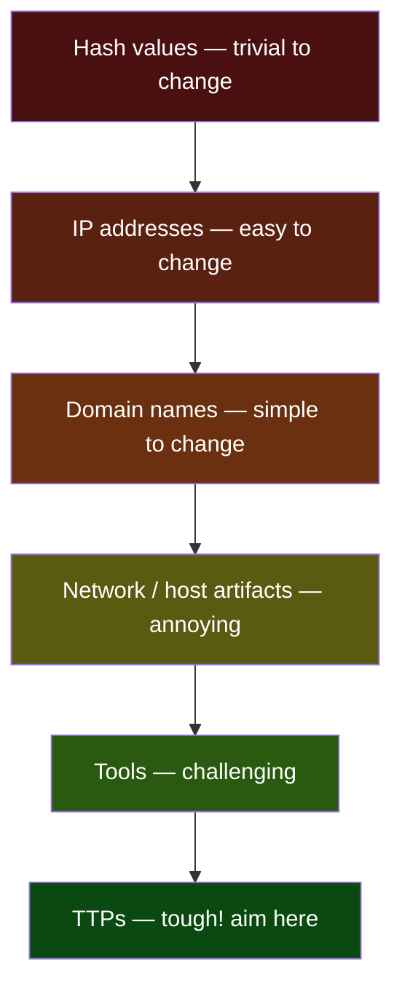
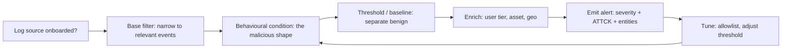
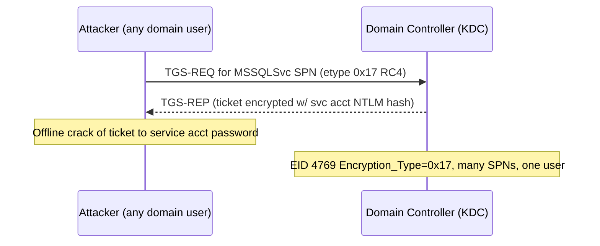
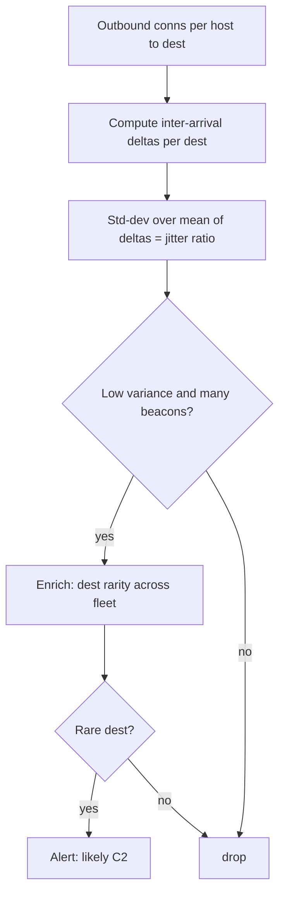

This is Chapter 4 of the Detection Engineering notebook. Chapter 1 taught you to write portable detections in Sigma; Chapters 2 and 3 taught you the endpoint telemetry (Sysmon, osquery, Velociraptor) and the pattern-matching (YARA) that feed detections. Now we sit down at the two consoles where most of the world's detections actually run — **Splunk** with its **SPL** and **Microsoft Sentinel** with its **KQL** — and write real, tuned, ATT&CK-mapped rules for the attacks a SOC is genuinely asked to catch.

The earlier SOC notebook introduced both languages as *search* tools (Splunk in its Chapter 4, Sentinel/KQL in its Chapter 5). This chapter is different in stance: we are not searching to answer a one-off question, we are **authoring detections** — logic that will run unattended thousands of times a day, page a human when it fires, and be judged by whether that page was worth waking someone for. That changes everything about how you write the query. A hunt query can be greedy and noisy because a human is reading every row; a detection must be precise, cheap, resilient to benign variation, and mapped to a response. We will write every detection in *both* languages so that the skill transfers regardless of which SIEM your employer runs, and so you internalise the handful of idioms (`stats` vs `summarize`, `rex` vs `extract`, lookups vs `externaldata`) that are all that really separate them.

A framing note consistent with the whole notebook: every technique here is described so you can **detect** it on systems you defend. The offensive commands shown (Rubeus, Mimikatz, `secretsdump.py`, encoded PowerShell) appear only as the *input* to a detection — the thing that lands in your logs — and should only ever be run in your own lab (DetectionLab, Attack Range, a Boss-of-the-SOC dataset) to generate telemetry you then write rules against. Never run them against systems you do not own.

We build from a detection-authoring methodology and the SPL⇄KQL translation model, through a from-scratch tour of each language's detection idioms, then a long gallery of fully worked detections grouped by ATT&CK tactic, a full end-to-end hunt-and-detect lab in both SIEMs, a consolidated tuning-and-operations section, a final revision, a cheat sheet, and topic-specific practice.

## Why This Matters

Two numbers explain why this chapter exists. First, the overwhelming majority of enterprise SOCs run either Splunk or a Microsoft security stack (Sentinel / Defender XDR), and job descriptions for detection engineers and SOC analysts list "SPL" and "KQL" more often than any other single technical skill. Second, the gap between "I can search logs" and "I can write a detection that fires on the attack and *not* on the helpdesk" is where most analysts stall for years. Closing that gap — writing behaviour-based logic, then tuning it against real benign noise until the signal-to-noise ratio is acceptable — is the core craft of blue-team engineering, and it is a craft you learn by writing dozens of real rules, which is exactly what this chapter makes you do.

There is also a career-shaped reason. "Wrote and tuned the Kerberoasting / LSASS-access / password-spray detections that page the on-call" is a concrete, interview-ready accomplishment. By the end of this chapter you will have written all three, in both languages, with the false-positive tuning that separates a detection that survives contact with production from one that gets muted in a week.

## Part 1: What Makes a Detection (Not Just a Search)

A **search** answers a question a human asked once. A **detection** is a saved search that runs on a schedule, evaluates a condition, and — when the condition is met — creates an alert/incident that enters a response workflow. The difference is not syntax; it is a set of properties the query must have.

A production detection has five parts, and if any one is missing the detection is incomplete:

1. **A log source it depends on.** Every detection is only as good as the telemetry beneath it. "Detect LSASS access" is meaningless without Sysmon Event ID 10 (or a Defender `DeviceEvents` equivalent) being collected. State the required source explicitly; a detection whose data source is not onboarded is a *silent gap*, not a detection.
2. **A behavioural condition**, expressed as precisely as possible. Prefer *behaviour* (a `lsass.exe` handle opened with `PROCESS_VM_READ` by a non-system process) over *indicator* (a hash of `mimikatz.exe`). Behaviour survives the attacker recompiling; a hash does not.
3. **A threshold or baseline** that separates malicious from benign. "Failed logons" is not a detection; "more than 10 distinct accounts failing from one source in 5 minutes" is. The threshold is where most of the engineering effort — and most of the false positives — live.
4. **An ATT&CK mapping** (tactic + technique ID) so the detection contributes to coverage measurement (Chapter 1's Navigator heatmap) and so the responder immediately knows *what stage of an attack* they are looking at.
5. **A response expectation** — severity, and what the analyst should do when it fires. A detection with no triage playbook is a detection that will be ignored.

**The Pyramid of Pain** (David Bianco) is the single most useful mental model for *what* to detect. It ranks indicators by how much pain it causes the adversary when you detect and block them:



Detections at the bottom (hashes, IPs) are cheap to write and cheap for the attacker to evade. Detections at the top (TTPs — the *behaviour* of Kerberoasting, of LSASS access, of encoded-command execution) are harder to write but force the adversary to change *how they operate*, which is expensive. **Every detection in this chapter aims at the top two layers.** We detect the *act* of Kerberoasting, not a list of known-bad service accounts; the *act* of dumping LSASS, not a hash of one credential-theft tool.

One more principle before the syntax: **write the detection against the log you will actually have at 3 a.m.**, not the log you wish you had. If your environment does not deploy Sysmon, an LSASS-access detection built on Sysmon EID 10 is fiction. We call out the required source for every detection and, where possible, give an alternative built on a source you are more likely to have (Security event log, Defender, firewall).

## Part 2: The Two Languages at a Glance — Both Are Pipelines

The single most important realisation for anyone learning SPL and KQL together is that **both are pipeline languages**. Data enters on the left, flows left-to-right through a series of commands separated by a delimiter, and each command transforms the stream. In Splunk the delimiter is the pipe `|`; in KQL it is also the pipe `|`. If you learned the `grep | awk | sort | uniq` model in the Linux chapters, you already have the mental model for both.

They differ in three shallow ways and one deep way. Shallow: (1) the command *names* differ (`stats` vs `summarize`, `where`/implicit-search vs `where`, `rex` vs `extract`/`parse`); (2) SPL is schema-on-read (fields are extracted at search time from raw text) while KQL is schema-on-write (data lands in typed **tables** with typed **columns**); (3) KQL is case-sensitive and strongly typed, SPL is looser. The one deep difference: in Splunk you usually start by naming an `index=` and letting field extraction happen at read time, whereas in KQL you start by naming a **table** (`SecurityEvent`, `DeviceProcessEvents`, `SigninLogs`) whose columns are already typed. Get comfortable with that and everything else is vocabulary.

Here is the Rosetta Stone you will reach for constantly. Keep it open while you read the detection gallery.

| Task | Splunk SPL | Sentinel KQL |
|------|-----------|--------------|
| Pick data set | `index=windows sourcetype=WinEventLog:Security` | `SecurityEvent` (table name) |
| Filter rows | `... EventCode=4625` (implicit) or `\| search` / `\| where` | `\| where EventID == 4625` |
| Aggregate / group | `\| stats count by src_ip` | `\| summarize count() by IpAddress` |
| Count distinct | `\| stats dc(user) as users` | `\| summarize users = dcount(Account)` |
| Time-bucket | `\| bin _time span=5m` then `stats` | `\| summarize ... by bin(TimeGenerated, 5m)` |
| Add computed field | `\| eval hour=strftime(_time,"%H")` | `\| extend hour = datetime_part("hour", TimeGenerated)` |
| Regex-extract | `\| rex field=cmd "(?<b64>[A-Za-z0-9+/=]{50,})"` | `\| extend b64 = extract("([A-Za-z0-9+/=]{50,})", 1, CommandLine)` |
| Rename | `\| rename src as src_ip` | `\| project-rename src_ip = src` |
| Select columns | `\| table _time host user` | `\| project TimeGenerated, Computer, Account` |
| Sort / limit | `\| sort -count \| head 20` | `\| top 20 by count_` or `\| sort by count_ desc \| take 20` |
| Enrichment table | `\| lookup` / `inputlookup` (CSV) | `externaldata` / a Watchlist / `_GetWatchlist()` |
| Dedup | `\| dedup host user` | `\| summarize arg_max(TimeGenerated,*) by Computer, Account` |
| Case / if | `\| eval sev=if(count>10,"high","low")` | `\| extend sev = iff(count_>10,"high","low")` |
| String contains | `\| where like(cmd,"%-enc%")` or `cmd="*-enc*"` | `\| where CommandLine has "-enc"` |
| Join | `\| join user [search ...]` | `\| join kind=inner (...) on Account` |
| First/last seen | `\| stats earliest(_time) latest(_time)` | `\| summarize min(TimeGenerated), max(TimeGenerated)` |
| Multi-value expand | `\| mvexpand field` | `\| mv-expand field` |

A note on performance that applies to both: **filter early, aggregate late**. Put your most selective `where`/search terms first so the engine scans the fewest rows, then aggregate. In KQL specifically, `has` (whole-token match, index-accelerated) is dramatically faster than `contains` (substring scan); prefer `has` unless you truly need a substring. In SPL, put indexed fields (`index`, `sourcetype`, `EventCode`, `host`) in the base search before the first pipe so they filter at the index layer rather than at search time.

## Part 3: SPL for Detection Authoring, From the Ground Up

We covered SPL as a search language in the SOC notebook; here we focus on the subset and the idioms that recur in *detections*. If a command below is unfamiliar, this is its from-scratch introduction.

**The base search.** A detection almost always begins by pinning the data down at the index layer:

```spl
index=windows sourcetype="WinEventLog:Security" EventCode=4688
```

Everything before the first `|` is the base search and runs against the index. `EventCode=4688` here is Windows "A new process has been created" — the process-creation event you will use for most execution detections (enable command-line logging via the "Include command line in process creation events" GPO, or you get no `Process_Command_Line`).

**`stats` — the workhorse.** Aggregation is where behaviour becomes a number you can threshold:

```spl
index=windows EventCode=4625
| stats count as failures, dc(user) as distinct_users, values(user) as users by src_ip
| where distinct_users >= 10 AND failures >= 30
```

`count` counts rows; `dc(x)` counts *distinct* values of `x` (dc = distinct count); `values(x)` collects the unique values into a multivalue field (great for putting the actual usernames into the alert); `by src_ip` groups. The `where` after `stats` thresholds on the *aggregated* result — this is the password-spray shape (few passwords, many accounts, one source) and we will build it fully in Part 8.

**`eval` — compute and classify.** `eval` creates or rewrites a field:

```spl
| eval cmd_len=len(Process_Command_Line)
| eval is_encoded=if(match(Process_Command_Line,"(?i)-enc(odedcommand)?\s"),1,0)
| eval risk=case(is_encoded=1 AND cmd_len>300,"high", is_encoded=1,"medium", 1=1,"low")
```

`if(cond,a,b)` is the ternary; `case(c1,v1,c2,v2,...)` is a multi-branch (the trailing `1=1,"low"` is the default). `match(field,regex)` returns true on a regex hit — the primary way to test a string in `eval`.

**`rex` — extract with regex.** `rex` pulls named capture groups out of raw text into fields:

```spl
| rex field=Process_Command_Line "(?i)-enc(?:odedcommand)?\s+(?<b64blob>[A-Za-z0-9+/=]{40,})"
| where isnotnull(b64blob)
```

`(?<name>...)` names the capture; the field `b64blob` now exists for rows that matched. To decode Base64 inline (PowerShell `-enc` uses UTF-16LE Base64), stock Splunk has no native decode, so use the `Base64` add-on's `b64decode` macro or send the blob to a lookup. We show the full decode-and-hunt flow in the encoded-PowerShell detection (Part 6).

**`bin` + `stats` — time-bucketing for beaconing and rate.** Rate-based detections bucket time then count per bucket:

```spl
| bin _time span=1h
| stats count by _time, dest
```

**`lookup` — enrichment.** A lookup joins your events to a CSV (or KV store) of context — asset owners, a watchlist of privileged accounts, threat-intel domains:

```spl
| lookup privileged_accounts.csv user OUTPUT tier as account_tier
| where account_tier="tier0"
```

**`tstats` — accelerated aggregation.** For scale, `tstats` runs `stats`-style aggregation directly against indexed/data-model fields without touching raw events, and is 10–100× faster. It is the correct base for high-frequency detections:

```spl
| tstats count from datamodel=Endpoint.Processes where Processes.process_name="powershell.exe" by Processes.dest, Processes.user
```

Keep `tstats` in mind for the beaconing and process-anomaly detections; on a busy index they are the difference between a detection that completes in seconds and one that times out.

## Part 4: KQL for Detection Authoring, From the Ground Up

KQL (Kusto Query Language) drives Sentinel analytics rules and Defender XDR Advanced Hunting. Same pipeline model; here are the detection idioms.

**Start from a table.** No `index=`; you name a typed table:

```kql
SecurityEvent
| where EventID == 4625
```

Core Sentinel tables you will use constantly: `SecurityEvent` (Windows Security log via the agent/AMA), `SigninLogs` and `AADNonInteractiveUserSignInLogs` (Entra ID sign-ins), `DeviceProcessEvents` / `DeviceNetworkEvents` / `DeviceEvents` (Defender for Endpoint), `AuditLogs`, `AzureActivity`, `CommonSecurityLog` (CEF from firewalls). In Defender XDR Advanced Hunting the process table is `DeviceProcessEvents` and the raw-event table is `DeviceEvents`.

**`summarize` — the `stats` of KQL.**

```kql
SecurityEvent
| where EventID == 4625
| summarize failures = count(), distinct_users = dcount(Account), users = make_set(Account, 20) by IpAddress
| where distinct_users >= 10 and failures >= 30
```

`count()` = rows, `dcount(x)` = distinct count, `make_set(x, n)` = up to `n` distinct values into a dynamic array (the analogue of SPL `values`), `by` groups. Note KQL's `and`/`or` are lowercase and the comparison is `==` (single `=` is assignment only).

**`extend` — compute a column.**

```kql
| extend cmd_len = strlen(CommandLine)
| extend is_encoded = iff(CommandLine matches regex @"(?i)-enc(odedcommand)?\s", 1, 0)
| extend risk = case(is_encoded == 1 and cmd_len > 300, "high", is_encoded == 1, "medium", "low")
```

`iff(cond,a,b)` is the ternary; `case(c1,v1,...,default)` the multi-branch (last arg is the default, no `1=1` trick needed). `matches regex` applies a regex; `has`/`contains`/`startswith` are cheaper token/substring tests.

**`extract` / `parse` — regex extraction.**

```kql
| extend b64 = extract(@"(?i)-enc(?:odedcommand)?\s+([A-Za-z0-9+/=]{40,})", 1, CommandLine)
| where isnotempty(b64)
| extend decoded = base64_decode_tostring(b64)      // note: UTF-16LE needs extra handling
```

KQL *does* have `base64_decode_tostring()` — a real advantage over stock Splunk for encoded-command hunting. Because PowerShell `-enc` is UTF-16LE, the decode yields interleaved null bytes; strip them with `replace_string(decoded, "\u0000", "")`. We use this in Part 6.

**`bin()` — time-bucketing.**

```kql
| summarize count() by DestinationIp, bin(TimeGenerated, 1h)
```

**Joins, unions, and enrichment.** `join kind=inner|leftouter|leftanti (...) on Key` correlates two result sets; `union` stacks tables; **Watchlists** (`_GetWatchlist('PrivilegedAccounts')`) and `externaldata` provide the lookup-table role:

```kql
let privileged = _GetWatchlist('PrivilegedAccounts') | project Account = SearchKey;
SecurityEvent
| where EventID == 4672      // special privileges assigned
| join kind=inner privileged on Account
```

**`let` — variables and reuse.** `let` binds a name to a scalar, a list, or a whole subquery, and is how you keep detections readable:

```kql
let lookback = 1h;
let spray_threshold = 10;
SigninLogs
| where TimeGenerated > ago(lookback)
```

**`materialize()` and `arg_max()`.** `arg_max(TimeGenerated, *)` per key gives the *latest* row for that key (the KQL "dedup / last-seen"); `materialize()` caches a subquery you reference multiple times. Both matter for performance on scheduled analytics rules.

With both languages' idioms in hand, we can now write real detections. From here, every detection ships in **both** SPL and KQL, states its **log source** and **ATT&CK mapping**, and ends with **tuning** notes.

## Part 5: Detection Design Pattern — The Anatomy We Reuse

Before the gallery, fix the template. Every detection below follows the same skeleton so you can copy it:



- **Source** — the exact table/sourcetype+EventID, and whether it needs a GPO/Sysmon config to exist.
- **Logic** — base filter → behavioural condition → threshold.
- **Enrichment** — attach the entities the responder needs (user, host, IP) and any context (is this a Tier-0 account? a service account? an external IP?).
- **ATT&CK** — tactic and technique ID.
- **Tuning** — the known-benign sources of this shape and how to allowlist them without blinding the detection.

The last loop — **tune** feeding back into **condition** — is not optional. A detection is *born noisy* and made precise by iterating against your own environment's benign baseline. Chapter 1's false-positive discipline is applied here at authoring time.

## Part 6: Execution Detections — Encoded PowerShell and Suspicious Command Lines

**ATT&CK:** T1059.001 (PowerShell), T1027 (Obfuscated/Encoded), T1059.003 (Windows Command Shell).
**Source:** Windows Security EID 4688 *with command-line logging enabled*, or Sysmon EID 1, or Defender `DeviceProcessEvents`. Also PowerShell Script Block Logging (EID 4104, `Microsoft-Windows-PowerShell/Operational`) which is the richest source of all.

Encoded PowerShell (`powershell -enc <base64>`) is the single most common execution artifact in real intrusions because almost every offensive framework generates it. The naive detection — "alert on `-enc`" — is both too noisy (legitimate installers use it) and too easy to evade (`-e`, `-ec`, `-encod`, case tricks). We detect the *behavioural cluster*: an encoding flag **plus** a long blob **plus** a suspicious parent or downloaded-payload markers.

**Splunk:**

```spl
index=windows (sourcetype="WinEventLog:Security" EventCode=4688) OR (sourcetype="Sysmon" EventCode=1)
| eval cmd=coalesce(Process_Command_Line, CommandLine)
| eval parent=coalesce(Creator_Process_Name, ParentImage)
| where match(cmd,"(?i)powershell(\.exe)?")
| rex field=cmd "(?i)\-e(?:nc(?:odedcommand)?|c)?\s+(?<b64>[A-Za-z0-9+/=]{40,})"
| where isnotnull(b64)
| eval blob_len=len(b64)
| eval susp_flags=if(match(cmd,"(?i)(-nop|-noni|-w\s+hidden|-windowstyle\s+hidden|iex|downloadstring|frombase64string)"),1,0)
| eval susp_parent=if(match(parent,"(?i)(winword|excel|powerpnt|outlook|mshta|wscript|cscript|wmiprvse)\.exe$"),1,0)
| eval score = (blob_len>350) + susp_flags + (susp_parent*2)
| where score >= 2
| stats count, values(cmd) as commands, values(parent) as parents, values(user) as users by host
| eval technique="T1059.001 / T1027"
```

Explanation of the flags: `-nop` (NoProfile), `-noni` (NonInteractive), `-w hidden` (hidden window) are the classic "run quietly" trio; `iex`/`DownloadString`/`FromBase64String` are in-memory download-and-execute markers; a Microsoft Office or script-host **parent** spawning PowerShell is the phishing-macro shape and is weighted double because it is rarely benign. The `score` combines weak signals into a strong one — this is the key technique for keeping false positives down without a single brittle rule.

**KQL (Sentinel `SecurityEvent`/Sysmon or Defender `DeviceProcessEvents`):**

```kql
DeviceProcessEvents
| where FileName =~ "powershell.exe" or FileName =~ "pwsh.exe"
| extend cmd = tolower(ProcessCommandLine)
| where cmd matches regex @"\s-e(nc(odedcommand)?|c)?\s+[a-z0-9+/=]{40,}"
| extend b64 = extract(@"\s-e(?:nc(?:odedcommand)?|c)?\s+([A-Za-z0-9+/=]{40,})", 1, ProcessCommandLine)
| extend blob_len = strlen(b64)
| extend susp_flags = iff(cmd has_any ("-nop","-noni","-w hidden","-windowstyle hidden","iex","downloadstring","frombase64string"), 1, 0)
| extend susp_parent = iff(InitiatingProcessFileName in~ ("winword.exe","excel.exe","powerpnt.exe","outlook.exe","mshta.exe","wscript.exe","cscript.exe","wmiprvse.exe"), 1, 0)
| extend score = toint(blob_len > 350) + susp_flags + (susp_parent * 2)
| where score >= 2
| project TimeGenerated, DeviceName, AccountName, InitiatingProcessFileName, ProcessCommandLine, score
| extend Technique = "T1059.001 / T1027"
```

**Decode it (KQL advantage).** To read what the payload actually does, decode inline — remember `-enc` is UTF-16LE so strip nulls:

```kql
| extend decoded = replace_string(base64_decode_tostring(b64), "\u0000", "")
| where decoded has_any ("Net.WebClient","IEX","Invoke-Expression","Reflection.Assembly","VirtualAlloc","-join")
```

**Even better — Script Block Logging (EID 4104).** If you have it, you skip the decode entirely because the *deobfuscated* script block is logged in plaintext:

```kql
Event
| where Source == "Microsoft-Windows-PowerShell" and EventID == 4104
| where EventData has_any ("FromBase64String","VirtualAlloc","Net.WebClient","Invoke-Mimikatz","AmsiUtils","[Ref].Assembly")
```

**Tuning.** The benign sources of encoded PowerShell are: software installers/updaters (Chocolatey, some MSI custom actions), Configuration Manager (SCCM/MECM), and certain monitoring agents. Allowlist by **parent process path** and **signing** — e.g. exclude when the parent is `ccmexec.exe` under `C:\Windows\CCM\` — never by the command content (the attacker controls that). Keep the score threshold; do not drop below `>= 2` or the installer noise returns.

## Part 7: Credential Access — LSASS Dumping, Kerberoasting, DCSync

This tactic (ATT&CK TA0006) is where a detection engineer earns their salary: credential theft is the hinge of almost every intrusion, and each of these three has a clean behavioural signature.

### 7.1 LSASS memory access (T1003.001)

**Source:** Sysmon EID 10 (ProcessAccess) — *the* source, must be configured to log `lsass.exe` as a target; or Defender `DeviceEvents` action `OpenProcessApiCall`; Security EID 4656/4663 on the LSASS object if SACL auditing is set.

The behaviour: a process that is **not** a known Windows component opens a **handle to `lsass.exe`** with read rights (`0x1010` / `PROCESS_VM_READ|PROCESS_QUERY_INFORMATION`). That is what Mimikatz `sekurlsa::logonpasswords`, `procdump -ma lsass.exe`, and comsvcs `MiniDump` all do.

**Splunk (Sysmon EID 10):**

```spl
index=windows sourcetype="Sysmon" EventCode=10 TargetImage="*\\lsass.exe"
| eval src=SourceImage
| where NOT match(src,"(?i)\\\\(wininit|wininet|csrss|services|msmpeng|wmiprvse|taskmgr|MsSense|SenseIR)\.exe$")
| eval read_rights=if(match(GrantedAccess,"(?i)0x(1010|1410|1438|143a|1fffff)"),1,0)
| where read_rights=1
| stats count, values(GrantedAccess) as access, values(src) as source_images by host, User
| eval technique="T1003.001"
```

**KQL (Defender):**

```kql
DeviceEvents
| where ActionType == "OpenProcessApiCall"
| where FileName =~ "lsass.exe"        // target is lsass
| where InitiatingProcessFileName !in~ ("wininit.exe","csrss.exe","services.exe","MsMpEng.exe","wmiprvse.exe","taskmgr.exe","MsSense.exe","SenseIR.exe")
| extend GrantedAccess = tostring(parse_json(AdditionalFields).DesiredAccess)
| where GrantedAccess has_any ("0x1010","0x1410","0x1438","0x143a","0x1fffff")
| project TimeGenerated, DeviceName, InitiatingProcessFileName, InitiatingProcessFolderPath, GrantedAccess, InitiatingProcessAccountName
| extend Technique = "T1003.001"
```

**Tuning.** The dominant false positives are AV/EDR products (Defender's `MsMpEng.exe`, the sensor `MsSense.exe`), backup/monitoring agents, and — occasionally — `taskmgr.exe` when a live-dumping admin uses it. Allowlist by **full signed path**, not filename alone (attackers name their tool `taskmgr.exe`). `GrantedAccess 0x1010` is the Mimikatz default and the highest-signal value; if you must reduce volume, alert only on that plus non-standard source paths.

### 7.2 Kerberoasting (T1558.003)

**Source:** Security EID 4769 (Kerberos service ticket requested) on domain controllers. The tell: a **TGS request for a user-account SPN using RC4 encryption (`0x17`)** — attackers request the weak cipher because RC4 hashes crack faster offline.



**Splunk:**

```spl
index=windows sourcetype="WinEventLog:Security" EventCode=4769
| where Ticket_Encryption_Type="0x17"          // RC4
  AND Service_Name!="krbtgt"
  AND NOT match(Account_Name,"(?i)\$@")          // ignore machine accounts
| bin _time span=10m
| stats dc(Service_Name) as distinct_spns, values(Service_Name) as spns, count as requests by _time, Account_Name, src_ip
| where distinct_spns >= 5 OR requests >= 10
| eval technique="T1558.003"
```

The signal that separates roasting from normal Kerberos: **one requesting account pulling many distinct service SPNs in a short window with RC4**. A normal user requests a ticket for the one or two services they use; a roasting tool enumerates every SPN and requests them all.

**KQL:**

```kql
let window = 10m;
SecurityEvent
| where EventID == 4769
| where TicketEncryptionType == "0x17"
| where ServiceName != "krbtgt" and ServiceName !endswith "$"
| where TargetUserName !endswith "$"
| summarize distinct_spns = dcount(ServiceName), spns = make_set(ServiceName, 50), requests = count()
    by TargetUserName, IpAddress, bin(TimeGenerated, window)
| where distinct_spns >= 5 or requests >= 10
| extend Technique = "T1558.003"
```

**Tuning.** Some legacy applications and vulnerability scanners request many SPNs; baseline your environment for accounts that *normally* do this and allowlist them (or better, get them off RC4). If your domain has disabled RC4, invert the logic and alert on *any* RC4 4769 — its mere presence is then anomalous.

### 7.3 DCSync (T1003.006)

**Source:** Security EID 4662 on domain controllers (an operation was performed on an AD object), auditing the **replication** extended rights. The tell: a **non-DC principal** requesting directory replication (`DS-Replication-Get-Changes`, GUID `1131f6aa-...` / `DS-Replication-Get-Changes-All`, `1131f6ad-...`). Legit replication comes only from other DCs' machine accounts.

**Splunk:**

```spl
index=windows sourcetype="WinEventLog:Security" EventCode=4662
| where match(Properties,"(?i)1131f6aa-9c07-11d1-f79f-00c04fc2dcd2")
     OR match(Properties,"(?i)1131f6ad-9c07-11d1-f79f-00c04fc2dcd2")
| where NOT match(Account_Name,"(?i)(\$$|^MSOL_|^AAD_)")     // exclude DC machine accts & known sync accts
| stats count, values(Object_Name) as objects by _time, Account_Name, src_ip
| eval technique="T1003.006"
```

**KQL:**

```kql
SecurityEvent
| where EventID == 4662
| where Properties has_any ("1131f6aa-9c07-11d1-f79f-00c04fc2dcd2", "1131f6ad-9c07-11d1-f79f-00c04fc2dcd2")
| where AccountName !endswith "$"
| where AccountName !startswith "MSOL_" and AccountName !startswith "AAD_"
| project TimeGenerated, Computer, AccountName, SubjectLogonId, Properties
| extend Technique = "T1003.006"
```

**Tuning.** The only legitimate sources of these replication rights are DC machine accounts and identity-sync accounts (Azure AD Connect's `MSOL_...`, some backup/migration tools). Allowlist those *by exact SID*, not name. Any *user* account triggering this is high-severity, near-zero-false-positive — one of the best detections you will ever ship. It requires 4662 auditing with the replication rights in the SACL of the domain object, so verify the audit policy is actually collecting it.

## Part 8: Credential-Access Continued — Password Spraying and Brute Force

**ATT&CK:** T1110.003 (Password Spraying), T1110.001 (Brute Force).
**Source:** Security EID 4625 (failed logon) on-prem; `SigninLogs`/`AADNonInteractiveUserSignInLogs` for Entra ID.

Brute force = many passwords against **one** account. Spraying = **one/few** passwords against **many** accounts (to avoid lockout). The detections are mirror images: brute force thresholds on failures *per account*; spraying thresholds on *distinct accounts per source*.

**Spraying — Splunk (on-prem):**

```spl
index=windows sourcetype="WinEventLog:Security" EventCode=4625
| eval logon_type=Logon_Type
| bin _time span=10m
| stats dc(Account_Name) as targeted_accounts, values(Account_Name) as accounts, count as attempts by _time, src_ip=Source_Network_Address
| where targeted_accounts >= 10 AND attempts >= 15
| eval technique="T1110.003"
```

**Spraying — KQL (Entra ID sign-ins):**

```kql
let window = 10m;
let acct_threshold = 10;
SigninLogs
| where ResultType in ("50126","50053")           // 50126 invalid creds, 50053 locked
| summarize targeted = dcount(UserPrincipalName), users = make_set(UserPrincipalName, 30), attempts = count()
    by IPAddress, AppDisplayName, bin(TimeGenerated, window)
| where targeted >= acct_threshold
| extend Technique = "T1110.003"
```

**The "spray then success" upgrade — the detection that actually matters.** A pile of failures is noise; a spray *followed by a success from the same source* is an incident. Correlate:

```kql
let window = 1h;
let sprays =
    SigninLogs
    | where ResultType in ("50126","50053")
    | summarize targeted = dcount(UserPrincipalName) by IPAddress, bin(TimeGenerated, 10m)
    | where targeted >= 10
    | distinct IPAddress;
SigninLogs
| where ResultType == "0"                          // successful sign-in
| where IPAddress in (sprays)
| project TimeGenerated, UserPrincipalName, IPAddress, AppDisplayName, ResultType
| extend Technique = "T1110.003 + successful auth", Severity = "High"
```

The Splunk equivalent uses a subsearch or two `stats` passes joined on `src_ip`:

```spl
index=windows EventCode=4625 earliest=-1h
| bin _time span=10m | stats dc(Account_Name) as targeted by _time, Source_Network_Address
| where targeted>=10 | rename Source_Network_Address as spray_ip | fields spray_ip
| join spray_ip [ search index=windows EventCode=4624 earliest=-1h
                  | rename Source_Network_Address as spray_ip
                  | table _time spray_ip Account_Name ]
| eval technique="T1110.003 + success"
```

**Tuning.** Misconfigured service accounts and mail clients with stale passwords generate spray-shaped noise; allowlist their source IPs/UPNs. Exclude expected VPN concentrator and proxy egress IPs from the "distinct accounts per source" logic *or* they will look like a spray (many users behind one NAT). Legacy-auth endpoints (`AADNonInteractive`) are where real sprays hide — include that table, don't just watch interactive sign-ins.

## Part 9: Persistence and Privilege — Scheduled Tasks, Services, Run Keys

**ATT&CK:** T1053.005 (Scheduled Task), T1543.003 (Windows Service), T1547.001 (Run Keys), T1548.002 (UAC bypass).
**Source:** Security EID 4698 (scheduled task created), 4697 / 7045 (service installed), Sysmon EID 13 (registry set) for Run keys, or Defender `DeviceRegistryEvents` and `DeviceProcessEvents`.

**Scheduled task with a suspicious action — Splunk:**

```spl
index=windows (EventCode=4698) OR (sourcetype="Sysmon" EventCode=1 CommandLine="*schtasks*")
| eval action=coalesce(Task_Content, CommandLine)
| where match(action,"(?i)(powershell|cmd\.exe|mshta|wscript|cscript|rundll32|regsvr32|certutil|bitsadmin)")
    AND match(action,"(?i)(-enc|downloadstring|http[s]?://|\\\\temp\\\\|\\\\appdata\\\\|frombase64)")
| stats count, values(action) as task_actions, values(user) as users by host
| eval technique="T1053.005"
```

**Service install (EID 7045) — KQL:**

```kql
Event
| where Source == "Service Control Manager" and EventID == 7045
| extend d = parse_xml(EventData)
| extend ServiceName = tostring(d.EventData.Data[0]["#text"]),
         ImagePath   = tostring(d.EventData.Data[1]["#text"])
| where ImagePath has_any ("powershell","cmd.exe /c","%COMSPEC%","\\temp\\","\\appdata\\","-enc","rundll32")
      or ImagePath matches regex @"(?i)\\[a-z]{6,10}\.exe$"   // random-looking name in an odd path
| project TimeGenerated, Computer, ServiceName, ImagePath
| extend Technique = "T1543.003"
```

The behavioural core: a persistence mechanism (task/service/Run key) whose **payload is an interpreter or a LOLBin pointed at a script/URL/temp path**. That combination — persistence + interpreter + suspicious target — is far more specific than "a service was installed" (which happens benignly all day). PsExec, for example, installs a service named `PSEXESVC`; that alone is worth a low-severity detection because in many environments PsExec is unexpected.

**Run key persistence — Sysmon EID 13, Splunk:**

```spl
index=windows sourcetype="Sysmon" EventCode=13
| where match(TargetObject,"(?i)\\\\CurrentVersion\\\\Run")
| where match(Details,"(?i)(\\temp\\|\\appdata\\|powershell|-enc|http|\.vbs|\.js|mshta)")
| stats count, values(TargetObject) as keys, values(Details) as values by host, User
| eval technique="T1547.001"
```

**Tuning.** Software installers create Run keys and services constantly; scope by **path** (temp/appdata/public are suspicious; `Program Files` under a signed installer is usually fine) and by **payload interpreter**. Maintain an allowlist of your management tooling's service names (SCCM, monitoring agents). For scheduled tasks, Microsoft's own `\Microsoft\Windows\...` task tree is benign — focus on tasks in the root or with random names.

## Part 10: Lateral Movement and C2 — WMI, PsExec, Beaconing, Rare Ancestry

**ATT&CK:** T1021.002 (SMB/Admin Shares), T1047 (WMI), T1021.006 (WinRM), T1071 (C2 over web), T1571 (non-standard port).
**Source:** Security EID 4624 (type 3 network logon), 4688; Sysmon EID 1/3; Defender `DeviceLogonEvents`/`DeviceNetworkEvents`; firewall/proxy logs for beaconing.

### 10.1 Remote execution via WMI / PsExec (T1047, T1021.002)

The tell for remote WMI execution: `wmiprvse.exe` (the WMI provider host) spawning a shell/interpreter. For PsExec: the `PSEXESVC` service plus a type-3 logon from a workstation.

**Splunk (WMI child process):**

```spl
index=windows sourcetype="Sysmon" EventCode=1
| where match(ParentImage,"(?i)\\\\wmiprvse\.exe$")
    AND match(Image,"(?i)\\\\(cmd|powershell|rundll32|regsvr32|mshta|wscript|cscript)\.exe$")
| stats count, values(CommandLine) as cmds, values(User) as users by Computer
| eval technique="T1047"
```

**KQL:**

```kql
DeviceProcessEvents
| where InitiatingProcessFileName =~ "wmiprvse.exe"
| where FileName in~ ("cmd.exe","powershell.exe","rundll32.exe","regsvr32.exe","mshta.exe","wscript.exe","cscript.exe")
| project TimeGenerated, DeviceName, AccountName, FileName, ProcessCommandLine, InitiatingProcessFileName
| extend Technique = "T1047"
```

### 10.2 C2 beaconing — rare destinations with regular timing (T1071)

Beaconing is a **timing** signature: an implant phones home at a roughly fixed interval (often with jitter). We detect two shapes — (a) a host talking to a *rare* external destination that few/no other hosts talk to, and (b) *regular* connection intervals (low variance of inter-arrival time). Combine them and you have a strong, evasion-resistant detection.



**Splunk (interval regularity + rarity):**

```spl
index=proxy OR index=firewall sourcetype=*
| eval dest=coalesce(dest_host, dest_ip)
| sort 0 host, dest, _time
| streamstats current=f last(_time) as prev_time by host, dest
| eval delta=_time-prev_time
| where isnotnull(delta) AND delta>0
| stats count as beacons, avg(delta) as mean_int, stdev(delta) as sd_int, dc(host) as host_fanout by dest
| eval jitter_ratio=sd_int/mean_int
| where beacons>=12 AND jitter_ratio<0.15 AND host_fanout<=2 AND mean_int>30
| eval technique="T1071"
| sort jitter_ratio
```

`streamstats` computes a running `last(_time)` per `host,dest` so each row knows the previous connection's time; `delta` is the inter-arrival gap; a low `stdev/mean` (jitter ratio) means highly regular timing — the beacon fingerprint. `host_fanout<=2` adds rarity (few hosts talk to this dest). `mean_int>30` avoids flagging chatty legitimate keep-alives.

**KQL (Defender network events):**

```kql
let minBeacons = 12;
DeviceNetworkEvents
| where isnotempty(RemoteUrl) or isnotempty(RemoteIP)
| where RemoteIPType == "Public"
| extend dest = coalesce(RemoteUrl, RemoteIP)
| order by DeviceName, dest, TimeGenerated asc
| serialize
| extend prev = prev(TimeGenerated), prevDest = prev(dest), prevDev = prev(DeviceName)
| extend delta = iff(dest == prevDest and DeviceName == prevDev, datetime_diff('second', TimeGenerated, prev), long(null))
| where isnotnull(delta) and delta > 0
| summarize beacons = count(), mean_int = avg(delta), sd_int = stdev(delta), host_fanout = dcount(DeviceName) by dest
| extend jitter_ratio = sd_int / mean_int
| where beacons >= minBeacons and jitter_ratio < 0.15 and host_fanout <= 2 and mean_int > 30
| extend Technique = "T1071"
| sort by jitter_ratio asc
```

**Tuning.** The great enemy of beacon detection is *legitimate* regular traffic: software update checks, telemetry, CRL/OCSP, NTP, monitoring heartbeats. Allowlist those destination domains/IPs (build the list from your own baseline — the top rare-but-regular destinations that turn out to be Microsoft/Google/your vendors). Raise `minBeacons` to reduce volume; lower `jitter_ratio` to catch only the most metronomic beacons. Long-jitter C2 (hours between beacons, high randomisation) will evade this — pair it with the rare-domain and JA3/TLS-fingerprint detections from the network-monitoring chapter.

### 10.3 Rare parent→child process pairs (anomaly, multi-technique)

A powerful generic detection: flag **process ancestry that is statistically rare in your fleet** — `services.exe`→`cmd.exe`, `winlogon.exe`→`powershell.exe`, an Office app spawning `certutil.exe`. This catches many techniques at once.

**Splunk (baseline vs. current window):**

```spl
index=windows sourcetype="Sysmon" EventCode=1 earliest=-1d
| eval pair=ParentImage."->".Image
| stats count as recent_count, dc(Computer) as hosts by pair
| lookup process_pair_baseline.csv pair OUTPUT baseline_count
| eval baseline_count=coalesce(baseline_count,0)
| where baseline_count < 5 AND recent_count > 0
| where match(pair,"(?i)(services|winlogon|lsass|svchost|wininit)\.exe\->.*(cmd|powershell|rundll32|mshta|certutil|regsvr32)\.exe")
| sort recent_count
| eval technique="rare-ancestry (T1059/T1218)"
```

The `process_pair_baseline.csv` is a lookup you generate periodically (a `stats count by pair` over the last 30 days). Anything with a near-zero baseline that appears in the current window, *and* matches the suspicious-ancestry regex, is worth a look. This is the essence of behavioural baselining and it generalises to any anomaly-by-rarity detection.

### 10.4 Remote logon anomalies (T1021)

Lateral movement almost always leaves a **network logon** (Security EID 4624, `Logon_Type=3`) trail. A high-value, low-noise detection: a **workstation** authenticating *to* many other hosts in a short window, or an interactive/privileged account appearing on a host it has never touched. The former is the "spread" fingerprint of PsExec/WMI sweeps; the latter is "first time this admin logged into this server," which is exactly what a stolen credential looks like.

**Splunk (one source spraying network logons across many hosts):**

```spl
index=windows sourcetype="WinEventLog:Security" EventCode=4624 Logon_Type=3
| where NOT match(Account_Name,"(?i)(\$$|^ANONYMOUS)")
| bin _time span=15m
| stats dc(dest) as hosts_touched, values(dest) as hosts by _time, Account_Name, Source_Network_Address
| where hosts_touched >= 10
| eval technique="T1021 (lateral spread)"
```

**KQL (first-seen admin→host pair — new access is the signal):**

```kql
let baseline = 21d;
let seen =
    DeviceLogonEvents
    | where TimeGenerated between (ago(baseline) .. ago(1d))
    | where LogonType == "Network"
    | summarize by AccountName, DeviceName;
DeviceLogonEvents
| where TimeGenerated > ago(1d) and LogonType == "Network"
| join kind=leftanti seen on AccountName, DeviceName      // pairs never seen in the baseline
| where AccountName endswith "-adm" or AccountName has_any ("admin","svc")
| project TimeGenerated, AccountName, DeviceName, RemoteIP, LogonType
| extend Technique = "T1021 (new privileged access)"
```

`join kind=leftanti` returns only the rows on the left that have **no** match on the right — i.e. account→host pairs that never appeared in the 21-day baseline. Restricting to admin/service accounts keeps the volume low and the signal high: a privileged account touching a brand-new host is one of the strongest lateral-movement tells you can build cheaply.

## Part 11: Exfiltration and Impact — Data Staging and Mass Access

**ATT&CK:** T1074 (Data Staged), T1048 (Exfil over alt protocol), T1567 (Exfil to cloud), T1486 (Ransomware/Impact).
**Source:** Proxy/firewall byte counts, `DeviceNetworkEvents`, file-audit EID 4663, cloud storage logs.

**Large outbound transfer to a rare destination — KQL:**

```kql
let baseline_days = 14d;
let known =
    DeviceNetworkEvents
    | where TimeGenerated between (ago(baseline_days) .. ago(1d))
    | summarize by RemoteUrl;
DeviceNetworkEvents
| where TimeGenerated > ago(1d) and RemoteIPType == "Public"
| where RemoteUrl !in (known)                                  // never-before-seen destination
| summarize bytes = sum(tolong(SentBytes)) by DeviceName, RemoteUrl, AccountName = InitiatingProcessAccountName
| where bytes > 50000000                                       // >50 MB to a new dest
| extend Technique = "T1567 / T1048", MB = bytes/1024/1024
| sort by bytes desc
```

**Mass file access (ransomware pre-encryption / collection) — Splunk:**

```spl
index=windows sourcetype="WinEventLog:Security" EventCode=4663 Accesses="*WriteData*"
| bin _time span=1m
| stats dc(Object_Name) as files_touched by _time, Account_Name, Process_Name
| where files_touched > 500
| eval technique="T1486 (mass write)"
```

A single process writing to hundreds of distinct files per minute is the encryption/collection fingerprint. Tune the threshold to your file servers' normal batch jobs (backup, indexing) and allowlist those process paths.

**Shadow-copy deletion — the ransomware "point of no return" (T1490) — KQL:**

```kql
DeviceProcessEvents
| where (FileName in~ ("vssadmin.exe","wmic.exe") and ProcessCommandLine has_any ("delete shadows","shadowcopy delete"))
     or (FileName =~ "wbadmin.exe" and ProcessCommandLine has "delete")
     or (FileName =~ "bcdedit.exe" and ProcessCommandLine has_any ("recoveryenabled no","bootstatuspolicy ignoreallfailures"))
| project TimeGenerated, DeviceName, AccountName, FileName, ProcessCommandLine
| extend Technique = "T1490 (inhibit system recovery)", Severity = "Critical"
```

Deleting Volume Shadow Copies (`vssadmin delete shadows /all /quiet`) is what nearly every ransomware family does *immediately before* encryption to stop the victim restoring. There is almost no benign reason for it on a workstation, so this is a critical, near-zero-false-positive detection — and one worth wiring to an **automated response** (isolate the host) rather than a human page, because by the time an analyst reads it the encryption has already started.

## Part 12: Hands-On Lab — Hunt an Intrusion End to End in Both SIEMs

This lab walks a realistic intrusion through both Splunk and Sentinel, writing the detection that would have caught each stage. Use a lab dataset — **Splunk's Boss of the SOC (BOTS) v3** for SPL, and the **Microsoft Sentinel Training Lab** (or the DetectionLab/Attack Range Kusto data) for KQL — so every query returns real rows. The scenario: phishing → encoded PowerShell → credential theft → lateral movement → exfil.

### Step 0 — Confirm your sources exist

Before writing a single detection, verify the telemetry is present. In Splunk:

```spl
| metadata type=sourcetypes index=* | table sourcetype totalCount recentTime | sort -recentTime
```

Sample output (abridged):

```
sourcetype                    totalCount   recentTime
WinEventLog:Security          1893442      02-28 05:59:12
Sysmon                         742119       02-28 05:59:10
stream:http                    331208       02-28 05:58:59
suricata                       118904       02-28 05:58:44
```

In Sentinel:

```kql
Usage
| where TimeGenerated > ago(1d)
| summarize GB = sum(Quantity)/1000 by DataType
| sort by GB desc
```

If `SecurityEvent`, `DeviceProcessEvents`, or `SigninLogs` are absent, the corresponding detections below cannot fire — that is the "silent gap" from Part 1, and finding it is itself a lab deliverable.

### Step 1 — Initial access: the phishing execution

Run the encoded-PowerShell detection from Part 6. Expected hit (BOTS-style):

```
host          user       parents          score  commands
we8105desk    bob.smith  winword.exe->..  4      powershell -nop -w hidden -enc SQBFAF...
```

The `winword.exe` parent (`susp_parent`, weighted x2) plus the long blob plus `-nop -w hidden` pushes the score to 4 — a clean, high-confidence hit. Decode the blob (KQL `base64_decode_tostring`) and you will see an `IEX (New-Object Net.WebClient).DownloadString(...)` cradle. **Detection written: T1059.001, high.**

### Step 2 — Credential access

Now hunt LSASS access (Part 7.1). Expected:

```
host          User        source_images        access
we8105desk    bob.smith   ...\powershell.exe   0x1010
```

A `powershell.exe` (not an AV product) opening `lsass.exe` with `0x1010` — Invoke-Mimikatz in memory. **Detection written: T1003.001, high.** Pivot to 4769 for Kerberoasting (Part 7.2); if the actor roasted, you will see one account pulling many RC4 SPNs.

### Step 3 — Lateral movement

Run the WMI/PsExec detection (Part 10.1) and the rare-ancestry detection (Part 10.3). Expected: `wmiprvse.exe`→`cmd.exe` on a second host, or a `PSEXESVC` service install (EID 7045). Correlate with a type-3 logon (4624) from the first host to confirm the pivot direction. **Detection written: T1047 / T1021.002, high.**

### Step 4 — C2 and exfil

Run the beaconing detection (Part 10.2) over the proxy/stream data. Expected: one host, one rare external dest, ~60 s mean interval, jitter ratio < 0.1 — a metronomic beacon. Then the large-transfer detection (Part 11) catches the staged data leaving. **Detections written: T1071, T1567.**

### Step 5 — Assemble the story and write the correlation rule

Individually these are five alerts; together they are one incident. Write a correlation that raises severity when multiple stages hit the same host within a window. Splunk (risk-based, using RBA-style scoring):

```spl
index=risk earliest=-24h
| stats sum(risk_score) as total_risk, values(technique) as techniques, dc(technique) as stages by risk_object
| where stages >= 3 AND total_risk > 80
| eval verdict="likely active intrusion"
```

KQL (Sentinel — a scheduled rule that groups your own alert output):

```kql
SecurityAlert
| where TimeGenerated > ago(24h)
| extend host = tostring(parse_json(Entities)[0].HostName)
| summarize techniques = make_set(AlertName), stages = dcount(AlertName) by host
| where stages >= 3
| extend verdict = "likely active intrusion"
```

This is the payoff of ATT&CK mapping (Part 1): because every detection carried a technique tag, the correlation can count *distinct kill-chain stages* on one host and escalate — turning five medium alerts into one high-confidence incident, which is exactly what a SOC lead wants to see.

### Lab deliverables

1. All five stage detections, saved in both SPL and KQL, each with source + threshold + ATT&CK tag.
2. One tuning note per detection recording the benign source you allowlisted.
3. The correlation rule and a one-paragraph incident narrative.

## Part 13: Detection & Defense Angle (Consolidated Operations)

Writing the query is half the job; operating it is the other half. This section consolidates the practices that keep detections healthy in production.

**Schedule vs. lookback vs. threshold must agree.** A rule that runs every 10 minutes but looks back 1 hour will re-alert on the same events six times; a rule that runs hourly but looks back 10 minutes will *miss* events between runs. Set `lookback == schedule interval` (plus a small overlap for ingestion lag), and make thresholds time-window-aware. In Sentinel, the analytics rule's "Run query every" and "Lookup data from the last" must line up; in Splunk, the saved-search cron and `earliest` must line up.

**Suppress and group.** Both platforms let you suppress re-firing (Sentinel "Suppression"; Splunk "throttle" by field for N seconds) and group related events into one incident (Sentinel "Event grouping"; Splunk notable grouping / RBA). Without these, a spray detection pages 40 times for one spray. Group by the entity that matters (source IP for spraying, host for LSASS).

**Alert fatigue is a detection bug, not an analyst failing.** Track per-rule *true-positive rate*. A rule under ~10–20% TP is a tuning task, not a mute task — but if it cannot be tuned above the floor, retire it and cover the technique another way. Chapter 1's feedback loop applies: every false positive is a tuning input, every missed true positive (found in an incident) is a new detection or a fixed threshold.

**Map coverage, find gaps.** Export the ATT&CK tags from all your rules into the Navigator and colour the heatmap (Chapter 1). The point of tagging every detection in this chapter is that you can now *see* your coverage — and, more importantly, see the techniques you have *no* detection for. Credential access and lateral movement should be dense; if discovery or defense-evasion are blank, that is your backlog.

**Test detections don't silently rot.** Use Atomic Red Team (Chapter 1) to fire each technique in the lab on a schedule and confirm the detection still triggers. Log-source changes (an agent upgrade renames a field, a GPO gets reverted and command-line logging stops) silently break detections; only a periodic **detonation test** catches that. A detection you have not tested since you wrote it is a detection you cannot trust.

**Prefer resilient joins to brittle ones.** The "spray then success" and correlation rules use joins/subsearches, which are the most expensive and most fragile part of a detection. Keep the join key simple (one field), materialise/cache the smaller side, and constrain both sides tightly by time. On busy indexes, prefer `tstats` (Splunk) and summarised/`materialize()` intermediate results (KQL).

**Data-source hardening pays compound interest.** Most detections in this chapter depend on telemetry that is *off by default*: Sysmon (EID 1/3/10/13), command-line process auditing (4688), PowerShell script-block logging (4104), 4662 replication auditing, 4769/4625/4624 with the right audit subcategories. A one-time investment in a solid audit policy and a Sysmon config (SwiftOnSecurity / Olaf Hartong's configs) unlocks the majority of these detections at once. Detection engineering starts at the log source.

## Part 14: Common Pitfalls

- **Detecting the tool, not the behaviour.** Alerting on `mimikatz.exe` or a specific hash is Pyramid-of-Pain bottom-feeding — the attacker renames the file and you are blind. Detect the LSASS handle, the RC4 4769, the replication 4662.
- **No threshold, or a threshold copied from a blog.** Every environment's baseline differs. A spray threshold of 10 accounts might be perfect in a 500-seat company and far too low behind a busy NAT. Derive thresholds from *your* data.
- **Allowlisting by mutable attributes.** Excluding by filename or command content lets the attacker bypass you by choosing that name/content. Allowlist by signed path, SID, or certificate — things the attacker cannot cheaply forge.
- **Schedule/lookback mismatch** → duplicate alerts or silent gaps (Part 13).
- **`contains` everywhere in KQL.** Substring scans are slow at scale; use `has`/`has_any` (token, index-accelerated) unless you truly need a substring.
- **Case sensitivity in KQL.** `==` is case-sensitive; use `=~`/`in~`/`has` (case-insensitive) for filenames and accounts, or you will miss `PowerShell.exe` vs `powershell.exe`.
- **Field-name assumptions.** Sysmon vs 4688 vs Defender name the same concept differently (`CommandLine` vs `Process_Command_Line` vs `ProcessCommandLine`). `coalesce()` across the variants, or your rule works in the lab and fails in prod.
- **Testing only the happy path.** A detection that fires on your own Atomic test but was never checked against a week of benign data will drown the SOC on day one. Backtest against historical benign data before enabling.
- **Ignoring non-interactive/legacy auth.** Real password sprays and token abuse hide in `AADNonInteractiveUserSignInLogs`, not just `SigninLogs`.

## Part 15: Final Revision / Summary

- A **detection** is a scheduled search with five required parts: a **log source**, a **behavioural condition**, a **threshold/baseline**, an **ATT&CK mapping**, and a **response expectation**. A search missing any of these is not a detection.
- **Aim high on the Pyramid of Pain.** Detect TTPs/behaviour (the *act* of Kerberoasting/LSASS-dumping/DCSync), not hashes or IPs the attacker changes for free.
- **SPL and KQL are both pipelines.** Learn the Rosetta Stone (Part 2): `stats`↔`summarize`, `eval`↔`extend`, `rex`↔`extract`, `lookup`↔Watchlist/`externaldata`, `where`↔`where`. The vocabulary differs; the model is identical.
- **Filter early, aggregate late.** Indexed fields first in SPL; `has` over `contains` in KQL; `tstats`/`materialize()` for scale.
- The **credential-access trio** are your highest-value, lowest-false-positive rules: LSASS handle (Sysmon 10 / Defender OpenProcess, `0x1010`), Kerberoasting (4769 RC4, many SPNs one account), DCSync (4662 replication rights from a non-DC). Ship these first.
- **Spray-then-success** and **beacon = rare-dest + low-jitter** are the two correlation patterns worth mastering; they turn noisy raw signals into incident-grade alerts.
- **Tuning is authoring.** A detection is born noisy and made precise by iterating against your own benign baseline; allowlist by immutable attributes (path/SID/cert), never by attacker-controlled content.
- **Operate deliberately:** align schedule/lookback/threshold, suppress and group, measure per-rule TP rate, map coverage in the Navigator, and detonation-test with Atomic Red Team so detections don't silently rot.
- **Detection starts at the log source.** Most of these rules need telemetry that is off by default (Sysmon, 4688 command line, 4104, 4662, the right audit subcategories). Fix the sources and dozens of detections become possible at once.

## Part 16: Cheat Sheet / Quick Reference

**SPL ⇄ KQL quick map**

| SPL | KQL |
|-----|-----|
| `index=... sourcetype=...` | table name (`SecurityEvent`, `DeviceProcessEvents`) |
| `\| stats count by x` | `\| summarize count() by x` |
| `dc(x)` / `values(x)` | `dcount(x)` / `make_set(x,n)` |
| `\| eval y=if(c,a,b)` | `\| extend y=iff(c,a,b)` |
| `\| eval y=case(...)` | `\| extend y=case(...,default)` |
| `\| rex field=f "(?<g>...)"` | `\| extend g=extract("...",1,f)` |
| `\| bin _time span=10m` | `\| summarize ... by bin(TimeGenerated,10m)` |
| `\| lookup t k OUTPUT v` | Watchlist `_GetWatchlist()` / `externaldata` |
| `\| where like(f,"%x%")` / `f="*x*"` | `\| where f has "x"` |
| `\| join k [search ...]` | `\| join kind=inner (...) on k` |
| `\| dedup a b` | `\| summarize arg_max(TimeGenerated,*) by a,b` |
| `\| tstats count from datamodel=...` | `\| summarize ...` on a summary/`materialize()` |
| `streamstats last(_time)` | `serialize \| extend prev=prev(TimeGenerated)` |

**Key Windows Event IDs for detection**

| EID | Meaning | Detects |
|-----|---------|---------|
| 4624 | Successful logon | Lateral (type 3), spray-success |
| 4625 | Failed logon | Brute force / spraying |
| 4662 | AD object operation | DCSync (replication rights) |
| 4672 | Special privileges assigned | Privileged logon monitoring |
| 4688 | Process created (+cmdline) | Encoded PS, LOLBins, ancestry |
| 4697 / 7045 | Service installed | PsExec, service persistence |
| 4698 | Scheduled task created | Task persistence |
| 4769 | Kerberos TGS requested | Kerberoasting (RC4 0x17) |
| 4104 | PS script block | Deobfuscated PowerShell |
| Sysmon 1 | Process create | Everything execution/ancestry |
| Sysmon 3 | Network connect | Beaconing, egress |
| Sysmon 10 | Process access | LSASS dumping (0x1010) |
| Sysmon 13 | Registry set | Run-key persistence |

**High-value detection thresholds (starting points — tune to your data)**

| Detection | Shape | Starting threshold |
|-----------|-------|--------------------|
| Password spray | distinct accounts / source / window | ≥ 10 accounts in 10 min |
| Kerberoasting | distinct RC4 SPNs / account / window | ≥ 5 SPNs in 10 min |
| Beaconing | jitter ratio + fleet fanout | sd/mean < 0.15, fanout ≤ 2, ≥ 12 beacons |
| Mass file write | distinct files / process / min | > 500 files/min |
| Large exfil | bytes to new dest / day | > 50 MB to never-seen dest |
| Encoded PS | score(blob,flags,parent) | score ≥ 2 |

**GrantedAccess values worth knowing (LSASS)**: `0x1010`, `0x1410`, `0x1438`, `0x143a`, `0x1fffff` (all include read rights; `0x1010` is the Mimikatz default).

**AD replication GUIDs (DCSync)**: `1131f6aa-9c07-11d1-f79f-00c04fc2dcd2` (Get-Changes), `1131f6ad-9c07-11d1-f79f-00c04fc2dcd2` (Get-Changes-All).

## Part 17: Practice Labs & Resources

Train these exact skills, not generic ones:

- **Splunk Boss of the SOC (BOTS) v1/v2/v3** — the canonical free SPL detection dataset; the scenarios (APT, ransomware, insider) map directly to the detections in this chapter. Rebuild Parts 6–11 against BOTS data.
- **Microsoft Sentinel Training Lab** (Microsoft Learn) — deploys a Sentinel workspace with sample data and guided KQL detection exercises; pair with **KQL from Detection to Response** on Learn.
- **Microsoft 365 Defender Advanced Hunting** samples and the **community hunting query repo** (`microsoft/Microsoft-365-Defender-Hunting-Queries`) — real `DeviceProcessEvents`/`DeviceNetworkEvents` KQL detections to read and adapt.
- **Splunk Security Content / ESCU** (`splunk/security_content`) and **Sigma repo** (`SigmaHQ/sigma`) — read the community's production detections for every technique here; convert Sigma → SPL/KQL with `sigma-cli` (Chapter 1) and diff against your own.
- **DetectionLab** and **Splunk Attack Range** — spin up a Windows domain with Sysmon + the SIEM, detonate techniques, and write detections against telemetry you generated yourself.
- **Atomic Red Team** (`redcanaryco/atomic-red-team`) — fire T1003.001, T1558.003, T1110.003, T1053.005, T1071 in your lab and confirm each detection triggers; this is your detonation-test suite.
- **MITRE ATT&CK Navigator** — colour a layer with the technique IDs from this chapter's rules to visualise your coverage and find the gaps.
- **CyberDefenders** and **Blue Team Labs Online** — SIEM/DFIR challenges that make you write the search that finds the attack under time pressure.

Work each detection in this chapter through BOTS (SPL) and the Sentinel Training Lab (KQL) until you can write the credential-access trio and the spray-then-success correlation from memory in both languages. That fluency — the same detection, either console, tuned — is the deliverable of this chapter.
