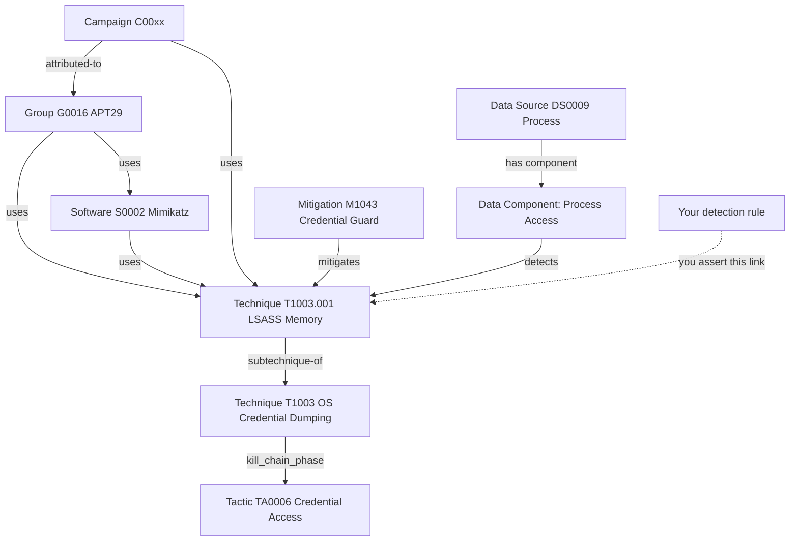
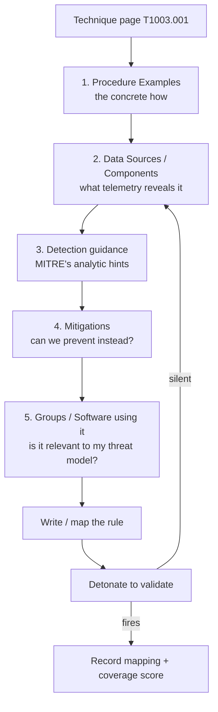
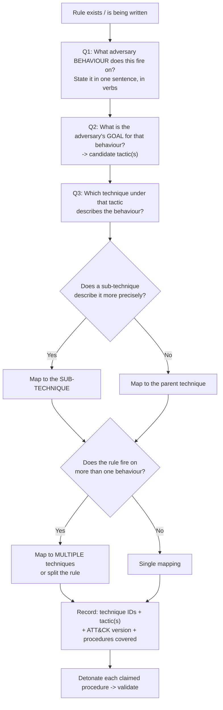
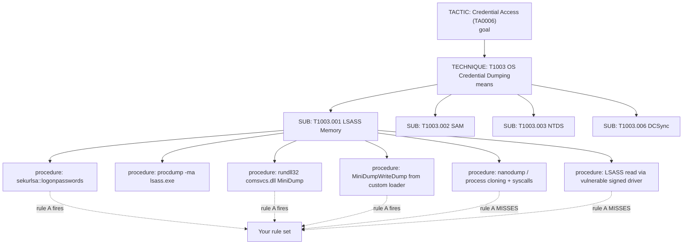
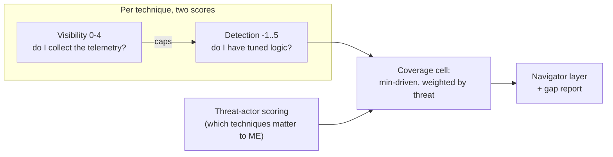
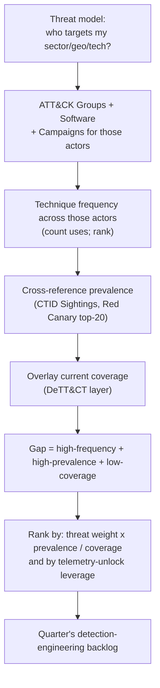
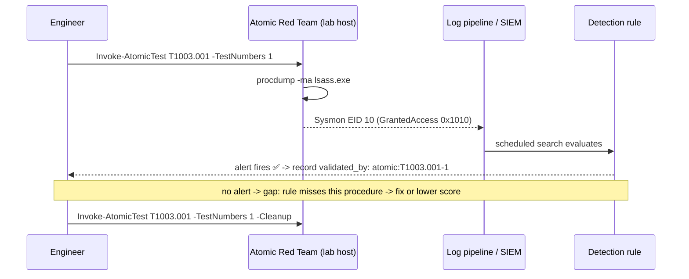

**Level:** Expert · **Track:** SOC & Blue Team · **Read time:** 210 min

This is Chapter 5 of the Detection Engineering notebook. Chapter 1 gave you Sigma as a portable rule format, Chapters 2 and 3 gave you the endpoint telemetry and file/memory pattern matching that feed detections, and Chapter 4 had you write real tuned rules in SPL and KQL. Every one of those rules ended with a line like `attack.t1003.001` or `mitre_attack_id: T1558.003`, and we treated that line as a label. This chapter is about taking that label seriously — because the mapping is not documentation, it is the *measurement layer* of a detection programme, and a programme that maps carelessly will confidently report 80% coverage of an adversary it cannot actually see.

## Why This Matters

There is a specific, repeatable failure that happens in detection programmes around the eighteen-month mark. The team has written two or three hundred rules. Someone — a CISO, a board, an auditor, a new head of security — asks the reasonable question: *"which attacks can we detect?"* The team exports its rule list, counts distinct ATT&CK technique IDs, colours a Navigator layer green, and reports something like "we cover 142 of 200-odd Enterprise techniques". Six weeks later a red team walks through the environment using nothing exotic, and every single technique they used was green on that map.

Nothing was falsified. The failure is structural, and it has four causes that this chapter exists to fix:

1. **Mapping at the wrong granularity.** A rule mapped to `T1003` (OS Credential Dumping) claims the whole technique when it only detects `T1003.001` (LSASS Memory) — and only the handle-open procedure at that, not the comsvcs.dll MiniDump variant, not the `MiniDumpWriteDump` API path, not the direct-syscall path, not NTDS.dit extraction.
2. **Confusing a rule with a capability.** Having *a* rule for a technique says nothing about whether the log source it needs is onboarded on the hosts that matter, whether the rule is enabled, whether it is tuned into uselessness, or whether it is trivially evaded by renaming a binary.
3. **Counting techniques instead of weighting them.** All 200-odd techniques are not equally likely and not equally damaging. A coverage percentage that treats `T1546.014` (Emond) as equal in weight to `T1059.001` (PowerShell) is a number with no decision value.
4. **Never validating the mapping by detonation.** The mapping is an assertion — "if this technique happens, this rule fires". Until you fire the technique in a lab and watch the rule fire, it is a hypothesis.

Done properly, ATT&CK mapping turns a pile of rules into an instrument. You get a map that shows where you are blind, a defensible way to prioritise the next quarter's engineering, a shared vocabulary with threat intel and red team, and — the part that matters in interviews and promotion packets — the ability to say "we increased detection coverage of the credential-access techniques used by the three intrusion sets that target our sector from 2 of 11 to 9 of 11, validated by detonation" instead of "we wrote forty rules".

The whole chapter carries the same ethical framing as the rest of the notebook: offensive techniques appear here as *the thing being mapped and detonated in a lab you own*, never as instructions to use against systems you do not control. Atomic Red Team and CALDERA in Parts 12 and 13 are run against a lab domain, full stop.

## Part 1: What ATT&CK Actually Is (And What It Is Not)

**MITRE ATT&CK** — Adversarial Tactics, Techniques, and Common Knowledge — is a curated, publicly maintained knowledge base of adversary behaviour observed in real intrusions. It began inside MITRE around 2013 as a way to structure the findings of an internal adversary-emulation research programme (FMX), and went public in 2015. Its defining property, and the reason it displaced every prior taxonomy in operational security, is that it is **empirical**: an entry exists because someone documented a real adversary doing it, and nearly every technique page cites the public reporting that justifies it.

Three characteristics matter for detection engineering:

- **It is behaviour-centric, not tool-centric.** ATT&CK does not have an entry for "Mimikatz". It has `T1003.001 OS Credential Dumping: LSASS Memory`, and Mimikatz appears as one of many *software* objects that implement it. This is exactly the Pyramid of Pain stance from Chapter 4, encoded as a taxonomy: if you detect the behaviour, the attacker swapping tools does not save them.
- **It is a knowledge base, not a threat model, maturity model, or compliance standard.** ATT&CK tells you what adversaries do. It does not tell you what *your* adversaries do, what your risk appetite is, or what "good" looks like. Every organisation that treats "100% of ATT&CK" as the goal has misread it — full coverage is neither achievable nor desirable, because much of the matrix is irrelevant to any given environment (no macOS estate, no ESXi, no ICS).
- **It is versioned and it moves.** MITRE ships roughly two major releases a year (historically around April and October) plus minor ones. Techniques get added, deprecated, revoked, renamed, and — most disruptively — *split into sub-techniques*. A mapping written against one version can silently rot against the next. Part 7 covers pinning the version in your rule metadata, and the lab in Part 13 validates every mapping against a specific bundle.

ATT&CK is published as several **domains** (sometimes loosely called matrices):

| Domain | STIX collection name | Scope | Typical detection relevance |
|---|---|---|---|
| Enterprise | `enterprise-attack` | Windows, Linux, macOS, Network Devices, Containers, IaaS/SaaS/Identity/Office Suite, plus PRE (recon/resource development) | The default for a corporate SOC; almost every rule you write maps here |
| Mobile | `mobile-attack` | Android, iOS | MDM/MTD telemetry; rarely mapped by a Windows-centric SOC |
| ICS | `ics-attack` | Industrial control systems, OT protocols and assets | Essential for utilities, manufacturing, energy; different data sources entirely |

Within Enterprise, the matrix is presented per-platform: the "Windows matrix" is a filtered view of the same technique objects whose `x_mitre_platforms` array contains `Windows`. There is no separate Windows knowledge base — a point that matters when you write scripts, because filtering by platform is a property filter, not a different file.

**What ATT&CK is not:** it is not the Cyber Kill Chain (Lockheed Martin's seven linear phases), and it is not a replacement for it. The kill chain is a coarse narrative arc; ATT&CK is a dense, non-linear catalogue of behaviours where an intrusion may revisit tactics repeatedly. Nor is ATT&CK the **Diamond Model** (adversary/capability/infrastructure/victim), which is an analytic model for a single intrusion event. In a mature programme these coexist: Diamond Model for structuring an individual event, ATT&CK for cataloguing behaviour across events, kill chain for executive narrative.

**Red team relevance:** the same taxonomy runs in the other direction. An emulation plan is literally a sequence of ATT&CK technique IDs with chosen procedures; a red team report that says "we achieved domain admin" is far less useful to the blue team than one that says "T1558.003 → T1003.006 → T1021.002, and only the third fired an alert".

## Part 2: The ATT&CK Object Model — Everything You Will Ever Map To

Everything in ATT&CK is a typed object with a stable ID, and the whole knowledge base is published as **STIX 2.1** JSON. Knowing the object types and their ID prefixes is what lets you write tooling instead of copying IDs out of a browser.

| Object type | ID prefix | STIX type | Example | What it is |
|---|---|---|---|---|
| Tactic | `TA` | `x-mitre-tactic` | `TA0006` Credential Access | The adversary's *goal* — the "why" of a behaviour |
| Technique | `T` (4 digits) | `attack-pattern` | `T1003` OS Credential Dumping | *How* the goal is achieved |
| Sub-technique | `T####.###` | `attack-pattern` (with `x_mitre_is_subtechnique: true`) | `T1003.001` LSASS Memory | A more specific means of the parent technique |
| Mitigation | `M` | `course-of-action` | `M1026` Privileged Account Management | A configuration/control that prevents or constrains the technique |
| Group | `G` | `intrusion-set` | `G0016` APT29 | A tracked set of related intrusion activity |
| Software | `S` | `malware` or `tool` | `S0002` Mimikatz | A tool or malware family implementing techniques |
| Campaign | `C` | `campaign` | `C0015` | A time-bounded set of intrusions against specific targets (added in ATT&CK v12) |
| Data Source | `DS` | `x-mitre-data-source` | `DS0009` Process | A category of telemetry that can reveal techniques |
| Data Component | — (child of DS) | `x-mitre-data-component` | Process Creation | The specific observable within a data source |
| Asset (ICS) | `A` | `x-mitre-asset` | ICS device classes | Equipment an ICS technique targets |
| Detection / Analytic | `DET` / `AN` | ATT&CK-native detection objects | — | Structured detection guidance introduced in recent ATT&CK versions |

The relationships between them are as important as the objects. In STIX these are `relationship` objects with a `relationship_type`:



That dotted line is the entire subject of this chapter. Every other edge is curated by MITRE; the edge from *your rule* to *a technique* is curated by you, and it is the one nobody audits until a red team does.

### Tactics: the fourteen columns of Enterprise

The Enterprise tactics, in the order the matrix presents them:

| Order | Tactic | ID | Adversary goal |
|---|---|---|---|
| 1 | Reconnaissance | TA0043 | Gather information to plan the operation (mostly pre-compromise) |
| 2 | Resource Development | TA0042 | Build/buy/steal infrastructure and capabilities |
| 3 | Initial Access | TA0001 | Get into the network |
| 4 | Execution | TA0002 | Run adversary-controlled code |
| 5 | Persistence | TA0003 | Keep access across reboots and credential changes |
| 6 | Privilege Escalation | TA0004 | Gain higher-level permissions |
| 7 | Defense Evasion | TA0005 | Avoid detection |
| 8 | Credential Access | TA0006 | Steal account names and secrets |
| 9 | Discovery | TA0007 | Learn the environment |
| 10 | Lateral Movement | TA0008 | Move to other systems |
| 11 | Collection | TA0009 | Gather data of interest |
| 12 | Command and Control | TA0011 | Communicate with compromised systems |
| 13 | Exfiltration | TA0010 | Steal data out |
| 14 | Impact | TA0040 | Manipulate, interrupt, or destroy |

Note the numeric IDs are *not* in matrix order — `TA0010` (Exfiltration) precedes `TA0011` (Command and Control) numerically but follows it in the matrix. IDs were assigned as tactics were created; the display order is a separate property (`x_mitre_shortname` ordering in the matrix object). Sorting a Navigator layer by tactic ID and expecting kill-chain order is a classic scripting bug.

**A technique can belong to multiple tactics.** This is the single most misunderstood property of the model. `T1053.005 Scheduled Task` sits in Execution, Persistence, *and* Privilege Escalation, because the same behaviour serves three goals. In STIX this appears as multiple entries in the technique's `kill_chain_phases` array. Consequence for your tooling: **a technique-to-tactic lookup is one-to-many**, and if your coverage script assumes one tactic per technique it will silently drop cells from your heatmap.

```json
"kill_chain_phases": [
  { "kill_chain_name": "mitre-attack", "phase_name": "execution" },
  { "kill_chain_name": "mitre-attack", "phase_name": "persistence" },
  { "kill_chain_name": "mitre-attack", "phase_name": "privilege-escalation" }
]
```

### Sub-techniques: the change that broke everyone's mappings

Before ATT&CK v7 (mid-2020) there was a flat list of several hundred techniques of wildly inconsistent granularity — `T1086 PowerShell` sat beside `T1078 Valid Accounts`. v7 introduced sub-techniques and restructured the matrix: `T1086` was **revoked** and its content moved to `T1059.001 Command and Scripting Interpreter: PowerShell`.

Two mechanisms matter when you maintain mappings across versions:

- **Revoked** (`revoked: true`, plus a `revoked-by` relationship): the object was replaced by another object. Your mapping should be rewritten to the successor. The old ID keeps resolving on the website but is dead in the data.
- **Deprecated** (`x_mitre_deprecated: true`): the object was withdrawn without a successor — the behaviour was judged out of scope or merged away. Your mapping should be removed or re-derived from scratch.

Any mapping validator you write must check both flags. A rule tagged `attack.t1086` is not "covering PowerShell execution" in any modern reporting tool — it maps to nothing, and it will silently vanish from your coverage count or, worse, be counted as an unrecognised technique.

**Blue team usage:** keep a `revoked-by` translation table generated from the STIX bundle and run it over your rule repo on every ATT&CK upgrade. Part 13's lab builds exactly this.

## Part 3: Reading a Technique Page Like a Detection Engineer

An ATT&CK technique page has a fixed anatomy, and a detection engineer reads it in a specific, non-obvious order. Take `T1003.001 OS Credential Dumping: LSASS Memory` as the running example.



**Start at Procedure Examples, not the description.** The description tells you what the technique *is*; the procedure examples tell you what actually lands in your logs. For `T1003.001` the procedures include: Mimikatz `sekurlsa::logonpasswords`, `procdump -ma lsass.exe`, `rundll32 comsvcs.dll, MiniDump <pid> out.dmp full`, Task Manager's "Create dump file", direct `MiniDumpWriteDump` calls from custom loaders, `nanodump` using cloned processes and direct syscalls, and reading LSASS via a signed vulnerable driver. **These are the things your rule must survive.** A rule keyed on `procdump.exe` covers exactly one procedure out of eight and yet, mapped naively, turns the whole sub-technique green.

**Then read Data Sources and Data Components.** For `T1003.001` these include Process: Process Access (the handle-open event — Sysmon EID 10), Process: OS API Execution, Command: Command Execution, and File: File Access. This is a telemetry shopping list. Cross-reference it against what you actually collect, per Chapter 2. If you do not have Sysmon EID 10 on the hosts that hold privileged sessions, no amount of rule-writing covers this sub-technique on those hosts.

**Read the Detection guidance sceptically.** MITRE's guidance is deliberately vendor-neutral and often reads as "monitor for unexpected processes accessing lsass.exe". That is the *shape* of the analytic, not the analytic — the `GrantedAccess` masks, allow-listed AV/EDR callers, and thresholding from Chapter 4 are yours to supply.

**Read Mitigations before writing the rule.** `T1003.001` lists mitigations including Credential Guard (M1043 / `M1043 Credential Access Protection`), Privileged Account Management (M1026), and attack-surface-reduction rules that block credential stealing from LSASS. A technique you can *prevent* on 95% of the estate is a technique where the rule's job changes: it stops being a needle-in-haystack detection and becomes a high-fidelity "someone attempted the thing we block" alert. That materially changes threshold and severity — a point worth making in your rule's own metadata.

**Finally, check Groups and Software.** If the technique is used by intrusion sets that target your sector, it climbs the priority list. If it is used by one group that has only ever targeted a foreign government sector you have no exposure to, it is honest to record it as deliberately out of scope rather than as a gap.

> **CTF and lab relevance:** almost every "detect the attack" challenge on CyberDefenders or Blue Team Labs Online is answerable faster if you read the technique page first and derive which event IDs to pivot on, rather than grepping blindly. Reading procedure examples is genuinely a speed skill.

## Part 4: Data Sources and Data Components — The Telemetry-First View

ATT&CK v10 (late 2021) replaced a loose list of data-source strings with a proper two-level object model, and it is the most useful part of ATT&CK for a detection engineer because it inverts the usual question. Instead of "what techniques do I cover?", it lets you ask **"given the telemetry I actually collect, what could I theoretically detect?"** — a question with a defensible answer, because telemetry onboarding is something you can measure directly.

A **Data Source** (`DS####`) is a category of information; a **Data Component** is the specific observable within it. Data components are what link to techniques via the `detects` relationship.

| Data Source | ID | Representative Data Components | Real-world telemetry that supplies it |
|---|---|---|---|
| Process | DS0009 | Process Creation, Process Access, Process Metadata, OS API Execution, Process Termination | Sysmon 1/10/25, Windows 4688, EDR process events, Linux auditd `execve`, eBPF |
| Command | DS0017 | Command Execution | Sysmon 1 CommandLine, PowerShell 4104, auditd, bash/zsh audit, EDR command lines |
| File | DS0022 | File Creation, File Modification, File Access, File Deletion, File Metadata | Sysmon 11/23/26, Windows 4663, EDR file events, auditd watches, osquery FIM |
| Network Traffic | DS0029 | Network Connection Creation, Network Traffic Flow, Network Traffic Content | Sysmon 3, Zeek `conn.log`/`http.log`/`dns.log`, NetFlow, firewall logs, proxy |
| Logon Session | DS0028 | Logon Session Creation, Logon Session Metadata | Windows 4624/4625/4648, Linux `wtmp`/PAM, IdP sign-in logs |
| Windows Registry | DS0024 | Windows Registry Key Creation/Modification/Deletion/Access | Sysmon 12/13/14, Windows 4657, EDR registry events |
| Active Directory | DS0026 | AD Object Creation/Modification/Access, AD Credential Request | Windows 4662/4769/4728, DC security logs, LDAP query logging |
| Cloud Service | DS0025 | Cloud Service Metadata, Cloud Service Modification, Cloud Service Enumeration | CloudTrail, Azure Activity, GCP Audit Logs |
| Application Log | DS0015 | Application Log Content | SaaS audit logs, app-specific logs, WAF |
| Module | DS0011 | Module Load | Sysmon 7, EDR image load |
| Script | DS0012 | Script Execution | PowerShell 4104, WMI activity, AMSI |
| Named Pipe | DS0023 | Named Pipe Metadata | Sysmon 17/18 |

Two engineering consequences fall out of this table immediately.

**First, data-component coverage is a *ceiling* on technique coverage.** If `Process: Process Access` is not collected on server-class hosts, then every technique whose only realistic detection component is Process Access is undetectable there — no rule can fix it. This is why mature programmes report *two* numbers: visibility (do I have the telemetry?) and detection (do I have logic on top of it?). DeTT&CT in Part 10 formalises exactly this split.

**Second, data-source mapping is the cheapest possible coverage win.** Onboarding Sysmon EID 10 across a server fleet raises the theoretical ceiling for dozens of techniques in one change; writing one more rule raises it for one. When you present a roadmap, the telemetry line item almost always beats the rule-writing line item on coverage-per-unit-effort, and the data-component model is how you prove it.

Here is the query shape that produces that argument, run against the STIX bundle (full working script in Part 13):

```python
# Which techniques become theoretically detectable if we onboard one data component?
component = "Process Access"
techs = [t for t in techniques
         if component in datacomponents_detecting(t)]
print(f"{component}: unlocks {len(techs)} techniques")
# Process Access: unlocks ~40 techniques (exact count varies by ATT&CK version)
```

**Pitfall:** the `detects` relationships are guidance, not gospel. MITRE maps components generously — `Command: Command Execution` "detects" an enormous fraction of the matrix, because almost anything leaves a command line *somewhere*. Treating that as "if I collect command lines I detect 60% of ATT&CK" is exactly the coverage illusion. Command lines are necessary, not sufficient; the analytic still has to exist and still has to be robust.

## Part 5: The Mapping Discipline — Getting the Assertion Right

Mapping looks trivial ("add a tag") and is not. MITRE and the Center for Threat-Informed Defense publish a formal methodology for mapping *narrative reporting* to ATT&CK; the same steps, slightly adapted, are how you map a *detection*. Here is the adapted procedure, which you should run every time you write a rule.



### Step 1: state the behaviour in verbs, not in tool names

Write the one-sentence behaviour statement before you look at the matrix. This forces the abstraction that makes the mapping correct.

- Bad: "fires when Mimikatz runs." (tool, not behaviour — and the rule probably does not actually detect the tool)
- Good: "fires when a process that is not a known security agent opens a handle to `lsass.exe` with read-memory access rights."

The good version maps cleanly and obviously: the goal is stealing credentials (Credential Access, TA0006); the means is dumping from OS credential stores (`T1003`); the specific store is LSASS memory (`T1003.001`). The bad version could map to almost anything Mimikatz does — and Mimikatz does credential dumping, ticket manipulation (`T1550.003` Pass the Ticket, `T1558.001` Golden Ticket), DCSync (`T1003.006`), and more.

### Step 2: goal before mechanism

Ambiguity in ATT&CK almost always resolves at the tactic layer, because the same *action* can be different *techniques* depending on intent. Running `net user /domain` is Discovery (`T1087.002 Account Discovery: Domain Account`). Running `net user attacker P@ss /add /domain` is Persistence/Privilege Escalation (`T1136.002 Create Account: Domain Account`). Same binary, same log source, entirely different mapping — because the goal differs.

### Step 3 & 4: technique, then sub-technique if warranted

**Map to the most specific object your rule actually justifies.** Two symmetric errors:

- **Over-specific:** mapping a broad rule ("any non-agent process opens LSASS handle") to `T1003.001` is right; mapping a broad rule ("any suspicious command line") to `T1059.001` is wrong if it fires on `cmd.exe` too — that is `T1059` with several children, or better, several explicit mappings.
- **Under-specific (much more common):** mapping to the parent `T1003` when you only detect LSASS. This inflates coverage by claiming NTDS.dit (`.003`), LSA Secrets (`.004`), Cached Domain Credentials (`.005`), DCSync (`.006`), and `/etc/shadow` (`.008`) that you do not detect at all.

Rule of thumb: **map to the parent technique only when your logic genuinely fires across its sub-techniques.** If it does not, map to the sub-technique(s) you cover and let the parent show as partially covered — most tooling, including Navigator, will display parent coverage derived from children.

### Step 5: multi-mapping and the "one rule, many techniques" case

Some rules legitimately map to several techniques. A rule detecting `rundll32.exe comsvcs.dll,MiniDump` covers `T1003.001` (the goal) *and* `T1218.011 System Binary Proxy Execution: Rundll32` (the means of evasion). Both mappings are true and both should be recorded. Conversely, if a rule fires on five unrelated behaviours because someone crammed them into one saved search with `OR`s, the honest fix is to split the rule — a single alert that could mean five different things has no triage playbook, which violates the five-part anatomy from Chapter 4.

### The mis-mappings you will see in every real repo

| Mis-mapping | Why it happens | Fix |
|---|---|---|
| Everything tagged `T1059` | Command lines appear in most rules; engineers tag the log source, not the behaviour | Tag the behaviour the command *achieves*; `T1059.x` only when the point is the interpreter itself |
| Parent technique used where a sub-technique fits | Copy-paste from an old pre-v7 rule, or laziness | Validate: does the rule fire for every sub-technique? If no, demote |
| Tactic-only mapping (`Credential Access`, no ID) | Rule format has a "category" field and no technique field | Tactic alone is not a mapping; it cannot be scored or Navigator-rendered |
| Revoked IDs (`T1086`, `T1064`) | Rules older than ATT&CK v7 never migrated | Automated `revoked-by` rewrite on every upgrade |
| `T1078 Valid Accounts` on every identity alert | It is genuinely broad, so it becomes a dumping ground | Prefer the specific behaviour (`T1110.003` spray, `T1621` MFA fatigue, `T1550.001` token) and add `T1078.x` only when the point is legitimate-credential abuse |
| Mapping the *impact* instead of the behaviour | "Ransomware detection" tagged `T1486` when the rule actually detects shadow-copy deletion | Tag what fires: `T1490 Inhibit System Recovery`; add `T1486` only if the rule sees encryption itself |
| Detection of a *tool* mapped as a technique | "Cobalt Strike detection" | Map the behaviour (`T1071.001`, `T1055`, `T1021.002`) and record the software ID `S0154` in a separate field |

**Bug bounty aside:** mapping discipline is not a bounty skill, but it is directly relevant if you write detection content for a vendor or contribute to SigmaHQ — pull requests are routinely rejected for exactly the sub-technique/parent errors above, and getting them right is the difference between a merged rule and a stalled PR.

## Part 6: Granularity, Procedures, and the Coverage Illusion

ATT&CK has three levels of abstraction and only two of them have IDs. Tactic → Technique → Sub-technique are catalogued. Below them sits the **procedure**: the specific implementation an adversary used. Procedures are described in prose on technique pages and are *not* individually addressable — and that is where coverage claims go to die, because **detections fire on procedures, but coverage is counted in techniques.**



A rule keyed on Sysmon EID 10 `GrantedAccess` masks catches P1–P4 and (depending on implementation) may miss P5 and P6 entirely — process cloning changes the target of the handle, and a kernel driver reading LSASS memory produces no user-mode handle event at all. Yet in a technique-count report, `T1003.001` is one green cell either way.

Three honest responses to this, in increasing order of maturity:

1. **Record procedures covered in rule metadata.** A free-text `procedures_covered:` list is unglamorous and immediately useful during red-team debriefs.
2. **Score coverage instead of colouring it binary.** A 0–5 scale (Part 10) makes "we have something" distinguishable from "we have robust, tuned, validated logic".
3. **Score the *robustness* of the analytic**, which is what CTID's **Summiting the Pyramid** project formalises: it evaluates how hard an analytic is for an adversary to evade, by looking at whether the observable it keys on is incidental to the technique (a specific filename, a specific string — trivially changed) or core to it (the handle right required to read LSASS memory — cannot be avoided while still achieving the goal). An analytic that keys on `procdump.exe` and one that keys on the access mask both "detect T1003.001"; only one survives a rename.

The practical formulation to internalise, and to say out loud in design reviews:

> Coverage of a technique is not "do we have a rule", it is "for what fraction of realistic procedures does our logic fire, on what fraction of relevant hosts, with what robustness against evasion, validated when?"

**Red team usage:** the mirror image of this is how a red team picks its procedure. Given a target with a mature Sysmon-based detection stack, the operator selects the procedure *least likely to be covered* — the one that avoids the observable the analytic keys on. Reading a defender's rule repo mappings is, for an insider-threat or purple-team exercise, a map of exactly which procedures to use.

## Part 7: Encoding the Mapping — Every Format You Will Meet

A mapping that lives in a wiki is a mapping that rots. It must live *in the rule*, in a machine-readable field, so that a script can extract every mapping in the repo without a human. Here is how each major format expresses it. These are the exact shapes to copy.

### Sigma (Chapter 1's portable format)

Sigma uses a flat `tags` list, lowercase, with `attack.` prefixes. Tactics use the tactic short name with underscores; techniques use the ID with the dot preserved.

```yaml
title: LSASS Memory Access From Unusual Process
id: 8e4d6d19-4f7a-4f5f-9f34-3d5c2b0f7a11
status: experimental
description: >
  Detects a process opening a handle to lsass.exe with memory-read access
  rights, excluding known security agents. Covers procdump, comsvcs MiniDump,
  Task Manager dump and custom MiniDumpWriteDump loaders.
references:
  - https://attack.mitre.org/techniques/T1003/001/
author: Detection Engineering
date: 2024/01/01
tags:
  - attack.credential_access      # tactic: TA0006
  - attack.t1003.001              # sub-technique
  - attack.s0002                  # software: Mimikatz (optional, informational)
logsource:
  product: windows
  category: process_access
detection:
  selection:
    TargetImage|endswith: '\lsass.exe'
    GrantedAccess:
      - '0x1010'
      - '0x1410'
      - '0x1438'
      - '0x143a'
      - '0x1fffff'
  filter_agents:
    SourceImage|startswith:
      - 'C:\Program Files\Windows Defender\'
      - 'C:\Program Files\<EDR vendor>\'
  condition: selection and not filter_agents
falsepositives:
  - Endpoint protection and backup agents not present in the filter list
  - Legitimate crash-dump collection tooling
level: high
```

Notes that matter:

- **Tactic tags are the short name, not the ID**: `attack.credential_access`, not `attack.ta0006`. Both forms appear in the wild; the tactic-name form is what SigmaHQ uses, and `sigma-cli` backends expect it when they emit SIEM-native annotations.
- The tag list is *flat and untyped* — nothing stops you writing `attack.t1003.0001`. Validation is on you (Part 13).
- Adding the software tag (`attack.s0002`) is optional and informational; do not let it substitute for the technique tag.

### Splunk Enterprise Security / ESCU

Splunk's detection content carries the mapping in YAML that compiles into `savedsearches.conf` annotations:

```yaml
name: LSASS Memory Access From Unusual Process
id: 3b1f0f5a-1c2d-4d0e-9a11-77c9e0a2b134
version: 1
description: Detects non-agent processes opening LSASS with memory-read rights.
search: >
  `sysmon` EventCode=10 TargetImage="*\\lsass.exe"
  GrantedAccess IN (0x1010,0x1410,0x1438,0x143a,0x1fffff)
  NOT SourceImage IN ("C:\\Program Files\\Windows Defender\\*")
  | stats count min(_time) as firstTime by host, SourceImage, GrantedAccess
tags:
  analytic_story:
    - Credential Dumping
  mitre_attack_id:
    - T1003.001
    - T1003
  product:
    - Splunk Enterprise Security
  security_domain: endpoint
  asset_type: Endpoint
```

The resulting `savedsearches.conf` stanza carries:

```ini
action.correlationsearch.annotations = {"mitre_attack": ["T1003.001"], "kill_chain_phases": ["Actions on Objectives"], "nist": ["DE.CM"], "cis20": ["CIS 8"]}
```

That `annotations` JSON is what Splunk ES's own ATT&CK dashboards read. **Splunk ES will happily accept an invalid or revoked ID** — it does not validate against the knowledge base. Your CI does.

### Microsoft Sentinel analytics rules

Sentinel splits the mapping into two fields, one for tactics (names) and one for techniques (IDs):

```yaml
id: 6c1a1f37-0c53-4b1e-9a3f-2f5c9b4f0d21
name: LSASS Memory Access From Unusual Process
description: |
  'Non-agent process opened a handle to lsass.exe with memory-read rights.'
severity: High
requiredDataConnectors:
  - connectorId: SecurityEvents
    dataTypes:
      - SecurityEvent
queryFrequency: 15m
queryPeriod: 15m
triggerOperator: gt
triggerThreshold: 0
tactics:
  - CredentialAccess
relevantTechniques:
  - T1003.001
query: |
  DeviceEvents
  | where ActionType == "ProcessAccess"
  | where FileName =~ "lsass.exe"
  ...
```

`tactics` uses PascalCase names from a fixed enum (`CredentialAccess`, `DefenseEvasion`, `CommandAndControl`, …) — a common source of deployment failures when a script emits `Credential Access` with a space. `relevantTechniques` takes bare IDs and, in current schema versions, accepts sub-technique IDs (older schema versions accepted only parent techniques, which is why you still see repos where every mapping is a parent — a version artefact, not an engineering choice).

### Elastic Security detection rules

Elastic uses a nested `threat` array that is by far the most complete of the four, because it makes the tactic/technique/sub-technique hierarchy explicit:

```json
"threat": [
  {
    "framework": "MITRE ATT&CK",
    "tactic": {
      "id": "TA0006",
      "name": "Credential Access",
      "reference": "https://attack.mitre.org/tactics/TA0006/"
    },
    "technique": [
      {
        "id": "T1003",
        "name": "OS Credential Dumping",
        "reference": "https://attack.mitre.org/techniques/T1003/",
        "subtechnique": [
          {
            "id": "T1003.001",
            "name": "LSASS Memory",
            "reference": "https://attack.mitre.org/techniques/T1003/001/"
          }
        ]
      }
    ]
  }
]
```

Note the structural implication: in Elastic, a sub-technique mapping *necessarily* carries its parent. In Sigma it does not. When you write a cross-format coverage script, normalise this — decide once whether `T1003.001` implies a claim on `T1003`, and apply it uniformly. (Recommended: it does **not** imply full parent coverage; it contributes *partial* parent coverage, which is how Navigator renders it.)

### The metadata fields your rules should carry beyond the ID

The four formats above give you the technique ID. For the honest coverage model of Part 6 you want more. Whatever your format, add these — Sigma's custom fields, Splunk's `tags`, Elastic's `note`/custom, Sentinel's `customDetails`:

| Field | Example | Why |
|---|---|---|
| `attack_version` | `"15.1"` | Lets a validator know which knowledge-base version the mapping was made against |
| `procedures_covered` | `["procdump", "comsvcs MiniDump", "MiniDumpWriteDump"]` | Turns a binary green cell into a specific claim |
| `procedures_not_covered` | `["process cloning + direct syscalls", "kernel driver read"]` | The honest gap statement; feeds the roadmap |
| `data_components` | `["Process: Process Access"]` | Enables telemetry-ceiling analysis |
| `robustness` | `core-to-technique` \| `implementation-specific` \| `ephemeral` | Summiting-the-Pyramid-style evasion resistance |
| `validated_by` | `atomic:T1003.001-1,T1003.001-2` | Ties the mapping to a detonation test |
| `platforms` | `["Windows"]` | Prevents claiming coverage on hosts the rule cannot run against |

## Part 8: ATT&CK Navigator — The Layer Format, From Scratch

**What it is.** ATT&CK Navigator is MITRE's open-source web app for annotating the matrix: you colour cells, score them, comment them, and overlay layers. It is the de facto lingua franca for communicating coverage — a Navigator layer JSON is the artefact you hand to a red team, receive from a threat-intel provider, or attach to a board deck.

**Why it exists.** The matrix has hundreds of cells across fourteen tactics; a spreadsheet cannot convey it. Navigator renders the matrix and applies your per-technique annotations, with the ability to combine layers arithmetically (e.g. "adversary techniques" minus "my coverage" = "my gaps against this adversary").

**Getting it.** Use the hosted instance at `mitre-attack.github.io/attack-navigator/`, or run it locally — which you should, since layers describing your coverage are sensitive:

```bash
git clone https://github.com/mitre-attack/attack-navigator.git
cd attack-navigator/nav-app
npm install
npm start
# serves on http://localhost:4200
```

For a container-only workflow:

```bash
docker build -t attack-navigator .
docker run -p 4200:4200 attack-navigator
```

**The layer file format.** A layer is a single JSON document. This is the complete minimal shape, annotated:

```json
{
  "name": "Detection Coverage - Enterprise",
  "versions": {
    "attack": "15",
    "navigator": "5.0.0",
    "layer": "4.5"
  },
  "domain": "enterprise-attack",
  "description": "Scored coverage derived from the detection rule repository.",
  "filters": {
    "platforms": ["Windows", "Linux", "macOS"]
  },
  "sorting": 0,
  "layout": {
    "layout": "side",
    "showID": true,
    "showName": true,
    "showAggregateScores": true,
    "aggregateFunction": "average",
    "countUnscored": false
  },
  "hideDisabled": false,
  "techniques": [
    {
      "techniqueID": "T1003.001",
      "tactic": "credential-access",
      "score": 4,
      "color": "",
      "comment": "3 rules; Sysmon EID10 GrantedAccess; validated atomic 1,2,4",
      "enabled": true,
      "metadata": [
        { "name": "rules", "value": "3" },
        { "name": "robustness", "value": "core-to-technique" }
      ],
      "links": [
        { "label": "Rule in repo", "url": "https://git.internal/rules/lsass_access.yml" }
      ],
      "showSubtechniques": false
    }
  ],
  "gradient": {
    "colors": ["#ff6666ff", "#ffe766ff", "#8ec843ff"],
    "minValue": 0,
    "maxValue": 5
  },
  "legendItems": [
    { "label": "0 - No coverage", "color": "#ff6666" },
    { "label": "3 - Partial, untuned", "color": "#ffe766" },
    { "label": "5 - Robust, validated", "color": "#8ec843" }
  ],
  "metadata": [
    { "name": "generated", "value": "coverage-pipeline" }
  ],
  "showTacticRowBackground": false,
  "selectTechniquesAcrossTactics": true,
  "selectSubtechniquesWithParent": false
}
```

Field-by-field, the ones that actually bite:

| Field | Meaning | Common mistake |
|---|---|---|
| `versions.layer` | Schema version of the layer file itself | Emitting `"4.0"` while using 4.5-only fields; Navigator rejects or silently drops them |
| `versions.attack` | ATT&CK version the layer targets | Omitting it, so nobody can tell whether `T1003.001` meant the same thing when it was written |
| `domain` | `enterprise-attack` / `mobile-attack` / `ics-attack` | Mixing ICS technique IDs into an enterprise layer |
| `techniques[].tactic` | Tactic **short name**, hyphenated (`credential-access`) | Using `TA0006` or `Credential Access`; the cell then fails to render |
| `techniques[].score` | Numeric score driving the gradient | Using `color` *and* `score` together — an explicit `color` overrides the gradient |
| `gradient.minValue/maxValue` | Range mapped across `gradient.colors` | Scores outside the range clamp silently, flattening your heatmap |
| `layout.aggregateFunction` | How parent cells summarise children (`average`, `min`, `max`, `sum`) | Leaving it on a default that makes one covered sub-technique light up the whole parent |
| `hideDisabled` | Hides `enabled: false` cells | Using it to hide out-of-scope techniques, then reporting a percentage over the *visible* cells only — an inflated denominator trick, usually unintentional |

**The tactic-duplication rule.** Because a technique can appear under several tactics, a layer entry is keyed on the **pair** (`techniqueID`, `tactic`). To colour `T1053.005` everywhere it appears you need three entries — one each for `execution`, `persistence`, `privilege-escalation` — or you set `selectTechniquesAcrossTactics: true` in the UI. Scripts that emit one entry per technique produce heatmaps with mysteriously uncoloured cells; this is the single most common Navigator scripting bug.

**Layer arithmetic** is Navigator's most under-used feature. In the UI, "Create Layer from other layers" lets you express a new layer's score as an expression over existing ones, referenced by letter:

```
# a = adversary technique layer (score 1 where the group uses the technique)
# b = my coverage layer (score 0-5)
a - b        # positive = technique used by adversary and weakly covered  -> the gap layer
a * b        # non-zero only where both -> validated overlap
(a > 0) * (b == 0)   # strict gaps
```

This is how you produce the single most useful slide in blue-team reporting: *"here are the techniques our priority adversary uses that we cannot see"*, generated rather than argued.

## Part 9: Programmatic Mapping with mitreattack-python and the STIX Data

**What it is.** `mitreattack-python` is MITRE's official Python library for working with ATT&CK content: reading the STIX bundles, resolving relationships, generating and manipulating Navigator layers, and exporting the knowledge base to Excel. It is the tool that turns mapping from a manual chore into a pipeline.

**Why it exists.** The raw data is a 30–40 MB STIX 2.1 JSON bundle with tens of thousands of objects and relationships; naive `json.load` plus loops is both slow and easy to get wrong (revoked objects, multi-tactic techniques, sub-technique parentage). The library encodes the correct traversals.

**Install and get the data:**

```bash
python3 -m venv ~/.venvs/attack && source ~/.venvs/attack/bin/activate
pip install mitreattack-python

# Official STIX 2.1 content (versioned, one file per domain per release)
git clone https://github.com/mitre-attack/attack-stix-data.git
ls attack-stix-data/enterprise-attack/
# enterprise-attack.json  (latest)  plus enterprise-attack-15.1.json etc.
```

> The older `mitre/cti` repository publishes STIX **2.0** and is still widely referenced; `attack-stix-data` publishes STIX **2.1** and is the current source. Pin a *specific versioned file* in CI — using the floating `enterprise-attack.json` means your coverage numbers change when MITRE ships a release, not when you ship a rule.

**Core usage — the traversals you will actually need:**

```python
from mitreattack.stix20 import MitreAttackData

mad = MitreAttackData("attack-stix-data/enterprise-attack/enterprise-attack-15.1.json")

# 1. Resolve an ID to an object
tech = mad.get_object_by_attack_id("T1003.001", "attack-pattern")
print(tech.name)                       # LSASS Memory
print(tech.x_mitre_is_subtechnique)    # True
print(tech.x_mitre_platforms)          # ['Windows']

# 2. All techniques, excluding revoked/deprecated (ALWAYS do this)
techniques = mad.get_techniques(remove_revoked_deprecated=True)
print(len(techniques))

# 3. Sub-techniques of a parent
subs = mad.get_subtechniques_of_technique(tech_parent_stix_id)

# 4. Which groups use this technique
groups = mad.get_groups_using_technique(tech.id)
for g in groups:
    print(g["object"].name)

# 5. Which data components detect it
for dc in mad.get_datacomponents_detecting_technique(tech.id):
    print(dc["object"].name)

# 6. Mitigations
for m in mad.get_mitigations_mitigating_technique(tech.id):
    print(m["object"].name)
```

**Building the revoked/deprecated translation table** — the single highest-value script in this whole chapter, because it is what keeps a rule repo from silently rotting:

```python
def build_migration_map(mad):
    """Return {old_attack_id: new_attack_id_or_None} for revoked/deprecated objects."""
    migration = {}
    for obj in mad.src.query([("type", "=", "attack-pattern")]):
        aid = mad.get_attack_id(obj.id)
        if not aid:
            continue
        if getattr(obj, "revoked", False):
            successors = mad.src.relationships(obj.id, "revoked-by", source_only=True)
            new_id = None
            if successors:
                new_obj = mad.src.get(successors[0].target_ref)
                new_id = mad.get_attack_id(new_obj.id)
            migration[aid] = new_id
        elif getattr(obj, "x_mitre_deprecated", False):
            migration[aid] = None       # no successor: mapping must be re-derived
    return migration

mig = build_migration_map(mad)
print(mig.get("T1086"))   # -> T1059.001
print(mig.get("T1064"))   # -> None (deprecated; behaviour split across T1059.x / T1027)
```

**Generating a Navigator layer programmatically:**

```python
from mitreattack.navlayers import Layer, ToSvg, ToExcel

layer_dict = {
    "name": "Detection Coverage",
    "versions": {"attack": "15", "navigator": "5.0.0", "layer": "4.5"},
    "domain": "enterprise-attack",
    "techniques": [
        {"techniqueID": "T1003.001", "tactic": "credential-access", "score": 4},
        {"techniqueID": "T1558.003", "tactic": "credential-access", "score": 3},
    ],
    "gradient": {"colors": ["#ff6666ff", "#ffe766ff", "#8ec843ff"],
                 "minValue": 0, "maxValue": 5},
}

layer = Layer(layer_dict)
layer.to_file("coverage.json")
ToSvg(domain="enterprise-attack", source="local",
      resource="attack-stix-data/enterprise-attack/enterprise-attack-15.1.json"
      ).to_svg(layerInit=layer, filepath="coverage.svg")
ToExcel(domain="enterprise-attack").to_xlsx(layerInit=layer, filepath="coverage.xlsx")
```

**Exporting the whole knowledge base to spreadsheets** — useful for handing techniques to non-technical stakeholders, and for building lookup tables in a SIEM:

```bash
python -m mitreattack.attackToExcel.attackToExcel -domain enterprise-attack -output ./attack-excel
ls ./attack-excel/enterprise-attack/
# enterprise-attack-techniques.xlsx, -groups.xlsx, -mitigations.xlsx,
# -software.xlsx, -datasources.xlsx, -campaigns.xlsx, -relationships.xlsx
```

**Blue team usage:** load `enterprise-attack-techniques.xlsx` into your SIEM as a lookup (Splunk `| inputlookup attack_techniques`, Sentinel Watchlist, Elastic enrich policy) and enrich alerts at query time with technique name, tactic, and platform. Analysts stop context-switching to a browser mid-triage, and your alert schema gains a joinable key.

## Part 10: Honest Coverage Scoring — DeTT&CT and the Visibility/Detection Split

Binary coverage ("we have a rule / we don't") is the number that lies. Two open frameworks fix it by splitting the question in two and scoring each on a scale.

**DeTT&CT** (Detect Tactics, Techniques & Combat Threats), from the Dutch national police / Rabobank blue teams, is the most widely used. Its central insight is that **visibility and detection are different axes**:

- **Visibility** — do you *collect and retain* the telemetry that could reveal this technique, on the hosts where it matters, at sufficient quality? Scored 0–4 (0 none → 4 excellent, e.g. process-creation events with full command lines, retained, everywhere).
- **Detection** — do you have *logic* on top of that telemetry, and how good is it? Scored -1 to 5 (-1 N/A, 0 forensic-only, 1 basic, 2 some tuning, 3 good, 4 very good, 5 excellent/validated).

The relationship is a hard dependency: **detection score is capped by visibility score.** You cannot have detection 4 on a technique whose telemetry you score visibility 1 — the logic has nothing to run on. This is the model that stops the "we have a rule" illusion cold, because a rule against un-onboarded telemetry scores 0 on the axis that matters.



**Using DeTT&CT:**

```bash
git clone https://github.com/rabobank-cdc/DeTTECT.git
cd DeTTECT
pip install -r requirements.txt
python dettect.py --help

# Editor (YAML administration files for data sources, techniques, groups):
python dettect.py editor        # serves the web editor on localhost

# Generate a data-source (visibility) Navigator layer from your DS admin file:
python dettect.py datasource -fd data-sources.yaml -l

# Generate a detection/visibility overlay from your technique admin file:
python dettect.py detection -ft techniques-administration.yaml -l -g

# Overlay your visibility against a threat actor's techniques:
python dettect.py group -g groups.yaml -o techniques-administration.yaml -t detection
```

DeTT&CT keeps three YAML "administration" files under version control — data sources, techniques (with per-technique visibility+detection scores and history), and groups (which actors you care about). Its output is Navigator layers, so it plugs straight into Part 8.

**The scoring rubric to standardise on** (adapt, but write it down so scores are comparable across engineers):

| Detection score | Meaning | Concretely |
|---|---|---|
| -1 | Not applicable / out of scope | No relevant assets (e.g. macOS technique, no Macs) |
| 0 | Forensics only | Data exists; you could find it after the fact but nothing alerts |
| 1 | Basic | A rule exists but untuned / IOC-based / one procedure only |
| 2 | Fair | Behaviour-based, some FP tuning, single log source |
| 3 | Good | Behaviour-based, tuned, covers most procedures, correlated |
| 4 | Very good | As 3, multiple data sources, resilient to common evasion |
| 5 | Excellent | As 4, validated by detonation, robustness = core-to-technique |

| Visibility score | Meaning |
|---|---|
| 0 | Not collected |
| 1 | Collected on few hosts / low quality / short retention |
| 2 | Collected on many hosts, some gaps |
| 3 | Broad, good quality, adequate retention |
| 4 | Comprehensive, high quality, everywhere it matters, long retention |

**Summiting the Pyramid** (CTID) is the complementary framework for the *robustness* axis referenced in Part 6: it scores how evadable an analytic is, from Level 1 (keys on ephemeral, adversary-chosen artefacts like a specific filename or user-agent) up to Level 5+ (keys on observables *invariant* to the technique — the thing the adversary cannot change without failing to achieve the goal). Feed its level into your rule's `robustness` field; a Detection-5 in DeTT&CT should generally also be high on Summiting the Pyramid, or the "5" is optimistic.

**The weighting step that makes the percentage meaningful.** Never report unweighted coverage. Weight each technique by (a) whether your priority adversaries use it and (b) its prevalence in broad datasets — the **Center for Threat-Informed Defense's Sightings** ecosystem and the **Red Canary Threat Detection Report** both publish "most-observed technique" rankings you can use as weights. A weighted coverage number ("we cover 88% of the technique-mass our three priority actors actually use, and 71% of the top-20 most-prevalent techniques industry-wide") is a number a board can act on; "142/200 cells green" is not.

## Part 11: Prioritisation — Which Techniques to Map and Detect First

You cannot detect everything and should not try. Prioritisation is where ATT&CK mapping earns its keep as a planning tool, and it flows top-down from threat intelligence.



**Deriving the adversary technique set** — the "top techniques for my threats" query:

```python
from collections import Counter

priority_groups = ["G0016", "G0032", "G0007"]   # e.g. APT29, Lazarus, APT28
counter = Counter()
for gid in priority_groups:
    grp = mad.get_object_by_attack_id(gid, "intrusion-set")
    for t in mad.get_techniques_used_by_group(grp.id):
        counter[mad.get_attack_id(t["object"].id)] += 1

for tid, n in counter.most_common(25):
    print(n, tid, mad.get_object_by_attack_id(tid, "attack-pattern").name)
```

Overlay that against your DeTT&CT coverage layer (Navigator layer arithmetic, Part 8: `adversary - coverage`), and the positive cells are your ranked backlog. Two more inputs sharpen it:

- **Prevalence data** stops you over-indexing on one flashy actor. If maped priority group uses an exotic technique but industry telemetry almost never sees it, it ranks below a mundane technique (`T1059.001`, `T1003.001`, `T1053.005`, `T1078`) that everyone, including your actors, uses constantly.
- **Telemetry-unlock leverage** (Part 4): a gap that a single data-source onboarding closes across ten techniques outranks a gap that needs ten bespoke rules.

**The CTID "Top ATT&CK Techniques" calculator** operationalises this: it produces a prioritised technique list from inputs like your monitored platforms, the actors you care about, and available data sources, using a methodology (NIST-style decision analysis) that blends prevalence, choke-point value, and detectability. It is a good sanity check against a home-grown ranking.

**Pitfall — do not confuse the matrix's column order with priority.** Reconnaissance is the leftmost tactic and one of the least useful to invest detection effort in (most of it happens off your network, on infrastructure you cannot see). Impact is rightmost and often deserves early investment (`T1490 Inhibit System Recovery`, `T1486 Data Encrypted for Impact` — the ransomware end-game you most want early warning of). Priority is threat-driven, not left-to-right.

## Part 12: Validation — Detonation Proves the Mapping

A mapping is a hypothesis until a technique is fired and the rule is watched. This is where **Atomic Red Team** and **CALDERA** convert claimed coverage into measured coverage, and it is non-negotiable for any technique you report at Detection-4 or -5.

### Atomic Red Team, from scratch

**What it is.** Atomic Red Team (Red Canary) is an open library of small, portable tests — "atomics" — each of which executes a *single* ATT&CK technique with a specific procedure, indexed by technique ID. `T1003.001` has multiple atomics (procdump, comsvcs MiniDump, Out-Minidump, etc.), each a few lines of shell/PowerShell with documented cleanup.

**Why it exists.** To let a defender detonate one technique at a time, deterministically, and check whether their detection fired — without standing up a full adversary-emulation exercise. It is the unit-test framework of detection engineering.

**Install (in an isolated lab VM you own — never a production or personal host):**

```powershell
# Windows lab VM, from an elevated PowerShell
IEX (IWR 'https://raw.githubusercontent.com/redcanaryco/invoke-atomicredteam/master/install-atomicredteam.ps1' -UseBasicParsing)
Install-AtomicRedTeam -getAtomics

Import-Module Invoke-AtomicRedTeam

# Inspect the atomics for a technique before running anything
Invoke-AtomicTest T1003.001 -ShowDetailsBrief
# T1003.001-1 Dump LSASS.exe using ProcDump
# T1003.001-2 Dump LSASS.exe using comsvcs.dll
# T1003.001-3 ...

# Check prerequisites (does procdump exist?), then fetch them
Invoke-AtomicTest T1003.001 -TestNumbers 1 -GetPrereqs

# Detonate a single, specific procedure
Invoke-AtomicTest T1003.001 -TestNumbers 1

# ALWAYS clean up
Invoke-AtomicTest T1003.001 -TestNumbers 1 -Cleanup
```

**The validation loop:**



Run *every* atomic for a technique, not just the first — this is precisely how you discover the procedure gaps of Part 6. If the rule fires for atomics 1 and 2 but not 3, you have measured, not guessed, that a procedure is uncovered, and you record `procedures_not_covered` accordingly.

### CALDERA, from scratch

**What it is.** MITRE CALDERA is an adversary-emulation platform that chains techniques into full operations via an agent (`Sandcat`/`Manx`) and an ability library keyed to ATT&CK. Where Atomic fires one technique, CALDERA runs an *adversary profile* — a sequence — so you validate detection across a realistic chain and see which links in the chain your detections catch.

**Why it exists.** Real intrusions are chains; some detections only make sense in sequence (a beacon after a spray after a phish). CALDERA validates the *chain* and the correlation logic between rules.

**Stand it up (lab only):**

```bash
git clone https://github.com/mitre/caldera.git --recursive
cd caldera
pip install -r requirements.txt
python server.py --insecure   # web UI on http://localhost:8888, creds in conf/
# Deploy a Sandcat agent on a lab Windows host, then run an adversary profile
# (e.g. a discovery+credential-access chain) and diff fired alerts vs abilities run.
```

CALDERA's abilities carry their own ATT&CK IDs, so the output is directly comparable to your coverage layer: run a profile, list the technique IDs it exercised, list the IDs your SIEM alerted on, and the difference is your validated gap for that chain. **Purple-team usage:** this diff, produced jointly with the red team, is the artefact that upgrades a coverage layer from "asserted" to "measured", and it is the deliverable senior detection roles are hired to produce.

## Part 13: Hands-On Lab — Audit a Rule Repo's ATT&CK Coverage End to End

This lab ties the whole chapter together. You will point a script at a directory of Sigma rules, extract every ATT&CK mapping, validate each against a pinned STIX bundle, rewrite revoked IDs, build a scored Navigator layer, and print a gap report. Everything here runs on a normal Linux/macOS host — no offensive tooling, no lab domain required (the detonation step assumes the isolated VM from Part 12).

**Setup:**

```bash
python3 -m venv ~/.venvs/attack && source ~/.venvs/attack/bin/activate
pip install mitreattack-python pyyaml
git clone https://github.com/mitre-attack/attack-stix-data.git
git clone https://github.com/SigmaHQ/sigma.git        # a real, large rule corpus to audit
```

**The auditor** — save as `attack_coverage.py`:

```python
#!/usr/bin/env python3
"""Audit a directory of Sigma rules for ATT&CK mapping health and build a
scored Navigator layer. Validates IDs against a pinned STIX bundle, rewrites
revoked IDs, and reports gaps."""
import sys, glob, json, re, yaml
from collections import defaultdict
from mitreattack.stix20 import MitreAttackData

BUNDLE = "attack-stix-data/enterprise-attack/enterprise-attack-15.1.json"
RULES_GLOB = "sigma/rules/**/*.yml"
TID_RE = re.compile(r"^attack\.(t\d{4}(?:\.\d{3})?)$", re.IGNORECASE)

mad = MitreAttackData(BUNDLE)

# --- Build validity + migration tables from the bundle -----------------------
valid_ids, migration = set(), {}
for obj in mad.src.query([("type", "=", "attack-pattern")]):
    aid = mad.get_attack_id(obj.id)
    if not aid:
        continue
    revoked = getattr(obj, "revoked", False)
    deprecated = getattr(obj, "x_mitre_deprecated", False)
    if revoked:
        succ = mad.src.relationships(obj.id, "revoked-by", source_only=True)
        migration[aid] = mad.get_attack_id(mad.src.get(succ[0].target_ref).id) if succ else None
    elif deprecated:
        migration[aid] = None
    else:
        valid_ids.add(aid.upper())

# tech -> its tactics (short names), one-to-many
tech_tactics = {}
for t in mad.get_techniques(remove_revoked_deprecated=True):
    aid = mad.get_attack_id(t.id)
    phases = [p["phase_name"] for p in getattr(t, "kill_chain_phases", [])]
    tech_tactics[aid.upper()] = phases

# --- Walk the rules ----------------------------------------------------------
rules_per_tech = defaultdict(int)
issues = defaultdict(list)
seen_rules = 0

for path in glob.glob(RULES_GLOB, recursive=True):
    try:
        docs = list(yaml.safe_load_all(open(path)))
    except yaml.YAMLError:
        continue
    for doc in docs:
        if not isinstance(doc, dict) or "tags" not in doc:
            continue
        seen_rules += 1
        for tag in doc.get("tags", []):
            m = TID_RE.match(str(tag))
            if not m:
                continue
            tid = m.group(1).upper()
            if tid in migration:                       # revoked/deprecated
                new = migration[tid]
                issues["revoked"].append((path, tid, new))
                if new:
                    tid = new
                else:
                    continue
            if tid not in valid_ids:
                issues["unknown"].append((path, tid))
                continue
            rules_per_tech[tid] += 1

# --- Score: crude but honest (rule-count bucketed); real life uses DeTT&CT ----
def score(n):
    return 0 if n == 0 else 2 if n == 1 else 3 if n <= 3 else 4

techniques_layer = []
for tid, n in rules_per_tech.items():
    for tactic in tech_tactics.get(tid, [None]):
        entry = {"techniqueID": tid, "score": score(n),
                 "comment": f"{n} rule(s)"}
        if tactic:
            entry["tactic"] = tactic
        techniques_layer.append(entry)

layer = {
    "name": "Sigma Repo Coverage",
    "versions": {"attack": "15", "navigator": "5.0.0", "layer": "4.5"},
    "domain": "enterprise-attack",
    "techniques": techniques_layer,
    "gradient": {"colors": ["#ff6666ff", "#ffe766ff", "#8ec843ff"],
                 "minValue": 0, "maxValue": 5},
}
json.dump(layer, open("coverage.json", "w"), indent=2)

# --- Report ------------------------------------------------------------------
print(f"Rules scanned            : {seen_rules}")
print(f"Distinct valid techniques: {len(rules_per_tech)}")
print(f"Revoked-ID mappings found: {len(issues['revoked'])}")
print(f"Unknown-ID mappings found: {len(issues['unknown'])}")
print("\nTop-mapped techniques:")
for tid, n in sorted(rules_per_tech.items(), key=lambda x: -x[1])[:10]:
    name = mad.get_object_by_attack_id(tid, "attack-pattern").name
    print(f"  {n:4d}  {tid:12s} {name}")
print("\nSample revoked mappings to fix:")
for path, old, new in issues["revoked"][:10]:
    print(f"  {old} -> {new or 'DEPRECATED (re-map by hand)'}  ({path.split('/')[-1]})")
print("\nWrote coverage.json  ->  load in ATT&CK Navigator")
```

**Run it:**

```bash
python attack_coverage.py
```

**Realistic output** (numbers vary by the corpus and ATT&CK version you pin):

```
Rules scanned            : 3100
Distinct valid techniques: 214
Revoked-ID mappings found: 18
Unknown-ID mappings found: 3

Top-mapped techniques:
   181  T1059.001    Command and Scripting Interpreter: PowerShell
   142  T1218.011    System Binary Proxy Execution: Rundll32
    97  T1547.001    Registry Run Keys / Startup Folder
    88  T1055        Process Injection
    84  T1003.001    OS Credential Dumping: LSASS Memory
    76  T1053.005    Scheduled Task
    71  T1027        Obfuscated Files or Information
    64  T1105        Ingress Tool Transfer
    59  T1071.001    Application Layer Protocol: Web Protocols
    52  T1078        Valid Accounts

Sample revoked mappings to fix:
  T1086 -> T1059.001  (win_powershell_downloadstring.yml)
  T1064 -> DEPRECATED (re-map by hand)  (proc_creation_script.yml)
  T1035 -> T1569.002  (win_service_execution.yml)

Wrote coverage.json  ->  load in ATT&CK Navigator
```

**Read the output like an engineer.** The top-mapped list is a distribution, and its shape is diagnostic: heavy mass on `T1059.001` and `T1218.011` (things with obvious command-line observables), thin mass on Discovery and Collection, near-zero on Exfiltration — the classic real-world coverage skew. That skew, not the raw count, is the finding. The revoked list is your migration to-do. The unweighted "214 techniques" is deliberately the *least* useful line — you now know why.

**Then close the loop:**

1. Load `coverage.json` in Navigator; export the SVG for reporting.
2. In Navigator, create an adversary layer for a priority group (Part 11) and compute `adversary - coverage` to get the gap layer.
3. Pick the top gap technique with good telemetry, write the rule (Chapter 4), tag it correctly (Part 7).
4. Detonate the matching atomics (Part 12), record `validated_by`, and re-run the auditor.

That four-step loop — measure, gap, build, validate — is the entire job of a detection-coverage programme, and you have now run it once end to end.

## Part 14: Detection & Defense Angle (Consolidated Operations)

Mapping is itself a blue-team operational capability; run it as a process, not a one-off audit.

- **Treat mappings as code.** Rules, their ATT&CK tags, and the `attack_version` they were mapped against live in version control. A CI job runs the Part-13 validator on every pull request and **fails the build** on a revoked ID, an unknown ID, a tactic-only mapping, or a rule with no mapping at all. This single gate eliminates the largest category of coverage rot.
- **Re-baseline on every ATT&CK release.** When MITRE ships a version, bump the pinned bundle, regenerate the migration table, auto-rewrite revoked IDs (with human review for deprecated-without-successor), and diff the coverage layer. New techniques appear as instant gaps; sub-technique splits appear as parent mappings that must be demoted.
- **Report two numbers, weighted.** Visibility (telemetry ceiling, from DeTT&CT data-source layer) and Detection (tuned logic), each weighted by threat relevance and prevalence. Never a single unweighted percentage.
- **Close the purple-team loop quarterly.** Every reported Detection-4/5 must have a `validated_by` detonation no older than one release cycle; anything stale is silently downgraded until re-validated. A coverage claim without a validation date is an opinion.
- **Instrument the alerts themselves.** Enrich every alert with its technique ID, name, and tactic at query time from the ATT&CK Excel lookup (Part 9). This makes your *own* alert stream mappable — you can now ask "which techniques actually fired in production last quarter?" and compare fired-coverage against claimed-coverage, the most honest metric of all.
- **Guard against the metric becoming the target (Goodhart).** Once coverage % is a KPI, the incentive is to map generously and colour greenly. The countermeasures are exactly the robustness (Summiting the Pyramid) and detonation (Atomic/CALDERA) gates — they make a dishonest green cell fail an objective test.

## Part 15: Common Pitfalls

- **Parent-technique inflation.** Mapping to `T1003` while only detecting LSASS. Demote to the sub-technique you actually cover.
- **Tactic-order = priority.** Investing left-to-right (Recon first) instead of threat-first (often Impact/Credential-Access first).
- **Floating STIX bundle.** Using `enterprise-attack.json` (latest) so coverage numbers move under you. Pin a versioned file.
- **One Navigator entry per technique** for multi-tactic techniques → uncoloured cells. Emit one entry per (technique, tactic) pair.
- **Counting rules as capability.** A disabled, un-onboarded, or trivially-evaded rule counts as coverage. Score visibility and robustness, not rule existence.
- **`color` + `score` in the same layer entry.** The explicit colour silently overrides the gradient; your heatmap lies.
- **Unweighted coverage %.** Treats `T1546.014` as equal to `T1059.001`. Weight by threat and prevalence.
- **Never migrating revoked IDs.** `T1086`, `T1064`, `T1035` linger for years and vanish from every modern tool's count.
- **Mapping the tool, not the behaviour.** "Cobalt Strike detection" tagged with a technique instead of behaviour techniques + a software ID.
- **Validation debt.** Reporting Detection-5 with no detonation evidence. Every high score needs a dated Atomic/CALDERA result.
- **Sentinel tactic enum typos.** `Credential Access` (with space) instead of `CredentialAccess`; the rule deploys but the tactic silently fails to bind.
- **Hiding out-of-scope cells then reporting over the visible denominator.** Inflates the percentage. Keep `enabled:false` scope decisions explicit and count over the full relevant matrix.

## Part 16: Final Revision / Summary

- **ATT&CK is empirical, behaviour-centric, versioned, and a knowledge base — not a threat model, maturity model, or compliance standard.** 100% coverage is neither achievable nor a goal.
- **Object model:** Tactics (TA, the goal) → Techniques (T) → Sub-techniques (T####.###, the means), plus Mitigations (M), Groups (G), Software (S), Campaigns (C), and the telemetry model Data Sources (DS) → Data Components. A technique can belong to **multiple tactics**; a technique-to-tactic lookup is one-to-many.
- **Read a technique page procedures-first**, then data components (your telemetry shopping list), then detection guidance, mitigations, and the groups/software that make it relevant to *your* threat model.
- **Data components are the telemetry ceiling.** Visibility caps detection; onboarding a data source is usually more coverage-per-effort than one more rule.
- **Mapping discipline:** state the behaviour in verbs → goal (tactic) → technique → sub-technique if warranted → multi-map or split when a rule fires on several behaviours. Map to the most specific object you actually justify; parent-technique inflation is the dominant error.
- **Procedures, not techniques, are what detections fire on.** A green cell hides procedure gaps. Record `procedures_covered`, score robustness (Summiting the Pyramid), and validate by detonation.
- **Encode mappings in the rule** — Sigma `tags`, Splunk `mitre_attack_id`, Sentinel `tactics`+`relevantTechniques`, Elastic nested `threat`. Carry `attack_version`, procedures, data components, robustness, and `validated_by` alongside the ID.
- **Navigator layer** is the coverage lingua franca: JSON keyed on (techniqueID, tactic) pairs, scored across a gradient, versioned to an ATT&CK release, composable with layer arithmetic (`adversary - coverage = gaps`).
- **`mitreattack-python`** over a **pinned STIX 2.1 bundle** turns all of this into a pipeline: resolve IDs, build the revoked→successor migration table, generate layers and Excel exports.
- **Score honestly with DeTT&CT** (visibility 0–4 caps detection −1..5) and weight coverage by threat + prevalence. Prioritise threat-first, exploiting telemetry-unlock leverage.
- **Validate by detonation** — Atomic Red Team per-procedure, CALDERA per-chain — in a lab you own; a mapping is a hypothesis until a rule is watched firing.
- **Run mapping as code:** CI gate on invalid/revoked/unmapped, re-baseline every ATT&CK release, report two weighted numbers, close the purple-team loop quarterly.

## Part 17: Cheat Sheet / Quick Reference

**Object ID prefixes**

| Prefix | Object | Prefix | Object |
|---|---|---|---|
| `TA` | Tactic | `S` | Software |
| `T####` | Technique | `C` | Campaign |
| `T####.###` | Sub-technique | `DS` | Data Source |
| `M` | Mitigation | `A` | Asset (ICS) |
| `G` | Group | `DET`/`AN` | Detection/Analytic |

**Enterprise tactics (matrix order)**: Reconnaissance TA0043 · Resource Development TA0042 · Initial Access TA0001 · Execution TA0002 · Persistence TA0003 · Privilege Escalation TA0004 · Defense Evasion TA0005 · Credential Access TA0006 · Discovery TA0007 · Lateral Movement TA0008 · Collection TA0009 · Command and Control TA0011 · Exfiltration TA0010 · Impact TA0040.

**Mapping tags per format**

```yaml
# Sigma
tags: [attack.credential_access, attack.t1003.001]     # tactic = short name; technique = id
```
```yaml
# Splunk ES / ESCU
tags: { mitre_attack_id: [T1003.001, T1003] }
```
```yaml
# Sentinel
tactics: [CredentialAccess]          # PascalCase enum, no spaces
relevantTechniques: [T1003.001]
```
```json
// Elastic: nested threat[].tactic + technique[].subtechnique[]  (sub implies parent)
```

**Navigator layer skeleton**

```json
{"name":"Coverage","domain":"enterprise-attack",
 "versions":{"attack":"15","navigator":"5.0.0","layer":"4.5"},
 "techniques":[{"techniqueID":"T1003.001","tactic":"credential-access","score":4}],
 "gradient":{"colors":["#ff6666ff","#ffe766ff","#8ec843ff"],"minValue":0,"maxValue":5}}
```
Key = (techniqueID, tactic-short-name). One entry per tactic for multi-tactic techniques. `score` XOR explicit `color`.

**mitreattack-python essentials**

```python
mad = MitreAttackData("enterprise-attack-15.1.json")
mad.get_object_by_attack_id("T1003.001","attack-pattern")
mad.get_techniques(remove_revoked_deprecated=True)          # ALWAYS strip revoked
mad.get_groups_using_technique(tech.id)
mad.get_datacomponents_detecting_technique(tech.id)
mad.get_techniques_used_by_group(group.id)
```

**Validation**

```powershell
Invoke-AtomicTest T1003.001 -ShowDetailsBrief          # list procedures
Invoke-AtomicTest T1003.001 -TestNumbers 1 -GetPrereqs # fetch tooling
Invoke-AtomicTest T1003.001 -TestNumbers 1             # detonate (lab only)
Invoke-AtomicTest T1003.001 -TestNumbers 1 -Cleanup    # always clean up
```

**Scoring shorthand** — DeTT&CT: Visibility 0–4 **caps** Detection −1..5. Robustness (Summiting the Pyramid): L1 ephemeral artefact → L5 invariant-to-technique. Report **weighted** coverage (threat × prevalence), two numbers (visibility + detection), never one unweighted %.

**Migration reflexes**: `T1086→T1059.001` · `T1035→T1569.002` · `T1064→deprecated (re-map by hand)`. Regenerate the full table from the bundle every release.

## Part 18: Practice Labs & Resources

Train these exact skills, not generic ones:

- **MITRE ATT&CK Navigator** — build a coverage layer by hand, then reproduce it programmatically; practise layer arithmetic (`adversary − coverage`). Host it locally.
- **MAD (MITRE ATT&CK Defender) free training** — "ATT&CK Fundamentals", "ATT&CK Cyber Threat Intelligence", and "ATT&CK Adversary Emulation" badges walk exactly the mapping and prioritisation methodology in this chapter.
- **CTID "Mapping ATT&CK to CTI" / "ATT&CK Sightings" / "Top ATT&CK Techniques" / "Summiting the Pyramid"** projects — read the methodology docs and run the Top-Techniques calculator against your own platform/actor inputs.
- **DeTT&CT** (`rabobank-cdc/DeTTECT`) — score visibility+detection for your own (or a lab's) telemetry, generate the layers, overlay a threat actor. This is the core hands-on exercise for Part 10.
- **`mitreattack-python`** + **`attack-stix-data`** — reproduce the Part-13 auditor against the **SigmaHQ/sigma** corpus; build the revoked→successor migration table and count the rot in a real repo.
- **Atomic Red Team** (`redcanaryco/atomic-red-team`) in an isolated lab VM — detonate every atomic for `T1003.001`, `T1558.003`, `T1053.005`, `T1547.001` and record which of your rules fire; this is Part 12 made concrete.
- **MITRE CALDERA** — run an adversary profile end to end against a lab Sandcat agent and diff exercised technique IDs against fired alerts to produce a validated chain-coverage report.
- **DetectionLab / Splunk Attack Range** — the domain+SIEM+Sysmon environment to detonate against; pair with **Splunk BOTS** and the **Sentinel Training Lab** from Chapter 4 so the rules you map are rules you actually wrote.
- **Red Canary Threat Detection Report** and **CTID Sightings** — use their most-prevalent-technique rankings as the weighting inputs for an honest coverage percentage.
- **CyberDefenders / Blue Team Labs Online** — SIEM challenges where reading the technique page first (Part 3) and pivoting on the right data component is a measurable speed advantage.

Work the loop until it is muscle memory: point the auditor at a rule repo, read the coverage skew, compute the gap layer against a priority actor, write and correctly map the top gap rule, detonate its atomics, record the validation, and re-run. That measure → gap → build → validate cycle — not a green matrix screenshot — is the deliverable of detection-coverage engineering, and the thing this chapter exists to make automatic.

---

*Also on [Praneeth's portfolio](https://ping-praneeth.vercel.app/notebook/blueteam-detection/05-mapping-detections-to-mitre-att-and-ck), with comments and the latest edits.*
